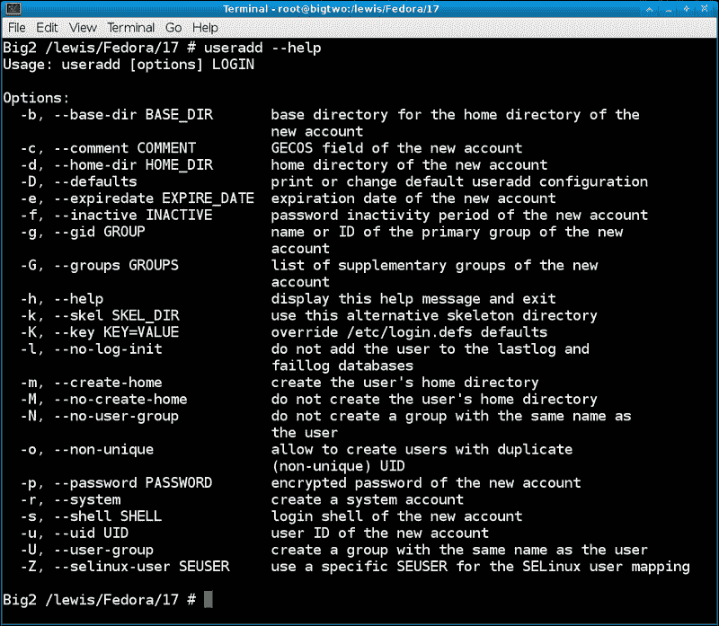
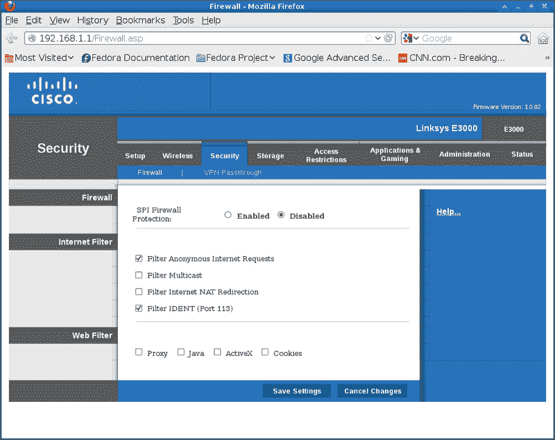
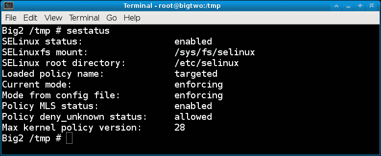
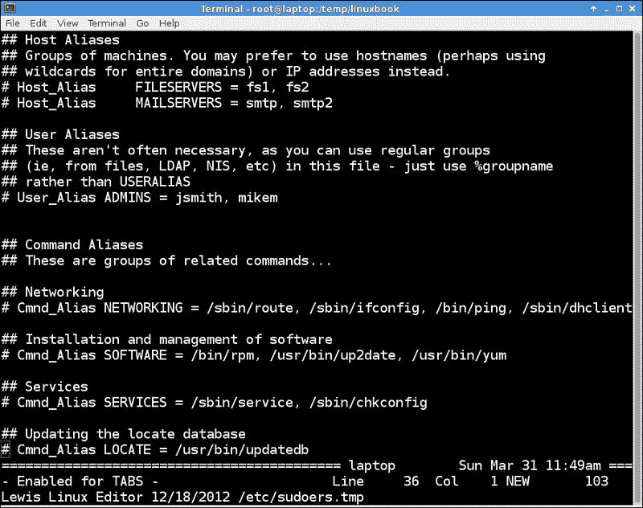

# 第五章：权限、访问和安全

在本章中，我们将涵盖：

+   创建和管理用户账户 - useradd

+   使用密码

+   处理文件权限

+   使用防火墙和路由器设置

+   使用安全 Linux **–** SELinux

+   使用 sudo 保护系统

+   /tmp 目录

# 介绍

这一章将作为对 Linux 文件权限的简要回顾，并介绍密码系统处理机器访问的方式。它还将展示如何使用防火墙和路由器中的安全功能，并提到 SELinux 和 sudo。

# 创建和管理用户账户 - useradd

在这一节中，我们将向您展示如何使用`useradd`程序添加用户账户。

## 准备工作

这些命令不应该对你的系统造成破坏；然而，你需要以 root 用户身份执行。

### 注意

在大多数 Linux 发行版中，有两个版本的这个命令，`useradd`和`adduser`。它们并不总是做同样的事情，所以请查阅你的`man`页面（和/或`file`命令）以确保你运行的是正确的命令。在 Fedora 中，`adduser`是`useradd`的符号链接，因此它们是等效的。

## 如何做...

在这里，我们将运行`useradd`命令来添加一个用户，然后使用`passwd`命令来设置密码。在下一节中将更多讨论`passwd`。

1.  首先，我们将更改`/etc/passwd`，所以让我们先备份一份。运行以下命令：`cp /etc/passwd /tmp/passwd.orig`

1.  现在让我们创建一个名为`test1`的用户：

```
useradd test1

```

1.  它应该悄无声息地返回到命令行。现在让我们试一下：

```
su  -  test1

```

1.  你应该看到提示发生了变化。运行`whoami`，它应该会显示`test1`。确保每次使用`su`时都运行这个命令。现在让我们更改密码：

```
run 
passwd

```

1.  它会说类似于**Changing password for user test1**。但然后它会提示输入当前密码。这是什么意思？它想要什么密码？

1.  我真的不知道答案，而且**man**页面也没用。它们总是跳过这一步，这相当奇怪。有一些使用加密功能和其他复杂程序的方法。然而，以下是我的方法：

1.  按下*Ctrl + C*退出`passwd`命令，并运行`exit`返回到 root 账户。现在编辑`/etc/passwd`并转到底部一行。`1003`下面的内容在你的系统上可能会有所不同，但你应该看到类似于这样的一行：

```
test1:x:1003:1003::/home/test1:/bin/bash

```

1.  删除`x`，这样这一行看起来就像这样：

```
test1::1003:1003::/home/test1:/bin/bash

```

1.  保存文件并退出。如果出现权限错误，请记住你必须以 root 用户身份执行此过程。

1.  现在运行`su`再次成为`test1`用户：

```
su – test1

```

1.  运行`passwd`。

1.  嘿，很酷，这次没有要求输入当前密码。所以现在可以创建一个密码，因为我们真的不想在系统上留下一个开放的账户。如果你打算保留这个账户，我建议你把这个密码写下来，或者更好地把它放到一个加密文件中的安全位置。

1.  两次输入相同的新密码后，你应该会收到类似的消息：

```
passwd: all authentication tokens updated successfully

```

现在我们有了一个新用户。请注意，一般来说，这个用户可以在命令行上执行大部分他有适当权限的活动。然而，根据 Linux 发行版的不同，用户可能无法访问所有资源（例如声音系统）。

这是我在我的 Fedora 17 系统上使用`useradd --help`命令得到的截图：



## 还有更多...

`useradd`命令不仅可以创建新账户，还可以做很多其他事情。你可以更改现有账户的工作方式，或者设置过期时间。你甚至可以给用户系统权限，使他几乎拥有 root 用户一样的权限。请参阅 man 页面或使用`--help`选项获取更多信息。

# 使用密码

我在前面的步骤中提到了`passwd`命令。它用于更新用户的身份验证令牌。你需要以 root 用户身份执行此示例。我们将使用上一节中创建的`test1`用户。

## 如何做...

让我们稍微使用一下`passwd`命令：

1.  从用户帐户登录到`test1`，以确保仍然按预期工作：

```
su - test1

```

1.  在提示时输入密码。这应该可以正常工作，没有错误。

1.  现在让我们锁定此帐户。退出到根目录并运行：

```
passwd -l test1

```

1.  从用户帐户运行`su - test1`并再次输入密码。它应该失败。

1.  返回到根目录，并使用命令`passwd -u test1`解锁帐户。再次登录以确保它有效。

1.  现在让我们使帐户过期。这将强制用户创建新密码。作为 root 运行以下命令：

```
passwd -e test1

```

1.  现在作为访客用户，使用命令`su - test1`登录`test1`。输入密码。

1.  您将被要求创建新密码。在这里要小心，因为您必须再次输入旧（当前）密码，然后两次输入新密码。是的，似乎很奇怪，我们必须再次输入旧密码，因为我们刚刚这样做了。

1.  请注意，您可以通过运行`passwd -d test1`删除用户帐户的密码。这比直接编辑`/etc/passwd`文件更容易，就像我们在上一节中所做的那样。

## 还有更多…

您可以在用户帐户上设置很多其他内容。这些包括帐户保持活动的时间以及何时开始警告用户更改其密码。有关更多信息，请参阅 man 页面。

### 注意

**关于密码的一些话**

在过去，我们会选择一个相对简单的密码并永远保留它。我们不需要一直更改它，并且可以将其用于一切，因此不需要将其写下来。不幸的是，现在情况已经改变。密码通常需要是大写字母，数字，甚至特殊字符的组合。它们的长度也必须更长。您不能总是将它们用于一切，因为一个系统上的密码规则可能与另一个系统上的规则不同。出于这些原因，我建议在合理的情况下为每个帐户使用不同的密码，并将其记录在安全的地方。您很可能需要定期更改此密码。

# 处理文件权限

由于 Linux 被设计为多用户操作系统，每个文件都有与之关联的文件权限和所有权。这是为了防止一个用户覆盖另一个用户的文件（无论是有意还是无意）。根用户可以（通常）访问系统中的每个文件。

## 做好准备

以下是基本文件系统权限的快速回顾。在本例中，假定`umask`设置为`0022`。运行`umask`以确保。

观察我的备份脚本 b 的以下`ls -la`列表：

```
-rwxr-xr-x. 1 guest1 root 559 Mar 28 12:43 b

```

从左边开始，第一个位置表示这是什么类型的文件。如所示的`-`表示这是一个常规文件。`d`表示目录，`l`表示链接。接下来的三组三个字母是文件权限，可以用符号模式或数字模式引用。我们将使用数字（八进制）模式。

前三组`rwx`是此文件所有者（`guest1`）的设置。接下来的三个`r-x`是组（`root`）的设置。第三组是所有其他人的设置。`r`表示文件可读，`w`表示可写，`x`表示可执行。

`chmod`命令接受一个到四个八进制数字。如果缺少一个数字，则假定为前导零。第一个数字设置用户 ID，组 ID 或粘性位。第二个数字选择此用户的权限，第三个数字选择其他用户的权限。

现在让我们更改临时文件的一些权限，看看会发生什么。

## 如何做…

让我们处理一些文件权限：

1.  让我们使用以下命令切换到`/tmp`目录：

```
 cd  /tmp

```

1.  如果文件`f1`存在，请使用以下命令删除它：

```
rmf1

```

1.  使用访客帐户（在我的情况下是`jklewis`）使用以下命令创建临时文件：

```
ls>f1

```

1.  现在运行以下命令：

```
ls -al f1

```

1.  它应该显示类似以下输出：

```
-rw-rw-r--. 1 jklewisjklewis 131 Mar 29 10:35 f1

```

1.  这些是基于`umask`命令的默认权限。这表明所有者和组具有读取和写入权限，其他用户只有读取权限。

1.  那么我们如何更改这些？通过使用`chmod`命令。假设这是一个脚本，我们想要使其可执行。运行以下命令：

```
chmod 775  f1

```

1.  现在运行`ls -la f1`；它现在应该看起来像以下输出：

```
-rwxrwxr-x. 1 jklewisjklewis 131 Mar 29 10:35 f1

```

1.  这些`x`表示每个用户都可以运行该文件。我们再做一个。运行`chmod 000 f1`，然后运行`ls -la f1`，它将显示以下输出：

```
----------. 1 jklewisjklewis 131 Mar 29 10:35 f1

```

哇！现在没有人能够对这个文件做任何事情了，对吧？嗯，不，文件的所有者仍然可以更改权限。说到所有权，`chown`命令用于更改该字段。通常以 root 用户身份运行。

## 还有更多...

我没有提到`setuid`、`setgid`或`sticky`位。请参考`chmod`手册页了解这些设置的信息。受限删除位在* /tmp 目录*部分中提到。

# 使用防火墙和路由器设置

防火墙用于防止未经授权的网络访问到一台或多台机器，同时仍然允许正常（或合法）的流量通过。`iptables`命令用于设置、配置和查看内核中 IPv4 规则的表。它有点复杂，因此这只是一个简单的概述。

`iptables`使用一个或多个表。每个表都有一些预定义的链，并且还可以包含用户创建的链。链是规则的列表，规则指定匹配的数据包应该执行什么操作。这种“匹配”称为**目标**。

当数据包不匹配时，将查看链中的下一个规则。如果匹配，可以为数据包指定以下内容之一：

+   `ACCEPT`：它允许数据包通过

+   `DROP`：它拒绝了数据包

+   `QUEUE`：它将数据包传递到用户空间

+   `RETURN`：它停止此链的运行，并在调用链中的下一个规则处继续

## 如何做到...

以下是一些`iptable`命令。不要在您的系统上运行这些命令；这只是一个示例：

1.  要删除所有现有规则，请使用以下命令：

```
iptables -F

```

1.  要阻止特定的 IP 地址，请使用以下命令：

```
iptables  -A INPUT -s 192.168.1.115  -j DROP

```

1.  要允许环回访问，请使用以下命令：

```
iptables -A INPUT -i lo -j ACCEPT
iptables -A OUTPUT -o lo -j ACCEPT

```

现在让我们谈谈路由器。大多数路由器都内置了防火墙，可以通过 Web 浏览器进行管理。虽然它不能取代`iptables`，但通常更容易配置，并且可以在整个网络中工作。

典型家用路由器的网页通常具有`192.168.1.1`地址。现在在浏览器中尝试一下。

这是我在**安全**页面上的路由器的屏幕截图：



您可能需要输入 ID 和密码。如果您尚未更改它们，请参考路由器文档中的默认值。转到**安全**（或等效）选项卡以访问这些功能。

## 还有更多...

`iptables`还有很多内容，足以填满一本整书。有关更多信息，请参考手册页或防火墙书籍。还有一些关于这个主题的很好的网站。

# 使用安全 Linux - SELinux

本节将作为**安全增强型 Linux**（**SELinux**）的概述。在*使用文件权限*部分，我们讨论了标准 Linux 如何为系统提供保护。这种方法称为**自主访问控制**（**DAC**），并且有一些限制。例如，典型用户可以无意或有意地打开他的文件，以便其他用户读取或写入。这可能允许未经授权的访问敏感信息。为了提供更多安全性，SELinux 使用**MAC**（**强制访问控制**）。MAC 使用覆盖系统中所有进程和文件的安全策略。SELinux 中的所有文件都具有包含安全相关信息的标签。

例如，以下是 DAC 下文件的正常列表：

```
ls -la ifcfg-eth0
-rw-r--r--. 1 root root 73 Apr 22  2011 ifcfg-eth0

```

相同的文件，但使用`ls`的 Z（安全上下文）选项：

```
ls -Z ifcfg-eth0
-rw-r--r--. root root unconfined_u:object_r:default_t:s0ifcfg-eth0

```

`unconfined_u`是用户，`object_r`是角色，`default_t`是类型，`s0`是级别。这些信息用于进行访问控制决策。请注意，首先检查正常的 DAC 规则，如果它们不允许操作，则不使用 SELinux 规则。

## 准备工作

我们只会以 root 身份运行一些命令并查看一些设置。我们不会对配置进行任何更改。本示例将假定您已经在 Enforcing 模式下运行 SELinux。要确定是否如此，请运行`sestatus`命令。输出应类似于以下屏幕截图



## 如何做...

好的，让我们运行一些 SELinux 命令。

1.  运行`getenforce`；它应该报告 enforcing。

1.  现在让我们查看映射列表：

```
semanage login -l

```

1.  要查看进程的 SELinux 上下文，请运行以下命令：

```
ps –eZ

```

1.  要查看用户的上下文，请运行以下命令：

```
id –Z

```

1.  当发生错误时，使用`sealert`命令查看完整的 SELinux 消息。检查您的`/var/log/messages`文件，看看是否生成了任何警报，如果有，可以运行`sealert -l`查看详细信息。

1.  要获取带有描述的 SELinux 布尔值的详细列表，请运行以下命令：

```
semanage boolean –l

```

1.  要查看列表但不包括描述，请运行以下命令：

```
getsebool –a

```

1.  要检查文件和目录是否具有正确的 SELinux 上下文，请运行以下命令：

```
matchpathcon

```

## 还有更多...

正如我提到的，SELinux 通常默认安装在大多数发行版中。在某些情况下，您甚至可能没有意识到它的存在。但是，有时它会妨碍您。例如，如果您尝试安装服务，比如`vsftpd`，可能会失败，因为它会违反 SELinux 策略。通常会弹出一个相当不错的错误消息。该消息甚至可能告诉您如何解决问题，但是在实践中，我发现它不起作用。您执行它给出的操作，似乎没有错误，但是访问仍然被拒绝。在这些情况下，我使用`setenforce`命令将 SELinux 置于 Permissive 模式，然后继续我的活动：

```
setenforce 0

```

请注意，这只在下次重启之前有效。

有关 SELinux 的更多信息，请参阅 Fedora 网站上的一份相当出色的指南。

# 使用 sudo 来保护系统

有时，特别是作为系统管理员，您可能希望给用户更多对计算机的访问权限，但实际上不是 root 权限。这可以通过修改`/etc/sudoers`文件并让用户调用`sudo`命令来实现。

## 准备工作...

以下步骤不应损害您的系统。我们将使用上面创建的用户帐户执行这些步骤。您需要成为 root 用户才能执行此部分。

## 如何做...

在这里，我们将使用`/etc/sudoers`文件：

1.  备份你的`/etc/sudoers 文件`**：**

```
cp /etc/sudoers /tmp/sudoers.orig

```

1.  您不直接编辑此文件，而是使用`visudo`命令。如果需要，任何文本编辑器都可以使用。如果需要，设置变量然后运行命令：

```
visudo

```

1.  这个命令会创建一个`sudoers`文件的临时副本并对其进行编辑。如果一切顺利，完成后会将临时文件复制到原始文件上。所以，让我们来看看这个文件。

1.  阅读别名部分。它们被分成组，用于诸如**网络、软件、服务、locate**等的事物。现在让我们跳进来看看这是如何工作的。

1.  但首先让我们尝试一些东西。以 guest 用户身份打开另一个会话。我将使用我的`jklewis`帐户。

1.  在`jklewis`帐户下键入以下命令：

```
cd /tmp

```

1.  使用以下命令创建一个文件：

```
ls>f1

```

1.  现在尝试将该文件复制到`/usr/bin`：

```
cp f1 /usr/bin

```

1.  您应该收到一个错误。这当然是正确的，普通用户通常不能写入`/usr/bin`目录。现在返回到您的`visudo`会话。

1.  您将需要您机器的主机名。在本示例中，我们将使用数字 IP。如果需要，您可以从`ifconfig`命令中获取它。

1.  就在提到关闭命令的行之后，我们将为我们的访客用户添加一行。语法是用户名、主机名、命令和选项，因此添加以下行：

```
jklewis  192.168.1.115=(ALL)  ALL

```

1.  保存文件并关闭`visudo`会话。现在再次尝试此命令。仍然在`/tmp`目录中运行`cpf1 /usr/bin`。它应该仍然显示错误消息。现在尝试以下命令：

```
sudo cp f1 /usr/bin

```

1.  啊，它要求输入密码，对吧？是的，它要求用户的密码，而不是 root 的密码。这可能很容易混淆（至少对我来说是这样）。记住的最好方法是，你可能不应该知道 root 密码是什么。输入你的密码。

1.  如果这是该用户第一次使用`sudo`，可能会弹出一个有趣的通知。阅读并理解它，以避免系统管理员的愤怒。

1.  在所有这些之后，这次命令应该可以无错误地进行。很酷，对吧？由于我们在`sudoers`文件中添加的行中使用了`ALL`，它实际上已经给予了这个用户完全访问权限。请注意，有些事情仍然不会工作得一样，例如重定向。

1.  好吧，我们可能真的不希望这个`jklewis`混蛋搞乱我们的系统，所以让我们稍微微调一下。再次运行`visudo`。

1.  向下滚动或搜索**进程**。通过删除`#`标记取消注释`# Cmnd_Alias PROCESSES`行。

1.  再次向下滚动到我们之前添加的`jklewis`行。将其更改为：

```
jklewis  192.168.1.115=(ALL) PROCESSES

```

1.  现在我们需要一个要终止的进程。以 root 身份启动一个`vi`会话。类似`vi mybook`的东西会起作用。

1.  在您的用户会话中运行`psauxw | grep”vi mybook”`并记住进程号（**PID**）。

1.  还在您的用户会话中运行`kill -9`上面的 PID。它会出错。现在再次运行，但使用以下命令：

```
sudo kill -9 <pid>

```

1.  应该终止`vi`进程。

### 提示

如果屏幕保持蓝色或其他颜色，只需运行`ls 命令`。那应该解决问题。

以下是我的`/etc/sudoers`文件的屏幕截图：



## 还有更多...

您可以从`sudoers`文件中看到，可以对其进行很多微调。用户可以被赋予非常少的额外权限，或者非常多的权限。有关更多信息，请运行`man sudoers`。

这是我对`sudo`的两分钱。有许多计算机用户可以信任以 root 身份运行而不会损害系统。但也有例外。如果您设置了`sudo`，您可能会花很多时间尝试使其完美，只能发现您总是不得不添加更多内容。您的用户会因为无法进行更改而感到沮丧。然后，当您认为最终已经完美无缺时，有人使用`sudo`，仍然会搞砸并严重搞砸。根据我的经验，如果用户犯了这个错误一次，他会一次又一次地犯。

# `/tmp`目录

`/tmp`目录在某种程度上是特殊的，因为默认情况下允许所有用户向其中写入文件。这是我系统上`/tmp`的列表：

```
drwxrwxrwt.  10 root    root      4096 Mar 31 03:48 tmp

```

您可以看到这是对所有人开放的。权限中的`t`表示目录上设置了受限删除位。那么这实际上意味着什么呢？对于目录，它防止普通用户删除或重命名他们没有适当权限的目录中的文件。

作为普通用户，当写入`/tmp`时仍然需要小心，因为有一些限制。

## 如何做...

让我们尝试一些事情，以了解`/tmp`的工作原理：

1.  运行以下命令：

```
cd /tmp

```

1.  如果有任何早期部分留下的临时`.txt`文件，请清理它们；`rm *.txt`文件应该可以做到。

1.  现在运行以下命令：

```
ls>root1.txt

```

1.  在另一个会话中，作为一个访客用户（我将使用`jklewis`），运行以下命令：

```
cd /tmp

```

1.  运行以下命令：

```
ls>jklewis.txt

```

1.  这应该可以无错误地工作。现在尝试：

```
 ls>root1.txt

```

1.  您应该收到**权限被拒绝**的错误。为什么？因为即使普通用户都可以写入`/tmp`目录，但仍必须遵循正常文件系统（DAC）权限。

## 还有更多...

基于上述原因，我建议除了真正临时的文件之外，不要在`/tmp`目录中使用任何东西。此外，大多数发行版会定期清理`/tmp`，因此任何不属于 root 用户的文件都将被删除。在生成临时文件时请记住所有这些，特别是在编写脚本时（更多内容请参见第八章，“脚本处理”）。
