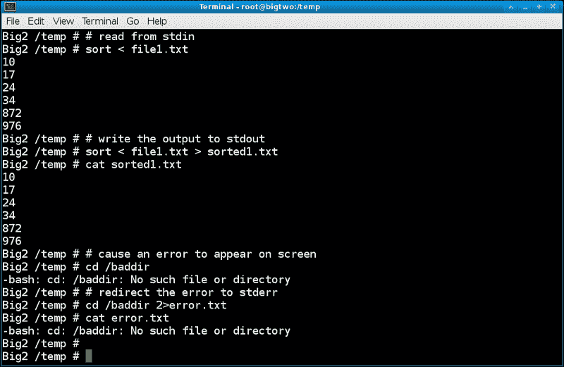
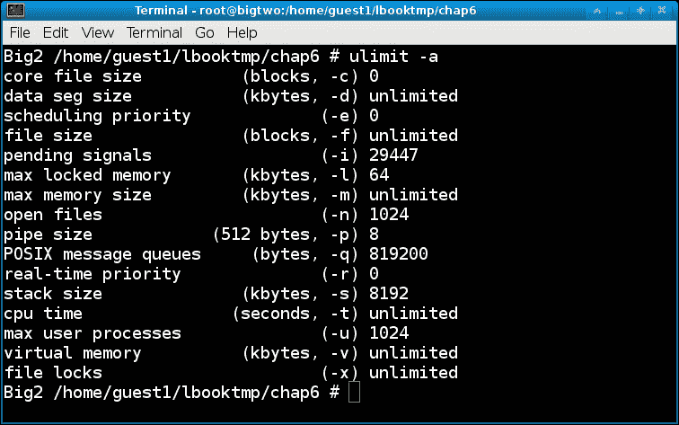
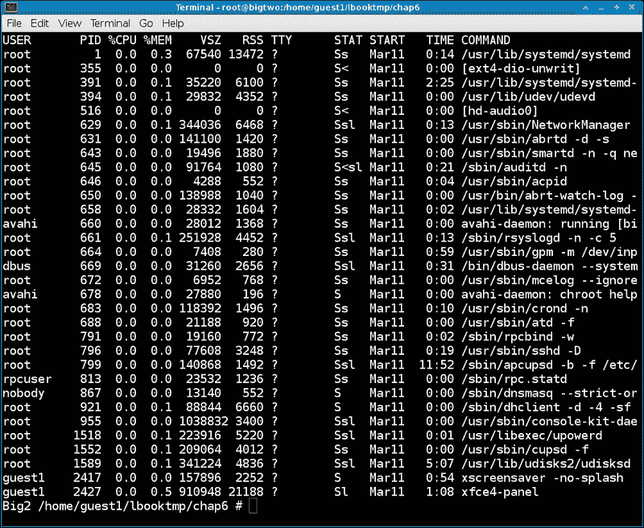
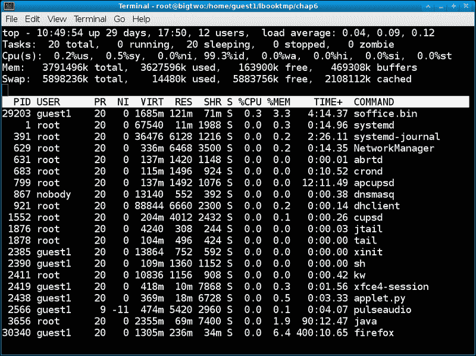
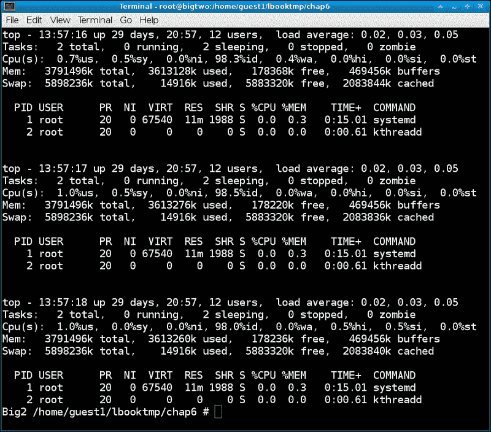
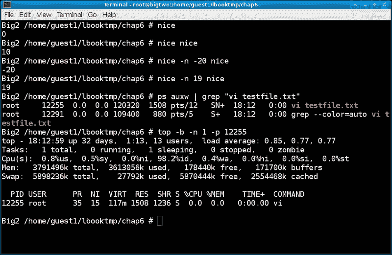
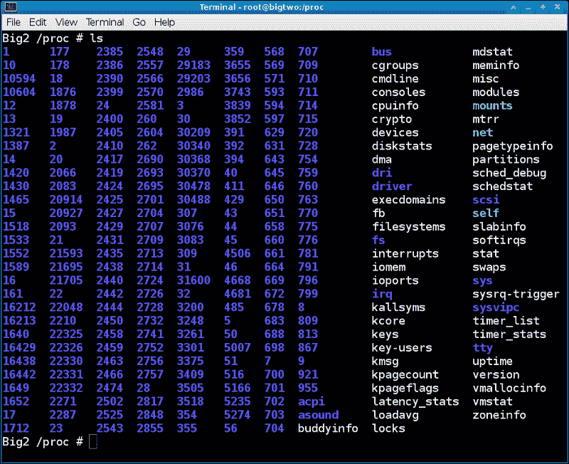
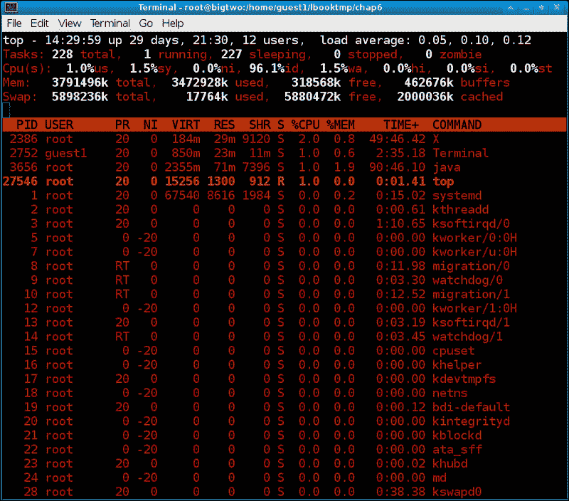

# 第六章：进程

在本章中，我们将涵盖以下主题：

+   理解进程

+   使用 ps 检查进程

+   使用 top 检查进程

+   使用 nice 更改优先级

+   使用/proc 文件系统观察进程

# 介绍

在 Linux 中运行的所有程序都是进程。在本章中，您将学习如何使用 ps 和 top 查看它们的状态，如何设置它们运行的优先级，以及如何使用/proc 文件系统查看进程的内部。

# 理解进程

每个进程都有一个称为**进程标识符**（**PID**）的唯一标识符。此外，每个进程都有一个**父进程标识符**（**PPID**）。有一个例外，即`init`（或`systemd`）。`init`进程启动所有其他进程，并具有 PID 为 1。该进程很特殊，因为它无法被终止（任何尝试这样做通常都是致命的）。

与文件类似，进程也具有访问权限。这些被称为真实用户和组 ID。这通过不允许非特权用户访问关键操作系统任务来提供一定程度的保护。内存、打开的文件和其他资源由进程拥有，并与其他进程（在大多数情况下）分开。

从用户的角度来看，进程通常是从命令行或桌面启动的。例如，使用`vi`编辑文件。用户启动会话并与编辑器进行交互。他可以保存文件或编辑其他文件。只要会话处于活动状态，就会有一个 PID 与之关联。当用户终止`vi`时，PID 和所有相关资源也将终止。该 PID 将被回收并稍后由操作系统再次使用。以这种方式运行的程序称为前台进程。

进程也可以在后台运行。例如，在第四章中，*网络和互联网*，我们使用`firefox &`命令运行浏览器。&符号将进程放入后台，释放该终端以进行更多的输入/输出。请注意，应用程序（例如此示例中的 Firefox）发出的消息仍将输出到该终端。在调试时，这真的很有帮助。还要注意，后台运行的进程往往以比前台任务更低的优先级运行（稍后会详细介绍优先级）。在旧时代，后台进程通常也被称为作业。

每个进程都有一些特殊的文件句柄：

+   **标准输入**（`stdin`）：进程从此处获取其正常输入（句柄 0）

+   **标准输出**（`stdout`）：进程将其正常输出写入此处（句柄 1）

+   **标准错误**（`stderr`）：进程将其错误输出写入此处（句柄 2）

以下是显示标准句柄的屏幕截图：



由进程打开的其他文件从句柄 3 开始。有一些进程被赋予特殊名称。例如，Linux 系统上的许多进程在后台运行，并且在大多数情况下，从不打算从命令行运行。这些被称为服务或守护进程。**超文本传输协议守护进程**（**HTTPD**）Web 进程是服务的一个很好的例子。

通常，服务会等待事件发生，执行一个或多个操作，然后再次等待。如果服务记录任何活动，通常会记录到`/var/log/<service-name>`目录。

### 注意

如果启动后台作业的终端被终止，后台作业也将结束。一些 Linux 发行版将尝试警告用户此条件。

## 如何做…

以下是可以用来查看进程的命令的简要列表：

+   要查看当前在系统上运行的进程的快照：

```
ps auxw

```

+   要实时查看进程，请运行：

```
top

```

+   要查看所有类型的进程目录：

```
ls /proc

```

## 还有更多...

一个进程可以衍生出其他进程。它也可以衍生出线程。线程继承父进程的所有句柄和资源。通常在编程中用于同时执行一个小任务，而主任务正在运行，并且快速返回。

资源有限制吗？是的。`ulimit`命令用于查看和设置进程的硬限制和软限制。通常用户不需要它；但是，如果您好奇，可以在您的系统上运行`ulimit -a`。您应该看到类似以下截图的输出：



有关`ulimit`的更多信息，请参阅 man 页面。

# 使用 ps 检查进程

`ps`程序允许用户查看系统上运行的进程的快照。通过使用适当的参数，输出可以更改以包含更多或更少的信息。在本节中，我们将以 root 身份运行，并使用 BSD 风格的`ps`。选项可以分组，不使用破折号。

## 如何做...

执行以下步骤来运行`ps`：

1.  只运行`ps`而不带任何参数会得到以下类似的输出：

```
 Big4 /temp/linuxbook/chap6 # ps
 PID TTY          TIME CMD
 5197 pts/25   00:00:00 su
 5218 pts/25   00:00:00 bash
 17789 pts/25   00:00:00 ps

```

1.  由于这并不是非常具有信息性，让我们显示每个具有 TTY 的进程：

```
ps a

```

1.  现在，包括那些没有 TTY 的进程：

```
ps ax

```

1.  以更加用户友好的格式显示输出：`ps aux`。注意标题的变化。

1.  如果在您的系统上行被截断了，可以使用以下命令添加宽选项：

```
ps auxw

```

1.  输出确实很多。以下是一些处理它的想法：

```
ps auxw | more

```

1.  您也可以将输出重定向到文件：`ps auxw > ps-output.txt`，然后使用`more`或`vi`查看它。

1.  您也可以使用`grep`来查找特定的进程 ID。在另一个终端中，运行以下命令：

```
vi file1.txt

```

1.  现在回到您的原始终端，运行以下命令：

```
ps auxw | grep file1.txt

```

1.  您应该看到一行包含文本`vi file1.txt`。这就是您要找的 PID，也是`ps`的最常见用途之一。

1.  您还可以显示进程的树状视图：

```
pstree

```

## 工作原理...

`ps`命令从`/proc`文件系统获取信息。每个运行的进程都有一个相关的条目。我们将在本章后面更详细地讨论`/proc`。

## 还有更多...

BSD 风格的标题将类似于以下内容：

```
USER       PID %CPU %MEM    VSZ   RSS TTY      STAT START   TIME COMMAND

```

每个术语的定义如下：

+   `USER`：它是进程的所有者

+   `PID`：它是进程标识符

+   `%CPU`：它给出了 CPU 时间除以进程运行时间的比例

+   `%MEM`：它给出了进程内存与物理内存的比例

+   `VSZ`：它包含了进程的虚拟内存大小

+   `RSS`：它包含了实际内存驻留集大小

+   `TTY`：它表示与该进程关联的终端

+   `STAT`：它表示进程的状态

+   `START`：它给出了进程启动的时间

+   `TIME`：它给出了总 CPU 时间

+   `COMMAND`：它是命令的名称

`ps`命令还有很多其他选项。您可以查看线程，获取安全（`SELinux`）信息，通过用户名紧缩显示内容，并更改输出格式。您甚至可以修改一些环境变量以改变`ps`的工作方式。请参阅 man 页面以获取更多信息。

以下截图展示了在我的 Fedora 17 系统上`ps - auxw`的样子：



# 使用 top 检查进程

`top`程序类似于`ps`，只是它实时显示系统的状态。您可以使用命令行开关和/或其交互式界面来控制其操作。它还可以使用配置文件。您可以通过`top`做很多事情。以下是一些可能的示例。

## 准备就绪

不需要特殊设置。这些命令将以 root 身份运行。

要获取`top`的帮助，可以运行以下命令行：

```
 top -h or -v

```

这些是等效的，并显示库版本和用法。

`top`的一般语法如下：

```
 top -bcHisS -d delay -n iterations -p pid [,pid...]

```

以下是在 Fedora 17 上运行`top`的截图：



## 如何做...

以下是使用命令行开关的一些示例：

1.  每 2 秒更新一次屏幕：

```
top -d 2

```

1.  每半秒更新一次屏幕：

```
top -d 0.5

```

1.  要更新 10 次然后退出：

```
top -n 10

```

1.  要同时执行两者：

```
top -d 0.5 -n 10

```

1.  要立即更新屏幕，请按空格键或*Enter*。

1.  要监视特定的 PID，请使用`-p`选项。这将显示`init`（或`systemd`）进程：

```
top -p 1

```

1.  让我们监视一些进程。首先运行`ps auxw`，并记住四个进程的 PID。

1.  然后运行`top`，用之前获得的 PID 替换：

```
top -p pid1,pid2,pid3,pid4

```

1.  要省略显示空闲进程，请运行以下命令：

```
top -i

```

1.  要显示线程，请运行`top -H`。要仅监视特定用户的进程，语法是`top -u <username>`。尝试使用 root：

```
top -u root

```

1.  你可以以批处理模式运行`top`。例如，要将输出保存到文件中：

```
top -b -n 10 > top1.txt

```

以下是使用交互命令的一些示例。启动`top`并跟随操作：

1.  要仅显示特定用户（此示例中为 root）拥有的进程，请按`U`，然后输入`root`。

1.  要更改延迟时间，请按`D`，然后按*1*输入时间。

1.  要显示多核机器上的所有 CPU，请按*1*（再次按*1*切换回来）。

1.  要切换显示命令行与程序名称，请按*C*。

1.  要更改进程的 nice 设置，请按*R*，然后输入所需的优先级。

1.  要激活安全模式，请按*S*（之后查看安全模式的解释）。

1.  要向进程发送信号，请按*K*，然后输入要发送的信号。在执行此操作之前，请确保您有正确的 PID 和信号。

1.  要写入配置文件，请按`W`。这将在用户的主目录中创建文件`.toprc`，并在下次启动`top`时使用其中的设置。

1.  要显示帮助屏幕，请按*H*。

1.  要退出 top，请按*Q*。

## 它是如何工作的...

以下是前一张截图中显示的前五行的描述：

+   `top`：它包含了当天的时间、机器的运行时间、用户数量和平均负载

+   `Tasks`：它给出了总任务数、当前运行、睡眠、停止和僵尸的数量

+   `Cpu(s)`：不同类型的 CPU 状态如下：

+   **us**：它代表用户时间

+   **sy**：它代表系统时间

+   **ni**：它代表了 nice 时间

+   **id**：它代表空闲时间

+   **wa**：它代表了 I/O 等待时间

+   **hi**：它给出了用于服务硬件中断的时间

+   **si**：它给出了用于服务软件中断的时间

+   **st**：它代表被窃取的 CPU 时间

+   `Mem`：它给出了机器上的总内存；已使用的、空闲的和缓冲区的大小（以 KB 为单位）

+   `Swap`：它给出了总交换空间；已使用的、空闲的和缓存的大小（以 KB 为单位）

以下是标准标题的定义。请注意，这些可能会根据命令行选项或交互命令而更改：

+   `PID`：它定义了进程标识符

+   `USER`：它保存了此任务的所有者的用户名

+   `PR`：它保存了这个任务的优先级

+   `NI`：它包括 nice 值（下一节将更多介绍优先级）

+   `VIRT`：它展示了此任务使用的虚拟内存总量

+   `RES`：它给出了此任务使用的物理内存

+   `SHR`：它给出了此任务使用的共享内存

+   `S`：它代表进程状态，可能是以下之一：

+   **S**：它代表睡眠状态

+   **D**：它表示不可中断的睡眠状态

+   **R**：它表示进程正在运行（或准备运行）

+   **T**：它表示进程已被跟踪或停止

+   **Z**：它表示僵尸状态

+   `%CPU`：它给出了自上次更新以来经过的 CPU 时间的份额，以百分比表示

+   `%MEM`：它保存了当前使用的可用物理内存的份额，以百分比表示

+   `TIME+`：它给出了此任务自开始运行以来使用的总 CPU 时间

+   `COMMAND`：这是用来启动此任务的命令

## 还有更多...

除了用户配置文件外，还可以有一个全局文件。它的名字是`/etc/toprc`，包括以下两行：

```
S # Line 1: secure mode switch
2.0 # Line 2: delay in seconds

```

此文件是由 root 用户手动创建的。如果此文件存在，则会激活安全模式并更改`top`的操作方式：

+   显示了帮助屏幕的不同版本

+   用户无法终止任务

+   用户无法重新设置任务

+   用户无法更改`top`的延迟间隔

如果`top`似乎不按预期工作，请检查用户和 root 的配置文件是否存在。您可以使用`top`做很多其他事情。您可以更改字段的排列和排序方式。您可以更改颜色和突出显示。还有一个多窗口选项。有关更多信息，请参阅`top`的 man 页面。

以下是我在我的 Fedora 17 系统上的`top`的屏幕截图：



# 使用 nice 更改优先级

`nice`命令允许您调整进程运行的优先级。现代操作系统通常会很好地进行任务调度。但是，某个特定进程可能偶尔需要进行一些调整。在这里，我们将展示如何使用`nice`。

优先级称为 niceness 级别。进程可以具有的 niceness 范围从 19（最不利）到最大值-20（最有利）（如果这对您来说似乎是反向的，对我来说也是）。

最有利 ________________________ 最不利

20 __________________________________19

最高优先级 ________________________ 最低优先级

您可能还记得上一节关于`top`的 NI 列。这是 niceness 设置，在 Fedora 上，有几个服务以最有利的-20 设置运行。

请注意，更改进程的 niceness 设置并不保证操作系统会遵守它。这只是对调度程序的建议。

还要注意，给 nice 的命令不能是内置命令。

`nice`的语法如下：

```
 nice [Option]... [Command [Arg] ...]

```

## 如何做...

现在，让我们运行一些`nice`命令：

1.  要查看当前的 niceness 值，请单独运行 nice：

```
nice 

```

1.  现在在自身上运行 nice：

```
nice nice

```

1.  看到输出为 10 吗？如果没有给出默认调整，那就是默认值。

1.  现在将其设置为最大值：

```
nice -n -20 nice

```

1.  对于最小值：

```
nice -n 19 nice

```

1.  现在让我们尝试其他事情。在另一个终端中，运行以下命令：

```
nice -n 15 vi testfile.txt

```

1.  然后找到它的 PID：

```
ps auxw | grep testfile.txt

```

1.  现在在先前的 PID 上运行`top`：

```
top -p <pid>

```

1.  niceness 列（NI）应显示 15 的 niceness。

以下是显示在 Fedora 17 上运行`nice`的屏幕截图：



## 还有更多...

与大多数其他 Linux 程序不同，`nice`没有更多内容。如果您尝试将其设置为高于 20 的最大值，它仍将使用 20，如果您尝试将其设置为低于-19 的最小值，它将使用-19。此外，`top`程序允许您动态调整进程的 niceness 级别。

# 使用/proc 文件系统观察进程

`/proc`文件系统是 Linux 存储与当前运行的进程相关数据的地方。在大多数情况下，普通用户可能永远不需要（希望永远不需要）了解这些信息。但是，在调试期间或者只是想了解一些 Linux 内部情况时，这些信息可能会非常有帮助。

## 如何做...

以下步骤解释了如何查看`/proc`中包含的信息：

1.  让我们尝试在`/proc`中作为 root 运行一个实验：

```
file uptime

```

1.  它显示`uptime: empty`，对吧？因此，如果我们 cat 它，理想情况下应该没有输出，对吧？试试看：

```
cat uptime

```

1.  哇，那是怎么发生的？`/proc`中的文件很特殊，因为信息是实时从中读取的。让我们尝试一些更多的内容，并运行以下命令：

```
cat interrupts

```

1.  现在运行`cat version`和`cat meminfo`。

1.  在另一个会话中，运行以下命令：

```
vi test5.txt

```

1.  让我们找到它的 PID：

```
ps auxw | grep “vi test5.txt”

```

1.  更改到`/proc`中的目录：`cd /proc/<pid-from-above>`。

1.  现在将目录更改为**文件描述符**（**FD**）目录：

```
cd fd

```

1.  运行`ls -la`命令。您应该看到类似以下输出：

```
Big2 /proc/20879/fd # ls –la.
 total 0
 dr-x------. 2 root root  0 Apr 11 16:27 .
 dr-xr-xr-x. 8 root root  0 Apr 11 16:27 ..
 lrwx------. 1 root root 64 Apr 11 16:27 0 -> /dev/pts/10
 lrwx------. 1 root root 64 Apr 11 16:27 1 -> /dev/pts/10
 lrwx------. 1 root root 64 Apr 11 16:27 2 -> /dev/pts/10
 lrwx------. 1 root root 64 Apr 11 16:27 4 -> /tmp/.test5.txt.swp

```

您可以看到这确实是我们的`vi`编辑`test5.txt`文件的会话。请注意，显示的文件是由`vi`创建并在执行期间保持打开的临时文件。

## 还有更多...

以下截图显示了 Fedora 17 系统中`/proc`目录的列表：



那么这一切意味着什么呢？这些数字是，正如你可能已经猜到的，进程 ID。每个进程都会在这里有一个数字，实际上是包含了关于该进程的几乎所有你想知道的东西的目录。

以下是其中一些文件的用途。我没有列出每一个，但涵盖了我认为最有趣的那些：

+   `buddyinfo`: 它包含有关节点和内存的数据

+   `cgroups`: 它包含了有关 CPU 组的数据

+   `cmdline`: 它是启动进程时给出的命令行

+   `consoles`: 它提供了有关控制台的信息

+   `cpuinfo`: 它包含了你的系统中 CPU 的非常详细的列表

+   `crypto`: 它包含了系统中可用的加密例程的信息

+   `devices`: 它包含了设备的列表

+   `diskstats`: 它包含了磁盘统计信息的列表

+   `dma`: 它包含了 DMA 的列表

+   `filesystems`: 它提供了可用文件系统的列表

+   `interrupts`: 它包含了系统正在使用的中断的非常详细的列表

+   `iomem`: 它提供了 I/O 内存信息

+   `ioports`: 它提供了 I/O 端口的信息

+   `kallsyms`: 它包含了操作系统符号的列表

+   `kcore`: 它代表了这台机器的内存映像

+   `meminfo`: 它包含了系统内存使用情况的非常详细的列表

+   `modules`: 它包含了系统使用的模块的列表

+   `mounts`: 它包含了系统中已挂载的文件系统（真实和虚拟）的列表

+   `partitions`: 它包含了分区的列表

+   `slabinfo`: 它包含了一个 slab 内存对象的列表

+   `softirqs`: 这是另一个 IRQ 列表

+   `uptime`: 它提供了机器已经运行的时间（参见`uptime`命令）

+   `version`: 这是内核版本（参见`uname`命令）

+   `vmstat`: 它提供了虚拟内存统计信息

+   `zoneinfo`: 这是另一个相当详细的内存列表

除了少数例外，你可以使用 cat 命令查看大多数这些文件中的重要内部数据。注意，不要 cat（或对）`kcore`文件做任何操作。不要尝试编辑这些文件。另外，如果你 cat 一个文件，但似乎什么也没发生，按下*Ctrl*和*C*键应该让你退出。

使用 C 语言编写的程序可以利用`/proc`中的信息做一些非常酷的事情。例如，我开发了一段代码，可以让程序确定它是正常运行到屏幕上，还是被重定向到文件中。程序可以根据情况采取适当的行动，例如，如果正常运行，则清除屏幕，如果被重定向到文件，则不清除。这样，控制代码就不会嵌入到文件中。我还有另一段 C 代码，可以确定程序当前打开的任何文件的完整路径和文件名。

以下是`top`的另一个截图：



这是通过运行`top`然后按下*Z*键创建的。你可以对`top`进行相当多的自定义。查看 man 页面以获取更多信息。
