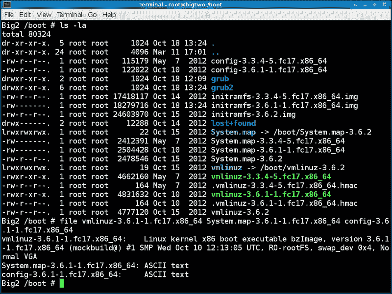
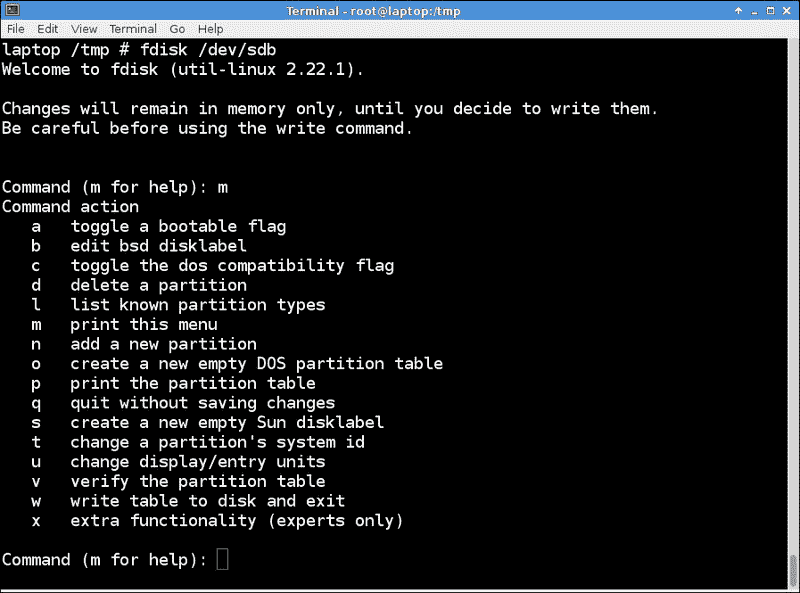
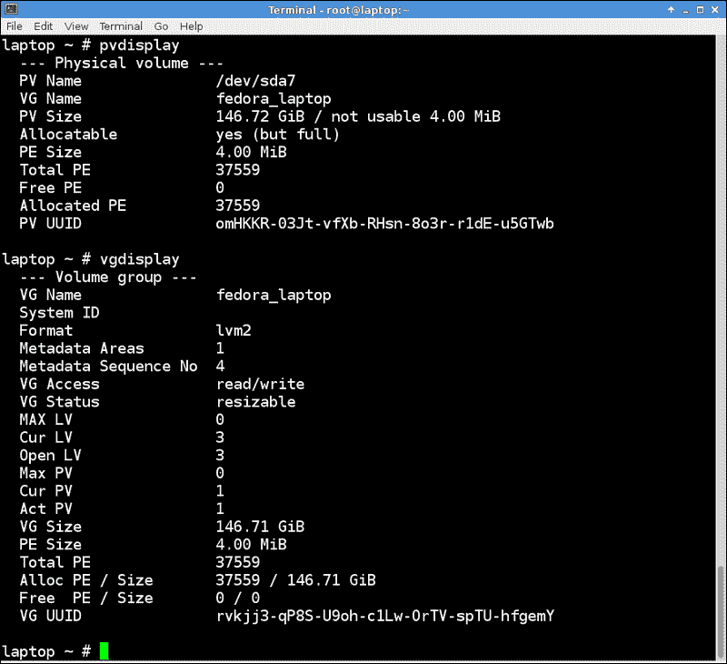

# 第七章：磁盘和分区

在本章中，我们将涵盖以下主题：

+   使用`fdisk`

+   使用`mkfs`格式化驱动器

+   使用`fsck`检查文件系统

+   逻辑卷管理（LVM）

# 介绍

在安装机器时，您可以采用默认设置或根据需要设置磁盘。以下是对分区和文件系统的简要回顾。典型的 Linux 系统通常至少有三个单独的分区。它们被标记为`/`，`/boot`和`swap`。`/`（发音为*root*）是目录结构的父目录。`/boot`是系统内核和映射文件所在的地方。当内存的部分需要移动到硬盘上时，将使用`swap`分区。这被称为因过度承诺而将内存部分*交换出*到磁盘上。

以下通常位于单独的分区上：

+   `/`：它是父目录

+   `/boot`：引导和映射文件位于此处

+   （交换）：它表示交换空间

以下传统上位于单独的分区上，但不一定要这样：

+   `/home`

+   `/tmp`

+   `/etc`

+   `/var`

以下是 Linux 系统上通常存在的文件系统和目录及其一般用途的部分列表。这是来自 Fedora 17 64 位的信息：

+   `/`：它是父目录。

+   `/boot`：引导、映射文件和系统内核都在其中。

+   （交换）：它代表交换空间。

+   `/root`：这是超级用户的主目录。

+   `/home`：用户目录放在这里（例如，`/home/guest1`，在本书中一直在使用）。

+   `/tmp`：这是一个具有文件删除位设置的目录。用户和各种其他程序可以将临时文件放在这里。由 root 运行的`cron`作业会定期清理`/tmp`（通常一周一次）。

+   `/usr`：它包括操作系统（OS）的父用户目录。

+   `/usr/bin`：它包含操作系统的可执行程序。

+   `/usr/etc`：它包含操作系统的配置文件。

+   `/usr/games`：它包括发行版提供的游戏。

+   `/usr/include`：它包括用于编程语言如 C 的文件。

+   `/usr/lib`：它包含操作系统的库文件。

+   `/usr/lib64`：它包括 64 位版本的操作系统库文件。

+   `/usr/local`：系统管理员可以将用户程序放在这里供其使用。

+   `/usr/sbin`：它包含系统使用的操作系统可执行程序。

+   `/usr/share`：它包括操作系统的共享程序和文件。

+   `/usr/src`：操作系统的内核源代码、包含和制作文件都放在这里

+   `/dev`：它代表设备目录。例如，`/dev/sda`设备指向第一个 SCSI 硬盘。

+   `/lib`：它是指向`/usr/lib`的符号链接。

+   `/lib64`：它是指向`/usr/lib64`的符号链接。

+   `/mnt`：它用作挂载点。

+   `/opt`：它代表可选文件。

+   `/var/logs`：它包括操作系统的日志。

+   `/var/spool`：它包含打印机文件。

+   `/var/run`：操作系统在此处保存运行中的程序的数据。

+   `/run`：它是指向`/var/run`的符号链接。

+   `lost+found`：这是操作系统用来跟踪文件系统数据的地方。

+   `/etc`：它的发音是*etcetera*，代表*其他所有东西*。配置文件通常位于此处。

不同类型的虚拟文件系统如下：

+   `/proc`：操作系统在此处跟踪进程。有关更多信息，请参阅上一章。

+   `/sys`：操作系统在此目录中跟踪其他进程。

以下是以下列表中定义的一些其他有用术语：

+   **设备**：它指的是整个磁盘。例如，第一个 SCSI 磁盘通常被命名为`/dev/sda`。

+   **分区**：它是设备名称后跟一个数字。第一个 SCSI 分区将是`/dev/sda1`。

+   **文件系统**：它定义了正在使用的文件系统类型。一些示例是`ext2`，`ext3`，`ext4`，`vfat`和`xfs`。

+   **挂载点**：它是指向分区的目录。`/etc/fstab`文件包含一个表，显示挂载点和它们关联的分区。这个文件是由系统安装程序（如 Anaconda）创建的，可以由超级用户手动编辑以添加或删除设备和挂载。

引导分区是操作系统内核和其他启动文件所在的位置。以下是在`/boot`中找到的文件的描述：

+   `vmlinuz`：它代表内核的符号链接。例如，在 Fedora 14 上，它指向`vmlinuz-2.6.35.6-45.fc14.x86_64`。

+   `initramfs`：它代表初始 RAM 磁盘。在 Fedora 14 上，它被命名为`initramfs-2.6.35.6-45.fc14.x86_64.img`。

+   `config`：此文件用于配置内核。我们将在第十章*内核*中看到更多内容。在 Fedora 14 上，它被命名为`config-2.6.35.6-45.fc14.x86_64`。

+   `map`：这是系统映射文件，其中包含对各种内核例程的入口点。在 Fedora 14 上，它被命名为`System.map-2.6.35.6-45.fc14.x86_64`。

初始 RAM 磁盘需要更多解释。该文件包含加载和运行内核所需的所有设备驱动程序。例如，内核需要访问硬盘才能启动。如果它需要特殊驱动程序（即，如果仅靠 BIOS 无法访问），则必须位于`initramfs`文件中，否则将无法完成该过程。`initramfs`文件是在系统安装期间创建的，并且可以由经验丰富的人修改。这通常在测试和/或使用新硬件时完成。这是一个压缩的`GZIP`文件，在启动时会被解压并放置在 RAM（内存）磁盘上。

以下是我 Fedora 17 系统上`/boot`和文件命令的快照：



`df`程序用于报告文件系统磁盘空间使用统计信息。以下输出是我 Fedora 14 系统上的`df -h`列表。`-h`参数将输出放入更易读的形式（在大型磁盘上很有用）：

```
Big4 ~ # df -h
Filesystem            Size  Used Avail Use% Mounted on
/dev/sda3              97G   48G   45G  52% /
tmpfs                 5.9G  780K  5.9G   1% /dev/shm
/dev/sda1             485M   51M  409M  12% /boot
/dev/sda2             385G  124G  242G  34% /data
/dev/sda5              49G  8.3G   38G  19% /lewis
/dev/sdf1             932G  243G  690G  27% /megadrive
/dev/sdg1             7.3G  3.1G  4.3G  42% /usb

```

第一列显示文件系统的分区。第二列显示分区的大小。第三列是已使用的量，后面是仍可用的量。`Use%`是使用的百分比，最后一列是挂载点。

此输出告诉您有关我如何设置此系统的许多信息。我没有为`/home`、`/tmp`、`/etc`或`/var`创建单独的分区。它们都在`/`下的同一分区中。我有所需的`/boot`分区，我将其大小设置得比默认值大，因为我经常构建新内核。还有一个单独的`/data`和`/lewis`分区。所有提到的分区都在`/dev/sda`设备上。那么`/dev/sdf1`和`/dev/sdg1`是什么设备和分区？第一个是 Iomega 外部 USB 驱动器，第二个是 8GB 的**通用串行总线**（**USB**）存储设备。这些用于备份，以防主要驱动器出现故障。

`fsck`程序用于检查和可选修复损坏的文件系统。它可以并行检查多个文件系统以加快处理速度。如果未给出参数，则`fsck`默认为检查`/etc/fstab`文件中的文件系统。

在使用分区时，必须记住目录挂载在哪里。例如，假设`/`上的空间变得紧张，因此您决定删除位于`/tmp`目录中的一些大文件。您首先需要确保`/tmp`确实挂载在`/`上，而不是在自己的分区上。很容易犯这个错误，所以要记住。如果您是许多设置不同的机器的系统管理员，这将更加成问题。

# 使用 fdisk

`fdisk`程序用于操作磁盘分区表。您可以使用此实用程序创建、修改和删除分区。

## 做好准备

只要不使用写入磁盘的操作，您可以按照这些命令进行操作。但是，为了安全起见，您可能希望使用 USB 存储设备或其他您不在乎的驱动器或系统。

交互式版本的`fdisk`的语法是`fdisk <device-name>`。我将使用一个 4GB 的 USB 存储设备，`/dev/sdb`作为这个例子。请记住，`fdisk`适用于整个设备，因此在启动命令时不使用分区号。我们将以 root 用户身份执行这些操作。

以下是 Fedora 18 上`fdisk`的屏幕截图：



## 如何做...

执行以下步骤来运行`fdisk`：

1.  通过在设备上运行`fdisk`来启动命令：

```
fdisk /dev/sdb

```

1.  显示帮助菜单：`输入 an m`。它会显示可以在此设备上执行的操作列表。

1.  显示分区表：`输入 a p`。将显示此设备上的分区列表。

1.  在我的 USB 存储设备的情况下，只有一个分区。所以让我们删除它：

```
enter a d

```

1.  由于只有一个分区，默认情况下已删除。现在让我们添加一个：

```
enter an n
```

1.  由于这是第一个分区，按`a p`键选择主分区。

1.  现在运行`输入 a 1`并采用默认的起始扇区。

1.  现在我们必须输入一个大小。这可以通过扇区号或大小来完成。让我们使用大小，将其设置为 1GB：

```
enter +1G

```

1.  再次运行`输入 a p`以查看我们有什么。您应该看到类似以下输出：

```
 Command (m for help): p
 Disk /dev/sdb: 4009 MB, 4009754624 bytes, 7831552 sectors
 Units = sectors of 1 * 512 = 512 bytes
 Sector size (logical/physical): 512 bytes / 512 bytes
 I/O size (minimum/optimal): 512 bytes / 512 bytes
 Disk identifier: 0xc3072e18
 Device Boot      Start         End      Blocks   Id  System
 /dev/sdb1            2048     2099199     1048576   83  Linux
 Command (m for help):

```

1.  看起来不错。现在让我们添加另一个，然后采用默认设置：

```
enter n, then p, then 2, and the default first sector

```

1.  这次让我们使用 2GB 的大小：

```
enter +2G

```

1.  查看它的样子：

```
enter a p

```

1.  现在表格应该显示两个分区。在这一点上，您可以继续创建更多分区，或者保存表格。如果您有所需的磁盘空间，随时可以稍后创建更多分区。

1.  在这个例子中，我们将不保存更改而退出：

```
enter a q

```

1.  为了确保没有出错，运行`fdisk /dev/sdb -l`来获取列表。它应该显示与我们开始时相同的内容。

## 还有更多...

您可能已经注意到`fdisk`帮助屏幕上提供了其他一些操作。您可以更改显示单位的方式，列出已知的分区类型，以及其他一些内容。有关更多信息，请参阅`fdisk man`页面。

# 使用 mkfs 格式化驱动器

`mkfs`命令在设备上构建文件系统（类似于格式化驱动器）。它确定文件系统类型并调用适当的`mkfs.<type>`程序。例如，如果您要运行`mkfs -t ext4 /dev/sdb5`，它实际上会运行`mkfs.ext4`程序。`mkfs`选项如下：

+   `-t`：指定所需的文件系统类型

+   `-V`：生成详细输出

+   `-V`：如果作为唯一参数使用，它会显示版本信息

+   `-h`：显示帮助屏幕

请注意，没有传递其他参数给文件系统的特定程序。还要注意，在某些情况下，需要提供大小值。

## 准备就绪

`mkfs`程序将销毁当前驻留在分区中的任何数据。因此，在继续此命令之前，请确保已备份所需的数据。一旦执行了此操作，就无法撤消。如果您想按照这些步骤操作，您应该先在一个您不在乎的 USB 存储设备或其他设备上练习。

在继续之前，请确保卸载分区。

## 如何做...

执行以下步骤来在 Linux 中格式化分区：

1.  在这个例子中，我插入了一个 USB 存储设备（我不在乎的一个）。为了确保我们有正确的设备，请运行`dmesg`并查看最后一行：

```
dmesg | tail -20

```

1.  在我的系统上，它显示设备是`/dev/sdh1`（根据您的设备进行替换）。它没有挂载，所以我准备好继续。但是，如果您的设备是自动挂载的，您应该能够通过运行以下命令卸载它：

```
umount /dev/sdh1

```

1.  请注意，以下命令将销毁设备上的任何数据。因此，在继续之前，请确保已备份要保留的任何数据！

1.  运行命令`mkfs -V -t vfat /dev/sdh1`。我的系统上显示以下输出：

```
Big2 /temp # mkfs -V -t vfat /dev/sdh1
mkfs (util-linux 2.21.2)
mkfs.vfat /dev/sdh1
mkfs.vfat 3.0.12 (29 Oct 2011)

```

1.  现在挂载设备：`mount /dev/sdh1 /usb2`（根据需要替换您的设备和挂载点）。

1.  运行`ls -la /usb2`。它应该看起来像以下输出：

```
Big2 /temp # ls -la /usb2
total 8
drwxr-xr-x.  2 root root 4096 Dec 31  1969 .
dr-xr-xr-x. 25 root root 4096 Jun  7 10:04 ..

```

这基本上就是`mkfs`的全部内容。在使用此命令时要非常小心，并在继续之前仔细检查一切。

# 使用 fsck 检查文件系统

为了检查和修复 Linux 文件系统，使用`fsck`程序。实际上，`fsck`只是文件系统特定检查器的前端（类似于`mkfs`）。

`fsck`程序可以并行运行在不同的文件系统上以加快处理速度。请注意，此功能可以在资源较低的机器上禁用。

一般来说，`fsck`的语法如下：

```
 fsck [-lsAVRTMNP] [-C [fd]] [-t fstype] [filesys...]  [--] [fs-specific-options]

```

## 准备工作

如果不正确使用`fsck`程序，可能会损坏当前驻留在分区上的数据。因此，在执行此命令之前，请确保已经备份了所有所需的数据。一旦执行了此操作，就无法撤销。如果您想要按照这些步骤操作，可以先在一个您不在乎的 USB 存储设备上练习。

在运行命令之前，设备必须被卸载。

## 如何操作...

执行以下步骤来检查和运行分区：

1.  在此示例中，我插入了一个我不太在乎的 USB 存储设备。为了确保我们有正确的设备，请运行`dmesg`并查看最后一行：

```
dmesg | tail -20

```

1.  在我的系统上，它显示设备是`/dev/sdh1`（相应地替换您的设备）。它没有挂载，所以我准备好继续。但是，如果您的设备是自动挂载的，您应该能够通过运行`umount /dev/sdh1`来卸载它。

1.  现在我们可以运行`fsck`程序。我首先想看看它将采取什么行动，因此将使用`-N`选项。运行`fsck -N /dev/sdh1`。在我的系统上显示以下输出：

```
Big2 /home/guest1 # fsck -N /dev/sdh1
fsck from util-linux 2.21.2
[/sbin/fsck.vfat (1) -- /dev/sdh1] fsck.vfat /dev/sdh1

```

1.  看起来不错，所以让我们包括一个进度条并真正运行它：`fsck -C /dev/sdh1`。在我的系统上获得以下结果：

```
Big2 /home/guest1 # fsck -C /dev/sdh1
fsck from util-linux 2.21.2
dosfsck 3.0.12, 29 Oct 2011, FAT32, LFN
/dev/sdh1: 1743 files, 234381/977025 clusters

```

由于这个 USB 存储设备没有问题，输出并不是很令人兴奋。我过去曾看到一些非常严重的错误，如果这种情况发生在您身上，我建议尽快将数据从驱动器上取出，然后使用`mkfs`重新格式化驱动器，或者为了安全起见，获取一个新的驱动器。

## 还有更多...

以下是`fdisk`的简要选项列表以及它们的功能：

+   `-l`：它将在检查之前锁定设备，一次只能用于一个设备。

+   `-s`：它将串行化文件检查操作。在交互模式下检查多个文件系统时很有用。

+   `-A`：它使用`/etc/fstab`文件中的条目一次性检查所有文件系统。通常，首先检查根文件系统，然后根据`passno`值检查其他文件系统。有关可用选项的更多信息，请参阅`fstab`的`man`页面。

+   `-C`：它将显示一个进度条。

+   `-M`：指定不检查已挂载的文件系统。

+   `-N`：它将显示将在此设备上执行的操作，但实际上不会执行。

+   `-P`：它将并行检查根文件系统和其他系统。绝对不要使用此选项。

+   `-R`：它将在检查其他系统时跳过根文件系统。

+   `-V`：它将启用详细输出，因此建议使用。

以下是通常由特定文件系统程序支持的选项列表：

+   `-a`：它将自动修复文件系统，无需任何问题。请非常小心使用此选项，因为我曾在多次情况下看到它出现严重错误。

+   `-n`：此选项应告诉特定的检查器不执行任何修复。它不可靠，因此不建议使用。

+   `-r`：它将以交互方式修复文件系统。如果并行运行`fsck`，不要使用此选项。

+   `-y`：它告诉某些特定的检查器自动进行修复。

理论上，像`ext3`或`ext4`这样的日志文件系统不应需要大量的检查或修复。如果在您的系统上不是这种情况，我会怀疑是硬件或者硬件 CMOS 级别的问题。确保系统中的所有内容都刷新到正确的版本。

### 注意

为了修复文件系统，它必须没有挂载。此外，检查已挂载的文件系统有时可能会产生虚假的错误消息。

# 逻辑卷管理（LVM）

Linux 的 LVM 允许将磁盘或磁盘阵列管理为一个大的存储池。一个 LVM 由一个或多个物理卷以及一个或多个逻辑卷组成。

例如，`/root`和`/home`等目录位于一个逻辑卷中。有一些命令用于管理 LVM。有些操作在物理卷上进行，有些在逻辑卷上进行，有些在两者上都进行。

以下列表可用作 LVM 命令的快速参考指南：

+   `pvcreate`：它初始化磁盘或分区

+   `pvchange`：它改变一个或多个物理卷的分配权限

+   `pvck`：它检查物理卷的元数据

+   `pvdisplay`：它显示物理卷的属性

+   `pvmove`：它移动物理区段

+   `pvremove`：它移除一个物理卷

+   `pvresize`：它调整磁盘或分区的大小

+   `pvs`：它报告有关物理卷的信息

+   `pvscan`：它扫描所有磁盘以查找物理卷

+   `vgcfgbackup`：它备份卷组描述符区域

+   `vgcfgrestore`：它恢复卷组描述符区域

+   `vgchange`：它改变卷组的属性

+   `vgck`：它检查卷组的元数据

+   `vgconvert`：它转换卷组的元数据格式

+   `vgcreate`：它创建一个卷组

+   `vgdisplay`：它显示卷组的属性

+   `vgexport`：它使卷组对系统不可见

+   `vgextend`：它向卷组添加物理卷

+   `vgimport`：它使导出的卷组对系统可见

+   `vgimportclone`：它导入并重命名重复的卷组

+   `vgmerge`：它合并两个卷组

+   `vgmknodes`：它重新创建卷组目录和逻辑卷特殊文件

+   `vgreduce`：它从卷组中删除未使用的物理卷

+   `vgremove`：它移除一个卷组

+   `vgrename`：它重命名一个卷组

+   `vgs`：它报告有关卷组的信息

+   `vgscan`：它扫描所有磁盘以查找卷组并重建缓存

+   `vgsplit`：它将卷组分割成两个

+   `lvchange`：它改变逻辑卷的属性

+   `lvconvert`：它将逻辑卷从线性转换为镜像或快照

+   `lvcreate`：它在现有卷组中创建逻辑卷

+   `lvdisplay`：它显示逻辑卷的属性

+   `lvextend`：它扩展逻辑卷的大小

+   `lvmdiskscan`：它扫描所有对 lvm2 可见的设备

+   `lvmdump`：它为诊断目的创建 lvm2 信息转储

+   `lvreduce`：它减小逻辑卷的大小

+   `lvremove`：它移除一个逻辑卷

+   `lvrename`：它重命名逻辑卷

+   `lvresize`：它调整逻辑卷的大小

+   `lvs`：它报告有关逻辑卷的信息

+   `lvscan`：它扫描所有磁盘以查找逻辑卷

## 准备工作

以下命令假定您正在运行一个了解 LVM 的系统。请注意，您不需要实际上将驱动器格式化为 LVM 格式才能尝试这些命令。

## 如何做...

以下是您可以在系统上尝试的一些非破坏性命令（您需要以 root 用户身份运行这些命令）：

1.  让我们看看系统上的所有物理卷：

```
pvdisplay

```

1.  现在让我们扫描磁盘：

```
pvscan

```

1.  然后，显示卷组的属性：

```
vgdisplay

```

1.  我们报告有关卷组的信息：

```
vgs

```

1.  然后扫描所有卷组的磁盘：

```
vgscan

```

1.  然后需要显示逻辑卷的属性（这个经常使用）：

```
lvdisplay

```

1.  扫描所有对 LVM 可见的设备：

```
lvmdiskscan

```

1.  报告有关逻辑卷的信息：

```
lvs

```

1.  扫描所有磁盘以查找逻辑卷：

```
lvscan

```

以下是我在我的 Fedora 14 系统上的`pvdisplay`和`vgdisplay`的屏幕截图：



## 还有更多...

如果您习惯于传统的磁盘驱动器配置方法，LVM 可能需要一段时间才能习惯。我发现 man 页面在这方面非常好，互联网上也有一些很好的文章。

### 了解不同的文件系统

在撰写本文时，Linux 上有 60 多种不同的文件系统可用。以下是您可能经常遇到的常见文件系统的简要概述：

+   `Btrfs`：B 树文件系统是由 Oracle 于 2007 年开发的写时复制文件系统。它仍处于开发阶段，被认为是实验性的。`Btrfs`的意图是允许文件系统随着驱动器变得越来越大而扩展。由于其优势，它被认为是取代`ext4`的文件系统。

+   `ext2`：它是在 1993 年引入的。这个文件系统没有日志记录，因此每个周期的写入较少，使其成为闪存驱动器的良好选择。

+   `ext3`：它与`ext2`非常相似，但增加了日志记录，这提高了可靠性，特别是在非正常关闭后。

+   `ext4`：发布于 2008 年，被认为是`ext3`的后继者。它可以处理高达 1 exbibyte 的卷和高达 16 tebibytes 的文件。这个文件系统使用范围来替代早期版本的 ext 使用的传统块映射方案。它具有增强功能，可以加快文件系统检查（`fsck`）的速度。

+   `FAT`：这是文件分配表的缩写，最初由 DOS、OS/2 和 Windows 使用。它主要在内核中提供对外部设备（如 USB 闪存驱动器）的支持。

+   `ReiserFS`（或`Reiser3`）：这是一个带有日志记录的通用文件系统，最初由 Hans Reiser 设计和编写。当它被创建时，它包含了当时尚未可用的许多功能，包括日志记录、在线增长和限制内部碎片的方案。

+   `Reiser4`：这是`ReiserFS`的后继者（由于设计者 Hans Reiser 因谋杀罪被定罪，未来的发展是不确定的）。
