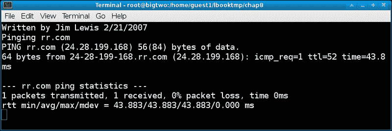
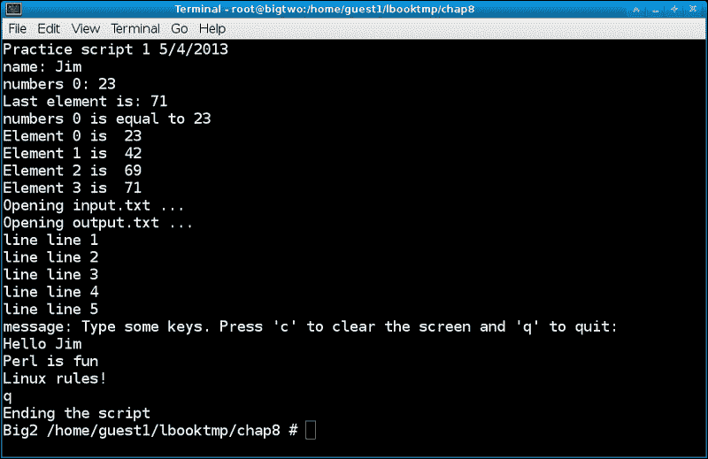

# 第八章：使用脚本

在本章中，我们将涵盖以下主题：

+   从文件中删除文本

+   使用脚本参数

+   在脚本中编写循环

+   备份您的系统

+   一次只能为一个用途锁定文件

+   熟悉 Perl

# 介绍

知道如何编写脚本将使您能够更有效地运行您的系统。编写脚本很容易；您不需要计算机科学学位或类似的东西。更好的是，您需要创建和运行脚本的一切都已经在您的 Linux 系统上可用。

编程时要记住的主要事情是要像计算机一样思考。尝试理解每个步骤的作用。如果遇到问题，请仔细查看相关的行。计算机会按照您的指示每次执行。

在这些示例中，我们将编写`Bash` shell 脚本。以指示使用的 shell 为开头的每个脚本是良好的编程实践。这是通过以第一列开始的一行来完成的，例如以下内容：

```
#!/bin/sh

```

使用文本编辑器创建脚本。我看到有人试图使用文字处理软件来编写脚本，但我不建议这样做。文字处理软件笨重，似乎总是会在文件中插入不良字符（尽管它们声称不会）。如果您现在还不知道，学习如何使用`EMACS`、`vi`或其他文本编辑器（参见第三章，“文件和目录”）。您会为此感到高兴的。

为了将脚本作为命令执行，您需要更改文件的权限。例如，如果您已经创建并保存了一个名为`mycmd`的文本文件，您可以通过运行以下命令使其可执行：

```
 chmod 755 mycmd

```

如果您没有进行过太多的脚本编写，为了安全起见，我建议在创建和运行脚本时使用用户帐户。当您感到舒适（或者如果您已经感到舒适），您可以以 root 身份运行。您可能会在某个时候必须这样做，特别是如果您是系统管理员。

以下段落中给出了几个脚本示例。这些应该很好地说明了脚本可以用于什么以及如何编写它们。

# 从文件中删除文本

脚本可以编写成几乎您能想象到的任何事情。以下是一个这样的例子。

## 如何做到...

以下是一个可以用于去掉示例中行号的脚本的清单。然后您可以在您的系统上按原样运行它们。

### 脚本 1 - 去掉行号

```
 1  #!/bin/sh
 2  # removelines 5/1/2013
 3  if [ "$1" = "" ] ; then
 4   echo "Usage: removenumbers filename > newfile"
 5   echo " This script will remove the line numbers from the beginning of the lines"
 6   echo " in filename. It assumes the number field is 5 characters wide."
 7   echo " Use the redirection operator to save the output to a new file."
 8   exit
 9  fi
 10  cat $1 | cut -c 1-5 --complement

```

## 它是如何工作的...

让我们讨论一下前面给出的行是做什么的。

+   第一行告诉操作系统这个脚本是为哪个 shell 准备的。

+   第 2 行在第一列有一个`#`。这被称为注释行。这里我有脚本编写的日期。

+   `$1`变量是您在命令名称之后给出的第一个参数。如果没有给出参数，它将等于空字符串（`""`）。`Usage`文本将显示，并且脚本将在第 8 行退出。

+   如果确实给出了参数，此脚本假定它是一个文件名，因此，处理将继续到第 10 行。

+   第 10 行使用`cat`命令来流式传输文件的内容。在这种情况下，流被传输到`cut`命令。

+   `cut`命令通常会保留每行的前五个字符并丢弃其余部分。但是，由于我使用了`--complement`标志，它做的恰恰相反。许多 Linux 命令都有这个选项或类似的选项。

## 还有更多...

如果您想在您的系统上尝试这个，请执行以下步骤：

1.  打开一个文本编辑会话，例如`vi removelines.txt`。

1.  通过按*I.*将`vi`置于插入模式。

1.  从书中复制脚本的文本并粘贴到`vi`中。保存文件并退出：`wq`。

1.  现在运行以下命令：

```
cat removelines.txt | cut -c 1-5 --complement > removelines

```

1.  然后使其可执行：

```
chmod 755 removelines

```

1.  运行以下命令：

```
removelines

```

如果一切顺利，使用屏幕应该会出现。您现在可以在本章的其余示例中使用此脚本。

# 使用脚本参数

这里我们展示了如何计算和显示给脚本的参数数量。

## 如何做...

以下是脚本清单：

### 脚本 2 - 参数

```
 1  #!/bin/sh
 2  # 5/1/2013
 3  echo Script showing how to count and show the parameters
 4  N=$#
 5  echo Number of parameters: $N
 6  if [ $N -eq 0 ] ; then
 7    echo "Usage: $0 parameters and/or a mask"
 8    exit
 9  fi
 10  for i in $* ; do
 11   echo Parm: $i
 12  done

```

## 它是如何工作的...

+   您已经知道第 1 到 3 行的作用。`$#`内置变量包含给脚本的参数数量。在第 4 行，我们将变量`N`设置为该值。

+   第 5 行显示了`N`的值。请注意，要访问变量，必须在其前面加上`$`字符。

+   在第 6 行，我们测试`N`以查看是否给出了任何参数。如果没有，我们显示`Usage`消息，并在第 8 行退出。

+   第 10 行是一个`for`循环的示例。注意语法，并不要忘记循环结束时的`done`命令。请注意，`$*`是一个内置变量，其中包含给脚本的所有参数的列表。

+   在第 11 行，我们显示了`i`变量的值。

## 还有更多...

1.  通过按照前一节中的示例进行更改，将其命名为`parameters`，使其成为您系统上的可执行脚本。

1.  运行它：`parameters`（您可能需要在系统上运行`. /parameters`）。

1.  您应该看到`Usage`消息。现在使用以下命令运行它：

```
parameters 1 34 56

```

1.  它应该显示数字 3，然后每个参数一行。

1.  尝试使用其他数字。还尝试一些通配符字符。

### 注意

变量需要更多的解释。例如，以下是数字：

```
i=1
RC=0

```

您可以按以下方式测试数字：

```
if [ $i -eq 0 ] ; then           # test for equal
if [ $RC -ne 0 ] ; then       # test for not equal

```

以下是字符串：

```
FNAME=Jim
LNAME=Lewis
if [ "$FNAME" = "Jim" ] ; then     # test string equality
if [ "$LNAME" = "Lewis" ] ; then   # test string equality

```

这是另一种情况，记住它是相反的。使用诸如`-eq`之类的字母来测试数字，使用`=`和其他数字运算符来测试字符串。

# 在脚本中编写一个循环

我们之前的脚本是快速运行完成的命令。这是一个运行直到您决定终止它的脚本的示例。请注意，如果不需要参数，则可能不需要`Usage`部分（但一定要在注释部分说明脚本的功能）。

此脚本通过每分钟一次 ping 服务提供商来监视网络连接的状态。失败将被记录到文件中。

## 如何做...

以下是程序清单：

### 脚本 3 - 循环

```
 1  #!/bin/sh
 2  #
 3  #  Check network once a minute and log failures to a file
 4  PROVIDER=192.168.1.102
 5  tput clear
 6  while [ 1 ]
 7  do
 8    echo Written by Jim Lewis 2/21/2007
 9    echo Pinging $PROVIDER
 10    ping -c 1 $PROVIDER
 11    rc=$?
 12    if [ $rc -ne 0 ] ; then
 13      echo Cannot ping $PROVIDER
 14      date >> log1.txt
 15      echo Cannot ping $PROVIDER >> log1.txt
 16    fi
 17    sleep 60
 18  done

```

## 它是如何工作的...

+   第 4 行是您的服务提供商的 IP 地址或域名。在本例中，我使用了我的`bigtwo`机器。请注意，如果将此变量放在您的`.bashrc`文件中（参见第一章，“使用终端/命令行”），那么如果将来更换服务提供商，您只需要在一个地方进行更改。

+   第 5 行清除屏幕。

+   第 6 行可能看起来有点奇怪。是的，这就是所谓的无限循环。但是，脚本仍然可以通过按下*Ctrl*和*C*，通过向其发出 kill 命令，或者通过让它监视一个文件（稍后会详细介绍）来终止。

+   在第 7 行，记住`while`语句需要在其后有一个语句。

+   第 10 行使用了`ping`命令。`-c 1`变量告诉它只 ping 一次。

+   第 11 行保存了上一个命令的错误代码。

+   如果没有错误，则`ping`命令返回`0`。如果存在错误，第 14 行将系统日期附加到`log1.txt`文件中。

+   第 15 行然后将文本附加到日志文件中。

+   第 17 行等待 60 秒，然后循环在第 6 行重新开始。

我从 2007 年 1 月开始运行这个脚本。我已经多次使用`log1.txt`文件来说服我的服务提供商改进他们的服务。

以下是我在 Fedora 17 系统上运行的脚本的截图：



## 还有更多...

执行以下步骤来运行此脚本：

1.  按照前几节的步骤创建文件。您可以根据需要对其进行命名，只要不会与另一个脚本或程序冲突即可。我将其命名为`loop1`。

1.  在您的系统上打开一个终端。我建议将其设置得比之前的截图小一些。

1.  您无需以 root 身份运行此脚本。因此，只需键入您给它的名称即可启动它。

1.  请记住，这个脚本是一个循环；它会一直运行直到你终止它。

1.  你应该不时查看`log1.txt`文件，以了解你的互联网连接有多可靠。请注意，如果你的连接经常中断，这个文件可能会变得非常大。

这样的脚本经常被使用，特别是在执行系统管理职责时，用于监视网络资源。

一个警告，谨慎使用`ping`等服务。例如，不要过多地 ping 你的提供商。一分钟一次就可以了。在开发这样的脚本时，使用本地 ping 地址进行测试，直到你完全掌握它。

# 系统备份

自动化任务是使脚本真正强大的地方。你可以花一些时间把脚本做得完美，然后让它自己运行。我现在每个 Fedora 系统上至少有十个脚本在运行。

这就是我所谓的*穷人*备份实用程序。过去，我曾尝试过一些*商店购买*的程序，但对软件质量感到失望。最糟糕的是需要备份文件，然后发现根本没有！这个脚本由一个`cron`作业每天晚上 3 点调用。我们将在下一章介绍 cron。

如果你想尝试并使用这个脚本，请确保你理解正在发生什么。备份目录必须首先手动创建，以及`filenum1`文件。

如所写的这个脚本必须以 root 身份运行。

## 如何做...

我使用以下脚本来备份我的文件：

### 脚本 4 - 备份

```
 1  #!/bin/sh
 2  #   Jim's backup program
 3  # Change to an appropriate directory on your system
 4  cd /lewis/backup
 5  VER="File backup by Jim Lewis 4/25/2011 A"
 6  echo $VER
 7  date >> datelog.txt
 8  T=`cat filenum1`
 9  T=`expr $T + 1`
 10  if [ $T -gt 7 ] ; then
 11   T=1
 12  fi
 13  echo $T > filenum1
 14  TDIR=/temp/linuxbook/chap8/backups$T
 15  echo "Removing files from $TDIR"
 16  cd $TDIR
 17  pwd
 18  rm *.gz
 19  echo "Backing up files to $TDIR"
 20  X=`date "+%m%d-%H"`              # create a timestamp
 21  echo $X
 22  cd /
 23  tar -cvzf "$TDIR/lewis$X.gz" lewis
 24  tar -cvzf "$TDIR/temp$X.gz" temp
 25  tar -cvzf "$TDIR/root$X.gz" root
 26  cd /home
 27  tar -cvzf "$TDIR/guest$X.gz" --exclude=Cache --exclude=.cache --exclude=.evolution --exclude=vmware --exclude=.thumbnails  --exclude=.gconf --exclude=.kde --exclude=.adobe   guest1
 28  echo $VER
 29  cd $TDIR
 30  pwd
 31  ls -lah

```

## 它是如何工作的...

+   第 4 行切换到我的备份目录。你会想在你的系统上更改这个。

+   第 7 行将当前日期附加到`datelog.txt`文件中。我不时检查这个文件，确保一切看起来都很好。

+   第 8 行看起来真的很奇怪；那些反引号是干什么的？`filenum1`文件包含一个数字，这是下一个要复制备份文件的目录（总共 7 个）。你知道，如果你`cat`这个文件，它会在屏幕上显示它的内容。嗯，反引号的意思是运行这个命令，但将结果表达式放入一个变量中。这听起来很复杂，但你会很快习惯的。

+   变量`T`现在有了下一个要使用的目录的编号。第 9 行使用`expr`命令来评估表达式，并将`1`加到`T`上。

+   第 10 行检查`T`是否大于`7`，如果是，就将它设置回`1`。是的，我做了七次备份，每周一次。叫我偏执狂吧！

+   第 13 行将`T`的新值复制回`filenum1`以供下次使用。

+   第 14 行设置了`TDIR`变量，其中包含我们要复制文件的备份目录。

+   第 16 行切换到`TDIR`。

+   第 17 行显示当前工作目录。我在编写这个脚本时加入了这个，习惯了它的存在，所以留了下来。这完全是可选的。

+   第 18 行删除了先前压缩的备份文件。我强烈建议你在首次尝试这个脚本时注释掉这一行。然后，在确保一切正常之后，你可以把它放回去。

+   第 20 行设置了一个日期时间戳。同样，反引号操作符被用来将日期的值放入一个变量中（在这种情况下是`X`）。

+   第 22 行切换到`/`。

+   第 23、24 和 25 行备份了`/lewis`、`/temp`和`/root`目录。

+   第 26 行切换到`/home`。

+   第 27 行打包了我的`/home/guest1`目录。`tar`的参数告诉它从归档中排除哪些目录。查看`tar man`页面以获取更多信息。

+   第 28 行显示脚本版本，第 29 行返回到备份目录，第 30 行显示目录名称，第 31 行显示文件列表。

这个脚本更像是一个示例，而不是一个真正的备份程序，但这是一个很好的起点。我使用的真正的备份程序与此类似，但还将文件复制到外部 USB 驱动器和另一台远程计算机（使用无人值守的`scp`）。每当我想要创建一个新的 Linux 机器时，我只需将这些文件复制到它并解压缩，配置和源我的`.bashrc`，然后我就可以运行了。

# 一次只能使用一个文件的锁定

这对我来说经常发生。有时候您可能想通过运行一个简单的脚本在终端中编辑一个文件。但是，如果文件已经在另一个终端中打开，那么一个会话中进行的更新可能会在另一个会话中被覆盖。以下脚本应该有助于防止这种情况发生。

## 操作步骤...

以下是防止同一个文件同时被多个终端编辑的简单方法：

### 脚本 5 - 文件锁定

```
 1  #!/bin/sh
 2  # todo script 5/1/2013
 3  FN1=/tmp/file.lock
 4  if [ -f $FN1  ] ; then
 5   echo -n "File is being used in tty: "
 6   cat $FN1
 7   exit
 8  fi
 9  echo `tty` > $FN1
 10  # perform your actions(s) here
 11  kw /lewis/todo.txt
 12  rm $FN1

```

## 它是如何工作的...

+   第 3 行将变量`FN1`设置为锁定文件的名称。

+   第 4 行检查锁定文件是否存在。如果存在，它会显示锁定文件的内容并退出脚本。

+   如果锁定文件不存在，我们将到达第 9 行。现在通过将`tty`命令的输出重定向到文件来创建锁定文件。

+   在第 11 行，您可以执行任何您想要的操作。在我的情况下，我在这里使用`kw`，我的文本编辑器编辑`/tmp/todo.txt`。即使编辑器会话关闭，脚本的处理也会继续。

+   第 12 行删除锁定文件。

这很简单，而且效果非常好。我使用这个脚本的一个版本来编辑我的几个重要文件。`todo`脚本可以从系统的任何位置运行，并且`todo.txt`文件会显示在我的文本编辑器中。如果我在文件仍在被编辑时离开到另一个会话或窗口，然后尝试再次运行`todo`，它将不允许编辑。它还会告诉我`tty`是否在原始会话中。这可以帮助我更快地再次找到它，这对我来说非常有用，因为我总是有很多工作区和终端打开。

# 介绍 Perl

Perl 是一种可以用于文本处理、Web 开发、网络编程、系统管理、GUI 开发等等的编程语言。它被设计成易于使用和高效，您可以在脚本中使用传统的过程化方法或面向对象的方法。Perl 还有一个相当大的第三方附加模块列表，使其具有更多的功能。

## 准备工作

在本节中，我们将只涵盖 Perl 的基础知识。大多数典型的 Linux 系统都已经安装了它和文档。要查看简要介绍，请在您的系统上运行`perldoc perlintro`。Perl 介绍应该会立即出现。

要运行 Perl 脚本，可以使用以下 Perl 命令：

```
perl filename.pl

```

`.pl`参数是通常赋予 Perl 脚本的扩展名。您还可以在脚本中放置 Perl 的路径，类似于我们在`bash`中所做的。首先运行`which perl`以查看 Perl 的位置，然后将其放在脚本的第一行中：

```
#!/usr/bin/perl

```

这是 Fedora 上的正确路径。与`bash`脚本一样，使用文本编辑器创建它们，并使用`chmod 755 filename.pl`使其可执行。现在，您只需输入命令的名称即可运行它。

## 操作步骤...

以下是我在开始学习这种语言时写的一个小 Perl 脚本：

```
 1  #!/usr/bin/perl
 2  #  t1.pl - Perl practice script 1
 3  use strict;
 4  use warnings;
 5  sub displaymessage
 6  {
 7   my $message = shift;
 8   print "message: $message\n";
 9  }
 10  system("tput clear");
 11  print "Practice script 1 5/4/2013\n";
 12  my $name = "Jim";
 13  print "name: $name\n";
 14  my @numbers = (23, 42, 69, 71);
 15  print "numbers 0: $numbers[0]\n";
 16  print "Last element is: $numbers[$#numbers]\n";
 17  if($numbers[0]==23)
 18  {
 19   print "numbers 0 is equal to 23\n";
 20  }
 21  my $count = 0 ;
 22  foreach (@numbers)
 23  {
 24   print "Element $count is  $_\n";
 25   $count++;
 26  }
 27  print "Opening input.txt ...\n";
 28  open(my $in,  "<",  "input.txt")  or die "Cannot open input.txt for reading: $!";
 29  print "Opening output.txt ...\n";
 30  open(my $out, ">",  "output.txt") or die "Cannot open output.txt for writing: $!";
 31  while (<$in>)
 32  {
 33   print "line $_";
 34   print $out $_;
 35  }
 36  close $in or die "$in: $!";
 37  close $out or die "$out: $!";
 38  displaymessage("Type some keys. Press 'c' to clear the screen and 'q' to quit:");
 39  my $key = 1;
 40  $count = 1;
 41  while($count < 500)
 42  {
 43  # read a key from the keyboard
 44   open(TTY, "+</dev/tty") or die "no tty: $!";
 45   system "stty  cbreak </dev/tty >/dev/tty 2>&1";
 46   $key = getc(TTY);
 47   if($key eq 'c')
 48   {
 49    system("tput clear");
 50   }
 51   if($key eq 'q')
 52   {
 53    print "\nEnding the script\n";
 54    $count = 10000;
 55   }
 56   $count++;
 57  }

```

## 它是如何工作的...

+   第 1 行告诉 shell 要使用哪个解释器。

+   第 3 行告诉编译器在语法上要非常严格。也始终使用这一行。

+   第 4 行表示显示所有警告。也始终使用这个。

+   第 5 到 9 行是一个子例程。第 7 行将子例程的第一个参数放入变量消息中。第 8 行显示它。

+   第 10 行清除屏幕。

+   第 11 行告诉我们这个脚本应该是什么。请注意行尾的`\n`参数。这代表换行，表示将下一个打印输出继续到下一行。

+   第 12 行将变量名设置为`Jim`。注意名称前面的`$`符号。不要忘记它。

+   第 13 行显示变量。

+   第 14 行创建一个数字数组。注意`@`字符。

+   第 15 行显示数组中的第一个元素。

+   第 16 行使用特殊的 Perl 语法`$#numbers`显示最后一个元素。

+   第 17 行检查元素`0`是否真的等于`23`。注意双等号。

+   第 21 行创建变量`count`并将其设置为`0`。

+   第 22 行是另一个特殊的 Perl 约定。`foreach`命令表示逐个遍历数组中的元素。这是一个非常方便的功能。

+   第 24 行展示了特殊的`$_`结构如何显示数组的每个元素。

+   第 25 行将计数增加`1`。

+   下面的几行是在 Perl 中处理文件的一种方法。它尝试打开`input.txt`文件进行读取，`output.txt`进行写入。`input.txt`文件必须存在，否则程序将出错并在此停止。`input.txt`的内容如下：

```
line 1
line 2
line 3
line 4
line 5

```

+   第 30 行打开输出文件。

+   第 31 到 35 行读取`input.txt`中的每一行并将其写入`output.txt`。

+   第 36 和 37 行关闭文件。不要忘记在脚本中执行这一步。

+   第 38 行使用我们之前创建的子例程显示一条消息。

+   第 39 行创建并设置`key`变量。

+   第 40 行将`count`变量重新设置为`1`。

+   第 41 行开始一个`while`循环。

+   第 43 到 46 行是在 Perl 中从键盘读取键的一种方法。如果这对你来说看起来很复杂，我完全同意。

其余的行都是不言自明的。当用户按下`q`退出时，`count`变量增加到`10000`。这会导致第 41 行的`while`循环提前结束，有效地结束脚本。你也可以在这里使用一个循环控制变量。

以下是我系统上运行的上一个脚本的屏幕截图：



## 还有更多...

尽管这是一个非常琐碎的脚本，但你可以用 Perl 做很多事情。许多年前，当我刚开始接触家用电脑时，有一个基于星际迷航的文本模式游戏可以玩。我得到了这个 BASIC 游戏的副本，最终用 C 语言重写了它。几个月前，我决定再次重写它，这次使用 Perl。它还没有完成，可能是因为我太忙于写这本书，但它正在进行中。

关于 Perl 的好书应该很容易找到。我买了几本，发现它们在我试图更详细地学习它时非常有价值。

有几百个标准的 Linux 实用程序可以独立使用或在脚本中使用。以下是一些最常见的一些命令的简短列表。每当你需要执行任何任务时，请在这里检查，看看你是否可以将其中一些命令纳入你的脚本中。

以下实用程序位于`/bin`目录中：

+   `awk`，`gawk`：用于模式扫描和处理语言

+   `basename`：用于从文件名中剥离目录和后缀

+   `bash`：GNU 的 Bourne-Again Shell

+   `cat`：用于连接文件并在标准输出上打印

+   `chmod`：用于更改文件模式位

+   `chown`：用于更改文件所有者和组

+   `cp`：用于复制文件和目录

+   `cut`：用于从文件的每一行中删除部分

+   `date`：用于打印或设置系统的日期和时间

+   `dmesg`：用于打印或控制内核环形缓冲区

+   `echo`：用于显示一行文本

+   `find`：用于在目录层次结构中搜索文件

+   `grep`，`egrep`，`fgrep`：用于打印匹配模式的行

+   `hostname`：用于显示或设置系统的主机名

+   `ls`：用于列出目录内容

+   `mkdir`：用于创建目录

+   `mktemp`：用于创建临时文件或目录

+   `mv`：用于移动（重命名）文件

+   `ping`，`ping6`：用于向网络主机发送`ICMP ECHO_REQUEST`

+   `ps`：用于报告当前进程的快照

+   `pwd`：用于打印当前工作目录的名称

+   `rm`：用于删除文件或目录

+   `sed`：用于调用流编辑器来过滤和转换文本

+   `sleep`：表示延迟一定时间

+   `sort`：用于对文本文件的行进行排序

+   `tar`：用于将文件组合并可选地压缩到单个存档中

+   `touch`：用于更改文件时间戳

以下实用程序位于`/usr/bin`中：

+   `diff`：用于逐行比较文件

+   `dirname`：用于从文件名中剥离最后一个组件

+   `expr`：用于评估表达式

+   `file`：用于确定文件类型

+   `flock`：用于从 shell 脚本管理锁

+   `stat`：用于显示文件或文件系统状态

+   `tee`：用于从标准输入读取并写入标准输出和文件

+   `time`：用于计时简单命令或提供资源使用情况

+   `tty`：用于打印连接到标准输入的终端的文件名

+   `uniq`：用于报告或省略重复的行

+   `unzip`：用于列出、测试和提取`ZIP`存档中的压缩文件

+   `who`：用于显示谁已登录

+   `xargs`：用于从标准输入构建和执行命令行

以下命令内置于 shell 中：

+   `cd`：用于更改目录

+   `echo`：用于显示一行文本

+   `exit`：导致 shell 退出（带有可选的返回代码）

+   `export`：用于设置环境变量

+   `kill`：用于向进程发送信号或终止进程

+   `read`：用于从键盘获取字符串并将其放入变量中
