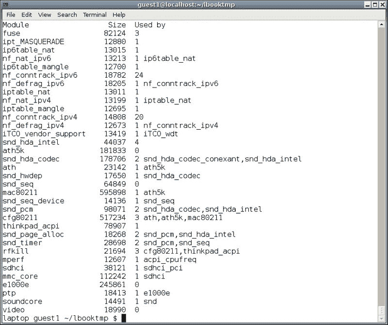
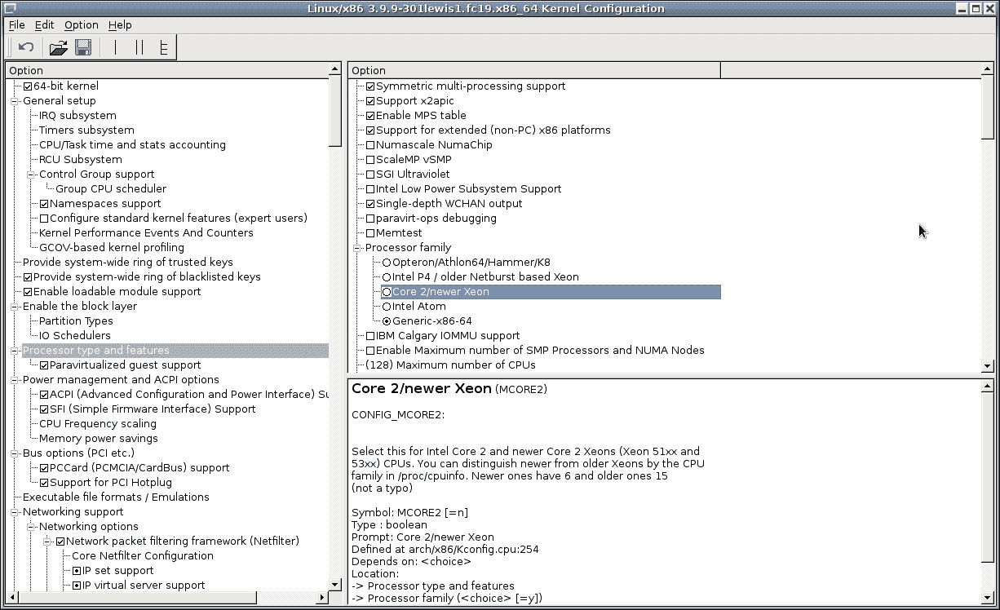

# 第十章： 内核

在本章中，我们将涵盖以下主题：

+   对模块命令的简要介绍

+   从 kernel.org 构建内核

+   使用 xconfig 修改配置

+   使用 GRUB

+   了解 GRUB 2

# 介绍

内核是操作系统的主要组件或核心。 它控制系统中的所有资源，时间，中断，内存分配，进程分离，错误处理和日志记录。 在典型的 Linux 计算机中，内核是模块化的，它具有核心文件（或文件），然后根据需要加载其他设备驱动程序。 在某些情况下，比如嵌入式设备，内核可能由一个包含所有所需驱动程序的大图像文件组成。 这被称为单片内核。

在决定是否需要构建自定义内核之前，您应该首先确保自己确实需要一个。 运行自定义内核的利弊如下。

以下是运行自定义内核的优点：

+   如果您知道自己在做什么并且有时间进行研究，您可以得到最大化硬件性能的内核

+   您可以利用股票内核可能没有的功能或设备

+   通过查看所有内核设置，您可以更好地了解 Linux

+   构建和运行自己的内核只是纯粹的乐趣

以下是运行自定义内核的缺点：

+   您自己的自定义内核可能不包含发行版所需的功能

+   VMware 和其他虚拟环境可能需要额外的努力才能正常工作

+   请注意，如果运行自己的内核，您很可能不再得到发行版支持渠道的支持

### 提示

运行自己的内核的大多数缺点都可以解决。 这取决于您花多少时间来解决它。

# 对模块命令的简要介绍

有几个命令用于操作系统上的模块。 请注意，根据您的发行版，这些命令可能只能以 root 身份运行。

## 如何做...

在以下步骤中，我们将运行`lsmod`，`modprobe`，`insmod`和`modinfo`命令：

1.  要查看系统上当前加载的模块的状态，请运行`lsmod`。

1.  要从当前的`/lib/modules/<kernel name>`目录加载模块，您将使用`modprobe`命令。 例如`modprobe pcnet32`。

1.  直接加载模块，使用`insmod`命令。 例如`insmod /temp/pcnet32.ko`。

1.  要显示有关模块的信息，请使用`modinfo`命令。 首先运行`lsmod`查找模块，然后在其中一个名称上尝试`modinfo`。

## 工作原理...

`lsmod`命令获取`/proc/modules`文件的内容并以易于阅读的格式显示出来。 使用它来确定系统中加载了哪些模块。

以下屏幕截图显示了我 Fedora 19 系统中`lsmod`的部分列表：



`modprobe`命令用于向 Linux 内核添加和删除模块。 它从当前的`/lib/modules/<kernel name>`目录加载模块。 `modprobe`命令比`insmod`做得更多，例如一次加载多个模块以解决依赖关系，并且通常优先于`insmod`。 由于`modprobe`可以加载多个模块，因此`/etc/modprobe.d`中的文件和`/etc/modules.conf`文件用于解决任何问题。

`insmod`命令可用于将模块插入系统。 通常用于直接加载模块。 例如，如果您想加载新创建的`pcnet32`模块的版本，您首先会将目录更改为正确的目录，然后运行`insmod pcnet32.ko`。

`modinfo`命令显示有关 Linux 内核模块的信息。这是一个非常有用的命令，允许您查看特定模块的详细信息，例如它将接受哪些参数。以下是在我的 Fedora 17 系统上从`modinfo`输出的样子：

```
BIG2 /temp/linux-3.9.1 # modinfo nouveau
filename:       /lib/modules/3.6.1-1.fc17.x86_64/kernel/drivers/gpu/drm/nouveau/nouveau.ko
license:        GPL and additional rights
description:    nVidia Riva/TNT/GeForce
author:         Stephane Marchesin
alias:          pci:v000012D2d*sv*sd*bc03sc*i*
alias:          pci:v000010DEd*sv*sd*bc03sc*i*
depends:        drm,drm_kms_helper,ttm,mxm-wmi,i2c-core,wmi,video,i2c-algo-bit
intree:         Y
vermagic:       3.6.1-1.fc17.x86_64 SMP mod_unload
parm:           agpmode:AGP mode (0 to disable AGP) (int)
parm:           modeset:Enable kernel modesetting (int)
parm:           vbios:Override default VBIOS location (charp)
parm:           vram_pushbuf:Force DMA push buffers to be in VRAM (int)
parm:           vram_notify:Force DMA notifiers to be in VRAM (int)
parm:           vram_type:Override detected VRAM type (charp)
parm:           duallink:Allow dual-link TMDS (>=GeForce 8) (int)
parm:           uscript_lvds:LVDS output script table ID (>=GeForce 8) (int)
parm:           uscript_tmds:TMDS output script table ID (>=GeForce 8) (int)
parm:           ignorelid:Ignore ACPI lid status (int)
parm:           noaccel:Disable all acceleration (int)
parm:           nofbaccel:Disable fbcon acceleration (int)
parm:           force_post:Force POST (int)
parm:           override_conntype:Ignore DCB connector type (int)
parm:           tv_disable:Disable TV-out detection (int)
parm:           tv_norm:Default TV norm.
 Supported: PAL, PAL-M, PAL-N, PAL-Nc, NTSC-M, NTSC-J, hd480i, hd480p, hd576i, hd576p, hd720p, hd1080i.
 Default: PAL
 *NOTE* Ignored for cards with external TV encoders. (charp)
parm:           reg_debug:Register access debug bitmask:
 0x1 mc, 0x2 video, 0x4 fb, 0x8 extdev, 0x10 crtc, 0x20 ramdac, 0x40 vgacrtc, 0x80 rmvio, 0x100 vgaattr, 0x200 EVO (G80+) (int)
parm:           perflvl:Performance level (default: boot) (charp)
parm:           perflvl_wr:Allow perflvl changes (warning: dangerous!) (int)
parm:           msi:Enable MSI (default: off) (int)
parm:           ctxfw:Use external HUB/GPC ucode (fermi) (int)
parm:           mxmdcb:Santise DCB table according to MXM-SIS (int)

```

`rmmod`命令允许您从 Linux 内核中删除已加载的模块。通常的语法是`rmmod modulename`。不使用扩展名。您也可以使用`modprobe -r`命令。

`depmod`程序生成`modules.dep`和`.map`文件。通常情况下，用户不需要手动执行它，因为它在内核构建期间运行。它通过检查`/lib/modules/<kernelname>`中的模块并确定它们需要哪些符号以及它们导出哪些符号来创建模块依赖列表。

其中一些命令有一个强制选项。它将尝试执行所需的功能，绕过任何检查。我从未见过这种方法可靠地工作，因此不建议使用。如果您决定尝试，请确保您有完整的操作系统备份。

在运行设备驱动程序命令时，通常可以通过查看`/var/log/messages`文件获得更多信息。我建议打开一个终端并在其中运行`tail -f /var/log/messages`。始终保持这个终端可见。还要注意，该文件最终会被回收，因此命令将不得不停止并重新启动（在我的系统上大约每周一次）。一个简单的测试是运行`logger hellojim`。如果你没有看到它出现，那么是时候重新启动 tail 会话了。

您还可以运行`dmesg`命令。以下是 Fedora 17 上`dmesg`输出的一个简短示例：

```
Linux version 3.6.1-1.fc17.x86_64 (mockbuild@) (gcc version 4.7.2 20120921 (Red Hat 4.7.2-2) (GCC) ) #1 SMP Wed Oct 10 12:13:05 UTC 2012
Command line: BOOT_IMAGE=/vmlinuz-3.6.1-1.fc17.x86_64 root=/dev/mapper/vg_bigtwo-lv_root ro rd.md=0 rd.dm=0 SYSFONT=True rd.lvm.lv=vg_bigtwo/lv_swap KEYTABLE=us rd.lvm.lv=vg_bigtwo/lv_root LANG=en_US.UTF-8 rd.luks=0 rhgb quiet
smpboot: Allowing 4 CPUs, 2 hotplug CPUs
Booting paravirtualized kernel on bare hardware
Kernel command line: BOOT_IMAGE=/vmlinuz-3.6.1-1.fc17.x86_64 root=/dev/mapper/vg_bigtwo-lv_root ro rd.md=0 rd.dm=0 SYSFONT=True rd.lvm.lv=vg_bigtwo/lv_swap KEYTABLE=us rd.lvm.lv=vg_bigtwo/lv_root LANG=en_US.UTF-8 rd.luks=0 rhgb quiet
Memory: 3769300k/5242880k available (6297k kernel code, 1311564k absent, 162016k reserved, 6905k data, 1032k init)
Console: colour dummy device 80x25
tsc: Fast TSC calibration using PIT
tsc: Detected 2699.987 MHz processor
CPU: Processor Core ID: 0
CPU0: Thermal monitoring enabled (TM2)
smpboot: CPU0: Intel Pentium(R) Dual-Core  CPU      E5400  @ 2.70GHz stepping 0a
NMI watchdog: enabled on all CPUs, permanently consumes one hw-PMU counter.
smpboot: Booting Node   0, Processors  #1
smpboot: Total of 2 processors activated (10799.94 BogoMIPS)
atomic64 test passed for x86-64 platform with CX8 and with SSE
NET: Registered protocol family 38
Block layer SCSI generic (bsg) driver version 0.4 loaded (major 252)
Console: switching to colour frame buffer device 80x30
fb0: VESA VGA frame buffer device
input: Power Button as /devices/LNXSYSTM:00/device:00/PNP0C0C:00/input/input0
ACPI: Power Button [PWRB]
Serial: 8250/16550 driver, 4 ports, IRQ sharing enabled
Non-volatile memory driver v1.3
Linux agpgart interface v0.103
ACPI: PCI Interrupt Link [LSA0] enabled at IRQ 21
ata1: SATA max UDMA/133 abar m8192@0xfe9fc000 port 0xfe9fc100 irq 21
usb usb1: New USB device found, idVendor=1d6b, idProduct=0002
usb usb1: Manufacturer: Linux 3.6.1-1.fc17.x86_64 ehci_hcd
usb usb1: SerialNumber: 0000:00:04.1
hub 1-0:1.0: USB hub found
hub 1-0:1.0: 8 ports detected
usb usb2: Manufacturer: Linux 3.6.1-1.fc17.x86_64 ohci_hcd
usb usb2: SerialNumber: 0000:00:04.0
usbcore: registered new interface driver usbserial
usbcore: registered new interface driver usbserial_generic
USB Serial support registered for generic
usbserial: USB Serial Driver core
serio: i8042 KBD port at 0x60,0x64 irq 1
serio: i8042 AUX port at 0x60,0x64 irq 12
mousedev: PS/2 mouse device common for all mice
rtc0: alarms up to one year, y3k, 114 bytes nvram, hpet irqs
device-mapper: uevent: version 1.0.3
device-mapper: ioctl: 4.23.0-ioctl (2012-07-25) initialised: dm-devel@redhat.com
cpuidle: using governor ladder
cpuidle: using governor menu
drop_monitor: Initializing network drop monitor service
ip_tables: (C) 2000-2006 Netfilter Core Team
input: AT Translated Set 2 keyboard as /devices/platform/i8042/serio0/input/input2
ata1: SATA link up 3.0 Gbps (SStatus 123 SControl 300)
ata1.00: ATA-8: WDC WD5000AAVS-00N7B0, 01.00A01, max UDMA/133
ata1.00: 976773168 sectors, multi 0: LBA48 NCQ (depth 31/32)
ata1.00: configured for UDMA/133
scsi 0:0:0:0: Direct-Access     ATA      WDC WD5000AAVS-0 01.0 PQ: 0 ANSI: 5
Freeing unused kernel memory: 1032k freed
Write protecting the kernel read-only data: 12288k
nouveau 0000:00:10.0: setting latency timer to 64
[drm] nouveau 0000:00:10.0: Detected an NV40 generation card (0x063000a2)
Console: switching to colour dummy device 80x25
usb 1-6: New USB device found, idVendor=0bda, idProduct=0181
Initializing USB Mass Storage driver...
scsi4 : usb-storage 1-6:1.0
tsc: Refined TSC clocksource calibration: 2699.931 MHz
usb 2-3: Manufacturer: American Power Conversion
hid-generic 0003:051D:0002.0001: hiddev0,hidraw0: USB HID v1.00 Device [American Power Conversion Back-UPS RS 700G FW:856.L3 .D USB FW:L3  ] on usb-0000:00:04.0-3/input0
EXT4-fs (dm-1): mounted filesystem with ordered data mode. Opts: (null)
e1000: Intel(R) PRO/1000 Network Driver - version 7.3.21-k8-NAPI
e1000: Copyright (c) 1999-2006 Intel Corporation.
r8169 0000:04:00.0: irq 43 for MSI/MSI-X
r8169 0000:04:00.0: eth0: RTL8102e at 0xffffc90010fae000, 44:87:fc:69:4d:0f, XID 04c00000 IRQ 43
microcode: CPU0 updated to revision 0xa0b, date = 2010-09-28
ALSA sound/pci/hda/hda_intel.c:1593 Enable delay in RIRB handling

```

## 还有更多...

查阅这些命令的 man 或 info 页面以获取更多信息。特别是查看`man modprobe.conf`，了解如何使用`modprobe`的配置选项。

您可以使用`uname -r`命令查看当前的内核版本。通常情况下，您会发现在脚本和别名中使用`uname -r`表达式效果很好。

# 从 kernel.org 构建内核

在这个示例中，我们将使用来自[`kernel.org`](http://kernel.org)网站的内核文件。

## 准备工作

在不会对系统造成任何可能的伤害的情况下，您应该能够执行除了最后一步之外的所有步骤。`make install`命令将修改您的 GRUB 文件，因此至少我会备份这些文件。为了更安全，因为我们已经知道我是偏执的，如果您要安装新的内核，我建议在测试机器上运行所有这些步骤。

这个示例假设您的计算机已安装为完整的开发系统。您将需要最新版本的`GCC`，`make`，QT 开发包等。如果您选择安装了当前发行版的软件开发包（或等效包），那么您可能已经准备就绪。我建议在您计划进行构建的分区上至少有 10GB 的文件空间可用；如果您将要创建大量的内核树（内核 3.9.1 中的文件使用了 6.5GB），则需要更多。

`vmlinuz`，`initramfs`和`map`文件将被复制到`/boot`，因此请确保它足够大，以处理您想要的额外内核的数量（大约 500MB 是典型的）。

您需要以 root 身份运行`make modules_install`和`make install`命令。我建议在整个过程中都以 root 身份运行，以避免任何文件权限问题。

## 如何做...

以下是获取和构建内核的步骤：

1.  在您的浏览器中，导航到[`kernel.org`](http://kernel.org)。

1.  点击黄色方框内的**Latest Stable Kernel**，并保存文件。在 Fedora 上，`Downloads`目录是`/home/<user>/Downloads`。

1.  您想要构建的位置基本上取决于您。我个人不喜欢很长的目录路径，所以我把我的放在`/temp`目录中。如果您愿意，您可以选择另一个位置。

1.  将`.xz`文件从`Downloads`目录复制或移动到`/temp`。在本例中，文件名是`linux-3.9.1.tar.xz`。

1.  切换到`/temp`目录并提取文件`tar xvf linux-3.9.1.tar.xz`。这以前需要很长时间，但现在也不太糟糕。

1.  完成后，切换到`cd /temp/linux-3.9.1`目录。

1.  下一步是获取一个内核配置文件。除非你已经有一个特定的文件在脑海中，我通常从`/boot`目录中取最新的一个。在我的系统上，我运行了以下命令：

```
cp /boot/config-3.6.1-1.fc17.x86_64

```

1.  您可以直接复制文件到`.config`，但是，我喜欢看到我从哪里开始。现在就这样做：

```
cp config-3.6.1-1.fc17.x86_64  .config

```

1.  现在我们需要运行一个内核构建程序来使一切同步。我们将使用`xconfig`程序，这将在下一节中详细讨论。现在，只需运行以下命令：

```
make xconfig

```

1.  这将带来一个看起来很酷的屏幕，上面有大约一百万个东西。点击**文件** | **保存**，然后**文件** | **退出**。

1.  现在您应该回到文本屏幕，显示类似以下内容：

```
Big4 /temp/linux-3.9.1 # make xconfig
 HOSTCC  scripts/kconfig/conf.o
 HOSTCC  scripts/kconfig/zconf.tab.o
 HOSTCXX scripts/kconfig/qconf.o
 HOSTLD  scripts/kconfig/qconf
scripts/kconfig/qconf Kconfig
#
# configuration written to .config
#

```

1.  现在运行`make`命令。根据您的计算机速度，这可能需要很长时间。如果你喝咖啡或茶，这可能是一个去喝一些的好时机。

1.  检查确保没有错误，然后运行以下命令：

```
make modules_install

```

1.  下一步将修改您的 GRUB 配置。我总是确保我有备份以防万一。完成后，要安装内核，请运行以下命令：

```
make install

```

1.  在大多数情况下，`make install`命令将设置新内核为默认值。您可以通过查看 GRUB 配置文件来检查这一点（我们稍后将在本章中看到更多关于 GRUB 的内容）。

1.  要实际尝试新的内核，您必须重新启动系统（稍后会详细介绍）。当屏幕出现时，请确保菜单上选择了正确的内核。

1.  由于我们没有进行实质性的更改，内核应该可以正常启动。通过运行`uname -a`命令来检查是否启动了正确的内核。您不应该在这个内核中看到或注意到任何差异。但是，根据几个因素，它可能不像预期的那样工作，甚至可能根本无法启动。如果是这种情况，您应该能够重新启动到之前的良好内核。

重新启动时，我强烈建议进行冷启动。执行有序关机（`shutdown -h now`），让机器至少静置几秒钟；几分钟也不会有什么坏处。我曾经看到一些非常奇怪的事情发生在热启动上，任何理智的人都会说这是不可能的。

# 使用 xconfig 修改配置

如前一节所述，`.config`文件控制着进入内核文件的一切。这包括`vmlinuz`和`initramfs`文件，以及设备驱动程序模块。`.config`是一个文本文件，但不是直接编辑的，而是可以使用几种不同的程序之一。在本章中，我们将向您展示如何使用`xconfig`程序来对`.config`文件进行更改。

## 准备工作

在执行这些步骤之前，请参阅前一节中有关准备工作的内容。

## 如何做...

在这里，我们将使用`xconfig`来修改配置：

1.  切换到内核构建目录并运行以下命令：

```
make xconfig

```

1.  那个看起来很酷的屏幕应该再次出现。这个程序需要几分钟来适应，所以我们将一步一步地进行。

1.  首先，找到字符串**处理器类型和特性**并点击。屏幕会发生变化。

1.  现在，在右侧面板下的**处理器系列**下，点击**Core 2/newer Xeon**。点击文本，*而不是*单选按钮。

1.  现在您应该看到类似以下截图的内容（来自我使用 3.9.9 内核的 Fedora 19 系统）：

1.  在使用这个程序时必须小心。很容易意外点击单选按钮，改变你不打算改变的东西。因此，我建议频繁备份你的`.config`文件。由于它是一个文本文件，你可以使用`diff`程序查看文件之间的更改。如果你不熟悉`diff`，运行`man diff`获取更多信息。

1.  所以，让我们继续改变一些东西。如果你正在运行现代硬件，它可能有一个 Core 2 或 Xeon 处理器。运行`cat /proc/cpuinfo`查看你有什么。如果看起来合适，点击**Core 2/newer Xeon**行上的单选按钮。

1.  这些是配置新内核的基础。刚开始时，我建议在构建之间尽量少做更改。这样，如果出现问题，跟踪导致问题的更改将更容易。

1.  完成对`xconfig`的讨论，让我们尝试另一个字段。在左侧，点击**常规设置**的文本。

1.  你会看到右侧的文本发生变化。通常，在使用`xconfig`时，你点击文本来改变显示，点击适当的按钮来展开或压缩条目，点击单选按钮来实际更改值。方框中的小黑点表示将构建一个模块。

## 还有更多...

你可以使用`diff`命令查看你保存的`.config`文件之间的差异。在调试时，这将节省大量时间。

这个程序可能有些令人困惑。在某些地方，右侧的文本会指示**在此处选择 Y**。这意味着确保复选框中有一个勾。同样，**No**表示没有勾选。在某些情况下，程序会说在一个没有复选框的字段中指示 Y 或 N。我想这些是错误，如果是的话，它们已经存在很长时间了。

你也可以点击**帮助** | **介绍**，了解如何使用`xconfig`的简要信息。

在构建内核时必须格外小心。在使用`xconfig`修改`.config`文件时很容易出错，导致内核无法启动。以下是一些要点：

+   每次更改时都要备份当前的`.config`文件。

+   尽量一次性做尽可能少的更改。试图通过做很多更改来节省时间是很诱人的，如果这对你有效那太好了。但对我来说行不通。

+   如果你的最新内核无法启动，请尝试使用`diff`来比较你的最新`.config`文件和上一个好的文件。你可能能够立即发现问题。

+   如果一切失败，回到已知的工作配置文件，然后从那里重新开始。你一直在备份你的`.config`文件，对吧？

# 使用 GRUB

在处理内核时，你可能需要不时地更改你的 GRUB 配置文件。你可以修改默认启动的内核，内核选择菜单的超时值，传递给内核的参数，启动其他操作系统，以及许多其他内容。

`grub.conf`文件通常位于`/boot/grub`中，或者你可以使用`/etc/grub.conf`文件，它是一个符号链接。

以下是我在我的 Fedora 14 系统上的`grub.conf`的样子：

```
# grub.conf generated by anaconda
#
# Note that you do not have to rerun grub after making changes to this file
# NOTICE:  You have a /boot partition.  This means that
#          all kernel and initrd paths are relative to /boot/, eg.
#          root (hd0,0)
#          kernel /vmlinuz-version ro root=/dev/sda3
#          initrd /initrd-[generic-]version.img
default=2
timeout=5
splashimage=(hd0,0)/grub/splash.xpm.gz
hiddenmenu
title Fedora (3.9.1)
 root (hd0,0)
 kernel /vmlinuz-3.9.1 ro  root=UUID  rhgb quiet
 initrd /initramfs-3.9.1.img
title Fedora (2.6.38.4)
 root (hd0,0)
 kernel /vmlinuz-2.6.38.4 ro root=UUID rhgb quiet
 initrd /initramfs-2.6.38.4.img
title Fedora (2.6.35.6-45.fc14.x86_64)
 root (hd0,0)
 kernel /vmlinuz-2.6.35.6-45.fc14.x86_64 ro root=UUID rhgb quiet
 initrd /initramfs-2.6.35.6-45.fc14.x86_64.img

```

## 如何做...

在这里，我们将向你展示如何更改`grub.conf`文件中的一些项目。请注意，这里的错误可能导致系统无法启动，所以要么只是跟着做，要么非常小心。

1.  切换到正确的目录：

```
cd /etc

```

1.  备份副本：`cp grub.conf /temp`（或其他适当的位置）。

1.  用 vi 或等效工具进行编辑：

```
vi grub.conf

```

1.  参考上面的文件，让我们默认启动第一个段落。将`default=2`行更改为`default=0`。请注意，它们从 0 开始计数。

1.  现在让我们增加等待你进行选择的时间；将`timeout`值更改为`10`。

1.  假设你想以文本模式启动，要做到这一点，请注释掉（即在前面加上`#`）`splashimage`和`hiddenmenu`行。

1.  并且从段落（或所有段落）中删除`rhgb quiet`。

1.  如果你有任何要传递给内核的参数，你可以直接添加到`kernel`行的末尾。

## 它是如何工作的...

让我们在下一节中看一下上述步骤的分解：

+   注释部分说`你有一个/boot 分区。这意味着所有内核和 initrd 路径都是相对于/boot 的`。这是在试图说的是，当你遇到后面包含类似`/vmlinuz-3.9.1`的行时，它实际上意味着`/boot/vmlinuz-3.9.1`。不要忘记它是这样工作的，你以后会省去很多麻烦。

+   `default=2`表示使用第三个标题或段落（是的，这又是另一个从 0 开始计数而不是从 1 开始计数的地方）。

+   `timeout=5`表示在启动默认内核之前显示内核启动菜单 5 秒钟。

+   `splashimage`行在启动时在屏幕上显示一个图形图像。我非常不喜欢这个，所以我把它注释掉了。

+   `hiddenmenu`行表示隐藏内核启动菜单。取消注释此行以显示菜单。是的，又是反过来，但不像从 0 开始计数那么尴尬。

+   第一行标题开始一个内核段。在该行和下一个标题行（或文件结束）之间的所有内容都与该内核相关联。在这种情况下，列出的第一个内核是我创建的最新的一个（3.9.1）。

+   `root (hd0,0)`行表示我的`/boot`目录位于第一个硬盘的第一个分区上。

+   下一行是实际的内核文件和参数。

+   这个段落的最后一行是初始的 RAM 磁盘映像文件。

+   如你所见，这台机器上还有两个更多的段落（内核）可用。我正在运行`2.6.35-6-45.fc14.x86_64`，这是 Fedora 14 64 位的默认内核。

# 理解 GRUB 2

GRUB 2 现在被许多 Linux 发行版使用。这是一个完全的重写，旨在解决 GRUB Legacy 中的一些问题。它仍在开发中，因此这里的信息可能不完整或过时。

使用 GRUB 2 时的引导配置在`/boot/grub2/grub.cfg`文件中。你也可以通过`/etc/grub2.cfg`文件来引用它，这是一个符号链接。

以下是我在我的 Fedora 17 系统上看到的前几行的样子：

```
#
# DO NOT EDIT THIS FILE
#
# It is automatically generated by grub2-mkconfig using templates
# from /etc/grub.d and settings from /etc/default/grub
#
### BEGIN /etc/grub.d/00_header ###
if [ -s $prefix/grubenv ]; then
 load_env
fi
set default="1"
if [ x"${feature_menuentry_id}" = xy ]; then
 menuentry_id_option="--id"
else
 menuentry_id_option=""
fi

```

正如注释行所说，这个文件不是用来直接编辑的。相反，`/etc/default/grub`文件与`/etc/grub.d`目录中的一组文件一起使用。

```
Big2 /etc/grub.d # ls -la
total 76
drwx------.   2 root root  4096 Oct 18  2012 .
drwxr-xr-x. 167 root root 12288 May 15 03:34 ..
-rwxr-xr-x.   1 root root  7528 Aug  2  2012 00_header
-rwxr-xr-x.   1 root root  9265 Aug  2  2012 10_linux
-rwxr-xr-x.   1 root root  9948 Aug  2  2012 20_linux_xen
-rwxr-xr-x.   1 root root  2564 Aug  2  2012 20_ppc_terminfo
-rwxr-xr-x.   1 root root  9339 Aug  2  2012 30_os-prober
-rwxr-xr-x.   1 root root   214 Aug  2  2012 40_custom
-rwxr-xr-x.   1 root root   216 Aug  2  2012 41_custom
-rw-r--r--.   1 root root   483 Aug  2  2012 README

```

## 如何做...

以下是使用 GRUB 2 时对引导配置进行更改的步骤。记住，`grub.cfg`文件不是直接编辑的；而是对`/etc/grub.d`目录中的文件进行更改。

1.  让我们改变`timeout`和`rhgb`的值。编辑`/etc/default/grub`文件。

1.  将`GRUB_TIMEOUT`更改为`10`。

1.  在`GRUB_CMDLINE_LINUX`中，删除`rhgb quiet`。保存文件。

1.  通过运行以下命令创建新文件：

```
grub2-mkconfig -o /boot/grub2/grub.cfg

```

1.  修改后的`grub.cfg`文件应该已经准备好启动了。

## 它是如何工作的...

以下是`/etc/grub.d`目录中脚本的用途的描述：

+   `00_header`：这生成`grub2.cfg`的标题，并从`/etc/default/grub`文件获取信息

+   `10_linux`：这加载菜单条目

+   `20_linux_xen`：这会查找 zen 内核并将它们添加到菜单中

+   `20_ppc_terminfo`：这在 PPC 系统上检查正确大小的终端

+   `30_os-prober`：这会在硬盘上搜索其他操作系统，以便将它们添加到启动菜单中

+   `40_custom`：这是一个模板，可用于向引导菜单添加额外的条目

+   `41_custom`：如果存在，这会从`/boot/grub/custom.cfg`中读取信息

+   `README`：这是一个包含其他有用信息的文件

## 还有更多...

以下是操作系统中可用的 GRUB 2 命令的部分列表：

+   `grub2-editenv`：这编辑 GRUB 环境块

+   `grub2-fstest`：这是一个用于 GRUB 文件系统驱动程序的调试工具

+   `grub2-kbdcomp`：这将生成一个 GRUB 键盘布局文件

+   `grub2-menulst2cfg`：这将把传统的`menu.lst`转换成`grub.cfg`

+   `grub2-mkfont`：这将创建 GRUB 字体文件

+   `grub2-mkimage`：这将创建一个可引导的 GRUB 镜像

+   `grub2-mklayout`：这将生成一个 GRUB 键盘布局文件

+   `grub2-mkpasswd-pbkdf2`：这将为 GRUB 生成一个哈希密码

+   `grub2-mkrelpath`：这将使系统路径相对于其根目录

+   `grub2-mkrescue`：这将创建一个 GRUB 救援镜像

+   `grub2-mkstandalone`：这将创建基于内存磁盘的 GRUB 镜像

+   `grub2-script-check`：这将检查`grub.cfg`的语法错误

+   `grub2-bios-setup`：这将设置设备使用 GRUB 引导

+   `grub2-install`：这将 GRUB 安装到设备上

+   `grub2-mkconfig`：这将生成一个 GRUB 配置文件

+   `grub2-mknetdir`：这将准备一个 GRUB 网络引导目录

+   `grub2-ofpathname`：这将为设备查找 OpenBOOT 路径

+   `grub2-probe`：这将探测 GRUB 的设备信息

+   `grub2-reboot`：这将设置 GRUB 的默认引导项，仅用于下一次引导

+   `grub2-set-default`：这将设置保存的默认 GRUB 引导项

+   `grub2-sparc64-setup`：这将设置设备使用 GRUB 引导

要了解更多关于 GRUB 2 的信息，请访问官方网页[`www.gnu.org/software/grub/grub.html`](http://www.gnu.org/software/grub/grub.html)。
