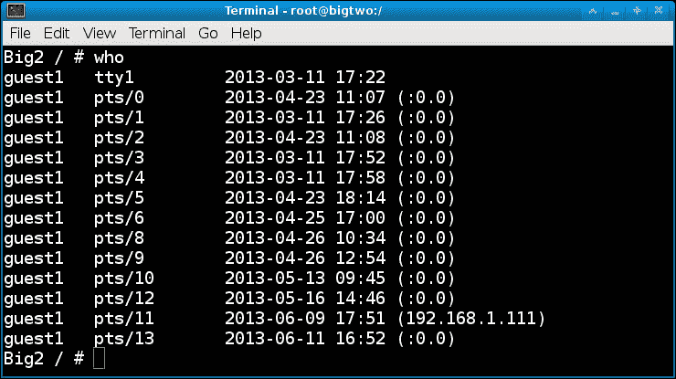

# 附录 A：Linux 最佳实践

在本附录中，我们将涵盖以下主题：

+   超级用户与普通用户

+   运行图形用户界面

+   创建、验证和存储备份

+   权限和您的身份

+   实时备份

+   环境变量和 shell

+   最佳环境

+   使用和监控 UPS

+   复制文件时要小心

+   验证存档文件并使用校验和

+   防火墙、路由器设置和安全性

+   如果发现入侵应该怎么办

+   文件名中的空格

+   使用脚本和别名节省时间和精力

+   使用 scp 和 ssh 进行自动身份验证

+   保存历史记录和截图

+   驱动器上的空间

+   对新想法持开放态度

# 介绍

有许多事情可以让您充分利用 Linux 系统。常识告诉我们，在计算机上执行特定任务有很多方法。这是正确的，但实际上通常只有一种好的方法来完成某件事。诀窍在于要开放思想，并在好事发生时看到好处。

# 超级用户与普通用户

作为 root 用户和普通用户运行主要取决于您所处的环境。如果每个人都有自己的工作站，并且负责设置它，那么对您来说，作为 root 运行可能非常自然（尤其是如果您不犯错误）。但是，如果您在银行或其他可能因打字错误而导致数百万美元账户被清空的情况下工作，那么作为 root 显然是不明智的。在这些情况下，假设您有权限，只有在必要时才切换到 root，并且只执行所需的任务。如果已正确配置，还可以使用 sudo。有关 sudo 的更多信息，请参见第五章，“权限、访问和安全性”。

还要记住的一件事是，您作为 root 运行时的舒适程度。如果您容易出错或紧张，并且/或者过去曾因作为 root 而造成严重损害，那么显然在这种情况下需要非常小心。另一方面，如果您一直作为 root 运行并且从未犯过错误，那就太好了。这肯定更有效率。

特别提示给系统管理员：我在不止一个场合看到过这种情况，所以在这里提一下。这适用于新手和经验丰富的系统管理员。您（也许还有您的经理）通常是系统上唯一具有 root 权限的人。这听起来是个好主意，对吧？这样可以避免有人犯错误导致整个项目崩溃。而且，成为负责人感觉很好。当别人需要更改时，他们会来找您，而您也很乐意帮忙。然后他们再来，再来，再来。在某个时刻，您意识到如果不处理这些请求，就无法完成任何工作，而他们如果没有您在身边也无法完成工作。所以您尝试设置 sudo。现在情况更糟了；每次您认为已经设置好处理任何事情时，如果再次失败，有人可能会再次来找您。那么您该怎么办呢？

您可能可以为选定的用户提供 root 访问权限。凭直觉行事。例如，观察个别用户的打字方式。他们在使用命令行时感到舒适吗？他们打字是否有权威性，还是对机器感到害怕？如果某个特定用户一直使用图形用户界面执行在命令行上更有效的任务，那么我会将其视为一个强烈的警告信号。

随着时间的推移，您将对谁可以信任 root 访问权限有所了解，并能够授予他们访问权限。当然，如果有人犯了错误，那也不是世界末日。他们实际上无法对整个项目造成严重损害，因为您一直在创建和验证每日备份，对吧？您可以恢复损坏并从他们那里收回 root 权限。请注意，只需要一个错误。我不会再信任那个用户拥有 root 权限。

# 运行图形用户界面

虽然我有点快速地信任我的用户拥有 root 访问权限，并且大部分时间我自己也使用 root，但我绝对不建议以这种方式运行 GUI。有些发行版甚至不允许这样做。通过以 root 身份运行 GUI，实际上你正在以 root 身份运行很多其他东西，比如你的浏览器和邮件程序。这绝对不是一个好主意。

以下是我在 Linux 或 UNIX 系统上的首选环境。我使用 Fedora，但这些想法应该适用于大多数其他发行版。安装系统后，我做的第一件事之一是更改系统，使得机器以命令行模式而不是图形界面启动。这样，如果发生图形问题，诊断和纠正就容易得多。我还可以选择通过运行适当的`startx`类型命令来启动哪个图形界面。在命令提示符下，我以普通用户或访客用户身份登录。在我的 Fedora 14 系统上，我然后运行`startx`，这将启动 Gnome 2。

在图形界面完全启动后，我打开一个终端会话并运行`su`到 root。我检查确保机器可以 ping 通，并通常进行一些其他的合理性检查。如果一切正常，我然后运行我的`jset`脚本。它执行一些桌面定制，比如将终端窗口打开到它们正确的目录，并提醒我要运行什么命令（我写了很多程序，所以真的需要这个）。它还会挂载我的 USB 设备，或者在出现问题时警告我。然后我将终端会话定位到我想要的位置。现在我可以开始工作了。

以下是一个类似于我在启动后用来设置我的桌面的脚本：

```
#!/bin/sh
# last update 6/9/2013 (rebooted)

echo percentused - run go
cd /lewis/java/percentused
xterm +sb -title Xterm    -geom 80x20 &

echo apcupsd - run go
cd /lewis/java/apc
xterm +sb -title Xterm    -geom 80x20 &

echo jtail - run jtail
cd /lewis/jtail-f/jtail
xterm +sb -title jtail -geom 137x30   &

echo jsecure - run jsecure
cd /lewis/jtail-f/jsecure
xterm +sb -title jtail -geom 125x33   &

echo ping - run loop1
cd /lewis/ping
xterm +sb -title ping  -geom 86x8 &

echo runbackup1 - run runbackup1
cd /lewis/backup
xterm +sb -title runbackup1 -geom 65x21 &

echo jwho - run jwho
cd /lewis/jwho
xterm +sb -title jwho  -geom 65x8  &

# mount usb stick
mount /dev/sdg1 /usb
# mount Iomega external drive
mount /dev/sdf1 /megadrive 

```

# 创建、验证和存储备份

我无法强调创建系统备份的重要性有多大。至少，将您的个人和业务数据以及配置文件复制到安全的地方。有些人甚至备份操作系统本身。无论您决定做什么，都要制定计划并坚持下去。正如第八章中所提到的，*使用脚本*，现在是设计和使用脚本的好时机。如果需要，使用`crontab`自动执行定期备份。

`tar`命令非常适合备份整个目录。请注意，它也会获取任何隐藏文件。如果需要，您可以排除特定目录，并且可以使用`tar`执行其他一些操作。以下是类似于我用来备份`/home/guest1`目录的命令。

### 提示

`tsback1`是一个包含要从中开始的数字的文本文件。

```
cat tsback1
0

```

以下是脚本的开始：

```
 cd /home
 NUM=`cat tsback1`        # get the next number to use
 tar -cvzf /megadrive/backups/backup$NUM.gz --exclude=Cache  --exclude=.cache --exclude=.thumbnails  guest1

```

请记住将要备份的目录作为行中的最后一项。首先更改`/home`目录，因为对于`tar`，您希望在要备份的子目录的父目录中。下一行将`NUM`变量设置为要使用的下一个变量。最后一行直接在我的 USB 外部驱动器中的适当目录中创建`tar`文件。

我在创建备份时尝试非常小心。我实际用来备份东西的脚本还做了很多其他事情。例如，它会检查我的 USB 外部驱动器是否真的存在，并且可以被写入（它还应该检查驱动器上是否有足够的可用空间，这是我的 TODO 之一）。如果代码确定驱动器不存在或发生其他错误，就会发出非常响亮和讨厌的警报。如果我在 5 分钟内没有回应这个警报，就会向我的手机发送电子邮件。这对于偏执狂来说怎么样？

备份是很好的。但是，如果备份无法使用，那就没有多大用处。因此，定期验证备份是明智的。多久验证一次取决于您和您的舒适水平。我的脚本定期将备份文件复制到另一台机器，然后解压并运行一些测试。如果有任何不对劲的地方，就会发出另一个警报。所有这些都是在脚本中自动完成的。

好了，我们现在正在进行备份和验证。那么存储呢？假设你已经把一切都搞定了，所有的文件都被复制和验证了，它们都位于同一个地方，比如你的家或办公室。然后发生了一些不可言喻的事情，比如火灾或盗窃。我同意，这种事情发生的可能性非常低，但它仍然可能发生。至少我不想尝试自 1982 年以来编写的百万行代码，所以我在各个地方都有备份，包括外部存储。在我工作过的一些公司中，文件被复制到磁带、CD 和/或硬盘上，并存放在一个防火的步入式保险柜中。非常好的主意。

# 权限和你的身份

这主要涉及系统管理员。作为系统管理员，你可能会大部分时间以 root 用户的身份进行工作。你设置访客账户和配额，甚至可能创建脚本等等。有时很容易忘记你的用户没有 root 权限。

记住这一点，一定要从用户的角度检查你的添加和更改。用`su`成为那个用户，确保你可以正常访问一切。这将为你节省很多时间，甚至可能避免尴尬，如果你在用户之前发现了问题。

# 实时备份

在编辑脚本和其他文件时，最好做一些编号的备份。没有什么比让一些东西工作，然后在做了一些更改后出现问题，然后不能快速地让它重新工作更令人沮丧的了。有了编号的备份，你总是可以回到之前工作的版本，然后使用`diff`找到错误。我确实是以最艰难的方式学到了这一点。

以下是我为本书的用户编写的备份脚本（我通常使用的是用 C 编写的）。它的名字是`mkbak`：

```
#!/bin/sh
# mkbak script to create backup files
if [ "$1" = "" ] ; then
 echo "Usage: mkbak filename(s)"
 echo "Creates numbered backup file(s) in the current directory."
 exit
fi
for i in $* ; do
 if [ ! -f $i ] ; then
 echo File $i not found.
 continue
 fi

 num=1
 while [ 1 ]
 do
 ibak=bak-$num.$i
 if [ -f $ibak ] ; then
 num=`expr $num + 1`
 else
 break
 fi
 done
 cp $i $ibak
 rc=$?
 if [ $rc -eq 0 ] ; then
 echo File $i copied to $ibak
 else
 echo "An error has occurred in the cp command, rc: $rc"
 fi
done

```

这个脚本是免费的，但有一些限制。它不能处理带空格的文件名，只能处理当前目录中的文件。请注意，你可以先`cd`到你想要的目录，然后再运行它。

以下是我用来备份当前正在工作的书籍文件的脚本：

```
#!/bin/sh
# b1 script to copy book file
# Date 1/22/2013
FN=startA1.txt                    # name of file to back up
STARTDIR=`pwd`                    # remember the starting directory
cp $FN /usb/book                  # copy to USB stick
cd /usb/book                      # cd to it
mkbak $FN                         # make the numbered backup

cd $STARTDIR                      # go back to the starting directory
cp $FN /megadrive/book            # copy to USB external drive
cd /megadrive/book                # cd to it
mkbak $FN                         # make the numbered backup

cd $STARTDIR                      # go back to the starting directory
sum $FN /usb/book/$FN /megadrive/book/$FN     # use sum to check
scp $FN $B2:/temp                 # copy to my other machine
ssh $B2 /usr/bin/sum /temp/$FN       # check the copy

```

在编辑文件（`FN`变量）时，我会不时手动运行这个脚本，通常是在做了很多更改之后，以及在我起身休息之前。

# 环境变量和 shell

在系统管理中经常遇到的一个问题是监控多台机器。同时打开 5 或 6 个`ssh`会话并不罕见，如果有多个显示器的话，会更多。知道哪个会话在哪台机器上运行是至关重要的，因为在错误的机器上输入正确的命令可能会造成灾难。因此，出于这个原因和其他原因，我建议在登录到远程机器时使用自定义的`PS1`变量。

这在第一章中提到，*使用终端/命令行*，在讨论环境变量时。以下是我在运行 Fedora 17 的机器上`PS1`变量的样子：

```
Big2 /temp/linuxbook/chapA # echo $PS1
Big2 \w #
Big2 /temp/linuxbook/chapA #

```

简单，而不会太混乱。当我登录到另一台机器时，`PS1`的样子如下：

```
BIG4 BIG4 BIG4 BIG4 BIG4 BIG4 BIG4 BIG4 /temp # echo $PS1
BIG4 BIG4 BIG4 BIG4 BIG4 BIG4 BIG4 BIG4 \w #
BIG4 BIG4 BIG4 BIG4 BIG4 BIG4 BIG4 BIG4 /temp #

```

应该很难混淆它们。

当谈到环境变量时，还有一些事情需要记住。当你对`.bashrc`文件进行更改并进行源代码化时，这些更改只在该会话中可见（以及任何新打开的会话）。为了在其他现有会话中看到更改，你必须在其中也进行源代码化。如果有一种方法可以通过一个命令使更改在每个会话中可见，那将是相当酷的，然而，我不相信这是可能的。当然，有人可能会说`shutdown -r`现在可以做到。

# 最好的环境

对一个人最好的可能对另一个人不是最好的。然而，我知道当我使用一个快速的桌面系统，有足够的内存和存储空间，以及两个大显示屏时，我是最高效的。以下是我的典型设置：

在我的左侧显示器上，我放置了脚本和以下用于监控系统的程序：

+   一个用 Java 和 C 编写的磁盘空间监控程序

+   一个监视我的**不间断电源**（**UPS**）的程序，也是用 Java 和 C 编写的

+   一个每分钟一次对网络进行 ping 并记录任何故障的脚本

+   一个使用`tail -f /var/log/messages`来监控内核消息的程序

+   我的备份脚本每天凌晨 3 点运行一次。

+   一个“穷人版”入侵检测脚本（稍后详细介绍）

+   一个每天两次向我的手机发送系统状态的脚本

+   我将“计算机”和“访客”文件夹图标设置为可见并易于访问

+   任何连接到远程机器的`ssh`会话

+   还有一些其他太无聊不值得一提的东西

所有这些都设置为在所有工作区中保持可见。说到工作区，我通常有四个。我总是将相同的程序和终端会话放在相同的工作区，并且在屏幕上大致相同的位置。这样，我可以非常快速地到达想要去的地方。您是否曾经处于一个情况，您的团队即将错过重要的截止日期，而您被迫观望，因为其他人在系统上浪费了大量时间寻找或做某事？您绝对不想成为那个人。

在右侧显示器上，我进行大部分实际工作。以下是我的工作区布局方式：

+   在工作区 1 有两个终端。它们已经准备好，以防我需要立即做一些事情

+   工作区 2 通常用于程序开发。我在这里进行 C、Java 和脚本开发

+   工作区 3 是我目前正在使用自定义文本编辑器输入这本书的地方（最终将被导入到`LibreOffice`中）

+   工作区 4 是我放置我的网络邮件客户端的地方

说到浏览，我倾向于在左侧显示器上打开它们，并在与我当前工作相关的工作区中打开。这样非常快捷高效，而且在需要时也更容易剪切和粘贴。

并非所有人都有快速机器或双显示器的奢侈条件，特别是在我们的工作中，有时似乎更重要的是为了节省成本，而不是给员工提供他们需要提高生产力的条件。我能说的就是，尽力获取您需要以尽可能高效地完成工作。

# 使用和监控 UPS

在我看来，至少应该在主要工作站上使用 UPS。如果电源突然断开（或更糟糕的是，变压器故障），硬件可能会出现各种问题，更不用说数据可能会发生什么了。我意识到，使用现代日志文件系统，数据丢失是相当罕见的，但为什么要冒这个险呢？而且，我真的不喜欢重新启动。永远不喜欢。

根据您的情况，尽量购买您能负担得起的最好的 UPS。您需要一个能够长时间运行系统并为您的显示器、调制解调器、路由器和外部驱动器提供电源的 UPS。这样，如果电源短暂中断，您就不会丢失任何数据，并且不必等待所有设备重新启动。

今天有许多不同品牌的 UPS 可用。我对**美国电源转换**（**APC**）设备有些偏爱。我有几个，它们在 Linux 上运行良好。确保购买一个带有电话连接器到 USB 端口的 UPS，因为旧式串行端口的设备无法正常工作。

`apcupsd`守护程序可用于监控 UPS。如果您的发行版尚未安装它，可以安装该软件包。

+   如果使用 Fedora，请运行`yum -y install apcupsd`（根据需要替换您的软件包安装程序）

+   在`/etc/apcupsd/apccontrol`文件中注释掉`WALL`语句，以防止烦人的消息被广播到每个终端

+   运行`apcaccess status`来查询 UPS

你可以用`apcupsd`做更多的事情，更多信息请查看它的网站[`www.apcupsd.com`](http://www.apcupsd.com)。这也列出了一些可能与 Linux 不兼容的 UPS 设备。

还有一件事，你可能想要使用 UPS 的自动关机功能。它可以在停电时间过长时自动关闭你的机器。大多数设备允许你设置在关闭之前运行的时间。请记住，UPS 在电池上运行的时间越长，它们的寿命就会越短。

# 在复制文件时要小心

在将文件复制到目录时，请确保它确实是一个目录。这种情况发生得足够频繁，以至于我不得不提到它，我必须承认我有时仍然会犯这个错误。很容易将许多文件复制到你认为是目录的地方，但实际上并不是。结果就是只有最后一个被复制的文件会存在，如果你没有保留源文件，它们可能会丢失。在复制文件之前，使用`file`命令验证目标是否真的是一个目录。

# 验证存档文件并使用校验和

经常出现的一件事是在创建将要发送给其他人或站点的`tar`或`zip`存档时，会发现未被注意到的错误。

以下是应该遵循的步骤：

1.  将文件复制到适当的目录（确保它确实是一个目录）。

1.  使用`zip`或`tar`进行压缩和创建存档。

1.  使用`tell`或`list`选项确保它看起来正确。对于 TAR，是`tar -tvzf filename.gz`，对于 ZIP，是`unzip -l filename.zip`。

1.  对你的文件运行`sum`命令，然后将文件发送到需要去的地方。

1.  如果使用`scp`，请使用`ssh`在远程系统上运行`sum`命令，如下所示：

```
ssh <user@remote-host> /usr/bin/sum filename.gz

```

1.  两个`sum`值应该匹配。

1.  如果使用电子邮件，在你的端上运行`sum`，并将结果与电子邮件一起发送。

给开发人员的一个建议；假设你正在创建一个编程项目的存档。为了确保你已经复制了它所需的每个文件，创建存档，然后将其复制到另一台机器上。像平常一样解压并构建它。如果缺少所需的文件，将会出现错误。

# 防火墙、路由器设置和安全性

防火墙在第五章中有所涉及，*权限、访问和安全*，所以这只是一个简要的回顾。如果你运行的是家庭系统并且使用一个好的路由器，`iptables`的默认设置可能已经足够了。它可能需要一些调整，例如使用扫描仪，但大部分时间你可能已经免受黑客的攻击。另一方面，如果你是一个大公司的系统管理员，`iptables`可能不够用。我会调查使用硬件入侵设备或其他方法，以确保数据和系统的安全。

强烈建议始终使用带有内置防火墙的路由器。我绝不会直接将系统连接到互联网。尽管典型的 Linux 系统可能会幸存下来，但我曾经看到 Windows 系统在不到 30 分钟内感染了病毒。

默认的路由器设置可能已经足够强大，可以防止典型的黑客入侵。为了确保，也为了了解路由器内部发生了什么，最好定期登录并检查一切。在大多数路由器上，将浏览器指向`192.168.1.1`会弹出登录界面。在大多数情况下，需要输入 ID 和密码。

`who`命令可以在 Linux 中用来显示系统上每个用户的用户名、tty、日期、时间和 IP 地址，如下面的截图所示：



还有另一件事可以帮助防止入侵。拒绝`ssh`/`scp`的 root 访问是个好主意，因为黑客通常会尝试以 root 身份入侵。这可以通过编辑`/etc/ssh/sshd_config`文件来实现。找到一行写着`#PermitRootLogin yes`的地方，将其改为`PermitRootLogin no`。不要忘记去掉`#`（井号）。你还需要重新启动`sshd`。现在，任何以 root 身份登录的尝试都将失败。我已经将我所有的机器都设置成了这样，作为额外的预防措施。

最后一件事，每当有人登录（或尝试登录）到你的系统时，都会有记录。在 Fedora 上，这会记录在`/var/log/secure`文件中。你可以不时地检查这个文件，或者使用`tail -f /var/log/secure`命令来监视它。

现在是一个额外的奖励。以下是一个我用来监视对我的机器的未经授权访问的简单脚本：

```
#!/bin/sh
tput clear
echo "jwho by Lewis 10/23/2011"
numusers=`who | wc -l`
while [ 1 ]
do
 rc=`who | wc -l`       # get number of users
 if [ $rc -gt $numusers ] ; then
 echo "Someone new has logged on!!!!!!!!!!!"
 date
 who
 jalert5 &            # see below
 numusers=$rc
 elif [ $rc -lt $numusers ] ; then
 echo "Someone logged off."
 date
 numusers=$rc
 fi
 sleep 5
done

```

基本上，这个脚本每 5 秒检查一次用户数量是否发生了变化。如果增加了，`jalert5`脚本将在后台运行。它每 5 秒播放一个非常讨厌的 WAV 文件，直到我关闭它。这也会在每次打开新会话时触发，所以你可能会希望在启动后最后运行它。

# 如果发现入侵怎么办

假设你发现发生了入侵。你应该怎么办？

### 提示

这些说明适用于你的机器或你完全负责的机器。如果这发生在你工作的机器上，立即按照公司针对安全事件的任何程序进行操作。

如果怀疑发生了入侵，需要迅速采取行动。运行`who`命令或`cat /var/log/secure`并检查输出。如果看到可疑的 IP 地址，采取以下行动：

+   如果这是一台非常重要的机器，上面有关键数据，我会立即拔掉以太网线并立即关闭它。然后我会从救援介质启动，尝试确定是否发生了任何不好的事情。检查他们进入的日期和时间（从`who`命令）可能会让你知道他们可能造成了多大的破坏。

+   如果这是我的家庭系统，我会首先拔掉以太网线。然后我会运行`ps auxw`命令将系统当前的运行情况保存到文件中。我会将这个文件复制到其他机器或设备上，然后关闭系统。

通过检查`ps`输出并查看`tty`值，我可能可以确定他们正在运行的程序，如果有的话。这可能会指出他们试图通过进入系统来实现什么目的。

显然，如果有人真的进入了你的系统，他们很可能是通过猜测或某种方式确定了密码。我可能会将所有密码重置为更难破解的密码，然后告诉我的用户选择更好的密码。或者可能自己分配密码。

好吧，至少有一个人在读这篇文章时会想为什么要拔掉以太网线？为什么不只是关闭接口？因为一个狡猾的攻击者会考虑到这一点，一旦他获得了访问权限，他就会在系统上自动放置代码，以便在接口关闭时自动重新打开它。他甚至可能给它加上一个定时器，或以其他方式隐藏它。

攻击者可能有时间做各种事情。他甚至可能修改了`who`、`ps`和其他命令，使得几乎不可能从运行的系统中跟踪他所做的事情（或仍在做的事情）。考虑到这一点，你仍然需要尽快关闭系统，然后使用救援盘或等效物重新启动。需要查看的一些事情是`ps`和`who`等命令。运行`file`命令，它应该显示它们是二进制可执行文件，而不是 shell 脚本。如果它们是 shell 脚本，你可能会发现攻击者已经用`.`重命名了可执行文件，以隐藏它们，然后将它们包装在一个脚本中，以帮助掩盖他的存在。还有许多其他隐藏的方法。

# 文件名中的空格

在为自己或其他人生成文件时，不要在文件名中包含空格。这可能会在 Linux 和 UNIX 机器上引起很多问题。如果必要，使用大写字母和/或下划线。也不要使用括号或其他特殊字符。我第一次使用 Firefox 下载文件时真的很惊讶，因为它插入了括号以将其与同名文件区分开。我很感激它没有简单地覆盖原始文件，但使用括号是一个非常糟糕的主意。

# 使用脚本和别名来节省时间和精力

我在现场看到的一件事是，人们浪费时间和精力一遍又一遍地输入相同的东西。不要这样做。使用别名和脚本。不要考虑编写脚本可能需要多少时间，而是考虑通过能够一直使用它来节省多少时间。您可能还可以在以后将其合并到另一个脚本中（特别是如果一开始就写得很好）。此外，有了这些可用的东西应该有助于满足截止日期。

# 使用自动身份验证的 scp 和 ssh

按照以下步骤允许使用`ssh`/`scp`而无需输入密码。您需要是 root 用户。

1.  首先，确保客户端至少使用过`ssh`。这将创建所需的正确目录。

1.  在主机上运行`ssh-keygen -t rsa`命令。这将创建一些必要的文件。

1.  如果客户端上不存在`/root/.ssh/authorized_keys`文件，您可以运行`scp /root/.ssh/id_rsa.pub <hostname>:/root/.ssh/authorized_keys`。

1.  否则，将`id_rsa.pub`文件复制到客户端，然后将其添加到`authorized_keys`文件中（我通常将其放在底部）。

1.  现在，您应该能够在不输入密码的情况下对客户端进行`scp`和`ssh`。这真的很方便，特别是在脚本中。

您还可以将此条目添加到另一个用户帐户中。例如，我将其添加到了我的`/home/guest1/.ssh/authorized_keys`文件中。这样，我可以作为 root 从一台机器复制文件，另一台机器仍然会接受它。

# 保存历史记录和截屏

在处理计算机时，我们都必须学习新的东西。有时所涉及的步骤非常复杂，我发现实际上每一种情况下，无论我用来执行这些步骤的文档或网站都存在错误。它不完整，作者跳过了重要的步骤等等。因为这些原因和其他原因，当我（终于）让某些东西运行起来后，我会在会话中运行`history`命令并将其输出到文件中。然后我以合适的名称保存这个文件，以便以后能够找到它。

根据所需的努力程度，如果合适的话，我也可能对每个步骤进行截屏。这可以作为以后的参考，如果您必须帮助其他人完成相同的任务。或者，如果有人说服您有朝一日写一本关于它的书。

# 驱动器上的空间

在过去，硬盘空间总是不够。我们总是快用完或者用完了，试图找到增加存储空间的方法。现在，在现代社会，这可能不再是一个问题。但是，随时监视您的可用空间仍然是一个好主意。

有很多方法可以做到这一点。在我的系统上，我使用了我用 C 和 Java 编写的一个程序。它叫做“使用百分比空间”，只是在底层使用了`df -h`。您可以将`df`放入脚本中，或者不时手动检查空间。只是不要用完！填满分区是一种让您手忙脚乱的好方法，特别是如果它是系统分区。

# 接受新想法

这是我给想更好地了解 Linux 的人的最后一条建议。我经常看到在这个领域里的人们在做他们的日常工作，而且都是以同样的方式。要时刻注意如何改进你执行日常任务的方式。如果你看到一个同事做一些对你来说很奇怪的事情，不要假设他的方式是错的，你的是对的。他的方法可能比你的好得多。向他学习。另一方面，他可能*没有*更好的方法，你的可能更好。在这一点上，你可以决定是否尝试分享你的想法。我发现大多数人对此非常抵触。

不要让自己陷入“你的方式不比我的好，只是不同”的争论中。正如我之前提到的，通常只有一种正确的执行任务的方式，但大多数人并不明白这一点。尽量在你能找到的时候找到它，并且只在对方愿意接受帮助的情况下分享你的想法。
