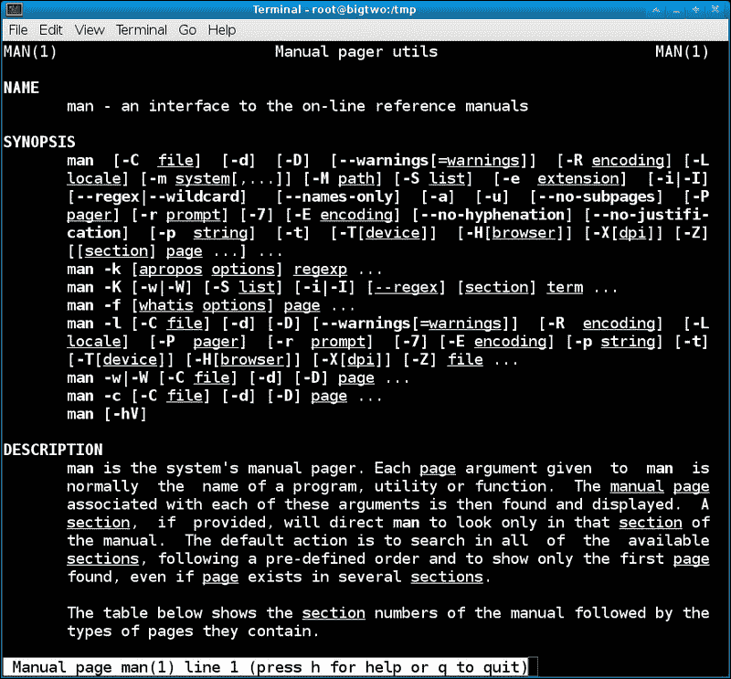
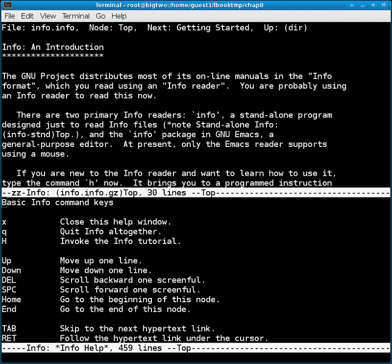
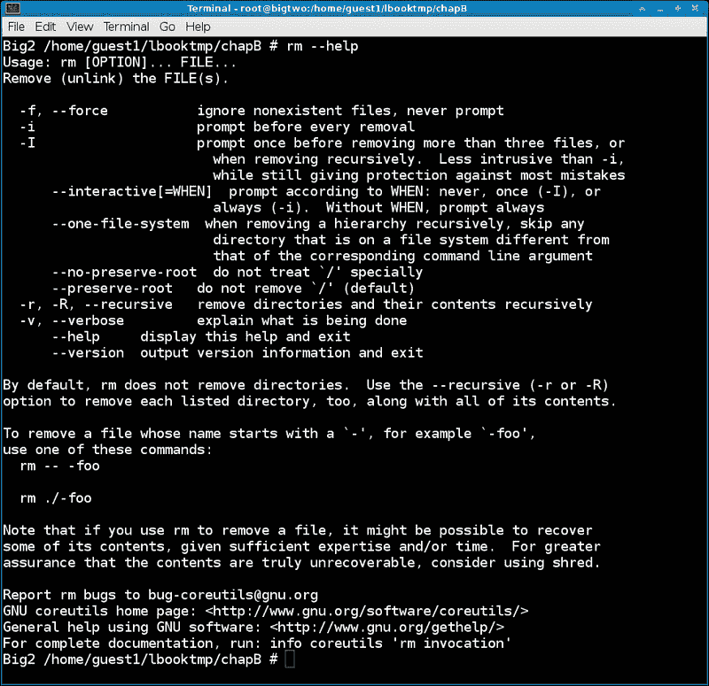
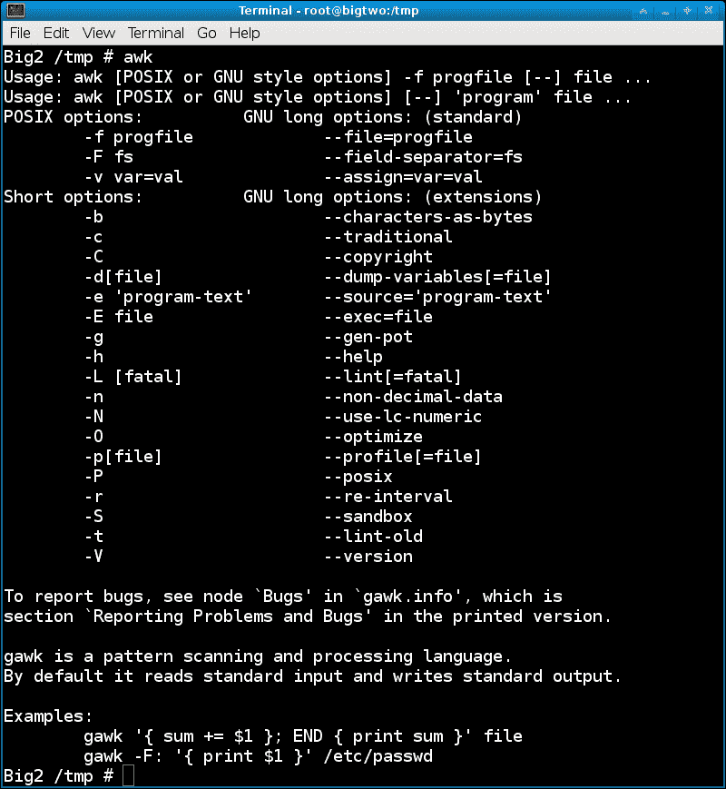
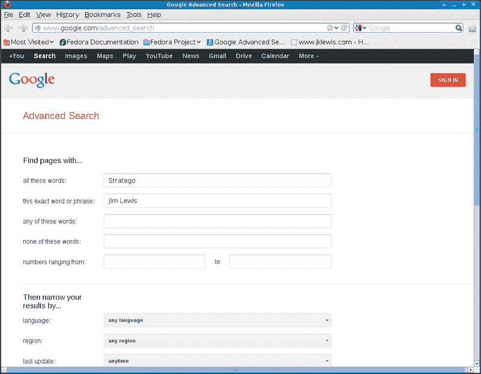
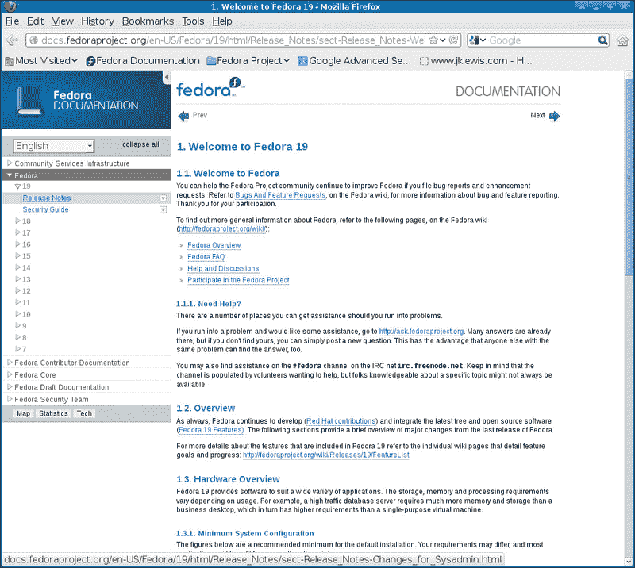
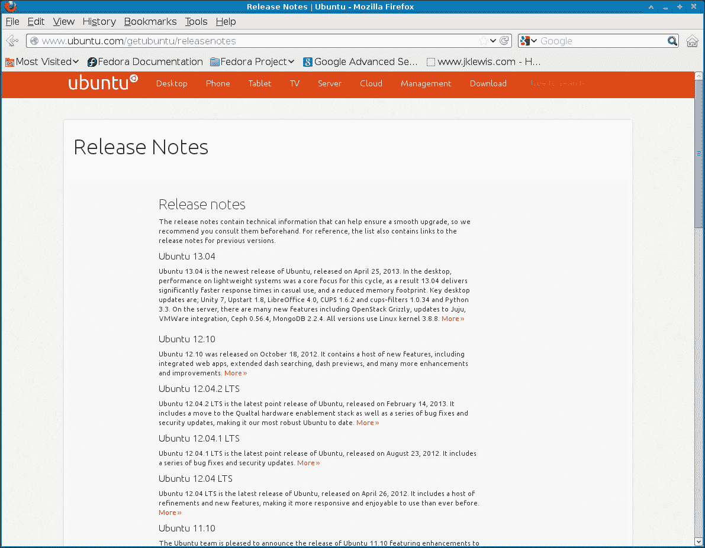
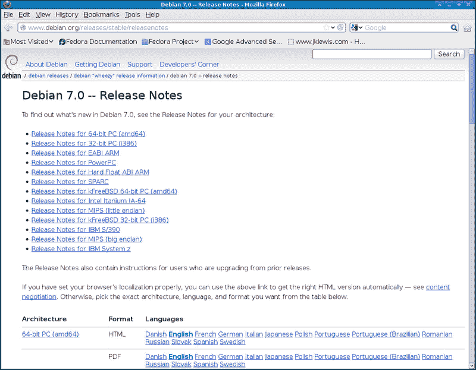
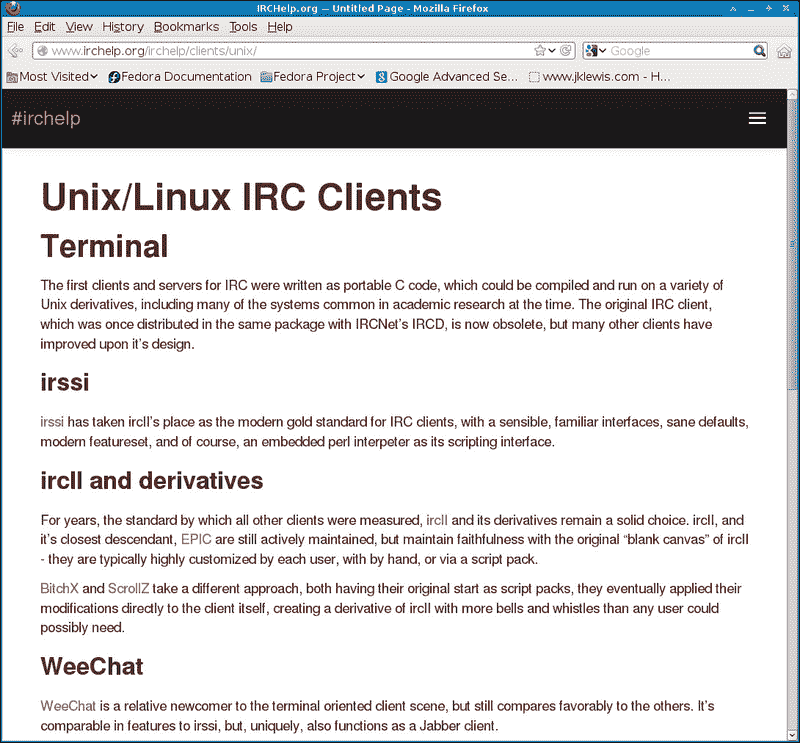
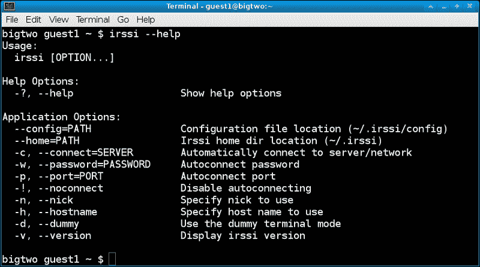

# 附录 B：寻求帮助

在本附录中，我们将涵盖以下主题：

+   使用`man`页面

+   使用`info`命令

+   命令和`Usage`部分

+   本地文档目录

+   浏览网页以寻求帮助

+   发行说明

+   Linux 用户组

+   Internet Relay Chat（IRC）

# 介绍

在 Linux 上寻求帮助的地方有很多。实际上，有很多可用的信息；事实上，在某些情况下太多了。很难从好东西中过滤出噪音。在这里，我们试图向您展示如何快速有效地获得所需的内容。

# 使用 man 页面

`man`实用程序是本地参考手册的接口。它用于快速查找有关程序、实用程序、函数和其他主题的信息。`man`实用程序将接受几个选项；但是，通常的调用只是`man page`，其中 page 实际上是指一个主题。您甚至可以单独运行`man`来学习如何使用它。

以下是`man man`命令的屏幕截图：



在页面上运行`man`显示感兴趣的主题。空格键用于向下翻页，*Q*用于退出。页面（主题）以更或多或少标准的顺序呈现，可能的部分名称有：`NAME`，`SYNOPSIS`，`CONFIGURATION`，`DESCRIPTION`，`EXAMPLES`，`OVERVIEW`，`DEFAULTS`，`OPTIONS`，`EXIT STATUS`，`RETURN VALUE`，`ENVIRONMENT`，`FILES`，`VERSIONS`，`CONFORMING TO`，`NOTES`，`BUGS`，`AUTHORS`，`HISTORY`和`SEE ALSO`。

`man`显示找到的第一页，即使其他部分中有更多页面。例如，假设您正在寻找有关如何在 C 程序中编写`readlink`函数的信息。您可以尝试以下命令：

```
man readlink

```

它会打开一个页面，但是命令是`readlink`而不是 C 函数。为什么？因为它显示第一页，除非您在页面之前指定部分编号。好吧，您怎么知道那是什么？您可以以以下方式使用`man`选项`-a`运行`man`：

```
man -a readlink

```

这将像以前一样提出`readlink`命令。现在按*Q*退出。页面消失了，但是`man`会话显示如下内容：

```
Big4 /lewis/Fedora/17 # man -a readlink
--Man-- next: readlink(2) [ view (return) | skip (Ctrl-D) | quit (Ctrl-C) ]

```

这给了您一个选择：按*Enter*将显示下一页（主题），*Ctrl* + *D*将跳转到下一个主题，*Ctrl* + *C*将结束`man`会话。当您在最后一个主题上按*Q*时，`man`将像以前一样正常终止。

那么，如果您已经知道要直接加载第三部分的页面，该怎么办？您可以以以下方式指定它：

```
man 3 readlink

```

这将跳过前两个，直接进入 POSIX 程序员手册中的`readlink`页面。

以下是各节编号及其名称的列表：

+   1：可执行程序或 shell 命令

+   2：系统调用（内核提供的函数）

+   3：库调用（程序库中的函数）

+   4：特殊文件（通常在`/dev`中找到）

+   5：文件格式和约定（例如，`/etc/passwd`）

+   6：游戏

+   7：其他（包括宏包和约定），例如，man(7)和 groff(7)

+   8：系统管理命令

+   9：内核例程

本地参考手册可以是获取信息的重要来源。它们包含有关 Linux 系统中几乎所有内容的大量数据。不幸的是，它们也有一些缺点。大多数写得很好并且有意义。有些则相当糟糕。当发生这种情况时，还有其他地方可以寻求帮助。

# 使用 info 命令

除了 man 页面外，大多数 Linux 系统还有`Info`文档。这些是通过使用`info`程序访问的。一般来说，`Info`文档提供的数据往往比典型的`man`页面更详细和更有信息量。

像`man`一样，您可以单独运行 info：

```
info info

```

这是如何使用`info`的介绍。最后一段说**如果对 info 不熟悉，现在输入'h'。这将带你进入一个程序化的指令序列**。如果你有兴趣学习如何充分利用`info`，我建议在这里按*H*来运行教程。

以下是运行`info info`然后按*H*的屏幕截图：



# 命令和用法部分

Linux 中的大多数命令都有一个`Usage`部分，可以通过使用`--help`选项来显示。典型的例子有`cat`，`cut`，`ifconfig`，`bash`，`rm`等。

以下是`rm --help`的屏幕截图：



请注意，一般来说，`Usage`部分并不真的意在教会某人很多关于一个命令。它真的是用来提醒用户参数是什么，以及命令的一般格式。

请注意，一些命令，特别是那些需要参数才能完成某些操作的命令，只需调用而不提供参数就会显示它们的用法信息。

以下是运行`awk`命令而不带参数的屏幕截图：



# 本地文档目录

大多数完整的 Linux 发行版都有包含各种主题文档的目录。根据使用的发行版不同，布局可能略有不同，但在大多数情况下，文件位于`/usr/share/doc`目录中。以下是从 Fedora 14 中`/usr/share/doc`目录的部分列表：

+   `/usr/share/doc/BackupPC-3.1.0`

+   `/usr/share/doc/ConsoleKit-0.4.2`

+   `/usr/share/doc/Django-1.2.3`

+   `/usr/share/doc/GConf2-2.31.91`

+   `/usr/share/doc/GeoIP-1.4.7`

+   `/usr/share/doc/GitPython-0.2.0`

+   `/usr/share/doc/HTML`

+   `/usr/share/doc/ImageMagick-6.6.4.1`

+   `/usr/share/doc/ModemManager-0.4`

+   `/usr/share/doc/MySQL-python-1.2.3`

+   `/usr/share/doc/NetworkManager-0.8.1`

+   `/usr/share/doc/abrt-1.1.13`

+   `/usr/share/doc/ant-1.7.1`

+   `/usr/share/doc/apcupsd-3.14.8`

+   `/usr/share/doc/doxygen-1.7.1`

+   `/usr/share/doc/ethtool-2.6.38`

+   `/usr/share/doc/fedora-release-14`

+   `/usr/share/doc/gcc-4.5.1`

+   `/usr/share/doc/gcc-c++-4.5.1`

+   `/usr/share/doc/gimp-2.6.11`

+   `/usr/share/doc/git-1.7.3.1`

+   `/usr/share/doc/gnome-desktop-2.32.0`

+   `/usr/share/doc/gnuchess-5.07`

+   `/usr/share/doc/httpd-2.2.16`

+   `/usr/share/doc/httpd-tools-2.2.16`

+   `/usr/share/doc/java-1.6.0-openjdk-1.6.0.0`

+   `/usr/share/doc/java-1.6.0-openjdk-devel-1.6.0.0`

+   `/usr/share/doc/kaffeine-1.1`

+   `/usr/share/doc/mailx-12.4`

+   `/usr/share/doc/make-3.82`

+   `/usr/share/doc/man-db-2.5.7`

+   `/usr/share/doc/man-pages-3.25`

还有一个文档查看器/浏览器，通常通过文件夹对话框访问。例如，如果你打开文件管理器并转到`/usr/share/doc`下的一个目录，你会看到许多文件。点击`README`文件将会带出更多关于你系统上特定程序的信息。还可能有其他可读的文件，比如`CONTENT`，`AUTHOR`，`MAINTAINERS`，`INSTALLATION`等等。

# 浏览网页寻找帮助

使用互联网肯定是在 Linux 任务上寻找帮助的好方法。在许多情况下，它甚至可能比依赖本地来源更好，因为自从文档上次放在你的系统上以来可能已经发生了更新。当我需要使用网络查找某些东西时，我直接去谷歌高级搜索。

以下是[`www.google.com/advanced_search`](http://www.google.com/advanced_search)的屏幕截图，其中一些字段已经填写：



使用这种搜索方法很快，你可以使用这些字段来缩小你要查找的范围。

请记住，互联网上有很多信息。其中一些是准确的，正是您所寻找的。然而，在许多情况下，信息是不正确的。回答问题的人可能会表现得自己是该主题的专家，而实际上并非如此。许多人在提出解决方案之前也不总是检查他们的解决方案。在尝试互联网上给出的解决方案时要注意这一点。

这种情况的反面也是正确的。如果您想帮助他人，那绝对是很好的。但是，在发送答复之前，请考虑并测试您希望提供的任何解决方案的准确性。

# 发行说明

了解有关您的 Linux 发行版的更多信息的一个很好的方法是查看其发行说明。这些通常包含以下信息：

+   它们记录了自上次发布以来所做的更改。通常分为特定用户的部分，如系统管理员、桌面用户、开发人员等。请注意，在某些发行版中，“技术说明”文档中提供了更多信息。

+   它们详细说明了运行“发行版”所需的最低硬件要求/架构。特别关注内存、图形和视频问题。

+   它们提供了重点介绍引导和特殊或不寻常设置的安装说明。

+   它们提供了可以安装的可能桌面环境的列表，通常附有安装步骤。这是一个非常重要的部分，因为使用设计不佳和/或有错误的桌面会影响您的生产力。

+   它们解释了新功能、功能和程序的添加情况。有时会跟上添加背后的原因，以及替换了哪个程序。

+   它们包括一个列出被弃用（移除）的程序和功能的列表。

+   它们指出了在哪里获取额外帮助的指针，如网站和聊天室。

+   它们包含了“发行版”中仍然存在的已知错误和问题的列表，以及可能的解决方法的信息。在提交错误报告之前，始终查阅此列表。

+   它们提供了如何就发行版和发行说明提供反馈意见的说明，以及您希望添加/更改的任何功能。

以下是来自[http://docs.fedoraproject.org/en-US/Fedora/19/html/Release_Notes/index.html]的 Fedora 19 发行说明的截图：



以下是来自[https://wiki.ubuntu.com/RaringRingtail/ReleaseNotes]的 Ubuntu 13.04 发行说明的链接：



以下截图是来自[http://www.debian.org/releases/stable/amd64/release-notes]的 Debian 7.0（Wheezy）：



发行说明非常值得一读。在安装新发行版之前、期间和之后，我都会浏览它们。这确保我充分利用了我的发行版，告诉我新功能，并帮助我避免花费过多时间和精力来解决已知的错误或问题。

# Linux 用户组

另一个很好的寻求帮助的地方是您当地的用户组。要找到您附近的用户组，请尝试在 Linux 用户组上进行高级 Google 搜索，然后输入您的城市（如果需要，还有州）。您应该会看到一些选项。请注意，大多数只需要有效的电子邮件地址即可订阅该组。一般来说，要提问，您只需像平常一样撰写问题，然后将其发送到组的电子邮件地址。通常，对该领域有了解的人通常会迅速提供帮助，并通过电子邮件向组回复可能的答案。在大多数情况下，您还可以搜索组的存档以查找信息。

我通过在**Central Texas Linux Users Group**（**CTLUG**）上提问找到了许多困难问题的答案。

以下是[`ctlug.org/`](http://ctlug.org/)的 CTLUG 网站的屏幕截图：


# Internet Relay Chat (IRC)

使用 IRC 是了解您感兴趣的各种主题的好方法。这也是一个很好的寻求帮助的地方。经常访问这些聊天室的人通过加入与他们感兴趣并且了解的主题相关的频道来实现。这也都是实时进行的，无需等待电子邮件回复。您只需要一个 IRC 客户端、一个服务器和一个组（频道）来加入，（在大多数情况下）就可以开始了。有很多不同的 IRC 客户端。其中一些是文本模式（命令行），一些是基于 GUI 的。

以下是[`www.irchelp.org/irchelp/clients/unix/`](http://www.irchelp.org/irchelp/clients/unix/)的屏幕截图，这是一个展示 Linux 和 Unix 的不同 IRC 客户端的网站：



如果您是 IRC 的新手，以下是一些指针，可以帮助您入门。我之前没有安装过 IRC 客户端，所以首先安装了`irssi`在我的 Fedora 17 机器上，通过以 root 身份运行`yum`命令：

```
yum -y install irssi

```

这很顺利。

以下是 Fedora 17 上`irssi –help`的屏幕截图：



这个程序允许进行相当多的自定义。我的系统上的默认配置包含在`/home/<user>/.irssi/config`文件中。您可以使用先前的设置来覆盖这些设置。现在，让我们先简单运行它，看看它是什么样子。

1.  首先运行`irssi`。它应该会带出一个文本模式屏幕，并向您显示欢迎消息，因为这是您第一次进入。

1.  连接到服务器。在这个例子中，我们将使用 freenode。运行：

```
/connect irc.freenode.net

```

1.  您应该看到另一条欢迎类型的消息。现在我们需要一个频道。在这个例子中，运行`/join #chat`命令（不要忘记`#`符号）。

1.  您现在应该通过`#chat`频道连接到 freenode，并能够与其他用户聊天。

请注意，`irssi`确实需要一点时间来适应。底部是一个状态屏幕。您可能会看到类似**[ Act: 2]**或等效的内容。这表示另一个窗口中有新的文本，您可以通过按下*Alt*键，然后按数字来访问该窗口。因此，*Alt* + *2*将带您到下一个屏幕。

您在其中输入的任何内容，如果没有以`/`符号开头，都将发送给当前组中的所有人。请记住这是一个公共论坛；请小心您说的话，并遵循指示。还要注意不要在聊天会话中透露个人信息。

有很多网站上包含有关 IRC 的信息。以下是我找到的一些网站：

+   [`www.irchelp.org/`](http://www.irchelp.org/)

+   [`www.linux.org/article/view/irssi-for-beginners-2012`](http://www.linux.org/article/view/irssi-for-beginners-2012)

+   [`www.tldp.org/LDP/sag/html/irc.html`](http://www.tldp.org/LDP/sag/html/irc.html)

+   [`wiki.archlinux.org/index.php/IRC_Channel`](https://wiki.archlinux.org/index.php/IRC_Channel)

有很多 Linux 频道可供选择，很难把它们列成一份清单。有些需要认证，而有些则可以立即开始聊天。找到它们的最佳方法是在互联网上搜索你需要帮助的主题，并包括短语 IRC。连接到适当的服务器，加入频道，遵循可能存在的任何特殊指示，并享受聊天乐趣！
