你的第一个按键

我想欢迎你来到这本书的第一章。当你阅读这本书时，你会感觉自己在读一个故事，但这不是一般的故事，这是 Linux 的故事。在这一章中，你将了解 Linux 的起源以及 Linux 对当今世界的影响。你还将了解 Linux 如何塑造计算机的未来。最后，你将学会如何在计算机上安装 Linux 虚拟机。所以，不多说了，让我们开始吧。

# 第二章：一点历史

Linux 的故事始于 1991 年，当时芬兰赫尔辛基大学的计算机科学学生 Linus Torvalds 开始写一个免费的操作系统作为业余爱好！现在想想，他的业余项目竟然成为了历史上最大的开源项目。哦，如果你还没有意识到，这个免费的操作系统就是 Linux。网上有很多关于开源的定义，其中一些对于没有经验的读者来说有些混乱，所以这里有一个简化的解释：

**什么是开源？**

开源项目是指其源代码对公众开放查看和编辑的软件项目。

源代码只是用于开发软件的代码（程序）的集合；在 Linux 的上下文中，它指的是构建 Linux 操作系统的编程代码。现在你知道什么是开源，很容易想象什么是封闭源：

**什么是封闭源？**

封闭源项目是指其源代码不对公众开放查看和编辑的软件项目。

Linux 是开源项目的最著名的例子。另一方面，微软 Windows 是封闭源项目的最著名的例子。

有些人不知道什么是操作系统，但不用担心；我会帮你解释。这里有一个简单的操作系统定义：

**什么是操作系统？**

操作系统是一种管理计算机资源（如内存和磁盘空间）的软件程序。它还允许计算机的硬件和软件相互通信。操作系统也可能包括其他应用程序：文本编辑器、文件管理器、图形用户界面、软件管理器等。

这里有很多不同的操作系统；以下是一些例子：

+   Linux

+   Android

+   macOS

+   Microsoft Windows

+   Apple iOS

+   BlackBerry

请记住，这个列表非常简短，无法全面涵盖。有大量的操作系统，甚至很难统计它们的数量。

谈到操作系统时，我们必须提到内核，它是任何操作系统的核心。

**什么是内核？**

内核只是任何操作系统的核心。它是操作系统的一部分，用于组织对 CPU、内存和磁盘等系统资源的访问。

请注意，在定义中，我说内核是操作系统的一部分。下图可以帮助你形象地理解内核和操作系统之间的区别。

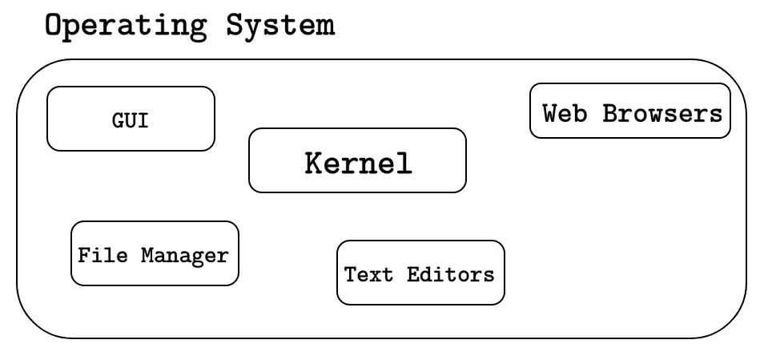

图 1：操作系统 vs. 内核

与微软 Windows 或 macOS 不同，Linux 有许多不同的风味；这些风味被称为发行版，也被简称为 distros。

**什么是 Linux 发行版？**

由于 Linux 是开源的，许多人和组织已经修改了 Linux 内核以及 Linux 操作系统的其他组件，以开发和定制适合他们需求的 Linux 版本。

实际上有数百种 Linux 发行版！你可以去[www.distrowatch.com](http://www.distrowatch.com)查看庞大的 Linux 发行版列表。

[distrowatch.com](http://www.distrowatch.com)的好处在于它显示了世界上所有 Linux 发行版的受欢迎程度排名。您甚至会发现一些 Linux 发行版是根据特定目的设计的。例如，Scientific Linux 是许多科学家中受欢迎的 Linux 发行版，因为它预装了许多科学应用程序，这使它成为科学界的首选 Linux。

# 今天的 Linux 和未来

1991 年，Linux 只是一个小宝宝。但这个宝宝迅速成长，变得非常受欢迎。如今，Linux 为全球超过 90%的顶级超级计算机提供动力。而且让你惊讶的是，你可能已经使用 Linux 多年而没有注意到。怎么可能？如果你曾经使用过安卓智能手机，那么你就使用过 Linux，因为安卓是一个 Linux 发行版！如果你还不相信我，去[distrowatch.com](http://www.distrowatch.com)搜索安卓。

更严肃的问题是，大多数政府服务器都运行 Linux，这就是为什么您会看到很多政府技术工作需要懂得 Linux 的人。此外，亚马逊、eBay、PayPal、沃尔玛等大公司都依赖 Linux 来运行他们的先进和复杂的应用程序。此外，Linux 在云端占据主导地位，超过 75%的云解决方案都在运行 Linux。

Linux 的故事真是鼓舞人心。曾经的爱好现在已经成为互联网的主导力量，而 Linux 的未来看起来更加光明。著名的汽车制造商和汽车制造商如雷克萨斯和丰田现在正在采用 Linux 技术，比如**汽车级 Linux**（**AGL**）。您可以在[www.automotivelinux.org](http://www.automotivelinux.org)上找到更多信息。

Linux 还运行在许多嵌入式设备上，并且是流行的树莓派、Beagle Bone 和许多其他微控制器的基础。您甚至可能会惊讶地知道一些洗衣机也在运行 Linux！所以每当你去洗衣服的时候，花点时间，感谢我们生活中有 Linux。

# 安装 Linux 虚拟机

有多种安装 Linux 系统的方法。例如，如果您目前正在作为主要操作系统运行 Windows，那么您可能可以在 Windows 旁边双启动 Linux，但这种方法对初学者不友好。安装过程中的任何错误可能会给您带来很多头痛，而且在某些情况下，您甚至可能无法再启动 Windows！我想要帮您避免很多痛苦和烦恼，所以我将向您展示如何将 Linux 安装为虚拟机。

什么是虚拟机？

虚拟机就是在另一台计算机（主机）内运行的计算机。虚拟机共享主机资源，表现得就像独立的物理机一样。

您还可以拥有嵌套虚拟机，这意味着您可以在另一个虚拟机内运行虚拟机。

安装虚拟机的过程很简单，您只需要按照以下步骤进行：

1.  安装 VirtualBox（或 VMware Player）。

1.  下载任何 Linux 发行版的 ISO 镜像。

1.  打开 VirtualBox 并开始安装过程。

第一步是安装 VirtualBox，这是一个跨平台的虚拟化应用程序，可以让我们创建虚拟机。VirtualBox 是免费的，可以在 macOS、Windows 和 Linux 上运行。快速搜索一下：VirtualBox 下载就可以搞定。如果你感到有点懒，你可以在以下链接下载 VirtualBox：[www.virtualbox.org/wiki/Downloads](http://www.virtualbox.org/wiki/Downloads)。

安装完 VirtualBox 后，您现在需要下载任何 Linux 发行版的 ISO 镜像。在本书中，您将使用 Ubuntu，这在初学者中可能是最受欢迎的 Linux 发行版。您可以在以下链接下载 Ubuntu：[www.ubuntu.com/download/desktop](http://www.ubuntu.com/download/desktop)。

我建议您下载最新的 Ubuntu **LTS**（**长期支持**）版本，因为它经过了充分测试，并且有更好的支持。

最后一步，您需要打开 VirtualBox，并使用您从*步骤 2*下载的 Ubuntu ISO 镜像创建一个 Linux 虚拟机。

打开 VirtualBox 时，您需要从菜单栏中选择“新建”。

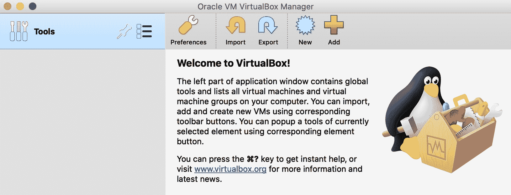

图 2：创建新虚拟机

然后，您需要选择新虚拟机的名称和类型。

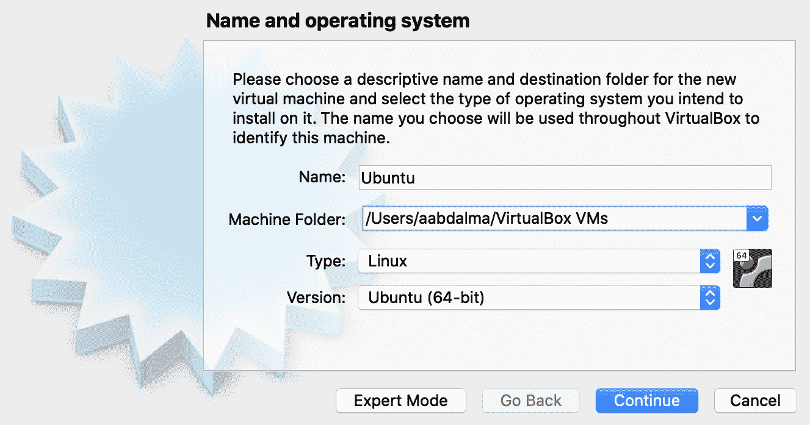

图 3：选择名称和类型

之后，点击“继续”，选择要为虚拟机分配多少内存。我强烈建议选择`2`GB 或更多。例如，在下面的截图中，我选择为我的虚拟机分配`4096`MB 的内存（RAM），相当于`4`GB。

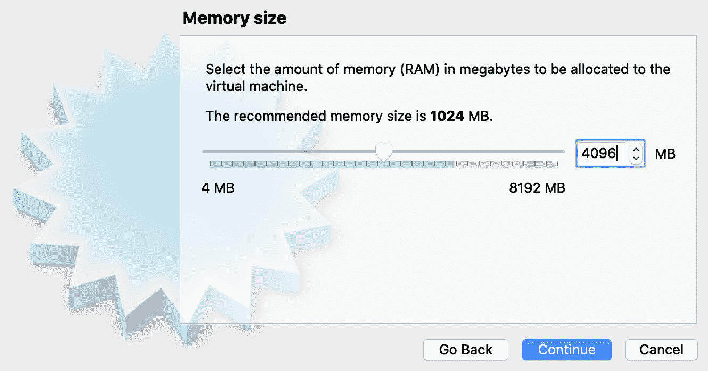

图 4：选择内存大小

之后，点击“继续”，确保选择“现在创建虚拟硬盘”，如下截图所示，然后点击“创建”。

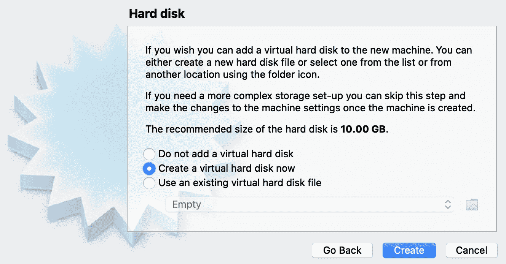

图 5：创建硬盘

之后，选择**VDI**（**VirtualBox 磁盘映像**），如下截图所示，然后点击继续。

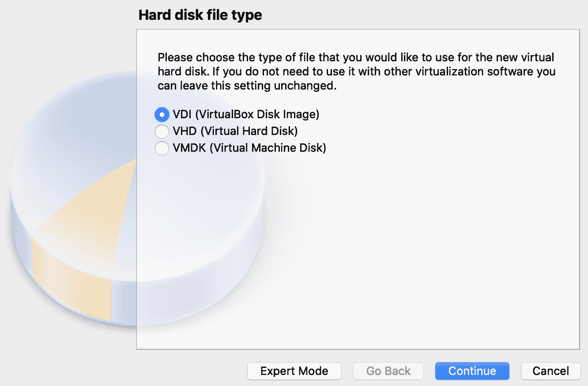

图 6：硬盘文件类型

现在选择“动态分配”，如下截图所示，然后点击“继续”。

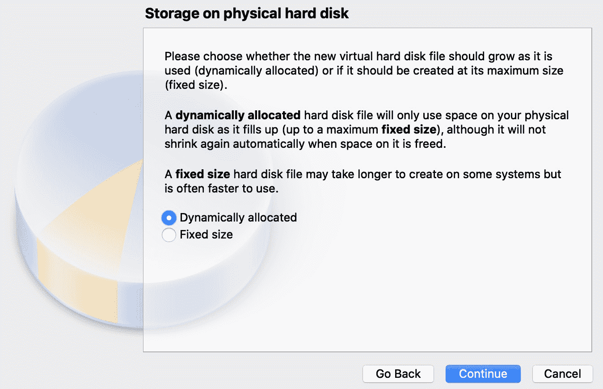

图 7：物理硬盘上的存储

现在您可以选择虚拟机的硬盘大小。我强烈建议您选择`10`GB 或更高。在下面的截图中，我选择了`20`GB 作为我的虚拟机的硬盘大小。

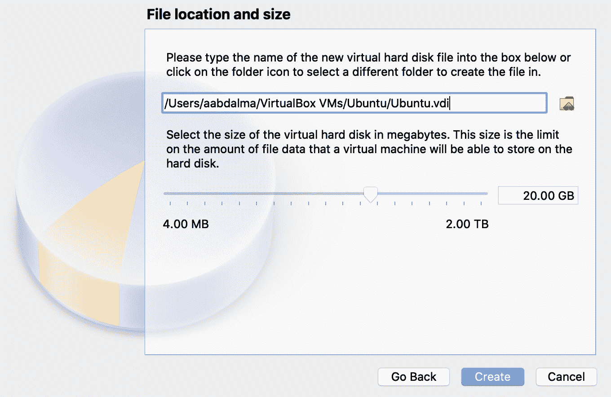

图 8：硬盘大小

选择硬盘大小后，点击“创建”完成虚拟机的创建。

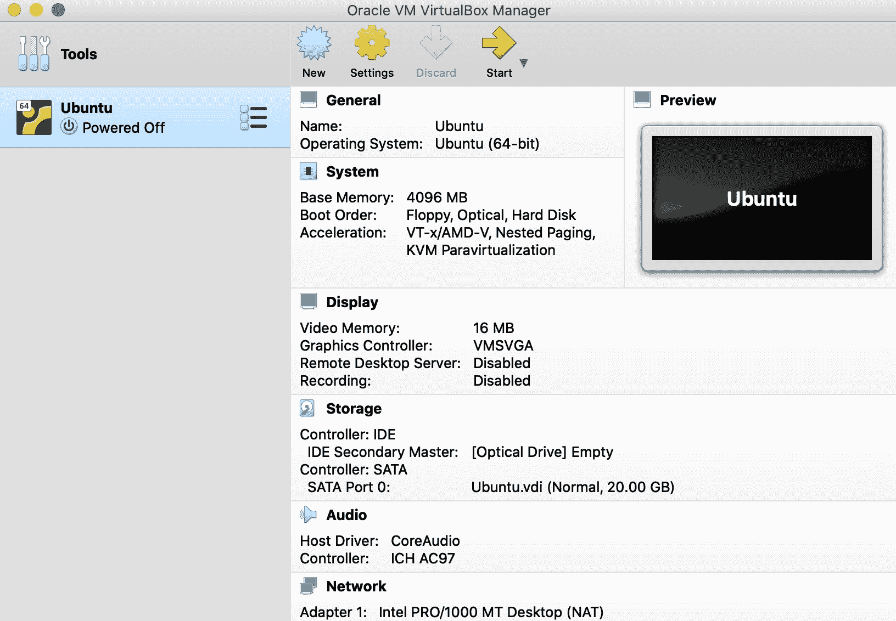

图 9：虚拟机已创建

您可以点击绿色的“启动”按钮来启动您的虚拟机。然后，您需要选择一个启动盘，如下截图所示。

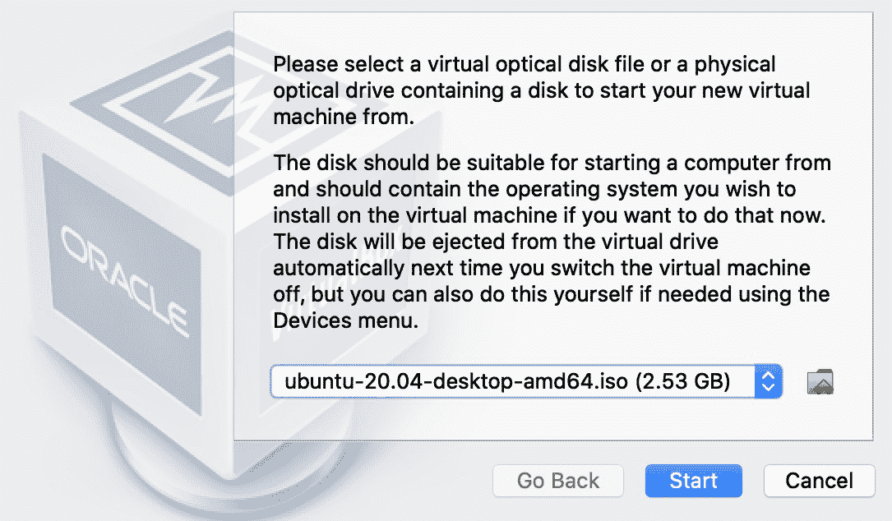

图 10：选择启动盘

选择您已下载的 Ubuntu ISO 镜像，然后点击“启动”以启动 Ubuntu 安装程序，如下截图所示。

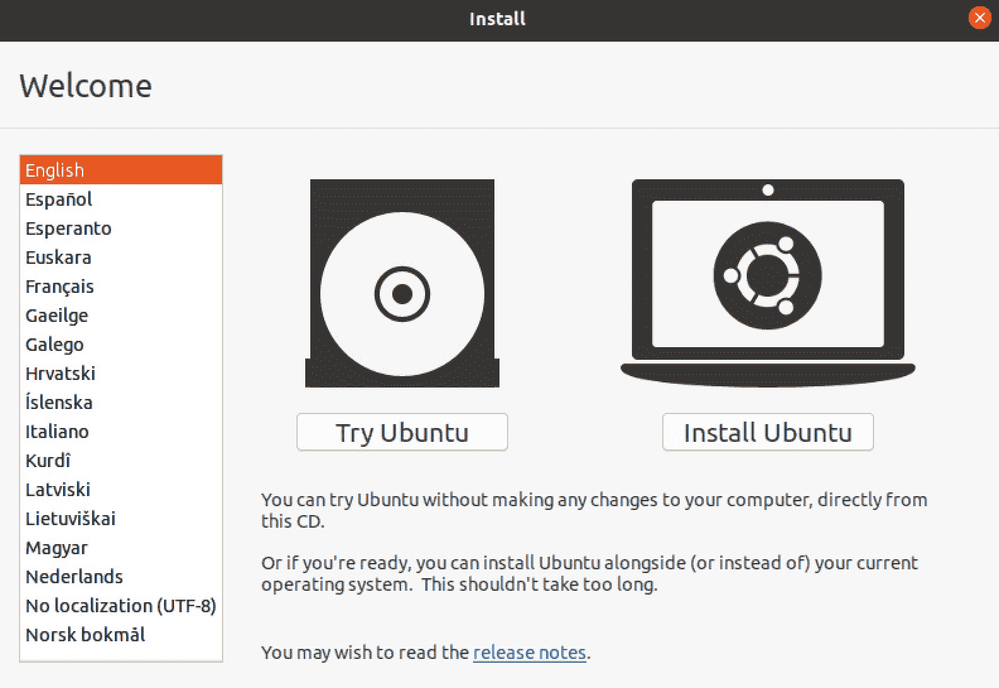

图 11：Ubuntu 安装程序

现在您可以选择安装 Ubuntu。接下来，您将需要选择语言和键盘布局。之后，您应该继续接受默认设置。

最终，您将来到创建新用户的步骤，如下截图所示。

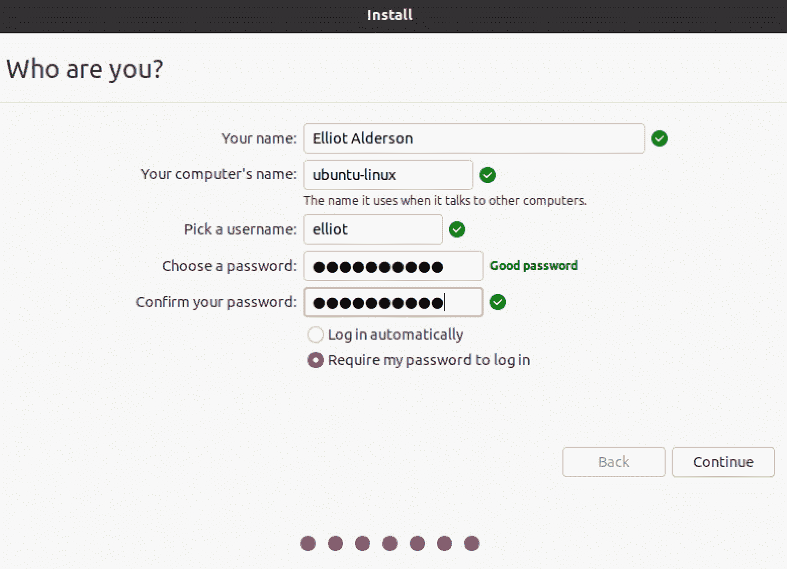

图 12：创建新用户

我选择了用户名`elliot`，因为我是《黑客军团》这部电视剧的忠实粉丝，而且 Elliot 在轻松地黑入 E Corp 时一直在使用 Linux！我强烈建议您选择`elliot`作为您的用户名，这样您就可以更轻松地跟着本书学习。

然后您可以点击“继续”，系统安装将开始，如下截图所示。

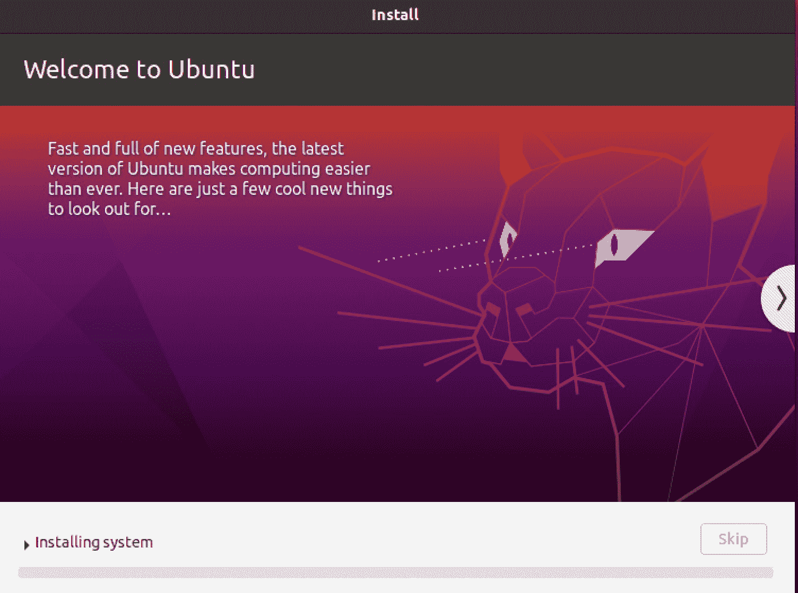

图 13：系统安装

安装过程将需要几分钟。在安装完成时，请耐心等待或自己泡杯咖啡。

安装完成后，您需要重新启动虚拟机，如下截图所示。

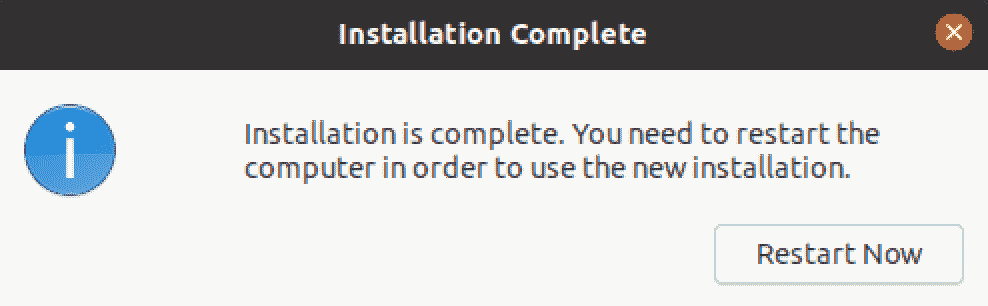

图 14：安装完成

您可以点击“立即重启”。之后，可能会要求您移除安装介质，您可以通过选择“设备” -+ “光驱” -+ “从虚拟驱动器中移除磁盘”来完成。

最后，您应该看到登录界面，如下截图所示。


图 15：Ubuntu 登录

现在您可以输入密码，万岁！您现在已经进入了 Linux 系统。

还有其他方法可以用来尝试 Linux 系统。例如，您可以在**AWS**（**亚马逊网络服务**）上创建一个账户，并在 Amazon EC2 实例上启动一个 Linux 虚拟机。同样，您也可以在 Microsoft Azure 上创建一个 Linux 虚拟机。所以，可以说你很幸运生活在这个时代！过去，要在 Linux 上运行起来是一个痛苦的过程。

# 终端与 Shell

**图形用户界面**（**GUI**）相当容易理解。您可以轻松地四处走动，连接到互联网并打开您的网络浏览器。所有这些都很容易，正如您在下面的截图中所看到的。

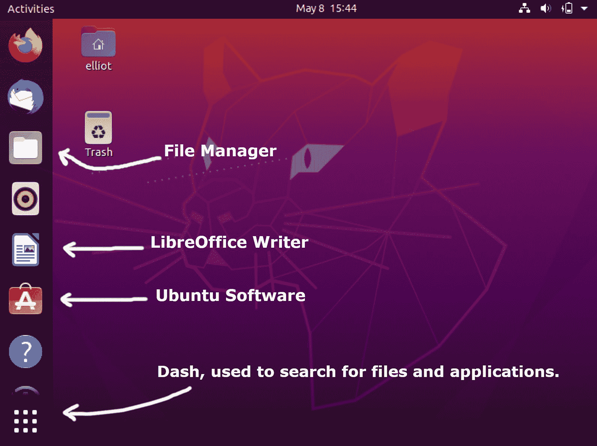

图 16：图形用户界面

您可以使用**Ubuntu 软件**在系统上安装新的软件程序。

您可以使用**Dash**与在 Microsoft Windows 上使用“开始”菜单启动应用程序的方式相同。

**LibreOffice Writer**是一个出色的文字处理器，与 Microsoft Word 具有相同的功能，只有一个区别；它是免费的！

现在，您可以成为一个休闲的 Linux 用户，这意味着您可以使用 Linux 来执行日常用户所做的基本任务：浏览 YouTube，发送电子邮件，搜索 Google 等。但是，要成为一个高级用户，您需要熟练使用 Linux 的**命令行界面**。

要访问 Linux 的**命令行界面**，您需要打开终端仿真器，通常简称为**终端**。

**什么是终端仿真器？**

终端仿真器是一种模拟物理终端（控制台）的程序。终端与 Shell（命令行界面）进行交互。

好了，现在您可能会摸着头皮问自己：“什么是 Shell？”

**什么是 Shell？**

Shell 是一个命令行解释器，也就是说，它是一个处理和执行命令的程序。

好了，够了，不要再讲理论了。让我们通过一个示例来理解并把所有东西联系在一起。继续打开终端，点击 Dash，然后搜索`终端`。您也可以使用快捷键*Ctrl*+*Alt*+*T*来打开终端。当终端打开时，您将看到一个新窗口，就像下面的截图所示。

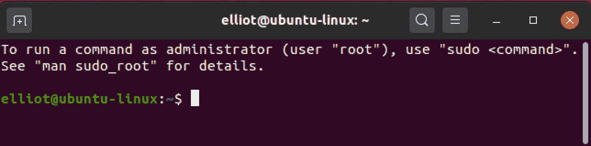

图 17：终端

它看起来有点像 Microsoft Windows 上的命令提示符。好了，现在在您的终端上输入`date`，然后按*Enter*：

```
elliot©ubuntu-linux:-$ date 
Tue Feb 17 16:39:13 CST 2020
```

现在让我们讨论发生了什么，`date`是一个打印当前日期和时间的 Linux 命令，当您按下*Enter*后，Shell（在幕后工作）然后执行了`date`命令，并在您的终端上显示了输出。

您不应该混淆**终端**和**Shell**。终端是您在屏幕上看到的窗口，您可以在其中输入命令，而 Shell 负责执行命令。就是这样，没有更多，也没有更少。

您还应该知道，如果您输入任何无意义的内容，您将会收到**命令未找到**的错误，就像下面的例子中所示的那样：

```
elliot©ubuntu-linux:-$ blabla 
blabla: command not found
```

# 一些简单的命令

恭喜您学会了您的第一个 Linux 命令（`date`）。现在让我们继续学习更多！

通常在显示日期后会显示日历，对吧？要显示当前月份的日历，您可以运行`cal`命令：

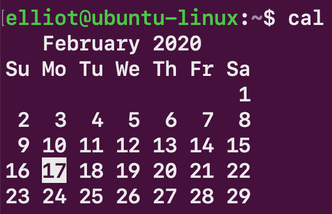

图 18：cal 命令

您还可以显示整年的日历，例如，要获取完整的 2022 年日历，您可以运行：

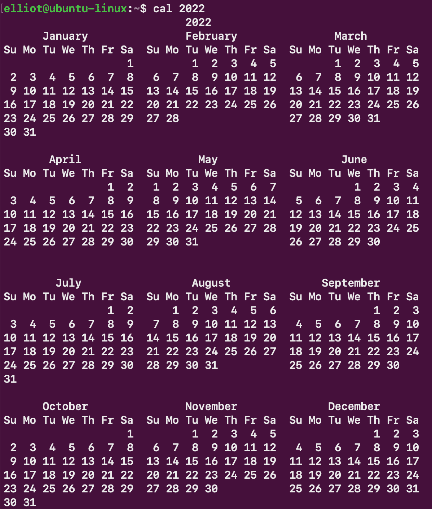

图 19：2022 年的 cal 命令

您还可以指定一个月份，例如，要显示 1993 年 2 月的日历，您可以运行以下命令：

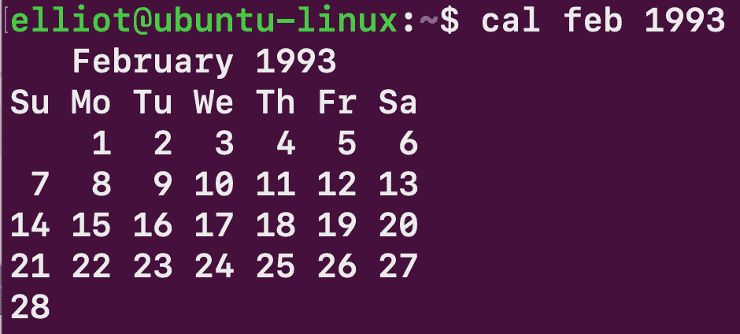

图 20：1993 年 2 月的 cal 命令

您现在在终端上有很多输出。您可以运行`clear`命令来清除终端屏幕：

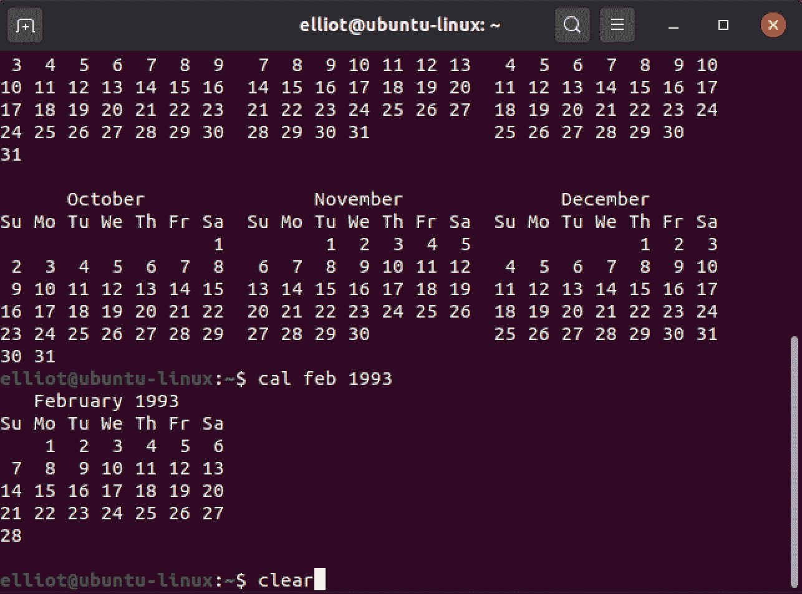

图 21：清除前

这是在运行`clear`命令后你的终端会看起来的样子：

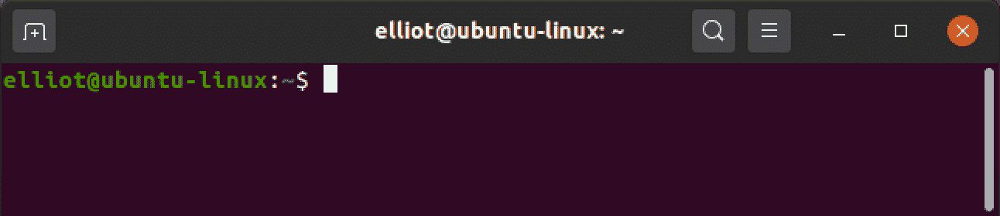

图 22：清除后

您可以使用`lscpu`命令，它是**列出 CPU**的缩写，来显示 CPU 架构信息：

```
elliot©ubuntu-linux:-$ lscpu 
Architecture:          x86_64
CPU op-mode(s):        32-bit, 64-bit 
Byte Order:            Little Endian
CPU(s):                1
On-line CPU(s) list:   0
Thread(s) per core:    1 
Core(s) per socket:    1 
Socket(s):             1
NUMA node(s):          1
Vendor ID:             GenuineIntel
CPU family:            6
Model:                 61
Model name:            Intel(R) Core(TM) i5-5300U CPU© 2.30GHz Stepping: 4
CPU MHz:               2294.678
BogoMIPS:              4589.35
Hypervisor vendor:     KVM 
Virtualization type:   full 
Lid cache:             32K
L1i cache:             32K
L2 cache:              256K
L3 cache:              3072K 
NUMA nodeO CPU(s):     0
Flags:                 fpu vme de pse tsc msr pae mce cx8 apic sep mtrr
```

您可以使用`uptime`命令来检查系统已运行多长时间。`uptime`命令还会显示：

+   当前时间。

+   当前已登录的用户数。

+   过去 1、5 和 15 分钟的系统负载平均值。

```
elliot©ubuntu-linux:-$ uptime
18:48:04 up 4 days, 4:02, 1 user, load average: 0.98, 2.12, 3.43
```

您可能会对`uptime`命令的输出感到害怕，但不用担心，下表会为您解释输出内容。

| `18:48:04` | 输出中看到的第一件事是当前时间。 |
| --- | --- |
| `已运行 4 天 4 小时 2 分钟` | 这基本上是说系统已经运行了 4 天 4 小时 2 分钟。 |
| `1 个用户` | 目前只有一个用户登录。 |
| `负载平均值：0.98, 2.12, 3.43` | 过去 1、5 和 15 分钟的系统负载平均值。 |

表 1：uptime 命令输出

您可能以前没有听说过负载平均值。要理解负载平均值，首先必须了解系统负载。

**什么是系统负载？**

简单来说，系统负载是 CPU 在给定时间内执行的工作量。

因此，计算机上运行的进程（或程序）越多，系统负载就越高，运行的进程越少，系统负载就越低。现在，既然您了解了系统负载是什么，那么理解负载平均值就很容易了。

**什么是负载平均值？**

负载平均值是在 1、5 和 15 分钟内计算的平均系统负载。

因此，您在`uptime`命令输出的末尾看到的三个数字分别是 1、5 和 15 分钟的负载平均值。例如，如果您的负载平均值为：

```
load average: 2.00, 4.00, 6.00
```

然后这三个数字分别代表以下内容：

+   `2.00 --+`：过去一分钟的负载平均值。

+   `4.00 --+`：过去五分钟的负载平均值。

+   `6.00 --+`：过去十五分钟的负载平均值。

从负载平均值的定义中，我们可以得出以下关键点：

1.  负载平均值为`0.0`表示系统处于空闲状态（什么也不做）。

1.  如果 1 分钟负载平均值高于`5`或`15`分钟的平均值，则这意味着您的系统负载正在增加。

1.  如果 1 分钟负载平均值低于`5`或`15`分钟的平均值，则这意味着您的系统负载正在减少。

例如，负载平均值为：

```
load average: 1.00, 3.00, 7.00
```

显示系统负载随时间减少。另一方面，负载平均值为：

```
load average: 5.00, 3.00, 2.00
```

表明系统负载随时间增加。作为实验，首先通过运行`uptime`命令记录负载平均值，然后打开您的网络浏览器并打开多个选项卡，然后重新运行`uptime`；您会看到负载平均值已经增加。之后关闭浏览器并再次运行`uptime`，您会看到负载平均值已经减少。

您可以运行`reboot`命令来重新启动系统：

```
elliot©ubuntu-linux:-$ reboot
```

您可以运行`pwd`命令来打印当前工作目录的名称：

```
elliot©ubuntu-linux:-$ pwd
/home/elliot
```

当前工作目录是用户在特定时间工作的目录。默认情况下，当您登录到 Linux 系统时，您的当前工作目录设置为您的主目录：

```
/home/your_username
```

**什么是目录？**

在 Linux 中，我们将文件夹称为目录。目录是包含其他文件的文件。

您可以运行`ls`命令来列出当前工作目录的内容：

```
elliot©ubuntu-linux:-$ ls
Desktop Documents Downloads Music Pictures Public Videos
```

如果您想更改密码，可以运行`passwd`命令：

```
elliot©ubuntu-linux:-$ passwd 
Changing password for elliot. 
(current) UNIX password:
Enter new UNIX password:
Retype new UNIX password:
passwd: password updated successfully
```

您可以使用`hostname`命令来显示系统的主机名：

```
elliot©ubuntu-linux:-$ hostname 
ubuntu-linux
```

您可以使用`free`命令来显示系统上的空闲和已使用内存量：

```
elliot©ubuntu-linux:-$ free
 total      used    free   shared   buff/cache  available 
Mem:    4039732   1838532  574864    71900      1626336    1848444
Swap:    969960         0  969960
```

默认情况下，`free`命令以千字节为单位显示输出，但只有外星人才能理解这个输出。

通过使用`-h`选项运行`free`命令，您可以获得对我们人类有意义的输出：

```
elliot©ubuntu-linux:-$ free -h
 total     used     free     shared     buff/cache     available
Mem:      3.9G     1.8G     516M        67M           1.6G          1.7G
Swap:     947M       OB     947M 
```

这样好多了，对吧？`-h`是`--human`的缩写，它以人类可读的格式显示输出。

您可能已经注意到，这是我们第一次使用选项运行命令。大多数 Linux 命令都有选项，您可以使用这些选项轻微更改它们的默认行为。

您还应该知道，命令选项要么以单破折号（`-`）开头，要么以双破折号（`--`）开头。如果您使用命令选项的缩写名称，则可以使用单破折号。另一方面，如果您使用命令选项的全名，则需要使用双破折号：

```
elliot©ubuntu-linux:-$ free --human
 total     used     free     shared     buff/cache     available
Mem:      3.9G     1.8G     516M        67M           1.6G          1.7G
Swap:     947M       OB     947M 
```

如您所见，`free`命令的前两次运行产生了相同的输出。唯一的区别是第一次，我们使用了缩写命令选项名称`-h`，因此我们使用了单破折号。而第二次，我们使用了完整的命令选项名称`--human`，因此我们使用了双破折号。

在使用命令选项的缩写名称与完整命令选项名称时，您可以自由选择。

您可以使用`df`命令来显示系统上可用的磁盘空间量：

```
elliot©ubuntu-linux:-$ df
Filesystem     1K-blocks     Used     Available     Use%      Mounted on
udev             1989608        0       1989608       0%            /dev
tmpfs             403976     1564        402412       1%            /run
/dev/sda1       20509264  6998972      12445436      36%           /
tmpfs            2019864    53844       1966020       3%        /dev/shm
tmpfs               5120        4          5116       1%       /run/lock
tmpfs            2019864        0       2019864       0%  /sys/fs/cgroup
/dev/loop0         91648    91648             0     100% /snap/core/6130
tmpfs             403972       28        403944       1%   /run/user/121
tmpfs             403972       48        403924       1%  /run/user/1000
```

同样，您可能希望使用`-h`选项以显示更好的格式：

```
elliot©ubuntu-linux:-$ df -h
Filesystem       Size      Used      Avail     Use%      Mounted on
udev             1.9G         0       1.9G       0%            /dev
tmpfs            395M      1.6M       393M       1%            /run
/dev/sda1         20G      6.7G        12G      36%            /
tmpfs            2.0G       57M       1.9G       3%        /dev/shm
tmpfs            5.0M      4.0K       5.0M       1%       /run/lock
tmpfs            2.0G         0       2.0G       0%  /sys/fs/cgroup
/dev/loop0        90M       90M          0     100% /snap/core/6130
tmpfs            395M       28K       395M       1%   /run/user/121
tmpfs            395M       48K       395M       1%  /run/user/1000
```

如果您无法理解输出中的所有内容，不要担心，因为我将在接下来的章节中详细解释一切。本章的整个想法是让您有所了解；我们稍后将深入研究。

`echo`命令是另一个非常有用的命令；它允许您在终端上打印一行文本。例如，如果您想在终端上显示`Cats are better than Dogs!`这一行，那么您可以运行：

```
elliot©ubuntu-linux:-$ echo Cats are better than Dogs! 
Cats are better than Dogs!
```

您可能会问自己，“这有什么用？”好吧，我向您保证，当您读完本书时，您会意识到`echo`命令的巨大好处。

你可以在终端上花费大量时间，输入命令。有时，您可能想要重新运行一个命令，但可能忘记了命令的名称或您使用的选项，或者您只是懒得不想再次输入。无论情况如何，`history`命令都不会让你失望。

让我们运行`history`命令，看看我们得到了什么：

```
elliot©ubuntu-linux:-$ history
1 date
2 blabla
3 cal
4 cal 2022
5 cal feb 1993
6 clear
7 lscpu
8 uptime
9 reboot
10 pwd
11 ls
12 passwd
13 hostname
14 free
15 free -h
16 free --human
17 df
18 df -h
19 echo Cats are better than Dogs!
20 history
```

正如预期的那样，`history`命令按时间顺序显示了我们迄今为止运行的所有命令。在我的历史列表中，`lscpu`命令是第`7`个，所以如果我想重新运行`lspcu`，我只需要运行`!7`：

```
elliot©ubuntu-linux:-$ !7 
lscpu
Architecture:         x86_64
CPU op-mode(s):       32-bit, 64-bit
Byte Order:           Little Endian 
CPU(s):               1
On-line CPU(s) list:  0
Thread(s) per core:   1
Core(s) per socket:   1
Socket(s):            1
NUMA node(s):         1
Vendor ID:            GenuineIntel
CPU family:           6
Model:                61
Model name:           Intel(R) Core(TM) i5-5300U CPU @ 2.30GHz
Stepping:             4
CPU MHz:              2294.678
BogoMIPS:             4589.35
Hypervisor vendor:    KVM
Virtualization type:  full
Lid cache:            32K
L1i cache:            32K
12 cache:             256K
13 cache:             3072K 
NUMA node0 CPU(s):    0
Flags:                fpu vme de pse tsc msr pae mce cx8 apic sep mtrr
```

**向上和向下箭头键**

您可以在命令行历史记录上上下滚动。每次按*向上箭头*键，您就可以在命令历史记录中向上滚动一行。

您还可以使用*向下箭头*键来反向滚动。

您可以使用`uname`命令来显示系统的内核信息。当您运行`uname`命令而没有任何选项时，它只会打印内核名称：

```
elliot©ubuntu-linux:-$ uname 
Linux
```

您可以使用`-v`选项打印当前内核版本信息：

```
elliot©ubuntu-linux:-$ uname -v
#33-Ubuntu SMP Wed Apr 29 14:32:27 UTC 2020
```

您还可以使用`-r`选项打印当前内核发布信息：

```
elliot©ubuntu-linux:-$ uname -r 
5.4.0-29-generic
```

您还可以使用`-a`选项一次打印当前内核的所有信息：

```
elliot©ubuntu-linux:-$ uname -a
Linux ubuntu-linux 5.4.0-29-generic #33-Ubuntu SMP
Wed Apr 29 14:32:27 UTC 2020 x86_64 x86_64 x86_64 GNU/Linux
```

您还可以运行`lsb_release -a`命令来显示您当前运行的 Ubuntu 版本：

```
elliot©ubuntu-linux:-$ lsb_release -a 
No LSB modules are available.
Distributor ID: Ubuntu 
Description: Ubuntu 20.04 LTS 
Release: 20.04
Codename: focal
```

最后，您将在本章学习的最后一个命令是`exit`命令，它终止当前的终端会话：

```
elliot©ubuntu-linux:-$ exit
```

**一个酷炫的事实**

您现在可能已经观察到，Linux 命令名称基本上与它们的功能相似。例如，`pwd`命令字面上代表**打印工作目录**，`ls`代表**列表**，`lscpu`代表**列出 CPU**，等等。这个事实使得记住 Linux 命令变得更容易。

恭喜！您已经完成了第一章。现在是您的第一个知识检查练习的时间。

# 知识检查

对于以下练习，打开您的终端并尝试解决以下任务：

1.  显示 2023 年的整个日历。

1.  以人类可读的格式显示系统的内存信息。

1.  显示您的主目录的内容。

1.  更改当前用户密码。

1.  在您的终端上打印出“Mr. Robot 是一部很棒的电视节目！”

## 正确还是错误

1.  `DATE`命令显示当前日期和时间。

1.  重新启动您的 Linux 系统，只需运行`restart`命令。

1.  运行`free -h`和`free --human`命令之间没有区别。

1.  如果您的平均负载值递增，系统负载随时间增加。

```
load average: 2.12, 3.09, 4.03
```

1.  如果您的平均负载值是递减的，系统负载随时间减少。

```
load average: 0.30, 1.09, 2.03
```
