攀爬树

在这一章中，你将攀爬一个非常特殊的树，那就是 Linux 文件系统。在这次攀爬的旅程中，你将学到：

+   Linux 文件系统层次结构。

+   根目录是什么？

+   绝对路径与相对路径。

+   如何浏览 Linux 文件系统。

# 第三章：Linux 文件系统

好了，你已经在树的根部准备好攀爬了。在 Linux 中，就像实际的树一样，文件系统的开始是从根目录开始的。你可以使用`cd`命令后跟一个斜杠来到达根目录：

```
elliot@ubuntu-linux:~$ cd /
```

`cd`命令是**Change Directory**的缩写，是 Linux 中最常用的命令之一。没有它，你无法在 Linux 中移动。就像你的四肢（手臂和腿），你能在没有四肢的情况下爬树吗？

斜杠字符代表根目录。现在为了确保你在根目录，你可以运行`pwd`：

```
elliot@ubuntu-linux:~$ pwd
/
```

果然，我们在 Linux 文件系统的根目录。每当你迷失方向不知道自己在哪里时，`pwd`就在这里拯救你。

好了，当我们还在根目录时，让我们看看里面有什么！运行`ls`命令来查看当前目录的内容：

```
elliot@ubuntu-linux:/$ ls
bin etc lib proc tmp var boot 
dev home opt root sbin usr
```

为了更好地查看内容，你可以使用`ls`命令的长列表`-l`选项：

```
elliot@ubuntu-linux:/$ ls -l
drwxr-xr-x   2 root root           4096 Dec 28 15:36 bin
drwxr-xr-x 125 root root          12288 Jan  1 11:01 etc
drwxr-xr-x  21 root root           4096 Dec 26 23:52 lib
dr-xr-xr-x 227 root root              0 Jan  3 02:33 proc
drwxrwxrwt  15 root root           4096 Jan  3 02:35 tmp
drwxr-xr-x  14 root root           4096 Jul 24 21:14 var
drwxr-xr-x   3 root root           4096 Dec 29 07:17 boot
drwxr-xr-x  18 root root           4000 Jan  3 02:33 dev
drwxr-xr-x   3 root root           4096 Dec 26 23:47 home
drwxr-xr-x   3 root root           4096 Dec 27 15:07 opt
drwx------   4 root root           4096 Dec 29 09:39 root
drwxr-xr-x   2 root root          12288 Dec 28 15:36 sbin
drwxr-xr-x  10 root root           4096 Jul 24 21:03 usr
```

这个输出给了你很多有价值的信息，我们将在接下来的章节中详细讨论。但现在，我们关注输出的第一列的第一个字母。看一下输出的第一列：

```
drwxr-xr-x 
drwxr-xr-x 
drwxr-xr-x 
drwxr-xr-x
.
.
.
.
```

你会看到第一个字母是`d`，这意味着文件是一个目录。第一个字母揭示了文件类型。输出的最后一列显示了文件名。

**其他文件！**

你的根目录下会有更多的文件。我只选择了最重要和最常见的文件，这些文件应该存在于每个 Linux 发行版中。所以当你看到比这本书中列出的文件更多时，不要惊慌。

现在每个目录都有特殊的用途，就像你在下表中看到的那样：

| / | 这是你的文件系统的根，一切都从这里开始。 |
| --- | --- |
| /etc | 这个目录包含系统配置文件。 |
| /home | 这是所有用户（除了 root 用户）的默认主目录。 |
| /root | 这是 root 用户的主目录。 |
| /dev | 这是你的设备，比如硬盘、USB 驱动器和光驱所在的地方。 |
| /opt | 这是你可以安装额外第三方软件的地方。 |
| /bin | 这是你的系统上必要的二进制文件（程序）所在的地方。 |
| /sbin | 这是系统管理员通常使用的系统二进制文件（程序）存储的地方。 |
| /tmp | 这是临时文件存储的地方；它们通常在系统重启后被删除，所以不要在这里存储重要文件！ |
| /var | 这个目录包含可能会改变大小的文件，比如邮件储存和日志文件。 |
| /boot | 所有系统启动所需的文件都存储在这里。 |
| /lib | 这个目录包含了/bin 和/sbin 目录中必要二进制文件所需的库。库基本上是一组可以被程序使用的预编译函数。 |
| /proc | 运行进程的信息存储在这里。 |
| /usr | 这个目录包含了用户之间共享的文件和实用程序。 |

表 2：解释 Linux 目录

你也可以运行`man hier`命令来阅读更多关于 Linux 文件系统层次结构的信息：

```
elliot@ubuntu-linux:/$ man hier
```

好了，现在让我们在 Linux 目录树上进一步攀爬。看一下*图 1*，你就会明白为什么我们选择了一棵树来描述 Linux 文件系统的结构。

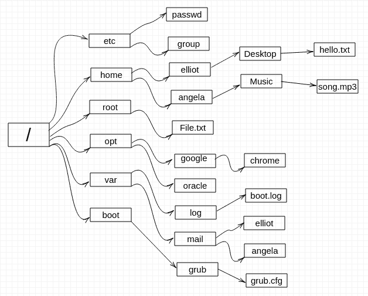

图 1：Linux 目录树

前面的图只显示了很少的文件，绝不代表整个目录树，因为 Linux 文件系统实际上包含成千上万的文件。因此，您可以将前面的图像视为实际 Linux 目录树的子树。

# 浏览目录树

好吧，让我们再爬一点。例如，让我们进入`/home`目录，看看系统上有多少用户。您只需运行`cd /home`命令即可：

```
elliot@ubuntu-linux:~$ cd /home 
elliot@ubuntu-linux:/home$
```

注意您的命令提示符如何更改，因为它现在显示您在主目录。

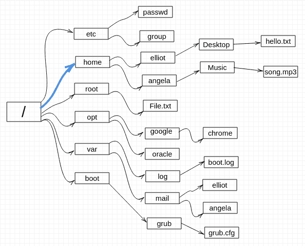

图 2：您现在在/home

现在让我们运行`ls`来查看`/home`目录的内容：

```
elliot@ubuntu-linux:/home$ ls 
angela elliot
```

这是我系统上的两个用户（除了 root 用户）。`/root`是 root 用户的主目录。您可能只有一个用户在`/home`；您将在本书后面学习如何向系统添加其他用户。

**谁是 root 用户？**

root 用户是允许在系统上执行任何操作的超级用户。root 用户可以安装软件，添加用户，管理磁盘分区等。root 用户的主目录是`/root`，不要与`/`（文件系统的根）混淆。

如果您想要证明您当前在`/home`目录，可以运行`pwd`命令：

```
elliot@ubuntu-linux:/home$ pwd
/home
```

确实！我们在`/home`目录。现在让我们进入用户`elliot`的主目录。现在，信不信由你，有两种方法可以导航到`elliot`的主目录。您可以简单地运行`cd elliot`命令：

```
elliot@ubuntu-linux:/home$ cd elliot 
elliot@ubuntu-linux:~$ pwd
/home/elliot
```

或者您可以运行`cd /home/elliot`命令：

```
elliot@ubuntu-linux:/home$ cd /home/elliot 
elliot@ubuntu-linux:~$ pwd
/home/elliot
```

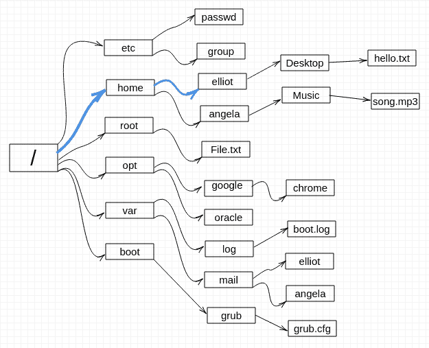

图 3：现在您在/home/elliot

请注意，这两个命令都将我们带到了`elliot`的主目录。但是，运行`cd elliot`比运行`cd /home/elliot`要容易得多，当然。

嗯，想想吧，我们最初在`/home`目录，这就是为什么我们能够运行`cd elliot`进入`/home/elliot`的原因。

但是，在其他情况下，我们将被迫使用完整路径（绝对路径）`/home/elliot`来到达我们的目的地。为了演示，让我们首先切换到`/etc`目录：

```
elliot@ubuntu-linux:~$ cd /etc 
elliot@ubuntu-linux:/etc$ pwd
/etc
```

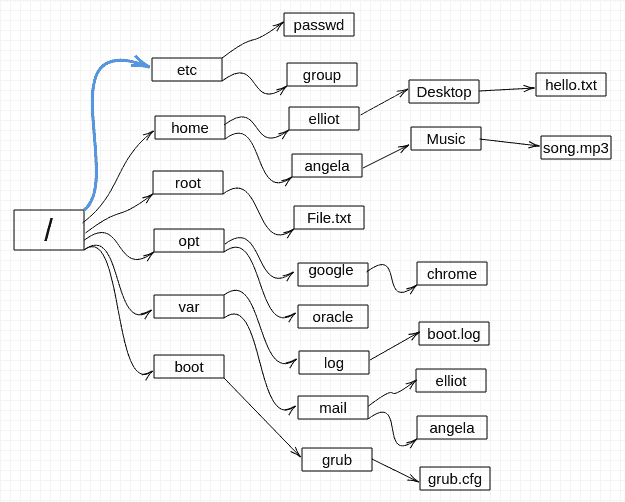

图 4：现在您在/etc

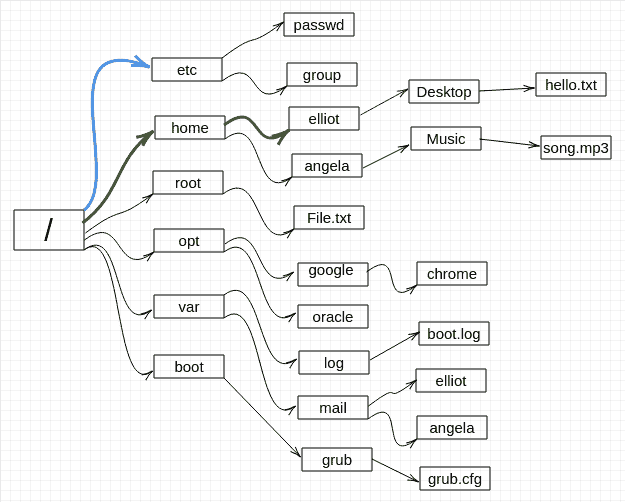

图 5：您想要进入/home/elliot

*图 4*和*5*可以帮助您可视化。您现在在`/etc`，想要进入`/home/elliot`。为了进入`elliot`的主目录，我们不能再使用短路径（相对路径）运行`cd elliot`命令：

```
elliot@ubuntu-linux:/etc$ cd elliot
bash: cd: elliot: No such file or directory
```

如您所见，Shell 生气了并返回了一个错误`bash: cd: elliot: No such file or directory`。在这种情况下，我们必须使用完整路径（绝对路径）`/home/elliot`：

```
elliot@ubuntu-linux:/etc$ cd /home/elliot 
elliot@ubuntu-linux:~$ pwd
/home/elliot
```

如果您现在还没有注意到，我们一直在使用斜杠(`/`)作为目录分隔符。

**目录分隔符**

在 Linux 中，斜杠(`/`)是目录分隔符，有时也称为路径分隔符。在 Windows 中，情况正好相反，因为反斜杠(`\`)被用作目录分隔符。但是，要小心，因为前导斜杠是我们文件系统的根。例如，在`/home/elliot/Desktop`中，只有第二个和第三个斜杠是目录分隔符，但第一个斜杠代表文件系统的根。

意识到绝对路径和相对路径之间的区别是至关重要的。

**绝对路径与相对路径**

文件的绝对路径只是该文件的完整路径，并且始终以前导斜杠开头。例如，`/opt/- google/chrome`是绝对路径的一个例子。

另一方面，文件的相对路径从不以根目录开头，始终相对于当前工作目录。例如，如果您当前在`/var`，那么`log/boot.log`就是有效的相对路径。

作为一个经验法则，如果你想区分相对路径和绝对路径，看一下路径是否以根目录（斜杠）开头；如果是的话，你可以得出结论这是绝对路径，否则，这是相对路径。

下面的图表显示了相对路径`Desktop/hello.txt`，只有当你的当前工作目录是`/home/elliot`时才有效。

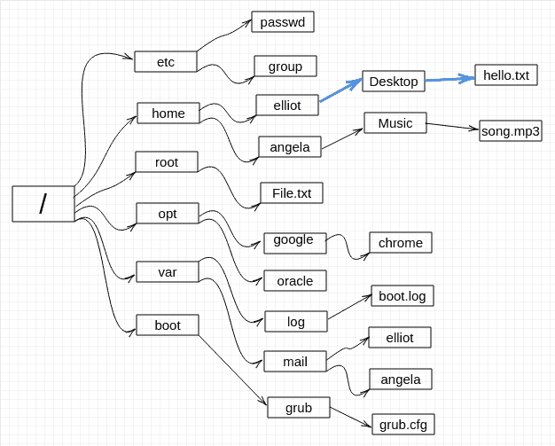

图 6：这是一个相对路径

下面的图片显示了绝对路径`/home/elliot/Desktop`，无论你当前的工作目录是什么，它都会一直有效。

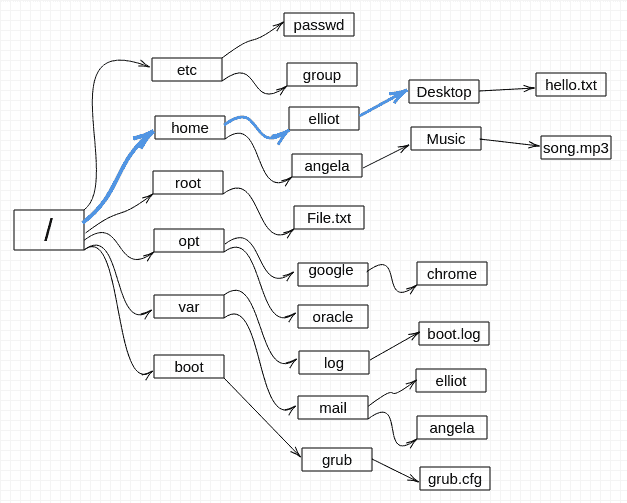

图 7：这是一个绝对路径

现在让我们进入 Elliot 的`Desktop`目录看看他在那里有什么。我们将使用绝对路径：

```
elliot@ubuntu-linux:/$ cd /home/elliot/Desktop 
elliot@ubuntu-linux:~/Desktop$ pwd
/home/elliot/Desktop
```

我们接着运行`pwd`来确认我们确实在想要的目录中。现在让我们运行`ls`来查看 Elliot 的桌面上的内容：

```
elliot@ubuntu-linux:~/Desktop$ ls 
hello.txt
```

注意`hello.txt`文件在 Elliot 的桌面上，所以我们实际上可以在桌面上看到它。

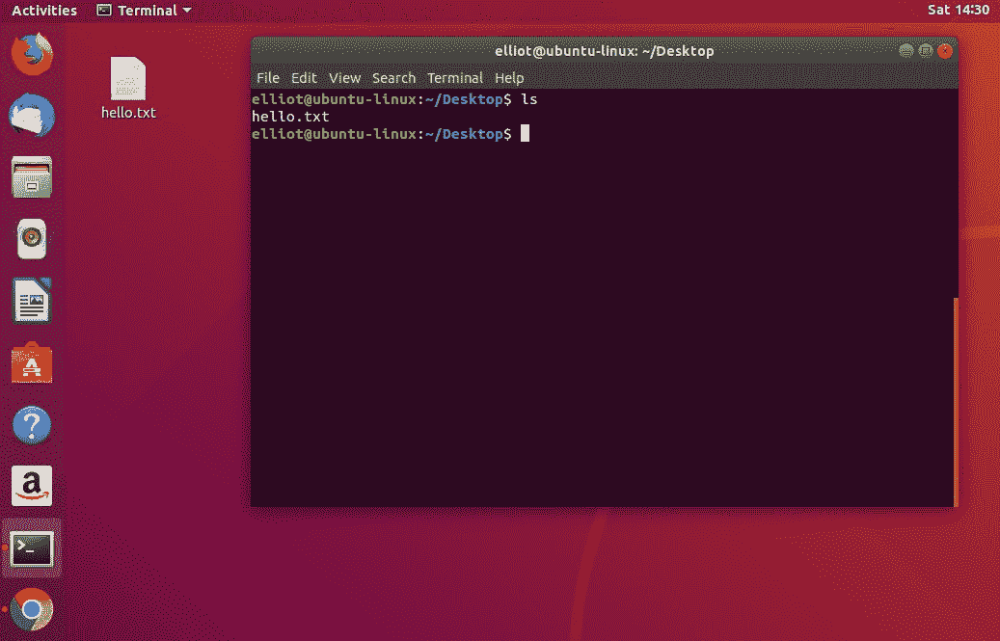

图 8：Elliot 的桌面

如你在上面的图片中所见，Elliot 的桌面上有一个名为`hello.txt`的文件。你可以使用`cat`命令来查看文本文件的内容：

```
elliot@ubuntu-linux:~/Desktop$ cat hello.txt 
Hello Friend!
Are you from fsociety?
```

如果你在桌面上打开`hello.txt`文件，你会看到相同的内容，当然，就像你在下面的截图中看到的那样。

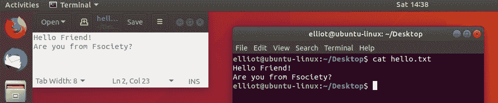

图 9：hello.txt 的内容

# 父目录和当前目录

在文件系统的每个目录下都有两个特殊的目录：

1.  当前工作目录用一个点(`.`)表示

1.  父目录用两个点(`..`)表示

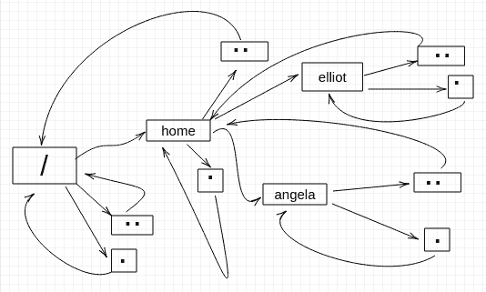

图 10：可视化父目录和当前目录

通过几个例子很容易理解这两个目录。举个例子，让我们首先切换到`/home/elliot`，这样它就成为我们的当前工作目录：

```
elliot@ubuntu-linux:~/Desktop$ cd /home/elliot 
elliot@ubuntu-linux:~$ pwd
/home/elliot
```

现在运行`cd .`命令：

```
elliot@ubuntu-linux:~$ cd . 
elliot@ubuntu-linux:~$ pwd
/home/elliot
```

正如你所期望的，什么都没有发生！我们仍然在`/home/elliot`，这是因为一个点(`.`)代表当前工作目录。就好像你告诉某人，“去你所在的地方！”

现在运行`cd ..`命令：

```
elliot@ubuntu-linux:~$ cd .. 
elliot@ubuntu-linux:/home$ pwd
/home
```

我们回到了上一个目录！换句话说，我们切换到了`/home/elliot`的父目录，也就是`/home`。

让我们再运行一个`cd ..`：

```
elliot@ubuntu-linux:/home$ cd .. 
elliot@ubuntu-linux:/$ pwd
/
```

我们确实一直在回去，现在我们在我们的目录树的根目录。好吧，让我们再次运行`cd ..`：

```
elliot@ubuntu-linux:/$ cd .. 
elliot@ubuntu-linux:/$ pwd
/
```

嗯，我们还在同一个目录！我们的路径没有改变，这是因为我们已经在我们的目录树的根目录了，所以我们无法再回去了。因此，根目录(`/`)是唯一一个**父目录=当前目录**的目录，你可以通过查看*图 10*来进行可视化。

你也可以插入目录分隔符`cd ../..`一次性回到两个目录：

```
elliot@ubuntu-linux:~$ pwd
/home/elliot
elliot@ubuntu-linux:~$ cd ../.. 
elliot@ubuntu-linux:/$ pwd
/
```

你也可以运行`cd ../../..`来回到三个目录，依此类推。

# 快速移动

现在我将向你展示一些很酷的技巧，这些技巧将使你在浏览 Linux 目录树时更快更高效。

## 回到家！

让我们切换到`/var/log`目录：

```
elliot@ubuntu-linux:~$ cd /var/log 
elliot@ubuntu-linux:/var/log$ pwd
/var/log
```

你现在可以运行`cd ~`命令来进入你的家目录：

```
elliot@ubuntu-linux:/var/log$ cd ~ 
elliot@ubuntu-linux:~$ pwd
/home/elliot
```

哇！让我们再做一次，但这次，我们切换到用户`angela`。如果你不知道，这个字符叫做波浪号，应该位于键盘上数字*1*键的旁边：

```
elliot@ubuntu-linux:~$ whoami 
elliot
elliot@ubuntu-linux:~$ su angela 
Password:
angela@ubuntu-linux:/home/elliot$ whoami 
angela
```

注意这里我使用了两个新命令。`whoami`命令打印当前登录用户的名称。我还使用了切换用户`su`命令来切换到用户`angela`。你可以使用`su`命令来切换到系统上的任何用户；你只需要运行`su`，然后跟上用户名。

现在，作为用户`angela`，我将导航到`/var/log`目录：

```
angela@ubuntu-linux:/home/elliot$ cd /var/log 
angela@ubuntu-linux:/var/log$ pwd
/var/log
```

然后我运行`cd ~`命令：

```
angela@ubuntu-linux:/var/log$ cd ~ 
angela@ubuntu-linux:~$ pwd
/home/angela
```

哇！我在 Angela 的主目录。无论您当前的工作目录是什么，运行`cd ~`命令都会直接将您带回到您的主目录。

## 带我回去！

现在，如果`angela`想尽快返回到她以前的工作目录怎么办？

运行`cd -`命令是将`angela`快速返回到她以前的工作目录的最快方法：

```
angela@ubuntu-linux:~$ pwd
/home/angela
angela@ubuntu-linux:~$ cd -
/var/log
```

酷！`angela`回到了`/var/log`。所以每当您想返回到以前的工作目录时，只需运行`cd -`命令。

# 隐藏文件

在 Linux 文件系统的每个目录下都存在当前目录` .`和父目录` ..`。但是当我们运行`ls`命令时为什么看不到它们呢？

```
elliot@ubuntu-linux:~/Desktop$ pwd
/home/elliot/Desktop 
elliot@ubuntu-linux:~/Desktop$ ls 
hello.txt
elliot@ubuntu-linux:~/Desktop$ ls -l 
total 4
-rw-r--r-- 1 elliot elliot 37 Jan 19 14:20 hello.txt
```

如您所见，我甚至尝试运行`ls -l`，仍然看不到当前目录或父目录。

您需要使用`ls`命令的`-a`选项如下：

```
elliot@ubuntu-linux:~/Desktop$ ls -a
. .. hello.txt
```

万岁！现在您可以看到所有文件了。`-a`选项显示所有文件，包括隐藏文件，当然您也可以使用完整的选项名称`--all`，它将做同样的事情：

```
elliot@ubuntu-linux:~/Desktop$ ls --all
. .. hello.txt
```

原来，任何以` .`（点）开头的文件名都是隐藏的。

隐藏的文件名以` .`开头

任何以点开头的文件名都是隐藏的。这就是为什么当前目录和父目录是隐藏的。

为了进一步演示，进入您的用户主目录并运行`ls`命令：

```
angela@ubuntu-linux:~$ ls 
Music
```

现在运行`ls -a`命令：

```
angela@ubuntu-linux:~$ ls -a
. .. .bash_logout .bashrc Music .profile
```

您现在可以看到主目录中的隐藏文件！请注意，所有隐藏的文件名都以点开头。

# 传递命令参数

到目前为止，我们只在当前工作目录上运行了`ls`命令。但是，您可以列出任何目录的内容，而无需更改到该目录。例如，如果您当前的工作目录是`/home/elliot`：

```
elliot@ubuntu-linux:~$ pwd
/home/elliot
```

您可以通过运行`ls -a /home/angela`命令列出`/home/angela`中的所有文件：

```
elliot@ubuntu-linux:~$ ls -a /home/angela
. .. .bash_history .bash_logout .bashrc Music .profile 
elliot@ubuntu-linux:~$ pwd
/home/elliot 
elliot@ubuntu
```

我能够在`/home/elliot`的同时列出`/home/angela`的内容。这是可能的，因为`ls`命令接受任何文件作为参数。

**什么是参数？**

参数，也称为命令行参数，只是作为输入提供给命令的任何文件名或数据。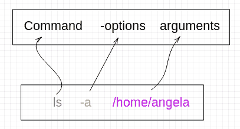

图 11：Linux 命令结构

您可以在前面的图像中看到 Linux 命令的一般结构。

在 Linux 术语中，当谈论命令选项和参数时，我们使用动词**传递**。为了使用正确的 Linux 术语，例如，在前面的图像中，我们说：“我们将`/home/angela`目录作为`ls`命令的参数传递。”

您会经常发现 Linux 用户非常热衷于使用正确的术语。此外，使用正确的术语可以帮助您通过工作面试并获得梦想的工作！

请注意在前面的图中，我们使用了复数名词*选项*和*参数*。这是因为一些命令可以接受多个选项和参数。

例如，我们可以通过运行`ls -a -l /home/angela`命令来列出`/home/angela`中的所有文件的长列表：

```
elliot@ubuntu-linux:~$ ls -a -l /home/angela 
total 28
drwxr-xr-x 3 angela angela 4096 Jan 20 13:43 .
drwxr-xr-x 9  root    root 4096 Jan 17 04:37 ..
-rw------- 1 angela angela   90 Jan 20 13:43 .bash_history
-rw-r--r-- 1 angela angela  220 Apr  4  2018 .bash_logout
-rw-r--r-- 1 angela angela 3771 Apr  4  2018 .bashrc
drwxrwxr-x 2 angela angela 4096 Jan 19 19:42 Music
-rw-r--r-- 1 angela angela  807 Apr  4  2018 .profile
```

所以现在您可以看到`/home/angela`中所有文件的长列表，包括隐藏文件，还要注意这里选项的顺序无关紧要，所以如果您运行`ls -l -a /home/angela`命令：

```
elliot@ubuntu-linux:~$ ls -l -a /home/angela 
total 28
drwxr-xr-x 3 angela angela 4096 Jan 20 13:43 .
drwxr-xr-x 9   root   root 4096 Jan 17 04:37 ..
-rw------- 1 angela angela   90 Jan 20 13:43 .bash_history
-rw-r--r-- 1 angela angela  220 Apr  4  2018 .bash_logout
-rw-r--r-- 1 angela angela 3771 Apr  4  2018 .bashrc
drwxrwxr-x 2 angela angela 4096 Jan 19 19:42 Music
-rw-r--r-- 1 angela angela  807 Apr  4  2018 .profile
```

您将得到相同的结果。这是传递两个命令选项的示例，那么传递两个参数呢？好吧，您可以通过将`/home/elliot`作为第二个参数，同时对`/home/angela`和`/home/elliot`中的所有文件进行长列表，而无需更改到它：

```
elliot@ubuntu-linux:~$ ls -l -a /home/angela /home/elliot
/home/angela:

total 28
drwxr-xr-x 3 angela angela 4096 Jan 20 13:43 .
drwxr-xr-x 9 root   root   4096 Jan 17 04:37 ..
-rw------- 1 angela angela   90 Jan 20 13:43 .bash_history
-rw-r--r-- 1 angela angela  220 Apr  4  2018 .bash_logout
-rw-r--r-- 1 angela angela 3771 Apr  4  2018 .bashrc
drwxrwxr-x 2 angela angela 4096 Jan 19 19:42  Music
-rw-r--r-- 1 angela angela  807 Apr  4  2018 .profile

/home/elliot:
total 28
drwxr-xr-x 3 elliot elliot 4096 Jan 20 16:26 .
drwxr-xr-x 9 root   root   4096 Jan 17 04:37 ..
-rw------- 1 elliot elliot   90 Jan 20 13:43 .bash_history
-rw-r--r-- 1 elliot elliot  220 Dec 26 23:47 .bash_logout
-rw-r--r-- 1 elliot elliot 3771 Dec 26 23:47 .bashrc
drwxr-xr-x 2 elliot elliot 4096 Jan 19 14:20  Desktop
-rw-r--r-- 1 elliot elliot  807 Apr 4   2018 .profile
```

所以现在，您可以同时看到`/home/elliot`和`/home/angela`目录的内容。

# touch 命令

让我们再次对`/home/elliot`中的所有文件进行长列表，讨论一些非常重要的事情：

```
elliot@ubuntu-linux:~$ ls -a -l /home/elliot 
total 28
drwxr-xr-x 3 elliot elliot 4096 Jan 20 16:26 .
drwxr-xr-x 9 root   root   4096 Jan 17 04:37 ..
-rw------- 1 elliot elliot   90 Jan 20 13:43 .bash_history
-rw-r--r-- 1 elliot elliot  220 Dec 26 23:47 .bash_logout
-rw-r--r-- 1 elliot elliot 3771 Dec 26 23:47 .bashrc
drwxr-xr-x 2 elliot elliot 4096 Jan 19 14:20  Desktop
-rw-r--r-- 1 elliot elliot  807 Apr  4  2018 .profile
```

关注输出的最后两列：

| `Jan 20 16:26` | `.` |
| --- | --- |
| `Jan 17 04:37` | `..` |
| `Jan 20 13:43` | `.bash_history` |
| `Dec 26 23:47` | `.bash_logout` |
| `Dec 26 23:47` | `.bashrc` |
| `Jan 19 14:20` | `Desktop` |
| `Apr 4 2018` | `.profile` |

`Table 3`：`ls -a -l /home/elliot` 的最后两列

你已经知道输出的最后一列（`Table 3` 的第二列）显示文件名，但是前一列（`Table 3` 的第一列）显示的所有这些日期是什么呢？

`Table 3` 的第一列中的日期表示每个文件的最后修改时间，即文件被修改（编辑）的最后时间。

你可以使用 `touch` 命令更改文件的修改时间。

为了演示，让我们首先获取 `elliot` 的 `Desktop` 目录的修改时间，你可以通过运行 `ls -l -d /home/elliot/Desktop` 命令来实现：

```
elliot@ubuntu-linux:~$ ls -l -d /home/elliot/Desktop
drwxr-xr-x 2 elliot elliot 4096 Jan 19 14:20 /home/elliot/Desktop
```

请注意我们使用了 `-d` 选项，因此它对目录 `/home/elliot/Desktop` 进行了长列表，而不是列出目录的内容。

最后修改时间显示为：`Jan 19 14:20`。

现在如果你运行 `touch /home/elliot/Desktop` 命令：

```
elliot@ubuntu-linux:~$ touch /home/elliot/Desktop 
elliot@ubuntu-linux:~$ ls -l -d /home/elliot/Desktop
drwxr-xr-x 2 elliot elliot 4096 Jan 20 19:42 /home/elliot/Desktop 
elliot@ubuntu-linux:~$ date
Sun Jan 20 19:42:08 CST 2020
```

你会看到目录 `/home/elliot/Desktop` 的最后修改时间现在已经更改为 `Jan 20 19:42`，这反映了当前时间。

当然，你会在你的系统上得到不同的结果，因为你不会和我同时运行命令。

好的，很好，现在我们明白了 `touch` 命令可以用来更新文件的修改时间。它还能做其他事情吗？嗯，让我们看看。

如果我们尝试更新一个不存在的文件的修改时间会发生什么？只有尝试才能知道。请注意，用户 `elliot` 的主目录中只有一个可见（非隐藏）文件，那就是 `Desktop` 目录：

```
elliot@ubuntu-linux:~$ pwd
/home/elliot
elliot@ubuntu-linux:~$ ls -l 
total 4
drwxr-xr-x 2 elliot elliot 4096 Jan 20 19:42 Desktop
```

看看当用户 `elliot` 运行 `touch blabla` 命令时会发生什么：

```
elliot@ubuntu-linux:~$ touch blabla 
elliot@ubuntu-linux:~$ ls -l
total 4
-rw-r--r-- 1 elliot elliot    0 Jan 20 20:00 blabla
drwxr-xr-x 2 elliot elliot 4096 Jan 20 19:42 Desktop
```

它创建了一个名为 `blabla` 的空文件。

你可以使用 `touch` 命令做两件事：

1.  你可以更新现有文件的最后修改和访问时间。

1.  你可以创建新的空文件。

`touch` 命令只能创建常规文件；它不能创建目录。另外，请注意它更新修改和访问时间，那么有什么区别呢？

+   修改时间 > 文件最后一次被更改或修改的时间。

+   访问时间 > 文件最后一次被访问（读取）的时间。

默认情况下，`touch` 命令会同时更改文件的修改和访问时间。我在 `elliot` 的主目录中创建了三个文件：`file1`、`file2` 和 `file3`：

```
elliot@ubuntu-linux:~$ ls -l 
total 8
drwxr-xr-x 6 elliot elliot 4096 Jan 25 22:13 Desktop
drwxr-xr-x 3 elliot elliot 4096 Jan 25 22:18 dir1
-rw-r--r-- 1 elliot elliot    0 Feb 29  2004 file1
-rw-r--r-- 1 elliot elliot    0 Apr 11  2010 file2
-rw-r--r-- 1 elliot elliot    0 Oct  3  1998 file3
```

现在只更改 `file1` 的修改时间。我们向 `touch` 命令传递 `-m` 选项：

```
elliot@ubuntu-linux:~$ touch -m file1 
elliot@ubuntu-linux:~$ ls -l
total 8
drwxr-xr-x 6 elliot elliot 4096 Jan 25 22:13 Desktop
drwxr-xr-x 3 elliot elliot 4096 Jan 25 22:18 dir1
-rw-r--r-- 1 elliot elliot    0 Jan 25 23:08 file1
-rw-r--r-- 1 elliot elliot    0 Apr 11  2010 file2
-rw-r--r-- 1 elliot elliot    0 Oct  3  1998 file3 
elliot@ubuntu-linux:~$
```

正如你所看到的，`file1` 的修改时间现在已经改变。我答应过只更改修改时间，对吧？如果你向 `ls` 命令传递 `-u` 选项和 `-l` 选项，你将得到最后访问时间而不是修改时间：

```
elliot@ubuntu-linux:~$ ls -l 
total 8
drwxr-xr-x 6 elliot elliot 4096 Jan 25 22:13 Desktop
drwxr-xr-x 3 elliot elliot 4096 Jan 25 22:18 dir1
-rw-r--r-- 1 elliot elliot 0    Jan 25 23:08 file1
-rw-r--r-- 1 elliot elliot 0    Apr 11  2010 file2
-rw-r--r-- 1 elliot elliot 0    Oct 3   1998 file3
elliot@ubuntu-linux:~$ ls -l -u 
total 8 
drwxr-xr-x 6 elliot elliot 4096 Jan 25 22:13 Desktop
drwxr-xr-x 3 elliot elliot 4096 Jan 25 22:18 dir1
-rw-r--r-- 1 elliot elliot 0    Feb 29 2004  file1
-rw-r--r-- 1 elliot elliot 0    Apr 11 2010  file2
-rw-r--r-- 1 elliot elliot 0    Oct 3  1998  file3
```

正如你所看到的，`file1` 的最后修改时间已经改变为 `Jan 25 23:08`，但访问时间保持不变：`Feb 29 2004`。这一次，让我们只改变 `file2` 的访问时间。为此，我们向 `touch` 命令传递 `-a` 选项：

```
elliot@ubuntu-linux:~$ touch -a file2 
elliot@ubuntu-linux:~$ ls -l
total 8
drwxr-xr-x 6 elliot elliot 4096 Jan 25 22:13 Desktop
drwxr-xr-x 3 elliot elliot 4096 Jan 25 22:18 dir1
-rw-r--r-- 1 elliot elliot    0 Jan 25 23:08 file1
-rw-r--r-- 1 elliot elliot    0 Apr 11  2010 file2
-rw-r--r-- 1 elliot elliot    0 Oct  3  1998 file3 
elliot@ubuntu-linux:~$ ls -l -u
total 8
drwxr-xr-x 6 elliot elliot 4096 Jan 25 22:13 Desktop
drwxr-xr-x 3 elliot elliot 4096 Jan 25 22:18 dir1
-rw-r--r-- 1 elliot elliot   0  Feb 29  2004 file1
-rw-r--r-- 1 elliot elliot   0  Jan 25 23:20 file2
-rw-r--r-- 1 elliot elliot   0  Oct  3  1998 file3 
elliot@ubuntu-linux:~$
```

正如你所看到的，`file2` 的修改时间保持不变，但访问时间已更改为当前时间。现在要同时更改 `file3` 的修改和访问时间，你可以运行不带选项的 `touch` 命令：

```
elliot@ubuntu-linux:~$ ls -l file3
-rw-r--r-- 1 elliot elliot 0 Oct 3 1998 file3 
elliot@ubuntu-linux:~$ touch file3 
elliot@ubuntu-linux:~$ ls -l file3
-rw-r--r-- 1 elliot elliot 0 Jan 25 23:27 file3 
elliot@ubuntu-linux:~$ ls -l -u file3
-rw-r--r-- 1 elliot elliot 0 Jan 25 23:27 file3
```

太棒了！你还可以向 `ls` 命令传递 `-t` 选项，按修改时间排序列出文件，最新的排在前面：

```
elliot@ubuntu-linux:~$ ls -l -t 
total 8
-rw-r--r-- 1 elliot elliot    0 Jan 25 23:27 file3
-rw-r--r-- 1 elliot elliot    0 Jan 25 23:08 file1
drwxr-xr-x 3 elliot elliot 4096 Jan 25 22:18 dir1
drwxr-xr-x 6 elliot elliot 4096 Jan 25 22:13 Desktop
-rw-r--r-- 1 elliot elliot    0 Apr 11  2010 file2
```

你可以添加 `-u` 选项以按访问时间排序：

```
elliot@ubuntu-linux:~$ ls -l -t -u 
total 8
-rw-r--r-- 1 elliot elliot    0 Jan 25 23:27 file3
-rw-r--r-- 1 elliot elliot    0 Jan 25 23:20 file2
-rw-r--r-- 1 elliot elliot    0 Jan 25 23:20 file1
drwxr-xr-x 3 elliot elliot 4096 Jan 25 22:18 dir1
drwxr-xr-x 6 elliot elliot 4096 Jan 25 22:13 Desktop
```

你还可以传递 `-r` 选项来反向排序：

```
elliot@ubuntu-linux:~$ ls -l -t -r 
total 8
-rw-r--r-- 1 elliot elliot    0 Apr 11  2010 file2
drwxr-xr-x 6 elliot elliot 4096 Jan 25 22:13 Desktop
drwxr-xr-x 3 elliot elliot 4096 Jan 25 22:18 dir1
-rw-r--r-- 1 elliot elliot    0 Jan 25 23:08 file1
-rw-r--r-- 1 elliot elliot    0 Jan 25 23:27 file3
```

# 创建目录

在 Linux 中创建目录，我们使用 `mkdir` 命令，它是 **make directory** 的缩写。

在 `elliot` 的桌面上，通过运行 `mkdir games` 命令创建一个名为 `games` 的目录：

```
elliot@ubuntu-linux:~/Desktop$ mkdir games 
elliot@ubuntu-linux:~/Desktop$ ls -l 
total 8
drwxr-xr-x 2 elliot elliot 4096 Jan 20 20:20 games
-rw-r--r-- 1 elliot elliot 37 Jan 19 14:20 hello.txt 
elliot@ubuntu-linux:~/Desktop$
```

请注意，我的当前工作目录是 `/home/elliot/Destkop`；这就是为什么我能够使用相对路径的原因。

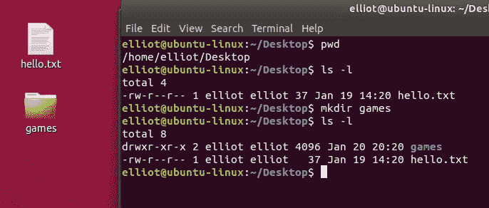

图 12：桌面上创建的 `games` 目录

您还可以同时创建多个目录。例如，您可以通过运行`mkdir Music Movies Books`命令在桌面上创建三个目录-`Music`，`Movies`和`Books`：

```
elliot@ubuntu-linux:~/Desktop$ mkdir Music Movies Books 
elliot@ubuntu-linux:~/Desktop$ ls -l
total 20
drwxr-xr-x 2 elliot elliot 4096 Jan 21 01:54 Books
drwxr-xr-x 2 elliot elliot 4096 Jan 20 20:20 games
-rw-r--r-- 1 elliot elliot   37 Jan 19 14:20 hello.txt
drwxr-xr-x 2 elliot elliot 4096 Jan 21 01:54 Movies
drwxr-xr-x 2 elliot elliot 4096 Jan 21 01:54 Music
```

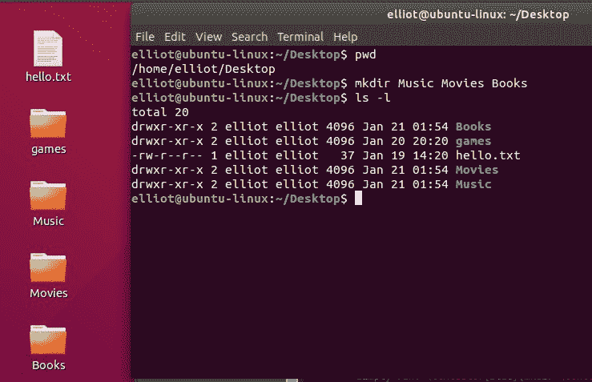

图 13：在桌面上创建的目录

您还可以使用`-p`选项创建整个目录路径。例如，您可以通过运行`mkdir -p dir1/dir2/dir3`命令创建路径`/home/elliot/dir1/dir2/dir3`：

```
elliot@ubuntu-linux:~$ pwd
/home/elliot
elliot@ubuntu-linux:~$ mkdir -p dir1/dir2/dir3 
elliot@ubuntu-linux:~$ ls 
blabla Desktop dir1 
elliot@ubuntu-linux:~$ cd dir1 
elliot@ubuntu-linux:~/dir1$ ls 
dir2
elliot@ubuntu-linux:~/dir1$ cd dir2 
elliot@ubuntu-linux:~/dir1/dir2$ ls 
dir3
elliot@ubuntu-linux:~/dir1/dir2$ cd dir3 
elliot@ubuntu-linux:~/dir1/dir2/dir3$ pwd
/home/elliot/dir1/dir2/dir3 
elliot@ubuntu-linux:~/dir1/dir2/dir3$
```

它在`/home/elliot`目录中创建了`dir1`，然后在`dir1`中创建了`dir2`，最后在`dir2`中创建了`dir3`。

您可以使用递归的`-R`选项对`/home/elliot/dir1`进行递归列表，并查看`/home/elliot/dir1`下的所有文件，而无需更改每个目录：

```
elliot@ubuntu-linux:~$ ls -R dir1 
dir1:
dir2

dir1/dir2:
dir3

dir1/dir2/dir3: 
elliot@ubuntu-linux:~$
```

正如你所看到的，它列出了`/home/elliot/dir1`下的所有文件。它甚至显示了层次结构。

您还可以通过将它们包含在一对大括号中，并且每个子目录之间用逗号分隔，来创建具有多个子目录的新目录，就像以下示例中一样：

```
elliot@ubuntu-linux:~/dir1/dir2/dir3$ mkdir -p dir4/{dir5,dir6,dir7} 
elliot@ubuntu-linux:~/dir1/dir2/dir3$ ls -R dir4
dir4:
dir5 dir6 dir7 

dir4/dir5: 

dir4/dir6:

dir4/dir7:
```

正如您所看到的，我们创建了`dir4`，并在其中创建了三个目录-`dir5`，`dir6`和`dir7`。

# 组合命令选项

您已经学会了许多可以与`ls`命令一起使用的不同选项。`表 4`总结了到目前为止我们使用过的所有选项。

| **ls 选项** | **作用** |
| --- | --- |
| `-l` | 文件的长格式和详细列表。 |
| `-a` | 列出隐藏文件。 |
| `-d` | 仅列出目录本身，而不是它们的内容。 |
| `-t` | 按修改时间对文件进行排序。 |
| `-u` | 与`-l`一起使用时，显示访问时间而不是修改时间。与`-lt`一起使用时，将按访问时间排序并显示访问时间。 |
| `-r` | 将列表顺序反转。 |
| `-R` | 递归列出子目录。 |

表 4：常用 ls 命令选项

您经常会希望同时使用两个或更多的命令选项。例如，`ls -a -l`通常用于对目录中的所有文件进行长列表。

此外，`ls -l -a -t -r`是一个非常受欢迎的组合，因为有时您可能希望按修改时间排序文件的列表（从最旧到最新）。因此，组合命令选项更有效，因此运行`ls -latr`命令：

```
elliot@ubuntu-linux:~$ ls -latr 
total 120
-rw-r--r--  1 elliot elliot       0    Apr 11  2010 file2
-rw-r--r--  1 elliot elliot     807    Dec 26 23:47 .profile
-rw-r--r--  1 elliot elliot    3771    Dec 26 23:47 .bashrc
drwxr-xr-x  9 root   root      4096    Jan 17 04:37 ..
-rw-r--r--  1 elliot elliot     220    Jan 20 17:23 .bash_logout
drwxr-xr-x  6 elliot elliot    4096    Jan 25 22:13 Desktop
-rw-r--r--  1 elliot elliot       0    Jan 25 23:08 file1
-rw-r--r--  1 elliot elliot       0    Jan 25 23:27 file3
drwxr-xr-x  3 elliot elliot    4096    Jan 25 23:52 dir1
-rw-------  1 elliot elliot    3152    Jan 26 00:01 .bash_history
drwxr-xr-x 17 elliot elliot    4096    Jan 30 23:32 .
```

将产生与运行`ls -l -a -t -r`命令相同的结果：

```
elliot@ubuntu-linux:~$ ls -l -a -t -r 
total 120
-rw-r--r--  1 elliot elliot    0 Apr 11  2010 file2
-rw-r--r--  1 elliot elliot  807 Dec 26 23:47 .profile
-rw-r--r--  1 elliot elliot 3771 Dec 26 23:47 .bashrc
drwxr-xr-x  9 root   root   4096 Jan 17 04:37 ..
-rw-r--r--  1 elliot elliot  220 Jan 20 17:23 .bash_logout
drwxr-xr-x  6 elliot elliot 4096 Jan 25 22:13 Desktop
-rw-r--r--  1 elliot elliot    0 Jan 25 23:08 file1
-rw-r--r--  1 elliot elliot    0 Jan 25 23:27 file3
drwxr-xr-x  3 elliot elliot 4096 Jan 25 23:52 dir1
-rw-------  1 elliot elliot 3152 Jan 26 00:01 .bash_history
drwxr-xr-x 17 elliot elliot 4096 Jan 30 23:32 .
```

在本章结束之前，我想向您展示一个非常酷的技巧。首先，让我们创建一个名为`averylongdirectoryname`的目录：

```
elliot@ubuntu-linux:~$ mkdir averylongdirectoryname 
elliot@ubuntu-linux:~$ ls -ld averylongdirectoryname
drwxr-xr-x 2 elliot elliot 4096 Mar 2 12:57 averylongdirectoryname
```

**制表完成**是 Linux 命令行中最有用的功能之一。您可以使用此功能让 shell 自动完成（建议）命令名称和文件路径。为了演示，输入（不要运行）以下文本到您的终端：

```
elliot@ubuntu-linux:~$ cd ave
```

现在按下键盘上的*Tab*键，shell 将自动为您完成目录名称：

```
elliot@ubuntu-linux:~$ cd averylongdirectoryname/
```

相当酷！好的，这就是本章的结束，现在是时候进行可爱的知识检查了。

# 知识检查

对于以下练习，打开终端并尝试解决以下任务：

1.  对`/var/log`中的所有文件进行长列表。

1.  显示文件`/etc/hostname`的内容。

1.  在`/home/elliot`中创建三个文件-`file1`，`file2`和`file3`。

1.  列出`elliot`的主目录中的所有文件（包括隐藏文件）。

1.  在`/home/elliot`中创建一个名为`fsociety`的目录。

## 真或假

1.  `/home/root`是 root 用户的主目录。

1.  `dir1/dir2/dir3`是绝对路径的一个例子。

1.  `/home/elliot/Desktop`是绝对路径的一个例子。

1.  `touch -m file1`将更新`file1`的访问时间。

1.  `mkdir dir1 dir2 dir3`将创建三个目录-`dir1`，`dir2`和`dir3`。
