见编辑器

首先，让我告诉您一些可能会让您感到惊讶的事情。Linux 实现了所谓的“一切皆文件”的哲学。这意味着在您的 Linux 系统上，一切都由文件表示。例如，您的硬盘由一个文件表示。运行的程序（进程）由一个文件表示。甚至您的外围设备，如键盘、鼠标和打印机，都由文件表示。

说到这一点，“一切皆文件”的哲学的一个直接结果是，Linux 管理员花费大量时间编辑和查看文件。因此，您经常会看到 Linux 管理员非常擅长使用文本编辑器。本章就是专门讲这个的。我希望您能够非常熟练地使用 Linux 中的各种文本编辑器。

有很多，我是说很多文本编辑器可以使用。但是，在本章中，我将介绍最受欢迎的 Linux 编辑器，这些编辑器可以完成工作。

# 第四章：图形编辑器 - gedit 和 kate

我们首先从那些最基本和简单的编辑器开始。这些是图形编辑器！如果您使用任何 Linux 发行版的**GNOME**版本，那么默认情况下会安装文本编辑器`gedit`。另一方面，如果您使用 Linux 的**KDE**版本，那么默认情况下会安装文本编辑器`kate`。

**桌面环境**

GNOME 和 KDE 是桌面环境的两个例子。每个桌面环境都实现了不同的图形用户界面，这是说您的桌面看起来会有所不同的一种花哨的方式！

无论如何，在图形编辑器上真的没有太多可以讨论的。它们非常直观和易于使用。例如，如果您想要使用`gedit`查看文本文件，那么您可以运行`gedit`命令，后面跟上任何文件名：

```
elliot@ubuntu-linux:~$ gedit /proc/cpuinfo
```

这将打开`gedit`图形编辑器，并显示您的 CPU 信息。

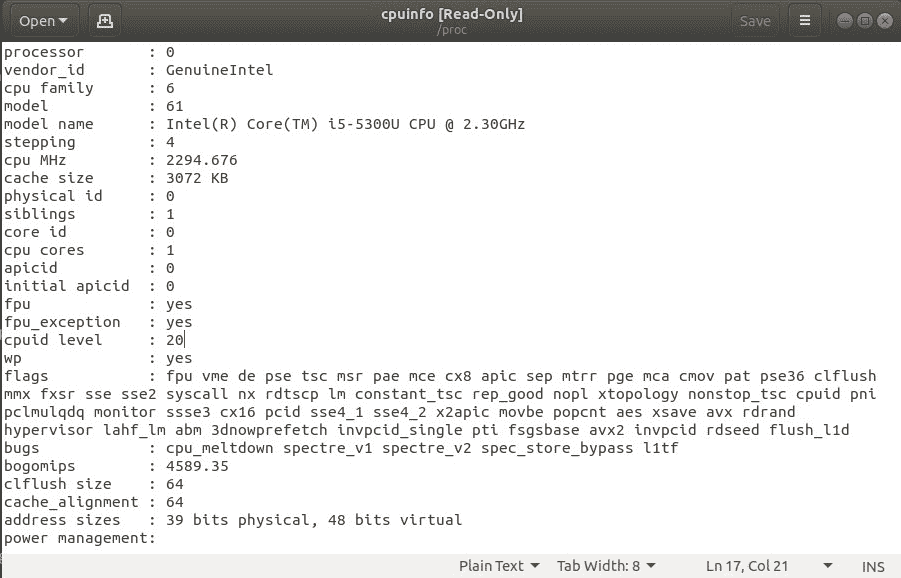

图 1：使用 gedit 打开/proc/cpuinfo

如果您没有`gedit`而是有`kate`，那么您可以运行：

```
elliot@ubuntu-linux:~$ kate /proc/cpuinfo
```

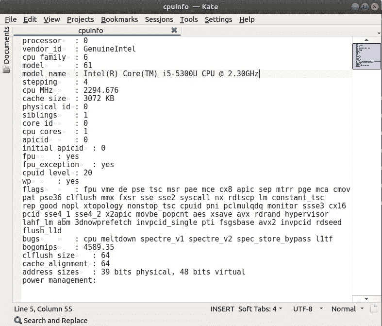

图 2：使用 kate 打开/proc/cpuinfo

您还可以使用图形编辑器在系统上创建新文件。例如，如果您想在`/home/elliot`中创建一个名为`cats.txt`的文件，那么您可以运行`gedit /home/elliot/cats.txt`命令：

```
elliot@ubuntu-linux:~$ gedit /home/elliot/cats.txt
```

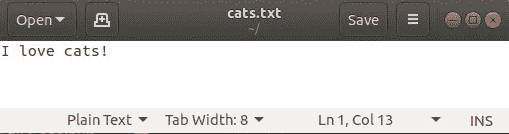

图 3：使用 gedit 创建 cats.txt

现在插入一行“I love cats!”然后保存并关闭文件。文件`cats.txt`现在存在于我的主目录中，我可以使用`cat`命令查看它：

```
elliot@ubuntu-linux:~$ pwd
/home/elliot
elliot@ubuntu-linux:~$ ls -l cats.txt
-rw-r--r-- 1 elliot elliot 13 Feb 2 14:54 cats.txt 
elliot@ubuntu-linux:~$ cat cats.txt
I love cats!
```

同样，您可以使用任何其他图形文本编辑器在系统上创建文件。

好了！关于图形文本编辑器的讨论就到此为止。让我们继续探索非图形文本编辑器的严肃世界。

# nano 编辑器

`nano`编辑器是一个非常流行且易于使用的命令行编辑器。您可以通过运行`nano`命令来打开`nano`编辑器：

```
elliot@ubuntu-linux:~$ nano
```

这将打开您的`nano`编辑器，您应该会看到以下截图中的屏幕：

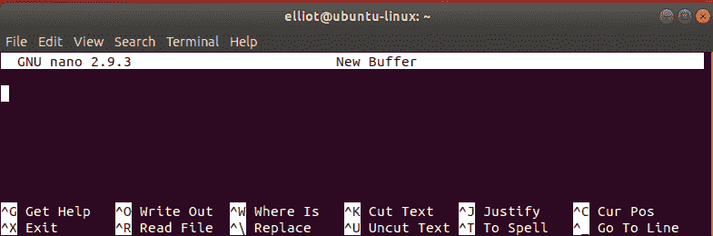

图 4：在 nano 内部

现在添加以下截图中显示的六行：

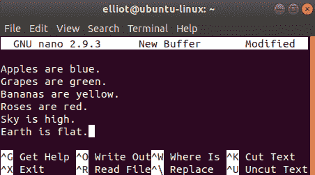

图 5：添加这六行

看一下`nano`编辑器屏幕底部；您会看到很多快捷键：

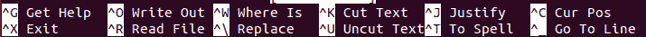

图 6：nano 快捷键

我在下表中列出了所有有用的 nano 快捷键：

| **nano 快捷方式** | **它的作用** |
| --- | --- |
| *Ctrl*+*O* | 保存当前文件（写出）。 |
| *Ctrl*+*K* | 剪切当前行并将其存储在缓冲区中。 |
| *Ctrl*+*U* | 粘贴存储在缓冲区中的行。 |
| *Ctrl*+*W* | 在文件中搜索字符串（单词）。 |
| *Ctrl*+*\* | 用另一个字符串替换文件中的字符串（单词）。 |
| *Ctrl*+*R* | 读取另一个文件。 |
| *Ctrl*+*G* | 查看如何使用 nano 的帮助信息。 |
| *Ctrl*+*V* | 转到下一页。 |
| *Ctrl*+*Y* | 转到上一页。 |
| *Ctrl*+*X* | 退出 nano 编辑器。 |

表 5：nano 快捷键

请注意，按下*Ctrl*+*O*快捷键是通过按下*Ctrl*，然后按字母*O*触发的。您不必按下*+*键或大写字母*O*。 

现在让我们使用快捷键*Ctrl*+*O*保存文件；它会要求您输入文件名，您可以输入`facts.txt`。

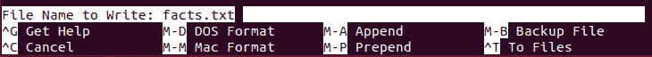

图 7：保存文件

然后按*Enter*确认。现在让我们退出`nano`编辑器（使用*Ctrl*+*X*快捷键）来验证文件`facts.txt`是否已创建：

```
elliot@ubuntu-linux:~$ ls -l facts.txt
-rw-r--r-- 1 elliot elliot 98 Apr 30 15:17 facts.txt
```

现在让我们再次打开`facts.txt`来修复我们添加的错误事实！要用`nano`编辑器打开文件`facts.txt`，您可以运行`nano facts.txt`命令：

```
elliot@ubuntu-linux:~$ nano facts.txt
```

文件`facts.txt`中的第一行说“苹果是蓝色的。”我们肯定需要纠正这个错误的事实，所以让我们使用快捷键*Ctrl*+*\*将单词`blue`替换为`red`。

当您按下*Ctrl*+*\*时，它会要求您输入要替换的单词；您可以输入`blue`，如下面的截图所示：

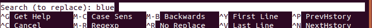

图 8：要替换的单词

按*Enter*，然后它会要求您输入替换的单词。您可以输入`red`，如下面的截图所示：


图 9：替换单词

然后按*Enter*，它将遍历单词`blue`的每个实例，并询问您是否要替换它。幸运的是，我们只有一个`blue`的出现。

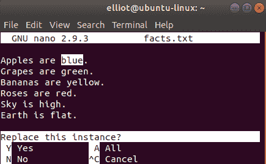

图 10：用红色替换蓝色

按*Y*，嘭！单词`red`替换了`blue`。

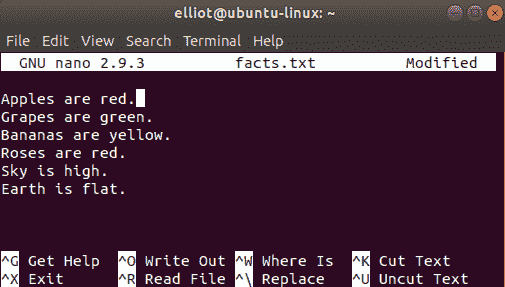

图 11：红色替换蓝色

这里还有一个词需要改变。我们都同意地球不是平的，对吧？希望我们都同意！现在让我们像之前一样精确地用单词`round`替换`flat`，结果应该像下面的截图所示：

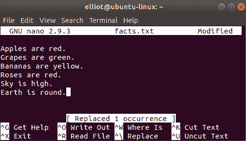

图 12：用圆形替换平的

现在让我们保存并退出文件。因此我们使用*Ctrl*+*O*快捷键保存，然后使用*Ctrl*+*X*退出。

`nano`编辑器非常简单易用。熟能生巧，所以您使用得越多，它对您来说就会变得越容易。您可以练习`表 5`中的所有快捷键。

# vi 编辑器

`nano`编辑器通常是初学者的首选编辑器。它是一个很棒的编辑器，但我们只能说它不是最高效的编辑器。`vi`编辑器是一个更高级的 Linux 编辑器，具有大量功能，并且是高级 Linux 用户中最受欢迎的编辑器。

让我们用`vi`编辑器打开`facts.txt`文件；为此，您运行`vi facts.txt`命令：

```
elliot@ubuntu-linux:~$ vi facts.txt
```

这将打开`vi`编辑器，如下面的截图所示：

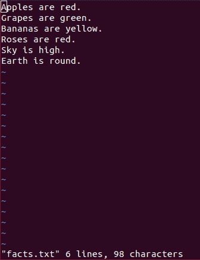

图 13：在 vi 中打开 facts.txt 文件

与`nano`编辑器不同，`vi`编辑器以两种不同的模式工作：

1.  `插入`模式

1.  `命令`模式

`插入`模式使您能够在文件中插入文本。另一方面，`命令`模式允许您执行复制、粘贴和删除文本等操作。`命令`模式还允许您搜索和替换文本以及许多其他操作。

## 插入模式

默认情况下，您首次打开`vi`编辑器时会进入`命令`模式，而在`命令`模式下无法插入文本。要插入文本，您需要切换到`插入`模式。有几种方法可以切换到`插入`模式；`表 6`列出了所有方法。

| **键** | **功能** |
| --- | --- |
| `i` | 在当前光标位置之前插入文本。 |
| `I` | 在当前行的开头插入文本。 |
| `a` | 在当前光标位置之后添加文本。 |
| `A` | 在当前行的末尾添加文本。 |
| o | 在当前行下方创建一个新行。 |
| O | 在当前行上方创建一个新行。 |

表 6：vi 插入模式

您可以使用箭头键在`vi`编辑器中导航，就像在`nano`编辑器中一样。现在导航到文件`facts.txt`的最后一行，然后按字母`o`切换到`insert`模式。现在您可以添加一行“Linux is cool!”

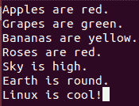

图 14：在 vi 中添加一行

在`insert`模式下，您可以添加任意多的文本。要切换回`command`模式，您需要按下*Esc*键。

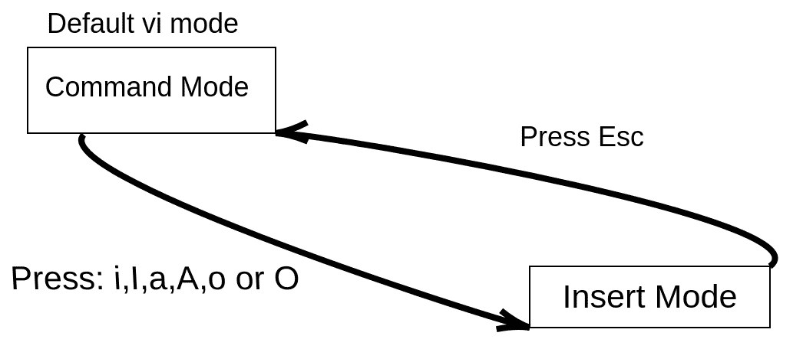

图 15：在插入模式和命令模式之间切换

上述屏幕截图说明了如何在`command`模式和`insert`模式之间来回切换。

## 命令模式

除了添加文本之外，您想做的任何事情都可以从`command`模式中实现。您可以在`vi`编辑器中使用大量命令。您可能会认为我在开玩笑，但是有很多关于`vi`编辑器的书籍和课程。但是，“表 7”将让您熟悉`vi`编辑器，并列出了您可以使用的最流行的命令。

| **vi 命令** | **它的作用** |
| --- | --- |
| yy | 复制（yank）当前行。 |
| 3yy | 复制（yank）三行（从当前行开始）。 |
| yw | 复制（yank）光标位置开始的一个单词。 |
| 2yw | 复制（yank）光标位置开始的两个单词。 |
| p | 在当前光标位置之后粘贴。 |
| P | 在当前光标位置之前粘贴。 |
| dd | 剪切（删除）当前行。 |
| 4dd | 剪切（删除）四行（从当前行开始）。 |
| dw | 剪切（删除）光标位置开始的一个单词。 |
| x | 删除光标位置的字符。 |
| u | 撤销上一次更改。 |
| U | 撤销对该行的所有更改。 |
| /red | 在文件中搜索单词`red`。 |
| :%s/bad/good | 用`good`替换`bad`。 |
| 设置行号 | 显示行号。 |
| :set nonumber | 隐藏行号。 |
| :7 | 转到第 7 行。 |
| G | 跳转到文件末尾。 |
| gg | 跳转到文件开头。 |

表 7：vi 命令

正如您所看到的，“表 7”有很多命令，所以我不会逐一介绍所有的命令；这留给您作为练习。但是，我将讨论一些命令，以帮助您开始使用`vi`编辑器。

让我们首先显示行号，因为这将使我们的生活更加轻松！要做到这一点，您可以运行`:set` number 命令，如下面的屏幕截图所示：

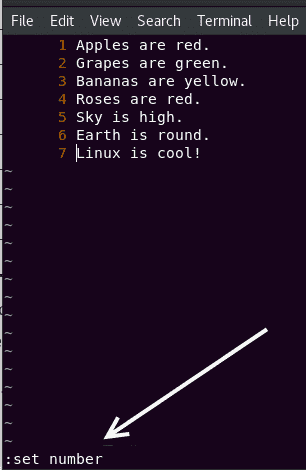

图 16：显示行号

现在让我们复制第 4 行。您需要确保光标在第 4 行上；您可以通过运行`:4`命令来实现这一点，如下面的屏幕截图所示：

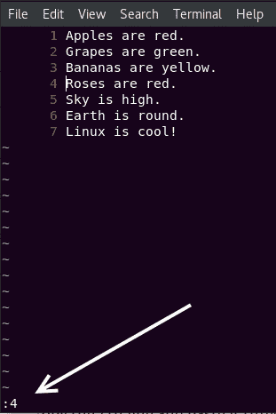

图 17：转到第 4 行

现在按下序列`yy`，它会复制整行。让我们在文件末尾粘贴三次。因此，导航到最后一行，然后按* p *三次，它会将复制的行粘贴三次，如下面的屏幕截图所示：

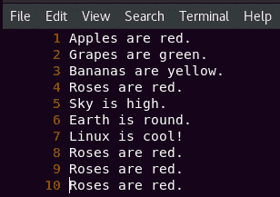

图 18：在 vi 中复制和粘贴

好了！让我们将单词`cool`替换为`awesome`，因为我们都知道 Linux 不仅仅是酷；它是令人敬畏的！要做到这一点，您可以运行`:%s/cool/awesome`命令，如下面的屏幕截图所示：

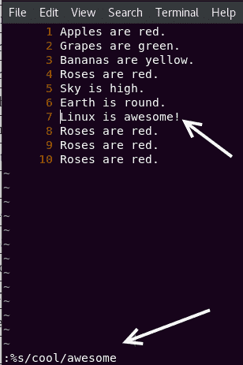

图 19：用 awesome 替换 cool

让我们也将单词`Roses`替换为`Cherries`，因为我们都知道并不是所有的玫瑰都是红色的。要做到这一点，运行`:%s/Roses/Cherries`命令，如下面的屏幕截图所示：

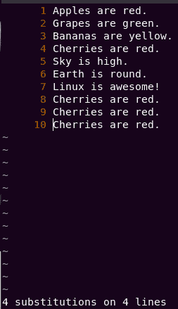

图 20：用 Cherries 替换 Roses

它甚至会告诉您发生了多少次替换。

**酷提示**

您应该知道`:%s/old/new`只会替换所有行中单词`old`的第一次出现。要替换所有行中单词`old`的所有出现，应使用全局选项`:%s/old/new/g`

要理解并理解上面的提示，向您的`facts.txt`文件添加行“蓝蓝蓝蓝”，并尝试使用`:%s/blue/purple`命令将单词`blue`替换为`purple`。您会看到它只会替换第一个`blue`的出现。要使其替换所有`blue`的出现，您必须使用全局选项

`:%s/blue/purple/g`。

## 保存并退出 vi

最终，当您完成在`vi`中查看或编辑文件时，您会想要退出`vi`编辑器。您可以使用多种方法退出`vi`编辑器，`表 8`列出了所有方法。

| **vi 命令** | **它的作用** |
| --- | --- |
| `:w` | 保存文件但不退出`vi`。 |
| `:wq` | 保存文件并退出`vi`。 |
| `ZZ` | 保存文件并退出`vi`（与`:wq`相同，只是更快！）。 |
| `:x` | 保存文件并退出`vi`（与`:wq`或`ZZ`相同）。 |
| `:q` | 不保存退出`vi`。 |
| `:q!` | 强制退出`vi`而不保存。 |

表 8：保存和退出 vi

所以让我们保存文件并退出`vi`编辑器。当然，您可以使用以下任何命令：

1.  `:wq`

1.  `:x`

1.  `ZZ`

它们都实现了相同的结果，即保存并退出`vi`。

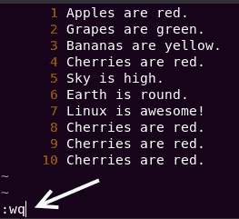

图 21：保存并退出 vi

如果您成功退出了`vi`编辑器，我要祝贺您，因为您是精英中的一员。互联网上有数百个关于一些人打开`vi`编辑器后从未能退出的模因和漫画！

# 文件查看命令

在某些情况下，您可能只想查看文件而不编辑它。虽然您仍然可以使用文本编辑器如`nano`或`vi`来查看文件，但在 Linux 中有更快的查看文件的方法。

## cat 命令

`cat`命令是 Linux 中最受欢迎和经常使用的命令之一。`cat`（**concatenate**的缩写）命令将文件连接并打印到标准输出（终端）。

要查看我们创建的`facts.txt`文件，可以运行`cat facts.txt`命令：

```
elliot@ubuntu-linux:~$ cat facts.txt 
Apples are red.
Grapes are green.
Bananas are yellow.
Cherries are red.
Sky is high.
Earth is round.
Linux is awesome!
Cherries are red.
Cherries are red.
Cherries are red.
```

现在，您可以在终端舒适地查看`facts.txt`文件的内容，而无需打开任何文本编辑器。

`cat`命令不仅可以查看文件，还可以连接（放在一起）文件。为了演示，使用您喜欢的文本编辑器创建以下三个文件：

1.  `file1.txt`（插入行“第一个文件”）

1.  `file2.txt`（插入行“第二个文件”）

1.  `file3.txt`（插入行“第三个文件”）

现在让我们使用`cat`命令查看这三个文件的每一个：

```
elliot@ubuntu-linux:~$ cat file1.txt 
First File
elliot@ubuntu-linux:~$ cat file2.txt 
Second File
elliot@ubuntu-linux:~$ cat file3.txt 
Third File
```

现在让我们通过运行`cat file1.txt file2.txt`命令来连接`file1.txt`和`file2.txt`：

```
elliot@ubuntu-linux:~$ cat file1.txt file2.txt 
First File
Second File
```

我们还可以连接所有三个文件：

```
elliot@ubuntu-linux:~$ cat file1.txt file2.txt file3.txt 
First File
Second File 
Third File
```

请记住，顺序很重要；例如，运行`cat file2.txt file1.txt`命令：

```
elliot@ubuntu-linux:~$ cat file2.txt file1.txt 
Second File
First File
```

这将在`file1.txt`之前输出`file2.txt`的文本。

## tac 命令

`tac`命令是`cat`命令的孪生兄弟。它基本上是反向编写的`cat`，它做的事情与`cat`命令相同，但是以相反的方式！

例如，如果您想以相反的顺序查看`facts.txt`文件，可以运行`tac facts.txt`命令：

```
elliot@ubuntu-linux:~$ tac facts.txt 
Cherries are red.
Cherries are red.
Cherries are red.
Linux is awesome!
Earth is round.
Sky is high.
Cherries are red.
Bananas are yellow.
Grapes are green.
Apples are red.
```

`tac`命令也可以像`cat`命令一样连接文件。

## more 命令

使用`cat`命令查看文件是一个不错的选择，当文件很小，且没有很多行文本需要显示时。如果要查看一个大文件，最好使用`more`命令。`more`命令一次显示文件的一页内容；它基本上是一个分页程序。

让我们用`more`命令查看文件`/etc/services`的内容：

```
elliot@ubuntu-linux:~$ more /etc/services 
# Network services, Internet style
# Note that it is presently the policy of IANA to assign a single well-known 
# port number for both TCP and UDP; hence, officially ports have two entries 
# even if the protocol doesn't support UDP operations.

tcpmux 1/tcp # TCP port service multiplexer 
systat 11/tcp users
netstat 15/tcp ftp 21/tcp
fsp 21/udp fspd
ssh 22/tcp # SSH Remote Login Protocol 
telnet 23/tcp
smtp 25/tcp mail 
whois 43/tcp nicname
tacacs 49/tcp # Login Host Protocol (TACACS) 
tacacs 49/udp
--More--(7%)
```

它会显示`/etc/services`文件的第一页，并在底部显示一个百分比值，显示你已经浏览了文件的进度。你可以使用以下键在`more`中导航：

+   *Enter* > 向下滚动一行。

+   空格键 > 前往下一页。

+   *b* > 返回上一页。

+   *q* > 退出。

`/etc/services`文件存储了许多可以在 Linux 上运行的服务（应用程序）的信息。

## less 命令

`less`命令是`more`命令的改进版本。是的，你读对了；less 比 more 更好！事实上，著名的成语*less is more*源于`less`比`more`提供更多的想法。

`less`命令是另一个分页程序，就像`more`一样；它允许你一次查看一个页面的文本文件。`less`的优点是你可以使用上/下箭头键在文件中导航。此外，`less`比`more`更快。

你可以通过运行以下命令使用`less`查看`/etc/services`文件：

```
elliot@ubuntu-linux:~$ less /etc/services
```

你也可以在`less`中使用`more`导航键。

## 正面还是反面？

正如其名称所示，`head`命令显示文件的前几行。默认情况下，它显示文件的前十行。例如，我们知道`facts.txt`中有十行，因此运行`head facts.txt`命令将显示所有文件内容：

```
elliot@ubuntu-linux:~$ head facts.txt 
Apples are red.
Grapes are green.
Bananas are yellow.
Cherries are red.
Sky is high.
Earth is round.
Linux is awesome!
Cherries are red.
Cherries are red.
Cherries are red.
```

你也可以传递`-n`选项来指定你希望查看的行数。例如，要显示`facts.txt`的前三行，你可以运行`head -n 3 facts.txt`命令：

```
elliot@ubuntu-linux:~$ head -n 3 facts.txt 
Apples are red.
Grapes are green.
Bananas are yellow.
```

另一方面，`tail`命令显示文件的最后几行。默认情况下，它显示最后十行。你也可以使用`-n`选项来指定你希望查看的行数。例如，要显示`facts.txt`中的最后两行，你可以运行`tail -n 2 facts.txt`命令：

```
elliot@ubuntu-linux:~$ tail -n 2 facts.txt 
Cherries are red.
Cherries are red.
```

你知道现在是几点吗？是时候进行一些知识检查了。

# 知识检查

对于以下练习，打开你的终端并尝试解决以下任务：

1.  只查看文件`facts.txt`的前两行。

1.  只查看文件`facts.txt`的最后一行。

1.  以相反的顺序显示文件`facts.txt`的内容。

1.  使用`vi`编辑器打开文件`facts.txt`。

1.  退出`vi`编辑器，认为自己是精英之一。
