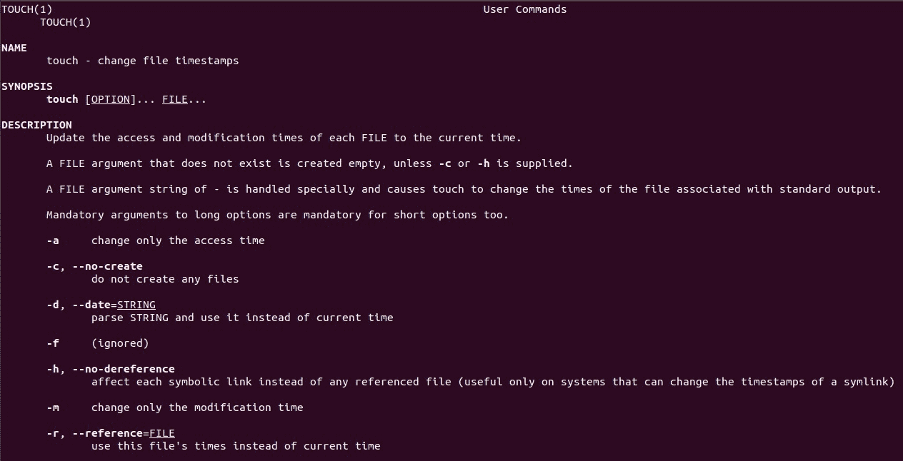

阅读你的手册！

你现在可能会对自己说：“Linux 太难了！有很多命令，甚至有更多的命令选项！我不可能掌握所有这些命令并记住它们。”如果这是你的想法，相信我，你是聪明的。记住所有存在的 Linux 命令是不可能的，即使是最有经验的 Linux 管理员也永远不可能记住所有命令，甚至连 Linus Torvalds 本人也不可能！

那么等等？如果是这样，那么解决方案是什么呢？答案就在美丽的 Linux 文档世界中。Linux 有非常完善的文档，以至于很难在其中迷失。Linux 中有各种工具，不仅可以帮助你记住命令，还可以帮助你理解如何使用它们。

在我的职业生涯中遇到了许多 Linux 专业人士，我注意到最熟练的 Linux 管理员不是那些记住了所有命令的人，而是那些知道如何充分利用 Linux 文档的人。女士们先生们，我强烈建议你系好安全带，仔细阅读本章。我向你保证，你心中的恐惧很快就会消失！

# 第六章：Linux 命令的四个类别

所有 Linux 命令必须属于以下四个类别中的一个：

1.  **可执行程序**：通常是用 C 编程语言编写的。`cp`命令就是一个可执行命令的例子。

1.  **别名**：基本上是命令（或一组命令）的另一个名称。

1.  **shell 内置命令**：shell 也支持内部命令。`exit`和`cd`命令就是 shell 内置命令的两个例子。

1.  **shell 函数**：这些函数帮助我们完成特定任务，在编写 shell 脚本时至关重要。稍后我们会更详细地介绍这个，现在只需要知道它们存在即可。

# 确定命令的类型

你可以使用`type`命令来确定命令的类型（类别）。例如，如果你想知道`pwd`命令的类型，只需运行`type pwd`命令：

```
elliot@ubuntu-linux:~$ type pwd 
pwd is a shell builtin
```

所以现在你知道`pwd`命令是一个 shell 内置命令。现在让我们弄清楚`ls`命令的类型：

```
elliot@ubuntu-linux:~$ type ls
ls is aliased to `ls --color=auto'
```

你可以看到，`ls`命令被别名为`ls --color=auto`。现在你知道为什么每次运行`ls`命令时都会看到彩色的输出了。让我们看看`date`命令的类型：

```
elliot@ubuntu-linux:~$ type date 
date is /bin/date
```

任何位于`/bin`或`/sbin`中的命令都是可执行程序。因此，我们可以得出`date`命令是一个可执行程序，因为它位于`/bin`中。

最后，让我们确定`type`命令本身的类型：

```
elliot@ubuntu-linux:~$ type type 
type is a shell builtin
```

原来`type`命令是一个 shell 内置命令。

# 查找命令的位置

每次运行一个可执行命令时，系统中都会有一个文件被执行。你可以使用`which`命令来确定可执行命令的位置。例如，如果你想知道`rm`命令的位置，可以运行`which rm`命令：

```
elliot@ubuntu-linux:~$ which rm
/bin/rm
```

所以现在你知道`rm`位于`/bin`目录中。让我们看看`reboot`命令的位置：

```
elliot@ubuntu-linux:~$ which reboot
/sbin/reboot
```

你可以看到，`reboot`命令位于`/sbin`目录中。

# 这个命令是做什么的？

你可以使用`whatis`命令来获取一个命令的简要描述。例如，如果你想知道`free`命令的目的，可以运行`whatis free`命令：

```
elliot@ubuntu-linux:~$ whatis free
free (1)             - Display amount of free and used memory in the system
```

你可以看到，`free`命令，正如我们已经知道的那样，显示系统中的空闲和已使用内存量。酷！现在让我们看看`df`命令的作用：

```
elliot@ubuntu-linux:~$ whatis df
df (1)               - report file system disk space usage
```

最后，让我们看看`which`命令的作用：

```
elliot@ubuntu-linux:~$ whatis which 
which (1)            - locate a command
```

正如我们已经知道的那样，`which`显示了一个命令的位置。

# man 页面

`whatis`命令给出了一个命令的简要描述；然而，它并不教你如何使用一个命令。为此，你可以使用`man`页面。

`man`页面是一个**手册**页面，其中有适当的文档，可帮助您了解如何使用命令。就像您购买新手机时，会得到一本手册，告诉您如何使用手机以及如何在手机上更新软件等。

一般来说，如果要阅读命令的`man`页面，可以运行：

```
man command_name
```

例如，如果要查看`touch`命令的`man`页面，可以运行`man touch`命令：

```
elliot@ubuntu-linux:~$ man touch
```



图 1：touch man 页面

正如您在前面的屏幕截图中看到的，`touch` man 页面显示了如何使用该命令，并列出并解释了所有命令选项。

`表 9`向您展示了在浏览`man`页面时如何移动。

| **man 键** | **它的作用** |
| --- | --- |
| 空格 | 向前滚动一页。 |
| *Ctrl*+*F* | 向前滚动一页（与空格相同）。 |
| *Ctrl*+*B* | 向后滚动一页。 |
| `/word` | 将在`man`页面中搜索单词（模式）。例如，`/access`将在`man`页面中搜索单词`access` |
| *q* | 将退出`man`页面。 |
| *n* | 在搜索单词后，您可以使用*n*来查找`man`页面中单词的下一个出现。 |
| *N* | 在搜索单词后，您可以使用*N*来查找`man`页面中单词的上一个出现。 |

我无法再次强调`man`页面的重要性。相信我，在最黑暗的时刻，它们可以成为您最好的朋友！

您还应该知道`man`本身有一个 man 页面：

```
elliot@ubuntu-linux:~$ man man
```

它描述了如何使用`man`页面。

# shell 内置命令的帮助

如果您足够玩转`man`页面，您可能会注意到许多 shell 内置命令没有`man`页面。例如，`cd`或`exit`命令没有`man`页面：

```
elliot@ubuntu-linux:~$ type cd 
cd is a shell builtin 
elliot@ubuntu-linux:~$ man cd 
No manual entry for cd 
elliot@ubuntu-linux:~$ type exit 
exit is a shell builtin 
elliot@ubuntu-linux:~$ man exit 
No manual entry for exit
```

这是因为 shell 内置命令没有`man`页面，但不要慌！您仍然可以使用`help`命令找到如何使用 shell 内置命令的帮助。例如，要获取有关如何使用`exit`命令的帮助，您可以运行：

```
elliot@ubuntu-linux:~$ help exit 
exit: exit [n]
 Exit the shell.

 Exits the shell with a status of N. If N is omitted, the exit status 
 is that of the last command executed.
```

类似地，要获取有关如何使用`cd`命令的帮助，您可以运行`help cd`命令：

```
elliot@ubuntu-linux:~$ help cd 
cd: cd [-L|-P] [dir]
 Change the shell working directory.

 Change the current directory to DIR. The default DIR is the value of 
 the HOME shell variable.

 The variable CDPATH defines the search path for the directory containing DIR. 
 Alternative directory names in CDPATH are separated by a colon (:). 
 A null directory name is the same as the current directory. 
 If DIR begins with a slash (/), then CDPATH is not used.

 If the directory is not found, and the shell option `cdable_vars' is set, 
 the word is assumed to be a variable name. If that variable has a value, 
 its value is used for DIR.

 Options:
 -L force symbolic links to be followed
 -P use the physical directory structure without following symbolic links
 The default is to follow symbolic links, as if `-L' were specified. 

 Exit Status:
 Returns 0 if the directory is changed; non-zero otherwise.
```

# 信息页面

GNU 项目推出了`info`页面，作为`man`页面的替代文档。GNU 项目曾声称`man`页面已过时，需要替换，因此他们推出了`info`页面。

您可以通过运行以下命令查看任何命令的`info`页面：

```
info command_name
```

例如，要查看`ls`命令的`info`页面，可以运行`info ls`命令：

```
elliot@ubuntu-linux:~$ info ls

Next: dir invocation, Up: Directory listing

10.1 ‘ls': List directory contents
==================================

The ‘ls' program lists information about files (of any type, including directories). Options and file arguments can be intermixed arbitrarily, as usual.

For non-option command-line arguments that are directories, by default ‘ls' lists the contents of directories, not recursively, and omitting files with names beginning with ‘.'. For other non-option arguments, by default ‘ls' lists just the file name. If no non-option argument is specified, ‘ls' operates on the current directory, acting as if it had been invoked with a single argument of ‘.'.

By default, the output is sorted alphabetically, according to the locale settings in effect.(1) If standard output is a terminal, the output is in columns (sorted vertically) and control characters are output as question marks; otherwise, the output is listed one per line and control characters are output as-is.

Because ‘ls' is such a fundamental program, it has accumulated many options over the years. They are described in the subsections below; within each section, options are listed alphabetically (ignoring case). The division of options into the subsections is not absolute, since some options affect more than one aspect of ‘ls''s operation.
```

`info`页面有时提供比`man`页面更详细的信息。但是，`man`页面仍然是 Linux 上帮助文档的最受欢迎的去处。

# 非常有帮助的 apropos 命令

`apropos`命令是最有帮助但却被低估的 Linux 命令之一。让我们看一下`apropos`命令的简要描述：

```
elliot@ubuntu-linux:~$ whatis apropos
apropos (1)          - search the manual page names and descriptions
```

哇！`apropos`命令帮助您搜索正确的命令以实现特定任务。例如，假设您想重命名文件，但不确定要使用哪个 Linux 命令；在这种情况下，您可以运行`apropos rename`命令：

```
elliot@ubuntu-linux:~$ apropos rename
file-rename (1p)     - renames multiple files
File::Rename (3pm)   - Perl extension for renaming multiple files 
gvfs-rename (1)      - (unknown subject)
mmove (1)            - move or rename an MSDOS file or subdirectory 
mren (1)             - rename an existing MSDOS file
mv (1)               - move (rename) files 
prename (1p)         - renames multiple files 
rename (1)           - renames multiple files
rename.ul (1)        - rename files
```

轰隆！它列出了所有具有`rename`一词显示在其 man 页面描述中的命令。我打赌您可以在输出中找到`mv`命令。

假设您想查看日历，但不确定要使用哪个命令；在这种情况下，您可以运行：

```
elliot@ubuntu-linux:~$ apropos calendar
cal (1)              - displays a calendar and the date of Easter
calendar (1)         - reminder service
ncal (1)             - displays a calendar and the date of Easter
```

您可以看到它在输出中显示了`cal`命令。

对于最后一个例子，假设您想显示 CPU 信息，但不知道要使用哪个命令；在这种情况下，您可以运行：

```
elliot@ubuntu-linux:~$ apropos cpu 
chcpu (8)            - configure CPUs
cpuid (4)            - x86 CPUID access device
cpuset (7)           - confine processes to processor and memory node subsets 
lscpu (1)            - display information about the CPU architecture
msr (4)              - x86 CPU MSR access device
sched (7)            - overview of CPU scheduling
taskset (1)          - set or retrieve a process's CPU affinity
```

就是这样！您可以看到它列出了我们之前使用过的`lscpu`命令。每当您忘记一个命令或不确定要使用哪个命令时，`apropos`命令就在这里拯救您。您只需向`apropos`命令提供一个关键词（最好是动词），以突出您想要完成的任务：

```
apropos keyword
```

**酷技巧**

`man -k`命令将显示与`apropos`命令相同的结果。

```
elliot@ubuntu-linux:~$ man -k cpu 
chcpu (8)            - configure CPUs
cpuid (4)            - x86 CPUID access device
cpuset (7)           - confine processes to processor and memory node subsets 
lscpu (1)            - display information about the CPU architecture
msr (4)              - x86 CPU MSR access device
sched (7)            - overview of CPU scheduling
taskset (1)          - set or retrieve a process's CPU affinity
```

# `/usr/share/doc`目录

`/usr/share/doc`目录是在 Linux 中寻求帮助的另一个绝佳地方。这个目录有非常详尽的文档；它不仅仅向你展示如何使用一个命令；有时甚至会显示开发该命令的作者的姓名和联系信息。此外，它还可能包括一个`TODO`文件，其中包含一个未完成的任务/功能列表；贡献者通常会查看`TODO`文件来帮助修复错误和开发新功能。

为了演示，让我们去`nano`文档目录：

```
elliot@ubuntu-linux:~$ cd /usr/share/doc/nano 
elliot@ubuntu-linux:/usr/share/doc/nano$ pwd
/usr/share/doc/nano
```

现在列出目录的内容，看看里面有什么：

```
elliot@ubuntu-linux:/usr/share/doc/nano$ ls
AUTHORS               copyright faq.html        nano.html   README    TODO 
changelog.Debian.gz   examples  IMPROVEMENTS.gz NEWS.gz     THANKS.gz
```

太棒了！你可以查看`AUTHORS`文件，看看谁贡献了`nano`编辑器程序的开发团队。你还可以查看`TODO`文件，如果你渴望知道是否还有什么事情要做！你还可以查看`README`文件，了解`nano`编辑器的一般描述。甚至还有一个包含常见问题的`faq.html`链接。

正如你在本章中看到的，Linux 有各种有用的工具可供你使用；所以确保你充分利用它们！

# 知识检测

对于以下练习，打开你的终端并尝试解决以下任务：

1.  你需要知道`echo`命令是一个 shell 内置命令还是可执行程序，你会运行哪个命令？

1.  显示`uptime`命令可执行文件的位置。

1.  显示`mkdir`命令的简要描述。

1.  你忘记了如何使用`mv`命令，你打算怎么办？

1.  你忘记了用来显示日历的命令，你打算怎么办？

1.  `history`命令是一个 shell 内置命令，因此它没有 man 页面。你想要清除你的历史记录，但不知道该怎么做。你打算怎么办？

## 真或假

1.  `whereis`命令用于定位命令。

1.  你可以互换使用`man -p`和`apropos`。

1.  你可以使用`whatis`命令来获取一个命令的简要描述。

1.  你可以使用`type`命令来确定一个命令是别名、shell 内置命令还是可执行程序。
