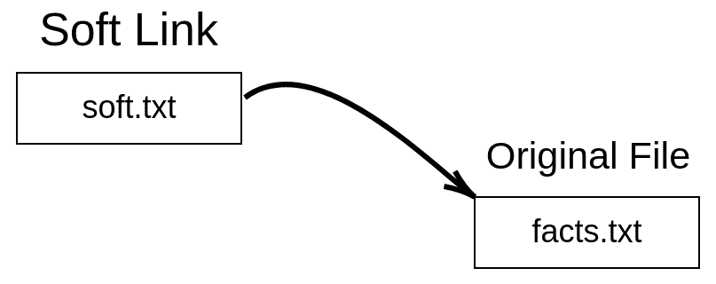
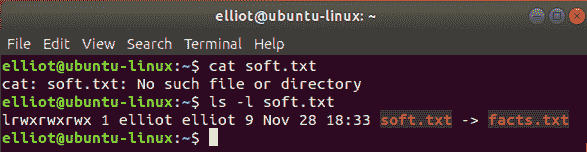
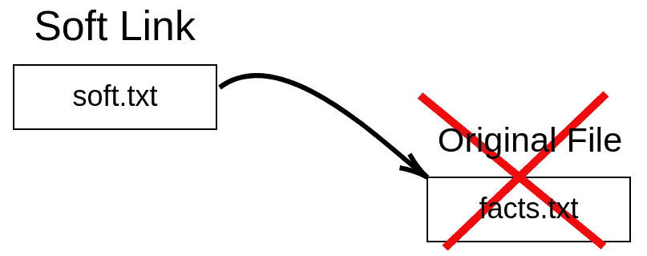
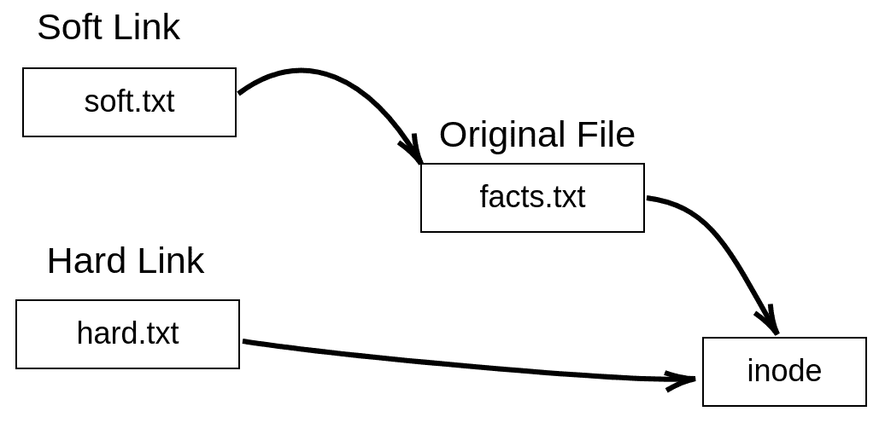
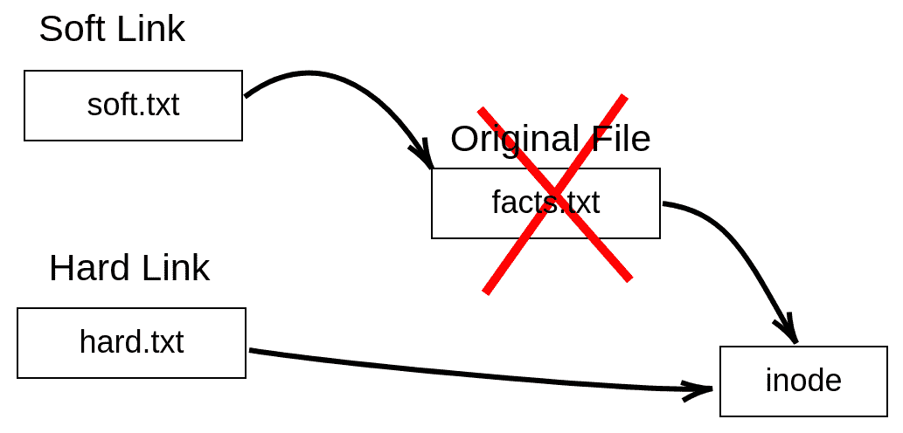

硬链接与软链接

在本章中，我们进一步了解 Linux 文件，并讨论硬链接和软链接之间的区别。如果您以前在 Windows（或 macOS）中创建过快捷方式，您将很快掌握软链接的概念。但在讨论硬链接和软链接之前，您首先必须了解 inode 的概念。

# 第七章：文件 inode

当您去杂货店时，您会发现每种产品都有一组属性，例如：

+   产品类型：巧克力

+   产品价格：$2.50

+   产品供应商：Kit Kat

+   剩余金额：199

这些属性可以通过扫描产品的条形码在杂货店的任何产品上显示。当然，每个条形码都是唯一的。嗯，您可以将这个类比应用到 Linux。Linux 上的每个文件都有一组属性，例如：

+   文件类型

+   文件大小

+   文件所有者

+   文件权限

+   硬链接数量

+   文件时间戳

这些属性存储在称为 inode（索引节点）的数据结构中，每个 inode 由一个编号（inode 编号）标识。因此，您可以将 inode 编号视为杂货店中的条形码。Linux 上的每个文件都有一个 inode 编号，每个 inode 编号指向一个文件数据结构，即 inode。以下是 inode 的正式定义：

**什么是 inode？**

inode 只是一个存储文件信息（属性）的文件数据结构，并且每个 inode 都由一个编号（inode 编号）唯一标识。

# 显示文件 inode 编号

有两个命令可以用来查看文件的 inode 编号：

1.  `ls -i`文件

1.  `stat`文件

例如，要查看`facts.txt`的 inode 编号，您可以运行`ls -i facts.txt`命令：

```
elliot@ubuntu-linux:~$ ls -i facts.txt 
924555 facts.txt
```

它将为您输出 inode 编号。您还可以使用`stat`命令：

```
elliot@ubuntu-linux:~$ stat facts.txt 
File: facts.txt
Size: 173 Blocks: 8 IO Block: 4096 regular file
Device: 801h/2049d Inode: 924555 Links: 1
Access: (0644/-rw-r--r--) Uid: ( 1000/ tom) Gid: ( 1000/ tom) 
Access: 2019-05-08 13:41:16.544000000 -0600
Modify: 2019-05-08 12:50:44.112000000 -0600
Change: 2019-05-08 12:50:44.112000000 -0600
Birth: -
```

`stat`命令不仅列出文件的 inode 编号；它还列出所有文件属性，正如您从命令输出中看到的那样。

# 创建软链接

现在，既然您了解了文件 inode 是什么，您可以轻松理解硬链接和软链接的概念。让我们从软链接开始：

**什么是软链接？**

软链接（也称为符号链接）只是指向另一个文件的文件。

一图胜过千言万语，因此以下图表将帮助您可视化软链接。



图 1：软链接可视化

要创建软链接，我们使用`ln`命令和`-s`选项，如下所示：

```
ln -s original_file soft_link
```

因此，要创建名为`soft.txt`的软链接到`facts.txt`文件，您可以运行`ln -s facts.txt soft.txt`命令：

```
elliot@ubuntu-linux:~$ ln -s facts.txt soft.txt
```

现在让我们对刚刚创建的软链接文件`soft.txt`进行长列表：

```
elliot@ubuntu-linux:~$ ls -l soft.txt
lrwxrwxrwx 1 tom tom 9 May 8 21:48 soft.txt -> facts.txt
```

您会注意到两件事。首先，输出的第一列中的字母`l`，表示文件是一个链接（软链接），其次您可以看到右箭头`soft.txt → facts.txt`，这基本上告诉我们`soft.txt`是一个指向文件`facts.txt`的软链接。

现在让我们检查文件`soft.txt`的内容：

```
elliot@ubuntu-linux:~$ cat soft.txt 
Apples are red.
Grapes are green.
Bananas are yellow.
Cherries are red.
Sky is high.
Earth is round.
Linux is awesome!
Cherries are red.
Cherries are red.
Cherries are red.
```

当然，它包含与原始文件`facts.txt`相同的数据。实际上，如果您编辑软链接，它实际上也会编辑原始文件。

为了演示，用任何文本编辑器打开文件`soft.txt`，并在文件的最末尾添加一行“草是绿色的。”，然后保存并退出，这样`soft.txt`的内容将如下所示：

```
elliot@ubuntu-linux:~$ cat soft.txt 
Apples are red.
Grapes are green.
Bananas are yellow.
Cherries are red.
Sky is high.
Earth is round.
Linux is awesome!
Cherries are red.
Cherries are red.
Cherries are red.
Grass is green.
```

现在让我们检查原始文件`facts.txt`的内容：

```
elliot@ubuntu-linux:~$ cat facts.txt 
Apples are red.
Grapes are green.
Bananas are yellow.
Cherries are red.
Sky is high.
Earth is round.
Linux is awesome!
Cherries are red.
Cherries are red.
Cherries are red.
Grass is green.
```

正如您所看到的，新行“草是绿色的。”也在那里。这是因为每次您编辑软链接时，它实际上也会编辑指向的原始文件。

现在，如果您删除软链接，原始文件不会受到任何影响，它仍然完好无损：

```
elliot@ubuntu-linux:~$ rm soft.txt 
elliot@ubuntu-linux:~$ cat facts.txt
Apples are red.
Grapes are green.
Bananas are yellow.
Cherries are red.
Sky is high.
Earth is round.
Linux is awesome!
Cherries are red.
Cherries are red.
Cherries are red.
Grass is green.
```

现在让我们再次创建软链接`soft.txt`：

```
elliot@ubuntu-linux:~$ ln -s facts.txt soft.txt
```

如果您删除原始文件`facts.txt`，软链接`soft.txt`将变得无用！但在删除`facts.txt`文件之前，让我们在`/tmp`中制作一个副本，因为以后我们会需要它：

```
elliot@ubuntu-linux:~$ cp facts.txt /tmp
```

现在让我们从`elliot`的主目录中删除文件`facts.txt`，看看软链接会发生什么：

```
elliot@ubuntu-linux:~$ rm facts.txt 
elliot@ubuntu-linux:~$ cat soft.txt 
cat: soft.txt: No such file or directory
```

如您所见，软链接`soft.txt`变得无用，因为它现在指向无处。请记住，文件`soft.txt`仍然存在，如下截图所示。



图 2：soft.txt 变得无用！

以下图表向您展示了原始文件`facts.txt`被删除后，软链接`soft.txt`指向无处。



图 3：soft.txt 指向无处

现在，如果我们将`facts.txt`移回`elliot`的主目录：

```
elliot@ubuntu-linux:~$ mv /tmp/facts.txt /home/elliot
```

软链接`soft.txt`将再次有用！您可以说我们复活了软链接！

```
elliot@ubuntu-linux:~$ cat soft.txt 
Apples are red.
Grapes are green.
Bananas are yellow.
Cherries are red.
Sky is high.
Earth is round.
Linux is awesome!
Cherries are red.
Cherries are red.
Cherries are red.
Grass is green.
```

让我们比较软链接`soft.txt`和原始文件`facts.txt`的 inode 号：

```
elliot@ubuntu-linux:~$ ls -i soft.txt facts.txt 
925155 facts.txt 924556 soft.txt
```

如您所见，两个文件的 inode 号是不同的。最后，让我们对软链接`soft.txt`运行`stat`命令：

```
elliot@ubuntu-linux:~$ stat soft.txt 
File: soft.txt -> facts.txt
Size: 9 Blocks: 0 IO Block: 4096 symbolic link
Device: 801h/2049d Inode: 924556 Links: 1
Access: (0777/lrwxrwxrwx) Uid: ( 1000/ tom) Gid: ( 1000/ tom) 
Access: 2019-05-08 22:04:58.636000000 -0600
Modify: 2019-05-08 22:02:18.356000000 -0600
Change: 2019-05-08 22:02:18.356000000 -0600
Birth: -
```

如您所见，它将文件列为符号链接，这是软链接的另一个名称。

因此，正如您迄今所见，软链接具有以下属性：

+   软链接的 inode 与原始文件不同。

+   一旦原始文件被删除，软链接就变得无用。

+   对软链接的任何更改实际上都是对原始文件的更改。

+   您可以创建对目录的软链接。

您可以创建对目录的软链接，就像您可以创建对文件的软链接一样。为了演示，让我们首先在`elliot`的主目录中创建一个名为`sports`的目录。并在`sports`中创建三个文件-`swimming`，`soccer`和`hockey`，如下所示：

```
elliot@ubuntu-linux:~$ mkdir sports
elliot@ubuntu-linux:~$ touch sports/swimming sports/soccer sports/hockey 
elliot@ubuntu-linux:~$ ls sports
hockey soccer swimming
```

现在让我们创建名为`softdir1`的软链接到`sports`目录：

```
elliot@ubuntu-linux:~$ ln -s sports softdir1
```

现在如果您切换到`softdir1`，实际上是切换到`sports`，因此您将看到相同的目录内容：

```
elliot@ubuntu-linux:~$ cd softdir1 
elliot@ubuntu-linux:~/softdir1$ ls 
hockey soccer swimming
```

当然，对目录也是一样的；也就是说，如果您删除原始目录，软链接将变得无用！

# 创建硬链接

当涉及到硬链接时，情况有些不同。这是因为硬链接是原始文件的副本。以下是硬链接的定义：

**什么是硬链接？**

硬链接只是现有文件的附加名称。它具有与原始文件相同的 inode，因此与原始文件无法区分。

您可以将其视为昵称。当有人用您的昵称称呼您时，他们仍然在指代您。

硬链接具有以下属性：

+   硬链接具有与原始文件相同的 inode（共享）。

+   如果原始文件被删除，硬链接仍然保持完整。

+   对硬链接的任何更改都会反映在原始文件中。

+   您无法创建对目录的硬链接。

以下图表可帮助您可视化硬链接：



图 4：硬链接可视化

我们使用相同的`ln`命令来创建硬链接，但这次我们省略了`-s`选项：

```
ln original_file hard_link
```

因此，要创建名为`hard.txt`的硬链接到文件`facts.txt`，您只需运行命令`ln facts.txt hard.txt`：

```
elliot@ubuntu-linux:~$ ln facts.txt hard.txt
```

现在让我们对硬链接`hard.txt`和原始文件`facts.txt`进行长列表：

```
elliot@ubuntu-linux:~$ ls -l hard.txt
-rw-rw-r-- 2 tom tom 210 May 9 00:07 hard.txt 
elliot@ubuntu-linux:~$ ls -l facts.txt
-rw-rw-r-- 2 tom tom 210 May 9 00:07 facts.txt
```

它们是相同的！硬链接也与原始文件一样具有相同的内容：

```
elliot@ubuntu-linux:~$ cat hard.txt 
Apples are red.
Grapes are green.
Bananas are yellow.
Cherries are red.
Sky is high.
Earth is round.
Linux is awesome!
Cherries are red.
Cherries are red.
Cherries are red.
Grass is green.
```

现在使用您选择的文本编辑器向硬链接`hard.txt`的末尾添加一行“游泳是一项运动。”：

```
elliot@ubuntu-linux:~$ cat hard.txt 
Apples are red.
Grapes are green.
Bananas are yellow.
Cherries are red.
Sky is high.
Earth is round.
Linux is awesome!
Cherries are red.
Cherries are red.
Cherries are red.
Grass is green.
Swimming is a sport.
```

现在就像软链接的情况一样，原始文件的内容也发生了变化：

```
elliot@ubuntu-linux:~$ cat facts.txt 
Apples are red.
Grapes are green.
Bananas are yellow.
Cherries are red.
Sky is high.
Earth is round.
Linux is awesome!
Cherries are red.
Cherries are red.
Cherries are red.
Grass is green.
Swimming is a sport.
```

现在让我们检查两个文件的 inode 号：

```
elliot@ubuntu-linux:~ ls -i hard.txt facts.txt 
925155 facts.txt 925155 hard.txt
```

请注意，两个文件具有相同的 inode 号。现在让我们对两个文件运行`stat`命令：

```
elliot@ubuntu-linux:~$ stat hard.txt facts.txt 
File: hard.txt
Size: 210 Blocks: 8 IO Block: 4096 regular file
Device: 801h/2049d Inode: 925155 Links: 2
Access: (0664/-rw-rw-r--) Uid: ( 1000/ elliot) Gid: ( 1000/ elliot) 
Access: 2019-05-09 00:07:36.884000000 -0600
Modify: 2019-05-09 00:07:25.708000000 -0600
Change: 2019-05-09 00:07:25.720000000 -0600
Birth: -
File: facts.txt
Size: 210 Blocks: 8 IO Block: 4096 regular file
Device: 801h/2049d Inode: 925155 Links: 2
Access: (0664/-rw-rw-r--) Uid: ( 1000/ elliot) Gid: ( 1000/ elliot)
Access: 2019-05-09 00:07:36.884000000 -0600
Modify: 2019-05-09 00:07:25.708000000 -0600
Change: 2019-05-09 00:07:25.720000000 -0600
Birth: -
```

`stat`命令的输出对两个文件都是相同的。而且，这里的`链接数：2`表示有两个硬链接指向该文件。嗯！我们只创建了一个硬链接指向文件`facts.txt`，那么为什么会列出两个硬链接呢？原来，原始文件是指向自身的硬链接，所以任何文件至少有一个硬链接（指向自身）。

现在与软链接的情况不同，如果你删除原始文件`facts.txt`：

```
elliot@ubuntu-linux:~$ rm facts.txt
```

硬链接保持不变：

```
elliot@ubuntu-linux:~$ cat hard.txt 
Apples are red.
Grapes are green.
Bananas are yellow.
Cherries are red.
Sky is high.
Earth is round.
Linux is awesome!
Cherries are red.
Cherries are red.
Cherries are red.
Grass is green.
Swimming is a sport.
```

下图显示了为什么硬链接保持不变。



图 5：hard.txt 保持不变

现在注意，在删除文件`facts.txt`后，文件`hard.txt`的硬链接计数将减少到一个：

```
elliot@ubuntu-linux:~$ stat hard.txt 
File: hard.txt
Size: 210 Blocks: 8 IO Block: 4096 regular file
Device: 801h/2049d Inode: 925155 Links: 1
Access: (0664/-rw-rw-r--) Uid: ( 1000/ elliot) Gid: ( 1000/ elliot) 
Access: 2019-05-09 00:17:21.176000000 -0600
Modify: 2019-05-09 00:07:25.708000000 -0600
Change: 2019-05-09 00:17:18.696000000 -0600
Birth: -
```

你不能创建一个指向目录的硬链接。如果你不相信我，那就试着创建一个名为`variables`的硬链接指向`/var`目录：

```
elliot@ubuntu-linux:~$ ln /var variables
ln: /var: hard link not allowed for directory
```

我告诉过你，目录不允许有硬链接！你为什么怀疑我？

**令人震惊的事实**

没有办法区分原始文件和硬链接。例如，如果给你两个文件，其中一个恰好是另一个文件的硬链接，那么没有办法知道哪个文件是原始文件！这就像鸡和蛋的困境；没有人知道哪个先出现！

# 知识检测

对于以下练习，打开你的终端并尝试解决以下任务：

1.  显示`/var/log`目录的 inode 编号。

1.  显示`/boot`目录的硬链接数。

1.  在你的主目录中创建一个名为`coins`的新目录。

1.  创建一个指向`coins`的软链接，名为`currency`。

1.  在`coins`目录中，创建两个文件——`silver`和`gold`。

1.  在`currency`目录中创建一个新文件`bronze`。

1.  列出`coins`和`currency`两个目录的内容。

1.  在你的主目录中创建一个包含“咖啡很棒”的新文件`beverages`，并创建一个名为`drinks`的硬链接指向`beverages`。

1.  在`drinks`文件中添加一行“柠檬很清爽”，然后删除`beverages`文件。

1.  显示你的`drinks`文件的内容。

## 真或假

1.  **文件名**是 inode 数据结构的一部分。

1.  **文件大小**是 inode 数据结构的一部分。

1.  你可以创建指向目录的软链接。

1.  你可以创建指向目录的硬链接。

1.  目录的最小硬链接数为`2`。

1.  软链接与原始文件具有相同的 inode 编号。

1.  硬链接与原始文件具有相同的 inode 编号。
