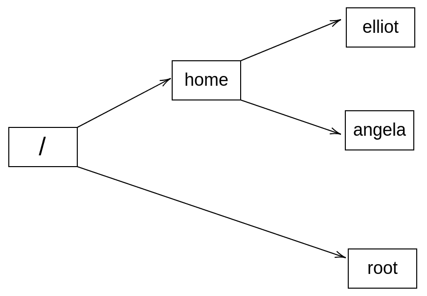

谁是 root？

到目前为止，用户`elliot`已经能够在系统上做了很多事情。但是，有很多事情用户`elliot`无法做！为了演示，让我们尝试在`/var`目录中创建一个名为`happy`的文件：

```
elliot@ubuntu-linux:~$ touch /var/happy
touch: cannot touch '/var/happy': Permission denied
```

哎呀！我们得到了`Permission denied`错误。

现在让我们尝试在`/etc`中创建名为`games`的新目录：

```
elliot@ubuntu-linux:/$ mkdir /etc/games
mkdir: cannot create directory ‘/etc/games': Permission denied
```

再次！我们得到了相同的错误，`Permission denied`！

这里发生了什么？嗯，用户`elliot`没有权限在系统上做任何他想做的事情！那么谁？谁有权限在系统上做任何事情？是 root 用户。

**谁是 root？**

`root`是具有在系统上执行任何操作权限的 Linux 用户。`root`也被称为超级用户。

# 第八章：访问 root 用户

您可以运行`sudo -i`命令首次访问系统上的`root`用户：

```
elliot@ubuntu-linux:~$ sudo -i
[sudo] password for elliot:
root@ubuntu-linux:~#
```

您将被提示输入密码，然后突然之间，您拥有了超级权限！

注意命令提示符的变化，而不是美元符号（`$`），它现在显示`#`来欢迎 root 用户。

让我们运行`whoami`命令，确保我们现在已登录为 root 用户：

```
root@ubuntu-linux:~# whoami 
root
```

太棒了！现在让我们显示当前工作目录：

```
root@ubuntu-linux:~# pwd
/root
```

记得之前我告诉过你，`root`用户的主目录是`/root`而不是在`/home`下。



图 1：/root 是 root 用户的主目录

现在让我们重新运行我们两次被拒绝的命令，但这次，我们以`root`用户身份运行两个命令。

```
root@ubuntu-linux:~# touch /var/happy 
root@ubuntu-linux:~# ls -l /var/happy
-rw-r--r-- 1 root root 0 Apr 15 10:53 /var/happy
```

正如您所看到的，没有什么可以阻止`root`用户做任何事情！现在让我们在`/etc`中创建目录`games`：

```
root@ubuntu-linux:~# mkdir /etc/games 
root@ubuntu-linux:~# ls -ld /etc/games
drwxr-xr-x 2 root root 4096 Apr 15 10:55 /etc/games
```

我们没有错误，这是因为您作为`root`用户有权进行任何操作。但是请永远记住，伴随着强大的力量而来的是巨大的责任。

# 设置 root 密码

您还可以使用`su`命令切换到`root`用户，但首先，您需要设置`root`的密码：

```
root@ubuntu-linux:~# passwd 
Enter new UNIX password:
Retype new UNIX password:
passwd: password updated successfully
```

太棒了，现在退出`root`用户：

```
root@ubuntu-linux:~# exit 
logout
elliot@ubuntu-linux:~$ whoami 
elliot
```

现在您可以使用`su root`命令切换到`root`用户：

```
elliot@ubuntu-linux:~$ su root 
Password:
root@ubuntu-linux:/home/elliot# whoami 
root
```

# 破折号的区别

请注意，我的当前工作目录现在是`/home/elliot`而不是`/root`。如果我想更改，我可以退出到用户`elliot`，然后重新运行`su`命令，但这次，在用户名之前加上破折号（连字符）。

```
root@ubuntu-linux:/home/elliot# exit 
exit
elliot@ubuntu-linux:~$ su - root 
Password:
root@ubuntu-linux:~# pwd
/root
```

那么有什么区别吗？

这是交易。当您在用户名之前不添加破折号时，shell 会保留当前用户的 shell 环境设置，其中包括当前工作目录。另一方面，当您添加破折号时，shell 会获取新用户（您切换到的用户）的环境设置。

所以让我们练习一下。如果您想切换到用户`elliot`但保留`root`的 shell 环境设置，则不需要破折号：

```
root@ubuntu-linux:~# pwd
/root
root@ubuntu-linux:~# su elliot 
elliot@ubuntu-linux:/root$ pwd
/root
elliot@ubuntu-linux:/root$
```

注意当我切换到用户`elliot`时，当前工作目录没有更改。现在，让我们退出并再次切换到用户`elliot`，但这次，在用户名之前加上破折号：

```
elliot@ubuntu-linux:/root$ exit 
exit
root@ubuntu-linux:~# pwd
/root
root@ubuntu-linux:~# su - elliot 
elliot@ubuntu-linux:~$ pwd
/home/elliot
```

现在注意当前工作目录如何从`/root`更改为`/home/elliot`。因此，在这里，shell 获取了用户`elliot`的环境设置。

**一个很酷的提示**

如果您运行`su`而不指定用户名，则`su`将切换到 root 用户。因此，如果您想节省一些输入，每次想切换到 root 用户时都可以省略用户名。

让我们尝试一下我们很酷的提示！作为用户`elliot`，运行`su`命令而不指定用户名：

```
elliot@ubuntu-linux:~$ su 
Password:
root@ubuntu-linux:/home/elliot#
```

然后，您可以输入`root`密码以登录为`root`。

您还可以使用破折号获取`root`的 shell 环境设置：

```
elliot@ubuntu-linux:~$ su - 
Password:
root@ubuntu-linux:~# pwd
/root
```

这次我降落在`/root`，因为我使用了破折号。

嗯，这是一个简短的章节，但`root`用户肯定值得有一个专门的部分。还要记住，当你是`root`用户时，你拥有超级权限，可以在系统上做任何事情。所以如果你不非常小心，你可能会损坏你的系统，这就是为什么有一个非常著名的 Linux 迷因说，“不要喝酒然后使用 root！”

# 知识检查

对于以下练习，打开你的终端并尝试解决以下任务：

1.  切换到`root`用户。

1.  更改`root`用户的密码。

1.  切换到用户`elliot`并登陆到`/home/elliot`。

1.  现在切换到 root 用户，但保留当前工作目录`/home/elliot`。

## 真或假

1.  `root`用户是 Linux 中最强大的用户。

1.  使用`su`命令而不指定用户名将切换到 root 用户。

1.  我们使用`passroot`命令来更改`root`用户的密码。
