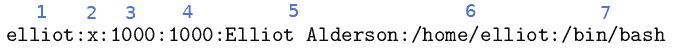
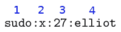
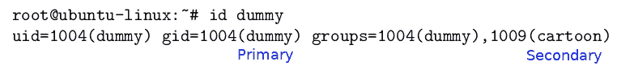
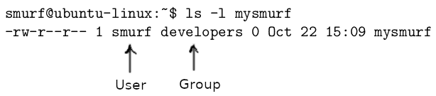
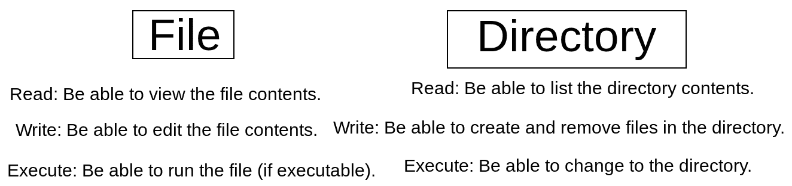
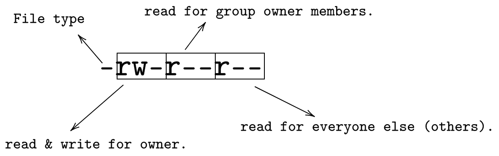
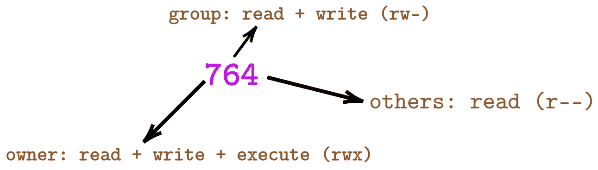

控制人口

Linux 是一个多用户操作系统，这意味着许多用户可以同时访问系统。在现实生活中，你几乎不会找到只有一个用户的 Linux 服务器。相反，你会在一个服务器上看到很多用户。所以让我们真实地为我们的系统添加各种用户和组。在本章中，您将学习如何向 Linux 系统添加用户和组。您还将学习如何以各种方式管理用户和组帐户。此外，您还将学习如何管理 Linux 文件权限。

# 第九章：/etc/passwd 文件

在 Linux 中，用户信息存储在`/etc/passwd`文件中。`/etc/passwd`中的每一行都对应于一个用户。当您首次打开`/etc/passwd`时，您会看到很多用户，然后您会想，*这些用户都是从哪里来的？*答案很简单：这些用户中的大多数是服务用户，它们由您的系统用于启动各种应用程序和服务。然而，本章的主要重点将是系统用户；这些是像您和我一样的真正的人！

`/etc/passwd`中的每一行都由 7 个字段组成，每个字段用冒号分隔，每个字段代表一个用户属性。例如，用户`elliot`的条目看起来可能是这样的：



图 1：/etc/passwd 中的 7 个字段

以下表格详细说明了`/etc/passwd`中的这七个字段，并解释了每一个：

| **字段** | **它存储什么？** |
| --- | --- |
| 1 | 这个字段存储用户名。 |
| 2 | 这个字段通常有一个`X`，这意味着用户的密码已加密并存储在文件`/etc/shadow`中。 |
| 3 | 这个字段存储**UID**（**用户 ID**）号码。 |
| 4 | 这个字段存储用户的主要**GID**（**组 ID**）。 |
| 5 | 这个字段存储用户的注释，通常是用户的名字和姓氏。 |
| 6 | 这个字段存储用户的主目录路径。 |
| 7 | 这个字段存储用户的默认 shell。 |

表 10：理解/etc/passwd

# 添加用户

在您可以在系统上添加用户之前，您必须成为`root`：

```
elliot@ubuntu-linux:~$ su - 
Password:
root@ubuntu-linux:~#
```

现在，我们准备好添加用户了。我们都喜欢汤姆和杰瑞，所以让我们从添加用户`tom`开始。为此，您需要运行命令`useradd -m tom`：

```
root@ubuntu-linux:~# useradd -m tom
```

就像这样，用户`tom`现在已经添加到我们的系统中。您还会看到在`/etc/passwd`文件的末尾添加了一个新行，用于新用户`tom`；让我们用可爱的`tail`命令查看一下：

```
root@ubuntu-linux:~# tail -n 1 /etc/passwd 
tom:x:1007:1007::/home/tom:/bin/sh
```

我们使用`useradd`命令的`-m`选项来确保为用户`tom`创建一个新的主目录。所以让我们尝试切换到`/home/tom`目录，以确保它确实已经创建：

```
root@ubuntu-linux:~# cd /home/tom 
root@ubuntu-linux:/home/tom# pwd
/home/tom
```

太棒了！我们验证了`/home/tom`已经创建。

在创建新用户后，您可能想要做的第一件事是设置用户的密码。您可以通过运行命令`passwd tom`来设置`tom`的密码：

```
root@ubuntu-linux:~# passwd tom 
Enter new UNIX password:
Retype new UNIX password:
passwd: password updated successfully
```

现在，让我们创建用户`jerry`。但是这次，我们将为用户`jerry`选择以下属性：

| UID | `777` |
| --- | --- |
| 注释 | `Jerry the Mouse` |
| Shell | `/bin/bash` |

这很容易通过`useradd`命令来完成：

```
root@ubuntu-linux:~# useradd -m -u 777 -c "Jerry the Mouse" -s /bin/bash jerry
```

`-u`选项用于设置`jerry`的 UID。我们还使用了`-c`选项为用户`jerry`添加注释，最后我们使用了`-s`选项为`jerry`设置默认 shell。

现在，让我们查看`/etc/passwd`文件的最后两行，进行一些比较：

```
root@ubuntu-linux:~# tail -n 2 /etc/passwd 
tom:x:1007:1007::/home/tom:/bin/sh 
jerry:x:777:1008:Jerry the Mouse:/home/jerry:/bin/bash
```

请注意，用户`tom`的注释字段为空，因为我们在创建用户`tom`时没有添加任何注释，还要注意用户`tom`的 UID 是由系统选择的，但我们为用户`jerry`选择了`777`。另外，注意用户`tom`的默认 shell 是由系统选择的`/bin/sh`，这是`/bin/bash`的旧版本。然而，我们为用户`jerry`选择了更新的 shell`/bin/bash`。

现在，让我们为用户`jerry`设置密码：

```
root@ubuntu-linux:~# passwd jerry 
Enter new UNIX password:
Retype new UNIX password:
passwd: password updated successfully
```

太棒了！我们现在已经创建了两个用户：`tom`和`jerry`。现在，让我们切换到用户`tom`：

```
root@ubuntu-linux:~# su - tom
$ whoami tom
$ pwd
/home/tom
$
```

我们成功切换到了用户`tom`，但是你可以看到，shell 看起来很不一样，因为命令提示符不显示用户名或主机名。这是因为用户`tom`的默认 shell 是`/bin/sh`。你可以使用`echo $SHELL`命令来显示用户的默认 shell：

```
$ echo $SHELL
/bin/sh
```

如你所见，它显示了`/bin/sh`。现在，让我们退出并切换到用户`jerry`：

```
$ exit
root@ubuntu-linux:~# su - jerry 
jerry@ubuntu-linux:~$ whoami 
jerry
jerry@ubuntu-linux:~$ echo $SHELL
/bin/bash
```

一切看起来都更好了，因为我们确实将他的默认 shell 设置为`/bin/bash`。好了，现在让我们切换回`root`用户：

```
jerry@ubuntu-linux:~$ exit 
logout
root@ubuntu-linux:~#
```

# 修改用户属性

所以我们不满意用户`tom`的默认 shell 是`/bin/sh`，我们想把它改成`/bin/bash`。我们可以使用`usermod`命令来修改用户属性。

例如，要将用户`tom`的默认 shell 更改为`/bin/bash`，你可以运行命令`usermod -s /bin/bash tom`：

```
root@ubuntu-linux:~# usermod -s /bin/bash tom
```

请注意，你也可以使用命令选项的全名；所以你可以使用`--shell`代替`-s`。无论如何，让我们看看我们是否成功地更改了用户`tom`的默认 shell：

```
root@ubuntu-linux:~# su - tom 
tom@ubuntu-linux:~$ whoami 
tom
tom@ubuntu-linux:~$ echo $SHELL
/bin/bash
```

太棒了！我们成功了。你也可以通过运行命令`usermod -u 444 tom`将`tom`的 UID 更改为`444`：

```
root@ubuntu-linux:~# usermod -u 444 tom
```

我们确实可以通过查看`/etc/passwd`文件来检查`tom`的 UID 是否已更改：

```
root@ubuntu-linux:~# tail -n 2 /etc/passwd 
tom:x:444:1007::/home/tom:/bin/bash 
jerry:x:777:1008:Jerry the Mouse:/home/jerry:/bin/bash
```

我们甚至可以修改用户`tom`的注释字段。现在，它是空的，但你可以通过运行命令将用户`tom`的注释字段设置为`"Tom the Cat"`：

```
root@ubuntu-linux:~# usermod --comment "Tom the Cat" tom
```

而且，我们可以通过查看`/etc/passwd`文件来验证评论是否已更改：

```
root@ubuntu-linux:~# tail -n 2 /etc/passwd 
tom:x:444:1007:Tom the Cat:/home/tom:/bin/bash 
jerry:x:777:1008:Jerry the Mouse:/home/jerry:/bin/bash
```

# 定义骨架

如果你列出`/home/jerry`和`/home/tom`的内容，你会发现它们是空的：

```
root@ubuntu-linux:~# ls -l /home/tom 
total 0
root@ubuntu-linux:~# ls -l /home/jerry 
total 0
```

`/home/jerry`和`/home/tom`都是空的原因是骨架文件`/etc/skel`也是空的：

```
root@ubuntu-linux:~# ls -l /etc/skel 
total 0
```

**/etc/skel 是什么？**

这是骨架文件。在`/etc/skel`中创建的任何文件或目录都将被复制到任何新创建的用户的主目录中。

现在，用你最喜欢的文本编辑器，在`/etc/skel`中创建文件`welcome.txt`，并在其中插入一行`"Hello Friend!"`：

```
root@ubuntu-linux:/etc/skel# ls 
welcome.txt
root@ubuntu-linux:/etc/skel# cat welcome.txt 
Hello Friend!
```

好了，现在你已经在`/etc/skel`中创建了文件`welcome.txt`，这意味着任何新创建的用户现在都会在他们的主目录中有文件`welcome.txt`。为了演示，让我们创建一个名为`edward`的新用户，然后我们将看一下他的主目录：

```
root@ubuntu-linux:~# useradd -m -c "Edward Snowden" -s /bin/bash edward
```

现在，让我们为用户`edward`设置密码：

```
root@ubuntu-linux:~# passwd edward 
Enter new UNIX password:
Retype new UNIX password:
passwd: password updated successfully
```

现在，关键时刻到了！让我们切换到用户`edward`，并列出他的主目录的内容：

```
root@ubuntu-linux:~# su - edward 
edward@ubuntu-linux:~$ ls 
welcome.txt
edward@ubuntu-linux:~$ cat welcome.txt 
Hello Friend!
```

你可以看到文件`welcome.txt`被复制到了`edward`的主目录。系统中创建的每个新用户现在都将有一个很酷的问候消息！请注意，像`tom`和`jerry`这样的旧用户不会在他们的主目录中有文件`welcome.txt`，因为它们是在我们在`/etc/skel`中添加文件`welcome.txt`之前创建的。

# 更改默认值

我们已经厌倦了每次创建新用户时都要指定默认 shell。但幸运的是，有一个文件可以指定为任何新创建的用户设置默认 shell。这个神奇的文件是`/etc/default/useradd`。

打开文件`/etc/default/useradd`，查找以下行：

```
SHELL=/bin/sh
```

将其更改为：

```
SHELL=/bin/bash
```

太棒了！现在，任何新创建的用户都将以`/bin/bash`作为默认 shell。让我们通过创建一个名为`spy`的新用户来测试一下：

```
root@ubuntu-linux:~# useradd -m spy
```

现在，为用户`spy`设置密码：

```
root@ubuntu-linux:~# passwd spy 
Enter new UNIX password:
Retype new UNIX password:
passwd: password updated successfully
```

最后，让我们切换到用户`spy`并检查默认 shell：

```
root@ubuntu-linux:~# su - spy 
spy@ubuntu-linux:~$ echo $SHELL
/bin/bash
spy@ubuntu-linux:~$ exit 
logout
root@ubuntu-linux:~#
```

万岁！我们可以看到`bash`是用户`spy`的默认 shell。

请记住，`/bin/sh`和`/bin/bash`不是你系统上唯一两个有效的 shell；还有更多！查看文件`/etc/shells`，以查看系统上所有有效 shell 的完整列表：

```
root@ubuntu-linux:~# cat /etc/shells 
# /etc/shells: valid login shells
/bin/sh
/bin/bash
/bin/rbash
/bin/dash
```

你可以在`/etc/default/useradd`中更改其他用户默认值，包括：

+   默认的`home`目录（`HOME=/home`）

+   默认的`skel`目录（`SKEL=/etc/skel`）

我会把这个留给你作为练习。

# 删除用户

有时，不再需要用户在系统上，例如，离开公司的员工或只需要临时访问服务器的用户。无论哪种情况，您都需要知道如何删除用户。

我们创建的最后一个用户是`spy`，对吧？好吧，我们的系统上不需要间谍，所以让我们删除用户`spy`；您可以通过运行命令`userdel spy`来删除用户`spy`：

```
root@ubuntu-linux:~# userdel spy
```

就像那样，用户`spy`被删除了。但是，`spy`的主目录仍然存在：

```
root@ubuntu-linux:~# ls -ld /home/spy
drwxr-xr-x 2 1008 1010 4096 Apr 17 10:24 /home/spy
```

我们将不得不手动删除它：

```
root@ubuntu-linux:~# rm -r /home/spy
```

但这很不方便。想象一下，每次删除一个用户后，您都必须手动删除他们的主目录。幸运的是，有一个更好的解决方案；您可以使用`-r`选项自动删除用户的主目录。

让我们尝试一下用户`edward`：

```
root@ubuntu-linux:~# userdel -r edward
```

现在，让我们来检查一下用户`edward`的主目录是否仍然存在：

```
root@ubuntu-linux:~# ls -ld /home/edward
ls: cannot access '/home/edward': No such file or directory
```

正如您所看到的，`edward`的主目录已被删除。

# /etc/group 文件

在学校，孩子们通常被分成不同的小组。例如，喜欢跳舞的孩子将成为舞蹈组的一部分。书呆子孩子将组成科学组。如果你想知道，我曾经是体育组的一部分，因为我跑得相当快！

在 Linux 中，具有相似特征的用户被放置在同一组中，这与我们有相同的概念。

什么是组？

组是共享相同角色或目的的用户集合。

所有组的信息都存储在文件`/etc/group`中。就像`/etc/passwd`文件一样，`/etc/group`中的每一行都对应于一个组，每一行都由`4`个字段组成。例如，Linux 中最著名的组之一是`sudo`组：



图 2：/etc/group 中的 4 个字段

以下表格详细说明了`/etc/group`中的这四个字段，并解释了每一个：

| **字段** | **它存储什么？** |
| --- | --- |
| 1 | 此字段存储组名。 |
| 2 | 此字段通常包含`X`，这意味着组密码已加密并存储在文件`/etc/gshadow`中。 |
| 3 | 此字段存储**GID**（**组 ID**）号码。 |
| 4 | 此字段存储组成员的用户名。 |

表 11：理解/etc/group

# 添加组

让我们创建一个名为`cartoon`的组。为此，您需要运行命令`groupadd cartoon`：

```
root@ubuntu-linux:~# groupadd cartoon
```

请注意，将添加包含组信息的新行到文件`/etc/group`的末尾：

```
root@ubuntu-linux:~# tail -n 1 /etc/group 
cartoon:x:1009:
```

请注意，组`cartoon`目前没有成员，这就是为什么第四个字段目前为空的原因。

让我们创建另一个名为`developers`的组，但这次，我们将指定`888`的 GID：

```
root@ubuntu-linux:~# groupadd --gid 888 developers
```

让我们检查`/etc/group`中的`developers`组条目：

```
root@ubuntu-linux:~# tail -n 1 /etc/group 
developers:x:888:
```

而且它看起来就像我们期望的那样。很酷！

# 添加组成员

用户`tom`和`jerry`都是卡通人物，因此将它们都添加到`cartoon`组是有意义的。

要将`tom`添加到`cartoon`组，只需运行命令`usermod -aG cartoon tom`：

```
root@ubuntu-linux:~# usermod -aG cartoon tom
```

同样，您可以将`jerry`添加到`cartoon`组中：

```
root@ubuntu-linux:~# usermod -aG cartoon jerry
```

现在，让我们来看看`/etc/group`文件：

```
root@ubuntu-linux:~# tail -n 2 /etc/group 
cartoon:x:1009:tom,jerry 
developers:x:888:
```

正如您所看到的，`tom`和`jerry`现在都列为`cartoon`组的成员。

您可以使用`id`命令查看系统上任何用户的组成员资格。例如，如果您想要检查`tom`属于哪些组，可以运行命令`id tom`：

```
root@ubuntu-linux:~# id tom
uid=444(tom) gid=1007(tom) groups=1007(tom),1009(cartoon)
```

让我们通过创建三个新用户`sara`，`peter`和`rachel`来进行更多练习：

```
root@ubuntu-linux:~# useradd -m sara 
root@ubuntu-linux:~# useradd -m peter 
root@ubuntu-linux:~# useradd -m rachel
```

并记得为每个用户设置密码：

```
root@ubuntu-linux:~# passwd sara 
Enter new UNIX password:
Retype new UNIX password:
passwd: password updated successfully 
root@ubuntu-linux:~# passwd peter 
Enter new UNIX password:
Retype new UNIX password:
passwd: password updated successfully 
root@ubuntu-linux:~# passwd rachel 
Enter new UNIX password:
Retype new UNIX password:
passwd: password updated successfully 
root@ubuntu-linux:~#
```

现在想象一下，如果所有三个新用户都是软件开发人员；这意味着他们有相同的角色，因此他们应该是同一组的成员。因此，让我们将所有三个用户添加到`developers`组中：

```
root@ubuntu-linux:~# usermod -aG developers sara 
root@ubuntu-linux:~# usermod -aG developers peter 
root@ubuntu-linux:~# usermod -aG developers rachel
```

现在，让我们来看看`/etc/group`文件：

```
root@ubuntu-linux:~# tail -n 5 /etc/group 
cartoon:x:1009:tom,jerry 
developers:x:888:sara,peter,rachel 
sara:x:1001:
peter:x:1002: 
rachel:x:1003:
```

我们可以看到`developers`组现在有三个成员-`sara`，`peter`和`rachel`。但是有一些奇怪的地方！看起来当我们创建用户`sara`，`peter`和`rachel`时，它也创建了它们作为组！但是为什么会发生这种情况呢？好吧，让我在下一节中向您解释。

# 主要与次要组

Linux 中的每个用户必须是主要组的成员。主要组有时也被称为登录组。默认情况下，每当创建新用户时，也会创建一个与用户名称相同的组，并且该组将成为新用户的主要组。

另一方面，用户可能是或不是次要组的成员。次要组有时也被称为附加组。您可以将次要组视为用户除了用户的主要组之外的任何组的成员。

如果您还不理解主要和次要组的概念，不要担心；到本章结束时，它将变得非常清晰。

让我们创建一个名为`dummy`的新用户：

```
root@ubuntu-linux:~# useradd -m dummy
```

现在，如果您查看`/etc/group`文件的最后一行，您将看到一个名为`dummy`的组也被创建：

```
root@ubuntu-linux:~# tail -n 1 /etc/group 
dummy:x:1004:
```

这个`dummy`组是用户`dummy`的主要组；如果您对用户`dummy`运行`id`命令：

```
root@ubuntu-linux:~# id dummy
uid=1004(dummy) gid=1004(dummy) groups=1004(dummy)
```

您将看到用户`dummy`确实是`dummy`组的成员。现在，让我们将用户`dummy`添加到`cartoon`组：

```
root@ubuntu-linux:~# usermod -aG cartoon dummy
```

让我们再次对用户`dummy`运行`id`命令：

```
root@ubuntu-linux:~# id dummy
uid=1004(dummy) gid=1004(dummy) groups=1004(dummy),1009(cartoon)
```

您可以看到用户`dummy`是两个组`dummy`和`cartoon`的成员。但是，`dummy`是主要组，`cartoon`是次要组。

主要组始终在`id`命令的输出中以`gid=`开头：



图 3：主要与次要组

现在让我们将用户`dummy`添加到`developers`组：

```
root@ubuntu-linux:~# usermod -aG developers dummy
```

接下来，再次对用户`dummy`运行`id`命令：

```
root@ubuntu-linux:~# id dummy
uid=1004(dummy) gid=1004(dummy) groups=1004(dummy),1009(cartoon),888(developers)
```

如您所见，用户`dummy`是两个次要组`cartoon`和`developers`的成员。

好了！够了这些虚拟的东西。让我们删除用户`dummy`：

```
root@ubuntu-linux:~# userdel -r dummy
```

每个用户必须是唯一主要组的成员；但是，对主要组的选择没有限制！

为了演示，让我们创建一个名为`smurf`的用户，`cartoon`是用户`smurf`的主要组。这可以通过使用`useradd`命令的`--gid`选项轻松完成：

```
root@ubuntu-linux:~# useradd -m --gid cartoon smurf
```

现在，看一下`/etc/group`文件：

```
root@ubuntu-linux:~# tail -n 1 /etc/group 
rachel:x:1003:
```

您将看到没有使用名称`smurf`创建的组。太神奇了！那是因为我们已经为用户`smurf`指定了另一个主要组。

现在让我们检查用户`smurf`的组成员资格：

```
root@ubuntu-linux:~# id smurf
uid=1004(smurf) gid=1009(cartoon) groups=1009(cartoon)
```

如您所见，`smurf`只是`cartoon`组的成员，这当然也是他的主要组。

您还可以更改现有用户的主要组。例如，您可以将`developers`组设置为用户`smurf`的主要组，如下所示：

```
root@ubuntu-linux:~# usermod -g developers smurf 
root@ubuntu-linux:~# id smurf
uid=1004(smurf) gid=888(developers) groups=888(developers)
```

# 删除组

如果不再需要组，可以删除组。为了演示，让我们创建一个名为`temp`的组：

```
root@ubuntu-linux:~# groupadd temp
```

现在，您可以使用`groupdel`命令删除`temp`组：

```
root@ubuntu-linux:~# groupdel temp
```

现在，让我们尝试删除`temp`组：

```
root@ubuntu-linux:~# groupdel sara
groupdel: cannot remove the primary group of user 'sara'
```

我们收到错误消息，因为我们不允许删除现有用户的主要组。

# 文件所有权和权限

Linux 中的每个文件都由特定的用户和特定的组拥有。为了演示，让我们切换到用户`smurf`，并在`smurf`的主目录中创建一个名为`mysmurf`的文件：

```
root@ubuntu-linux:~# su - smurf 
smurf@ubuntu-linux:~$ touch mysmurf
```

现在对文件`mysmurf`进行长列表：



图 4：用户和组所有者

您将在输出的第三列中看到拥有文件的用户（用户所有者）的名称，默认情况下是创建文件的用户。

在输出的第四列中，您将看到文件的组（组所有者）的名称，默认情况下是用户所有者的主要组。

`developers`组是用户`smurf`的主要组，因此`developers`成为文件`mysmurf`的组所有者。

如果您在`elliot`的主目录中的`sports`目录上进行长列表：

```
smurf@ubuntu-linux:~$ ls -ld /home/elliot/sports
drwxr-xr-x 2 elliot elliot 4096 Oct 22 12:56 /home/elliot/sports
```

您将看到用户`elliot`是用户所有者，组`elliot`是组所有者；这是因为组`elliot`是用户`elliot`的主要组。

# 更改文件所有权

您可以使用`chown`命令更改文件的所有权。一般来说，`chown`命令的语法如下：

```
chown  user:group file
```

例如，您可以更改文件`mysmurf`的所有权，使用户`elliot`成为所有者，组`cartoon`成为组所有者，如下所示：

```
smurf@ubuntu-linux:~$
smurf@ubuntu-linux:~$ chown elliot:cartoon mysmurf
chown: changing ownership of 'mysmurf': Operation not permitted
```

哦！只有`root`用户可以做到；让我们切换到`root`用户并再试一次：

```
smurf@ubuntu-linux:~$ su - 
Password:
root@ubuntu-linux:~# cd /home/smurf
root@ubuntu-linux:/home/smurf# chown elliot:cartoon mysmurf
```

成功！现在让我们查看文件`mysmurf`的所有权：

```
root@ubuntu-linux:/home/smurf# ls -l mysmurf
-rw-r--r-- 1 elliot cartoon 0 Oct 22 15:09 mysmurf
```

如您所见，我们已成功更改了`mysmurf`的所有权。此外，您还可以更改用户所有者，而不更改组所有者。例如，如果您希望用户`root`成为`mysmurf`的所有者，可以运行以下命令：

```
root@ubuntu-linux:/home/smurf# chown root mysmurf 
root@ubuntu-linux:/home/smurf# ls -l mysmurf
-rw-r--r-- 1 root cartoon 0 Oct 22 15:09 mysmurf
```

如您所见，只有用户所有者更改为`root`，但`cartoon`仍然是组所有者。

您还可以更改组所有者，而不更改用户所有者。例如，如果您希望组`developers`成为`mysmurf`的组所有者，则可以运行：

```
root@ubuntu-linux:/home/smurf# chown :developers mysmurf 
root@ubuntu-linux:/home/smurf# ls -l mysmurf
-rw-r--r-- 1 root developers 0 Oct 22 15:09 mysmurf
```

**供您参考**

`chgrp`也可以用于更改文件的组所有者。我会留给你作为练习！

# 理解文件权限

在 Linux 中，每个文件都为三个不同的实体分配了访问权限；这些实体是：

+   文件的用户所有者

+   文件的组所有者

+   其他所有人（也称为其他/全局）

我们已经熟悉了用户所有者和组所有者；其他所有人指的是系统上不是用户所有者也不是组所有者的任何用户。

您可以将这三个实体视为您、您的朋友和其他所有人。有一些事情你不愿意与任何人分享，其他一些事情你愿意与朋友分享，还有一些事情你可能愿意与所有人分享。

每个文件都有三种类型的访问权限：

+   读取

+   写

+   执行

每个这些访问权限的含义对文件和目录来说并不相同。以下图解释了文件与目录的访问权限之间的区别：



图 5：文件与目录权限

您可以通过进行长列表查看文件的权限。例如，要查看`mysmurf`文件上设置的当前权限，可以运行：

```
root@ubuntu-linux:~# ls -l /home/smurf/mysmurf
-rw-r--r-- 1 root developers 0 Oct 22 15:09 /home/smurf/mysmurf
```

现在注意输出的第一列，即`-rw-r--r--`。请注意，它由十个槽组成；第一个槽确定了文件的类型。剩下的九个槽分为三组，每组有三个槽，就像下图中的一样：



图 6：理解权限

注意第一个槽确定了文件类型；它可以是：

+   `-`表示常规文件

+   `d`表示目录

+   `l`表示软链接

+   `b`表示块设备

+   `c`表示字符设备

接下来的三个槽确定了文件所有者被授予的权限。这些槽中的第一个确定了读取权限；它可以是：

+   `r`表示读取权限

+   `-`表示无读取访问

这些槽中的第二个确定了写权限；它可以是：

+   `w`表示写访问

+   `-`表示无写访问

第三个槽确定了执行权限；它可以是：

+   `x`表示执行访问

+   `-`表示无执行访问

相同的逻辑也适用于接下来的三个槽，用于确定组所有者的权限，最后是最后三个槽，用于确定其他所有人的权限。

现在让我们动手做一些示例，以加强我们对文件权限的理解。让我们首先编辑`mysmurf`文件，并添加以下行`Smurfs are blue!`，使其看起来像这样：

```
root@ubuntu-linux:~# cat /home/smurf/mysmurf 
Smurfs are blue!
```

现在切换到用户`smurf`，并尝试读取文件`mysmurf`的内容：

```
root@ubuntu-linux:~# su - smurf 
smurf@ubuntu-linux:~$ cat mysmurf 
Smurfs are blue!
```

酷！用户`smurf`可以读取文件`mysmurf`的内容。请记住，用户`smurf`不是文件的所有者，但他是`developers`组的成员：

```
smurf@ubuntu-linux:~$ id smurf
uid=1004(smurf) gid=888(developers) groups=888(developers)
```

因此，`smurf`可以读取文件，因为`mysmurf`的组权限是`r--`。但是他能编辑文件吗？让我们看看如果用户`smurf`尝试向文件`mysmurf`添加一行`我是 smurf！`会发生什么：

```
smurf@ubuntu-linux:~$ echo "I am smurf!" >> mysmurf 
bash: mysmurf: Permission denied
```

权限被拒绝！是的，这是因为组所有者（或其他人）没有写权限。只有用户所有者对文件`mysmurf`有读和写权限，而在这种情况下所有者恰好是`root`。现在，如果我们改变文件所有权并使`smurf`成为文件`mysmurf`的所有者，那么他将能够编辑文件；所以让我们首先改变文件所有权：

```
smurf@ubuntu-linux:~$ su - 
Password:
root@ubuntu-linux:~# chown smurf /home/smurf/mysmurf 
root@ubuntu-linux:~# ls -l /home/smurf/mysmurf
-rw-r--r-- 1 smurf developers 17 Oct 23 11:06 /home/smurf/mysmurf
```

现在让我们切换回用户`smurf`，并尝试编辑文件`mysmurf`：

```
root@ubuntu-linux:~# su - smurf
smurf@ubuntu-linux:~$ echo "I am smurf!" >> mysmurf 
smurf@ubuntu-linux:~$ cat mysmurf
Smurfs are blue!
I am smurf!
```

酷！所以用户`smurf`成功编辑了文件。现在让我们切换到用户`elliot`，并尝试向`mysmurf`文件添加一行`我不是 smurf！`：

```
smurf@ubuntu-linux:~$ su - elliot 
Password:
elliot@ubuntu-linux:~$ cd /home/smurf/
elliot@ubuntu-linux:/home/smurf$ echo "I am not smurf!" >> mysmurf 
bash: mysmurf: Permission denied
```

权限被拒绝！请注意，`elliot`不是用户所有者，甚至不是`developers`组的成员，因此他被视为其他人。但是，他可以读取文件，因为其他人有读权限`r--`：

```
elliot@ubuntu-linux:/home/smurf$ cat mysmurf 
Smurfs are blue!
I am smurf!
```

# 更改文件权限

现在，如果我们想要给`elliot`权限来编辑文件`mysmurf`，而不像之前那样改变文件所有权呢？好吧！这很简单；您可以使用`chmod`命令来更改文件权限。

让我们首先切换到`root`用户：

```
elliot@ubuntu-linux:/home/smurf$ su - 
Password:
root@ubuntu-linux:~# cd /home/smurf 
root@ubuntu-linux:/home/smurf#
```

现在您可以通过运行以下命令为其他人（其他所有人）添加写权限：

```
root@ubuntu-linux:/home/smurf# chmod o+w mysmurf
```

这里`o+w`表示**其他人+写**，这意味着向其他人添加写权限。现在对`mysmurf`进行长列表：

```
root@ubuntu-linux:/home/smurf# ls -l mysmurf
-rw-r--rw- 1 smurf developers 29 Oct 23 11:34 mysmurf
```

如您所见，其他人现在可以读取和写入`mysmurf`文件的`rw-`。现在，切换回用户`elliot`，并尝试再次添加一行`我不是 smurf！`：

```
root@ubuntu-linux:/home/smurf# su elliot
elliot@ubuntu-linux:/home/smurf$ echo "I am not smurf!" >> mysmurf 
elliot@ubuntu-linux:/home/smurf$ cat mysmurf
Smurfs are blue!
I am smurf!
I am not smurf!
```

成功！用户`elliot`可以编辑文件`mysmurf`。现在是时候讨论执行权限了；让我们转到`elliot`的主目录，并创建一个名为`mydate.sh`的文件：

```
elliot@ubuntu-linux:/home/smurf$ cd /home/elliot 
elliot@ubuntu-linux:~$ touch mydate.sh
```

现在向文件`mydate.sh`添加以下两行：

```
#!/bin/bash 
date
```

您可以通过运行以下两个`echo`命令添加这两行：

```
elliot@ubuntu-linux:~$ echo '#!/bin/bash' >> mydate.sh 
elliot@ubuntu-linux:~$ echo date >> mydate.sh
```

现在不要担心`#/bin/bash`行的含义；我会在以后的章节中解释。无论如何，让我们查看文件`mydate.sh`的内容：

```
elliot@ubuntu-linux:~$ cat mydate.sh 
#!/bin/bash
date
```

现在对文件`mydate.sh`进行长列表：

```
elliot@ubuntu-linux:~$ ls -l mydate.sh
-rw-rw-r-- 1 elliot elliot 17 Oct 23 12:28 mydate.sh
```

请注意，这里每个人（用户所有者、组所有者和其他人）都没有执行权限。让我们为每个人添加执行权限；您可以通过运行以下命令来实现：

```
elliot@ubuntu-linux:~$ chmod a+x mydate.sh 
elliot@ubuntu-linux:~$ ls -l mydate.sh
-rwxrwxr-x 1 elliot elliot 17 Oct 23 12:28 mydate.sh
```

这里`a+x`表示**所有+执行**，这意味着向每个人添加执行权限。还要注意，我们之所以能够作为用户`elliot`运行`chmod`命令，是因为他是文件`mydate.sh`的所有者。

最后，只需输入`mydate.sh`的完整路径，然后按*Enter*：

```
elliot@ubuntu-linux:~$ /home/elliot/mydate.sh 
Wed Oct 23 12:38:51 CST 2019
```

哇！当前日期显示出来了！您已经创建了您的第一个 Bash 脚本并运行了它！Bash 脚本将在以后的章节中详细介绍。但是现在至少您知道文件可执行是什么意思。现在通过运行以下命令删除执行权限：

```
elliot@ubuntu-linux:~$ chmod a-x mydate.sh 
elliot@ubuntu-linux:~$ ls -l mydate.sh
-rw-rw-r-- 1 elliot elliot 17 Oct 23 12:28 mydate.sh
```

这里`a-x`表示**所有-执行**，这意味着从每个人那里删除执行权限。现在尝试再次运行脚本：

```
elliot@ubuntu-linux:~$ /home/elliot/mydate.sh 
bash: /home/elliot/mydate.sh: Permission denied
```

我们收到了权限被拒绝的错误！这是因为文件`mydate.sh`不再可执行。大多数 Linux 命令都是可执行文件。例如，看一下`date`命令。首先，我们运行`which`命令以获取`date`命令的位置：

```
elliot@ubuntu-linux:~$ which date
/bin/date
```

现在对`/bin/date`进行长列表：

```
elliot@ubuntu-linux:~$ ls -l /bin/date
-rwxr-xr-x 1 root root 100568 Jan 18 2018 /bin/date
```

如您所见，每个人都有执行权限。现在看看当您删除执行权限时会发生什么：

```
elliot@ubuntu-linux:~$ su - 
Password:
root@ubuntu-linux:~# chmod a-x /bin/date
```

现在尝试运行`date`命令：

```
root@ubuntu-linux:~# date
-su: /bin/date: Permission denied
```

`date`命令不再起作用！请让我们通过重新添加执行权限来修复：

```
root@ubuntu-linux:~# chmod a+x /bin/date 
root@ubuntu-linux:~# date
Wed Oct 23 12:56:15 CST 2019
```

现在让我们删除文件`mysmurf`的用户所有者读取权限：

```
root@ubuntu-linux:~# cd /home/smurf/ 
root@ubuntu-linux:/home/smurf# chmod u-r mysmurf 
root@ubuntu-linux:/home/smurf# ls -l mysmurf
--w-r--rw- 1 smurf developers 45 Oct 23 12:02 mysmurf
```

这里的`u-r`表示**用户读取**，意思是从用户所有者中删除读取权限。现在让我们切换到用户`smurf`，并尝试读取文件`mysmurf`：

```
root@ubuntu-linux:/home/smurf# su - smurf 
smurf@ubuntu-linux:~$ cat mysmurf
cat: mysmurf: Permission denied
```

可怜的`smurf`。他甚至不能读取自己的文件。但由于他是文件所有者，他可以恢复读取权限：

```
smurf@ubuntu-linux:~$ chmod u+r mysmurf 
smurf@ubuntu-linux:~$ cat mysmurf Smurfs are blue!
I am smurf!
I am not smurf!
```

您已经看到如何使用`chmod`命令添加（`+`）和删除（`-`）权限。您还可以使用等号`=`来设置权限。例如，如果您希望文件`mysmurf`的组所有者（`developers`）只有写入权限，您可以运行以下命令：

```
smurf@ubuntu-linux:~$ chmod g=w mysmurf 
smurf@ubuntu-linux:~$ ls -l mysmurf
-rw--w-rw- 1 smurf developers 45 Oct 23 12:02 mysmurf
```

所以现在，`developers`组成员只对文件`mysmurf`有写入权限`-w-`。以下是更多示例：

+   `chmod ug=rwx mysmurf`：这将给用户所有者和组所有者完全权限。

+   `chmod o-rw mysmurf`：这将从其他用户中删除读取和写入权限。

+   `chmod a= mysmurf`：这将为每个人提供零（无）权限。

+   `chmod go= mysmurf`：这将给组所有者和其他用户零权限。

+   `chmod u+rx mysmurf`：这将为用户所有者添加读取和执行权限。

让我们给每个人零权限：

```
smurf@ubuntu-linux:~$ chmod a= mysmurf 
smurf@ubuntu-linux:~$ ls -l mysmurf
---------- 1 smurf developers 45 Oct 23 12:02 mysmurf
```

所以现在用户`smurf`无法读取，写入或执行文件：

```
smurf@ubuntu-linux:~$ cat mysmurf 
cat: mysmurf: Permission denied
smurf@ubuntu-linux:~$ echo "Hello" >> mysmurf
-su: mysmurf: Permission denied
```

`root`用户呢？好吧，让我们切换到`root`来找出：

```
smurf@ubuntu-linux:~$ su - 
Password:
root@ubuntu-linux:~# cd /home/smurf/ 
root@ubuntu-linux:/home/smurf# cat mysmurf 
Smurfs are blue!
I am smurf!
I am not smurf!
root@ubuntu-linux:/home/smurf# echo "I got super powers" >> mysmurf 
root@ubuntu-linux:/home/smurf# cat mysmurf
Smurfs are blue!
I am smurf!
I am not smurf!
I got super powers
root@ubuntu-linux:/home/smurf# ls -l mysmurf
---------- 1 smurf developers 64 Oct 23 13:38 mysmurf
```

正如你所看到的，`root`用户可以做任何事情！这是因为`root`可以绕过文件权限！换句话说，文件权限不适用于`root`用户。

# 目录权限

现在让我们看看读取，写入和执行权限在目录上是如何工作的。最简单的例子将是`root`的主目录`/root`。让我们在`/root`上进行长列表：

```
root@ubuntu-linux:~# ls -ld /root
drwx------ 5 root root 4096 Oct 22 14:28 /root
```

正如您所看到的，`root`所有者被授予完全权限，其他人被授予零权限。让我们在`/root`内创建一个名为`gold`的文件：

```
root@ubuntu-linux:~# touch /root/gold
```

现在让我们切换到用户`smurf`，并尝试列出`/root`目录的内容：

```
root@ubuntu-linux:~# su - smurf 
smurf@ubuntu-linux:~$ ls /root
ls: cannot open directory '/root': Permission denied
```

用户`smurf`收到了权限被拒绝的错误，因为他在目录`/root`上没有读取权限。现在，`smurf`能在`/root`内创建文件吗？

```
smurf@ubuntu-linux:~$ touch /root/silver
touch: cannot touch '/root/silver': Permission denied
```

他不能，因为他在`/root`上没有写入权限。他能删除`/root`内的文件吗？

```
smurf@ubuntu-linux:~$ rm /root/gold
rm: cannot remove '/root/gold': Permission denied
```

同样，没有写入权限，所以他无法在`/root`中删除文件。最后，用户`smurf`能否切换到`/root`目录？

```
smurf@ubuntu-linux:~$ cd /root
-su: cd: /root: Permission denied
```

他不能，因为`smurf`需要执行权限才能切换到`/root`目录。现在，让我们切换回`root`用户并开始添加一些权限：

```
smurf@ubuntu-linux:~$ exit 
logout
root@ubuntu-linux:~# chmod o+rx /root
```

在这里，我们为其他用户添加了读取和执行权限，所以用户`smurf`现在可以列出`/root`目录的内容：

```
root@ubuntu-linux:~# su - smurf 
smurf@ubuntu-linux:~$ ls /root 
gold
```

他甚至可以切换到`/root`目录，因为我们还添加了执行权限：

```
smurf@ubuntu-linux:~$ cd /root 
smurf@ubuntu-linux:/root$
```

但他仍然没有写入权限，所以他无法在`/root`中创建或删除文件：

```
smurf@ubuntu-linux:/root$ rm gold
rm: remove write-protected regular empty file 'gold'? y 
rm: cannot remove 'gold': Permission denied 
smurf@ubuntu-linux:/root$ touch silver
touch: cannot touch 'silver': Permission denied
```

让我们为其他用户添加写入权限：

```
smurf@ubuntu-linux:/root$ su - 
Password:
root@ubuntu-linux:~# chmod o+w /root
```

最后，切换到用户`smurf`并尝试在`/root`中创建或删除文件：

```
smurf@ubuntu-linux:~$ cd /root 
smurf@ubuntu-linux:/root$ rm gold
rm: remove write-protected regular empty file 'gold'? y 
smurf@ubuntu-linux:/root$ touch silver
smurf@ubuntu-linux:/root$ ls 
silver
```

所以`smurf`现在可以在`/root`中创建和删除文件，因为他有写入权限。

# 使用八进制表示法

您可以使用数字`4`，`2`和`1`来设置文件权限，而不是字母`r`，`w`和`x`。看一下下面的图片：



图 7：理解八进制表示法

请注意，第一个数字`7`基本上是三个数字的相加：`4（r）+ 2（w）+ 1（x）`，这将为文件所有者设置完全权限。第二个数字`6`是两个数字的相加：`4（r）+ 2（w）`，这将为组所有者设置读取和写入权限。最后，第三个数字`4`，这将为其他用户设置读取权限。

我知道你在想什么：“为什么我要做数学，当我可以使用文字表示`rwx`？”相信我，我理解你。很多人更喜欢文字表示法而不是数字表示法，但有些人太喜欢数字了！

让我们用八进制表示法做一些练习。文件`mysmurf`当前没有任何权限：

```
smurf@ubuntu-linux:~$ ls -l mysmurf
---------- 1 smurf developers 64 Oct 23 13:38 mysmurf
```

我们可以使用`777`为每个人提供完全权限：

```
smurf@ubuntu-linux:~$ chmod 777 mysmurf 
smurf@ubuntu-linux:~$ ls -l mysmurf
-rwxrwxrwx 1 smurf developers 64 Oct 23 13:38 mysmurf
```

太棒了！现在你可以使用三位数`421`来给予文件所有者读取权限，给予组所有者写入权限，以及给予其他用户执行权限：

```
smurf@ubuntu-linux:~$ chmod 421 mysmurf 
smurf@ubuntu-linux:~$ ls -l mysmurf
-r---w---x 1 smurf developers 64 Oct 23 13:38 mysmurf
```

让我们再举一个例子。如果你想给予文件所有者完全权限，给予组所有者读取权限，以及其他用户零权限，那很简单；正确的三位数将是`740`：

```
smurf@ubuntu-linux:~$ chmod 740 mysmurf 
smurf@ubuntu-linux:~$ ls -l mysmurf
-rwxr----- 1 smurf developers 64 Oct 23 13:38 mysmurf
```

一旦你掌握了，数字就很容易使用。只需要记住：

+   `4`：读取

+   `2`：写入

+   `1`：执行

+   `0`：零权限

以下表总结了所有可能的权限组合：

| **数字** | **意义** | **字面等价** |
| --- | --- | --- |
| 0 | 零/无权限 | `---` |
| 1 | 执行 | `--x` |
| 2 | 写入 | `-w-` |
| 3 | 写入 + 执行 | `-wx` |
| 4 | 读取 | `r--` |
| 5 | 读取 + 执行 | `r-x` |
| 6 | 读取 + 写入 | `rw-` |
| 7 | 读取 + 写入 + 执行 | `rwx` |

表 12：八进制表示法与字面表示法

这一章有点冗长。休息一下，然后回来完成知识检测练习！

# 知识检测

对于以下练习，打开你的终端并尝试解决以下任务：

1.  创建一个用户`abraham`，用户 ID 为`333`。

1.  创建一个新的组`admins`。

1.  将用户`abraham`添加到`admins`组。

1.  将`admins`设为目录`/home/abraham`的组所有者。

1.  `admins`组的成员只能列出目录`/home/abraham`的内容。

## 真或假

1.  `chmod a=rxw facts.txt`将会得到与`chmod 777 facts.txt`相同的结果。

1.  `chmod a=rw facts.txt`将会得到与`chmod 665 facts.txt`相同的结果。

1.  用户`elliot`可以有多个主要组。
