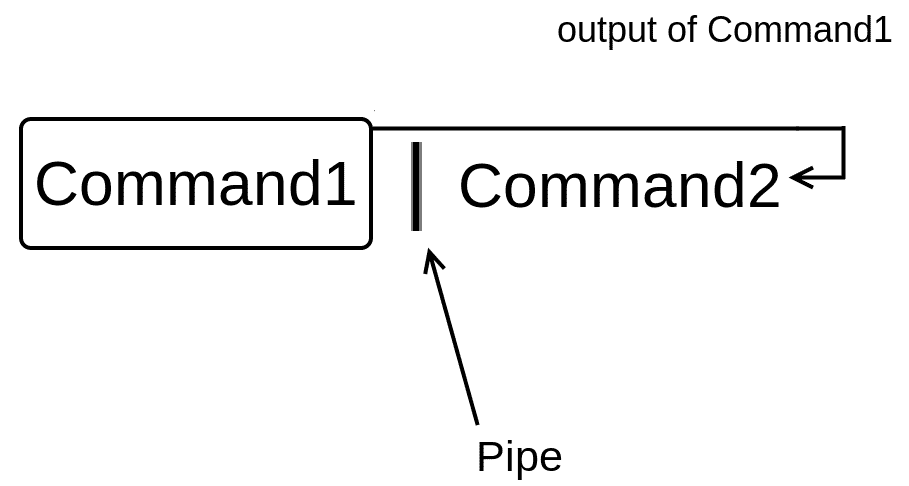
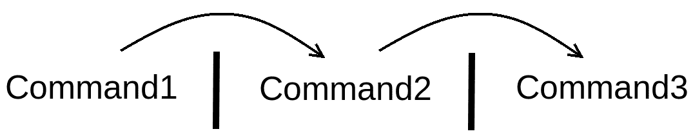

管道和 I/O 重定向

Linux 的一个主要原则是*每个程序都做一件事情*，因此，每个 Linux 命令都设计成能够高效地完成单个任务。在本章中，你将学习如何使用 Linux 管道来结合命令的功能，以执行更复杂的任务。你还将学习有关 I/O（输入/输出）重定向，这将使你能够读取用户输入并将命令输出保存到文件中。

# 第十章：Linux 管道

在 Linux 中，你可以使用管道将一个命令的输出发送到另一个命令的输入（参数）中：



图 1- Linux 管道

在你的键盘上，管道由竖线字符表示。Linux 管道非常有用，因为它们允许你以一种简单的方式完成相对复杂的任务，而且在整本书中，你会发现它们经常派上用场。

在我们做一个例子之前，让我们先将`hard.txt`文件重命名为`facts.txt`，因为我们在第六章中删除了`facts.txt`文件，*硬链接与软链接*：

```
elliot@ubuntu-linux:~$ mv hard.txt facts.txt
```

现在让我们使用`head`命令来查看`facts.txt`的前五行：

```
elliot@ubuntu-linux:~$ head -n 5 facts.txt 
Apples are red.
Grapes are green.
Bananas are yellow.
Cherries are red.
Sky is high.
```

现在我想显示文件`facts.txt`的第五行`Sky is high.`；我该怎么做呢？

这就是 Linux 管道的威力所在。如果你将前一个命令的输出传输到`tail -n 1`命令，你将得到第五行：

```
elliot@ubuntu-linux:~$ head -n 5 facts.txt | tail -n 1 
Sky is high.
```

因此，通过使用管道，我能够将`head -n 5 facts.txt`命令的输出发送到`tail -n 1`命令的输入（参数）中。

让我们做另一个例子。如果你想显示文件`facts.txt`的第七行，那么你将使用`head`命令显示前七行，然后使用管道`tail`最后一行：

```
elliot@ubuntu-linux:~$ head -n 7 facts.txt | tail -n 1 
Linux is awesome
```

你也可以同时使用多个管道，就像下面的图表中演示的那样：



图 2：两个管道

例如，你已经知道`lscpu`命令会显示处理器信息。`lscpu`命令的第四行输出显示了你的机器有多少个 CPU。你可以使用两个管道显示`lscpu`命令的第四行：

```
elliot@ubuntu-linux:~$ lscpu | head -n 4 | tail -n 1 
CPU(s):       1
```

所以让我们分解一下这里发生了什么。我们使用的第一个管道是显示`lscpu`命令的前四行：

```
elliot@ubuntu-linux:~$ lscpu | head -n 4 
Architecture:    x86_64
CPU op-mode(s):  32-bit, 64-bit 
Byte Order:      Little Endian
CPU(s):          1
```

然后我们使用第二个管道来`tail`最后一行，这样就得到了第四行：

```
elliot@ubuntu-linux:~$ lscpu | head -n 4 | tail -n 1 
CPU(s):        1
```

你可以类似地显示`lscpu`的第二行，其中显示了 CPU 的操作模式，但我会把这个留给你作为一个练习。

# 输入和输出重定向

在本节中，你将学习 Linux 最酷的功能之一，即 I/O（输入/输出）重定向。大多数 Linux 命令都使用三种不同的数据流：

+   标准输入（也称为`stdin`）

+   标准输出（也称为`stdout`）

+   标准错误（也称为`stderr`）

到目前为止，我们讨论的大多数命令都会产生一些输出。这些输出被发送到一个称为标准输出（也称为`stdout`）的特殊文件中。默认情况下，标准输出文件链接到终端，这就是为什么每次运行命令时，你都会在终端上看到输出。有时候命令会产生错误消息。这些错误消息被发送到另一个称为标准错误（也称为`stderr`）的特殊文件中，它也默认链接到终端。

# 重定向标准输出

你知道运行`date`命令会在你的终端上显示当前日期：

```
elliot@ubuntu-linux:~$ date 
Sat May 11 06:02:44 CST 2019
```

现在通过使用大于号`>`，你可以将`date`命令的输出重定向到文件而不是你的终端！看一下：

```
elliot@ubuntu-linux:~$ date > mydate.txt
```

如你所见，屏幕上没有显示任何输出！这是因为输出被重定向到文件`mydate.txt`：

```
elliot@ubuntu-linux:~$ cat mydate.txt 
Sat May 11 06:04:49 CST 2019
```

太棒了！让我们再试一些例子。你可以使用`echo`命令在你的终端上打印一行：

```
elliot@ubuntu-linux:~$ echo "Mars is a planet." 
Mars is a planet.
```

如果您想将输出重定向到一个名为`planets.txt`的文件，您可以运行以下命令：

```
elliot@ubuntu-linux:~$ echo "Mars is a planet." > planets.txt 
elliot@ubuntu-linux:~$ cat planets.txt
Mars is a planet
```

太棒了！请注意，文件`planets.txt`也在这个过程中创建了。现在让我们向文件`planets.txt`添加更多的行星：

```
elliot@ubuntu-linux:~$ echo "Saturn is a planet." > planets.txt 
elliot@ubuntu-linux:~$ cat planets.txt
Saturn is a planet.
```

嗯。我们添加了一行“土星是一个行星。”但现在删除了“火星是一个行星。”！这是因为用`>`重定向标准输出会覆盖文件。在这种情况下，我们需要的是向文件追加，这可以通过使用双大于号`>>`来实现。所以现在让我们向文件`planets.txt`追加一行“火星是一个行星。”：

```
elliot@ubuntu-linux:~$ echo "Mars is a planet." >> planets.txt 
elliot@ubuntu-linux:~$ cat planets.txt
Saturn is a planet.
Mars is a planet.
```

太棒了！正如你所看到的，它将“火星是一个行星。”添加到文件的末尾。让我们再添加一个行星：

```
elliot@ubuntu-linux:~$ echo "Venus is a planet." >> planets.txt 
elliot@ubuntu-linux:~$ cat planets.txt
Saturn is a planet.
Mars is a planet.
Venus is a planet.
```

太棒了！这里还有一件事情你需要知道，那就是标准输出（`stdout`）链接到文件描述符 1。

**文件描述符是什么？**

文件描述符是一个在计算机操作系统中唯一标识打开文件的数字。

然后运行命令：

```
elliot@ubuntu-linux:~$ date > mydate.txt
```

与运行命令相同：

```
elliot@ubuntu-linux:~$ date 1> mydate.txt
```

请注意，`1>`中的`1`是指文件描述符 1（`stdout`）。

# 重定向标准错误

如果您尝试显示一个不存在的文件的内容，您将收到一个错误消息：

```
elliot@ubuntu-linux:~$ cat blabla 
cat: blabla: No such file or directory
```

现在，这个错误消息来自标准错误（`stderr`）。如果您尝试以与标准输出相同的方式重定向错误，它将不起作用：

```
elliot@ubuntu-linux:~$ cat blabla > error.txt 
cat: blabla: No such file or directory
```

正如您所看到的，它仍然在您的终端上显示错误消息。这是因为`stderr`链接到文件描述符 2。因此，要重定向错误，您必须使用`2>`：

```
elliot@ubuntu-linux:~$ cat blabla 2> error.txt
```

现在如果您显示文件`error.txt`的内容，您将看到错误消息：

```
elliot@ubuntu-linux:~$ cat error.txt 
cat: blabla: No such file or directory
```

让我们尝试删除一个不存在的文件：

```
elliot@ubuntu-linux:~$ rm brrrr
rm: cannot remove 'brrrr': No such file or directory
```

这也会产生一个错误消息。我们可以将这个错误消息追加到文件中

使用`2>>`的`error.txt`：

```
elliot@ubuntu-linux:~$ rm brrrr 2>> error.txt
```

现在如果您显示文件`error.txt`的内容：

```
elliot@ubuntu-linux:~$ cat error.txt 
cat: blabla: No such file or directory
rm: cannot remove 'brrrr': No such file or directory
```

您将看到两个错误消息。

# 将所有输出重定向到同一个文件

有些情况下，您可能同时获得标准输出和错误消息。例如，如果您运行以下命令：

```
elliot@ubuntu-linux:~$ cat planets.txt blabla 
Saturn is a planet.
Mars is a planet.
Venus is a planet.
cat: blabla: No such file or directory
```

您会看到它显示了文件`planets.txt`的内容，但在最后一行也显示了一个错误消息（因为没有文件`blabla`来连接）。

您可以选择将错误重定向到另一个文件：

```
elliot@ubuntu-linux:~$ cat planets.txt blabla 2> err.txt 
Saturn is a planet.
Mars is a planet.
Venus is a planet.
```

这样，您只能在屏幕上看到标准输出。或者您可以选择重定向标准输出：

```
elliot@ubuntu-linux:~$ cat planets.txt blabla 1> output.txt 
cat: blabla: No such file or directory
```

这样，您只能在屏幕上看到错误。那么，如果您想将标准输出和错误重定向到同一个文件呢？在这种情况下，您必须运行：

```
elliot@ubuntu-linux:~$ cat planets.txt blabla > all.txt 2>&1
```

`&1`是指标准输出，而`2>`是指标准错误。所以我们基本上是在说：“将 stderr 重定向到我们正在重定向 stdout 的地方。”

现在如果您显示文件`all.txt`的内容：

```
elliot@ubuntu-linux:~$ cat all.txt 
Saturn is a planet.
Mars is a planet.
Venus is a planet.
cat: blabla: No such file or directory
```

您可以看到它包括`stdout`和`stderr`。

# 丢弃输出

有时候你不需要将输出重定向到任何地方；你只是想抛弃它并摆脱它。在这种情况下，你可以将输出重定向到`/dev/null`。这通常与错误消息一起使用。例如：

```
elliot@ubuntu-linux:~$ cat planets.txt blabla 2> /dev/null 
Saturn is a planet.
Mars is a planet.
Venus is a planet.
```

这将把错误消息重定向到`/dev/null`。您可以将`/dev/null`视为垃圾收集器。

# 重定向标准输入

一些 Linux 命令通过标准输入与用户输入交互（默认情况下是键盘）。例如，`read`命令从用户那里读取输入并将其存储在一个变量中。例如，您可以运行命令`read weather`：

```
elliot@ubuntu-linux:~$ read weather 
It is raining.
```

然后它将等待您输入一行文本。我输入了一行“下雨了。”，所以它将这行存储在`weather`变量中。您可以使用`echo`命令来显示变量的内容：

```
elliot@ubuntu-linux:~$ echo $weather 
It is raining.
```

请注意，您必须在变量名之前加上美元符号。`read`命令在 shell 脚本中特别有用，我们稍后会涉及到。现在请注意，我使用键盘写下了`It is raining.`这一行。然而，我可以使用小于号`<`将标准输入重定向到文件中，例如：

```
elliot@ubuntu-linux:~$ read message < mydate.txt
```

这将读取文件`mydate.txt`的内容并将其存储在`message`变量中：

```
elliot@ubuntu-linux:~$ echo $message 
Sat May 11 06:34:52 CST 2019
```

正如您所看到的，变量`message`现在具有与文件`my-date.txt`相同的内容。

# 知识检查

对于以下练习，打开您的终端并尝试解决以下任务：

1.  仅显示文件`facts.txt`的第 5 行。

1.  将`free`命令的输出保存到名为`system.txt`的文件中。

1.  将`lscpu`命令的输出追加到文件`system.txt`中。

1.  运行命令`rmdir /var`并将错误消息重定向到文件`error.txt`。
