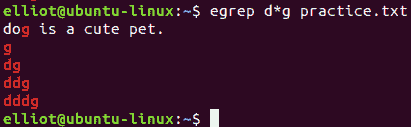

分析和操作文件

在本章中，你将学习各种 Linux 命令，这些命令将帮助你分析和操作文件。你还将学习如何比较两个文件并获取文件大小。你还将学习如何显示文件的类型，并显示文件中的字符数、单词数和行数。此外，你还将学习如何对文件进行排序、删除重复行等等！

# 第十一章：找出不同之处

你可以使用`diff`命令比较两个文件的内容，并突出它们之间的差异。

为了演示，让我们首先复制文件`facts.txt`并命名为`facts2.txt`：

```
elliot@ubuntu-linux:~$ cp facts.txt facts2.txt
```

现在让我们将行`"Brazil is a country."`附加到文件`facts2.txt`中：

```
elliot@ubuntu-linux:~$ echo "Brazil is a country." >> facts2.txt
```

现在，在两个文件上运行`diff`命令：

```
elliot@ubuntu-linux:~$ diff facts.txt facts2.txt 
12a13
> Brazil is a country.
```

酷！它输出了两个文件之间的差异，这种情况下是行`Brazil is a country.`。

# 查看文件大小

你可以使用`du`命令查看文件大小。**du**代表**磁盘使用**。如果你想查看文件中有多少字节，你可以使用`du`命令和`-b`选项：

```
elliot@ubuntu-linux:~$ du -b facts.txt
210 facts.txt
```

`facts.txt`文件有`210`字节。一个字符等于一个字节的大小，所以现在你知道`facts.txt`文件确切地有`210`个字符。

你还可以使用`-h`选项，它将以人类可读的格式打印文件大小。例如，要查看`dir1`目录及其内容的大小，你可以运行：

```
elliot@ubuntu-linux:~$ du -h dir1 
4.0K     dir1/cities
16K     dir1/directory2 
24K     dir1
```

# 计算字符、单词和行数

单词计数`wc`命令是另一个非常方便的命令。它计算文件中的行数、单词数和字符数。例如，要显示文件`facts.txt`中的行数，你可以使用`-l`选项：

```
elliot@ubuntu-linux:~$ wc -l facts.txt
12 facts.txt
```

文件`facts.txt`中总共有`12`行。要显示单词的数量，你可以使用`-w`选项：

```
elliot@ubuntu-linux:~$ wc -w facts.txt
37 facts.txt
```

所以文件`facts.txt`中总共有`37`个单词。要显示字符（字节）的数量，你可以使用`-c`选项：

```
elliot@ubuntu-linux:~$ wc -c facts.txt
210 facts.txt
```

文件`facts.txt`中总共有`210`个字符。没有任何选项，`wc`命令将以并列的方式显示行数、单词数和字符数：

```
elliot@ubuntu-linux:~$ wc facts.txt
12 37 210 facts.txt
```

# 查看文件类型

你可以使用`file`命令来确定文件的类型。例如，如果你想确定文件`/var`的类型，你可以运行：

```
elliot@ubuntu-linux:~$ file /var
/var: directory
```

正如你所期望的那样，输出显示`/var`是一个目录。如果你想显示`facts.txt`文件的类型，你可以运行：

```
elliot@ubuntu-linux:~$ file facts.txt 
facts.txt: ASCII text
```

输出显示`facts.txt`是一个 ASCII 文本文件。

**ASCII 是什么？**

**ASCII**，即**美国信息交换标准代码**，是用数字表示`128`个英文字符的代码，每个字母被分配一个从`0`到`127`的数字。

你的计算机不理解人类语言（字母），只理解数字！因此，英语语言中的每个字符都被转换为一个数字。你的计算机将任何文本文件都视为一堆堆的数字！

现在让我们创建一个名为`soft.txt`的软链接到`facts.txt`文件：

```
elliot@ubuntu-linux:~$ ln -s soft.txt facts.txt
```

并在`soft.txt`上运行`file`命令：

```
elliot@ubuntu-linux:~$ file soft.txt 
soft.txt: symbolic link to facts.txt
```

如你所见，它显示`soft.txt`是一个指向`facts.txt`的符号（软）链接。

# 文件排序

你可以使用`sort`命令对文本文件进行排序。例如，你可以通过运行命令按字母顺序查看`facts.txt`文件：

```
elliot@ubuntu-linux:~$ sort facts.txt 
Apples are red.
Bananas are yellow.
Cherries are red.
Cherries are red.
Cherries are red.
Cherries are red.
Earth is round.
Grapes are green.
Grass is green.
Linux is awesome!
Sky is high.
Swimming is a sport.
```

你还可以使用`-r`选项以相反的顺序进行排序：

```
elliot@ubuntu-linux:~$ sort -r facts.txt 
Swimming is a sport.
Sky is high.
Linux is awesome!
Grass is green.
Grapes are green.
Earth is round.
Cherries are red.
Cherries are red.
Cherries are red.
Cherries are red.
Bananas are yellow.
Apples are red.
```

你也可以使用`-n`选项按数字值而不是文字值进行排序。

# 显示唯一行

你可以使用`uniq`命令省略文件中重复的行。例如，注意文件`facts.txt`中的行`Cherries are red.`被包含了四次：

要查看`facts.txt`而不重复的行，你可以运行：

```
elliot@ubuntu-linux:~$ uniq facts.txt 
Apples are red.
Grapes are green.
Bananas are yellow.
Cherries are red.
Sky is high.
Earth is round.
Linux is awesome!
Cherries are red.
Grass is green.
Swimming is a sport.
```

注意`Cherries are red.`在输出中仍然显示了两次。这是因为`uniq`命令只省略了重复的行而不是重复的行！如果你想省略重复的行，你必须首先对文件进行`sort`，然后使用管道在排序输出上应用`uniq`命令：

```
elliot@ubuntu-linux:~$ sort facts.txt | uniq 
Apples are red.
Bananas are yellow.
Cherries are red.
Earth is round.
Grapes are green.
Grass is green.
Linux is awesome!
Sky is high.
Swimming is a sport.
```

哇！我们成功地省略了重复和重复的行。

# 搜索模式

`grep`命令是 Linux 中最受欢迎和有用的命令之一。您可以使用`grep`打印与特定模式匹配的文本行。例如，如果您只想显示`facts.txt`中包含单词`green`的行，则可以运行：

```
elliot@ubuntu-linux:~$ grep green facts.txt 
Grapes are green.
Grass is green.
```

如您所见，它只打印了包含单词`green`的两行。

`grep`命令在与管道一起使用时也可能非常有用。例如，要仅列出您的主目录中的`txt`文件，可以运行以下命令：

```
elliot@ubuntu-linux:~$ ls | grep txt 
all.txt
error.txt 
facts2.txt 
facts.txt 
Mars.txt 
mydate.txt 
output.txt 
planets.txt 
soft.txt
```

您可以使用`-i`选项使您的搜索不区分大小写。例如，如果您想要打印包含单词`Earth`的行在`facts.txt`中，然后使用以下命令：

```
elliot@ubuntu-linux:~$ grep earth facts.txt 
elliot@ubuntu-linux:~$
```

这将不显示任何结果，因为`grep`默认区分大小写。但是，如果您传递`-i`选项：

```
elliot@ubuntu-linux:~$ grep -i earth facts.txt 
Earth is round.
```

它将使搜索不区分大小写，因此它将显示行`Earth is round.`

# 流编辑器

您可以使用流编辑器命令`sed`来过滤和转换文本。例如，要在`facts.txt`中用单词`Cloud`替换单词`Sky`，可以运行以下命令：

```
elliot@ubuntu-linux:~$ sed 's/Sky/Cloud/' facts.txt 
Apples are red.
Grapes are green.
Bananas are yellow.
Cherries are red.
Cloud is high.
Earth is round.
Linux is awesome!
Cherries are red.
Cherries are red.
Cherries are red.
Grass is green.
Swimming is a sport.
```

如您在输出中所见，单词`Sky`被替换为`Cloud`。但是，文件`facts.txt`没有被编辑。要覆盖（编辑）文件，可以使用`-i`选项：

```
elliot@ubuntu-linux:~$ sed -i 's/Sky/Cloud/' facts.txt 
elliot@ubuntu-linux:~$ cat facts.txt
Apples are red.
Grapes are green.
Bananas are yellow.
Cherries are red.
Cloud is high.
Earth is round.
Linux is awesome!
Cherries are red.
Cherries are red.
Cherries are red.
Grass is green.
Swimming is a sport.
```

如您所见，更改已反映在文件中。

# 翻译字符

您可以使用`tr`命令来翻译字符。我这里不是在谈论将文本翻译成不同的语言；相反，我是在使用“翻译”一词的第二个含义，即从一种形式转换为另一种形式。

如果您阅读`tr`命令的`man`页面，您会在描述中看到：**从标准输入翻译、压缩和/或删除字符，写入标准输出**。因此，`tr`命令不接受任何参数。

`tr`命令的一个常见用途是将小写字母转换为大写字母（反之亦然）。例如，如果您想要以大写形式显示`facts.txt`中的所有单词，可以运行：

```
elliot@ubuntu-linux:~$ cat facts.txt | tr [:lower:] [:upper:] 
APPLES ARE RED.
GRAPES ARE GREEN.
BANANAS ARE YELLOW.
CHERRIES ARE RED.
CLOUD IS HIGH.
EARTH IS ROUND.
LINUX IS AWESOME!
CHERRIES ARE RED.
CHERRIES ARE RED.
CHERRIES ARE RED.
GRASS IS GREEN.
SWIMMING IS A SPORT.
```

您还可以显示所有单词的小写形式：

```
elliot@ubuntu-linux:~$ cat facts.txt | tr [:upper:] [:lower:] 
apples are red.
grapes are green. 
bananas are yellow. 
cherries are red. 
cloud is high. 
earth is round. 
linux is awesome! 
cherries are red. 
cherries are red. 
cherries are red. 
grass is green. 
swimming is a sport.
```

你也可以使用`-d`选项来删除字符。例如，要删除`facts.txt`中的所有空格，可以运行：

```
elliot@ubuntu-linux:~$ cat facts.txt | tr -d ' ' 
Applesarered.
Grapesaregreen.
Bananasareyellow.
Cherriesarered.
Cloudishigh.
Earthisround.
Linuxisawesome!
Cherriesarered.
Cherriesarered.
Cherriesarered.
Grassisgreen.
Swimmingisasport.
```

**一个很酷的提示**

`tr`命令不会更改（编辑）文件的内容。它只会将更改写入标准输出。但是，您可以使用输出重定向将输出存储到另一个文件中。

例如，运行以下命令：

```
elliot@ubuntu-linux:~$ cat facts.txt | tr [:lower:] [:upper:] > upper.txt
```

将命令的输出存储到：

```
cat facts.txt | tr [:lower:] [:upper:]
```

文件`upper.txt`中。

# 切割文本

如果您只想查看文件的一部分（或一节），那么`cut`命令可能非常有用。例如，您可以看到`facts.txt`文件中的每行都由单个空格分隔的多个单词组成。如果您只想查看每行的第一个单词（第一列/字段），那么可以运行以下命令：

```
elliot@ubuntu-linux:~$ cut -d ' ' -f1 facts.txt 
Apples
Grapes 
Bananas 
Cherries 
Cloud 
Earth 
Linux 
Cherries 
Cherries 
Cherries 
Grass 
Swimming
```

`-d`选项是分隔符，必须是单个字符。在这种情况下，我选择了空格字符`' '`作为分隔符。我还使用了`-f1`选项来仅查看第一个字段（列）。

如果您想查看每行的第三个单词（第三个字段），则可以使用`-f3`而不是`-f1`，如下所示：

```
elliot@ubuntu-linux:~$ cut -d ' ' -f3 facts.txt 
red.
green. 
yellow. 
red. 
high. 
round. 
awesome! 
red. 
red. 
red. 
green. 
a
```

您还可以一次选择多个字段。例如，要查看每行的第一个和第三个单词，可以使用`-f1,3`：

```
elliot@ubuntu-linux:~$ cut -d ' ' -f1,3 facts.txt 
Apples red.
Grapes green.
Bananas yellow.
Cherries red.
Cloud high.
Earth round.
Linux awesome!
Cherries red.
Cherries red.
Cherries red.
Grass green.
Swimming a 
```

# 使用 awk 进行文本处理

`awk`是一个非常强大的工具，您可以在 Linux 中用来分析和处理文本。实际上，`awk`不像您迄今为止学到的任何命令，这是因为`awk`实际上是一种编程语言。您会发现有些书专门写来解释和讨论`awk`的用法。但是，我只会在这里向您展示`awk`的基础知识，您可以自己深入研究。

您可以使用`awk`来实现与`cut`命令相同的功能。例如，要查看文件`facts.txt`中每行的第一个单词，可以运行：

```
elliot@ubuntu-linux:~$ awk '{print $1}' facts.txt 
Apples
Grapes 
Bananas 
Cherries 
Cloud 
Earth 
Linux 
Cherries 
Cherries 
Cherries 
Grass 
Swimming
```

请注意，我们不需要指定空格字符`' '`作为分隔符，就像我们在`cut`命令中所做的那样，这是因为`awk`足够聪明，可以自己弄清楚。您还可以一次查看多个字段；例如，要查看每行的第一个和第二个单词，您可以运行：

```
elliot@ubuntu-linux:~$ awk '{print $1,$2}' facts.txt 
Apples are
Grapes are 
Bananas are 
Cherries are 
Cloud is 
Earth is 
Linux is 
Cherries are 
Cherries are 
Cherries are 
Grass is 
Swimming is
```

`awk`比`cut`有一个优势，那就是`awk`足够聪明，即使每个字段之间有多个字符分隔，也能将文件分隔成不同的字段。`cut`命令只有在文件有单个分隔符时才有效，比如单个空格、冒号、逗号等。

为了演示，创建一个名为`animals.txt`的文件，并插入以下四行：

```
fox        is smart
whale is   big
cheetah  is           fast 
penguin     is cute
```

不要编辑格式；保持空格混乱：

```
elliot@ubuntu-linux:~$ cat animals.txt 
fox        is smart
whale is   big
cheetah  is           fast 
penguin     is cute
```

现在，如果您尝试使用`cut`命令仅显示每行中的第三个单词，它将失败，因为每个单词之间有多个空格分隔。

然而，`awk`足够聪明，可以弄清楚：

```
elliot@ubuntu-linux:~$ awk '{print $3}' animals.txt 
smart
big 
fast 
cute
```

正如您所看到的，每行中的第三个单词被显示出来。您也可以使用`awk`来搜索模式，就像`grep`命令一样。例如，要打印包含`facts.txt`中单词`red`的行，您可以运行以下命令：

```
elliot@ubuntu-linux:~$ awk '/red/{print}' facts.txt 
Apples are red.
Cherries are red. 
Cherries are red. 
Cherries are red. 
Cherries are red. 
```

# 通配符字符

通配符字符是 Linux 中的特殊字符，它们用于指定一组（类）字符。`表 13`列出了所有 Linux 通配符：

| **通配符** | **它的作用** |
| --- | --- |
| `*` | 匹配任何字符。 |
| `?` | 匹配任何单个字符。 |
| `[characters]` | 匹配属于字符集的字符。例如，`[abc]`将匹配字符`a`、`b`或`c`。 |
| `[!characters]` | 匹配不属于字符集的任何字符。基本上是`[characters]`的否定。例如，`[!abc]`将匹配任何不是`a`、`b`或`c`的字符。 |
| `[[:class:]]` | 匹配属于字符类的任何字符。 |

表 13：Linux 通配符

在我们讨论`tr`命令时，您已经看到了字符类。记住`[:lower:]`和`[:upper:]`代表小写和大写字母，这是字符类的两个示例。`表 14`列出了最常见的字符类：

| 字符类 | 它代表什么 |
| --- | --- |
| `[:alnum:]` | 代表所有的字母数字，即任何字母或数字。 |
| `[:alpha:]` | 代表所有的字母，即任何字母。 |
| `[:digit:]` | 代表所有的数字，即任何数字。 |
| `[:lower:]` | 代表任何小写字母。 |
| `[:upper:]` | 代表任何大写字母。 |

表 14：字符类

好了，够了这些理论！让我们看一些例子。您可以使用`*`通配符来列出您的主目录中的所有`txt`文件：

```
elliot@ubuntu-linux:~$ ls -l *.txt
-rw-rw-r-- 1 elliot elliot  96 May 11 07:01 all.txt
-rw-rw-r-- 1 elliot elliot  91 May 12 06:10 animals.txt
-rw-rw-r-- 1 elliot elliot  92 May 11 06:48 error.txt
-rw-rw-r-- 1 elliot elliot 231 May 11 08:28 facts2.txt
-rw-rw-r-- 1 elliot elliot 212 May 11 18:37 facts.txt
-rw-rw-r-- 1 elliot elliot  18 May 11 06:12 Mars.txt
-rw-rw-r-- 1 elliot elliot  29 May 11 06:34 mydate.txt
-rw-rw-r-- 1 elliot elliot  57 May 11 07:00 output.txt
-rw-rw-r-- 1 elliot elliot  57 May 11 06:20 planets.txt
lrwxrwxrwx 1 elliot elliot  9  May  8 22:02 soft.txt -> facts.txt
-rw-rw-r-- 1 elliot elliot 212 May 12 05:09 upper.txt
```

如果您只想列出以字母`f`开头的文件名，您可以使用`f*`：

```
elliot@ubuntu-linux:~$ ls -l f*
-rw-rw-r-- 1 elliot elliot 231 May 11 08:28 facts2.txt
-rw-rw-r-- 1 elliot elliot 212 May 11 18:37 facts.txt
```

如果您想列出包含三个字母后跟`.txt`扩展名的文件名，那么您可以使用`?`通配符：

```
elliot@ubuntu-linux:~$ ls -l ???.txt
-rw-rw-r-- 1 elliot elliot 96 May 11 07:01 all.txt
```

您还可以同时使用多个通配符。例如，如果您只想列出以字母`a`或`f`开头的文件名，您可以使用`[af]`通配符，后跟`*`通配符：

```
elliot@ubuntu-linux:~$ ls -l [af]*
-rw-rw-r-- 1 elliot elliot 96 May 11 07:01 all.txt
-rw-rw-r-- 1 elliot elliot 91 May 12 06:10 animals.txt
-rw-rw-r-- 1 elliot elliot 231 May 11 08:28 facts2.txt
-rw-rw-r-- 1 elliot elliot 212 May 11 18:37 facts.txt
```

您还可以使用集合否定，例如，要列出所有以除`f`之外的任何字母开头的`.txt`文件名，您可以运行`[!f]*`：

```
elliot@ubuntu-linux:~$ ls -l [!f]*.txt
-rw-rw-r-- 1 elliot elliot 96 May 11 07:01 all.txt
-rw-rw-r-- 1 elliot elliot 91 May 12 06:10 animals.txt
-rw-rw-r-- 1 elliot elliot 92 May 11 06:48 error.txt
-rw-rw-r-- 1 elliot elliot 18 May 11 06:12 Mars.txt
-rw-rw-r-- 1 elliot elliot 29 May 11 06:34 mydate.txt
-rw-rw-r-- 1 elliot elliot 57 May 11 07:00 output.txt
-rw-rw-r-- 1 elliot elliot 57 May 11 06:20 planets.txt
lrwxrwxrwx 1 elliot elliot 9 May 8 22:02 soft.txt -> facts.txt
-rw-rw-r-- 1 elliot elliot 212 May 12 05:09 upper.txt
```

现在，在我们做一些字符类的示例之前，让我们创建以下四个文件：

```
elliot@ubuntu-linux:~$ touch One TWO 7wonders GTA1
```

现在，如果您想列出以大写字母结尾的文件名，您可以使用字符类`[:upper:]`如下：

```
elliot@ubuntu-linux:~$ ls -l *[[:upper:]]
-rw-rw-r-- 1 elliot elliot 0 May 12 18:14 TWO
```

请注意，字符类本身也被括号括起来。

如果您想列出以数字（数字）开头的文件名，您可以使用字符类`[:digit:]`如下：

```
elliot@ubuntu-linux:~$ ls -l [[:digit:]]*
-rw-rw-r-- 1 elliot elliot 0 May 12 18:14 7wonders
```

唯一匹配的是文件`7wonders`。

# 正则表达式

到目前为止，我们一直在使用文件名的通配符。**正则表达式**（简称 **Regex**）是 Linux 的另一个功能，它允许您在文本文件中搜索特定的模式。正则表达式也经常与 `grep` 命令一起使用。

`表 15` 列出了最常见的正则表达式及其用途：

| **正则表达式** | **它的作用** |
| --- | --- |
| `*` | 匹配前面字符或表达式的零个或多个。 |
| `+` | 匹配前面字符或表达式的一个或多个。 |
| `.` | 匹配任何单个字符。与 `?` 通配符相同。 |
| `^` | 匹配行首的后面表达式。例如，`^dog` 将匹配所有以单词 `dog` 开头的行。 |
| `$` | 匹配行尾的前面表达式。例如，`bird$` 将匹配所有以单词 `bird` 结尾的行。 |
| `\` | 用作转义字符，以匹配反斜杠后面的特殊字符。例如，`\*` 匹配星号（*）。 |
| `[characters]` | 匹配属于字符集字符的字符。例如，`[abc]` 将匹配字符 `a`，`b` 或 `c`。 |
| `[^characters]` | 匹配不属于字符集字符的任何字符。基本上是对 `[characters]` 的否定。例如，`[!abc]` 将匹配不是 `a`，`b` 或 `c` 的任何字符。 |
| `{x,y}` | 匹配前面表达式的 x 到 y 次出现。 |
| `{x}` | 匹配前面表达式的 x 次出现。 |
| `{x,}` | 匹配前面表达式的 x 次或更多出现。 |
| `{,x}` | 匹配前面表达式的最多 x 次出现。 |

表 15：正则表达式

嗯，这是一个很长的正则表达式列表。让我们练习一下。创建一个名为 `practice.txt` 的文件，其中包含以下文本：

```
111222333
my cell number is 123-456-789\. 
you are a smart man
man is a linux command. 
man ... oh man.
dog is a cute pet. 
g
dg 
ddg 
dddg
Two stars ** 
tan
tantan 
tantantan
```

要在 `grep` 命令中使用正则表达式，可以使用 `-E` 选项或 `egrep` 命令。`egrep` 命令只是 `grep -E` 的别名。

现在，请注意 `***` 正则表达式与 `***` 通配符是不同的。要了解区别，请运行以下命令：

```
elliot@ubuntu-linux:~$ egrep d*g practice.txt
```

这将给出以下输出：



图 1：* 正则表达式

注意，`d*g` 没有匹配单词 `dog`；相反，它匹配了：

+   `g`（d 的零次出现）

+   `dg`（d 的一次出现）

+   `ddg`（d 的两次出现）

+   `dddg`（d 的三次出现）

这是因为 `** *regex` 匹配前面字符或表达式的零个或多个，而 `*** 通配符` 匹配任何字符。

现在，要匹配一个或多个出现的 `d` 后跟 `g`，可以使用正则表达式 `d+g`：

```
elliot@ubuntu-linux:~$ egrep d+g practice.txt 
dg
ddg 
dddg
```

要匹配特殊字符 `*`，可以在单引号或双引号之间使用反斜杠，如下所示：

```
elliot@ubuntu-linux:~$ egrep "\*" practice.txt 
Two stars **
```

要匹配包含字母 `m` 后跟任何单个字符，然后是字母 `n` 的任何模式，可以运行：

```
elliot@ubuntu-linux:~$ egrep m.n practice.txt 
you are a smart man
man is a linux command. 
man ... oh man.
```

要匹配以单词 `man` 开头的行，可以运行：

```
elliot@ubuntu-linux:~$ egrep ^man practice.txt 
man is a linux command.
man ... oh man.
```

要匹配以单词 `man` 结尾的行，可以运行：

```
elliot@ubuntu-linux:~$ egrep man$ practice.txt 
you are a smart man
```

您也可以使用字符类。例如，要搜索包含至少一个数字的所有行，可以运行：

```
elliot@ubuntu-linux:~$ egrep "[[:digit:]]{1,}" practice.txt 
111222333
my cell number is 123-456-789.
```

您还可以搜索特定模式，如电话号码：

```
elliot@ubuntu-linux:~$ egrep "[[:digit:]]{3}-[[:digit:]]{3}-[[:digit:]]{3}" 
practice.txt
my cell number is 123-456-789.
```

这将搜索包含三个数字后跟一个破折号，然后是另外三个数字后跟另一个破折号，然后是另外三个数字的行。

我知道你认为 `regex` 很复杂，很难记住所有这些，你是对的！这就是为什么有一个包含我们讨论的所有正则表达式的 `man` 页面：

```
elliot@ubuntu-linux:~$ man regex
```

此外，`grep` man 页面包括对本章讨论的所有正则表达式的解释。

# 知识检查

对于以下练习，打开您的终端并尝试解决以下任务：

1.  显示文件 `/etc/hostname` 的大小（以字节为单位）。

1.  仅显示文件 `/etc/group` 中的组名。

1.  显示文件 `/etc/services` 中的总行数。

1.  仅显示文件 `/etc/passwd` 中包含单词 "bash" 的行。

1.  显示`uptime`命令的输出为全大写字母。
