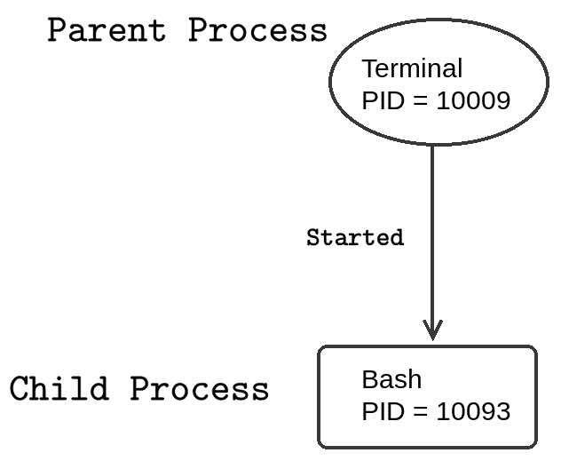
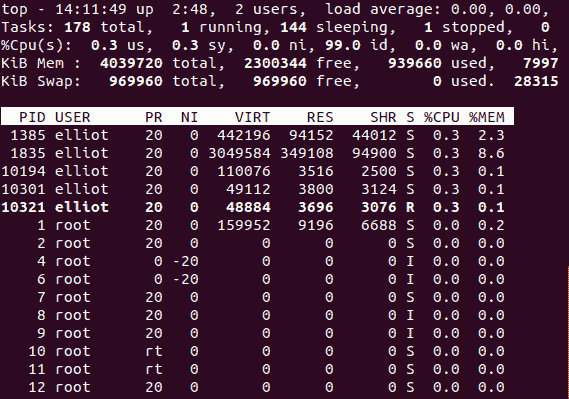
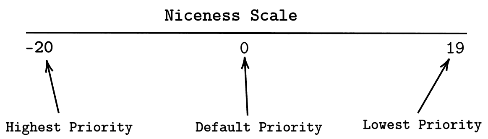
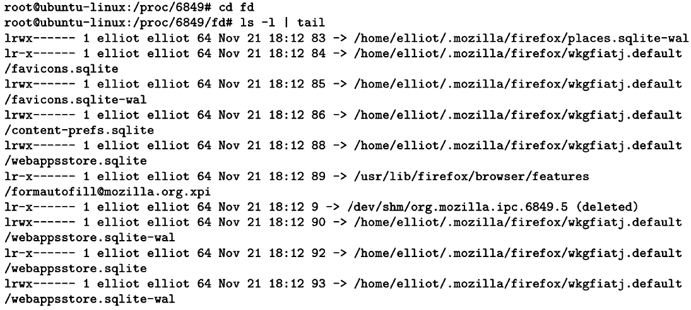
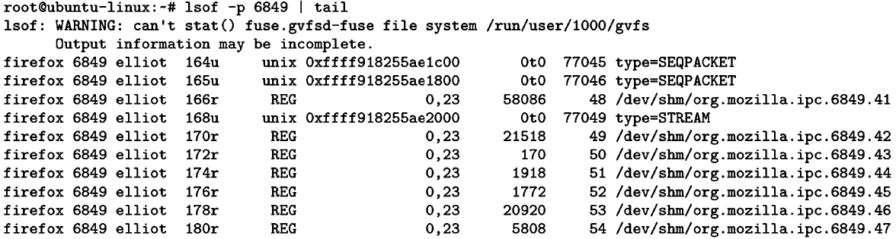

杀死进程

在您的系统上运行的任何程序都是一个进程。在本章中，您将学习有关 Linux 进程的所有内容。您将学习如何查看进程信息。您还将学习如何向进程发送不同的信号。此外，您将了解前台和后台进程之间的区别。

# 第十四章：什么是进程？

进程只是运行程序的一个实例。因此，您系统上运行的任何程序都是一个进程。以下都是进程的例子：

+   在您的系统上运行的 Firefox 或任何网络浏览器都是一个进程。

+   您正在运行的终端现在就是一个进程。

+   您在系统上玩的任何游戏都是一个进程。

+   复制文件是一个进程。

就像文件一样，每个进程都由特定用户拥有。进程的所有者只是启动该进程的用户。

要列出所有由特定用户拥有的进程，您可以运行命令`ps -u`后跟用户名：

```
ps -u username
```

例如，要列出所有由`elliot`拥有的进程，您可以运行：

```
root@ubuntu-linux:~# ps -u elliot
 PID TTY       TIME CMD
1365 ?     00:00:00 systemd
1366 ?     00:00:00 (sd-pam)
1379 ?     00:00:00 gnome-keyring-d
1383 tty2  00:00:00 gdm-x-session
1385 tty2  00:00:18 Xorg
1389 ?     00:00:00 dbus-daemon
1393 tty2  00:00:00 gnome-session-b
1725 ?     00:00:00 ssh-agent
1797 ?     00:00:00 gvfsd
. 
. 
. 
.
```

输出中的第一列列出了**进程标识符**（**PIDs**）。PID 是一个唯一标识进程的数字，就像文件`inodes`一样。输出的最后一列列出了进程名称。

您可以使用`ps -e`命令列出系统上正在运行的所有进程：

```
root@ubuntu-linux:~# ps -e 
PID TTY     TIME  CMD
1  ?     00:00:01 systemd
2  ?     00:00:00 kthreadd
4  ?     00:00:00 kworker/0:0H
6  ?     00:00:00 mm_percpu_wq
7  ?     00:00:00 ksoftirqd/0
8  ?     00:00:00 rcu_sched
9  ?     00:00:00 rcu_bh
10 ?     00:00:00 migration/0
11 ?     00:00:00 watchdog/0
12 ?     00:00:00 cpuhp/0
13 ?     00:00:00 kdevtmpfs
.
.
.
.
```

您还可以使用`-f`选项来获取更多信息：

```
root@ubuntu-linux:~# ps -ef
UID    PID  PPID C STIME TTY    TIME    CMD
root      1    0 0 11:23    ? 00:00:01 /sbin/init splash
root      2    0 0 11:23    ? 00:00:00 [kthreadd]
root      4    2 0 11:23    ? 00:00:00 [kworker/0:0H]
root      6    2 0 11:23    ? 00:00:00 [mm_percpu_wq]
root      7    2 0 11:23    ? 00:00:00 [ksoftirqd/0]
root      8    2 0 11:23    ? 00:00:01 [rcu_sched]
root      9    2 0 11:23    ? 00:00:00 [rcu_bh]
root     10    2 0 11:23    ? 00:00:00 [migration/0]
elliot 1835 1393 1 11:25 tty2 00:00:58 /usr/bin/gnome-shell
elliot 1853 1835 0 11:25 tty2 00:00:00 ibus-daemon --xim --panel disable
elliot 1857 1365 0 11:25    ? 00:00:00 /usr/lib/gnome-shell/gnome-shell
elliot 1865 1853 0 11:25 tty2 00:00:00 /usr/lib/ibus/ibus-dconf
elliot 1868    1 0 11:25 tty2 00:00:00 /usr/lib/ibus/ibus-x11 --kill-daemon
elliot 1871 1365 0 11:25    ? 00:00:00 /usr/lib/ibus/ibus-portal
. 
. 
. 
```

输出的第一列列出了进程所有者的用户名。输出的第三列列出了**父进程标识符**（**PPID**）。那么，父进程是什么？

# 父进程与子进程

父进程是启动了一个或多个子进程的进程。一个完美的例子将是您的终端和您的 bash shell；当您打开终端时，您的 bash shell 也会启动。

要获取进程的 PID，您可以使用`pgrep`命令后跟进程名称：

```
pgrep process_name
```

例如，要获取您的终端进程的 PID，您可以运行：

```
elliot@ubuntu-linux:~$ pgrep terminal 
10009
```

我的终端的 PID 是`10009`。现在，让我们获取 bash 进程的 PID：

```
elliot@ubuntu-linux:~$ pgrep bash 
10093
```

我的 bash shell 的 PID 是`10093`。现在，您可以使用`-p`选项后跟 bash PID 来获取您的 bash 进程的信息：

```
elliot@ubuntu-linux:~$ ps -fp 10093
UID     PID   PPID  C  STIME  TTY   TIME   CMD
elliot 10093 10009  0  13:37 pts/1 00:00:00 bash
```

您可以从输出中看到，我的 bash 进程的 PPID 等于我的终端进程的 PID。这证明了终端进程已启动了 bash 进程。在这种情况下，bash 进程被称为终端进程的子进程：



图 1：父进程与子进程

`top`命令是一个非常有用的命令，您可以使用它实时查看进程的信息。您可以查看其`man`页面以了解如何使用它：

```
elliot@ubuntu-linux:~$ man top 
```

上述命令的输出如下截图所示：



图 2：top 命令

# 前台与后台进程

Linux 中有两种类型的进程：

+   前台进程

+   后台进程

前台进程是附加到您的终端的进程。您必须等待前台进程完成，然后才能继续使用您的终端。

另一方面，后台进程是不附加到您的终端的进程，因此您可以在后台进程运行时使用您的终端。

`yes`命令会重复输出跟在其后的任何字符串，直到被杀死：

```
elliot@ubuntu-linux:~$ whatis yes
yes (1)               - output a string repeatedly until killed
```

例如，要在您的终端上重复输出单词`hello`，您可以运行命令：

```
elliot@ubuntu-linux:~$ yes hello 
hello
hello 
hello 
hello 
hello 
hello 
hello 
hello 
hello 
hello
.
.
.
```

请注意，它将继续运行，您无法在终端上执行其他操作；这是前台进程的一个典型例子。要收回您的终端，您需要杀死该进程。您可以通过按以下*Ctrl* + *C*键组合来杀死该进程：

```
hello 
hello 
hello 
hello 
hello
^C
elliot@ubuntu-linux:~$

```

一旦你按下*Ctrl* + *C*，进程将被终止，你可以继续使用你的终端。让我们做另一个例子；你可以使用`firefox`命令从你的终端启动 Firefox：

```
elliot@ubuntu-linux:~$ firefox
```

Firefox 浏览器将启动，但你将无法在终端上做任何事情直到关闭 Firefox；这是另一个前台进程的例子。现在，按下*Ctrl* + *C*来终止 Firefox 进程，这样你就可以重新使用你的终端了。

你可以通过添加&字符来将 Firefox 作为后台进程启动，如下所示：

```
elliot@ubuntu-linux:~$ firefox &
[1] 3468
elliot@ubuntu-linux:~$
```

Firefox 现在作为后台进程运行，你可以继续使用你的终端而不必关闭 Firefox。

# 向进程发送信号

你可以通过信号与进程进行交互和通信。有各种信号，每个信号都有不同的目的。要列出所有可用的信号，你可以运行`kill -L`命令：

```
elliot@ubuntu-linux:~$ kill -L
1) SIGHUP 2) SIGINT 3) SIGQUIT 4) SIGILL 5) SIGTRAP
6) SIGABRT 7) SIGBUS 8) SIGFPE 9) SIGKILL 10) SIGUSR1
11) SIGSEGV 12) SIGUSR2 13) SIGPIPE 14) SIGALRM 15) SIGTERM
16) SIGSTKFLT 17) SIGCHLD 18) SIGCONT 19) SIGSTOP 20) SIGTSTP
21) SIGTTIN 22) SIGTTOU 23) SIGURG 24) SIGXCPU 25) SIGXFSZ
26) SIGVTALRM 27) SIGPROF 28) SIGWINCH 29) SIGIO 30) SIGPWR
31) SIGSYS 34) SIGRTMIN 35) SIGRTMIN+1 36) SIGRTMIN+2 37) SIGRTMIN+3
38) SIGRTMIN+4 39) SIGRTMIN+5 40) SIGRTMIN+6 41) SIGRTMIN+7 42) SIGRTMIN+8
43) SIGRTMIN+9 44) SIGRTMIN+10 45) SIGRTMIN+11 46) SIGRTMIN+12 47) SIGRTMIN+13
48) SIGRTMIN+14 49) SIGRTMIN+15 50) SIGRTMAX-14 51) SIGRTMAX-13 52) SIGRTMAX-12
53) SIGRTMAX-11 54) SIGRTMAX-10 55) SIGRTMAX-9 56) SIGRTMAX-8 57) SIGRTMAX-7
58) SIGRTMAX-6 59) SIGRTMAX-5 60) SIGRTMAX-4 61) SIGRTMAX-3 62) SIGRTMAX-2
63) SIGRTMAX-1 64) SIGRTMAX
```

注意到每个信号都有一个数字值。例如，`19`是`SIGSTOP`信号的数字值。

为了了解信号的工作原理，让我们首先将 Firefox 作为后台进程启动：

```
elliot@ubuntu-linux:~$ firefox &
[1] 4218
```

注意到 Firefox 在我的系统上的 PID 是`4218`。我可以通过发送`SIGKILL`信号来终止 Firefox，如下所示：

```
elliot@ubuntu-linux:~$ kill -SIGKILL 4218
[1]+ Killed             firefox
```

这将立即关闭 Firefox。你也可以使用`SIGKILL`信号的数字值：

```
elliot@ubuntu-linux:~$ kill -9 4218
```

一般来说，`kill`命令的语法如下：

```
kill -SIGNAL PID
```

让我们再次将 Firefox 作为后台进程启动：

```
elliot@ubuntu-linux:~$ firefox & 
[1] 4907
```

注意到 Firefox 在我的系统上的 PID 是`4907`。现在继续在 Firefox 上播放 YouTube 视频。在你这样做之后，回到你的终端并向 Firefox 发送`SIGSTOP`信号：

```
elliot@ubuntu-linux:~$ kill -SIGSTOP 4907
```

你会注意到 Firefox 变得无响应，你的 YouTube 视频停止了；没问题 - 我们可以通过向 Firefox 发送`SIGCONT`信号来解决这个问题：

```
elliot@ubuntu-linux:~$ kill -SIGCONT 4907
```

这将使 Firefox 恢复，并且你的 YouTube 视频现在会继续播放。

到目前为止，你已经学会了三种信号：

+   `SIGKILL`：终止一个进程

+   `SIGSTOP`：停止一个进程

+   `SIGCONT`：继续一个进程

你可以使用`pkill`命令使用进程名称而不是进程标识符。例如，要关闭你的终端进程，你可以运行以下命令：

```
elliot@ubuntu-linux:~$ pkill -9 terminal
```

现在让我们做一些有趣的事情；打开你的终端并运行以下命令：

```
elliot@ubuntu-linux:~$ pkill -SIGSTOP terminal
```

哈哈！你的终端现在被冻结了。我会让你处理这个！

你可以向进程发送许多其他信号；查看以下`man`页面以了解每个信号的用途：

```
elliot@ubuntu-linux:~$ man signal
```

# 处理进程优先级

每个进程都有一个由友好度量表确定的优先级，范围从**-20**到**19**。友好值越低，进程的优先级越高，所以友好值为**-20**给予进程最高的优先级。另一方面，友好值为**19**给予进程最低的优先级：



图 3：友好度量表

你可能会问自己：*我们为什么关心进程的优先级？*答案是效率！你的 CPU 就像一个繁忙餐厅里的服务员。一个高效的服务员会一直忙碌，确保所有顾客都得到满意的服务。同样，你的 CPU 分配时间给系统上运行的所有进程。优先级高的进程会得到 CPU 的更多关注。另一方面，优先级低的进程不会得到 CPU 的太多关注。

## 查看进程优先级

将 Firefox 作为后台进程启动：

```
elliot@ubuntu-linux:~$ firefox &
 [1] 6849
```

你可以使用`ps`命令查看进程的友好值：

```
elliot@ubuntu-linux:~$ ps -o nice -p 6849
NI
0
```

我的 Firefox 进程有一个友好值为**0**，这是默认值（平均优先级）。

## 为新进程设置优先级

你可以使用`nice`命令以你期望的优先级启动一个进程。`nice`命令的一般语法如下：

```
nice -n -20 →19 process
```

假设你要升级系统上的所有软件包；给这样一个进程尽可能高的优先级是明智的。为此，你可以以`root`用户身份运行以下命令：

```
root@ubuntu-linux:~# nice -n -20 apt-get upgrade
```

## 改变一个进程的优先级

您可以使用`renice`命令更改正在运行的进程的优先级。我们已经看到 Firefox 正在以默认进程优先级零运行；让我们更改 Firefox 的优先级，并将其设置为可能的最低优先级：

```
root@ubuntu-linux:~# renice -n 19 -p 6849
6849 (process ID) old priority 0, new priority 19
```

太棒了！现在我希望 Firefox 对我来说不会很慢；毕竟，我刚刚告诉我的 CPU 不要太关注 Firefox！

# /proc 目录

Linux 中的每个进程都由`/proc`中的一个目录表示。例如，如果您的 Firefox 进程的 PID 为`6849`，那么目录`/proc/6849`将表示 Firefox 进程：

```
root@ubuntu-linux:~# pgrep firefox
6849
root@ubuntu-linux:~# cd /proc/6849
root@ubuntu-linux:/proc/6849#
```

在进程的目录中，您可以找到关于进程的许多有价值和富有洞察力的信息。例如，您将找到一个名为`exe`的软链接，指向进程的可执行文件：

```
root@ubuntu-linux:/proc/6849# ls -l exe
lrwxrwxrwx 1 elliot elliot 0 Nov 21 18:02 exe -> /usr/lib/firefox/firefox
```

您还会找到`status`文件，其中存储了有关进程的各种信息；这些信息包括进程状态、PPID、进程使用的内存量等等：

```
root@ubuntu-linux:/proc/6849# head status 
Name: firefox
Umask: 0022
State: S (sleeping) Tgid: 6849
Ngid: 0
Pid: 6849
PPid: 1990
TracerPid: 0
Uid: 1000 1000 1000 1000
Gid: 1000 1000 1000 1000
```

`limits`文件显示了为进程设置的当前限制：

```
root@ubuntu-linux:/proc/7882# cat limits
Limit                  Soft Limit   Hard Limit   Units
Max cpu time           unlimited    unlimited    seconds
Max file size          unlimited    unlimited    bytes
Max data size          unlimited    unlimited    bytes
Max stack size         8388608      unlimited    bytes
Max core file size     0            unlimited    bytes
Max resident set       unlimited    unlimited    bytes
Max processes          15599        15599        processes
Max open files         4096         4096         files
Max locked memory      16777216     16777216     bytes
Max address space      unlimited    unlimited    bytes
Max file locks         unlimited    unlimited    locks
Max pending signals    15599        15599        signals
Max msgqueue size      819200       819200       bytes
Max nice priority      0            0 
Max realtime priority  0            0 
Max realtime timeout   unlimited    unlimited    us
```

`fd`目录将显示进程当前在系统上正在使用的所有文件：



图 4：fd 目录

您还可以使用`lsof`命令列出进程当前正在使用的所有文件：



图 5：lsof 命令

# 知识检查

对于以下练习，打开您的终端并尝试解决以下任务：

1.  列出您正在运行的终端的进程 ID。

1.  列出您正在运行的终端的父进程 ID。

1.  使用`kill`命令关闭您的终端。

1.  将 Firefox 作为后台进程启动。

1.  将 Firefox 的优先级更改为最高优先级。
