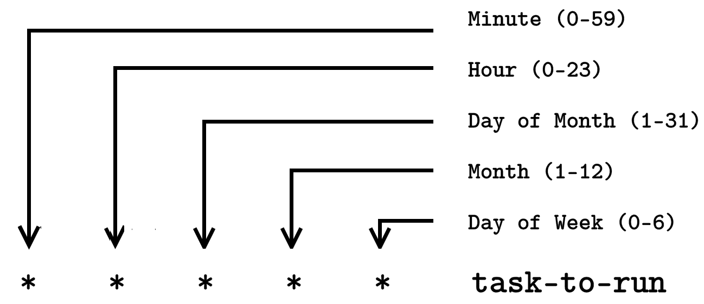

您需要一个 Cron 作业

在本章中，您将学习如何通过使用 cron 作业自动化 Linux 中的乏味任务，这是 Linux 中最有用和强大的实用程序之一。由于 cron 作业，Linux 系统管理员可以在周末休息，并与他们所爱的人一起度假。Cron 作业允许您安排任务在特定时间运行。使用 cron 作业，您可以安排运行备份，监视系统资源等任务。

# 第十八章：我们的第一个 cron 作业

以下图表显示了 cron 作业的典型格式：



图 1：Cron 作业格式

Cron 作业是特定于用户的，因此每个用户都有自己的 cron 作业列表。例如，用户`elliot`可以运行命令`crontab -l`来显示他们的 cron 作业：

```
elliot@ubuntu-linux:~$ crontab -l 
no crontab for elliot
```

目前，用户`elliot`没有任何 cron 作业。

让我们继续创建 Elliot 的第一个 cron 作业。我们将创建一个每分钟运行一次的 cron 作业，它将简单地将“一分钟已经过去。”这一行追加到文件`/home/elliot/minutes.txt`中。

您可以运行命令`crontab -e`来编辑或创建 cron 作业：

```
elliot@ubuntu-linux:~$ crontab -e
```

现在添加以下行，然后保存并退出：

```
* * * * * echo "A minute has passed." >> /home/elliot/minutes.txt
```

退出后，您将看到消息：“crontab：正在安装新的 cron 表”：

```
elliot@ubuntu-linux:~$ crontab -e 
crontab: installing new crontab
```

最后，用户`elliot`可以列出他们的 cron 作业，以验证新的 cron 作业是否已安排：

```
elliot@ubuntu-linux:~$ crontab -l
* * * * * echo "A minute has passed." >> /home/elliot/minutes.txt
```

现在，等待几分钟，然后检查文件`/home/el- liot/minutes.txt`的内容：

```
elliot@ubuntu-linux:~$ cat /home/elliot/minutes.txt 
A minute has passed.
A minute has passed. 
A minute has passed. 
A minute has passed. 
A minute has passed.
```

我等了五分钟，然后查看文件，看到“一分钟已经过去。”这一行被添加了五次到文件`minutes.txt`中，所以我知道 cron 作业运行正常。

# 每五分钟运行一次

让我们创建另一个每五分钟运行一次的 cron 作业。例如，您可能希望创建一个每五分钟检查系统负载平均值的 cron 作业。

运行命令`crontab -e`以添加新的 cron 作业：

```
elliot@ubuntu-linux:~$ crontab -e
```

现在添加以下行，然后保存并退出：

```
*/5 * * * * uptime >> /home/elliot/load.txt
```

最后，让我们查看已安装的 cron 作业列表，以验证新的 cron 作业是否已安排：

```
elliot@ubuntu-linux:~$ crontab -e 
crontab: installing new crontab 
elliot@ubuntu-linux:~$ crontab -l
* * * * * echo "A minute has passed" >> /home/elliot/minutes.txt
*/5 * * * * uptime >> /home/elliot/load.txt
```

现在我们可以看到为用户`elliot`安装了两个 cron 作业。

等待五到十分钟，然后检查文件`/home/elliot/load.txt`的内容。如果您没有秒表，运行命令`sleep 300`并等待直到完成：

```
elliot@ubuntu-linux:~$ sleep 300
```

我给自己泡了一些绿茶，然后十分钟后回来查看文件`/home/elliot/load.txt`：

```
elliot@ubuntu-linux:~$ cat /home/elliot/load.txt
14:40:01 up 1 day, 5:13, 2 users, load average: 0.41, 0.40, 0.37
14:45:01 up 1 day, 5:18, 2 users, load average: 0.25, 0.34, 0.35
```

预期内，这个 cron 作业在这十分钟内运行了两次；我建议您再过二十四小时再次查看文件`/home/elliot/load.txt`，您将看到一份关于系统负载平均值的可爱报告。

# 更多 cron 示例

您还可以安排 cron 作业以在多个时间间隔运行。例如，以下 cron 作业将在星期日的每个小时的`5`、`20`和`40`分钟运行：

```
5,20,40 * * * sun task-to-run
```

您还可以指定时间范围。例如，一个在`工作日`（星期一->星期五）的`6:30` PM 运行的 cron 作业将具有以下格式：

```
30 18 * * 1-5 task-to-run
```

注意`0`是星期日，`1`是星期一，依此类推。

要查看更多 cron 示例，可以查看`crontab`手册的第五部分：

```
elliot@ubuntu-linux:~$ man 5 crontab
```

# 自动化系统打补丁

作为 Linux 系统管理员，您经常需要打补丁（更新）系统。有时，生产服务器安排在不愉快的时间更新，比如周末的午夜，凌晨`04:00`，凌晨`02:00`等，这可能会让您发疯。自动化这样繁忙的任务并多睡一会儿会很好，对吧？

让我们切换到`root`用户，然后创建一个名为`auto_patch.sh`的 bash 脚本

在`/root`中：

```
root@ubuntu-linux:~# cat auto_patch.sh 
#!/bin/bash
apt-get -y update 
apt-get -y upgrade 
shutdown -r now
```

注意脚本`auto_patch.sh`很小，只有三行。我们已经使用了

`-y`选项与`apt-get`命令一起使用，这将自动回答系统更新期间的所有提示为“是”；这很重要，因为在脚本运行时你不会坐在电脑前！

现在使脚本可执行：

```
root@ubuntu-linux:~# chmod +x auto_patch.sh
```

最后，您需要安排一个 cron 作业来运行`auto_patch.sh`脚本。假设系统已安排在每周六凌晨 01:00 更新。在这种情况下，您可以创建以下 cron 作业：

```
0 1 * * sat /root/auto_patch.sh
```

请记住，`auto_patch.sh`永远不会部署在任何真实的服务器上。我只是在向您介绍自动化的概念。您需要编辑`auto_patch.sh`以检查命令退出代码，因为期望一切都会顺利进行是天真的。一个优秀的系统管理员总是创建能处理各种预期错误的健壮脚本。

# 运行一次作业

您必须在`auto_patch.sh`运行后的某个时间删除 cron 作业，否则它将每周继续更新系统！为此，还存在另一个专门用途的实用程序`at`；即，安排运行一次作业。

我们首先需要安装`at`软件包：

```
root@ubuntu-linux:~# apt-get -y install at
```

现在，您可以安排在本周六凌晨 01:00 运行`auto_patch.sh`脚本，使用以下命令：

```
root@ubuntu-linux:~# at 01:00 AM Sat -f /root/patch.sh
```

请记住，`at`作业只运行一次，因此在周六之后，`auto_patch.sh`脚本将不会再次运行。

您可以通过阅读其手册页了解更多关于`at`的信息：

```
root@ubuntu-linux:~# man at
```

# 知识检查

对于以下练习，打开您的终端并尝试解决以下任务：

1.  为 root 用户创建一个 cron 作业，每 10 分钟运行一次。该 cron 作业将简单地将行“已经过去 10 分钟！”附加到文件`/root/minutes.txt`中。

1.  为 root 用户创建一个 cron 作业，每年圣诞节（12 月 25 日凌晨 1 点）运行一次。该 cron 作业将简单地将行“圣诞快乐！”附加到文件`/root/holidays.txt`中。
