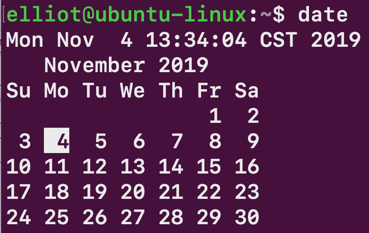
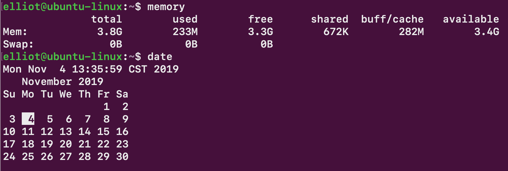

创建你自己的命令

有时，你可能会很难记住一个命令。其他时候，你会发现自己一遍又一遍地运行一个非常长的命令，这让你发疯。在本章中，你将学习如何创建*自己*的命令，因为你才是真正的老板。

# 第二十章：你的第一个别名

假设你总是忘记`free -h`命令显示系统的内存信息：

```
elliot@ubuntu-linux:~$ free -h
 total     used     free     shared     buff/cache     available
Mem:       3.9G     939M     2.2G       6.6M           752M         2.7G
Swap:      947M       0B     947M 
```

也许你会问自己：“为什么我不能只输入`memory`来显示内存信息，而不是`free -h`？”。好吧，你当然可以通过创建一个`alias`来做到这一点。

`alias`命令指示 shell 用另一个字符串（单词）替换一个字符串。那么这有什么用呢？让我告诉你；如果你运行以下命令：

```
elliot@ubuntu-linux:~$ alias memory="free -h"
```

那么每次你输入`memory`，你的 shell 都会将其替换为`free -h`：

```
elliot@ubuntu-linux:~$ memory
 total     used     free     shared     buff/cache     available
Mem:       3.9G     936M     2.2G       6.6M           756M         2.7G
Swap:      947M       0B     947M
```

哇！现在你已经实现了你的梦想！你可以为任何你难以记住的 Linux 命令创建一个别名。请注意，`alias`命令的一般格式如下：

```
alias alias_name="command(s)_to_run"
```

# 一个别名对应多个命令

你可以使用分号在同一行上运行多个命令。例如，要一次创建一个名为`newdir`的新目录并切换到`newdir`，你可以运行以下命令：

```
elliot@ubuntu-linux:~$ mkdir newdir; cd newdir 
elliot@ubuntu-linux:~/newdir$
```

你可以使用分号来分隔每个命令。一般来说，运行同一行上的多个命令的语法如下：

```
command1; command2; command3; command4; ....
```

我们经常想同时查看日历和日期，对吧？为此，我们将创建一个名为`date`的别名，这样每次运行`date`时，它将同时运行`date`和`calendar`命令：

```
elliot@ubuntu-linux:~$ alias date="date;cal"
```

现在让我们运行`date`，看看发生了什么：



请注意，这里我们使用了别名`date`，这已经是一个现有命令的名称；这对于别名来说是完全可以的。

# 列出所有别名

你还应该知道，别名是特定于用户的。因此，由`elliot`创建的别名对`smurf`用户不起作用；看一下：

```
elliot@ubuntu-linux:~$ su - smurf 
Password:
smurf@ubuntu-linux:~$ date 
Mon Nov 4 13:33:36 CST 2019
smurf@ubuntu-linux:~$ memory
Command 'memory' not found, did you mean: 
 command 'lmemory' from deb lmemory
Try: apt install <deb name>
```

正如你所看到的，`smurf`不能使用用户`elliot`的别名。所以每个用户都有自己的一组别名。现在，让我们退出到用户`elliot`：

```
smurf@ubuntu-linux:~$ exit 
logout
elliot@ubuntu-linux:~$ memory
 total     used     free     shared     buff/cache     available
Mem:      3.9G     937M     2.0G       6.6M      990M               2.7G
Swap:     947M       0B     947M 
```

你可以运行`alias`命令来列出当前登录用户可以使用的所有别名：

```
elliot@ubuntu-linux:~$ alias 
alias date='date;cal'
alias egrep='egrep --color=auto' 
alias fgrep='fgrep --color=auto' 
alias grep='grep --color=auto' 
alias l='ls -CF'
alias la='ls -A' 
alias ll='ls -alF'
alias ls='ls --color=auto' 
alias memory='free -h'
```

# 创建永久别名

到目前为止，我们一直在创建临时别名；也就是说，我们创建的`memory`和`date`这两个别名是临时的，只在当前终端会话中有效。一旦关闭终端，这两个别名就会消失。

打开一个新的终端会话，然后尝试运行我们创建的两个别名：

```
elliot@ubuntu-linux:~$ date 
Mon Nov 4 13:43:46 CST 2019
elliot@ubuntu-linux:~$ memory

Command 'memory' not found, did you mean: 
 command 'lmemory' from deb lmemory
Try: sudo apt install <deb name>
```

如你所见，它们都消失了！它们甚至不再在你的别名列表中了：

```
elliot@ubuntu-linux:~$ alias 
alias egrep='egrep --color=auto' 
alias fgrep='fgrep --color=auto' 
alias grep='grep --color=auto' 
alias l='ls -CF'
alias la='ls -A' 
alias ll='ls -alF'
alias ls='ls --color=auto'
```

要为用户创建一个永久别名，你需要将其包含在用户主目录中的隐藏`.bashrc`文件中。因此，要永久添加我们的两个别名，你必须在`/home/el- liot/.bashrc`文件的最末尾添加以下两行：

```
alias memory = "free -h" 
alias date = "date;cal"
```

你可以通过运行以下两个`echo`命令来实现：

```
elliot@ubuntu-linux:~$ echo 'alias memory="free -h"' >> /home/elliot/.bashrc 
elliot@ubuntu-linux:~$ echo 'alias date="date;cal"' >> /home/elliot/.bashrc
```

在将这两个别名添加到`/home/elliot/.bashrc`文件后，你需要在`/home/elliot/.bashrc`文件上运行`source`命令，以使当前会话中的更改生效：

```
elliot@ubuntu-linux:~$ source /home/elliot/.bashrc
```

现在你可以永远使用你的两个别名`memory`和`date`，而不必担心在关闭当前终端会话后它们会消失：



# 删除别名

让我们创建另一个临时别名，名为`lastline`，它将显示文件中的最后一行：

```
elliot@ubuntu-linux:~$ alias lastline="tail -n 1"
```

现在让我们在`/home/elliot/.bashrc`文件上尝试我们的新别名：

```
elliot@ubuntu-linux:~$ lastline /home/elliot/.bashrc 
alias date="date;cal"
```

好了！它运行得很好。现在，如果你想删除别名，你可以运行`unalias`命令，然后跟上别名：

```
elliot@ubuntu-linux:~$ unalias lastline
```

现在`lastline`别名已经被删除：

```
elliot@ubuntu-linux:~$ lastline /home/elliot/.bashrc 
lastline: command not found
```

你还可以使用`unalias`命令临时停用永久别名。例如，如果你运行以下命令：

```
elliot@ubuntu-linux:~$ unalias memory
```

现在，永久别名`memory`将在当前终端会话中不起作用：

```
elliot@ubuntu-linux:~$ memory

Command 'memory' not found, did you mean: 
 command 'lmemory' from deb lmemory
Try: sudo apt install <deb name>
```

然而，别名`memory`将在新的终端会话中回来。要删除永久别名，你需要从`.bashrc`文件中删除它。

# 一些有用的别名

现在让我们创建一些有用的别名，让我们在 Linux 命令行上工作时更加愉快。

很多人讨厌记住所有`tar`命令选项，所以让我们为这些人简化一下。我们将创建一个名为`extract`的别名，它将从存档中提取文件。

```
elliot@ubuntu-linux:~$ alias extract="tar -xvf"
```

你可以在任何存档上尝试这个别名，它会像魔术一样起作用。

同样地，你可以创建一个名为`compress_gzip`的别名，它将创建一个 gzip 压缩的存档：

```
elliot@ubuntu-linux:~$ alias compress_gzip="tar -czvf"
```

你可能还想创建一个名为`soft`的别名，它将创建软链接：

```
elliot@ubuntu-linux:~$ alias soft="ln -s"
```

你可以使用软别名来创建一个名为`logfiles`的软链接，指向`/var/logs`目录：

```
elliot@ubuntu-linux:~$ soft /var/logs logfiles 
elliot@ubuntu-linux:~$ ls -l logfiles
lrwxrwxrwx 1 elliot elliot 9 Nov 4 15:08 logfiles -> /var/logs
```

现在让我们创建一个名为`LISTEN`的别名，它将列出系统上所有正在监听的端口：

```
elliot@ubuntu-linux:~$ alias LISTEN="netstat -tulpen| grep -i listen"
```

现在让我们尝试运行`LISTEN`别名：

```
elliot@ubuntu-linux:~$ LISTEN
tcp     0     0 127.0.0.53:53     0.0.0.0:*     LISTEN
tcp     0     0 0.0.0.0:22        0.0.0.0:*     LISTEN
tcp     0     0 127.0.0.1:631     0.0.0.0:*     LISTEN
tcp     0     0 127.0.0.1:25      0.0.0.0:*     LISTEN
tcp6    0     0 :::22             :::*          LISTEN
tcp6    0     0 ::1:631           :::*          LISTEN
tcp6    0     0 ::1:25            :::*          LISTEN
```

这很酷！让我们创建一个最终别名`sort_files`，它将按大小（按降序）列出当前目录中的所有文件：

```
alias sort_files="du -bs * | sort -rn"
```

现在让我们尝试运行`sort_files`别名：

```
elliot@ubuntu-linux:~$ sort_files 
9628732 Downloads
2242937 Pictures
65080 minutes.txt
40393 load.txt
32768 dir1
20517 Desktop
20480 small
8192 hackers
476 game.sh
168 practise.txt
161 filetype.sh
142 noweb.sh
108 3x10.sh
92 rename.sh
92 numbers.sh
88 detect.sh
74 hello3.sh
66 fun1.sh
59 hello20.sh
37 hello2.sh
33 hello.sh
17 mydate.sh
16 honey
9 logs
6 softdir1
0 empty
```

如你所见，当前目录中的文件按大小（即最大的文件先）降序列出。当你在系统上进行清理并想要检查哪些文件占用了最多空间时，这将特别有用。

# 添加安全网

你也可以使用别名来防止愚蠢的错误。例如，为了防止误删重要文件，你可以添加以下别名：

```
elliot@ubuntu-linux:~$ alias rm="rm -i"
```

现在每次你尝试删除一个文件时都会被要求确认：

```
elliot@ubuntu-linux:~$ rm *
rm: remove regular file '3x10.sh'?
```

# 用别名发疯

你也可以通过别名来玩一些有趣的东西，让用户发疯；看看这个别名：

```
elliot@ubuntu-linux:~$ alias nano="vi"
```

现在当用户`elliot`尝试打开`nano`编辑器时，将会打开`vi`编辑器！用户`elliot`可以通过输入`nano`编辑器的完整路径来克服这个困境。这里是另一个有趣的别名：

```
elliot@ubuntu-linux:~$ alias exit="echo No I am not exiting ..."
```

现在看看当用户`elliot`尝试退出终端时会发生什么：

```
elliot@ubuntu-linux:~$ exit 
No I am not exiting ... 
elliot@ubuntu-linux:~$ exit 
No I am not exiting ...
```

我会让你自己处理这个问题；我就是这么邪恶！哈哈。

# 知识检查

对于以下练习，打开你的终端并尝试解决以下任务：

1.  为`apt-get install`命令创建一个临时别名`ins`。

1.  为`dpkg -l`命令创建一个临时别名`packages`。

1.  创建一个名为`clean`的永久别名，它将删除`/tmp`目录中的所有文件。
