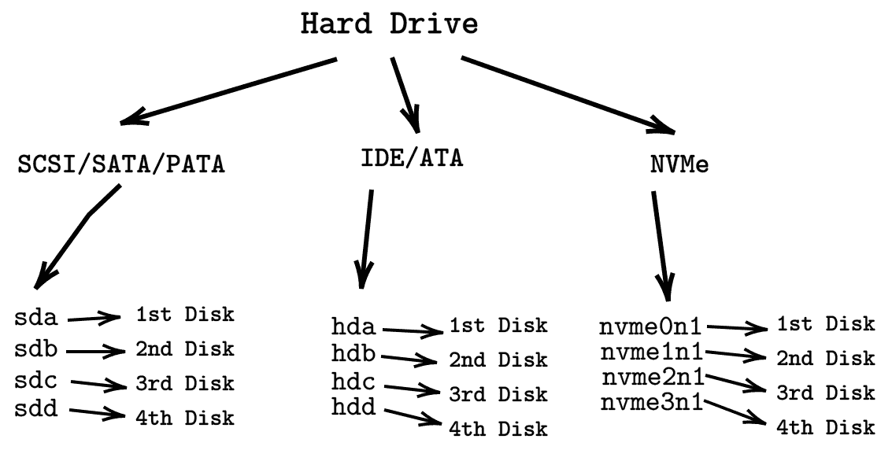
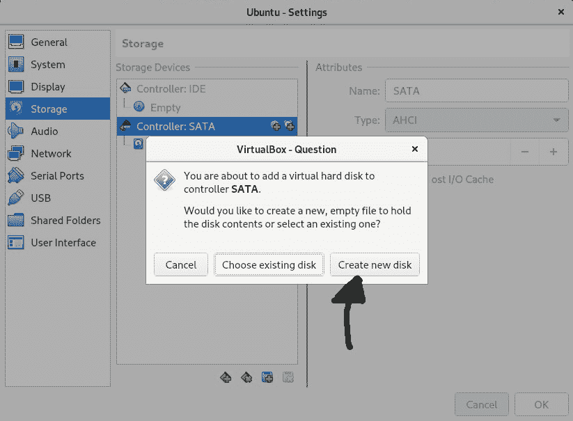
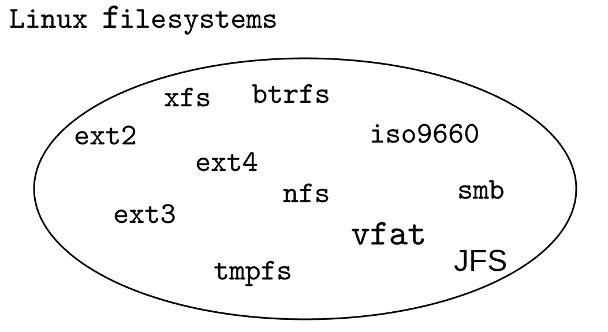
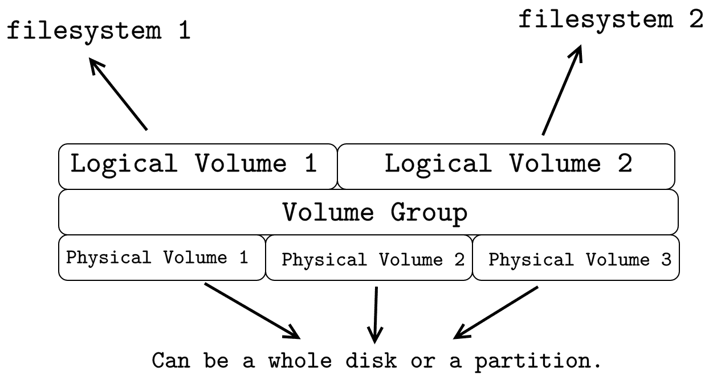

每个人都需要磁盘空间

在本章中，您将学习如何在 Linux 中管理硬盘。您将学习如何在驱动器上创建新分区。然后您将学习如何创建和挂载文件系统。最后，您将学习如何使用 LVM 创建逻辑卷。

# 第二十一章：您的设备在哪里？

正如我们现在都知道的那样，在 Linux 中，文件代表一切，设备也不例外。所有设备都位于`/dev`目录中；这包括您的键盘、鼠标、终端、硬盘、USB 设备、CD-ROM 等。

您现在正在使用的终端实际上是一个设备。如果运行`w`命令，您将在输出的第二列中看到您连接到的终端的名称。

```
elliot@ubuntu-linux:~$ w
11:38:59 up 17 min, 1 user, load average: 0.00, 0.00, 0.02
USER   TTY       FROM             LOGIN@  IDLE  JCPU  PCPU  WHAT
elliot pts/0     172.16.1.67      11:22   0.00s 0.06s 0.00s w
```

在我的情况下，它是`pts/0`；**pts**是**伪终端**的缩写。现在，这个终端由文件`/dev/pts/0`表示：

```
elliot@ubuntu-linux:~$ ls -l /dev/pts/0
crw------- 1 elliot tty 136, 0 Nov 7 11:40 /dev/pts/0
```

我将把`Hello Friend`这一行回显到`/dev/pts/0`，并密切关注接下来会发生什么：

```
elliot@ubuntu-linux:~$ echo "Hello Friend" > /dev/pts/0 
Hello Friend
```

正如您所看到的，`Hello Friend`被打印到我的终端！现在您可以在系统上与其他用户玩这个游戏。您可以运行`w`命令来找出他们正在使用的终端，然后开始发送消息给他们！

# 您的硬盘在哪里？

要知道哪个文件代表您的硬盘，您需要运行`lsblk`命令，这是**列出块**的缩写：

```
elliot@ubuntu-linux:~$ lsblk
NAME   MAJ:MIN  RM SIZE RO  TYPE MOUNTPOINT
sda      8:0     0  20G  0  disk
| sda1   8:1     0  20G  0  part /
sr0      11:0    1 1024M 0  rom
```

从输出中，我可以看到我的硬盘设备的名称是**sda**，这是**SCSI Disk A**的缩写。现在您需要明白，根据您的硬盘驱动器类型，您可能会得到不同的名称。`图 1`总结了不同类型硬盘驱动器的 Linux 命名策略：



图 1：Linux 中的硬盘命名

因此，从`lsblk`命令的输出中，您可以得出结论，我在我的虚拟机上只有一个磁盘（`sda`）。现在我们不想操作这个磁盘，因为它包含了根文件系统，所以让我们为学习目的向我们的虚拟机添加另一个磁盘。

# 向虚拟机添加磁盘

要成功向虚拟机添加新磁盘，您需要遵循一些步骤。您必须按照特定顺序执行这些步骤：

1.  关闭您的虚拟机。

1.  转到虚拟机设置|存储|创建新磁盘。

1.  启动您的虚拟机。

因此，第一步非常简单；关闭您的虚拟机，因为在虚拟机仍在运行时无法向其添加新磁盘。对于第二步，您需要进入虚拟机设置，然后点击存储，然后选择您的磁盘控制器，右键单击，然后按`图 2`所示创建新磁盘：



图 2：在虚拟机上创建新磁盘

然后您将被要求选择新磁盘的大小。您可以选择任何大小。我在我的主机机器上有大量的磁盘空间，所以我将向我的虚拟机添加一个 10 GB 的磁盘。完成后，最后一步是再次启动您的虚拟机。

只要您的虚拟机启动，您应该能够看到您的新磁盘：

```
elliot@ubuntu-linux:~$ lsblk
NAME    MAJ:MIN RM SIZE RO TYPE MOUNTPOINT
sda       8:0   0  20G  0  disk
| sda1    8:1   0  20G  0  part /
sdb       8:16  0  10G  0  disk
sr0      11:0   1 1024M 0  rom
```

我的新磁盘得到了名称`sdb`，因为它是我虚拟机上的第二个磁盘，您还可以看到它的大小为 10 GB。

# 创建新磁盘分区

现在让我们来玩一下我们刚刚创建的新磁盘。您可能想要做的第一件事是创建一个新分区。要创建一个新分区，我们使用`fdisk`命令，后面跟着磁盘名称：

```
fdisk [options] device
```

因此，要在`/dev/sdb`磁盘上创建一个新分区，可以运行以下命令：

```
root@ubuntu-linux:~# fdisk /dev/sdb

Welcome to fdisk (util-linux 2.31.1).
Changes will remain in memory only, until you decide to write them. 
Be careful before using the write command.

Device does not contain a recognized partition table. 
Created a new DOS disklabel with disk identifier 0xb13d9b6a.

Command (m for help):
```

这打开了`fdisk`实用程序。如果你不确定该怎么做，可以输入`m`来获取帮助：

```
Command (m for help): m 
Help:
 DOS (MBR)
 a   toggle a bootable flag
 b   edit nested BSD disklabel
 c   toggle the dos compatibility flag

 Generic
 d   delete a partition
 F   list free unpartitioned space l list known partition types
 n   add a new partition
 p   print the partition table t change a partition type
 v   verify the partition table
 i   print information about a partition

 Save & Exit
 w   write table to disk and exit 
 q   quit without saving changes

 Create a new label
 g   create a new empty GPT partition table
 G   create a new empty SGI (IRIX) partition table 
 o   create a new empty DOS   partition table
 s   create a new empty Sun partition table
```

我们想创建一个新分区，所以输入`n`：

```
Command (m for help): n 
Partition type
 p primary (0 primary, 0 extended, 4 free)
 e extended (container for logical partitions) 
Select (default p):
```

然后它会问你是要主分区还是扩展分区。我们会接受默认选择（主分区），所以只需按*Enter*：

```
Using default response p. 
Partition number (1-4, default 1):
```

然后它会要求您选择一个分区号。我们也会接受默认值，即分区号`1`，所以只需按*Enter*。请注意，您可以在给定磁盘上创建最多四个主分区：

```
Partition number (1-4, default 1):
First sector (2048-20971519, default 2048):
```

然后您将被提示选择您希望新分区从哪个扇区开始；按*Enter*接受默认值（`2048`）：

```
First sector (2048-20971519, default 2048):
Last sector, +sectors or +size{K,M,G,T,P} (2048-20971519, default 20971519):
```

现在您将被要求选择新分区的大小；我想要一个 2GB 的分区，所以我会输入`+2G`，然后按*Enter*：

```
Last sector, +sectors or +size{K,M,G,T,P} (2048-20971519, default 20971519): +2G

Created a new partition 1 of type 'Linux' and of size 2 GiB. 
Command (m for help):
```

最后，您需要按`w`保存配置：

```
Command (m for help): w
The partition table has been altered. 
Calling ioctl() to re-read partition table. 
Syncing disks.
```

现在您可以运行`lsblk`来查看您刚刚创建的新分区：

```
root@ubuntu-linux:~# lsblk
NAME   MAJ:MIN RM SIZE  RO TYPE MOUNTPOINT
sda      8:0   0  20G   0  disk
| sda1   8:1   0  20G   0  part /
sdb      8:16  0  10G   0  disk
| sdb1   8:17  0  2G    0  part
sr0     11:0   1 1024M  0  rom
```

您可以看到 2GB 分区`sdb1`列在`sdb`下。您还可以使用`fdisk`命令的`-l`选项打印出磁盘的分区表：

```
root@ubuntu-linux:~# fdisk -l /dev/sdb
Disk /dev/sdb: 10 GiB, 10737418240 bytes, 20971520 sectors
Units: sectors of 1 * 512 = 512 bytes
Sector size (logical/physical): 512 bytes / 512 bytes 
I/O size (minimum/optimal): 512 bytes / 512 bytes 
Disklabel type: dos
Disk identifier: 0xb13d9b6a

Device      Boot Start    End Sectors  Size  Id Type
/dev/sdb1        2048 4196351 4194304   2G   83 Linux
```

# 创建新文件系统

我现在还不能在我的`/dev/sdb1`分区上创建文件和目录；首先，我需要创建一个文件系统。文件系统基本上决定了数据在磁盘（或分区）上的组织和存储方式。一个很好的类比是飞机上的乘客；航空公司不能让乘客（数据）自己在飞机（分区）上就座；那将是一团糟。

在 Linux 上有许多不同类型的文件系统可用。重要的是要注意，`ext4`和`xfs`是最常用的文件系统。`图 3`向您展示了 Linux 支持的一些可用文件系统：



图 3：Linux 文件系统

您可以在文件系统的`man`页面中阅读每种 Linux 文件系统类型的描述：

```
root@ubuntu-linux:~# man filesystems
```

要创建文件系统，我们使用`mkfs`命令，它是 make filesystem 的缩写。`mkfs`命令的一般语法如下：

```
mkfs --type [fstype] disk_or_partition
```

现在让我们在我们的新分区`/dev/sdb1`上创建一个`ext4`文件系统：

```
root@ubuntu-linux:~# mkfs --type ext4 /dev/sdb1 
mke2fs 1.44.1 (24-Mar-2018)
Creating filesystem with 524288 4k blocks and 131072 inodes 
Filesystem UUID: 61d947bb-0cd1-41e1-90e0-c9895b6de428 
Superblock backups stored on blocks:
32768, 98304, 163840, 229376, 294912

Allocating group tables: done 
Writing inode tables: done
Creating journal (16384 blocks): done
Writing superblocks and filesystem accounting information: done
```

我们已经在我们的分区`/dev/sdb1`上创建了一个`ext4`文件系统。我们可以通过在`/dev/sdb1`分区上运行`file -s`命令来验证我们的工作：

```
root@ubuntu-linux:~# file -s /dev/sdb1
/dev/sdb1: Linux rev 1.0 ext4 filesystem data,
UUID=61d947bb-0cd1-41e1-90e0-c9895b6de428 (extents) (64bit) (large files) (huge files)
```

如您所见，它显示`/dev/sdb1`分区上有一个`ext4`文件系统。

您可以使用`wipefs`命令来删除（擦除）文件系统。例如，如果您想要删除我们刚在`/dev/sdb1`上创建的`ext4`文件系统，可以运行以下命令：

```
root@ubuntu-linux:~# wipefs -a /dev/sdb1
/dev/sdb1: 2 bytes were erased at offset 0x00000438 (ext4): 53 ef
```

现在如果您在`/dev/sdb1`分区上重新运行`file -s`，您将看到没有文件系统签名：

```
root@ubuntu-linux:~# file -s /dev/sdb1
/dev/sdb1: data
```

让我们重新在`/dev/sdb1`上创建一个`ext4`文件系统并保留它：

```
root@ubuntu-linux:~# mkfs --type ext4 /dev/sdb1 
mke2fs 1.44.1 (24-Mar-2018)
Creating filesystem with 524288 4k blocks and 131072 inodes 
Filesystem UUID: 811aef62-d9ca-4db3-b305-bd896d1c8545 
Superblock backups stored on blocks:
32768, 98304, 163840, 229376, 294912

Allocating group tables: done 
Writing inode tables: done
Creating journal (16384 blocks): done
Writing superblocks and filesystem accounting information: done
```

# 挂载文件系统

我们已经在分区`/dev/sdb1`上创建了一个`ext4`文件系统。现在我们需要在 Linux 目录树中的某个地方挂载我们的文件系统。

**什么是挂载？**

挂载是指将任何文件系统或任何存储设备（如 USB 闪存驱动器、CD 等）附加到目录的过程。

但是为什么我们需要挂载？我的意思是，我们刚刚在 2GB 分区`/dev/sdb1`上创建了一个`ext4`文件系统。我们不能直接开始在`/dev/sdb1`上创建文件吗？答案是否定的！请记住，`/dev/sdb1`只是一个代表分区的文件。

要挂载文件系统，我们使用如下的 mount 命令：

```
mount filesystem mount_directory
```

所以假设我们将使用文件系统`/dev/sdb1`来存储我们的游戏。在这种情况下，让我们创建一个新目录`/games`：

```
root@ubuntu-linux:~# mkdir /games
```

现在唯一剩下的就是将我们的文件系统`/dev/sdb1`挂载到`/games`目录上：

```
root@ubuntu-linux:/# mount /dev/sdb1 /games
```

我们可以通过运行`lsblk`命令来验证我们的工作：

```
root@ubuntu-linux:~# lsblk
NAME   MAJ:MIN  RM SIZE RO TYPE MOUNTPOINT
sda      8:0    0  20G  0  disk
| sda1   8:1    0  20G  0  part /
sdb      8:16   0  10G  0  disk
| sdb1   8:17   0  2G   0  part /games
sr0     11:0    1 1024M 0  rom
```

如您所见，`/dev/sdb1`确实挂载在`/games`上。

您还可以使用`mount`命令本身来列出系统上已挂载的所有文件系统。例如，要验证`/dev/sdb1`是否挂载在`/games`上，可以运行以下命令：

```
root@ubuntu-linux:/# mount | grep sdb1
/dev/sdb1 on /games type ext4 (rw,relatime,data=ordered)
```

我们现在有 2GB 可供我们在`/games`中使用，您可以使用`df`命令来显示文件系统磁盘空间的使用情况：

```
root@ubuntu-linux:~# df -h /games
Filesystem     Size Used Avail Use% Mounted on
/dev/sdb1      2.0G 6.0M 1.8G   1%  /games
```

现在让我们在`/games`中创建三个文件：

```
root@ubuntu-linux:~# cd /games
root@ubuntu-linux:/games# touch game1 game2 game3
```

# 卸载文件系统

您还可以卸载（与挂载相反）文件系统。正如您可能已经猜到的，卸载是指分离文件系统或存储设备的过程。要卸载文件系统，您可以使用`umount`如下：

```
umount filesystem
```

切换到`/games`目录并尝试卸载`/dev/sdb1`文件系统：

```
root@ubuntu-linux:/games# umount /dev/sdb1 
umount: /games: target is busy.
```

哎呀！它说目标正忙！那是因为我在挂载点`/games`内；我将备份到上一级目录，然后再试一次：

```
root@ubuntu-linux:/games# cd .. 
root@ubuntu-linux:/# umount /dev/sdb1
```

这次成功了！您必须小心，永远不要在文件系统或任何存储设备正在被使用时卸载它；否则，您可能会丢失数据！

现在让我们验证文件系统`/dev/sdb1`确实已卸载：

```
root@ubuntu-linux:/# lsblk
NAME   MAJ:MIN RM SIZE  RO TYPE MOUNTPOINT
sda      8:0   0  20G   0  disk
| sda1   8:1   0  20G   0  part /
sdb      8:16  0  10G   0  disk
| sdb1   8:17  0  2G    0  part
sr0     11:0   1 1024M  0  rom
root@ubuntu-linux:/# mount | grep sdb1
```

是的！它肯定已经卸载了！现在让我们列出`/games`目录的内容：

```
root@ubuntu-linux:/# ls /games
```

什么都没有！但不要惊慌或担心！我们创建的三个文件仍然存在于`/dev/sdb1`文件系统中。我们需要重新挂载文件系统，然后您将看到这些文件：

```
root@ubuntu-linux:~# mount /dev/sdb1 /games 
root@ubuntu-linux:~# ls /games
game1 game2 game3 lost+found
```

# 永久挂载文件系统

`mount`命令只会临时挂载文件系统；也就是说，使用`mount`命令挂载的文件系统不会在系统重新启动后保留。如果要永久挂载文件系统，那么您需要将其包含在文件系统表文件`/etc/fstab`中。

`/etc/fstab`中的每个条目（或行）代表一个不同的文件系统，每行由以下六个字段组成：

+   `filesystem`

+   `mount_dir`

+   `fstype`

+   `mount_options`

+   `dump`

+   `check_fs`

因此，例如，要永久将我们的`/dev/sdb1`文件系统挂载到`/games`上，您需要在`/etc/fstab`中包含以下行：

```
/dev/sdb1 /games ext4 defaults 0 0
```

您应该将该行添加到`/etc/fstab`文件的末尾：

```
root@ubuntu-linux:~# tail -1 /etc/fstab
/dev/sdb1   /games ext4   defaults   0   0
```

现在让我们卸载`/dev/sdb1`：

```
root@ubuntu-linux:~# umount /dev/sdb1
```

最后，您现在可以通过运行以下命令永久挂载`/dev/sdb1`：

```
root@ubuntu-linux:~# mount /dev/sdb1
```

请注意，这次我们没有指定挂载目标；那是因为挂载目标已经在`/etc/fstab`文件中指定了。您可以在`mount`命令中使用`-a`选项：

```
root@ubuntu-linux:~# mount -a
```

要挂载`/etc/fstab`中包含的所有文件系统。它还用于检查语法错误。例如，如果您在`/etc/fstab`中写错了`/dev/sdx1`，而不是`/dev/sdb1`，它将显示以下错误：

```
root@ubuntu-linux:~# mount -a
mount: /games: special device /dev/sdx1 does not exist.
```

所有在`/etc/fstab`中指定的挂载点都是永久的，它们将在系统重新启动后保留。您还可以参考`fstab`手册页，了解有关`/etc/fstab`的更多信息：

```
root@ubuntu-linux:~# man fstab
```

# 空间用完

让我们创建巨大的文件，以消耗`/games`中所有可用的磁盘空间。

在 Linux 中快速创建大文件的一种方法是使用`dd`命令。为了演示，让我们首先切换到`/games`目录：

```
root@ubuntu-linux:~# cd /games 
root@ubuntu-linux:/games#
```

现在，您可以运行以下命令创建一个名为`bigGame`的`1`GB 文件：

```
root@ubuntu-linux:/games# dd if=/dev/zero of=bigGame bs=1G count=1 
1+0 records in
1+0 records out
1073741824 bytes (1.1 GB, 1.0 GiB) copied, 1.44297 s, 744 MB/s
```

我们现在已经使用了`/games`中超过一半的可用空间：

```
root@ubuntu-linux:/games# df -h /games 
Filesystem    Size Used Avail Use% Mounted on
/dev/sdb1     2.0G 1.1G 868M  55%  /games
```

现在让我们尝试创建另一个名为`bigFish`的大小为`3`GB 的文件：

```
root@ubuntu-linux:/games# dd if=/dev/zero of=bigFish bs=1G count=3 
dd: error writing 'bigFish': No space left on device
1+0 records in
0+0 records out
1016942592 bytes (1.0 GB, 970 MiB) copied, 1.59397 s, 638 MB/s
```

我们遇到了错误，因为空间用完了：

```
root@ubuntu-linux:/games# df -h /games 
Filesystem    Size Used Avail Use% Mounted on
/dev/sdb1     2.0G 2.0G  0    100% /games
```

现在我们甚至无法创建一个带有`Hello`一词的小文件：

```
root@ubuntu-linux:/games# echo Hello > greeting.txt
-su: echo: write error: No space left on device
```

# 损坏和修复文件系统

在一些不幸的情况下，您可能会遇到系统由于文件系统损坏而无法启动的问题。在这种情况下，您必须修复文件系统，以便系统正常启动。我将向您展示如何损坏文件系统，然后向您展示如何修复它。

通过向其写入随机数据，轻松损坏文件系统。

以下命令肯定会损坏您的`/dev/sdb1`文件系统：

```
root@ubuntu-linux:/games# dd if=/dev/urandom of=/dev/sdb1 count=10k
```

您的`/dev/sdb1`文件系统现在已损坏！如果您不相信我，卸载它，然后再尝试重新挂载它：

```
root@ubuntu-linux:~# umount /dev/sdb1
```

好的，它成功卸载了！让我们看看它是否会挂载：

```
root@ubuntu-linux:~# mount /dev/sdb1 /games
mount: /games: wrong fs type, bad option, bad superblock on /dev/sdb1, 
missing codepage or helper program, or other error.
```

正如您所看到的，它无法挂载，因为它会输出错误消息。

恭喜！您的文件系统已损坏。现在我们能做什么？好吧，我们肯定可以修复它！

您可以使用文件系统检查命令`fsck`来检查和修复文件系统。因此，让我们在我们损坏的文件系统上运行`fsck`：

```
root@ubuntu-linux:~# fsck /dev/sdb1 
fsck from util-linux 2.31.1
e2fsck 1.44.1 (24-Mar-2018)
/dev/sdb1 was not cleanly unmounted, check forced.
fsck.ext4: Inode checksum does not match inode while reading bad blocks inode 
This doesn't bode well, but we'll try to go on...
Pass 1: Checking inodes, blocks, and sizes 
Inode 1 seems to contain garbage. Clear<y>?
```

如您所见，它指出文件系统包含垃圾数据，并询问您是否要清除错误。您可以按*Y*，但它会一遍又一遍地询问您是否要清除每个修复的 inode！您可以使用`-y`选项来避免这种情况，该选项会在修复过程中自动回答是。

```
root@ubuntu-linux:~# fsck -y /dev/sdb1
```

运行时，您会看到屏幕上出现很多数字。不用担心！它正在修复您损坏的文件系统。它基本上是在浏览成千上万的 inode。

完成后，您可以重新运行`fsck`来验证文件系统现在已经干净：

```
root@ubuntu-linux:~# fsck /dev/sdb1 
fsck from util-linux 2.31.1
e2fsck 1.44.1 (24-Mar-2018)
/dev/sdb1: clean, 11/131072 files, 9769/524288 blocks
```

太棒了！现在让我们尝试挂载它：

```
root@ubuntu-linux:~# mount /dev/sdb1 /games
```

这次成功挂载了。任务完成！我们成功修复了文件系统。

# LVM 来拯救

当文件系统的空间用完时，情况可能会变得非常糟糕。我们已经在`/games`中用完了空间，使用标准分区没有简单的解决方案来增加更多的空间。幸运的是，**逻辑卷管理器**（**LVM**）为管理文件系统提供了更好的替代方案。

## 安装 LVM 软件包

在我们开始使用 LVM 之前，首先需要安装`lvm2`软件包：

```
root@ubuntu-linux:~# apt-get install lvm2
```

安装完成后，您可以运行`lvm version`命令来验证安装是否成功：

```
root@ubuntu-linux:~# lvm version
 LVM version:     2.02.176(2) (2017-11-03)
 Library version: 1.02.145 (2017-11-03)
 Driver version:  4.37.0
```

## 三层抽象

要理解 LVM 的工作原理，首先需要将其可视化。LVM 就像是由三层组成的蛋糕，如`图 4`所示。



图 4：LVM 可视化

物理卷构成了 LVM 蛋糕的第一（基础）层。物理卷可以是整个磁盘（`/dev/sdb`，`/dev/sdc`等）或分区（`/dev/sdb2`，`/dev/sdc3`等）。

**卷组**层是 LVM 蛋糕中的第二层，也是最大的一层，它位于**物理卷**层的顶部。一个卷组可以跨多个物理卷；也就是说，一个卷组可以由一个或多个物理卷组成。

**逻辑卷**层构成了 LVM 蛋糕的第三层，也是最后一层。多个逻辑卷可以属于同一个卷组，如`图 4`所示。最后，您可以在逻辑卷上创建文件系统。

## 创建物理卷

创建物理卷的步骤非常简单；您只需要一个磁盘或一个分区。我们已经创建了一个`2`GB 的分区`/dev/sdb1`。现在继续在`/dev/sdb`下创建三个大小为`2`GB 的分区。

最终结果应该是这样的：

```
root@ubuntu-linux:~# lsblk
NAME    MAJ:MIN  RM  SIZE  RO  TYPE MOUNTPOINT
sda       8:0    0   20G   0   disk
| sda1    8:1    0   20G   0   part /
sdb       8:16   0   10G   0   disk
| sdb1    8:17   0    2G   0   part /games
| sdb2    8:18   0    2G   0   part
| sdb3    8:19   0    2G   0   part
| sdb4    8:20   0    2G   0   part
sr0      11:0    1  1024M  0   rom
```

要创建物理卷，我们使用`pvcreate`命令，后面跟着一个磁盘或一个分区：

```
pvcreate disk_or_partition
```

我们将创建三个物理卷：`/dev/sdb2`，`/dev/sdb3`和`/dev/sdb4`。您可以使用一个命令创建所有三个：

```
root@ubuntu-linux:~# pvcreate /dev/sdb2 /dev/sdb3 /dev/sdb4 
 Physical volume "/dev/sdb2" successfully created.
 Physical volume "/dev/sdb3" successfully created.
 Physical volume "/dev/sdb4" successfully created.
```

很酷！您还可以使用`pvs`命令列出所有物理卷：

```
root@ubuntu-linux:~# pvs
 PV       VG Fmt Attr PSize PFree
/dev/sdb2    lvm2 --- 2.00g 2.00g
/dev/sdb3    lvm2 --- 2.00g 2.00g
/dev/sdb4    lvm2 --- 2.00g 2.00g
```

好了！到目前为止一切看起来都很好。

## 创建卷组

一个卷组可以跨多个物理卷。因此，让我们创建一个卷组，它将由两个物理卷`/dev/sdb2`和`/dev/sdb3`组成。

要创建卷组，我们使用`vgcreate`命令，后面跟着新卷组的名称，然后是物理卷：

```
vgcreate vg_name PV1 PV2 PV3 ...
```

让我们创建一个名为`myvg`的卷组，它将跨越`/dev/sdb2`和`/de- v/sdb3`：

```
root@ubuntu-linux:~# vgcreate myvg /dev/sdb2 /dev/sdb3 
 Volume group "myvg" successfully created
```

太棒了！您还可以使用`vgs`命令列出所有卷组：

```
root@ubuntu-linux:~# vgs
 VG   #PV #LV #SN Attr   VSize VFree 
 myvg   2   0   0 wz--n- 3.99g 3.99g
```

请注意，卷组`myvg`的大小等于`4`GB，这是`/dev/sdb2`和`/dev/sdb3`的总大小。

## 创建逻辑卷

现在我们可以在我们的`mvg`卷组上创建逻辑卷。

要创建逻辑卷，我们使用`lvcreate`命令，后面跟着逻辑卷的大小、逻辑卷的名称，最后是卷组名称：

```
lvcreate --size 2G --name lv_name vg_name
```

让我们创建一个名为`mybooks`的逻辑卷，大小为`2`GB：

```
root@ubuntu-linux:~# lvcreate --size 2G --name mybooks myvg 
 Logical volume "mybooks" created.
```

现在创建另一个名为`myprojects`的逻辑卷，大小为`500`MB：

```
root@ubuntu-linux:~# lvcreate --size 500M --name myprojects myvg 
 Logical volume "myprojects" created.
```

您可以使用`lvs`命令列出所有逻辑卷：

```
root@ubuntu-linux:~# lvs
 LV         VG   Attr       LSize Pool Origin Data% Meta% Move Log 
 mybooks    myvg -wi-a----- 2.00g
 myprojects myvg -wi-a----- 500.00m
```

还有最后一步，就是在我们的逻辑卷上创建文件系统。

你的逻辑卷在设备映射目录`/dev/mapper`中表示：

```
root@ubuntu-linux:~# ls /dev/mapper 
myvg-mybooks myvg-myprojects
```

让我们在`mybooks`逻辑卷上创建一个`ext4`文件系统：

```
root@ubuntu-linux:~# mkfs --type ext4 /dev/mapper/myvg-mybooks 
mke2fs 1.44.1 (24-Mar-2018)
Creating filesystem with 524288 4k blocks and 131072 inodes 
Filesystem UUID: d1b43462-6d5c-4329-b027-7ee2ecebfd9a 
Superblock backups stored on blocks:
32768, 98304, 163840, 229376, 294912

Allocating group tables: done 
Writing inode tables: done
Creating journal (16384 blocks): done
Writing superblocks and filesystem accounting information: done
```

同样地，我们可以在`myprojects`逻辑卷上创建一个`ext4`文件系统：

```
root@ubuntu-linux:~# mkfs --type ext4 /dev/mapper/myvg-myprojects 
mke2fs 1.44.1 (24-Mar-2018)
Creating filesystem with 512000 1k blocks and 128016 inodes 
Filesystem UUID: 5bbb0826-c845-4ef9-988a-d784cc72f258 
Superblock backups stored on blocks:
8193, 24577, 40961, 57345, 73729, 204801, 221185, 401409

Allocating group tables: done 
Writing inode tables: done
Creating journal (8192 blocks): done
Writing superblocks and filesystem accounting information: done
```

我们必须在某个地方挂载两个文件系统，所以我们将创建两个新目录，`/books`和`/projects`：

```
root@ubuntu-linux:~# mkdir /books /projects
```

现在我们可以挂载两个文件系统了：

```
root@ubuntu-linux:~# mount /dev/mapper/myvg-mybooks /books 
root@ubuntu-linux:~# mount /dev/mapper/myvg-myprojects /projects
```

我们可以检查`mount`命令输出的最后两行：

```
root@ubuntu-linux:~# mount | tail -n 2
/dev/mapper/myvg-mybooks on /books type ext4 (rw,relatime,data=ordered)
/dev/mapper/myvg-myprojects on /projects type ext4 (rw,relatime,data=ordered)
```

确实！两个文件系统都已挂载。

总结一下；这些是你需要遵循的创建 LVM 逻辑卷的步骤：

1.  创建一个物理卷。

1.  创建一个卷组。

1.  创建一个逻辑卷。

1.  在逻辑卷上创建一个文件系统。

1.  挂载文件系统。

相当容易，对吧？

## 扩展逻辑卷

现在是欣赏的时刻。在你迄今为止所付出的辛苦工作之后，你会明白为什么 LVM 在 Linux 中如此重要。

让我们消耗掉`/books`中所有可用的空间。注意我们只有 2 GB 可用：

```
root@ubuntu-linux:~# df -h /books
Filesystem               Size Used Avail Use% Mounted on
/dev/mapper/myvg-mybooks 2.0G 6.0M 1.8G   1% /books
```

切换到`/books`目录并创建一个名为`book1`的 1 GB 文件，如下所示：

```
root@ubuntu-linux:/books# dd if=/dev/zero of=book1 bs=1G count=1 
1+0 records in
1+0 records out
1073741824 bytes (1.1 GB, 1.0 GiB) copied, 1.47854 s, 726 MB/s
```

现在创建另一个大小为 900 MB 的文件`book2`：

```
root@ubuntu-linux:/books# dd if=/dev/zero of=book2 bs=900M count=1 
1+0 records in
1+0 records out
943718400 bytes (944 MB, 900 MiB) copied, 1.34533 s, 701 MB/s
```

我们现在的磁盘空间不够了！如果你尝试创建一个 100 MB 的文件，你会收到一个错误：

```
root@ubuntu-linux:/books# dd if=/dev/zero of=book3 bs=100M count=1 dd: error writing 'book3': No space left on device
1+0 records in
0+0 records out
6103040 bytes (6.1 MB, 5.8 MiB) copied, 0.0462688 s, 132 MB/s
```

我们现在在`/books`中正式用完了磁盘空间：

```
root@ubuntu-linux:/books# df -h /books
Filesystem               Size Used Avail Use% Mounted on
/dev/mapper/myvg-mybooks 2.0G 2.0G  0    100% /books
```

LVM 来拯救我们了。我们的`myvg`卷组上还有一些磁盘空间，所以我们可以扩展我们的逻辑卷的大小，从而扩展我们的文件系统的大小：

```
root@ubuntu-linux:/books# vgs
 VG   #PV #LV #SN  Attr VSize VFree 
 myvg 2    2   0 wz--n- 3.99g 1.50g
```

我们的`myvg`中确切还剩下 1.5 GB 的磁盘空间。现在我们可以使用`lvextend`命令向我们的`/dev/mapper/myvg-mybooks`逻辑卷添加 1 GB：

```
root@ubuntu-linux:/books# lvextend -r --size +1G /dev/mapper/myvg-mybooks
 Size of logical volume myvg/mybooks changed from 2.00 GiB (512 extents) to 
    3.00 GiB (768 extents).
 Logical volume myvg/mybooks successfully resized. 
resize2fs 1.44.1 (24-Mar-2018)
Filesystem at /dev/mapper/myvg-mybooks is mounted on /books; on-line resizing required 
old_desc_blocks = 1, new_desc_blocks = 1
The filesystem on /dev/mapper/myvg-mybooks is now 786432 (4k) blocks long.
```

`-r`选项是必需的，因为它会随着逻辑卷一起调整文件系统的大小。现在我们可以看到我们的`mybooks`逻辑卷已经从 2 GB 增长到 3 GB：

```
root@ubuntu-linux:/books# lvs
 LV          VG    Attr LSize     Pool Origin Data% Meta% Move Log Cpy%Sync Convert 
 mybooks    myvg -wi-ao---- 3.00g
 myprojects myvg -wi-ao---- 500.00m
```

因此，我们在`/books`中获得了更多的磁盘空间：

```
root@ubuntu-linux:/books# df -h /books
Filesystem               Size Used Avail Use% Mounted on
/dev/mapper/myvg-mybooks 2.9G 1.9G 865M  70% /books
```

现在让我们检查一下我们的`myvg`卷组中还剩下多少磁盘空间：

```
root@ubuntu-linux:/books# vgs
 VG   #PV #LV #SN Attr   VSize VFree 
 myvg 2    2   0  wz--n- 3.99g 516.00m
```

让我们全力以赴，将我们的`myprojects`逻辑卷扩展到`myvg`中剩下的所有空间：

```
root@ubuntu-linux:~# lvextend -r -l +100%FREE /dev/mapper/myvg-myprojects
 Size of logical volume myvg/myprojects changed from 516.00 MiB (129 extents) 
    to 1016.00 MiB (254 extents).
 Logical volume myvg/myprojects successfully resized. 
resize2fs 1.44.1 (24-Mar-2018)
Filesystem at /dev/mapper/myvg-myprojects is mounted on /projects;
The filesystem on /dev/mapper/myvg-myprojects is now 1040384 (1k) blocks long
```

注意我们的`myprojects`逻辑卷的大小已经增加，并且已经占用了`myvg`中剩下的所有空间：

```
root@ubuntu-linux:~# lvs
 LV          VG    Attr     LSize    Pool Origin Data% Meta% Move Log Cpy%Sync Convert 
 mybooks    myvg -wi-ao---- 3.00g
 myprojects myvg -wi-ao---- 1016.00m 
root@ubuntu-linux:~# vgs
 VG   #PV #LV #SN Attr   VSize VFree 
 myvg 2    2   0  wz--n- 3.99g 0
```

现在我们无法扩展我们的逻辑卷，因为`myvg`卷组的空间用完了。尝试向我们的`mybooks`逻辑卷添加 12 MB，你会收到一个错误消息：

```
root@ubuntu-linux:~# lvextend -r --size +12M /dev/mapper/myvg-mybooks 
 Insufficient free space: 3 extents needed, but only 0 available
```

## 扩展卷组

只有在卷组上有可用空间时，我们才能扩展我们的逻辑卷。那么如何扩展卷组呢？我们只需向其中添加一个物理卷即可！

记住，我漏掉了一个物理卷`/dev/sdb4`，我没有将其添加到卷组`myvg`中。现在是时候添加它了！

要扩展卷组，我们使用`vgextend`命令，后面跟着卷组名称，然后是你希望添加的物理卷。所以要将物理卷`dev/sdb4`添加到我们的`myvg`卷组中，你可以运行以下命令：

```
root@ubuntu-linux:~# vgextend myvg /dev/sdb4 
 Volume group "myvg" successfully extended
```

现在我们已经向我们的`myvg`卷组中添加了整整 2 GB：

```
root@ubuntu-linux:~# vgs
 VG   #PV #LV #SN Attr    VSize VFree 
 myvg 3    2   0  wz--n- <5.99g <2.00g
```

这是多么令人惊奇啊？现在你可以扩展你的两个逻辑卷中的任意一个，因为我们向卷组添加了更多的磁盘空间。我们都应该花点时间来欣赏 Linux LVM 的强大和灵活性。

现在是本书中最后一个知识检查练习的时候了。我相信你会想念它们的！

# 知识检查

对于接下来的练习，打开你的终端并尝试解决以下任务：

1.  向你的虚拟机添加一个新的 1 GB 磁盘。

1.  在你的新磁盘上创建三个大小为 250 MB 的分区。

1.  使用你的三个新分区创建三个物理卷。

1.  创建一个名为`bigvg`的卷组，跨越你的三个物理卷。

1.  创建一个名为`biglv`的大小为 500 MB 的逻辑卷。

1.  在`biglv`逻辑卷上创建一个`ext4`文件系统。

1.  将你的文件系统挂载到`/mnt/wikileaks`目录。
