# 第一章：高级用户管理

在本章中，我们将介绍一些高级用户和组管理场景，以及如何处理高级选项（如密码过期、管理 sudoers 等）的示例，以及如何在日常工作中处理这些选项。在这里，我们假设我们已经成功安装了 CentOS 7，并且像传统格式中一样拥有 root 和用户凭据。此外，在本章中的命令示例中，假设您已登录或切换到 root 用户。

将涵盖以下主题：

+   从 GUI 和命令行管理用户和组

+   配额

+   密码寿命

+   Sudoers

# 从 GUI 和命令行管理用户和组

我们可以使用命令行使用`useradd`将用户添加到系统中，命令如下：

```
useradd testuser

```

这将在`/etc/passwd`文件中创建一个用户条目，并在`/home`中自动创建用户的`home`目录。`/etc/passwd`条目如下所示：

```
testuser:x:1001:1001::/home/testuser:/bin/bash

```

但是，众所周知，用户处于锁定状态，除非我们使用命令为用户添加密码，否则无法登录系统：

```
passwd testuser

```

这将反过来修改`/etc/shadow`文件，同时解锁用户，用户将能够登录系统。

默认情况下，上述一系列命令将在系统上为`testuser`用户创建用户和组。如果我们想要一组特定的用户成为一个公共组的一部分怎么办？我们将使用`useradd`命令以及`-g`选项来为用户定义组，但是我们必须确保该组已经存在。因此，要创建用户（例如`testuser1`、`testuser2`和`testuser3`）并使它们成为名为`testgroup`的公共组的一部分，我们将首先创建该组，然后使用`-g`或`-G`开关创建用户。所以，我们将这样做：

```
# To create the group :
groupadd testgroup
# To create the user with the above group and provide password and unlock
user at the same time :

useradd testuser1 -G testgroup
passwd testuser1

useradd testuser2 -g 1002
passwd testuser2

```

在这里，我们同时使用了`-g`和`-G`。它们之间的区别是：使用`-G`，我们创建用户并将其分配到其默认组以及公共`testgroup`，但使用`-g`，我们只将用户创建为`testgroup`的一部分。在这两种情况下，我们可以使用`gid`或从`/etc/group`文件中获取的组名。

我们可以用于高级用户创建的其他一些选项；例如，对于`uid`小于 500 的系统用户，我们必须使用`-r`选项，这将在系统上创建一个用户，但`uid`将小于 500。我们还可以使用`-u`来定义特定的`uid`，它必须是唯一的，并且大于 499。我们可以与`useradd`命令一起使用的常见选项有：

+   -c：此选项用于注释，通常用于定义用户的真实姓名，例如`-c“John Doe”`。

+   -d：此选项用于定义`home-dir`；默认情况下，`home`目录创建在`/home`中，例如`-d /var/<user name>`。

+   -g：此选项用于用户的默认组的组名或组号。该组必须已经在之前创建过。

+   -G：此选项用于附加的组名或组号，用逗号分隔，用户是该组的成员。同样，这些组也必须已经创建过。

+   -r：此选项用于创建一个 UID 小于 500 且没有`home`目录的系统帐户。

+   -u：此选项是用户的用户 ID。它必须是唯一的，并且大于 499。

有一些我们与`passwd`命令一起使用的快速选项。这些是：

+   -l：此选项是锁定用户帐户的密码

+   -u：此选项是解锁用户帐户的密码

+   -e：此选项是为用户设置密码过期

+   -x：此选项是定义密码寿命的最大天数

+   -n：此选项是定义密码寿命的最小天数

# 配额

为了控制 Linux 文件系统中使用的磁盘空间，我们必须使用配额，这使我们能够控制磁盘空间，从而帮助我们在很大程度上解决低磁盘空间问题。为此，我们必须在 Linux 系统上启用用户和组配额。

在 CentOS 7 中，默认情况下未启用用户和组配额，因此我们必须首先启用它们。

检查配额是否启用，我们发出以下命令：

```
mount | grep ' / '

```

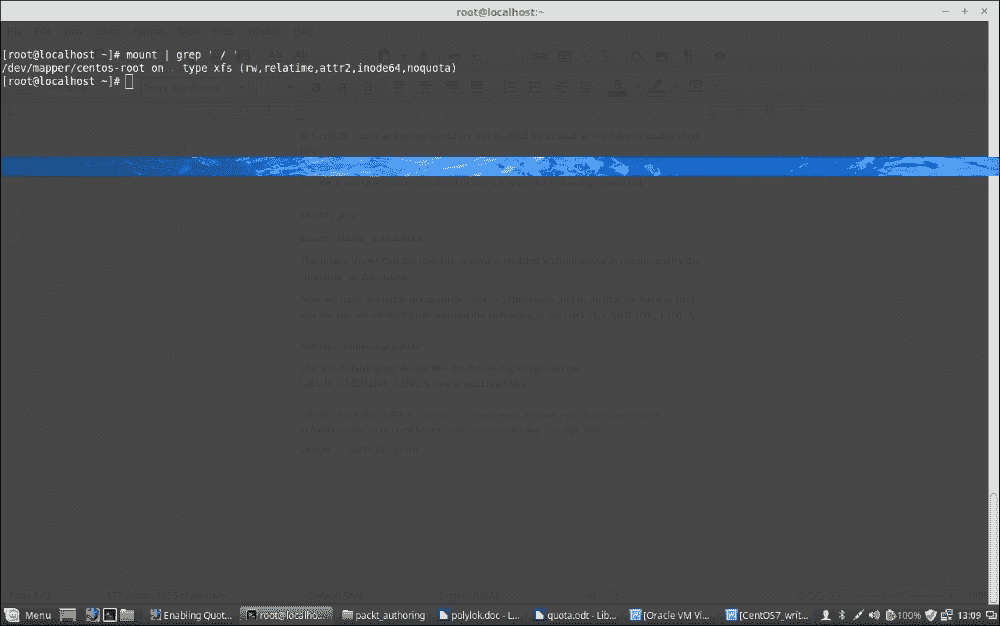

该图显示了根文件系统未启用配额，如输出中的`noquota`所述。

现在，我们必须在根（`/`）文件系统上启用配额，为此，我们必须首先编辑文件`/etc/default/grub`并将以下内容添加到`GRUB_CMDLINE_LINUX`中：

```
rootflags=usrquota,grpquota

```

在文件`GRUB_CMDLINE_LINUX`中应该读取如下：

```
GRUB_CMDLINE_LINUX="rd.lvm.lv=centos/swap vconsole.font=latarcyrheb-sun16 rd.lvm.lv=centos/root crashkernel=auto  vconsole.keymap=us rhgb quiet rootflags=usrquota,grpquota"

```

cat `/etc/default/grub`命令的输出应该如下屏幕截图所示：

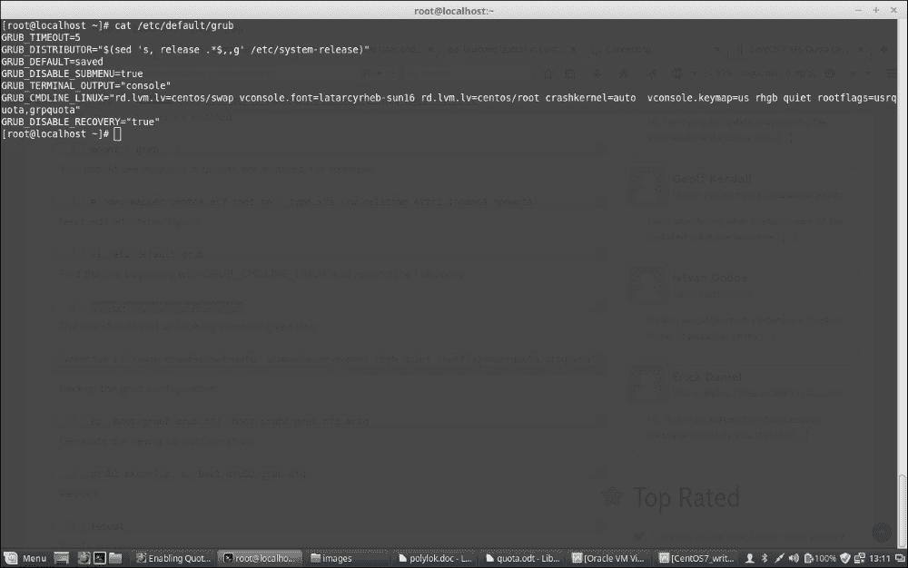

由于我们必须反映刚刚做出的更改，我们应该使用以下命令备份 grub 配置：

```
cp /boot/grub2/grub.cfg /boot/grub2/grub.cfg.original

```

现在，我们必须使用以下命令重新构建 grub 以应用刚刚做出的更改：

```
grub2-mkconfig -o /boot/grub2/grub.cfg

```

接下来，重新启动系统。一旦启动，登录并使用我们之前使用的命令验证配额是否已启用：

```
mount | grep ' / '

```

现在应该显示配额已启用，并将显示以下输出：

```
/dev/mapper/centos-root on / type xfs (rw,relatime,attr2,inode64,usrquota,grpquota)

```

在图像之前添加以下引导，并将 CIT 样式应用于**mount | grep ' / '**

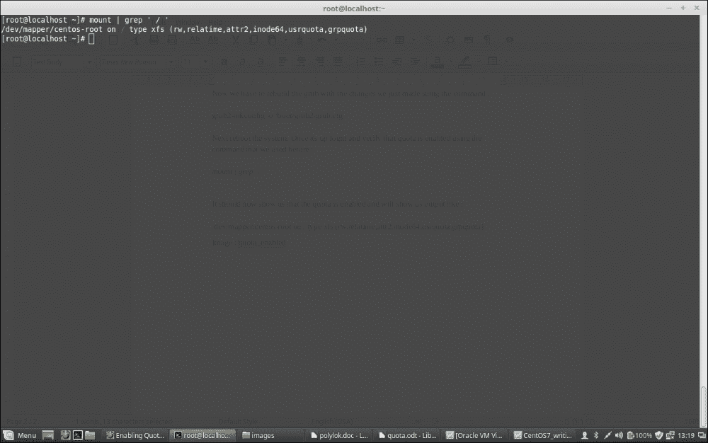

现在，由于配额已启用，我们将使用以下命令进一步安装配额，以便为不同用户和组操作配额等：

```
yum -y install quota

```

安装配额后，我们使用以下命令检查用户的当前配额：

```
repquota -as

```

上述命令将以人类可读的格式报告用户配额。

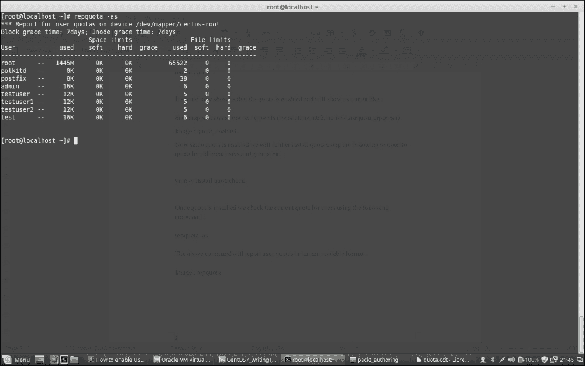

从上述屏幕截图中，我们可以限制用户和组的配额的两种方式；一种是为使用的磁盘空间设置软限制和硬限制，另一种是通过限制用户或组创建的文件数量来限制用户或组。在这两种情况下，都使用软限制和硬限制。软限制是在达到软限制时警告用户的东西，而硬限制是他们无法绕过的限制。

我们将使用以下命令修改用户配额：

```
edquota -u username

```

上述命令的输出应该如下屏幕截图所示：

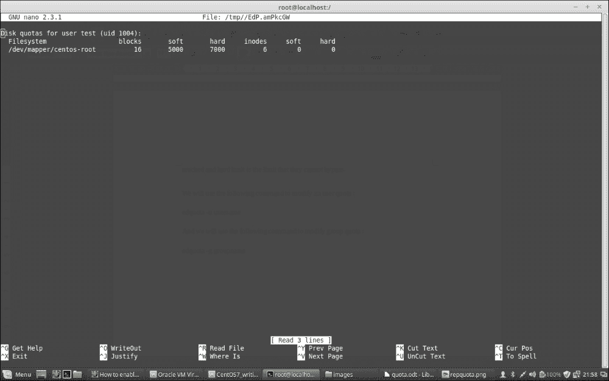

现在，我们将使用以下命令修改组配额：

```
edquota -g groupname

```

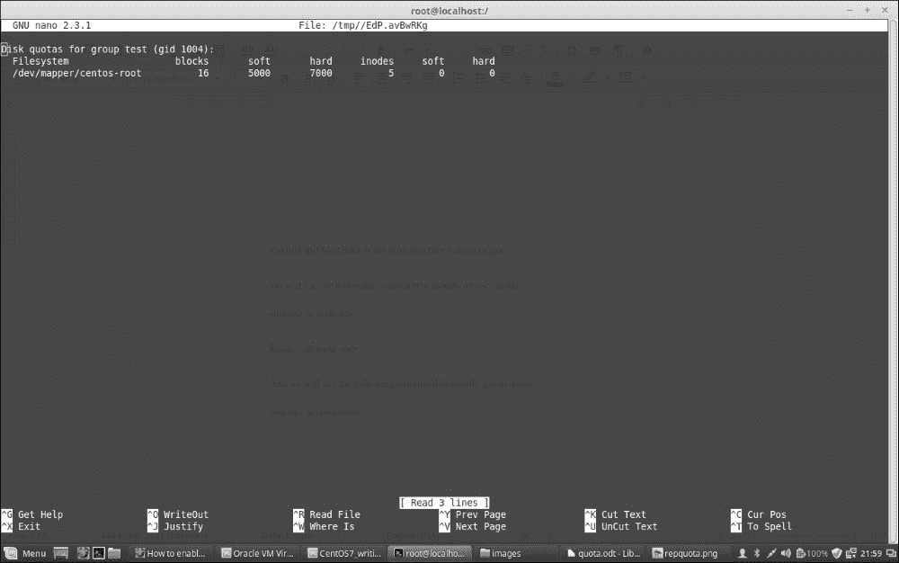

如果您有其他分区单独挂载，您必须修改`/etc/fstab`文件命令，通过在特定分区的默认值后添加`usrquota`和`grpquota`来启用文件系统的配额，如下面的屏幕截图所示，在那里我们已经为`/var`分区启用了配额：

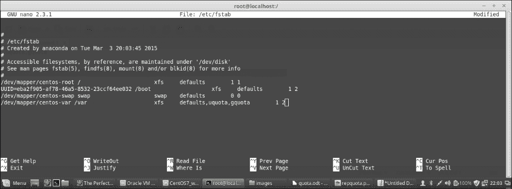

一旦您完成了启用配额，重新挂载文件系统并运行以下命令：

```
To remount /var :
mount -o remount /var
To enable quota :
quotacheck -avugm
quotaon -avug

```

配额是所有系统管理员用来处理用户或组在服务器上消耗的磁盘空间并限制空间过度使用的东西。因此，它有助于他们管理系统上的磁盘空间使用。在这方面，应该注意在安装之前进行规划并相应地创建分区，以便正确使用磁盘空间。通常建议使用多个单独的分区，如`/var`和`/home`等，因为这些通常是 Linux 系统上占用最多空间的分区。因此，如果我们将它们放在单独的分区上，它将不会占用根（`/`）文件系统空间，并且比仅使用根文件系统挂载更加安全。

# 密码过期

设置密码过期是一个很好的策略，这样用户被迫在一定的时间间隔内更改他们的密码。这反过来也有助于保持系统的安全性。

我们可以使用`chage`配置密码，在用户首次登录系统时过期。

### 注意

注意：如果用户使用 SSH 登录系统，则此过程将无法工作。

使用`chage`的这种方法将确保用户被强制立即更改密码。

### 提示

如果我们只使用`chage <username>`，它将显示指定用户的当前密码过期值，并允许交互式更改它们。

需要执行以下步骤来完成密码过期：

1.  锁定用户。如果用户不存在，我们将使用`useradd`命令创建用户。但是，我们不会为用户分配任何密码，以便保持锁定。但是，如果用户已经存在于系统中，我们将使用`usermod`命令锁定用户：

```
Usermod -L <username>

```

1.  使用以下命令强制立即更改密码：

```
chage -d 0 <username>

```

1.  解锁帐户。可以通过两种方式实现。一种是分配初始密码，另一种是分配空密码。我们将采用第一种方法，因为第二种方法虽然可能，但在安全方面不是一个好的做法。因此，我们要做的是分配初始密码：

+   使用 Python 命令启动命令行 Python 解释器：

```
import crypt; print
crypt.crypt("Q!W@E#R$","Bing0000/")

```

+   在这里，我们使用了带有字母数字字符的盐组合`Bing0000`后跟`/`字符的`Q!W@E#R$`密码。输出是加密密码，类似于`BiagqBsi6gl1o`。

+   按下*Ctrl* + *D*退出 Python 解释器。

1.  在 shell 中，输入以下命令以 Python 解释器的加密输出：

```
usermod -p "<encrypted-password>" <username>

```

因此，在我们的情况下，如果用户名是`testuser`，加密输出是`" BiagqBsi6gl1o"`，我们将执行：

```
usermod -p "BiagqBsi6gl1o" testuser

```

现在，使用`Q!W@E#R$`密码首次登录后，用户将被提示输入新密码。

## 设置密码策略

这是一组规则，定义在某些文件中，必须在设置系统用户时遵循。这是安全性的一个重要因素，因为许多安全漏洞历史始于黑客攻击用户密码。这就是为什么大多数组织为其用户设置密码策略的原因。所有用户和密码必须符合此策略。

密码策略通常由以下定义：

+   密码过期

+   密码长度

+   密码复杂性

+   限制登录失败

+   限制先前密码重用

## 配置密码过期和密码长度

密码过期和密码长度在`/etc/login.defs`中定义。过期基本上是指密码可以使用的最大天数，允许更改密码之间的最小天数，以及密码过期前的警告次数。长度是指创建密码所需的字符数。要配置密码过期和长度，我们应该编辑`/etc/login.defs`文件，并根据组织设置的不同`PASS`值。

### 注意

注意：此处定义的密码过期控件不会影响现有用户；它只影响新创建的用户。因此，我们必须在设置系统或服务器时设置这些策略。我们修改的值是：

+   `PASS_MAX_DAYS`：密码可以使用的最大天数

+   `PASS_MIN_DAYS`：允许更改密码之间的最小天数

+   `PASS_MIN_LEN`：最小可接受的密码长度

+   `PASS_WARN_AGE`：密码过期前要提前多少天的警告

让我们看一下`login.defs`文件的示例配置：

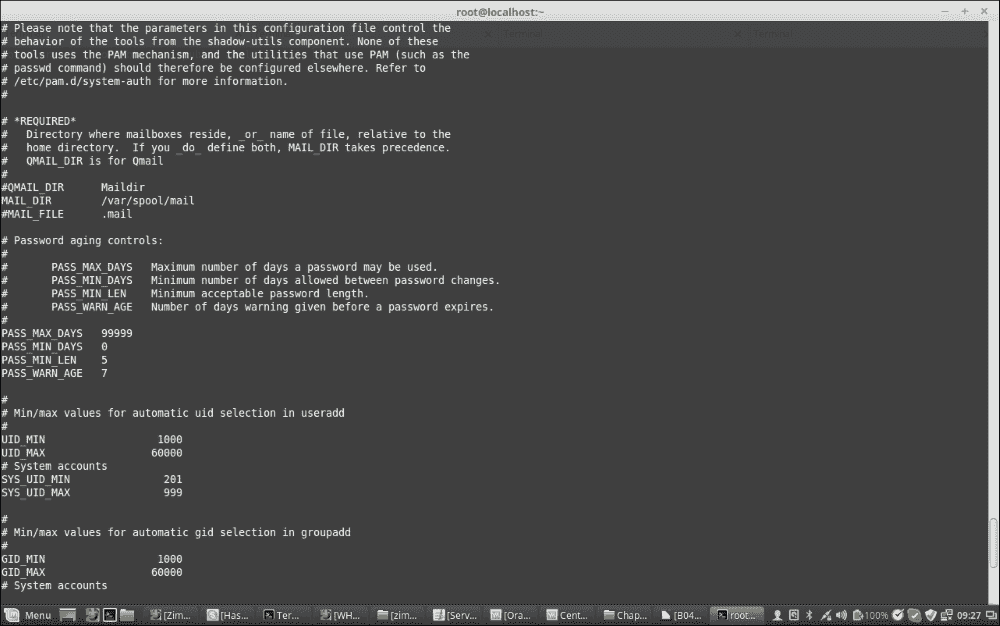

## 配置密码复杂性和限制重复使用的密码

通过编辑`/etc/pam.d/system-auth`文件，我们可以配置密码复杂性和要拒绝的重复使用密码的数量。密码复杂性是指密码中使用的字符的复杂性，而重复使用密码拒绝是指拒绝用户过去使用的密码的数量。通过设置复杂性，我们强制密码中使用所需数量的大写字符、小写字符、数字和符号。除非符合规则设置的复杂性，否则系统将拒绝密码。我们使用以下术语来实现这一点：

+   **强制密码中的大写字符**：`ucredit=-X`，其中`X`是密码中所需的大写字符数量。

+   **强制密码中的小写字符**：`lcredit=-X`，其中`X`是密码中所需的小写字符数量。

+   **强制密码中的数字**：`dcredit=-X`，其中`X`是密码中所需的数字数量。

+   **强制密码中使用符号**：`ocredit=-X`，其中`X`是密码中所需的符号数量。例如：

```
password requisite pam_cracklib.so try_first_pass retry=3 type= ucredit=-2 lcredit=-2 dcredit=-2 ocredit=-2

```

+   **拒绝重复使用的密码**：`remember=X`，其中`X`是要拒绝的过去密码的数量。例如：

```
password sufficient pam_unix.so sha512 shadow nullok try_first_pass use_authtok remember=5

```

现在让我们来看一下`/etc/pam.d/system-auth`的一个示例配置：

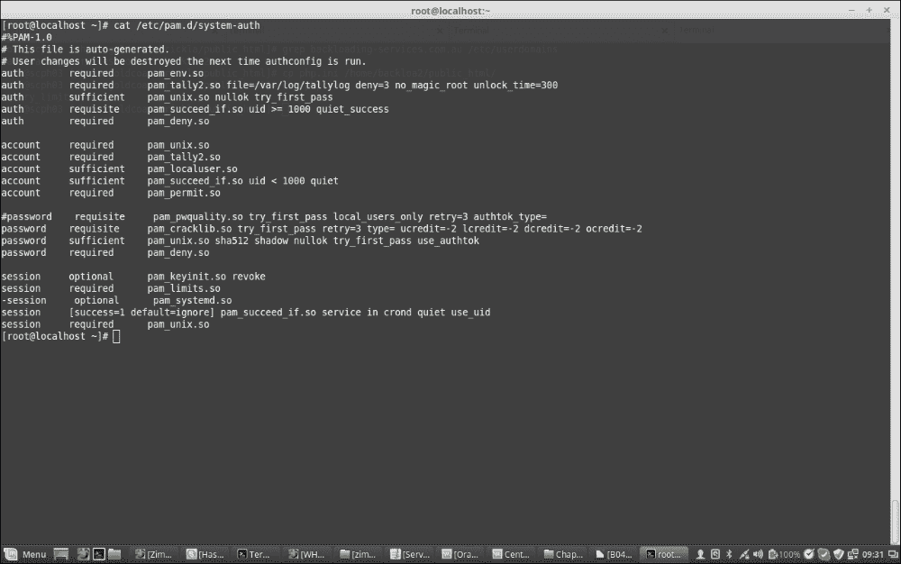

## 配置登录失败

我们在`/etc/pam.d/password-auth`、`/etc/pam.d/system-auth`和`/etc/pam.d/login`文件中设置了用户允许的登录失败次数。当用户的失败登录尝试次数高于此处定义的数字时，帐户将被锁定，只有系统管理员才能解锁帐户。要进行配置，请向文件添加以下内容。以下的`deny=X`参数配置了这一点，其中`X`是允许的失败登录尝试次数。

将这两行添加到`/etc/pam.d/password-auth`和`/etc/pam.d/system-auth`文件中，只将第一行添加到`/etc/pam.d/login`文件中：

```
auth        required    pam_tally2.so file=/var/log/tallylog deny=3 no_magic_root unlock_time=300
account     required    pam_tally2.so

```

以下是一个`/etc/pam.d/system-auth`文件的示例截图：


以下是一个`/etc/pam.d/login`文件的示例：

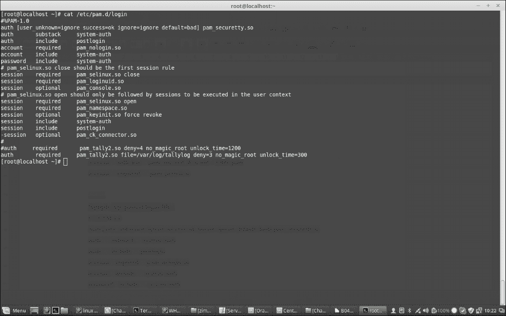

要查看失败，请使用以下命令：

```
pam_tally2 –user=<User Name>

```

要重置失败尝试并允许用户再次登录，请使用以下命令：

```
pam_tally2 –user=<User Name> --reset

```

# Sudoers

在 Linux 操作系统中，用户权限的分离是主要特点之一。普通用户在有限的权限会话中操作，以限制他们对整个系统的影响范围。Linux 上存在一个我们已经知道的特殊用户`root`，具有超级用户权限。此帐户没有任何适用于普通用户的限制。用户可以以多种不同的方式执行具有超级用户或 root 权限的命令。

主要有三种不同的方法可以在系统上获得 root 权限：

+   以`root`身份登录系统。

+   以任何用户身份登录系统，然后使用`su -`命令。这将要求您输入`root`密码，一旦验证，将为您提供 root shell 会话。我们可以使用*Ctrl* + *D*或使用`exit`命令断开此 root shell。退出后，我们将回到我们的普通用户 shell。

+   使用`sudo`以 root 权限运行命令，而不生成`root` shell 或以 root 身份登录。此`sudo`命令的工作方式如下：

```
sudo <command to execute>
```

与`su`不同，`sudo`将要求调用命令的用户密码，而不是 root 密码。

`sudo`默认情况下不起作用，需要在其正确运行之前进行设置。

在接下来的部分中，我们将看到如何配置`sudo`并修改`/etc/sudoers`文件，以使其按我们的意愿工作。

## visudo

`sudo`是使用`/etc/sudoers`文件进行修改或实现的，`visudo`是使我们能够编辑该文件的命令。

### 注意

注意：为了避免在更新文件时出现潜在的竞争条件，不应使用普通文本编辑器编辑此文件。应该使用`visudo`命令。

`visudo`命令通常会打开文本编辑器，然后在保存时验证文件的语法。这可以防止配置错误阻止`sudo`操作。

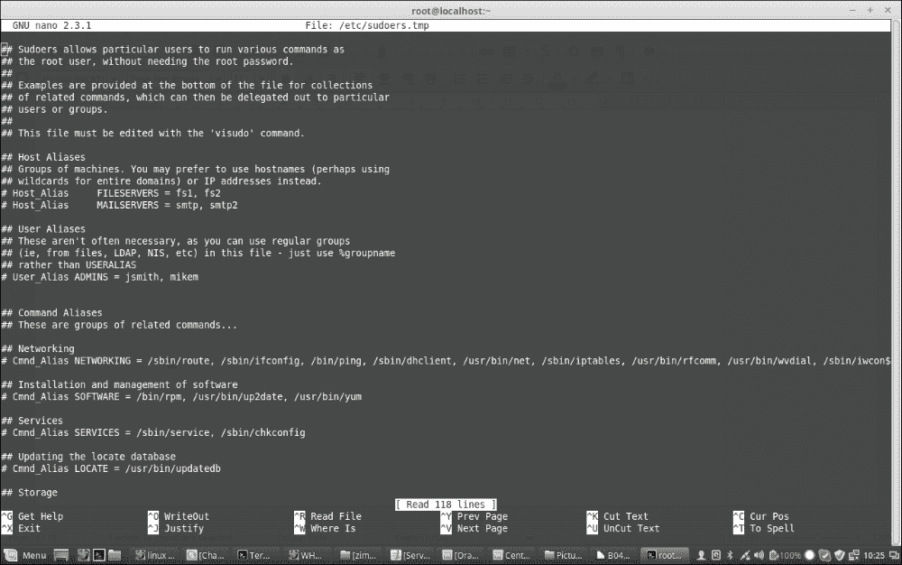

默认情况下，`visudo`会在 vi 编辑器中打开`/etc/sudoers`文件，但我们可以配置它使用`nano`文本编辑器。为此，我们必须确保`nano`已安装，或者我们可以使用以下命令安装`nano`：

```
yum install nano -y

```

现在，我们可以通过编辑`~/.bashrc`文件将其更改为使用`nano`：

```
export EDITOR=/usr/bin/nano

```

然后，使用以下命令源文件：

```
. ~/.bashrc

```

现在，我们可以使用`visudo`和`nano`编辑`/etc/sudoers`文件。所以，让我们用`visudo`打开`/etc/sudoers`文件并学习一些东西。

我们可以为不同的命令、软件、服务、用户、组等创建不同类型的别名。例如：

```
Cmnd_Alias NETWORKING = /sbin/route, /sbin/ifconfig, /bin/ping, /sbin/dhclient, /usr/bin/net, /sbin/iptables, /usr/bin/rfcomm, /usr/bin/wvdial, /sbin/iwconfig, /sbin/mii-tool
Cmnd_Alias SOFTWARE = /bin/rpm, /usr/bin/up2date, /usr/bin/yum
Cmnd_Alias SERVICES = /sbin/service, /sbin/chkconfig

```

我们可以使用这些别名为用户或组分配一组命令执行权限。例如，如果我们想要将`NETWORKING`命令集分配给`netadmin`组，我们将定义：

```
%netadmin ALL = NETWORKING

```

否则，如果我们想要允许`wheel`组的用户运行所有命令，我们将执行以下操作：

```
%wheel  ALL=(ALL)  ALL

```

如果我们想要特定用户`john`获得对所有命令的访问权限，我们将执行以下操作：

```
john  ALL=(ALL)  ALL

```

我们可以创建不同的用户组，其成员可能有重叠的权限。

```
User_Alias      GROUPONE = abby, brent, carl
User_Alias      GROUPTWO = brent, doris, eric,
User_Alias      GROUPTHREE = doris, felicia, grant

```

组名必须以大写字母开头。然后，我们可以允许`GROUPTWO`的成员更新`yum`数据库和前述软件分配的所有命令，通过创建如下规则：

```
GROUPTWO    ALL = SOFTWARE

```

如果我们不指定要运行的用户/组，`sudo`默认为 root 用户。

我们可以允许`GROUPTHREE`的成员关闭和重新启动机器，通过创建一个`命令别名`并在`GROUPTHREE`的规则中使用它：

```
Cmnd_Alias      POWER = /sbin/shutdown, /sbin/halt, /sbin/reboot, /sbin/restart
GROUPTHREE  ALL = POWER

```

我们创建了一个名为`POWER`的命令别名，其中包含关闭电源和重新启动机器的命令。然后，我们允许`GROUPTHREE`的成员执行这些命令。

我们还可以创建`Runas`别名，它可以替换规则的部分，指定用户以其身份执行命令：

```
Runas_Alias     WEB = www-data, apache
GROUPONE    ALL = (WEB) ALL

```

这将允许`GROUPONE`的任何成员以`www-data`用户或`apache`用户的身份执行命令。

请记住，稍后的规则将覆盖先前的规则，当两者之间存在冲突时。

有许多方法可以更好地控制`sudo`如何处理命令。以下是一些例子：

与`mlocate`软件包相关联的`updatedb`命令相对无害。如果我们希望允许用户以 root 权限执行它而无需输入密码，我们可以制定如下规则：

```
GROUPONE    ALL = NOPASSWD: /usr/bin/updatedb

```

`NOPASSWD`是一个标签，表示不会请求密码。它有一个伴随命令叫做`PASSWD`，这是默认行为。标签对于规则的其余部分是相关的，除非在后面被其`双胞胎`标签覆盖。

例如，我们可以有如下行：

```
GROUPTWO    ALL = NOPASSWD: /usr/bin/updatedb, PASSWD: /bin/kill 

```

在这种情况下，用户可以作为 root 用户运行`updatedb`命令而无需密码，但运行`kill`命令将需要输入 root 密码。另一个有用的标签是`NOEXEC`，它可以用于防止某些程序中的一些危险行为。

例如，一些程序，如`less`，可以通过在其界面内输入以下内容来生成其他命令：

```
!command_to_run

```

这基本上会以`less`正在运行的相同权限执行用户给出的任何命令，这可能非常危险。

为了限制这一点，我们可以使用以下行：

```
username    ALL = NOEXEC: /usr/bin/less

```

现在你应该清楚了`sudo`是什么，以及我们如何使用`visudo`修改和提供访问权限。这里还有很多事情。你可以使用`visudo`命令检查默认的`/etc/sudoers`文件，其中包含很多示例，或者你也可以阅读`sudoers`手册。

要记住的一点是，常规用户通常不会被赋予 root 权限。当您以 root 权限执行这些命令时，了解这些命令的作用非常重要。不要轻视这份责任。学习如何最好地为您的用例使用这些工具，并锁定任何不需要的功能。

# 参考

现在，让我们来看一下本章中使用的主要参考资料：

[`access.redhat.com/documentation/en-US/Red_Hat_Enterprise_Linux/7/html/System_Administrators_Guide/index.html`](https://access.redhat.com/documentation/en-US/Red_Hat_Enterprise_Linux/7/html/System_Administrators_Guide/index.html)

# 摘要

在本章中，您了解了一些高级用户管理知识，以及如何通过命令行管理用户，包括密码过期、配额、暴露给 `/etc/sudoers`，以及如何使用 `visudo` 修改它们。用户和密码管理是系统管理员在服务器上经常执行的任务，它在系统的整体安全中起着非常重要的作用。

在下一章中，我们将研究称为**安全增强型 Linux**（**SELinux**）的高级安全功能，它与 CentOS 或 RedHat Linux 操作系统集成在一起。
