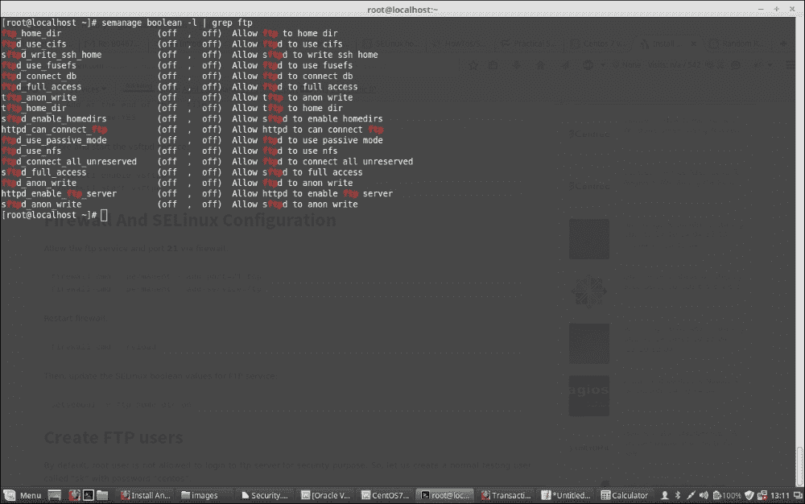

# 第二章：安全

在本章中，我们将找到不同的工具和实用程序，可以用来保护我们正在使用的 CentOS 系统。安全是系统或服务器最重要的部分，因此，系统管理员的工作始终是保持系统最新和安全，以防止服务器上定期发生的各种攻击。

我们将从 SELinux 到其他安全工具和措施开始讨论这里的几个工具，并逐一深入了解它们。

在本章中，我们将研究：

+   SELinux 及其工具

+   安装 SELinux

+   域转换

+   SELinux 用户

+   SELinux 审计日志和故障排除

# 介绍 SELinux

**安全增强型 Linux**（**SELinux**）是一组内核修改和用户空间工具，已经在 CentOS 中存在了相当长的时间。它是一种支持强制访问控制安全策略的机制，最初由美国国家安全局开发，后来在公共领域发布，以保护计算机系统免受恶意侵入和篡改。

并不是很多系统管理员使用 SELinux。通常，人们不愿意学习 SELinux，而是直接禁用它。然而，一个正确配置的 SELinux 系统可以在很大程度上减少安全风险。

SELinux 实现**强制访问控制**（**MAC**），它建立在 CentOS 7 上已有的**自主访问控制**（**DAC**）之上。 DAC 是我们在 Linux 系统上拥有的传统安全模型，其中有三个实体：用户、组和其他人可以对文件和目录拥有读、写和执行权限的组合。默认情况下，如果用户在他的主目录中创建任何文件，用户和他的组将具有读取访问权限，用户将具有写访问权限，但其他实体也可能具有读取访问权限。

拥有文件的用户可以更改此访问策略，并授予或撤销文件的访问权限以及所有权。这可能会使关键文件暴露给不需要访问这些文件的帐户，从而对正在运行的系统构成安全威胁。它将每个进程限制在自己的域中，并确保它只能与一种定义的文件和进程类型进行交互，从而保护系统免受黑客通过劫持脚本或进程并通过它获得系统范围控制的威胁。

要检查系统上安装了哪些 SELinux 软件包，请运行以下命令：

```
rpm -qa | grep selinux

```

该命令将显示以下输出：


## 安装 SELinux

使用以下命令安装所有软件包；这将安装系统上剩余的软件包并更新已安装的软件包：

```
yum install policycoreutils policycoreutils-python selinux-policy selinux-policy-targeted libselinux-utils setroubleshoot-server setools setools-console mcstrans

```

现在，我们将在系统上安装 SELinux 所需的所有软件包。让我们在系统上安装另外两个服务 apache（`httpd`）用于 Web 服务器和 FTP（`vsftpd`）服务器，以便我们可以测试它们的 SELinux：

```
yum install httpd vsftpd

```

现在使用以下命令运行 apache 服务：

```
systemctl start httpd
service httpd start

```

使用以下命令之一检查 httpd 的状态：

```
service status httpd
systemctl status httpd

```

这些命令将显示它正在运行，如下面的截图所示：


还可以使用以下命令之一启动 vsftpd，然后以相同的方式检查`vsftp`的状态：

```
systemctl start vsftpd
service vsftpd start

```

使用以下命令之一检查 ftpd 的状态：

```
service status ftpd
systemctl status ftpd

```


## SELinux 模式

有三种类型的 SELinux 模式，它们如下：

+   **强制执行**：在此模式下，SELinux 强制执行其策略到系统，并确保未经授权的用户或进程的所有访问都被拒绝。这些访问拒绝事件也会记录在系统中，我们稍后将在本章中进行讨论。

+   **宽容**：这类似于半启用模式状态，其中 SELinux 不会拒绝任何访问，因为策略处于宽容模式。这是测试 SELinux 策略的最佳模式。

+   **禁用**：在此模式下，SELinux 处于完全禁用状态，不会创建日志或拒绝权限。

我们可以运行以下命令来获取当前的 SELinux 状态：

```
getenforce
sestatus

```

当系统启用 SELinux 时，前述命令的输出显示在以下图像中：


主要的 SELinux 配置文件是`/etc/selinux/config`。我们现在将通过在该文件中设置`SELINUX=permissive`来启用 SELinux，然后保存并重新启动系统。


`config`文件中的`SELINUXTYPE`参数也有三个选项，如下所示：

+   **Targeted**：这是允许您自定义和微调策略的默认值。

+   **最小**：在此模式下，只有选定的进程受到保护。

+   **MLS**：多级安全是一种高级的保护模式，您需要安装额外的软件包。

我们将保持`SELINUXTYPE`为默认值（即，targeted）。

第一次运行时，有必要将 SELinux 设置为宽容模式，因为需要为系统上的所有文件打标签。否则，在受限域下运行的进程可能会失败，因为它们无法访问具有正确上下文的文件。

一旦我们设置并重新启动系统，它将为所有文件打标签，这将根据具有 SELinux 上下文的系统而需花费一些时间。由于它处于宽容模式，只会报告失败和访问拒绝。

一旦系统启动，我们必须使用以下命令检查是否有任何错误：

```
grep 'SELinux' /var/log/messages

```

如果 SELinux 以宽容模式运行，将显示以下输出：

```
May 25 01:54:46 localhost kernel: SELinux:  Disabled at runtime.
May 25 03:06:40 localhost kernel: SELinux:  Initializing.
May 25 03:06:58 localhost systemd[1]: Successfully loaded SELinux policy in 2.863609s.
May 27 06:31:39 localhost kernel: SELinux:  Initializing.
May 27 06:31:55 localhost systemd[1]: Successfully loaded SELinux policy in 1.944267s.

```

现在，由于所有规则都已加载并且文件已被标记，我们必须启用 SELinux 强制模式，而不是宽容模式。因此，再次编辑`SELinux 配置`文件，并将以下内容设置为强制：

```
SELINUX=enforcing

```


现在再次重新启动服务器。

一旦系统恢复，使用`sestatus`命令检查 SELinux 状态，它将显示类似以下内容的输出：


现在，如果在`/var/log/messages`中使用`grep`查找 SELinux，将找到以下内容：

```
May 27 11:18:21 localhost kernel: SELinux: Initializing.
May 27 11:18:34 localhost systemd[1]: Successfully loaded SELinux policy in 715.664ms.

```

要检查 SELinux 强制状态，请运行`getenforce`命令，它将显示状态为`enforcing`。

`sestatus`命令将显示有关操作中的 SELinux 配置的更多详细信息，如下所示：


如果我们想在运行 SELinux 时临时更改 SELinux 模式，可以使用`setenforce`命令，如下所示：

```
setenforce permissive

```

现在，`sestatus`将显示以下屏幕：


使用以下命令切换回强制模式：

```
setenforce enforcing

```

## SELinux 策略

你一定已经注意到了之前在`/var/log/messages`中的 SELinux 输出是基于策略的。策略意味着一组规则，定义了与以下内容的关系、安全性和访问权限：

+   **用户**：所有常规 Linux 用户都由一个或多个 SELinux 用户定义。但请注意，SELinux 用户与 Linux 用户不同。还要注意，运行的进程或程序在 SELinux 中被定义为主题。

+   **角色**：它们类似于定义哪个用户可以访问进程等的过滤器。它就像用户和进程之间的网关。只有在角色授予访问权限并且用户有权访问角色时，用户才能运行特定进程。SELinux 基于**基于角色的访问控制**（**RBAC**）。

+   **主题**和**对象**：主题类似于进程或程序，对象是可以被操作的任何东西；如文件、端口、目录等。主题对对象执行的操作取决于主题的权限。

+   **域**：这类似于主体（进程）的包装器，告诉进程它可以或不能做什么。例如，域将定义进程可以访问的目录、文件夹、文件、端口等。域与 SELinux 中的主体相关。

+   **类型**：文件的上下文称为其类型。例如，文件的上下文描述了它是否仅对本地 Web 服务器进程可访问，或者对任何其他目录中的任何进程可访问，比如`/`等等，或者文件的特定 SELinux 用户是文件的所有者。类型与 SELinux 中的对象相关。

在 SELinux 中，策略定义了用户访问角色的规则，角色访问域的规则，以及域访问类型的规则。

SELinux 中由`/etc/selinux/config`文件中的`SELINUXTYPE`定义的三种访问控制形式：

+   **类型强制**（**TE**）：这是定向策略中使用的访问控制的主要机制

+   **基于角色的访问控制**（**RBAC**）：这是基于 SELinux 用户（不一定与 Linux 用户相同）的，但在默认的定向策略中不使用。

+   **多级安全**（**MLS**）：这不常用，通常在默认的定向策略中隐藏。

定向策略是 SELinux 中默认使用的策略，我们将在此基础上继续讨论。

还要记住，SELinux 不会取代 Linux 系统中的传统 DAC 策略。相反，如果 DAC 策略禁止文件访问，SELinux 策略将不会被评估，并且不会授予文件访问权限，即使 SELinux 允许。

SELinux 策略以模块化格式加载到内存中，并可以使用以下命令查看：

```
semodule -l | more

```


`semodule`命令可用于安装、删除、重新加载、升级、启用和禁用 SELinux 策略模块。

模块文件位于`/etc/selinux/targeted/modules/active/modules/`目录中，具有`.pp`扩展名，不是人类可读的。但是，如果你仔细查看它们，你肯定会发现它们实际上与 Linux 中的不同应用程序相关。


这些策略模块被合并为一个活动策略，然后加载到内存中。这个合并的二进制策略可以在`/etc/selinux/targeted/policy/`目录中找到：


我们不能直接修改这些规则，但可以使用`semanage boolean`命令来管理它们。`semanage boolean -l | less`命令的输出将显示给我们这些信息。


在前面输出的第二行清楚地表明，FTP 服务访问用户主目录目前已关闭。我们还可以使用以下命令管道查看`ftpd`服务策略的状态：

```
semanage boolean -l | grep ftpd

```



现在，为了允许 FTP 用户访问他们的主目录并允许读写访问，我们必须发出以下命令。首先使用以下命令检查`ftp_home_dir`策略的状态：

```
getsebool ftp_home_dir

```

这将显示以下输出：

```
ftp_home_dir --> off

```

现在，使用`setsebool -P`永久启用对用户主目录的访问：

```
setsebool -P ftp_home_dir on

```

现在，再次检查状态：

```
getsebool ftp_home_dir

```

这将显示以下输出：

```
ftp_home_dir --> on

```

现在，用户将被允许通过 FTP 访问其主目录；防火墙中允许 FTP 协议。

## SELinux 文件和进程

到目前为止，我们已经了解了 SELinux 的基础知识，以及如何允许`vsftpd`等服务允许用户从 ftp 访问其文件。让我们深入了解文件的上下文以及它们在 SELinux 中的定义。在 SELinux 中，上下文是与安全相关的信息集合，它帮助 SELinux 确定访问控制策略。在 Linux 中，一切都可以有安全上下文，如文件、目录、服务或端口，但是安全上下文对不同的对象意味着不同类型的事物。

我们可以使用`ls –Z`参数显示任何文件的 SELinux 文件上下文，如下所示：

```
ls -laZ /home/test/*

```


在前面的输出中，这部分是特定文件的 SELinux 上下文：

```
system_u:object_r:user_home_t:s0

```

有四个部分，每个部分由冒号（`:`）分隔。第一部分是 SELinux 用户上下文，在这里显示为`system_u`。正如您已经知道的，每个 Linux 系统用户都映射到一个 SELinux 用户，这里是`system_u`。

第二部分是 SELinux 角色，在这里是`object_r`。

这里最重要的部分是第三部分，即`user_home_t`。这是定义文件类型的部分，从中我们可以理解它属于用户的主目录。

第四部分（s0）实际上解释了文件的敏感性，它实际上与多级安全性一起工作。前三部分更重要，所以我们只会处理它们。

现在，让我们使用之前安装的`httpd`文件查看 SELinux 进程上下文。首先使用以下命令启动`httpd`进程：

```
systemctl httpd start

```

现在让我们运行带有额外`-Z`标志的`ps`命令来查看进程上下文：

```
ps -efZ | grep httpd

```


前面输出中的安全上下文如下：

```
system_u:system_r:httpd_t:s0

```

在 SELinux 中，用户后缀为`_u`，角色后缀为`_r`，类型后缀为`_t`。

对于像`httpd`这样的进程，它需要访问其文件并执行操作。我们已经看到每个进程只能访问特定类型（文件、目录、端口等）。

SELinux 在策略中定义了这些访问规则。这些访问规则遵循标准的`allow`语句，如下所示：

```
allow <domain> <type>:<class> { <permissions> };

```

通用的`allow`语句表示：

+   进程是否属于某个域

+   进程正在尝试访问的资源对象是某个类和类型

+   它是否允许访问或拒绝访问

让我们看看这如何与我们已经查看过的 https 进程的安全上下文相结合。

文档根目录或`httpd`的默认目录是`/var/www/html`。现在，让我们在那里创建一个文件并检查其安全上下文：

```
touch /var/www/html/index.html
ls -Z /var/www/html/*

```


我们创建的`index.html`文件的文件上下文显示为`httpd_sys_content_t`。

我们将以以下方式使用`sesearch`命令来检查`httpd`守护程序允许的访问类型：

```
sesearch --allow --source httpd_t --target httpd_sys_content_t --class file

```


在前面的命令中使用的标志很容易理解；源域是`httpd_t`，这是 apache 正在其中运行的域。我们想列出目标资源，这些资源是文件，并且具有类型上下文`httpd_sys_content_t`。

请注意前面截图中上下文输出的第一行是：

```
allow httpd_t httpd_sys_content_t : file { ioctl read getattr lock open } ;

```

现在，如果您将其与之前的通用 allow 语句联系起来，我们将清楚地了解到`httpd`服务对`httpd_sys_content_t`类型的文件具有 I/O 控制、读取、获取属性、锁定和打开访问权限。而且，在我们的情况下，我们创建的`index.html`文件也是相同类型的，这意味着`httpd`服务将可以访问这个`index.html`文件。

让我们创建一个测试网页，修改`index.html`文件，以便我们可以从浏览器中检查其输出。使用您喜欢的编辑器将以下行添加到`index.html`文件中，并保存：

```
<html>
    <title>
  Test page
    </title>
    <body>
  <h1>This is a test page</h1>
    </body>
</html>
```

我们将使用以下命令更改`/var/www`文件夹的权限，然后使用`httpd restart`：

```
chmod -R 755 /var/wwwsystemctl restart httpd

```

如果您是第一次这样做，可能需要在防火墙中允许 http 端口，使用以下命令：

```
firewall-cmd --permanent --add-port=80/tcp
firewall-cmd --permanent --add-service=http
firewall-cmd –reload

```

现在尝试从浏览器中访问它。它将显示以下截图中的输出：


现在，让我们看看如果我们更改`index.html`文件的类型上下文，我们是否仍然能够访问它。我们将使用`chcon`命令更改类型上下文，并将使用`-type`标志进行此操作，如下所示：

```
chcon --type var_t /var/www/html/index.html

```

如果我们使用`ls -Z`检查文件的上下文，它会显示：

```
-rwxr-xr-x. root root unconfined_u:object_r:var_t:s0   /var/www/html/index.html

```

在这里可以看到类型已更改为`var_t`。

现在，如果您再次尝试访问网页，它将显示错误，或者您可能会看到一个默认页面，但不是我们之前看到的同一个页面。这是因为我们已经更改了`index.html`文件的类型上下文。

要恢复它，我们将使用以下命令：

```
restorecon -v /var/www/html/index.html

```

现在，如果我们再次访问该站点，我们将看到它再次像以前一样工作。

SELinux 强制执行模式保证，除非策略另有规定，否则进程和文件将以与其父级相同的上下文创建。这意味着如果进程 A 生成进程 B，生成的进程 B 将在与进程 A 相同的域中运行，除非 SELinux 策略另有规定，同样，如果我们有一个带有一些`context_t`类型的目录，除非另有规定，其下的文件或目录将继承相同的`context_t`类型。

在 CentOS 7 中，系统中存在的所有文件的上下文都列在`/etc/selinux/targeted/contexts/files/file_contexts`文件中，新目录和文件的上下文记录在`/etc/selinux/targeted/contexts/files/file_contexts.local`文件中。由于`chcon`用于临时更改上下文，`restorecon`用于恢复上下文，`restorecon`实际上会查看此文件以恢复文件的原始上下文。

让我们创建`/www/html`：

```
mkdir -p /www/html

```

现在，我们使用以下命令将`/var/www/html`的内容复制到`/www/html`：

```
cp /var/www/html/index.html /www/html/

```

如果我们检查文件的上下文，我们会发现它与`/var/www/html/index.html`及其`default_t`的上下文不同，因为那是其父目录的上下文。

此外，即使我们将`httpd`配置文件更改为从这个新位置打开`index.html`文件，我们仍然会遇到错误，因为上下文还不正确。在从`/var/www/html`复制`index.html`文件到`/www/html`时，它继承了其父目录的上下文，即`default_t`。

为了解决这个问题，我们将不得不更改它的上下文。

要永久更改之前在`/www/html`下创建的`index.html`文件的上下文，我们将遵循两个步骤：

```
semanage fcontext --add --type httpd_sys_content_t "/www(/.*)?"
semanage fcontext --add --type httpd_sys_content_t "/www/html(/.*)?"

```

现在，我们从`/etc/selinux/targeted/contexts/files/file_contexts.local`文件检查上下文数据库：


现在，我们将运行`restorecon`命令，将文件或目录重新标记为前一步记录的内容：

```
restorecon -Rv /www

```

这将在三个级别上起作用；首先它将重新标记`/www`目录，然后是`/www/html`目录，最后是`/www/html/index.html`文件。


现在，如果我们尝试访问网页，它应该可以正常工作。

还有一个名为`matchpathcon`的命令，非常方便用于解决与上下文相关的问题。它可以将当前资源的上下文与 SELinux 上下文数据库中的内容进行比较并报告回来。如果匹配不同，它会建议所需的更改。我们可以使用以下方式使用`-V`标志为`/www/html/index.html`运行该命令：

```
matchpathcon -V /www/html/index.html

```

# 域转换

现在，让我们找出一个进程如何访问其他进程。

假设`vsftpd`进程正在运行；如果它没有启动，我们可以使用以下命令启动它：

```
systemctl start vsftpd

```

`vsftpd`进程是由`systemd`进程启动的；这是`Sys V init`进程的替代品，并在`init_t`的上下文中运行：

```
ps -eZ | grep init

```


在`init_t`域下运行的`systemd`进程的生命周期非常短暂；它调用`/usr/sbin/vsftpd`，其类型上下文为`ftpd_exec_t`，当这个二进制可执行文件启动时，它就成为`vsftpd`服务本身，并在`ftpd_t`域中运行。


因此，这里的`systemd`进程在`init_t`域下执行一个具有`ftpd_exec_t`类型的二进制文件。然后二进制文件在`ftpd_t`域内启动一个服务。

域转换遵循三个严格的规则：

+   源域的父进程必须有权限在两个域之间执行应用程序

+   该应用程序的文件上下文必须被识别为目标域的入口点

+   原始域必须被允许转换到目标域

让我们运行`sesearch`命令来检查`vsftpd`服务是否遵循这些规则：

1.  首先，源域`init_t`必须有权限在`ftpd_exec_t`上下文中执行应用程序。所以我们运行：

```
sesearch -s init_t -t ftpd_exec_t -c file -p execute -Ad

```

我们找到了以下输出：

```
allow init_t ftpd_exec_t : file { read getattr execute open } ;

```

因此，`init_t`可以读取、获取属性、执行和打开`ftpd_exec_t`上下文的文件。


1.  接下来，我们检查二进制文件是否是目标域`ftpd_t`的入口点：

```
sesearch -s ftpd_t -t ftpd_exec_t -c file -p entrypoint -Ad

```

我们发现它是：

```
allow ftpd_t ftpd_exec_t : file { ioctl read getattr lock execute execute_no_trans entrypoint open } ;

```


1.  最后，源域`init_t`需要有权限转换到目标`ftpd_t`域：

```
sesearch -s init_t -t ftpd_t -c process -p transition –Ad

```

我们可以看到源域也有这个权限：

```
allow init_t ftpd_t : process transition ;

```


SELinux 还支持在未受限制的域下运行的进程；例如，`unconfined_t`。这是已登录用户默认运行其进程的域。

# SELinux 用户

如前所述，SELinux 用户与普通 Linux 用户不同。SELinux 用户在引导时加载到内存中的策略中定义，而且这些用户很少。

在启用 SELinux 之后，每个常规用户帐户都映射到一个 SELinux 用户帐户。可以将多个用户帐户映射到同一个 SELinux 用户。这使得普通用户帐户能够继承其 SELinux 对应帐户的权限。

要查看映射，我们将运行以下命令：

```
semanage login -l

```


在这里，我们会发现在前面的屏幕截图中只有三个登录名，代表 Linux 用户帐户。任何 Linux 用户都映射到此处显示的`__default__`。根用户没有映射到默认值，而是有自己的条目，正在运行的进程或服务有`system_u`。第二列表示它们映射到的 SELinux 用户。普通用户帐户和根用户映射到`unconfined_u`，而进程和服务映射到`system_u` SELinux 用户。暂时忽略第三列，它显示用户的**多级安全**（**MLS**）**多类别安全**（MCS）类，以及最后一列（服务）。

要查看系统中可用的 SELinux 用户，使用`semanage`用户命令如下：

```
semanage user -l

```


在前面的屏幕截图中，表格显示了系统中可用的 SELinux 用户以及他们可以访问的角色。我们已经讨论过 SELinux 角色就像用户和进程之间的网关。我们还将它们比作过滤器，用户可以进入一个角色，前提是该角色授予了权限。如果一个角色被授权访问一个进程域，与该角色相关联的用户将能够进入该进程域。

现在，以根用户身份运行`id -Z`命令。它将显示根用户的 SELinux 安全上下文：


因此，根用户映射到`unconfined_t` SELinux 用户，该用户被授权`unconfined_r`角色，该角色又被授权在`unconfined_t`域中运行进程。

我们已经看到系统中有几个 SELinux 用户可用。让我们在这里讨论其中一些：

+   `guest_u`：这种类型的用户无法访问 X Windows 系统或网络，也无法执行`su`或`sudo`命令

+   `xguest_u`：这种类型的用户只能通过浏览器访问 GUI 和网络

+   `user_u`：这种类型的用户可以访问 GUI 和网络，但不能运行`su`或`sudo`

+   `staff_u`：与`user_u`相同，只是他们可以运行`sudo`。

+   `system_u`：这是为系统服务而设计的，不与常规用户帐户映射

# 限制对 su 或 sudo 的访问

我们可以通过更改用户的 SELinux 用户映射来限制用户运行`su`或`sudo`命令，如下所示：

```
semanage login -a -s user_u test

```

上述命令将更改 Linux `test`用户的映射为`user_u`，并且不允许`su`或`sudo`命令的访问。

### 注意

这只有在用户未登录时才会生效。

## 限制运行脚本的权限

要限制 Linux `test`用户运行脚本的能力，我们必须做两件事。首先，我们将用户的映射更改为`guest_u`，与之前的操作方式相同：

```
semanage login -a -s guest_u test

```

默认情况下，SELinux 允许映射到`guest_t`的用户从其主目录执行脚本。我们可以使用以下命令确认相同的情况：

```
getsebool allow_guest_exec_content

```

它将显示`guest_exec_content`已启用。因此，第二步是我们使用以下命令禁用`guest_exec_content`：

```
setsebool allow_guest_exec_content off

```

现在，我们更改了映射的测试用户将无法执行任何脚本，即使他对自己的主目录和在那里创建的文件有完全访问权限。

如果我们使用 grep 查看 SELinux 正在阻止`/var/log/messages`，它将向我们显示访问拒绝以及警报 ID。我们可以记录警报 ID 并运行：

```
sealert -l <alert id>

```

它将向我们显示有关访问拒绝的详细信息以及一些建议来删除它。

## 限制对服务的访问

假设我们有一个名为 admin 的用户，具有`sudo`访问权限，因此可以使用`sudo`运行命令来启动和停止`httpd`等服务。现在，即使用户具有`sudo`访问权限，我们也可以通过将其用户映射更改为`user_u`来阻止他管理对服务的访问，与之前的操作方式相同：

```
semanage login -a -s user_u admin

```

这将限制用户 admin 重新启动或停止服务。

我们可以通过以 root 身份运行`seinfo`命令来验证`user_u`的访问信息：

```
seinfo -uuser_u -x

```


此输出显示`user_u`可以访问的角色；它们是`object_r`和`user_r`。

让我们再进一步，并运行相同的命令来查找`user_r`角色被授权进入哪些域：

```
seinfo -ruser_r -x

```


角色可以进入的域有一个很长的列表。现在，让我们通过使用 grep 过滤输出来找出角色是否可以进入域`httpd_t`：

```
seinfo -ruser_r -x | grep httpd_t

```

这将返回空，这意味着`user_r`角色未被授权进入`httpd_t`域，因此无法启动`httpd`进程或守护程序。

# SELinux 审计日志

在 CentOS 7 中，我们应该查看两个与 SELinux 相关的错误和警报文件；它们如下：

+   /var/log/audit/audit.log

+   /var/log/messages

# SELinux 故障排除

SELinux 配备了一些非常有用的工具，用于检查错误和故障排除。我们已经看到其中一个，`sealert -l <alert id>`，我们通过查看`/var/log/messages`来收集警报 ID。还有另一个命令叫做`ausearch`，如果`auditd`服务正在运行，它也非常有助于检查错误，如下所示：

```
ausearch -m avc -c httpd

```

# 总结

在本章中，我们研究了 SELinux 的各个方面以及如何配置它；我们还演示了如何根据我们的需求使用它。然而，要小心，永远不要在生产系统上测试 SELinux。最好使用生产副本并首先在那里测试所有内容。当系统正确配置时，SELinux 设施将增强系统的安全性，但最好在需要严格安全控制时使用，并且只有在小心部署时才使用。

在下一章中，我们将看看 Linux 如何用于各种目的。
