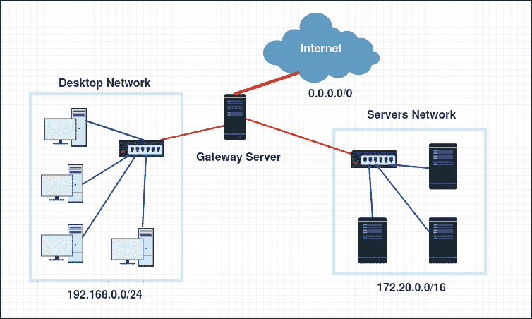
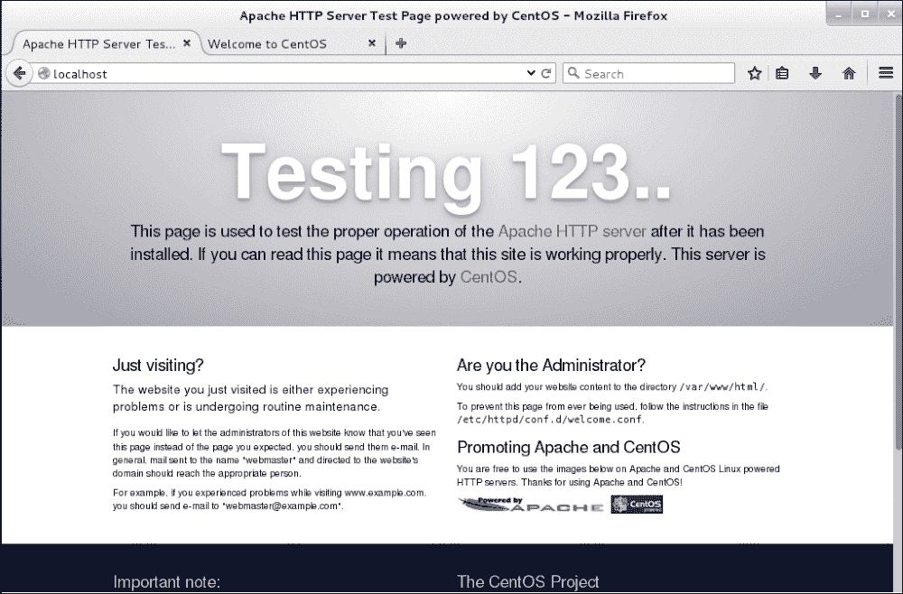
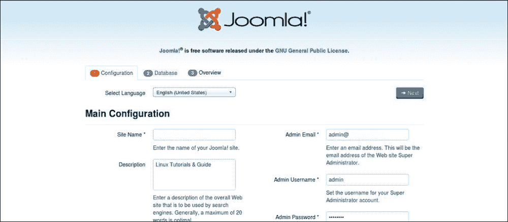
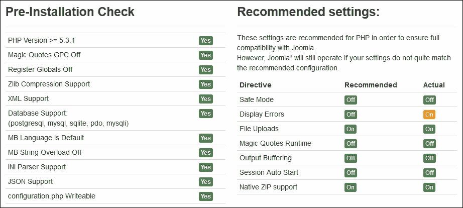

# 第三章：不同用途的 Linux

我们制定的设置服务器基础设施或数据中心的计划通常是相同的。我们总是尝试在运行的服务器之间组织服务，以满足我们的需求。在 Linux 系统上运行的服务器可以同时运行多个服务，也可以根据服务所需的处理能力和其在网络中的位置而选择只运行一个服务。根据用户的需求，系统管理员应始终准备好在其基础设施中设置或关闭服务。通常，对于基本系统安装，已经安装了一些服务，但配置不佳。

本章将涵盖大多数用户需要的一些主要 Linux 服务，以及如何设置、配置和操作它们。然后，我们将探讨这些服务的一些方面，如何保护它们，以及如何以最佳方式操作它们。

在本章中，我们将学习：

+   使用 iptables 和 IP 伪装配置网关服务器

+   安装 VPN 服务器

+   实施 BIND 作为 DNS 服务器

+   使用 Apache-MySQL-PHP 和 ModSecurity 设置和使用 Web 服务器

+   安装 FTP 服务器

+   在 Apache 和 FTP 中实施 OpenSSL

# 配置网关服务器

在许多网络基础设施中，系统管理员需要将他们的服务器和工作站分隔在多个子网络中。其他人使用可以使用**网络地址转换**（**NAT**）技术将私有网络地址与公共地址关联起来。Linux 网关服务器是可以帮助设置这种配置的常见解决方案之一。以下屏幕截图是一个架构示例，其中网关服务器用于通过本地和外部网络：



根据要求，我们需要至少两个网络接口的 Linux 服务器（作为最佳实践）。然后我们需要在它们之间建立一个桥接。在本节中，我们将设置在公共（外部）和私有（本地）地址之间建立网关，使用 IP 转发和 NAT 规则将流量从私有网络路由到公共网络。我们将称外部网络为**广域网**（**WAN**），本地网络为**局域网**（**LAN**）。

### 注意

从本地网络生成的流量将看起来是从网关服务器到外部网络发出的。在这个例子中，我们将需要另一台机器在 LAN 网络中提供服务器。

首先，我们将设置`WAN`接口的网络配置。为此，有两个选项：要么接口将通过 DHCP（自动）获取其 IP 配置，要么我们手动设置它（静态）。在我们的情况下，我们将进行自动配置，因为我们的 WAN 网络由提供 DHCP 配置的路由器提供。

我们将首先编辑指定接口`eth0`的配置文件：

```
$ sudo nano /etc/sysconfig/network-scripts/ifcfg-eth0

```

文件将包含以下行：

```
HWADDR="XX:XX:XX:XX:XX:XX"
TYPE="Ethernet"
BOOTPROTO="dhcp"
DEFROUTE="yes"
PEERDNS="yes"
PEERROUTES="yes"
IPV4_FAILURE_FATAL="no"
IPV6INIT="yes"
IPV6_AUTOCONF="yes"
IPV6_DEFROUTE="yes"
IPV6_PEERDNS="yes"
IPV6_PEERROUTES="yes"
IPV6_FAILURE_FATAL="no"
DEVICE="eth0"
UUID="01f7dbb3-7ac8-406d-a88b-76082e0fa6eb"
ONBOOT="yes"

```

我们应该关注`BOOTPROTO`所写的行，这是用于网络配置的协议，我们需要确保它设置为`dhcp`。

默认安装将所有接口设置为 DHCP 配置，除非它们在安装期间或以后已被修改。

此外，我们需要确保`DEVICE`设置为我们将用于提供 DHCP 服务器的接口名称，并且与我们服务器中的命名相同（对于我们的情况，它是`eth0`）。然后，选项`ONBOOT`设置为`yes`。

### 注意

编辑文件后，如有需要，请确保在离开文本编辑器之前保存修改。

确保所有更改都已成功设置后，我们需要重新启动网络管理器，以便机器可以接受 DHCP 配置：

```
$ sudo systemctl restart network.service

```

在执行此步骤期间，可能会丢失网络连接。我们需要确保在此期间不需要它。

现在我们可以继续配置连接到 LAN 的网关服务器的第二个网络接口。对于此配置，我们需要使用静态 IP 地址。

与第一个接口类似，我们将编辑此接口`eth1`的配置文件：

```
$ sudo nano /etc/sysconfig/network-scripts/ifcfg-eth1

```

此文件还将包含一些配置文件，但我们只对其中的一些感兴趣：

```
HWADDR="XX:XX:XX:XX:XX:XX"
TYPE="Ethernet"
BOOTPROTO="dhcp"
DEFROUTE="yes"
PEERDNS="yes"
PEERROUTES="yes"
IPV4_FAILURE_FATAL="no"
IPV6INIT="yes"
IPV6_AUTOCONF="yes"
IPV6_DEFROUTE="yes"
IPV6_PEERDNS="yes"
IPV6_PEERROUTES="yes"
IPV6_FAILURE_FATAL="no"
DEVICE="eth1"
UUID=" b3fcc00e-a7d9-4b55-a32c-1e88e394aaf6"
ONBOOT="yes"

```

这是默认配置，因此我们需要将其从动态配置更改为静态配置。

修改将包括修改一些行和添加其他行。

我们首先将配置协议从`dhcp`更改为`static`，看起来像这样：

`BOOTPROTO="static"`

然后我们添加静态 IP 地址这一行：`IPADDR="10.0.1.1"`。

然后网络掩码，`NETMASK="255.255.255.0"`。

最后，我们确保选项`DEVICE`设置为`eth1`，选项`ONBOOT`设置为`yes`。

同样，为了确保此配置成功应用，我们需要重新启动网络服务：

```
$ sudo systemctl restart network.service

```

### 注意

如果在输入`ifconfig`时配置没有生效，要检查接口的配置，我们需要运行此命令：

```
$ sudo systemctl restart network.service
$ sudo systemctl status network.service

```

现在我们继续配置客户端，即将使用网关服务器的机器。因此，我们需要为其 LAN 网络配置接口。由于我们不限于一个特定的客户端，如果我们有图形界面，我们可以直接转到连接的接口并输入这些配置：

**IP 地址**：`10.0.1.2`

**网络掩码**：`255.255.255.0`

**网关**：`10.0.1.1`

对于 DNS 服务器，我们将选择非常可靠的 Google DNS。

**DNS 服务器**：`8.8.8.8`

### 注意

输入 Google DNS 服务器地址并不是义务。有些网站可能会阻止它，其他网站可能会使用他们的本地 DNS 服务器。根据需要，如果我们没有任何需求，Google DNS 就可以了。

如果我们需要使用另一台 CentOS 7 服务器，可能需要在静态服务器配置期间执行相同的步骤。

我们编辑接口的配置文件：

```
$ sudo nano /etc/sysconfig/network-scripts/ifcfg-eth1

```

通过将配置协议更改为`static`并添加这两行：

```
IPADDR="10.0.1.2"
NETMASK="255.255.255.0"

```

我们还确保`ONBOOT=yes`和`DEVICE=eth0`。

要使用 Google DNS 服务器，我们可以编辑`/etc/resolv.conf`文件：

```
$ nano /etc/resolv.conf

```

添加这两行：

```
nameserver 8.8.8.8
nameserver 8.8.4.4

```

然后重新启动网络服务：

```
$ sudo systemctl restart network.service

```

我们回到我们的网关服务器，然后开始进行 IP 转发的配置。首先，我们需要启用 IPv4 数据包转发：

```
$ sudo sysctl -w net.ipv4.ip_forward=1

```

为了在每次系统重启时保持配置，我们需要对 IP 转发配置文件进行修改：

```
$ sudo nano /etc/sysctl.conf

```

然后添加这一行并保存：

```
net.ipv4.ip_forward = 1

```

要重新加载对文件所做的配置，我们需要运行此命令：

```
$ sudo sysctl –w

```

可以通过此命令可视化当前配置：

```
$ sudo cat /proc/sys/net/ipv4/ip_forward

```

现在我们开始启用 NAT 配置。使用`iptables`，我们需要启用 IP 伪装。 `firewalld`是一个允许轻松配置`iptables`的服务。要使用`firewalld`，我们将依赖于命令`firewalld-cmd`，然后输入所需的配置。

我们首先在`firewalld`中配置 NAT。首先，我们将 LAN 网络设置为受信任的区域：

```
$ sudo firewall-cmd --permanent --zone=trusted --add-source=10.0.1.0/24

```

然后我们将 LAN 接口`eth1`集成到一个名为`internal`的区域中：

```
$ sudo firewall-cmd --change-interface=eth1 --zone=internal --permanent

```

我们也对 WAN 接口`eth0`进行相似的操作，将其设置为名为`external`的区域：

```
$ sudo firewall-cmd --change-interface=eth0 --zone=external --permanent

```

然后我们为外部 WAN 配置`masquerade`选项：

```
$ sudo firewall-cmd --zone=external --add-masquerade --permanent

```

对于可选的 DNS 配置，我们可以通过`internal`区域进行传递：

```
$ sudo firewall-cmd --zone=internal --add-service=dns –-permanent

```

在完成之前，我们确保 NAT 已配置为将 LAN 上的流量传递到 WAN 接口：

```
$ sudo firewall-cmd --permanent --direct --passthrough ipv4 -t nat -I POSTROUTING -o eth0 -j MASQUERADE -s 10.0.1.0/24 

```

最后，我们需要重新加载防火墙服务，以使配置生效：

```
$ sudo firewall-cmd –reload

```

在此点之后，网关服务器应该正常运行。要测试配置，我们需要从 LAN 网络上的任何机器上 ping 任何网站：

```
$ ping www.google.com

```

然后我们需要查看以下类型的输出，以知道我们的网关服务器是否正常工作：

```
PING www.google.com (216.58.210.196): 56 data bytes
64 bytes from 216.58.210.196: seq=0 ttl=50 time=55.799 ms
64 bytes from 216.58.210.196: seq=1 ttl=50 time=65.751 ms
64 bytes from 216.58.210.196: seq=2 ttl=50 time=54.878 ms
64 bytes from 216.58.210.196: seq=3 ttl=50 time=54.186 ms
64 bytes from 216.58.210.196: seq=4 ttl=50 time=93.656 ms
--- www.google.com ping statistics ---
5 packets transmitted, 5 packets received, 0% packet loss
round-trip min/avg/max = 54.186/64.854/93.656 ms

```

如果我们使用台式机并且不需要静态配置，我们建议使用 DHCP 服务器为所有客户端设置配置。即使对于更高级的 DHCP 配置，我们也可以通过它们的接口 MAC 地址将特定 IP 地址与服务器关联起来。

# 设置 VPN 服务器

OpenVPN 是一种开源软件应用程序，实现了**虚拟专用网络**（**VPN**）技术，用于创建路由或桥接配置和远程访问设施中的安全点对点或站点到站点连接。

作为本节的要求，我们需要一个 CentOS 7 服务器，具有安装一些软件包和对网络配置文件（Internet 和 root 访问）进行一些更改的能力。在以后的阶段，我们可能需要创建一些身份验证证书。我们也将介绍如何执行此操作。

首先，我们将开始安装所需的软件包。在执行此操作之前，OpenVPN 不在默认的 CentOS 标准存储库中，因此我们需要添加包含流行附加软件包的 EPEL 存储库：

```
$ sudo yum install epel-release

```

完成此命令后，我们可以启动 OpenVPN。我们还需要安装 RSA 生成器来生成我们将用于保护 VPN 连接的 SSL 密钥对：

```
$ sudo yum install openvpn easy-rsa

```

在执行该命令结束时，OpenVPN 和 easy-rsa 已成功安装在系统上。

现在我们转移到 OpenVPN 的配置部分。由于 OpenVPN 在其文档目录中有一个配置文件的示例，我们将使用`server.conf`文件作为我们的初始配置并在此基础上构建。为此，我们需要将其复制到`/etc`目录：

```
$ sudo cp /usr/share/doc/openvpn-*/sample/sample-config-files/server.conf /etc/openvpn/

```

然后我们可以编辑它以满足我们的需求：

```
$ sudo nano /etc/openvpn/server.conf

```

打开文件后，我们需要删除一些注释行并进行一些小的更改，如下所示（使用`nano`查找要更改的行，我们应该使用*Ctrl* + *w*，然后输入我们要查找的单词）。

首先，我们需要将 RSA 加密长度设置为 2048 字节，因此我们需要确保指示文件名的选项行将以以下方式使用。

```
dh dh2048.pem

```

### 注意

一些文章建议使用 1024 字节的 DH 密钥是有漏洞的，因此我们建议使用 2048 字节或更多的 DH 密钥以获得更好的安全性。这种漏洞称为 Logjam，有关更多详细信息，您可以在以下网址阅读更多内容：[`sourceforge.net/p/openvpn/mailman/message/34132515/`](http://sourceforge.net/p/openvpn/mailman/message/34132515/)

然后我们需要取消注释`push redirect-gateway def1 bypass-dhcp""`这一行，告诉客户端将所有流量重定向到 OpenVPN。

接下来，我们需要为客户端设置 DNS 服务器，因为它将无法使用 ISP 提供的 DNS。同样，我将使用 Google DNS `8.8.8.8`和`8.8.4.4`：

```
push "dhcp-option DNS 8.8.8.8"
push "dhcp-option DNS 8.8.4.4"

```

最后，为了使 OpenVPN 顺利运行，我们需要首先以无特权运行它。为此，我们需要通过名为`nobody`的用户和组运行它：

```
user nobody
group nobody

```

然后保存文件并退出。

到目前为止，OpenVPN 服务的配置部分已经完成。我们将继续进行证书和密钥生成部分，需要使用 Easy RSA 创建一些脚本。我们首先需要在 OpenVPN 的配置文件夹中创建一个 Easy RSA 的目录：

```
$ sudo mkdir -p /etc/openvpn/easy-rsa/keys

```

然后我们需要使用 Easy RSA 的预定义脚本填充文件夹，以生成密钥和证书：

```
$ sudo cp -rf /usr/share/easy-rsa/2.0/* /etc/openvpn/easy-rsa/

```

为了执行简单的 VPN 设置，我们将首先在`vars`文件中输入我们的信息一次并永久保存：

```
$ sudo nano /etc/openvpn/easy-rsa/vars

```

我们基本上正在更改以`export KEY_`开头的行，以更新它们的值以匹配所需组织的值，并且在某些时候我们可能需要取消注释它们：

```
export KEY_COUNTRY="UK"
export KEY_PROVINCE="GL"
export KEY_CITY="London"
export KEY_ORG="City-Center"
export KEY_EMAIL="user@packt.co.uk"
export KEY_OU="PacktPublishing"

# X509 Subject Field
export KEY_NAME="server"

export KEY_CN="openvpn.packt.co.uk"

```

然后保存文件并退出。

`KEY_NAME`字段代表文件`.key`和`.crt`的名称。

`KEY_CN`字段是我们应该放置指向 VPN 服务器的域或子域的地方。

为了确保在使用 OpenSSL 配置文件时不会出现由于版本更新而引起的问题，我们将从文件名中删除版本：

```
$ sudo cp /etc/openvpn/easy-rsa/openssl-1.0.0.cnf /etc/openvpn/easy-rsa/openssl.cnf

```

现在我们转到证书和密钥的创建。我们需要在`/etc/openvpn/easy-ras`文件夹中运行脚本：

```
$ cd /etc/openvpn/easy-rsa

```

然后我们在变量中启动源：

```
$ sudo source ./vars

```

之后，清除任何旧生成的密钥和证书：

```
$ sudo ./clean-all

```

然后我们构建认证机构，其信息已经定义为默认选项：

```
$ sudo ./build-ca

```

现在我们为 VPN 服务器创建密钥和证书。我们通过按*Enter*跳过挑战密码阶段。然后我们确保通过在最后一步输入`Y`来验证：

```
$ sudo ./build-key-server server

```

运行此命令时，如果它运行正确，我们应该看到以下消息：

```
Check that the request matches the signature
Signature ok
The Subject's Distinguished Name is as follows
countryName           :PRINTABLE:'UK'
stateOrProvinceName   :PRINTABLE:'GL'
localityName          :PRINTABLE:'London'
organizationName      :PRINTABLE:'City-Center'
organizationalUnitName:PRINTABLE:'PacktPublishing'
commonName            :PRINTABLE:'server'
name                  :PRINTABLE:'server'
emailAddress          :IA5STRING:'user@packt.co.uk'

```

此外，我们需要生成 Diffie-Hellman（`dh`）密钥交换。与其他命令相比，这可能需要更长的时间：

```
$ sudo ./build-dh

```

完成此步骤后，我们将准备好所有的密钥和证书。我们需要复制它们，以便它们可以被我们的 OpenVPN 服务使用：

```
$ cd /etc/openvpn/easy-rsa/keys
$ sudo cp dh2048.pem ca.crt server.crt server.key /etc/openvpn

```

这个 VPN 服务器的所有客户端都需要证书进行身份验证。因此，我们需要与所需的客户端共享这些密钥和证书。最好为需要连接的每个客户端生成单独的密钥。

在这个例子中，我们只为一个客户端生成密钥：

```
$ cd /etc/openvpn/easy-rsa
$ sudo ./build-key client

```

通过这一步，我们可以说我们已经完成了证书。

现在是路由步骤。我们将使用`iptables`直接进行路由配置，而无需使用`firewalld`。

如果我们只想使用`iptables`配置，我们首先要确保其服务已安装：

```
$ sudo yum install iptables-services

```

然后禁用`firewalld`服务：

```
$ sudo systemctl mask firewalld
$ sudo systemctl enable iptables
$ sudo systemctl stop firewalld
$ sudo systemctl start iptables
$ sudo iptables --flush

```

然后我们添加规则到`iptables`，进行路由到 OpenVPN 子网的转发：

```
$ sudo iptables -t nat -A POSTROUTING -s 10.0.1.0/24 -o eth0 -j MASQUERADE
$ sudo iptables-save > /etc/sysconfig/iptables

```

然后我们需要通过编辑文件`sysctl.conf`在`sysctl`中启用 IP 转发：

```
$ sudo nano /etc/sysctl.conf

```

然后添加以下行：

```
net.ipv4.ip_forward = 1

```

最后，重新启动网络服务，使此配置生效：

```
$ sudo systemctl restart network.service

```

现在我们可以启动 OpenVPN 服务，但在这之前，我们需要将其添加到`systemctl`：

```
$ sudo systemctl -f enable openvpn@server.service

```

然后我们可以启动服务：

```
$ sudo systemctl start openvpn@server.service

```

如果我们想要检查服务是否正在运行，可以使用命令`systemctl`：

```
$ sudo systemctl status openvpn@server.service

```

我们应该看到这条消息的活动状态为`active (running)`：

```
openvpn@server.service - OpenVPN Robust And Highly Flexible Tunneling Application On server
 Loaded: loaded (/usr/lib/systemd/system/openvpn@.service; enabled)
 Active: active (running) since Thu 2015-07-30 15:54:52 CET; 25s ago

```

经过这个检查，我们可以说我们的 VPN 服务器配置已经完成。现在我们可以去客户端配置，不论操作系统如何。我们需要从服务器复制证书和密钥。我们需要复制这三个文件：

```
/etc/openvpn/easy-rsa/keys/ca.crt
/etc/openvpn/easy-rsa/keys/client.crt
/etc/openvpn/easy-rsa/keys/client.key

```

有各种工具可以将这些文件从服务器复制到任何客户端。最简单的是`scp`，这是两台 Unix 机器之间的 shell 复制命令。对于 Windows 机器，我们可以使用文件夹共享工具，如 Samba，或者我们可以使用另一个等效于 SCP 的工具**WinSCP**。

从客户端机器开始，我们首先复制所需的文件：

```
$ scp user@openvpn.packt.co.uk:/etc/openvpn/easy-rsa/keys/ca.crt /home/user/
$ scp user@openvpn.packt.co.uk:/etc/openvpn/easy-rsa/keys/client.crt /home/user/
$ scp user@openvpn.packt.co.uk:/etc/openvpn/easy-rsa/keys/client.key /home/user/

```

复制完成后，我们应该创建一个名为`client.ovpn`的文件，这是 OpenVPN 客户端的配置文件，可以帮助设置客户端连接到服务器提供的 VPN 网络。文件应包含以下内容：

```
client
dev tun
proto udp
remote server.packt.co.uk 1194
resolv-retry infinite
nobind
persist-key
persist-tun
comp-lzo
verb 3
ca /home/user/ca.crt
cert /home/user/client.crt
key /home/user/client.key

```

我们需要确保第一行包含在密钥和证书中输入的客户端名称。之后，远程应该是服务器的公共 IP 地址或其域地址。最后，应该从服务器复制三个客户端文件的正确位置。

文件`client.ovpn`可以与多个 VPN 客户端（Linux 的 OpenVPN 客户端，MAC OS X 的 Tunnelblick，Windows 的 OpenVPN Community Edition Binaries）一起使用，以便配置它们连接到 VPN。

在 CentOS 7 服务器上，我们将使用 OpenVPN 客户端。要使用此配置，我们使用命令`openvpn --config`：

```
$ sudo openvpn --config ~/path/to/client.ovpn

```

通过将客户端连接到 VPN 服务器，我们可以确认我们的 VPN 服务运行良好。

# 实施 BIND 作为 DNS 服务器

BIND 是最广泛使用的开源名称服务器应用程序。它帮助实现互联网的**域名系统**（**DNS**）协议。它提供了一个强大而稳定的平台，用于构建分布式计算系统，确保这些系统完全符合已发布的 DNS 标准。它通过将这些问题发送到适当的服务器并对服务器的回复做出适当的响应来帮助解决有关名称的查询。

作为 BIND 实现的示例，我们将设置一个内部 DNS 服务器来解析网络内部的一些公共 IP 地址，以简化大型环境中的映射。

我们需要以下先决条件来实现 BIND：

+   一个服务器上安装和配置 BIND

+   两台机器，可以是服务器也可以是简单的工作站，用来测试 DNS 服务

+   需要 root 权限才能设置 BIND 并配置网络以从我们的内部 DNS 服务器解析

首先，我们将在我们的 DNS 服务器上安装 BIND：

```
$ sudo yum install bind bind-utils

```

安装完 BIND 后，我们开始配置我们的 DNS 服务器。

BIND 服务有一堆配置文件，这些文件从它的主配置文件`named.conf`中包含，这个文件与 BIND 运行的进程相关联：

```
$ sudo nano /etc/named.conf

```

在文件的开头，我们需要在`options`块之前添加一个块，名为`acl "trusted"`，在这里我们将定义允许进行递归 DNS 查询的客户端列表。由于我们的服务器将为两个子网提供服务，我们将添加它的两个地址：

```
acl "trusted" {
 192.168.8.12;  # Our DNS server inside the subnet 192.168.8.0/24
 10.0.1.1;  # Our DNS server inside the subnet 10.0.1.0/24
 192.168.8.5;    # Webserver
 10.0.1.2;    # client host
};

```

我们需要在`options`内进行一些修改。由于我们只使用 IPv4，我们需要注释掉 IPv6 行：

```
# listen-on-v6 port 53 { ::1; }; 

```

为了确保 DNS 服务器将在两个子网中监听，我们将添加以下两个地址：

```
listen-on port 53 { 127.0.0.1; 192.168.8.12; 10.0.1.1; };

```

使用 IP 地址`192.168.8.12`作为 DNS 服务器的 IP 地址。

然后我们将`allow-query`行从指向`localhost`改为指向`trusted`客户端 ACL：

```
allow-query { trusted; };

```

### 注意

如果我们不完全依赖我们的 DNS 服务器来响应所有查询，我们可以通过在`options`中输入以下命令来使用辅助 DNS 服务器：

```
allow-transfer { localhost; 192.168.8.1; };

```

最后，在文件的末尾，我们需要添加包含本地文件配置的行：

```
include "/etc/named/named.conf.local";

```

然后我们保存文件，转到本地文件配置以设置 DNS 区域：

```
$ sudo nano /etc/named/named.conf.local

```

由于我们是创建它的人，所以文件将是空的，因此我们需要用必要的区域填充它。

首先，我们将添加正向区域。为此，我们需要输入以下行：

```
zone "packt.co.uk" {
type master;
file "/etc/named/zones/db.packt.co.uk";  # The location of the zone configuration file.
};

```

现在我们将添加反向区域。由于我们的第一个 LAN 在`192.168.8.0/24`，我们从反向区域名称开始，它将是`8.168.192`，即`192.168.8`的反向：

```
zone "8.168.192.in-addr.arpa" {
type master;
file "/etc/named/zones/db.8.168.192";  # The subnet of 192.168.8.0/24
};

```

现在我们对`10.0.1.0/24`上的第二个 LAN 做同样的操作，所以它的反向区域名称是`1.0.10`：

```
zone "1.0.10.in-addr.arpa" {
type master;
file "/etc/named/zones/db.1.0.10";  # The subnet of 10.0.1.0/24
};

```

我们需要对网络中的所有子网做同样的操作，然后保存文件。

完成设置区域和反向区域后，我们继续创建并填写它们对应的文件。

我们首先创建转发文件，这是我们为正向 DNS 查找定义 DNS 记录的地方。我们创建一个文件夹，用来放置所有区域文件。然后我们开始在其中创建我们的区域文件：

```
$ sudo chmod 755 /etc/named
$ sudo mkdir /etc/named/zones

```

然后我们创建正向区域文件并填写它：

```
$ sudo nano /etc/named/zones/db.packt.co.uk

```

我们需要添加以下行。首先是 SOA 记录，通过添加 DNS 服务器的域名，我们需要每次编辑区域文件时增加序列值，以便在重新启动服务后生效：

```
$TTL    604800
@  IN  SOA  server.packt.co.uk.  admin.packt.co.uk.  (
3    ; Serial
604800    ; Refresh
86400    ; Retry
2419200  ; Expire
604800 )  ; Negative Cache TTL

```

对于序列号，我们可以通过使其看起来像一个`日期：{yyyymmmdddss} yyyy = 年`，`mm = 月`，`dd = 日`，`ss = 一个`序列号来使其更易理解。

然后我们添加名称服务器记录：

```
; name servers - NS records

IN  NS  server.packt.co.uk.

```

然后我们为属于该区域的主机添加`A 记录`，其中将包括我们希望使用我们的 DNS 服务器寻址的每台机器，无论是服务器还是工作站：

```
; name servers - A records
server.packt.co.uk.  IN  A  192.168.8.12

; 192.168.8.0/24 - A records
server2.packt.co.uk.  IN  A  192.168.8.5

; 10.0.1.0/24 - A records
client1.packt.co.uk.  IN  A  10.0.1.2
server.packt.co.uk.  IN  A  10.0.1.1

```

现在我们创建反向区域文件。这是我们为反向 DNS 查找定义 DNS PTR 记录的地方。

我们从第一个反向区域`db.1.0.10`开始：

```
$ sudo nano /etc/named/zones/db.1.0.10

```

与第一个区域文件一样，我们需要定义 SOA 域：

```
$TTL    604800
@  IN  SOA  server.packt.co.uk.  admin.packt.co.uk. (
 3         ; Serial
 604800         ; Refresh
 86400         ; Retry
 2419200         ; Expire
 604800 )       ; Negative Cache TTL

```

然后是名称服务器记录：

```
; name servers - NS records
IN  NS  server.packt.co.uk.

```

最后，我们添加列出子网区域上具有 IP 地址的所有机器的 PTR 记录：

```
; PTR Records
1  IN  PTR  server.packt.co.uk.  ; 10.0.1.1
2  IN  PTR  client1.packt.co.uk.  ; 10.0.1.2

```

然后我们做第二个反向区域文件`db.8.168.192`：

```
$ sudo nano /etc/named/zones/db.8.168.192

```

我们添加 SOA 域：

```
$TTL    604800
@  IN  SOA  server.packt.co.uk.  admin.packt.co.uk. (
 3         ; Serial
 604800         ; Refresh
 86400         ; Retry
 2419200         ; Expire
 604800 )       ; Negative Cache TTL

```

然后我们添加名称服务器记录：

```
; name servers - NS records
IN  NS  server.packt.co.uk.

```

最后我们完成 PTR 记录：

```
; PTR Records
12  IN  PTR  server.packt.co.uk.  ; 192.168.8.12
5  IN  PTR  webserver.packt.co.uk.  ; 192.168.8.5

```

我们保存所有文件。然后通过检查文件`named.conf*`的语法来检查 BIND 配置：

```
$ sudo named-checkconf

```

如果没有显示错误，这意味着所有配置文件都写得很好，没有语法错误。否则，请尝试跟踪错误并使用错误消息进行修复。

然后使用命令`named-checkzone`在每个区域中检查区域文件（如果有多个）：

```
$ sudo named-checkzone packt.co.uk /etc/named/zones/db.packt.co.uk

```

如果区域成功设置，我们应该看到这种消息：

```
zone packt.co.uk/IN: loaded serial 3
OK

```

我们应该看到反向区域的相同内容：

```
$ sudo named-checkzone 1.0.10.in-addr.arpa /etc/named/zones/db.1.0.10
$ sudo named-checkzone 8.168.192.in-addr.arpa /etc/named/zones/db.8.168.192

```

如果一切配置正确，我们也应该看到相同的消息。否则，我们需要排除以下错误消息：

```
zone 8.168.192.in-addr.arpa/IN: loaded serial 3
OK

```

在检查所有配置后，我们现在准备启动 BIND 服务。

在此之前，我们需要确保我们的防火墙允许我们这样做。我们需要使用`Firewalld`服务打开端口 53：

```
$ sudo firewall-cmd --permanent --add-port=53/tcp
$ sudo firewall-cmd --permanent --add-port=53/udp
$ sudo firewall-cmd --reload

```

重新加载防火墙后，更改将生效，现在我们可以启动 DNS 服务：

```
$ sudo systemctl start named

```

然后启用它，以便它可以在系统启动时启动：

```
$ sudo systemctl enable named

```

通过这一步，DNS 服务器现在已准备好接收和响应 DNS 查询。

现在让我们进行客户端配置以测试 DNS 服务器。在 Linux 服务器上，我们只需要通过添加名称服务器 IP 地址和搜索域来修改`resolv.conf`文件：

```
$ sudo nano /etc/resolv.conf

```

通过添加以下行，然后保存：

```
search nyc3.example.   # Our domain
nameserver 10.0.1.1   # The DNS server IP address

```

现在我们可以开始测试。我们将使用简单的 ping 和命令`nslookup`。ping 只会测试我们是否能够通过其域名到达该机器：

```
$ ping webserver.packt.co.uk
PING webserver.packt.co.uk (192.168.8.5): 56 data bytes
64 bytes from 192.168.8.5: icmp_seq=0 ttl=64 time=0.046 ms
64 bytes from 192.168.8.5: icmp_seq=1 ttl=64 time=0.092 ms
64 bytes from 192.168.8.5: icmp_seq=2 ttl=64 time=0.117 ms
64 bytes from 192.168.8.5: icmp_seq=3 ttl=64 time=0.092 ms

--- webserver.packt.co.uk ping statistics ---
4 packets transmitted, 4 packets received, 0.0% packet loss
round-trip min/avg/max/stddev = 0.046/0.087/0.117/0.026 ms

```

还有其他工具可以在测试 DNS 服务时提供更详细的结果，例如`dig`和`nslookup`进行简单的 DNS 查找：

```
$ nslookup webserver.packt.co.uk
Server:    10.0.1.1
Address:    10.0.1.1#53

Name:      webserver.packt.co.uk
Address:     192.168.8.5 webserver.packt.co.uk

```

运行 DNS 查找后，我们将尝试进行反向 DNS 查找：

```
$ nslookup webserver.packt.co.uk
Server:    10.0.1.1
Address:    10.0.1.1#53

5.8.168.192.in-addr.arpa  name = webserver.packt.co.uk.

```

在运行所有这些测试后，我们应该检查所有值是否为`true`，以确认我们拥有一个完全正常工作的 DNS 服务器。

# 使用 Apache-MySQL-PHP 设置 Web 服务器

Linux 服务器提供的常见服务之一是作为 Web 服务器，使其用户能够在安全、快速和可靠的位置托管其 Web 内容，可从世界各地浏览。在本节中，我们将向您展示如何在 CentOS 7 服务器上设置可靠的 Web 服务器，并使用一些安全模块来保护网站，并实施**内容管理系统**（**CMS**）：Joomla。

我们的 Web 服务器将托管动态网站和 Web 应用程序。因此，我们将安装一个 LAMP（堆栈）服务器，代表一个具有 Apache Web 服务器的 Linux 操作系统，其中站点数据将存储在 MySQL 数据库中（使用 MariaDB，这是 MySQL 关系数据库管理系统的社区开发分支，旨在在 GNU GPL 下保持免费），并且动态内容由 PHP 处理。

我们将从安装 Apache Web 服务器开始，这是世界上最流行的 Web 服务器：

```
$ sudo yum install httpd

```

在命令结束时，Apache Web 服务器已成功安装。我们可以使用`systemctl`命令启动它：

```
$ sudo systemctl start httpd.service

```

在测试服务之前，我们需要确保服务器防火墙允许 Web 访问。因此，我们需要打开 Apache 正在提供的端口，HTTP（80）和 HTTPS（443）：

```
$ sudo firewall-cmd --permanent --add-service=http
$ sudo firewall-cmd --permanent --add-service=https
$ sudo firewall-cmd --reload

```

现在我们可以通过在同一网络内的任何其他机器的 Web 浏览器中键入服务器的 IP 地址（`http://Server_IP_Address`）来测试 Web 服务器。我们应该看到类似于这样的东西：



确认服务正常运行后，我们需要将其添加到系统启动服务中：

```
$ sudo systemctl enable httpd.service

```

现在我们将在 Apache 上设置两个虚拟主机，以展示 Apache 支持多个网站的能力。

接下来，我们将对 Apache 配置文件进行一些更改，因此我们将创建一个备份文件：

```
$ sudo cp /etc/httpd/conf/httpd.conf /etc/httpd/conf/httpd.conf.backup

```

Apache 有能力将其功能和组件分离为可以独立定制和配置的单元。这些单元称为**虚拟主机**。虚拟主机允许我们托管多个域。每个配置的域将访问者引导到指定给网站的特定文件夹，其中包含其信息。只要服务器能够处理吸引网站的流量，这种技术就是可扩展的。

首先，我们需要创建我们将存储网站的文件夹。目录`/var/www/`是我们的 Web 服务器根目录：

```
$ sudo mkdir –p /var/www/packt.co.uk/home
$ sudo mkdir –p /var/www/packt2.co.uk/home

```

然后我们授予这些文件夹权限，通过将所有权从根用户（刚刚创建它们的用户）更改为`$USER`（当前登录的用户）：

```
$ sudo chown –R $USER:$USER /var/www/packt.co.uk/home
$ sudo chown –R $USER:$USER /var/www/packt2.co.uk/home

```

为了完全测试虚拟主机，我们需要创建一个示例 HTML 页面，以在客户端 Web 浏览器中打开：

```
$ nano /var/www/packt.co.uk/home/index.html

```

然后我们添加一些 HTML 代码来填充页面：

```
<html>
  <head>
    <title>Packt Home Page</title>
  </head>
  <body>
    <h1>Welcome to the home page of the Packt Publishing 1st example web server </h1>
  </body>
</html>
```

同样地，对于第二个主机，我们需要创建相同的文件，但内容不同以区分：

```
$ nano /var/www/packt2.co.uk/home/index.html

```

然后我们放入以下 HTML 代码：

```
<html>
  <head>
    <title>Packt2 Home Page</title>
  </head>
  <body>
    <h1>Welcome to the home page of the Packt Publishing 2nd example web server </h1>
  </body>
</html>
```

现在我们需要在 Apache 配置文件夹中创建虚拟主机文件。我们首先创建需要放置文件的文件夹：

```
$ sudo mkdir /etc/httpd/sites-available
$ sudo mkdir /etc/httpd/sites-enabled

```

然后我们需要告诉 Apache 服务使用`sites-enabled`目录中提供的配置，方法是编辑 Apache 主配置文件。此配置也可以作为配置目录`/etc/httpd/conf.d`获得。

```
$ sudo nano /etc/httpd/conf/httpd.conf.

```

然后我们在文件末尾添加以下行：

```
IncludeOptional sites-enabled/*.conf

```

我们保存文件，然后移动到`sites-available`文件夹中创建虚拟主机文件。文件名应该以`.conf`结尾，这样 Apache 服务才能使用它：

```
$ sudo nano /etc/httpd/sites-available/packt.co.uk.conf

```

然后我们在其中放入以下配置：

```
<VirtualHost *:80>

 ServerName www.packt.co.uk
 ServerAlias packt.co.uk
 DocumentRoot /var/www/packt.co.uk/home
 ErrorLog /var/log/httpd/packt.co.uk_error.log
 CustomLog /var/log/httpd/packt.co.uk_requests.log combined

</VirtualHost>

```

我们保存文件，然后对第二个虚拟主机做同样的操作：

```
$ sudo nano /etc/httpd/sites-available/packt2.co.uk.conf

```

然后我们在其中放入以下命令：

```
<VirtualHost *:80>

 ServerName www.packt2.co.uk
 ServerAlias packt2.co.uk
 DocumentRoot /var/www/packt2.co.uk/home
 ErrorLog /var/log/httpd/packt2.co.uk_error.log
 CustomLog /var/log/httpd/packt2.co.uk_requests.log combined

</VirtualHost>

```

在配置两个站点之后，我们现在可以激活虚拟主机以供使用：

```
$ sudo ln -s /etc/httpd/sites-available/packt.co.uk.conf /etc/httpd/sites-enabled/packt.co.uk.conf
$ sudo ln -s /etc/httpd/sites-available/packt2.co.uk.conf /etc/httpd/sites-enabled/packt2.co.uk.conf

```

为了确保我们所做的所有配置都会生效，我们需要使用以下命令之一重新启动 Apache 服务：

```
$ sudo apachectl restart
$ sudo systemctl restart httpd.service

```

### 注意

如果我们遇到与服务器主机名相关的任何错误，请尝试使用此命令进行更改并消除错误：

```
$ sudo hostnamectl set-hostname --static packt.co.uk

```

在我们的情况下，这些域名不是公共的，也没有被任何 DNS 服务器定义。因此，我们可以将它们添加到我们的本地 DNS 服务器，或者只需将它们添加到我们客户端机器（我们将在其中打开 Web 浏览器的机器）的`/etc/hosts`文件中。此步骤仅用于测试。通常，我们应该在 ISP 的 DNS 服务器或本地 DNS 服务器上定义它们：

```
$ sudo nano /etc/hosts

```

然后我们添加两行，将我们的 Web 服务器 IP 地址与我们创建的两个域关联起来：

```
Server_IP_Address    packt.co.uk
Server_IP_Address    packt2.co.uk

```

然后我们转到客户端 Web 浏览器，输入域名到地址栏中：

```
http://packt.co.uk

```

我们应该看到与第一个域关联的页面。我们对第二个域做同样的操作。如果测试有效，我们确认我们的虚拟主机已正确创建。

现在我们可以开始保护 Apache 免受影响世界网站的最常见攻击之一。暴力攻击或**分布式拒绝服务**（**DDoS**）攻击是一种向同一 Web 服务器发送多个请求以使其超载并使其无法访问的攻击。现在我们将设置模块来帮助保护我们的 Web 服务器免受此类攻击。`Mod_Security`和`Mod_evasive`是基本模块，将帮助检测和防止入侵，并帮助加强 Web 服务器对暴力或 DDoS 攻击的保护。首先，我们需要使用软件包管理器安装这些模块。我们要求系统已经安装了 EPEL 存储库：

```
$ sudo yum install mod_security mod_evasive

```

因此，为了验证安装是否完成，我们需要查看`/etc/httpd/conf.d/`文件夹中是否创建了两个文件：

```
$ sudo ls /etc/httpd/conf.d/mod_*
/etc/httpd/conf.d/mod_evasive.conf
/etc/httpd/conf.d/mod_security.conf

```

为了确保 Apache 在启动时加载这两个模块，我们需要向两个配置文件添加一些配置选项，这些选项在安装后已经创建：

```
$ sudo nano /etc/httpd/conf.d/mod_evasive.conf
$ sudo nano /etc/httpd/conf.d/mod_security.conf

```

然后我们分别添加以下行，或者确保它们是取消注释的：

```
LoadModule evasive20_module modules/mod_evasive24.so
LoadModule security2_module modules/mod_security2.so

```

现在我们可以重新启动 Apache，以便配置生效：

```
$ sudo service httpd restart

```

我们首先要配置`Mod_Security`模块。因此，我们需要设置一个**核心规则集**（**CRS**）。我们将下载一个免费的 CRS（OWASP）来为我们的 Web 服务器配置它。在下载其包之前，我们需要创建一个目录来放置规则：

```
$ sudo mkdir /etc/httpd/crs-tecmint
$ cd /etc/httpd/crs-tecmint
$ sudo wget https://github.com/SpiderLabs/owasp-modsecurity-crs/tarball/master

```

之后，我们可以在那里提取包，并将其名称更改为合适的名称：

```
$ sudo tar –xzvf master
$ sudo mv SpiderLabs-owasp-modsecurity-crs-c63affc/ owasp-modsecurity-crs

```

现在我们可以开始配置`Mod_Security`模块。我们需要将示例文件配置复制到另一个没有`.example`扩展名的文件中：

```
$ cd owasp-modsecurity-crs
$ sudo cp modsecurity_crs_10_setup.conf.example modsecurity_crs_10_setup.conf

```

然后告诉 Apache 使用这个模块，通过将以下行插入到 Apache 主配置文件中：

```
$ sudo nano /etc/httpd/conf/httpd.conf
<IfModule security2_module>
    Include crs-tecmint/owasp-modsecurity-crs/modsecurity_crs_10_setup.conf
    Include crs-tecmint/owasp-modsecurity-crs/base_rules/*.conf
</IfModule>
```

现在我们需要在`/etc/httpd/modsecurity.d/`目录中创建一个配置文件，以便在有新版本时更容易升级 CRSs：

```
$ sudo nano /etc/httpd/modsecurity.d/tecmint.conf

```

创建新文件后，我们需要添加以下行并保存文件：

```
<IfModule mod_security2.c>
 SecRuleEngine On
 SecRequestBodyAccess On
 SecResponseBodyAccess On 
 SecResponseBodyMimeType text/plain text/html text/xml application/octet-stream 
 SecDataDir /tmp
</IfModule>

```

通过这一步，我们可以说`Mod_Security`模块已经成功安装和配置。现在我们可以转移到下一个模块`Mod_Evasive`。要配置这个模块，我们需要确保主配置文件中的一些行没有被注释掉：

```
$ sudo nano /etc/httpd/conf.d/mod_evasive.conf

```

然后检查`IfModule`选项是否成功设置：

```
<IfModule mod_evasive24.c>
 DOSHashTableSize    3097
 DOSPageCount        2
 DOSSiteCount        50
 DOSPageInterval     1
 DOSSiteInterval     1
 DOSBlockingPeriod   10
</IfModule>

```

让我们详细了解一下之前的代码：

+   `DOSHashTableSize`：此选项指定用于跟踪 IP 活动的哈希表的大小

+   `DOSPageCount`：来自一个 IP 地址对一个资源的相同请求的合法数量

+   `DOSSiteCount`：与`DOSPageCount`相同，但适用于所有可能发生的请求

+   `DOSBlockingPeriod`：排除顶部选项的 IP 的黑名单期限

这些数字是配置的示例。我们可以根据需要进行更改。

一个额外的有用选项是`DOSSystemCommand`，它有助于运行一些可以阻止 IP 地址的脚本。为此，我们需要将其添加到配置文件中。

```
DOSSystemCommand "sudo /etc/httpd/scripts/ban_ip.sh %s".

```

并且我们需要在适当的位置创建脚本：

```
$ sudo nano /etc/httpd/scripts/ban_ip.sh

```

我们应该在其中添加以下代码：

```
#!/bin/sh
IP=$1
IPTABLES="/sbin/iptables"
MOD_EVASIVE_LOGDIR=/tmp
$IPTABLES -I INPUT -s $IP -j DROP
echo "$IPTABLES -D INPUT -s $IP -j DROP" | at now + 2 hours
rm -f "$MOD_EVASIVE_LOGDIR"/dos-"$IP"

```

这个脚本需要一些系统修改才能正常运行。让我们将其设置为可执行：

```
$ sudo chmod +x /etc/httpd/scripts/ban_ip.sh

```

我们需要在`Sudoers`规则文件中添加一行：

```
$ sudo nano /etc/Sudoers
apache ALL=NOPASSWD: /usr/local/bin/scripts/ban_ip.sh
Defaults:apache !requiretty

```

出于安全原因，直接编辑文件可能会有害。我们建议使用以下命令：

```
$ sudo visudo

```

其次，这个脚本与`iptables`一起工作，所以我们需要停用`Firewalld`并安装并激活`iptables`：

```
$ sudo yum update && yum install iptables-services
$ sudo systemctl enable iptables
$ sudo systemctl start iptables
$ sudo systemctl status iptables

```

然后应用新配置，我们需要重新启动 Apache 服务：

```
$ sudo systemctl restart httpd

```

最后，我们的 Web 服务器已经得到了很好的安全和配置。

作为一个小提示，默认情况下，Apache 服务器显示它所运行的操作系统和版本。有时它会显示安装的模块。这些信息对攻击者来说可能非常有价值，因此我们需要禁用显示这些信息：

```
$ sudo nano /etc/httpd/conf/httpd.conf

```

然后我们将以下两行更改为如下所示：

```
ServerSignature Off
ServerTokens Prod

```

现在我们可以开始数据库安装。服务器中的数据库对于执行动态网站并用作存储其数据的媒介是至关重要的。通常，在旧的 Linux 版本上，我们将 MySQL 安装为默认数据库服务器，但最近大多数 Linux 发行版已经迁移到了 MariaDB 数据库服务器。为此，我们需要使用软件包管理器进行安装：

```
$ sudo yum install mariadb-server mariadb

```

我们将安装一些默认存储库中不可用的模块。因此，我们需要安装 EPEL 存储库，以确保我们在这一部分得到覆盖：

```
$ sudo yum install epel-release

```

然后我们启动服务并启用它以便下次启动：

```
$ sudo systemctl start mariadb
$ sudo systemctl enable mariadb.service

```

为了拥有一个良好安全的数据库服务器，我们需要使用 MariaDB 安全安装命令。这个命令非常有用，可以通过各种选项自定义数据库服务器的安全级别：

```
$ sudo mysql_secure_installation

```

### 注意

在执行命令时，我们应该确保为数据库指定一个强大的根密码。

为了确保我们的数据库服务器正常工作，我们可以运行 CLI 界面并运行一些基本的 SQL 命令：

```
$ sudo mysql -u root -p

```

我们输入已在安全安装期间设置的密码，然后就可以进入 MariaDB CLI 了。要退出，只需输入`quit`。

为了不必每次输入密码，我们可以将密码写入位于我们的主目录`~/.my.cnf`中的文件，并添加以下行：

```
[mysql]\npassword=password

```

现在我们可以开始安装 PHP5。将来，我们将添加`phpmyadmin`，这是一个允许通过网页浏览器访问的图形界面管理 MariaDB 数据库的程序。首先，我们开始安装 PHP5 和支持 MySQL 的库：

```
$ sudo yum install php php-mysql

```

我们可以编辑`/etc/php/php.ini`以配置错误消息的放置位置，上传文件到网站的最大大小（对于处理文件的动态网站非常有用），等等。

我们可以进行一些小的配置，使 PHP 更安全。首先，我们可以删除信息和错误消息，并将它们记录到日志文件中。然后关闭远程代码执行。此外，如果我们不需要在网站上上传文件，我们可以禁用它。我们需要使用安全的 SQL 模式。最后，我们禁用危险的 PGP 函数：

```
$ sudo nano /etc/php.d/secutity.ini

```

然后更改以下行：

```
expose_php=Off
display_errors=Off

log_errors=On
error_log=/var/log/httpd/php_scripts_error.log

allow_url_fopen=Off
allow_url_include=Off

sql.safe_mode=On
magic_quotes_gpc=Off

disable_functions =exec,passthru,shell_exec,system,proc_open,popen,curl_exec,curl_multi_exec,parse_ini_file,show_source

```

为了保护 PHP 免受已知和未知的漏洞，我们考虑安装 Suhosin 高级保护系统：

```
$ sudo yum install php-devel
$ sudo cd /usr/local 
$ sudo wget –c https://download.suhosin.org/suhosin-0.9.38.tar.gz
$ sudo tar -xzvf suhosin-0.9.38.tar.gz
$ sudo cd suhosin-0.9.38
$ sudo phpize
$ sudo ./configure
$ sudo make 
$ sudo make install

```

现在我们配置 Apache 以使用它：

```
$ sudo echo 'extension=suhosin.so' > /etc/php.d/suhosin.ini

```

然后我们重新启动 Apache：

```
$ sudo systemctl restart httpd

```

现在，我们开始安装`phpmyadmin`所需的软件包：

```
$ sudo yum install php-gd php-pear php-mbstring 

```

安装它们后，我们安装`phpmyadmin`软件包：

```
$ sudo yum install phpMyAdmin

```

我们需要进行一些配置，以便在服务器之外启用对`phpmyadmin`界面的访问。我们需要编辑它的配置文件：

```
$ sudo nano /etc/httpd/conf.d/phpMyAdmin.conf

```

然后我们需要注释掉旧的配置：

```
#<Directory /usr/share/phpMyAdmin/>
#   <IfModule mod_authz_core.c>
#     # Apache 2.4
#     <RequireAny>
#       Require ip 127.0.0.1
#       Require ip ::1
#     </RequireAny>
#   </IfModule>
#   <IfModule !mod_authz_core.c>
#     # Apache 2.2
#     Order Deny,Allow
#     Deny from All
#     Allow from 127.0.0.1
#     Allow from ::1
#   </IfModule>
#</Directory>

```

并添加授予访问权限的新配置：

```
<Directory /usr/share/phpMyAdmin/>
 Options none
 AllowOverride Limit
 Require all granted
</Directory>

```

最后，我们需要将身份验证从`cookie`更改为`http`：

```
$ sudo nano /etc/phpMyAdmin/config.inc.php

```

并将此行更改为以下内容：

```
$cfg['Servers'][$i]['auth_type']     = 'http';

```

为了使更改生效，我们需要重新启动 Apache：

```
$ sudo systemctl restart httpd.service

```

要测试它是否起作用，我们只需要在与 Web 服务器位于同一网络的任何 Web 浏览器中输入`http://Server_IP_Addr` `ess/phpmyadmin`。然后我们需要提供数据库根用户及其密码以登录。我们可以通过编辑其配置文件来保护`phpMyAdmin`，例如限制可以访问该服务的源 IP 地址。

为了能够安装**内容管理系统**（**CMS**）如 Wordpress、Joomla 或 Drupal，我们需要安装一些 PHP 模块：

```
$ sudo yum -y install php-gd php-ldap php-odbc php-pear php-xml php-xmlrpc php-mbstring php-snmp php-soap curl curl-devel

```

安装这些模块后，我们可以继续进行 CMS 安装。在我们的情况下，我们将安装 Joomla。首先，我们需要访问 Joomla 网站并将最新版本下载到`/var/www`或任何`虚拟主机`文件夹中。使用 Wget 我们将下载 Joomla 软件包：

```
$ cd /var/www/packt2.co.uk/home/
$ get -c https://github.com/joomla/joomla-cms/releases/download/3.4.3/Joomla_3.4.3-Stable-Full_Package.zip

```

然后我们需要使用`unzip`命令提取软件包：

```
$ unzip Joomla_3.4.3-Stable-Full_Package.zip

```

### 注意

我们需要确保我们将要提取软件包的文件夹是空的，以确保安装过程中没有错误。

之后，我们可以在任何客户端 Web 浏览器中打开我们提取 CMS 软件包的域：

```
http://packt2.co.uk

```

然后我们需要按照网站上提供的安装步骤进行操作。以下是我们应该提供以完成安装的简要描述：

1.  我们需要提供网站名称和一些站点管理员信息（邮件、姓名、密码）：

1.  在数据库部分，我们需要提供我们正在使用的数据库（`MySQL`），然后是服务器主机名（`localhost`），以及数据库的用户和密码（`root`），最后是用于存储站点信息的数据库名称：

1.  如果需要，我们可以通过提供 FTP 用户及其密码来启用 FTP 服务器，并验证服务以检查它是否正在运行。

1.  然后我们将有一个概述，我们可以检查我们输入的配置，并可以通过电子邮件发送给管理员。

1.  最后，我们点击安装，让网站安装和配置。

正如这个屏幕截图所显示的，我们可以确定我们的 CMS 的先决条件的状态：



1.  安装站点会提醒我们删除安装文件夹，因为它可能对网站造成漏洞。因此，为了加强安全性，我们需要手动删除它：

```
$ sudo rm -rf installation/

```

1.  然后我们需要复制网站上提供的配置，并将其放入我们在站点文件夹中创建的文件中，然后保存它：

```
$ sudo nano configuration.php

```

我们可以访问网站并导航到它，或者我们可以打开管理面板对网站进行一些调整或管理设置：

```
http://packt2.co.uk/administator

```

现在我们可以说我们已经安装并保护了我们的 Web 服务器，它已经可以使用了。

# 设置 FTP 服务器

众所周知，多个客户端需要文件交换，其中一个常见的服务是 FTP 技术，它允许轻松快速地进行文件交换。在本节中，我们将讨论如何设置 FTP 服务器，以帮助在同一网络中的两台计算机或来自不同网络的计算机之间传输数据。

首先，我们需要使用默认的软件包管理器安装 FTP 服务器：

```
$ sudo yum install vsftpd ftp

```

安装服务器后，我们可以通过编辑`VSFTPD`配置文件开始配置服务：

```
$ sudo nano /etc/vsftpd/vsftpd.conf

```

我们需要找到以下行并按照所示更改它们：

```
anonymous_enable=NO  # Disable anonymous login
ftpd_banner=Welcome to The Packt FTP Service.  # Banner message
use_localtime=YES  # Make the server use the local machine time
local_enable=YES  # Allow local users to login
write_enable=YES  # Allow Local users to write to directory

```

然后我们应该重新启动服务，并将其添加到系统启动项，以在下次启动时自动启动：

```
$ sudo systemctl enable vsftpd
$ sudo systemctl start vsftpd

```

### 注意：

基本上，大多数导致服务无法启动的错误都与配置文件中的拼写错误有关。如果我们遇到任何错误，我们应该首先检查文件中是否有任何拼写错误的选项。

之后，为了确保服务可以从除本机之外的其他机器访问，我们需要在防火墙中打开 FTP 端口：

```
$ sudo firewall-cmd --permanent --add-port=21/tcp
$ sudo firewall-cmd --permanent --add-port=20/tcp
$ sudo firewall-cmd --permanent --add-service=ftp
$ sudo firewall-cmd --reload

```

然后更新 FTP 服务的 SELinux 布尔值：

```
$ sudo setsebool -P ftp_home_dir on

```

最后，我们应该创建一些 FTP 用户，以便客户端可以使用它们进行登录：

```
$ sudo useradd packt
$ sudo passwd packt

```

现在我们可以开始测试服务，方法是转到同一网络或外部的客户端之一，然后执行以下操作：

```
$ ftp Server_IP_Address

```

或者：

```
$ ftp domain_name

```

然后我们输入我们已经定义的用户及其密码。如果我们能访问 FTP 服务，那就意味着我们的 FTP 服务器已经成功设置好了。

# 使用 OpenSSL 保护 Apache 和 FTP

全球提供的大多数服务都非常吸引黑客攻击和窃取有价值的信息，或者阻止其活动。在本节中，我们将提出一个解决方案，帮助保护两个最常用的服务（`HTTPFTP`）。这个解决方案是 OpenSSL，它是一个实现**安全套接字层**（**SSL**）和**传输层安全**（**TLS**）协议以及强大的加密库的开源工具包。

我们将从实施 OpenSSL 开始进行 FTP 文件传输，以使其更加安全。首先，我们需要确保 OpenSSL 已安装在我们的系统上：

```
$ sudo yum install openssl

```

然后我们开始配置服务以与我们的 FTP 服务器 VSFTPD 一起工作。因此，我们需要创建一个 SSL 证书以与 TLS 一起使用，因为它是最新的最安全的技术。为此，我们需要创建一个文件夹来存储使用 SSL 生成的文件：

```
$ sudo mkdir /etc/ssl/private

```

然后我们使用密钥创建证书：

```
$ sudo openssl req -x509 -nodes -days 365 -newkey rsa:2048 -keyout /etc/ssl/private/vsftpd.pem -out /etc/ssl/private/vsftpd.pem  -sha256

```

在执行命令时，我们需要填写所需的详细信息：

+   `openssl`：管理 SSL 证书和密钥的基本 SSL 命令

+   `req –x509`：指定 SSL 和 TLS 的公钥基础设施标准

+   `-node`：告诉 OpenSSL 跳过密码安全选项

+   `-days 365`：设置此证书的有效时间

+   `-newkey rsa:1024`：创建一个新的 1024 位长的 RSA 密钥

+   `-keyout`：告诉 OpenSSL 在哪里生成私钥文件

+   `-out`：告诉 OpenSSL 在哪里生成证书文件

然后我们将 SSL 详细信息添加到我们的 FTP 服务器主配置文件中：

```
$ sudo nano /etc/vsftpd/vsftpd.conf

```

我们指定证书和密钥文件的位置：

```
rsa_cert_file=/etc/ssl/private/vsftpd.pem
rsa_private_key_file=/etc/ssl/private/vsftpd.pem

```

然后我们启用 SSL 的使用：

```
ssl_enable=YES
allow_anon_ssl=NO
force_local_data_ssl=YES
force_local_logins_ssl=YES

```

然后我们限制连接到 TLS：

```
ssl_tlsv1=YES
ssl_sslv2=NO
ssl_sslv3=NO

```

然后我们添加一些可选的配置来加强站点安全性：

```
require_ssl_reuse=NO
ssl_ciphers=HIGH

```

然后我们重新启动 FTP 服务以启用更改：

```
$ sudo systemctl restart vsftpd

```

然后我们可以通过具有连接到 FTPS 的能力的 FTP 客户端（Filezilla）进行测试，以查看连接/传输是否已经安全。

现在我们进入本节的第二部分，我们将保护我们的 Web 服务器 Apache。我们将安装 Apache 的 OpenSSL 模块，然后配置它来保护 Apache。

首先，我们需要确保 Apache 已成功安装，同样的事情也适用于 OpenSSL。然后我们可以开始安装`Mod_ssl`模块：

```
$ sudo yum install mod_ssl

```

安装完成后，我们进入配置部分。我们需要创建一个文件夹，用于存储我们的密钥和证书文件：

```
$ sudo mkdir /etc/httpd/ssl

```

然后，我们使用 OpenSSL 创建我们的密钥和证书：

```
$ sudo sudo openssl req -x509 -nodes -days 365 -newkey rsa:2048 -keyout /etc/httpd/ssl/apache.key -out /etc/httpd/ssl/apache.crt –sha256

```

我们需要填写所有必需的细节来完成文件的创建。

### 注意

Apache 中的 SSL 密钥必须没有密码，以免在每次服务器重新启动时引起手动重新配置。

创建所有文件后，我们需要设置一个虚拟主机以与新证书一起使用。为此，我们需要首先编辑 Apache 的 SSL 配置文件：

```
$ sudo nano /etc/httpd/conf.d/ssl.conf

```

我们需要找到以`<VirtualHost _default_:443>`开头的部分，对其进行一些更改，以确保 SSL 证书设置正确。

首先，我们需要取消注释`DocumentRoot`行，并将位置更改为需要保护的站点所需的位置：

```
DocumentRoot "/var/www/packt.co.uk/home"

```

我们对`ServerName`行执行相同的操作，并将域更改为所需的域：

```
ServerName packt.co.uk:443

```

最后，我们需要找到`SSLCertificateFile`和`SSLCertificateKeyFile`行，并将它们更改为指向我们创建 SSL 证书和密钥的位置：

```
SSLCertificateFile /etc/httpd/ssl/apache.crt
SSLCertificateKeyFile /etc/httpd/ssl/apache.key
SSLEngine on
SSLProtocol all -SSLv2 -SSLv3
SSLCipherSuite HIGH:MEDIUM:!aNULL:!MD5

```

然后我们保存文件并重新启动 Apache 以启用更改：

```
$ sudo systemctl restart httpd

```

为了测试这个配置，我们需要使用客户机的 Web 浏览器，并输入[`www.packtpub.com/`](https://www.packtpub.com/) `uk`。然后接受证书并访问该站点。

# 参考资料

现在我们已经完成了本章，让我们来看一下使用的参考资料：

+   Firewalld 配置指南：[`www.digitalocean.com/community/tutorials/how-to-set-up-a-firewall-using-firewalld-on-centos-7`](https://www.digitalocean.com/community/tutorials/how-to-set-up-a-firewall-using-firewalld-on-centos-7)

+   OpenVPN 服务器概述：[`openvpn.net/index.php/access-server/overview.html`](https://openvpn.net/index.php/access-server/overview.html)

+   BIND DNS 服务器页面：[`www.isc.org/downloads/bind/`](https://www.isc.org/downloads/bind/)

+   Web 服务器（LAMP）维基页面：[`en.wikipedia.org/wiki/LAMP_(software_bundle)`](https://en.wikipedia.org/wiki/LAMP_(software_bundle))

+   FTP 服务器维基页面：[`en.wikipedia.org/wiki/File_Transfer_Protocol`](https://en.wikipedia.org/wiki/File_Transfer_Protocol)

+   FTPS vs SFTP: [`www.eldos.com/security/articles/4672.php?page=all`](https://www.eldos.com/security/articles/4672.php?page=all)

+   Apache 的`Mod_SSL`文档：[`www.modssl.org/docs/`](http://www.modssl.org/docs/)

+   OpenSSL 网页：[`www.openssl.org/`](https://www.openssl.org/)

# 总结

本章是对 CentOS Linux 系统为用户提供的一系列服务的描述。这一描述是对如何在 CentOS 7 上安装这些服务以及如何配置它们以实现最佳实践的逐步解释。我们已经讨论了在本地网络中使用 Firewalld 实现网关服务器。然后我们建立了一个使用 OpenVPN 的 VPN 服务器，以便客户端可以从世界各地访问网络。之后，我们使用 BIND 服务设置了一个 DNS 服务器。然后我们安装了必要的软件包，建立了一个完全运行的 Web 服务器，可以支持动态网站，并进行了一些调整以使其更安全、易于管理和可扩展，使用 Apache 及其模块、MariaDB 和 PHP。我们继续设置了一个 FTP 服务器，以便客户端可以访问并传输数据。最后，我们使用 OpenSSL 自签名证书和密钥对我们的 Web 服务器和 FTP 服务器进行了安全保护。

我们还没有完成 CentOS 7 可以提供的功能。查看我们接下来的第四章，*使用 PostFix 的邮件服务器*，深入探讨如何设置、配置和保护使用 Postfix 的邮件服务器。
