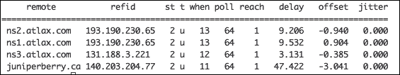
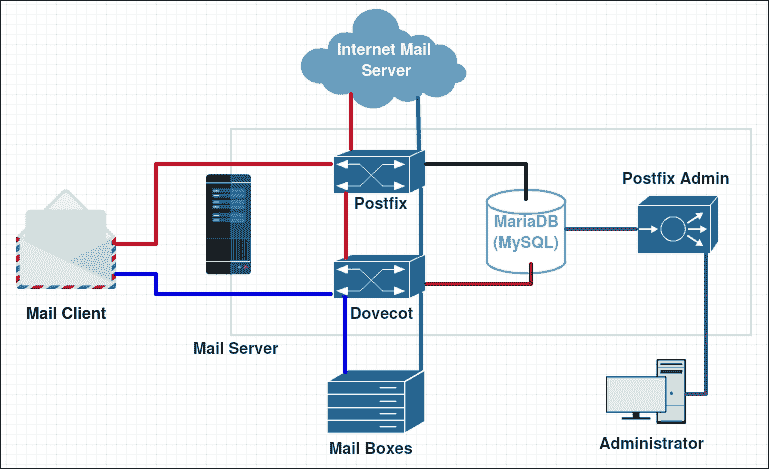
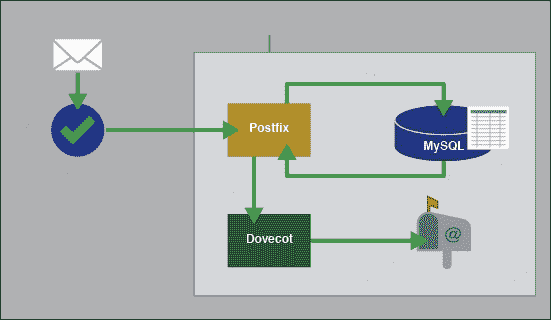
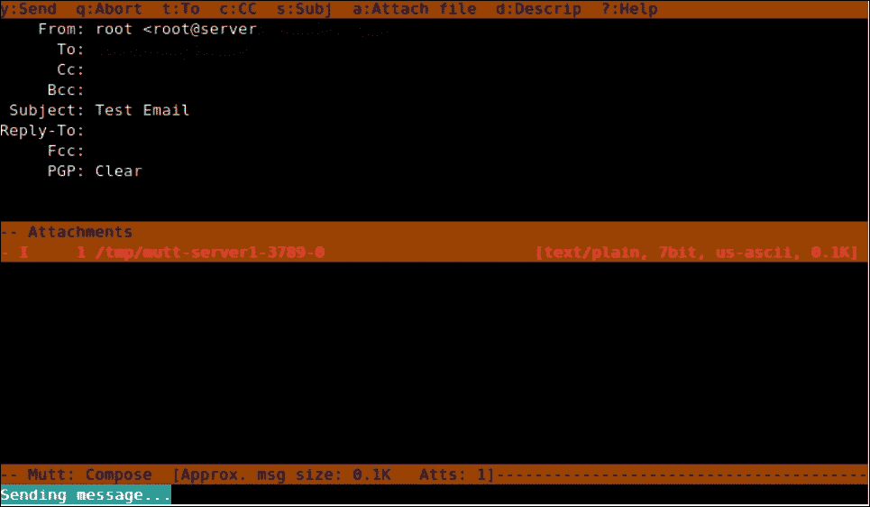
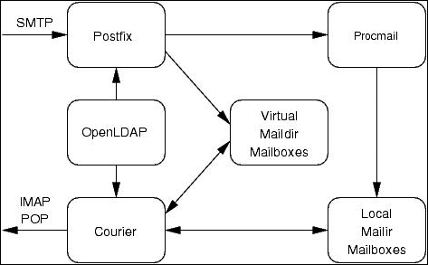

# 第四章：使用 Postfix 的邮件服务器

如今，许多人已经在使用配置和可靠的基于 Web 的邮件服务，如 Gmail，Yahoo 等。大多数人都在质疑是否需要在他们的服务器环境中安装本地电子邮件服务器。好吧，服务器也需要发送电子邮件，不仅仅是人类；当通知管理员服务器处于临界状态时，它对许多其他需求也是有用的。

**Postfix**是 Linux 系统的高性能开源**邮件传输代理**（**MTA**）。它快速，易于管理和安全。它有助于路由和传递电子邮件。Postfix 支持加密和虚拟域，其配置文件清晰，易于理解和编辑。

Postfix 的安装将分为多个部分。由于本章是关于使用 Postfix 设置电子邮件服务器并添加一些工具使其完全合格，然后对其进行安全设置，我们将逐步进行安装，每次添加新工具或新调整时，我们将在不同的章节部分中进行拉伸。

在本章中，我们将学习以下内容：

+   使用 CentOS 7 Linux 设置和配置 Postfix 电子邮件服务器

+   将其配置为在 MySQL 数据库上存储用户和虚拟域

+   设置邮件工具（Dovecot）来获取电子邮件

+   配置 OpenLDAP 活动目录

+   使用 SSL/TLS 安全两种邮件服务

# 设置和配置 Postfix 邮件服务器

众所周知，作为 MTA 的 Postfix 充当 SMTP 服务器。它接受传入邮件并将其传递给负责检索邮件的服务。然后将出站邮件转发到下一个负责的 SMTP 服务器。对于 SMTP 服务，我们需要在系统防火墙中打开端口 25/TCP。Postfix 非常容易设置和配置。我们只需要确保已完成一些预安装步骤，以便进行清洁设置。

首先，我们需要使用`Firewalld`为邮件服务器的所有所需服务打开防火墙所需的端口。我们将要打开的端口来自以下服务：

+   **简单邮件传输协议（SMTP）**：25 on TCP

+   **Secure SMTP (SMTPS)**: 465 on TCP

+   **邮件提交代理（MSA）**：587 on TCP

+   **邮局协议 3（POP3）**：110 on TCP

+   **Secure POP3**: 995 on TCP

+   **Internet Message Access Protocol (IMAP)**: 143 on TCP

+   **Secure IMAP (IMAP SSL)**: 993 on TCP

这是如何使用 Firewalld 在系统本地防火墙中应用更改的方法：

```
$ sudo firewall-cmd --permanent --add-port=25/tcp
$ sudo firewall-cmd --permanent --add-port=465/tcp
$ sudo firewall-cmd --permanent --add-port=587/tcp
$ sudo firewall-cmd --permanent --add-port=995/tcp
$ sudo firewall-cmd --permanent --add-port=993/tcp
$ sudo firewall-cmd --permanent --add-port=143/tcp
$ sudo firewall-cmd --permanent --add-port=110/tcp
$ sudo firewall-cmd --reload

```

之后，我们需要为服务器设置准确的时间，因此我们需要安装一个**NTP**客户端，将机器时间与全球范围内的许多可用的 NTP 服务器之一同步。我们需要使用`yum`软件包管理器安装 NTP 客户端服务：

```
$ sudo yum install ntpd

```

通常，安装 NTP 客户端时，已经配置了一些默认的 NTP 服务器来与其同步时间。但是，如果我们有一个本地 NTP 服务器并且想要使用它，我们可以随时转到 NTP 的配置文件并添加它。作为最佳实践，建议始终至少有三个 NTP 服务器：

```
$ sudo nano /etc/ntp.conf

```

我们寻找以`server`开头的行，并注释掉不需要的服务器，然后添加我们想要的服务器（在下面的片段中显示为`LOCAL_NTP_SERVER_IP_ADDRESS`）：

```
#server 0.centos.pool.ntp.org iburst
server LOCAL_NTP_SERVER_IP_ADDRESS iburst

```

我们需要启动 NTP 服务并将其添加到系统启动服务中：

```
$ sudo systemctl start ntpd
$ sudo systemctl enable ntpd

```

要验证 NTP 客户端是否与定义的服务器同步，我们需要使用命令`ntpq -p`。让我们看一下以下输出：



在使服务器时间准确之后，我们需要确保服务器的主机名配置正确，因为外国邮件服务器可能不接受来自我们服务器的邮件，因为其名称可疑。我们可以使用以下命令进行验证：

```
$ hostname -f

```

如果我们收到一个完全合格的域名`server.domain`，我们可以继续，其中`server`是我们服务器的主机名，`domain`是它所属的地方。否则，我们需要通过编辑主机名配置文件来设置一个：

```
$ sudo nano /etc/hosts
$ sudo nano /etc/hostname

```

或者您也可以使用以下命令：

```
$ sudo hostnamectl set-hostname

```

我们应该确保编写一个写得很好的域地址。然后我们保存文件。

最后，我们需要检查我们的 DNS 解析。我们的服务器应该使用完全合格的 DNS，这意味着它可以解析来自 Web 的所有地址。我们需要检查`/etc/resov.conf`文件：

```
$ sudo cat /etc/resolv.conf

```

如果我们不确定配置的 DNS 服务器是否已经更新以处理我们所有的查询，我们可以编辑文件并添加一些我们确定合格的 DNS 服务器（Google DNS：`8.8.8.8`，`8.8.4.4`）。我们可以使用`nslookup`命令测试我们的 DNS 服务器：

```
$ sudo nano /etc/resolv.conf

```

我们现在准备在我们的服务器上安装 Postfix。正如我们之前提到的，安装和配置将继续为每个部分添加和配置到同一台服务器。

在本节中，我们将首先安装和配置我们的 Postfix 作为 SMTP 服务器。首先，我们需要使用`yum`安装`postfix`软件包。我们需要计划接下来的部分。由于`yum`软件包管理器中的 Postfix 的默认版本不支持**MariaDB**（MySQL 的替代品），我们需要从**CentOSPlus 存储库**安装 Postfix。在开始安装之前，我们需要在一些存储库中添加排除以防止覆盖 Postfix 软件包更新：

```
$ sudo nano /etc/yum.repos.d/CentOS-Base.repo

```

然后我们需要确保在`[base]`和`[updates]`存储库源的末尾添加`exclude=postfix`行，看起来像这样：

```
[base]
name=CentOS-$releasever - Base
exclude=postfix

#released updates
[updates]
name=CentOS-$releasever - Updates
exclude=postfix
```

保存文件后，我们可以开始安装软件包。我们将安装必要的软件包，以拥有一个完全运行的邮件服务器：Postfix 作为 SMTP 的 MTA 邮件服务器，Dovecot 用于 IMAP 和 POP 守护程序，以及一些支持身份验证服务的软件包：

```
$ sudo yum --enablerepo=centosplus install postfix
$ sudo yum install dovecot mariadb-server dovecot-mysql

```

在这里，我们将合并工具的安装，但配置将分别放在本章的每个部分中。

安装了 Postfix 邮件服务器后，我们可以开始配置。Postfix 几乎所有的选项都是作为注释或不完全适用的。因此，为了完全配置 Postfix，我们需要转到其主配置文件并进行一些更改。首先，我们使用任何文本编辑器打开文件：

```
$ sudo nano /etc/postfix/main.cf

```

然后我们开始更改取消注释的行，并添加关于所需邮件服务器的信息。由于我们将在一个大文件中进行许多单独的更改，因此我们不应添加任何不必要的行，因为我们将一次指向应更改的行。在任何时候，如果我们使用**nano**作为文本编辑器，我们可以始终使用搜索选项使用*Ctrl* + *W*的组合，并键入行的第一部分来查找所需的行。

接下来，我们需要定义我们的邮件服务器主机名。我们转到选项`myhostname`的行，并取消注释该行，并将其更改为所需的信息，如以下示例所示：

```
myhostname = server.packt.co.uk
```

然后，我们需要在选项`mydomain`的行上设置域名，如下例所示：

```
mydomain = packt.co.uk
```

接下来是源，它与域具有相同的值，在选项`myorigin`的行上：

```
myorigin = $mydomain
```

然后，我们定义我们的服务器将提供其服务（监听）的网络接口。在我们的情况下，我们将使用所有这些接口。为了设置，我们要么注释掉第`116`行并取消注释第`113`行，要么只需将第`116`行更改为以下代码：

```
inet_interfaces = all
```

然后我们移动到选项`mydestination`的行，将域地址添加到目标域的行的末尾：

```
mydestination = $myhostname, localhost.$mydomain, localhost, $mydomain
```

然后我们跳到选项`mynetworks`的行，取消注释并添加我们将用于与服务器相关的网络的其他网络：

```
mynetworks = 127.0.0.0/8, 192.168.8.0/24, 10.0.1.0/24
```

然后，我们跳到选项`home_mailbox`的行，取消注释邮箱文件夹位置选项，并将其更改为适合我们需求的内容：

```
home_mailbox = maildir/
```

通过转到选项`smtpd_banner`的行并取消注释它并更改它以看起来像以下代码，结束行计数：

```
smtpd_banner = $myhostname ESMTP
```

然后我们转到文件的末尾，添加以下行并限制服务器处理的电子邮件大小（10 兆字节= 10485760）：

```
message_size_limit = 10485760
```

此外，我们需要限制邮箱文件夹的大小（1 千兆字节= 1073741824）：

```
mailbox_size_limit = 1073741824
```

最后，我们设置 SMTP 服务器身份验证配置选项行：

```
smtpd_sasl_type = dovecot
smtpd_sasl_path = private/auth
smtpd_sasl_auth_enable = yes
smtpd_sasl_security_options = noanonymous
broken_sasl_auth_clients = yes
smtpd_sasl_local_domain = $myhostname
smtpd_recipient_restrictions = permit_mynetworks,permit_auth_destination,permit_sasl_authenticated,reject
```

此配置被视为初始配置。设置完成后，我们可以随时使用命令`postconf -e`来更改选项或设置新选项。如果我们需要更改服务器主机名，我们需要按以下方式编写：

```
$ sudo postconf -e 'myhostname = mailserver.packt.co.uk'

```

确保所有配置都设置好后，我们可以启动我们的 Postfix 服务并将其添加到系统启动服务中：

```
$ sudo systemctl restart postfix
$ sudo systemctl enable postfix

```

只是为了验证一切是否正常，我们需要对 Postfix 服务进行小测试。有许多方法可以进行此测试。我们将使用使用命令`mail`发送邮件，然后验证位于`/var/log/maillog`的邮件日志文件：

```
$ echo "Testing the Postfix mail service" | mail -s "This is a test mail" user2@server.packt.co.uk && tail -f /var/log/maillog

```

然后我们应该在邮件日志文件中看到以下消息，告诉我们以下消息以知道邮件已经发送成功，Postfix 服务正常工作：

```
server postfix/local[28480]: 98E2F61B6365: to=<user2@server.packt.co.uk>, relay=local, delay=0.02, delays=0.01/0/0/0, dsn=2.0.0, status=sent (delivered to maildir)

```

通过这一步，我们可以说我们已成功将 Postfix 配置为 MTA。但这可能不是一个设置良好的邮件服务器。我们需要添加和配置一些工具来帮助使其合格和安全。我们将在接下来的部分开始添加和配置必要的工具。这是我们的邮件服务器在安装和运行所有组件后的样子：



# 为虚拟域和用户设置 MariaDB

由于我们在安装 Postfix 时已经安装了**MariaDB**（MySQL 的可替代品），我们可以继续进行配置。但是，如果我们需要再次安装该软件包，我们可以随时使用`yum`：

```
$ sudo yum install mariadb-server

```

开始 MariaDB 配置的第一件事是启动服务。此外，我们需要将其添加到系统启动服务中：

```
$ sudo systemctl enable mariadb.service
$ sudo systemctl start mariadb.service

```

然后，我们通过设置安全安装模式来开始配置，我们可以在其中设置或更改 MariaDB 根密码，删除匿名用户帐户，禁用本地主机以外的根登录等：

```
$ sudo mysql_secure_installation

```

我们应该确保在最后回答是以完成配置。

现在我们已经很好地配置了 MariaDB 服务，并准备好使用。我们将开始设置新数据库以便与 Postfix 一起使用。要添加新数据库，我们需要打开 MariaDB shell：

```
$ sudo mysql -u root -p

```

然后我们创建一个新数据库：

```
> CREATE DATABASE mail;

```

接下来，我们切换到该数据库以开始对其进行更改：

```
> USE mail;

```

然后我们创建一个数据库用户，授予他们对邮件数据库的权限，成为邮件管理员：

```
> GRANT SELECT, INSERT, UPDATE, DELETE ON mail.* TO 'mail_admin'@'localhost' IDENTIFIED BY 'mail_admin_password';
> GRANT SELECT, INSERT, UPDATE, DELETE ON mail.* TO 'mail_admin'@'localhost.localdomain' IDENTIFIED BY 'mail_admin_password';

```

管理员密码`mail_admin_password`应该是一个非常强大的密码，以更好地保护邮件服务器数据库。

然后我们提交更改：

```
> FLUSH PRIVILEGES;

```

现在我们开始在我们的数据库中创建必要的表。首先，我们创建虚拟域表：

```
> CREATE TABLE domains (domain varchar(50) NOT NULL, PRIMARY KEY (domain) );

```

然后我们创建处理邮件转发的表：

```
> CREATE TABLE forwardings (source varchar(80) NOT NULL, destination TEXT NOT NULL, PRIMARY KEY (source) );

```

接下来，我们创建一个表，用于存储邮件服务器用户：

```
> CREATE TABLE users (email varchar(80) NOT NULL, password varchar(20) NOT NULL, PRIMARY KEY (email) );

```

最后，我们创建传输表：

```
> CREATE TABLE transport ( domain varchar(128) NOT NULL default '', transport varchar(128) NOT NULL default '', UNIQUE KEY domain (domain) );

```

我们已经成功设置了邮件服务器数据库表的初始配置。现在我们可以离开 MariaDB shell：

```
> quit

```

为了使 Postfix 能够与 MariaDB 服务器通信，我们需要设置 MariaDB 监听 IP 地址`127.0.0.1`的本地主机。要设置此配置，我们需要编辑`/etc/my.cnf`并添加以下部分`[mysql]`：

```
bind-address=127.0.0.1
```

然后我们重新启动 MariaDB 服务：

```
$ sudo systemctl restart mariadb.service

```

我们的邮件服务器数据库配置还没有完成。现在我们回到 Postfix 配置，以设置与之前在 MariaDB 中创建的数据库代码的通信。因此，我们需要告诉 Postfix 应该使用哪个数据库的哪个表来存储特定信息（用户、虚拟域等）。

我们首先为每个表创建配置文件。对于虚拟域配置，我们创建一个名为`/etc/postfix/mysql-virtual_domains.cf`的文件：

```
$ sudo nano /etc/postfix/mysql-virtual_domains.cf

```

然后我们在其中放入以下代码并保存：

```
user = mail_admin
password = mail_admin_password
dbname = mail
query = SELECT domain AS virtual FROM domains WHERE domain='%s'
hosts = 127.0.0.1
```

再次，`mail_admin_password` 应该被我们之前创建的强密码替换。这适用于我们将要创建的所有以下文件。

然后我们在`/etc/postfix/mysql-virtual_forwardings.cf`中创建虚拟转发的配置文件：

```
$ sudo nano /etc/postfix/mysql-virtual_forwardings.cf

```

我们在其中添加以下代码：

```
user = mail_admin
password = mail_admin_password
dbname = mail
query = SELECT destination FROM forwardings WHERE source='%s'
hosts = 127.0.0.1
```

我们为虚拟邮箱创建另一个配置文件，名为`/etc/postfix/mysql-virtual_mailboxes.cf`：

```
$ sudo nano /etc/postfix/mysql-virtual_mailboxes.cf

```

然后我们插入以下代码：

```
user = mail_admin
password = mail_admin_password
dbname = mail
query = SELECT CONCAT(SUBSTRING_INDEX(email,'@',-1),'/',SUBSTRING_INDEX(email,'@',1),'/') FROM users WHERE email='%s'
hosts = 127.0.0.1
```

最后，我们通过创建文件`/etc/postfix/mysql-virtual_email2email.cf`来为虚拟电子邮件映射创建配置文件：

```
$ sudo nano /etc/postfix/ mysql-virtual_email2email.cf

```

然后在其中添加以下代码并保存：

```
user = mail_admin
password = mail_admin_password
dbname = mail
query = SELECT email FROM users WHERE email='%s'
hosts = 127.0.0.1
```

现在我们设置文件的权限和所有权，以使 Postfix 能够处理新的配置文件：

```
$ sudo chmod o= /etc/postfix/mysql-virtual_*.cf
$ sudo chgrp postfix /etc/postfix/mysql-virtual_*.cf

```

然后我们创建一个用于处理邮件的用户和组。虚拟邮箱将全部存储在此用户的主目录下。我们选择组 5000 以保持与系统为常规用户创建的组的距离：

```
$ sudo groupadd -g 5000 vmail
$ sudo useradd -g vmail -u 5000 vmail -d /home/vmail -m

```

要完成配置，我们需要对 Postfix 配置进行一些微小的更改。我们不会打开配置文件并编辑它，我们只会使用命令`postconf -e`来添加它们。

我们首先找到新创建的配置文件，以解决数据库表的问题：

```
$ sudo postconf -e 'virtual_alias_domains ='
$ sudo postconf -e 'virtual_alias_maps = proxy:mysql:/etc/postfix/mysql-virtual_forwardings.cf, mysql:/etc/postfix/mysql-virtual_email2email.cf'
$ sudo postconf -e 'virtual_mailbox_domains = proxy:mysql:/etc/postfix/mysql-virtual_domains.cf'
$ sudo postconf -e 'virtual_mailbox_maps = proxy:mysql:/etc/postfix/mysql-virtual_mailboxes.cf'

```

然后我们设置邮箱文件夹将被创建的位置：

```
$ sudo postconf -e 'virtual_mailbox_base = /home/vmail'

```

最后，我们看到将控制配置文件并添加邮箱文件夹的用户 UID：

```
$ sudo postconf -e 'virtual_uid_maps = static:5000'
$ sudo postconf -e 'virtual_gid_maps = static:5000'

```

要完成邮件服务器数据库配置，我们需要重新启动 Postfix 服务以提交更改：

```
$ sudo systemctl restart postfix.service

```

我们可以说我们已经完成了邮件服务器数据库服务。但是，如果我们需要配置 Postfix 与虚拟域一起使用，以便使用与系统默认域名不同的域名发送电子邮件，我们需要对 Postfix 主配置文件进行一些微小的修改。此外，我们可以随时使用命令`postconf -e`进行快速更改：

```
$ sudo nano /etc/postfix/main.cf

```

然后我们在文件末尾添加以下代码：

```
virtual_alias_domains = packtmail2.co.uk
virtual_alias_maps = hash:/etc/postfix/virtual
```

然后我们需要将新域添加到虚拟域文件`/etc/postfix/virtual`中：

```
$ sudo nano /etc/postfix/virtual

```

然后我们在任何地方添加以下片段：

```
user1@mail.packtmail2.co.uk user1
```

然后我们通过刷新 Postfix 映射并重新启动服务来应用更改：

```
$ sudo postmap /etc/postfix/virtual
$ sudo systemctl reload postfix

```

# 设置邮件工具（Dovecot）以检索邮件

正如我们之前所说，**Dovecot** 是一个开源的 **IMAP** 和 **POP3** 服务器。它运行速度快，易于设置和配置，并且使用的内存很少。在本节中，我们将安装它以与 Postfix 一起工作作为 **MDA**（POP/IMAP 服务），并使用筛选器在邮件服务器 POP/IMAP 服务中对邮件进行分类。正如这个图像所示，Dovocot 位于用户邮箱和 Postfix 之间：



由于我们已经安装了 Dovecot，现在我们只需要配置它与 Postfix 一起工作。如果我们错过了安装，我们可以随时使用`yum`软件包管理器进行重新安装：

```
$ sudo yum install dovecot

```

然后，我们需要向 Postfix 配置文件添加 Dovecot 支持。再次强调，我们不会打开配置文件并编辑它，我们只会使用命令`postconf -e`。首先，我们需要启用 Dovecot 以使用 SMTP 并启用服务身份验证：

```
$ sudo postconf -e 'smtpd_sasl_type = dovecot'
$ sudo postconf -e 'smtpd_sasl_path = private/auth'
$ sudo postconf -e 'smtpd_sasl_auth_enable = yes'
$ sudo postconf -e 'broken_sasl_auth_clients = yes'
$ sudo postconf -e 'smtpd_sasl_authenticated_header = yes'

```

然后我们启用 Postfix 以根据需要创建和扩展邮件目录：

```
$ sudo postconf -e 'virtual_create_maildirsize = yes'
$ sudo postconf -e 'virtual_maildir_extended = yes'

```

最后，我们设置邮件传输参数：

```
$ sudo postconf -e 'proxy_read_maps = $local_recipient_maps $mydestination $virtual_alias_maps $virtual_alias_domains $virtual_mailbox_maps $virtual_mailbox_domains $relay_recipient_maps $relay_domains $canonical_maps $sender_canonical_maps $recipient_canonical_maps $relocated_maps $transport_maps $mynetworks $virtual_mailbox_limit_maps'
$ sudo postconf -e 'virtual_transport = dovecot'
$ sudo postconf -e 'dovecot_destination_recipient_limit = 1'

```

对于本节，我们将使用 Dovecot 提供的默认安全选项，因此我们需要告诉 Postfix 使用 Dovecot 提供的 SSL 证书和密钥：

```
$ sudo postconf -e 'smtpd_use_tls = yes'
$ sudo postconf -e 'smtpd_tls_cert_file = /etc/pki/dovecot/certs/dovecot.pem'
$ sudo postconf -e 'smtpd_tls_key_file = /etc/pki/dovecot/private/dovecot.pem'

```

然后我们转到 Postfix 的服务配置文件`/etc/postfix/master.cf`：

```
$ sudo nano /etc/postfix/master.cf

```

将 Dovecot 服务添加到文件底部，然后保存并退出：

```
dovecot   unix  -       n       n       -       -       pipe
 flags=DRhu user=vmail:vmail argv=/usr/libexec/dovecot/deliver -f ${sender} -d ${recipient}

```

然后我们转到 Dovecot 服务配置。在开始配置之前，我们需要备份初始配置文件的副本：

```
$ sudo cp /etc/dovecot/dovecot.conf /etc/dovecot/dovecot.conf-backup

```

对于此示例，我们将创建自己的新配置文件，在其中我们将逐个指定每个参数。我们将创建一个与原始配置文件同名的新文件：

```
$ sudo nano /etc/dovecot/dovecot.conf

```

然后我们添加以下代码，不包括描述：

```
# We define the protocols that we want to be serving
protocols = imap pop3
# Enable Dovecot to listen to all domains
listen = *
# Define the time format to be shown at the log file
log_timestamp = "%Y-%m-%d %H:%M:%S "
# Define the location of the received mails
mail_location = maildir:/home/vmail/%d/%n/Maildir
# Locate the files to be used for the SSL authentication
ssl_cert = /etc/pki/dovecot/certs/dovecot.pem
ssl_key = /etc/pki/dovecot/private/dovecot.pem

# Define Mailbox main domain setting
namespace {
    type = private
    separator = .
    prefix = INBOX.
    inbox = yes
}

# Define the service users option 
service auth {
    unix_listener auth-master {
        mode = 0600
        user = vmail
    }

    unix_listener /var/spool/postfix/private/auth {
        mode = 0666
        user = postfix
        group = postfix
    }

user = root
}

service auth-worker {
    user = root
}
# Configure the protocol LDA
protocol lda {
    log_path = /home/vmail/dovecot-deliver.log
    auth_socket_path = /var/run/dovecot/auth-master
    postmaster_address = postmaster@packt.co.uk
}
# Configure the protocol POP3
protocol pop3 {
    pop3_uidl_format = %08Xu%08Xv
}
# Database configuration
passdb {
    driver = sql
    args = /etc/dovecot/dovecot-sql.conf.ext
}

userdb {
    driver = static
    args = uid=5000 gid=5000 home=/home/vmail/%d/%n allow_all_users=yes
}
```

我们保存文件以保存配置。然后我们需要创建已分配给 Dovecot 配置文件的数据库文件：

```
$ sudo nano /etc/dovecot/dovecot-sql.conf.ext

```

然后我们添加以下代码，将邮件管理员密码`mail_admin_password`更改为在早期设置 MariaDB 数据库的部分中已设置的密码：

```
driver = mysql
connect = host=127.0.0.1 dbname=mail user=mail_admin password=mail_admin_password
default_pass_scheme = CRYPT
password_query = SELECT email as user, password FROM users WHERE email='%u';
```

然后我们安排文件权限和所有权以限制对文件的访问：

```
$ sudo chgrp dovecot /etc/dovecot/dovecot-sql.conf.ext
$ sudo chmod o= /etc/dovecot/dovecot-sql.conf.ext

```

然后我们开始配置 Dovecot 认证参数，位于其配置文件夹`/etc/dovecot/conf.d/`中。我们从认证过程配置文件开始：

```
$ sudo nano /etc/dovecot/conf.d/10-auth.conf

```

我们需要定位以下行并更改它们：

```
# Line 10: needs to uncommented and changed
disable_plaintext_auth = no

# Line 100: We need to add it login at the end
auth_mechanisms = plain login 
```

然后我们转到邮箱配置文件：

```
$ sudo nano /etc/dovecot/conf.d/10-mail.conf

```

然后取消注释以下行，并将其结尾与以下代码匹配：

```
# Line 30: Define the mailbox directory location
mail_location = maildir:~/maildir
```

类似地，我们需要编辑主配置文件以定义将使用 SMTP 身份验证的 Postfix 用户：

```
$ sudo nano /etc/dovecot/conf.d/10-master.conf

```

取消注释`unix_listener /var/spool/postfix/private/auth`部分，并将其添加到用户和组行中：

```
# Line 96-100: Set the user and group for the Unix listener section
unix_listener /var/spool/postfix/private/auth {
    mode = 0666
    user = postfix 
    group = postfix 
}
```

最后，我们配置 SSL 认证配置文件：

```
$ sudo nano /etc/dovecot/conf.d/10-ssl.conf

```

并将 SSL 选项从`no`更改为`yes`：

```
# Line 8: change it yes
ssl = yes
```

在开始测试之前，我们需要确保在我们的`/etc/aliases`配置文件中定义了两个变量：

```
$ sudo nano /etc/aliases

```

然后我们检查以下代码：

```
postmaster: root
root: postmaster@packt.co.uk
```

然后我们更新别名列表：

```
$ sudo newaliases

```

最后，为了完成 Dovecot 配置，我们需要重新启动 Postfix 和 Dovecot 服务。此外，我们需要将 Dovecot 添加到系统启动服务中：

```
$ sudo systemctl restart postfix.service
$ sudo systemctl restart dovecot.service
$ sudo systemctl enable dovecot.service

```

要验证服务是否正常运行，并且配置文件没有问题，我们需要检查邮件日志文件：

```
$ sudo tail /var/log/maillog

```

我们应该看到类似以下代码的东西，以知道 Dovecot 是否正常运行：

```
dovecot: master: Dovecot v2.2.10 starting up for imap, pop3 (core dumps disabled)

```

### 注意

有时，SELinux 会阻止 Dovecot 使用系统资源，因此我们需要授予 Dovecot 对系统资源的访问权限，或者如果我们有另一种方式来保护服务器，我们可以禁用 SELinux 或将其设置为宽松模式。

此时，我们的邮件服务器已经完全具备作为发件人和收件人工作的条件，具有组织良好的数据库和中等安全级别。我们可以开始测试我们的邮件服务器。

首先，我们将使用**Telnet**服务来检查**Postfix SMTP-AUTH**和**TLS**是否正常工作。我们需要安装 Telnet，如果系统上不存在，运行以下命令：

```
$ sudo yum install telnet

```

然后我们运行测试：

```
$ telnet localhost 25

```

Telnet 将连接，我们将看到 Telnet shell，在其中我们键入以下命令：

```
> ehlo localhost

```

要知道我们的测试是积极的，我们需要看到以下消息：

```
250-server.packt.co.uk
250-PIPELINING
250-SIZE 10485760
250-VRFY
250-ETRN
250-STARTTLS
250-AUTH PLAIN
250-AUTH=PLAIN
250-ENHANCEDSTATUSCODES
250-8BITMIME
250 DSN

```

然后我们退出 Telnet shell：

```
> quit

```

现在我们将测试邮件服务。为此，我们需要首先使用测试域和用户填充我们的数据库。首先，我们进入 MariaDB 数据库 shell：

```
$ sudo mysql -u root -p

```

然后我们切换到我们的邮件数据库：

```
> USE mail;

```

然后我们在域表中创建一个新的域：

```
> INSERT INTO domains (domain) VALUES ('packtmail.co.uk');

```

我们为该域添加一个新用户。我们需要为真实用户输入一个良好的密码：

```
> INSERT INTO users (email, password) VALUES ('user1@packtmail.co.uk', ENCRYPT('user_password'));

```

然后我们退出 MariaDB shell。

现在我们需要向我们新创建的用户发送一封测试邮件。我们需要使用**Mailx**，因此如果尚未安装，我们需要在测试之前安装它：

```
$ sudo yum install mailx

```

然后我们发送我们的测试邮件：

```
$ mailx user1@packtmail.co.uk

```

我们需要输入`Subject`然后按*Enter*。如果我们需要插入一个复制的地址，我们需要输入`Cc:`然后添加复制的地址。然后我们输入消息并按*Enter*，然后发送它，我们需要在末尾输入`.`并按*Enter*。

要检查邮件是否已发送，我们需要查看邮件日志文件；

```
$ sudo tail /var/log/maillog

```

然后我们应该看到类似以下代码的内容以确认它是正常的：

```
to=<user1@packtmail.co.uk>, relay=dovecot, delay=0.11, delays=0.07/0.01/0/0.03, dsn=2.0.0, status=sent (delivered via dovecot service) 

```

现在我们通过可视化 Dovecot 交付日志来检查 Dovecot 交付：

```
$ sudo tail /home/vmail/dovecot-deliver.log

```

我们应该看到类似以下行的内容以确保它正在工作：

```
lda(user1@packtmail.co.uk): Info: msgid=<20150822073408.6537761B3936@server.packt.co.uk>: saved mail to INBOX

```

现在我们可以通过邮件客户端测试我们的邮箱。在这个例子中，我们将使用**Mutt**，这是一个简单的邮件客户端。但在使用之前，我们需要先安装它：

```
$ sudo yum install mutt

```

然后我们需要进入存储新用户邮箱的位置并运行 Mutt：

```
$ sudo cd /home/vmail/packtmail.co.uk/user1/Maildir/

```

现在我们运行 Mutt：

```
$ sudo mutt –f .

```

显示需要创建根邮箱的消息是不需要的，所以我们可以跳过它。要退出 Mutt，输入`q`。

然后我们将会有一个相当清晰的界面，我们可以使用键盘方向键进行导航，并按*Enter*键查看邮件内容。为了确认我们的邮件服务器已经配置好并正在运行，我们应该看到我们使用 Mailx 发送的测试邮件：



# 使用 Postfix 配置 OpenLDAP Active Directory

在本节中，我们将使用 OpenLDAP 作为我们的 Postfix（作为 MTA）和 Dovecot（作为 POP3/IMAP 服务器）用户的后端，以便它们相互连接，并帮助进行地址查找和别名。

### 注意

OpenLDAP 是**轻量级目录访问协议**（**LDAP**）的开源实现。本节不涵盖如何安装 OpenLDAP 服务器。我们假设我们已经在我们的网络中配置了一个。

我们的 OpenLDAP 服务器有以下信息如下：

```
dn: uid=user,ou=people,dc=packtldap,dc=co,dc=uk
objectClass: posixAccount
objectClass: inetOrgPerson
uid: user1
homeDirectory: /home/user1
userPassword: <passwordhash>
```

对于我们的两项服务的 LDAP 设置，我们需要编辑和添加一些选项到它们的配置文件中。我们将从 Dovecot 开始。首先我们会用文本编辑器打开 Dovecot 主配置文件，然后进行必要的更改：

```
$ sudo nano /etc/dovecot/dovecot.conf

```

然后我们检查以下选项是否需要任何更改，或者如果它们不存在，我们需要添加它们：

```
# Define the mail user and group UID and GID
mail_uid = 5000
mail_gid = 5000
# Define the default Authentication method
auth default {
  mechanisms = plain
  # Define the LDAP database password file
  passdb ldap {
          args = /etc/dovecot/dovecot-ldap.pass
  }
  # Define the LDAP database user file
  userdb ldap {
          args = /etc/dovecot/dovecot-ldap.user
  }

  # Define the socket Listening parameters 
  socket listen {
        client {
          path = /var/spool/postfix/private/auth
          mode = 0660
          user = postfix
          group = postfix
  }
}
```

然后我们需要创建 LDAP 数据库文件并填充它们：

```
$ sudo nano /etc/dovecot/dovecot-ldap.user

```

接下来，我们添加以下代码并进行必要的更改，然后保存：

```
hosts = packtldap.co.uk:389
sasl_bind = no
auth_bind = yes
ldap_version = 3
deref = never
base = uid=%n,ou=people,dc=packtldap,dc=co,dc=uk
scope = base
user_attrs = homeDirectory=home
dn = uid=manager,dc=packtldap,dc=co,dc=uk
dnpass = password
```

以下图片显示，OpenLDAP 提供收件箱和发件箱邮件服务：



我们对第二个 LDAP 数据库文件做同样的操作：

```
$ sudo nano /etc/dovecot/dovecot-ldap.pass

```

然后我们添加以下代码并进行必要的更改，保存文件并退出：

```
hosts = packtldap.co.uk:389
sasl_bind = no
auth_bind = yes
ldap_version = 3
deref = never
base = uid=%n,ou=people,dc=packtldap,dc=co,dc=uk
scope = base
dn = uid=manager,dc=packtldap,dc=co,dc=uk
dnpass = password
```

通过这一步，我们可以说 Dovecote 已成功配置为使用我们的 LDAP 服务器。我们继续进行 Postfix 配置。通常情况下，我们可以使用文本编辑器编辑主配置文件`/etc/postfix/main.cf`，或者我们可以使用快速配置设置命令：

```
$ sudo postconf -e 'accounts_server_host = packtldap.co.uk'
$ sudo postconf -e 'accounts_search_base = ou=people,dc=packtldap,dc=co,dc=uk'
$ sudo postconf -e 'accounts_query_filter = (&(objectClass=inetOrgPerson)(mail=%s))'
$ sudo postconf -e 'accounts_result_attribute = homeDirectory'
$ sudo postconf -e 'accounts_result_format  =  %s/Mailbox'
$ sudo postconf -e 'accounts_scope = sub'
$ sudo postconf -e 'accounts_cache = yes'
$ sudo postconf -e 'accounts_bind = yes'
$ sudo postconf -e 'accounts_bind_dn = uid=manager,dc=packtldap,dc=co,dc=uk'
$ sudo postconf -e 'accounts_bind_pw = password'
$ sudo postconf -e 'accounts_version = 3'
$ sudo postconf -e 'virtual_transport = virtual'
$ sudo postconf -e 'virtual_uid_maps = static:5000'
$ sudo postconf -e 'virtual_gid_maps = static:5000'
$ sudo postconf -e 'virtual_mailbox_base = /'
$ sudo postconf -e 'virtual_mailbox_maps = ldap:accounts'
$ sudo postconf -e 'virtual_mailbox_domains = packtldap.co.uk'

```

然后要提交更改，我们需要重新启动两项服务：

```
$ sudo systemctl restart postfix.service
$ sudo systemctl restart dovecot.service

```

# 使用 SSL/TLS 保护邮件服务器

对于 Postfix 的 SSL/TLS 加密，我们的邮件服务器不仅可以验证远程 SMTP 服务器，还可以加密我们发送的邮件和接收者服务器之间的邮件。

要配置 SSL 以加密连接，我们首先需要创建我们自己的个性化和特定的 SSL 证书。

我们需要进入 TLS 证书目录以在那里创建我们的新证书：

```
$ cd /etc/pki/tls/certs/

```

然后我们创建我们的第一个密钥文件：

```
$ sudo openssl genrsa -des3 -out mailserver.key 2048

```

然后工具会要求输入密码。我们应该输入一个强密码，并在工具要求重新输入时重新输入。

之后我们需要开始使用 OpenSSL 工具；如果没有安装，我们需要先安装它：

```
$ sudo yum install openssl

```

然后我们使用 OpenSSL 来编写 RSA 密钥：

```
$ sudo openssl rsa -in server.key -out server.key

```

然后输入已经定义的密码，然后继续生成密钥。

现在我们继续进行证书创建。在同一文件夹中，我们运行以下命令：

```
$ sudo make mailserver.csr

```

然后我们按照每个字段要求填写信息：**国家名称**，**州或省名称**，**地点名称**，**组织名称**，**组织单位名称**，**通用名称**和**电子邮件地址**，对于最后两个条目（挑战密码和可选公司名称），我们可以跳过它们。

然后我们使用 OpenSSL 创建一个私钥：

```
$ sudo openssl x509 -in mailserver.csr -out server.crt -req -signkey mailserver.key -days 3650 –sha256

```

然后我们转到配置 Postfix 和 Dovecot 以使用 SSL/TLS 加密。

首先，我们将从设置 Postfix 使用 SSL/TLS 开始，通过对其主配置文件`/etc/postfix/main.cf`进行一些修改。我们可以使用文本编辑器编辑文件并更改参数，或者我们可以使用命令`postconf -e`以更快的方式设置它们。

我们将向 Postfix 配置文件添加一些行，以保护它免受针对 OpenSSL 的一些最近攻击：

```
$ sudo nano "/etc/postfix/main.cf
smtpd_tls_exclude_ciphers = aNULL, eNULL, EXPORT, DES, RC4, MD5, PSK, aECDH, EDH-DSS-DES-CBC3-SHA, EDH-RSA-DES-CDC3-SHA, KRB5-DE5, CBC3-SHA
smtpd_tls_dh1024_param_file = /etc/ssl/private/dhparams.pem

smtpd_tls_mandatory_protocols = !SSLv2, !SSLv3
smtpd_tls_protocols = !SSLv2, !SSLv3
smtp_tls_mandatory_protocols = !SSLv2, !SSLv3
smtp_tls_protocols = !SSLv2, !SSLv3

```

我们创建证书文件：

```
$ cd /etc/ssl/private/
$ sudo openssl dhparam -out dhparams.pem 2048
$ sudo chmod 600 dhparams.pem

```

然后我们需要确保 TLS 已启用以用于 SMTP：

```
$ sudo postconf -e 'smtpd_use_tls = yes'

```

然后我们需要重新定义证书和密钥文件的位置：

```
$ sudo postconf -e 'smtpd_tls_cert_file = /etc/pki/tls/certs/mailserver.crt'
$ sudo postconf -e 'smtpd_tls_key_file = /etc/pki/tls/certs/mailserver.key'

```

然后我们设置 TLS 会话数据库缓存的位置：

```
$ sudo postconf -e 'smtpd_tls_session_cache_database = btree:/etc/postfix/smtpd_scache'

```

这就是主配置文件的全部内容。现在我们将配置`/etc/postfix/master.cf`：

```
$ sudo nano /etc/postfix/master.cf

```

我们需要取消注释原始文件的第 16 到 35 行之间的`Submission`和`SMTPS`选项，使其看起来像以下取消注释的内容：

```
submission     inet  n       -       n       -       -       smtpd
  -o syslog_name=postfix/submission
  -o smtpd_sasl_auth_enable=yes
  -o smtpd_recipient_restrictions=permit_sasl_authenticated,reject
  -o milter_macro_daemon_name=ORIGINATING

smtps       inet   n       -       n       -       -       smtpd
  -o syslog_name=postfix/smtps
  -o smtpd_tls_wrappermode=yes
  -o smtpd_sasl_auth_enable=yes
  -o smtpd_recipient_restrictions=permit_sasl_authenticated,reject
  -o milter_macro_daemon_name=ORIGINATING
```

我们已经完成了 Postfix 配置以使用 SSL。现在我们可以为 Dovecot 配置 SSL。我们只需要在`/etc/dovecot/conf.d/10-ssl.conf`文件中进行一些更改：

```
$ sudo nano /etc/dovecot/conf.d/10-ssl.conf

```

首先，我们需要确保 SSL 选项已激活：

```
# Line8: change it to yes 
ssl = yes
```

然后我们更改 SSL 证书和密钥的位置：

```
# Line 14, 15: change the files location to the new one
ssl_cert = </etc/pki/tls/certs/mailserver.crt
ssl_key = </etc/pki/tls/certs/mailserver.key
```

最后，我们需要重新启动服务以提交更改：

```
$ sudo systemctl restart postfix.service
$ sudo systemctl restart dovecot.service

```

# 参考资料

既然我们已经完成了这一章，让我们来看一下使用的参考资料：

+   Postfix 主页：[www.postfix.org](http://www.postfix.org)

+   Postfix MySQL 支持：[`www.postfix.org/MYSQL_README.html`](http://www.postfix.org/MYSQL_README.html)

+   Dovecot 主页概述：[`www.dovecot.org`](http://www.dovecot.org)

+   Postfix 虚拟主机概述：[`www.akadia.com/services/postfix_separate_mailboxes.html`](http://www.akadia.com/services/postfix_separate_mailboxes.html)

+   Dovecot 配置文件：[`wiki.dovecot.org/MainConfig`](http://wiki.dovecot.org/MainConfig)

+   Postfix 中的 LDAP 支持：[`www.postfix.org/LDAP_README.html`](http://www.postfix.org/LDAP_README.html)

+   Postfix TLS 支持：[`www.postfix.org/TLS_README.html`](http://www.postfix.org/TLS_README.html)

# 总结

本章以逐步教程的形式描述了如何从使用 Postfix 发送服务 SMTP 开始设置一个完全合格的邮件服务器。然后，我们开始组织邮件服务器，重点是通过安全数据库服务 MariaDB 发送/接收邮件和虚拟域管理。接下来，我们了解了使用 MDA Dovecot 进行邮件接收服务，该服务本身提供了中等级别的安全性。然后开始扩展部分，当服务器可以连接到 LDAP 服务器并收集有关用户的有用信息并用于发送和接收邮件时，这一部分就会显示出来。最后，我们通过使用 OpenSSL 生成新证书和密钥来完成自定义安全级别，以确保邮件的身份验证和加密的安全性。

在下一章中，我们将学习如何在 CentOS 上设置和配置诸如 Nagios 和 syslog-ng 之类的工具，以监视不同的服务，并收集和处理日志。
