# 第五章：监控和日志

在大型计算基础设施中，系统管理员无法轻松处理每台机器的所有系统服务和硬件问题的监控。应该有一个工具帮助收集基础设施中每台机器的状态，并以全面的方式呈现给系统管理员。因此，监控系统已经被开发出来满足监控各种计算基础设施的需求，并帮助防止系统或硬件损坏。

本章是对监控和日志工具世界的探索，以及更好地实施正确工具和配置正确参数来保护和监督个性化计算基础设施所需的方法。

通过本章，您将学习以下主题：

+   最常见的开源监控工具

+   如何设置 Nagios 作为监控服务器，并监控一些客户端

+   作为日志服务器使用的各种工具

+   如何设置和配置 syslog-ng 作为日志服务器

# 开源监控工具

监控工具可以显示关于系统、服务和硬件状态的实时信息。通过这些信息，系统管理员可以判断是否有异常情况或显示出弱点。然后，他们可以采取行动，尝试在问题恶化之前解决问题。

本节介绍了最常见的开源监控工具。监控工具通常根据其主要需求来选择。一些监控工具专门用于监控一组机器的特性。其他工具帮助存储并生成历史图表，以供将来的系统分析使用。

许多组织依赖他们的监控工具来输出，不仅是为了维护他们的系统和防止潜在问题，还为了确定他们的系统的高峰时段以及系统更空闲状态。这有助于他们加强系统容量，并节省电力和资源。

## Ganglia

我们将从讨论最常见的监控系统工具之一开始。Ganglia 是一个可扩展的分布式监控系统，适用于高性能计算基础设施。它广泛用于集群和网格架构。这是一个基于 Web 的工具，允许用户可视化机器的统计历史，如 CPU 负载平均值，网络使用等。它已经被开发成具有低节点开销和高并发性。目前全球数千个集群正在使用它。

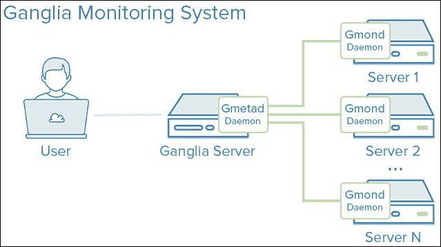

来源：[`assets.digitalocean.com/`](http://assets.digitalocean.com/)

Ganglia 基于两个基本服务，一个安装在客户端机器上，一个安装在服务器上。在客户端，服务称为**gmond**。gmond 是在我们想要监视的客户机器上运行的多线程守护程序。其服务基本上与以下相关：

+   监控机器状态的变化

+   宣布相关变化

+   监听其他 Ganglia 节点的状态

+   响应对其正在运行的机器的 XML 描述的请求

然后，我们有 Ganglia PHP Web 前端，它安装在监控服务器上。它通过实时、动态的网页提供了收集信息的视图。这些页面是 Ganglia 提供给用户（包括系统管理员）的仪表板。它们以有意义的方式组织，以向系统管理员呈现机器的状态，使诊断部分对他们来说更加容易。Ganglia Web 前端存储有关机器的数据长达 1 年，并且有许多可自定义的参数，用于查看机器的状态历史。

Ganglia 是一个非常有用的工具，用于监控机器的状态，并具有非常可靠的历史管理仪表板和各种故障排除相关问题。然而，在服务器环境中工作时，它并不是一个可以轻松监控每一个服务的工具，特别是当系统管理员将服务管理置于机器本身之上时。

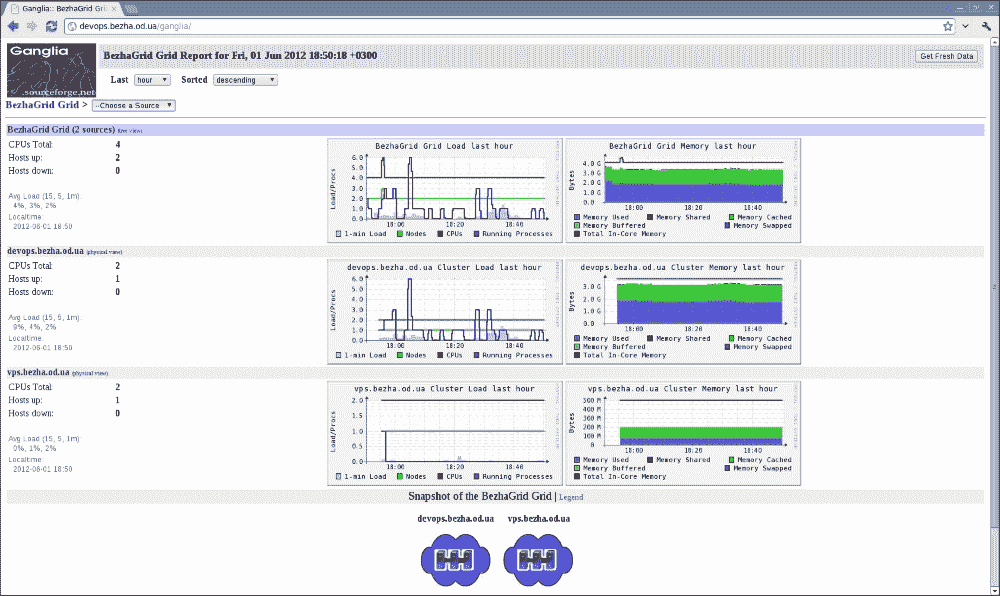

来源：[`bezha.od.ua`](http://bezha.od.ua)

## OpenNMS

**OpenNMS**是一个开源的、企业级的网络监控和管理平台。它是一个分布式和可扩展的管理应用程序，涵盖网络管理的各个方面。它被设计为高度可定制，以创建独特的、集成的管理解决方案。

OpenNMS 支持四个主要的功能领域：

+   事件管理和通知

+   发现和配置

+   服务监控

+   数据收集

OpenNMS 可以通过一个智能而有组织的基于 Web 的界面访问，从数据库和收集的性能数据中创建高级报告。它非常适用于使用 SNMP 协议进行监控、警报/通知、报告、升级以及其组织良好、清晰的仪表板。然而，学习如何使用它并通过制作个性化脚本来个性化它是相当困难的。此外，大多数高级功能都是付费的，还包括其他成本。要使其完美运行，可能需要花费大量时间进行设置和配置，但结果总是令人满意的。

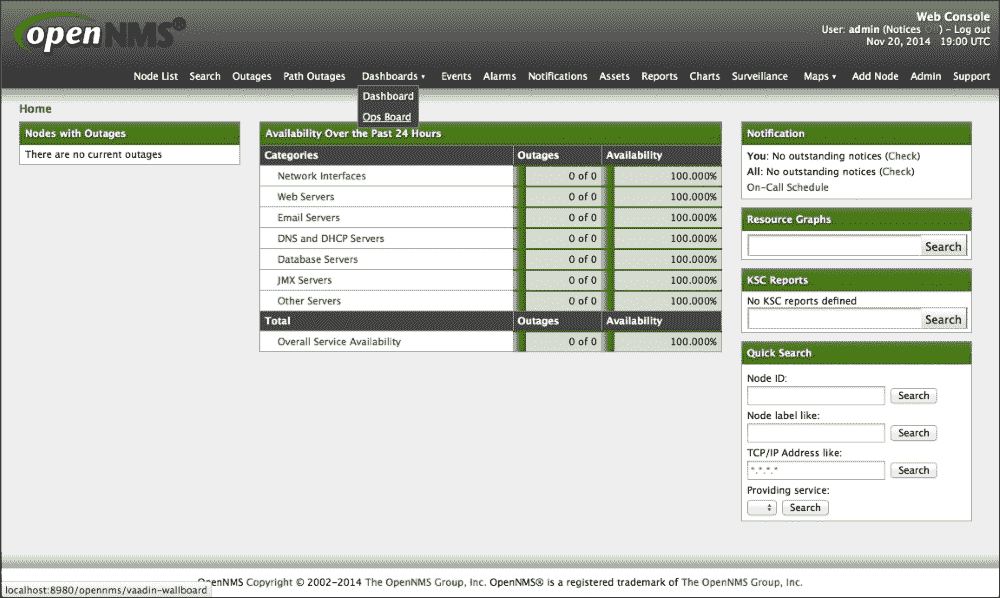

来源：[`docs.opennms.org`](http://docs.opennms.org)

## Zabbix

**Zabbix**是一款用于实时监控网络和应用程序的开源企业级软件。它被设计用于监控和跟踪各种网络服务、服务器和其他网络硬件的状态。它有能力监控主要协议（HTTP、FTP、SSH、POP3、SMTP、SNMP、MySQL 等）。

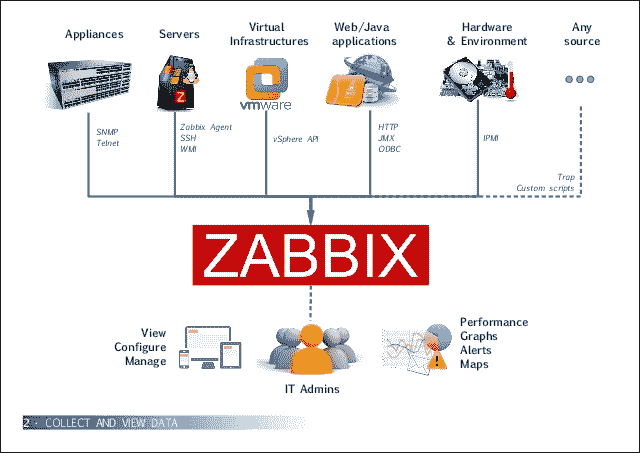

来源：[`image.slidesharecdn.com`](http://image.slidesharecdn.com)

Zabbix 具有处理数十万台设备的高性能能力。此外，它具有自动发现的能力，可以识别同一网络中的机器。Zabbix 配备了一个基于 Web 的界面，用于显示监控仪表板。这个界面可以通过安全的用户认证访问，并且具有集中式 Web 管理，可以可视化和比较其监控的任何值。此仪表板可以根据用户的需求进行定制。

Zabbix 有能力监控网络上的任何事件，从网络流量到打印机中剩余的纸张数量。

然而，与其他监控工具相比，Zabbix 设置和配置更复杂，需要良好的文档才能按照最佳实践进行安装。

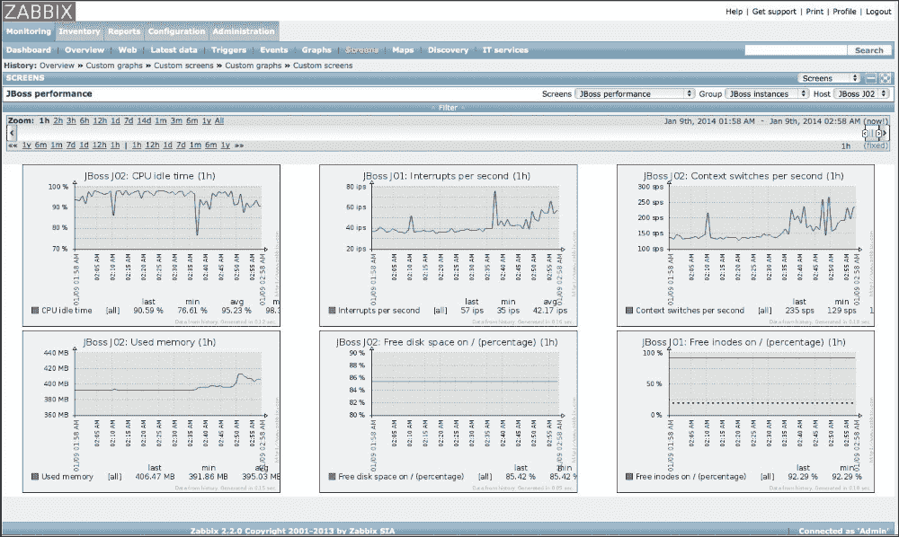

来源：[`dist.alternativeto.net/`](http://dist.alternativeto.net/)

## Zenoss

**Zenoss**，有时被称为**Zenoss Core**，是一个基于 Zope 应用服务器的免费开源应用程序、服务器和网络管理平台。它为系统管理员提供了一个基于 Web 的界面，具有监控可用性、库存/配置、性能和事件的能力。

Zenoss 具有以下特点：

+   通过一个漂亮的地图（如 Google Maps）监控全球范围内的远程位置

+   一个非常用户友好的美丽的 Web 界面

+   自动发现客户端系统参数

+   使用简单明了的 SNMP

Zenoss 看起来非常先进和花哨，但它的 Web 界面稍微慢一些。它不支持实时通知。我们必须等待它处理信息，才能清楚地了解环境中发生了什么。它只有一个仪表板，这使得对许多系统管理员来说监控有些困难。此外，它是一个有限的开源解决方案；对于更高级的功能，我们需要支付更多。然而，对于愿意支付和投资的人来说，我们可以说这是一个非常不错的选择。

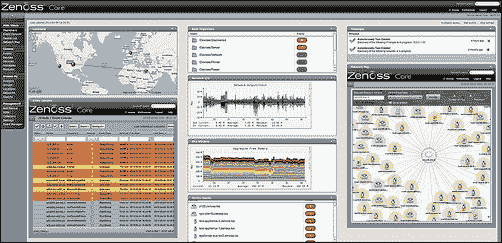

来源：[`socializedsoftware.com/`](http://socializedsoftware.com/)

## Nagios

**Nagios**是一个用于监控系统、网络和基础设施的开源应用程序。它为大型计算机基础设施上的服务器、网络设备、应用程序和服务提供监控和警报服务。它有两种类型的警报，一种是用于通知问题，另一种是用于通知问题是否已解决。

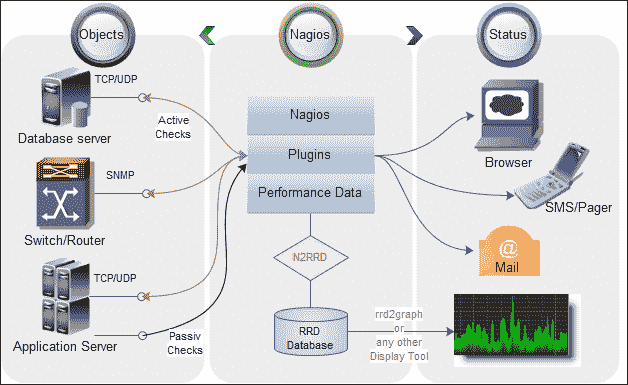

来源：[`n2rrd-wiki.diglinks.com`](http://n2rrd-wiki.diglinks.com)

Nagios 通过网络插件和远程运行脚本来监控网络服务、主机资源和探针。它有一个庞大的社区，这使得开发了一些非常强大的插件。它被认为是最容易设置和使用的监控工具之一，通过其 Web 界面。但是，它也有一些缺点，与第三方插件的质量以及一些复杂的编写和配置自定义插件有关。最后，它会触发大量的通知和警报，因此我们可能需要使用适当的插件来帮助监控基础设施中的所有内容。

## Icinga

**Icinga**是一个开源的系统和网络监控工具。它最初是作为 Nagios 监控系统的一个分支创建的。它在 Web 界面方面得到了很好的发展，提供了比 Nagios 更美观和更交互式的东西。

Icinga 的有效性在于它能够实现非常强大的插件。它实现了许多著名的图形工具，如 PNP4Nagios、inGraph 和 Graphite。Icinga 最著名的功能是它的轻量性，在运行时不会过载系统，并且能够实时生成信息图。对于非常大的基础设施，Icinga 被设计为多线程运行，每秒运行数千次检查而不会对系统资源造成任何过载。

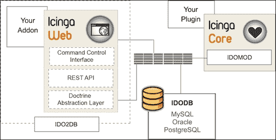

来源：[`www.icinga.org/`](https://www.icinga.org/)

Icinga 有一个相当大的社区，他们能够很快地帮助集成补丁。**Icinga**有两个官方版本：一个是**Web 1 Icinga**，另一个是**Web 2 Icinga2**。但它仍在不断发展中。

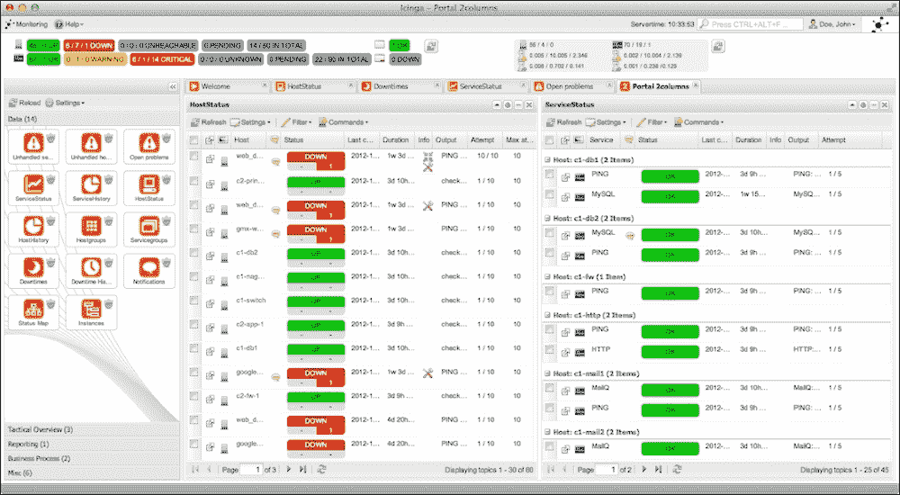

来源：[`www.icinga.org/`](https://www.icinga.org/)

# 设置 Nagios 作为监控服务器

对于本章，我们将选择 Nagios 作为最佳选择，考虑到其性能和设置配置的简单性。正如我们已经提到的，Nagios 是可以安装在多个 Linux 发行版上的开源软件。在我们的案例中，我们将在 CentOS 7 上安装它。它是一个网络、基础设施和服务器监控工具。它将监控交换机、应用程序和服务。它具有警报功能，可以帮助通知用户在监控基础设施时发生的所有问题。它还会在问题得到解决时通知用户。除了监控，Nagios 还具有识别可能导致问题的系统或网络问题的能力，并进行实时问题通知。此外，它还具有一些安全功能，可以识别基础设施中的安全漏洞。

在本节中，我们将在一台机器上安装 Nagios。它将充当我们的监控服务器。我们需要一个测试客户端来进行监控。客户端将具有一些常见的服务；我们将尝试对它们进行一些操作，以测试 Nagios 的通知服务。

在开始监控服务器安装之前，让我们先谈谈我们需要的东西。

首先，我们需要在我们的机器上安装**Linux Apache MySQL PHP**（**LAMP**）服务。由于 Nagios 将通过 Web 界面访问，安装 Web 服务器是显而易见的。对于更详细和安全的 Web 服务器安装，您可以返回并查看第三章，*不同用途的 Linux*。

Nagios 不会从 CentOS 7 软件包管理器中安装。我们必须下载它，然后编译它，因此我们需要基本的编译工具和一个下载工具来下载 Nagios 源代码存档。我们将使用 CentOS 软件包管理器 Yum 来安装这些：

```
$ sudo yum install gcc cpp glibc glibc-common glibc-devel glibc-headers gd gd-devel kernel-headers libgomp libmpc mpfr make net-snmp openssl-devel xinetd

```

我们等待安装完成，然后继续准备的下一步。

为了运行 Nagios 进程，我们需要创建一个 Nagios 用户并为其设置密码：

```
$ sudo useradd nagios
$ sudo passwd Really_Secure_Password

```

我们需要确保在创建任何密码时使用安全的密码。

接下来，我们创建一个名为`nagcmd`的新组，以允许通过 Web 界面提交外部命令一旦它运行起来。然后，我们需要将 Nagios 和 Apache 都添加到这个组中：

```
$ sudo groupadd nagcmd
$ sudo usermod -a -G nagcmd nagios
$ sudo usermod -a -G nagcmd apache

```

我们继续进行最后一步，即下载最新版本的 Nagios 源存档。为了进行下载，我们将使用已经安装的工具**Wget**。

在本教程中，我们将使用 Nagios 4：

```
$ wget http://prdownloads.sourceforge.net/sourceforge/nagios/nagios-4.1.1.tar.gz

```

在下载最新的 Nagios 稳定版本之后，我们需要进行解压。由于 Nagios 将安装在我们要提取其源代码的位置，我们需要将其放在一个合适的位置。我们可以选择在`/usr/local`和`/opt`之间，所以我们需要将源包文件复制到那里，然后进行解压。在这个例子中，我们将选择`/usr/local`：

```
$ sudo cp nagios-4.1.1.tar.gz /usr/local/
$ cd /usr/local/
$ sudo tar xzvf nagios-4.1.1.tar.gz

```

在解压存档之后，将创建一个新的文件夹，其中包含名为 Nagios 的文件夹和相应的版本。我们需要进入文件夹开始编译：

```
$ cd nagios-4.1.1/

```

在开始编译过程之前，我们需要运行配置脚本，以便使用之前安装的可用编译工具来运行编译过程，以避免错误：

```
$ sudo ./configure --with-command-group=nagcmd

```

这个配置过程有一个选项，可以将最新创建的组设置为运行内部命令的组。

现在，我们实际上可以开始编译过程：

```
$ sudo make all

```

这个命令可能需要很长时间，取决于机器的处理能力。

完成此操作后，我们继续进行安装阶段。我们需要安装 Nagios、它的初始化脚本、一些示例配置文件和 Nagios Web 界面：

```
$ sudo make install
$ sudo make install-commandmode
$ sudo make install-init
$ sudo make install-config
$ sudo make install-webconf

```

在进行下一步之前，我们需要设置 Nagios 管理员用户和密码以访问 Web 界面：

```
$ sudo htpasswd -c /usr/local/nagios/etc/htpasswd.users nagiosadmin

```

然后，我们需要两次输入密码，以便创建和配置我们的 Web 界面管理员。

Nagios 安装完成后，我们可以添加一些有用的插件。首先，我们需要下载这些插件的最新稳定源版本。我们需要进入`/usr/local`文件夹，并在那里下载插件的源存档。这一步将为未来的诊断安装好一切：

```
$ cd /usr/local

```

然后，我们使用**Wget**开始下载：

```
$ sudo wget http://nagios-plugins.org/download/nagios-plugins-2.1.1.tar.gz

```

### 注意

我们使用了`sudo`命令，因为在下载过程中，文件是写入一个没有用户访问权限的文件夹中的。

下载完成后，我们可以使用相同的命令开始解压存档：

```
$ sudo tar xzvf nagios-plugins-2.1.1.tar.gz

```

然后，我们进入刚刚创建的目录：

```
$ cd nagios-plugins-2.1.1/

```

再次，我们需要编译源文件。在编译之前，我们需要使用一些有用的选项运行配置脚本，如下所示：

```
$ sudo ./configure --with-nagios-user=nagios --with-nagios-group=nagios --with-openssl

```

对于配置选项，我们将用户和组 Nagios 设置为访问和使用插件的默认值。此外，我们使用 OpenSSL 来保护插件的使用。

然后，我们开始编译插件：

```
$ sudo make

```

之后，我们可以开始安装：

```
$ sudo make install

```

一旦这个命令被执行且没有错误，我们就可以说我们的 Nagios 插件已经成功安装。我们可以继续设置**Nagios 远程插件执行器**（**NRPE**）。这是一个简化远程系统监控的 Nagios 代理，使用托管在远程系统上的脚本。我们需要以相同的方式下载、配置、编译和安装它。首先，我们需要找到源包的最新稳定版本，然后将其下载到`/usr/local`：

```
$ cd /usr/local/
$ sudo wget http://downloads.sourceforge.net/project/nagios/nrpe-2.x/nrpe-2.15/nrpe-2.15.tar.gz

```

接下来，我们在相同位置解压它，并进入文件夹开始编译：

```
$ sudo tar xzvf nrpe-2.15.tar.gz
$ cd  nrpe-2.15/

```

我们首先运行 NRPE 配置脚本。我们使用 Nagios 进程和安全工具来定义用户和组：

```
$ sudo ./configure --enable-command-args --with-nagios-user=nagios --with-nagios-group=nagios --with-ssl=/usr/bin/openssl --with-ssl-lib=/usr/lib/x86_64-linux-gnu

```

然后，我们运行编译命令，然后是安装命令：

```
$ sudo make all
$ sudo make install
$ sudo make install-xinetd
$ sudo make install-plugin
$ sudo make install-daemon
$ sudo make install-daemon-config

```

接下来，我们配置`xinetd`启动脚本：

```
$ sudo nano /etc/xinetd.d/nrpe

```

我们需要查找以`only_from`开头的行，然后添加监视服务器的 IP 地址。它可以是公共地址或私有地址，取决于我们希望从哪里让服务器可访问：

```
only_from = 127.0.0.1 10.0.2.1

```

然后，我们保存文件，只允许我们的 Nagios 服务器与 NRPE 通信。之后，我们添加以下行来定义 NRPE 服务的端口号：

```
$ sudo echo "nrpe 5666/tcp # NRPE" >> /etc/services

```

为了使这个配置生效并运行，我们需要重新启动`xinetd`来启动**NRPE**：

```
$ sudo service xinetd restart

```

现在，我们的 Nagios 监控服务器已经正式安装。我们可以继续配置步骤。我们进入 Nagios 主配置文件并激活将存储所有配置文件的文件夹：

```
$ sudo nano /usr/local/nagios/etc/nagios.cfg

```

然后，我们取消注释以下行，保存文件并退出：

```
cfg_dir=/usr/local/nagios/etc/servers

```

### 注意

这只是一个服务器的示例。它也可以用于网络设备、工作站或任何其他类型的网络连接机器。

我们创建一个配置文件夹，用于存储将要被监视的每台机器的配置文件：

```
$ sudo mkdir /usr/local/nagios/etc/servers

```

然后，我们继续配置 Nagios 联系人文件，以设置与 Nagios 管理员关联的电子邮件地址。通常用于接收警报：

```
$ sudo nano /usr/local/nagios/etc/objects/contacts.cfg

```

现在，我们需要更改管理员的电子邮件地址。为此，我们需要在`email`选项后输入正确的电子邮件地址：

```
email                           packtadmin@packt.co.uk        ; <<***** CHANGE THIS TO YOUR EMAIL ADDRESS ******

```

然后，我们保存文件并退出。

现在，我们进行`check_nrpe`命令配置。我们首先向 Nagios 服务器添加一个新命令：

```
$ sudo nano /usr/local/nagios/etc/objects/commands.cfg

```

我们在末尾添加以下行：

```
define command{
 command_name check_nrpe
 command_line $USER1$/check_nrpe -H $HOSTADDRESS$ -c $ARG1$
}

```

我们保存文件并退出，以使新命令可用。

现在，我们继续配置访问限制，以允许访问 Nagios Web 界面的 IP 地址：

```
$ sudo nano /etc/httpd/conf.d/nagios.conf

```

我们需要注释掉这两行：

```
Order allow,deny
Allow from all

```

然后，我们取消注释以下三行：

```
#  Order deny,allow
#  Deny from all
#  Allow from 127.0.0.1

```

### 注意

这些行在配置文件中出现两次，因此我们需要在同一个文件中执行两次相同的操作。这一步只是为了加强 Nagios 的安全性。

我们总是可以添加任何网络或地址以允许其访问监视服务器：

```
Allow from 127.0.0.1 10.0.2.0/24

```

我们总是可以检查 Nagios 配置文件中是否存在任何配置错误，使用以下命令：

```
$ /usr/local/nagios/bin/nagios -v /usr/local/nagios/etc/nagios.cfg

```

在启动 Nagios 之前，我们需要通过将 SELinux 操作从强制模式更改为宽松模式来使 Nagios CGI 可访问：

```
$ sudo nano /etc/selinux/config

```

然后，我们将这一行修改成以下的样子：

```
SELINUX=permissive

```

现在，我们可以重新启动 Nagios 服务并将其添加到启动菜单中。我们还需要重新启动 Apache 服务：

```
$ sudo systemctl start nagios.service
$ sudo systemctl enable nagios.service
$ sudo systemctl restart httpd.service

```

现在，我们可以访问 Nagios 服务器，但是我们仍然需要被允许尝试从服务器本身访问它，或者从连接到允许访问服务器的网络的机器上访问它。因此，我们打开网页浏览器，输入`http://Nagios_server_IP_Address/nagios`。然后，我们输入管理员用户名`nagiosadmin`和之前已经定义好的密码，以便访问 Nagios 界面。

现在，我们转向我们的客户服务器 - 我们想要使用 Nagios 进行监视的服务器。首先，我们需要安装所需的软件包。对于 CentOS 7，我们需要安装 EPEL 存储库以获取所需的软件包：

```
$ sudo yum install epel-release

```

现在，我们可以安装 Nagios 插件和 NRPE：

```
$ sudo yum install nrpe nagios-plugins-all openssl

```

让我们从更新 NRPE 配置文件开始：

```
$ sudo nano /etc/nagios/nrpe.cfg

```

我们必须找到以`allowed_hosts`开头的行，并添加我们监视服务器的 IP 地址：

```
allowed_hosts=127.0.0.1,10.0.2.1

```

然后，我们保存并退出文件。要完成配置，我们需要启动**NRPE**服务并将其添加到启动菜单中：

```
$ sudo systemctl start nrpe.service
$ sudo systemctl enable nrpe.service

```

一旦我们完成配置要监视的主机，我们转到 Nagios 服务器将其添加到配置文件夹中。

在 Nagios 服务器上，我们需要创建一个以机器名称命名的文件。我们可以使用机器主机名或放置一些指示机器角色或任何其他指示的内容：

```
$ sudo nano /usr/local/nagios/etc/servers/packtserver1.cfg

```

然后，我们添加以下行，将`host_name`替换为客户端主机名，将别名值替换为服务器主要工作的简短描述，最后将地址替换为服务器 IP 地址：

```
define host {
 use                             linux-server
 host_name                       packtserver1
 alias                           Packt Apache server
 address                         10.0.2.12
 max_check_attempts              5
 check_period                    24x7
 notification_interval           30
 notification_period             24x7
}

```

保存此配置后，Nagios 将仅监视主机是启动还是关闭。要使其更多功能，我们需要添加一些要监视的服务，例如 HTTP 和 SSH。此外，我们正在添加检查服务器是否活动的选项。我们需要打开相同的文件，并为要监视的每个服务定义一个服务块：

```
$ sudo nano /usr/local/nagios/etc/servers/packtserver1.cfg

define service {
 use                             generic-service
 host_name                       packtserver1
 service_description             SSH
 check_command                   check_ssh
 command_line  $USER1$/check_ssh $ARG1$ $HOSTADDRESS$
 notifications_enabled           0
}

define service {
 use                             generic-service
 host_name                       packtserver1
 service_description             HTTP
 check_command                   check_http
 command_line  $USER1$/check_http -I $HOSTADDRESS$ $ARG1$
 notifications_enabled           0
}

define service {
 use                             generic-service
 host_name                       packtserver1
 service_description             PING
 check_command                   check_ping!100.0,20%!500.0,60%
}

```

然后，我们保存文件并重新加载 Nagios 服务：

```
$ sudo systemctl reload nagios.service

```

我们将在主机列表上看到新服务器及其服务。为了测试 Nagios 是否在正常工作，我们禁用 SSH 服务：

```
$ sudo systemctl stop sshd.service

```

然后，在 Web 界面上，我们可以看到服务将从绿色变为红色。红色信号意味着该服务的测试失败或返回空值，这意味着服务被禁用或无法访问。Nagios 管理员将收到错误通知电子邮件。

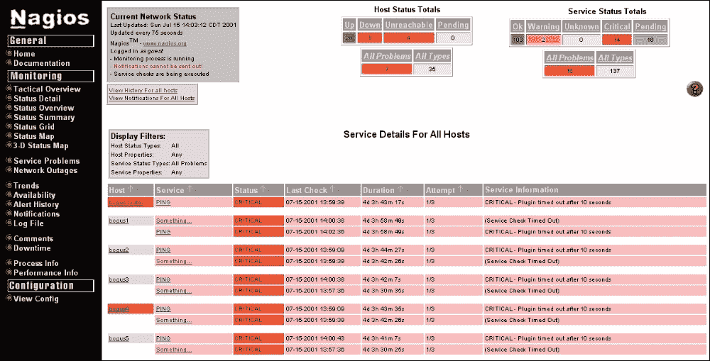

来源：[`thenullterminator.wordpress.com/`](https://thenullterminator.wordpress.com/)

之后，我们尝试第二个测试，启动服务：

```
$ sudo systemctl start sshd.service

```

要指示服务已恢复，将收到另一封电子邮件，其中包含新状态，其中所有信息将变为绿色，如下面的屏幕截图所示：

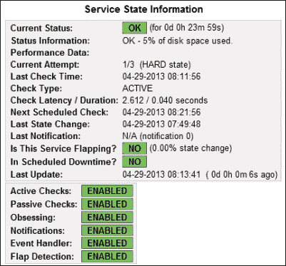

来源：[`www.digitalocean.com`](https://www.digitalocean.com)/

现在，在设置第一台服务器之后，我们可以继续添加所有机器，包括我们需要监视的交换机、打印机和工作站。此外，为了更加实用，我们应该只添加我们关心的那些服务。因此，如果我们有一台运行多个服务的服务器，而我们只会使用其中两个，那么添加所有这些服务并使服务器仪表板和管理员的邮箱超载是没有意义的，因为我们不关心的东西后来会被视为垃圾邮件。

现在，我们将配置 NRPE 守护程序以从客户端接收有关其状态的信息。首先，在 Nagios 服务器上，我们编辑 Xinetd NRPE 配置文件以添加服务器应从中侦听的 IP 地址：

```
$ sudo nano /etc/xinetd.d/nrpe

```

我们需要在`only_from`选项后添加 IP 地址：

```
only_from       = 127.0.0.1 10.0.2.1

```

然后，我们需要将 NRPE 服务添加到系统服务中：

```
$ sudo nano /etc/services

```

我们在文件末尾添加以下行：

```
nrpe 5666/tcp # NRPE

```

为了提交它，我们重新启动`Xinetd`服务：

```
$ sudo systemctl restart Xinetd

```

然后，我们转到客户端并进行以下修改：

```
$ sudo /usr/lib/nagios/plugins/check_users -w 5 -c 10
$ sudo /usr/lib/nagios/plugins/ check_load -w 15,10,5 -c 30,25,20
$ sudo /usr/lib/nagios/plugins/check_disk -w 20% -c 10% -p /dev/sda1

```

这三个命令用于激活 Nagios 代理以发送有关服务器负载和磁盘存储的信息。在我们的情况下，我们的磁盘被定义为`sda1`。我们可以使用`lsblk`命令检查磁盘的命名。

# 设置日志服务器的工具

日志记录意味着收集系统和服务输出信息。它可以是简单的信息、警告或错误，用于告知相关守护程序的状态。对于系统管理员来说，日常工作负载可能非常沉重。因此，他们一直在采用最佳的日志记录工具来监视其基础设施的行为。此外，相关信息应该是可读的并且能够快速理解。

许多系统管理员主要使用两种开源解决方案：**Syslog-ng**和**Rsyslog**。

## Rsyslog

Rsyslog 是一个快速的日志处理系统。它具有高性能、良好的安全性和模块化设计。它发展迅速，并已发展成为日志领域中被认为是瑞士军刀的工具。它具有强大的企业重点，也适用于较小的系统。它支持 MySQL、PostgreSQL、故障转移日志目的地、syslog/tcp 传输、精细粒度的输出格式控制、高精度时间戳、排队操作以及过滤任何消息的部分的能力。

Rsyslog 有监听 TCP/UDP 连接的能力，但由于其对日志速率的限制，可能会在过载时丢失一些日志信息。它可以加载相当数量的模块。它还可以通过程序、来源、消息、PID 等进行日志过滤。

## Syslog-ng

Syslog-ng 是 Linux 和类 Unix 系统的 syslog 协议的开源实现。它具有基于内容的过滤、丰富的过滤兼容性和灵活的配置。它还为`syslog`添加了一些重要的功能，例如：

+   使用 TCP 传输日志信息

+   使用类似 Unix shell（bash）变量扩展的能力格式化日志消息

+   将日志消息发送到本地应用程序的能力

+   将日志信息直接保存到数据库中的能力

+   对传入的日志消息进行分类，并同时从非结构化的 syslog 消息中提取结构化信息

+   处理通过 syslog 传输的结构化消息格式

+   将多个传入的消息相关联以形成更复杂的相关事件的能力

Syslog-ng 是 syslog 的下一代继任者。它是管理日志的最佳工具之一；它将日志实体视为对象（来源、目的地、过滤器等），其语法易于理解。它是一个高度可移植的应用程序，适用于更多的平台，非常适合平台多样性的站点。它有能力将日志消息的内容与预定义消息模式的数据库进行比较。因此，Syslog-ng 能够识别消息的确切类型并将其分类为消息类别。然后，它可以用于分类日志消息中描述的事件类型。

在这里，我们将在 CentOS 7 中安装和配置 Syslog-ng 作为我们的日志服务器。

# 设置和配置 Syslog-ng

默认情况下，在安装 CentOS 7 时，系统和应用程序的日志将安装`Rsyslog`进行存储。幸运的是，我们将按照 syslog 的要求存储和组织所有系统日志文件。我们将在安装`Syslog-ng`时使用这些日志文件，并以更合适的方式进行组织：

首先，在开始安装之前，我们需要设置 EPEL 存储库：

```
$ sudo yum install epel-release

```

### 提示

所有即将到来的软件包存储库检查和应用程序可用性都是可选的。我们可以随时继续安装 Syslog-ng。

要验证 EPEL 存储库是否已添加，我们可以使用以下命令：

```
$ sudo yum repolist

```

这个命令显示了 YUM 软件包管理器可用于下载和安装软件包的存储库列表。现在，在添加了 EPEL 存储库后，我们需要检查是否需要进行任何更改。因此，我们需要输入以下命令：

```
$ sudo yum check-update

```

### 注意

这个命令并不是必需的；我们想用它来额外了解如何检查 Yum 存储库更新。

最后，要检查新添加的 EPEL 存储库中`syslog-ng`应用程序的可用性，我们需要输入以下内容：

```
$ sudo yum list *syslog-ng*

```

现在，我们回到安装阶段。我们将使用`yum`，因为我们已经正确验证了应用程序包的存在：

```
$ sudo yum install syslog-ng syslog-ng-libdbi

```

我们需要确认这些软件包的安装。然后，我们等待直到完成。

要激活`syslog-ng`并将其设置为默认日志记录工具，我们需要首先禁用 rsyslog：

```
$ sudo systemctl stop rsyslog
$ sudo systemctl disable rsyslog

```

然后，我们转到其配置文件，使其以正确的方式工作。我们可以使用任何文本编辑器打开文件：

```
$ sudo nano /etc/syslog-ng/syslog-ng.conf

```

接下来，我们进行所需的更改，使其看起来像下面这样：

```
@version:3.5
@include "scl.conf"
#----------------------------------------------------------------------------
# /etc/syslog-ng/syslog-ng.conf: configuration file
# $Revision: 0.3-r5 (CentOS Edition by Wakko Warner) $
# $Comment: Any comments please send to wakko@acmelabs.spb.ru $
#----------------------------------------------------------------------------

# Note: it also sources additional configuration files (*.conf)
#       located in /etc/syslog-ng/conf.d/

# Global Options
options {
  # Enable or disable the chained hostname format
  chain_hostnames (off);
  # The number of lines buffered before written to file
  flush_lines (0);
  log_fifo_size (1000);
  # The default action of syslog-ng is to log a STATS line
  # to the file every 10 minutes.  That's pretty ugly after a while.
  # Change it to every 12 hours so you get a nice daily update of
  # how many messages syslog-ng missed (0).
  stats_freq (43200);
  time_reopen (10);
  # The default action of syslog-ng is to log a MARK line
  # to the file every 20 minutes.  That's seems high for most
  # people so turn it down to once an hour.  Set it to zero
  # if you don't want the functionality at all.
  mark_freq(3600);
  # Enable or disable hostname rewriting
  keep_hostname (yes);
  # Enable or disable directory creation for destination files
  create_dirs (yes);
  # userid/groupid/permission value for files
  owner ("root");
  group ("adm");
  perm (0640);
  # userid/groupid/permission value for directories
  dir_owner ("root");
  dir_group ("adm");
  dir_perm (0750);
  # Enable or disable DNS usage
  use_dns (no);
  # Add Fully Qualified Domain Name instead of short hostname
  use_fqdn (no);
  long_hostnames (off);
};

source s_sys {
    system();
    internal();
    # udp(ip(0.0.0.0) port(514));
};

# Sources of syslog messages (both local and remote messages on the server)
source s_local {
  system();
  internal();
};
source s_tcp { tcp (ip ("127.0.0.1") port (514) max-connections (1) ); };
source s_udp { udp (ip ("0.0.0.0") port (514)); };

# By default messages are logged to tty12...
#destination d_console_all { file("/dev/tty12"); };
# ...if you intend to use /dev/console for programs like xconsole
# you can comment out the destination line above that references /dev/tty12
# and uncomment the line below.
#destination d_console_all { file("/dev/console"); };
#destination d_console_all { file("/dev/null"); };
destination d_console_all { program("/bin/cat >/dev/null"); };

# Destinations
destination d_usertty { usertty("*"); };
destination d_everything {
  file("/var/log/syslog-$HOST/$YEAR-$MONTH/$FACILITY.$PRIORITY.log"
    template("$FULLDATE $MSGHDR$MSG\n")
    template_escape(no)
  );
};

# Filters
filter f_emergency { level(emerg); };
filter f_fetchmail_warnings {
  not(match("fetchmail" value("PROGRAM"))
  and match("Warning: the connection is insecure, continuing anyways." value("MESSAGE")));
};

log {
  source(s_local);
  filter(f_emergency);
  destination(d_usertty);
};
log {
  source(s_local);
  filter(f_fetchmail_warnings);
  destination(d_everything);
};
log {
  source(s_local);
  filter(f_fetchmail_warnings);
  destination(d_console_all);
};

log {
  source(s_tcp);
  destination(d_everything);
};
log {
  source(s_tcp);
  destination(d_console_all);
};

log {
  source(s_udp);
  destination(d_everything);
};
log {
  source(s_udp);
  destination(d_console_all);
};

# Source additional configuration files (.conf extension only)
@include "/etc/syslog-ng/conf.d/*.conf"

# vim:ft=syslog-ng:ai:si:ts=4:sw=4:et:
```

在这一点上，我们可以启动`syslog-ng`服务并启用它在系统启动时启动：

```
$ sudo systemctl start syslog-ng.service
$ sudo systemctl enable syslog-ng.service

```

通过这一步，我们已经使用`syslog-ng`配置了我们的日志服务器，以进行组织良好且有用的日志记录。

# 参考资料

现在，让我们看一下本章中使用的参考资料：

+   Ganglia 主页，[`ganglia.sourceforge.net/`](http://ganglia.sourceforge.net/)

+   OpenNMS 主页，[`www.opennms.org/`](http://www.opennms.org/)

+   Zabbix 主页，[`www.zabbix.com/`](http://www.zabbix.com/)

+   Zenoss 主页，[`zenoss.com/`](http://zenoss.com/)

+   Icinga 主页，[`www.icinga.org/`](https://www.icinga.org/)

+   Nagios 主页，[`www.nagios.org/`](https://www.nagios.org/)

+   Rsyslog 主页，[`www.rsyslog.com/doc/master/index.html`](http://www.rsyslog.com/doc/master/index.html)

+   Syslog-ng 主页，[`syslog-ng.org/`](https://syslog-ng.org/)

# 摘要

在本章中，我们介绍了各种选择的开源监控和日志记录工具，用于 CentOS 7 服务器。然后，我们讨论了如何设置和配置 Nagios 和 Syslog-ng 日志记录作为我们的日志服务器的逐步教程。我们还谈到了一些工具的主要特点，这些特点有助于简化我们的选择。

在下一章中，我们将简要介绍各种虚拟化技术。此外，我们将借此机会为您提供建立小型虚拟机的逐步教程。
