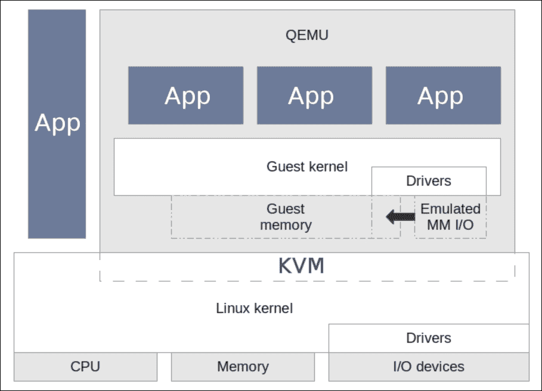

# 第六章：虚拟化

如今，计算基础设施在许多方面发生了变化。我们不再看到一个房间里放满了服务器，每个服务器负责根据其强大程度提供多种服务。在这些时代，我们只看到一些由多个单元组成的大型服务器，以增强它们的容量。这种类型的服务器托管了几个虚拟服务器，以满足基础设施要求。

在我们的时代，成为裸机系统管理员已经不够了。虚拟机正在兴起；我们应该承认这一点。大公司不再使用旧的架构；这已经不再是一个好选择。需要大量资金和巨大的管理工作来维持它们。

在这一章中，我们将解释虚拟化的概念，我们将看到如何设置几种虚拟化技术，然后举例说明如何为每种技术创建一些虚拟机。最后，我们将简要解释 Docker 是什么，以及如何添加镜像和访问 Docker 容器。

通过本章，您将学习以下主题：

+   虚拟化基础

+   全虚拟化的概念

+   半虚拟化的概念

+   了解 Xen 以及如何使用它

+   使用 KVM 设置一些 Linux 虚拟机

+   使用 OpenVZ 创建虚拟机

+   在 VirtualBox 上设置和配置虚拟机

+   了解 Docker 以及如何创建容器和访问它

+   使用 HAProxy 建立服务的高可用性

# Linux 上的虚拟化基础

虚拟化是创建一个类似机器的程序的能力，模拟真实机器通过虚拟硬件运行，包括 CPU、RAM、硬盘、网络卡等，这些资源都来自运行虚拟机的物理机器。

早些时候，管理服务的方式是部署新服务器或升级旧服务器以满足新服务的要求，进行长时间复杂的迁移以应对硬件故障。一直以来，内存太少，磁盘太少，或者处理能力不足。管理者们厌倦了试图修复现有系统，同时支付大量资金来帮助维护不再受支持的旧服务器。然而，他们没有太多选择，因为运行在这些机器上的服务非常重要和必不可少。公司部署了无法在其高峰容量上运行的服务器，没有更好的方法来控制每台服务器的容量，以满足正确的硬件设备的正确服务。所有这些原因使得虚拟化这一新生解决方案迅速增长。虚拟化部署后不久，就已经在许多领域，特别是在计算机科学领域得到了整合。虚拟化允许对物理硬件进行抽象，以在单个共享资源（CPU、内存、网络和存储）上运行多个虚拟机：


来源：[`cdn.arstechnica.net`](http://cdn.arstechnica.net)

现在，这种新技术正在蓬勃发展。我们每天都在见证新的虚拟化服务诞生。虚拟化已经分为许多类型：

+   我们有网络虚拟化，它涉及虚拟网络的创建和管理，以将一组机器与另一组机器分开。它们连接到同一个交换机和一组交换机。

+   我们还有应用虚拟化，其中我们将一个应用程序或一组应用程序放入容器中，然后让应用程序相信它是在其原始支持的系统上运行。因此，它相信它可以访问所需的资源。

+   最后，我们有完整的机器虚拟化。这是一种虚拟化，它创建一个完整的虚拟机（桌面、服务器），具有其虚拟硬件和按需的专用服务。这种虚拟化涉及将基于服务器的工作负载（虚拟机用户要求的工作负载）与底层硬件分离。只要硬件满足其服务对资源（存储数据、网络访问其他机器等）的需求，虚拟机就不会注意到它是在物理硬件上还是在虚拟硬件上运行。

在本章中，我们将重点关注应用虚拟化和桌面虚拟化。

一种名为 hypervisor 的软件在物理机器上执行，以帮助数据中心的虚拟化，目标是为虚拟机提供平台。 Hypervisor 的主要工作是在其控制下运行的不同虚拟机之间动态组织物理资源。这使它们能够独立于物理机器运行，系统管理员可以将虚拟机从一个主机重新定位到另一个主机而不会影响它。 Hypervisor，也称为虚拟机管理器，是一种允许多个操作系统共享单个硬件主机的程序。

在使用虚拟机或容器时，我们期望提供可以托管应用程序或服务并简化其与硬件通信的操作系统。由于这些机器实际上并未在物理硬件上运行，虚拟化允许它们根据需要动态和灵活地访问 CPU、内存、存储和网络资源。

虚拟化可以增加灵活性和管理，并提供更好的可扩展性，大大节省成本。服务的工作负载部署速度更快，性能按需可见增加，同时自动化可扩展性功能，简化了 IT 支持人员的基础设施管理。

让我们列举一些在服务器基础设施上安装虚拟化解决方案的主要优势：

+   减少硬件和运营成本

+   提供高可用性的应用程序和服务

+   最小化或消除停机时间（采用最佳实践方法）

+   提高 IT 团队的生产力、效率、灵活性和响应能力

+   加快应用和资源配置的速度和简化

+   支持业务连续性和灾难恢复，增加系统安全性

+   实现集中管理

+   构建真正的软件定义数据中心

+   充分利用多核处理器机器的优势

下图显示了在一个 Linux 服务器上运行的三个 Linux 虚拟机的示例。这些机器由根据所选择的虚拟化类型控制和管理：

利用 Linux 上虚拟化的基础知识

虚拟机实际上只是主机机器上特定位置存储的一些文件。对于某些技术，它也可以是 LVM 逻辑卷或直接设备。虚拟机使用的虚拟磁盘只是其中封装的另一个文件。在虚拟机内部，管理操作系统和应用程序可以简化（在某些方面；在其他方面则很复杂）。

但好处在于，将虚拟机作为一个充满文件的文件夹，可以复制和移动，这样在物理机器发生硬件故障时更容易备份。在这种情况下，管理者只需购买一台新服务器，将备份的虚拟机加载到其中，并再次运行整个环境，就好像从未发生过一样。

使用 CentOS 存储库，我们可以在**Xen**和**KVM**之间选择两种虚拟化技术。要了解这些虚拟化技术，您需要了解虚拟化的两种不同方法：完全虚拟化和半虚拟化。

### 注意

已经创建了半虚拟化和完全虚拟化的组合，称为**混合虚拟化**。在其中，客户操作系统的某些部分使用半虚拟化来进行某些硬件驱动程序，而主机使用完全虚拟化来进行其他功能。这通常会在客户机上产生更好的性能，而无需客户机完全进行半虚拟化。

# 完全虚拟化

完全虚拟化是一种完全模拟虚拟机下的虚拟硬件的虚拟化技术，与物理硬件没有任何交互。它要求虚拟机下的整个硬件变得不可察觉。这项技术可以根据系统在虚拟机上运行的需求模拟任何类型的物理硬件，以满足特定裸机硬件的任何服务或应用需求。换句话说，完全虚拟化是一种完全运行客户机而不让其意识到它在虚拟环境中运行的虚拟化能力。在这种情况下，虚拟机具有完全虚拟化的硬件来运行其服务。它们与物理硬件没有任何交互。

以下图表显示了在完全虚拟化期间，底层平台运行客户操作系统而不被修改或知道它正在虚拟化上运行：


有一种特定类型的完全虚拟化称为硬件辅助虚拟化。在这种情况下，CPU 架构通过一些特殊指令帮助执行硬件虚拟化，这些指令可能允许客户机直接在 CPU 上执行特权指令，尽管它是虚拟化的。

使用 CentOS 7 服务器，我们可以使用 Xen 或 KVM 进行完全虚拟化或硬件辅助完全虚拟化。我们将在*为 CentOS 7 设置 Xen*部分中看到如何做到这一点。

在更大的范围内，可以实现完全虚拟化的解决方案包括 VMware 的一系列 hypervisors、Xen 和 XenServer、VirtualBox、QEMU 和 KVM。

# 半虚拟化

半虚拟化是虚拟化技术的一种新型增强。它具有在为虚拟机提供服务的垂直机器上安装客户操作系统之前重新编译的能力，以区分虚拟和物理硬件。通过使用这种虚拟化，我们可以通过保留计算资源来更好地优化系统性能。这是因为我们不需要为虚拟机专门分配资源，只有在需要时才会使用。与需要创建虚拟资源并将其分配给虚拟机的完全虚拟化不同，它只是被使用或不被使用。

在半虚拟化中，客户操作系统由 hypervisor 管理，作为位于物理机器和虚拟机之间的一层，以有效地启用和共享物理设备访问。虽然通常不需要完全设备仿真或动态重新编译来执行特权指令，但半虚拟化通常以接近本机速度运行。


前述架构显示了半虚拟化虚拟机如何通过直接与修改器 OS 通信的特殊 hypervisor 与物理硬件交互以优化通信。

Paravirtualization 是 IBM 发明的一种技术的扩展。Xen 是一个开源软件项目，它包含了 paravirtualization。Xen hypervisor 是带来术语*paravirtualization*的东西。今天，大多数虚拟化解决方案都支持 paravirtualization 作为一种规范。一些 Linux 开发供应商合作开发了一种新形式的 paravirtualization，最初由 Xen 小组开发，并为 hypervisor 和客户操作系统内核之间提供了一个与 hypervisor 无关的接口。

# 在 CentOS 7 上设置 Xen

Xen 是一个开源解决方案，用于在一台机器上运行多个虚拟系统。它支持 paravirtualization 和硬件辅助的全虚拟化。Xen 是一个非常强大的虚拟化解决方案。它提供了同时使用两种虚拟化技术以始终满足用户需求的能力。

为了使用 Xen 创建我们的虚拟化环境，我们需要确保 Xen Hypervisor 将在机器自己的内核之前启动，以便尽可能多地访问物理硬件，因此可以用来为我们的环境的虚拟机提供服务。


来源：[`www.2virt.com`](http://www.2virt.com)

在本节中，我们将为 CentOS 7 设置 Xen4。默认的 CentOS 7 仓库不支持 Xen4，因此我们需要添加 CentOS Xen 仓库。但首先，我们需要确保安装了一些软件包。这些将在安装 Xen 时稍后需要：

```
$ sudo yum install bridge-utils SDL net-tools

```

然后，我们使用 YUM 添加最新的 Xen 仓库：

```
$ sudo yum install centos-release-xen

```

在本教程中，我们将安装 Xen 4.5 版本，因此我们需要运行安装命令如下：

```
$ sudo yum install xen

```

要验证安装是否完成，我们需要列出 Xen 内核存档，它位于`/boot`文件夹中：

```
$ ls –l /boot/xen.gz

```

我们应该看到以下代码：

```
lrwxrwxrwx. 1 root root       12 Aug 23 02:10 /boot/xen.gz -> xen-4.5.1.gz

```

现在，我们继续安装`kernel-xen`软件包。此安装应该单独执行，安装 Xen 之后，以便系统引导加载程序 grub 可以检测到新内核并正确配置：

```
$ sudo yum install kernel-xen

```

安装了新内核后，我们应该解决 SELinux 问题。我们可以尝试通过确定 SELinux 正在阻止哪些模块并解决问题来解决问题，或者如果我们有更好的方法来保护我们的服务器，我们可以直接禁用它。要禁用 SELinux，我们只需要进入其配置文件并禁用它：

```
$ sudo nano /etc/sysconfig/selinux

```

然后，考虑这一行：

```
SELINUX=enforcing

```

将其更改为以下内容：

```
SELINUX=disabled

```

否则，如果我们需要检查问题，我们可以按照这个步骤。首先，我们检查问题的日志文件：

```
$ sudo cat /var/log/messages

```

然后，我们激活阻塞：

```
$ sudo grep xend /var/log/audit/audit.log | audit2allow -M custom_xen
$ sudo semodule -i custom_xen.pp

```

这应该解决问题。最后，我们可以重新启动系统并引导新的 Xen 内核。重新启动后，我们需要检查 Xen 内核是否正确安装：

```
$ sudo xl info

```

要使用 Xen，我们需要安装一些工具和软件包，以确保虚拟机运行良好。首先，我们需要确保安装了基本的使用软件包：

```
$ sudo yum install bridge-utils tunctl wget vim-enhanced rsync openssh-clients libvirt python-virtinst libvirt-daemon-xen 

```

然后，我们需要配置网络。但在此之前，我们必须创建桥接接口：

```
$ sudo nano /etc/sysconfig/network-scripts/ifcfg-brid0

```

接下来，我们在刚刚使用 nano 打开的文件中添加以下行并保存：

```
DEVICE=brid0
TYPE=Bridge
BOOTPROTO=dhcp
ONBOOT=yes

```

然后，我们对默认网络接口配置文件进行微小更改，以使用桥接接口：

```
$ sudo nano /etc/sysconfig/network-scripts/ifcfg-eth0
DEVICE=eth0
HWADDR=XX:XX:XX:XX:XX:XX
ONBOOT=yes
TYPE=Ethernet
IPV6INIT=no
USERCTL=no
BRIDGE=brid0

```

### 注意

我们需要用以太网接口的 MAC 地址更改 MAC 地址。我们可以使用`ifconfig`来检查。

之后，我们重新启动系统。这样，桥接网络就准备好使用了。然后，我们下载任何 Linux 系统进行测试。接下来，我们需要使用`dd`命令将其制作为 IMG 文件：

```
$ sudo dd if=/dev/zero of=Centos.img bs=4K count=0 seek=1024K
qemu-img create -f raw Centos.img 8G

```

然后，我们下载任何 Linux 系统进行测试。此外，我们必须创建一个 kick-start 文件并将其放在相同的位置：

```
$ sudo nano ks.cfg

```

然后，我们添加以下代码并进行必要的修改：

```
kernel = "/boot/vmlinuz-xen-install"
ramdisk = "/boot/initrd-xen-install"
extra = "text"
name = "mailserver"
memory = "256"
disk = [ 'tap:aio:/srv/xen/mailserver.img,xvda,w', ]
vif = [ 'bridge=brid0', ]
vcpus=1
on_reboot = 'destroy'
on_crash = 'destroy'

```

最后，我们使用`virt-install`来创建虚拟机：

```
$ sudo virt-install -d -n CentOS7VM1 -r 1024 --vcpus=2 \
--bridge=brid0 --disk ./Centos.img \
--nographics -p -l "./Centos" \
--extra-args="text console=com1 utf8 console=hvc0 ks=./ks.cfg"

```

现在虚拟机应该启动并能够从 DHCP 服务器获取 IP；因此我们可以继续调整它并添加所需的服务。

对于 Xen 的使用，我们需要使用以下命令（我们将介绍最常见的命令。更多信息，请访问此链接[`www.centos.org/docs/5/html/Virtualization-en-US/virt-task-xm-create-manage-doms.html`](https://www.centos.org/docs/5/html/Virtualization-en-US/virt-task-xm-create-manage-doms.html)）：

+   连接到虚拟机：

```
$ sudo xm console CentOS7VM1

```

+   关闭或重启一个机器：

```
$ sudo xm shutdown CentOS7VM1
$ sudo xm reboot CentOS7VM1

```

+   要删除（终止）一个机器：

```
$ sudo xm destroy CentOS7VM1

```

+   暂停和恢复一个机器：

```
$ sudo xm suspend CentOS7VM1
$ sudo xm resume CentOS7VM1

```

+   重命名一个机器

```
$ sudo xm rename CentOS7VM1 CentOS7VM2

```

+   暂停，然后取消暂停一个机器：

```
$ sudo xm pause CentOS7VM1
$ sudo xm unpause CentOS7VM1

```

# 在 CentOS 7 上设置 KVM 进行完全虚拟化

KVM 只能支持硬件辅助的完全虚拟化。目前还在支持半虚拟化方面进行工作。KVM 是一个内核模块，只能与默认的 Linux 内核一起使用（不应该安装在 Xen 上）。KVM 使用一个名为**Qemu-kvm**的个性化版本的 Qemu 来创建虚拟机。



来源：[`www.virtualopensystems.com`](http://www.virtualopensystems.com)

KVM 具有许多有用的功能和优势，由其 hypervisor 支持：

+   **薄配置**：这是分配灵活存储空间和管理虚拟机可用空间的能力

+   过度承诺：这是分配更多的 CPU 和内存资源的能力，超过了物理机上可用的资源

+   **自动 NUMA 平衡**：这是对在 NUMA 硬件上运行的应用程序的改进

+   **磁盘 I/O 限制**：这是管理虚拟机发送的物理系统磁盘输入和输出请求的限制的能力

+   **虚拟 CPU 热添加功能**：这是在没有任何停机时间的情况下调整虚拟机的处理能力的能力

在开始 KVM 安装之前，我们需要检查一些预安装步骤。首先，我们检查机器的 CPU 是否能够处理虚拟化技术：

```
$ sudo grep -e '(vmx|svm)' /proc/cpuinfo

```

要知道是否正确，我们需要查看命令输出中是否突出显示了`vmx`或`svm`字样：

然后，我们确保系统软件包都已更新：

```
$ sudo yum update

```

接下来，我们将 SELinux 的工作模式更改为宽松模式，以确保它不会干扰 KVM 的执行：

```
$ sudo nano /etc/sysconfig/selinux

```

然后，考虑这一行：

```
SELINUX=enforcing

```

将其更改为以下内容：

```
SELINUX=permissive

```

现在我们可以开始安装了。首先，我们将安装`Qemu`软件包，以提供 KVM 的用户级和其磁盘映像管理器：

```
$ sudo yum install qemu-img qemu-kvm 

```

然后，我们需要安装虚拟机管理的 GUI，命令行工具来管理虚拟环境，帮助从 CLI 创建虚拟机的工具，以及 hypervisor 库：

```
$ sudo yum install virt-manager libvirt libvirt-python libvirt-client xauth dejavu-lgc-sans-fonts

```

最后，对于 CentOS 7，我们添加了虚拟化客户端、虚拟化平台和虚拟化工具：

```
$ sudo yum groupinstall virtualization-client virtualization-tools virtualization-platform 

```

完成了这一步，我们可以说我们已经安装了所需的工具和软件包。现在，我们进入配置部分。首先，我们需要重新启动虚拟化守护程序，以确保整个配置设置正确：

```
$ sudo systemctl restart libvirtd

```

然后，我们检查它是否运行良好：

```
$ sudo systemctl status libvirtd

```

我们应该看到这个输出：


现在，我们继续进行网络配置。我们需要创建一个桥接口，以允许客户系统访问外部网络。为此，我们必须启用 IP 转发：

```
$ sudo echo "net.ipv4.ip_forward = 1"|sudo tee /etc/sysctl.d/99-ipforward.conf

```

然后，我们检查它是否设置正确：

```
$ sudo sysctl -p /etc/sysctl.d/99-ipforward.conf

```

之后，我们需要通过保持原始接口不变来更改网络配置，但是我们将把其 IP 地址分配给桥接口：

```
$ sudo nano /etc/sysconfig/network-scripts/ifcfg-eth0

```

接下来，我们在文件末尾添加以下行并保存：

```
BRIDGE=virbrid0

```

然后，我们创建桥接口配置文件：

```
$ sudo nano /etc/sysconfig/network-scripts/ifcfg-brid0

```

之后，我们将以下代码放入我们刚刚打开进行编辑的文件中，并保存：

```
DEVICE="brid0"
TYPE=BRIDGE
ONBOOT=yes
BOOTPROTO=static
IPADDR="10.0.0.2"
NETMASK="255.255.255.0"
GATEWAY="10.0.0.1"
DNS1="8.8.8.8"

```

重新启动系统后，我们可以说网络配置已经设置好了。

在完成 KVM 安装和配置后，是时候开始使用主机了。我们需要做的第一件事是创建一个新的域或虚拟机。为此，使用 CLI，我们将使用`virt-install`命令。首先，我们需要查看已知于我们的 KVM 安装的模板列表：

```
$ sudo virt-install --os-variant=list

```

我们需要一个 Linux OS 的 ISO 文件来用于安装。然后，我们可以开始设置新的虚拟机：

```
$ sudo virt-install  --name=CentOS7guest  --ram=1024  --vcpus=2  --cdrom=./CentOS-7.1-x86_64-minimal.iso --os-type=linux --os-variant=rhel7  --network bridge=brid0 --graphics=spice  --disk path=/var/lib/libvirt/images/CentOS7.dsk,size=10

```

前述命令中的选项如下：

+   `name`：这是虚拟机的名称

+   `ram`：这是内存大小（以 MB 为单位）

+   `vcpus`：这是虚拟 CPU 的数量

+   `cdrom`：这是 ISO 镜像的位置

+   `os-type`：这是操作系统类型，如 Linux、Windows 或 Unix

+   `os-variant`：这是 OS 变体，如 rhel 6 或 Solaris

+   `network`：这是网络接口和连接

+   `graphics`：这是客户端显示设置

+   `disk path`：这是具有 10GB 大小的磁盘的位置

一旦我们发出了前述命令，`virt-install`将创建一个虚拟机，并启动 OS 安装的`virt`查看器控制台。

### 注意

总是有一个图形模式执行前面的处理。图形工具称为系统工具中的 virt-manager。

以下命令旨在更好地管理部署后的 KVM 虚拟机：

+   列出在 KVM 上运行的虚拟机：

```
$ sudo virsh --connect qemu:///system list

```

+   要获取有关虚拟机的更多信息：

```
$ sudo virsh dominfo CentOS7guest

```

+   停止运行的客户机：

```
$ sudo virsh --connect qemu:///system shutdown CentOS7guest

```

+   启动虚拟机：

```
$ sudo virsh --connect qemu:///system start CentOS7guest

```

+   要删除客户机：

```
$ sudo virsh --connect qemu:///system destroy CentOS7guest
$ sudo virsh --connect qemu:///system undefineCentOS7guest
$ sudo rm -f /var/lib/libvirt/images/CentOS7guest.img

```

+   最后，用于在主机系统启动时自动启动虚拟机的代码：

```
$ sudo virsh --connect qemu:///system autostart CentOS7guest
$ sudo virsh --connect qemu:///system dominfo CentOS7guest | grep Auto

```


来源：[`virt-manager.org/`](https://virt-manager.org/)

# 在 CentOS 7 上设置 OpenVZ 虚拟化

OpenVZ 是一种我们称之为基于容器的新型虚拟化技术。它基本上在单个 Linux 服务器上创建多个安全和隔离的 Linux 容器。这种容器技术允许更好地利用服务器，因为我们不是安装完整的虚拟机，只是一个容器来容纳其中的一些内容，并且它消除了应用程序冲突。在 OpenVZ 平台上运行的虚拟机处于独立模式，它具有在不与同一平台上运行的任何其他虚拟机发生任何冲突的能力。这些机器彼此独立。

在 OpenVZ 上运行的虚拟机有自己的操作系统、IP 地址、进程、内存或存储空间、应用程序和配置文件等。


来源：[`www.quantact.com`](http://www.quantact.com)

在使用 OpenVZ 时，虚拟化是通过系统级虚拟化技术运行的，其中客户系统使用与物理机系统相同的内核，不同于 KVM 和 VirtualBox，这有助于提高物理机处理能力和存储能力的使用效率。

为了更好地使用 OpenVZ，我们可能需要使用 QEMU 和 Virtuozzo 作为管理实用程序。我们真的建议在 Virtuozzo 镜像的 OpenVZ 容器和虚拟机上使用。

对于 CentOS 7，目前还没有可用的 OpenVZ 发行版。因此，我们将安装其分支项目 Virtuozzo 7，它能够实现所有 OpenVZ 选项以及更多功能。然而，我们将仅使用 OpenVZ 工具。

要安装 Virtuozzo 7，我们需要安装基于 RPM 的发行包。首先，我们需要将`virtuozzo-release`包的元信息引入 YUM 存储库：

```
$ sudo yum localinstall http://download.openvz.org/virtuozzo/releases/7.0/x86_64/os/Packages/v/virtuozzo-release-7.0.0-10.vz7.x86_64.rpm

```

然后，我们安装必需的 Virtuozzo RPM 包：

```
$ sudo yum install -y prlctl prl-disp-service vzkernel

```

现在，我们已经安装了 OpenVZ 内核。我们继续进行内核参数配置：

```
$ sudo nano /etc/sysctl.conf

```

然后，我们添加以下代码：

```
# On Hardware Node we generally need
# packet forwarding enabled and proxy arp disabled
net.ipv4.ip_forward = 1
net.ipv6.conf.default.forwarding = 1
net.ipv6.conf.all.forwarding = 1
net.ipv4.conf.default.proxy_arp = 0

# Enables source route verification
net.ipv4.conf.all.rp_filter = 1

# Enables the magic-sysrq key
kernel.sysrq = 1

# We do not want all our interfaces to send redirects
net.ipv4.conf.default.send_redirects = 1
net.ipv4.conf.all.send_redirects = 0

```

之后，我们使 SELinux 处于宽松模式，以确保 OpenVZ 正常工作：

```
$ sudo nano /etc/sysconfig/selinux

```

接下来，我们需要有配置行，使其看起来像下面这样：

```
SELINUX=permissive

```

这部分是可选的。如果需要，我们可以安装 OpenVZ 使用统计工具：

```
$ sudo yum install vzctl vzquota ploop

```

现在，我们已经成功安装了 OpenVZ，我们可以重新启动系统并通过 OpenVZ 内核登录。我们需要编辑 OpenVZ 配置文件，为物理和虚拟机设置相同的子网：

```
$ sudo nano /etc/vz/vz.conf

```

然后，我们找到并取消注释以下行，并将其选项更改为这样：

```
NEIGHBOUR_DEVS=all

```

现在，我们可以为 OpenVZ 设置一个基于 Web 的界面来帮助管理它。我们需要下载安装脚本并运行它：

```
$ sudo wget -O - http://ovz-web-panel.googlecode.com/svn/installer/ai.sh | sh

```

然后，使用 Firewalld 添加从中提供 Web 界面的端口：

```
$ sudo firewall-cmd --zone=public --permanent --add-port=3000/tcp

```

然后，重新加载 Firewalld：

```
$ sudo firewall-cmd --reload

```

基于 Web 的界面将在机器主机名或 IP 地址后跟端口号`3000`上提供其 Web 界面：

```
http://<the-hostname>:3000

```

现在，我们将开始使用 OpenVZ 来下载一个容器并开始使用它。首先，我们需要指定一个文件夹来放置我们的容器：

```
$ mkdir OpenVZCont
$ cd OpenVZCont

```

然后，我们下载一个示例容器：

```
$ wget http://download.openvz.org/template/precreated/centos-7-x86_64-minimal.tar.gz

```

接下来，我们解压`tar`文件：

```
$ tar –xzvf centos-7-x86_64-minimal.tar.gz

```

然后，我们输入此命令来创建我们的第一个虚拟机：

```
$ sudo vzctl create 101 --ostemplate centos-7-x86_64-minimal

```

我们的容器 ID 是`101`，因为它们通常从`100`开始。现在，我们为容器设置一个 IP 地址：

```
$ sudo vzctl set 101 --ipadd 10.0.0.14 --save

```

然后是 DNS 服务器：

```
$ sudo vzctl set 101 --nameserver 8.8.8.8 --save

```

在网络配置准备就绪后，我们可以启动我们新创建的容器：

```
$ sudo vzctl start 101

```

我们可以通过 ping 其 IP 地址来验证它是否正在运行：

```
$ ping 10.0.0.14

```

现在，我们可以登录到我们的容器中进行探索：

```
$ sudo vzctl enter 101

```

我们现在在新创建的容器中。我们可以随心所欲地使用它。要退出虚拟机，我们只需在终端中输入 exit。此外，使用 OpenVZ Web 界面，我们可以可视化其状态并通过它进行一些管理管理。


来源：[`bderzhavets.wordpress.com/`](https://bderzhavets.wordpress.com/)

# 在 CentOS 7 上设置 VirtualBox 虚拟化

Oracle VirtualBox 是一个虚拟化应用程序，可以在多个计算机架构（Intel、基于 AMD 的系统）和几乎所有可用的操作系统（OSX、Linux、Windows、Solaris 等）上运行，它允许用户在同一台物理机器上运行多个操作系统。基本上，虚拟盒是一种完全虚拟化技术。

大多数人在使用多个系统时都依赖它，并且需要导出和导入模板虚拟机，虚拟盒提供了各种选项，可以在各种基础设施之间交换虚拟机。


来源：[`www.oracle.com`](http://www.oracle.com)

本节将向您展示如何在 CentOS 7 上安装 Oracle VirtualBox 5.0.2。首先，我们需要将 VirtualBox yum 存储库添加到我们的系统中。因此，我们需要在 YUM 存储库目录中创建其 repo 文件：

```
$ sudo nano /etc/yum.repos.d/virtualbox.repo

```

然后，我们需要将以下代码放入文件并保存：

```
[virtualbox]
name=Oracle Linux / RHEL / CentOS-$releasever / $basearch - VirtualBox
baseurl=http://download.virtualbox.org/virtualbox/rpm/el/$releasever/$basearch
enabled=1
gpgcheck=1
gpgkey=http://download.virtualbox.org/virtualbox/debian/oracle_vbox.asc

```

我们还应该安装 EPEL 存储库：

```
$ sudo rpm -ivh http://ftp.jaist.ac.jp/pub/Linux/Fedora/epel/7/x86_64/e/epel-release-7-5.noarch.rpm

```

在开始安装之前，我们需要安装一些必要的软件包，以确保 VirtualBox 正常工作：

```
$ sudo yum install gcc make kernel-headers kernel-devel fontforge binutils patch  dkms glibc-headers glibc-devel qt libgomp

```

然后，我们设置一个名为`KERN_DIR`的环境变量，VirtualBox 将从中获取内核源代码：

```
$ export KERN_DIR=/usr/src/kernels/3.10.0-229.14.1.el7.x86_64

```

### 提示

我的最新内核版本存储在这个目录中：`3.10.0-229.14.1.el7.x86_64`。由于升级，它可能会随时间而改变。

然后，我们可以使用 YUM 开始安装 VirtualBox：

```
$ sudo yum install VirtualBox-5.0

```

安装完成后，我们需要使用以下命令重建内核模块：

```
$ sudo systemctl start vboxdrv

```

现在，我们已经安装了 VirtualBox 并准备好使用。不过，VirtualBox 只支持图形界面，所以我们需要安装一个图形界面，然后我们可以启动并使用它。

我们需要在服务器上安装一个图形界面，我们有一个很长的列表可供选择。我建议使用 Gnome，因为它是最常用的界面之一，用户友好且资源消耗低。

使用 Gnome 作为图形界面，我们可以启动 VirtualBox：

```
$ sudo virtualbox &

```


然后，我们可以继续创建一个新的虚拟机。我们给它一个名称和类型，如下所示：


接下来，我们继续配置要分配的 RAM 数量，如下截图所示：


然后是磁盘空间的数量，如下所示：


VirtualBox 提供了一些额外的服务，允许原始系统的鼠标和键盘在物理机和虚拟机之间切换。要安装这些工具，我们可以转到 VM 菜单，然后选择**Guest**选项，然后安装虚拟机客户端工具。安装需要一些时间，然后我们需要重新启动虚拟机，以便这些工具可以开始工作。

最后，我们的虚拟机已准备好执行，如下截图所示：


# 在 CentOS 7 上设置 Docker

与 OpenVZ 使用容器技术相同的技术，Docker 是基于容器的软件虚拟化的另一种选择。Docker 因其自动部署应用程序的能力而闻名。这些模板或容器分为社区容器（由 Docker 社区提供的模板）和个人用户提供的私有容器。一些用户个性化的容器可以公开使用，其他的可以存储在可以被其创建者或他想要分享的人访问的私人文件夹中。Docker 容器是可移植的、轻量级的、封装的应用程序模块。

根据行业分析公司 451 Research 的说法：

> *"Docker 是一个工具，可以将应用程序及其依赖项打包到一个虚拟容器中，在任何 Linux 服务器上都可以运行。这有助于实现应用程序可以运行的灵活性和可移植性，无论是在本地、公共云、私有云、裸机等。"*

要安装 Docker，我们将使用 Docker 安装脚本。在这里，我们还有另一种通过 YUM 安装 Docker 的方式——传统方式：

1.  首先，我们需要确保我们的系统软件包已更新：

```
$ sudo yum update

```

1.  然后，我们运行 Docker 安装脚本：

```
$ sudo curl -sSL https://get.docker.com/ | sh

```


来源：[`blog.ouseful.info/`](http://blog.ouseful.info/)

1.  此脚本将把 Docker 存储库添加到系统存储库，然后安装 Docker。

1.  如果我们系统中要使用 Docker 的用户太多，我们需要将他们添加到 Docker 组中：

```
$ sudo usermod -aG docker packt

```

1.  然后，我们启动 Docker 守护程序。将其添加到系统启动脚本中：

```
$ sudo systemctl docker start
$ sudo systemctl enable docker.service

```

1.  要验证 Docker 是否正确安装，我们有一个简单的镜像容器可以测试：

```
$ sudo docker run hello-world

```

1.  要下载一个 Docker 容器，我们需要查找它的名称，然后输入以下命令：

```
$ sudo docker pull centos7

```

1.  要运行容器，我们需要使用`docker run`命令，使用`-i`选项将`stdin`和`stdout`附加到容器，使用`-t`选项分配一个`tty`接口。

```
$ sudo docker run -i -t centos7 /bin/bash

```

1.  要使 Docker 容器保持不丢失 shell 终端，我们需要按照以下顺序操作：同时按下`Ctrl-p`和`Ctrl-q`。

1.  要获取更多公开可用的 Web 社区容器，我们可以始终使用以下命令：

```
$ sudo docker search centos7

```


来源：[`blog.ouseful.info/`](http://blog.ouseful.info/)

# 使用 HAProxy 建立服务的高可用性

对于这一部分，我们将简要展示如何设置高可用性/负载均衡器来控制特定服务的流量；在我们的案例中，我们将使用 HTTP 作为 Web 服务器的流量。


来源：[assets.digitalocean.com](http://assets.digitalocean.com)

为此工作，我们使用 HAProxy 作为负载平衡和服务高可用性的开源解决方案，通过多个服务器。它通常用于网站的流量负载平衡。HAProxy 将工作负载分布到提供相同服务的许多服务器上（基本上是 Web 服务器、数据库等），以提高服务的整体性能和可靠性。

正如我们之前所说，本节将安装和配置高可用性负载均衡器，以在三个 Web 服务器和备用服务器之间共享负载，以便在服务器或服务故障时接管。

因此，我们将拥有一个看起来像这样的基础设施：

+   HAProxy 服务器：

+   **操作系统**：CentOS 7

+   **IP 地址**：172.25.25.166 和 10.0.0.10

+   **主机名**：haproxy.packt.co.uk

+   Web 服务器 1：

+   **操作系统**：CentOS 7

+   **IP 地址**：10.0.0.11

+   **主机名**：webserver1.packt.co.uk

+   Web 服务器 2：

+   **操作系统**：CentOS 7

+   **IP 地址**：10.0.0.12

+   **主机名**：webserver2.packt.co.uk

+   Web 服务器 3：

+   **操作系统**：CentOS 7

+   **IP 地址**：10.0.0.13

+   **主机名**：webserver3.packt.co.uk

+   备用 Web 服务器：

+   **操作系统**：CentOS 7

+   **IP 地址**：10.0.0.20

+   **主机名**：backupwebserver.packt.co.uk


首先，我们将开始设置 Web 服务器，为此，我们将仅使用安装后由 Apache 生成的默认页面。有关如何设置 Web 服务器的更多信息，您可以随时参考第三章，*不同用途的 Linux*。因此，我们只需要安装和运行 Apache，并且需要配置网络和机器的主机名。

首先，我们将使用 CentOS 7 YUM 的默认软件包管理器安装 Apache Web 服务器：

```
$ sudo yum install httpd

```

然后之后，我们配置主机名：

```
$ sudo nano /etc/hostname

```

并确保它看起来像这样：

```
Webserver1.packt.co.uk

```

之后，我们进入每个主机文件并将域配置为默认的本地主机，同时添加所有服务器及其 IP 地址的列表：

```
$ sudo nano /etc/hosts

```

### 注意

如果基础设施内没有可靠的 DNS 服务器可以解析所有基础设施服务器，则只需要此部分。

我们更改默认的本地主机地址`127.0.0.1`域名：

```
127.0.0.1  webserver1  Webserver1.packt.co.uk

```

然后，我们添加以下行：

```
10.0.0.10  haproxy  haproxy.packt.co.uk
10.0.0.11  Webserver1  Webserver1.packt.co.uk
10.0.0.12  Webserver2  Webserver2.packt.co.uk
10.0.0.13  Webserver3  Webserver3.packt.co.uk
10.0.0.20  backupWebserver   backupWebserver.packt.co.uk

```

在完成之前，我们需要在 Web 服务器防火墙上打开 HTTPS 和 HTTPS 端口，以使服务对访问者可用：

```
$ sudo firewall­cmd ­­permanent ­­zone=public ­­add­port=80/tcp
$ sudo firewall­cmd ­­permanent ­­zone=public ­­add­port=443/tcp
$ sudo firewall­cmd ­­reload

```

通过这一步，我们可以说我们所有的 Web 服务器都准备好了。现在我们可以转到我们的 HAProxy 服务器安装。首先，我们需要为 Web 服务和 HAProxy 使用的日志接收打开所需的端口：

```
$ sudo firewall­cmd ­­permanent ­­zone=public ­­add­port=80/tcp
$ sudo firewall­cmd ­­permanent ­­zone=public ­­add­port=443/tcp
$ sudo firewall­cmd ­­permanent ­­zone=public ­­add­port=514/udp
$ sudo firewall­cmd ­­reload

```

然后，我们可以开始安装：

```
$ sudo yum install haproxy

```

现在，我们进入配置部分。在进行主要的 HAProxy 配置之前，我们需要为调试设置 HAProxy 日志记录功能配置：

```
$ sudo nano /etc/haproxy/haproxy.cfg

```

在**#全局设置**选项下，我们需要确保以下行没有被注释掉：

```
log         127.0.0.1 local2 info

```

在`Rsyslog`配置文件中也需要进行一些小的修改：

```
$ sudo nano /etc/rsyslog.conf

```

这是我们需要取消注释以下两行的地方：

```
$ModLoad imudp
$UDPServerRun 514

```

在完成之前，我们需要有一个代表`HAProxy`在`Rsyslog 日志`文件夹中的文件：

```
$ sudo nano /etc/rsyslog.d/haproxy.conf

```

在使用 Nano 创建时，我们需要在其中放入以下行：

```
local2.*  /var/log/haproxy.log

```

保存文件，然后应用更改并重新启动`Rsyslog 服务`：

```
$ sudo systemctl restart rsyslog.service

```

现在，我们可以进入 HAProxy 全局设置配置：

```
$ sudo nano /etc/haproxy/haproxy.cfg

```

首先，在默认部分，我们需要设置超时以获得更个性化的解决方案。由于我们的服务器只是进行负载平衡，我们可以始终使用端口 80。因此，我们需要接管该端口，通过删除其与`Httpd`服务的关联来实现：

```
$ sudo nano /etc/httpd/conf/httpd.conf

```

然后，我们将监听端口更改为除 80 之外的任何其他端口。在我们的示例中，`8080`：

```
Listen 8080 

```

然后，我们转到**主前端**部分，更改 Web 界面提供服务的端口。因此，我们需要更改整个部分，使其看起来像以下内容：

```
Frontend  HAProxy
bind  *:80
reqadd X-Forwarded-Proto:\ http
default_backend  HAProxy

```

并且我们需要注释掉**Backend**部分，以替换为以下内容：

```
# use_backend static  if url_static
backend HAProxy *:80
mode http
stats enable
stats hide-version
stats uri /stats
stats realm Haproxy\ Statistics
stats auth haproxy:password    # Change "password" with a well secured password
balance roundrobin 
option httpchk
option  httpclose
option forwardfor
cookie LB insert
 server webserver1 10.0.0.11:80 cookie webserver1 check
server webserver3 10.0.0.12:80 cookie webserver2 check
server webserver3 10.0.0.13:80 cookie webserver3 check
server backupwebserver 10.0.0.20:80 check backup

```

我们需要确保文件的结尾与我们的基础设施 IP 地址和主机名匹配。然后，我们可以启动 HAProxy 服务器并将其添加到启动系统服务中：

```
$ sudo systemctl start haproxy.service
$ sudo systemctl enable haproxy.service

```

要验证配置文件没有错误，我们可以随时使用以下命令检查服务状态：

```
$ sudo systemctl status haproxy.service -l

```

然后，我们获取每个 Web 服务器并放置一个测试页面，以便访问并收集测试结果。然后，我们打开 HAProxy 的 Web 界面来可视化负载平衡的状态`http://10.0.0.10/stats`或`http://172.25.25.166/stats`。


如果我们看到以下界面，那意味着我们的高可用服务器正在正常运行。如果我们需要启用 https 以使用 SSL 访问 HAProxy 的 Web 界面，我们可以随时安装 OpenSSL 并配置我们的服务器以使用它。

# 参考资料

现在，让我们看一下本章中使用的参考资料：

+   **VMware** **Documentation Center**: [`pubs.vmware.com/vsphere-51/index.jsp`](http://pubs.vmware.com/vsphere-51/index.jsp)

+   **VMware** **Virtualization**: [`www.vmware.com/virtualization.html`](http://www.vmware.com/virtualization.html)

+   **Full** **virtualization wiki**: [`en.wikipedia.org/wiki/Full_virtualization`](https://en.wikipedia.org/wiki/Full_virtualization)

+   **Paravirtualization** **wiki**: [`en.wikipedia.org/wiki/Paravirtualization`](https://en.wikipedia.org/wiki/Paravirtualization)

+   **Xen project** **wiki**: [`wiki.xen.org/wiki/Xen_Project_Software_Overview`](http://wiki.xen.org/wiki/Xen_Project_Software_Overview)

+   **KVM home** **page**: [`www.linux-kvm.org/page/Main_Page`](http://www.linux-kvm.org/page/Main_Page)

+   **OpenVZ home** **page**: [`openvz.org/Main_Page`](https://openvz.org/Main_Page)

+   **VirtualBox** **home page**: [`www.virtualbox.org`](https://www.virtualbox.org)

+   **Docker** **documentation**: [`www.modssl.org/docs/`](http://www.modssl.org/docs/)

+   **HAProxy web** **page**: [`www.haproxy.org/`](http://www.haproxy.org/)

# 总结

本章以对虚拟化基础知识的简要描述开始。然后，我们定义了完全虚拟化和半虚拟化。接下来，为了更好地通过各种开源虚拟化工具实际地解释所有这些，我们从 Xen 作为半虚拟化和完全虚拟化解决方案开始。我们转向 KVM 作为完全虚拟化解决方案，容器虚拟化，OpenVZ 和 VirtualBox 工具。这通过其美丽的图形界面实现了简单的设置。

我们在本章中介绍了 Docker 及其从 Web 使用容器的方式。在本章结束时，我们可以说我们已经看到了各种虚拟化技术以及如何使用它们创建虚拟机。

在下一章中，我们将有机会探索云计算技术，并使用开源解决方案 OpenStack 应用一些示例。
