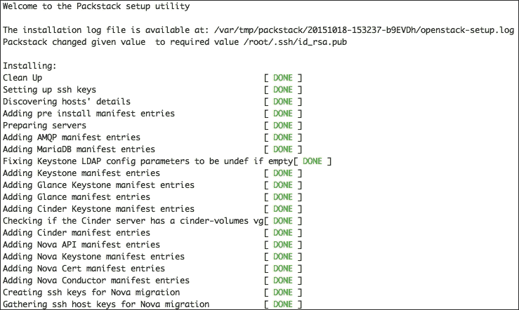

# 第七章：云计算

通过互联网提供的新一代服务被称为云计算。在计算机行业，许多组织使用云计算，因为他们不喜欢购买可以解决其资源问题的设备，或者雇佣所需的管理和维护人员。云计算就像第三方数据源，提供各种功能来存储和处理数据。

在建立云计算环境的最佳解决方案列表中，我们选择了 OpenStack。在本章中，我们将简要介绍云计算是什么，以及如何使用 OpenStack 设置单个节点。

在本章的过程中，我们将涉及以下主题：

+   云计算概述

+   云计算服务

+   介绍 OpenStack

+   OpenStack 的组件

+   安装和设置 OpenStack

# 云计算概述

云计算是在不依赖本地机器的通常方式之外执行计算的能力。云计算依赖于共享资源来处理所需的计算或处理。它与网格计算具有相同的特点，两种技术都将其处理能力聚集起来解决或处理对独立机器（服务器或个人计算机）来说过于繁重的问题。

云计算的目标是利用高超级计算能力在面向消费者的应用程序中执行高级计算，例如金融、个性化信息传递、数据存储等。

为了执行这项艰巨的任务，云计算依赖于大量超强大的服务器（刀片…）通过极快的连接（InfiniBand（IB））连接在一起，以在它们的计算单元之间共享工作负载。这种基础设施运行在特别配置的系统上，它们被连接在一起以简化任务。一些基础设施依赖于虚拟化技术来增强其云计算。


来源：[`networksolutionsintl.com`](http://networksolutionsintl.com)

简而言之，许多公司使用云计算的最精确原因是，它使它们能够将计算资源看作是一种实用工具，可以随着时间付费，而无需在现场拥有真正的硬件并承担管理和维护的负担。此外，云计算为企业提供了许多有趣的功能，例如：

+   **弹性**：根据需求扩展和缩减计算资源的能力

+   **自助服务供应**：根据需求提供所需数量的资源的能力

+   **按使用量付费**：衡量用户使用的资源的能力，使他们只需为他们使用的资源付费

云计算随着时间的推移发展迅速。然而，它始终保持着主要的三个核心服务：

+   软件即服务（SaaS）

+   **平台即服务**（PaaS）

+   **基础设施即服务**（IaaS）

## 软件即服务

SaaS 指的是在当前用户机器之外运行的每个应用程序，用户可以通过其 Web 浏览器访问其部分或全部服务，有时也可以通过仅作为演示界面的薄客户端应用程序访问。SaaS 应用程序通常可以在全球范围内使用任何可以访问互联网的设备（计算机、移动设备等）。使 SaaS 应用程序运行良好的是它是一种可扩展的应用程序，用户可以根据需要在尽可能多的虚拟机上处理其处理以满足负载需求。大多数云计算基础设施使用负载平衡系统在虚拟机之间组织负载，应用程序可以在没有任何中断的情况下继续运行并获得更好的执行结果。


来源：[`icorees.com/`](http://icorees.com/)

SaaS 的特点如下：

+   其服务可供任何连接设备访问

+   登录后即可使用易于使用的应用程序

+   一切都存储在云上，分布在数百台机器上，配置良好，可以应对磁盘崩溃等灾难，此外用户数据和服务始终可用

+   应用程序的计算能力在需要时始终是可扩展的

我们可以区分一些我们每天使用的最著名的 SaaS，比如电子邮件服务（Gmail，Yahoo…），社交媒体和通讯工具（Facebook，Skype…）。我们使用这些日常服务所需的只是互联网连接和具有 Web 浏览器或移动设备的薄客户端应用程序。

## 平台即服务（PaaS）

PaaS 是一种为客户提供在基于云的环境中构建和部署应用程序的能力的服务。PaaS 在为用户提供可扩展性时就像 SaaS 一样。在部署他们的应用程序时，他们可以按需访问所需的资源来运行他们的应用程序，而无需购买、维护和管理应用程序运行所需的硬件，以及其背后的所有后勤工作。PaaS 已经得到很好的发展，为其客户提供了预先准备的模板，以简化在平台上的初始化。


来源：[`www.zoho.com/`](https://www.zoho.com/)

使用 PaaS 相比传统解决方案有一些主要好处，如下所示：

+   加快了应用程序的开发，环境已经准备好，使其准备好上市

+   消除了管理中间件的复杂性，并简化了任务

+   简化了 Web 应用程序的部署

## 基础设施即服务（IaaS）

第三项服务是 IaaS，一种为用户提供建立完全合格基础设施所需的服务。IaaS 提供具有不同特征的服务器、网络设备和按需存储空间。基础设施的用户拥有管理其基础设施的所有权利，具有系统和网络管理员的所有权利。该服务为用户提供的不仅仅是基础设施，还有一种资源包（小型、中型和超大型计算能力和内存）来满足工作负载要求。正如我们之前所说，用户可以作为系统和网络管理员来部署他们的应用程序。然后他们需要建立他们的网络，安装所需的操作系统，并设置他们的机器，用户还需要手动维护、管理和更新他们的系统。


来源：[`cloudplus.com/`](http://cloudplus.com/)

IaaS 的好处可以总结如下：

+   它消除了投资硬件的任务

+   与其他云解决方案一样，IaaS 可以根据需求进行可扩展，以满足用户对资源和设备的需求

+   根据用户需求提供各种灵活和创新的服务！基础设施即服务（IaaS）

# 云计算服务

在解释了不同类型的云计算之后，我们现在应该看一下这些服务是如何提供的。为此，我们将它们分类为三种主要类型：公共云、私有云和混合云。

## 公共云

我们将首先介绍公共云。公共云，顾名思义，是公开可用的云。通常，公共云服务可以根据用户愿意支付的金额进行扩展，无论是资源还是特殊服务。由于它在云上，用户不必担心硬件购买、管理和维护。大多数作为公共云提供的服务都是 SaaS，只有少数是 PaaS。大多数这些服务都是按需提供的。通常，用户支付的是他们使用的资源（CPU、内存、存储、互联网带宽）而不是服务本身。


来源：[`nextgenaccess.zserver.co.uk/`](http://nextgenaccess.zserver.co.uk/)

在公共云上共享资源出现在多个用户访问托管在一个或多个服务器上的相同服务的情况下，也在这些服务器需要处理客户发送的任务的情况下。一些基础设施比其他基础设施更好，因为它们可以处理非常繁重的流量；其他可能会发现这有些困难。在这个阶段，客户可能会在他们的应用程序中经历速度变慢，这确实会以不好的方式影响服务。

## 私有云

与公共云相比，私有云是一种专门为一个用户或一个组织提供的服务。被一个客户使用并不意味着它与任何其他云有所不同。它仍然可以由第三方公司或内部团队进行管理和管理。

大多数组织倾向于使用私有云，因为它具有分配和控制资源的优势。这与公共云不同，后者在多个用户之间共享。此外，公共云具有自助服务界面，可帮助简化系统管理员的资源管理和分配，以及更快的按需方法，更先进的安全协议以更好地保护用户数据的安全，以及帮助优化工作负载的先进自动化系统。


来源：[`blogs.dlt.com`](http://blogs.dlt.com)

## 混合云

混合云是公共云和私有云的结合。更具体地说，私有云有时可能非常昂贵且难以调整，特别是对于不需要私有云提供的优势的小型应用。而公共云的解决方案并不那么昂贵，而且具有快速部署应用程序的优势，组织倾向于根据自己的需求混合使用这两种服务，这就是混合云变得流行的原因。混合云允许组织将重要数据保存在其私有云上，并在公共云上提供诸如 SaaS 之类的轻型服务，具有在需要时切换到所需服务的能力。


来源：[`www8.hp.com`](http://www8.hp.com)

# 介绍 OpenStack

我们现在已经彻底描述了云计算、其服务以及客户如何利用这些服务。现在，我们需要谈谈我们在其中的角色。了解如何使用云计算服务，例如 IaaS 来部署基础设施，对于系统管理员来说并不是最困难的任务。但每个系统管理员都应该知道如何部署并如何向他们的客户提供这些服务。在本节中，我们将探讨如何在我们的基础设施中运行云，并如何在我们的 CentOS 7 服务器上运行这些服务。为了执行这项任务，我们将使用 Linux 最著名的开源云解决方案之一，即 OpenStack，这是一个免费的云计算解决方案，可帮助启动、管理和维护所需资源（CPU、内存、网络和存储）的大量虚拟机。该基础设施通过用户友好的 Web 界面进行管理，帮助向系统管理员呈现节点的状态，并为他们提供轻松访问以管理基础设施资源。OpenStack 根据用户的需求提供开源和企业服务，因此被多个组织广泛使用。

今天，全球数百家组织使用 OpenStack 来维护他们的云基础设施，他们使用它来使他们的云解决方案正常运行，并且它被用于公共或私有云服务。大多数提供云服务的组织，无论是公共云还是私有云，都使用 OpenStack 提供 IaaS 服务。


[`www.openstack.org/software/`](https://www.openstack.org/software/)

OpenStack 在其 API 下管理三个主要部分：计算、网络和存储。通过这个 API，OpenStack 为其管理的基础设施创建了一个可持续的环境。

## OpenStack 计算

OpenStack 计算是在客户端需求时提供计算资源，并管理已请求的资源。OpenStack 计算不仅提供客户端应用程序的运行情况，还通过组织资源和应用程序来确保服务本身的良好运行。OpenStack 计算可通过 Web 界面进行管理，也可通过 API 进行开发和构建应用程序。这种架构使得物理硬件的经济使用可以横向扩展。这项技术还管理和自动化了大量的计算资源，并与各种虚拟化技术兼容。

## OpenStack 网络

OpenStack 网络是管理 OpenStack 管理的云资源的网络能力。这项技术确保连接云基础设施的网络资源始终可用，并且不包含任何瓶颈，只需执行网络管理员应该做的维护基础设施网络的任务。

OpenStack 网络提供了灵活的网络模型，以满足扁平网络、VLAN 配置、GRE 和 VXLAN 等需求。它提供了与普通物理网络硬件提供的相同服务，如路由、NAT 和 DHCP，以及静态 IP 关联。它还配备了一个智能系统，可以在故障或过载的情况下帮助重定向流量，以帮助维护更好的网络容量。OpenStack 网络不仅支持自动化网络管理，还为用户提供了手动管理网络的能力，通过调整适当的连接，连接服务器和终端。用户还可以利用软件定义的网络（SDN）技术进行多租户配置和大规模配置，如 OpenFlow。它还支持来自多个常见供应商的高级网络服务架构。最后，它提供了一个集成常见网络管理技术的高级扩展，如用于私人连接的 VPN，用于加固安全性的 IDS，用于设置访问规则的负载平衡和防火墙等。

## OpenStack 存储

OpenStack 存储是 OpenStack 架构内提供的数据存储服务。通过其完全分布式的 API 存储平台，云应用程序可以通过多种技术和架构（归档、备份、数据保留）访问存储空间。OpenStack 存储始终是可扩展的，以满足用户和应用程序的需求，通过允许块设备相互添加并确保更好的性能。OpenStack 存储具有与 SolidFire 和 NetApp 等企业存储平台集成的能力。

# OpenStack 的组件

OpenStack 是一个非常庞大的平台，拥有许多小组件，确保其服务的完整功能。其中大多数组件都是由开源社区制作的，以帮助满足用户的需求。在本节中，我们将讨论 OpenStack 社区组件作为其核心的一部分。这些组件的特点是它们由 OpenStack 社区维护，作为解决方案的一部分呈现出来。


来源：[`redhatstackblog.redhat.com/`](http://redhatstackblog.redhat.com/)

这些组件描述如下：

+   Horizon：这是负责设置 OpenStack 仪表板的组件。这是 OpenStack 管理员管理基础设施的地方。到目前为止，它是 OpenStack 唯一的图形界面。Horizon 提供了对云基础设施中发生的事情的了解，并为系统管理员提供了一些管理功能。另一方面，仪表板不支持开发人员的访问。开发人员始终可以通过**应用程序编程接口**（**API**）访问云的资源和其他方面。

+   Nova：这是 OpenStack 的主要计算引擎。它是负责部署和管理云基础设施的虚拟机的主要组件，而不仅仅是一个小型基础设施或一组超级计算机。它还管理和组织其他实例，如处理云计算任务。

+   Neutron：这是 OpenStack 的网络组件。它基本上是确保云基础架构的不同组件之间进行网络通信的一个重要部分。它还支持多种技术，以确保通信可靠。

+   Keystone：这是负责识别 OpenStack 管理的服务。它组织使用云的用户，并组织他们的访问权限。它组织他们正在使用的资源。它还对开发人员跟踪用户使用和访问方法提供了很大帮助。

+   Swift：这是负责 OpenStack 存储系统的组件。它以一种先进的方法存储数据，开发人员只需将文件指定为信息的一部分，OpenStack 决定在哪里存储，这有助于扩展并解决存储容量问题。它使大多数常见任务，如备份和安全性，成为系统而不是开发人员的责任。

+   Cinder：这是一个较小的存储组件，用于组织块存储。它有助于增强磁盘驱动器中的数据访问，并根据需要以传统方式组织数据访问速度。

+   Heat：这是 OpenStack 的编排组件。它是一种存储有关云应用程序信息的方法，其中已经定义了该应用程序所需的资源，以更好地组织云基础设施。

+   Glance：这是组织硬盘的虚拟副本，即所谓的镜像，以便稍后用作部署新虚拟机的模板的组件。

+   Ceilometer：这是帮助个人用户云使用计费服务的组件。它充当一个报告系统使用情况的计量器，用户开始使用云的期间。

这些组件非常重要，其中一些依赖于其他组件，如果其中一些组件被禁用或排除，许多基本的云服务将不可用。其中一个非常重要的组件是编排组件，它有助于组织大量的机器并执行高性能计算而无需任何困难。

# 安装和配置 OpenStack

在对云计算和 OpenStack 进行简要解释之后，我们现在可以继续在 CentOS 7 Linux 服务器上安装 OpenStack。首先，我们将进行一些基本的环境配置，然后进行设置。

对于这个安装，我们将把我们的云基础设施设置如下：

+   路由器/网关服务器作为*e*th 机器，为外部网站提供互联网访问，IP 地址为：`10.0.1.1`

+   托管 OpenStack 的云服务器，IP 地址为：`10.0.1.2`

+   用于云计算的主机，其 IP 地址如下：`10.0.1.4`，`10.0.1.5`，`10.0.1.6`

为了使 OpenStack 安全可靠，社区集成了许多服务，以确保其中一些服务通过加密数据传输来保护数据访问和用户认证。为此，我们需要在我们的云服务器上安装 OpenSSL，以便 OpenStack 可以使用它来运行其服务：

```
$ sudo yum install openssl

```

为了安全安装而没有错误，如果有防火墙，我们需要禁用它，就像这样：

```
$ sudo systemctl stop firewalld.service

```

然后我们需要确保服务器连接到本地网络并具有互联网访问权限。为此，我们需要 ping 本地网络上的一台机器和一个工作正常的网页服务器（[`www.google.co.in/`](https://www.google.co.in/)）：

```
$ ping –c 5 10.0.1.1
PING 10.0.1.1 (10.0.1.1) 56(84) bytes of data.
64 bytes from 10.0.1.1: icmp_seq=1 ttl=255 time=1.21 ms
64 bytes from 10.0.1.1: icmp_seq=2 ttl=255 time=4.19 ms
64 bytes from 10.0.1.1: icmp_seq=3 ttl=255 time=4.32 ms
64 bytes from 10.0.1.1: icmp_seq=4 ttl=255 time=4.15 ms
64 bytes from 10.0.1.1: icmp_seq=5 ttl=255 time=4.01 ms
--- 10.0.1.1 ping statistics ---
5 packets transmitted, 5 received, 0% packet loss, time 4007ms
rtt min/avg/max/mdev = 1.214/3.580/4.324/1.186 ms
$ ping –c 5 www.google.com

```

测试的结果应该如下所示：


然后我们需要添加所有涉及的节点（控制节点、网络节点、计算节点、对象存储节点和块存储节点）：

```
$ sudo nano /etc/hosts

```

接下来，为了使节点之间同步良好，我们需要设置一个时间服务器来为所有服务器配置时间。为此，我们将使用 NTP 服务。但首先，我们需要安装它：

```
$ sudo yum install ntp

```

然后我们需要启动它，并使其在系统启动时运行：

```
$ sudo systemctl enable ntpd.service
$ sudo systemctl start ntpd.service

```

要验证安装，我们需要使用以下命令：

```
$ sudo ntpq -c peers

```

要查看此命令的输出，请参考以下内容：


```
$ sudo ntpq -c assoc

```

要查看此命令的输出，请参考以下内容：


我们需要在任何一行的条件列中看到`sys.peer`。

### 注意

我们需要对所有涉及的节点执行相同的操作。

现在，我们将 SELinux 设置为宽松模式：

```
$ sudo nano /etc/selinux/config

```

然后考虑这一行：

```
SELINUX=enforcing

```

将其更改为以下行：

```
SELINUX= permissive

```

然后我们应该重新启动系统，以使更改生效。

系统启动后，我们可以继续进行软件包源配置。首先，我们需要确保我们的系统软件包都已更新：

```
$ sudo yum update –y

```

然后我们安装`epel`仓库：

```
$ sudo yum install epel-release

```

接下来，我们检查额外的 EPEL 仓库是否已启用：

```
$ sudo nano /etc/yum.repos.d/epel.repo

```

我们需要确保所有模块（[epel] [epel-debuginfo] [epel-source]）都已启用：

```
enabled=1

```

然后我们继续安装 YUM 插件优先级，以在仓库内分配相对优先级：

```
$ sudo yum install yum-plugin-priorities

```

最后，我们可以设置 OpenStack 仓库：

```
$ sudo yum install https://repos.fedorapeople.org/repos/openstack/openstack-juno/rdo-release-juno-1.noarch.rpm

```

为了让 OpenStack 自动管理其服务的安全策略，我们需要安装 OpenStack-SELinux 包：

```
$ sudo yum install openstack-selinux

```

在安装 OpenStack 服务的官方包之前，我们将安装一些用于我们云计算平台 OpenStack 的 SELinux 策略所需的工具。我们将首先安装数据库服务器。为此，我们将安装 Python MySQL 库和 MariaDB 服务器：

```
$ sudo yum install mariadb mariadb-server MySQL-python

```

在安装了 MariaDB 之后，我们需要继续配置它。首先，我们需要启动数据库服务器并将其添加到系统启动项中：

```
$ sudo systemctl enable mariadb.service
$ sudo systemctl start mariadb.service

```

默认情况下，OpenStack 安装时为 root 用户设置了无密码策略。在第一次使用时，我们需要更改它以进行安全设置。

在这一点上，我们已经正确设置了所有所需的工具和配置。我们可以开始安装 OpenStack 包。我们可以单独安装每个 OpenStack 组件，或者通过同时安装和配置它们来加快速度。为此，我们将使用`yum`包管理器：

```
$ sudo yum install -y openstack-packstack

```

对于单节点 OpenStack 部署，我们应该使用以下命令进行配置：

```
$ sudo packstack --allinone

```

我们应该看到以下消息开头，以确定安装是否正确完成并且配置已经正确启动。这可能需要一些时间来完成。



如果配置正确，将出现以下屏幕：


配置完成后，将生成两个用于管理员使用的身份验证凭据。第一个是用于 Nagios 服务器的。登录名和密码将显示在屏幕上，因此我们需要保存它们以便稍后更改密码。第二个是用于 OpenStack 仪表板的，它将存储在`root`目录中的一个名为`keystonerc_admin`的文件中。

两个 Web 界面中的第一个应该如此，以确认节点正在运行：


第二个界面看起来像以下截图所示：


现在我们可以继续进行网络桥接配置。我们需要创建一个桥接接口：

```
$ sudo nano /etc/sysconfig/network-scripts/ifcfg-br-ex

```

创建文件后，我们需要将以下代码放入其中：

```
DEVICE=br-ex
DEVICETYPE=ovs
TYPE=OVSBridge
BOOTPROTO=static
IPADDR=10.0.1.2 # Old eth0 IP 
NETMASK=255.255.255.0 # the netmask
GATEWAY=10.0.1.1 # the gateway
DNS1=8.8.8.8 # the nameserver
ONBOOT=yes
Now we've got to fix the eth0 configuration file to look like the following:
BOOTPROTO="none"
IPV4_FAILURE_FATAL="no"
IPV6INIT="yes"
IPV6_AUTOCONF="yes"
IPV6_DEFROUTE="yes"
IPV6_FAILURE_FATAL="no"
NAME="eth0"
UUID="XXXXXXXXXX"
ONBOOT="yes"
HWADDR="XXXXXXXXXXXXXX" # this is the Ethernet network Mac address
IPV6_PEERDNS="yes"
IPV6_PEERROUTES="yes"
TYPE=OVSPort
DEVICETYPE=ovs
OVS_BRIDGE=br-ex
ONBOOT=yes

```

然后我们将以下行添加到 Neutron 配置文件中，使其在`[ovs]`模块中如下所示：

```
$ sudo nano /etc/neutron/plugin.ini
[ovs]
network_vlan_ranges = physnet1
bridge_mappings = physnet1:br-ex

```

接下来，我们重新启动网络：

```
$ sudo systemctl restart network.service

```

接下来的部分是可选的，我们将详细介绍如果我们以手动方式而不是自动交互方式运行会发生什么。

如果我们想要手动部署其他节点，我们应该使用`packstack`和`--install-hosts`选项，然后输入其他主机的 IP 地址：

```
$ sudo packstack --install-hosts=10.0.1.4

```

如果有许多主机，我们可以在 IP 地址之间添加逗号（,）：

```
$ sudo packstack --install-hosts=10.0.1.4,10.0.1.5,10.0.1.6

```

在执行此命令时，我们将被要求分别输入每个系统的 root 密码，以连接到系统，安装 OpenStack 并接管它：

```
root@10.0.1.4's password:

```

当我们看到以下消息时，我们知道安装已完成：

```
**** Installation completed successfully ******

```

包含所有选择的配置选项的答案文件将保存在我们运行`packstack`的系统的磁盘上。此文件可用于自动化未来的部署：

```
* A new answerfile was created in: /root/packstack-answers-XXXXXXXX-XXXX.txt

```

包含 OpenStack 管理员用户的身份验证详细信息的文件将保存在部署 OpenStack 客户端工具的系统的磁盘上。我们将需要这些详细信息来管理 OpenStack 环境：

```
* To use the command line tools you need to source the file /root/keystonerc_admin created on 10.0.1.4

```

我们可以交互式运行`packstack`来创建单节点和多节点 OpenStack 部署：

```
$ sudo packstack

```

运行此命令后，我们需要按照部署节点的步骤列表进行操作。

首先，它将要求将公钥存储在服务器中以获得自动 SSH 访问权限，因此我们需要已经生成一个：

```
$ ssh-keygen –t rsa

```

然后我们给出其位置，即`~/.ssh/id_rsa.pub`：

```
Enter the path to your ssh Public key to install on servers:

```

接下来，我们选择需要部署的服务。我们可以选择任何我们需要的：

```
Should Packstack install Glance image service [y|n] [y] :
Should Packstack install Cinder volume service [y|n] [y] :
Should Packstack install Nova compute service [y|n] [y] :
Should Packstack install Horizon dashboard [y|n] [y] :
Should Packstack install Swift object storage [y|n] [y] :

```

每个选择的服务都可以部署在本地或远程系统上。将根据我们稍后在部署过程中提供的 IP 地址来确定每个服务的部署位置。

OpenStack 包括许多客户端工具。输入`y`来安装客户端工具。还将创建一个包含管理员用户的身份验证值的文件：

```
Should Packstack install OpenStack client tools [y|n] [y] :

```

可选地，`packstack`脚本将配置部署中的所有服务器，以使用**网络时间协议**（**NTP**）检索日期和时间信息。要使用此功能，请输入逗号分隔的 NTP 服务器池：

```
Enter a comma separated list of NTP server(s). Leave plain if Packstack should not install ntpd on instances.:

```

可选地，`packstack`脚本将安装和配置 Nagios，以提供对 OpenStack 环境中节点的高级监控设施：

```
Should Packstack install Nagios to monitor openstack hosts [y|n] [n] : 

```

现在我们继续配置 MySQL 实例。OpenStack 服务需要 MySQL 数据库来存储数据。要配置数据库，我们按照以下步骤进行。

我们输入要在其上部署 MySQL 数据库服务器的服务器的 IP 地址：

```
Enter the IP address of the MySQL server [10.0.1.1] :

```

输入要用于 MySQL 管理用户的密码。如果我们不输入值，它将随机生成。生成的密码将在当前用户的`~/.my.cnf`文件和答案文件中都可用：

```
Enter the password for the MySQL admin user :

```

OpenStack 服务使用 Qpid 消息系统进行通信。输入要部署 Qpid 的服务器的 IP 地址：

```
Enter the IP address of the QPID service  [10.0.1.2] :

```

OpenStack 使用 keystone（openstack-keystone）提供身份、令牌、目录和策略服务。如果选择了 keystone 安装，则在提示时输入要部署 keystone 的服务器的 IP 地址：

```
Enter the IP address of the Keystone server  [10.0.1.2] :

```

OpenStack 使用 glance（`openstack-glance-*`）来存储、发现和检索虚拟机镜像。如果选择了 glance 安装，则在提示时输入要部署 glance 的服务器的 IP 地址：

```
Enter the IP address of the Glance server  [10.0.1.2] :

```

为提供卷存储服务，OpenStack 使用 Cinder（`openstack-cinder-*`）。输入要在其上部署 Cinder 的服务器的 IP 地址。如果选择了卷服务的安装，则将呈现这些额外的配置提示：

```
Enter the IP address of the Cinder server  [10.0.1.2] :

```

`packstack`实用程序期望用于 Cinder 的存储可用于名为 cinder-volumes 的卷组。如果此卷组不存在，则将询问我们是否要自动创建它。

回答“是”意味着`packstack`将在`/var/lib/cinder`中创建一个原始磁盘映像，并使用回环设备挂载它供 Cinder 使用：

```
Should Cinder's volumes group be createdi (for proof-of-concept installation)? [y|n] [y]:

```

如果我们选择让 packstack 创建 cinder-volumes 卷组，那么我们将被提示输入其大小（以**GB**为单位）：

```
Enter Cinder's volume group size  [20G] :

```

OpenStack 使用 Nova 提供计算服务。Nova 本身由许多互补的服务组成，必须部署这些服务。如果选择了计算服务的安装，则将呈现这些额外的配置提示。

Nova API 服务（`openstack-nova-api`）为通过 HTTP 或 HTTPS 对 OpenStack 环境进行身份验证和交互提供 Web 服务端点。我们输入要在其上部署 Nova API 服务的服务器的 IP 地址：

```
Enter the IP address of the Nova API service  [10.0.1.3] :

```

Nova 包括一个证书管理服务（`openstack-nova-cert`）。输入要在其上部署 Nova 证书管理服务的服务器的 IP 地址：

```
Enter the IP address of the Nova Cert service  [10.0.1.3] :

```

Nova VNC 代理提供了连接 Nova 计算服务的用户与其在 OpenStack 云中运行的实例的设施。输入要在其上部署 Nova VNC 代理的服务器的 IP 地址：

```
Enter the IP address of the Nova VNC proxy  [10.0.1.3] :

```

`packstack`脚本能够部署一个或多个计算节点。输入一个逗号分隔的列表，包含您希望在其上部署计算服务的所有节点的 IP 地址或主机名：

```
Enter a comma separated list of IP addresses on which to install the Nova Compute services  [10.0.1.3] :

```

必须配置私有接口以在 Nova 计算节点上提供 DHCP 服务。输入要使用的私有接口的名称：

```
Enter the Private interface for Flat DHCP on the Nova compute servers  [eth1] :

```

`Nova`网络服务（`openstack-nova-network`）为计算实例提供网络服务。输入要在其上部署`Nova`网络服务的服务器的 IP 地址：

```
Enter the IP address of the Nova Network service  [10.0.1.3] :

```

必须配置公共接口以允许其他节点和客户端的连接。输入要使用的公共接口的名称：

```
Enter the Public interface on the Nova network server  [eth0] :

```

必须配置私有接口以在 Nova 网络服务器上提供 DHCP 服务。输入要使用的私有接口的名称：

```
Enter the Private interface for Flat DHCP on the Nova network server  [eth1] :

```

所有计算实例都会自动分配一个私有 IP 地址。输入必须分配这些私有 IP 地址的范围：

```
Enter the IP Range for Flat DHCP [10.0.2.0/24] :

```

计算实例可以选择分配公共可访问的浮动 IP 地址。输入将分配浮动 IP 地址的范围：

```
Enter the IP Range for Floating IP's [10.0.1.0/24] :

```

Nova 调度程序（`openstack-nova-scheduler`）用于将计算请求映射到计算资源。输入要部署`Nova`调度程序的服务器的 IP 地址：

```
Enter the IP address of the Nova Scheduler service  [10.0.1.4] :

```

在默认配置中，Nova 允许对物理 CPU 和内存资源进行“过度承诺”。这意味着可以为运行实例提供比实际上在计算节点上物理存在的这些资源更多的资源。

允许的“过度承诺”量是可配置的。

CPU“过度承诺”的默认级别允许为每个物理 CPU 插座或核心分配 16 个虚拟 CPU。按*Enter*接受默认级别，或者输入其他值（如果需要）：

```
Enter the CPU overcommitment ratio. Set to 1.0 to disable CPU overcommitment [16.0] : 

```

默认的内存超额分配级别允许分配的虚拟内存比物理计算节点上存在的内存多 50%。按*Enter*接受默认值，或者如果需要，输入不同的值：

```
Enter the RAM overcommitment ratio. Set to 1.0 to disable RAM overcommitment [1.5] :

```

如果选择安装客户端工具，则在提示时输入要在其上安装客户端工具的服务器的 IP 地址：

```
Enter the IP address of the client server  [10.0.1.4] :

```

OpenStack 使用 Horizon（`openstack-dashboard`）提供基于 Web 的用户界面或仪表板，用于访问 OpenStack 服务，包括 Cinder、Nova、Swift 和 Keystone。如果选择安装 Horizon 仪表板，则将请求这些额外的配置值。

输入要在其上部署 Horizon 的服务器的 IP 地址：

```
Enter the IP address of the Horizon server  [10.0.1.4] :

```

要启用与仪表板的`HTTPS`通信，我们在提示时输入`y`。启用此选项可确保用户访问仪表板时进行加密：

```
Would you like to set up Horizon communication over https [y|n] [n] : 

```

如果我们已经选择安装`Swift`对象存储，那么将会请求这些额外的配置值。

输入要充当 Swift 代理的服务器的 IP 地址。此服务器将充当客户端和 Swift 对象存储之间的公共链接：

```
Enter the IP address of the Swift proxy service  [10.0.1.2] :

```

输入逗号分隔的设备列表，Swift 对象存储将使用这些设备来存储对象。每个条目必须以 HOST/DEVICE 格式指定，其中 Host 由设备附加到的主机的 IP 地址替换，Device 由设备的适当路径替换：

```
Enter the Swift Storage servers e.g. host/dev,host/dev  [10.0.1.2] :

```

`Swift`对象存储使用区域来确保给定对象的每个副本都是单独存储的。一个区域可以代表一个独立的磁盘驱动器或阵列，一个服务器，一个机架中的所有服务器，甚至整个数据中心。

在提示时，输入必须定义的 Swift 存储区域的数量。请注意，提供的数量不能大于指定的各个设备的数量，如下所示：

```
Enter the number of swift storage zones, MUST be no bigger than the number of storage devices configured  [1] :

```

Swift 对象存储依赖复制来维护对象的状态，即使在一个或多个配置的存储区域中发生存储中断的情况下。在提示时输入 Swift 必须保留每个对象的副本数量。

建议至少使用三个副本来确保对象存储具有合理的容错性。但是请注意，指定的副本数量不能大于存储区域的数量，否则会导致一个或多个区域包含同一对象的多个副本：

```
Enter the number of swift storage replicas, MUST be no bigger than the number of storage zones configured  [1] :

```

目前，`packstack`支持使用`Ext4`或`XFS`文件系统进行对象存储。默认和推荐的选择是`ext4`。在提示时输入所需的值：

```
Enter FileSystem type for storage nodes [xfs|ext4]  [ext4] :

```

`packstack`实用程序允许我们配置目标服务器以从多个来源检索软件包。我们可以将此部分留空，以依赖节点的默认软件包来源：

```
Enter a comma-separated list of URLs to any additional yum repositories to install:

```

在这一点上，我们将被要求确认我们提供的部署细节。输入 yes 并按*Enter*继续部署。然后，它将显示整个阶段已经提供的所有信息。在验证一切设置正确后，我们对以下问题输入 yes：

```
Proceed with the configuration listed above? (yes|no): yes

```

现在，`packstack`将开始部署。请注意，当`packstack`设置 SSH 密钥时，它将提示我们输入根密码，以连接到尚未配置为使用密钥身份验证的机器。

将 Puppet 清单应用于部署中涉及的所有机器需要大量时间。`packstack`实用程序提供持续更新，指示正在部署哪些清单，随着部署过程的进行。一旦过程完成，将显示确认消息：

```
 **** Installation completed successfully ******
 (Please allow Installer a few moments to start up.....)
Additional information:
 * A new answerfile was created in: /root/packstack-answers-xxxxx-xxxxx.txt
 * Time synchronization was skipped. Please note that unsynchronized time on server instances might be a problem for some OpenStack components.
 * To use the command line tools source the file /root/keystonerc_admin created on 10.0.1.2
 * To use the console, browse to http://10.0.0.2/dashboard
 * The installation log file is available at: /var/tmp/packstack/xxxx-xxxx-TkY04B/openstack-setup.log
You have mail in /var/spool/mail/root
You have successfully deployed OpenStack using packstack.

```

我们提供的配置详细信息也记录在答案文件中，可以用于将来重新创建部署。此答案文件默认存储在`~/answers.txt`中。

通过这一步，我们可以说我们已经很好地安装和配置了 OpenStack 作为一个云计算解决方案，用于在 CentOS 7 Linux 服务器的小型基础设施内使用。

OpenStack 仪表板将是我们最好的方式，以更清晰的方式可视化有关云基础设施状态的有用信息。对于系统管理员来说，这非常有用，可以维护基础设施并排除任何问题。以下是一些显示仪表板概览页面的屏幕截图：


来源：[`dachary.org/?p=2969`](http://dachary.org/?p=2969)

接下来的页面显示了正在运行的机器（节点）的列表，并提供了一些有关节点的有用信息，还为我们提供了一些管理它们的选项。


来源：[`assist-software.net`](http://assist-software.net)

然后我们将看到网络页面，显示持有云节点的网络拓扑。


来源：[`4.bp.blogspot.com`](http://4.bp.blogspot.com)

另外还有一个 Nova API 仪表板，具有更好设计的界面，用于展示，并且有一个特别用于监视大型网格计算基础设施的巨大仪表板屏幕。第一个仪表板屏幕显示了有关正在使用的 API 的信息：


来源：[`openstack-in-production.blogspot.com`](http://openstack-in-production.blogspot.com)

第二个仪表板屏幕显示了这些 API 执行的历史以及呈现的日志：


来源：[`openstack-in-production.blogspot.com`](http://openstack-in-production.blogspot.com)

# 参考资料

现在，让我们看一下本章中使用的参考资料：

+   什么是云计算？IBM：[`www.ibm.com/cloud-computing/what-is-cloud-computing.html`](http://www.ibm.com/cloud-computing/what-is-cloud-computing.html)

+   OpenStack 主页：[`www.openstack.org/`](https://www.openstack.org/)

+   Redhat 的 OpenStack 平台：[`access.redhat.com/documentation/en/`](https://access.redhat.com/documentation/en/)

# 总结

本章描述了如何在小型或大型计算基础设施中拥有开源云计算解决方案。我们首先定义了云计算的概念，然后介绍了 OpenStack 并简要描述了其组件。我们展示了一种实际的方法来设置和配置 OpenStack 节点，选择使用其所有组件。

在下一章中，您将学习使用最近的工具之一进行自动系统配置的方法，这种方法组织得很好——Puppet。
