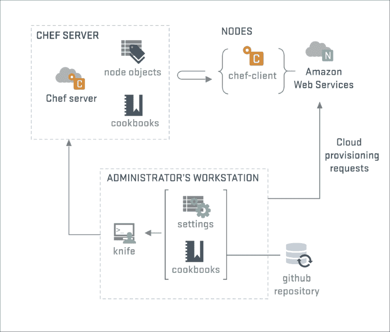
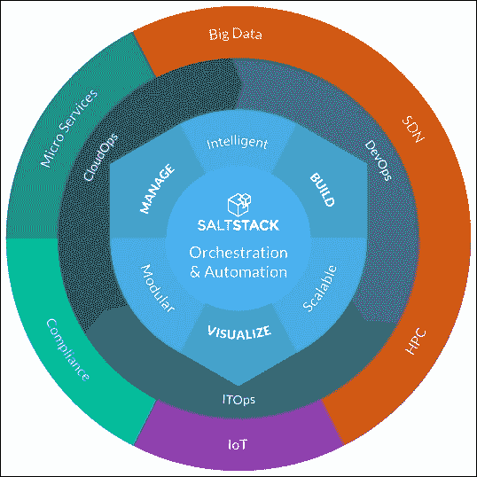

# 第八章：配置管理

根据一项研究，大型 IT 系统中发生的大多数关键错误都是由于人和流程造成的。其中一半的错误是由于发布同步不足、机器之间的协调以及配置管理不足造成的。大型机械和基础设施对于任何一个团队来说都太难管理和维护了。为了让所有机器都能同步工作，需要为每台机器设置相同的配置集，这对管理团队来说是一场噩梦。因此，我们有一个叫做**配置管理**（**CM**）的流程。

在本章中，我们将描述如何使用 CM 流程来维护和管理 CentOS 7 Linux 服务器基础设施。我们将简要描述一些最常见的开源配置管理工具，并举例说明如何使用 Puppet 设置管理服务器和客户端。

通过本章，您将学习以下主题：

+   操作系统配置管理

+   开源配置管理工具

+   Puppet 服务器和客户端的安装和配置

# 介绍配置管理

配置管理是一个帮助组织多台机器/系统，使它们能够协调执行一个较大过程或运行多个冗余过程的流程。它被军事组织广泛使用来管理其系统，如武器系统、车辆和信息系统。在军事之外，它在 IT 服务管理中被广泛用于大型基础设施处理。

仍然有许多 IT 组织使用旧的传统工具，如定制脚本（shell 脚本、expect 脚本等）和手动流程实施来运行重复任务。我们已经充分认识到，这些技术已不再有效，特别是在大规模基础设施中使用时。即使对于小型基础设施，由于配置不断变化，很难跟踪和维护它们。所有这些可能会直接影响基础设施本身的可靠性，也可能影响组织的生产力。

自动化配置管理已经结束了手动脚本编写和配置；它还被用于执行大多数系统管理员每天都要做的其他任务（系统更新、固件补丁、发布更新和管理等）。

对于新一代系统管理员来说，一切都是自动化的。大多数机器都运行在相同的配置集上，并有一组服务器来管理它们。一切都由监控工具监视。系统管理员的工作是初始化他们基础设施的基本配置，启动他们的配置管理服务器，如果需要在其他机器上设置客户端，然后开始向客户端发送配置以应用它。配置管理服务器将充当 Puppet 的主人，并向它们发送直接命令，无论它们的架构或操作系统类型如何。


来源：[`flylib.com/`](http://flylib.com/)

对于我们的情况，我们将设置一个 CentOS 7 服务器来控制一个使用配置管理的 CentOS 7 客户端，我们将向您展示手动配置是多么耗时和不可靠。在此之前，我们将向您展示一些用于配置管理的著名开源工具的列表：


来源：[`www.axiossystems.it`](http://www.axiossystems.it)

# 开源配置管理工具

在这一部分，我们将列举世界上最著名的开源配置管理工具，介绍每个工具的描述、主要重点以及它可以发挥作用的领域。

## 厨师

Chef 是一个配置管理工具，帮助我们配置和维护提供各种服务的服务器。Chef 使用称为配方的东西，用于描述服务器应用程序和实用程序的所需管理（配置，安装，更改）。由于其自动提供和配置新机器的能力，Chef 被广泛用于基于云计算的基础设施（如 Rackspace，Internap，Amazon，Google，OpenStack，SoftLayer 和 Microsoft）。Chef 的可扩展性使其能够根据需求用于小型和大型基础设施。 

Chef 可以作为服务器或客户端执行。客户端在我们想要使用服务器管理的服务器/机器上执行。并且 Chef 服务器代理安装在一个集中的服务器上，它根据管理员为每个节点定义的内容（Web 服务器，集群机器，存储服务器等）来管理配方。然后客户端执行服务器发送给它的配方。默认情况下，客户端每 30 分钟从服务器更新其配方，以查看是否有任何需要更改的内容。

在项目开始时，Chef 只用于管理 Linux 机器，但现在它也能够管理 Windows 机器。Chef 服务器现在受到多个 Linux 平台的支持（RHEL/CentOS，FreeBSD，OSX，Solaris 等）。

这是在安装了 Chef 之后的架构。第一张图片显示了 Chef 与各种可以管理的节点之间的交互。


来源：[`www.yet.org`](http://www.yet.org)

以下截图显示了 Chef 与亚马逊网络服务之间的交互，以用于高级配置



来源：[`www.chef.io/`](https://www.chef.io/)

### 注意

有关如何设置和掌握 Chef 的更详细信息，请查看 Packt 关于 Chef 的其他图书：[`www.packtpub.com/all/?search=chef`](https://www.packtpub.com/all/?search=chef)

## SaltStack（Salt）

SaltStack 是一个基于 Python 的开源配置管理工具。它也被称为远程引擎。在某种程度上，这是基础设施管理的一种新方法。它易于运行，可扩展，可以处理数千个节点，并且可以在其节点之间（服务器，终端等）建立非常快速的通信。

由于其内部基础设施中的动态通信而闻名，Salt 能够通过其节点组织，执行和建立配置管理，以及更多。

它适用于各种操作系统（CentOS，Debian，RHEL，Ubuntu，甚至 Windows）。

Salt 被设计为非常可扩展，具有使用模块管理的能力，以便塑造成各种应用程序。Salt 提供动态模块来管理其组件的远程执行和管理。它们分为以下几类：执行模块，状态模块，颗粒，渲染器模块，返回器和运行器。

SaltStack 有一个付费产品叫做 SaltStack Enterprise。它专为 IT 组织，系统管理，站点可靠性工程和现代数据中心基础设施，应用程序和代码的开发配置和管理而设计。它在下图中简要描述了，显示了它如何涵盖各种领域，以帮助建立，管理和维护以下两个图中显示的服务：



来源：[`www.saltstack.com`](http://www.saltstack.com)

这张图显示了三个主要服务（ITOps，DevOps，CloudOps）之间的交互，以及使用 SaltStack 来一起管理它们的能力。


来源：[`www.saltstack.com`](http://www.saltstack.com)

SaltStack 服务按照下图所示的几个步骤运行：


来源：[`saltstack.com`](http://saltstack.com)

### 注意

有关如何设置和掌握 SaltStack 的更详细信息，请查看 Packt 关于 SaltStack 的其他图书：[`www.packtpub.com/all/?search=saltstack`](https://www.packtpub.com/all/?search=saltstack)。

## Ansible

Ansible 是一个免费且简单的配置管理解决方案。它以自动化配置管理而闻名，依靠 SSH 访问节点，并通过基于 Python 的解决方案对其进行配置。它使用了最少的依赖和环境工具（如客户端代理），并且是安全的。它也非常可靠，不需要非常高级的学习课程就能开始使用它。

它的配置需要编辑一些人类可读的配置文件，以确保每个人都能理解它们，如果需要更新或重新配置。它只需要 SSH 密码或 SSH 密钥来访问要管理的节点，无需安装代理。因此，绝对不需要担心由于升级、补丁或守护进程故障而导致代理未运行。

Ansible 也支持模块。基本上，大多数模块都是基于 JSON 运行的，并且它支持所有种类编程语言的标准输出。它还包括了 200 多个模块，可以用来管理和自动化服务。

它得到了 RHEL 社区（Red Hat、Fedora、CentOS 和 Scientific Linux）的良好支持。可以通过 EPEL 存储库轻松下载。它还受到 Debian 家族的其他 Linux 发行版以及其他类 Unix 系统（如 OS X、BSD）和最近的 MS Windows 的支持。


来源：[`sysadmincasts.com`](https://sysadmincasts.com)

### 注意

有关如何设置和掌握 Ansible 的更详细信息，请查看 Packt 关于 Ansible 的其他图书：[`www.packtpub.com/all/?search=ansible`](https://www.packtpub.com/all/?search=ansible)

## Puppet

Puppet 是一个开源的配置管理工具，旨在管理和配置同一基础架构内的机器，简化各种系统管理任务，用户可以使用不同的方式（Ruby DSL、Puppet 声明语言等）声明机器的状态和资源。它是在 GPL 和 Apache 许可下发布的。主要用于管理和配置基于 Unix 的机器和 Microsoft 系统。为了建立 Puppet，最佳实践是需要一个 Puppet 服务器代理来扮演配置管理服务器的角色，对于其他节点，即服务器将要管理的节点，我们需要客户端版本。Puppet 检查每个节点的配置，然后识别其配置文件中指定的旧配置和新配置之间的更改，如果有的话。然后开始进行必要的更改，以调整节点到指定的状态。这个任务不仅对建立新配置有用，而且对于在机器出现问题时恢复配置也很有用。

基本上，Puppet 的主要优势在于它自动化了软件交付过程的每一步，从物理和虚拟机器的供应到组织和报告。Puppet 被许多组织广泛使用，因为它具有以下功能：

+   它旨在在问题解决过程中防止重复

+   它具有使快速和可重复的自动配置的能力

+   它简化了对物理和虚拟设备的管理

+   它使系统管理任务变得更加容易

Puppet 提供两种服务：一种是开源免费解决方案，另一种是面向企业的付费解决方案。它们都可以帮助系统管理员自动化基础设施配置管理。Puppet Enterprise 为大型企业提供了更多的功能。


来源：[`www.slideshare.net/`](http://www.slideshare.net/)

Puppet 不仅仅是一个简单的配置管理工具。它是一个简化节点安装、管理和修复的解决方案，简化了节点网格的管理。

如下图所示，要使用 Puppet 建立新的配置，需要遵循四个重要步骤：定义、模拟、执行和报告。在这里，系统管理员首先定义需要设置的配置类型。然后，Puppet 在不损害基础设施的情况下测试部署，并确保它能正常工作。之后，Puppet 开始比较新的内容和已经使用的内容，并开始执行满足用户需求的操作。最后，它在仪表板上报告每个节点的状态。


来源：[`www.slideshare.net`](http://www.slideshare.net)

### 安装和配置 Puppet

对于我们的 Puppet 安装，我们将安装 Puppet 的免费开源版本。

我们选择 Puppet 作为我们的主要配置管理解决方案，因为 Puppet 是一种更具声明性的解决方案。这使得它比其他解决方案更具吸引力，用于损坏修复。

Puppet 有两种可能的架构：Agent/Master 架构或独立架构。Agent/Master 架构基于一个或多个 Puppet 主控服务器管理运行 Puppet 客户端代理的服务器/节点。在独立架构中，客户端节点同时作为主控和从属代理运行 Puppet。通常用于安排管理任务或作业到安装了 Puppet 的机器上。

在本章中，我们将使用客户端/主控架构，我们将使用两台 CentOS 7 服务器；一台将用作主 Puppet 服务器，另一台将用作 Puppet 代理运行的客户端。

在开始安装之前，我们需要确保完成一些预安装任务。我们已经决定了架构，因此我们更清楚将要安装哪些软件包。

然后我们应该确定哪台机器将充当 Puppet 服务器代理。我们应该始终从安装服务器开始，然后再转向客户端。

下图展示了 Puppet 主控和客户端之间在 Puppet 主控界面上尝试建立经理请求的更改时的交互：


来源：[`elatov.github.io/2014/08/setting-up-puppet-master-on-centos-7/`](http://elatov.github.io/2014/08/setting-up-puppet-master-on-centos-7/)

我们的基础设施将包括以下内容：

+   Puppet 主控服务器：

+   操作系统：`CentOS 7`

+   IP 地址：`10.0.0.10`

+   主机名：`masterpuppet.packt.co.uk`

+   第一个客户端服务器：

+   操作系统：`CentOS 7`

+   IP 地址：`10.0.0.11`

+   主机名：`webserver1.packt.co.uk`

+   第二个客户端服务器：

+   操作系统：`CentOS 7`

+   IP 地址：`10.0.0.12`

+   主机名：`webserver2.packt.co.uk`

通常，我们应该检查客户端和基础设施服务器所使用的 Linux 版本和系列。在我们的情况下，我们已经定义了所有环境中的机器都使用 CentOS 7。

之后，Puppet 架构将通过网络进行管理，因此我们应该确保所有节点（服务器和客户端）都配置良好以运行 Puppet 流量。我们需要在服务器上打开默认的 Puppet 访问端口 8140，以便客户端可以访问它：

```
$ sudo firewall-cmd --permanent --zone=public --add-port=8140/tcp
$ sudo firewall-cmd --reload

```

最后，对于网络，我们应该将所有节点配置为唯一的主机名，并且每台机器的`/etc/hosts`文件中都需要定义所有其他机器的 IP 地址：

```
$ sudo nano /etc/hosts
10.0.0.10  masterpuppet.packt.co.uk
10.0.0.11  webserver1.packt.co.uk
10.0.0.12  webserver2.packt.co.uk

```

为了确保所有确认在节点之间同步，我们需要建立一个网络时间服务器（使用 NTP）连接，使所有节点与相同的时间同步：


现在我们可以开始安装我们的 Puppet 服务器：

1.  第一步是启用提供 Puppet、PuppetDB 和其他软件包的 Puppet 开源存储库。我们将使用 RPM 将 Puppetlabs 文件添加到系统中：

```
$ sudo rpm -ivh https://yum.puppetlabs.com/puppetlabs-release-el-7.noarch.rpm

```

1.  然后我们安装 Puppet 服务器：

```
$ sudo yum install puppet-server

```

1.  我们需要接受安装管理器可能询问的所有内容，例如 RPM-GPG-Key 验证，以及是否要安装软件包。

1.  然后我们需要配置 Puppet 以理解这个节点是主 Puppet 服务器：

```
$ sudo nano /etc/puppet/puppet.conf

```

1.  接下来，我们需要在`[main]`部分下添加这两行：

```
 dns_alt_names = masterpuppet,masterpuppet.packt.co.uk
 certname = masterpuppet.packt.co.uk

```

1.  由于这是我们的 Puppet 服务器，我们需要创建它的证书。我们需要手动启动 Puppet 服务器，直到它创建所需的证书为止。之后，我们需要停止它，因为我们仍在运行配置：

```
$ sudo puppet master --verbose --no-daemonize

```

1.  在收到以下消息后，我们需要按 Ctrl + C 停止服务：

```
Notice: Starting Puppet master version 3.8.4

```

在这一点上，我们可以启动 Puppet。但我们希望将 Puppet 服务与 Apache 集成，使其成为一个可以通过安装特殊模块同时提供服务的服务。为此，我们需要安装一些有用的软件包：

```
$ sudo yum install mod_passenger curl curl-devel make automake httpd httpd-devel mod_ssl ruby-devel rubygems gcc gcc-c++ pygpgme zlib-devel openssl-devel

```

然后我们需要安装 Passenger，这是一个开源工具，我们将使用它来安装一些 Apache 插件，以帮助开发 Puppet Web 服务器。对于安装任务，我们将使用 GEM，这是一个用于安装基于 Ruby 的软件包的 Ruby 工具：

```
$ sudo gem install rack passenger

```

从那时起，我们可以安装 Passenger Apache 模块。对于 CentOS 7，我们需要找到可执行文件。在安装过程中，它不会在 BIN 环境中设置其二进制文件。因此，我们需要从安装位置执行它：

```
$ sudo locate passenger-install-apache2-module 
$ sudo /usr/local/share/gems/gems/passenger-5.0.21/bin/passenger-install-apache2-module

```


之后，我们按照最后一个命令提供的说明进行操作。

首先，我们需要输入`1`来安装 Apache 2 模块：

```
1\. The Apache 2 module will be installed for you.

```

然后每当程序询问时，我们只需输入*Enter*。我们可以忽略警告，并希望不会出现错误。否则，我们需要确保我们之前已安装了所有所需的工具。当我们看到错误和警告摘要，并收到以下消息时，我们知道已完成：

```
Phusion Passenger is a registered trademark of Hongli Lai & Ninh Bui.

```

接下来，我们创建两个目录，Puppet 将在其中生成其公共和临时文件，并将所有权设置为其配置文件：

```
$ sudo mkdir -p /usr/share/puppet/rack/puppetmasterd/public /usr/share/puppet/rack/puppetmasterd/tmp
$ sudo cp /usr/share/puppet/ext/rack/config.ru /usr/share/puppet/rack/puppetmasterd/
$ sudo chown puppet:puppet /usr/share/puppet/rack/puppetmasterd/config.ru

```

最后，我们在 Apache2 配置目录中创建 Puppet 虚拟主机文件，如下所示：

```
$ sudo nano /etc/httpd/conf.d/puppetmaster.conf

```

我们填写以下配置选项，根据我们在不同环境中配置的内容更改红色文本：

```
# CentOS 7:
# Set those as the Gems and Passenger version installed on your system
LoadModule passenger_module  /usr/local/share/gems/gems/passenger-5.0.21/buildout/apache2/mod_passenger.so
PassengerRoot /usr/local/share/gems/gems/passenger-5.0.21/

PassengerRuby /usr/bin/ruby
# And the passenger performance tuning settings:
PassengerHighPerformance On
PassengerUseGlobalQueue On
# Passenger Max Pool should be configured as 3/2 the number of CPU cores of the master machine:
PassengerMaxPoolSize 4
# Limit number of request before recycling
PassengerMaxRequests 1000
# Limit time for process to set as idle
PassengerPoolIdleTime 600
Listen 8140
<VirtualHost *:8140>
 SSLEngine On
 # Only allow high security cryptography. Alter if needed for compatibility.
 SSLProtocol             All –SSLv3
 SSLCipherSuite          HIGH:!ADH:RC4+RSA:-MEDIUM:-LOW:-EXP
 SSLCertificateFile	/var/lib/puppet/ssl/certs/unixmen-centos7.arnhem.chello.nl.pem
 SSLCertificateKeyFile	/var/lib/puppet/ssl/private_keys/unixmen-centos7.arnhem.chello.nl.pem
 SSLCertificateChainFile /var/lib/puppet/ssl/ca/ca_crt.pem
 SSLCACertificateFile    /var/lib/puppet/ssl/ca/ca_crt.pem
 SSLCARevocationFile     /var/lib/puppet/ssl/ca/ca_crl.pem
 SSLVerifyClient         optional
 SSLVerifyDepth          1
 SSLOptions              +StdEnvVars +ExportCertData
 # These request headers are used to pass the client certificate
 # authentication information on to the puppet master process
 RequestHeader set X-SSL-Subject %{SSL_CLIENT_S_DN}e
 RequestHeader set X-Client-DN %{SSL_CLIENT_S_DN}e
 RequestHeader set X-Client-Verify %{SSL_CLIENT_VERIFY}e
 #RackAutoDetect On
 DocumentRoot /usr/share/puppet/rack/puppetmasterd/public/
 <Directory /usr/share/puppet/rack/puppetmasterd/>
 Options None
 AllowOverride None
 Order Allow,Deny
 Allow from All
 </Directory>
</VirtualHost>

```

我们将 SELinux 设置为宽松模式，以便新模块可以使用资源：

```
$ sudo nano /etc/selinux/config

```

接下来，我们将 SELINUX 选项更改为如下所示：

```
SELINUX=permissive

```

然后我们需要重新启动 Apache 服务，并将其添加到系统启动服务中，同时禁用 Puppet 服务：

```
$ sudo systemctl restart httpd.service
$ sudo systemctl enable httpd.service
$ sudo systemctl disable puppetmaster.service

```

完成了这一步，我们可以说我们已经完成了服务器的配置。现在我们可以继续设置和配置客户端。


来源：[`www.aosabook.org`](http://www.aosabook.org)

正如我们之前所说，我们需要确保`/etc/hosts`文件配置正确，并且所有节点（无论是客户端还是服务器）都在其中。此外，我们需要确保 NTP 服务正在运行，并且正在加载与我们的服务器相同的时间服务器的时间。通常，我们可以使用系统默认设置，这样就可以正常工作。

```
$ sudo yum install ntp ntpdate
$ sudo systemctl start ntpd
$ sudo systemctl enable ntpd

```

与服务器一样，我们对客户端配置 Puppet 存储库做同样的事情：

```
$ s
udo rpm -ivh https://yum.puppetlabs.com/puppetlabs-release-el-7.noarch.rpm

```

然后我们安装 Puppet 客户端代理：

```
$ sudo yum install puppet

```

接下来，在启动服务之前，我们需要将 Puppet 主服务器 ID 添加到客户端代理配置文件中。因此，我们继续编辑 Puppet 配置文件。我们在代理选项下添加服务器地址：

```
$ sudo nano /etc/puppet/puppet.conf
[agnet]
server = masterpuppet.packt.co.uk
report = true
pluginsync = true

```

然后我们保存文件，启动服务，并将其启用为系统启动服务：

```
$ sudo systemctl enable puppet.service
$ sudo systemctl start puppet.service

```

我们需要为所有客户端服务器执行相同的操作。

之后，我们返回到我们的 Puppet 服务器并检查证书是否已发送：

```
$ sudo puppet cert list

```

我们应该看到类似于这样的东西：

```
"webserver1.packt.co.uk" (SHA256) 04:55:E0:82:4E:AD:7F:3C:9C:C7:52:79:98:ED:5E:A6:B0:B5:85:08:DC:81:E5:2D:A6:32:ED:8B:5C:F4:3B:DA

```

这意味着我们有一个客户端请求服务器批准证书请求。我们可以使用以下命令签署每个服务器证书：

```
$ sudo puppet cert sign webserver1.packt.co.uk

```

现在我们可以返回到客户端检查证书是否已成功设置，使用以下命令：

```
$ sudo puppet agent -t

```

如果我们得到以下输出，就表示它已经配置好了：


此时，我们的 Puppet 主服务器和客户端基础设施运行良好。让我们尝试从 Puppet 服务器创建配置并将其发送到客户端以应用它。

我们需要在`/etc/puppet/manifest`文件夹中创建一个名为`site.pp`的清单文件，如下所示：

```
$ sudo nano /etc/puppet/manifests/site.pp

```

然后我们通过使客户端节点（`webserver1`和`webserver2`）测试服务并安装一些工具。我们需要将以下代码添加到最后打开的文件进行编辑：

```
node 'webserver1', 'webserver2 {
              package { 'php' :
              ensure => installed,
                       }
}
```

要验证 Puppet 是否正常运行，我们可以随时转到客户端并输入以下内容：

```
$ sudo puppet agent --test

```


默认情况下，Puppet 代理将每 30 分钟检查一次 Puppet 服务器，以查看是否有任何更改发生，以便应用它。因此，在测试期间，我们可以随时强制手动更新，就像我们之前做的那样。更新时间可以通过在 Puppet 配置文件中的`[main]`部分进行更改来更改，如下所示：

```
$ sudo nano /etc/puppet/puppet.conf
runinterval = 900 # To make change every 15 minutes (60 x time in minutes)

```

然后我们可以更改它以安装服务并确保其运行：

```
node 'webserver1', 'webserver2 {

              package { 'httpd' : 
              ensure => installed, 
                       } ->  # this to ensure that the order before it is executed before going to the order after it
              service {'httpd': 
              ensure => running, 
              enable => true, 
                       }
}
```


我们还可以通过在安装程序之前强制安装 EPEL 存储库来安装仅位于 EPEL 存储库中的程序：

```
node 'webserver1', 'webserver2 {        
package { 'epel-release' : 
              ensure => installed, 
                       }  ->
              package { 'iperf' : 
              ensure => installed, 
                       }
}
```


然后我们可以执行一些用户操作，我们可以在所有客户端服务器上创建一个用户。首先，我们需要在同一台机器上创建它，以获取其哈希密码。然后我们编辑`site.pp`文件以提供有关用户的一些信息：

```
node 'webserver1' {

                 user { "usertest":  
                 ensure => "present",
                 shell => '/bin/bash', 
                 home => '/home/usertest', 
                 managehome => true, 
                 password => '############################', }
}
```

在完成本章之前，我们想探索 Puppet Labs 提供的额外模块，我们可以在不需要创建自己的情况下使用这些模块来执行简单的日常任务。要搜索模块，我们使用以下命令：

```
$ sudo puppet module search ftp

```

然后，要安装所需的软件，我们使用`install`选项：

```
$ sudo puppet module install puppetlabs-apache

```

然后，要检查安装了什么，我们转到`/etc/puppet/module`文件夹，那里我们将拥有所有模块及其配置文件。我们可以根据需要随时更改它们。


来源：[`static.virtualizationpractice.com`](http://static.virtualizationpractice.com)

### 注意

我们相信我们已经提供了一些关于如何在 CentOS 7 上使用 Puppet 的体面信息，但 Puppet 仍有很多可提供的。要了解更多信息，请查看 Packt 关于 Puppet 的其他图书：[`www.packtpub.com/all/?search=puppet`](https://www.packtpub.com/all/?search=puppet)

# 参考资料

现在，让我们看一下本章中使用的参考资料：

+   维基百科上的配置管理：[`en.wikipedia.org/wiki/Configuration_management`](https://en.wikipedia.org/wiki/Configuration_management)

+   Chef 网站：[`www.chef.io/`](https://www.chef.io/)

+   SaltStack 网站：[`saltstack.com`](http://saltstack.com)

+   Ansible 网站：[`www.ansible.com`](http://www.ansible.com)

+   Puppet 网站：[`puppetlabs.com`](https://puppetlabs.com)

+   Puppet 网页是什么：[`puppetlabs.com/puppet/what-is-puppet`](https://puppetlabs.com/puppet/what-is-puppet)

# 总结

在本章中，我们介绍了配置管理及其对系统管理员的好处，特别是在大型计算机环境中工作时。我们简要介绍了一些用于在 Linux 服务器上进行配置管理的知名开源解决方案，特别是 CentOS 7。然后我们选择了 Puppet 作为我们的候选人，以逐步教程的方式展示如何设置和配置主/客户端架构。最后，我们在客户端节点上测试了一些命令。

在最后一章中，我们将向您展示一些我们认为每个使用 Linux 系统管理员，特别是 CentOS 的管理员应该知道的东西，以更好地以最佳实践方式管理和保护他们的基础设施。
