# 第九章：一些额外的技巧和工具

对于日常的 Linux 使用，大多数系统管理员/用户必须掌握一些技巧，以帮助他们充分发挥 Linux 机器的潜力。这就像拥有一把瑞士军刀，只用它来切蔬菜。Linux 隐藏了许多有用的技巧，可以用来处理日常任务，而 CentOS 7 是最新和最可靠的操作系统之一，许多用户可以用它来解决大量问题。

通过本章，我们将展示一些我们认为任何系统管理员都应该知道如何使用的最需要的工具。我们将展示如何使用这些技巧和工具来更好地管理 CentOS 7 服务器基础架构。

在本章中，我们将介绍以下主题：

+   使用 SSH 连接到多台 Linux 机器

+   保护 SSH 和 root 登录配置

+   基于 SSH 密钥的身份验证

+   安装和配置 SpamAssassin

+   设置 Clamav 防病毒软件

+   为 MySQL 数据库配置 Mytop

+   设置 Samba 和 NFS 进行文件共享

+   介绍一些 Linux 系统和网络监控工具

# 远程连接的 SSH

众所周知，SSH 是我们用来远程连接到 Linux 机器的安全 Shell 连接。这是系统管理员用于远程管理基础设施的主要工具。它是 CentOS 7 基本安装中的一个基本工具，几乎所有 Linux 发行版都默认包含它。

通常，SSH 只安装为客户端，因此您只能远程连接到其他计算机；但这不适用于基本系统安装。在安装 CentOS 7 服务器时，应该已经安装并运行了 SSH 服务器。

要安装 SSH 服务器，我们可以依赖默认的软件包存储库，而无需添加任何额外的第三方存储库：

```
$ sudo yum install openssh-server

```

安装 SSH 服务器后，我们应该启动服务并将其启用为默认的系统启动服务：

```
$ sudo systemctl start sshd.service
$ sudo systemctl enable sshd.service

```

出于安全考虑，大多数机器都关闭了默认的 SSH 端口，因此我们需要从默认防火墙管理器中打开它：

```
$ sudo firewall­cmd ­­permanent ­­zone=public ­­add­port=ssh/tcp
$ sudo firewall­cmd ­­reload

```

这就是我们需要做的一切，以使机器可以远程访问。

要访问这台机器，我们只需要输入`ssh`，然后输入用户名和 IP 地址或主机名（如果该机器存储在 DNS 服务器上或列在本地`/etc/hosts`文件中）。

```
$ ssh user1@server1.packt.co.uk
$ ssh user1@10.0.0.10

```

通常，如果服务器正在运行并且`sshd`服务正在监听，那么在首次使用此机器连接到该服务器时，应该会交换公钥。否则，服务器将要求所需用户密码以允许登录。

当我们使用 SSH 连接到远程机器时，就像我们对该机器有一个开放的窗口，我们有点被困在那里，这是一种连接的网络消耗方式，如果我们长时间使用它，尤其是如果我们只是连接而没有真正输入任何命令。因此，我们需要关闭终端窗口以离开远程连接会话并释放保留的资源。SSH 提供了一些有用的选项，如`-t`。通过这个选项，我们可以发送一个命令在远程机器上执行，并发送回输出：

```
$ ssh -t user1@server1.packt.co.uk cat /etc/hosts

```

此命令将仅显示`/etc/hosts`文件的内容，而不保持窗口打开。

我们还可以使用 SSH 在两台机器之间发送文件，使用`scp`命令：

```
$ scp user1@server1.packt.co.uk:/home/user1/Desktop/file1.txt  ./Desktop/

```

在下一节中，我们将向您展示如何保护 SSH 并管理 root 登录。

！远程连接的 SSH

来源：[`www.allegrosoft.com/`](https://www.allegrosoft.com/)

# 保护 SSH 和 root 登录配置

在本节中，我们将展示一些基本和高级的方法来保护 SSH 服务，以减轻更多的威胁。我们需要对`/etc/ssh/sshd_config`文件进行一些微小的更改。我们将逐渐解释每一行的更改：

```
$ sudo nano /etc/ssh/sshd_config

```

取消注释 SSH 版本 2 行，只使用更新的 SSH 版本，这更安全可靠。该行应如下所示：

```
Protocol 2

```

我们可以限制用户访问以限制某些用户访问服务器。我们使用 SSH 来做到这一点：

```
DenyUsers Baduser1 baduser2

```

然后我们可以设置 SSH 连接的超时，以始终关闭一段时间内不活动的会话。我们需要从会话变为空闲开始倒计时：

```
ClientAliveInterval 360
ClientAliveCountMax 0

```

然后我们可以使用 SSH 禁用 root 登录：

```
PermitRootLogin no

```

此外，我们可以禁用空密码使用，如果用户没有密码，则无权登录：

```
PermitEmptyPasswords no

```

除此之外，我们还可以对密码身份验证执行相同的操作。我们可以强制所有登录都通过生成的密钥进行：

```
PasswordAuthentication no

```

然后警告横幅总是有用的。因此，如果需要创建一个，我们应该编辑`/etc/issues`并添加任何类型的横幅：

```
$ sudo nano /etc/issue

```

然后我们应该重新启动服务，以使其生效：

```
$ sudo systemctl restart sshd 

```

一些服务器是公开可访问的，因此它们可能需要对其 SSH 服务进行额外加固。为此任务，我们将安装一个名为**Fail2Ban**的工具，这是一个非常可靠的工具，可以帮助保护许多服务免受暴力攻击。它基本上会扫描特定服务的日志文件，并查找失败的登录尝试以阻止它们。要安装它，我们首先需要安装 EPEL 存储库：

```
$ sudo yum install epel-release

```

然后我们需要使用**Rsyslog**安装它，因为它会扫描从 Rsyslog 获取的日志输出：

```
$ sudo yum install fail2ban rsyslog

```

为了使其正常工作，我们可以更新它或更新 SELinux 策略。

然后我们继续配置它以保护 SSH。我们需要在`Fail2Ban`的`jail`文件夹中创建一个名为`sshd.local`的文件：

```
$ sudo nano /etc/fail2ban/jail.d/sshd.local

```

然后我们在其中添加以下代码：

```
[sshd]
enabled  = true
filter   = sshd
#action  = firewallcmd-ipset
maxretry = 8
bantime  = 172800

```

这将禁止攻击 48 小时。然后我们启动服务并将其启用为系统启动服务：

```
$ sudo systemctl start fail2ban
$ sudo systemctl enable fail2ban

```

我们现在可以说我们已经完成了保护 SSH。让我们尝试管理 root 登录访问。我们已经展示了如何使用 SSH 禁用 root 登录。让我们稍微管理 Sudoers 文件，使用户可以执行“超级用户”命令而无需输入密码。

首先，我们需要在服务器上安装`sudo`。通常，大多数 CentOS 7 服务器安装都已经安装了`sudo`。

然后我们可以只使用 wheel 组。如果需要，我们可以创建一个新的：

```
$ sudo nano /etc/sudoers

```

然后我们转到描述 wheel 组的行：

```
%wheel ALL=(ALL)  ALL

```

在这里，我们需要添加一个单词，使得此组下的用户可以使用`sudo`获得 root 访问权限，并且他们不需要每次都使用密码：

```
%wheel ALL=(ALL)  NOPASSWD: ALL

```

### 注意

一些系统管理员不建议此选项，因为如果输入错误，就无法回头了。根据需要，始终可以选择此选项。

# 基于 SSH 密钥的身份验证

正如我们每次使用 SSH 时所注意到的，我们需要输入密码，这在许多安全策略中是不推荐的。这就是我们将使用 SSH 功能使用公钥/私钥进行身份验证的地方。

SSH 提供了一个工具，用于创建用于远程连接身份验证的公钥/私钥，而无需使用密码。我们如何做到这一点？很简单。对于此测试示例，我们将创建一个新的 RSA 密钥，比通常的安全性更高（我们可以创建不同类型的密钥，如`dsa`，`ecdsa`，`ed25519`）：

```
$ ssh-keygen –t rsa -b 2048 -v

```

然后按照命令给出的步骤进行。对于默认安装，我们可以继续输入*Enter*。否则，我们可以始终添加某种密码来使其更安全。我们可能需要指定密钥文件名，以便以后使用它。

然后我们需要将新创建的密钥文件复制到我们要连接的主机上。有两种方法可以做到这一点。传统的方法是将密钥文件直接复制到我们要远程连接到的服务器中，而无需使用密码。我们需要将文件放在当前用户文件夹中的子文件夹`.ssh`中。或者，我们可以简单地使用`ssh-copy-id`命令，它可以在不痛苦的情况下完成相同的工作：

```
$ ssh-copy-id user1@server1.packt.co.uk

```

然后我们需要最后一次输入密码。

之后，任何 SSH 远程连接或文件传输都可以在不需要密码的情况下完成。

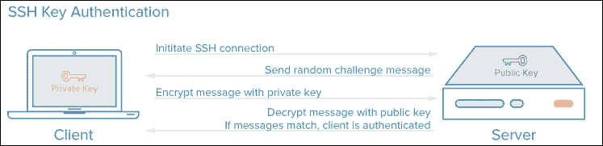

来源：[`www.digitalocean.com/`](https://www.digitalocean.com/)

# 安装和配置 SpamAssassin

**SpamAssassin**是与 Postfix 一起工作的最强大的垃圾邮件过滤器，用于过滤可能构成威胁的所有邮件。

我们将用它来过滤我们邮件服务器上的所有 Postfix 邮件（正如我们在第四章中描述的那样，*使用 Postfix 的邮件服务器*，关于如何启动和运行一个）。

首先，我们需要使用默认软件包管理器进行安装：

```
$ sudo yum install spamassassin

```

然后它就安装好了。现在我们继续进行配置部分：

```
$ sudo nano /etc/mail/spamassassin/local.cf

```

我们有一些行需要确保在文件中。因此，我们宁愿写下它们或取消注释它们：

```
rewrite_header Subject ***SPAM***
required_hits 5.0
report_safe 0
required_score 5

```

接下来，我们创建一个新的用户组和一个用户来管理该服务：

```
$ sudo groupadd spamd
$ sudo useradd -g spamd -s /bin/false -d /var/log/spamassassin spamd
$ sudo chown spamd:spamd /var/log/spamassassin

```

然后我们的服务就配置好了。我们继续进行 Postfix 部分，我们需要对其主配置文件进行一些小的更改：

```
$ sudo nano /etc/postfix/master.cf

```

我们需要转到 SMTPD 配置的行并添加以下行：

```
-o content_filter=spamassassin

```

因此，它应该看起来像这样：

```
smtp      inet  n       -       n       -       -       smtpd -o content_filter=spamassassin

```

之后，我们添加以下行：

```
spamassassin unix - n n - - pipe flags=R user=spamd argv=/usr/bin/spamc -e /usr/sbin/sendmail -oi -f ${sender} ${recipient}

```

我们保存文件并退出。现在我们需要通过输入以下内容来更新 SpamAssassin 规则：

```
$ sudo sa-update --nogpg

```

现在，为了对`SpamAssassin`服务和 Postfix 服务器进行更改，我们需要重新启动它，然后我们就完成了：

```
$ sudo systemctl restart spamassassin
$ sudo systemctl restart postfix.service

```

# 设置 Clamav 防病毒软件

**Clamav**是一个开源的防病毒工具。其基本用途是在基于 Linux 的机器上检测病毒、恶意软件和恶意软件。

要安装 Clamav，我们需要安装 EPEL 存储库：

```
$ sudo yum install epel-release

```

然后我们可以安装 Clamav 及其所有有用的工具：

```
$ sudo yum install clamav-server clamav-data clamav-update clamav-filesystem clamav clamav-scanner-systemd clamav-devel clamav-lib clamav-server-systemd

```

在开始配置之前，我们需要确保 SELinux 可以让 Clamav 无问题地工作：

```
$ sudo setsebool -P antivirus_can_scan_system 1

```

要检查选项是否激活，我们需要输入以下内容：

```
$ sudo getseboot –a | grep virus

```

然后我们移除示例配置，这样我们就可以制作我们自己的配置：

```
$ sudo sed -i '/^Example/d' /etc/clamd.d/scan.conf

```

删除示例行后，我们需要进行一些修改以定义 TCP 服务器类型并定义用户根来执行防病毒软件：

```
$ sudo nano /etc/clamd.d/scan.conf

```

我们取消注释以下行：

```
LocalSocket /var/run/clamd.scan/clamd.sock

```

我们在文件末尾添加这两行并保存：

```
User root
LocalSocket /var/run/clamd.<SERVICE>/clamd.sock

```

为了保持 Clamav 数据库的最新状态，我们需要启用一个名为**Freshclam**的工具。因此，我们需要从其配置文件中创建一个备份文件：

```
$ sudo cp /etc/freshclam.conf /etc/freshclam.conf.bak

```

然后我们移除示例行：

```
$ sudo sed -i '/^Example/d' /etc/freshclam.conf

```

否则，如果需要，我们可以调整选项以获得更个性化的解决方案。我们需要运行 Freshclam 手动更新数据库，并检查配置是否成功设置：

```
$ sudo freshclam

```

我们需要创建一个文件，作为运行**Freshclam**守护程序的服务文件：

```
$ sudo nano /usr/lib/systemd/system/clam-freshclam.service

```

然后我们将以下代码放入文件中并保存：

```
[Unit]
Description = freshclam scanner
After = network.target

[Service]
Type = forking
ExecStart = /usr/bin/freshclam -d -c 4
Restart = on-failure
PrivateTmp = true

[Install]
WantedBy=multi-user.target

```

接下来，我们应该通过运行它并检查其状态来检查服务是否配置正确：

```
$ sudo systemctl start clam-freshclam.service
$ sudo systemctl status clam-freshclam.service -l

```

如果一切正常，没有问题，我们将其添加到系统启动服务中：

```
$ sudo systemctl enable clam-freshclam.service

```

现在我们需要创建 Clamav 服务文件。我们有一个示例服务文件，需要复制到系统服务文件夹中。我们需要将其名称更改为可理解的内容。然后，我们需要对其进行一些小的修改：

```
$ sudo mv /usr/lib/systemd/system/clamd@.service /usr/lib/systemd/system/clamd.service

```

自从我们改变了名字，我们需要在使用这项服务的文件中也进行更改：

```
$ sudo nano /usr/lib/systemd/system/clamd@scan.service

```

我们通过删除`@`来更改第一行，使其看起来像这样：

```
.include /lib/systemd/system/clamd.service

```

在同一位置，我们需要更改 Clamd 服务文件：

```
$ sudo nano /usr/lib/systemd/system/clamd.service

```

我们在结尾添加以下行：

```
[Install]
WantedBy=multi-user.target

```

然后我们从`Description`和`ExecStart`选项中删除`%i`。然后我们将它们更改为以下内容：

```
Description = clamd scanner daemon
ExecStart = /usr/sbin/clamd -c /etc/clamd.d/scan.conf --nofork=yes

```

在运行任何服务之前，我们需要检查是否有任何错误。我们将手动运行 Clamd：

```
$ sudo /usr/sbin/clamd -c /etc/clamd.d/scan.conf –nofork=yes

```

然后，如果一切顺利，我们启动服务并将其添加到系统启动服务中：

```
$ sudo systemctl enable clamd.service
$ sudo systemctl enable clamd@scan.service
$ sudo systemctl start clamd.service
$ sudo systemctl start clamd@scan.service

```

对于 Clamav 服务的最终验证，我们检查其状态：

```
$ sudo systemctl status clamd.service -l
$ sudo systemctl status clamd@scan.service -l

```

对于当前文件夹的测试扫描，我们运行以下命令：

```
$ sudo clamscan --infected --remove --recursive ./

```

这是 ClamAV 应该在我们的基础架构中的位置：

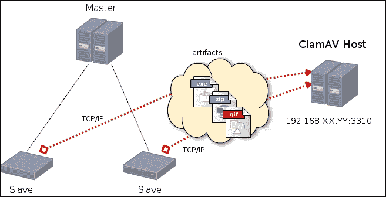

来源[`wiki.jenkins-ci.org/display/JENKINS/Home`](https://wiki.jenkins-ci.org/display/JENKINS/Home)

以下图显示了邮件服务器组件之间的更好描述，以解释 ClamAV 如何帮助保护我们的邮件服务：

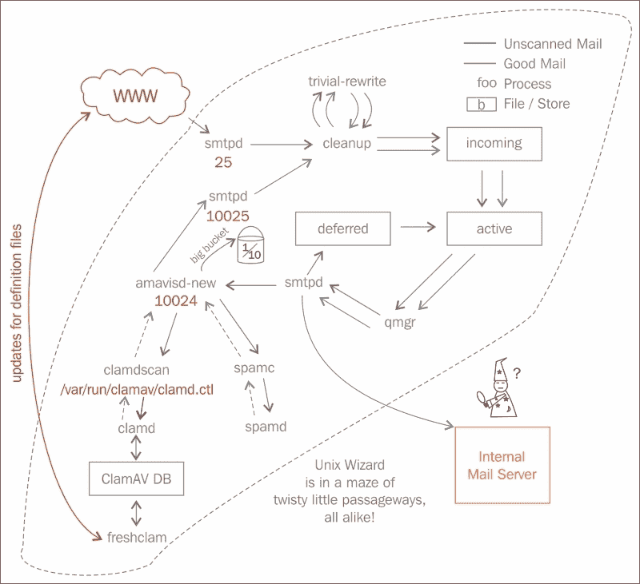

来源：[`aphyr.com/`](https://aphyr.com/)

# 为 MySQL 数据库配置 Mytop

Mytop 是一个开源解决方案，可帮助监视 MySQL 数据库的活动和性能，或者我们现在所知道的 CentOS 7 的 MariaDB。它是一个非 GUI 监控工具。因此，它在 shell 命令行中提供了一种接口。

要安装 Mytop，我们应该确保安装将在安装了 MariaDB 数据库服务器的同一台服务器上进行。然后我们添加 EPEL 存储库，如下所示：

```
$ sudo yum install epel-release

```

接下来，我们使用`yum`执行安装：

```
$ sudo yum install mytop

```

对于配置，我们只需要在`root`文件夹中创建一个配置文件：

```
$ sudo nano /root/.mytop

```

然后我们在其中输入以下文本：

```
host=localhost
db=mysql
delay=3
port=3306
socket=
batchmode=0
color=1
idle=1

```

这是在程序执行期间将使用的个性化配置。

要运行它，我们需要输入以下命令：

```
$ sudo mytop --prompt

```

然后我们需要输入 MariaDB 根密码。否则，如果我们使用非根用户访问，我们可以随时输入：

```
$ sudo mytop –u user1 --prompt

```

或者如果我们需要一个特定的数据库，我们有以下内容：

```
$ sudo mytop –d packtdb--prompt

```

要知道它是否正常工作，您应该看到以下界面：


有关如何与 Mytop GUI 交互的更多信息，您可以随时查看其手册：

```
$ man mytop

```

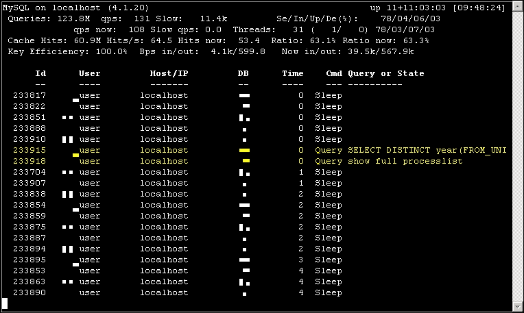

来源：[`i.gzn.jp`](http://i.gzn.jp)

# 设置 Samba 和 NFS 进行文件共享

Samba 是一个开源项目，旨在为多个操作系统（Windows、Linux 和 Mac OS）提供安全稳定的数据和打印机共享服务。

Samba 使用**会话消息块**（**SMB**）协议工作，这是大多数 Windows OS 和 Mac OS 支持的协议，用于为那些可以访问共享资源的客户端提供服务，如 Linux 存储介质、打印机、串行端口（硬件设备）。

在本教程中，我们将使用 CentOS 7 Samba 服务器和 Mac OS 机器来使用该服务以访问共享文件夹。

首先，我们将在我们的 CentOS 7 服务器上安装 Samba：

```
$ sudo yum install samba samba-client samba-common

```

在开始配置之前，我们需要进行一些备份、环境创建和防火墙设置。因此，首先，我们需要创建 Samba 配置文件的备份，以确保不会弄乱原始配置（这在有许多更新的配置时非常有用）。我们最好在更新过程的每个阶段保留备份：

```
$ sudo cp /etc/samba/smb.conf /etc/samba/smb.conf.backup

```

然后我们需要创建我们需要共享的文件夹，或者准备共享它（如果已经存在）。我们需要设置用户权限以授予该文件夹的所有内容：

```
$ sudo mkdir /SharedFolder/
$ sudo chmod -R 755 /SharedFolder/

```

最后，我们需要在服务器防火墙上打开 Samba 服务端口：

```
$ sudo firewall-cmd --permanent --zone=public --add-service=samba
$ sudo firewall-cmd --reload

```

现在我们可以开始对 Samba 配置文件进行必要的配置：

```
$ sudo nano /etc/samba/smb.conf

```

我们需要确保设置适当的工作组（通常设置为`WORKGROUP`）：

```
workgroup = WORKGROUP

```

并且我们定义了一个共享文件夹。

```
[Shared Folder]
path = /SharedFolder
read only = no
guest ok = yes
browsable =yes
writable = yes
create mask = 0755
directory mask = 0755

```

我们保存文件并创建一些 Samba 用户：

```
$ sudo smbpasswd –a user1

```

然后我们输入密码并重试输入以创建新密码。

如果我们想要与特定用户共享一些文件夹，我们需要在文件夹定义中添加以下行，并且需要通过将`guest` `ok = yes`更改为`guest` `ok = no`来禁用访客登录：

```
valid users = user1

```

在测试阶段，我们需要启动服务：

```
$ sudo systemctl enable smb.service
$ sudo systemctl enable nmb.service
$ sudo systemctl start smb.service
$ sudo systemctl start nmb.service

```

然后我们转到客户端并在服务器连接中输入此链接：

```
smb://server_ip_address

```

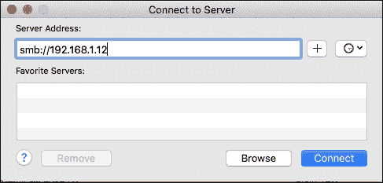

这个测试是在 Mac 机器上使用的。对于 Windows 机器，我们在资源管理器地址栏中输入以下链接：

```
\\server_ip_address

```

然后我们会有一个登录屏幕，在那里我们需要输入 Samba 用户 ID 和密码，就像这样：

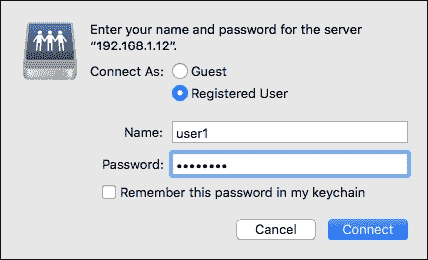

在输入正确的用户 ID 和密码后，应该会出现一个屏幕，显示该用户可以访问的可能文件夹，如下所示：

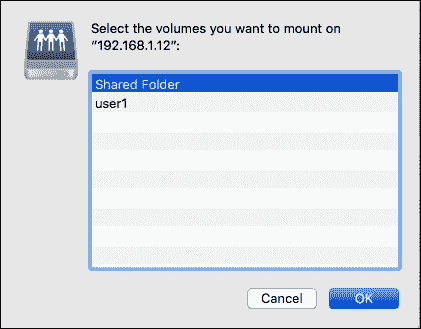

然后我们将以配置文件中定义的权限访问我们的文件夹。由于我们有写权限，我们可以创建一个文件夹，然后检查它是否确实出现在服务器上。

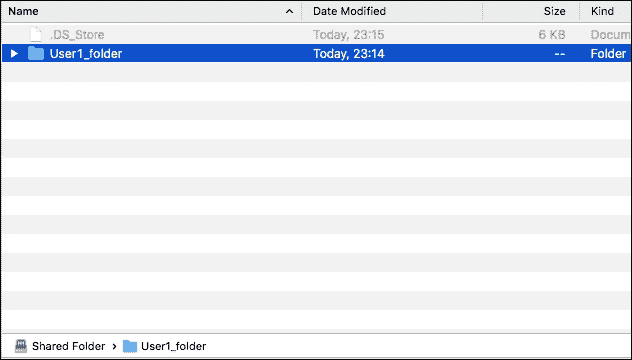

我们可以运行我们的服务器来验证客户端所做的更改是否已应用。

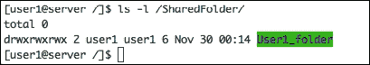

如果我们需要更改任何文件夹共享配置，我们必须重新启动服务以应用更改：

```
$ sudo systemctl restart smb.service
$ sudo systemctl restart nmb.service

```

Samba 非常适合多环境文件共享，但我们不应忘记 Linux 最著名的文件共享解决方案——**网络文件系统**（**NFS**）。NFS 是一个客户端服务器工具，用于在多个 Linux 系统之间共享数据，通过在网络上挂载许多远程共享文件夹和驱动器，直接在客户端访问这些文件。

我们将在 CentOS 7 上建立一个 NFS 客户端服务器测试，以展示它的工作原理。

首先，我们需要在服务器上安装服务：

```
$ sudo yum install nfs-utils nfs-utils-lib

```

然后我们启动负责确保服务功能的服务：

```
$ sudo systemctl enable rpcbind
$ sudo systemctl start rpcbind
$ sudo systemctl enable nfs-server
$ sudo systemctl start nfs-server
$ sudo systemctl start nfs-lock
$ sudo systemctl start nfs-idmap

```

我们准备一个要共享的文件夹：

```
$ sudo mkdir /NFSsharedFolder
$ sudo chmod –R 0755 /NFSsharedFolder

```

然后，为了导出这个文件夹并使其可以在客户端上挂载，我们继续编辑`/etc/export`文件：

```
$ sudo nano /etc/export

```

然后我们添加以下行：

```
/NFSsharedFolder 172.25.0.0/16(rw,sync,no_root_squash,no_all_squash)

```

这一行意味着我们将这个文件夹导出到网络中的所有 IP 地址。`rw`选项为文件夹提供写权限，`sync`确保文件夹始终同步，`no_root_squash`在客户端为文件夹提供 root 权限，最后，`no_all_squash`启用用户权限。

在对导出文件进行任何更改后，我们需要重新启动 NFS 服务器：

```
$ sudo systemctl restart nfs-server

```

最后，我们需要在服务器防火墙上打开 NFS 服务的端口。重新加载防火墙以应用更改：

```
$ sudo firewall-cmd --permanent --add-port=111/tcp
$ sudo firewall-cmd --permanent --add-port=875/tcp
$ sudo firewall-cmd --permanent --add-port=2049/tcp
$ sudo firewall-cmd --permanent --add-port=20048/tcp
$ sudo firewall-cmd --permanent --add-port=42955/tcp
$ sudo firewall-cmd --permanent --add-port=46666/tcp
$ sudo firewall-cmd --permanent --add-port=54302/tcp
$ sudo firewall-cmd --reload

```

通过这一步，我们可以说我们已经完成了服务器的配置。现在我们转向客户端。就像服务器一样，我们需要安装 NFS 实用程序：

```
$ sudo yum install nfs-utils nfs-utils-lib

```

然后启动适当的服务：

```
$ sudo systemctl enable rpcbind
$ sudo systemctl start rpcbind
$ sudo systemctl enable nfs-server
$ sudo systemctl start nfs-server
$ sudo systemctl start nfs-lock
$ sudo systemctl start nfs-idmap

```

在挂载网络共享文件夹之前，我们需要确保有一个位置可以挂载：

```
$ sudo mkdir /NFSfolder
$ sudo chmod –R 755 /NFSfolder

```

要测试挂载文件夹，我们可以使用`mount`命令，或者通过编辑`/etc/fstab`文件使系统自动挂载它：

```
$ sudo mount -t nfs 172.25.22.10:/NFSsharedFolder/ /NFSfolder/
$ sudo nano /etc/fstab

```

此外，我们插入以下行：

```
172.25.22.10:/NFSsharedFolder/ /NFSfolder/ nfs defaults 0 0

```

为了更快的连接，我们可以始终使用 NFS 的第四个版本，输入以下内容：

```
172.25.22.10:/NFSsharedFolder/ /NFSfolder/ nfs4 defaults 0 0

```

NFS4 比 NFS3 提供更多功能。我们建议在支持 NFS4 的 Linux 服务器环境中使用它。

最后，如果我们需要检查在特定 NFS 客户端上挂载了什么，我们使用`mount`：

```
$ sudo mount

```

# 介绍 Linux 系统和网络监控工具

在本章的最后一节中，我们将介绍一些非常有用的工具，用于监视 CentOS 7 服务器的系统和网络。

我们将首先展示一些系统监控工具。我们相信大多数这些工具需要安装 EPEL 存储库，所以我们可以在尝试安装这些工具之前先安装它：

```
$ sudo yum install epel-release

```

我们将首先讨论的工具是 Htop。它与旧的`top`命令类似，但它具有非常用户友好的界面，更加交互式，有许多快捷键，以图形彩色的方式呈现进程、CPU、内存和交换内存，以显示这些资源的使用情况。要安装 Htop，我们只需要使用 Yum：

```
$ sudo yum install htop

```

要运行它，我们只需要输入`htop`。无需配置：

```
$ htop

```

我们应该看到这种界面：

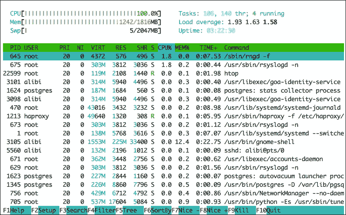

列表中的第二个系统监控工具是 Iotop。它看起来像旧的 top 命令，但它专门用于实时显示系统可用磁盘输入和输出访问。它显示每个进程的活动，以及它使用硬盘的情况（读/写速度和实际使用情况）。要安装它，我们需要再次使用 YUM，但通常它默认已安装在大多数 CentOS 7 服务器上：

```
$ sudo yum install ioptop

```

要使用它，我们需要键入名称：

```
$ ioptop

```

我们将有以下界面：

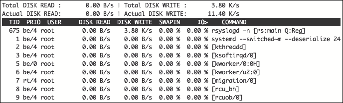

在进入网络监控工具之前，我们应该快速看一下这个既可以监控系统又可以监控网络的工具。Monitorix 是一个开源的轻量级系统和网络监控工具。它定期收集系统和网络活动，以便通过基于 Web 的界面以良好呈现的图表显示出来。它对于检测瓶颈和系统故障以进行更好的管理非常有帮助。

要安装 Monitorix，我们首先需要安装一些必要的软件包：

```
$ sudo yum install rrdtool rrdtool-perl perl-libwww-perl perl-MailTools perl-MIME-Lite perl-CGI perl-DBI perl-XML-Simple perl-Config-General perl-HTTP-Server-Simple

```

然后我们安装 Monitorix：

```
$ sudo yum install monitorix

```

这是一种服务，所以我们需要启动它并将其启用为登录服务的启动项：

```
$ sudo systemctl start monitorix
$ sudo systemctl enable monitorix

```

我们可能需要禁用 SELinux 或将其设置为宽松模式，以使我们的服务正常工作。此外，由于 Monitorix 在端口 8080 上提供服务，我们需要在防火墙上打开它，如下所示：

```
$ sudo firewall-cmd --permanent --zone=public —add-port=8080/tcp
$ sudo firewall-cmd --reload

```

然后我们可以通过浏览器开始使用它。我们在地址栏中键入以下内容：

```
http://Server_IP_address:8080/monitorix

```

因此，我们将有以下界面：

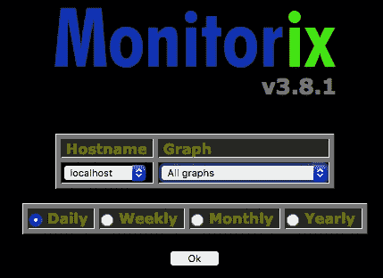

我们将看到各种图表，显示多种信息，如下所示：

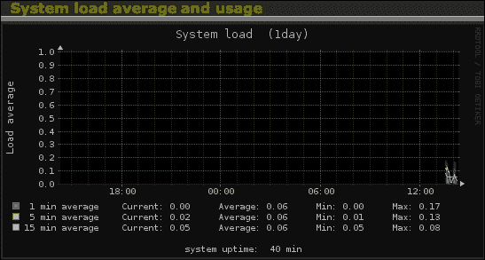

这是关于系统负载平均使用情况的，接下来是关于网络状态的：

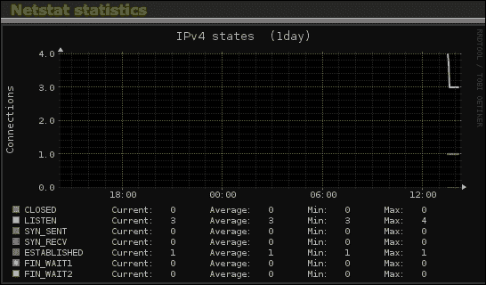

现在，让我们谈谈一些有用的网络监控工具。我们首先会谈论 Netstat，这是监控网络流入和流出流量的最常见工具之一。它对于网络故障排除非常有用。它通常已安装在系统上，所以我们只需要执行它：

```
$ netstat -a

```

接下来我们将会有这样的输出：


接下来是 IPTraf，这是一个实时网络监控工具。它收集关于网络流量活动的信息，如 TCP、UDP、IP 和 ICMP 统计数据，然后在其界面中呈现出来。要安装它，我们需要使用 YUM：

```
$ sudo yum install iptraf

```

然后我们只需键入其名称来运行它。

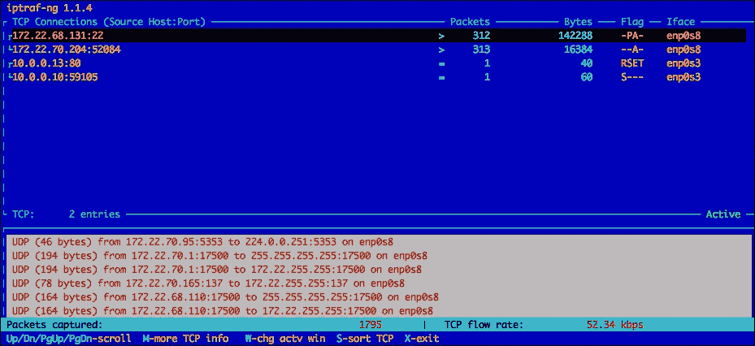

最后，还有 IfTop，这是一个实时报告网络活动的开源工具。它对于故障排除与外部服务器的连接非常有用，因为它使用`Pcap`库来捕获所需网络接口上的传入和传出数据包。要安装它，我们再次使用 yum：

```
$ sudo yum install iptop

```

然后，要使用它，我们需要键入带有所需接口的命令来监听：

```
$ sudo iptop -i eth0

```

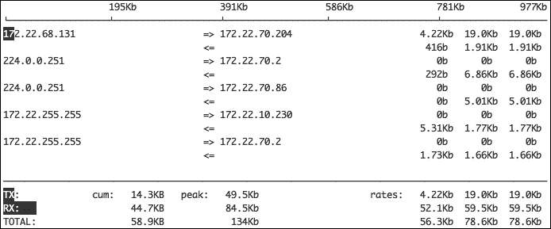

# 参考资料

现在，让我们看一下本章中使用的参考资料：

+   OpenSSH 网站：[`www.openssh.com`](http://www.openssh.com)

+   SpamAssassin 网站：[`spamassassin.apache.org/`](http://spamassassin.apache.org/)

+   Clamav 网站：[`www.clamav.net/`](http://www.clamav.net/)

+   Mymap 手册：[`jeremy.zawodny.com/mysql/mytop/`](http://jeremy.zawodny.com/mysql/mytop/)

+   Samba 网站：[`www.samba.org/`](https://www.samba.org/)

+   NFS 维基：[`nfs.sourceforge.net/nfs-howto/ar01s03.html`](http://nfs.sourceforge.net/nfs-howto/ar01s03.html)

+   Trafshow 维基：[`www.freshports.org/net/trafshow/`](https://www.freshports.org/net/trafshow/)

+   Monitorix 主页：[`www.monitorix.org/`](http://www.monitorix.org/)

# 总结

本章是我们认为应该提到任何愿意管理 CentOS 7 的系统管理员的主题的总结。我们首先介绍了一种可以轻松访问多台机器的方法。我们看到了如何保护服务，这是确保服务器配置和安全的一种最佳实践。然后我们介绍了一种在多台服务器之间共享数据的方法，这对安装阶段和日常使用都非常有用。最后，我们介绍了如何监视我们的服务在系统和网络上的活动。

系统管理员的工作有时会有所不同。有时会变得更容易，有时会变得更困难，特别是在新安装时。因此，我们已经涵盖了那些有助于缓解困难时期并使其更易管理的工具。

我们认为这本书相当于精通红帽或科学 Linux，这些资源在 Linux 系统管理领域非常受欢迎。作为系统管理员和开源用户，我们认为精通这个领域需要的不仅仅是阅读这本书。您需要探索我们简要讨论的部分，制定自己的测试场景并尝试使其更加复杂。毕竟，我们总是从职业生涯中的艰难经历中学到东西，而不是从容易的经历中学到东西。
