# 第一章：Linux 安全问题

在本章中，我们将讨论以下内容：

+   Linux 的安全策略

+   配置密码保护

+   配置服务器安全性

+   使用校验和对安装介质进行完整性检查

+   使用 LUKS 磁盘加密

+   使用 sudoers – 配置 sudo 访问

+   使用 Nmap 扫描主机

+   在易受攻击的 Linux 系统上获取 root 权限

# 介绍

Linux 机器的安全性取决于管理员的配置。一旦我们完成了 Linux 操作系统的安装，并在安装完成后删除了不必要的软件包，我们可以开始处理软件的安全性以及 Linux 机器提供的服务方面。

# Linux 的安全策略

安全策略是定义了组织中设置计算机网络安全的规则和实践。安全策略还定义了组织应该如何管理、保护和分发敏感数据。

## 制定安全策略

在制定安全策略时，我们应该牢记它应该对所有用户简单易懂。政策的目标应该是在保护数据的同时保持用户的隐私。

它应该围绕这些要点展开：

+   对系统的可访问性

+   系统上的软件安装权限

+   数据权限

+   从故障中恢复

在制定安全策略时，用户应该只使用已获得许可的服务。不允许的任何事物都应该在政策中受到限制。

# 配置密码保护

在任何系统中，密码在安全方面起着非常重要的作用。弱密码可能导致组织资源被 compromise。密码保护政策应该被组织中的每个人遵守，从用户到管理员级别。

## 如何做到…

在选择或保护密码时，请遵循给定的规则。

对于创建策略，请遵循以下规则：

+   用户不应该在组织中的所有账户上使用相同的密码。

+   所有与访问相关的密码都不应该相同

+   任何系统级别的账户的密码都应该与同一用户拥有的其他账户不同

对于保护策略，请遵循以下规则：

+   密码是需要被视为敏感和机密信息的东西。因此，不应该与任何人分享。

+   密码不应该通过电子通信（如电子邮件）分享。

+   永远不要在电话或问卷调查中透露密码。

+   不要使用可能为攻击者提供线索的密码提示。

+   永远不要与任何人分享公司密码，包括管理人员、经理、同事，甚至家人。

+   不要在办公室的任何地方以书面形式存储密码。如果在移动设备上存储密码，始终使用加密。

+   不要使用应用程序的“记住密码”功能。

+   如果怀疑密码被 compromise，立即报告事件并尽快更改密码。

对于更改策略，请遵循以下规则：

+   所有用户和管理员必须定期更改密码，或者至少每季度更改一次

+   组织的安全审计团队必须进行随机检查，以检查任何用户的密码是否可以被猜测或破解。

## 它是如何运作的…

通过前述要点的帮助，确保密码在创建或更改时不容易被猜测或破解。

# 配置服务器安全性

对 Linux 服务器进行恶意攻击的一个主要原因是安全性实施不当或现有的漏洞。在配置服务器时，安全策略需要得到适当的实施，并且需要承担责任以便正确定制服务器。

## 如何做到…

一般政策：

+   组织内所有内部服务器的管理是专门团队的责任，该团队还应该密切关注任何合规性。如果发生任何合规性，团队应相应地实施或审查安全策略。

+   在配置内部服务器时，必须以这样的方式注册服务器，以便可以根据以下信息识别服务器：

+   服务器的位置

+   操作系统版本及其硬件配置

+   正在运行的服务和应用程序

+   组织管理系统中的任何信息都必须始终保持最新。

配置策略：

+   服务器上的操作系统应按照 InfoSec 批准的指南进行配置。

+   尽可能禁用未使用的任何服务或应用程序。

+   对服务器上的所有服务和应用程序的所有访问都应进行监控和记录。它们还应通过访问控制方法进行保护。这方面的示例将在第三章中进行介绍，*本地文件系统安全*。

+   系统应保持更新，并且应尽快安装任何最近的安全补丁（如果有的话）。

+   尽量避免使用 root 帐户。最好使用需要最少访问权限来执行功能的安全原则。

+   任何特权访问必须尽可能通过安全通道连接（SSH）进行。

+   应在受控环境中访问服务器。

监控策略：

+   服务器系统上的所有与安全相关的操作必须记录，并且审计报告应保存如下：

+   所有与安全相关的日志应在线保存 1 个月

+   在 1 个月的时间内，应保留每日备份以及每周备份

+   至少保留 2 年的完整月度备份

+   任何与安全有关的事件应报告给 InfoSec 团队。然后他们将审查日志并向 IT 部门报告事件。

+   一些与安全相关的事件的示例如下：

+   与端口扫描相关的攻击

+   未经授权访问特权帐户

+   由于主机上存在特定应用程序而导致的异常事件

## 工作原理…

遵循前述政策有助于对组织拥有或运营的内部服务器进行基本配置。有效实施该政策将最大程度地减少对敏感和专有信息的未经授权访问。

## 还有更多内容…

在谈论 Linux 安全时，还有一些其他要发现的事情。

# 安全控制

当我们谈论保护 Linux 机器时，应始终从遵循清单开始，以帮助加固系统。清单应该是这样的，遵循它将确认适当的安全控制的实施。

# 使用校验和对安装介质进行完整性检查

每当我们下载任何 Linux 发行版的镜像文件时，都应始终检查其正确性和安全性。可以通过将下载的镜像的 MD5 校验和与正确镜像的 MD5 值进行比较来实现这一点。

这有助于检查下载文件的完整性。通过 MD5 哈希比较可以检测到文件的任何更改。

每当下载文件发生更改时，MD5 哈希比较可以检测到。文件越大，文件更改的可能性就越高。建议对诸如光盘上的操作系统安装文件之类的文件进行 MD5 哈希比较。

## 准备工作

大多数 Linux 发行版通常已安装了 MD5 校验和，因此不需要安装。

## 操作步骤…

1.  首先打开 Linux 终端，然后使用`ubuntu@ubuntu-desktop:~$ cd Downloads`命令将目录更改为包含下载的 ISO 文件的文件夹。

### 注意

Linux 区分大小写，请为文件夹名称输入正确的拼写。在 Linux 中，*Downloads*与*downloads*不同。

1.  切换到`Downloads`目录后，键入以下命令：

```
md5sum ubuntu-filename.iso

```

1.  然后，`md5sum`命令将以单行打印计算出的哈希，如下所示：

```
8044d756b7f00b695ab8dce07dce43e5 ubuntu-filename.iso

```

现在，我们可以将前面命令计算的哈希与 UbuntuHashes 页面上的哈希进行比较（[`help.ubuntu.com/community/UbuntuHashes`](https://help.ubuntu.com/community/UbuntuHashes)）。打开 UbuntuHashes 页面后，我们只需要在浏览器的*查找*框中复制前面计算的哈希（按下*Ctrl* + *F*）。

## 工作原理…

如果计算出的哈希与 UbuntuHashes 页面上的哈希匹配，则下载的文件没有损坏。如果哈希不匹配，则可能是下载的文件或下载的服务器出了问题。尝试重新下载文件。如果问题仍然存在，建议您向服务器管理员报告问题。

## 另请参阅

如果您想要额外的东西，可以尝试一下 Ubuntu 可用的 GUI 校验和计算器

有时，使用终端执行校验和真的很不方便。您需要知道已下载文件的正确目录以及确切的文件名。这使得很难记住确切的命令。

作为解决方案，有一个名为**GtkHash**的非常小型和简单的软件。

您可以从[`gtkhash.sourceforge.net/`](http://gtkhash.sourceforge.net/)下载该工具，并使用此命令进行安装：

```
sudo apt-get install gtkhash

```

# 使用 LUKS 磁盘加密

在小型企业和政府办公室等企业中，用户可能需要保护其系统以保护其私人数据，包括客户详细信息、重要文件、联系方式等。为此，Linux 提供了大量的加密技术，可用于保护硬盘或可移动介质上的数据。其中一种加密技术使用**Linux 统一密钥设置**-磁盘格式（**LUKS**）。该技术允许对 Linux 分区进行加密。

LUKS 具有以下功能：

+   可以使用 LUKS 对整个块设备进行加密。它非常适合保护可移动存储介质或笔记本电脑硬盘驱动器上的数据。

+   一旦加密，加密块设备的内容就是随机的，因此对于加密交换设备非常有用。

+   LUKS 使用现有的设备映射器内核子系统。

+   它还提供了一个口令强化器，有助于防范字典攻击。

## 准备就绪

为了使以下过程工作，需要在安装 Linux 时在单独的分区上创建`/home`。

### 提示

**警告**

使用给定的步骤配置 LUKS 将删除正在加密的分区上的所有数据。因此，在开始使用 LUKS 的过程之前，请务必将数据备份到外部来源。

## 如何操作…

要手动加密目录，请按照以下步骤进行：

1.  切换到运行级别 1。在 shell 提示符或终端中键入以下命令：

```
telinit 1

```

1.  现在，使用此命令卸载当前的`/home`分区：

```
umount /home

```

1.  如果有任何控制`/home`的进程，前面的命令可能会失败。使用`fuser`命令找到并终止任何此类进程：

```
fuser -mvk /home

```

1.  检查确认`/home`分区现在未挂载：

```
grep home /proc/mounts

```

1.  现在，将一些随机数据放入分区：

```
shred -v --iterations=1 /dev/MYDisk/home

```

1.  前面的命令可能需要一些时间才能完成，所以请耐心等待。所花费的时间取决于您设备的写入速度。

1.  一旦前面的命令完成，初始化分区：

```
cryptsetup --verbose --verify-passphrase luksFormat /dev/MYDisk/home

```

1.  打开新创建的加密设备：

```
cryptsetup luksOpen /dev/MYDisk/home 

```

1.  检查确认设备是否存在：

```
ls -l /dev/mapper | grep home

```

1.  现在创建文件系统：

```
mkfs.ext3 /dev/mapper/home

```

1.  然后，挂载新的文件系统：

```
mount /dev/mapper/home /home

```

1.  确认文件系统仍然可见：

```
df -h | grep home

```

1.  在`/etc/crypttab`文件中输入以下行：

```
home /dev/MYDisk/home none

```

1.  在`/etc/fstab`文件中进行更改，删除`/home`的条目并添加以下行：

```
/dev/mapper/home /home ext3 defaults 1 2

```

1.  完成后，运行此命令以恢复默认的 SELinux 安全设置：

```
/sbin/restorecon -v -R /home

```

1.  重新启动机器：

```
shutdown -r now

```

1.  重启后，系统将在启动时提示我们输入 LUKS 密码。您现在可以以 root 身份登录并恢复您的备份。

恭喜！您已成功创建了一个加密分区。现在，即使计算机关闭，您也可以保持所有数据的安全。

## 工作原理…

我们首先进入运行级别 1 并卸载`/home`分区。卸载后，在`/home`分区中填充一些随机数据。然后，我们使用`cryptsetup`命令对分区进行初始化并加密。

加密完成后，我们再次挂载文件系统，然后在`/etc/crypttab`文件中添加分区的条目。此外，编辑`/etc/fstab`文件以添加前面加密的分区的条目。

完成所有步骤后，我们已恢复了 SELinux 的默认设置。

这样做，系统将始终在启动时要求输入 LUKS 密码。

# 利用 sudoers – 配置 sudo 访问权限

每当系统管理员希望为受信任的用户提供对系统的管理访问权限，而不共享 root 用户的密码时，他们可以使用`sudo`机制来实现。

一旦用户使用`sudo`机制获得访问权限，他们可以通过在命令前加上`sudo`来执行任何管理命令。然后，用户将被要求输入他们自己的密码。之后，管理命令将以与 root 用户相同的方式执行。

## 准备工作

由于配置文件是预定义的，使用的命令是内置的，在开始这些步骤之前不需要额外配置。

## 操作步骤…

1.  我们将首先创建一个普通帐户，然后给予它`sudo`访问权限。完成后，我们将能够从新帐户使用`sudo`命令，然后执行管理命令。按照给定的步骤配置`sudo`访问权限。首先，使用 root 帐户登录系统。然后，使用`useradd`命令创建用户帐户，如下图所示：

在前面的命令中，用任何您选择的名称替换`USERNAME`。

1.  现在，使用`passwd`命令为新用户帐户设置密码。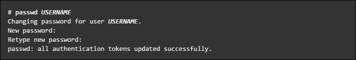

1.  通过运行`visudo`编辑`/etc/sudoers`文件。使用`sudo`命令时应用的策略由`/etc/sudoers`文件定义。

1.  一旦文件在编辑器中打开，搜索以下允许`test`组中的用户使用`sudo`访问的行：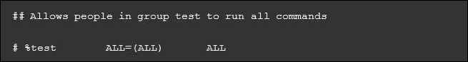

1.  我们可以通过删除第二行开头的注释字符(`#`)来启用给定的配置。一旦更改完成，保存文件并退出编辑器。现在，使用`usermod`命令，将先前创建的用户添加到`test`组。

1.  我们需要检查前面截图中显示的配置是否允许新用户帐户使用`sudo`运行命令。

1.  使用`su`选项切换到新创建的用户帐户。

1.  现在，使用`groups`命令确认`test`组中存在用户帐户。

最后，使用新帐户从`sudo`运行`whoami`命令。由于我们是第一次使用新用户帐户执行使用`sudo`的命令，`sudo`命令将显示默认的横幅消息。屏幕还会要求输入用户帐户密码。

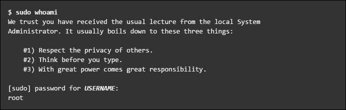

1.  前面输出的最后一行是`whoami`命令返回的用户名。如果`sudo`配置正确，这个值将是`root`。

您已成功配置了一个具有`sudo`访问权限的用户。您现在可以登录到这个用户帐户，并使用`sudo`来运行命令，就像您从根用户那里一样。

## 它是如何工作的…

当我们创建一个新帐户时，它没有权限运行管理员命令。但是，在编辑`/etc/sudoers`文件并对新用户帐户授予`sudo`访问的适当条目后，我们可以开始使用新用户帐户运行所有管理员命令。

## 还有更多…

以下是您可以采取的额外措施，以确保总体安全。

### 漏洞评估

漏洞评估是通过审计我们的网络和系统安全性来了解我们网络的机密性、完整性和可用性的过程。漏洞评估的第一阶段是侦察，这进一步导致了系统准备阶段，我们主要检查目标中所有已知的漏洞。下一个阶段是报告，我们将所有发现的漏洞分为低、中和高风险的类别。

# 使用 Nmap 扫描主机

Nmap 是 Linux 中包含的最流行的工具之一，可用于扫描网络。它已经存在多年，迄今为止，它是收集有关网络信息的最可取的工具之一。

Nmap 可以被管理员用于他们的网络上找到任何开放的端口和主机系统。

在进行漏洞评估时，Nmap 无疑是一个不可或缺的工具。

## 准备就绪

大多数 Linux 版本都安装了 Nmap。第一步是使用以下命令检查您是否已经拥有它：

```
nmap –version

```

如果 Nmap 存在，你应该看到类似于这里显示的输出：

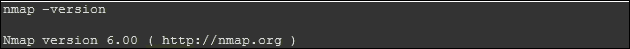

如果尚未安装 Nmap，可以从[`nmap.org/download.html`](https://nmap.org/download.html)下载并安装它

## 如何做…

按照以下步骤使用 Nmap 扫描主机：

1.  Nmap 最常见的用途是找到给定 IP 范围内的所有在线主机。用于执行此操作的默认命令需要一些时间来扫描完整的网络，这取决于网络中存在的主机数量。但是，我们可以优化这个过程，以便更快地扫描范围。

以下截图向您展示了一个例子：

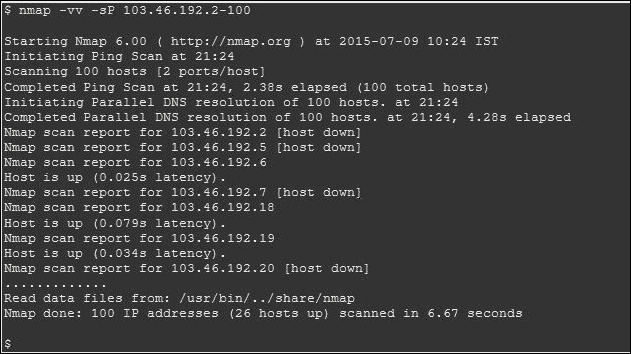

1.  在前面的例子中，扫描完成所用的时间为 6.67 秒，扫描了 100 个主机。如果要扫描特定网络的整个 IP 范围，将需要更多的时间。

1.  现在，让我们试着加快这个过程。`n`开关告诉 Nmap 不执行 IP 地址的 DNS 解析，从而使过程更快。`T`开关告诉 Nmap 以什么速度运行。在这里，`T1`是最慢的，`T5`是最快的。`max-rtt-timeout`选项指定等待响应的最长时间。

现在，相同的命令在这个例子中显示如下：

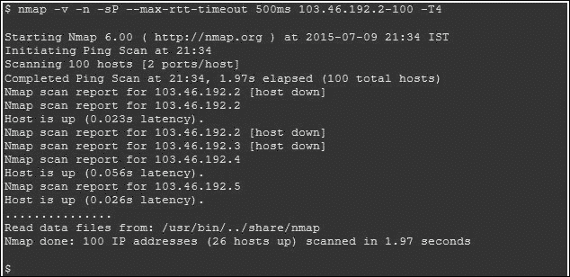

这一次，Nmap 在 1.97 秒内扫描了完整的 IP 范围。相当不错，对吧？

1.  使用 Nmap 进行端口扫描有助于我们发现在线的服务，比如找到 FTP 服务器。要做到这一点，使用以下命令：

Nmap 的前面的命令将列出所有开放端口 21 的 IP 地址。

1.  不仅 FTP，其他服务也可以通过匹配它们运行的端口号来发现。例如，MySQL 运行在端口 3306 上。命令现在将如下所示：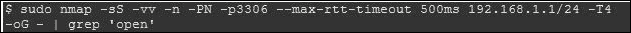

## 它是如何工作的…

Nmap 通过测试最常见的网络通信端口来检查正在监听的服务。这些信息有助于网络管理员关闭任何不需要或未使用的服务。前面的例子向您展示了如何使用端口扫描和 Nmap 作为研究我们周围网络的强大工具。

## 另请参阅

Nmap 还具有脚本功能，可以编写自定义脚本。这些脚本可以与 Nmap 一起使用，自动化和扩展其扫描能力。您可以在其官方主页[`nmap.org/`](https://nmap.org/)上找到有关 Nmap 的更多信息。

# 在易受攻击的 Linux 系统上获得 root 权限

学习如何扫描和利用 Linux 机器时，我们遇到的一个主要问题是在哪里学习。为此，Metasploit 团队开发并发布了一个名为**Metasploitable**的 VMware 机器。这台机器被故意制作成易受攻击，并且有许多未打补丁的服务在运行。因此，它成为了一个练习或开发渗透测试技能的绝佳平台。在本节中，您将学习如何扫描 Linux 系统，然后使用扫描结果找到一个有漏洞的服务。利用这个有漏洞的服务，我们将获得对系统的 root 访问权限。

## 准备工作

本节将使用 Backtrack 5R2 和 Metasploitable VMware 系统。Metasploitable 的镜像文件可以从[`sourceforge.net/projects/metasploitable/files/Metasploitable2/`](http://sourceforge.net/projects/metasploitable/files/Metasploitable2/)下载。

## 操作步骤…

按照以下步骤获得对易受攻击的 Linux 系统的 root 访问权限：

1.  首先，通过以下菜单在 backtrack 系统上打开 Metasploit 控制台：导航到**Main Menu** | **Backtrack** | **Exploitation Tools** | **Network Exploitation Tools** | **Metasploit Framework** | **Msfconsole**。

1.  接下来，我们需要使用 Nmap 扫描目标（在本例中是`192.168.0.1`）：

这张图片显示了执行的命令的输出：

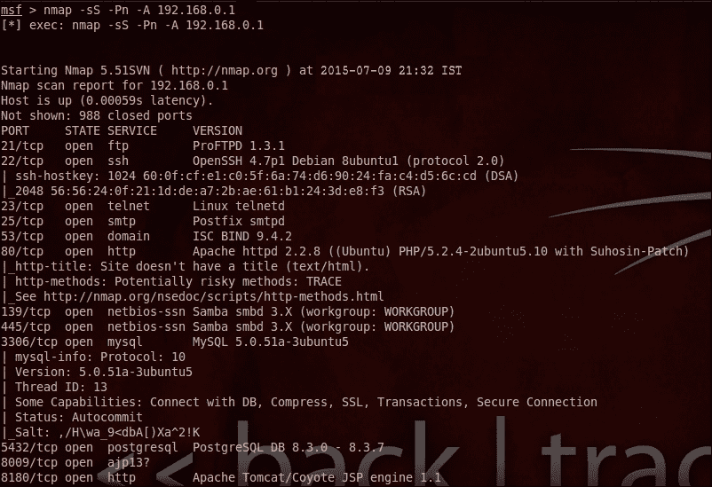

在上述命令中，`-Ss`选项允许我们执行隐蔽扫描，`-A`选项尝试发现操作系统和服务的版本信息。

此外，在上述命令中，我们可以看到许多服务在不同的端口上运行。其中包括运行在端口 139 和 445 上的 Samba。

### 注意

请注意，Samba 是一个为 Windows 系统提供 SMB 文件和打印服务的服务。

1.  一旦我们能够找到 Samba 服务，我们现在将专注于它。从上述输出中，我们可以看到 Samba 运行的是 3.x 版本。现在，我们将尝试获取有关服务的更具体信息。为此，我们将使用 Metasploit 的任何辅助模块，比如扫描器部分，并寻找 SMB 协议。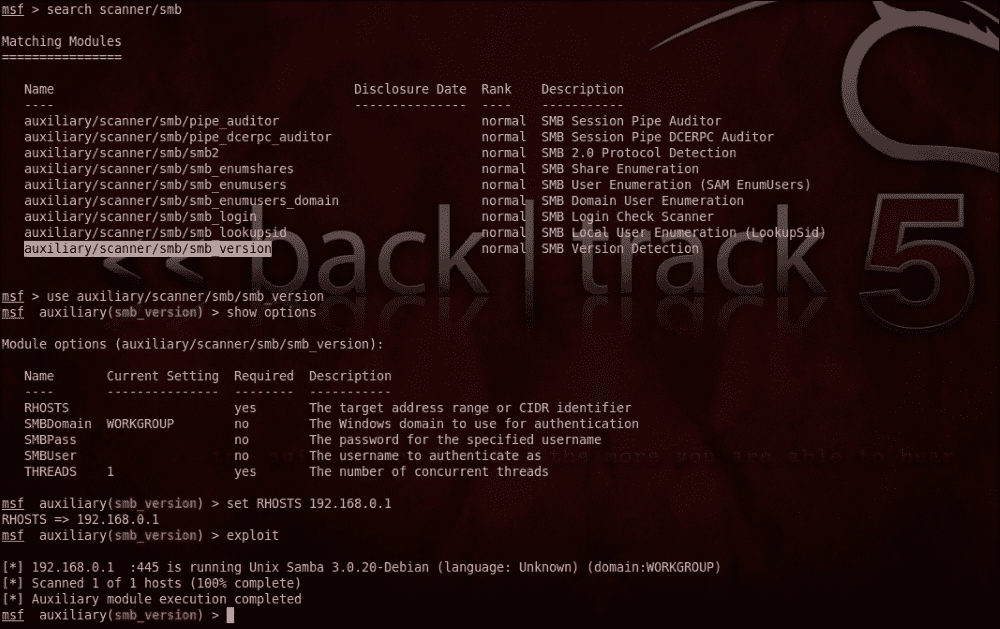

1.  我们可以看到扫描器部分有一个 SMB 版本检测器。现在，我们将使用 SMB 检测程序获得 Samba 的确切版本。如果我们在线搜索特定版本的 Samba 的所有漏洞，我们将找到用户名 map script。

1.  我们现在可以在 Metasploit 提供的漏洞列表中搜索`map script`用户名是否存在漏洞，使用`search samba`命令。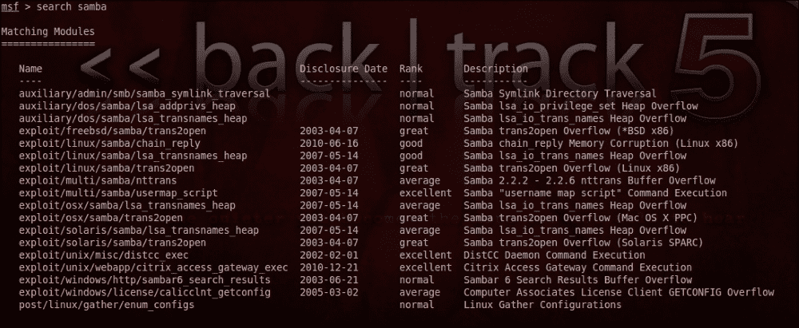

1.  我们已经找到了 map script 用户名的一个漏洞利用，并且它的评分非常优秀，这意味着我们可以使用这个漏洞利用。

1.  现在，使用 map script 用户名在系统中获得 root 级别的 shell。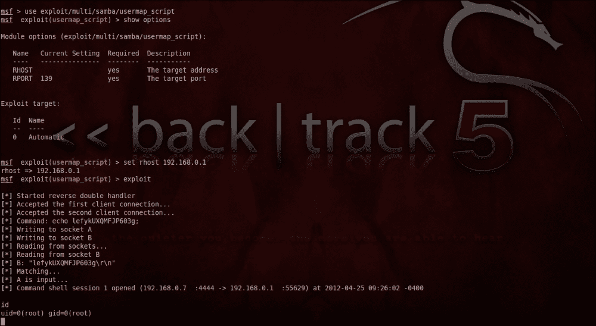

现在，我们将使用上述漏洞利用获得对系统的 root 级别访问权限。一旦我们选择了漏洞利用并配置了目标 IP 地址（在本例中是`192.168.0.1`），我们将执行一个命令来运行漏洞利用。这将在目标系统上创建并给我们一个远程会话，并打开一个命令 shell。现在，在远程 shell 中运行`id`命令。这将给出一个结果—`uid=0(root)gid=0(root)`。这证实我们已经对目标系统具有远程 root 访问权限。

## 它是如何工作的

我们首先执行了 Nmap 扫描，以检查运行的服务和开放的端口，并发现 Samba 服务正在运行。然后，我们尝试找到 SMB 服务的版本。一旦获得这些信息，我们就搜索了 Samba 的任何利用。使用利用漏洞，我们试图攻击目标系统，并在其中获得了 root shell。

## 还有更多…

让我们了解一些特有于 Linux 的更多利用和攻击。

在本节中，我们将介绍 Linux 容易受到的一些常见利用和攻击。但是，在本节中，我们不会涵盖任何处理攻击的方法。本节只是让您了解 Linux 中常用的利用。

### 空密码或默认密码

通常，管理员使用供应商提供给他们的默认密码，或者甚至将管理密码留空。这主要发生在配置设备（如路由器）和 BIOS 时。甚至一些在 Linux 上运行的服务可能包含默认的管理员密码。建议您始终更改默认密码，并设置一个只有管理员知道的新密码。

### IP 欺骗

攻击者可以在我们的系统和服务器上找到漏洞，并利用这些漏洞安装后台程序或攻击网络。如果攻击者以一种使其看起来像是本地网络中的一个节点的方式连接他的系统到我们的网络，就可以实现这一点。在执行 IP 欺骗时，有各种工具可用于帮助黑客。

### 窃听

攻击者可以通过窃听来收集在网络上进行通信的两个活动节点之间传递的数据。这种类型的攻击主要适用于 Telnet、FTP 和 HTTP 等协议。这种攻击可以在远程攻击者已经可以访问网络上的任何系统时进行。这可以通过其他攻击，如中间人攻击来实现。

#### 服务漏洞

如果攻击者能够发现网络系统上运行的任何服务的缺陷或漏洞，他们可以 compromise 整个系统及其数据以及网络上的其他系统。

管理员应该及时了解网络系统上运行的任何服务或应用程序的可用补丁或更新。

#### 拒绝服务（DoS）攻击

当攻击者向目标系统发送未经授权的数据包（可以是服务器、路由器或工作站），并且数量很大时，会导致资源对合法用户不可用。

攻击者发送的数据包通常是伪造的，这使得调查过程变得困难。
