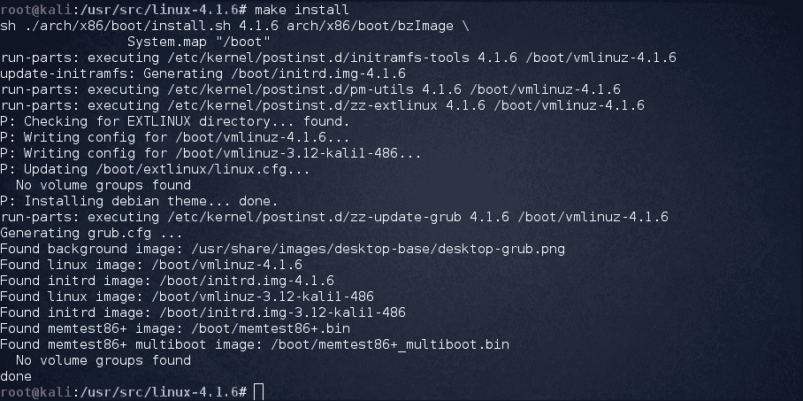

# 第二章：配置安全和优化内核

在本章中，我们将讨论以下内容：

+   构建和使用内核的要求

+   创建 USB 引导介质

+   检索内核源代码

+   配置和构建内核

+   安装和引导内核

+   测试和调试内核

+   使用 Netconsole 配置控制台进行调试

+   引导时调试内核

# 介绍

对于包括 Ubuntu、CentOS 和 Fedora 在内的所有 Linux 发行版，内核都是至关重要的。在大多数 Linux 版本安装操作系统时，默认安装内核，因此我们通常不必编译内核。即使需要安装内核的关键更新，也可以在 Linux 系统上使用`apt-get`或`yum`来完成。

但是，可能会有一些情况需要我们自己从源代码编译内核。以下是其中的一些情况：

+   启用内核中的实验性功能

+   启用新的硬件支持

+   调试内核

+   探索内核源代码

# 构建和使用内核的要求

在我们开始构建 Linux 内核之前，我们必须确保 Linux 系统存在工作的引导介质。如果引导加载程序未正确配置，可以用它来引导进入 Linux 系统。您将学习如何创建 USB 引导介质，检索内核源代码，配置和构建内核，并执行内核的安装和引导。

# 创建 USB 引导介质

可以在格式为 ext2、ext3 或 VFAT 的任何 USB 存储介质上创建 USB 引导介质。还要确保设备上有足够的可用空间，从传输发行版 DVD 映像需要 4GB，传输发行版 CD 映像需要 700MB，或者只需 10MB 来传输最小的引导介质映像。

## 做好准备

在执行这些步骤之前，我们需要有 Linux 安装光盘的映像文件，我们可以将其命名为`boot.iso`，以及一个 USB 存储设备，如前所述。

## 如何做…

要创建 USB 引导介质，我们需要以 root 身份执行这些命令：

1.  首先，我们需要通过在 USB 存储设备上执行以下命令来安装`syslinux`引导加载程序：

```
syslinux /dev/sdb1

```

1.  现在，通过执行以下命令为`boot.iso`文件和 USB 存储设备创建挂载点：

```
mkdir /mnt/isoboot /mnt/diskboot

```

1.  接下来，将`boot.iso`文件挂载到为其创建的挂载点上：

```
mount –o loop boot.iso /mnt/isoboot

```

在上述命令中，使用`-o loop`选项创建一个伪设备，它充当基于块的设备。它将文件视为块设备。

1.  接下来，我们将挂载为其创建的挂载点上的 USB 存储设备：

```
mount /dev/sdb1 /mnt/diskboot

```

1.  一旦`boot.iso`和 USB 存储设备都被挂载，我们将从`boot.iso`复制`isolinux`文件到 USB 存储设备：

```
cp /mnt/isoboot/isolinux/* /mnt/diskboot

```

1.  接下来，运行命令，使用`boot.iso`中的`isolinux.cfg`文件作为 USB 存储设备的`syslinux.cfg`文件：

```
grep –v local /mnt/isoboot/isolinux/isolinux.cfg > /mnt/diskboot/syslinux.cfg

```

1.  完成上一个命令后，卸载`boot.iso`和 USB 存储设备：

```
unmount /mnt/isoboot /mnt/diskboot

```

1.  现在，重新启动系统，然后尝试使用 USB 引导介质引导系统，以验证我们能够使用它引导。

## 它是如何工作的…

当我们从`boot.iso`文件复制所需的文件到 USB 存储介质，并使用 USB 存储介质中的`isolinux.cfg`文件作为`syslinux.cfg`文件时，它将 USB 存储介质转换为可引导的介质设备，可用于引导 Linux 系统。

# 检索内核源代码

大多数 Linux 发行版都包含内核源代码。但是，这些源代码可能会有点过时。因此，在构建或自定义内核时，我们可能需要获取最新的源代码。

## 做好准备

大多数 Linux 内核开发社区使用**Git**工具来管理源代码。即使 Ubuntu 也已经集成了 Git 用于其自己的 Linux 内核源代码，因此使内核开发人员能够更好地与社区互动。

我们可以使用以下命令安装`git`软件包：

```
sudo apt-get install git

```

## 如何做…

Linux 内核源代码可以从各种来源下载，我们将讨论从这些来源下载的方法：

+   我们可以在 Linux 内核的官方网页[`www.kernel.org`](http://www.kernel.org)上找到完整的 tarball 形式的 Linux 源代码，也可以找到增量补丁形式的源代码。

+   除非有特定原因要使用旧版本，否则建议使用最新版本。

+   Ubuntu 的内核源代码可以在 Git 下找到。内核的每个发行代码都在自己的 Git 存储库中单独维护，位于[kernel.ubuntu.com](http://kernel.ubuntu.com)上：

`git://kernel.ubuntu.com/ubuntu/ubuntu-<release>.git`或[`kernel.ubuntu.com/git-repos/ubuntu/`](http://kernel.ubuntu.com/git-repos/ubuntu/)

+   我们可以使用 Git 克隆存储库以获得本地副本。命令将根据我们感兴趣的 Ubuntu 版本进行修改。

+   要获取精确的树，请执行以下截图中显示的命令：

+   使用前面图像中的命令将下载精确的树。要下载任何其他树，命令的语法将是：git clone `git://kernel.ubuntu.com/ubuntu/ubuntu-<release>`。

+   下载的文件可能是 GNU zip（`.gzip`）格式或`.bzip2`格式。下载源文件后，我们需要解压缩它。如果 tarball 是`.bzip2`格式，使用以下命令：

```
tar xvjf linux-x.y.z.tar.bz2

```

如果它是以压缩的 GNU `.gz`格式，使用以下命令：

```
tar xvzf linux-x.y.z.tar.gz

```

## 工作原理…

使用前面部分提到的不同方法，我们能够下载 Linux 内核的源代码。使用任何选项取决于用户的选择和偏好。

# 配置和构建内核

由于许多原因可能需要配置内核。我们可能希望调整内核以仅运行必要的服务，或者可能需要对其进行补丁以支持内核先前不支持的新硬件。这对于任何系统管理员来说可能是一项艰巨的任务，在本节中，我们将看看如何配置和构建内核。

## 准备工作

在任何系统的引导分区中，建议为内核留有充足的空间。我们可以选择整个磁盘安装选项，或者为引导分区留出至少 3GB 的磁盘空间。

在安装 Linux 发行版并在系统上配置开发包后，还需要为我们的用户帐户启用 root 帐户以及 sudo。

现在，在我们开始安装任何软件包之前，运行以下命令来更新系统：

```
sudo apt-get update && sudo apt-get upgrade

```

之后，检查`build-essential`软件包是否已安装。如果没有安装，可以使用以下命令进行安装：

```
sudo apt-get install build-essential

```

这个软件包用于在 x86_64 系统上构建 Linux 内核。

我们还需要一些其他要求来编译内核：

+   使用以下命令安装最新版本的`gcc`：

```
sudo apt-get install gcc

```

+   使用以下命令安装`ncurses`开发包：

```
sudo apt-get install libncurses5-dev

```

+   还可能需要一些其他软件包来交叉编译 Linux 内核：

```
sudo apt-get install binutils-multiarch
sudo apt-get install alien

```

+   接下来，安装`ncurses-dev`，这是运行 make `menuconfig`所需的：

```
sudo apt-get install ncurses-dev

```

## 如何做…

完成*准备工作*部分的步骤后，我们可以继续进行配置和构建内核的过程。这个过程会花费很多时间，所以要有所准备：

1.  通过访问[`www.kernel.org`](http://www.kernel.org)下载 Linux 内核，如下图所示：

1.  也可以使用以下命令进行下载：

```
wget https://www.kernel.org/pub/linux/kernel/v4.x/linux-4.1.5.tar.xz

```


1.  下载完成后，转到下载保存的目录。

1.  如果下载的文件已保存在`Downloads`文件夹中，则应执行以下命令：

1.  现在，使用以下命令将下载的`.tar`文件提取到`/usr/src/`位置：

1.  接下来，切换到使用以下命令进行提取的目录：

1.  现在，运行命令配置 Linux 内核，以便可以在系统上进行编译和安装。

1.  如果您的帐户没有管理员权限，执行上述命令之前可能需要使用`sudo`。

1.  执行上述命令后，将会弹出一个窗口，其中包含一个菜单列表。选择新配置的项目。

1.  您需要检查**文件系统**菜单。

1.  在其中，检查是否选择了`ext4`，如下截图所示。如果没有选择，现在需要选择它。

1.  然后，保存配置。

1.  现在，编译 Linux 内核。编译过程将需要大约 40 到 50 分钟的时间，具体取决于系统配置。运行如下命令：

```
make -j 5

```


## 工作原理…

首先下载 Linux 内核源代码，然后在特定位置提取它，为编译过程配置内核。

# 安装和从内核引导

在花费了大量时间配置和编译内核之后，我们现在可以开始在本地系统上安装内核的过程。

## 准备工作

在开始安装内核之前，请确保在系统上备份所有重要数据。此外，将`/boot/`复制到以 FAT32 文件系统格式化的外部存储设备。如果安装过程因任何原因失败，这将有助于修复系统。

## 如何操作…

在内核编译完成后，我们可以开始遵循安装内核所需的命令。

1.  通过运行以下命令安装驱动程序：

上述命令将把模块复制到`/lib/`modules 的子目录中。

1.  现在，运行以下命令来安装实际的内核：

```
make install

```



1.  此命令执行`/sbin/installkernel`。

1.  新内核将安装在`/boot/vmlinuz-{version}`中。

如果`/boot/vmlinuz`已经存在符号链接，它将通过将`/boot/vmlinuz`链接到新内核来刷新。

先前安装的内核将作为`/boot/vmlinuz.old`可用。`config`和`System.map`文件也将在相同位置可用。

1.  接下来，我们将通过运行此命令将内核复制到`/boot`目录中：

```
cp -v arch/x86/boot/bzImage /boot/vmlinuz-4.1.6

```


1.  现在构建初始 RAM 磁盘。

1.  接下来，我们需要复制包含内核符号及其对应地址列表的`System.map`。为此，请运行以下命令，将内核的名称附加到目标文件。

1.  接下来，创建`symlink /boot/System.map`，它将指向`/boot/System.map-YourKernelName`，如果`/boot`位于支持符号链接的文件系统上。

1.  如果`/boot`位于不支持符号链接的文件系统上，只需运行此命令：

```
cp /boot/System.map-YourKernelName /boot/System.map

```

## 工作原理…

在内核配置和编译完成后，我们开始安装内核的过程。第一个命令将把模块复制到`/lib/`modules 的子目录中。

第二个命令执行`/sbin/installkernel`。同时，新内核将安装在`/boot/vmlinuz-{version}`中。在执行此操作时，如果`/boot/vmlinuz`已经存在符号链接，它将通过将`/boot/vmlinuz`链接到新内核来刷新。先前安装的内核将作为`/boot/vmlinuz.old`可用。相同的操作也适用于`config`和`System.map`文件。

一切都完成后，我们可以重新启动系统以从新内核引导。

# 测试和调试内核

任何开放或封闭的**软件开发周期**（**SDC**）的重要部分是测试和调试。这也适用于 Linux 内核。测试和调试的最终目标是确保内核在安装新的内核源代码后仍然像以前一样工作。

# 使用 Netconsole 配置用于调试的控制台

如果我们想捕获内核恐慌，一旦系统重新启动，就会变得困难，因为没有为此创建日志。为了解决这个问题，我们可以使用 Netconsole。

内核模块通过 UDP 记录内核打印消息，当登录到磁盘失败时，这对于调试问题非常有帮助。

## 准备就绪

在开始配置 Netconsole 之前，我们需要知道将发送 UDP 数据包的系统的 MAC 地址。这个系统被称为接收者，它可能在同一个子网中，也可能在不同的子网中。这两种情况在这里描述：

1.  第一种情况是接收者在同一个子网中。

1.  在本例中，接收者的 IP 地址是`192.168.1.4`。我们将向此 IP 地址发送 UDP 数据包。

1.  现在，让我们通过执行此命令找到接收系统的 MAC 地址。在这种情况下，IP 地址是接收系统的。

正如我们在上面的例子中看到的那样，`90:00:4e:2f:ac:ef`是我们需要的 MAC 地址。

1.  第二种情况是接收者不在同一个子网中。在这种情况下，我们需要首先找到默认网关。为此，我们运行此命令：

1.  在这里，默认网关是`192.168.1.1`。

1.  我们需要找到默认网关的 MAC 地址。首先，以这种方式向默认网关发送一个数据包：

1.  现在，让我们找到 MAC 地址。

在这里，`c0:3f:0e:10:c6:be`是我们需要的默认网关的 MAC 地址。

现在我们有了接收者的 MAC 地址，我们可以开始配置 Netconsole 的过程。

## 如何做…

首先，我们需要在启动时更改内核选项。如果您使用 Grub 作为引导加载程序，默认情况下会使用`quiet splash`选项引导内核。但是，我们不希望这种情况发生。因此，我们需要更改内核选项。

1.  首先，使用以下屏幕截图中显示的命令在`/etc/default/grub`位置创建 Grub 的备份：

1.  现在，打开您选择的任何编辑器以编辑`/etc/default/grub`。

1.  找到`GRUB_CMDLINE_LINUX_DEFAULT="quiet splash"`一行，并将其替换为`GRUB_CMDLINE_LINUX_DEFAULT="debug ignore_loglevel"`。

1.  现在，运行此命令相应地更新 Grub：

1.  实施了上述命令后，我们需要在启动时初始化 Netconsole。为此，我们首先需要知道发送系统的 IP 地址和接口。可以使用以下屏幕截图中显示的命令来完成：

1.  我们还需要接收系统的 IP 地址和 MAC 地址，这是我们在*准备就绪*部分中看到的。

1.  现在，让我们开始初始化 Netconsole。首先，让我们通过将模块添加到`/etc/`modules 中，使`netconsole`在启动时加载。

1.  接下来，我们将确保它也配置了适当的选项。为此，我们将将模块选项添加到`/etc/modprobe.d/netconsole.conf`文件，并运行此屏幕截图中显示的命令：

1.  在上述命令中，以 Netconsole 开头的部分具有以下语法：

```
netconsole=<LOCAL_PORT>@<SENDER_IP_ADDRESS>/<SENDER_INTERFACE>,<REMOTE_PORT>@<RECEIVER_IP_ADDRESS>/<STEP_1_MAC_ADDRESS>

```

我们已经为`<LOCAL_PORT>`和`<REMOTE_PORT>`都使用了`6666`。

1.  接下来，我们需要设置接收者。

根据用作接收方的 Linux 版本，用于设置它的命令可能会有所不同：

```
netcat -l -u 192.168.1.4 6666 | tee ~/netconsole.log

```

如果上述命令不起作用，尝试设置接收方而不使用 IP 地址：

```
netcat -l -u 6666 | tee ~/netconsole.log

```

1.  如果您使用的是具有不同版本 Netcat 的 Linux 变体，则在尝试使用上述命令时将打印以下错误消息：

1.  如果您收到上述错误消息，可以尝试执行此截图中显示的命令：

1.  现在，让上述命令继续运行。

1.  接下来，我们需要检查一切是否正常工作。重新启动发送系统，然后执行此截图中显示的命令：

1.  现在，您需要检查接收系统，看看内核消息是否已经接收到。

1.  一切都完成后，按下*Ctrl* + *C*。然后，您可以在`~/netconsole.log`中检查消息。

## 它是如何工作的

为了捕获内核恐慌消息，我们配置 Netconsole，通过网络记录消息。为此，我们需要在网络上再有一个作为接收方的系统。首先，我们尝试找到接收系统的 MAC 地址。然后，我们更改内核引导选项。更新 Grub 后，在我们要调试的发送系统上启动 Netconsole。最后，我们设置接收系统开始接收内核消息。

## 更多内容…

如果您正在使用 Windows 系统作为接收方，则可以使用 Windows 的**Netcat**，可在[`joncraton.org/files/nc111nt.zip`](http://joncraton.org/files/nc111nt.zip)下载。执行以下步骤设置 Windows 接收方：

1.  从给定链接下载文件，并将其解压缩到指定位置（即`C:\Users\Tajinder\Downloads\nc>`）。

1.  现在，打开命令提示符。然后，转到您提取 Netcat 的文件夹。

1.  接下来，运行此命令：

1.  这里的`192.168.1.3`与`<RECEIVER_IP_ADDRESS>`相同。

1.  让上述命令继续运行，并继续执行第 9 步中提到的命令。完成后，按下*Ctrl* + *C*。您将在`netconsole.txt`中找到消息。

# 在引导时调试内核

有时，您的系统可能无法在内核中引导更改。因此，在创建有关这些故障的报告时，包括有关调试的所有适当信息非常重要。这将对内核团队解决问题非常有用。

## 如何操作…

如果您尝试捕获引导过程中出现的错误消息，最好删除`quiet`和`splash`选项来引导内核。这有助于您查看屏幕上出现的消息（如果有）。

要编辑引导选项参数，请执行以下步骤：

1.  启动机器。

1.  在 BIOS 屏幕上，按下*Shift*键并按住。BIOS 加载后，您应该看到 Grub 菜单。

1.  导航到您想要启动的内核入口，然后按下*e*键。

1.  然后，删除`quiet`和`splash`关键字（这些可以在以 Linux 开头的行中找到）

1.  按下*Ctrl* + *x*进行启动。

您可以在屏幕上看到错误消息（如果有）。

根据您遇到的错误消息类型，您可以尝试其他引导选项。例如，如果注意到 ACPI 错误，请尝试使用`acpi=off`引导选项进行引导。
