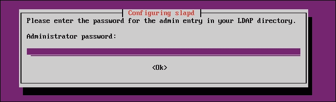
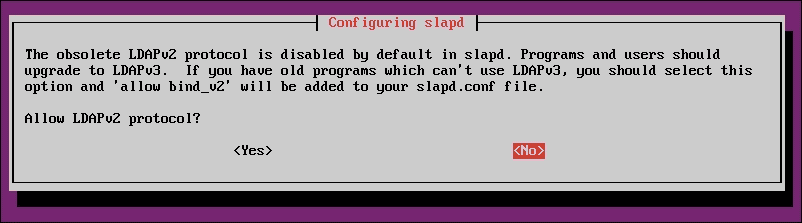

# 第三章：本地文件系统安全

在本章中，我们将讨论以下内容：

+   使用`ls`命令查看文件和目录详细信息

+   使用`chmod`命令更改文件权限

+   实施访问控制列表（ACL）

+   使用`mv`命令（移动和重命名）处理文件

+   在 Ubuntu 上安装和配置基本 LDAP 服务器

# 使用`ls`命令查看文件和目录详细信息

`ls`命令用于列出目录中的文件，类似于 DOS 中的`dir`命令。该命令可与各种参数一起使用，以提供不同的结果。

## 准备工作

由于`ls`命令是 Linux 的内置命令，因此我们无需安装其他任何内容即可使用它。

## 如何做…

现在，让我们看一下如何以不同方式使用`ls`来通过遵循这些给定步骤获得各种结果：

1.  要查看当前目录中文件的简单列表，请键入`ls：`

1.  要获取有关使用`ls`命令列出的文件和目录的更多信息，请添加类型标识符，如下所示：

当使用上述标识符时，可执行文件的名称末尾会有一个星号，而目录则有一个斜杠，依此类推。

1.  要查看文件的详细信息，例如创建日期、所有者和权限，请使用`l`标识符运行命令，如下所示：

1.  要查找当前目录中所有隐藏文件的列表，请使用`a`标识符，如下所示：

以句点开头的文件（也称为**点文件**）是隐藏文件，如果未使用`-a`选项，则不会显示这些文件。

1.  为了以可读的形式打印文件大小，例如 MB、GB、TB 等，而不是以字节打印，我们可以使用`-h`标识符以及`-l`标识符，如下所示：

1.  如果您希望排除所有文件并仅显示它们的子目录，则可以使用`-d`选项，如下所示：

1.  当与`-R`选项一起使用`ls`命令时，将显示子目录的内容：

## 工作原理…

当我们使用`ls`命令的不同选项时，它会根据我们的要求给出不同的目录列表结果。我们可以根据需要使用任何选项。

建议您养成使用`ls -lah`的习惯，这样您就可以始终找到可读大小的列表。

# 使用`chmod`命令更改文件权限

**Change Mode**或**chmod**是 Linux 命令，用于修改文件和目录的访问权限。每个人都希望保护其数据并进行适当的组织。因此，Linux 有一个概念，将所有者和组与每个文件和目录相关联。这些所有者和组具有不同的权限来访问特定文件。

## 准备工作

在我们查看`chmod`命令的不同用法之前，我们需要了解不同类型的用户和使用的符号表示：

+   `u`用于用户/所有者

+   `g`用于组

+   `o`用于其他用户

现在，创建一个名为`testfile.txt`的文件，以尝试`chmod`的不同命令。

## 如何做…

现在，我们将看一下如何以不同方式使用`chmod`以设置不同的权限：

1.  如果我们想要更改用户（所有者、组或其他用户）的单个权限，我们使用`+`符号来添加权限，如下命令所示：

```
chmod u+x testfile.txt

```

上述命令将为文件所有者添加`执行`权限：


1.  如果我们想要添加多个权限，我们可以通过单个命令来实现。我们只需要使用逗号分隔不同的权限，如下所示：

```
chmod g+x, o+x testfile.txt

```

上述命令将为文件的组和其他用户添加`执行`权限：


1.  如果我们想要删除权限，我们只需使用`-`符号，而不是`+`，如下所示：

```
chmod o-x testfile.txt

```

这将删除特定文件的其他用户的`执行`权限：


1.  假设我们希望为所有用户（所有者、组和其他人）添加或删除权限；我们可以通过使用`a`选项来完成这个单一命令，该选项表示所有用户，如下所示：

要为所有用户添加`读`权限，请使用此命令：

```
chmod a+r testfile.txt

```

要删除所有用户的`读`权限，请使用此命令：

```
chmod a-r testfile.txt

```

这在下面的屏幕截图中显示：


1.  在这里，我们假设我们想要为目录中的所有文件添加特定权限。现在，我们可以使用`-R`选项，而不是单独为所有文件运行命令，该选项表示给定操作是递归的。因此，为了给其他用户和目录中的所有文件添加`执行`权限，命令将如下所示：

```
chmod o+x –R /example

```

看一下下面的屏幕截图


1.  要将特定文件的权限复制到另一个文件，我们可以使用`reference`选项：

```
chmod --reference=file1 file2

```

在这里，我们将`file1`的权限应用到另一个名为`file2`的文件。相同的命令也可以用于将一个目录的权限应用到另一个目录：


## 它是如何工作的…

当`chmod`与符号表示一起使用时，我们已经知道以下内容：

+   `u`用于用户/所有者

+   `g`用于组

+   `o`用于其他人

另外，不同的权限被称为如下：

+   `r`：读

+   `w`：写

+   `x`：执行

因此，使用上述命令，我们根据我们的要求更改用户、组或其他人的权限。

## 还有更多…

我们也可以使用数字来使用`chmod`设置权限，这被称为**八进制**表示。使用数字，我们可以同时编辑所有者、组和其他人的权限。命令的语法如下：

+   `chmod xxx 文件/目录`

这里，`xxx`指的是从`1`到`7`的三位数字。第一位数字表示所有者的权限，而组由第二位数字表示，第三位数字表示其他人的权限。

当我们使用八进制表示时，`r`、`w`和`x`权限具有特定的数字值，如下所述：

+   *r=4*

+   *w=2*

+   *x=1*

现在，`读`和`执行`权限表示如下：

+   *r-x = 4+0+1 = 5*

同样，`读`、`写`和`执行`权限的计算如下：

+   *rwx = 4+2+1 = 7*

如果我们只希望给予`读`权限，将如下所示：

+   *r-- = 4+0+0 = 4*

所以，现在如果我们运行以下命令，它会给出计算的权限：

```
chmod 754 testfile.txt

```

这是屏幕截图：


# 实施访问控制列表（ACL）

使用`chmod`实现基本文件权限是不够的，因此我们可以使用 ACL。除了为特定文件的所有者和组提供权限外，我们还可以使用 ACL 为任何用户、用户组或不属于特定用户组的所有用户组设置权限。

## 准备工作

在开始使用 ACL 设置权限之前，我们需要确认 ACL 是否已启用。我们可以通过尝试查看任何文件的 ACL 来确认这一点，如本例所示：

```
getfacl<filename>

```

如果 ACL 已启用，上述命令将显示类似于以下内容的输出：


## 如何做…

为了更好地理解 ACL，让我们执行以下步骤：

1.  首先，我们将创建三个用户并给他们命名—`user1`、`user2`和`user3`：

上述命令用于更改密码信息，这是可选的。如果你愿意，你可以忽略它。但是，在这种情况下，您将需要根据需要使用特定用户的密码登录。

1.  接下来，创建一个名为`group1`的组。创建组后，我们将在此组中添加在上一步中创建的三个用户：

1.  接下来，我们将创建`/example`目录并将其所有权更改为`user1`：

1.  打开一个新的终端窗口并从`user1`登录。然后，切换到在上一个示例中创建的`/example`目录，并在其中创建一个任意名称的目录，比如`accounts`：

1.  现在，假设`user1`想要仅在`accounts`目录中向`user2`授予`write`权限。为此，`user1`必须在组中设置`write`权限。但这样做将给`user3`也赋予写权限，我们不希望发生这种情况。因此，`user1`将使用 ACL 向`user2`授予写访问权限，如下所示：

1.  现在，我们将检查`accounts`目录中的权限：

我们可以看到在前面的图像中，只有`user1`和`user2`在目录中有`write`权限，其他人没有权限。

1.  打开一个新的终端并从`user2`登录。然后，切换到`/example`目录：

1.  让我们尝试在`accounts`文件夹中创建一个目录。由于`user2`有`write`权限，这应该是成功的：

1.  接下来，打开一个新的终端并从`user3`登录。然后，切换到`/example`目录：

1.  尝试切换到`accounts`目录。由于`user3`对该目录没有任何权限，将被拒绝：

## 更多信息…

我们可能希望仅为一组用户中的两个用户授予`execute`权限。如果我们使用`chmod`设置权限，所有组中的用户都将获得执行权限。然而，我们不希望这样。可以使用 ACL 来处理这种情况。

在前面的步骤中，我们为每个用户单独设置了文件的权限，从而避免了允许其他人也具有任何权限的机会。

每当处理文件权限时，如果您的文件很重要，最好备份权限。

在这里，我们假设有一个包含一些重要文件的`example`目录。然后，使用以下命令备份权限：

```
getfacl -R /example>permissions.acl

```


前面的命令备份权限并将其存储在名为`permissions.acl`的文件中。

现在，如果我们想要恢复权限，可以使用以下命令：

```
setfacl -- restore=permission.acl

```

这在下面的截图中显示：


这将恢复并备份所有权限到创建备份时的状态。

# 使用 mv 命令进行文件处理（移动和重命名）

当我们希望将文件从一个目录移动到另一个目录时，并且不希望在此过程中创建副本（这在使用`cp`命令时会发生），则使用**mv**或**move**命令。

## 准备就绪…

由于`mv`是 Linux 的内置命令，我们不需要配置其他内容来理解它的工作原理。

## 工作原理…

在每个 Linux 系统上，默认安装了这个命令。让我们看看如何使用`mv`命令，通过不同种类的例子：

1.  将`testfile1.txt`文件从当前目录移动到其他目录，比如`home/practical/example`，命令如下：

```
mv testfile1.txt /home/practical/example

```

只有当源文件的位置与目标不同时，前面的命令才能起作用。

使用前面的命令移动文件时，文件将从先前的位置中删除：


1.  要使用单个命令移动多个文件，可以使用以下命令：

```
mv testfile2.txt testfile3.txt testfile4.txt /home/practical/example

```

在使用前面的命令时，我们要移动的所有文件都应该在同一个源位置：


1.  要移动目录，命令与移动文件的命令相同。假设我们在当前目录中有一个名为`directory1`的目录，希望将其移动到`/home/practical/example`位置，则命令如下：

```
mv directory1/ /home/practical/example

```

如下所示的截图：


1.  `mv`命令也用于重命名文件和目录。假设我们有一个名为`example_1.txt`的文件，希望将其重命名为`example_2.txt`，则执行此操作的命令如下：

```
mv example_1.txt example_2.txt

```

当目标位置与源位置相同时，前面的命令也适用：


1.  重命名目录的操作方式与重命名文件的操作方式相同。假设我们有一个名为`test_directory_1`的目录，我们想将其重命名为`test_directory_2`，那么命令将如下所示：

```
mv test_directory_1/ test_directory_2/

```

可以在以下截图中看到前面命令的执行情况：


1.  当我们使用`mv`命令移动或重命名大量文件或目录时，可以使用`-v`选项来检查命令是否成功执行。

1.  我们可能希望将当前目录中的所有文本文件移动到`/home/practical/example`文件夹，并对它们进行检查。要做到这一点，请使用以下命令：

```
mv -v *.txt /home/practical/example

```

可以在以下截图中看到前面命令的执行情况：


1.  这也适用于移动或重命名目录：

1.  当我们使用`mv`命令将文件移动到另一个位置，并且目标位置已经存在同名文件时，默认命令会覆盖现有文件。但是，如果我们希望在覆盖文件之前显示弹出通知，则必须使用`-i`选项，如下所示：

```
mv -i testfile1.txt /home/practical/example

```

运行前面的命令时，它会通知我们目标位置已经存在同名文件。只有当我们按下*y*时，命令才会完成；否则，它将被取消：


1.  使用`mv`命令将文件移动到另一个位置时，如果目标位置已经存在同名文件，则使用`-u`选项将仅在源文件较新时才更新目标位置的文件。

我们在源位置有两个文件，`file_1.txt`和`file_2.txt`。首先，使用以下命令检查文件的详细信息：

```
ls –l *.txt

```

现在让我们检查一下目标位置的文件详细信息：

```
ls –l /home/practical/example/*.txt

```

现在，使用以下命令移动文件：

```
mv –uv *.txt /home/practical/example/

```


我们看到`file1.txt`和`file2.txt`已经移动到目标位置，并且由于源文件的新时间戳，它们已经更新了之前的文件。

1.  假设我们移动多个文件，并且在目标位置已经存在与源文件同名的文件，而我们不希望更新这些文件。在这种情况下，我们可以使用`-n`选项，如下所示。

1.  我们在源位置有两个文件，`file_1.txt`和`file_2.txt`。首先，使用以下命令检查文件的详细信息：

```
ls –l *.txt

```

1.  现在，使用以下命令移动文件：

```
mv –nv *.txt /home/practical/example/

```

1.  让我们检查一下目标位置的文件详细信息：

```
ls –l /home/practical/example/*.txt

```

1.  同名文件并没有被移动，可以通过它们的时间戳进行验证：

1.  在移动文件时，如果目标位置已经有同名文件，那么在新文件覆盖之前，我们还可以创建目标文件的备份。为此，我们使用`-b`选项：

```
mv -bv *.txt /home/practical/example

```

1.  现在，让我们检查一下目标位置的文件详细信息。在详细信息中，我们有名为`file1.txt~`和`file2.txt~`的文件。这些文件是备份文件，可以通过时间戳进行验证，时间戳比`file1.txt`和`file2.txt`的时间戳要早：

## 还有更多...

您可以通过键入`man`、`mv`或`mv --help`来了解更多关于`mv`命令的信息。这将显示其手册页面，我们可以在其中探索有关该命令的更多细节。

# 在 Ubuntu 上安装和配置基本的 LDAP 服务器

轻量级目录访问协议（LDAP）是一种用于从某个集中位置管理对文件和目录层次结构的访问的协议。目录类似于数据库；但是，它可能包含更具表达力的基于属性的信息。LDAP 主要用于集中式身份验证。

LDAP 服务器有助于控制谁可以访问目录中的读取和更新信息。

## 准备工作

要安装和配置 LDAP，我们首先需要创建一个 Ubuntu 服务器。可以在[`www.ubuntu.com/download/server`](http://www.ubuntu.com/download/server)找到 Ubuntu 服务器安装媒体的当前版本。

下载完成后，按照提供的步骤安装 Ubuntu 服务器。

我们需要第二个安装了 Ubuntu 桌面版的系统。这将用于通过 Web 界面访问您的 LDAP 服务器。

完成后，我们可以继续安装 LDAP。

## 如何操作...

我们现在将开始在 Ubuntu 服务器上安装和配置 LDAP 的过程。安装 LDAP 需要`slapd`软件包，并且它存在于 Ubuntu 的默认存储库中：

1.  我们首先需要从 Ubuntu 的存储库中更新服务器上的软件包列表，以获取有关所有软件包及其依赖关系的最新版本的信息：

```
sudo apt-get update

```

1.  现在，运行命令以安装`slapd`软件包以安装 LDAP：

```
sudo apt-get install slapd

```

以下截图显示了此命令的输出：


1.  在安装过程中，您将被提示输入并确认管理员密码，该密码将用于 LDAP 的管理员帐户。配置您选择的任何密码并完成安装过程：

1.  接下来，我们需要安装一些与 LDAP 一起使用的附加实用程序：

```
sudo apt-get install ldap-utils

```

该命令的输出如下截图所示：


1.  安装部分完成后，我们将根据我们的要求重新配置 LDAP 软件包。键入此命令以启动软件包配置工具：

```
sudodpkg-reconfigure slapd

```

1.  这将开始一系列关于软件配置的问题。我们需要根据我们的要求逐个选择选项。

1.  首先，您将被问到**省略 OpenLDAP 服务器配置？** 选择**否**并继续：

1.  接下来，您需要输入域名。您可以在服务器上使用已经存在的域名或创建任何您喜欢的内容。我们在这里使用了`example.com`：

1.  下一步将是要求输入**组织名称**，可以是您喜欢的任何内容：

1.  您将被要求输入 LDAP 的管理员密码。我们在安装 LDAP 时已经配置了这个。在这一步中使用相同的密码，或者更改为其他密码：

1.  接下来，我们需要在提示选择要使用的数据库后端时选择**HDB**：

1.  当`slapd`被清除时，您将被问及是否希望删除数据库。在这里选择**否**：

1.  在下一步中，选择**是**以移动旧数据库，并允许配置过程创建新数据库：

1.  现在，在询问**允许 LDAPv2 协议？**时选择**否**。

1.  配置过程完成后，我们将安装`phpldapadmin`软件包。这将帮助通过 Web 界面管理 LDAP：

```
sudo apt-get install phpldapadmin

```

此命令的执行结果如下截图所示：


1.  安装完成后，打开 phpldapadmin 的配置文件以配置一些值：

```
sudo nano /etc/phpldapadmin/config.php

```

可以在以下截图中看到：


1.  搜索给定部分，并修改以反映 Ubuntu 服务器的域名或 IP 地址：

```
$servers->setValue('server','host','domain_nam_or_IP_address');

```

可以在以下截图中看到：


1.  接下来，编辑以下条目并插入我们在重新配置`slapd`时给出的域名：

```
$servers->setValue('server','base',array('dc=example,dc=com'));

```

在前一行的`dc`属性中以值的形式给出域名。由于我们的域名是`example.com`，因此前一行中的值将输入为`dc=example, dc=com`。


1.  找到以下行，并再次输入域名作为`dc`属性。对于`cn`属性，值将仅为`admin`：

```
$servers->setValue('login','bind_id','cn=admin,dc=example,dc=com');

```

可以在以下截图中看到：


1.  搜索类似于以下代码所示的部分，首先取消注释该行，然后将值设置为`true`：

```
$config->custom->appearance['hide_template_warning'] = true;

```

可以在以下截图中看到：


1.  在进行所有更改后，保存并关闭文件。

1.  当`phpldapadmin`的配置完成后，在另一台安装了 Ubuntu 桌面版的系统中打开浏览器。在浏览器的地址栏中输入服务器的域名或 IP 地址，后面加上`/phpldapadmin`，如`domain_name_or_IP_address/phpldapadmin`：

1.  打开`phpldapadmin`页面后，在左侧找到**登录**链接。单击它，将会出现登录提示：

1.  如果`phpldapadmin`到目前为止已经正确配置，登录界面将显示正确的**登录 DN**详细信息。在我们的情况下是`cn=admin,dc=example,dc=com`。

1.  正确输入管理员密码后，将显示管理员界面：

1.  在左侧的管理员界面中，找到域组件(`dc=example,dc=co`)，点击其旁边的*加号*。它将显示正在使用的管理员登录：

我们的基本 LDAP 服务器现在已经启动运行。

## 工作原理...

首先创建一个 Ubuntu 服务器，然后在其上安装`slapd`软件包以安装 LDAP。一旦完全安装完成，我们安装所需的附加软件包。然后，根据我们的要求重新配置 LDAP。

重新配置完成后，我们安装`phpldapadmin`软件包，这将帮助我们通过浏览器的 Web 界面管理 LDAP 服务器。
