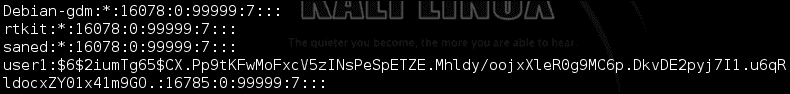
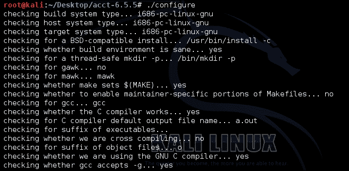

# 第四章：Linux 中的本地认证

在本章中，我们将讨论以下主题：

+   用户认证和日志

+   限制用户的登录能力

+   使用 acct 监视用户活动

+   使用 USB 设备和 PAM 进行登录认证

+   定义用户授权控制

# 用户认证和日志记录

用户认证的一个主要方面是监视系统用户。有各种方法可以跟踪 Linux 中用户进行的所有成功和失败的登录尝试。

## 入门

Linux 系统维护着系统中不同账户的所有登录尝试的日志。这些日志都位于`/var/log/`目录下。


## 如何做...

Linux 有许多方法可以帮助管理员查看日志，无论是通过图形界面还是命令行方法：

1.  如果我们想要检查特定用户（如 root）的错误登录尝试，可以使用以下命令：

```
lastb root

```


1.  要使用终端查看日志，我们使用`dmesg`命令。该命令显示存储在内存中的 Linux 内核消息缓冲区，如下所示：

1.  如果我们希望过滤上述输出，只显示与 USB 设备相关的日志，我们可以使用`grep`来实现：

1.  如果我们不想查看所有日志，而只想查看特定日志文件中最近的 10 条日志，命令如下：

在上面的命令中，使用`-n`选项来指定要显示的行数。

1.  如果我们希望查看用户账户的最近登录尝试，可以使用`last`工具。

`last`工具以格式化的方式显示`/etc/log/wtmp`文件。

1.  如果我们想要查看系统上任何用户最后一次登录的时间，我们可以使用`lastlog`命令：

## 它是如何工作的...

Linux 有不同的文件用于记录不同类型的详细信息。使用上面显示的命令，我们能够查看这些日志并根据我们的要求查看详细信息。每个命令都会给我们不同类型的详细信息。

# 限制用户的登录能力

系统管理员的一个主要角色是配置和管理 Linux 系统上的用户和组。这也涉及检查所有用户的登录能力。

## 准备工作

以下所有步骤都在 Ubuntu 系统上尝试过；但是，您也可以在任何其他 Linux 发行版上进行这些操作。

## 如何做...

在这里，我们将讨论如何在 Linux 系统上限制用户的登录能力：

1.  我们可以通过将账户的登录 shell 更改为`/etc/passwd`文件中的特殊值来限制用户账户的访问。让我们以`sslh`账户为例，在`/etc/passwd`文件中检查账户的详细信息，如下所示：

```
cat /etc/passwd | grep sslh

```


1.  在上述详细信息中，`sslh`账户的最终值设置为`/bin/false`。如果我们现在尝试以 root 用户登录`sslh`用户，我们会发现我们无法这样做：

```
su sslh

```

1.  因此，现在，如果我们更改要限制的用户账户的 shell，我们可以这样做，如下所示：

1.  限制用户访问的另一种方法是使用`/etc/shadow`文件。如果我们使用`cat`命令检查此文件的详细信息，我们会得到如下结果：

1.  输出被截断，如下所示：

1.  详细信息显示了`user1`账户的哈希密码（以`$6$2iumTg65`开头的密码）。我们还可以看到，系统账户的哈希密码被替换为星号`*`。

1.  现在，要锁定账户`user1`，命令如下：

```
passwd -l user1

```


1.  让我们再次检查`/etc/shadow`文件中`user1`帐户的详细信息。我们看到哈希密码已被加上`!`变为无效：

```
cat /etc/shadow | grep user1

```


1.  要再次解锁帐户，命令如下所示：

```
passwd -u user1

```


1.  如果我们希望检查帐户是否已被锁定，可以使用以下命令进行检查：

如上面的输出所示，`user1`帐户已被锁定，第二字段中标有`L`。而`user2`没有被锁定，因为详细信息中显示为`P`。

1.  使用`usermod`命令也可以锁定或解锁帐户。要使用`usermod`锁定帐户，命令如下：

```
usermod -L user1

```

1.  并使用`usermod`解锁帐户，命令如下所示：

```
usermod -U user1

```

## 它是如何工作的...

对于 Linux 中的每个帐户，用户帐户详细信息存储在`/etc/passwd`和`/etc/shadow`文件中。这些详细信息指定用户帐户的行为。当我们能够更改这些文件中任何用户帐户的详细信息时，我们就能够更改用户帐户的行为。

在上面的部分中，我们已经看到如何修改这些文件来“锁定”或“解锁”用户帐户。

# 使用 acct 监控用户活动

**Acct**是一个开源应用程序，它帮助监控 Linux 系统上的用户活动。它在后台运行并跟踪用户的所有活动，还维护资源使用情况的记录。

## 入门

要使用`acct`的命令，我们首先需要通过以下命令在我们的 Linux 系统上安装该软件包：

```
apt-get install acct

```


如果上述方法无法正常工作，我们可以通过访问链接[`packages.ubuntu.com/precise/admin/acct`](http://packages.ubuntu.com/precise/admin/acct)手动下载软件包。

1.  下载软件包后，我们需要将其解压缩到某个目录中，比如桌面。

1.  然后，将其移动到目录中。

1.  然后，运行脚本以配置软件包。

1.  安装完成后，接下来运行`make`命令：

1.  然后，运行`make install`命令：

1.  成功完成后，它将在您的 Linux 系统上安装该软件包。

## 如何操作？

`acct`包有不同的命令来监控进程活动：

1.  基于特定用户从`wtmp`文件中的登录和注销，如果我们希望检查总连接时间，可以使用`ac`命令：

1.  如果我们希望打印一天的总登录时间，我们将使用`ac`命令的`-d`选项：

1.  要打印用户的总登录时间，我们使用以下命令：

1.  如果我们只想检查特定用户的登录时间，我们使用以下命令：

1.  我们还可以使用`lastcomm`命令查看所有用户或特定用户以前执行的命令。

## 它是如何工作的...

为了保持对系统的监控，我们首先在系统上安装`acct`包。对于其他一些 Linux 发行版，如果`acct`不兼容，可以使用`psacct`包。

工具安装并运行后，它开始维护系统上的活动日志。然后我们可以使用上面部分讨论的命令来查看这些日志。

# 使用 USB 设备和 PAM 进行登录验证

当 Linux 用户想要保护系统时，最常见的方法始终是使用登录密码。然而，我们知道这种方法并不是非常可靠，因为有许多方法可以破解传统密码。为了增加安全性，我们可以使用 USB 设备作为认证令牌，用于登录系统。

## 准备就绪

要按照给定的步骤，我们需要在 Linux 系统上下载一个 USB 存储设备和**可插拔认证模块**（**PAM**）。大多数 Linux 系统都以预编译包的形式提供，可以从相关存储库中访问。

## 如何操作...

通过使用任何类型的 USB 存储设备和 PAM，我们可以创建一个认证令牌。

1.  首先，我们需要安装 PAM USB 认证所需的软件包。为此，我们运行以下命令：

```
$ sudo apt-get install pamusb-tools libpam-usb

```


1.  安装软件包后，我们必须配置 USB 设备以与 PAM 认证一起使用。为此，我们可以使用命令，或者我们可以编辑`/etc/pamusb.conf`文件。

1.  使用命令方法时，首先连接 USB 设备，然后执行给定的命令：

```
$ sudo pamusb-conf --add-device usb-device

```

命令的输出如下所示：


在上述命令中，`usb-device`是我们正在使用的 USB 设备的名称。这个名称可以是您选择的任何内容。

当使用`pamusb-conf`命令时，它会自动发现 USB 设备，其中还包括多个分区。命令执行完成后，它会将一个 XML 代码块添加到`/etc/pamusb.conf`文件中，定义我们的 USB 设备。


1.  接下来，我们定义我们的 USB 设备：

```
$ sudo pamusb-conf --add-user user1

```

执行结果如下截图所示：


如果用户已经存在，它将被添加到 PAM 配置中。

上述命令将`pam_usb`用户的定义添加到`/etc/pamusb.conf`文件中。


1.  现在，我们将配置 PAM 以在系统认证过程中添加`pam_usb`模块。为此，我们将编辑`/etc/pam.d/common-auth`文件并添加以下行：

这将使系统范围的 PAM 库意识到`pam_usb`模块。

`required`选项指定需要正确的密码，而`sufficient`选项表示这也可以对用户进行认证。在上述配置中，我们已经为`usb-device`认证使用了`sufficient`，同时对默认密码使用了`required`。

如果为`user1`定义的 USB 设备在系统中不存在，用户将需要输入正确的密码。为了强制用户在授予他们系统访问权限之前必须同时具备两种认证程序，将`sufficient`更改为`required`。

1.  现在我们将尝试切换到`user1`。

当要求时，连接相关的`usb-device`。如果连接了正确的 USB 令牌设备，登录将如图所示完成；否则将出现错误。

1.  如果出现错误，如下所示，可能是 USB 设备的路径未正确添加。

```
Error: device /dev/sdb1 is not removable
* Mount failed

```

在这种情况下，将 USB 设备的完整路径添加到`/etc/pmount.allow`中。

1.  现在运行命令以检查 USB 设备分区在文件系统中的列表：

```
$ sudo fdisk –l

```


在我们的情况下，分区已列出为：`/dev/sdb1`

1.  现在在`/etc/pmount.allow`文件中添加一行以解决错误。

1.  到目前为止，在`/etc/pam.d/common-auth`中我们所做的配置意味着如果 USB 设备未连接，用户仍然可以使用正确的密码登录。如果我们希望强制用户在登录时也使用 USB 设备，则将`sufficient`更改为`required`，如下所示：

1.  如果用户现在尝试登录，他们将不仅需要输入正确的密码，还需要插入 USB 设备。

1.  现在拔掉 USB 设备，然后尝试使用正确的密码再次登录：

## 工作原理...

安装所需的 PAM-USB 软件包后，我们编辑配置文件以添加我们想要用作身份验证令牌的 USB 设备。之后，我们添加要使用的用户账户，然后在`/etc/pam.d/common-auth`文件中完成更改，以指定 USB 身份验证的工作方式，无论在登录时是否始终需要。

## 还有更多...

到目前为止，我们已经看到如何使用 USB 设备对用户登录进行身份验证。除此之外，我们还可以使用 USB 设备在每次连接或断开连接到系统时触发一个事件。

让我们修改`/etc/pamusb.conf`中的 XML 代码，以添加用户定义的事件代码：


由于上述修改，每当用户断开 USB 设备时，屏幕将被锁定。同样，当用户再次连接 USB 设备时，屏幕将被解锁。

# 定义用户授权控制

在计算机上定义用户授权主要涉及决定用户可能或不可能被允许执行的活动。这可能包括执行程序或读取文件等活动。

由于`root`账户拥有所有权限，授权控制主要涉及允许或禁止`root`访问用户账户。

## 入门...

要查看用户授权是如何工作的，我们需要一个用户账户来尝试这些命令。因此，我们创建了两个用户账户`user1`和`user2`来尝试这些命令。

## 如何操作...

在本节中，我们将介绍可以应用于用户账户的各种控制。

1.  假设我们有两个用户账户，`user1`和`user2`。我们从`user2`登录，然后尝试以`user1`身份运行`ps`命令。在正常情况下，我们会得到如下结果：

1.  现在编辑`/etc/sudoers`文件并添加以下行：

```
User2 ALL = (user1) /bin/ps

```

1.  在`/etc/sudoers`中保存更改后，再次尝试从`user2`以`user1`身份运行`ps`命令。

1.  现在，如果我们想要再次从`user2`以`user1`身份运行相同的命令，但不需要输入密码，我们可以通过编辑`/etc/sudoers`文件来实现：

1.  现在，当我们从`user2`以`user1`身份运行`ps`命令时，我们会发现它不再要求输入密码：

1.  现在我们已经看到如何在不需要输入密码的情况下运行命令，系统管理员的主要关注点将是`sudo`应始终提示输入密码。

1.  要使系统上的用户账户`user1`始终需要输入密码来使用`sudo`，请编辑文件`/etc/sudoers`并添加以下行：

```
Defaults:user1 timestamp_timeout = 0

```


1.  现在，如果`user1`尝试运行任何命令，将始终提示输入密码：

1.  现在，假设我们想要给`user1`账户特权来更改`user2`和`user3`的密码。编辑`/etc/sudoers`文件并添加如下行：

1.  现在从`user1`登录，让我们尝试更改`user2`和`user3`账户的密码：

## 工作原理...

使用`sudo`命令和`/etc/sudoers`文件，我们进行必要的更改以执行所需的任务。

我们编辑文件以允许以另一个用户的身份执行程序。我们还添加了`NOPASSWD`选项，以便在不需要输入密码的情况下执行程序。然后，我们添加所需的行，以便`sudo`始终提示输入密码。

接下来，我们看看如何授权用户账户更改其他用户账户的密码。
