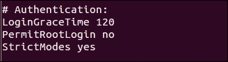
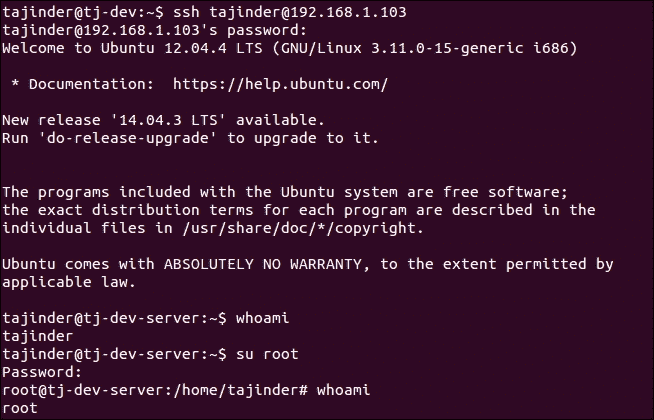
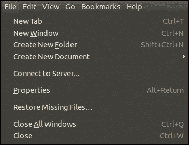
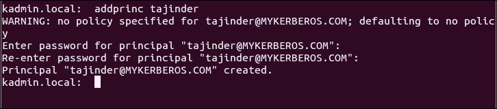

# 第五章：远程身份验证

在本章中，我们将讨论以下主题：

+   使用 SSH 进行远程服务器/主机访问

+   禁用或启用 SSH root 登录

+   通过基于密钥的登录限制远程访问到 SSH

+   远程复制文件

+   在 Ubuntu 上设置 Kerberos 服务器

# 使用 SSH 进行远程服务器/主机访问

**SSH**，或**安全外壳**，是一种协议，用于安全地登录到远程系统，是访问远程 Linux 系统的最常用方法。

## 准备工作

要了解如何使用 SSH，我们需要两个 Ubuntu 系统。一个将用作服务器，另一个将用作客户端。

## 操作步骤…

要使用 SSH，我们可以使用名为**OpenSSH**的免费软件。安装软件后，可以在 Linux 系统上使用`ssh`命令。我们将详细了解如何使用这个工具：

1.  如果要使用 SSH 的软件尚未安装，我们必须在服务器和客户端系统上都安装它。

+   在服务器系统上安装该工具的命令是：

```
 sudo apt-get install openssh-server

```

+   获得的输出将如下所示：


1.  接下来，我们需要安装软件的客户端版本：

```
sudo apt-get install openssh-client

```

+   获得的输出将如下所示：


1.  对于最新版本，安装软件后 SSH 服务将立即开始运行。如果默认情况下未运行，我们可以使用以下命令启动服务：

```
sudo service ssh start

```

+   获得的输出将如下所示：


1.  现在，如果我们想从客户端系统登录到服务器系统，命令将如下所示：

```
ssh remote_ip_address

```

这里，`remote_ip_address`指的是服务器系统的 IP 地址。该命令还假定客户端机器上的用户名与服务器机器上的用户名相同：


如果我们想使用不同的用户登录，命令将如下所示：

```
ssh username@remote_ip_address

```

+   获得的输出将如下所示：


1.  接下来，我们需要配置 SSH，以便根据我们的要求使用它。Ubuntu 中`sshd`的主要配置文件位于`/etc/ssh/sshd_config`。在对此文件的原始版本进行任何更改之前，使用以下命令创建备份：

```
sudo cp /etc/ssh/sshd_config{,.bak}

```

+   配置文件定义了服务器系统上 SSH 的默认设置。

1.  当我们在任何编辑器中打开文件时，我们可以看到 SSH 服务器监听传入连接的默认端口声明为`22`。我们可以将其更改为任何非标准端口以保护服务器免受随机端口扫描，从而使其更安全。假设我们将端口更改为`888`，那么下次客户端想要连接到 SSH 服务器时，命令将如下所示：

```
ssh -p port_number remote_ip_address

```

+   获得的输出将如下所示：


正如我们所看到的，当我们在不指定端口号的情况下运行命令时，连接会被拒绝。接下来，当我们提到正确的端口号时，连接将建立。

## 工作原理…

SSH 用于将客户端程序连接到 SSH 服务器。在一个系统上，我们安装`openssh-server`软件包使其成为 SSH 服务器，在另一个系统上，我们安装`openssh-client`软件包以将其用作客户端。

现在，保持服务器系统上的 SSH 服务运行，我们尝试通过客户端连接到它。

我们使用 SSH 的配置文件来更改设置，比如连接的默认端口。

# 禁用或启用 SSH root 登录

Linux 系统默认具有一个启用的 root 帐户。如果未经授权的用户获得 SSH root 访问权限，这不是一个好主意，因为这将使攻击者完全访问系统。

我们可以根据需要禁用或启用 SSH 的 root 登录，以防止攻击者获取对系统的访问权限。

## 准备工作

我们需要两个 Linux 系统，一个用作服务器，一个用作客户端。在服务器系统上，安装`openssh-server`软件包，如前面的示例所示。

## 操作步骤…

首先，我们将看到如何禁用 SSH root 登录，然后我们还将看到如何再次启用它：

1.  首先，在任何编辑器中打开 SSH 的主配置文件`/etc/ssh/sshd_config`。

```
sudo nano /etc/ssh/sshd_config

```

1.  现在寻找以下内容的行：

```
PermitRootLogin yes

```

1.  将值从`yes`更改为`no`。然后，保存并关闭文件：

```
PermitRootLogin no

```

+   获得的输出将如下所示：



1.  完成后，使用以下命令重新启动 SSH 守护程序服务：

1.  现在，让我们尝试以 root 身份登录。我们应该收到一个“权限被拒绝”的错误，因为 root 登录已被禁用：

1.  现在每当我们想要以 root 身份登录时，首先我们必须以普通用户身份登录。之后，我们可以使用`su`命令切换到 root 用户。因此，未在`/etc/sudoers`文件中列出的用户帐户将无法切换到 root 用户，系统将更加安全：

1.  现在，如果我们想要再次启用 SSH root 登录，我们只需要再次编辑`/etc/ssh/sshd_config`文件，并将选项从`no`更改为`yes`：

```
PermitRootLogin yes

```

+   获得的输出将如下所示：


1.  然后，再次使用以下命令重新启动服务：

1.  现在，如果我们再次尝试以 root 身份登录，它将起作用：

## 它是如何工作的…

当我们尝试使用 SSH 连接到远程系统时，远程系统会检查其在`/etc/ssh/sshd_config`中的配置文件，并根据该文件中提到的详细信息决定是否允许或拒绝连接。

当我们相应地更改`PermitRootLogin`的值时，工作也会发生变化。

## 还有更多…

假设我们在系统上有许多用户帐户，并且我们需要以这样的方式编辑`/etc/ssh/sshd_config`文件，即仅允许少数指定用户进行远程访问。

```
sudo nano /etc/ssh/sshd_config

```

添加以下行：

```
AllowUsers tajinder user1

```

现在重新启动`ssh`服务：

```
sudo service ssh restart

```

现在，当我们尝试使用`user1`登录时，登录是成功的。但是，当我们尝试使用未添加到`/etc/ssh/sshd_config`文件中的`user2`登录时，登录失败，并且我们收到“权限被拒绝”的错误，如下所示：


# 通过基于密钥的登录限制远程访问 SSH

即使使用用户帐户的密码保护了 SSH 登录，我们也可以通过在 SSH 中使用基于密钥的身份验证来使其更加安全。

## 准备工作

要了解基于密钥的身份验证的工作原理，我们将需要两个 Linux 系统（在我们的示例中，都是 Ubuntu 系统）。其中一个应该安装了 OpenSSH 服务器软件包。

## 如何操作…

要使用基于密钥的身份验证，我们需要创建一对密钥——私钥和公钥。

1.  在客户端或本地系统上，我们将执行以下命令生成 SSH 密钥对：

```
ssh-keygen-t rsa
```

+   获得的输出将如下所示：


1.  在创建密钥时，我们可以接受默认值或根据我们的意愿进行更改。它还会要求输入一个密码，您可以设置为任何内容，或者留空。

1.  密钥对将在位置`~./ssh/`中创建。切换到此目录，然后使用命令`ls –l`查看密钥文件的详细信息：

+   我们可以看到`id_rsa`文件只能被所有者读取和写入。此权限确保文件的安全性。

1.  现在我们需要将公钥文件复制到远程 SSH 服务器。为此，我们运行以下命令：

```
ssh-copy-id 192.168.1.101
```

+   获得的输出将如下所示：


1.  将启动一个 SSH 会话，并提示您输入用户帐户的密码。一旦输入了正确的密码，密钥将被复制到远程服务器。

1.  一旦公钥成功复制到远程服务器，尝试使用`ssh 192.168.1.101`命令再次登录到服务器：

我们可以看到现在不需要提示输入用户帐户的密码。因为我们已经为 SSH 密钥配置了密码，所以它已经被要求。否则，我们将被要求输入密码而不需要输入密码。

## 工作原理...

当我们创建 SSH 密钥对并将公钥移动到远程系统时，它可以作为连接到远程系统的身份验证方法。如果远程系统中存在的公钥与本地系统生成的公钥匹配，并且本地系统具有私钥以完成密钥对，就可以登录。否则，如果任何密钥文件丢失，将不允许登录。

# 远程复制文件

使用 SSH 远程管理系统非常方便。然而，许多人可能不知道 SSH 也可以帮助远程上传和下载文件。

## 准备工作

尝试文件传输工具，我们只需要两个可以相互 ping 通的 Linux 系统。在一个系统上，应安装 OpenSSH 软件包并运行 SSH 服务器。

## 如何做...

Linux 有一系列工具，可以帮助在网络计算机之间传输数据。我们将在本节中看到其中一些工作原理：

1.  假设我们在本地系统上有一个名为`myfile.txt`的文件，我们想要将其复制到远程系统。执行此操作的命令如下：

```
scp myfile.txt tajinder@sshserver.com:~Desktop/

```

+   输出显示在以下截图中：

+   在这里，文件将被复制到的远程位置是连接使用的用户帐户的`Desktop`目录。

1.  当我们检查远程 SSH 系统时，可以看到文件`myfile.txt`已成功复制：

1.  现在，假设我们在本地系统上有一个名为`mydata`的目录，我们想要将其复制到远程系统。可以使用命令中的`-r`选项来执行此操作，如下所示：

```
scp -r mydata/ tajinder@sshserver.com:~Desktop/

```

+   输出显示在以下截图中：


1.  再次检查远程服务器，可以看到`mydata`目录已成功复制并包含所有文件：

1.  现在我们将看到如何将文件从远程系统复制回本地系统。

+   首先，在远程服务器上创建一个文件。我们的文件是`newfile.txt`：


1.  现在，在本地系统上，转到希望复制文件的目录。然后，按照所示的命令从远程系统复制文件到本地系统的当前目录中：

```
scp –r tajinder@sshserver.com:/home/tajinder/Desktop/newfile.txt

```

+   输出显示在以下截图中：


1.  我们还可以使用`sftp`以交互方式从远程系统复制文件，使用 FTP 命令。

1.  要做到这一点，我们首先使用以下命令开始连接：

```
sftp tajinder@sshserver.com

```

+   查看命令的执行情况：


1.  接下来，我们可以运行任何 FTP 命令。在我们的示例中，我们尝试使用`get`命令从远程系统获取文件，如下所示：

```
get sample.txt /home/tajinder/Desktop

```


1.  在本地系统上，现在可以检查文件是否已成功复制。

1.  SSH 也可以通过 GNOME 工作。因此，我们可以使用 GNOME 文件浏览器与远程系统建立 SSH 连接，而不是使用命令行。

1.  在 GNOME 文件浏览器中，转到**文件** -> **连接到服务器...**。

1.  在下一个窗口中，按要求输入详细信息，然后单击**连接**。

1.  现在我们可以以图形方式从远程系统复制文件到本地系统，或者反之。

## 工作原理...

要通过 SSH 远程复制文件，我们使用`scp`工具。这有助于从客户系统复制单个文件或完整目录到服务器系统上的指定位置。要复制带有所有内容的目录，我们使用命令的`-r`选项。

我们使用相同的工具从远程 SSH 服务器复制文件到客户机。但是，为此我们需要知道服务器上文件的确切位置。

与`scp`一样，我们有`sftp`工具，它用于从服务器到客户端复制文件。**SFTP**（**安全文件传输协议**）比 FTP 更好，并确保数据安全传输。

最后，我们使用 GNOME 文件浏览器以图形方式连接并在服务器和客户端之间传输文件。

# 使用 Ubuntu 设置 Kerberos 服务器

Kerberos 是一种身份验证协议，用于通过使用秘密密钥加密和受信任的第三方在不受信任的网络上进行安全身份验证。

## 准备就绪

要设置和运行 Kerberos，我们需要三个 Linux 系统（在我们的示例中，我们使用了 Ubuntu）。它们应该能够相互通信，而且它们的系统时钟也应该准确。

我们已经为每个系统分配了主机名，如此处所述：

+   Kerberos 系统：`mykerberos.com`

+   SSH 服务器系统：`sshserver.com`

+   客户端系统：`sshclient.com`

这样做之后，编辑每个系统的`/etc/hosts`文件并添加以下细节：


您的系统的 IP 地址和主机名可能不同。只需确保在进行这些更改后，它们仍然可以相互 ping 通。

## 如何操作...

现在，让我们看看如何完成 Kerberos 服务器和其他系统的设置，以供我们的示例使用。

1.  第一步是安装 Kerberos 服务器。为此，我们将在`mykerberos.com`系统上运行给定的命令：

```
sudo apt-get install krb5-admin-server krb5-kdc

```

+   输出如下截图所示：


1.  在安装过程中，将会询问一些细节。按照这里提到的细节输入：

+   对于问题“默认的 Kerberos 版本 5 领域”，在我们的情况下答案是`MYKERBEROS.COM`：

1.  对于下一个问题，“您领域的 Kerberos 服务器：”，答案是`mykerberos.com`：

1.  在下一个屏幕上，问题是“您领域的管理服务器：”，答案是`mykerberos.com`：

1.  一旦我们回答了所有问题，安装过程将完成。下一步是创建一个新的领域。为此，我们使用这个命令：

```
sudo krb5_realm

```

+   输出如下截图所示：

1.  在此过程中，我们将被要求为 Kerberos 数据库创建一个密码。我们可以选择任何密码。

1.  接下来，我们需要编辑`/etc/krb5.confand`文件，并修改如下截图所示的细节。如果文件中不存在任何行，我们还需要输入这些行。转到文件中的`libdefaults`部分，并修改如下所示的值：

1.  转到`realms`部分，并修改如下截图所示的细节：

1.  接下来，转到`domain_realm`部分，并输入如下所示的行：

```
mykerberos.com = MYKERBEROS.COM
.mykerberos.com = MYKERBEROS.COM

```

+   如下截图所示：


1.  接下来，我们需要向 Kerberos 数据库添加代表网络上的用户或服务的原则或条目。为此，我们将使用`kadmin.local`工具。必须为参与 Kerberos 身份验证的每个用户定义原则。

通过输入以下命令来运行工具：

```
sudo kadmin.local

```

这将启动`kadmin.local`提示，如下所示：


1.  要查看现有的原则，我们可以输入以下命令：

```
list princs

```

1.  现在，要为用户添加一个原则，我们使用`addprinc`命令。要添加`tajinder`帐户，我们使用如下命令：

1.  要向正在添加的帐户添加`admin`角色，命令如下所示：

1.  如果我们给任何用户分配管理员角色，则取消注释`/etc/krb5kdc/kadm.acl`文件中的`*/admin`行。

1.  要检查原则是否已正确应用，使用以下命令：

```
kinit

```

1.  完成 Kerberos 系统的设置后，我们现在转移到客户端系统。首先，我们需要使用以下屏幕截图中显示的命令安装 Kerberos 的客户端软件包：

1.  在安装过程中，将会询问与安装 Kerberos 服务器时相同的问题。在这里输入与之前相同的细节。

1.  安装完成后，检查我们是否仍然能够从`sshclient.com`系统 ping 通`mykerberos.com`。

1.  现在，根据我们在`mykerberos.com`中创建的原则，获取客户端机器的票证所使用的命令如下所示：

+   如果命令运行正常，表示它正常工作。

完成上一个命令后，我们转移到第三个系统，即我们正在使用的 SSH 服务器。我们需要在该系统上安装 SSH 服务器和`krb5-config`软件包。为此，我们运行以下命令：


+   同样，我们将被问及在安装 Kerberos 服务器时提出的相同问题。在这里输入与之前相同的细节。

1.  现在编辑`/etc/ssh/sshd_config`文件以启用以下行：

1.  删除`#`，如果尚未更改，则将值更改为`yes`。进行更改后，使用以下命令重新启动 SSH 服务器：

```
sudo service ssh restart

```

1.  接下来，我们将配置 Kerberos 服务器，使其与 SSH 服务器配合工作。为此，我们运行`kadmin.local`工具，然后运行以下命令：

1.  图像中的上述命令为 SSH 服务器添加了原则。接下来，我们运行以下屏幕截图中显示的命令以创建密钥文件：

1.  现在我们将使用以下命令将密钥文件从 Kerberos 服务器系统复制到 SSH 服务器系统：

1.  我们已将文件复制到 SSH 服务器系统的`/tmp/`目录。复制完成后，将文件移动到`/etc/`目录。

1.  现在在客户端系统上，编辑`/etc/ssh/ssh_config`文件，并修改如下行：

```
GSSAPIAuthentication yes
GSSAPIDelegateCredentials yes

```

1.  现在在客户端系统上，通过运行以下命令获取票证：

```
kinit tajinder
```

1.  一旦上述命令生效，尝试使用`ssh`从客户端系统登录到 SSH 服务器系统：

我们应该在不被要求输入密码的情况下得到认证。

## 工作原理...

首先，在第一个系统上安装所需的软件包以创建 Kerberos 服务器。安装完成后，为服务器配置创建一个领域。为了完成配置，我们执行`/etc/krb5.conf`文件中提到的更改。

然后，我们向 Kerberos 数据库添加一个原则，以添加要使用的用户帐户。

完成后，我们转移到下一个系统，并安装 Kerberos 用户软件包以创建客户端系统。然后，我们从 Kerberos 服务器系统获取用户帐户的票证，以在客户端上使用。

接下来，我们继续到第三个系统，在那里我们安装`Openssh-server`软件包以创建 SSH 服务器。然后，我们编辑 SSH 的配置文件以启用身份验证。

现在我们回到 Kerberos 服务器系统，并为 SSH 服务器添加一个原则。我们为 SSH 服务器创建一个密钥，然后使用`scp`命令将该密钥文件从 Kerberos 服务器传输到 SSH 服务器。

现在，如果我们尝试从客户端系统登录到 SSH 服务器系统，我们会在不需要输入密码的情况下登录，因为我们之前生成的密钥被用于身份验证。
