# 第六章：网络安全

在本章中，我们将讨论以下内容：

+   管理 TCP/IP 网络

+   使用 Iptables 配置防火墙

+   阻止欺骗性地址

+   阻止传入流量

+   配置和使用 TCP Wrapper

# 管理 TCP/IP 网络

当计算机连接在一起形成网络并相互交换信息和资源时，管理这些网络信息对于系统管理员来说是一项重要的任务。

## 准备就绪

在开始对 TCP/IP 配置进行任何更改之前，请确保使用以下命令创建网络管理器配置文件的备份：

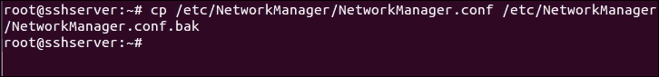

同样，以相同的方式创建`/etc/network/interfaces`文件的备份。

## 如何操作...

在本节中，我们将看看如何使用命令行手动配置网络设置：

1.  在开始手动配置之前，首先让我们检查当前的 IP 地址，该地址已由 DHCP 自动分配给系统。我们可以通过右键单击顶部右侧面板中的**Networking**图标，然后选择**Connection Information**来以图形方式检查详细信息，如下图所示：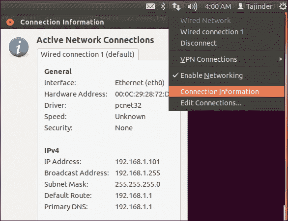

我们可以看到我们系统的当前 IP 地址是**192.168.1.101**。

1.  接下来，我们使用命令行检查此信息。我们输入`ifconfig`命令来执行此操作。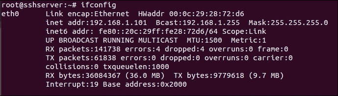

1.  如果我们只想检查系统上可用的以太网设备，我们可以运行此命令：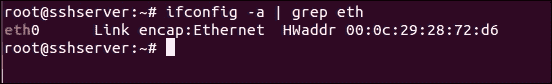

上述命令将列出系统上所有可用以太网设备的一行描述。

1.  如果我们想要更详细地了解网络接口，我们可以使用`lshw`工具。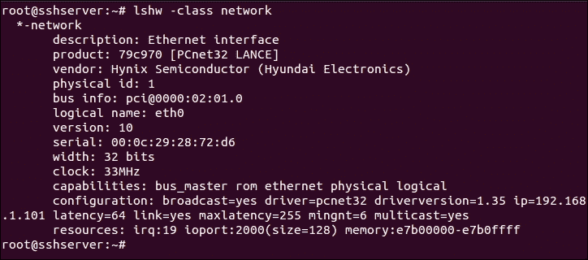

该工具还提供有关硬件的其他功能的详细信息。

1.  现在，我们将禁用网络管理器，然后手动设置 IP 地址的详细信息。要禁用网络管理器，请编辑`/etc/NetworkManager/NetworkManager.conf`文件。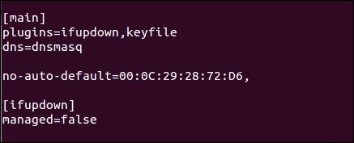

将`managed=false`改为`managed=true`并保存文件。

1.  现在，在您选择的编辑器中打开`/etc/network/interfaces`文件。我们看到，默认情况下，关于`eth0`接口没有任何信息。

1.  编辑文件，并添加以下截图中显示的信息。确保根据您的网络设置添加 IP 详细信息。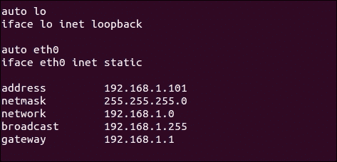

完成后，保存文件，然后重新启动计算机以**解除**网络管理器。

1.  如果我们希望创建虚拟网络适配器，我们可以将以下行添加到`/etc/network/interfaces`文件中，如下所示：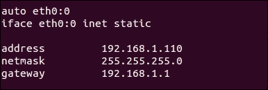

通过这样做，我们已经向单个以太网卡添加了两个 IP 地址。我们可以这样做来创建网络卡的多个实例。

1.  完成上述编辑后，使用以下任一命令重新启动网络服务：

```
service network-manager restart
/etc/init.d/networking restart

```

1.  接下来，让我们看看如何配置适当的名称服务器，如果 IP 地址是手动配置的话，将要使用它。

要进行更改，请在任何编辑器中编辑`/etc/resolv.conf`文件，并添加以下行：


通过遵循上述步骤，我们将能够成功配置 IP 详细信息。

## 它是如何工作的...

系统上的 TCP/IP 设置可以是自动管理或手动管理。根据`/etc/NetworkManager/NetworkManager.conf`文件中的内容，系统将了解设置是自动管理还是手动管理。

对于手动配置，我们编辑`/etc/network/interfaces`文件，并输入先前的 IP 详细信息。完成后，我们重新启动网络服务或完全重新启动系统以使更改生效。

# 使用 Iptables 配置防火墙

保护 Linux 系统所需的一个基本步骤是设置一个良好的防火墙。大多数 Linux 发行版都预装了不同的防火墙工具。**Iptables**是 Linux 发行版中的一个默认防火墙。在较旧版本的 Linux 内核中，Ipchains 是默认防火墙。

## 准备就绪

由于 Iptables 随 Linux 发行版一起提供，因此无需安装额外的工具来使用它。但是，建议使用 Iptables 时不要使用 root 帐户。相反，使用具有超级用户访问权限的普通帐户来有效地运行命令。

## 如何做...

我们可以使用 Iptables 定义不同的规则。这些规则在检查传入和传出的流量数据包时由内核跟随：

1.  我们在系统上需要做的第一件事是使用此命令检查安装了哪个版本的 Iptables：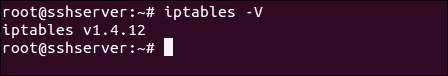

1.  现在，我们将使用`-L`选项检查系统中是否已存在 Iptables 的任何规则。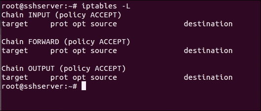

1.  前面的输出也可以以一种格式看到，告诉我们每个策略所需的命令。为此，使用`-S`选项，如下所示：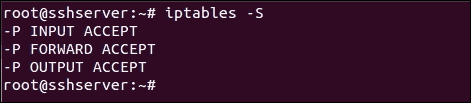

1.  现在，我们将检查 Iptables 默认加载了哪些模块，以了解它们的正确功能，使用此命令：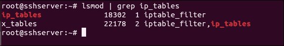

1.  让我们首先在 Iptables 中添加这个，这将确保当前所有在线连接即使在我们制定规则阻止不需要的服务之后也会保持在线：

```
iptables -A INPUT -m conntrack --ctstate ESTABLISHED,RELATED -j ACCEPT

```

在这里，`-A`选项将规则附加到现有表中。`INPUT`表示此规则将附加到 Iptables 的输入链。`-m conntrack --ctstate ESTABLISHED,RELATED`命令的下几个参数确保规则仅适用于当前在线的连接。然后，`-j ACCEPT`告诉 Iptables 接受并允许与前面指定的条件匹配的数据包。

1.  现在，如果我们再次检查 Iptables 中的规则列表，我们将看到我们的规则已添加。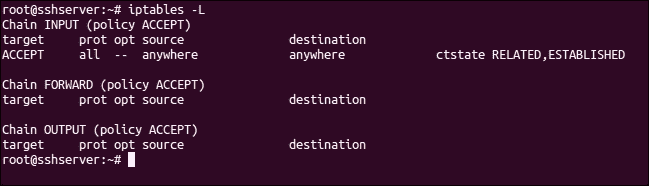

1.  假设我们想通过 Iptables 允许 SSH 连接。为此，我们添加此规则：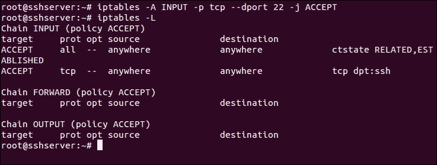

我们使用端口`22`，因为它是 SSH 的默认端口。如果您已更改服务器上 SSH 的端口，请使用前面命令中的适当端口。

1.  我们还需要确保我们的服务器继续正常运行，让服务器上的服务在不被 Iptables 的规则阻止的情况下相互通信。为此，我们希望允许发送到环回接口的所有数据包。

我们添加以下规则以允许环回访问：

```
iptables -I INPUT 1 -i lo -j ACCEPT
```

1.  在这里，`-I`选项告诉`iptables`插入一个新规则而不是追加它。它需要添加新规则的链和位置。在前面的命令中，我们将此规则添加为`INPUT`链中的第一条规则，以便它是应用的第一条规则。

1.  现在，如果我们使用`-v`选项查看 Iptables 中的规则列表，我们会注意到`lo`环回接口的规则是我们的第一条规则。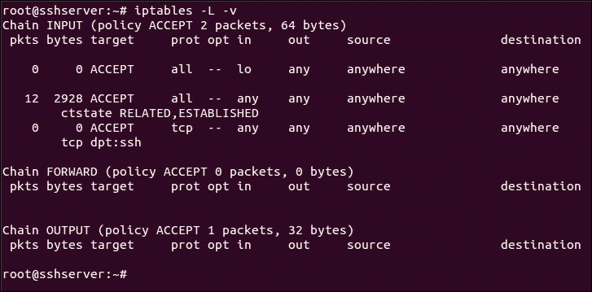

1.  假设我们已根据要求添加了允许所有数据包的规则，我们必须确保进入`INPUT`链的任何其他数据包都应该被阻止。

为此，我们将通过运行此命令修改`INPUT`链：

```
iptables –A INPUT –j DROP 

```

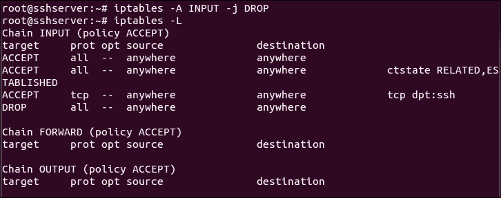

前面屏幕截图中的代码显示，已将丢弃所有数据包的规则添加到`INPUT`链的列表底部。这确保每当数据包进入时，Iptables 规则按指定顺序进行检查。如果没有规则与数据包匹配，它将被丢弃，从而默认阻止数据包被接受。

1.  到目前为止，我们在 Iptables 中添加的所有规则都是非持久的。这意味着一旦系统重新启动，Iptables 中的所有规则都将消失。

因此，为了保存我们创建的规则，然后在服务器重新启动时自动加载它们，我们可以使用`iptables-persistent`软件包。

1.  使用以下命令安装软件包：

```
apt-get install iptables-persistent

```

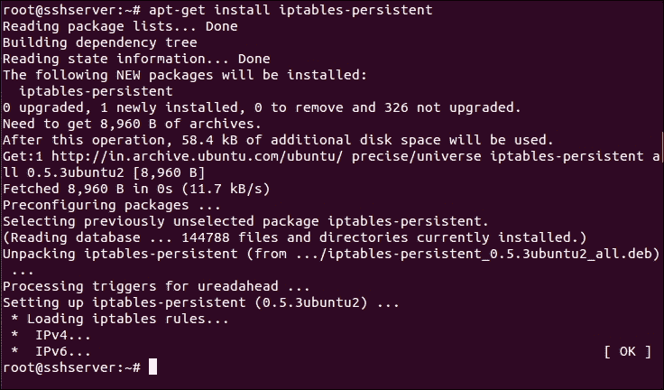

1.  在安装过程中，您将被问及是否要保存当前的`iptables`规则并自动加载它们。根据您的要求选择**是**或**否**。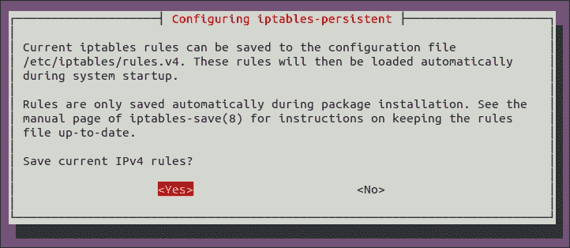

1.  安装完成后，我们可以通过运行此命令启动软件包：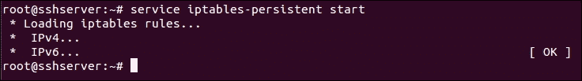

## 工作原理...

在前面的示例中，我们使用 Linux 中的 Iptables 来配置系统上的防火墙。

首先，我们浏览`iptables`命令的基本选项，然后看看如何在`iptables`中添加不同的规则。我们添加规则以允许本地主机访问和传出的活动连接。然后，我们添加一条规则以允许 SSH 连接。

接下来，我们添加一条规则，拒绝不符合前面规则的每个其他传入数据包。

最后，我们使用`iptables-persistent`软件包来保存`iptables`的规则，即使在系统重新启动后也是如此。

# 阻止伪造的地址

IP 欺骗是攻击者用来向计算机服务器发送恶意数据包的一种常见技术。这是创建具有伪造 IP 地址的 IP 数据包的过程。它主要用于**拒绝服务**（**DoS**）等攻击。

## 准备工作

如果我们希望阻止伪造的 IP 地址，我们需要有一个 IP 地址或域名列表，从中这些伪造的连接一直试图连接。

## 如何操作...

我们将尝试通过它来创建`iptables`的基本规则集，通过它我们将限制所有传入数据包，除了对我们的使用必要的数据包：

1.  第一步是创建一个规则，允许访问环回接口，以便系统上的服务可以正确地在本地相互通信。执行此命令如下：

```
iptables -A INPUT -i lo -j ACCEPT

```

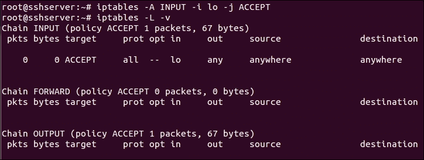

这对系统正常运行是必要的。

1.  接下来，我们为由我们的系统发起的出站连接创建一条规则：

```
iptables -A INPUT -m conntrack --ctstate RELATED,ESTABLISHED -j ACCEPT

```

这将接受所有出站流量，包括我们尝试连接到的远程服务器的响应（例如我们访问的任何网站）：

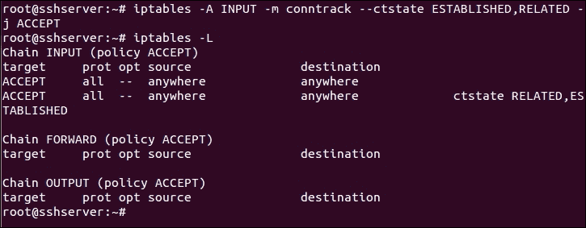

1.  让我们创建一个用于`iptables`的表。我们将其称为`blocked_ip`，但您可以选择自己喜欢的名称：

```
iptables –N blocked_ip

```

这是我们将添加要阻止的伪造 IP 地址的表。

1.  现在，我们使用以下命令将此表插入到`iptables`的`INPUT`表中：

```
iptables -I INPUT 2 -j blocked_ip

```

请注意，我们使用数字`2`来确保此规则将成为 Iptables 中从顶部开始的第二个规则。

1.  接下来，让我们将一些不良 IP 添加到我们创建的`blocked_ip`表中：

```
iptables -A blocked_ip -s 192.168.1.115 -j DROP

```

我们在这里使用`192.168.1.115` IP 地址作为示例。您可以用要阻止的 IP 地址替换它。如果您有多个要阻止的 IP 地址，请逐个将它们添加到`iptables`中。

1.  使用以下命令可以查看`iptables`中的规则列表：

```
iptables –L

```

在以下截图中显示的详细信息中，您将注意到我们正在尝试阻止的 IP 地址。您可以根据需要指定单个 IP 地址或范围。

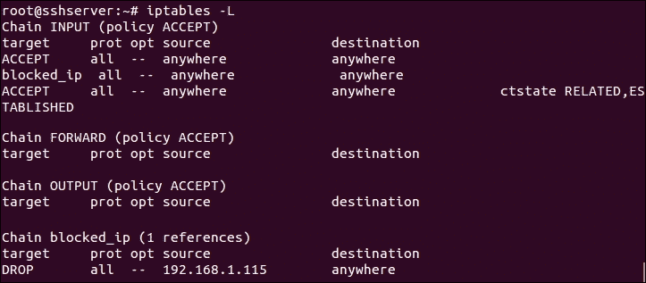

1.  在 Iptables 中制定规则后，我们还可以编辑`/etc/host.conf`文件。在您选择的任何编辑器中打开文件。我正在使用`nano`：

```
nano /etc/host.conf

```

现在，按照以下示例在文件中添加或编辑以下行：

```
orderbind,hosts
nospoof on

```

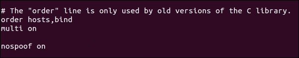

在前面的示例中，`nospoof on`选项执行主机名查找返回的 IP 地址与 IP 地址查找返回的主机名进行比较。如果比较失败，此选项将生成欺骗警告。

完成后，保存并关闭文件。这也有助于保护系统免受 IP 欺骗。

## 它是如何工作的...

为了阻止伪造的 IP 地址或任何其他 IP 地址，我们再次使用 Iptables，因为它是默认的防火墙，除非我们不想使用 Linux 可用的任何其他工具。

我们再次创建规则，以允许本地主机访问系统，并保持出站活动连接保持活动状态。然后，我们在 Iptables 中创建一个表，用于维护我们想要阻止的伪造 IP 地址的列表。我们将此表添加到 Iptables 的输入链中。然后，我们可以在需要时将任何 IP 地址添加到表中，并且它将自动被阻止。

我们还使用`/etc/host.conf`文件来保护系统免受 IP 欺骗。

# 阻止传入流量

Linux 系统管理员最重要的任务之一是控制对网络服务的访问。有时，最好在服务器上阻止所有传入流量，只允许所需的服务连接。

## 准备工作

由于我们在这里也将使用 Iptables，因此不需要额外的软件包来执行这些步骤。我们只需要一个具有`超级用户`访问权限的用户帐户。但最好不要使用`root`帐户。

## 如何做...

我们将配置 Iptables 拒绝除了已从系统内部发起的流量之外的所有流量（例如获取 Web 流量的 Web 浏览器或已经启动以更新软件包或其他软件的下载）：

1.  如前面的例子所示，Iptables 中的第一个规则将允许访问本地主机数据。运行此命令以允许访问：

```
iptables -A INPUT -i lo -j ACCEPT

```


1.  下一个规则将是接受与出站连接相关的所有流量。这也包括远程服务器对我们系统连接的响应：

```
iptables -A INPUT -m conntrack --ctstate RELATED,ESTABLISHED -j ACCEPT

```


1.  接下来，我们将添加一个规则，以接受**时间超过**的 ICMP 数据包。这对于限时连接设置很重要：

```
iptables -A INPUT -p icmp -m icmp --icmp-type 11 -j ACCEPT

```

1.  之后，我们将添加一个规则，以接受来自远程服务器的**目标不可达** ICMP 数据包：

```
iptables -A INPUT -p icmp -m icmp --icmp-type 3/4 -j ACCEPT

```

1.  然后，添加一个规则以接受 ping 请求/响应（Echo ICMP），以保持我们系统与可能需要 ping 的 Web 服务的连接保持活动状态：

```
iptables -A INPUT -p icmp -m icmp --icmp-type 8 -j ACCEPT

```

1.  添加了前述规则后，通过运行此命令检查 Iptables 中的列表：

```
iptables -L

```

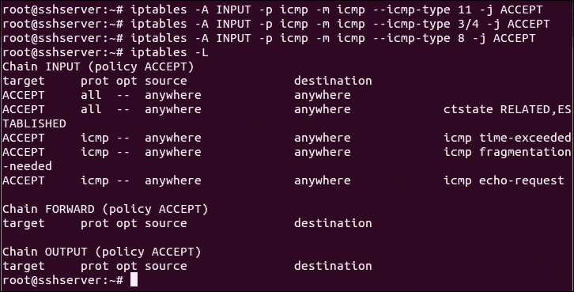

1.  我们将创建一个`iptables`表，其中包含一系列可接受的规则和服务：

```
iptables -N allowed_ip

```

然后将此表添加到 Iptables 的 INPUT 链中：

```
iptables -A INPUT -j allowed_ip

```

1.  让我们添加一个规则，以便在系统上允许对 SSH 的访问。为此，我们运行此命令：

```
iptables -A allowed_ip -p tcp --dport 22 -j ACCEPT

```

1.  如果我们检查 Iptables 中的规则列表，将得到以下结果：

```
iptable -L

```

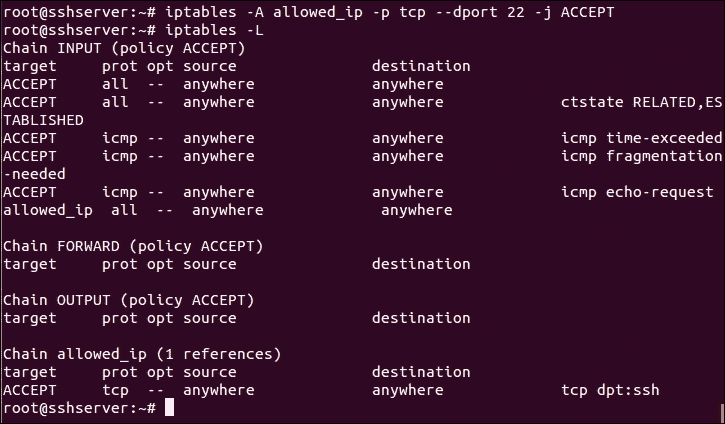

1.  一旦我们添加了规则以接受我们想要的流量，我们现在将拒绝所有其他未设置规则的流量。为此，我们添加此规则：

```
iptables -A INPUT -j REJECT --reject-with icmp-host-unreachable

```

通过这样做，每当有人尝试连接到服务器时，将向他们发送一个**主机不可达**的 ICMP 数据包，然后将终止连接尝试。

1.  在添加了所有前述规则之后，Iptables 现在看起来与以下截图类似：

```
iptables -L

```

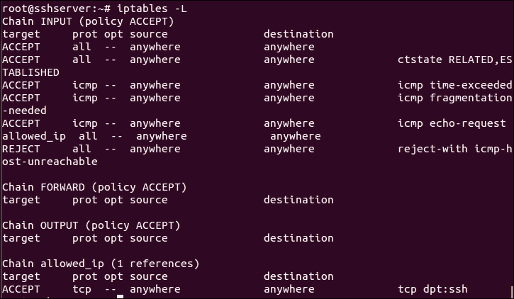

## 它是如何工作的...

为了在服务器上阻止所有传入流量并只允许出站连接，我们再次使用 Iptables，因为它是 Linux 的默认防火墙。

为了允许服务器内部的正常运行，我们允许访问本地主机。

接下来，为了保持出站连接活动，我们添加一个规则以接受**时间超过**、**目标不可达**和**Echo ICMP**数据包。

添加了这些规则后，我们可以决定是否希望允许特定服务（如 SSH）的任何传入流量，或者特定客户端地址的流量。为此，我们创建一个表格，以添加我们希望允许的客户端的 IP 地址列表。我们添加了一个规则，以允许根据我们的要求访问 SSH 服务或任何其他服务。

最后，我们添加了一个规则，拒绝所有未添加规则的流量。

# 配置和使用 TCP Wrapper

通过限制访问来保护服务器是一项关键措施，在设置服务器时绝不能忽视。使用 TCP Wrappers，我们可以只允许我们配置并支持 TCP Wrappers 的网络访问我们服务器的服务。

## 准备工作

为了演示这些步骤，我们使用两个位于同一网络上并且可以成功 ping 通对方的系统。一个系统将用作服务器，另一个将用作客户端。

## 如何做？

Linux 提供了多种工具来控制对网络服务的访问。TCP Wrappers 是其中之一，并添加了额外的保护层。在这里，我们将看看如何配置 TCP Wrappers 以定义不同主机的访问权限。

1.  首先，我们需要检查程序是否支持 TCP Wrappers。为此，首先使用`which`命令找到可执行程序的路径：

```
which sshd

```

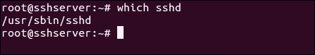

在这里，我们以 SSH 程序为例。

1.  接下来，我们使用`ldd`程序来检查 SSH 程序与 TCP Wrappers 的兼容性：

```
ldd /usr/sbin/sshd

```

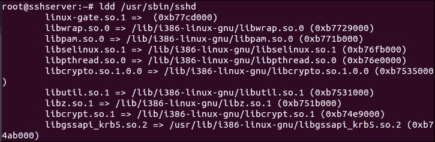

如果前面的命令输出了`libwrap.so`内容，这意味着该程序受 TCP Wrappers 支持。

1.  现在，每当 SSH 程序尝试使用 TCP Wrappers 连接到服务器时，将按照以下顺序检查两个文件：

+   `/etc/hosts.allow`：如果在此文件中找到程序的匹配规则，将允许访问

+   `/etc/hosts.deny`：如果在此文件中找到程序的匹配规则，将拒绝访问

1.  如果在这两个文件中没有找到特定程序的匹配规则，将允许访问。

1.  如果我们尝试在添加任何规则之前连接到 SSH 服务器，我们会看到它成功连接。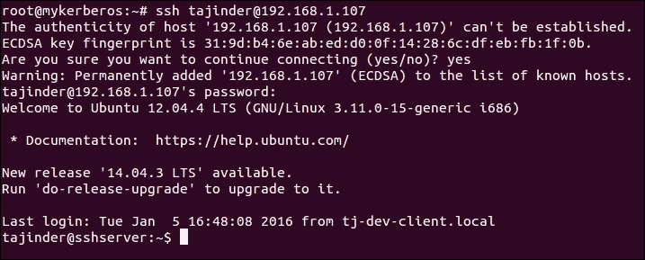

1.  现在假设我们想要拒绝特定系统具有给定 IP 地址的 SSH 程序的访问。然后，我们将编辑`/etc/hosts.deny`文件，如下所示：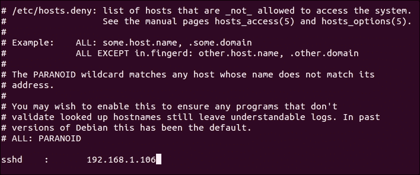

1.  如果我们尝试从已拒绝访问的特定系统连接到 SSH 服务器，将显示以下错误：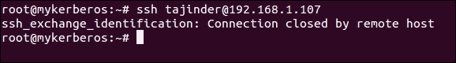

1.  如果我们希望允许所有程序和客户端访问，可以在这两个文件中添加零规则，或者将以下行添加到`/etc/hosts.allow`文件中：

1.  如果我们想要允许具有`192.168.1.106` IP 地址的特定客户端访问所有服务，然后我们将以下行添加到`/etc/hosts.allow`文件中：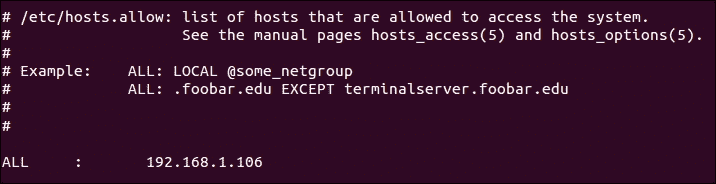

1.  如果我们想要允许特定网络上的所有客户端访问 SSH，除了具有`192.168.1.100` IP 地址的特定客户端，我们可以对`/etc/hosts.allow`文件进行以下更改：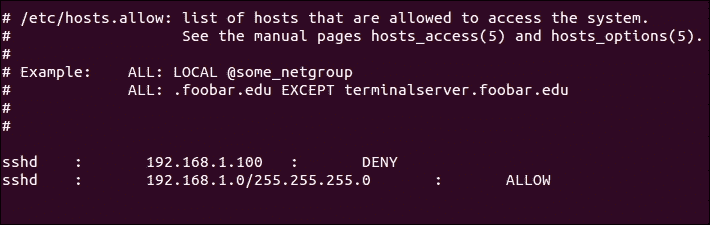

1.  进行了上述更改后，当我们尝试通过 SSH 连接时，我们会看到以下错误：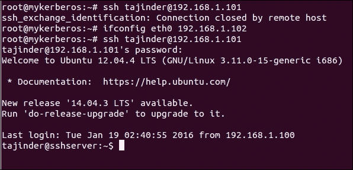

我们可以看到一旦更改了客户端的 IP 地址，现在允许 SSH 访问，这意味着特定网络上的所有客户端都可以访问 SSH，除了被拒绝的 IP 地址。

1.  前面的步骤阻止了在`/etc/hosts.allow`文件中定义的服务规则。然而，在服务器端，我们无法知道哪个客户端尝试访问服务器以及何时。因此，如果我们想要记录客户端的所有连接尝试，我们可以编辑`/etc/hosts.allow`文件，如下所示：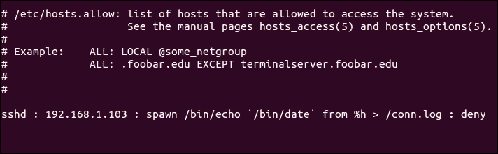

在前面的屏幕截图中，`spawn`关键字定义了每当客户端发出连接请求时，它将回显由`%h`选项指定的详细信息，并将其保存在`conn.log`日志文件中。

1.  现在，当我们阅读`conn.log`文件的内容时，我们看到了这些细节：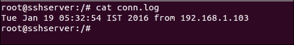

该文件包含了客户端尝试连接的时间以及来自哪个 IP 地址。使用`spawn`命令的不同参数可以捕获更多的细节。

## 它是如何工作的...

我们使用 TCP Wrapper 来限制 TCP Wrapper 软件包支持的程序的访问。

我们首先使用`ldd`工具检查我们想要限制的程序是否受 TCP Wrapper 支持。

然后，根据我们的需求，在`/etc/hosts.allow`或`/etc/hosts.deny`文件中添加一条规则。

我们添加一条规则，根据我们的需求限制来自特定客户端或整个网络的程序。

使用 TCP Wrapper 中的 spawn 选项，我们甚至可以为客户端或我们限制的程序所做的连接尝试维护日志。
