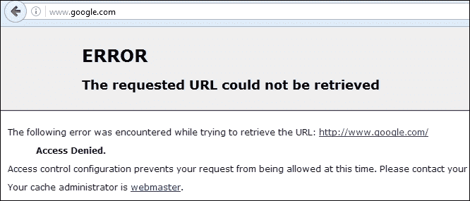
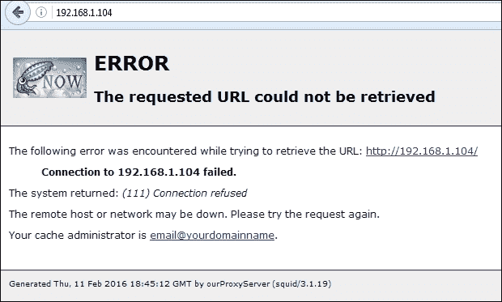
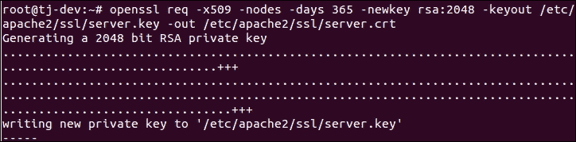
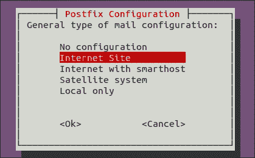
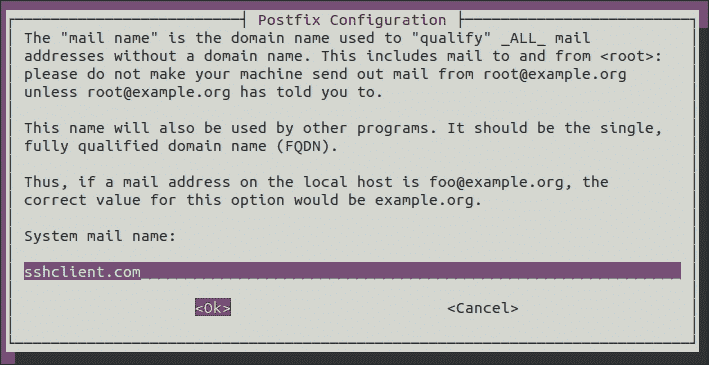

# 第七章：安全工具

在本章中，我们将讨论：

+   Linux sXID

+   PortSentry

+   使用 Squid 代理

+   OpenSSL 服务器

+   Tripwire

+   Shorewall

# Linux sXID

在 Linux 中，通常文件具有读、写和执行权限。除了这些权限，它还可以具有特殊权限，如**设置所有者用户 ID**（**SUID**）和**在执行时设置组 ID**（**SGID**）。由于这些权限，用户可以从他们的帐户登录，仍然以实际文件所有者的权限运行特定的文件/程序（也可以是 root）。

sXid 是用于定期监视 SUID/SGID 的工具。使用这个工具，我们可以跟踪文件和文件夹中 SUID/SGID 的更改。

## 准备就绪

要使用这个工具，我们需要在 Linux 系统上安装`sxid`软件包。我们可以使用`apt-get`命令来安装软件包，或者我们可以下载软件包并手动配置和安装它。

## 如何操作...

要开始监视 SUID/SGID 文件和文件夹，我们首先安装软件包，然后根据我们的要求配置工具：

1.  第一步是安装`sxid`软件包。为此，我们运行以下命令：

```
apt-get install sxid

```


1.  安装完成后，我们开始编辑文件`/etc/sxid.conf`，根据我们的要求使用该工具。在您选择的任何编辑器中打开文件：

```
nano /etc/sxid.conf

```

1.  在配置文件中，查找以下截图中显示的行：

如果您希望在运行`sxid`时将更改的输出发送到您的电子邮件地址，请将`EMAIL`的值更改为任何其他电子邮件 ID。

1.  接下来，查找读取`KEEP_LOGS`的行，并将值更改为您选择的任何数字值。这个数字定义了要保留多少个日志文件：

1.  如果您希望在`sXid`找不到更改时也获得日志，那么将`ALWAYS_NOTIFY`的值更改为`yes`：

1.  我们可以定义一个目录列表，用空格分隔，作为`sXID`的`SEARCH`选项的起始点进行搜索。

但是，如果我们希望从搜索中排除任何目录，我们可以在`EXCLUDE`选项下指定它：


假设我们有一个要搜索的目录`/usr/local/share`，并且在排除列表中已经提到了`/usr/local`目录，那么它仍然会被搜索。这对于排除一个主目录并且只指定一个目录变得有用。

1.  `/etc/sxid.conf`中还有许多可以根据我们的要求进行配置的选项。编辑文件后，保存并关闭文件。

1.  现在，如果我们想要手动运行`sXid`进行抽查，我们使用以下命令：

```
sxid -c /etc/sxid.conf -k

```


在这里，`-c`选项有助于定义`config`文件的路径，如果命令没有自动选择。`-k`选项运行该工具。

## 它是如何工作的...

首先安装`sXid`软件包，然后通过编辑文件`/etc/sxid.conf`根据我们的要求进行配置。

一旦配置完成，我们就手动运行`sXid`进行抽查。

如果需要的话，我们甚至可以在`crontab`中添加一个条目，以便在定义的时间间隔内自动运行`sXid`。

# PortSentry

作为系统管理员，一个主要的关注点是保护系统免受网络入侵。

这就是**PortSentry**的作用。它有能力检测主机系统上的扫描，并以我们选择的方式对这些扫描做出反应。

## 准备就绪

为了演示 PortSentry 的实施和使用，我们需要在同一网络上有两个系统，它们可以相互 ping 通。

此外，我们需要在一个系统上安装`Nmap`软件包，该软件包将用作客户端，另一个系统上，我们将安装和配置`PortSentry`软件包。

要安装`Nmap`软件包，请使用以下命令：

```
apt-get install nmap

```


## 如何操作？

1.  在第一个系统上，我们使用以下命令安装`Portsentry`软件包：

```
apt-get install portsentry

```


1.  在安装过程中，将打开一个窗口，其中包含有关`Portsentry`的一些信息。只需单击“确定”继续：

1.  安装完成后，`portsentry`立即开始监视 TCP 和 UDP 端口。我们可以通过使用以下命令检查文件`/var/log/syslog`来验证这一点：

```
grep portsentry /var/log/syslog

```


我们可以在日志中看到与`portsentry`相关的消息。

1.  现在，在我们用作客户端的第二台机器上，运行如下所示的`Nmap`命令：

我们还可以使用`Nmap`的任何其他命令在第一个运行`portsentry`的系统上执行 TCP 或 UDP 扫描。要了解更多关于`Nmap`命令的信息，请参阅第一章，*Linux 安全问题*。

在上述结果中，我们可以看到即使在第一个系统上运行`portsentry`时，`Nmap`也能够成功扫描。

我们甚至可以尝试从客户端 ping 服务器系统，看看在安装`portsentry`后它是否正常工作。

1.  现在让我们通过编辑服务器系统上的文件`/etc/portsentry/portsentry.conf`来配置`portsentry`。

在您选择的编辑器中打开后，查找以下行并将值更改为`1`：


向下滚动，然后找到并取消注释以下行：


接下来，取消注释以下行：


完成后，保存并关闭文件。

1.  接下来，编辑文件`/etc/default/portsentry`：

在上面显示的行中，我们需要说明`portsentry`应该使用 TCP 还是 ATCP 协议。

1.  现在编辑文件`/etc/portsentry/portsentry.ignore.static`，并在底部添加一行，如下面的屏幕截图所示：

在这里，`192.168.1.104`是我们试图阻止的客户机的 IP 地址。

1.  现在通过运行以下命令重新启动`portsentry`服务：

1.  完成上述步骤后，我们将再次尝试在客户机上运行`Nmap`，看看它是否仍然正常工作：

我们可以看到现在`Nmap`无法扫描 IP 地址。

1.  如果我们尝试从客户端 ping 服务器，甚至那也不起作用：

1.  如果我们检查文件`/etc/hosts.deny`，我们将看到自动添加了以下行：

1.  同样，当我们检查文件`/var/lib/portsentry/portsentry.history`时，我们得到一个类似于下面图片中最后一行的结果：

## 工作原理...

我们使用两个系统。第一个系统充当`portsentry`服务器，而另一个充当客户端。

在第一个系统上，我们安装`portsentry`软件包，在第二个系统上，我们安装`Nmap`，用于演示工作。

现在我们从客户机对服务器执行`Nmap`扫描。我们可以看到它工作正常。

之后，我们根据要求配置`portsentry`，编辑各种文件。

编辑完成后，重新启动`portsentry`服务，然后再次尝试从客户端对服务器执行`Nmap`扫描。我们看到现在扫描无法正常工作。

# 使用 Squid 代理

Squid 是一个具有各种配置和用途的 Web 代理应用程序。Squid 具有大量的访问控制，并支持不同的协议，如 HTTP、HTTPS、FTP、SSL 等。

在本节中，我们将看到如何将 Squid 用作 HTTP 代理。

## 准备就绪

要在网络上的特定系统上安装和使用 Squid，请确保该特定系统具有足够的物理内存，因为 Squid 还可以作为缓存代理服务器工作，因此需要空间来维护缓存。

我们在示例中使用的是 Ubuntu 系统，Squid 可在 Ubuntu 存储库中获得，因此我们需要确保我们的系统是最新的。为此，我们运行以下命令：

```
apt-get update

```

之后，运行以下命令：

```
apt-get upgrade

```

## 如何操作...

要在我们的系统上安装和配置 Squid，我们必须采取以下步骤：

1.  第一步是安装`squid`软件包，为此，我们运行以下命令：

1.  一旦 Squid 安装完成，它将以默认配置开始运行，该配置定义了阻止网络上所有 HTTP/HTTPs 流量。

要检查这一点，我们只需要在网络上的任何系统上配置浏览器，使用代理系统的 IP 地址作为代理，如下面的截图所示：


1.  完成后，我们现在可以尝试访问任何网站，我们将看到一个错误屏幕，如下图所示：

1.  现在我们将开始配置我们的代理服务器，使其按照我们的要求工作。为此，我们将在任何编辑器中编辑文件`/etc/squid3/squid.conf`。

一旦文件在编辑器中打开，搜索读作：

`TAG: visible_hostname`：在这个类别下，添加一行——`visible_hostname ourProxyServer`：


在这里，`ourProxyServer`是我们给代理服务器起的名字。你可以选择任何你喜欢的名字。

1.  接下来，搜索读作`TAG: cache_mgr`的类别，并添加一行`cache_mgr email@yourdomainname`。在这里，提及管理员的电子邮件 ID，可以联系管理员而不是`email@yourdomainname`。

1.  接下来，我们搜索以下截图中显示的行。`http_port`变量定义了 Squid 代理将监听的端口。默认端口是 3128；但是，我们可以更改为任何未被使用的端口。我们甚至可以定义 Squid 监听多个端口，如下面的截图所示：

1.  现在我们需要添加规则，根据我们的需求允许网络计算机上的流量。为此，我们将搜索读作`acl localnet src 10.0.0.8`。

在这里，我们添加了我们的规则`acl localnetwork src 192.168.1.0/24`，如下图所示：


在上述规则中，`acl`用于定义一个新规则，`localnetwork`是我们给规则起的名字。`src`定义了将要传输到代理服务器的流量的来源。我们使用子网位数定义网络 IP 地址，如前面所示。

根据我们的需求，我们可以添加任意多的规则。

1.  接下来，搜索读作`http_access allow localhost`，并在其下添加一行`http_access allow localnetwork`，以开始使用我们在上一步中添加的规则，允许流量：

1.  完成上述配置步骤后，我们使用以下命令重新启动 Squid 服务：

```
service squid3 restart

```

1.  现在我们的 Squid 代理服务器正在运行。要检查，我们可以尝试从网络上的任何系统的浏览器访问代理服务器的 IP 地址：

上面的错误屏幕告诉我们 Squid 代理工作正常。

现在我们可以尝试访问任何其他网站，它应该根据我们在 Squid 的配置文件中添加的规则打开。

## 它是如何工作的...

我们首先安装 Squid 软件包。软件包安装完成后，我们编辑其配置文件`/etc/squid3/squid.conf`，并添加主机名、管理员的电子邮件 ID 以及 Squid 将监听的端口。

然后我们创建规则，允许同一网络中所有系统的流量。一旦保存了所有配置，我们重新启动 Squid 服务，我们的代理服务器现在正在工作。

# OpenSSL 服务器

SSL 是一种用于在互联网上传输敏感信息的协议。这可能包括帐户密码、信用卡详细信息等信息。SSL 最常用于与 HTTP 协议一起进行的网络浏览。

`OpenSSL`库提供了**安全套接字层（SSL）**和**传输层安全性（TLS）**协议的实现。

## 准备工作

为了演示`OpenSSL`的使用，我们需要两个系统。一个将用作服务器，我们将在其中安装`OpenSSL`软件包和 Apache。第二个系统将用作客户端。

## 如何做...

现在我们将看到如何使用`OpenSSL`为 Apache 创建自签名证书。这将有助于加密到服务器的流量：

1.  我们首先使用以下命令在第一个系统上安装`OpenSSL`软件包：

1.  接下来，我们将在同一系统上安装 Apache，如下所示：

1.  安装 Apache 后，我们需要启用 SSL 支持，这在 Ubuntu 的 Apache 软件包中是标准的。为此，我们运行以下命令：

启用 SSL 支持后，按照上面的屏幕截图重启 Apache，使用以下命令：

```
service apache2 restart

```

1.  现在在 Apache 的配置目录中创建一个目录。这是我们将保存证书文件的地方，我们将在下一步中创建这些文件：

```
mkdir /etc/apache2/ssl

```

1.  现在我们将使用以下命令创建密钥和证书：

在上述命令中，`req –x509`指定我们将创建一个符合 X.509 **证书签名请求**（**CSR**）管理的自签名证书。

`-nodes`指定将创建不受任何密码保护的密钥文件。

`-days 365`告诉我们，正在创建的证书将在一年内有效。

`-newkeyrsa:2048`告诉我们，私钥文件和证书文件将同时创建，并且生成的密钥将为 2048 位长。

下一个参数`-keyout`指定要创建的私钥的名称。

`-out`参数提及正在创建的证书文件的名称。

1.  在创建密钥和证书文件时，将会询问您一些问题。根据您的配置提供详细信息。但是，读取`通用名称（例如服务器 FQDN 或您的名称）`的选项很重要，我们必须提供域名或服务器的公共 IP：

1.  接下来，我们需要编辑文件`/etc/apache2/sites-available/default`，以配置 Apache 使用在上一步中创建的密钥文件和证书文件。

找到并编辑如下屏幕截图中显示的行。对于`ServerName`，我们提供了 Apache 服务器系统的 IP 地址：


在同一文件中，滚动到文件末尾，在`<VirtualHost>`块关闭之前，添加以下屏幕截图中给出的行。提及在创建这些文件时使用的密钥文件名和证书文件名：


1.  现在，在客户端系统上，打开任何浏览器，并使用`https://`协议访问 Apache 服务器的公共 IP，如下所示：

浏览器将显示有关连接不安全的警告消息，因为证书未经任何受信任的机构签名。

1.  单击**我了解风险**，然后单击**添加例外**按钮将证书添加到浏览器中：

1.  下一个窗口将显示有关服务器的一些信息。要继续并添加证书，请点击**确认安全异常**：

1.  如果您希望检查证书的更多细节，请在上一个屏幕上点击**查看**，您将会看到一个新窗口显示证书的完整细节，如下所示：

1.  证书成功添加后，网页加载将完成，如下所示：

## 工作原理...

在此设置中，我们使用两个系统。第一个是 Apache 服务器，我们在其中安装了`OpenSSL`软件包。第二个系统作为客户端，我们将尝试连接到 Apache Web 服务器。

在第一个系统上安装 Apache 和`OpenSSL`软件包后，我们为 Apache 启用 SSL 支持。然后，我们使用`OpenSSL`工具和一些参数创建服务器密钥和服务器证书文件。

之后，我们编辑文件`/etc/apache2/sites-available/default`，以便 Apache 可以使用我们创建的密钥和证书。

完成后，我们尝试通过客户端机器上的浏览器访问 Apache Web 服务器。

我们看到它要求将新证书添加到浏览器中，完成后，我们可以使用 HTTPS 协议访问 Web 浏览器。

# Tripwire

随着对服务器的攻击数量不断增加，安全地管理服务器变得越来越复杂。很难确定每次攻击是否已被有效阻止。

**Tripwire**是一种基于主机的**入侵检测系统**（**IDS**），可用于监视不同的文件系统数据点，然后在任何文件被修改或更改时向我们发出警报。

## 准备就绪

我们只需要在 Linux 系统上安装 Tripwire 软件包来配置我们的 IDS。在下一节中，我们将看到如何安装和配置该工具。

## 如何操作...

我们将在以下步骤中讨论如何在我们的 Ubuntu 系统上安装和配置 Tripwire：

1.  第一步将是使用`apt-get`安装 Tripwire 软件包，如下所示：

1.  在安装过程中，它将显示一个信息窗口。按**确定**继续。

1.  在下一个窗口中，选择**Internet Site**作为邮件配置类型，然后按**确定**：

1.  下一个窗口将要求输入**系统邮件名称**。输入您正在配置 Tripwire 的系统的域名：

1.  在下一个屏幕上按*O*继续。

1.  现在我们将被问及是否要为 Tripwire 创建密码。选择**是**并继续：

1.  现在我们将被问及是否要重建配置文件。选择**是**并继续：

1.  接下来，选择**是**以重建 Tripwire 的策略文件：

1.  接下来，提供您希望为 Tripwire 配置的密码：

它还会在下一个屏幕上要求重新确认密码。

1.  接下来，为本地密钥提供一个密码，并在下一个屏幕上重新确认：

1.  下一个屏幕确认安装过程已成功完成。按**确定**完成安装：

1.  安装成功后，我们的下一步是初始化 Tripwire 数据库。为此，我们运行如下截图中显示的命令：

在前面的输出中，我们可以看到许多文件名显示为`没有这样的文件或目录`的错误。这是因为 Tripwire 扫描其配置文件中提到的每个文件，无论它是否存在于系统中。

1.  如果我们希望删除前面屏幕截图中显示的错误，我们必须编辑文件`/etc/tripwire/tw.pol`，并注释掉我们系统中不存在的文件/目录的行。如果愿意，我们甚至可以将其保留不变，因为这不会影响 Tripwire 的工作。

1.  我们现在将测试 Tripwire 的工作情况。为此，我们将通过运行以下命令创建一个新文件：

```
touch tripwire_testing

```

您可以根据自己的选择为文件选择任何名称。

1.  现在运行 Tripwire 交互命令来测试它是否正常工作。为此，命令如下：

```
tripwire --check --interactive

```


我们将得到一个输出，如前面的屏幕截图所示。 Tripwire 检查所有文件/目录，如果有任何修改，将显示在结果中：


在我们的案例中，它显示了如前面的屏幕截图所示的一行，告诉我们在`/root`目录中添加了一个名为`tripwire_testing`的文件。

如果我们希望保留所显示的更改，只需保存自动在编辑器中打开的结果文件。

在保存结果时，系统将提示您输入本地密码。输入您在安装 Tripwire 时配置的密码。

1.  最后，我们在 crontab 中添加一个条目，以便自动运行 Tripwire 来检查文件/目录中的更改。在您选择的任何编辑器中打开文件`/etc/crontab`并添加以下行：

在这里，`00 6`告诉我们 Tripwire 将在每天 6 点检查一次。

## 它是如何工作的...

首先安装 Tripwire 软件包，并在安装过程中填写所需的详细信息。安装完成后，我们初始化 Tripwire 数据库。

之后，我们检查 Tripwire 是否正常工作。为此，我们首先在任何位置创建一个新文件，然后运行 Tripwire 交互命令。命令完成后，我们在输出中看到显示已添加的新文件。这证实了 Tripwire 的完美工作。

然后，我们编辑 Crontab 配置，以便以特定间隔自动运行 Tripwire。

# Shorewall

您是否希望将 Linux 系统设置为小型网络的防火墙？ Shorewall 通过标准 Shorewall 工具帮助我们配置企业级防火墙。

Shorewall 实际上是建立在 Iptables 之上的。但是，Shorewall 使配置变得更加容易。

## 准备工作

需要安装并运行两张网络卡的 Linux 系统才能配置 Shorewall。一张卡将用作外部网络接口，第二张卡将用作内部网络接口。在我们的示例中，我们使用`eth0`作为外部接口，`eth1`作为内部接口。

根据网络配置配置两张卡。确保您能够 ping 本地网络上的另一个系统，也能够 ping 外部网络，即互联网上的某些内容。

在这个系统上，我们将安装 Shorewall 软件包，然后根据我们的要求进行配置。

## 操作步骤...

1.  我们首先使用`apt-get`命令在系统上安装`shorewall`：

1.  安装完成后，尝试启动`shorewall`。您将收到以下错误消息：

这意味着我们需要先配置 Shorewall，然后它才能开始运行。

1.  要配置 Shorewall，请在您选择的任何编辑器中编辑文件`/etc/default/shorewall`。查找包含`startup=0`的行，并将其值更改为以下内容：

1.  接下来，编辑文件`/etc/shorewall/shorewall.conf`，找到包含`IP_FORWARDING`的行。验证其值是否设置为`On`：

1.  Shorewall 的配置文件位于`/etc/shorewall`目录中。对于其工作至关重要的最低必需文件如下：

+   接口

+   策略

+   规则

+   区域

如果在安装后在`/etc/shorewall`目录中找不到这些文件中的任何一个，我们可以在目录`/usr/share/doc/shorewall/default-config/`中找到相同的文件。

从此位置复制所需文件到`/etc/shorewall`目录。

1.  现在编辑文件`/etc/shorewall/`interfaces，并按以下图像中显示的添加行：

我们在配置中将`eth0`称为`net`，将`eth1`称为`local`。只要是字母数字且不超过五个字符，您可以选择任何其他名称。

1.  接下来，编辑文件`/etc/shorewall/zones`。区域主要用于设置是否使用`ipv4`或`ipv6`：

在前面的配置中，`fw`指的是我，或者说是 Shorewall 防火墙本身。接下来的两行定义了两个网络接口的 ipv4。

1.  现在编辑策略文件`/etc/shorewall/`。该文件主要用于设置关于谁被允许去哪里的整体策略。

该文件中的每一行都是从上到下处理的，并且每一行都是按以下格式读取的：

如果从 ____ 发送数据包到 ____，则 ______。


在我们的示例中，如果我们读取第一个策略，它将被读取为——如果从本地发送数据包到网络，则接受它。

您可以以相同的方式添加尽可能多的策略，Shorewall 防火墙将相应地工作。

1.  最后，编辑文件`/etc/shorewall/rules`。该文件用于创建对策略的例外。如果您希望允许外部网络中的人进入内部网络，则主要使用该文件。

示例规则文件如下截图所示：


我们已经添加了一条规则，该规则表示如果从`net`发送数据包到`fw`，并且使用端口号`80`的`tcp`协议，则接受该数据包。

1.  一旦我们根据要求配置了上述文件，我们可以通过运行以下命令来测试设置：

```
shorewall check

```

在显示的输出中，滚动到底部，如果显示`Shorewall 配置已验证`，这意味着设置已正确完成，Shorewall 现在可以用作防火墙：


1.  现在重新启动 Shorewall 服务以应用设置，如下所示：

```
service shorewall restart

```

## 工作原理...

我们首先在系统上安装 Shorewall，该系统有两个网络接口卡。

安装完成后，我们编辑`/etc/default/shorewall`文件和`/etc/shorewall/shorewall.conf`文件。

然后我们在`/etc/shorewall`位置编辑或创建这些文件：interfaces、policy、rules 和 zones。然后根据要求向每个文件添加行。

编辑完成后，我们检查一切是否正常，然后启动 Shorewall 服务以启动我们的防火墙。
