# 第八章：Linux 安全发行版

在本章中，我们将讨论以下主题：

+   Kali Linux

+   pfSense

+   DEFT - 数字证据和取证工具包

+   NST - 网络安全工具包

+   Helix

# Kali Linux

Kali 是一个基于 Debian 开发的 Linux 发行版，旨在进行安全测试。Kali 预装了数百种渗透测试工具，是一个可立即使用的操作系统。我们可以通过光盘、USB 媒体或虚拟机来运行它。

通过其最新版本的 Kali 2.0，在操作系统中进行了重大更改，将其转换为滚动发布模型。现在我们可以简单地在系统上安装 Kali 2.0，并通过正常更新获取其中工具的最新版本。这意味着我们不必等待 Kali 2.1 来获取最新的东西。

## 准备就绪

要探索 Kali 2.0，请从其官方网站下载最新版本 - [`www.kali.org/downloads/`](https://www.kali.org/downloads/)。

我们可以下载 ISO，然后将其刻录到 CD/DVD 上，或创建一个可引导的 USB 设备。我们甚至可以从上面给出的链接下载 Kali Linux VMWare、Virtual Box 或 ARM 镜像。

## 如何做...

Kali 2.0 包括其更新的开发环境和工具方面的重大变化。我们将探讨这些变化，以了解其中的区别：

1.  要开始使用 Kali，我们可以安装它，也可以通过实时选项来使用它。当我们通过实时选项启动时，我们会注意到 Grub 屏幕已经改变，并且变得更加简单易用。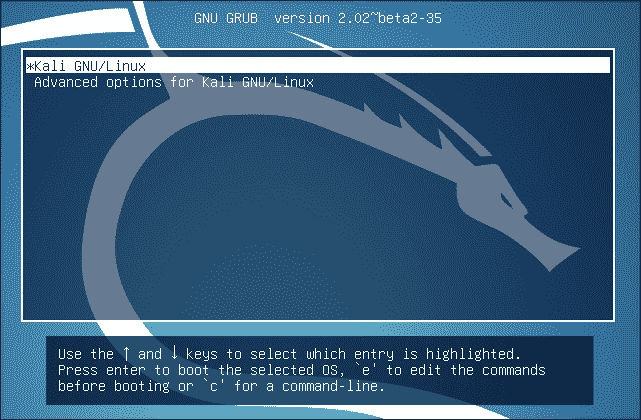

1.  Kali 的主系统镜像已经移至 GNOME 3，重新设计了用户界面。我们可以在登录屏幕上注意到这些变化，它已经重新设计。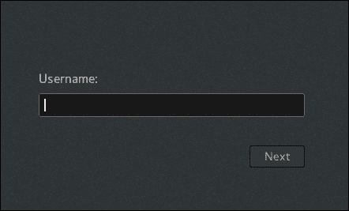

1.  在登录屏幕后出现的桌面屏幕也已经重新设计。我们可以在以下截图中看到新桌面屏幕的快照：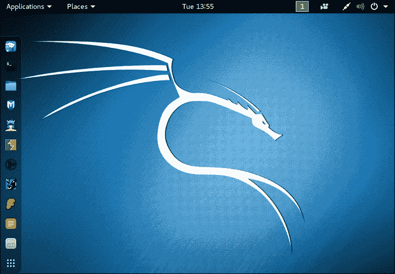

1.  当我们点击左上角的**应用程序**时，我们会看到菜单和工具类别已经重组：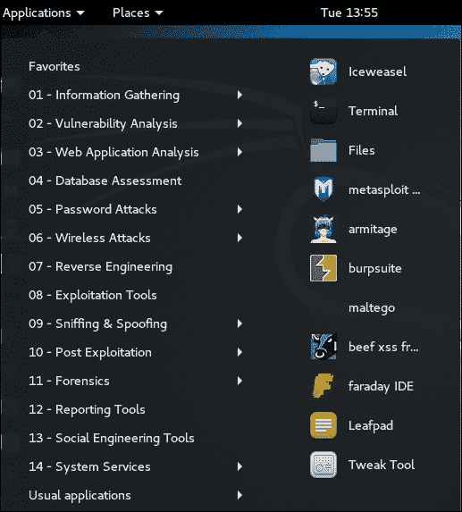

1.  我们还可以通过点击侧边栏底部的**菜单**图标来访问工具。这样，我们可以一次看到所有的工具：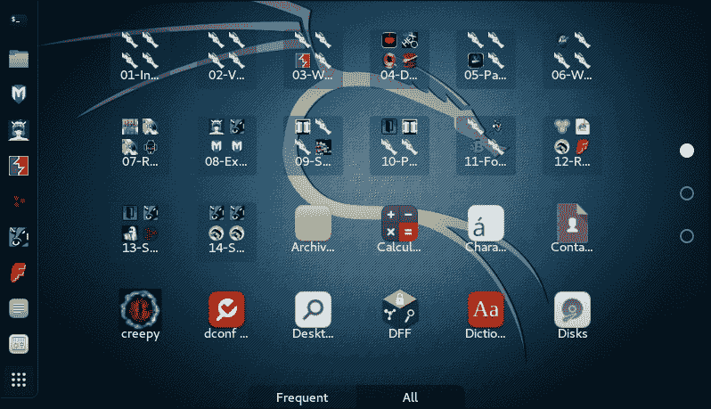

1.  Kali 2.0 包括内置的屏幕录制选项，实际上是 GNOME 3 的一部分。在右上角，点击录制图标，我们会得到**开始录制**的选项。现在，您可以通过单击一次在 Kali 上所做的任何事情来制作视频。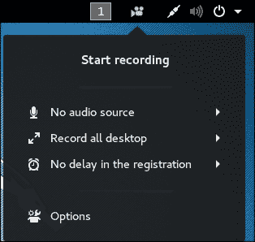

1.  如果我们希望访问 Kali 的**设置**菜单，我们会注意到它在**应用程序**菜单下不见了。要访问**设置**，请点击右上角的**电源**图标，然后会弹出一个菜单。

在此菜单中，我们在左下角看到**设置**图标。

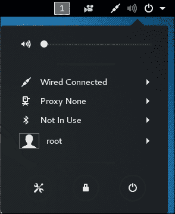

1.  当我们在上一步中点击**设置**图标时，我们会得到如下所示的设置菜单。现在根据您的要求对系统的设置进行更改。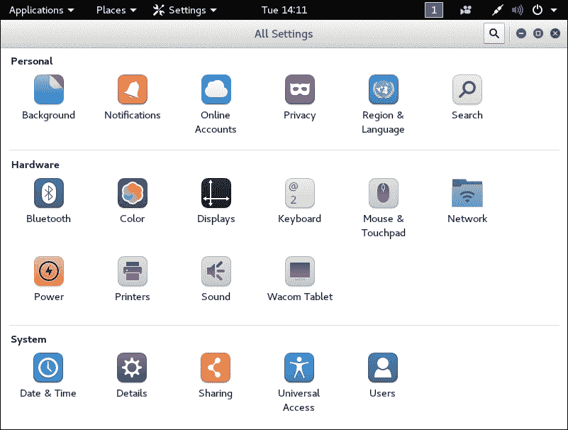

让我们点击**详细信息**以查看有关 Kali 2.0 的更多信息

1.  我们可以在以下截图中看到有关系统的详细信息。这包括有关 GNOME 版本的信息。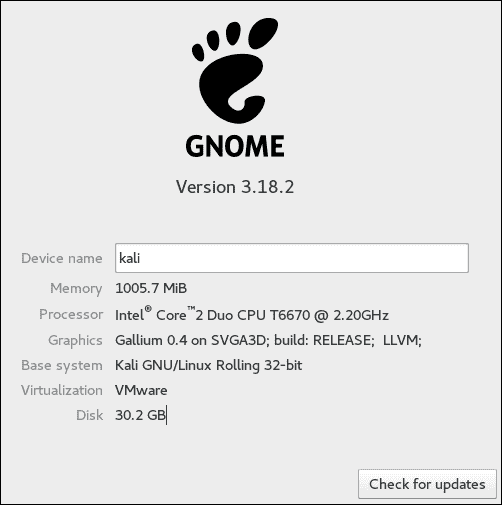

每当我们希望更新 Kali 时，只需点击**详细信息**窗口上的**检查更新**按钮。

1.  要继续并检查更新，请点击**继续**，否则点击**取消**取消更新过程。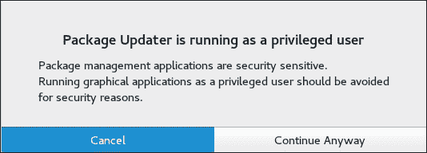

1.  如果您的系统已经是最新的，将会出现如下所示的消息。否则，可以下载可用的更新。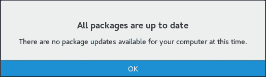

## 它是如何工作的...

当我们启动 Kali 2.0 时，桌面屏幕已经改变。现在我们在屏幕左侧有一个侧边栏，可以帮助我们轻松访问应用程序。

左上角的**应用程序**菜单包含不同类别下的所有工具。也可以通过底部边栏上的**菜单**图标访问这些应用程序。

接下来，我们可以看到 Kali 2.0 现在包括一个内置的屏幕录制工具，可以从右上角的菜单中访问。在同一个菜单中，我们现在可以选择访问系统设置菜单。

然后，我们看到检查系统更新的选项，以保持 Kali 的最新状态。

Kali 2.0 包含更新的工具，并且每天从 Debian 拉取四次更新，以确保系统始终保持最新状态，并且定期实施安全更新。

# pfSense

作为网络管理员，拥有防火墙和路由器至关重要。当我们谈论设置防火墙时，我们可以选择简单地安装来自任何供应商的预配置防火墙，也可以设置自己的防火墙系统。

pfSense 是一个基于 FreeBSD 的开源 Linux 发行版，专门设计用作防火墙，可以通过 Web 界面轻松管理。

## 准备工作

首先，从以下链接下载 pfSense：

[`www.pfsense.org/download/mirror.php?section=downloads`](https://www.pfsense.org/download/mirror.php?section=downloads)

根据您的需求选择正确的计算机架构和平台。

下载 pfSense 后，将 ISO 文件刻录到 CD/DVD 媒体，或者甚至可以创建现场可启动的 USB 媒体。

我们还需要一台具有两个网络接口卡的系统来安装和配置 pfSense。

## 操作步骤...

为了在我们自己的系统上设置和配置防火墙，我们需要安装和配置 pfSense，以下步骤可以帮助我们完成这一过程。

1.  当我们使用 pfSense CD/DVD 或 USB 设备引导系统时，将出现如下的启动画面：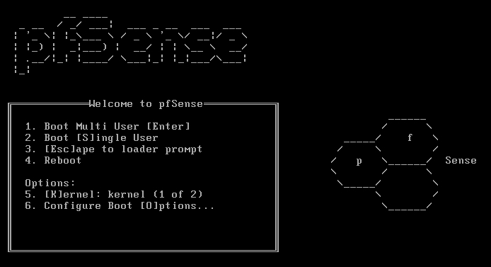

按*6*进行“配置引导选项”

1.  在下一个屏幕上，再次按*6*打开详细信息。然后，按*1*返回上一个屏幕。

回到第一个屏幕时，按*Enter*启动 pfSense。

1.  PfSense 将开始引导。在引导过程中，我们会看到一个屏幕，如下所示：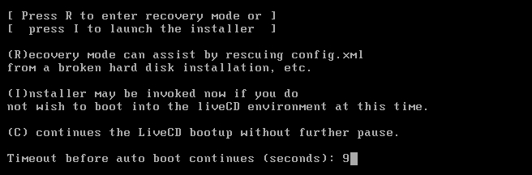

按*I*安装 pfSense。在 20 秒内快速选择该选项。

1.  下一个屏幕要求“配置控制台”。选择*接受这些设置*选项，然后按*Enter*继续。

1.  在下一个屏幕上，如果是 pfSense 新手，则选择“快速/简单安装”。否则，在安装过程中可以选择“自定义安装”以获得更高级的选项。

1.  按“确定”继续安装。安装过程现在将开始。

1.  在安装过程中，将被要求选择要安装的内核配置。选择“标准内核”，因为我们正在将 pfSense 安装在台式机或个人电脑上。如果在嵌入式平台上安装，例如路由器板，我们可以选择“嵌入式内核”选项。

1.  安装完成后，选择“重新启动”并按*Enter*完成安装。

1.  在重新启动过程中，pfSense 的默认用户名和密码将如图所示显示：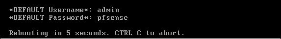

1.  重新启动后，我们现在必须根据网络配置配置我们的接口卡。两个接口的名称将如图所示显示。在您的情况下，这些名称可能不同。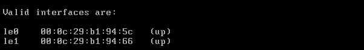

1.  现在会问您“是否要立即设置 VLAN”。此时输入`n`表示“否”。

1.  现在我们需要输入要用于 WAN 的接口名称。在我们的情况下，它是`le0`。根据您的配置输入名称。

接下来，输入要用于 LAN 的接口名称。在我们的示例中，它是`le1`。

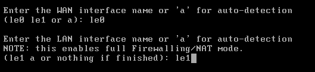

然后，按`Y`继续设置。

1.  设置完接口后，我们将得到如下所示的 pfSense 菜单：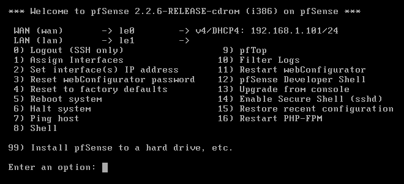

1.  如果到这一步为止 WAN 和 LAN 接口的 IP 地址没有正确设置，我们可以通过从前面的菜单中选择选项`2`来手动设置 IP 地址。

1.  选择要配置的接口，然后为其提供 IP 地址：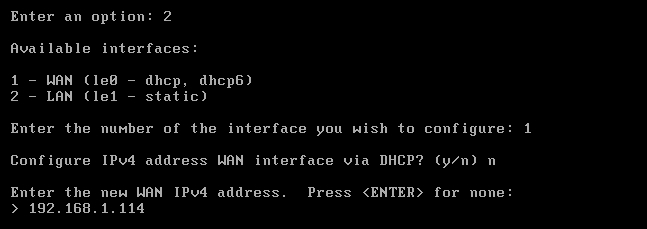

1.  接下来，输入子网和默认网关：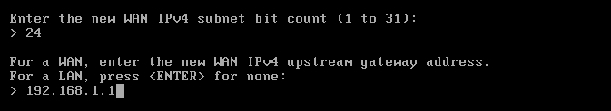

1.  按照相同的步骤为 LAN 接口进行操作。完成后，屏幕上会显示一个链接，可用于访问 pfSense 的`webConfigurator`界面。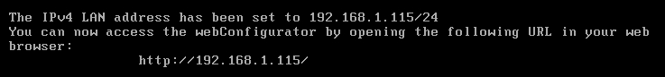

在我们的情况下，它是—`http://192.168.1.115`

1.  现在，从与 pfSense 系统相同的本地网络上的任何系统的浏览器中访问前面的链接。访问链接后，我们会得到一个登录屏幕，如图所示：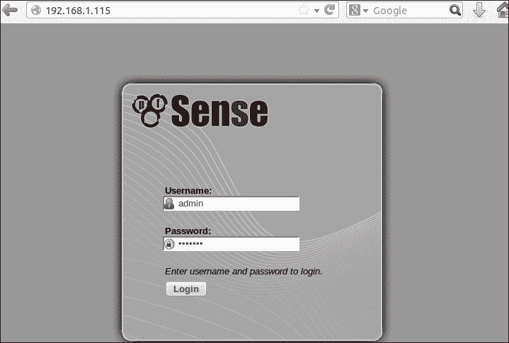

输入默认用户名`admin`和默认密码`pfsense`进行登录。登录后可以随后更改这些详细信息。

1.  成功登录后，我们会得到 pfSense 的主要仪表板。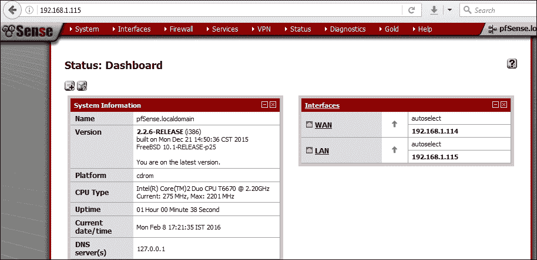

## 工作原理...

我们从 pfSense CD/DVD 启动，然后选择在我们的系统上安装操作系统的选项。

要安装 pfSense，我们在启动时使用选项`I`，然后使用`Quick/Easy Install`。安装完成后，我们设置两个接口卡。第一张卡根据外部网络进行配置，使用菜单中的`设置接口 IP 地址`选项。然后，我们配置 IP 地址、子网和网关地址。

接下来，我们为第二张卡重复相同的过程，根据本地网络进行配置。

配置完成后，我们可以使用第二张卡的 IP 地址从同一网络系统上的任何浏览器访问 pfSense 的 Web 界面，并根据我们的要求自定义我们的路由器/防火墙。

# DEFT – 数字取证和取证工具包

在进行计算机取证时，重要的是使用的软件能够确保文件结构的完整性。它还应该能够分析正在调查的系统，而不会对数据进行任何更改、删除或更改。

**DEFT**是为取证而设计的，基于**Lubuntu**，后者本身又基于 Ubuntu。

## 准备就绪

DEFT 可以从这个链接下载：

[`www.deftlinux.net/download/`](http://www.deftlinux.net/download/)

下载后，我们可以将映像文件刻录到 CD/DVD 媒体上，或者创建一个可引导的 USB 媒体。

## 操作步骤...

要使用 DEFT，我们需要了解 OS 中包含了什么：

1.  一旦我们启动 DEFT CD/DVD 或 USB 媒体，我们就会得到启动屏幕。首先，我们需要选择语言。完成后，我们可以选择运行 DEFT live，或者我们可以在我们的系统上安装 DEFT。

1.  在我们的示例中，我们选择了启动 DEFT live。启动完成后，我们会得到 DEFT 的主屏幕。

1.  现在，让我们了解 DEFT 中提供的不同工具。

1.  在开始菜单中，**DEFT**下的第一个子菜单包含各种**分析**工具的列表。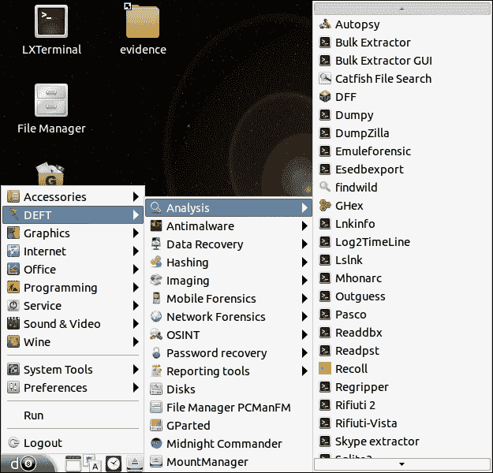

1.  下一个子菜单显示所有反恶意软件工具：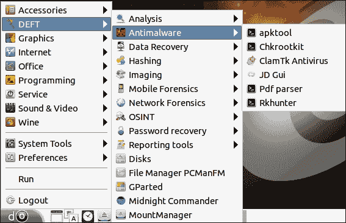

1.  然后，我们有与**数据恢复**相关的工具子菜单。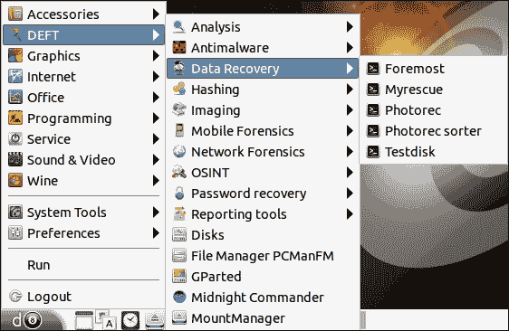

1.  下一个子菜单包含一系列不同的哈希工具，可用于检查和比较任何文件的哈希。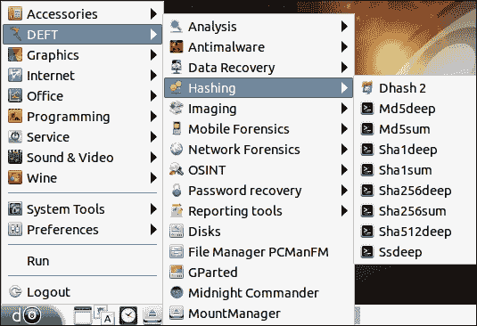

1.  在下一个子菜单中，我们获得了用于成像的工具。这些工具可在取证调查期间用于创建需要调查的系统磁盘的映像。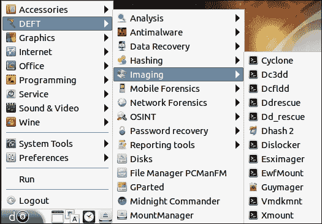

1.  随着 DEFT 7 的发布，还添加了用于分析移动设备的工具。这些可以在子菜单**移动取证**下找到：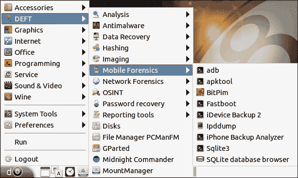

1.  下一个子菜单包含**网络取证**工具。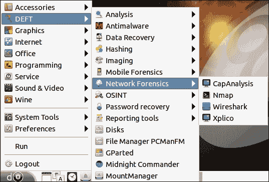

1.  下一个菜单 OSINT 包含开源情报工具。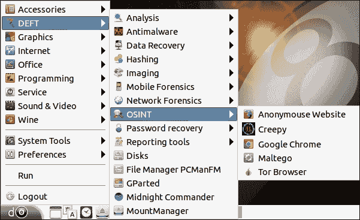

1.  DEFT 还包含**密码恢复**工具，可以在下一个子菜单中找到。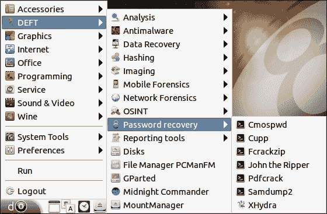

1.  除了前面提到的工具类别，DEFT 还包含一些报告工具，这些工具在创建报告时可能会有用。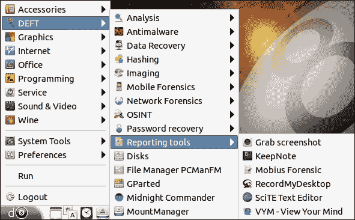

1.  DEFT 使用 WINE 在 Linux 下执行 Windows 工具，WINE 选项可以在主菜单下找到。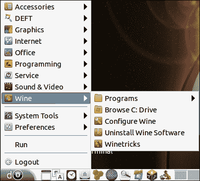

## 工作原理...

我们可以安装 DEFT，或者使用 Live CD 选项将其引导到我们的系统上。引导后，我们转到开始菜单，然后转到 DEFT 菜单。在这里，我们可以在不同类别下找到各种工具。我们可以使用分析工具、数据恢复工具、移动取证工具、网络取证工具等。

DEFT 中使用 WINE 在此执行 Windows 应用程序。

# NST - 网络安全工具包

Linux 有许多发行版主要用于渗透测试。其中之一是**网络安全工具包**（**NST**），它旨在提供易于访问的开源网络安全应用程序。

NST 基于 Fedora Linux，包含专业人员和网络管理员的工具。

## 准备工作

NST 可以从其网页或直接从此链接下载：

[`sourceforge.net/projects/nst/files/`](http://sourceforge.net/projects/nst/files/)

下载后，我们可以将 ISO 刻录到 CD/DVD 上，或创建一个可启动的 USB 媒体。

## 操作步骤...

当我们了解如何使用操作系统以及操作系统中包含的工具时，使用 NST 进行渗透测试变得很容易：

1.  要使用 NST，第一步是使用 NST 引导系统。我们可以选择使用实时选项引导，也可以直接在系统上安装 NST。在我们的示例中，我们选择了实时引导选项。您可以根据自己的需求选择任何选项。引导完成后，我们会得到 NST 的默认桌面，如下所示：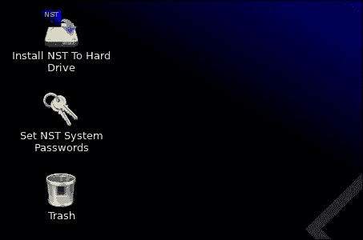

1.  NST 配备了一个 Web 用户界面，这是一个控制面板，可以用来对 NST 进行任何操作。但是，只有在现有用户帐户设置了密码时才能访问。要设置密码，我们点击桌面上的**设置 NST 系统密码**图标。这将打开一个终端窗口，并给您创建新密码的选项：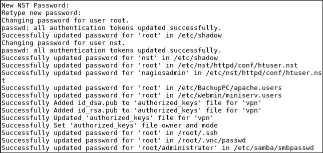

1.  设置密码后，我们可以从我们选择的任何浏览器访问 NST Web 用户界面。要在本地系统上访问，我们可以使用地址`http://127.0.0.1:9980/nstwui`。

如果从本地网络上的其他系统访问，则使用运行 NST 的系统的 IP 地址。

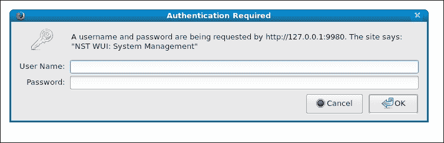

打开链接后，我们会提示输入用户名和密码。输入详细信息，然后点击**确定**。

1.  现在我们看到了 NSTWUI 的登录页面。在左上角，我们可以看到运行 NST 的系统的详细信息。在此下方，我们有 NST 的菜单。

我们还可以在右上角看到系统运行时间的信息。

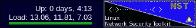

1.  NST 配备了各种工具，其中之一是**bandwidthd**。该工具显示了网络使用情况的概述，我们可以通过转到菜单**网络** | **监视器** | **bandwidthd UI**来启用它：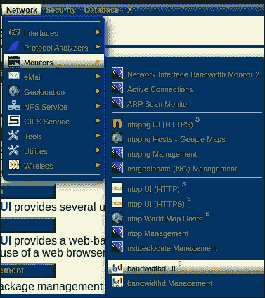

1.  一旦我们点击“**启动 Bandwidthd**”，该工具将开始运行。

1.  另一个可用的重要功能是使用 Web 界面通过 SSH 执行远程活动。转到菜单**系统** | **控制管理** | **运行命令**。

将打开一个窗口，如下图所示。我们可以在这里运行任何命令。

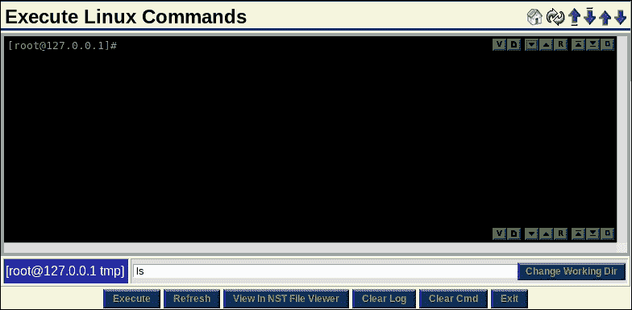

1.  NSTWUI 还允许管理员通过 Web 界面远程重新启动或关闭服务器。要这样做，转到菜单**系统** | **控制管理** | **重新启动**。

1.  点击**继续重新启动此 NST 系统**以确认。否则，点击**退出**取消。

1.  在下一个屏幕中，输入所示的文本，然后按**确定**。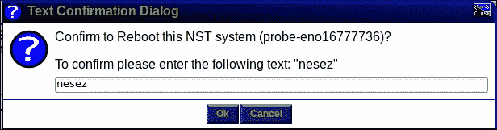

## 它是如何工作的...

安装或引导 NST 后，第一步是为现有用户帐户设置密码。这是通过使用*设置 NST 系统密码*选项完成的。

设置密码后，我们通过任何浏览器访问系统的 IP 地址来通过 Web 用户界面访问 NST。

登录 NSTWUI 后，我们会得到与网络安全相关的各种工具列表。

我们探索了一些工具，如 bandwidthd 和 SSH。

# 螺旋

在进行取证分析时，我们必须以分钟级别查看文件系统，并分析许多事情，如程序的执行，文件的下载，文件的创建等。

在这种情况下，最好在分析开始时创建磁盘的取证镜像。Helix 是创建这种镜像的最佳选择。

Helix 是用于取证调查和事件响应的基于 Linux 的 Live CD。

## 准备工作

Helix 有免费和商业形式，其免费版本可以从以下链接下载：

[`www.e-fense.com/products.php`](http://www.e-fense.com/products.php)

下载后，我们可以将映像文件刻录到 CD/DVD 上，或者我们可以创建可引导的 USB 介质。

## 如何做？

为了演示 Helix 的使用，我们可以将其安装在我们的系统上，或者我们可以使用 Live CD/DVD 或 USB 介质，如下所示：

1.  要使用 Helix，我们使用 Helix 的 Live CD 引导系统。从出现的第一个屏幕中，我们选择**引导到 Helix Live CD**选项直接引导 Helix。但是，如果您希望在系统上安装 Helix，则可以使用**安装 Helix**选项。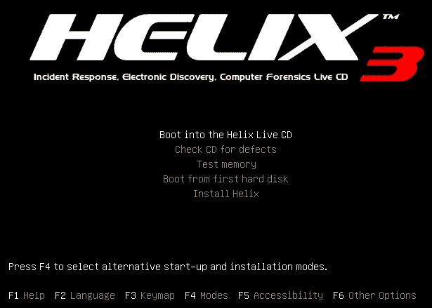

1.  现在，事件响应期间执行的第一步是创建硬盘/存储的镜像，以便以后进行调查。要创建硬盘的逐位复制，我们将使用 Helix 中提供的名为**Adepto**的工具。

1.  要打开**Adepto**，请转到开始菜单，然后在**取证与 IR**下找到该工具。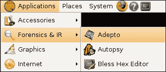

1.  当 Adepto 启动时，我们会得到应用程序的主屏幕。我们可以输入用户名或留空，然后点击**Go**继续。

1.  下一个屏幕显示了我们想要复制的设备的信息。从下拉菜单中选择设备，我们可以得到有关该设备的所有信息。在我们的情况下，我们已经选择了要复制的 USB 设备。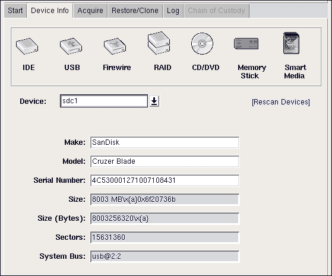

1.  现在我们点击顶部的**获取**选项卡继续。现在我们需要提供源和目的地信息。完成后，按**开始**继续：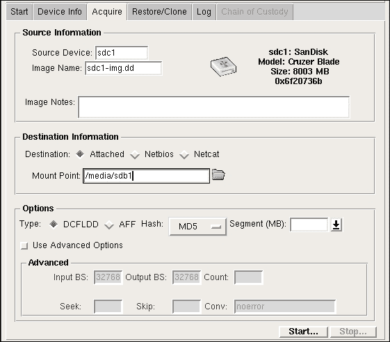

1.  一旦点击**开始**，我们可以在开始按钮下方看到进度，如下所示：

1.  可以通过点击**日志**选项卡来检查日志中的过程细节。在日志中，我们可以看到源图像的哈希验证与我们的设备成功。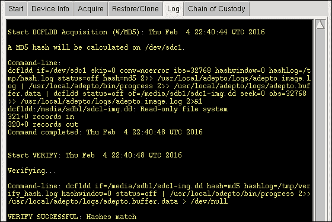

1.  现在，下一步是克隆我们想要调查的 USB 设备。为此，我们点击**恢复/克隆**选项卡。输入源和目的地，然后按**克隆**开始：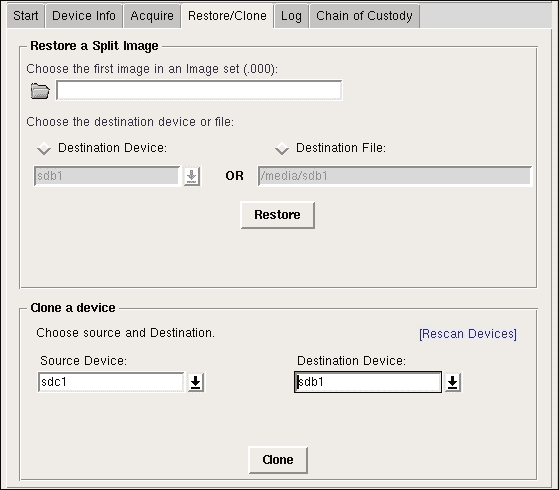

1.  我们将看到底部发生的进度。克隆过程需要时间，这也可能取决于正在复制的磁盘的大小以及系统的处理能力：

1.  克隆完成后，我们可以验证两个设备中的数据。我们可以看到我们在第二个 USB 设备中克隆的设备的精确图像。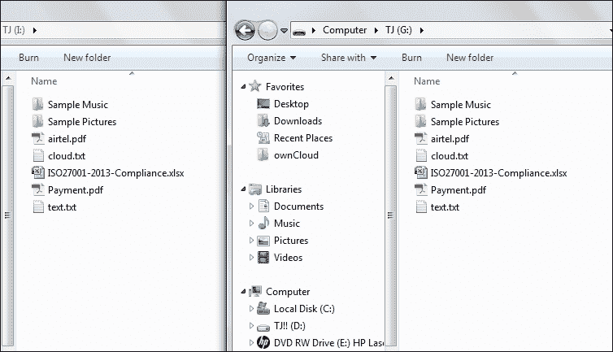

1.  Adepto 为我们提供了创建有关克隆过程中发生的事件的 PDF 报告的选项。

为此，请点击“责任链”选项卡，然后在底部点击“创建 PDF”。

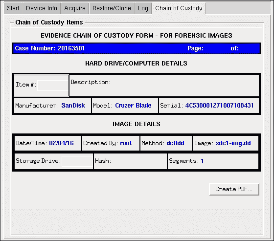

## 工作原理是...

Helix 用于法证调查，在此过程中，一个重要的任务是创建被分析的硬盘的法证镜像。

我们已经通过 Adepto 工具了解了按照前面的步骤创建 USB 设备镜像的过程。
