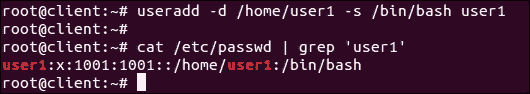
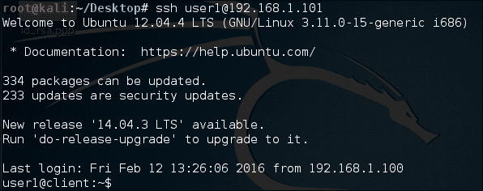
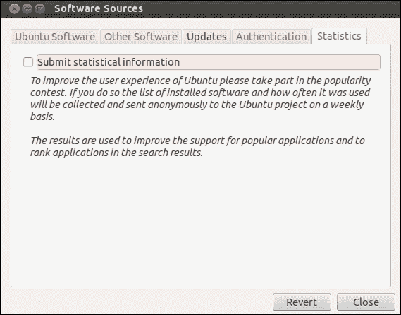

# 第九章：修补 Bash 漏洞

在本章中，我们将学习以下概念：

+   通过 Shellshock 了解 bash 漏洞

+   Shellshock 的安全问题

+   补丁管理系统

+   在 Linux 系统上应用补丁

# 通过 Shellshock 了解 bash 漏洞

Shellshock，或者称为 Bashdoor，是 Linux 和 Unix 操作系统中大多数版本中使用的漏洞。它于 2014 年 9 月 12 日被发现，影响使用 bash shell 的所有 Linux 发行版。Shellshock 漏洞使得可以使用环境变量远程执行命令。

## 准备工作

要理解 Shellshock，我们需要一个使用早于 4.3 版本的 bash 的 Linux 系统，该版本容易受到此漏洞的影响。

## 如何做…

在本节中，我们将看看如何设置我们的系统以了解 Shellshock 漏洞的内部细节：

1.  第一步是检查 Linux 系统上 bash 的版本，以便我们可以确定我们的系统是否容易受到 Shellshock 的影响。要检查 bash 的版本，我们运行以下命令：

从 4.3 版本开始的 Bash 版本据报告易受 Shellshock 影响。在我们的示例中，我们使用的是 Ubuntu 12.04 LTS 桌面版本。从前面的图像输出中，我们可以看到这个系统是有漏洞的。

1.  现在，让我们检查漏洞是否真的存在。为此，我们运行以下代码：

一旦运行了上述命令，如果输出中打印了`shellshock`，则漏洞已确认。

1.  让我们了解漏洞的内部情况。为此，我们首先需要了解 bash shell 的变量基础知识。

1.  如果我们想在 bash 中创建一个名为`testvar`的变量，并将`shellshock`值存储在其中，我们运行以下命令：

```
testvar=""shellshock''

```

现在，如果我们想要打印这个变量的值，我们可以使用`echo`命令，如下所示：

```
echo $testvar

```

1.  我们将通过运行`bash`命令打开一个 bash 的子进程。然后，我们再次尝试在子进程中打印`testvar`变量的值：

当我们尝试在子进程中打印该值时，我们看不到任何输出。

1.  现在，我们将尝试使用 bash 的环境变量重复上述过程。当我们启动一个新的 bash shell 会话时，一些变量可供使用，这些被称为**环境变量**。

1.  将我们的`testvar`变量设置为环境变量，我们将对其进行导出。一旦导出，我们也可以在子 shell 中使用它，如下所示：

1.  当我们定义变量并导出它们时，同样地，我们可以定义一个函数并导出它，以便在子 shell 中使用。以下步骤显示了如何定义一个函数并导出它：

在上面的例子中，`x`函数已被定义，并且已使用`-f`标志导出。

1.  现在，让我们定义一个新变量，命名为`testfunc`，并为其赋值，如下所示：

```
testfunc=''() { echo ''shellshock'';}''

```

上述变量可以像普通变量一样访问：

```
echo $testfunc

```

接下来，我们将导出这个变量，使其成为一个环境变量，然后尝试从子 shell 中访问它，如下所示：


在前面的结果中发生了一些意外的事情。在父 shell 中，该变量被视为普通变量。然而，在子 shell 中，它被解释为一个函数，并执行函数体。

1.  接下来，我们将终止函数的定义，然后将任意命令传递给它。

在上面的例子中，一旦我们启动一个新的 bash shell，定义在函数外部的代码将在 bash 启动时执行。

这是 bash shell 中的漏洞。

## 工作原理…

我们首先检查系统上运行的 bash 版本。然后，我们运行一个众所周知的代码来确认 Shellshock 漏洞是否存在。

为了了解 Shellshock 漏洞是如何工作的，我们在 bash 中创建一个变量，然后尝试将其导出到子 shell 并在那里执行。接下来，我们尝试创建另一个变量，并将其值设置为`''() { echo ''shellshock'';}''`。这样做后，当我们将这个变量导出到子 shell 并在那里执行时，我们会看到它在子 shell 中被解释为一个函数并执行其中的内容。

这就是使 bash 容易受到 Shellshock 影响的地方，特别设计的变量可以在 bash 启动时用来运行任何命令。

# Shellshock 的安全问题

在这个几乎所有东西都在线的时代，在线安全是一个重要的问题。如今，许多 Web 服务器、Web 连接设备和服务都使用 Linux 作为平台。大多数 Linux 版本使用 Unix bash shell，因此*Shellshock*漏洞可能会影响大量的网站和 Web 服务器。

在上一个步骤中，我们详细了解了 Shellshock 漏洞。现在，我们将了解如何通过 SSH 利用这个漏洞。

## 准备工作

要利用 Shellshock 漏洞，我们需要两个系统。第一个系统将被用作受害者，并且应该容易受到 Shellshock 的影响。在我们的情况下，我们将使用 Ubuntu 系统作为易受攻击的系统。第二个系统将被用作攻击者，并且可以运行任何 Linux 版本。在我们的情况下，我们将在第二个系统上运行 Kali。

受害系统将运行`openssH-server`软件包。可以使用以下命令进行安装:

```
apt-get install openssh-server

```

我们将配置此系统为易受攻击的 SSH 服务器，以展示如何利用 Shellshock 漏洞。

## 如何操作...

要了解 Shellshock 漏洞如何被用来利用 SSH 服务器，我们需要首先将我们的 SSH 服务器配置为易受攻击的系统。为此，我们将按照以下步骤进行：

1.  第一步是在 SSH 服务器系统上添加一个名为`user1`的新用户账户。我们还将`/home/user1`添加为其主目录，`/bin/bash`作为其 shell:

添加完账户后，我们通过检查`/etc/passwd`文件进行交叉检查。

1.  接下来，我们在`/home`中为`user1`创建一个目录，并将该目录的所有权授予`user1`账户。

1.  现在，我们需要通过授权密钥来验证攻击者登录到 SSH 服务器。为此，我们将首先在攻击者的系统上使用以下命令生成这些授权密钥:

我们可以看到公钥/私钥已经生成。

1.  生成授权密钥后，我们将通过 SFTP 将公钥发送到远程 SSH 服务器。首先，我们将`id_rsa.pub`公钥文件复制到`桌面`，然后运行连接到 SSH 服务器的 SFTP 命令。

连接后，我们使用`put`命令传输文件。

1.  在受害者 SSH 服务器系统上，我们在`/home/user1/`目录下创建一个`.ssh`目录，然后将`id_rsa.pub`文件的内容写入到`/home/user1/.ssh/`目录下的`authorized_keys`文件中:

1.  之后，我们编辑 SSH 的配置文件`etc/ssh/sshd_config`，并启用`PublicKeyAuthentication`变量。我们还检查`AuthorizedKeysFile`是否已经正确指定:

1.  在成功完成上述步骤后，我们可以尝试从攻击者系统登录到 SSH 服务器，以检查是否会提示输入密码:

1.  现在，我们将创建一个基本脚本，如果用户尝试传递`date`命令作为参数，它将显示**restricted**消息。但是，如果传递的不是`date`，它将被执行。我们将把这个脚本命名为`sample.sh`：

1.  创建脚本后，我们运行以下命令为其赋予可执行权限：

```
chmod +x sample.sh

```

1.  之后，我们在`authorized_keys`文件中使用`command`选项运行我们的`sample.sh`脚本，通过添加脚本的路径，如下所示：

在`authorized_keys`文件中进行上述更改，以限制用户执行预定义的一组命令，将使公钥认证变得脆弱。

1.  现在，从攻击者的系统中，尝试通过 SSH 连接到受害系统，同时传递`date`作为参数。

我们可以看到**restricted**消息被显示出来，因为我们将脚本添加到了`authorized_keys`文件中。

1.  接下来，我们尝试将我们的 Shellshock 漏洞利用作为参数传递，如下所示：

我们可以看到，尽管我们在脚本中限制了`date`命令，但这次它被执行了，并且我们得到了`date`命令的输出。

让我们看看如何利用 Shellshock 漏洞来 compromise 一个运行任何可以触发带环境变量的 bash shell 的 Apache 服务器：

1.  如果受害系统上尚未安装 Apache，我们首先使用此命令安装它：

```
apt-get install apache2

```

安装完成后，我们使用此命令启动 Apache 服务器：

```
service apache2 start

```

1.  接下来，我们转到`/usr/lib/cgi-bin/`路径，并创建一个`example.sh`脚本，其中包含以下代码，以显示一些 HTML 输出：

然后，我们通过运行此命令使其可执行：

```
chmod +x example.sh

```

1.  从攻击者的系统中，我们尝试使用名为**curl**的命令行工具远程访问`example.sh`文件：

我们得到了预期的脚本输出，即`Example Page`。

1.  现在，让我们使用 curl 发送一个恶意请求到服务器，以打印受害系统的`/etc/passwd`文件的内容，通过运行此命令：

```
curl -A ''() { :;}; echo ""Content-type: text/plain""; echo; /bin/cat /etc/passwd http://192.168.1.104/cgi-bin/example.sh

```


我们可以在攻击者的系统中看到输出，显示了受害系统如何可以使用 Shellshock 漏洞进行远程访问。在上述命令中，`() { :;} ;`表示一个看起来像函数的变量。在这段代码中，函数是一个单独的`:`，它什么也不做，只是一个简单的命令。

1.  我们尝试另一个命令，如下所示，来查看受害系统当前目录的内容：

我们在上述输出中看到了受害系统的`root`目录的内容。

## 工作原理…

在我们的 SSH 服务器系统上，我们创建一个新的用户账户，并将 bash shell 分配为其默认 shell。我们还在`/home`中为这个新用户账户创建一个目录，并将其所有权分配给这个账户。

接下来，我们配置我们的 SSH 服务器系统来认证另一个系统，使用授权密钥连接到它。

然后，我们创建一个 bash 脚本来限制特定命令，比如`date`，并将此脚本路径添加到`authorized_keys`中使用`command`选项。

之后，当我们尝试从之前配置了授权密钥的其他系统连接到 SSH 服务器时，我们会注意到，如果我们在连接时传递`date`命令作为参数，该命令会受到限制。

然而，当使用 Shellshock 漏洞传递相同的`date`命令时，我们看到了`date`命令的输出，从而显示了 Shellshock 如何被用来利用 SSH 服务器。

类似地，我们通过创建一个示例脚本并将其放置在 Apache 系统的`/usr/lib/cgi-bin`目录中来利用 Apache 服务器。

然后，我们尝试使用 curl 工具从另一个系统访问这个脚本。

您会注意到，如果我们通过 curl 访问脚本时传递了**Shellshock exploit**，我们可以远程在 Apache 服务器上运行我们的命令。

# 补丁管理系统

在当前的计算场景中，漏洞和补丁管理是一个永无止境的循环的一部分。当计算机因已知漏洞而受到攻击以被利用时，这种漏洞的补丁已经存在；然而，它尚未正确地在系统上实施，从而导致攻击。

作为系统管理员，我们必须知道哪个补丁需要安装，哪个应该被忽略。

## 准备工作

由于可以使用 Linux 的内置工具进行补丁管理，因此在执行这些步骤之前不需要配置特定的设置。

## 操作步骤

保持系统更新的最简单和最有效的方法是使用内置的更新管理器，该管理器内置在 Linux 系统中。在这里，我们将探讨 Ubuntu 系统中更新管理器的工作原理：

1.  要在 Ubuntu 中打开**更新管理器**的图形版本，请点击左侧工具栏上的**Superkey**，然后输入**update**。在这里，我们可以看到**更新管理器**：

1.  当我们打开**更新管理器**时，会出现以下对话框，显示可用于安装的不同安全更新：

选择要安装的更新，然后单击**安装更新**以继续。

1.  在同一个窗口中，我们在左下角有一个**设置**按钮。当我们点击它时，会出现一个新的**软件源**窗口，其中有更多选项可以配置**更新管理器**。

1.  第一个选项卡是**Ubuntu 软件**，它显示了下载更新所需的存储库列表。我们根据自己的需求从列表中选择选项：

1.  如果我们点击**从...下载**选项，我们会得到一个选项来更改用于下载的存储库服务器。如果我们连接到当前选择的服务器存在任何问题或服务器速度慢，这个选项是有用的。

1.  从下拉列表中，当我们选择**其他...**选项时，我们会得到一个服务器选择列表，如下图所示：

1.  接下来的**其他软件**选项卡用于添加 Canonical 的合作伙伴存储库：

1.  我们可以从前面的图像中选择任何选项，并单击**编辑**以更改存储库详细信息，如下所示：

1.  **更新**选项卡用于定义 Ubuntu 系统如何接收更新以及何时接收更新：

1.  **身份验证**选项卡包含有关软件提供者的身份验证密钥的详细信息，这些信息是从软件存储库的维护者那里获得的：

1.  最后一个选项卡是**统计信息**，适用于希望匿名向 Ubuntu 开发者项目提供数据的用户。这些信息有助于开发人员提高软件的性能和改善用户体验。

1.  在这些选项卡中进行任何更改后，当我们点击**关闭**时，会提示我们确认是否应该在列表中显示新的更新。点击**重新加载**或**关闭**：

1.  如果我们想要检查更新管理器从中检索所有软件包的位置列表，我们可以检查`/etc/apt/sources.list`文件的内容。然后我们会得到这个结果：

## 工作原理

要更新我们的 Linux 系统，我们使用内置的更新管理器，根据 Linux 发行版。

在更新管理器中，我们可以安装所有可用的更新，或者根据我们的需求使用**设置**窗口进行配置。

在**设置**窗口中，我们有选项来显示可以下载更新的存储库列表。

**设置**窗口中的第二个选项卡让我们添加 Canonical 的第三方合作伙伴存储库。

使用下一个选项卡，我们可以指定何时以及何种类型的更新应该被下载。

我们还使用设置窗口检查软件提供商的身份验证密钥。

最后一个选项卡**统计**，帮助将数据发送给 Ubuntu 项目开发人员，以改进软件的性能。

# 在 Linux 系统上应用补丁

每当在任何软件中发现安全漏洞时，都会为该软件发布安全补丁，以便修复错误。通常，我们使用内置于 Linux 中的 Update Manager 来应用安全更新。但是，对于通过编译源代码安装的软件，Update Manager 可能不太有用。

对于这种情况，我们可以将补丁文件应用到原始软件源代码上，然后重新编译软件。

## 准备工作

由于我们将使用 Linux 的内置命令来创建和应用补丁，在开始以下步骤之前不需要做任何事情。我们将创建一个 C 语言的示例程序来了解创建补丁文件的过程。

## 如何做...

在本节中，我们将看看如何使用`diff`命令为程序创建补丁，然后我们将使用`patch`命令应用补丁。

1.  第一步将是创建一个简单的 C 程序，名为`example.c`，打印`This is an example`，如下所示：

1.  现在，我们将创建`example.c`的副本，并将其命名为`example_new.c`。

1.  接下来，我们编辑新的`example_new.c`文件，向其中添加一些额外的代码行，如下所示：

1.  现在，`example_new.c`可以被视为`example.c`的更新版本。

1.  我们将使用`diff`命令创建一个名为`example.patch`的补丁文件：

1.  如果我们检查补丁文件的内容，我们会得到这个输出：

1.  在应用补丁之前，我们可以使用`-b`选项备份原始文件。

你会注意到一个新的`example.c.orig`文件已经被创建，这是备份文件。

1.  在实际打补丁之前，我们可以先运行补丁文件的干跑来检查是否有任何错误。为此，我们运行以下命令：

如果我们没有收到任何错误消息，这意味着补丁文件现在可以在原始文件上运行。

1.  现在，我们将运行以下命令来将补丁应用到原始文件上：

```
patch < example.patch

```

1.  在应用补丁后，如果我们现在检查`example.c`程序的内容，我们会看到它已经更新了一些额外的代码行，就像`example_new.c`中写的那样：

1.  一旦补丁应用到原始文件上，如果我们希望撤销它，可以使用`-R`选项来实现：

我们可以看到在打补丁后文件的大小差异。

## 它是如何工作的...

我们首先创建一个示例 C 程序。然后，我们创建它的副本，并添加几行代码以使其成为更新版本。之后，我们使用`diff`命令创建一个补丁文件。在应用补丁之前，我们通过干跑来检查是否有任何错误。

如果我们没有错误，我们使用 patch 命令应用补丁。现在，原始文件将具有与更新版本文件相同的内容。

我们也可以使用`-R`选项来撤销补丁。
