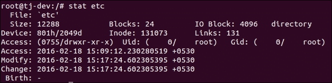
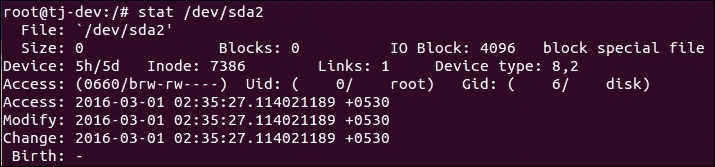
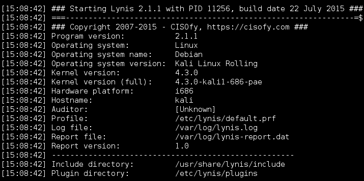

# 第十章：安全监控和日志记录

在本章中，我们将讨论以下主题：

+   使用 Logcheck 查看和管理日志文件

+   使用 Nmap 监视网络

+   使用 glances 进行系统监控

+   使用 MultiTail 监视日志

+   使用系统工具 - Whowatch

+   使用系统工具 - stat

+   使用系统工具 - lsof

+   使用系统工具 - strace

+   使用 Lynis

# 使用 Logcheck 查看和管理日志文件

作为管理员，在检查系统或任何软件问题上的恶意活动时，日志文件起着非常重要的作用。然而，随着软件数量的增加，创建的日志文件数量也在增加。这使得管理员很难正确分析日志文件。

在这种情况下，Logcheck 是一个很好的工具，可以帮助管理员分析和扫描日志文件。Logcheck 根据其文档扫描*有趣的行*的日志。这些行主要是指工具检测到的安全问题。

## 准备工作

在 Linux 系统上使用 Logcheck 不需要特定的要求。

## 如何操作…

在本节中，我们将看看如何根据我们的要求安装和配置 Logcheck：

1.  第一步是使用以下屏幕截图中显示的命令安装软件包：

1.  在安装过程中，将打开一个窗口，并显示有关选择邮件服务器配置类型的信息，如下面的屏幕截图所示：

1.  单击**确定**继续。

1.  在下一个窗口中，选择**Internet Site**，然后选择**确定**继续。

1.  安装完成后，我们需要对`/etc/logcheck/logcheck.conf`配置文件进行更改。

1.  在配置文件中要编辑的第一件事是日期/时间戳的格式，该格式用于 Logcheck 发送的邮件的主题。

1.  接下来，我们可以更改`REPORTLEVEL`变量的值，以便根据我们的要求控制日志的过滤。我们有三个选项可用，而默认情况下，该值设置为`server`。

`workstation`值过滤了大部分消息，不太冗长。`paranoid`值对于安全性很高的系统很有用。它尽可能少地运行服务，并且更冗长。

1.  之后，我们更改`SENDMAILTO`变量的值，并向其提供我们的电子邮件地址，以便在我们的电子邮件 ID 上接收日志。

1.  Logcheck 生成的邮件对不同的事件使用不同的主题行。如果我们希望修改这些主题行，我们可以编辑这里显示的变量的值：

1.  默认情况下，Logcheck 使用`/etc/logcheck/logcheck.logfiles`文件来维护要由其监视的日志文件列表。如果我们希望使用任何其他文件来定义列表，并且它位于另一个位置，我们可以编辑`RULEDIR`变量以定义新路径。

1.  如果我们希望 Logcheck 监视除`/etc/logcheck/logcheck.logfiles`文件中已定义的任何特定文件之外的文件，我们可以在其中添加一个条目，如下所示：

1.  在上述文件中，我们添加了`/var/log/boot.log`行。

## 工作原理…

我们首先安装 Logcheck 软件包，安装后，我们编辑其配置`/etc/logcheck/logcheck.conf`文件。

在配置文件中，我们通过修改`REPORTLEVEL`变量来更改日志的日期/时间戳格式和过滤。

接下来，我们编辑`SENDMAILTO`变量，并输入我们的电子邮件 ID 以接收日志。

使用`etc/logcheck/logcheck.logfiles`文件，我们定义要由 Logcheck 监视的日志。

# 使用 Nmap 监视网络

对于任何规模的网络，网络监控和安全都是非常重要的任务。定期监视网络对于保护系统免受攻击以及防止病毒和恶意软件进入网络都很重要。

**Nmap**，即**网络映射器**，是一个免费开源的工具，用于监视网络，是系统/网络管理员使用的最多功能的工具。Nmap 可用于执行安全扫描，探索网络，在远程系统上查找开放端口，并执行网络审计。

## 准备工作

为了展示 Nmap 的工作原理，我们需要至少两个系统来形成一个小型网络。在一个系统上，我们将安装`nmap`软件包，而另一个系统将用作扫描的主机。

## 如何操作...

在本节中，我们将看看如何使用 Nmap 执行不同类型的扫描。

1.  第一步将是安装`nmap`软件包，如果尚未安装。为此，我们使用这个命令：

```
apt-get install nmap

```

运行上述命令后，我们得到以下输出：


1.  要使用 Nmap 执行简单的扫描，我们可以使用要扫描的系统的主机名或 IP 地址。执行简单扫描的命令将如下所示：

1.  在前面的示例中，我们正在扫描的系统的 IP 地址是`192.168.1.105`。在扫描结果中，我们可以看到目标系统正在端口`3306`上运行 MySQL 数据库服务器。

1.  Nmap 也可以用来扫描我们自己的系统。为了这样做，我们可以运行这个命令：

```
nmap localhost

```

运行上述命令后，我们得到以下输出：


1.  如果我们想用同一个命令扫描多个系统，我们可以这样做，如下所示：

```
nmap 192.168.1.105 192.168.1.102

```

我们可以在以下输出中看到两个系统的扫描结果：


1.  我们可以使用 Nmap 来扫描特定的网络，并使用以下命令检查网络中哪些系统正在运行：

```
nmap -sP 192.168.1.0/24

```

当我们使用`-sP`选项进行扫描时，`nmap`会跳过端口检测和其他内容。它只是通过简单的 ping 检查哪些系统正在网络中运行。


1.  如果我们只想将我们的扫描限制在特定端口上，我们可以告诉`nmap`只扫描该端口，使用`-p`选项，如下所示：

在上面的示例中，我们扫描了端口`22`和`80`，分别是 SSH 服务和 HTTP（Web 服务器）服务的默认端口。正如我们在上面的结果中看到的，远程系统正在运行 SSH；然而，HTTP 端口是关闭的。因此，没有运行 Web 服务器。

1.  在对目标系统进行扫描时，确定系统上的操作系统非常重要，因为针对特定操作系统平台有许多漏洞利用。为了知道目标系统的操作系统，我们使用`-O`选项，如下所示：

```
nmap -O 192.168.1.105

```

以下图像中显示的结果告诉我们，目标系统正在运行 Windows 7 Ultimate 版本：


1.  我们已经看到，使用`-p`选项，我们可以检查哪个特定端口是开放的。现在，假设目标系统的端口`22`是开放的，这意味着系统上正在运行 SSH。如果我们现在想要检查远程系统上 SSH 服务的版本，我们可以使用`-sV`选项，如下所示：

## 工作原理...

当 Nmap 仅在一个 IP 地址上运行时，它会进行基本扫描，并告诉我们目标系统上哪些端口是开放的。通过了解开放的端口，我们可以识别系统上运行的服务。同样，Nmap 用于通过提供本地系统的 IP 地址来扫描本地系统。

Nmap 用于通过在同一命令中提供 IP 地址来同时扫描多个 IP 地址。此外，Nmap 还用于使用`-sP`选项检查网络中哪些系统正在运行。

它还可以使用`-p`选项扫描特定端口，如果使用`-O`选项，它会对目标系统进行指纹识别，告诉它正在运行的操作系统。

Nmap 也用于执行其他操作，比如识别目标系统上运行的服务的软件版本。

# 使用 glances 进行系统监控

对于管理员来说，系统监控也是通过检查运行在系统上的进程和服务来监控系统的性能。但是在屏幕上有限的空间上，有时很难获得所有的信息。在这种情况下，我们希望有一个工具，可以在有限的空间内向我们展示关于系统的最大信息，如 CPU、磁盘 I/O、内存、网络等等。

尽管我们有单独的工具来监视这些信息，但使用 Glances，管理员可以在最小的空间内看到最大量的信息。它可以根据终端窗口的大小动态调整信息。Glances 可以突出显示使用最大系统资源的程序。

## 准备工作

如果您在 Ubuntu 上安装 Glances，则建议使用 Ubuntu 13.04 及以上版本。对于其他版本的 Linux，最好使用最新版本。在我们的例子中，我们使用的是 Kali Linux 2.0。

## 如何做…

为了理解 glances 的工作原理，我们将按照这里给出的步骤进行操作：

1.  第一步是使用以下命令安装软件包：

```
apt-get install glances

```

1.  安装完成后，我们必须编辑`/etc/default/glances`文件，并将`RUN`变量的值更改为`true`，如下所示：

这样做将在系统启动时自动运行`glances`。

1.  要手动启动工具，只需运行`glances`命令。您将得到一个输出窗口，如下所示：

在前面的窗口中，我们可以看到显示的文本有不同的颜色。glances 中这些颜色代码的含义如下定义：

+   绿色：这意味着一切“正常”

+   蓝色：这种颜色表示“小心”，需要注意

+   紫色：这种颜色表示“警告”

+   红色：这指的是某事“关键”

1.  颜色代码是根据 glances 配置文件中定义的默认阈值工作的。我们可以通过编辑`/etc/glances/glances.conf`文件来更改这些阈值。

1.  默认情况下，glances 每秒刷新一次值。我们可以在运行 glances 时使用`-t`选项后面跟着秒数来更改这个值：

```
glances -t 5

```

1.  有时，我们可能无法物理访问我们的系统，但我们仍然希望监控系统的性能。Glances 可以帮助我们远程进行这项工作。为此，我们首先需要使用`-s`选项在我们的系统上启用 Glances 的客户端/服务器模式，并使用`-B`选项将其绑定到系统的 IP 地址，如下所示：

1.  现在 glances 服务器正在 IP 地址为`192.168.1.102`的系统上运行，默认情况下运行在端口`61209`上。在启用客户端/服务器模式时，如果提示输入密码，请定义您选择的任何密码。

1.  在您想要访问 glances 的远程系统上运行此命令：

```
glances -c -P 192.168.1.102

```

1.  运行此命令后，我们将得到一个窗口，如下面的屏幕截图所示，在左上角我们将看到“连接到 Kali - IP 192.168.1.102/24”，这告诉我们我们现在远程访问 glances：

1.  为了使这个命令在远程系统上工作，有必要在这个远程系统上也安装 glances。

## 工作原理…

安装 Glances 后，我们启用其在系统启动时的`自动运行`。

我们使用`glances`命令来运行它，并通过编辑`/etc/glances/glances.conf`文件来修改颜色代码的阈值值。

使用`-t`选项，我们可以修改刷新时间间隔，使用`-s`选项，我们可以启用 Glances 的客户端/服务器模式，然后使用`-c`选项和运行 Glances 的系统的 IP 地址，可以在其他系统上远程访问。

# 使用 MultiTail 监视日志

对于任何系统管理员来说，监视日志文件是一项非常繁琐的任务，如果我们必须同时参考多个日志文件来排除任何问题，那么在日志之间不断切换会变得更加困难。

对于这种情况，我们可以使用**MultiTail**工具，它可以帮助我们实时查看多个日志文件。使用 MultiTail，我们可以在单个窗口或 shell 中显示多个日志文件，并且它将实时显示日志文件的最后几行。

## 准备工作

要使用 MultiTail，我们不必在 Linux 系统上设置任何特定的内容。只需安装`multitail`软件包即可。可以使用以下命令完成：

```
apt-get install multitail

```


## 如何做…

安装了 MultiTail 工具后，我们可以使用以下命令根据需要开始使用它：

1.  如果我们想要使用`multitail`查看两个日志文件，我们将运行以下命令：

```
multitail /var/log/syslog /var/log/boot.log

```


我们可以看到屏幕已分成两部分，每个部分显示单独日志文件的内容。

1.  如果我们想要滚动查看已打开的两个文件，只需按下*b*，然后会弹出一个菜单，如下面的屏幕截图所示。从列表中，我们可以选择要详细监视的文件：

1.  在打开的新窗口中，按*gg*或*G*移动到滚动窗口的顶部或底部。要退出滚动窗口，按*q*。

1.  如果我们想要在两列中查看三个日志文件，我们可以使用以下命令：

```
multitail –s 2 /var/log/boot.log /var/log/syslog /var/log/auth.log

```


上面的屏幕截图显示了两列中的三个日志文件。

1.  MultiTail 允许我们在打开它们时为单个日志文件自定义颜色，同时将它们合并在同一个窗口中。可以使用以下命令完成：

```
multitail -ci yellow /var/log/auth.log -ci blue -I /var/log/boot.log 

```


## 工作原理…

当我们在同一命令行上提供两个日志文件的名称给 MultiTail 时，它会将这两个文件分割成两部分在同一屏幕上打开。

要使用 MultiTail 查看两个以上的日志文件，我们使用`-s`选项指定屏幕应该分割成的列数。

MultiTail 还允许我们在同一屏幕上查看多个日志文件，而无需通过颜色区分屏幕。可以使用`-ci`选项自定义颜色。

# 使用系统工具 - Whowatch

在监视网络的同时，管理员还希望监视当前登录到系统上的用户，并检查每个用户在计算机上的操作。

**Whowatch**是执行所有这些任务的完美工具。它使用简单的基于文本的界面，易于使用，并且可以显示有关用户名、用户进程以及正在使用的连接类型（如 SSH 和 telnet）的信息。

## 准备工作

由于 Whowatch 在 Linux 中不是预安装的软件包，因此我们必须安装它才能使用。安装 Whowatch 的命令如下：

```
apt-get install whowatch

```


## 如何做…

为了充分利用 Whowatch 工具，我们必须正确理解该工具的细节：

1.  要开始使用该工具，只需输入`whowatch`命令，然后会出现一个屏幕，如下所示：

上面的屏幕列出了所有已登录的用户帐户。

1.  从列表中，我们可以选择任何用户帐户，当我们按*Enter*时，我们可以看到有关用户正在运行的所有程序的信息。

1.  在同一屏幕上，我们在底部有更多选项，使用这些选项我们可以获取有关用户以及由他们运行的程序的更多信息，如下所示：

1.  在 Whowatch 的主屏幕上，我们可以看到底部的菜单。

1.  我们可以看到这里我们必须使用*F9*键来访问**菜单**选项。

1.  一旦我们按下*F9*，我们会在屏幕顶部看到一个菜单。使用键盘上的箭头键在菜单中移动。当我们选择**进程**选项卡时，我们会得到一个子菜单，其中有一个名为**KILL**信号的选项，用于运行的进程。类似地，我们可以在同一个子菜单中看到更多选项：

1.  当我们转到**视图**选项卡时，我们会得到这些选项：

1.  最后一个选项卡是**帮助**，在其中我们有**Keys**选项。

1.  当我们点击**Keys**时，它会打开一个新窗口，并显示有关用于不同任务的密钥的详细信息，如下所示：

1.  按下*s*以获取有关系统的更多信息。

1.  如果我们按*t*，我们会得到系统上所有进程的树形结构列表，如下所示：

## 工作原理

Whowatch 可以通过在命令行中简单地键入`whowatch`来启动。启动后，它会显示已登录的用户名列表。只需在任何用户名上按*Enter*即可获取有关该用户下运行的所有程序的信息。

要在 Whowatch 中访问更多选项，我们按下*F9*键进入主菜单。然后我们会得到各种选项卡，如**进程**，**视图**，**用户**，**帮助**等。

**进程**选项卡提供了管理进程的选项，而**视图**选项卡提供了搜索和查看进程的选项。**帮助**选项卡有一个选项，可以查看 Whowatch 中可用作快捷键的密钥。

我们使用不同的密钥来访问系统信息并获取所有进程的列表。

# 使用系统工具 - stat

在 Linux 上工作时，最常用的命令是`ls`，它会列出我们指定目录中的文件。但是，它只显示有关文件的少量信息。

相反，如果我们使用`stat`命令，与使用`ls`相比，我们可以获得有关文件/目录的更多信息。因为`stat`能够从其节点获取有关文件的信息，所以它能够提供更多有关文件的信息。

## 准备就绪

由于`stat`是 Linux 的内置命令，因此不需要安装其他内容即可使用它。

## 如何做…

本节将解释`stat`命令的选项和用法。使用 stat，我们可以获取特定文件或文件系统的详细状态。

1.  假设我们有一个名为`example.txt`的文件。当我们使用`ls -l`命令对此文件进行长列表时，我们会得到有关文件的信息，包括文件上次修改的时间。

然而，当我们使用`stat`命令来检查相同文件的详细信息时，它会显示有关文件的额外信息，差异如下所示：


1.  在前面的输出中，我们可以看到修改和更改时间是相同的。但访问时间已经改变。它还以`八进制`和`rwx`格式显示了权限。还显示了许多其他细节。

1.  现在，让我们将文件重命名为`sample.txt`。之后，如果我们使用`stat`检查`sample.txt`文件的详细信息，我们会看到`更改`时间已更新：

1.  假设我们有三个文件，`sample.txt`，`sample1.txt`和`sample2.txt`。如果我们想要检查每个文件的详细信息，我们可以分别使用`stat`，或者我们可以使用`stat`和通配符一起显示所有三个文件的详细信息，如下所示：

1.  我们也可以使用`stat`命令来检查目录的详细信息：

1.  在目录的情况下，我们可以看到关于链接数量的额外细节。

1.  如果我们对 Linux 的任何默认目录（例如`/etc/`）使用`stat`命令，我们会发现链接数量很大：

1.  如果我们想要查看文件系统的详细信息，不能使用`ls`。但是，`stat`也适用于文件系统。我们得到与文件系统和文件相同类型的详细信息：

1.  如果我们在检查文件系统的详细信息时使用`stat`命令的`-f`选项，它将显示文件系统的状态。

## 它是如何工作的

我们使用`stat`命令来获取有关文件的详细信息。当文件被重命名时，`stat`会告诉我们更改的时间。还可以使用`stat`命令的通配符一次获取多个文件的信息。

`stat`也适用于目录和文件系统。在文件系统的情况下，`stat`可以使用`-f`选项显示其状态。

# 使用系统工具 - lsof

有时，我们可能会遇到无法卸载磁盘的情况，因为有些文件正在使用。但是，我们可能无法理解指的是哪个文件。在这种情况下，我们可以检查系统上正在运行的进程打开了哪些文件。

这可以通过**lsof**命令来实现，它代表**列出打开的文件**。由于 Linux 将一切都视为文件，例如目录、设备、套接字等，我们可以使用`lsof`轻松识别所有打开的文件。

## 准备工作

要使用`lsof`命令，建议您从 root 帐户登录，否则，请从非 root 帐户使用`sudo`，以便`lsof`命令的输出不受限制。

## 如何做…

在本节中，我们将探讨可与`lsof`命令一起使用的不同选项，以了解其工作原理。

1.  如果我们只运行`lsof`，它将列出系统上任何活动进程拥有的所有打开文件。如果输出很长，我们可以使用`less`命令来滚动输出：

```
lsof | less

```

显示的输出以列的形式显示，例如`COMMAND`、`PID`、`USER`、`FD`、`TYPE`、`DEVICE`等，以更好地理解文件。

`FD`列包含有关文件描述的信息，例如当前工作目录（`cwd`）、根目录（`rtd`）、程序文本（`txt`）等。如果`FD`列包含`0u`、`1u`等信息；数字表示实际文件描述符，字母表示不同的模式（`读`访问、`写`访问和`读/写`访问）。


1.  要检查特定用户的所有打开文件列表，我们使用`-u`选项，后跟用户名：

```
lsof -u tajinder

```


1.  使用`lsof`，我们可以检查是否有任何进程在特定端口上运行。为此，我们必须使用`-i`选项并运行此命令：

```
lsof –i TCP:22

```


1.  在上面的示例中，我们检查了端口`22`上运行的进程列表，并且看到 SSH 进程正在运行。

1.  如果我们想要检查系统上打开文件的确切数量，可以运行此命令：

在上面的示例中，有很多打开的文件，具体为 5220 个。

1.  要检查哪个用户正在查看哪个文件，以及用户正在运行哪些命令，我们可以使用以下命令：

```
lsof -i -u tajinder

```


在使用`lsof`时，我们有更多选项可供使用，可以参考`lsof`命令的`man`页面进行探索。

## 它是如何工作

运行`lsof`命令会显示系统上所有打开的文件的列表。使用`-u`选项并指定用户名，我们可以获得特定用户的打开文件列表。

当我们使用`-i`选项并指定端口号时，我们会得到有关在该端口上运行的任何进程的信息。

当我们同时使用`-i`和`-u`选项与特定用户名时，我们会得到有关该用户访问的文件和命令的信息。

# 使用系统工具 - strace

在我们的 Linux 机器上运行任何命令或程序时，您可能会想知道其背景工作是什么。为此，在 Linux 中有一个非常有用的工具叫做**strace**。

这是一个命令行工具，也可以用作诊断或调试工具。strace 监视进程与 Linux 内核之间的交互，在我们想要调试任何程序的执行时很有帮助。

## 准备工作

该工具默认适用于所有基于 Linux 的系统。因此，无需配置其他内容即可开始使用 strace。

## 操作步骤…

让我们看看如何以各种方式使用 strace 来跟踪任何程序的执行从开始到结束。

1.  要跟踪 Linux 中任何可执行命令的执行，只需运行`strace`命令，然后跟上可执行命令。如果我们对`ls`命令使用`strace`，我们会得到这个输出：

1.  在上面的屏幕截图中，显示的输出已被截断。如果我们检查输出的最后几行，我们会看到一些写系统调用，其中显示了当前目录的列表：

1.  要检查列表，我们可以在同一目录中单独运行`ls`，我们将看到与前一张图片中看到的相同的列表：

1.  如果我们想要以整洁的方式显示`strace`命令的统计摘要，我们可以使用`-c`选项：

```
strace -c ls

```

运行上述命令时，我们会得到以下输出：


1.  我们还可以使用`-t`选项在每个输出行的开头显示时间戳：

1.  默认的`strace`命令显示可执行程序所做的所有系统调用。如果我们希望仅显示特定调用，可以使用`-e`选项。因此，如果我们只想看到`ls`命令的打开系统调用，我们必须运行此命令：

```
strace -e open ls

```

运行上述命令时，我们会得到以下输出：


1.  如果我们希望将`strace`命令的输出保存在文件中以便以后查看，我们可以使用`-o`选项：

```
strace -o output.txt ls

```

这里，`output.txt`是将保存`strace`命令输出的文件的名称：


### 注意

如果我们想要在当前正在运行的任何进程中使用 strace，可以使用该进程的 ID。在我们的示例中，我们正在使用`firefox`的进程，其进程 ID 为`16301`。

1.  我们运行以下命令，并使用`-o`选项将命令的输出保存在`firefox_output.txt`文件中：

1.  然后，我们可以使用`tail`命令或我们选择的任何文本编辑器来检查输出文件的内容。

## 工作原理

当在任何其他 Linux 命令或程序上使用`strace`命令时，它会跟踪其与 Linux 内核的交互。

当与`strace`一起使用`-c`选项时，我们会得到统计摘要，如果使用`-t`选项，我们会得到每个输出行之前的时间戳。

使用`-e`选项，我们只看到程序执行的特定调用，比如打开系统调用。使用`-o`选项，我们将`strace`命令的输出写入文件。

# 使用 Lynis

在 Linux 上手动监视日志文件是一项非常繁琐的任务。为了简化操作，我们可以在 Linux 系统上使用审计工具，它将能够自动扫描整个系统以查找任何安全问题。

**Lynis**易于使用，我们可以在更短的时间内获得安全报告。这在扫描 Linux 系统以查找漏洞和恶意软件时非常有用。

## 准备工作

要使用 Lynis，无需安装。如果您使用的是 Ubuntu 系统，可以使用 apt-get 安装 Lynis 软件包：

```
apt-get install lynis

```

运行上述命令后，我们会得到以下输出：


对于其他 Linux 发行版，只需从[`cisofy.com/download/lynis/`](https://cisofy.com/download/lynis/)下载软件包即可。

下载完成后，只需使用`./lynis audit system`即可开始扫描。

## 如何操作…

使用 Lynis 非常简单。只需启动扫描过程，一切都将自动完成。现在让我们来探索工具的工作方式：

1.  开始扫描，只需输入以下命令：

```
lynis -c

```

运行上述命令后，我们会得到以下输出：


1.  运行上述命令后，扫描将开始，并且将根据系统上找到的软件包而持续一段时间。扫描包括不同的部分，如系统工具、内核、文件系统等。

1.  扫描完成后，我们可以在输出屏幕的末尾看到详细信息的概述：

1.  扫描完成后，将生成报告并保存在`/var/log/lynis.log`文件中。当我们阅读此文件的内容时，会得到类似于此处所示的输出：

1.  我们可以滚动查看日志文件，了解 Lynis 执行了哪些测试。

1.  在上述报告中，需要我们关注的是包含`警告`一词的条目。因此，我们可以运行给定的命令来查找报告中包含此单词的所有行：

```
grep Warning /var/log/lynis.log

```

运行上述命令后，我们会得到以下输出：


1.  与`警告`一样，我们也可以使用此命令找到 Lynis 给出的所有`建议`的列表：

```
grep Suggestion /var/log/lynis.log

```

运行上述命令后，我们会得到以下输出：


1.  我们还可以通过滚动到`/var/log/lynis.log`文件的末尾来检查`警告`和`建议`。我们将看到类似于此处所示的结果：

## 它是如何工作的

可以通过执行`lynis -c`命令来启动 Lynis 扫描。扫描运行时无需进行任何操作。

扫描完成后，报告将保存在`/var/log/lynis.log`文件中。

在报告中找到一些包含`警告`和`建议`的行，因为这些是根据 Lynis 的要求需要我们关注的行。
