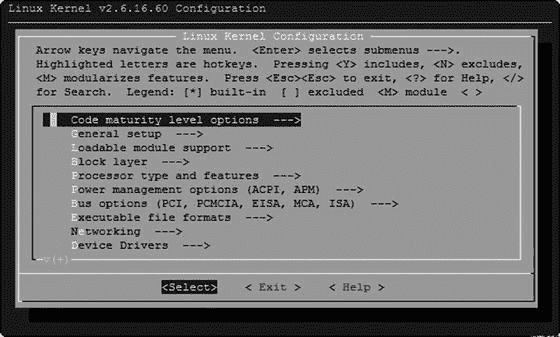
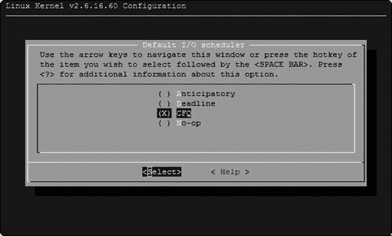
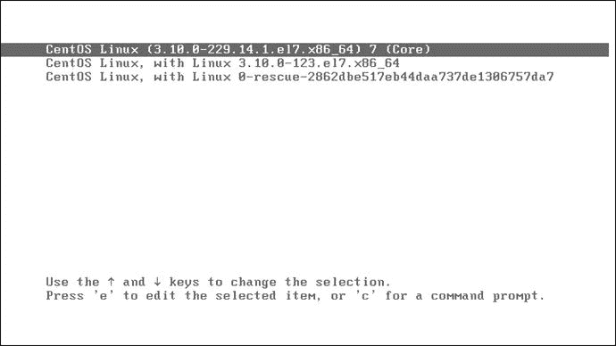

第十三章


使用内核

你电脑的心脏是内核。这个内核使用特定的参数和模块，作为一个 Linux 用户，您至少需要对它们有最起码的了解。在这一章中，你将学习如何执行基本的内核管理任务以及如何为你的内核改变参数。您还将学习如何配置 GRUB 来加载您的内核。

了解内核

如前所述，Linux 内核是操作系统的心脏。软件直接与硬件通信。内核是操作系统中唯一直接与硬件通信的部分；你使用的所有其他组件都必须通过内核，如图 13-1 所示。


[图 13-1](#_Fig1) 。只有通过内核，所有软件才能与计算机硬件进行通信

为了访问不同的硬件组件，内核需要驱动程序。每个内核驱动程序都由一个内核模块代表。只有最基本的驱动程序直接编译在内核中。启动时，内核加载到初始 RAM 磁盘中。这个 RAM 磁盘包含您的计算机中可能有的硬件驱动程序。这些驱动程序并不包含在内核本身中，因为它们是非必要的驱动程序。

一般来说，当计算机通过内核直接引导时，或者通过使用初始 RAM 磁盘，或者当新硬件连接到计算机时，驱动程序会自动加载。后者是在所有现代发行版都使用的`udev`过程的帮助下完成的。

 **注**在过去，内核是单片的，这意味着所有的驱动程序都被直接编译到内核中。这也意味着如果用户需要一个新的驱动程序，他或她必须在源代码中启用这个驱动程序并重新编译整个内核。幸运的是，这已经没有必要了；如果需要新的驱动程序，用户只需加载新的模块。因此，现在需要重新编译内核的情况非常少见。

管理内核模块

要使用计算机的硬件，您需要驱动程序来访问硬件。驱动程序的作用是告诉内核它应该如何寻址硬件。一般来说，您不需要为正确的硬件访问做任何事情，但是有些情况需要您的参与，Linux 提供了一些命令来帮助您。这些命令将在以下章节中讨论。

清单模块用`lsmod`

在你的电脑上做任何模块管理之前，你应该知道哪些模块是加载的。为此，您可以使用 lsmod 命令。清单 13-1 向您展示了命令和示例输出。

[***清单 13-1***](#_FPar2) 。`Use lsmod`获取所有已加载模块的列表

```sh
nuuk:/ # lsmod
Module              Size  Used by
vfat                11648  0
fat                 47132  1 vfat
usb_storage         72896  0
vmblock             15900  4
vsock               41152  0
vmci                32116  1 vsock
vmmemctl            11708  0
dock                 8840  0
button               6672  0
battery              9604  0
ac                   4996  0
apparmor            32420  0
piix                 9476  0 [permanent]
sd_mod              19088  5
scsi_mod          127372  9
usb_storage,mptctl,ahci,libata,sg,mptspi,mptscsih,scsi_transport
_spi,sd_mod
ide_disk            14848 0
ide_core           117648 5 usb_storage,ide_cd,ide_generic,piix,ide_disk
```

`lsmod`的输出不仅显示了加载了哪些模块，还显示了这些模块正在做什么。在其输出的第一列中，您可以看到模块的名称(例如，在最后一行，您可以看到关于`ide_core`的信息)。接下来是模块使用的内存量(在`usb_core`的情况下是`117648`，后面是当前使用该模块的其他模块的数量和名称。特别是，了解这些信息的后一部分非常重要，因为如果一个模块有依赖项，您不能在卸载依赖项之前卸载它。在做任何事情之前，你应该使用`lsmod`来查看模块当前正在做什么，之后你可以在这些模块上使用`modprobe`或`modinfo`。

装卸模块有`modprobe`

基本上，模块是自动加载的。但是，在某些情况下，您可能需要手动卸载和重新加载模块。更改模块选项后，可能需要这样做(有关详细信息，请参阅本章后面的“更改模块选项”一节)。由于模块通常是自动加载的，所以在再次加载之前，您可能必须先卸载一个模块。要卸载当前加载的模块，使用`modprobe -r`。例如，以下命令将从您的计算机中卸载`fat32`模块:

```sh
modprobe -r fat32
```

`modprobe`通常不会返回任何消息；它只是完成它的工作，然后退出。如果你真的想看看它在做什么，你可以添加`-v`选项来显示详细程度。这在加载模块时尤其有用；例如，它向您展示了模块中自动加载了哪些依赖项。[清单 13-2](#FPar3) 给出了一个这样的例子。请注意，当前被另一个内核模块作为依赖项需要的模块不能被卸载。

[***清单 13-2***](#_FPar3) 。要查看加载模块时会发生什么，请使用`modprobe –v`

```sh
nuuk:/ # modprobe -v vfat
insmod /lib/modules/2.6.16.60-0.21-default/kernel/fs/fat/fat.ko
insmod /lib/modules/2.6.16.60-0.21-default/kernel/fs/vfat/vfat.ko
```

由于版本错误，模块加载可能会失败。通常，模块是为特定版本的内核编写的，如果模块中的版本错误，它将无法加载。这个问题的一个糟糕的解决方案是通过使用`-f` (force)选项来禁用版本检查。请注意，对于随内核一起安装的内核模块，这种情况永远不会发生。但是，如果管理员手动安装了不属于正式 Linux 内核(专有内核模块)的 Linux 内核模块，就会出现版本问题。

您可以使用选项-f 成功加载模块，但是它不稳定。但是，如果这是您唯一的选择，您可能需要使用它。在使用`modprobe -f`之前，您应该首先检查您是否能找到您的模块的源代码，您可能想要再次编译它以确保它能与您的内核一起工作。有关详细信息，请参阅本章后面的“编译模块”一节。

用`modinfo` 显示模块属性

在某些情况下，您可能只想了解更多关于当前加载的模块的信息。为此，可以使用`modinfo`。这是一个非常简单的命令，为您提供了一个模块的所有可用属性，这对于故障排除可能很有用。例如，`modinfo`还为您提供了用于相关模块的许可证。这允许您识别一个专有模块，这可能会在您当前的内核中引起问题。在[清单 13-3](#FPar4) 中，您可以看到在`vfat`模块上运行`modinfo`命令的结果。

[***清单 13-3***](#_FPar4) 。使用`modinfo`了解关于模块的更多信息

```sh
nuuk:/ # modinfo vfat
filename:      /lib/modules/2.6.16.60-0.21-default/kernel/fs/vfat/vfat.ko
author:        Gordon Chaffee
description:   VFAT filesystem support
license:       GPL
srcversion:    A7FE86D3A7ECDB19677320F
depends:       fat
supported:     yes
vermagic:      2.6.16.60-0.21-default 586 REGPARM gcc-4.1
```

更改模块选项

当使用内核模块时，您可以将选项传递给它们。您可以通过编辑`/etc/modprobe.conf`配置文件或者将特定于模块的文件添加到`/etc/modprobe.d`中来做到这一点。您可以在`modprobe.conf`中包含特定模块的行，并在每个模块的一行中指定您需要做的所有事情，或者您可以在`/etc/modprobe.d`中为特定模块创建一个配置文件。请注意，字母目前是加载内核模块的首选方法。[清单 13-4](#FPar5) 显示了`modprobe.conf` 的部分样本内容。

[***清单 13-4***](#_FPar5) 。对特定于模块的选项使用 modprobe.conf

```sh
alias char-major-10-170 thinkpad
alias personality-13      abi-solaris
alias personality-14      abi-uw7
# required for DRI support on SiS chips
options sisfb             mode=none mem=12288
# ata_piix can’t handle ICH6 in AHCI mode
install ata_piix /sbin/modprobe ahci 2>&1 |:; /sbin/modprobe\
  --ignore-install ata_piix
include /etc/modprobe.d
include /etc/modprobe.conf.local
```

如您所见，在`modprobe.conf`或`/etc/modprobe.d`中的文件中使用了一些命令:

*   `alias`:用它给一个模块取另一个名字。在示例行`alias personality-14 abi-uw7`中，别名`personality-14`被赋予真正的模块名`abi-uw7`。这意味着你也可以通过参考`personality-14`来加载这个模块。
*   `options`:该命令用于将特定选项传递给模块。在示例行`options sisfb mode=none mem=12288`中，没有指定特定模式，并且添加了存储器地址。模块选项通常是特定于模块的，在某些情况下是从模块获得适当行为所必需的。您可以通过使用 **modinfo** 命令找出特定模块的模块选项。该命令输出的最后几行显示了以文本 parm 开头的行支持哪些选项(如果有)。
*   正常情况下，一个模块只是被添加到内核中。如果您的模块在初始化时需要更多的参数和设置，您可以使用`install`命令，该命令允许您使用完整的 shell 脚本来加载模块。一个这样的例子是在`install ata_piix /sbin/modprobe ahci 2>&1 |:; /sbin/modprobe --ignore-install ata_piix`行，它告诉`modprobe`它应该通过在`ahci`模块上执行`modprobe`来加载`ata_piix`模块；如果失败，它根本不应该加载`ata_piix`。(下一章将会讨论更多关于 shell 脚本中使用的技术。)
*   `remove`:和`install`一样，该命令允许你在卸载模块时传递特定的选项。
*   `include`:通过使用`include`命令，你可以告诉`modprobe`使用一个额外的配置文件来加载模块。正如您在[清单 13-4](#FPar5) 中看到的，`include`命令也用于包含`/etc/modprobe.d`中的所有配置文件。
*   `blacklist`:在某些情况下，模块被编程为使用内部别名。这些可能与您为模块配置的别名冲突。为了防止出现这种问题，您可以使用`blacklist`命令来指示应该忽略所有模块的内部别名。默认情况下，一些发行版有一个`/etc/modprobe.d/blacklist`配置文件来防止使用某些别名。

管理模块依赖关系

正如你所看到的，当使用`lsmod`命令时，一些模块依赖于其他模块来成功加载。扫描这些模块依赖关系是`depmod`命令的责任，它会在计算机启动时自动加载。这个命令的结果被写到`modules.dep`文件中，这个文件可以在当前内核(`/lib/modules/...`)的`modules`目录中找到。请注意，通常您不需要手动使用 depmod 命令，因为该命令会在安装内核或安装内核更新时自动执行。

因为这个文件只包含一长串模块及其依赖项，所以自己编辑它是没有意义的。如果一个模块有依赖问题，从命令行再次运行`depmod`命令会很有用。这个命令会自动为你生成一个新的`modules.dep`文件。

用于模块管理的传统命令

一些用于模块管理的旧命令没有考虑模块依赖性。您不应该使用我在这里列出的这些命令，因为它们很可能无法正确地加载和卸载您的模块:

*   `insmod`:加载一个模块
*   `rmmod`:删除一个模块

练习 13-1:使用内核模块

1.  键入 **lsmod** 以获得当前加载的内核模块的概述。使用 **lsmod | grep vfat** 检查 **vfat** 模块是否加载。本练习中的下一步假设它尚未加载。
2.  键入 **modprobe vfat** 手动加载 vfat 模块。
3.  重复命令 **lsmod | grep vfat** 。现在你会看到它被加载了，你还会看到它依赖于**胖**内核模块。
4.  类型 **modinfo vfat** 。在这个命令结果的末尾，您不会看到任何内核模块选项。
5.  类型 **modinfo cdrom** 。注意输出末尾附近的参数行，它表示可以使用的模块选项。
6.  类型 **modprobe -r vfat** 。这将卸载 vfat 模块。
7.  键入 **lsmod | grep fat** 。请注意，不仅 vfat 模块，fat 模块也被卸载。

寻找合适的硬件模块

对于计算机上的硬件，应该自动加载正确的模块。您可以使用 **lspci -k** 命令验证情况是否如此。[清单 13-5](#FPar7) 显示了该命令的部分输出，注意每个 PCI 地址的最后一行，它提到了加载的 PCI 模块的名称。

[***清单 13-5***](#_FPar7) 。查找加载了哪个硬件模块

```sh
[root@localhost log]# lspci -k
00:00.0 Host bridge: Intel Corporation 440BX/ZX/DX - 82443BX/ZX/DX Host bridge (rev 01)
        Subsystem: VMware Virtual Machine Chipset
        Kernel driver in use: agpgart-intel
00:01.0 PCI bridge: Intel Corporation 440BX/ZX/DX - 82443BX/ZX/DX AGP bridge (rev 01)
00:07.0 ISA bridge: Intel Corporation 82371AB/EB/MB PIIX4 ISA (rev 08)
        Subsystem: VMware Virtual Machine Chipset
00:07.1 IDE interface: Intel Corporation 82371AB/EB/MB PIIX4 IDE (rev 01)
        Subsystem: VMware Virtual Machine Chipset
        Kernel driver in use: ata_piix
00:07.3 Bridge: Intel Corporation 82371AB/EB/MB PIIX4 ACPI (rev 08)
        Subsystem: VMware Virtual Machine Chipset
00:07.7 System peripheral: VMware Virtual Machine Communication Interface (rev 10)
        Subsystem: VMware Virtual Machine Communication Interface
        Kernel driver in use: vmw_vmci
00:0f.0 VGA compatible controller: VMware SVGA II Adapter
        Subsystem: VMware SVGA II Adapter
        Kernel driver in use: vmwgfx
```

在某些情况下，你不会看到任何内核驱动程序在使用。如果是这种情况，就找不到这个特定硬件的内核模块。要解决这个问题，您应该尝试从特定硬件的供应商那里找到一个专有的驱动程序。

调整内核参数

在过去，调整内核参数很难。您需要更改 C 语言源文件中的参数，并重新编译内核来进行更改。今天，这不再是一项要求。相反，您可以向`/proc`文件系统写入新的参数。这个文件系统包含几个内核设置，通过直接写入`/proc`中的一些文件，你将立即改变设置。

在不知道自己在做什么的情况下，千万不要试图改变`/proc`中的设置，因为你可能会严重损坏你的系统。然而，`/proc`专业知识需要对 Linux 和 Linux 内核的工作有深入的了解；因此，我不会给你一个在`/proc`中可以改变的所有参数的完整列表。然而，我会给你一些有用的例子，以及使改变永久化的方法。

将更改写入`/proc`

要在`/` `proc` 中对文件进行修改，需要将新值回显到配置文件中。所有内核相关的配置文件都在`/proc/sys`中。让我们考虑一个例子:配置文件`/proc/sys/net/ipv4/ip_forward`表明您的计算机是否可以在两个网卡之间路由数据包。通常，对于最终用户计算机来说，这不是必需的，但是例如，如果您想将您的计算机用作无线接入点，您可以选择设置它。您可以使用`cat /proc/sys/net/ ipv4/ip_forward`显示该文件中的默认设置，这将给出`0`的值，意味着路由当前被禁用。要启用它，将`1`的值回显到这个配置文件中。清单 13-6 展示了这个程序是如何工作的。

[***清单 13-6***](#_FPar8) 。更改/proc 中的参数

```sh
nuuk:/proc/sys/net/ipv4 # cat ip_forward
0
nuuk:/proc/sys/net/ipv4 # echo 1 > ip_forward
nuuk:/proc/sys/net/ipv4 # cat ip_forward
1
```

刚才描述的过程的缺点是，当您重新启动计算机时，更改不会持久。这意味着重新启动后，您必须再次应用所有这些设置。幸运的是，sysctl 包形式的解决方法已经存在。如果安装了 sysctl，它会在计算机启动时作为服务运行。加载时，它读取其配置文件`/etc/sysctl.conf`。该文件包含必须应用于`/proc`文件系统的所有参数的列表。[清单 13-7](#FPar9) 展示了一个 sysctl 内容的例子。这个例子来自一个 Ubuntu 服务器，包含一些关于您可能想要更改的参数的有价值的信息。

[***清单 13-7***](#_FPar9) 。使用 sysctl 永久应用设置

```sh
root@mel:/etc# cat sysctl.conf
#
# /etc/sysctl.conf - Configuration file for setting system variables
# See sysctl.conf (5) for information.
#

#kernel.domainname = example.com

# the following stops low-level messages on console
kernel.printk = 4 4 1 7

# enable /proc/$pid/maps privacy so that memory relocations are not
# visible to other users. (Added in kernel 2.6.22.)
kernel.maps_protect = 1

# Increase inotify availability
fs.inotify.max_user_watches = 524288
# protect bottom 64k of memory from mmap to prevent NULL-dereference
# attacks against potential future kernel security vulnerabilities.
# (Added in kernel 2.6.23.)
vm.mmap_min_addr = 65536

##############################################################3
# Functions previously found in netbase
#

# Comment the next two lines to disable Spoof protection (reverse-path filter)
# Turn on Source Address Verification in all interfaces to
# prevent some spoofing attacks
net.ipv4.conf.default.rp_filter=1
net.ipv4.conf.all.rp_filter=1

# Uncomment the next line to enable TCP/IP SYN cookies
# This disables TCP Window Scaling (http://lkml.org/lkml/2008/2/5/167)
#net.ipv4.tcp_syncookies=1

# Uncomment the next line to enable packet forwarding for IPv4
#net.ipv4.ip_forward=1

# Uncomment the next line to enable packet forwarding for IPv6
#net.ipv6.ip_forward=1

###################################################################
# Additional settings - these settings can improve the network
# security of the host and prevent against some network attacks
# including spoofing attacks and man in the middle attacks through
# redirection. Some network environments, however, require that these
# settings are disabled so review and enable them as needed.
#
# Ignore ICMP broadcasts
#net/ipv4/icmp_echo_ignore_broadcasts = 1
#
# Ignore bogus ICMP errors
#net/ipv4/icmp_ignore_bogus_error_responses = 1
#
# Do not accept ICMP redirects (prevent MITM attacks)
#net/ipv4/conf/all/accept_redirects = 0
# _or_
# Accept ICMP redirects only for gateways listed in our default
# gateway list (enabled by default)
# net/ipv4/conf/all/secure_redirects = 1
#
# Do not send ICMP redirects (we are not a router)
#net/ipv4/conf/all/send_redirects = 0
#
# Do not accept IP source route packets (we are not a router)
#net/ipv4/conf/all/accept_source_route = 0
#
# Log Martian Packets
#net/ipv4/conf/all/log_martians = 1
#
# Always defragment packets
#net/ipv4/ip_always_defrag = 1
```

在`/etc/sysctl.conf`中，通过使用相对路径名来引用`/proc/sys`中的配置文件。例如，正如您在最后一行看到的，使用了设置`net/ipv4/ip_always_defrag`，它指的是完整名称为`/proc/sys/net/ipv4/ip_always_ defrag`的文件。您的发行版可能会使用带点的符号，在本例中是`net.ipv4.ip_always_ defrag`，而不是使用您在这个示例清单中看到的带斜线的符号。你选择哪一个都没关系，因为两者都兼容。

当更改内核设置时，您应该知道在哪里可以找到哪种设置。在`/proc/sys`中，不同的子目录用于对不同种类的配置文件进行分组。使用以下子目录:

*   `debug`:包含内核调试相关的参数
*   `dev`:包含与设备及其工作相关的参数
*   `fs`:包含文件系统参数
*   `kernel`:包含内核相关参数
*   `net`:包含网络相关设置
*   `vm`:包含与内存管理相关的设置

一些有用的`/proc`参数

如前所述，通过修改`/proc`文件系统来调优内核并不容易，需要对内核的工作有深入的了解。因此，我不会在这里深入探讨。为了给你一个可能性的印象，我在`/proc`中列出了一些选项:

*   `/proc/sys/net/ipv4/ip_forward`:决定你的电脑是否必须在网卡之间路由数据包。如果您要将电脑设置为网络上的路由器，请使用此选项。
*   `/proc/sys/dev/cdrom/autoeject`:告诉内核卸载光盘后是否应该自动弹出光盘。
*   `/proc/sys/dev/scsi/logging_level`:决定 SCSI 设备应该使用的日志级别。较高的日志级别意味着更密集的日志记录。此处仅使用前一个值的两倍或一半的值；比如`1`、`2`、`4`、`8`、`16`、`32`、`64`、`128`、`256`。如果您想要更多(或更少)与 SCSI 相关的日志记录，请调整此项。
*   `/proc/sys/fs/file-max`:给出可以同时打开的文件的最大数量。
*   `/proc/sys/kernel/hostname`:包含您的内核所知道的计算机名称。
*   `/proc/sys/kernel/osrelease`:包含当前内核版本。当在命令行上用`uname -r`命令显示当前版本时，该文件被读取。
*   `/proc/sys/net/core/rmem_max`:设置内核应该保留的最大内存量，以缓冲传入的网络数据包。
*   `/proc/sys/vm/laptop_mode`:告诉内核它是否应该在笔记本模式下运行。当使用值`1`启用时，它将使用更节能的设置。
*   告诉内核它应该以多快的速度开始交换。这里的值越高，表明内核开始交换的意愿越高。

练习 13-3:通过/PROC 进行内核更改

1.  打开一个根壳。
2.  键入 **sysctl -a | grep icmp** 。这显示了所有当前 ICMP 相关的进程设置。请注意，参数 icmp_echo_ignore_all 应该设置为 0。
3.  键入 **ping 本地主机**。您将收到回复，因为 ICMP 流量是允许的。
4.  键入**echo 1>/proc/sys/net/IP v4/icmp _ echo _ ignore _ all**
5.  重复步骤 3。您应该不再能够 ping 本地主机。

编译你自己的内核和内核模块

使用 Linux 的优势之一是你可以基于内核和其他程序的源文件创建新的功能。在这一节中，您将了解编译是如何被使用的，首先是因为它适用于内核，其次是因为它适用于新的内核模块。

为了能够构建和编译自己的软件，您必须在计算机上安装 C 编译器。通常，gcc 包中的 GNU C 编译器用于此目的。在继续之前，请确保安装了它以及依赖于它的所有软件包。阅读[第 8 章](08.html)了解更多关于在你的发行版上安装新软件包的信息。

注意:在 SUSE 和 Red Hat 等企业 Linux 发行版上，编译自己的内核并不常见。内核源文件通常都不包含在内。这是因为对于这些发行版来说，可支持性非常重要。通过重新编译您自己的内核，您将中断支持，因为您将包含未经供应商验证的选项。因此，如果您使用的是企业 Linux 发行版，不要将更改编译到您的内核中。

理解品牌

要编译软件，需要一个 C 编译器，在 gcc 包里。为了成功地编译 C 文件，一般来说，你将使用两种方法之一；您使用哪一种取决于源程序文件的交付方式。如果你的源文件只有一个，你可以使用`gcc`命令直接编译它。当处理 Linux 内核和驱动程序时，情况从来不是这样；您不是使用一个单独的源文件，而是使用许多相互链接的源文件，根据您当前的配置，它们的行为会有所不同。因为一个接一个地编译所有这些文件几乎是不可能的，大多数源文件都有一个帮助编译过程的文件，名为`Makefile`。你会在从软件包中提取源文件后找到它。

`Makefile` 包含特定的指令，告诉 C 编译器在编译软件时必须做什么。针对这个`Makefile`开始编译软件并不太难:你只需运行`make`命令。然而，由于你的计算机上可能有不同的`Makefiles`，你应该总是从包含你需要开始编译你的软件的`Makefile`的目录中运行`make`命令。

如果正在讨论的软件非常复杂，`Makefile`可能包含针对不同场景运行编译作业的指令。当使用内核时就是这种情况，你可以用不同的参数运行`make`来告诉编译器它到底要做什么。这些参数不是特定于`make`的，而是在`Makefile`本身中定义的。如果你不害怕复杂的脚本，你甚至可以阅读`Makefile`,试着找出它到底完成了什么。(有关`make`的更多信息，请参见`http://www.gnu.org/software/make/manual/make.html`。)

修改和编译内核

在 Linux 内核模块化之前，在向`/etc/sysctl.conf`文件写入新的内核选项以动态更改设置变得容易之前，您需要更改内核设置，并在更改设置后重新编译新的内核。如今，几乎没有理由继续这样下去。然而，这一节给出了配置和编译您自己的内核所需要的一些见解，这将产生一个新的内核。在开始之前，请确保您的计算机上安装了内核源文件。阅读[第 8 章](08.html)了解更多关于如何安装软件的细节。

如果你已经改变了内核的设置，编译内核才有意义。下一节将向您展示如何做到这一点，接下来的一节将讨论如何在做出这些更改后编译内核。

修改内核

当前内核配置通常存储在目录`/usr/ src/linux`中的`.conf`文件中，该文件包含当前内核的源文件。要创建这个文件，可以使用不同的选项，这里将介绍其中的两个选项:

*   从头开始创建`.conf`文件。
*   基于默认配置创建`.conf`文件。

从头开始创建一个`.config`文件

要从头开始创建一个`.config`文件，您需要运行`make config`命令 或相关命令之一。这个命令会启动一个脚本，询问您希望如何配置每一项内核功能，这对用户来说非常不友好。有一些更容易使用的替代品:`make menuconfig`和`make xconfig`。两者都提供了一个菜单界面，允许您指定新内核配置中需要的内容。因为它们提供相同的功能，所以我将只介绍`make menuconfig`命令；你可以从控制台运行它，`make xconfig`就不是这样了。

您必须从`/usr/src/linux`目录运行`make config`命令，所以在开始之前，请确保您在这个目录中。接下来，键入`make menuconfig`启动基于菜单的内核配置。[图 13-2](#Fig2) 显示了界面的样子。



[图 13-2](#_Fig2) 。`make menuconfig`提供一个菜单界面，允许您更改内核选项

在`make menuconfig`界面中，所有选项被细分为不同的模块，使您可以轻松找到特定的功能。您可以通过使用箭头键导航到某个选项并按 Enter 键来选择它。一些选项可以打开或关闭，而其他选项也可以作为一个模块启用。对于后一种选项类型，您可以在已选、未选或 M 之间切换，这表示您想将该选项用作一个模块(参见[图 13-3](#Fig3) )。您还可以获得与给定选项相关的功能的更多详细信息:首先选择它，然后使用 Tab 键导航到帮助选项。选择 Help 将显示所选功能的描述。



[图 13-3](#_Fig3) 。在 make menuconfig 中，很容易打开或关闭选项

一旦您使用`make menuconfig`完成了您需要的配置，您可以通过选择 Exit 返回到菜单界面的顶部，直到您回到主菜单。这将为您提供先前在图 13-2 中[所示的屏幕。在那里，再次选择退出。现在将提示您保存当前选择。选择“是”将当前选择写入配置文件。请阅读本章后面的“编译新内核”一节，了解如何从这一点开始。](#Fig2)

基于默认配置创建一个`.config`

每个内核还包含一个默认配置，根据内核维护者的说法，它包含了你正在使用的架构的最佳选项。通过使用`make defconfig`命令，您可以很容易地将这个默认配置写入到`/usr/src/linux/.config`文件中。确保从`/usr/src`目录中使用这个命令，否则它将无法工作。

启动`make defconfig`命令后，许多选项会在你的屏幕上滚动(见[清单 13-8](#FPar11) ，结果被写入新的`.config`文件。

[***清单 13-8***](#_FPar11) 。使用`make defconfig`，您可以将内核开发人员喜欢的选项写入配置文件

```sh
  TEA, XTEA and XETA cipher algorithms (CRYPTO_TEA) [M/n/y/?] m
  ARC4 cipher algorithm (CRYPTO_ARC4) [M/y/?] m
  Khazad cipher algorithm (CRYPTO_KHAZAD) [M/n/y/?] m
  Anubis cipher algorithm (CRYPTO_ANUBIS) [M/n/y/?] m
  Deflate compression algorithm (CRYPTO_DEFLATE) [M/y/?] m
  Michael MIC keyed digest algorithm (CRYPTO_MICHAEL_MIC) [M/y/?] m
  CRC32c CRC algorithm (CRYPTO_CRC32C) [M/y/?] m
  Camellia cipher algorithms (CRYPTO_CAMELLIA) [M/n/y/?] m
  Testing module (CRYPTO_TEST) [M/n/?] m
  *
  * Hardware crypto devices
  *
  Support for VIA PadLock ACE (CRYPTO_DEV_PADLOCK) [M/n/y/?] m
    PadLock driver for AES algorithm (CRYPTO_DEV_PADLOCK_AES) [M/n/?] m
    PadLock driver for SHA1 and SHA256 algorithms (CRYPTO_DEV_PADLOCK_SHA) [M/n/?] m
*
* Library routines
*
CRC-CCITT functions (CRC_CCITT) [M/y/?] m
CRC16 functions (CRC16) [M/y/?] m
CRC32 functions (CRC32) [Y/?] y
CRC32c (Castagnoli, et al) Cyclic Redundancy-Check (LIBCRC32C) [M/y/?] m
```

编译新内核

现在你已经创建了`/usr/src/linux/.config`文件，是时候编译新的内核了，或者更好，构建新的内核。以前需要几个命令来完成这个任务，现在您可以通过从`/usr/src/ linux`目录运行一个简单的命令来完成这个任务:

```sh
make
```

完成新内核的构建需要一段时间。`make`将显示当前正在处理的所有单独源文件的名称，并显示与这些文件相关的任何警告或状态错误。清单 13-9 给你一个此刻所见的印象。

[***清单 13-9***](#_FPar12) 。从`/usr/src/linux`运行`make`来构建新的内核

```sh
nuuk:/usr/src/linux # make
  CHK     /usr/src/linux-2.6.16.60-0.21/include/linux/version.h
  SPLIT   include/linux/autoconf.h -> include/config/*
  CC      arch/i386/kernel/asm-offsets.s
  GEN     include/asm-i386/asm-offsets.h
  HOSTCC  scripts/genksyms/genksyms.o
  SHIPPED scripts/genksyms/lex.c
  SHIPPED scripts/genksyms/parse.h
  SHIPPED scripts/genksyms/keywords.c
  HOSTCC  scripts/genksyms/lex.o
  SHIPPED scripts/genksyms/parse.c
  HOSTCC  scripts/genksyms/parse.o
  HOSTLD  scripts/genksyms/genksyms
  CC      scripts/mod/empty.o
  HOSTCC  scripts/mod/mk_elfconfig
  MKELF   scripts/mod/elfconfig.h
  HOSTCC  scripts/mod/file2alias.o
  HOSTCC  scripts/mod/modpost.o
  HOSTCC  scripts/mod/sumversion.o
```

编译模块

虽然你不需要经常重新编译内核，但是对于内核模块来说，这是完全不同的。问题是许多硬件供应商拒绝在开源许可下发布他们驱动程序的源代码。相反，他们将只提供一些专有的 Linux 驱动程序。这些专有的 Linux 驱动程序是通用的，但是要完全发挥作用，必须为您的特定内核开发驱动程序。满足这一要求的唯一方法是为您的机器编译这些驱动程序。

一般来说，在你的计算机上安装这样的驱动程序有两种方法:简单的方法和困难的方法。当选择简单的方法时，您必须将供应商提供其驱动程序的网站集成为您计算机上的软件包库。当选择硬方法时，你必须自己下载和编译驱动程序。对于每个驱动程序来说，执行此操作的具体步骤是不同的。以下过程中描述的是在大多数情况下都有效的通用方法:

1.  下载驱动程序并将其存储在计算机上的某个位置。我们假设你要安装的驱动是`driver.tgz`，你已经把它存放在用户 root 的主目录下了。您还应该确保在开始之前已经获得了 root 权限。
2.  使用`tar zxvf driver.tgz`提取`tar`档案。通常，这将在当前目录下创建一个子目录，在本例中是`/tmp/driver`。使用`cd`切换到该目录。
3.  在驱动子目录中，你通常会找到一些文件。其中之一是配置文件(它也可能有名称`install`、`setup`或类似的名称)。通常你还会找到一个名为`Makefile`的文件，而且在大多数情况下，还有一个名为`README`的文件。请注意，确切的文件名可能会有所不同，因此请检查以确保您使用的是正确的文件。从阅读`README`文件开始是一个好主意，因为它可能包含如何安装驱动程序的有用提示。
4.  读取`README`文件后，运行通用设置脚本，通常是`configure`。要从当前目录运行它，请以`./configure`的身份运行它，而不仅仅是`configure`。
5.  `configure`脚本确保所有条件都已满足，可以开始编译驱动程序。
6.  从你解压驱动文件的目录中，运行`make`开始编译过程。`make`命令将遵循目录中`Makefile`的指令，并为您当前的内核编译驱动程序。
7.  运行`make`之后，你需要确保所有的驱动程序都被复制到正确的位置。为此，运行`make install`，仍然在包含驱动程序文件的目录中作为当前目录。

这个通用过程应该有助于您编译和安装内核驱动程序。但是，这是一个非常通用的过程:在所有情况下，您都应该检查驱动程序附带的文档，看它是否包含任何特定的说明。

管理 Grub2 引导程序

当你的电脑启动时，必须加载一个 Linux 内核。在大多数 Linux 发行版上，这是由 Grub 2 引导加载程序完成的。该引导加载程序在启动时显示一个配置，从该启动菜单中，它允许您指定启动时应使用的特定选项(参见[图 13-4](#Fig4) )。它还有一个配置文件，可用于保持启动参数的持久性。



[图 13-4](#_Fig4) 。Grub2 引导程序菜单

Grub 2 引导菜单显示了可用的不同内核版本。安装软件更新后，您通常会看到几个内核版本，这允许您选择一个较旧的版本，或者在启动默认内核时遇到问题的故障排除内核。从 Grub 2 引导加载程序菜单中，您可以在突出显示的项目上按下 **e** 键。这将打开你可以在[图 13-5](#Fig5) 中看到的屏幕，在这里可以指定内核启动选项。为此，找到以文本 Linux 开头的行，并将引导参数添加到该行的末尾。


[图 13-5](#_Fig5) 。指定内核引导选项

在图 13-4 的例子中，你可以看到在以 **linux16** 开始的行中提供了许多参数。您还会注意到不同的 Linux 发行版使用不同的选项。在这种情况下，例如，选项 **rhgb** 和 **quiet** 用于指示系统不应显示任何启动消息。如果您确实想看到启动消息，您可以从这一行中删除这些选项。

此外，您可以在这一行中添加特定的内核选项。例如，如果您的机器无法启动，您可以添加参数**systemd . unit = rescue . target**以进入救援模式。这将使您进入最小模式，在该模式下您可以修复系统上的设置。请注意，您在这里所做的所有更改都是一次性的。从修改后的内核参数开始，使用 **Ctrl-X** 键。

如果您希望对 GRUB 2 引导加载程序进行永久的更改，您应该将它们包含在/etc/default/grub 文件中。在这个文件中，您将找到一行 GRUB_CMDLINE，它包含了启动时使用的所有内核参数。您可以根据需要添加或删除该行。进行修改后，您需要将更改写入 Grub 2 配置。您可以使用**grub 2-mkconfig-o/boot/grub 2/grub . CFG**来完成此操作。请注意，永远不要直接写入/boot/grub2/grub.cfg 文件，因为如果内核或 grub2 软件更新，对它的所有修改都将被覆盖。

练习 13-3:修改 GRUB2 参数

在这个练习中，你将学习如何进入救援模式。

1.  使用**echo b>/proc/sysrq-trigger**来重置您的系统。通过在这个文件中写 b，你给了系统一个硬复位。
2.  当 Grub 2 引导菜单出现时，选择默认内核条目并按下 **e** 打开编辑模式。
3.  找到以 **linux16** 开始的那一行，并将光标移动到这一行的末尾。添加文本**systemd . unit = rescue . target**。
4.  使用 **Ctrl-x** 键通过这些选项启动您的系统。以 root 用户身份登录后，您将进入最小故障诊断模式。
5.  要从故障排除模式进入正常操作模式，请键入**system CTL isolate multi-user . target**。这将在您的系统上启动正常的多用户模式。或者，您可以键入 **reboot** 来重新启动您的系统。

摘要

在这一章中，你已经学会了如何使用内核。您已经了解了如何管理内核模块，以及如何更改内核参数。本章介绍了以下命令:

*   `modprobe`:允许您加载和卸载内核模块
*   `modinfo`:提供关于内核模块的信息
*   `lsmod`:列出加载的模块
*   `insmod`:允许您加载内核模块(传统命令)
*   `rmmod`:从内存中删除当前加载的模块(传统命令)
*   `depmod`:创建`modules.dep`配置文件，确保自动加载模块依赖关系
*   `gcc`:指 GNU C 编译器，用于将源文件转换成程序文件
*   `make`:与`Makefile`配合使用，使软件编译更容易
*   `sysctl`:允许您在启动时加载内核参数
*   **grub2-mkconfig** :将/etc/default/grub 文件中的更改写入 grub2 引导加载程序配置。

在本书的下一章也是最后一章，你将会读到如何创建 shell 脚本。