附录 A

安装 Linux

在本附录中，您将学习如何安装 Linux。我们正在讨论两个流行的发行版。您将首先学习如何安装 CentOS 接下来你会读到如何在你的电脑上安装 Ubuntu Server 14.04 LTS 版。

在写这本书的时候，我主要关注 CentOS 7.0 和 Ubuntu Server 14.04 LTS。当然，您可以自由地使用任何其他的 Linux 发行版，但是您会注意到在使用另一个发行版时存在大量的差异。我试图以这样一种方式来写这本书，即 Linux 发行版之间的差异并不太重要，但是当使用另一个发行版时，总会有一些项目不能很好地工作。

安装要求

安装 Linux，不需要太多高级硬件。512 MB 的 RAM 就足够了，除此之外，只需 4 GB 的磁盘空间就足够了。您将需要一个 64 位平台来运行一个现代的 Linux 服务器操作系统，其中所有的功能都得到支持。这应该不是问题，因为在过去十年中发布的几乎所有 CPU 都支持 64 位指令。

为了学习 Linux 并能够完成本书中描述的练习，我推荐使用虚拟化软件。桌面虚拟化解决方案，如适用于 Windows 的 VMware Workstation / Player 或适用于 Apple 的 VMware Fusion 将会表现出色。Oracle VirtualBox 提供了一个替代解决方案。大多数人更喜欢 VMware 软件，因为它组织得很好，但你需要为它付费。鉴于低硬件要求，它也可以在旧的计算机硬件上很好地工作。

安装 CentOS

以下步骤将带您完成 CentOS 的基本安装，其配置非常适合学习本书中讨论的内容。

1.  Boot CentOS from the installation media. This will show you the screen in [figure A-1](#Fig1). Select Install CentOS 7 and press enter to start the installation.

    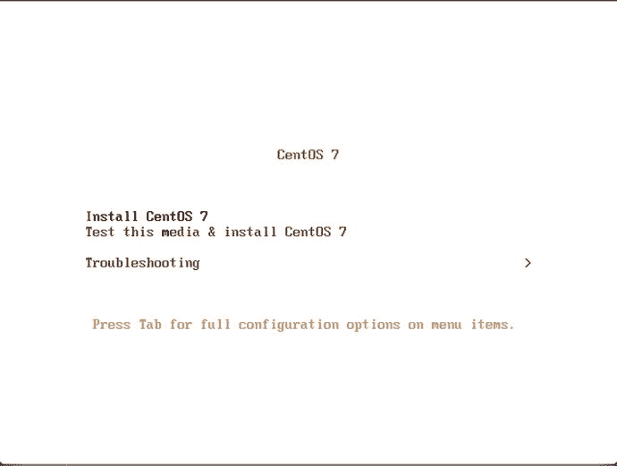

    [图 A-1](#_Fig1) 。开始 CentOS 安装

2.  Once the installation program has been loaded, you’ll see the Welcome to CentOS screen where you can select the language and keyboard settings. I recommend installing CentOS in English, but other languages are offered as well. After making your selection, press Continue to proceed.

    

    图 A-2。选择语言和键盘设置

3.  In the next screen you’ll see the installation summary (see [figure A-3](#Fig3)). From this screen you’ll make all required choices to start the installation of your Linux distribution.

    

    [图 A-3](#_Fig3) 。安装总结屏幕提供所有需要配置的选项

4.  To start with, you can have a look at the software selection link. Click it, and it will open the screen that you can see in [figure A-4](#Fig4). You can do very well with a minimal installation, which installs no graphical user interface and just a minimal set of packages. It is also perfectly fine to select the “Server with GUI” installation pattern. This does install a graphical user interface, which allows you to easily open multiple terminal windows on the same desktop. For this book both choices work well, so the choice is entirely up to you.

    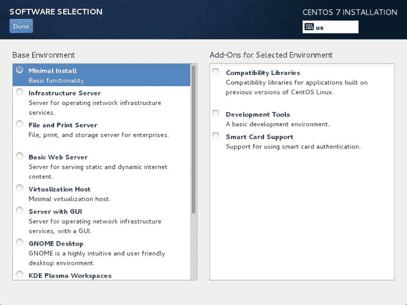

    [图 A-4](#_Fig4) 。选择基本软件安装模式

5.  Next you must click the Installation Destination link. This will open the screen that you can see in [Figure A-5](#Fig5). You just have to click the Done button from this screen to confirm that you really want to use the selected disk device for your Linux installation. You don’t have to do anything difficult with the hard disk, just select the default disk lay-out.

    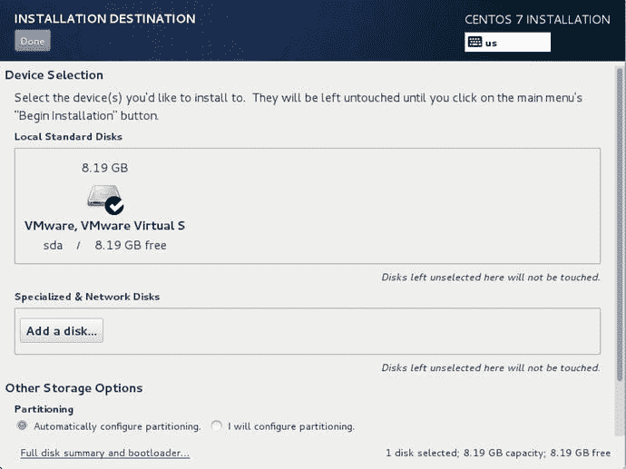

    [图 A-5](#_Fig5) 。选择硬盘进行安装

6.  The last step before starting the installation is the configuration of network and hostname. Click the link to ensure that the network card is enabled, and here also, you can leave all default settings, which configures your network to get an IP address from a DHCP server. Close this screen; at this point you can start the installation.

    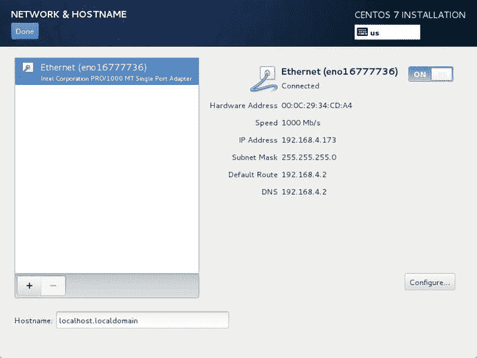

    图 A-6。开始安装前，打开网卡

7.  The installation will start immediately now (see [Figure A-7](#Fig7)). While packages are being installed, you can enter a root password and create a user as well.

    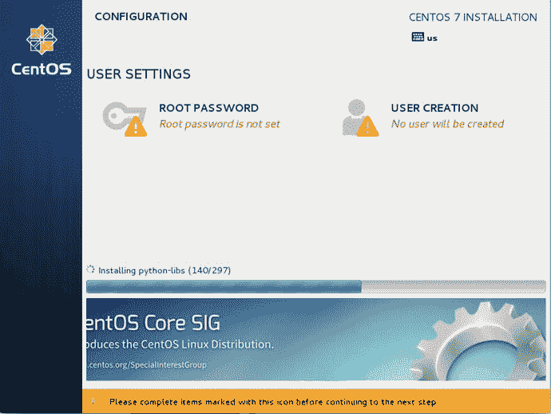

    [图 A-7](#_Fig7) 。当软件包被写入您的系统时，您可以设置根密码并创建一个用户

8.  In [figure A-8](#Fig8) you see the screen where you have to enter a root password. Enter the same password twice to avoid any mistakes while typing the password and then click Done to write the configuration to disk. Optionally you can create a user account as well. If you don’t create a user now, that’s fine, you’ll be instructed how to do that while working through the chapters in this book.

    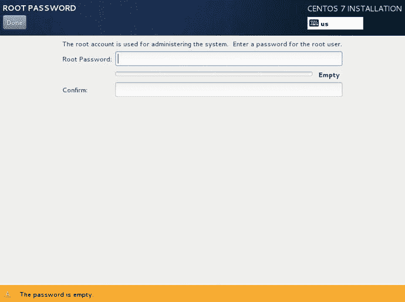

    [图 A-8](#_Fig8) 。输入 root 密码两次

9.  安装完成后，将会显示这一信息。此时，您可以单击 Finish installation 将最终配置写入磁盘。下一次重新启动，开始在新安装的系统上工作。仅此而已。

安装 Ubuntu 服务器

虽然 Ubuntu 桌面版被设计为易于使用，但 Ubuntu 服务器版被设计为尽可能高效。你不会得到一个图形界面，你只会得到一个基于文本的界面，允许你在服务器上做什么。这个过程描述了如何安装一个 Ubuntu 服务器，它可以帮助你学习这本书。

1.  Boot from the installation media. This will show the screen that you can see in [Figure A-9](#Fig9), from which you can select the language that will be used in the enxt screen. I recommend using an English language installation.

    

    [图 A-9](#_Fig9) 。首先，选择安装时要使用的语言

2.  Next you’ll need to indicate what you want to do. Multiple options are suggested; select Install Ubuntu Server to start the installation procedure.

    

    图 A-10。选择安装 Ubuntu 服务器

3.  You’ll now see another screen where you need to select the language and keyboard disposition. That may seem redundant, but in this screen you’ll determine the language the server will be installed in, as well as the keyboard layout that will be used.

    

    图 A-11。选择安装服务器的语言

4.  Before the actual installation is started, you’ll need to make a couple more choices. To start with, you have to indicate your geographical area, which will be used to configure system time correctly.

    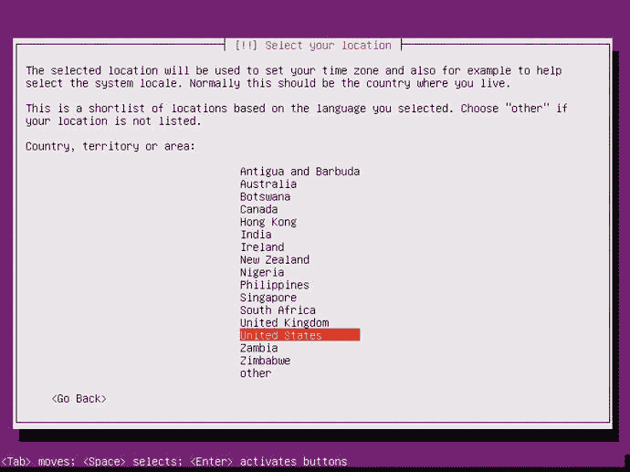

    图 A-12。选择地理区域

5.  In the next screen you can indicate how you want to define the keyboard on your system. To do so, you may just select the keyboard from a list, or you can press a couple of keys so that the installation program will detect the type of keyboard you are using for you. Personally, I think selecting the keyboard layout from a list is easier, so select No to display the list and select your keyboard type.

    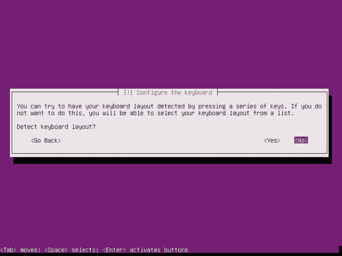

    图 A-13。选择键盘布局

6.  After selecting the keyboard, additional components are loaded that are required to complete the installation. To load these additional components, you’ll need network access. So if you see something that doesn’t match the next figure at all, make sure you’re connected to the network and try again. Once that has been done, you’ll need to select a name for your system. If you don’t do anything, the system will be called ubuntu. It’s a good idea to change that name into something a bit more meaningful.

    

    图 A-14。设置系统名称

7.  On Ubuntu you’ll have to create a user, because root login is disabled by default. In the next screen you can enter the desired user name. This user will automatically be created as the administrative user, which means that this user account will have sudo access to all administrator commands.

    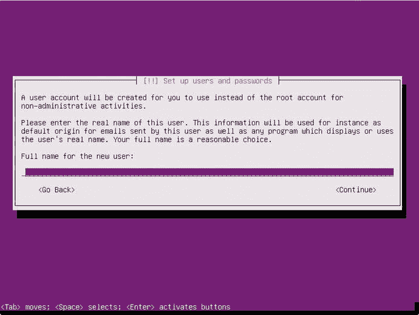

    图 A-15。创建管理员用户

8.  选择用户名后，您必须输入密码。这样做两次，以防止任何打字错误将您锁定在系统之外。
9.  The last part of the user-related configuration asks you if you want to encrypt the contents of your home directory. While this is a good idea for a typical laptop user to prevent unauthorized access to personal files, on a server it’s not really necessary to use an encrypted home directory.

    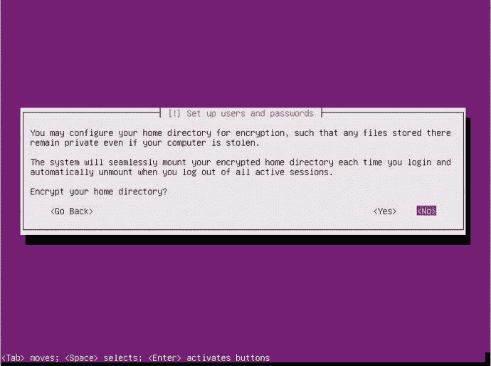

    图 A-16。在服务器上，没有必要使用加密的主目录

10.  在下一个屏幕中，将提示您确认所选的时区。如果进入下一个屏幕是正确的，选择是。
11.  You’ll now be asked how you want to organize disk lay-out (see [Figure A-17](#Fig17)). For an easy configuration of partitions on your hard disk, select the Guided - use entire disk and set up LVM option.

    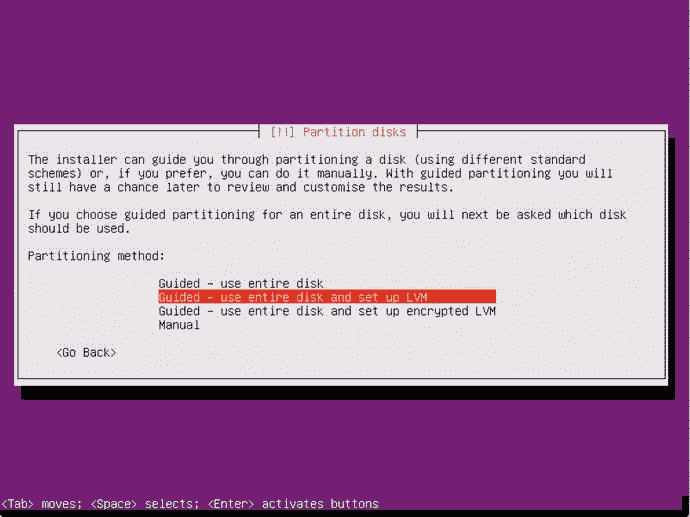

    [图 A-17](#_Fig17) 。引导式 LVM 选项允许您以一种简单的方式配置磁盘使用

12.  The screen that you can see in [Figure A-18](#Fig18) shows which disk will be used. Make sure that you’re using the right disk, and if that is the case, press Enter to continue.

    

    [图 A-18](#_Fig18) 。在继续之前，请确保您使用的是正确的磁盘

13.  在将配置实际写入磁盘之前，您需要在三个不同的屏幕中再确认三次。执行此操作，这样可以格式化您的磁盘，并将第一组文件复制到磁盘。
14.  现在，您可以指定是否需要使用代理来访问互联网。对于简单的主配置，通常不使用代理，因此您可以将此字段留空，只需选择 Continue 继续。
15.  In the next screen (see [Figure A-19](#Fig19)) you can indicate how you want to update your system. By default no automatic updates will be done, which is fine for what you need to do with Ubuntu server in this book. On a real server you might want to consider installing at least security updates automatically.

    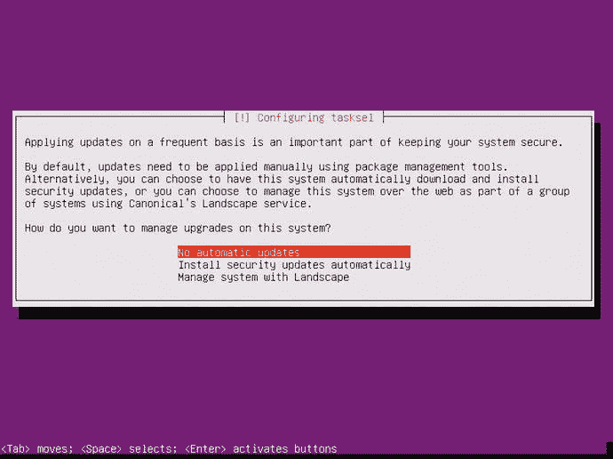

    [图 A-19](#_Fig19) 。定义你想如何处理自动更新

16.  You now can install some additional services as well. It is a good idea at least to install the SSH Server, everything else can be installed later as well.

    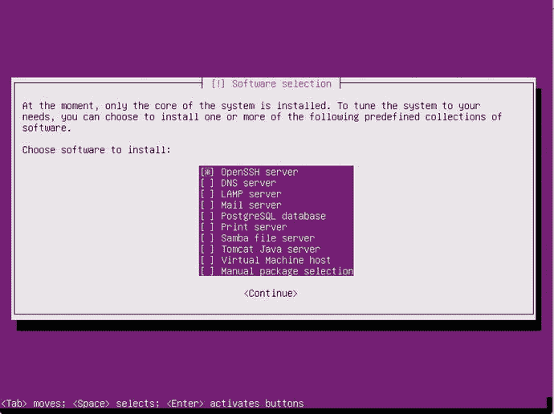

    图 A-20。选择要安装的附加软件包

17.  After the installation of selected packages, the installer will ask if you want to install the Grub 2 boot loader to disk (see [Figure A-21](#Fig21)). Select Yes and press Enter to confirm. Once that has been done, you’ll see the Installation Complete message. Press enter one more time and your newly installed Ubuntu server will start booting.

    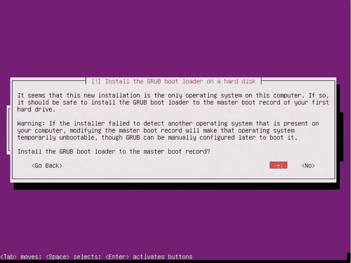

    [图 A-21](#_Fig21) 。确认您想要将 Grub 2 引导加载程序写入磁盘