## 7

## 让一切正常运行

本章将指导你设置 Ubuntu 安装的所有必要组件。这包括硬件配置，以及设置电子邮件。它涵盖了让您的系统高效运行所需的安装后步骤。

像所有现代的 Linux 发行版一样，Ubuntu 在设置关键的硬件和软件组件时实际上是自动化的。关键软件会从一开始就工作，大部分硬件会自动配置。但是，您可能需要调整一些设置来使一切正常工作。请继续阅读，了解更多信息。

### Ubuntu 会支持我的硬件吗？

关于 Linux 操作系统在硬件支持方面远远落后于 Windows 的由来已久的批评早已不复存在。大多数可连接的设备，如数码相机和打印机，只需很少的配置，就可以立即使用 Ubuntu。

大多数底层的 PC 硬件在安装时就已经预先配置好了，不需要你知道，也不需要你做更多的工作，所以幸运的话，你不用像以前那样到处寻找驱动程序。例如，你的显卡和声卡应该工作正常。此外，几乎所有安装后插入的 USB 和 FireWire 设备都将受到支持。([表 7-1](#tab_7_1) 列出了一些关于 Ubuntu 硬件支持的在线信息来源)。你会惊讶地发现，现在有多少用户手册中有 Linux 的部分——通常与 Mac OS 同等重要。Netgear 路由器的文档就是一个例子。

然而，仍然有大量的设备不被 Ubuntu 支持。一般来说，这是一个非黑即白的情况:Ubuntu 要么能在某个硬件上工作，要么不能。

Ubuntu 不支持的硬件类型通常是依赖于硬件制造商提供的定制软件的深奥设备，但即使在打印机、扫描仪和无线适配器等大众市场领域，一些制造商仍然对发布自己的 Linux 驱动程序不感兴趣，甚至拒绝向自愿为公司免费编写免费和开源驱动程序的程序员提供硬件细节。有时候，全新型号的硬件在刚上市时无法与 Ubuntu 兼容。公司优先考虑开发人员资源，因此 Windows 驱动程序通常在 Linux 驱动程序之前编写。然而，一旦一个新的硬件问世，公司、社区或两者的结合通常会保证 Linux 与它兼容。对于打印机和扫描仪等硬件来说尤其如此，这也是你应该定期在线更新系统的另一个原因。

 **提示**在你去商店买一件新的硬件之前，做一些调查是个好主意。与 Linux 的兼容性有时会列在硬件包装盒上或制造商的网站上(即使您有时需要搜索 FAQ 部分来找到它)。当然，其他人可能已经尝试过你特别想要的小物件，所以在谷歌中搜索 **<硬件名称> + Linux 兼容性**可能会有所启发。另一个关于 Ubuntu 硬件兼容性的好信息来源是 www.ubuntu.com/certification.的

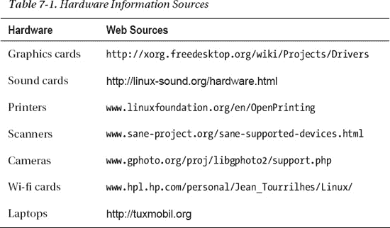

不幸的是，与 Windows 不同，在硬件附带的光盘上找到 Linux 驱动程序并不常见。即使您找到了提供的 Linux 驱动程序，它也有可能只适用于某些面向企业的 Linux 版本，如 Red Hat Enterprise Linux 或 SUSE Linux Enterprise Desktop。有些驱动程序是可用的，但是不完善，或者缺少 Windows 中的功能。在撰写本文时，Ubuntu 尚未获得让制造商专门为其生产驱动程序的势头，但这可能会在未来发生变化，特别是随着更多用户通过上网本和移动设备接触到该系统。各种 OEM 厂商都在开源的水里摸过脚。戴尔和 Shuttle 是目前将 Linux 与他们的一些桌面产品捆绑在一起的最大的公司，较小的专业公司如 System 76 与优秀的预安装产品竞争。

另一方面，Linux 通过内核处理大多数硬件。如果硬件制造商已经为公众提供了一个设备的规范，那么内核中可能有一个开源驱动程序来处理你的硬件。对于市场上时间稍长的硬件设备来说尤其如此(这意味着开源开发者有时间开发特定的驱动程序。如果是这样的话，你会看到 Ubuntu 只是识别设备，根本不需要额外的配置。

 **注意**可以使用一个名为 alien 的程序将为其他发行版设计的软件安装包转换成 Ubuntu 安装文件。这样做并不复杂，但可能无法很好地处理驱动程序文件，因为在不同的 Linux 发行版中，系统文件的存储位置有细微的差别。你可以在`[http://kitenet.net/~joey/code/alien/](http://kitenet.net/~joey/code/alien/)`找到更多关于外星人的信息。它包含在 Ubuntu 软件仓库中，可以使用 Ubuntu 软件中心或新立得软件包管理器下载。外星人的图形前端在`[http://code.google.com/p/foxoman/wiki/PackageConverter](http://code.google.com/p/foxoman/wiki/PackageConverter)`可用。

#### 使用专有驱动程序还是开源驱动程序

正如本书前面所讨论的，Linux 是一个开源操作系统。这意味着 Linux 程序的源代码是可用的，因此每个感兴趣的人都可以为其进一步开发做出贡献，或者研究软件的编写方式。对于硬件驱动程序来说，这是一件好事，因为任何有兴趣的人都可以发现并修复代码中的错误。如果您认为图形驱动程序中的一个错误可能意味着您的 PC 每 5 分钟就崩溃一次，那么这种方法的价值就非常明显了。

不幸的是，一些硬件制造商不喜欢透露他们的硬件是如何工作的，因为他们想保护他们的商业秘密。这使得他们不可能发布开源驱动程序，因为这样的驱动程序会暴露硬件是如何运行的。因为这些公司意识到越来越多的人使用 Linux，他们发布了*专有驱动*，其源代码不公开(与 Windows 源代码不公开的方式相同)。

除了不能研究源代码的道德问题之外，专有驱动程序的最大问题与错误修复有关。使用专有驱动程序将受到硬件制造商自己的开发和发布时间表的支配。如果驱动程序有严重的错误，你要么解决它，要么忍受麻烦的问题，直到制造商提供更新。几年前，一个 3D 图形卡的专有驱动程序阻止安装它的任何计算机进入休眠模式(即，暂停到磁盘)。那些使用驱动程序的人不得不等待数月直到补丁发布。

尽管如此，尽管 Ubuntu 背后的人强烈支持自由和开源软件，他们意识到在某些情况下需要使用专有驱动程序。例如，除非您有专有的驱动程序，否则无法使用某些显卡的 3D 图形元素，这意味着对于那些碰巧拥有开源驱动程序当前不完全支持的硬件的用户来说，视觉效果将是不可用的。

正因为如此，如果不存在开源替代方案(或者如果开源版本还不够好)，Ubuntu 会默认自动安装 wi-fi 专有驱动程序。它还提供了轻松安装一些专有显卡驱动程序的机会，如果它们比开源版本提供更多功能的话。

 **注意** Linux 从技术的角度看待硬件，而不是人类的角度。如果你连接了一个 USB CD-R/RW 驱动器，Linux 会识别这个驱动器的硬件并试图让它工作。它不会尝试为特定品牌和型号 CD-R/RW 驱动器找到驱动程序。因此，Linux 能够与多种硬件一起工作，因为许多硬件在技术层面上是相似的，尽管在外壳设计、型号名称甚至价格上有所不同！

什么硬件可以工作？

什么样的硬件在 Ubuntu 下工作这个问题不容易回答。不过你可以看一下`[http://www.ubuntu.com/certification](http://www.ubuntu.com/certification)`看看你的硬件有没有列出来。

如果 Ubuntu 硬件列表没有帮助，谷歌这样的搜索引擎是你最好的朋友。只需搜索硬件的品牌和型号，并将 **Ubuntu** 添加到搜索字符串中。这应该会返回结果，通常来自 Ubuntu 论坛(`[http://ubuntuforums.org](http://ubuntuforums.org)`)或博客，由那些找到使这种类型的硬件工作的方法的人编写。

#### 安装设备管理器

使用 Windows 时，您可能遇到过设备管理器，它是一个方便的工具，可以列出您电脑的硬件并提供对各种属性的访问。Ubuntu 提供了一个类似的软件，如图 7-1 所示，但它并不是默认安装的。

连接到互联网后(按照本章“上网”一节中的说明)，您可以使用 Synaptic 软件包管理器安装设备管理器(参见本章“安装软件”一节)，如下所示:

1.  从面板中，选择 Ubuntu 软件中心图标并单击它。
2.  您的光标会自动出现在搜索栏中，所以继续输入`**device manager**`。
3.  将出现一个程序列表。单击设备管理器，然后单击出现的安装按钮。询问时输入您的密码。
4.  进度条将显示软件正在安装。完成后，程序图标旁会出现一个绿色勾号。你现在可以关闭 Ubuntu 软件中心窗口。

***图 7-1。** Ubuntu 的设备管理器程序可以显示你需要知道的关于连接硬件的所有信息。*

安装设备管理器后，你可以在 Ubuntu 菜单中打开它，方法是在搜索栏中输入设备管理器。接下来，单击图标启动程序。你需要点击查看设备属性，以确保设备管理器添加有用的(但有时是压倒性的)属性标签。

您应该知道 Windows 和 Ubuntu 版本的设备管理器之间的一些重要差异。虽然 Ubuntu 的设备管理器的目标是管理硬件设备，但该项目仍处于起步阶段，在撰写本文时只能提供硬件信息。另一方面，Ubuntu 的列表远比 Windows 中的全面。在 Ubuntu 中，设备管理器彻底地探测硬件以发现它的能力。

然而，也许最大的区别是，仅仅因为一个硬件被列在 Ubuntu 的设备管理器中，并不意味着这个硬件被配置为与 Ubuntu 一起工作。事实上，这并不意味着硬件会在 Ubuntu 下工作。设备管理器的列表只是探测连接到各种系统总线(PCI、AGP、USB 等)的设备并报告数据的结果。

尽管如此，如果您发现某个硬件不工作，设备管理器是最好的起点。如果列出了某个硬件，那么它至少证明了系统识别出该硬件已连接。例如，在本章的后面，我们将介绍如何使用设备管理器来发现无线网络设备的重要细节，然后使用这些细节来安装驱动程序。

 **提示**如果你的电脑还没有联网，你需要使用一台联网的电脑(可能是另一台电脑，或者 Windows，如果你是双启动的话)来下载软件，然后把它复制到你的 Ubuntu 电脑上进行安装。要下载该软件，请在浏览器中访问以下两个地址。键入每个地址后，系统会提示您下载文件:

[http://us . archive . Ubuntu . com/Ubuntu/pool/universe/g/gnome-device-manager/gnome-device](http://us.archive.ubuntu.com/ubuntu/pool/universe/g/gnome-device-manager/gnome-device)

-manager_0.2-3_i386.deb

[http://us . archive . Ubuntu . com/Ubuntu/pool/universe/g/gnome-device-manager/lib gnome](http://us.archive.ubuntu.com/ubuntu/pool/universe/g/gnome-device-manager/libgnome)

-设备管理器 0_0.2-3_i386.deb

下载完文件后，使用 USB 记忆棒或类似的存储设备将它们复制到你的 Ubuntu 机器的桌面上。右键单击`libgnome-device-manager0_0.2-3_i386.deb`图标，在上下文菜单中选择第一个选项，用 Gdebi 包管理器打开。将出现软件包安装程序窗口。单击安装包按钮，并在系统询问时提供您的密码。软件包安装完成后，关闭窗口。接下来，右键单击另一个图标，对于`gnome-device-manager`本身，重复相同的过程。

### 配置 Ubuntu

与某些版本的 Linux 不同，Ubuntu 不依赖于集中的配置软件包。相反，它使用更小的程序来配置硬件。例如，要配置网络，您将使用 NetworkManager 程序，而打印机是使用单独的打印机配置程序来配置的。因为使用某些配置软件需要重新配置整个系统，所以这样做需要管理员权限。因此，每次使用某些程序时，系统都会提示您输入登录密码。在某些情况下，做出更改后，您需要单击“应用”按钮以使更改生效。完成配置后，只需单击关闭按钮关闭程序窗口。

 **注意**你输入密码后，Ubuntu 会记住你的密码 5 分钟。因此，如果您在这段时间内打开同一个应用程序或另一个需要管理员权限的应用程序，系统不会提示您再次输入密码。

**从社区获得帮助**

配置硬件是 Ubuntu 社区的价值变得非常明显的一个领域。如果你遇到问题，你的情况不太可能是独一无二的。其他人可能会遇到同样的问题，并可能已经找到了解决方案。如果有，他们可能已经发布到网上了。如果没有别的，你可能会找到足够的线索，能够自己解决这个问题。以这种方式分享信息是 Ubuntu 和 Linux 精神的一部分。

我们试图在这一章中提供大多数硬件配置的完整指南，但是如果你遇到问题，你的第一站应该是 Ubuntu 论坛，在`[www.ubuntuforums.org](http://www.ubuntuforums.org)`。这是 Ubuntu 社区的中心聚会场所。你可以搜索现有的论坛帖子，或者创建自己的帖子寻求帮助。我们在附录 c 中解释了更多关于寻求帮助的协议。关键的建议是，在你向别人寻求帮助之前，试着花时间自己解决问题。

在困难时期也值得访问的是社区写的 wiki，可以在`[https://help.ubuntu.com/community](https://help.ubuntu.com/community)`找到。在这里你可以找到一系列的指南来帮助你配置 Ubuntu 的各个方面。维基 T2 是一种社区网站，任何人都可以编辑或投稿。这个想法是，它是由读者构建和维护的。

我们还建议看一看 Ubuntu 指南，在`[http://ubuntuguide.org](http://ubuntuguide.org)`，它也是由社区编写的。Ubuntu 指南可以很简洁，通常需要相对较高程度的技术知识，但也很全面。

最后，不要忘记你也是社区的一员。如果您遇到并随后解决了配置问题，请与他人分享解决方案。你可以通过编辑 Ubuntu wiki 或者在论坛上发帖来实现。

### 配置输入设备

鼠标和按键的重复速度因用户而异，你可能会发现默认的 Ubuntu 设置不合你的口味，尤其是如果你有一个高分辨率的鼠标，如游戏模式。幸运的是，更改每个设置很容易。

#### 配置鼠标选项

打开应用程序，在搜索栏中键入 mouse 以显示鼠标首选项图标。单击它可打开“鼠标首选项”对话框，其中有“常规”和“辅助功能”选项卡。在笔记本电脑上，您可能还会看到触摸板选项卡。

##### 常规鼠标设置

在鼠标首选项对话框的常规选项卡上，如图[图 7-2](#fig_7_2) 所示，您可以配置几个选项。

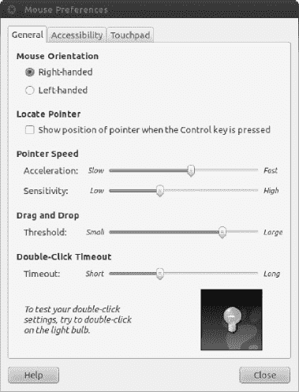

***图 7-2。**鼠标首选项对话框让您驯服鼠标。*

这些选项如下:

*   ***鼠标方向:*** 该选项让您设置鼠标是由左撇子还是右撇子使用。实际上，它交换了左右按钮的功能。
*   ***定位指针:*** 该选项允许您在按下 Ctrl 键时，通过在鼠标指针周围显示波纹来显示鼠标的位置。这对于在繁忙的桌面上找不到光标的弱视人士来说很有用。
*   ***加速度:*** 该设置控制鼠标指针移动的速度。每当你移动鼠标，屏幕上的指针就会移动相应的量。然而，实际上你移动手越多，光标的速度就越快(否则，你需要在桌子上拖动你的手，从屏幕的一边移动到另一边)。这被称为*加速度*。如果你把加速度设置得太高，指针会在屏幕上飞来飞去，似乎停不下来。如果你把它设置得太慢，你将需要滑动鼠标几次来让它去任何地方。
*   ***灵敏度:*** 此设置控制当你第一次移动鼠标时加速的速度。选择较高的设置意味着您可以在鼠标开始加速并覆盖更多屏幕空间之前相对快速地移动鼠标。较低的设置意味着几乎一移动鼠标就开始加速。更高的灵敏度设置可以让您更好地控制鼠标，例如，如果您使用图像编辑程序，这可能会很有用。
*   ***拖放:*** 该设置决定了在光标下的项目移动之前，拖动动作中允许的鼠标移动量。它是为那些灵活性有限，或者在选择项目时无法保持鼠标完全静止的人设计的。在这种情况下，大阈值可能是优选的。
*   ***双击超时:*** 这个对于身体不太灵巧的人来说很理想，因为双击速度可以慢下来。另一方面，如果你发现自己不小心双击了项目，你可以加快速度。双击灯泡图像来测试您的设置。

每个设置调整后都会发生变化，所以要测试新设置，只需移动鼠标。

##### 辅助功能设置

“辅助功能”选项卡上的设置可以帮助身体残疾的人使用鼠标。但是，要启用这些功能，您需要首先在 Ubuntu 中启用辅助技术，如下所示:

1.  打开“辅助技术首选项”对话框(在面板中，单击“应用程序”,然后在搜索栏中键入“辅助”。这将显示辅助技术图标。点按它以打开“辅助技术”偏好设置。
2.  选中“启用辅助技术”复选框，然后单击“关闭并注销”按钮(这是启动后台服务所必需的)。
3.  在关机对话框中选择注销，然后在出现提示时再次登录。
4.  登录后，返回鼠标首选项对话框的辅助功能选项卡(应用程序鼠标)。

在“辅助功能”选项卡中，您可以启用模拟辅助单击和停留单击选项。选择“通过按住主按钮触发二次单击”复选框，在您按住左键一段时间后模拟右键单击(这对那些右键单击有困难的人很有用)。当你释放鼠标按钮时，实际上就发生了右击，例如，当你点击一个文件图标时，弹出一个上下文菜单。您必须按住鼠标按钮的时间可以通过向左移动延迟滑块来配置，以获得更快的响应，或向右移动以获得更长的延迟。

*停留点击*允许您在鼠标指针闲置一定时间后模拟鼠标点击动作，例如，将鼠标悬停在图标上几秒钟就可以双击它来启动应用程序。若要启用此功能，请选择“停止指针移动时启动点按”您可以设置空闲时间的长度，方法是将延迟滑块向左移动以减少空闲时间，或向右移动以增加延迟时间。运动阈值设置决定了鼠标仍被视为空闲时允许的指针移动量(对于那些可能无法控制手部微小运动的人很有用)。向左移动运动阈值滑块使鼠标指针变得灵敏；向右移动会使指针不那么灵敏。您可以选择两种类型的停留点击:

*   ***预先选择点击类型:*** 该选项在鼠标指针空闲时自动点击鼠标。如果您想选择每次鼠标点击的类型，请勾选“显示点击类型窗口”旁边的复选框。这将显示一个浮动窗口，您可以从中选择各种类型的单击，如单击、双击等。或者，您可以从停留点击小程序中选择鼠标点击。(小程序将在本章后面的“使用小程序”一节中讨论。)
*   ***选择鼠标手势的点击类型:*** 该选项允许您选择鼠标移动空闲时执行的鼠标点击类型，通常是向上、向下、向左或向右。只要等到鼠标变成十字，然后移动鼠标。完成移动后，鼠标将回到移动前的原始位置。通过更改单击、双击、拖动单击和二次单击下拉列表中的手势，可以自定义所有的鼠标移动。

 **注意** Orca，GNOME 的屏幕阅读器软件，也包括一个放大鼠标指针下区域的工具。它位于“辅助技术”偏好设置中。选择首选应用程序选项，并将 Orca 设置为“启动时运行”该软件既可以用来放大鼠标下的屏幕区域，也可以使用语音合成器大声读出屏幕上的元素。

##### 触摸板设置

“鼠标”偏好设置中的“触摸板”标签仅出现在笔记本电脑上。您可以设置以下选项:

*   ***打字时禁用触摸板:*** 打字时拇指球很容易不小心擦到触摸板。此选项默认启用，通过在每次按键后立即禁用触摸板来解决问题。
*   ***启用触摸板鼠标点击:*** 这允许你通过点击触摸板来模拟鼠标点击。取决于你的触摸板的灵敏度，这要么是伟大的，要么是世界上最讨厌的事情。
*   ***滚动选项:*** 像鼠标上的滚轮一样，你笔记本电脑的触摸板可以用来上下滚动页面和图像，甚至可以左右滚动。默认情况下，垂直边缘滚动是启用的，因此在触摸板的右边缘上下移动手指将会上下滚动网页。如果启用水平滚动，您还可以通过沿触摸板底部边缘移动手指来左右滚动。双指滚动选项禁用边缘滚动，如果您有两个手指同时在触摸板上移动，它会使触摸板滚动。如果你不喜欢这些功能，你可以选择完全禁用滚动。

#### 更改键盘设置

在应用程序界面中，键入 keyboard。这将显示键盘图标，您可以使用该图标打开键盘首选项对话框。此对话框有五个选项卡:常规、布局、辅助功能、鼠标键和键入分隔符。

##### 常规设置

常规选项卡提供重复键设置和光标闪烁滑块。你可以改变按键重复的速率，如果你经常按住退格键来删除一个句子，这是很有用的；延迟滑块上较短的设置和速度滑块上较快的设置会有所帮助。但是，如果您将延迟时间设置得太短，您可能会发现文档中会出现双字符；例如，键入一个 *f* 可能会导致 *ff* 。

如果您有时在文档中丢失光标，修改光标闪烁滑块设置可能会有所帮助。更快的速度意味着光标在闪烁之间不可见的时间更少。

##### 布局设置

在布局选项卡上，您可以选择您的键盘型号，添加替代键盘布局，并配置布局选项，如图[图 7-3](#fig_7_3) 所示。通常，通用键盘适用于大多数设置。但是，如果您想充分利用键盘上的额外按键，如 Mail、Web、Power、Sleep、Suspend 等，您应该选择您的键盘型号。

如果你在键盘上用两种不同的语言书写，在它们之间切换可能会有所帮助。单击添加按钮，并从列表中选择第二种语言。要从一种语言切换到另一种语言，您可以在面板中添加键盘指示器小程序，并通过单击小程序从一种语言切换到另一种语言。

通过单击“选项”按钮可以访问“键盘布局选项”对话框，该对话框允许您从众多影响键盘工作方式的便利调整中进行选择。例如，您可以将 Caps Lock 键配置为类似于简单的 Shift 键，或者您可以完全关闭它。您可以配置 Windows 键，使其也执行不同的功能。通读完整的列表后，在你想要的选项旁边打勾。

***图 7-3。**您可以在这里选择另一种键盘布局*

##### 辅助功能设置

与鼠标一样，键盘用户也有辅助功能选项来帮助身体残疾的人。在“辅助功能”选项卡上，您可以配置以下设置:

*   ***常规:*** 您可以通过键盘快捷键选择启用/禁用(“切换”)辅助功能。默认情况下，这是禁用的。

 **警告**除非你确定需要，否则不要勾选“辅助功能可以通过键盘快捷键切换”复选框。启用后，如果您碰巧按住 Shift 键八秒钟，或者轻按 Shift 键五次，将会出现一个对话框，询问您是否要启用粘滞键或慢速键功能。这可能会引起混乱！

*   ***粘滞键:*** 有些人无法一次按住多个键，如果你想键入 Ctrl+S 之类的键盘快捷键来保存你的工作，这是一个问题。顾名思义，粘滞键的功能是在您按下键盘上的另一个键时“按住”Shift、Ctrl 和 Alt 等键。要启用粘滞键，请选中模拟同时按键复选框。您可以通过运行文件浏览器来测试粘滞键(单击面板中的文件和文件夹)。尝试按顺序按 Alt 和 F；Nautilus 将打开文件菜单，就像你同时按下这些键一样。如果您想在不使用此对话框的情况下动态停用粘滞键，请选择“如果两个键同时按下，则停用粘滞键”您可以通过按 Ctrl+Alt 来测试这一点。将出现一个粘滞键警告对话框，提示您禁用粘滞键。
*   ***慢速键:*** 该功能控制按键的反应速度。通过向左移动延迟滑块，按键的反应速度变得更快。通过向右移动滑块，按键的反应速度变得更慢，以至于您需要按住按键一段时间才能将其视为按键。这对于手指灵活性有限的人来说有明显的用途，但大多数人不希望启用这一功能。
*   ***弹跳键:*** 该功能控制当意外按下同一个键时，屏幕上字母的重复。向左移动滑块，重复率会更快；向右移动增加了重复按键的时间。

对话框底部是一个文本框，用于输入内容以测试您刚刚配置的设置。您也可以通过点按“通知”按钮来启用声音通知。这些通知会让您知道何时启用或禁用了键盘辅助功能。您可以设定常规辅助功能、粘滞键、慢速键和弹跳键的声音提醒。

##### 鼠标键设置

鼠标键功能允许您使用数字键盘来控制鼠标指针。通过选择“可以使用小键盘控制指针”复选框并按下 Num Lock 键，您可以通过从数字小键盘键入来移动鼠标指针。

启用鼠标键后，5 键既模拟鼠标单击，又充当围绕它的方向轮的中心。1、2、3、4、6、7、8 和 9 键模拟鼠标方向。一些数字键盘上有箭头来表示这一点。

您可以移动加速度滑块来调整按下鼠标键时鼠标移动达到全速所需的时间。

速度滑块设置按下鼠标键时鼠标指针的距离偏移量。通过向左移动速度滑块，当您按下鼠标键时，鼠标指针覆盖的距离变小，给您一种鼠标移动变慢的错觉。通过向右移动速度滑块，当您按下鼠标键时，鼠标指针会覆盖更大的距离，给您一种鼠标移动更快的错觉。

延迟滑块决定在鼠标指针开始移动之前按下鼠标键的时间。您可以通过向左移动延迟滑块来设置延迟，以获得更快的响应时间，向右移动则获得更长的延迟时间。

##### 打字中断设置

“打字休息”选项卡有一个功能，可以强制您在预定的分钟数后停止打字，让您的手指和手腕休息一下。它通过消隐屏幕并显示“休息一下！”消息。请注意，在休息时间之前会出现一个通知区域图标，向您提前发出锁定警告。

#### 创建键盘快捷键

Ubuntu 允许你为系统上的任何操作定义自己的快捷键。要创建快捷方式，请从面板中打开应用程序并键入 keyboard。这显示了几个图标，包括键盘快捷键图标。单击它，在对话框中，在列表中搜索要为其创建快捷方式的操作，单击它，然后按下要使用的组合键。例如，您可以在列表中找到“调高音量”和“调低音量”条目，单击每个条目，然后按 Ctrl+左箭头键和 Ctrl+右箭头键。然后，您可以通过按住 Ctrl 键并分别点击向左或向右箭头键来调高或调低声卡的音量。

 **注意**注意不要给一个常用键指定快捷键。例如，让图腾媒体播放器在你按空格键时出现可能会很好，但这将意味着每当你在文字处理器中键入一个句子时，它将启动几次！还要注意的是，应用程序会使用一些组合键。例如，在 OpenOffice.org 的 Writer 中，Ctrl+左/右箭头键组合可以在段落中一个单词一个单词地移动。如果您将这些组合定义为快捷方式，您将不再拥有此功能。

一个方便快捷的例子是配置你的 H `ome`文件夹在你按 Ctrl+Home 时出现。这可以通过在桌面标题下找到主文件夹选项来完成。

### 上网

在现代互联网时代，上网是至关重要的，Ubuntu 迎合了所有标准的上网方式。Linux 从一开始就是一个在线操作系统，当然是基于 UNIX 的，UNIX 在 20 世纪 70 年代开创了将计算机联网以共享数据的概念。然而，这并不是说用 Ubuntu 上网很难！其实很简单。

无论您使用的是移动宽带连接、标准有线以太网设备还是无线网络设备，都可以使用同一个程序 NetworkManager 来配置 Ubuntu 下的网络设置。内置了对许多品牌和型号设备的支持，因此在大多数情况下，您需要做的只是输入一些配置细节。

 **注意**使互联网运转的计算机中，大约 60%运行的是 Linux 操作系统！如果你使用谷歌、脸书或维基百科，你就是在使用 Linux。随着你的 Linux 技能的提高，你最终会达到一个阶段，你也可以运行你自己的互联网服务器。这听起来很难，但可能很容易。

#### 使用网络管理器

NetworkManager 让用户可以轻松管理无线(也称为 wi-fi)和有线连接，以及移动宽带连接。此实用程序的图标位于桌面右上方的通知区域，并根据当前活动的连接类型(有线网络的上/下箭头、无线网络的无线电波等)而变化。NetworkManager 会自动检测范围内的任何无线网络，以及您当前是否接入了有线网络。如果您自动连接到网络，屏幕右上方会出现一个黑色通知框，持续几秒钟，然后消失。

单击屏幕右上角的网络管理器图标将显示检测到的网络列表。通过选择列表中的条目，您可以连接到网络，系统会提示您配置 WEP/WPA 保护(如果适用)。

 **注意**有时我们会被提示无线保护的*错误类型*——例如，当我们试图连接到网络时，我们被要求 128 位 WEP 密钥而不是 64 位密钥。换句话说，检查你是否得到了正确的提示，如果没有，选择正确的选项是值得的。不这样做可能会导致沮丧！如果你真的卡住了，请务必阅读您的无线路由器文档。

在此之后，只要您处于连接状态，网络管理器图标就会显示连接的信号强度。通过点按它，您将能够一目了然地看到您所连接的网络以及范围内的任何其他网络。如果您想切换网络，只需单击网络管理器图标并在列表中选择不同的网络。如果这是一个安全的网络，在授予您访问权限之前，系统会提示您输入密码。

 **提示**右击网络管理器图标，你可以选择完全禁用你的网络硬件。如果你不需要网络，并且想保存你的笔记本电池，这是非常有用的。

如果上次配置的网络在范围内，NetworkManager 设置会在重新启动后保持不变。这意味着 NetworkManager 是各种无线网络用户的理想选择，从那些经常在不同网络之间切换的用户(即移动工作人员)到那些只使用单一无线网络连接的用户，例如家庭/小型办公室环境中的无线网络宽带路由器。网络管理器也可以让你切换到有线(以太网)连接，如果你把一个连接到你的电脑。

网络管理器将自动检测网络和连接类型。如果您想要手动提供详细信息，如 IP 地址和网关，或者无线基站的名称(如果您的基站不广播其名称或者您需要连接到专门的设置，这可能是必需的)，您可以通过编辑连接来完成。

#### 配置有线网络

每台传统的台式机或笔记本电脑都带有一个以太网端口，用于与路由器、集线器或交换机建立有线网络连接。

无线网络作为一种替代方案非常受欢迎，尤其是对于笔记本电脑等便携式设备，但通过电缆连接在速度、可靠性和安全性方面具有优势。由于这些原因，有线以太网连接仍然是办公环境中的标准。即使在家里，如果您的路由器附近有一台台式计算机，您也可以使用路由器附带的以太网电缆连接它们。

在大多数情况下，NetworkManager 会检测有线以太网连接，并使用动态主机控制协议(DHCP)自动连接。这意味着您的计算机会自动接收其 IP 地址、网关、子网掩码和域名系统(DNS)地址。今天制造的所有路由器都设置为自动使用现成的 DHCP。

 **提示**如果 DHCP 服务器不可用，Ubuntu 将尝试使用 Zeroconf(或零配置网络)系统自动建立网络，就像微软的 Windows 系统一样。(微软称之为自动私有 IP 地址，但它也被称为*本地链接*。换句话说，如果一群计算机临时接入集线器或路由器，在没有配置和 DHCP 服务器运行的情况下，它们将能够相互联网。为了做到这一点，每台计算机随机分配给自己一个唯一的 IP 地址，以`169.254`开头，子网掩码为`255.255.0.0`。

如果您需要手动指定网络详细信息(如 IP 和路由器地址),可能是因为您在使用非标准系统的办公环境中工作，请首先咨询您的系统管理员或技术支持人员，以确定您需要的设置。向管理员询问您的 IP 地址、DNS 服务器地址(通常有两三个)、您的子网掩码和路由器地址(有时称为*网关地址*)。您将从系统管理员那里获得的设置通常是由点分隔的一系列四个数字，类似于`192.168.0.233`。获得这些信息后，请按照下列步骤操作:

1.  左键单击通知区域中的网络管理器图标，并从菜单中选择编辑连接。
2.  从选项卡栏中选择“有线”选项卡，然后单击“添加”按钮。这将启动新的网络配置屏幕，您可以在其中创建有线网络的配置文件。要更改现有有线连接的设置，请选择通常标记为 Auto eth0 的连接，然后单击编辑修改其属性。
3.  为新连接提供一个名称。然后选择 IPv4 设置选项卡，并将方法下拉列表从自动(DHCP)更改为手动。
4.  单击添加并提供设备的 IP 地址、子网掩码和网关地址。您还应该填写 DNS 服务器和搜索域的区域。您可以向这些部分添加多个地址，用逗号分隔每个地址。[图 7-4](#fig_7_4) 显示了这些设置的一个例子。填写信息后，单击应用。该网络将被添加到列表中。

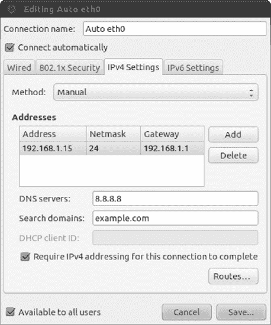

***图 7-4。** Ubuntu 将自动使用 DHCP 网络，或者您可以定义一个静态 IP 地址。*

 **提示**如果你在路由器上使用静态 ip 地址，比如 DSL 调制解调器提供的地址，DNS 地址通常与路由器/网关地址相同。

您的网络连接现在应该可以工作了。如果您现在设置了多个有线网络连接，您可以通过单击网络管理器图标并在有线网络下选择适当命名的连接来在它们之间切换。如果您新设置的连接不起作用，请尝试重新启动。但是，如果您的系统管理员提到还必须配置一个代理，您需要按照本章后面的“使用代理服务器”一节中的说明进行操作。

#### 连接到无线网络

顾名思义，无线(wi-fi)网络是一种不需要布线，使用无线电频率进行通信的网络。笔记本电脑和掌上电脑使用无线连接更常见，但一些台式电脑也使用无线连接。事实上，越来越多的情况是，许多工作场所正在转向无线网络，避开老式的有线网络。

 **注**wi-fi 正在缓慢但稳步地取代有线以太网。然而，有时 wi-fi 网络不切实际或根本不可取。例如，一些建筑中的金属基础设施意味着信号变得不可靠。对于一些公司来说，Wi-fi 也被认为太不安全，因为 wi-fi 信号经常会传播到大楼外面的街道上。虽然这种传输几乎总是安全的，WPA2 被认为是安全的，但 wi-fi 安全实施已被打破。以太网可能被认为是旧技术，但试图从物理电缆窃取数据要困难得多，几乎不可能。

笔记本电脑和 PDA 通常使用内置无线网络设备，并在外壳中内置一根隐形天线。然而，一些旧的笔记本电脑可能使用 PCMCIA 卡，它有一个外部方形天线，而一些台式计算机可能使用基于 PCI 的无线卡或 USB 加密狗，它有外部橡胶/塑料天线，就像旧的手机一样。

Ubuntu 支持大多数无线网络设备。但是，对于不受支持的硬件，可以使用 Windows 无线网络设备驱动程序。在过去这是必要的，现在你会发现你的无线网卡在大多数情况下都是受支持的。在极少数情况下，Ubuntu 似乎支持无线网络设备，因为它可以识别无线网络设备并让您进行配置，但您可能会发现它根本无法工作(或者工作非常糟糕，可能是断断续续的连接)。在这种情况下，您也可以尝试安装 Windows 驱动程序。有关详细信息，请参阅本章后面的“安装 Windows 无线网络设备驱动程序”一节。

 **注意** Ubuntu 在 Linux 世界中很少见，因为它默认使用一些专有的(闭源)无线设备驱动程序。毕竟，Ubuntu 是一个开源操作系统，致力于自由和开源软件的目标。使用专有驱动程序被认为是一种必要的罪恶，因为现在并不是所有的设备都有开源驱动程序，也不是所有的开源驱动程序都支持你可能习惯的所有功能(例如，通常它们可能不支持你的 wi-fi 设备的 WPA 功能)。专有驱动的使用被认为是一种权宜之计，希望制造商能够意识到支持开源驱动开发符合他们的利益，使专有驱动成为多余。

使用 NetworkManager 可以轻松连接到无线网络设备。只需点击网络管理器图标，您将在无线网络列表中看到可用的 wi-fi 网络。受 WEP/WPA 保护的网络在名称右侧的无线图标中有一个挂锁，如图[图 7-5](#fig_7_5) 所示。那些“开着”的没有这个挂锁。

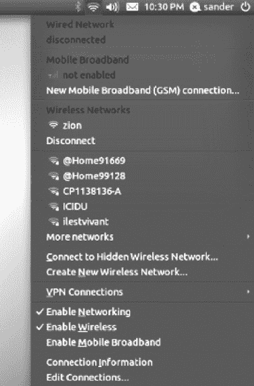

***图 7-5。**点击网络图标显示可用无线网络列表。*

根据您所在的位置，您可能会看到列出了许多 wi-fi 网络。无线基站通过它们的服务集标识符(SSID)或有时通过 ESSID 来识别，其中 *E* 代表*扩展*。

如果网络管理器没有列出您想要连接的 SSID，这可能意味着您的无线基站没有设置为广播它的 SSID，或者更糟糕的是，Ubuntu 的 wi-fi 驱动程序没有正常工作。如果是前者，您只需右键单击网络管理器图标并选择连接到其他无线网络。然后，在新建对话框中，在网络名称下键入 SSID，将无线安全设置为无或适当的安全类型，根据您选择的无线安全类型填写其他信息，然后单击连接。如果是后者，您可能需要使用 Windows 驱动程序，如下一节所述。

 **提示**如果没有为您提供任何无线网络，请确保无线硬件已打开。一些笔记本有一个键盘组合来关闭它以节省电池电量。其他人在笔记本的一边有一个小开关。左键单击网络管理器图标，并确保选中了“Enable Networking(启用网络)”和“Enable Wireless(启用无线)”。

若要连接到 wi-fi 网络，请在列表中选择您想要连接的无线基站。如果它不受 WEP/WPA 保护，您将自动连接到它。

如果您希望连接的 wi-fi 网络受 WEP 或 WPA 保护，则会出现一个对话框，提示您输入密码/口令，如[图 7-6](#fig_7_6) 所示。在“无线安全”字段中，确保为无线网络选择了正确的安全类型——这通常是正确的，但不要认为它会自动正确！默认情况下，密码/密码短语被圆圈字符混淆，因此任何人越过你的肩膀看不到你在键入什么。如果有帮助(如果你的肩膀是干净的)，选择显示密码框。当您键入一个特别长的密码短语时，这非常方便。

 **注意** WEP 密钥有十六进制(hex)或纯文本(密码短语)两种。十六进制密钥的 128 位形式与此类似:`CB4C4189B1861E19BC9A9BDA59`。在它们的 64 位形式中，它们会更短，看起来可能类似于`4D9ED51E23`。密码短语将采用一个简短句子的形式。在家庭和办公室环境中，WPA 网络通常受密码保护。在大型企业或学术环境中，您可能会发现网络受到 WPA 证书的保护。

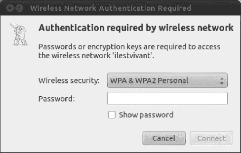

***图 7-6。** Ubuntu 能够加入受 WPA 保护的无线网络。*

完成后，点击连接按钮。当程序尝试连接并找到 IP 地址时，您应该会看到网络管理器图标开始显示。几秒钟后，当动画结束，图标切换到显示信号强度，你应该发现自己在线。

如果您的电脑似乎无法连接，请尝试重新启动。如果在此之后硬件不工作，可能是 Ubuntu 默认安装的驱动程序与你的网络设备不兼容。在这种情况下，您可以尝试使用 Windows 无线网络设备驱动程序，如下一节所述。

如果您发现自己在特殊情况下需要为无线连接指定 IP 地址、子网掩码和网关，您可以使用 NetworkManager 的手动配置模式，如本章前面的“配置以太网设备”一节所述。只需按照该部分中的说明进行操作，但在列表中选择无线连接条目，而不是有线连接。在出现的对话框中，您会看到用于输入 SSID 和 WEP/WPA 保护详细信息的附加区域。

**WEP 诉 WPA**

大多数无线网络都使用有线等效保密(WEP)或保护无线电脑网络安全系统(WPA)系统进行保护。WPA 实际上是 WEP 的更新版本，提供了更强的保护。水渍险有两种版本:水渍险和 WPA2。WPA2 是较新的，并纠正了 WPA 中的几个安全缺陷。两者的工作方式大致相同。

WEP 和 WPA 对在网络上传输的数据进行加密，这样做的目的是防止数据被拥有特殊设备的黑客窃取。此外，人们无法加入无线网络，除非他们知道加密密钥，加密密钥基本上是一个访问代码或密码，防止未经授权的人访问网络。与安全性非常重要的其他情况一样，您应该选择包含大小写、标点符号和数字的强密码。

在这两者中，您应该理想地将您的 wi-fi 基站配置为使用 WPA，因为遗憾的是，WEP 可能会在 5 分钟内被容易获得的软件破坏。然而，对于一些 Ubuntu 用户来说，情况并不那么明朗。并不是所有 Ubuntu 的内置 wi-fi 驱动都支持 WPA。有些人可能声称支持它，但你可能会发现他们并不可靠。不幸的是，您能够发现是否是这种情况的唯一方法是尝试配置您的网络设备，看看会发生什么。

如果您的 Ubuntu PC 不支持 WPA(只有一小部分用户会支持)，您可能会发现 WEP 是您唯一可靠的选择，因此您可能需要重新配置基站来使用它。我们的经验表明，在 Ubuntu 下，WEP 的成功率非常高。然而，有时 128 位 WEP 无法在一些麻烦的 wi-fi 设备上工作，您可能需要将网络切换到 64 位 WEP。

WEP 在安全方面是一种妥协，但是在考虑您的直接环境时，请尽量保持现实。如果您的无线网络在您的家中，住在隔壁的夫妇有可能知道如何破解无线网络连接吗？他们可能想要这样做吗？

另一方面，如果你和其他几个懂电脑的人住在一个公寓楼里，或者如果你在办公室工作，风险可能会高得多。有些人认为闯入无线网络几乎是某些人的运动。如果是这种情况，并且您觉得您不能使用 WEP，考虑使用 NdisWrapper 安装 Windows 驱动程序，这将在本章后面解释。

但是不管是哪种情况，请记住，机密的互联网连接，例如银行和购物网站的连接，都是使用单独的技术独立保护的。有关详细信息，请参阅本章后面标题为“网络安全连接”的边栏。

#### 安装 Windows 无线网络设备驱动程序

NdisWrapper 实际上是一个开源驱动程序(技术上称为*内核模块*)，它允许 Linux 为无线网络设备使用标准的 Windows 驱动程序。您可能会将 NdisWrapper 描述为 Linux 内核和 Windows 驱动程序之间的转换层，可以使用 NdisWrapper 的配置工具安装它。

只有在以下两种情况下才应该使用 NdisWrapper:

*   ***你的无线网络硬件根本不被 Ubuntu 识别:*** 你点击 NetworkManager 图标看到的都是手动配置选项；您看不到任何列出的无线网络。当然，您应该首先确保您的计算机中的无线硬件是打开的，一些笔记本电脑提供了关闭它以节省电池寿命的功能。
*   ***您的网络硬件已被 Ubuntu 识别，但在您配置它时无法正确或充分地工作:*** 也许它无法与无线基站关联，或者也许您无法连接到支持 WPA 的基站，并认为 WEP 对您的环境太不安全。如果是这种情况，除了安装 NdisWrapper 之外，您还需要执行一个额外的步骤来将现有的 Ubuntu 驱动程序列入黑名单。

使用 NdisWrapper 相对简单，只需要几个命令。然而，获得必要的 Windows 驱动程序文件是一项更困难的工作，因为不幸的是，NdisWrapper 不是为使用驱动程序分发的常用方法而设计的:`.exe`文件。相反，NdisWrapper 需要构成驱动程序的特定的`.inf`和`.sys`文件——实际上是 Windows 系统文件。这些包含在`.exe`文件中，必须手动提取。

 **注意**有时候驱动是作为`.zip`文件分发的，这种情况下相关文件很容易获取。请祈祷这将是您的特定硬件的情况！

NdisWrapper 远非完美。并不是所有的无线设备都被证明可以使用它，也不一定适用于 Windows 的驱动程序就能在 Linux 下工作。有时需要反复试验。恼人的是，Windows 驱动程序有时看起来工作正常，但后来证明并不可靠。有些人可能会停止工作。有些甚至会让你的系统崩溃。最好的计划就是试一试。

 **提示** NdisWrapper 随着每一个新版本变得越来越好。这就是为什么定期更新你的系统是个好主意。

在本节的说明中，我们解释了如何使用 NdisWrapper 让苹果 MacBook 内置的 Atheros AR5008 无线网络设备在 Ubuntu 下工作。对于所有类型的无线网络硬件，这些说明基本上是相同的。但是，一些具体的细节，如下载地址，显然会有所不同。

首先，您需要安装 NdisWrapper 软件，然后您可以安装必要的 Windows 驱动程序。这些步骤将使您的无线网络设备在 Ubuntu 下可用。然后，您可以按照上一节中的说明连接到该无线网络。

##### 安装 NdisWrapper 配置工具

NdisWrapper 由两个组件组成:内核模块和配置工具。内核模块是缺省内核包的一部分，所以缺省情况下会安装，但是您需要手动安装配置工具。

要做到这一点，请按照前面的“配置以太网设备”一节中的说明，确保使用有线连接连接到您的路由器，并建立有效的有线网络连接。然后启动 Ubuntu 软件中心，你可以在应用程序下找到它。搜索 **windows wireless** 并安装将出现在搜索结果中的 windows wireless 驱动程序包。出现提示时，您需要输入密码。安装此软件包不仅会自动安装图形化的 Windows 无线驱动程序安装工具，还会自动安装底层软件包`ndiswrapper-utils`和`ndiswrapper-common`。

##### 安装 Windows 驱动程序

安装 NdisWrapper 配置软件后，您可以安装 Windows 无线网络设备驱动程序。该过程有几个部分:

*   识别无线网络硬件，然后获取适当的 Windows 驱动程序。如果您使用 Windows 进行双启动，驱动程序可能已经存在于您的 Windows 分区中。
*   从驱动存档中提取必要的`.sys`和`.inf`文件(可能还有`.bin`文件，尽管这很少见)。
*   您可能需要将内置的 Ubuntu 驱动程序“列入黑名单”(即告诉系统忽略)，以便 NdisWrapper 可以与硬件关联。
*   使用 NdisWrapper 配置工具安装 Windows 驱动程序。

这些步骤将在以下章节中介绍。您将需要另一台已经在线的计算机来下载一些文件，并查看 NdisWrapper 网站上的信息。如果您的计算机双启动，您可以使用 Windows 安装程序来完成此操作，或者如果您的计算机上有以太网端口，您可以插入有线网络。

###### 识别您的无线网络硬件和采购驱动程序

要识别与 NdisWrapper 一起使用的无线网络硬件，您需要两条信息:硬件的品牌和型号以及 PCI ID 号。前者是 Ubuntu 通过系统探测确定的硬件品牌和型号，而不是无线网络设备包装或文档中引用的品牌和型号。Ubuntu 发现的这些细节通常与底层组件的制造商有关，而不是组装和销售计算机的公司。PCI ID 是两个四位数的十六进制数字，由您的计算机用来在内部识别设备(如`168c:001a)`)。Windows 和 Ubuntu 使用相同的 PCI ID 编号系统，这就是它在这个例子中如此有用的原因。

您可以使用设备管理器工具找到 PCI ID 和制造商/型号信息。如果您尚未安装该程序，请按照本章前面“安装设备管理器”一节中的说明进行操作。然后按照以下步骤操作:

1.  从面板中，选择应用程序并启动设备管理器。在左栏中，找到显示网络控制器、网络无线控制接口或 WLAN 接口的条目。你也可以寻找 USB 接口、PCI 桥或 802.11 来穷尽你的搜索。然后查看右栏中相应的摘要，您会发现供应商和型号标题下列出了硬件的品牌和型号。如果没有列出有用的详细信息，您可能需要单击列表中的父条目。在一个测试系统上，我们找到了 WLAN 接口条目，但是只有在我们单击左侧列表中的以太网控制器父条目后，才能看到品牌和型号的详细信息。
2.  记下设备管理器中显示的品牌和型号。例如，在包含 Atheros 无线网络设备的测试笔记本电脑上，品牌和型号显示为 AR5001 无线网络适配器。请记住，这些细节与说明手册或电脑包装中列出的内容无关(我们笔记本的规格仅将硬件列为内置 AirPort Extreme Wi-Fi)。这是因为 Ubuntu 一般识别硬件，从它的组件硬件中读取信息。
3.  单击设备管理器的属性选项卡(如果看不到，请单击查看设备属性),查看信息中以`info.udi`开头的行。查看行尾，记下由下划线分隔并以`pci_`开头的两组字符。请看[图 7-7](#fig_7_7) 中取自我们测试机器的示例。你的可能不同，但是这条线应该总是以`pci_`结尾，然后是数字。如果没有，您在左边的设备列表中选择了错误的条目。尝试检查不同的条目，例如列表中条目的父条目。
4.  在`info.udi`行的末尾写下`pci_`后面的字符。由下划线分隔的两组数字写在一起，形成最重要的 *PCI ID 号*。在书面形式中，它们通常用冒号分隔。如果任何一组字母或数字的长度少于四个字符，只需在它们前面加零就可以得到四个字符。在我们的测试机器中，`info.udi`线的末端显示为`168c_1a`。我们在`1c`前加两个零，组成一个完整的 PCI ID`168c:001a`。在另一台 PC 上，行尾显示`168c_13`。在`13`前添加两个零给出一个 PCI ID`168c:0013`。
5.  Using another computer that's able to go online, visit `[http://sourceforge.net/apps/mediawiki/ndiswrapper/index.php](http://sourceforge.net/apps/mediawiki/ndiswrapper/index.php)`. Under the Documentation heading, click the “List of known working devices” link. This is a community-generated listing of the wireless network devices that have been proven to work with NdisWrapper. 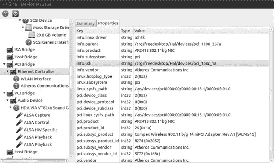

    ***图 7-7。**查看* *`info.udi`* 行的末尾，找到无线网络硬件的 PCI ID。

     **提示**本书付印时，第五步中的网址是正确的。如果你发现它不再准确，搜索谷歌，使用 **NdisWrapper list** 作为搜索词。

6.  “已知工作”卡按字母顺序分组。根据卡制造商的名称选择适当的列表。(请记住使用您在步骤 1 和 2 中使用设备管理器发现的名称，*而不是*电脑手册或包装上的正式名称。)
7.  使用浏览器的搜索功能(Firefox 中的 Ctrl+F ),按照步骤 4 中描述的格式查找您之前记录的 PCI ID 号。对于图 7-7 中的示例，我们将搜索 **168c:001a** 。在列表中，寻找与下列内容相匹配的内容，按重要性顺序排列:
    1.  PCI ID
    2.  设备管理器报告的无线硬件的型号名称(列在“摘要”选项卡上)
    3.  笔记本的制造商和型号，如其包装或文档中所述
8.  It's likely many entries in the list may match your PCI ID, so search until you find the one that best matches the model of the hardware. If there are *still* many matches, search until you find an entry that matches the manufacturer and model of the notebook. You might not be lucky enough to find an exact match for the notebook manufacturer and model, however, and you might need to select the most likely choice. Use your common sense and judgment. If your notebook is manufactured by ASUS, for example, but you can't find the drivers for the exact model, then choose drivers for another ASUS model.

     **注意**注意驱动文件描述中提到的`x86_64`。这表明列表中的条目与 64 位 Linux 相关。本书附带的 Ubuntu 版本是 32 位。如果遇到与`x86_64`相关的条目，继续搜索。

9.  在列表的条目中查找驱动程序文件的直接链接。有时没有给出，但会提到制造商的网站地址，您可以访问并导航到驱动程序下载部分(通常在网站的支持部分下)。下载 Windows 驱动程序版本。

###### 提取驱动程序组件

下载驱动程序后，您需要提取与您的无线网络硬件相关的`.sys`和`.inf`文件。这些都是 NdisWrapper 需要的，其余的驱动文件可以丢弃。然而，提取文件可能很难，因为它们通常包含在一个`.exe`文件中。(大部分驱动`.exe`文件其实都是自解压的存档文件。)此外，驱动程序文件可能包含几种不同型号硬件的驱动程序，因此有必要识别与您的无线网络设备相关的特定驱动程序`.inf`文件。

如果你下载的驱动程序是一个`.zip`文件，你的任务可能会容易得多。只需双击下载的`.zip`文件，在其中查找包含实际驱动程序文件的目录。

如果驱动程序是一个`.exe`文件，就需要提取其中的文件。如果运气好的话，假设你已经用 Windows 下载了这个文件，你可以用一个像 WinZip ( `[www.winzip.com](http://www.winzip.com)`)这样的存档工具来完成这个任务。只需使用 WinZip 中的文件打开菜单选项打开归档文件。您可能需要从文件类型下拉列表中选择所有文件，以便`.exe`文件显示在文件列表中。然而，如果你使用的是 Windows，我们推荐一个名为 Universal Extractor 的开源免费程序，可以从`[www.legroom.net/software/uniextract](http://www.legroom.net/software/uniextract)`下载。这个程序可以从几乎所有类型的档案中提取文件，包括大多数驱动程序安装文件。安装完成后，只需右键单击安装文件`.exe`，并选择 UniExtract to Subdir。这将在下载文件所在的目录下创建一个新文件夹，其中包含安装程序文件的内容。

在您提取了下载的驱动程序文件中的文件后，查找您需要的文件。驱动文件可能包含在一个叫做`Driver`的文件夹中，或者以操作系统命名，比如`Win_XP`。找到相关目录后，查找`.inf`、`.sys`和`.bin`文件(尽管您可能找不到任何`.bin`文件；它们仅在少数驱动程序中使用)。您可以忽略任何其他文件，例如`.cab`和`.cat`文件。单击并拖动`.inf`、`.sys`和`.bin`文件至单独的文件夹。

现在的任务是为您的硬件找到`.inf`文件。如果不止一个，你需要逐个搜索，直到找到你需要的。您需要查找与您之前记录的 PCI ID 相对应的文本。在文本编辑器中打开第一个`.inf`文件(在 Windows 中双击将执行此操作),并使用搜索工具搜索 PCI ID 的第一部分，如前所述。对于图 7-7 中的例子，我们将搜索`**168c**`。如果在文件中没有找到，则移动到下一个`.inf`文件并再次搜索。当你得到一个搜索匹配时，它可能会出现在一长串文本中，并且在文本`VEN_`的右边。然后进一步查看该行，看是否提到了 PCI ID 的第二部分，可能是在显示为`DEV_`的文本的右边。在我们为示例下载的驱动程序文件中，`.inf`文件中的整行如下所示(两个组件 PCI ID 部分以粗体显示):

`%ATHER.DeviceDesc.001B% = **ATHER_DEV_001B.ndi, PCI\VEN_168C&DEV_001A**`

如果您在行中找到了 PCI ID 的两个组成部分，如本例所示，那么您就找到了您需要的`.inf`文件。(事实上，您可能会发现*许多*行符合您的需求，这很好。)

您现在必须将`.inf`文件，连同`.sys`和`.bin`文件(如果驱动程序中包含任何`.bin`文件)一起传输到您想要安装驱动程序的计算机上。这可以通过将它们放入软盘、CD 或 USB 记忆棒来实现。在桌面上创建一个名为`driver`的新目录，并保存在那里。

从这一点开始，您的过程取决于 Ubuntu 是否在您第一次启动时识别了您的无线网络设备，但无法使其正常工作。如果是这样，您需要将内置驱动程序列入黑名单，以便 NdisWrapper 可以与硬件关联。如果设备未被识别，您可以直接跳到“使用 NdisWrapper 安装驱动程序”一节。

###### 将现有驱动程序列入黑名单

要将与您的无线设备不兼容的现有内置驱动程序列入黑名单，您需要找出内核模块的名称，然后将其添加到`/etc/modprobe.d/blacklist`文件中。以下是步骤:

1.  从面板中，选择应用程序并打开设备管理器。)接下来在列表中为您的无线网络设备选择条目。这是您在前面的“识别无线网络硬件和获取驱动程序”一节的步骤 1 和 2 中发现的。
2.  单击属性选项卡(如果看不到，单击查看设备属性),并查找以`info.linux.driver`开头的行。然后查看“值”列，记下其中的内容。例如，在我们的一个测试笔记本上，值列显示为`ath5k`。关闭设备管理器。
3.  按住键盘上的 Alt 键，然后按 F2。这将打开运行应用程序对话框。键入以下命令，在 Gedit 文本编辑器中打开`blacklist`配置文件:`gksu gedit /etc/modprobe.d/blacklist.conf`
4.  单击运行，并在出现提示时输入您的密码。
5.  在文件的底部，在新的一行中键入以下内容:
    `blacklist modulename`
6.  用您之前发现的模块的名称替换`modulename`。例如，在我们的测试系统上，我们输入如下内容(如图[图 7-8](#fig_7_8) ):
    `blacklist ath5k`
7.  保存文件，然后重新启动计算机。

您现在应该发现，当您单击 NetworkManager 图标时，无线网络设备不再可见，您看到的只是一个手动配置选项。这很好，因为这意味着硬件不再附带驱动程序，您现在可以告诉 NdisWrapper 使用该硬件。

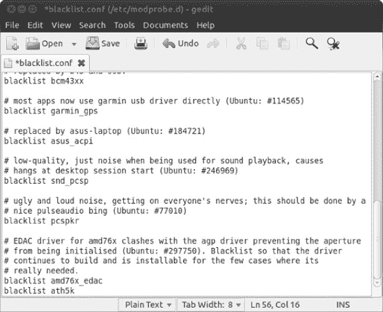

***图 7-8。**要阻止 Ubuntu 加载自己的驱动，你可能需要将该模块列入黑名单。*

###### 使用 NdisWrapper 安装驱动程序

在你想安装驱动程序的 Ubuntu 电脑上，你现在应该有前面步骤中的`.inf`文件，加上构成驱动程序的`.sys`和可能的`.bin`文件。您应该已经将这些文件从可移动存储设备复制到桌面上名为`driver`的新文件夹中。

 **注意**如果你用 u 盘传输文件，一旦插入，它的图标就会自动出现在桌面上。完成后，右键单击它并选择 Unmount。您必须在物理移除任何类型的 USB 存储设备之前执行此操作，本章稍后将对此进行解释。

要使用 NdisWrapper 安装驱动程序，请按照下列说明操作:

1.  从面板中选择应用程序，并在搜索栏中键入 windows。这将显示 Windows 无线驱动程序应用程序的图标。如果你还没有安装它，你会在可供下载的应用部分看到它。如果是这种情况，只需点击它开始安装。接下来，启动 Windows 无线驱动程序应用程序。出现提示时，输入您的密码。
2.  点击安装新驱动程序按钮。
3.  出现“安装驱动程序”对话框，提示您为无线设备选择`.inf`文件。单击位置下拉列表打开文件浏览对话框。
4.  导航到您复制到系统的`.inf`文件，该文件放在桌面上的`driver`文件夹中。双击桌面文件夹，然后双击右栏中列出的`driver`文件夹。在`driver`文件夹中选择您复制的`.inf`文件，然后点击打开按钮。
5.  返回安装驱动程序对话框，单击安装按钮。
6.  此时，您应该看到驱动程序列在“无线网络驱动程序”对话框的左栏中。它指定安装的驱动程序的名称以及是否安装了硬件。如果它说硬件没有安装，你可能选择了错误的`.inf`文件，或者可能使用了错误的驱动文件。回到前面的章节，并尝试获得一个替代的 Windows 驱动程序。
7.  不需要重新启动，您的无线网卡应该立即工作。要测试驱动程序是否工作，请单击网络管理器图标并查看是否列出了无线网络。如果工作正常，单击“关闭”退出“无线网络驱动程序”对话框。

接下来，您应该会发现网络设备可以进行配置了。按照前面的说明连接到无线网络。

###### 正在删除 NdisWrapper 驱动程序

如前所述，尽管 NdisWrapper 可以解决许多无法正常工作的无线硬件的问题，但它并不完美。您可能会发现您安装的 Windows 驱动程序根本不起作用。在这种情况下，您可以下载不同版本的驱动程序，然后重试。但是首先你需要删除现有的驱动程序。

从面板的应用程序菜单中，选择 Windows 无线驱动程序，并在出现提示时输入您的密码。在 Windows 网络驱动程序对话框中，在左栏中选择要删除的驱动程序，然后单击删除驱动程序。当提示确认删除时，单击是。单击关闭退出该工具。

**保护网络连接**

对于家庭用户来说，使用网上银行服务需要传输机密数据。那么，这是在您的宽带路由器上使用最强形式的无线网络加密的好理由吗？不，它不是。其实没什么区别。

这是因为在网上传输机密或金融数据——例如，来往于网上银行网站——几乎总是受到安全套接字层(SSL) HTTP 的保护。这适用于任何类型的网络连接，包括无线和以太网，无论该连接是否有自己的保护。

你可以知道你正在浏览一个使用 SSL 的网站，因为地址将以`https`开头。此外，大多数浏览器会在屏幕底部显示一个挂锁符号(Firefox 浏览器也会将地址栏的背景变成黄色)。访问这样的网站应该是安全的，即使你的无线网络连接是“开放的”，也就是说它不受 WEP 或 WPA 的保护。

类似地，虽然在线购物网站可能在你浏览的时候不使用 SSL，但是当付款的时候，他们总是使用 SSL。这可以确保您的信用卡信息被加密。如果当你点击访问虚拟收银台时，商店没有采用`https://`地址，你就不应该在那里购物！

那么，如果你只是简单地使用无线连接来浏览互联网，你甚至需要 WEP 或 WPA 保护吗？是的。如果您的连接没有受到保护，除了会有未经授权的用户跳到您的连接上的风险之外，一些 web 邮件服务会“明文”传输您的用户名和密码，也就是说不使用 SSL。这意味着你的信息可能会被窃听者窃取。以 Hotmail 和雅虎为例。Mail，您可以选择安全登录，但默认情况下不会激活。谷歌邮件似乎一直使用 SSL 登录，但在此之后，你的电子邮件信息在互联网上以明文传输，理论上，任何人都可以窃听它们。

#### 连接到移动宽带网络

许多国家现在拥有广泛的 3G 蜂窝网络，能够以宽带速度向移动设备传输数据。默认情况下，智能手机现在具有 3G 功能，3G USB 适配器(“加密狗”)可以插入您的笔记本电脑，这在现收现付或合同安排中很常见。高端笔记本和上网本现在标配移动宽带适配器。

Ubuntu 为移动宽带设备提供了出色的支持，无论您是想通过插入笔记本电脑的 3G USB 适配器、内置 3G 适配器进行连接，还是通过 USB 电缆连接 3G 手机。

您可以按如下方式设置移动宽带设备:

1.  将您的 3G 设备(加密狗或手机)连接到笔记本电脑:
    *   通过 USB 电缆连接的加密狗应能被立即识别。
    *   手机通常需要切换到调制解调器模式，您需要查阅制造商的文档以了解详细信息。例如，当你将诺基亚智能手机插入笔记本电脑时，手机上会出现一个对话框，让你选择切换到大容量存储模式或 PC 套件模式。选择后者使其充当调制解调器。
    *   如果您的笔记本电脑有内置的 3G 设备，请确保它已打开。
2.  单击 Ubuntu 桌面顶部面板中的网络管理器图标。如果您的 3G 设备已被识别，您应该会看到一个额外的标题“移动宽带”，在它下面是“新建移动宽带(GSM)连接”，您应该单击它来启动新建移动宽带连接设置向导。
3.  该向导中的三个简单步骤是:
    *   *选择你的提供商的国家:*根据你在安装 Ubuntu 时所做的区域和语言选择，这可能已经被正确设置了，但是在你点击前进之前还是要检查一下。
    *   *选择您的提供商:*您应该会看到您所在国家的所有 3G 提供商列表。选择你的。万一您的提供商未被列出，您可以手动输入名称。单击前进。

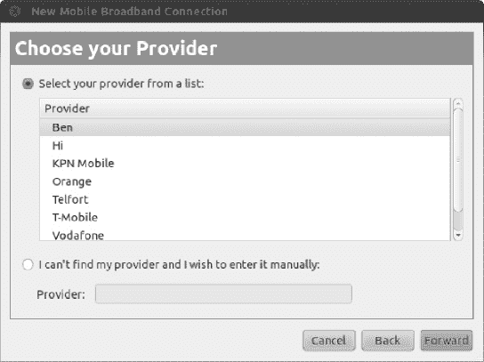

***图 7-9。** Ubuntu 的移动宽带连接向导让建立 3G 连接变得简单。*

*   *选择您的付费方案:*根据您的服务提供商提供的选项，“选择您的方案”下拉列表中会显示几个预设选项。例如，对于沃达丰英国公司，选项有合同、预付费、充值和 Go。您的 3G 设备应该有正确的计划名称，但如果没有，还有一个额外的选项“我的计划没有列出”，这将让您手动设置 APN(接入点名称)。(您必须向您的提供商询问此信息)。单击前进，检查设置，然后单击应用。

如果您在 3G 覆盖区域内，您的移动宽带设备现在应该建立连接，并且所有必要的设置(如 IP 地址、网关和域名服务器)都应该自动配置。

***图 7-10。**啊哈。现在你已经安装了高速移动宽带连接，无论你在哪里，你的老板都会希望你努力工作！*

#### 使用代理服务器

办公室、学校和大学中的一些网络要求您使用 web 代理(通常称为 *HTTP 代理*)。一个*代理*是一台服务器计算机，它通过为所有网页提供一个单一的入口来提供额外的安全性。它还通过存储经常访问的页面来帮助加速互联网访问。这意味着，如果十个人请求同一个网页，就没有必要从互联网上获取同样的十条数据。代理计算机可以向他们发送自己的副本。

您需要咨询您的系统管理员，以了解您所在的位置是否使用代理。如果是这样，您的管理员很可能会给您一个地址，该地址可能采用网址(URL)或 IP 地址的形式。获得这些信息后，请按照以下步骤配置代理:

1.  打开网络代理首选项(从面板中选择应用程序，然后在搜索栏中键入代理)。
2.  在“代理配置”选项卡上，选择三种代理配置类型之一:
    *   默认情况下，会选择“直接 Internet 连接”选项，这意味着网络流量是直接路由的，不使用代理。
    *   手动代理配置使您能够为 HTTP 代理、安全 HTTP 代理、FTP 代理和 Socks 主机设置代理服务器和各自的端口。您可以根据系统管理员提供的设置填写此信息。如果为您提供了一个用于 Internet 访问的代理，请选择对所有协议使用相同的代理复选框，并填写 HTTP 代理和端口的详细信息，如图 7-11 所示。如果您的代理使用身份验证，请点按“详细信息”按钮。在“HTTP 代理详细信息”对话框中，选择“使用身份验证”复选框，然后提供用户名和密码。单击关闭按钮。
    *   自动代理配置允许您输入链接(URL)来发现您所在位置的代理设置。
3.  在“忽略的主机”选项卡上，您可以设置将绕过代理的站点列表。默认情况下，任何托管在您自己计算机上的站点都会被绕过。您也可以添加和删除站点。您通常会将内部网(内部)网站添加到此列表中。
4.  完成对代理设置的更改后，点按“关闭”按钮。

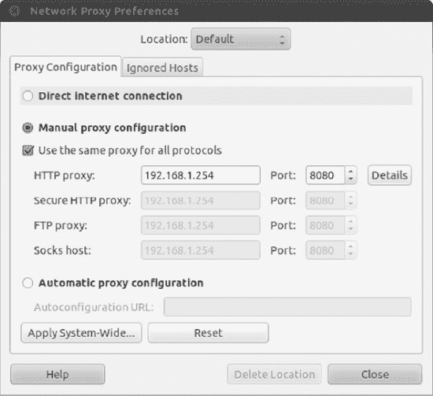

***图 7-11。**可以为各种位置配置代理设置。*

如果您有一台在不同地点使用的笔记本电脑，您可以设置一系列代理配置，以便在移动时随时选择。要创建新位置，请从窗口顶部的位置下拉列表中选择新位置，输入名称，然后设置适当的值。保存后，每个配置在位置下拉列表下仍然可用。

提示一些互联网服务提供商也运行代理服务器。然而，与办公室中的代理不同，是否选择使用它们通常取决于您。你可能会发现使用代理可以加快你的连接速度，尤其是当你访问热门网站时，所以值得一试。要了解您的 ISP 是否提供代理，请访问其技术支持网页或拨打其技术支持热线。

### 添加打印机

Ubuntu 支持各种各样的打印机型号——从激光打印机到彩色喷墨打印机，甚至包括一些非常古老的点阵打印机。

如果您在办公环境中工作，您可能需要访问共享打印机。共享打印机通常是通过将设备直接连接到网络来实现的。打印机本身通常有特殊的内置硬件来实现这一点。或者，打印机可以插入 Windows 计算机，如 Windows 服务器(甚至只是某人的桌面 PC)，共享以便其他用户可以访问它——这种设置称为 *Windows 打印机共享*。Ubuntu 将支持这两种类型的网络打印机。

 **小心**现在绝大多数打印机都受 Linux 支持，并且工作出色。然而，一些制造商仍然不愿意公布他们的打印机如何工作的信息，使得 Linux 支持变得困难或不可能。如果你想买一台新打印机，并且希望它能与你的 Ubuntu 系统兼容，一定要查看`[www.openprinting.org/printers](http://www.openprinting.org/printers)`上的 OpenPrinting 打印机列表，这样可以避免购买昂贵的镇纸。

#### 配置本地打印机

本地打印机是一种直接连接到你的电脑的打印机，通常通过 USB 连接。任何你连接到电脑上的打印机都会被 Ubuntu 自动配置并立即可用，如图[图 7-12](#fig_7_12) 所示。如果你的打印机需要一个专有的驱动程序，系统会提示你提供密码，然后 Ubuntu 会引导你下载并安装驱动程序。

***图 7-12。**当您将任何本地打印机连接到电脑，然后打开它们时，它们会自动配置。*

但是，如果打印机在打印时出现故障，例如在发送打印作业时出现大量纸张、打印垃圾或根本不工作，您可以尝试自己进行配置。要设置本地打印机，请按照以下说明操作:

1.  在面板中，单击应用程序，然后在搜索栏中键入 Printing。在打印机配置窗口中，单击添加按钮。您会看到信息“正在搜索打印机”这可能需要一些时间来完成。
2.  在“新建打印机”对话框中，您需要选择要配置的打印机。Ubuntu 检测到的打印机在“设备”下列出。单击要使用的打印机，然后单击“前进”按钮继续。您将看到消息“正在搜索驱动程序”
3.  Select the printer manufacturer. By default, Ubuntu selects the manufacturer that best fits your printer, but you can select another manufacturer from the list. Alternatively, you can provide the PostScript Printer Description (PPD) file if the built-in drivers cannot operate your printer. When you've finished, click Forward.

     **提示**你可以在打印机附带的光盘上找到 PPD 文件，或者下载下来。OpenPrinting ( `[www.openprinting.org](http://www.openprinting.org)`)和 Adobe ( `[www.adobe.com/products/printerdrivers/winppd.html](http://www.adobe.com/products/printerdrivers/winppd.html)`)提供了许多打印机驱动程序供下载。

4.  Ubuntu 再次为您的打印机选择检测到的型号和相应的驱动程序，但您可以更改这些选择。如果默认驱动程序不能正常工作，请尝试一个相似但不同的模型。从左栏的型号列表中选择合适的型号，然后从右栏的驱动程序列表中选择适合您的打印机的驱动程序。单击前进按钮继续。
5.  您将被邀请给打印机一个名称。默认应该是 OK。如果需要，您可以填写“描述”和“位置”字段，但只有当您打算通过网络共享打印机时，这些字段才是必需的。完成后，单击应用。

 **提示**在网络上共享您的打印机，以便其他计算机可以使用它很简单:打开打印机配置窗口(从面板中单击应用程序，并在搜索栏中键入打印)，从服务器菜单中选择设置，并在发布连接到此系统的共享打印机框中打勾。然后单击确定按钮。

安装完成后，打印机将出现在打印机配置窗口中。要查看它是否正常工作，双击查看打印机属性，如图 7-13 中的[所示，然后单击窗口底部的打印测试页按钮。](#fig_7_13)

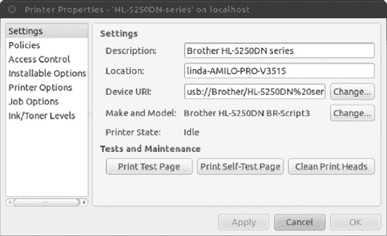

***图 7-13。**打印机配置完成后，您可以查看其属性，并通过打印测试页进行测试。*

如果打印机安装正确，您应该会看到一个显示颜色渐变的测试页。

如果打印机安装不正确，它要么根本无法工作，要么开始一页一页地输出垃圾文本。如果是这种情况，请单击“取消测试”(打印测试页按钮原来所在的位置),然后关闭打印机。通过在左侧列表中选择打印机并单击打印机配置窗口顶部的删除按钮，删除打印机驱动程序。然后重复安装步骤，这次尝试不同的设置或不同的驱动程序。

#### 配置网络打印机

网络打印机是一种不直接连接到计算机的打印机。相反，它通过以太网电缆或有时通过 wi-fi 适配器连接到网络。这样，办公室里的所有电脑都可以使用它。还可以将连接到您电脑的打印机共享给网络上的其他电脑。共享通常使用 Windows 网络协议(SMB)来完成。在这种情况下，请遵循下一节中的说明。

一些打印机内置了所需的服务器硬件，但其他打印机可能使用连接到打印机 USB 或并行打印机端口的特殊打印服务器模块。Ubuntu 可以支持这两种硬件。

Ubuntu 与 UNIX (LPD)、HP JetDirect 和互联网打印协议(IPP)服务器类型兼容。这些是目前用于独立打印机服务器的最普遍的类型。

在开始之前，您需要找出打印机的网络(IP)地址，如果相关的话，还要找出队列名或端口号。通过与网络管理员或打印机配置人员交流，您应该能够找到这些详细信息。如果由您来配置网络打印机，请查阅其手册，了解如何设置静态 IP 地址。

按照以下步骤配置网络打印机:

1.  From the Panel click Applications and in the search bar type Printing. Now start the printing application. In the Printer configuration window, click the Add button.

     **提示**您可以添加任意数量的打印机。您可以配置本地打印机(即连接到您的计算机的打印机)，然后配置网络打印机。

2.  最新型号的网络打印机将被自动检测并显示在设备列表中。如果是，请选择打印机名称，然后单击前进，继续执行步骤 5。
3.  如果没有自动检测到您的打印机，您可以使用“查找网络打印机”功能来查询网络上的打印机，并发现它偏好的打印协议。为此，单击查找网络打印机，在主机字段中输入打印机的网络地址，然后单击查找。如果一切正常，将在列出的设备中创建一个新条目，您可以单击 Forward 并继续执行步骤 5。
4.  以前的方法通常无法发现较旧的打印机，在这种情况下，您可以在“设备”列表中手动设定打印协议。如果您不确定选择哪个，请尝试互联网打印协议(IPP)。如果您希望连接带有惠普打印服务器的惠普打印机，请选择 AppSocket/HP JetDirect。(你也可以选择 LPD/LPR 主机或打印机，但这早已被 IPP 取代。)在主机字段中，输入打印机的网络地址。在 HP JetDirect 的情况下，默认端口号应该可用，除非您被明确告知输入不同的端口号。根据您选择的服务器选项，您可能还需要输入队列名称。如果是 IPP，你需要提供主机和打印机队列，但是 Ubuntu 让设置变得很容易。只需在主机字段中键入网络地址，然后单击查找队列。IPP 浏览器对话框将弹出并显示打印机队列列表。选择打印机队列，然后单击确定。Ubuntu 将自动更新主机和队列字段中的条目。单击“验证”按钮，检查您是否可以使用更新后的设置访问打印机。如果失败，请尝试将主机字段更改为打印机的网络地址。正确设置后，单击前进。
5.  根据提示，选择打印机制造商、打印机型号和驱动程序以及打印机名称，就像配置本地打印机一样。有关指导，请参见上一节中的步骤 3、4 和 5。做出选择后，单击“应用”按钮。
6.  安装打印机后，从打印机配置窗口的列表中选择打印机，然后单击打印测试页。

如果打印机不工作，很可能是您设置了错误的服务器类型。尝试另一种类型；如果您第一次选择了 IPP，请第二次尝试 App Socket/HP JetDirect。许多打印服务器可以模拟各种模式，因此尝试不同的设置可能会奏效。

如果打印机开始打印一页又一页的文本，您可能选择了不正确的打印机驱动程序。通过单击取消测试取消打印机上的作业。接下来，在左侧列表中选择打印机，然后点按窗口顶部的“删除”按钮来移除打印机。然后重复安装步骤，这次尝试另一个驱动程序。

#### 配置 Windows/SMB 共享打印机

Windows(或 SMB)打印机直接连接到电脑，然后通过操作系统的网络共享功能在网络上使用。实际上，计算机充当打印机服务器。通常，在公司环境中，这种打印机连接到服务器计算机，但是个人可以共享连接到工作站的打印机。

在家庭环境中，Windows/SMB 共享是在多台计算机之间共享打印机的一种非常好且廉价的方式，但是如果您的打印机可以直接连接到网络，则不应该使用它。打印机连接到一台 PC 上，只要这台计算机打开，这台打印机就可供家中的其他计算机使用。这也是最大的缺点:如果你关闭电脑，打印机就不再可用。

假设打印机已正确设置为在主机上共享，则连接到 Windows/SMB 打印机共享很容易。其实你可能会发现 Ubuntu 在后台找到打印机，自动设置！如果您在选择从应用程序打印时发现打印机可用，请试用一下，看看它是否工作正常。

然而，更有可能的是，您需要手动添加它。按照以下步骤设置 Windows/SMB 共享打印机:

1.  从面板中单击应用程序，然后在搜索栏中键入 Printing。接下来启动打印应用程序。在打印机配置窗口中，单击添加按钮。
2.  在设备列表中，选择网络打印机，然后单击通过 SAMBA 的 Windows 打印机。
3.  单击“Browse(浏览)”按钮探测网络，查看是否有可用的打印机共享。可能会出现多个打印机，因此请浏览打印机共享，直到找到所需的打印机。选择打印机并单击确定按钮。如果您找不到 SMB 浏览器对话框中列出的打印机共享，您可能需要在`smb://`字段中手动输入详细信息，如图[图 7-14](#fig_7_14) 所示。该条目可能采用地址后跟打印机名称的形式(例如，`officepc/epson`)。请咨询您的系统管理员或负责共享打印机的个人，了解这些是什么。
4.  单击“验证”按钮，检查打印机是否可以访问。如果成功，请跳到步骤 6。如果失败，您可能需要提供用户名和密码来访问共享打印机，如下所述。
5.  选中“需要验证”复选框。在用户名和密码字段中，键入访问共享打印机所需的用户名和密码。这些可以是电脑的任何用户的登录详细信息，或者，如果共享电脑和打印机配置为访客访问，您可以尝试键入`**Guest**`作为用户名，并将密码栏留空。填写完详细信息后，单击前进。
6.  根据提示，选择打印机制造商、型号、驱动程序和名称，就像配置本地打印机一样。请参阅“配置本地打印机”一节中的步骤 3、4 和 5 以获取指导。做出选择后，单击“应用”按钮。
7.  安装打印机后，从打印机配置窗口的列表中选择打印机，然后单击打印测试页。

***图 7-14。** Ubuntu 应该能够自动检测网络上的任何 Windows 或 SMB 共享打印机。*

如果打印机发出好像要开始打印的噪音，但随后决定不打印，您可能需要更改 Windows 机器上的设置。在 Windows 上，单击开始打印机和传真，然后右键单击共享打印机的图标。选择属性，然后单击属性窗口中的端口选项卡。取消选中“启用双向支持”框，然后单击“确定”。然后重启 Windows 和 Ubuntu 电脑。

如果打印机开始打印一页又一页的文本，而不是测试页，很可能是您选择了错误的打印机驱动程序。通过单击取消测试取消打印机上的作业。接下来，在列表中选择打印机，并点按打印机配置窗口顶部的删除按钮来移除打印机。然后重复安装步骤，这次使用另一个驱动程序。

#### 管理打印机

像 Windows 一样，Ubuntu 使用打印队列的概念来处理打印。从应用程序打印时，打印作业会保留在打印队列中。如果队列为空，则立即打印作业。如果已经有等待打印的作业，或者打印作业已经在进行中，则新作业将被添加到队列中。

 **提示**如果您安装了多台打印机(也许您有一台连接到 PC 的打印机，但也可以打印到网络打印机)，您可以将其中一台设置为默认打印机，当您选择打印时，将自动选择该打印机。在打印应用程序中，绿色圆圈中的勾号表示您当前的默认打印机。如果您想将另一台打印机设为默认打印机，请右键单击其图标并选择设为默认。

当您打印文稿时，文稿打印状态图标会出现在通知区域(看起来像打印机)。单击图标查看等待打印的作业(如果有)。右键单击作业会显示上下文菜单，允许您取消、删除、保留和释放作业，甚至将其移动到不同的打印机。

当你从应用程序打印时，Ubuntu 会显示一个统一的打印机界面，就像你在 Windows 中习惯的那样。在 Gedit、GIMP 和 Firefox 中打印时，您会发现相似之处。唯一的例外是 LibreOffice，它提供了自己的简化打印对话框。

大多数使用统一打印对话框的应用程序将提供与该特定应用程序相关的附加独特选项。例如，F-Spot 照片管理器提供了对照片有用的设置，例如在单个页面上放置多个图像，而 Gedit 提供了与基本文本打印相关的功能。

确保在“打印”对话框(在“常规”选项卡上)左侧的列表中选择打印机，以便查看所有可用选项。

### 使用数码相机、MP3 播放器和 USB 记忆棒

*可移动存储*是一个术语，适用于您可能连接到电脑并包含自己的存储的外围设备。示例包括 USB 记忆棒、外部硬盘、MP3 播放器、数码相机和照片存储卡读卡器。您可能还会发现，当您将移动电话等设备直接连接到计算机时，它们会被视为可移动存储设备。

当您连接任何可移动存储设备时，Ubuntu 会执行以下操作:

*   在桌面上显示一个图标，双击该图标可以查看可移动存储设备的内容。
*   自动打开显示仪器内容的文件浏览器窗口。
*   将设备图标添加到文件浏览器的位置列表中，也可以通过顶部面板上的“位置”访问该列表。
*   如果可移动存储设备包含数字图像(例如，如果是数码相机)，文件浏览器窗口顶部会出现一个栏，其中有一个按钮，可让您将图像导入到 Shotwell 照片库程序。你会在第 18 章中了解到更多，这一章提供了一个对你的数字图像进行编目和操作的简明指南。类似地，如果你的设备包含音频文件，Ubuntu 会检测到这一点，并且会添加一个按钮让你在 Banshee 音频播放器中打开这些文件。

可移动存储设备的内容可以像系统上的任何其他文件一样进行访问。如果设备不是只读的(例如，如果 USB 记忆棒上没有设置只读开关)，您应该能够在设备上复制、删除和创建文件。如果设备包含 MP3 音乐，只要安装了播放编解码器，您就可以双击它们进行播放(参见[第 14 章](14.html#ch14))。

然而，当你在 Ubuntu(或者任何操作系统)下使用完可移动存储设备时，必须遵循一条非常重要的规则:在你物理移除设备之前，必须*安全移除*(或者用技术术语来说*卸载*)。这也适用于插入读卡器的存储卡，在从读卡器中取出任何卡之前，必须将其安全取出。

安全移除非常简单。只需右击桌面上或计算机窗口内的图标，选择安全移除驱动器，如图[图 7-15](#fig_7_15) 所示。在这样做之前，请确保保存并关闭您可能正在处理的任何文件，否则您可能会看到错误。您还需要关闭任何可能浏览过存储设备的文件浏览器窗口。

之后，您可以安全地物理移除卡或分离设备。重新插入它将使它再次可用。

***图 7-15。**你可能很想把文件复制到 u 盘里，然后拿出来，但是为了保护你的数据，u 盘应该被卸载掉。*

 **注意**当你在电脑上读写存储卡时，请小心不要从读卡器中取出存储卡。这很可能会对卡造成不可修复的损坏。最起码会把卡里的内容擦掉。

### 配置扫描仪

扫描仪可能看起来像是被数码相机取代或被多功能设备吸收的古老机器，但它们仍然是将非数字图像和文本文档转换为数字格式的最佳方法。

很多平板扫描仪可以在 Ubuntu 下工作，但并不是所有类型都受支持。您可以通过访问`[www.sane-project.org](http://www.sane-project.org)`查看当前支持的扫描仪列表。列表中会不断添加新的型号，这也是确保您的系统完全更新的另一个原因(参见第 8 章，其中解释了如何更新您的系统软件)。

测试你的扫描仪是否受 Ubuntu 支持的最好方法就是看看它是否能工作。Ubuntu 中的扫描由简单扫描工具处理。这是一个独立的程序，其运行方式类似于您可能在 Windows 下使用的 TWAIN 驱动程序。

要配置扫描仪并扫描图像，请按照下列步骤操作:

1.  从面板中，打开应用程序，并在搜索栏中键入扫描。现在启动简单扫描应用程序。启动时，该程序会尝试检测您的扫描仪。如果找到兼容型号，简单扫描将开始。如果扫描仪未被识别，会出现一个对话框告诉您。
2.  使用简单扫描就像它的名字一样简单。只需将原件放在扫描仪上，然后点击扫描按钮。没有预览。简单扫描将继续以全分辨率扫描您的原件，并显示结果图像。然后，您可以使用工具栏中的控件裁剪、旋转图像并将图像保存到磁盘。简单扫描支持的文件类型有 PNG(无损)、JPEG(压缩)和 PDF。
3.  在简单扫描中，在文档首选项下，您可以根据扫描仪的功能更改文本和照片的扫描分辨率，还可以设置默认页面尺寸。

简单扫描对于大多数目的来说应该足够好了，但是如果你想对你的扫描有更多的控制，比如调整伽玛、对比度和亮度，你可以考虑安装 Xsane，它可以在 Ubuntu 软件中心找到。

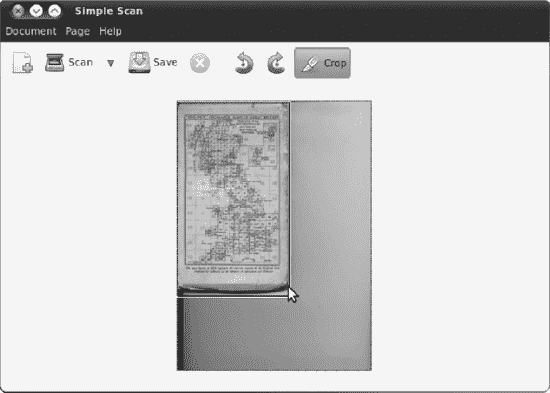

***图 7-16。**简单的扫描程序让扫描变得非常简单。*

### 安装 3D 驱动程序并激活桌面视觉效果

现代的趋势是操作系统将华丽的图形效果融入到普通的桌面功能中。例如，当窗口在 Windows Vista 中最小化时，它们会缩小并淡化到任务栏。在 Mac OS X 系统下，程序窗口在最小化时会被“倾倒”到 Dock 中。在 Windows Vista 和 Windows 7 中，当您按 Alt+Tab 在打开的程序之间切换时，程序窗口会以图形排列的方式垂直预览，您可以快速浏览它们，就像搜索卡片索引一样。这些效果是使用计算机图形卡的 3D 处理能力实现的，即使这些效果本质上不一定是 3D 的。

 **注**在技术层面上，该技术被称为*合成*。你在屏幕上看到的东西是先画在显卡内存里再传到屏幕上的，而不是什么都简单的直接画到屏幕上。

Ubuntu 包括类似的桌面视觉效果，这是由一个叫做 Compiz ( `[www.compiz.org](http://www.compiz.org)`)的系统提供的。然而，所有的桌面视觉效果系统都有一些要求，这些也适用于 Ubuntu:

*   为了让桌面特效发挥作用，你的显卡(或主板显卡芯片组)必须相对较新。例如 ATI 镭龙、Nvidia GeForce 和英特尔 GMA 产品线。大多数在过去五年内制造的带有图形处理单元(GPU)的显卡应该是足够的，最近的型号肯定会工作。
*   必须安装正确的图形驱动程序。目前，默认情况下支持英特尔 GMA 和一些 ATI 镭龙显卡，因为英特尔和 ATI 提供开源的 3D 驱动程序。对于其他硬件，制造商没有协助开发开源驱动程序，您可能需要手动安装专有驱动程序。即使对于 Nvidia 卡，情况也在改善，开源的新驱动程序现在被认为足够好，Ubuntu 可以默认安装。

 **注意**对于大多数显卡来说，开源的显卡驱动现在将支持 3D 桌面特效。如果你想从谷歌地球和第一人称射击游戏等密集型 3D 应用程序中获得高性能，你可能只需要安装专有驱动程序。

Ubuntu 下提供了一些专有的 3D 图形驱动程序，但是如果缺少开源的对等物，就只提供*和*。人们希望有一天开源驱动程序会取代对专有驱动程序的需求。

那么你真的需要安装新的驱动程序吗？这完全取决于你如何体验你的 Linux 环境。如果您发现桌面效果正常，则说明已经安装了正确的驱动程序。测试这一点的一个好方法是按住 Ctrl+Alt，然后点击向左或向右箭头键。这将切换到下一个虚拟桌面。如果整个桌面滑出，桌面效果就会被激活。如果桌面保持静态，并且屏幕中央出现一个小对话框让您选择虚拟桌面，则不会激活桌面效果。一个叫做附加驱动程序的工具可以让你管理显卡的专有驱动程序。如果您的硬件需要专有驱动程序，此实用程序应该会在安装后立即自动出现在通知区域。安装专有驱动程序后，重新启动计算机以激活它。

### 配置蓝牙

蓝牙是一种短程网络设施，允许各种硬件以无线方式相互协作。从移动电话和电脑之间的文件传输，到在台式电脑上使用无线键盘或鼠标，您都可以使用蓝牙。

要使蓝牙工作，两台设备都需要支持蓝牙。如今许多手机都带有蓝牙功能，越来越多的笔记本电脑也是如此。也可以买到非常便宜的蓝牙 USB 适配器。

Ubuntu 内置了蓝牙支持，如果你的电脑上有蓝牙硬件，它会自动激活。你会知道是否是这种情况，因为一个蓝牙图标将出现在通知区域。这用于管理您可能想要连接到电脑的所有蓝牙设备。

#### 配对蓝牙设备

当两个蓝牙兼容硬件需要定期通信时，它们可以聚在一起，这个过程也被称为*配对*或*绑定*。这意味着它们相互信任，因此您不需要对设备之间的每次通信尝试进行授权。事实上，一些设备不会通信，除非它们以这种方式配对。

配对在实践中很简单，其工作原理是共享个人 ID 号(PIN)。第一蓝牙设备生成 PIN，然后要求第二蓝牙设备确认它。用户输入 PIN 后，设备就配对了。配对在 Ubuntu 下很容易完成，不需要任何额外的软件。

例如，以下是将手机绑定到 Ubuntu PC 的步骤。对于没有用户界面的设备，如键盘，绑定的处理方式不同，这将在本章稍后的“使用蓝牙键盘或鼠标”一节中解释。

1.  确保 Ubuntu PC 可见，也就是说其他蓝牙设备可以检测到它。点按通知区域中的蓝牙图标，选择“偏好设置”，并确定选择了“使电脑可见”复选框。单击关闭。
2.  你可以从任何一端将两台设备配对，但我们将开始使用 Ubuntu。为此，请点按通知区域中的蓝牙图标，然后选择“设置新设备”这将启动蓝牙新设备设置。单击前进按钮。
3.  The device setup probes the ether and finds any connectable devices. These will appear first as a series of numbers and then using their friendly names, as shown in [Figure 7-17](#fig_7_17). 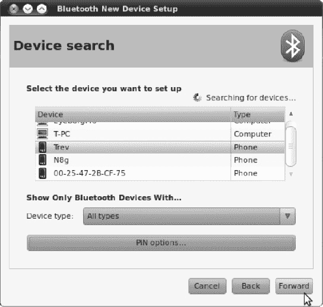

    ***图 7-17。**通过蓝牙小程序可以轻松完成配对请求。*

4.  选择要连接的设备，然后单击转发。默认情况下，会创建并传输一个随机的五位数 PIN 码，但如果您愿意，也可以通过单击 PIN 选项创建一个自定义的 PIN 码。设置窗口将显示此号码，您应该会在手机上收到提示，显示相同的号码，并询问您是否要将此作为可信设备与之配对。在你的手机上确认一下，然后点击 Ubuntu 设置中的 Matches 按钮(很快或者会超时！).这两台设备现在将配对。

如果您随后想要移除配对，请单击蓝牙图标并选择首选项。在对话框底部的设备列表中，选择蓝牙设备的条目，然后单击删除按钮。也不要忘记移除蓝牙设备上的配对。

#### 在蓝牙设备之间传输文件

如果你有一部带蓝牙功能的照相手机，你可能会习惯用蓝牙把照片传到你的电脑上。这是目前最简单的从手机上获取图片的方式，而且不需要 USB 线或读卡器。要通过蓝牙传输文件，您可以使用蓝牙小程序。

 **注意**有些手机拒绝传输文件，除非手机和电脑配对，所以先按照上一节的说明操作。像诺基亚 6680 这样的手机不需要配对来传输文件，尽管每次传输都必须手动确认。

##### 浏览远程设备上的文件

从设备获取文件的最简单方法是使用 Nautilus:

1.  单击通知区域中的蓝牙图标，然后选择浏览设备上的文件。
2.  从列表中选择您的电话(或其他设备),然后单击浏览。您可能需要通过选择“是”在电话上确认操作。
3.  文件浏览器打开，显示设备上可用的文件夹(参见[图 7-18](#fig_7_18) )。然后，您可以浏览这些文件，并以通常的拖放方式将文件复制到您的桌面上。您也可以用同样的方法将文件添加到手机中。

***图 7-18。**您可以使用文件浏览器访问蓝牙设备。*

##### 从 Ubuntu 电脑向另一台设备发送文件

有两种方法可以将文件从 Ubuntu PC 发送到另一个蓝牙设备。首先是使用蓝牙小程序。第二种方法是右键单击有问题的文件并选择 Send To。如果您想一次发送许多文件，第二种方法很有用，您可以选择自动将文件压缩到一个归档文件中(但请记住，接收文件的蓝牙设备需要能够随后对文件进行解压缩)。

###### 使用蓝牙小程序

按照以下步骤使用蓝牙小程序发送文件:

1.  单击导航区域中的蓝牙图标，然后单击将文件发送到设备。
2.  在“选择要发送的文件”对话框中，导航到要发送的文件，然后单击“打开”。
3.  在选择要发送到的设备对话框中，选择目标蓝牙设备，然后单击发送到按钮。
4.  目标蓝牙设备可能会提示您接受或拒绝来自 Ubuntu 的文件传输请求。选择接受。
5.  蓝牙设备收到文件后，单击关闭。

###### 使用发送到选项

要使用文件浏览器或桌面上上下文菜单中的“发送到”选项发送一个或多个文件，请按照下列步骤操作:

1.  右键单击单个文件或文件夹，或者选择多个文件并单击其中一个。右键单击并选择发送到。
2.  在出现的对话框的“发送为”下拉列表中，选择“蓝牙(OBEX 推送)”。在发送到下拉列表中，确保选择了您的蓝牙设备。
3.  如果您要发送多个文件，可以在“打包发送”复选框中打勾。这将创建一个新的单个`.zip`档案，并自动向其中添加文件。否则，每个文件将只是一个接一个地发送。如果您正在发送文件夹，则“发送打包”选项已经选中，不能取消选中。
4.  单击发送按钮。系统可能会提示您授权在蓝牙设备上接收文件，请授权接收。请记住，传输许多文件可能需要一些时间，因为蓝牙不是一种特别快速的数据传输方式。
5.  文件传输完成后，单击关闭按钮。

#### 使用蓝牙键盘或鼠标

你的蓝牙键盘或鼠标可以在 Ubuntu 下自动工作。但是，如果没有，您可能需要将其与您的电脑配对，如下所示:

1.  确保 Ubuntu PC 被设置为可被发现。点按通知区域中的蓝牙图标，点按“偏好设置”，并确保选择了“使电脑可见”复选框。单击关闭。
2.  将键盘或鼠标切换到可被发现模式。请阅读您的设备的说明，了解如何做到这一点。在我们在测试中使用的 iGo Stowaway 键盘上，这需要同时按下 Ctrl+蓝色 Fn+绿色 Fn 键。
3.  阅读手册时，请确定设备是否有默认密码。鼠标几乎肯定会(几乎总是 0000)，但键盘可能会要求你手动输入一个配对请求。
4.  单击蓝牙图标并选择首选项。单击设置新仪器按钮。Ubuntu 会搜索你的输入设备。在您被多个蓝牙设备包围时，您可能会发现使用设备类型下拉列表将搜索范围缩小到输入设备非常有用。
5.  您应该会发现您的键盘或鼠标会被自动检测到，并出现在“选择设备”标题下方的列表中(如果没有，请确保它仍处于可被发现模式，并且没有自行关闭)。单击键盘或鼠标的条目，然后单击前进按钮。
6.  Ubuntu 电脑上会弹出一个注释框，通知你 Ubuntu 和键盘或鼠标之间的配对请求。单击输入密钥按钮。
7.  接下来会发生什么取决于你是要连接键盘还是鼠标。请记住，配对过程在 Ubuntu 电脑上很快就会超时，因此您需要毫不犹豫地完成以下步骤:
    *   如果是鼠标，请输入您之前在鼠标手册中读到的密钥。如前所述，这通常是 0000。单击“确定”后，鼠标应该已配对并开始工作。
    *   有些键盘还使用默认的密码 0000，如果是这样，您可以输入密码，键盘应该是成对的。但是，某些蓝牙键盘可能要求您输入在电脑上创建的密钥。在 Ubuntu PC 上的身份验证请求对话框中，键入一个随机的四位数密钥，类似于 **1234** (尽管出于安全原因，您可能希望选择一个不太容易猜到的密钥)。单击确定。在蓝牙键盘上，键入相同的数字，然后按 Enter 键。遵循这一点，你应该会发现键盘与电脑配对，并会工作。
8.  单击蓝牙首选项对话框中的关闭。

如果重新启动后键盘或鼠标不工作，请尝试再次打开和关闭。如果不起作用，可以暂时拔掉蓝牙适配器，或者在笔记本电脑上使用相关的键盘组合键关闭并再次打开蓝牙系统，从而关闭 PC 上的蓝牙功能。

### 配置声卡

一般来说，你的声卡不需要任何额外的配置，在你安装了 Ubuntu 之后就可以立即工作。音量控制小程序的图标位于 Ubuntu 桌面的右上角，它提供了一种快速控制主音量的方法。

但是，如果您想要更改您的平衡或麦克风级别，或者如果您的声卡不仅仅提供立体声输出，例如多扬声器环绕声，则可能需要采取一些简单的步骤来完全控制硬件:

1.  点按音量控制图标(看起来像扬声器的图标)。下面会打开一个简单的音量控件。
2.  点按打开的窗口下端的“声音偏好设置”。
3.  出现“声音首选项”对话框。在大多数电脑上，你将只有一个简单的立体声声卡显示在硬件标签中，没有太多的配置。在输出选项卡中，您可以根据需要调整平衡，而在输入选项卡中，您可以取消麦克风静音并调整输入音量。如果您的计算机有不止一个声卡——例如，板载声卡和外部 USB 5.1 声卡——您可以在“硬件”选项卡中设置哪个声卡是活动的，然后切换到“输出”选项卡来调整平衡、渐变和低音炮的音量滑块，如[图 7-19](#fig_7_19) 所示。在配有伪环绕声声卡的笔记本电脑上，我们可以添加一个控件来改变效果的强度。
4.  完成后，单击关闭按钮。

***图 7-19。**在声音首选项中，您可以控制声卡输出的所有方面。*

### 使用电源管理偏好设置

根据您的计算机支持节能功能的程度，Ubuntu 将允许您配置显示器在一定时间后进入待机模式，还允许您配置笔记本电脑进入睡眠(待机)模式。此外，如果你使用笔记本电脑，Ubuntu 可能会让你配置额外的方面，如显示器亮度。这些功能是通过使用电源管理首选项来控制的。为此，从面板中选择应用，并在搜索栏中键入电源。现在单击电源管理图标。如果 Ubuntu 安装在笔记本电脑上，你会在程序窗口中看到三个标签:onAC 电源，On 电池电源，和常规。如果 Ubuntu 安装在台式电脑上，你只会看到“交流电源”和“常规”标签。

 **注意**就节能特性而言，并非所有电脑都是一样的。有些支持更多的功能。此外，Ubuntu 与大多数但不是所有的电源管理系统兼容，它可能无法支持您系统上的某些电源管理功能，即使这些功能在 Windows 下也能工作。

笔记本电脑有额外的标签，因为它可以定义两个独立的电源管理配置文件:一个用于电脑接通电源时，另一个用于电池供电时。这是有意义的，因为您可能永远不希望显示器在连接到插座时关闭，但如果电脑使用电池电源运行(以延长电池寿命)，建议显示器在闲置 15 分钟后关闭。

电源管理小程序的三个选项卡将在以下几节中介绍。

##### 使用交流电源

如果您的电脑是一台没有电池的台式电脑，您会在“打开交流电源”标签下看到两个选项:不活动时将电脑置于睡眠状态达和不活动时将显示器置于睡眠状态达。每个选项旁边的下拉列表允许您在每个功能生效之前定义多个预设时间限制中的一个，包括“从不”选项。还有一个复选框，使您能够在电脑进入睡眠状态的同时，尽可能降低硬盘转速。

 **注意**睡眠模式可以是暂停到 RAM(即待机)或休眠。您可以在“常规”选项卡下进行设置。

如果你的电脑是笔记本电脑，你会看到一些额外的选项。根据电脑使用的技术，您可能会看到“将显示器亮度设置为”滑块，您可以使用它来设置接通电源时屏幕的亮度。只要接通电源，显示屏亮度就会改变，以匹配此设置。

您可能会看到一个带有下拉列表的“当笔记本电脑盖子合上时”选项。正如它所暗示的，这将控制当笔记本合上时会发生什么。根据计算机中包含的硬件，您可以选择什么都不做，使屏幕空白，暂停计算机(关闭除 RAM 以外的所有系统)，休眠(将 RAM 暂停到磁盘并关闭笔记本)，以及关闭计算机。但是，并非所有计算机都支持这些模式，因此您看到的选项可能会有所不同。

此外，您可能会看到“空闲时调暗显示器”复选框，您可以选择该复选框，以便在系统空闲时通过调暗屏幕来节能。

##### 依靠电池供电

“电池供电”选项卡下的选项仅在笔记本电脑上出现，与“主电源供电”选项卡下的选项基本相同，如图 7-20 所示。这些设置会在笔记本电脑的电源断开和电池启动的瞬间生效。

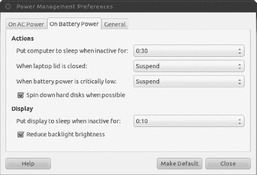

***图 7-20。**笔记本用户可以定义一个额外的电源配置文件，该文件将在电池使用时生效。*

一个额外的选项出现在 Actions 部分的最后一项:当电池电量极低时。当电池电量即将耗尽时，您可以选择自动暂停、休眠或关闭笔记本电脑。

显示部分底部的复选框有助于大大节省电池电量。您可以选择降低背光亮度选项，正如它所建议的，当您使用电池电源运行时，将背光亮度设置为较低的设置。与使用交流电源一样，电池电源也可以使用空闲时变暗显示选项。

 **注意**要知道，睡眠模式需要一点电池电量才能工作，最终会耗尽你的电池，尤其是当它已经奄奄一息的时候。

##### 一般

在“常规”选项卡下，您可以选择自定义按钮操作和通知。无论电脑是使用电源还是电池供电，这些设置都会保持不变。

在“操作”部分，您可以设置当按下电源按钮并且电脑处于活动状态时会发生什么。实际上，这控制了在 Ubuntu 运行时按下按钮是应该关闭电脑、暂停电脑还是休眠电脑。您可以选择询问我，这将导致标准退出对话框出现(即，与您单击屏幕右上角的会话菜单图标时出现的对话框相同)。您还可以自定义暂停按钮的操作。可用的操作包括什么都不做、挂起或休眠。Hibernate 将 RAM 的内容写入硬盘，然后关闭计算机。挂起会关闭计算机的大多数系统，但 RAM 除外，它仍处于活动状态。然后，当你按下一个键或移动鼠标，计算机几乎立即醒来，子系统被重新激活。

 **注意**休眠并不适用于所有系统。最好的计划是通过打开会话菜单(屏幕右上角)并选择休眠来测试它。即使 Hibernate 看起来可以工作，也有报告称它不可靠。一些用户报告说，他们的电脑偶尔无法唤醒，导致数据丢失。因此，在使用休眠功能之前，或者在休眠模式可能会自动启动的任何时间内，您应该始终保存所有打开的文件。除非你的交换分区至少和你的 RAM 一样大，否则 Hibernate 肯定不会工作。

“常规”选项卡还允许您选择电源图标是否在通知区域可见。如果您使用的是笔记本电脑，您可以选择仅在电池电量即将耗尽、电池正在充电或放电时显示图标，或者不考虑电池状态。台式机用户可能会选择根本不显示电源图标。最简单的选项可能是在充电或放电时只显示一个图标，这是默认选择的。

最后，还有一个额外的选项，当错误事件发生时，您可以选择播放声音。

 **提示**如果你使用的是笔记本电脑，通知区域的电源图标会显示电池的充电状态。如果您单击它并选择笔记本电脑电池放电，将显示一个电源统计窗口，为您提供有关电源适配器、电池和处理器的大量信息。

省电:值得吗？

我们的计算机消耗的能量有很大的差异，从上网本的 25 瓦左右到台式电脑和显示器的 250 瓦或更多。即使是 250 瓦听起来也不多，但是我们大多数人一次运行机器几个小时，能源并没有变得更便宜。因此，考虑采用节能技术是值得的，即使只是为了省钱，更不用说考虑发电站消耗不可再生资源和排放二氧化碳的全球速度了。

尽量避免让电脑整夜开着，或者长时间不使用电脑。至少，要习惯暂停你的系统。完全清醒只需要半分钟。除了省电，关闭电脑还能避免组件磨损，延长电脑寿命。虽然 CPU 可以 24×7 不间断工作，但它是由一个简单的机械装置风扇来冷却的。你的电脑里也有其他风扇，比如显卡风扇和机箱风扇。每一个最终都会磨损。如果你的显卡风扇停止工作，显卡本身就会过热并可能烧毁。CPU 风扇也是如此。然而，通过整夜关闭计算机，你可以有效地使风扇的寿命延长一倍，并从根本上降低灾难性故障的风险。这难道不值得考虑吗？

### 总结

在本章中，您学习了如何设置您可能已连接到电脑的常见硬件类型。此外，您还了解了如何配置对 Ubuntu 正常运行至关重要的各种软件组件。

你一步一步地使用 Ubuntu 上网(包括加入无线网络)、添加打印机、连接数码相机、配置 3D 显卡等等。

在第 8 章中，我们将继续探讨如何确保您的系统安全并受到保护。