# 八、如何保护您的计算机

Linux 被广泛认为是最安全的操作系统之一。在基本层面上，Linux 是从头开始构建的，从根本上来说是健全的，它允许用户安全地工作，而他们甚至不会注意到这一点。例如，它强制执行普通用户的系统，限制他们可以做什么，从而使安全漏洞(如病毒感染)更难发生。

此外，Linux 包含一个硬连线到内核中的防火墙，称为`iptables` ( `[http://www.netfilter.org](http://www.netfilter.org)`)。几乎所有计算机安全专家都认为防火墙是最好的解决方案之一。不仅如此，它还能像保护最强大的超级计算机一样保护你的家用电脑。

像许多 Linux 组件一样，`iptables`可以用困难的方式或简单的方式来管理。这种艰难的方式需要深入了解网络如何运行，以及破解配置文件的能力，而这两者都超出了许多普通计算机用户的技能范围。幸运的是，几个程序充当了`iptables`的接口，使其操作简单(或者至少像任何等效的基于 Windows 的软件防火墙一样简单，例如 Check Point Software Technologies 的 ZoneAlarm)。

在 Ubuntu 中，这个内置的防火墙是默认关闭的。这是因为开发人员不认为 Ubuntu 需要防火墙，从技术层面来说，他们是对的。与 Windows 不同，Ubuntu 没有面向互联网的服务(等待来自互联网或局域网的连接的程序)。2003 年，正是 Windows XP 上的这种服务让 Blaster 蠕虫病毒让互联网屈服。打个比喻来说，这个理论是，如果没有任何窗户或门，Ubuntu 很难(如果不是不可能的话)被黑客闯入(或被病毒或蠕虫感染)。然而，用 Firestarter 这样的程序配置防火墙，我们将在本章的后面讨论，可以很快地完成，而且不费吹灰之力，在我们看来，没有理由不使用 Linux 防火墙。毕竟，无论如何，你都可能想在你的 Ubuntu 盒子上运行一些服务。(只要想想 Skype 这样的程序，它们本身也会启动服务)。

此外，和大多数版本的 Linux 一样，Ubuntu 没有开箱即用的防病毒保护。这是因为实际上没有影响 Linux 的病毒，因此根本不需要病毒保护。然而，与防火墙配置程序一样，安装防病毒程序很容易，我们将在本章中解释如何安装。但是首先，我们花一些时间来研究更基本的安全概念。接下来，我们来看看如何为文件和电子邮件设置加密，以便它们只能被预定的收件人打开。然后，我们将介绍一些保护系统的基本步骤。

### Windows 安全性与 Linux 安全性

如果你已经从 Windows 转到了 Ubuntu，那么 Windows 的安全缺陷很有可能是你做出决定的原因。Windows 7 包含许多改进，但微软在过去几年的安全记录并不出色。新的和严重的安全警告不断出现，甚至现在，新的和毁灭性的病毒和特洛伊木马以令人担忧的频率成为新闻头条(通常被描述为 *PC 病毒*，而不是它实际上是 Windows 病毒)。

一种说法是，Windows 成为这么多病毒的目标仅仅是因为它太受欢迎了。虽然确实有些写病毒的人是因为不喜欢微软才这么做的，但毫无疑问，Windows 也有太多的安全问题。

许多人仍然对微软的安全策略持批评态度。例如，从 Vista 开始，Windows 包括用户帐户控制(UAC)对话框，每当需要执行影响系统的操作时就会出现。然而，它们是如此普遍，以至于许多人不再阅读它们警告的内容，而只是本能地点击 OK。许多人甚至把它们关掉。相比之下，Ubuntu:每当需要影响系统的操作时，都会出现类似的对话框，但是 Ubuntu 密码对话框的影响更大，因为它们出现的频率远远低于 Windows 上的 UAC 对话框。此外，在 Ubuntu 上，用户的密码必须输入。这迫使用户停下来思考，而不是简单地点击鼠标按钮。

尽管 Windows 7 提供了合理的安全性，但微软迄今最流行的操作系统 Windows XP 被认为是黑客和病毒编写者容易攻击的目标。安装后，默认用户将获得管理权限。的确，只有真正的管理员才能执行一些任务，但是默认用户可以配置硬件，删除系统软件，甚至擦除硬盘上的所有文件。虽然您绝不会故意损坏自己的系统，但计算机攻击者会使用各种技术让您运行恶意软件(例如，通过假装它是不同的文件)，或者他们只是在您不知情的情况下通过互联网感染您的计算机，这是大多数蠕虫的工作方式。

病毒和蠕虫通常也会利用 Windows 软件中的安全漏洞。仅举一个例子，几年前 Outlook Express 中的一个臭名昭著的安全漏洞允许当用户简单地点击特定的消息来查看它时，附加到电子邮件消息的程序运行。换句话说，感染 Windows 机器就像给某人发电子邮件一样简单！

Linux 的情况就不同了。病毒和蠕虫远比在 Windows 上少见。这是因为 Linux 在设计上有一些特性使其安全并能抵御病毒。对于 Windows 用户来说，这听起来可能很奇怪，但你可以拥有一台没有病毒的电脑。

 **小心** Linux 的粉丝们不断指出，病毒不会对他们的系统造成问题，因为操作系统的核心受到了很好的保护。然而，你应该记住，任何计算机系统中最重要的部分，可以说是其中的数据，所以花时间和精力来保护这些数据也是值得的。(有关更多信息，请参见即将到来的“加密”部分。)

但是，尽管我们很想说 Linux 上没有安全漏洞，但令人悲伤的事实是，它们是每个操作系统的用户生活中的事实。许多所谓的*rootkit*——专门的软件工具包，旨在利用 Linux 操作系统及其软件中的漏洞——是可用的。

底线是，尽管为 Linux 编写病毒或蠕虫比在 Windows 上做同样的事情要困难得多，但所有 Linux 用户都应该花时间保护他们的系统，永远不要认为他们是安全的。

### Root 和普通用户

尽管用户是另一个章节的主题，但请允许我们介绍一下根用户帐户和普通用户之间的区别，因为这种区别是安全模型的基础。有关此事的更深入讨论，请参考第 21 章。Linux 使用了一种叫做 *root* 用户账户的东西。这有时被称为*超级用户*账户，这让你了解它的用途:根用户可以不受限制地访问系统的所有方面。root 用户可以删除、修改或查看任何文件，以及更改硬件设置。因为 Linux 系统上的一切都是文件，这给了根用户巨大的权力。

Linux 系统也有普通用户账户，这些账户的功能有限。这些用户被限制在将文件保存在他们自己的目录中的`/home`目录以及`/tmp`和`/var/tmp`目录中，(尽管系统通常被配置为普通用户也可以读取`/home`目录之外的文件)。但是一个普通的 Ubuntu 用户不能删除或修改他们的`/home`目录之外的文件，除非得到根用户的明确许可。

您在安装 Ubuntu 期间创建的用户帐户是一个受限帐户，但是在一些 Linux 系统上，您可以在登录提示符下键入`root`，在提供正确的密码后，以 root 用户身份登录并执行系统维护任务。Ubuntu 略有不同，默认情况下，root 帐户是禁用的，用户可以在需要时借用超级用户的权限，与 Mac OS X 类似。要做到这一点，他们只需提供自己的登录密码。对于桌面程序，会自动出现一个密码提示对话框。

尽管 root 帐户被禁用，但大多数关键的操作系统文件“属于”root 用户，也就是说，只有拥有超级用户权限的人才能更改它们。普通用户根本无法修改或删除这些系统文件。这是保护操作系统配置免受意外甚至蓄意破坏的强大方法。

 **注意**除了 root 和普通用户账户，还有第三种类型的 Linux 账户，它类似于受限用户账户，只是它被系统用于各种任务。这些用户账号通常是普通用户看不到的，在后台工作。例如，CD/DVD-ROM 子系统有自己的用户帐户，Ubuntu 用它来访问 CD/DVD-ROM 硬件。用户和文件权限的概念在第 21 章中有更深入的讨论。

你是黑客还是骇客？

Linux 用户经常被描述为*黑客*。这并不意味着他们恶意闯入计算机或编写病毒。它只是使用了黑客这个词在 20 世纪 70 年代的原始含义，当时它描述了一个对探索计算机能力感兴趣的计算机爱好者。跨国计算公司背后的许多人都是从黑客开始的。例如苹果电脑公司的创始人之一史蒂夫·沃兹尼亚克和太阳微系统公司的创始人之一比尔·乔伊。

黑客一词被认为来源于模型火车爱好者，他们一起“黑”火车轨道作为他们爱好的一部分。当计算在 20 世纪 70 年代早期开始流行时，这些爱好者中的一些人也开始对计算感兴趣，并且这个术语被他们带了过来。

然而，近年来，媒体颠覆了“黑客”一词的含义，将其应用于侵入计算机系统的个人。这是基于无知，许多真正的黑客觉得这种比较非常无礼。正因为如此，黑客一词被创造出来，以明确定义恶意攻击计算机的个人。

所以，如果有熟人把自己描述成 Linux 黑客，或者告诉你她花了一晚上的时间黑了一些 PHP 代码，也不用担心。许多 Linux 类型使用这个术语作为荣誉徽章。

### 加密

*加密*是一种保护数据的方法，通过这种方式对数据进行编码，普通的观察者在没有密码或称为*密钥*(通常缩写为*密钥*)的特殊文件的情况下无法查看数据。加密用于保护隐私，也用于验证文件或电子邮件的作者的身份。

Ubuntu 通常在家用电脑上使用两种类型的加密:

*   ***文件加密*** :可以对文件进行加密，这样它们就需要一个密码才能被解密。或者，您可以加密文件，以便它们只能由特定的个人解密。
*   *电子邮件加密:电子邮件信息可以加密，这样只有收件人才能阅读，也可以签名，这样收件人就可以确定电子邮件确实是由你而不是第三方发出的。*

 *Ubuntu 的电子邮件程序 Evolution 支持电子邮件的数字签名(向收件人保证它确实是由预定的发件人发送的)，以及发送给其他人的电子邮件的完全加密或发送给你的电子邮件的解密(保证没有人被允许在传输过程中阅读邮件)。Nautilus 文件管理器也可以用于加密个人使用的文件，或者只有特定的个人才能解密它们。密码加密也可用于 LibreOffice 等应用程序，这些应用程序可用于编写或组织帐户或机密信件等敏感数据。

 **注**虽然进化支持加密，但你不一定要用。事实上，许多 Ubuntu 用户不使用公钥加密，尽管高级用户经常走这条路。而且，一般来说，使用电子邮件加密的人相对较少。但是，如果你想确保没有人可以阅读你的电子邮件，你应该使用它。在受信任的环境中，使用电子邮件加密和签名是常见的做法。

支撑 Ubuntu 加密系统的是一个*公钥加密系统*。个人生成两个密钥:T2 私钥 T3 和 T4 公钥 T5。私钥由生成它的个人保持私有，而公钥被传递给任何想要它的人(甚至发布在互联网数据库上)。这两个密钥是相关的，因为一个密钥可以加密数据，因此只有对应的密钥才能解密数据。

例如，你可以用简的*公钥*来加密给简的文件或电子邮件，只有简才能用她的*私钥*来解密。然而，最关键的是，即使你首先加密了文件，你也不能随后解密它——用公钥加密的数据不能用相同的公钥解密。只有私钥可以解密它。如果 Jane 想加密一个文件，只有你可以解密，她需要使用*你的*公钥。然后，您将使用您的*私有*密钥来解密它。加密后没有人能解密它。

当在电子邮件程序中使用时，公钥加密以两种方式工作。给你发邮件的人可以用你的公钥加密邮件和任何附件，这样只有你可以阅读。这保证了保密性。同样，你可以用别人的公钥加密发送给别人的消息，这样只有他们才能阅读。或者，更常见的是，可以将数字签名添加到电子邮件文件中，即使电子邮件本身是不加密发送的。这个签名是由您的私钥和邮件正文一起生成的，在另一端使用您的公钥解密，因此证明该电子邮件可能只来自您。这就是所谓的*签署*一封电子邮件，因为这就好像是你亲自用自己的笔迹签署的，从而保证了它的真实性。电子邮件本身以纯文本形式发送，以防收件人不使用公钥加密。

#### 设置加密

要管理您的加密密钥，您可以使用 Ubuntu 附带的 Seahorse 应用程序。您首先生成一个*密钥对*(您的私钥和公钥)，然后您可以导出或发布公钥，以便其他人可以使用它。

##### 生成密钥对

无论您想使用 Evolution 的加密/签名功能还是 Nautilus 的文件加密功能，您都必须首先创建一个密钥对。为此，您可以使用密码和加密工具，这是一种多功能工具，可用于与加密密钥管理相关的任何事情。下面是这样做的步骤:

1.  From the Panel, select Applications. Next, in the Search bar, type password, which will show you the Passwords and Encryption keys. Click it to start the Seahorse application, as shown in [Figure 8-1](#fig_8_1). 

    ***图 8-1。** Seahorse 是一款简单易用的密码和加密密钥管理工具。*

2.  Click File  New and select PGP Key from the available options, as shown in [Figure 8-2](#fig_8_2). PGP, which stands for Pretty Good Privacy, is an industry-standard public key encryption system and is typically used to secure e-mails or files. The Secure Shell key is used as an extra security measure when connecting to remote machines, as discussed in [Chapter 25](25.html#ch25). The Password Keyring can act as a kind of wallet for securely storing a collection of passwords that would then be accessible with a single password. Use the Stored Password option to store a text password in a keyring. 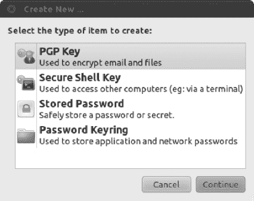

    ***图 8-2。**选择 PGP 密钥为电子邮件或文件加密创建密钥对。*

3.  The New PGP Key dialog box appears. Fill in a full name, e-mail address, and, optionally, a comment, as shown in [Figure 8-3](#fig_8_3). The e-mail address you use for your PGP key should be the one you will be using for sending e-mails with Evolution (see [Chapter 14](14.html#ch14) for instructions on creating an e-mail account in Evolution). You may also set three advanced options, available in the Advanced Key Options drop-down list: 

    ***图 8-3。**填写“新 PGP 密钥”对话框中的字段，并选择性地设置密钥的高级选项。*

    *   加密类型让您选择新密钥的密码类型。默认值是 RSA—RSA 和 DSA Elgamal 是最佳选择，因为它们使您能够加密、解密、签名和验证文件和电子邮件。另一方面，DSA(仅签名)和 RSA(仅签名)只能对文件和电子邮件进行签名。除非你确切地知道你正在做什么，否则你不应该使用这些。
    *   密钥强度选项指定密钥的强度，以位为单位。密钥强度越低，加密和解密的速度越快，但选择较低的强度会使其他人更容易破解加密。增加密钥强度意味着更慢的加密，但这应该与这样一个事实相权衡，即它减少了您的消息被拦截的机会——以至于 2，048+位的更大密钥目前被认为是无法破解的。这就是为什么默认设置为 2，048 位，这是一个明智的妥协。如果您有妄想症，并且喜欢使用极限强度，请将密钥长度设置为最大值 4096 位。
    *   到期日期选项设置密钥的到期日期。默认情况下，密钥设置为永不过期。如果您怀疑您的私钥可能会落入他人之手(例如，如果您使用的笔记本电脑可能会被盗)，则过期日期非常有用，因为密钥仅在过期日期前有效。如果您决定指定一个过期日期，则必须在旧密钥过期之前创建一个新密钥，并使用旧密钥签署新密钥，以保持身份验证。通过用旧密钥签署新密钥，任何信任旧密钥的人都会自动识别新密钥并信任它。

     **注**密钥强度选项有助于增强您的密钥，因为密钥强度是基于所用密码的类型和密钥的大小。有时，通过增加密钥长度，基于弱密码的密钥仍然可以变成强密钥。

4.  单击“创建”按钮创建密钥。
5.  The Passphrase for New PGP Key dialog box appears. You need to create a passphrase for your new PGP key. This is a block of text (perhaps a sentence or simply a long stream of characters) that will have to be entered when decrypting files you have encrypted while using Nautilus, and encrypted e-mails you receive via Evolution. The best passphrase is easy for you to remember but hard for others to guess; ideally, it should include uppercase and lowercase letters, punctuation, and numbers to make it harder for a brute force dictionary attack (that is, a machine systematically entering real words) to break. Enter your passphrase twice: once in the Password box and again in the Confirm box. After entering the passphrase, your computer needs to generate the key pair. This may take a few minutes. As shown in [Figure 8-4](#fig_8_4), the characters won't appear on the screen. Click OK to continue. 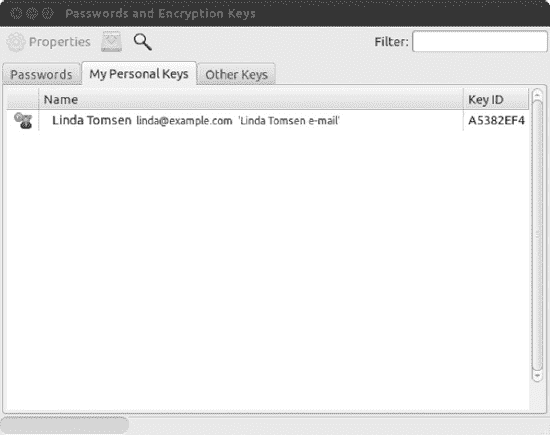

    ***图 8-4。**生成 PGP 密钥后，它将列在我的个人密钥选项卡上。*

6.  正在创建 PGP 密钥，请稍候。根据您选择的密钥长度，这可能需要很长时间。如果似乎要花很长时间，那就开始在你的电脑上工作吧。要生成密钥对，您的计算机需要随机数据，这可以通过在计算机上工作或复制大量数据来生成。(在您的一个测试系统中，密钥是在大约十分钟内复制完数据后才生成的，所以请耐心等待)。该过程完成后，您的新 PGP 密钥将列在海马主窗口的“我的个人密钥”选项卡中，如[图 8-4](#fig_8_4) 所示。
7.  您可以在以后重新定义密码，而不会影响实际加密的文件。在我的个人密钥选项卡中右键单击 PGP 密钥，然后选择属性。单击更改密码按钮，在输入现有密码后，您将能够添加另一个密码。在[图 8-5](#fig_8_5) 的左边缘显示的小+图标允许您用系统中的照片或图标标记钥匙。

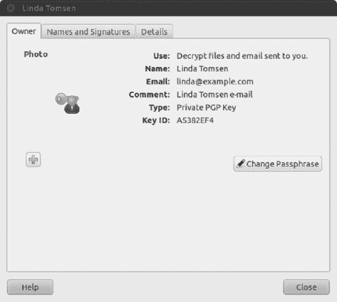

***图 8-5。**您可以使用属性框随时更改您的密码。不过，你需要你的原始密码。*

##### 导出您的公钥

如前所述，如果您希望其他人能够加密邮件或文件以便只有您可以访问它们，或者如果您希望他们验证您发送给他们的任何已签名的电子邮件，则您的公钥必须与其他人共享。为此，您使用 Seahorse 导出您的公钥——有效地使它作为一个文件可用，可以通过电子邮件发送给其他人，或者可能存储在一个闪存盘中，分发给其他人。

 **注**如果签名邮件的收件人没有您的公钥，他们将无法验证您的电子邮件签名，但他们仍然可以阅读邮件并访问任何附件。签名可能会显示为电子邮件附件中的一个`.pgp`文件。你曾经收到过一封附有类似于`signature.pgp`的文件的电子邮件吗？现在你知道是什么了！

导出密钥就像运行 Seahorse 一样简单(从面板中打开应用程序，并在搜索栏中键入密码以显示密码和加密密钥图标)，在“我的个人密钥”选项卡中选择您的密钥，然后单击“导出到文件”按钮。系统会提示您将文件保存到您喜欢的位置，如图[图 8-6](#fig_8_6) 所示。文件保存到您的`/home`目录后，您可以以任何您喜欢的方式分发它。

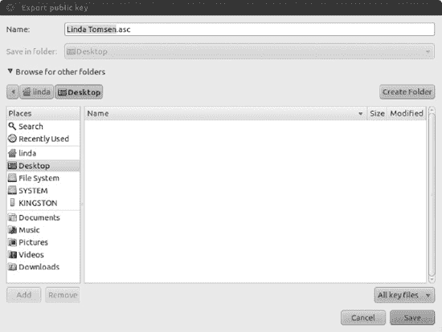

***图 8-6。**使用海马，你可以导出你的公钥进行分发。*

##### 发布您的公钥

为了更广泛地分发您的公钥，您可以在公钥服务器中发布它。这使得任何能够访问互联网的人都可以很容易地使用它，并且这是共享公钥的首选方法；人们不必等着你给你发送加密的电子邮件，他们可以在网上搜索你的密钥。发布密钥的步骤如下:

1.  运行 Seahorse(从面板中，打开应用程序并在搜索栏中键入密码以显示密码和加密密钥图标)并单击远程同步和发布密钥。
2.  The Sync Keys dialog box appears, as shown in [Figure 8-7](#fig_8_7). To be able to sync your key, you first need to click the Key Servers button and specify where your key will be published. 

    ***图 8-7。**您需要编辑您的密钥服务器设置，以便能够将您的公钥同步到您首选的密钥服务器。*

3.  您将被带到首选项对话框的密钥服务器选项卡，以自定义密钥服务器设置。您可以在这里指定在哪里寻找密钥以及在哪里发布您的密钥。一个常用的密钥服务器是`pgp.mit.edu`，你可以从发布密钥下拉列表中选择，如图 8-8 中的[所示。选择您的服务器，然后单击关闭按钮。](#fig_8_8)
4.  返回同步密钥对话框，单击同步按钮发布您的密钥。

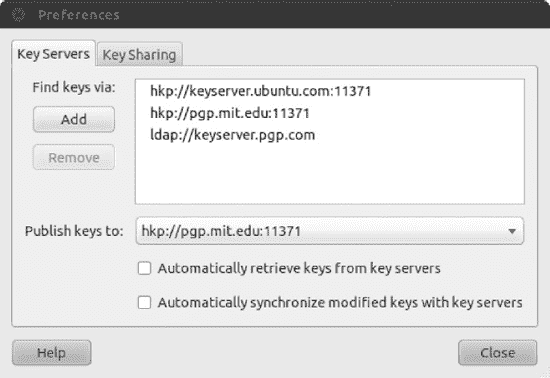

***图 8-8。**单击“将密钥发布到”组合框，选择密钥的发布位置。*

##### 导入和签署公钥

为了能够为他人加密电子邮件或文件，并验证他们的签名，您需要导入并信任他们的公钥。您可以从创建公钥的人或拥有此人公钥的其他人那里获得公钥，或者从密钥服务器中查找。

如果您已经亲自获得了公钥文件(可能在软盘上或通过 USB 闪存驱动器)，并且它可以在您的计算机上访问，您可以通过运行 Seahorse 并选择 File  Import 来导入该密钥。在出现的文件对话框中，浏览您要导入的公钥文件的文件夹，选择该文件，然后单击打开按钮。要验证密钥是否已导入，请在“密码和加密密钥”对话框中单击“其他密钥”,并确保您刚刚导入的密钥出现在列表中。

您也可以从密钥服务器中寻找密钥，这可能更容易，也是大多数人的首选。为此，请单击“密码和加密密钥”对话框中的“查找远程密钥…”按钮。出现“查找远程键”对话框。在“搜索包含以下内容的密钥”文本框中，键入您要查找的人的姓名。接下来，如果你知道那个人的密钥是在哪个服务器上发布的，确保在“在哪里搜索”列表中选择该服务器，然后点击“搜索”按钮(见图 8-9)。在搜索结果区域中，选择要导入的密钥，然后点按“导入”按钮。

在信任密钥服务器之前，有一件事你应该知道。通常，密钥服务器不仅仅是一个单独的服务器，而是几个彼此保持同步的服务器。这种同步并不完美，这意味着在某些情况下，您可能看不到应该存在的键。在那种情况下，一个好的解决办法就是再试一次。您可能会连接到密钥服务器的另一个实例，如果幸运的话，您会找到您现在正在寻找的密钥。

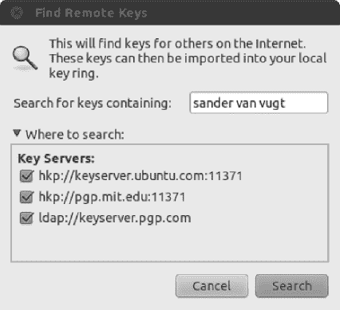

***图 8-9。**在密钥服务器上找到别人的密钥既简单又方便。*

 **注意**从公钥服务器导入密钥时，您无法确定这些密钥是否真的属于您希望以安全方式与之通信的人。然而，解决这个问题的一个办法是所谓的*信任网*，人们可以通过签名来保证密钥的真实性。更多信息见`[http://en.wikipedia.org/wiki/Web_of_trust](http://en.wikipedia.org/wiki/Web_of_trust)`。

导入的密钥出现在“其他密钥”选项卡中后，您需要对密钥进行签名，以便能够向密钥所有者发送加密的电子邮件。通过这种方式，您告诉系统您相信密钥是有效的。您还可以使用导入的密钥来验证您从该人处收到的电子邮件的真实性。为此，请按照下列步骤操作:

1.  在“其他密钥”选项卡中选择要签名的密钥。到目前为止，该密钥标记有未知的有效值。这意味着 Seahorse 有关于这个键的信息，但是它不知道它是否有效。点击签名公钥按钮，出现签名密钥对话框，如图[图 8-10](#fig_8_10) 所示。
    你可以回答这个问题“你仔细检查过这把钥匙吗？”基于你验证密钥的方式:一点也不，随便地，或者非常仔细地。
2.  当您订阅并将关系同步到密钥服务器时，您对“其他人可能看不到此签名”的选择会影响密钥的可信度。如果您不选中此复选框，您的信任关系将显示在密钥服务器上供公众查看，这基本上就是说您在向公众担保此人密钥的真实性。通过信任由您签名的密钥，这有助于减少由他人签名的密钥的数量。
3.  The “I can revoke this signature at a later date” option allows you to revoke the key. This lets you invalidate your trust with the key for reasons such as: the key has been compromised and misused, or if you discover the key is actually a fake. 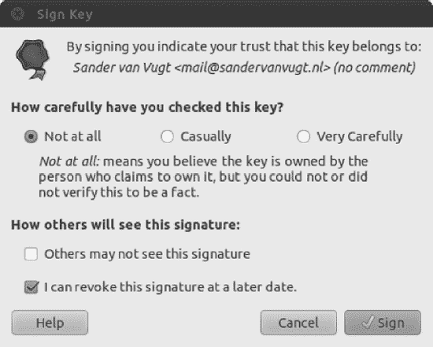

    ***图 8-10。**签署密钥是保证密钥真实性的一种方式。*

4.  在“签名密钥”对话框中做出选择后，单击“签名”按钮继续。
5.  将出现输入密码对话框。您需要提供创建 PGP 密钥时输入的密码。提供密码，然后单击“确定”。此时，该密钥已经被签名，并且现在在 Other Keys 选项卡中以 Full 的有效值列出。

 **提示**为了减少要签名的密钥数量，你可以信任由你信任的密钥签名的密钥。单击 Seahorse 中的“其他键”选项卡，然后双击该键查看其属性。当密钥的属性出现时，单击“信任”选项卡并选择选项“我已检查此密钥属于< *名称* >，并且我信任其他密钥上来自< *名称* >的签名”单击关闭。在“其他密钥”选项卡的“信任”列中，该密钥的值为 Full。当您导入此密钥信任的新密钥时，这些密钥将自动成为“可信密钥”选项卡中可信列表的一部分。

#### 加密和解密文件

设置好加密密钥后，您就可以开始加密文件，或者将它们以加密形式存储在您自己的系统中，或者将它们传递给其他人。您也可以解密您自己的加密文件或其他人为您加密的文件。这些特性被集成到 Nautilus 中，这使得加密和解密很容易完成。

在你可以加密和解密文件之前，你需要安装软件包海马插件。这将扩展 Nautilus(文件管理器)的功能，在右键单击文件或文件夹时，将加密选项添加到上下文菜单中。要安装插件，去 Ubuntu 软件中心搜索“海马插件”一个名为解密文件的应用程序将会出现。如果尚未安装，请单击安装。有关安装软件的更多信息，请参考第 20 章。

 **提示**另一种安装软件的方式是使用命令行界面:从 Ubuntu 菜单中选择配件>终端，键入 sudo apt-cache 海马。接下来，输入您的密码以获得管理员权限。该命令将显示所有在其名称或描述中包含单词*海马*的软件包。这个例子中的一个包是海马插件。要安装它，输入命令 sudo apt-get install sea horse-plugins。这是许多高级 Ubuntu 用户安装新软件包的方式。你会在第 20 章中找到更多关于这种方法的细节。

##### 加密文件

要加密文件，请按照下列步骤操作:

1.  单击面板上的主文件夹图标，打开/ `home`目录。
2.  Select a file or folder that you want to encrypt. Right-click the selected item and select Encrypt…, as shown in [Figure 8-11](#fig_8_11). 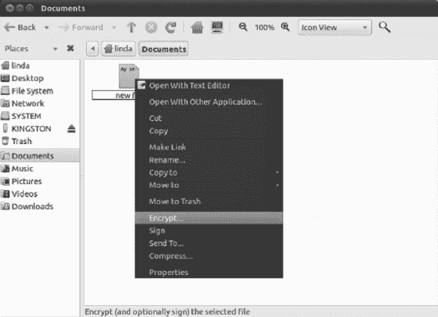

    ***图 8-11。**加密文件或文件夹是 Nautilus 中的一个上下文菜单选项。*

3.  Select the recipients of the encrypted file, as shown in Figure 8-12\. To encrypt a file for yourself, put a check alongside your own key. To encrypt for others, put a check alongside their names. Remember that file encryption is performed with the recipient's public key, so you will need to have imported it beforehand. Click OK to continue.

    注意记住你选择的人将是唯一能够解密文件的人。文件为别人加密而不是为自己加密后，*你*将无法解密！

4.  If you selected to encrypt more than one file, or if you have selected a folder to encrypt, the Encrypt Multiple Files dialog box will appear, as shown in [Figure 8-13](#fig_8_13). You can opt to encrypt each file separately or have the multiple files packed together in an encrypted compressed file, with the compression type of your choice. Select your preferred settings and then click OK to continue. 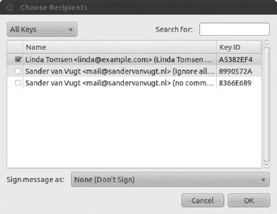

    ***图 8-12。**从您创建和导入的密钥中选择您想要加密的文件或文件夹的收件人。*

    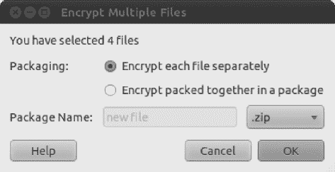

    ***图 8-13。**如果您正在加密多个文件，您可以选择加密每个文件，或者将所有文件存储在一个压缩文件中，并对该压缩文件进行加密。*

5.  文件或文件夹加密后，它将作为扩展名为`.pgp`的新文件出现在您的文件系统中。加密后的文件夹会先被压缩成一个`,ZIP`文件，然后再被加密成一个`.pgp`文件，如图 8-14 中的[所示。如果文件是用她的公钥加密的，那么这个文件就可以传给你的联系人，如果文件是用你的私钥加密的，那么这个文件就可以归档保存。有关如何解密文件的说明，请参见下一节。](#fig_8_14)

***图 8-14。**加密文件的扩展名为`.pgp`。*

##### 解密文件

要解密文件，请执行以下操作:

1.  通过点击面板上的主文件夹打开您的`/home`目录。
2.  选择要解密的文件。文件扩展名通常是`.pgp`。
3.  双击该文件。
4.  键入您之前创建密钥时输入的密码。(如果您最近使用过您的密码，您不必现在输入它，因为您的电脑仍会记住它。)
5.  然后，该文件将在存储加密文件的文件夹中被解密。它将使用其原始文件名。

#### 签署和加密电子邮件

设置加密密钥后，您可以发送带有数字签名的电子邮件，以表明您的电子邮件的真实性，还可以加密电子邮件，以便只有指定的收件人能够阅读您的邮件，反之亦然。只要您配置了 PGP 密钥，导入了信任密钥，并配置了 Evolution 帐户，就可以无缝集成这种安全性。

要在 Evolution 中签名和/或加密电子邮件，请执行以下操作:

1.  在 Evolution 中，选择 File  New  Mail Message 编写新的电子邮件。
2.  出现撰写邮件对话框。填写收件人字段、主题字段和消息。
3.  单击安全性。若要将电子邮件标记为签名，请选中“PGP 签名”复选框。要将电子邮件标记为加密，请选中 PGP Encrypt 复选框。
4.  单击发送按钮发送电子邮件。
5.  如果您选择对邮件进行签名，将出现“输入密码”对话框。输入创建 PGP 密钥时分配的密码，然后单击“确定”。

您的电子邮件将按照您的指定发送、签名和加密。

##### 验证电子邮件

为了能够验证您从其他人那里收到的签名电子邮件，您需要导入他们的公钥，然后使用 Seahorse 信任他们。当您收到签名的电子邮件时，会在邮件的最底部放置一条说明，表明电子邮件签名的真实性。

##### 解密电子邮件

要解密从其他人那里收到的电子邮件，需要在 Seahorse 中配置您的 PGP 密钥。您需要使用您的密钥来解密电子邮件。

只需选择您想要解密的电子邮件，您将看到“输入密码”对话框。输入您的 PGP 密钥的密码，然后单击确定。您现在可以以纯文本格式查看电子邮件。

### 安全常识

当你开始理解 Ubuntu 是如何工作的，你会越来越意识到保护你系统的常识性方法。但是，我们现在将概述其中的几个来帮助您开始:

*   ***输入你的密码:*** 如果你被要求输入你的密码，一定要非常小心(当然是在初次登录之外)。例如，在遵循本书中的许多配置步骤时，会要求您提供密码，这是可以接受的，也是安全的。但是如果你突然被要求这么做，你应该怀疑。如果当你运行一个不需要超级用户权限的文件，如 MP3 或 OpenOffice.org 文件时，出现超级用户密码提示对话框(如图[图 8-15](#fig_8_15) 所示),你应该谨慎对待这种情况。
*   ***创建完美的密码*** :设置良好的安全性不可避免地需要一个好的、强有力的密码。挑战在于创造一些容易记忆但难以破解的东西，所以它应该包括标点符号、数字和各种大写和小写字母。也许你可以根据一首喜爱的歌曲来设置密码。例如，`TiaLTNGO@TQiD1986-4:02`是一个很棒的密码。要记住它，我只需要知道《有一盏灯永不熄灭》是史密斯夫妇 1986 年发行的*女王已死*上的一首曲目，时长 4 分 2 秒。相比之下，`password`、`password4`和`andy1302`很差，因为在前两种情况下，它们容易受到字典攻击，在第三种情况下，它们容易受到个人信息攻击。
*   ***Installing new software***: Be careful in choosing programs to download and install. Because Linux works on the basis of open source code, theoretically, anyone can tamper with a program and then offer it for download by the unwary. This rarely happens in real life. Even so, it's wise to avoid downloading programs from unofficial sources, such as web sites you find online via a search engine and whose authenticity you cannot totally trust. Instead, get software from the web site of the people who made it in the first place or, ideally, from the official Ubuntu software repositories (discussed in [Chapter 20](20.html#ch20)). 

    ***图 8-15。**如果你无缘无故被要求输入密码，要小心了。*

*   ***更新您的系统*** :始终确保您的系统软件是最新的。和 Windows 一样，许多 Ubuntu 程序都有导致安全漏洞的缺陷。黑客瞄准这样的漏洞。下载最新版本的 Ubuntu 软件可以确保你不仅能获得最新的功能，还能获得关键安全漏洞的补丁。和大多数版本的 Linux 一样，升级 Ubuntu 很容易，当然，也是免费的。在下一节中，您将了解如何获取在线更新。
*   ***锁定你的电脑*** :攻击可以是远程的，也可以是本地的，所以除了网络安全，你还应该限制哪些人可以物理接触到你的电脑。任何 Ubuntu 系统都可能被一个简单的软盘启动盘破坏，甚至只是通过选择启动菜单上的救援模式条目，这为用户提供了对计算机的根访问权限。这是因为显而易见的原因；启动盘或救援模式的想法是让你在电脑出现问题时修复电脑，如果你被阻止访问某些文件，你就无法做到这一点。当 Linux 在保存机密数据的服务器上使用时，移除软盘和 CD-ROM 驱动器并不罕见，从而避免了通过启动盘启动。这种计算机通常也锁在房间里，甚至锁在橱柜里，拒绝物理接触机器。另一个选择可能是给计算机添加 BIOS 密码，这意味着在引导过程中会提示您输入密码。设置的方法取决于您的计算机类型，但一般来说，在计算机启动时寻找 BIOS 设置选项。显然，确保你永远不要忘记 BIOS 密码，因为一台不能启动的计算机是没有多大用处的。

 **提示**如果你丢失了 BIOS 密码，最好知道在大多数主板上，你可以通过从主板上取下电池来重置它。这将清除 BIOS 密码(以及 BIOS 中的所有其他设置)。

### 在线更新

屏幕右上角的 Ubuntu 通知区域(相当于 Windows 系统托盘)包含一个程序，该程序可以自动监控软件包仓库，并在有更新时通知您。这是更新管理器。如果你还没有更新你的系统，这个图标可能会变成一个向下的白色箭头，用一个橙色的星包围着，通知你有更新了。此外，每次启动时，您都会看到一个语音气泡，告诉您有更新可用。当您的系统完全更新时，图标不可见。

点击更新管理器图标打开更新管理器窗口，如图[图 8-16](#fig_8_16) 所示。要上网获取更新文件，只需点击窗口右下角的安装更新按钮。可能会要求您输入 root 密码，因为需要修改系统文件。

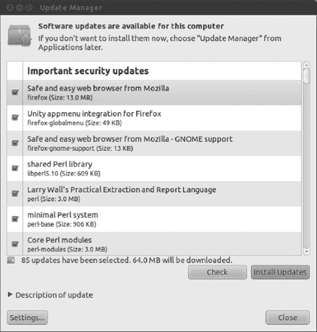

***图 8-16。**如果您的系统需要更新，我们会通知您，Update Manager 程序会为您处理一切。*

请注意，有些更新很大，可能需要一些时间来下载，特别是如果你是在安装 Ubuntu 后第一次这样做。

下载完成后，您可能不需要重启，除非内核文件已经更新。如果您确实需要重新启动，或者如果更新要求您采取任何其他操作(例如注销然后重新登录)，通知区域中的 Update Manager 图标将变成一个信息图标，或者变成两个带圆圈的箭头。然后，您应该单击该图标来查看建议您采取的操作。

**使用 APPARMOR 的应用程序安全性**

计算生活的一个可悲的事实是，所有的软件应用程序都有某种缺陷。其中一些并不严重(事实上，它们可能仍然不可见)，但一些可能会导致程序异常终止、数据损坏，甚至系统故障。最严重的错误为您的系统提供了“后门”,黑客可以利用这些后门进行破坏。

软件开发人员尽快修复报告的错误(开源方法的一个好处是解决方案可以来自第三方，从而加快过程)，但是发现错误和提供修复之间的差距是系统容易受到攻击的时候。利用这种漏洞被称为*零日利用*。

幸运的是，Ubuntu 和其他几种类型的 Linux 发行版有一个聪明的内置安全机制，称为 AppArmor，它可以监督软件应用程序，确保它们不会做不应该做的事情。实际上，似乎“沙箱”应用程序，所以它们只去系统中它们应该去的地方。

四年前，AppArmor 第一次被包含在 Ubuntu 7.04 版本中(Feisty Fawn)。虽然 AppArmor 已经集成到底层系统中，但是用户还不能很容易地进行配置。目前，在 Ubuntu 下配置 AppArmor 的唯一方法是使用命令行。这在将来可能会改变。

AppArmor 背后的想法是每个应用程序都有自己的配置文件。在这个概要文件中，有一个应用程序能做什么和不能做什么的确切定义。通过使用配置文件，AppArmor 可以防止应用程序执行未经授权的指令，这是针对黑客的一个很好的保护。对于用户来说，好消息是，一般来说，你不需要做任何事情就可以使用 AppArmor。它会自动安装和执行，并确保在您的计算机上提供额外的保护层。

每个概要文件都是一个配置文件，它包含了应用程序可以做什么的细节。AppArmor 配置文件存储在`/etc/apparmor.d`中。可以通过使用新立得软件包管理器安装软件包`apparmor-profiles`来添加概要文件。此外，您安装的新应用程序可能带有自己的 AppArmor 描述文件。安装附加配置文件后，它们会被自动使用。

每个应用程序都可以在两种模式下运行:

*   *Enforce mode* :在这种模式下，AppArmor 实现配置文件中列出的权限和能力。如果应用程序试图访问文件或使用配置文件中未列出的功能，将不允许该操作。
*   *投诉模式*:在这种模式下，AppArmor 记录应用程序违反配置文件中规定的规则时引发的违规行为，并将它们存储在系统日志中。这些日志可以在以后用于创建或更新应用程序的配置文件。

要确定哪些配置文件和程序在强制或投诉模式下运行，打开一个终端窗口(使用 Ctrl + Alt + t)并发出命令`sudo apparmor_status`。

要了解更多关于如何使用 AppArmor 和 Ubuntu，包括如何创建自己的应用程序配置文件，请参见`[https://help.ubuntu.com/community/AppArmor](https://help.ubuntu.com/community/AppArmor)`。

### 配置 Ubuntu 防火墙

一个*防火墙*是一组在你的电脑在线时保护它的程序。它通过监视您的 PC 和互联网之间的传入和传出连接来做到这一点，并且只允许它确信安全的内容通过(这通常是您所要求的)。它还试图关闭你的互联网连接的各个方面，使黑客没有办法在他们应该针对你的系统。

配置防火墙的好处是，即使你的系统由于软件错误而存在安全漏洞，黑客也会发现很难通过互联网利用它们。当有人试图探查您的系统时，它看起来几乎是不可见的。

 **警告**虽然个人软件防火墙(如内置于 Linux 中的防火墙)提供了高级别的保护，但最好与保护整个网络的硬件防火墙(如大多数 DSL/有线宽带路由器提供的防火墙)配合使用(奇怪的是，其中一些路由器实际上也使用 Linux 的`iptables`软件)。许多安全专家一致认为，仅仅依靠软件防火墙来保护个人电脑并不能达到最佳的保护水平。通过在网络上使用一个防火墙，在您的计算机上也使用一个防火墙，您可以为您的环境增加一层保护。不要只依赖网络防火墙，因为它不能保护你免受同一网络中其他计算机用户的伤害。例如，如果您在公共 WIFI 网络上，您不能信任网络上的其他计算机，在您的本地计算机上安装防火墙绝对是个好主意。

虽然 Ubuntu 包含了一个强大的防火墙`iptables`，但是你也需要一个程序来管理它。在这里，我们将向您展示如何使用 Firestarter(可从 Ubuntu 软件仓库获得)来实现这一目的。配置的内置防火墙确实提供了非常强大的保护。

 **注意**高级用户可能会选择配置 Ubuntu 的防火墙而不安装 Firestarter。命令行工具`iptables`和`ufw`是默认安装的，是一些系统管理员的首选。`Iptables`是一个用于管理 Netfilter 的配置工具，Netfilter 是内核中处理防火墙的功能。不幸的是，使用`iptables`，你需要理解 TCP/IP 如何工作，并学习困难的命令才能充分利用它。但是有了这些知识，你就可以把你的电脑变成一个功能齐全、价格低廉的软件路由器，其功能可以与硬件路由器相媲美或超过硬件路由器。`Ufw`(用于*简单防火墙*)是一个配置工具，它也管理 Netfilter 防火墙。它比`iptables`更容易使用，因为`ufw`中的防火墙规则通常简洁易读。启用防火墙的一个简单方法是运行 sudo ufw enable。这将允许传出访问，但不允许传入访问，这适用于主机防火墙。

#### 安装点火器

让我们从下载和安装 Firestarter 开始吧。请遵循以下步骤:

1.  从面板中，使用应用程序启动 Ubuntu 软件中心..在搜索框中输入 **firestarter** 作为搜索词。在结果列表中，找到该程序，然后单击安装。出现提示时，输入您的密码。
2.  安装完成后，启动 firestarter(在面板中，单击应用程序，并在搜索栏中键入 Firestarter。接下来，单击 Firestarter 图标启动它。当您第一次运行 Firestarter 时，系统会提示您输入密码以访问管理角色。然后，一个向导将开始引导您完成设置。
3.  单击“前进”按钮，继续向导中介绍性页面以外的内容。
4.  The first step asks which network interface Firestarter should configure, as shown in [Figure 8-17](#fig_8_17). If you use an Ethernet card, have a wireless card, or attach a broadband modem directly to your computer, the answer will probably be `eth0` or `wlan0`. However, if you use a modem, the answer is `ppp0`. 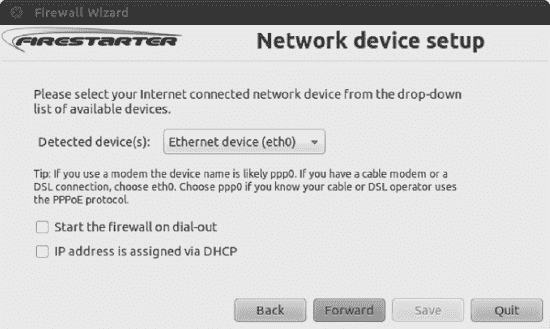

    ***图 8-17。** Firestarter 包括一个向导，引导您完成防火墙的基本配置。*

5.  勾选“IP 地址是通过 DHCP 分配的”,除非您使用的是拨号调制解调器，或者在极少数情况下，您已经将电脑设置为使用固定的 IP 地址。如果您使用的是拨号调制解调器，请选中“拨出时启动防火墙”复选框。做出选择后，单击前进按钮。
6.  You're asked whether you want to enable Internet connection sharing. This allows you to turn your computer into an Internet router and can be very useful in some circumstances. In modern networks (home networks as well as business networks), users normally connect to the router on the network, which gives them access to the Internet, so you probably won't need this. You can activate the Internet connection sharing option later by running the wizard again. Click Forward to continue.

     **注意**要重新运行向导，只需在 Firestarter 的主窗口中单击防火墙，然后单击运行向导。

7.  向导将完成。单击保存按钮将您的设置保存到磁盘。此外，确保选中“立即启动防火墙”复选框。此后，Firestarter 主窗口打开(见[图 8-18](#fig_8_18) )，软件激活。从打开的窗口中，您可以很容易地看到通过您的网络发送了多少流量。您还会看到一个新图标出现在桌面的通知区域。这表明防火墙正在运行，并将对不同类型的威胁或连接做出反应。

***图 8-18。**从 Firestarter 窗口，你可以很容易地看到你网卡上的当前活动。*

#### 配置 Firestarter

Firestarter 的工作原理是控制通过互联网或网络连接进出计算机的数据。默认情况下，它会阻止所有类型的未邀请入站连接，但允许所有类型的出站连接。

每当您单击网页上的链接时，您的计算机就会向承载该网页的 web 服务器发送数据请求。几毫秒之内，这些数据就被发送到你的电脑上。这是一个入站数据连接。Linux 防火墙足够聪明，能够意识到数据是您请求的，因此允许它通过。但是，任何不请自来的连接都会被拒绝。举个例子，如果有人突然试图通过流行的安全外壳(SSH)工具连接到您的计算机，他将不会被允许建立连接。这是一件好事，因为它使你的电脑安全。无论黑客如何尝试连接，只要他们尝试连接，就会被拒绝。

但是在某些情况下，允许不请自来的连接是有用的。例如，如果您创建了一个共享文件夹供办公室中的其他计算机连接，那么每当它们想要获取文件时，就会频繁地与您的计算机进行不请自来的入站连接。BitTorrent 等协议也依赖于许多传入连接。此外，如果您想利用 SSH 来远程连接到您的计算机，您将需要允许这样的传入连接。因此，Firestarter 允许您通过某些类型的入站连接。

在 Firestarter(以及许多防火墙程序)的术语中，*出站流量*是源自您的计算机并在网络和/或互联网上发出的任何类型的数据。默认情况下，Firestarter 允许输出所有数据，不管它是什么。这被描述为*许可政策*。但是 Firestarter 可以配置为阻止除您配置 Firestarter 允许的连接之外的所有传出连接。这是一个*限制性政策*，可以用来阻止某些类型的带有你个人数据的程序，比如间谍软件。

 **注意**与 Windows 不同，我们从未听说过 Linux 程序中含有以这种方式“呼叫总部”的间谍软件。然而，谨慎的态度往往会带来回报。

限制性策略还可以防止某些类型的病毒和蠕虫传播。限制性策略的缺点是，您必须配置 Firestarter，以考虑您希望允许通过的每种类型的传出数据连接，如 web 浏览器、即时消息程序等。

您可以通过单击主程序窗口中的策略选项卡来配置 Firestarter。单击编辑下拉列表，并选择配置入站流量策略或出站流量策略。

 **注意** Firestarter 仅用于配置内置防火墙，不需要运行防火墙即可工作。完成配置后，您可以退出程序。只有当您想要重新配置防火墙时，才需要再次使用它。

##### 设置入站规则

对于大多数用户来说，Firestarter 的默认入站流量政策完全可以接受。它将防火墙配置为禁止所有未邀请的传入数据连接，除了某些诊断工具，如`ping`、`traceroute`等。您也可以选择禁用这些服务，如“关闭诊断服务”一节所述。

如果您打算通过 SSH 从远程位置连接到您的电脑，或者如果您为办公室中的其他电脑创建了共享文件夹，您可能想要允许传入连接。如果你正在运行 BitTorrent 文件共享应用程序，这是必须的。此外，如果您在计算机上运行 web 服务器、电子邮件服务器或其他类型的服务器，您将需要在此处允许正确类型的传入连接。

以下是如何设置入站连接规则:

1.  在 Firestarter 主窗口中，单击策略选项卡。在编辑下拉列表中选择入站流量策略。
2.  Right-click in the second box on the Policy tab (with the headings Allow Service/ Port/For) and then select Add Rule. This opens the Add new inbound rule window, where you can specify what you want to allow for whom (see [Figure 8-19](#fig_8_19)). 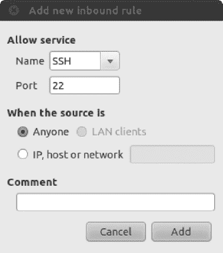

    ***图 8-19。**在添加新的入站规则窗口中，您可以定义新的服务来访问您的计算机。*

3.  出现“添加新的入站规则”对话框。在名称下拉列表中，选择您想要允许的传出连接类型，如图[图 8-19](#fig_8_19) 所示。例如，要允许其他人访问您电脑上的共享文件夹，请选择 Samba (SMB)。要允许 SSH 或 BitTorrent 连接到您的电脑，请从列表中选择相关条目。选择服务将自动填充端口框，你不应该改变它，除非你确切地知道你在做什么。
4.  如果您知道要进行传入连接的电脑的 IP 地址，您可以点按“IP”、“主机”或“网络”单选按钮，然后键入该地址。但是，任何人的默认设置将允许任何人使用任何 IP 地址连接到您的计算机。
5.  单击添加。返回 Firestarter 主窗口，单击工具栏上的应用策略按钮。

 **注意**每当你在电脑上激活新服务时，你都需要返回 Firestarter。例如，在第 10 章的[中，您将了解如何通过网络访问 Windows 共享，为此您需要启用 SMB 传入和传出访问。在第 25 章](10.html#ch10)中，你将会看到使用 SSH 服务，它必须被允许通过防火墙。换句话说，保护您的计算机不是一次就能忘记的事情。这是一个持续的过程。

##### 设置出站规则

默认情况下，Firestarter 允许所有类型的传出连接，就像它的传入连接策略一样，这对于普通用户来说绝不是一个坏选择。这当然是最不麻烦的选择。然而，通过选择一个限制性的流量政策，你可以完全控制什么样的数据离开你的电脑。任何未经授权的数据连接都将被拒绝；就发送数据的程序而言，就好像你的计算机没有网络或互联网连接一样。此配置选项提供了良好的保护，但可能难以应用。在开始创建出站规则时，请确保您知道自己在做什么！

以下是设置出站连接规则的方法:

1.  在 Firestarter 主窗口中，单击策略选项卡。在编辑下拉列表中选择出站流量策略。
2.  单击“默认限制，白名单流量”单选按钮。此选项意味着默认情况下所有出站流量都将被阻止。您需要将想要允许的流量添加到“白名单”中。
3.  在策略选项卡底部的最后一个空框(标题为允许服务/端口/)中，右键单击并选择添加规则。
4.  The “Add new outbound rule” dialog box appears. In the Name drop-down list, select the type of data connection you want to allow. At the very least, you should select HTTP. This will allow your web browser to operate correctly (it's also needed to allow the Ubuntu Software Center and Update Manager programs to work). HTTPS should also be allowed—this is the secure version of HTTP used to access the likes of online banking sites, online shopping services, and some online e-mail services. You should also add a rule for POP3 and another for SMTP, without which your e-mail program won't work. Selecting the type of service will fill in the Port box automatically. You shouldn't alter this unless you know what you're doing.

     **注意**一次只能添加一条规则。您必须多次重复步骤 3 和 4，为您想要允许的每个服务添加规则。

5.  单击“添加”按钮添加规则。返回 Firestarter 主窗口，单击应用策略。
6.  使用使用您刚刚授权的服务的程序测试您的设置，请耐心等待。一般来说，用出站规则配置防火墙是很复杂的，可能需要打开几个端口，然后才能做您需要做的事情。

 **警告**如果您创建了入站规则，您需要创建一个匹配的出站规则。例如，如果您为 BitTorrent 创建了传入规则，您也需要为 BitTorrent 创建传出规则。

您可以通过右键单击列表中的条目并选择“删除规则”来删除传入和传出规则。

##### 关闭诊断服务

某些网络工具可能会被黑客滥用来闯入计算机或只是引起它的问题。在过去，`traceroute`和`ping`工具以及其他工具已经被用来对计算机发起拒绝服务(DoS)攻击。

Ubuntu 默认允许这些工具运行。如果您想采用一种安全的方法来保护您的计算机，您可以选择禁用它们。如果你不知道`ping`和`traceroute`是什么，你显然不会错过它们，所以不允许它们也没有坏处。以下是如何:

1.  在 Firestarter 主窗口中，点击编辑首选项。
2.  On the left side of the Preferences window, click ICMP Filtering. Then click the Enable ICMP Filtering check box, as shown in [Figure 8-20](#fig_8_20). Don't put a check in any of the boxes underneath, unless you specifically want to permit one of the services. 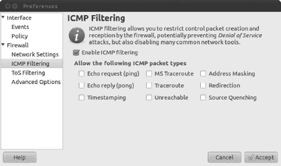

    ***图 8-20。**通过停用* `traceroute`、 *`ping`* 、*等服务，可以为您的电脑增加额外的保护。*

3.  单击接受按钮完成。

**偏执和安全感**

安全感和妄想症之间只有一线之隔。使用 Firestarter 让您有机会确保您的系统是安全的，而不需要不断地重新评估您的系统的威胁和生活在恐惧中。

当考虑您的系统安全时，请记住大多数窃贼不会从前门进屋。大多数人利用开着的窗户或房子里其他地方不安全的环境。换句话说，在配置系统的安全性时，您应该始终选择每个选项和额外的安全层，即使它可能看起来没有用。你应该锁上每一扇门，关上每一扇窗，即使你认为攻击者不会使用它们。

如果安全设置不影响电脑的日常使用，您应该选择它。例如，关闭计算机的 ping 响应听起来像是一种偏执的行为，但它在几个层面上是有用的。首先，这意味着当你的电脑在线时不容易被检测到。其次，同样重要的是，这意味着如果 ping 工具(或任何与之相关的软件)存在安全漏洞，您将自动受到保护。

这说明了在配置系统安全性时必须考虑的问题。试着想象每一种可能出现的情况。请记住，你不能采取太多的预防措施！

### 向 Ubuntu 添加病毒扫描

正如在章节介绍中提到的，Linux(以及 Ubuntu)目前没有受到很多病毒的影响。没有人知道影响 Linux 的病毒的真实数量，但它可能不到 1000 个，这是自 Linux 在 20 世纪 90 年代早期创建以来的总数！在我写这篇文章的时候，Linux 病毒相对较少，也就是说，主动感染计算机。

然而，没有自满的余地。随着 Linux 成为一个流行的桌面解决方案，病毒编写者很可能在未来几年将他们的注意力转向 Linux。保持警惕也很重要，因为你的 Ubuntu 系统可能会与 Windows 电脑交互，并可能成为 Windows 病毒的载体。

本节介绍如何使用 ClamTk，这是 Clam 防病毒(ClamAV)程序(`[http://clamtk.sf.net](http://clamtk.sf.net)`)的图形前端。ClamAV 是一款开源的工业级杀毒软件，可以在各种电脑和操作系统上运行。它可以检测 Windows 甚至 Macintosh 病毒，以及 Linux 和 UNIX 病毒。如果您与 Windows 用户共享文件，这有明显的好处——如果您的朋友和同事给你的任何文件被感染，您可以通知他们(当您意识到病毒不会影响您的系统时，您会感到温暖！).

ClamAV 唯一的缺点是仅限于病毒扫描。它不能像 Windows 上更复杂的病毒扫描程序那样给文件杀毒。但是，应该注意的是，消毒很少能很好地发挥作用，正如 ClamAV 常见问题(`[http://clamtk.sf.net](http://clamtk.sf.net)`)中所讨论的那样。

#### 安装 ClamTk

您可以通过 Ubuntu 软件中心安装 ClamAV 和 ClamTk，如下所示:

1.  从面板中，选择应用程序并启动 Ubuntu 软件中心。
2.  在搜索文本框中输入 **clamtk** 作为搜索词。
3.  在结果列表中，找到程序病毒扫描程序，然后单击安装按钮。出现提示时，输入您的密码。
4.  整个反病毒系统需要下载 26MB。
5.  关闭 Ubuntu 软件中心。

#### 更新 ClamAV 数据库

在扫描病毒之前，您应该更新病毒数据库。您应该在每次扫描时使用 ClamTk 程序进行扫描。

 **注意**当你安装 ClamAV 的时候，它增加了一个名为`freshclam`的后台服务，定期为 ClamAV 的数据库下载更新。然而，在扫描之前手动更新也是一个好主意，以确保在扫描时您总是使用最新版本的数据库。

为了更新数据库，ClamTk 需要访问系统文件，因此需要以 root 权限运行。为此，打开一个终端窗口(点击附件终端)，键入 **gksu clamtk** 并按回车键。出现提示时，输入您的密码。(`gksu`类似于`sudo`，因为它给你指定的程序管理员权限，除了它用于 GUI 应用程序。)点击帮助查看更新。将会打开一个新窗口，您应该再次单击“检查更新”。它将检查病毒定义数据库和 GUI 的更新。您可能会看到一条警告，提示您的 GUI 版本已过期。这是因为 Ubuntu 软件包有时比主版本落后一两个版本。然而，这不是一个重大问题，ClamAV 仍然可以扫描病毒，病毒定义将保持最新。当 ClamAV 第一次安装时，它会自动获取最新的数据库文件，因此 ClamTk 可能会在第一次运行更新时报告它已经是最新的。

如果你想把 GUI 升级到最新版本，你可以去 ClamTk 在 SourceForge.net 的网页(`[http://clamtk.sf.net](http://clamtk.sf.net)`)下载`.deb`文件。关于如何直接从`.deb`包安装程序的更多信息，请参阅第 20 章。简而言之，当文件下载完成后，会询问你是否想用 GDebi 包管理器打开它。是的，这就是你想做的。它会让你知道在 Ubuntu 自己的库中有一个更老的、更受支持的版本。点击安装按钮…风险自负！

要以普通用户身份运行 ClamTk，您可以从应用程序中启动病毒扫描程序(在面板中，启动应用程序，然后在搜索栏中键入 Virus 以显示病毒扫描程序按钮)。扫描病毒

使用 Windows 病毒扫描程序，您可能习惯于执行整个系统扫描。这对于 ClamAV 来说是不可取的，因为它根本不是为这个任务设计的。相反，ClamAV 旨在扫描用户文件，如文档。

 **注** ClamAV 实际上主要是设计用于与邮件服务器配合使用，并扫描收到或发出的邮件附件。参见 ClamAV 网站上的“关于”页面(`[http://www.clamav.org/about](http://www.clamav.org/about)`)。

您可以尝试执行全系统扫描，但在我们的测试中，发现了几个误报，这意味着 ClamAV 将无害文件识别为包含病毒。因此，最好使用 ClamAV 只扫描你的个人文件中的病毒，也就是说，那些在你的`/home`目录中的文件。请记住，这是您导入到计算机的所有文件可能安装的位置，因此这是最有可能发现感染的位置。

要扫描您的个人文件，请遵循以下说明:

1.  从 Ubuntu 菜单的附件菜单中选择病毒扫描程序来启动 ClamTk。初次启动时，您可以定义是为单个用户还是为所有用户更新防病毒签名。如果你有一个多用户系统，你应该选择后者。
2.  开始扫描之前，确保扫描隐藏文件是很有用的。毕竟，病毒很可能试图隐藏，而不是让它的存在显而易见！这可以通过点击高级首选项并检查以点(.*)框。
3.  虽然工具栏上有一个按钮可以让你点击一下就扫描你的`/home`目录，但它不会递归扫描。这意味着它不会扫描你的`/home`目录中的任何文件夹(或文件夹的文件夹)，所以它没有多大用处。要对您的`/home`目录执行递归扫描，请单击扫描递归扫描。然后在选择目录(递归)对话框中单击确定按钮。这将选择您的`/home`目录。当然，您也可以选择在此阶段扫描任何其他文件夹。
4.  扫描将开始。根据您的`/home`目录中文件的数量及其大小，这可能需要一些时间。您将在工具栏下方看到一个实时状态报告，显示当前正在扫描的文件。当状态行显示“扫描完成”时，扫描已经完成。窗口底部将显示一份完整的状态报告，显示扫描的文件数量和发现的病毒数量(如果有)。示例见[图 8-21](#fig_8_21) 。如果发现任何病毒，请转到下一部分。

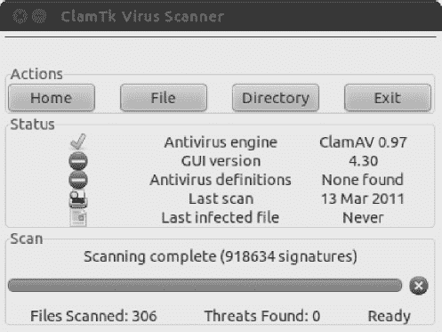

***图 8-21。**你会在 ClamTk 程序窗口的工具栏下方看到一份实时状态报告，详细说明哪些文件正在被扫描。*

#### 处理感染

如果发现任何病毒，它们将在 ClamTk 程序窗口中列出。据称感染该文件的病毒类型将在状态栏中列出。

请注意，ClamTk 有时会在无法访问特定文件时报告病毒，可能是因为文件权限问题。如果是这种情况，您会在状态栏中看到“拒绝访问”或“不能打开目录”。您可以忽略这些文件。

 **提示**如果你真的想扫描需要超级用户权限的文件，你可以用超级用户权限运行 ScanTk。打开一个终端窗口(从 Ubuntu 菜单中选择附件【T4 终端】，输入`gksu clamtk`。

可以右键单击列表中的条目，然后将其隔离或删除。隔离会将文件移动到一个特殊的目录，以便以后检查或删除。您可以使用隔离区维护菜单来管理隔离文件。

虽然你的冲动可能是简单地删除文件，但你应该谨慎。请注意，ClamTk 可能会报告一个*误报—* 一个它认为感染了病毒但实际上没有的文件。这种情况很少见，但可能会发生。如果您确实发现了一个误报文件，请右键单击该文件并选择隔离。然后点击检疫维护。在列表中，选择文件并单击误报。这将确保下次扫描时忽略它。

那么如果你发现一个文件被感染了，你该怎么办呢？第一，不要慌。请记住，ClamAV 可能发现的几乎所有病毒都是针对 Windows 系统的，不会影响 Linux。

 **注意**如果我们假设 Windows 有 140，000 种病毒，Linux 不到 1，000 种，那么理论上，ClamAV 发现的任何病毒都有超过 99%的可能是 Windows 病毒！

接下来，在状态栏中找到病毒的名称，并在网上查找以了解更多信息。此时，您将了解它是否是一种 Linux 病毒，如果是，它对您的系统的潜在影响。

您可以将鼠标悬停在扫描仪窗口中的文件名上来查看其路径。如果该文件位于您的 Firefox 缓存中，则没有什么可担心的，并且可以不受惩罚地删除该文件——只需右键单击并从菜单中选择 Delete。事实上，Firefox 缓存是您最有可能发现病毒感染的地方，因为当您浏览 web 时，所有文件(包括 HTML 文件、图像等)都临时下载到这里。但是，您应该再次记住，大多数试图传播病毒感染的邪恶网站都是针对 Windows 用户的，通常是通过 Internet Explorer 中的安全漏洞。作为一个使用 Firefox 网络浏览器的 Linux 用户，你不用担心太多。

**网络浏览器安全**

仅仅依靠杀毒软件是不够的。在 Firefox 中，你可以调整设置来增强浏览的安全性。但是，请注意，安全性的提高有时等同于功能的减少，这是非常令人沮丧的。要在 Firefox 中打开安全的一次性会话，请单击“工具”>“开始私人浏览”。在这种模式下，当 Firefox 关闭时，Firefox 不会保留任何私人信息。此外，在隐私选项卡上，您可以勾选永久隐私浏览模式，使隐私浏览成为您的默认模式。

要在 Firefox 中设置安全选项，请选择编辑偏好设置。以下选项卡上的设置会影响浏览器的安全性(参见[图 8-22](#fig_8_22) ):

*   *内容*:可以禁用弹窗，禁用 JavaScript。请注意，您不太可能想要完全禁用 JavaScript，因为许多现代网站大量使用它(包括在线购物网站和基于网络的电子邮件，如 Google 的 Gmail)。您可以使用一个名为 NoScript ( `[http://noscript.net](http://noscript.net)`)的第三方插件。默认情况下，该工具允许您禁用所有网站上可能对 Firefox 有害的 JavaScript、Java、Flash 和其他插件。您可以通过浏览器窗口右下角的 NoScript 小程序，在您信任的每个网站上轻松地重新启用这些脚本。
*   *隐私*:您可以自定义浏览器历史记录、cookies 和隐私数据的保留。如果隐私是最重要的，你可以选择“为历史使用自定义设置”并选中“当 Firefox 关闭时清除历史”复选框。
*   *安全*:你可以定制攻击地点和伪造检测、密码和警告信息。您应该根据您使用 Web 的方式来自定义这些设置。例如，很明显应该选中“当站点试图安装附加组件时警告我”复选框，因为恶意软件就是这样传播的。如果你在网上交易,“阻止网络伪造”选项提供了额外的保护，防止上当受骗。

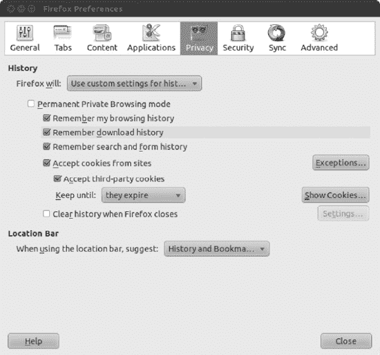

**图 8-22。**定制火狐隐私设置。

### 总结

在这一章中，你已经看到了你的系统面临的威胁，以及安全漏洞是如何被恶意的利益集团所利用的。您了解了可以用来保护系统的措施，例如在线更新系统、使用 AppArmor 来防范错误的应用程序、配置系统的防火墙、对电子邮件和文件隐私和身份验证进行加密、安装防病毒程序以及自定义 web 浏览器安全性。我们还讨论了一些常识性的规则，您可以遵循这些规则来保证系统的安全。

在下一章，我们将继续探讨如何个性化你的 Ubuntu 系统，以及如何设置一切来适应你自己的喜好。*