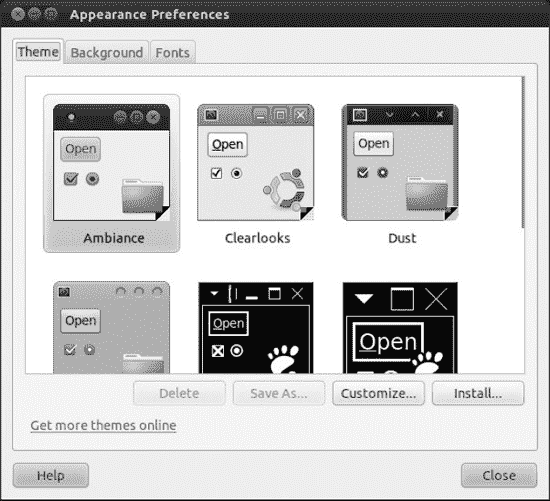
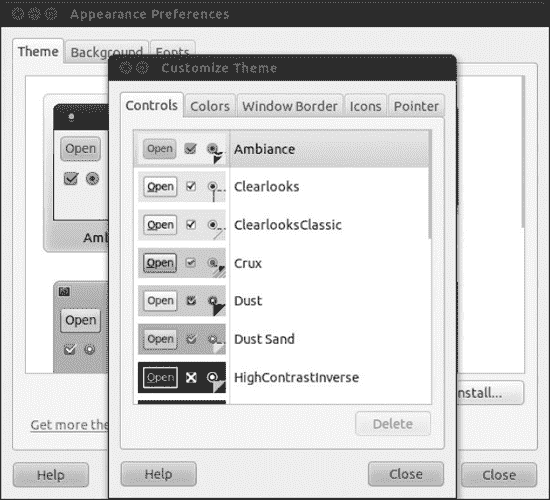
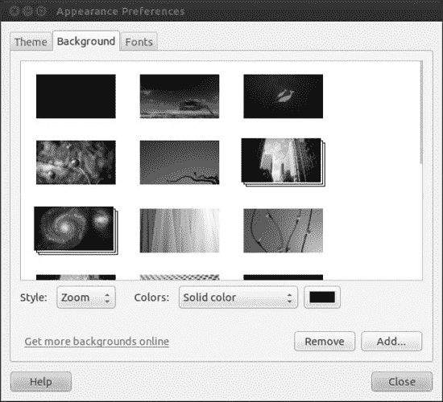
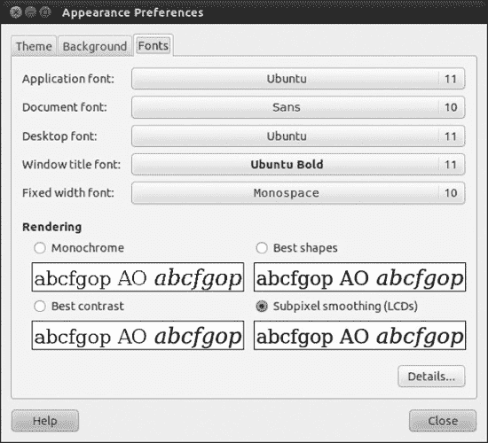
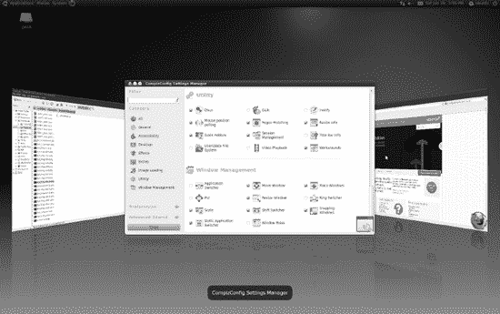
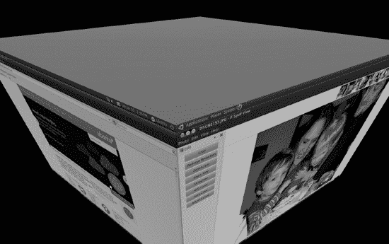
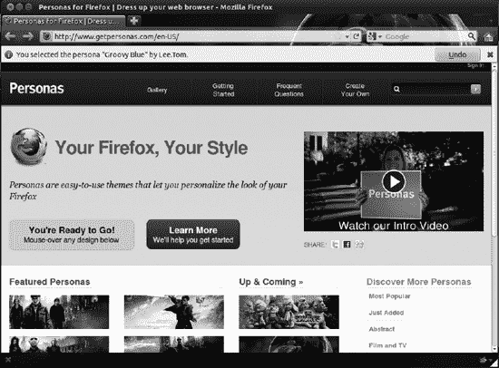
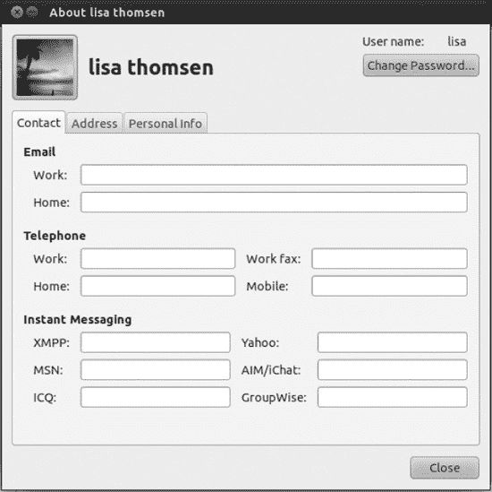
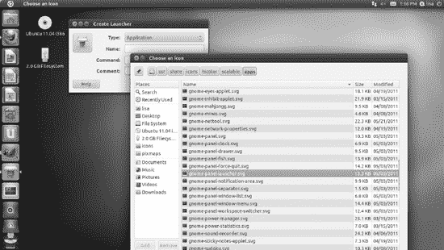
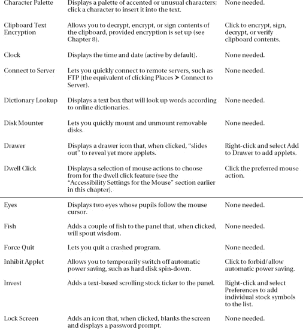

## C H A P T E R 9

## 个性化 Ubuntu:让一切恰到好处

如果你已经读过这本书的第一章，那么到目前为止，你无疑已经对 Ubuntu 很熟悉了。您已经开始意识到它的优势，并且正在努力使它成为您的首选操作系统。

但是事情可能还是不太对劲。例如，你可能会发现配色方案不合你的口味。或者也许你的登录图片不完全令人满意。也许你只是想摆脱默认的主题，在桌面上打上你自己的标识。这就是本章的全部内容:个性化 Ubuntu，让你对你的用户体验完全满意。为此，您将彻底检查 GNOME 桌面并探索其潜力。您还将为最重要的应用程序 web 浏览器添加一些华丽的元素，使其完全适合您的桌面。

### 团结还是经典

Ubuntu 11.04 最显著的变化之一是引入了一个新的图形界面:Unity。Unity 的目的是让使用 Ubuntu 更加容易。最常用的应用程序可以从屏幕左侧的 Unity 启动器中获得，并且有一个集成良好的搜索功能，可以帮助您轻松找到您需要的应用程序。不过，Ubuntu 确实给了你一个选择；如果您更喜欢使用经典界面，您可以选择它作为替代。

如果你的硬件支持这两个接口，默认情况下你会得到 Unity，如果你想使用经典接口，可以选择激活经典接口。如果你的电脑中的图形卡不符合硬件要求，你将默认获得经典界面，没有切换到 Unity 的选项。

当然，如果你是一个习惯了经典界面的 Ubuntu 长期用户，需要一段时间来适应新界面，但是你可以在登录时随时切换(或者你可以永久改变)。在这里，您将学习如何做到这两点。

注意改变可能很难，但有一点是肯定的:Unity 将成为即将发布的 Ubuntu 的默认界面。在本书中，我们选择使用 Unity 来做所有的事情。这意味着我们只包含如何从 Unity 界面启动程序和执行其他任务的说明。

#### 永久选择您的会话类型

要选择您想要永久工作的会话类型，请单击屏幕右上角的电源按钮。从显示的菜单中，选择系统设置以访问系统设置菜单。你现在会看到控制中心。在那里，选择登录屏幕(在系统标题下)并单击解锁以访问可用的不同选项。输入密码后，您将能够指定如何配置登录屏幕。在该窗口的下半部分(见[图 9-1](#fig_9_1) )，您会看到一个下拉列表，您可以在其中选择您的默认会话类型。从以下选项中选择:

***图 9-1。**从系统设置菜单中，您可以选择默认使用的显示模式。*

*   ***用户定义的会话*** :使用此选项启动您自己定义了属性的会话。
*   ***【Ubuntu(安全模式)*** :选择此项以安全模式启动 Ubuntu。在这种模式下，将加载最少量的驱动程序，以最大化 Ubuntu 能够成功加载的机会。
*   ***【Ubuntu Classic(无特效)*** :如果你不想用 Unity，而是 Ubuntu Classic 界面，没有额外的图形特效，就用这个。如果您的计算机的图形卡功能有限，建议使用此模式。
*   ***Ubuntu*** :如果你的硬件支持的话，这是使用 Unity 的默认模式。
*   *:如果你的显示硬件不支持 Unity，这将是默认模式。您也可以选择此模式在没有 Unity 的情况下工作。*
**   ***恢复控制台*** :选择此选项以最小恢复控制台模式重新启动计算机，但请注意，您需要良好的 Linux 命令行技能才能在这种最小模式下操作您的计算机！*

 *### 改变外观和感觉

Ubuntu 在许多方面与 Windows 相似，但它背后的开发者引入了改进和调整，许多人声称这使软件更容易使用。例如，Ubuntu 提供了多个虚拟桌面(也称为工作区)——长期以来被认为是一个非常有用的用户界面功能，但在微软的设计中没有受到青睐。 [1](#CHP-9-FN-1)

 **注**虚拟桌面功能也被苹果传了很久。然而，它在三年前以空格的形式被收录进了 OS X 豹。

如果你在 Ubuntu 经典模式下工作，Ubuntu 桌面会将程序菜单(在 Ubuntu 中称为应用程序菜单)移动到屏幕顶部，将整个屏幕宽度留在底部显示任务栏按钮。这是非常明智的，因为当多个应用程序打开时，按钮看起来并不拥挤。在 Unity 中，默认情况下你看不到任何菜单，只看到屏幕左边的 Unity 启动器。然而，如果你对 Ubuntu 的开箱即用的外观和感觉不满意，几乎桌面体验的每个方面都可以进行调整。

你可能习惯于在 Windows 下改变桌面颜色或壁纸，但 Ubuntu 走了极端，让你改变整个桌面的外观和感觉。从程序窗口的样式到桌面图标的一切都可以快速而容易地改变。

#### 改变主题

Ubuntu 将桌面的外观称为主题。无论你选择使用 GNOME 还是 KDE 作为你的主桌面，Ubuntu 都允许你彻底个性化整个视觉体验。发行版附带了几个主题，您可以下载更多主题。每个主题都允许您更改窗口的外观，包括按钮、滚动条、窗口装饰和图标集(尽管有些主题没有附加图标)。还有一小部分*辅助主题*，旨在改善弱视用户的桌面体验。

然而，与 Windows 主题不同，GNOME 主题通常不会改变桌面上使用的字体，背景可能会大致保持不变。您可以手动更改它们，如本章稍后的“设置字体首选项”和“更改桌面背景”部分所述。另一个区别是 GNOME 内置了这些功能——你不需要购买或安装额外的软件来改变桌面外观。

要改变主题，点击屏幕右上角的电源按钮。接下来，选择系统设置以打开控制中心。从那里，选择外观应用程序。然后只需从外观首选项对话框的主题选项卡的列表中选择一个主题，如图[图 9-2](#fig_9_2) 所示。每个选择都有一个小缩略图来显示主题的样子。当您选择一个时，它将立即应用到桌面，包括任何打开的应用程序和窗口。为了更好地了解主题的外观，你可以通过点击 Unity 启动器中的主文件夹图标来打开一个 Nautilus 窗口。这将让您感受一下图标、窗口装饰和小部件(如滚动条和菜单栏)在现实环境中的样子。

__________________

Sysinternals 的桌面工具可以为 Windows 添加类似但有限的功能；见[http://TechNet . Microsoft . com/en-us/sys internals/cc 817881 . aspx .](http://technet.microsoft.com/en-us/sysinternals/cc817881.aspx)

***图 9-2。Ubuntu 有几个主题选择。***

 **注意**在 Lucid Lynx 之前，Ubuntu 的默认主题都被打上了人类的烙印，旨在代表世界人口的肤色。这个品牌的口号是“人类的 Linux”有了 Lucid，就开发出了一个叫 Light 的新品牌。除了其他原因，选择这个名字是因为 Ubuntu 很轻，代表着“与专有操作系统的臃肿软件的决裂”2[2](#CHP-9-FN-2)T7】

Ubuntu 的默认主题叫做 Ambiance。Radiance 是一个类似的主题，但是使用了不同的调色板。记住，你每天都要使用这个主题，所以它应该实用，不要太分散注意力。那些微型的关闭、最小化和最大化按钮可能看起来很时尚，但是如果它们太小以至于你不能用鼠标可靠地点击它们，它们就没有用了；如果你的眼睛总是盯着一个漂亮但令人窒息的标题栏，你就不会专注于你的工作或娱乐。根据您选择的主题,“关闭”、“最小化”和“最大化”按钮可以位于每个窗口顶部栏的不同位置。Ambiance 特别将它们按以下顺序(从左到右)设置在左侧:关闭、最小化和最大化，而 Clearlooks 使用更传统的、类似 Windows 的定位和顺序。

除了改变整体主题，你还可以修改单个的主题组件，甚至下载更多的主题组件。

##### 更改单个主题组件

您可以改变构成 GNOME 主题的五个方面:控件(有时称为小部件)、配色方案、窗口边框、图标和鼠标指针。要更改主题，请在“外观首选项”对话框的“主题”选项卡上选择它，然后单击“自定义”按钮。你会看到自定义主题对话框，如图[图 9-3](#fig_9_3) 所示。

__________________

2 您可以在这里阅读品牌变更详情:【https://wiki.ubuntu.com/Brand】T2。

***图 9-3。**您可以通过选择自己的控件、颜色、窗口边框、图标和鼠标指针来自定义主题。*

> 单击每个选项卡查看您的选择:
> 
> ***控件*** :这些是你在对话框和窗口中点击的元素:按钮、滚动条、复选框、单选按钮等等。一组控件和另一组控件的主要区别在于它们的 3D 效果——一些控件嵌入背景，一些控件突出显示。有些控件是闪亮的，有些则显得平淡无奇。此外，有些是圆形的，有些是方形的。圆形控件感觉更友好，甚至可能更有趣，而方形控件感觉更有商业气息。
> 
> ***颜色*** :可以设置窗口、输入框、选择项、工具提示的背景和文本颜色。但是，请注意，控件几乎总是带有自己的配色方案，这些方案会覆盖您对颜色设置所做的任何更改。一些控件不仅覆盖颜色设置，而且不支持可调整的配色方案。示例包括 HighContrastInverse 和 HighContrastLargePrintInverse 控件。如果你调整这些，确保你在各个元素之间有足够的对比；否则，你可能会导致眼睛疲劳或头痛！
> 
> ***窗口边框*** :该选项卡上的选项控制程序窗口和对话框的边框。要特别注意窗口的顶部，在那里程序名称与关闭、最小化和最大化按钮一起出现。
> 
> ***图标*** :该标签让您控制正在使用的图标集。图标集包括您在屏幕上或菜单中看到的所有图标，包括文件夹、废纸篓、程序、硬盘、网络服务器等等。选择新的图标集将改变所有图标。
> 
>  **注意**自定义主题对话框的图标选项卡不允许您更改*特定*桌面项目的图标。您可以更改桌面上的任何图标，方法是右键单击图标，从出现的菜单中选择属性，然后单击对话框左上角的图标预览按钮。请注意，大多数股票图标存储在`/usr/share/icons`中，但是如果您已经将一个特别好的图标下载到您的个人文件夹中，请单击浏览按钮并找到它。以这种方式单独更改的任何图标都不会受到对图标集所做更改的影响。
> 
> ***指针*** :在该选项卡上，可以设置鼠标指针的外观。除了指针的设计，您还可以通过调整大小滑块来更改其大小(尽管并非所有鼠标指针都支持这一点)。较大的鼠标指针可能有助于视力受损者。小鼠标指针适用于低分辨率或小屏幕，如超便携笔记本电脑上的屏幕。

如果您更改这些选项中的任何一个，主题缩略图将更改为“外观首选项”窗口中的第一个，标记为“自定”。为了全面预览效果，最好的策略是保持 Nautilus 窗口打开。做出选择后，您可以保存主题以备将来使用。在“自定义主题”对话框中单击“关闭”，然后在“外观首选项”对话框的“主题”选项卡上单击“另存为”按钮。您需要给主题一个名称，如果您愿意，还需要一个简短的描述以供将来参考。通过勾选保存背景图片复选框，主题也将记住正在使用的背景。一旦保存，主题将可从主题选项卡中选择，其中主题按字母顺序排列。如果您选中了保存背景图像复选框，当您以后选择主题时，背景将会在主题选项卡的底部显示。要选择它，只需点击应用背景按钮。

如果您不保存主题，一旦您选择了另一个主题，您所做的更改将会丢失。

##### 安装附加组件

如果您厌倦了内置的可能性，您可以下载额外的主题组件，如窗口边框和控件，以增强您的桌面体验。你可以访问的两个流行网站是 GNOME Art ( `[http://art.gnome.org](http://art.gnome.org)`)和 GNOME-Look ( `[http://gnome-look.org](http://gnome-look.org)`)。GNOME Art 网站受到官方支持，当您单击“外观首选项”对话框的“主题”选项卡上的“在线获取更多主题”链接时，该网站就会打开。GNOME-Look 更倾向于由爱好者驱动。两者都提供了大量的主题组件选择。

  **注意**注意 GNOME-Look 中的一些背景显示艺术裸体。

如图 9-4 所示，GNOME 艺术网站可以让你访问几乎所有为 GNOME 创建的主题。事实上，该网站还包含背景选择，图标，等等。所有的产品都可以免费使用。

***图 9-4。**GNOME 艺术网站包含了最新的主题，你可以在 Ubuntu 上使用它们。*

安装新的主题组件很容易，这里的说明同样适用于 GNOME 外观的站点。例如，如果您希望安装一个新的窗口边框，请单击链接浏览示例，当您找到一个您喜欢的时，请单击下载它。它将包含在一个`.tar.gz`或`.tar.bz2`档案中，但是您不需要解压缩它(确保从 Firefox 对话框中选择 Save File 选项)。只需打开本章前面描述的外观首选项，然后单击主题选项卡上的安装按钮。然后浏览到下载的主题并单击打开。你也可以将`.tar.gz`或`.tar.bz2`文件拖到外观首选项对话框的主题选项卡上进行即时安装。无论哪种方式，都会询问您是否想立即使用新的主题组件。您可以选择“是”,或者稍后从“自定义主题”对话框(通过单击“外观首选项”对话框中的“自定义”按钮打开)中选择它，在该对话框中，它将出现在相关选项卡上。

完成后，您可以删除下载的文件，因为信息会自动复制到正确的位置。

 **注意**强调 GPL 软件许可的共享原则通常也适用于主题。这意味着一个人可以使用其他人创建的主题，调整它，然后作为新主题发布。这确保了不断的创新和改进。

#### 改变桌面背景

在 Ubuntu 下切换背景很容易。您也可以添加自己的图像并设置背景大小，或者如果您不想使用图像，请选择一种背景颜色。这些更改可以从外观首选项菜单的背景选项卡中进行，如图[图 9-5](#fig_9_5) 所示。

***图 9-5。** Ubuntu 有大量的桌面背景图片可供选择，甚至还有更多可供下载。*

##### 切换和添加背景图像

在“背景”选项卡上，您可以从图像列表中选择。您可以选择任何已安装的图像，或者通过选择左上角的缩略图，选择不安装任何图像。在后一种情况下，您可以使用窗口底部的下拉菜单来选择颜色背景样式(在以下选项中有详细说明)，并使用选择器来选择要包含的颜色。您有以下选项来决定如何使用桌面颜色:

> ***纯色*** :该选项用一种统一的颜色填充桌面。您可以使用一个颜色按钮来设置颜色。
> 
> **:此选项用左边的一种颜色填充桌面，从右边混合另一种颜色。您可以使用两个颜色按钮来指定这两种颜色。**
> 
>  ****:此选项用顶部的一种颜色填充桌面，在底部与另一种颜色混合。您可以使用两个颜色按钮来指定这两种颜色。****

 ****要指定将使用的一种或多种颜色，请单击颜色下拉列表旁边的颜色按钮。将出现“选择颜色”对话框。通过点按或拖移色轮来选择颜色。您还可以使用吸管工具来获取屏幕上显示的任何颜色，包括桌面上或打开的窗口中的任何位置。只需点击工具上的颜色。

如果这些都不适合你，你可以手动提供色调，饱和度值(HSV)；红、绿、蓝(RGB)值；或者通过指定十六进制数字的组合来指定颜色名称(这是网页设计者所熟悉的)。

您的选择的预览显示在对话框的左下方，在右侧的颜色预览栏中。您以前选择的颜色显示在左侧颜色预览栏中。选择您喜欢的颜色后，单击“确定”按钮。

 **提示**你可以右击桌面并选择改变桌面背景来访问相同的背景选择菜单。

如果您想使用自己的图片作为桌面背景，请点按“添加”按钮，然后浏览到图片的位置。与主题元素安装相反，您自己的图像不会被复制到新位置，因此，如果您删除了用作背景的图片，背景图像将会消失，并被正常的背景颜色所取代。

##### 选择背景样式

从背景选项卡上的样式下拉列表中，您可以从以下选项中进行选择:

> ***平铺*** :如果图片小于桌面分辨率，此选项只是重复图片(从左上角开始)直到填满屏幕。此选项主要是为图案图形设计的。
> 
> ***缩放*** :此选项强制图片适应屏幕，上下无边框。它避免了改变纵横比。如果壁纸的纵横比不正确，图像的上/下或左/右部分可能会被裁剪掉。在大多数情况下，选择缩放会给你最好的外观。
> 
> ***居中*** :该选项将图片置于屏幕中央。如果图像不够大，无法填满屏幕，边缘会出现一个边框。如果它比屏幕大，图片的边缘会被裁剪掉。
> 
> **:该选项放大过小的图像，缩小过大的图像，但保持纵横比，避免失真。但是，如果图片的长宽比与显示器不同，它的边缘可能会有边框。**
> 
>  *****拉伸*** :该选项强制图片适应屏幕，包括在必要时挤压或扩展图片(称为改变其纵横比)。如果图片与屏幕的比例不同，它看起来会失真。大多数数码相机拍摄应该是可以的，因为它们使用与大多数显示器相同的 4:3 比例(尽管如果您有一个 16:9 比例的宽屏显示器，数码相机图片将被水平拉伸)。
> 
> ***Span*** :这个选项是 Lucid Lynx 中新增的。当您有多台显示器时，选择此选项可使壁纸居中。**

 **#### 设置字体首选项

Ubuntu 允许你改变在桌面和应用程序中使用的字体(称为*系统字体*)。您还可以改变它们的显示方式，如果您想在 LCD 显示器上获得最佳图像，这很有用。

如[图 9-6](#fig_9_6) 所示，要更改系统字体，打开外观首选项对话框，点击字体选项卡。单击要更改的系统字体旁边的按钮，然后从列表中选择。你也可以设置字体大小，也许是为了让图标下面的标签更容易阅读。

通过点按“字体”标签的“渲染”部分中的条目，您可以更改字体在显示器上的外观。这将改变字体的抗锯齿和提示。抗锯齿会柔化每个字母的边缘，使它们看起来不那么参差不齐。暗示会影响字母的间距和形状。一起使用，他们可以使屏幕上的文字看起来更愉快，更容易阅读。按顺序尝试每个渲染设置，看看哪个看起来最合适(对话框中的文本将自动更新以显示更改)。几乎所有使用 TFT 屏幕的人，包括笔记本用户，都觉得“子像素平滑”选项最好。

***图 9-6。**通过使用外观首选项对话框的字体选项卡，您可以改变字体在屏幕上的显示方式。*

#### 使用桌面视觉效果

如果您的计算机支持启用这些效果，并且使用了正确的显卡驱动程序(请参见第 7 章中的“安装 3D 驱动程序和激活桌面视觉效果”一节)，您可以在您的计算机桌面上引入一系列酷而有用的效果，有时甚至是非常奇怪的效果。

桌面视觉效果有三种基本设置:无、正常和额外。通过选择“系统设置”选项卡，然后选择“外观首选项”对话框的“视觉效果”选项卡，可以在它们之间进行切换。

 **注意**在 Natty 的初始版本中，视觉效果选项卡在很多情况下是不显示的。如果这也适用于你的电脑，知道有其他方法可以调整你的电脑是件好事，比如本章后面讨论的 Ubuntu Tweak 实用程序。

如您所料,“无”选项会关闭效果。如果您的电脑在使用效果时变慢，或者如果您使用的是旧硬件，这可能会很有用。“正常”设置实现标准的效果集，为界面提供细微但不太明显的更改，如果您的计算机支持效果，这是默认选择。额外的设置增加了更多的效果，主要是为了好玩，但也有一些提供生产力的好处。此外，您可以选择安装一些额外的软件，让您更精细地控制所使用的效果。以下部分讨论了视觉效果的每一种选择。

##### 使用标准的视觉效果

选择正常设置时使用的标准视觉效果为窗口添加阴影，还添加最小化动画，以便程序看起来像缩小到面板中。您可能还会注意到非活动窗口及其标题栏是半透明的。此外，当窗口打开或关闭时，窗口将分别出现或淡出。

> ***虚拟桌面*** :如果你使用虚拟桌面，如[第 6 章](06.html#ch6)所述，你会很高兴知道桌面特效系统增强了体验。您可以将 Ctrl+Alt 键与键盘上的箭头键结合使用，在虚拟桌面之间进行切换。当您从一个虚拟桌面导航到另一个虚拟桌面时，屏幕中央会出现一个网格，其中每个单元格代表一个虚拟桌面，一个单元格会短时间突出显示，让您知道您在哪个虚拟桌面上。
> 
> ***应用切换器*** :除了在虚拟桌面之间移动之外，您还可以使用应用切换器在应用之间导航。只需按 Alt+Tab 就可以看到正在运行的应用程序列表，在屏幕中央水平排列，如图[图 9-7](#fig_9_7) 所示。重复按 Tab 键，直到在列表中央找到所需的应用程序。释放 Alt 键以切换到所需的应用程序。最小化的应用程序由它们的应用程序图标来表示，因为 Ubuntu 没有抓取它们的实时屏幕的选项。在最小化窗口上释放 Alt 键将打开它。

***图 9-7。**要使用应用程序切换器，请按住 Alt 键并按 Tab 键，直到在列表中央找到所需的应用程序。*

##### 使用额外的视觉效果

通过从“外观首选项”对话框的“视觉效果”选项卡中选择“附加”选项，可以启用更多的视觉效果。这些包括正常效果的所有特征，然后是一些。首先，你会注意到当你拖动或最大化一个窗口时，这个窗口变得“不稳定”——它的一部分会在窗口的其余部分后面徘徊，就像受到动量的影响一样。应用切换器效果也得到增强，当你按下 Windows+Tab 时会以 3D 形式显示打开的程序预览，如图[图 9-8](#fig_9_8) 所示。这显然需要你有图形能力来渲染，但如果你有，3D 切换器甚至会在预览中播放实况视频。

***图 9-8。**按 Windows+Tab 显示 3D 应用切换器。*

##### 个性化视觉效果

如果您对视觉效果的默认选择不满意，可以安装 CompizConfig 设置管理器工具。这让你可以完全控制 Compiz Fusion 系统，该系统提供了 Ubuntu 的视觉效果。请记住，这些设置中有一些是非常技术性的，对于那些不熟悉效果子系统的人来说很难做到。

你可以使用 Ubuntu 软件中心来安装这个工具。然后在搜索框中输入`compizconfig-settings-manager`作为搜索词。在结果列表中，找到“高级桌面效果设置”程序，然后单击“安装”。出现提示时，您需要输入密码。

安装工具后，从系统设置界面选择 CompizConfig 设置管理器。将出现 CompizConfig 设置管理器窗口，如图[图 9-9](#fig_9_9) 所示。

***图 9-9。**compiz config 设置管理器工具提供了 Ubuntu 中视觉效果的高级定制。*

Compiz Fusion 通过将每个效果打包为一个插件来工作，CompizConfig 设置管理器只需让您打开和关闭这些插件，以及更改它们的设置。对于大多数插件，您可以更改的最重要的设置之一是激活它们的键盘组合。

主窗口的右侧是按逻辑部分分组的插件列表。您可以通过选中它们旁边的复选框来启用它们。您也可以通过点按插件名称和图标来更改插件的设置。这将打开插件的设置页面，其中有一个或几个包含配置设置的选项卡。您还会在程序窗口的左侧看到效果的简要描述。完成后，单击后退按钮。

在左栏中，您可以使用顶部的 Filter 文本框来搜索特定的插件；搜索结果将显示在窗口的右侧。过滤器部分下面是类别列表，它根据目的对插件进行分组。单击任何类别都会更新窗口右侧的插件列表。要返回程序主窗口，请单击“后退”按钮。这些类别如下:

> ***所有*** :所有可用的插件都会显示在主窗口中。
> 
> *:此部分仅包含“通用选项”插件，它为某些效果的键盘快捷键、虚拟桌面大小、显示设置、窗口透明度设置等提供配置设置。有些设置非常专业，除非你知道自己在做什么，否则最好不要去管它。*
> 
>  ****辅助功能*** :此部分包含一些插件，这些插件将通过视觉辅助工具帮助身体有残疾的人更方便地使用桌面。它包含插件，使活动窗口更加可见，放大屏幕的可见性问题，改变颜色，并协助寻找鼠标指针。要找出激活任何特定效果所需的键盘组合，请点按插件图标以更改其设置，并查看每个标题旁边的按钮。请注意，当设置指定按钮 2 或按钮 3 时，它们与鼠标相关，超级键通常被称为标准键盘上的 Windows 键。
> 
> ***桌面*** :这个部分包含了增强桌面行为的插件。如果你使用虚拟桌面，桌面立方体和旋转立方体等插件可以将这些变成 3D 立方体的边，当你切换桌面时，它会旋转，如图[图 9-10](#fig_9_10) 所示。桌面墙和桌面平面呈现这些工作区，就好像它们是一个表面的一部分。您可能会注意到一些插件具有相同的功能；CompizConfig 设置管理器将提供禁用任何这样做时，你选择一个新的选项。Viewport Switcher 和 Expo 等插件使预览和导航工作区变得更加容易。显示桌面和淡入桌面添加特殊效果来清除桌面的混乱。像许多效果插件一样，这些插件与 Ubuntu 的现有功能相结合——在这种情况下，显示桌面功能和按钮，默认情况下位于桌面的左下方。
> 
>  **注意**在目前的配置下，没有办法在 Unity 环境下启用你在图 9-10 中看到的著名的旋转桌面立方体。如果你想使用桌面立方体，你需要在 Ubuntu 经典显示模式下工作。
> 
> ***特效*** :这个部分包含给桌面某些方面添加特效的插件。有些你已经看过了，比如摇晃的窗户，这是临时方案的一部分。但其他人更极端。例如，有几个插件可以为窗口增加视觉效果，如模糊窗口、动画、淡入淡出窗口和窗口装饰反射。3D 窗口、立方体齿轮和立方体反射会在您遍历 3D 立方体时添加装饰。其他插件会影响整个屏幕，例如使用水效果添加水坑和雨刷，或者使用屏幕上的油漆火效果添加屏幕上的火。有些需要键盘组合来激活它们—要找出这些是什么，请点按插件图标。*

*

***图 9-10。**旋转桌面立方体是你在电脑桌面上看到的最酷的特效。*

> ***Extras*** :这个部分包括对开发者有用的特效，以及一些根本无法在其他地方归档的插件。其中包括在登录后显示 Compiz Fusion 闪屏，对 Compiz Fusion 的性能进行基准测试，通过将鼠标指向任务栏上的窗口条目来查看窗口的缩略图，以及截图。一个值得注意的插件是 Annotate，它使您能够在屏幕上绘图。当强调关键点时，这对于演示和演示很有用。
> 
> ***图像加载*** :这些插件是技术性的，需要在后台加载图像格式和文本，其他插件将使用这些格式和文本进行渲染。不要禁用它们。
> 
> ***实用程序*** :这个部分包含大部分在幕后工作的插件和一些在外部工作的插件。除非你知道你在做什么，否则你不应该改变这些设置或者禁用任何插件。如果你有一个相当强大的机器，启用视频播放选项，这将在应用程序缩略图生成的地方进行实时预览。
> 
> ***窗口管理*** :这些插件增强了窗口管理功能。例如，一些插件以不同的方式投影任务栏，如 2D、环形和 3D 环形。另一个例子是分组和标签窗口插件，您可以使用它对窗口进行分组和标签。Vista 应用程序切换方法的粉丝应该进入 Shift Switcher，在外观选项卡下查看，并更改封面。

在 Categories 列表下面是 Preferences 选项，它用于调整 Compiz Fusion 的内部设置，例如后端配置文件，以及包括和排除插件。您可以保持这些设置不变。

最后，高级搜索选项允许您搜索插件中的选项。搜索结果将首先缩小到主窗口中的插件列表。从插件列表中选择后，将显示一个新列表，其中包含一个分组选项列表。从分组选项列表中选择后，您将看到一个缩小的选项列表，您可以使用它来配置插件的设置。

**使用桌面小工具**

如果你是 Windows Vista 侧边栏、Macintosh OS X 仪表盘或雅虎小工具的粉丝，你可以在 Ubuntu 下使用类似的东西，叫做 *screenlets* 。要使用这些，您需要安装 Screenlets 包。这要求您首先安装 CompizConfig 设置管理器，如正文中所述。最后，使用 Ubuntu 软件中心搜索并安装 Screenlets 包。

从 Dash(允许你运行应用程序的程序；使用 Alt+F2 启动它)。小屏幕管理器窗口出现后，通过单击选择要启用的小屏幕，然后单击启动/添加按钮。接下来，您应该能够点击并拖动小屏幕。右键单击一个小屏幕并选择属性来更改其设置。

关于小屏幕显示的方式和时间，您有两种选择:

*   让窗口小部件一直显示在屏幕上(默认)，也许可以像 Windows Vista 或 Google Sidebar 一样将窗口小部件排列在屏幕的右侧(顺便说一下，这也可以在 Linux 上使用)。
*   将小部件添加到小部件层，它就像 OS X 的仪表板，只有当你按 F9 时才会出现(当鼠标被点击时会消失)。要将微件添加到微件层，右键单击微件，选择窗口，然后单击微件。

当然，您可以两全其美，在屏幕上保留一些小部件，在小部件层放置不常用的项目。

如果您想添加比默认可用屏幕更多的小屏幕，请转到`[http://screenlets.org](http://screenlets.org)`。在“下载”标题下，单击“第三方小屏幕”链接。下载完小屏幕程序后，您可以通过在“小屏幕程序管理器”窗口中单击“安装小屏幕程序”,然后导航到下载的小屏幕程序来安装它。

###### 装扮火狐

你可能会花相当多的时间在浏览器 Firefox 上。因此，像关注桌面一样关注这个重要应用程序的外观是个不错的主意。自从第一个版本发布以来，Firefox 就一直是主题化的，但监督该应用程序开发的 Mozilla 项目已经在该应用程序的功能中添加了*人物角色*，使你能够立即改变该应用程序的外观和感觉。首先，访问项目网站(`[http://www.getpersonas.com](http://www.getpersonas.com)`)并点击屏幕右下方的获取人物角色按钮。这将下载一个小的扩展，并要求您重新启动浏览器。浏览器重新启动后，你会看到一个外观非常不同的浏览器，如图 9-11 所示。你可以通过点击浏览器窗口右下角的狐狸面具图标，选择一个新的来改变皮肤。这是一个动态列表，所以会不断更新。变化应该几乎是即时的，这意味着你可以根据你的心情改变你的浏览器。

如果列表中没有你喜欢的，创建你自己的皮肤并与世界分享。更多信息见`[https://personas.services.mozilla.com](https://personas.services.mozilla.com)`。

***图 9-11。**给火狐增加一些个性，让它适合你的桌面主题。*

Firefox 还有大量其他扩展，可以改变浏览器的外观或工作方式。例如，树样式选项卡在浏览器的左边缘以树状结构排列打开的选项卡。

#### 更改您的登录图片

登录屏幕会在你的名字旁边显示一张图片。您可以单击此处并键入您的密码登录。您可能熟悉 Windows 或 Mac OS X 下的类似系统。

用户可以通过打开【关于我】对话框选择自己的登录图片，如图[图 9-12](#fig_9_12) 所示。您可以在系统设置菜单中找到此对话框，或者在屏幕右上方单击您的登录名出现的菜单中找到此对话框。“关于我”对话框旨在让用户输入他们的个人详细信息，如地址，但他们也可以简单地使用它来选择自己的照片或添加图示图标。为此，请单击对话框顶部您的姓名旁边的空白方块。你会看到一个默认图标的文件列表供你选择，你也可以导航到你自己的图标。理想情况下，您选择的图像应该是正方形的，96×96 像素，尽管如果图片太大，它会自动缩小。完成后，单击“确定”。

***图 9-12。**关于我的对话框*

### 添加和删除桌面项目

几乎整个 Ubuntu 桌面都可以重新设计和重组。例如，如果你在 Ubuntu Classic 模式下工作，你可以将应用程序菜单从屏幕顶部移到底部，以更像 Windows，或者你可以添加许多桌面快捷方式到流行的应用程序和/或文件。

 **注意**你会注意到在当前版本中，没有那么多 Unity 设置要改变。您在系统设置菜单界面中找到的唯一项目是 Launcher &菜单，它让您选择当鼠标指针位于屏幕的左边缘或屏幕的左上角时，Unity Launcher 是否应该显示。其他项目不可更改或不会更改。例如，在`askubuntu.com`的第 16183 个问题中，马克·舒托沃尔斯(Ubuntu 的大老板)回答了 Unity Launcher 的方向是否会改变的问题:“如果没有更广泛的设计目标，我担心这不会起作用，所以我们不会实现它。我们希望启动器总是靠近 Ubuntu 按钮。”

#### 创建启动器

Ubuntu 最接近 Windows 风格的桌面快捷方式是启动器，你可以创建一个指向程序或文件的启动器。如果为一个文件创建了启动器，Ubuntu 将自动启动正确的程序来显示该文件。例如，如果你为一个`.jpg`文件创建一个启动器，当双击启动器时，Ubuntu 将知道启动 GNOME 图像浏览器的眼睛。

有两种方法可以创建启动器。一种方法是简单地从主菜单中点击一个图标并将其拖到桌面上。这有效地将菜单的启动器复制到桌面，而不是创建一个新的启动器，但是效果是一样的。

创建启动器的另一种方法是右键单击桌面并选择 Create Launcher。在“创建启动器”对话框中，从“类型”下拉列表中选择是否要为某个位置或应用程序创建启动器(第二个选项“终端中的应用程序”将打开一个终端窗口并在其中运行程序；这仅用于特殊用途)。然后填写名称和命令字段。或者，如果您不知道文件的确切名称和路径，请单击“浏览”按钮，使用“文件浏览器”对话框导航到文件或程序，然后单击选择它。(如果您正在创建一个程序的启动器，您可能会在`/usr/bin`中找到它，它存储了您日常使用的大多数 Linux 程序。)注释字段可以留空。如果它被填充，它将形成工具提示文本，当您将鼠标光标悬停在启动器图标上时，该文本将出现。

要为启动器选择图标，请单击“创建启动器”对话框左侧的图标按钮。您可以从几个预定义的图标中进行选择，如图 9-13 中的[所示，或者通过点击浏览按钮并导航到已保存图标的位置来选择您自己的图片。与桌面背景和主题一样，在](#fig_9_13)`[http://art.gnome.org](http://art.gnome.org)`有许多图标集可用。从“系统设置”菜单中选择“外观”项，并在“主题”选项卡下查看，可以添加其他图标集。在窗口的右下角，选择自定义。您可以将下载的图标包拖放到图标选项卡，它们将立即安装。如果你没有选择一个图标，会使用一个普通的 GNOME 图标。

***图 9-13。**创建启动器很容易。只需填写名称和命令字段，并选择一个图标。*

##### 使用 Ubuntu 调整

如果你经常使用 Windows，你可能会遇到一个叫做 Tweak UI 的应用程序，它可以让你执行一些有用的桌面操作。嗯，Ubuntu 有自己的版本，非常适合给你的`/home`文件夹、电脑或者桌面上的已删除邮件文件夹添加图标。它可以做很多其他的事情，但是桌面图标是我们感兴趣的。

要安装应用程序，请转到`[http://ubuntu-tweak.com](http://ubuntu-tweak.com)`并选择立即下载选项！在下载对话框中，选择保存文件，将文件保存到主目录的`Downloads`文件夹中。下载完成后，在下载窗口中双击软件包，这将打开 Ubuntu 软件中心，其中包含您刚刚下载的软件包。单击“安装”安装软件包。

安装包之后，您可以通过从 dash 中选择 Ubuntu Tweak 来运行它。在第一次运行时，应用程序会询问您是否要启用 Ubuntu Tweak 稳定库，它允许您自动更新软件包。单击“是”启用存储库，并继续探索 Ubuntu Tweak 选项。该工具提供了很多，包括另一种查找和安装应用程序的方法，但您需要查看的部分被标记为桌面。在这里，选择桌面图标，并从预定义的选项中选择您想看到的图标，当您点击按钮时，它们就会出现，如图[图 9-14](#fig_9_14) 所示。取消选择以移除。您还可以在不重命名实际文件夹的情况下重命名图标，这可能很有用。

***图 9-14。**如果你熟悉 Windows 的桌面图标方案，你可以使用 Ubuntu Tweak 添加你的收藏夹。*

##### 创建链接

启动器有一个缺点:它们只能被 GNOME(和其他桌面环境，如 KDE)识别。例如，您不能创建一个应用程序的启动器，并从命令行或 Alt+F2 run application 框中使用它。从技术角度来说，底层 Linux 文件系统无法识别启动器。

解决方法是创建一个*链接*到文件或程序。这实际上会创建一个指向该文件的符号链接。链接非常类似于启动器，只是它在文件系统级别上工作。

 **注意**实际上，Linux 提供了两种类型的链接:一种是*符号链接*，这是 Linux 下最常用的链接类型；一种是*硬链接*，这是复制文件和创建快捷方式的结合。

要创建链接，请使用 Nautilus 找到要创建链接的文件，右键单击该文件，然后选择“创建链接”。该链接将创建在与原始文件相同的目录中，然后您可以单击并拖动新链接到您希望它出现的任何位置，例如桌面。您不需要选择图标，因为链接继承了原始文件的图标。例如，如果它是一个图片链接，它将继承缩略图预览图标。

 **注意**如果您发现“创建链接”选项变灰，很可能是您没有足够的权限将链接写入相关目录。

#### 在 Ubuntu Classic 中个性化面板

*面板*是在 Ubuntu 经典视图中出现在 Ubuntu 屏幕顶部和底部的长条，显示菜单、小程序和图标的选择。您可以通过右键单击现有面板上的空白处并选择“新建面板”来添加新面板。新面板将出现在桌面的一侧。如果你添加第三个，除了两个默认面板，它会出现在桌面的右侧，垂直。您也可以通过右键单击面板并选择删除此面板来删除面板。

 **注意**如果你删除了一个面板，它所包含的项目排列将会丢失。当然，您总是可以在不同的面板上重新创建集合。

通过右键单击面板并选择属性，可以更改其大小和尺寸。例如，通过取消选中“扩展”框，您可以将面板缩小到尽可能小的尺寸。然后，当您添加新组件时(或者，在面板包含窗口列表的情况下，当新程序运行时)，面板将根据需要展开。这可以是一个整洁的效果，也创造了更多的桌面空间。选择自动隐藏功能将使面板在没有鼠标时滑出屏幕。选择“显示隐藏按钮”将使小箭头出现在面板的两侧，这样当它不使用时，您可以点按它以将其滑离屏幕的一侧。这两种技术都创造了更多的桌面空间。

您也可以通过更改“方向”下拉列表中的选择，将面板的对齐方式更改为顶部、底部、左侧或右侧。

#### 在 Ubuntu Classic 中添加和移除菜单

您可以将应用程序菜单或整个菜单集(应用程序、地点和系统)添加到屏幕底部的面板中。这可以帮助那些渴望 Windows 开始按钮方式访问程序的人。

##### 在 Ubuntu Classic 中将所有菜单添加到面板中

要将应用程序、位置和系统菜单添加到 Ubuntu 桌面底部的面板，请按照下列步骤操作:

1.  右键单击底部面板上的空白处，然后选择添加到面板。
2.  在出现的对话框中，单击菜单栏选项以添加所有三个菜单。您可以在列表中的实用程序标题下找到它；你需要向下滚动才能看到它。
3.  点击对话框底部的添加按钮。
4.  单击关闭按钮。

##### 在 Ubuntu Classic 的面板中添加类似开始的按钮

作为应用程序、位置和系统菜单的替代，您可以添加一个类似开始的按钮，为所有三个菜单提供子菜单。下面是添加此按钮的方法:

1.  右键单击底部面板上的空白处，然后选择添加到面板。
2.  在出现的对话框中，单击主菜单选项。您可以在列表中的实用程序标题下找到它；你需要向下滚动才能看到它。
3.  单击对话框底部的添加按钮。
4.  单击关闭按钮。

##### 在 Ubuntu Classic 中删除菜单

创建菜单的新实例不会删除旧实例。例如，如果您在屏幕底部创建新的应用程序菜单，旧的应用程序菜单将保留在屏幕顶部。事实上，你可以在桌面上拥有尽可能多的菜单实例，尽管这不会很好地利用桌面空间！

要删除任何菜单，只需右键单击菜单上的任意位置，然后选择从面板中删除。

 **提示**您可以通过右击任一菜单并选择编辑菜单来个性化应用程序和系统菜单。这将启动主菜单程序(也可从系统偏好菜单访问)。只需选中或取消选中现有条目即可在菜单中添加或删除它们，或者单击“新建项目”按钮创建新条目。可以像前面讨论的启动器一样创建新的应用程序条目。

##### 在 Ubuntu Classic 中修改菜单

您可以通过右键单击其中一个菜单并选择编辑菜单选项来修改菜单的显示方式。您应该知道，如果您有多个菜单，桌面上所有菜单的配置都是相同的。

您将看到一个由三部分组成的窗口。在左侧，您会看到菜单项或类别。如果您选择其中的一个类别，它的内容将显示在 Items 部分，您可以在其中选中您希望显示在菜单上的项目，并取消选中那些对您没有用的项目。您可以隐藏类别或单个应用程序。例如，在“菜单”部分选择“应用程序”,然后取消选中“游戏”项。下次您展开应用程序菜单时，游戏类别将不会显示。但是，如果您选择应用程序附件菜单并取消选中项目计算器，附件类别将会显示，但计算器不会显示。

您可以为自己的类别或应用程序创建自定义的直接访问。只需在 Menus 部分选择新元素的位置，然后单击 New Menu 创建一个新类别，或者单击 New Item 在当前类别中创建一个应用程序启动器。

单击“关闭”保存更改，更改将立即生效。

#### 在 Ubuntu Classic 中移动面板项目

要移动面板项目，请右键单击它并选择“移动”。然后将鼠标拖动到新位置，单击鼠标按钮一次，将项目放置到位。所有面板项目都可以移动，包括菜单，并且项目可以在不同的面板之间移动。任何挡路的物品都会被移走以腾出空间。

如果“移动”选项呈灰色，请右键单击它，并确保“锁定到面板”旁边没有复选标记。如果您试图将一个项目移动到被其他项目占用的空间，这一点尤其重要——如果其他项目被锁定，它不会自动移开！

#### 在 Ubuntu Classic 中使用小程序

除了应用程序/文件图标和面板，你在桌面上看到的几乎所有东西都被 GNOME 桌面视为 applet。例如，菜单是 applet 的一种形式，工作区切换器也是如此。

 **注意**小程序完全独立于小屏幕程序，这在本章前面已经讨论过了。小程序内置在 GNOME 桌面中，提供基本的功能。小屏幕由小屏幕子系统提供，并且“浮动”在桌面之上。然而，就小应用程序和小屏幕程序所提供的功能而言，经常有重叠。

Ubuntu 提供了更多的小程序，你可以选择添加到桌面上，提供许多有用或有趣的功能。要添加小程序，请右键单击面板上的空白处，然后选择添加到面板。有些小程序在添加时需要配置，因此您可能需要右键单击它们并选择属性。例如，您需要在天气报告小程序的属性中设置您的位置，以便它能够提供准确的预测。表 9-1 描述了一些最有用的桌面小程序。要删除小程序，只需右键单击它并选择从面板中删除。

### 总结

在这一章中，你学习了如何根据你自己的喜好个性化 Ubuntu。您看到了如何更改主题以使桌面具有新的外观。

此外，您还学习了如何在桌面上添加和删除小程序，以便添加功能或简单地让 Ubuntu 按照您喜欢的方式工作。

在下一章，你将会看到 Ubuntu 下有哪些程序可以取代那些你可能错过的 Windows 收藏夹。********