# 十一、应用的世界

Ubuntu 是一个完全现代化的操作系统，因此，它包含了几乎所有日常任务的全面软件选择。不管你是想写信、编辑图像还是听音乐，Ubuntu 都能为你提供一些东西。

本章介绍了 Ubuntu 下的软件，它可以执行你在 Windows 下可能已经习惯的任务。它不是每个软件的详细指南。相反，本章的目的是让你尽快开始使用 Ubuntu 的替代品。这一章给出了每个软件的名字，你可以在 Ubuntu 的菜单上找到它，以及一些关于如何使用它的基本事实。在许多情况下，这些应用程序将在本书后面更深入地讨论。

### 可用软件

表 11-1 列出了各种流行的 Windows 程序以及它们的 Ubuntu 版本。你会发现大多数程序都列在应用程序菜单上。[表 11-1](#tab_11_1) 还包括了许多其他主流的替代软件，其中大部分并没有默认安装在 Ubuntu 下，但是可以从 Ubuntu 在线软件仓库获得。你以后可能想试试这些。如你所料，它们都是免费的，所以你不会有任何损失。

 **注** [表 11-1](#tab_11_1) 只列出了 Linux 下可用程序的一小部分。有数以千计的其他人，包括一些有类似设施的人。此处列出的程序的工作方式与 Windows 类似，因此提供了一个简单的过渡。

T2】

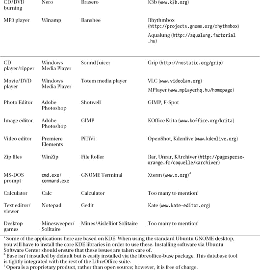

**LINUX 拥有一切**

Ubuntu 软件档案包含数以千计的程序，几乎涵盖了你想在电脑上完成的每一项任务。在 Linux 世界中，多样性是至关重要的。例如，你会发现有许多可用的电子邮件程序，而不仅仅是一个。它们以一种温和的方式相互竞争，你决定与哪一个安定下来并使用它。

使用 Linux 的部分乐趣在于探索可用的东西。当然，额外的好处是，几乎所有这些软件都是免费的，所以您可以简单地下载、安装和试用。如果你不喜欢某个程序，就把它从你的系统中删除。然而，不要忘记几个月后重访该计划的主页；很有可能这个程序会在短时间内得到扩展和改进，它可能会更好地满足您的需求。

### 常用 Ubuntu 程序快速入门

本章的剩余部分概述了表 11-1 中列出的几个程序。我们的目标是让您在使用每个程序时有一个良好的开端，并指出在哪里可以找到大多数主要功能。在本书的后面部分，你会发现更多关于它们的细节。

请记住，Ubuntu 并不打算成为其他操作系统的精确克隆。有些程序的工作方式与你习惯的方式相似，但并非所有的程序都是如此。正因为如此，当程序看起来不像你想要的那样工作或者以奇怪的方式响应时，很容易在早期感到沮丧。与另一个操作系统上的对应程序相比，一些程序可能将函数隐藏在看起来不合逻辑的地方。需要一些耐心，但随着你习惯了 Ubuntu，最终会有回报的。

#### 文字处理:LibreOffice Writer

LibreOffice Writer 是 LibreOffice 中包含的文字处理应用程序。

但是什么是 LibreOffice 呢？先前版本的 Ubuntu 附带了 OpenOffice.org 作为其完整的办公套件。但是在 Oracle Corporation 收购 Sun Microsystems(该套件的创建者和主要贡献者)之后，一些成员担心该项目的未来，并在 2010 年 9 月成立了一个新的组织“文档基金会”，以确保自由和开放开发的继续。他们提供了一个重新命名的 OpenOffice.org 之叉，命名为 LibreOffice。甲骨文拒绝参与新项目，因此 LibreOffice 和 OpenOffice.org 分道扬镳。鉴于 LibreOffice 的免费性质，许多 Linux 发行版(包括 Ubuntu)决定支持它，将它作为默认的办公套件，而不是 OpenOffice.org。

LibreOffice 作为 OpenOffice.org 的一个分支，是一个完整的 Linux 办公套件，是为了与微软 Office 竞争而从头开始构建的。因此，您会发现 Microsoft Office 的许多功能都在 LibreOffice 中复制，外观和感觉也与 2007 年以前的 Office 版本相似。最大的区别是 LibreOffice 是开源的，而且是免费的。

LibreOffice Writer，如图[图 11-1](#fig_11_1) 所示，是文字处理器组件。与 Microsoft Word 一样，它完全是所见即所得(所见即所得)，因此您可以快速设置文本和段落的格式。这个意味着这个程序可以用于相当复杂的桌面出版，图片可以很容易地插入(通过插入菜单)。

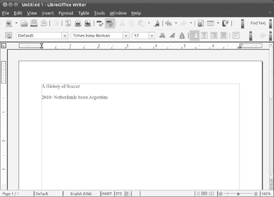

***图 11-1。**图书馆作家*

Writer 的工具栏提供了对格式化工具以及其他常用功能的快速访问。绝大多数菜单选项都与 Word 中的选项相匹配。右键单击文本本身也可以快速访问文本格式化工具。

提供了许多高级功能，如邮件合并和拼写检查(在“工具”菜单上)。您可以随时进行拼写检查，当您键入时，不正确的单词会以红色下划线显示。

与所有 LibreOffice 软件包一样，Writer 大多与 Microsoft Office 文件兼容，因此您可以保存和打开`.doc`和`.docx`文件。只需点击文件另存为，然后点击文件类型旁边的箭头选择文件格式。甚至支持一些受密码保护的文件格式。您还可以将文档导出为 PDF 文件(通过选择文件导出为 PDF)，以便可以在任何安装了 Adobe Acrobat Reader 的计算机上阅读。

 **注**LibraryOffice在[第 13 章有更详细的介绍。](13.html#ch13)

#### 电子表格:书店计算

正如大多数构成 LibreOffice 套件的软件包一样，Calc 在强大的功能和外观上很好地模仿了它的专利对手 Microsoft Excel，如图 11-2 所示。但是目前只对 Excel 的 Visual Basic for Applications (VBA)宏有有限的支持。相反，Calc 和其他 LibreOffice 程序使用它们自己的宏语言，称为 LibreOffice Basic(更多信息，请参见`[http://help.libreoffice.org/Common/Macro](http://help.libreoffice.org/Common/Macro)`)。

Calc 有大量的数学函数。要查看列表，选择插入功能。对话框左侧的列表包括每个功能的简要说明，以帮助您入门。与 Excel 一样，您可以通过工具栏(通过单击“函数向导”按钮)访问函数，也可以通过键入等号和公式代码直接将函数输入单元格。Calc 足够智能，可以意识到公式单元格何时被移动，并相应地重新计算。它甚至会尝试自动计算公式，如果你输入像**销售+费用**这样的公式，它会计算出你的意思。

正如您所料，Calc 还提供了自动图表和绘图工具(在 Insert  Chart 下)。在图 11-2 中，你可以看到一个由图表工具自动创建的简单图表的例子。

您可以使用主工具栏按钮来格式化单元格，或者自动应用用户定义的样式(选择格式样式和格式)。

 **提示**在所有的 LibreOffice 应用程序中，你可以将鼠标悬停在每个按钮上一秒钟，以查看显示其功能的工具提示。

***图 11-2。** OpenOffice.org Calc*

如果你是一个商业用户，你会很高兴听到你可以导入数据库来执行严重的数字运算。使用插入链接到外部数据来获取数据，然后使用数据和工具菜单上的工具来操作它。

与所有的 LibreOffice 程序一样，它与微软的同类软件——本例中是 Excel 文件——的兼容性非常好。您还可以打开其他常见的数据文件格式，如逗号分隔值(CSV)和 Lotus 1-2-3 文件。

LibreOffice Calc 在第 13 章有更详细的介绍。

#### 演示:LibreOffice Impress

任何使用过 PowerPoint 的人都会立刻对 LibreOffice 的演示包 Impress 感到如鱼得水，如图 11-3 所示。借助 LibreOffice 特有的附加功能，Impress 复制了 PowerPoint 中的大多数常见功能。

这个程序通过模板工作，你可以在模板中输入数据。启动程序会出现演示向导。该向导将指导您选择适合您所想的工作的演示风格。此时，您甚至可以选择不同幻灯片之间的过渡效果类型。

向导完成后，您可以从普通和大纲视图模式中进行选择(可从视图菜单中选择，或通过单击主工作区中的选项卡)。大纲模式可以让你快速输入你的想法，普通模式可以让你直接在幻灯片上输入。

您可以通过突出显示文本并右键单击它，使用每当您在文本框内单击时出现的文本格式工具栏，或者在“格式”菜单上选择一个条目来设置文本格式。Impress 还提供了健康的绘图工具选择，因此您可以创建非常复杂的图表。这些位于屏幕底部的绘图工具栏上。您还可以轻松地插入图片、其他图形和声音效果。

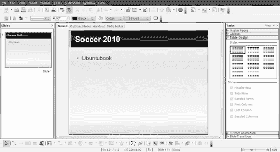

***图 11-3。**图书馆印象深刻*

您可以打开和编辑现有的 PowerPoint ( `.ppt`)文件，并且与所有 LibreOffice 软件包一样，将您的演示文稿保存为 PDF 文件。Impress 还允许您将演示文稿导出为 Macromedia Flash 文件(`.swf`)。这意味着任何拥有浏览器和 Macromedia Flash 插件的人都可以在线或通过电子邮件查看该文件。只需单击文件导出，然后从文件格式列表中选择 Macromedia Flash (SWF)。

除了幻灯片演示文稿，Impress 还允许您制作讲义来支持您的工作。LibreOffice Impress 在第 13 章有更详细的介绍。

#### 数据库:LibraryOffice基地

Base，如图 11-4 所示，允许你使用内置的数据库引擎创建关系数据库，以及与外部数据库的接口。默认情况下不安装 Base，所以您需要使用 Ubuntu 软件中心安装`libreoffice-base`包。

Base 在外观和感觉上与 Microsoft Access 非常相似，尽管它缺少 Access 的一些高端功能。对于大多数数据库应用来说，它应该完全足够了。如果您了解数据库技术的基础，那么立即开始使用 base 应该不会有任何问题。这比你想象的还要简单，因为当程序启动时，一个向导会引导你创建一个简单的数据库。

与 Access 一样，Base 的设计原则是数据表、输入或访问数据的表单以及检查和输出数据的查询和报告。同样，向导可以引导您完成每一项的创建，或者您可以选择相关选项，直接进入并手动编辑每一项。

表中的每个字段可以是各种类型，包括几种不同的整数和文本类型，以及二进制和布尔值。表单可以包含各种控件，从简单的文本框到单选按钮和滚动列表，所有这些都可以使数据输入更容易。报告可以采用多种文本格式，也可以依靠查询来操作数据。查询本身可以包含许多函数和过滤器，以便将数据分类到最细微的细节。

你会在第十三章了解更多关于基地的知识。

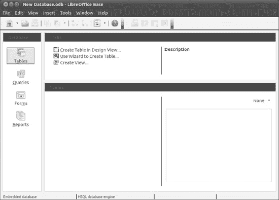

***图 11-4。**图书馆办公基地*

#### 电子邮件/个人信息管理器:进化

Evolution 有点像 Microsoft Outlook，除了作为电子邮件客户端之外，它还可以跟踪您的约会和联系人。您可以通过点击顶部面板中的邮件信封并选择邮件选项来启动 Evolution。

在使用该程序之前，您需要使用您的邮件服务器设置对其进行设置，详见[第 14 章。](14.html#ch14) Evolution 兼容 POP/SMTP、IMAP、Novell GroupWise、Hula、Microsoft Exchange，以及一些现在很少使用的 UNIX 邮件格式。

程序启动并运行后，如图[图 11-5](#fig_11_5) 所示，您可以点击工具栏上的新建按钮创建一条新消息。要回复任何电子邮件，只需在列表中选择它，然后单击回复或群组回复按钮，这取决于您是要回复邮件的发件人还是所有收件人。

要切换到联系人视图，请点按左下方的相关按钮。如果您通过电子邮件回复任何人，他们会自动添加到此联系人列表中。您也可以通过在打开的电子邮件中右键单击某人的地址或在“联系人”视图中的空白处右键单击来手动添加条目。点按日历视图会显示日和月日记。要添加约会，只需选择日期，然后双击您希望约会开始的时间。您可以选择在创建约会时设定提醒，这样当它被安排时，您会得到提醒。

最后，通过单击“任务”和“备忘录”按钮，您可以分别创建待办事项列表和快速笔记。要添加任务，请单击列表顶部的栏。创建条目后，您可以在其框中打勾，将其标记为已完成。已完成的任务标有删除线，这样你一眼就能看出你还需要做什么。若要添加备忘录，请点按备忘录列表顶部的栏，然后简单地键入您想要记住的内容。

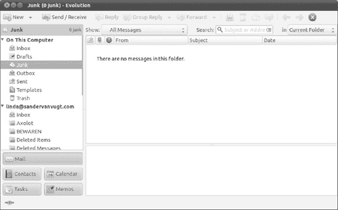

***图 11-5。**进化*

#### 网络浏览器:火狐浏览器

你可能已经知道 Windows 下的 Mozilla Firefox，它已经牢牢确立了自己作为替代浏览器的地位。好消息是，Linux 版本的 Firefox 与 Windows 版本的 Firefox 几乎完全相同。你可以方便地从 Unity Launcher Natty 包括其最新的版本 Firefox 4.0 开始，它比以前的版本快 6 倍，并有许多改进的功能。

当程序启动时，如[图 11-6](#fig_11_6) 所示，您可以在地址栏中键入一个地址来访问一个网站。如果您想将一个站点添加到您的书签列表中，请点击书签将此页面加入书签。或者，您可以按 Ctrl+D。

在 Firefox 中搜索很容易。您可以使用窗口右上角的搜索栏。默认情况下，火狐使用谷歌进行搜索。要从其他搜索引擎中选择，请单击搜索框左侧的小向下箭头。如果您的收藏夹不在列表中，您甚至可以输入自己选择的站点—单击管理搜索引擎，然后在出现的对话框中单击获取更多搜索引擎链接。

Firefox 普及了标签式浏览的原则，这意味着你可以同时打开多个网站。若要打开新的选项卡，请按 Ctrl+T。通过单击选项卡，可以在选项卡之间移动。

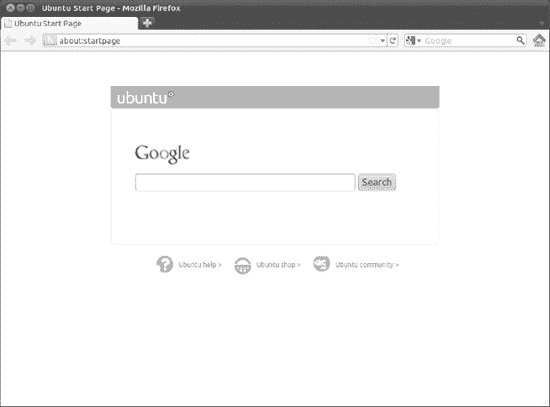

***图 11-6。** Mozilla Firefox*

Firefox 与你可能在 Windows 版本的浏览器下使用过的大部分插件(扩展)兼容。您可以从`[https://addons.mozilla.org](https://addons.mozilla.org)`下载新的附加组件，或者单击工具附加组件并选择获取附加组件图标。此外，Ubuntu 下的 Firefox 可以处理 Flash 动画和多媒体内容；相关软件(包括 Flash 播放器)会在第一次需要时按需安装。参见[第 17 章](17.html#ch17)中的说明了解更多信息。

#### 媒体播放器:女妖

在 Ubuntu 的这个最新版本中，默认的媒体播放器发生了变化:Rythmbox 被 Banshee 所取代。

Banshee 是一个媒体播放器应用程序，这意味着它将允许您播放音频，如音乐或播客，以及观看视频。您可以导入储存在电脑中的媒体，将其与 iPods 或 Android 手机等便携式设备同步，并播放在线媒体。

用户界面简单而有效。音乐和视频源显示在“来源”面板的左侧。当您选择一个源时，内容将显示在右窗格或库浏览器中。库视图将根据您选择的源而变化。

Banshee 可以播放大部分音频文件，只要配置得当，也就是说在安装了额外的软件之后。我们在第 16 章描述了如何设置这个软件。

[图 11-7](#fig_11_7) 显示了一个典型的女妖屏幕。

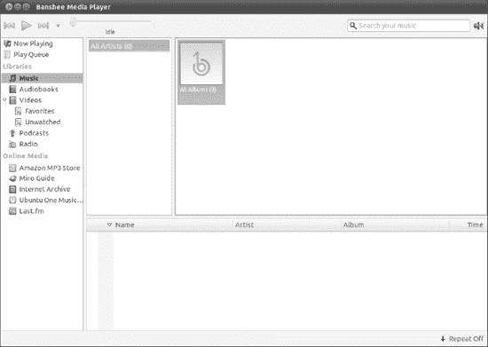

***图 11-7。**女妖*

当你第一次打开 Banshee 时，配置它来查找你的音乐和视频收藏是个好主意。您可以通过单击“媒体”>“导入媒体”来实现。它可以从存储器或其他来源(如 iTunes 和 Rhythmbox)导入文件夹和文件。导入的媒体将出现在相应的源中(例如，在“音乐”或“视频”下)。

要播放音乐，请选择音乐源。选取专辑或歌曲，或者导航到专辑或艺术家浏览器以优化您的搜索。视频在视频源下按字母顺序排列。只需在库窗格中右键单击所需视频的，然后选择播放。如果您点按“正在播放”源，您可以在右窗格中观看视频。您可以单击“简化”按钮隐藏左窗格，单击“全屏”按钮进入全屏模式。如果您想知道接下来要播放什么，只需选择播放队列源。

也可以用 Banshee 听网络电台。只需右键单击无线电信号源并选择添加电台。您需要知道类型、名称和电台的 URL 来正确配置它。

播客是不同的，因为它们在播放前被下载到电脑上。它们本质上是阶段性的，所以它们形成了一个定期更新的系列。剧集列表在服务器上集中维护，更新以网络订阅源的形式发布。Banshee 是播客的客户端应用程序，这意味着你可以用它来订阅播客并自动接收新的剧集。只需右击播客并选择添加播客。

其他来源包括亚马逊 MP3 商店，你可以在那里购买音乐和视频；Miro 指南，您可以在其中搜索可用的播客；互联网档案馆，这是一个在线资源的数字图书馆；以及流行的在线音乐服务和社交网络 Last.fm。

#### 电影播放:图腾电影播放器

图腾电影播放器能够处理你可能拥有的大多数视频文件，只要安装一些额外的软件。Totem 还可以播放 DVD 电影，这同样需要安装软件。我们在第 16 章和第 17 章中介绍了如何设置这个软件。如果你想播放视频文件和 DVD，这两章应该是你的第一站。

像 Banshee 一样，Totem 是一个不复杂的应用程序。如[图 11-8](#fig_11_8) 所示，视频在窗口左侧播放。右侧会出现一个播放列表，详细列出您已排队的电影。您可以通过点按边栏按钮来移除它，以给视频更多空间。

您可以使用左下角的播放/暂停、快进和倒回按钮来控制视频回放。此外，如果正在播放兼容的视频格式，您可以使用时间条在视频文件中前后移动。点击查看全屏可以切换到全屏播放。要切换回来，只需按下 Esc 键。

如果安装了第 17 章中描述的软件，一旦插入光盘，DVD 播放将会自动开始，并且您应该能够使用鼠标操作任何屏幕菜单。此外，您可以使用 Go 菜单在光盘的章节之间跳转，也可以返回到 DVD 的主系统或子菜单系统。要在 DVD 上的各种语言之间切换(如果适用)，请单击声音语言并从列表中选择。

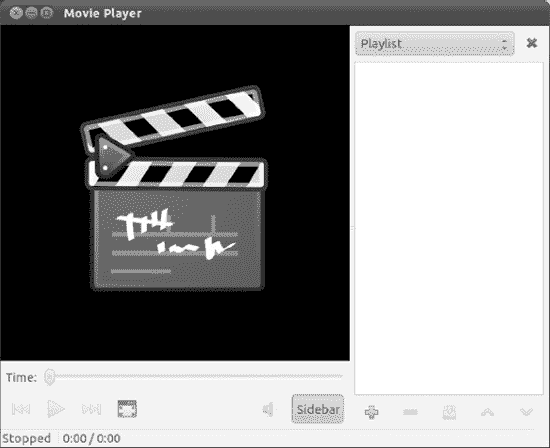

***图 11-8。**图腾电影玩家*

#### CD/DVD 刻录:Brasero/Nautilus CD/DVD Creator

只要你插入一张空白的可写光盘，无论是 CD 还是 DVD，Ubuntu 都会检测到它并提供一些选项:什么都不做，打开文件夹，打开 CD/DVD Creator。

第一个选项应该是显而易见的，而第二个选项启动 Nautilus 的 CD/DVD 刻录模式。这是一个简单的光盘刻录界面，可以将文件拖入窗口，然后刻录到数据 CD/DVD。

然而，第三种选择——开放式光盘刻录机——最有用。这将激活 Ubuntu 的专用 CD/DVD 刻录软件 Brasero，它能够制作数据 CD/DVD 以及音频和视频 CD。Brasero，如图[图 11-9](#fig_11_9) 所示，也可以复制某些种类的光盘。

如果你想手动启动 Brasero，你可以在应用程序菜单中找到它。当 Brasero 界面出现时，从列表中选择您想要创建的项目类型。例如，要创建音频 CD，请点按“音频项目”按钮。然后将您的音乐文件拖放到程序窗口，并单击刻录按钮。注意右下角的仪表。这就像一个进度条；当绿色部分已满时，光盘已满。请注意，您不能将某些音频文件(如 MP3)写入 CD，除非您安装了相关的编解码器。参见第 16 章了解更多信息。

使用 Nautilus CD/DVD Creator 类似于使用 Brasero。只需将文件拖放到窗口上，即可创建文件的快捷方式。当需要刻录时，Nautilus 会从原始位置复制文件。选择完文件后，点按“写入光盘”按钮。不幸的是，如果超过了光盘的容量，您将不会看到警告，直到您尝试写入光盘。然而，通过右键单击 Nautilus 窗口中的空白区域并选择 Properties，您可以发现文件的总大小。请记住，大多数 CD 的容量为 700MB，大多数 DVD+/-R 光盘的容量为 4.7GB 左右(一些双层光盘的容量是这个数量的两倍；详见 DVD 光盘包装)。

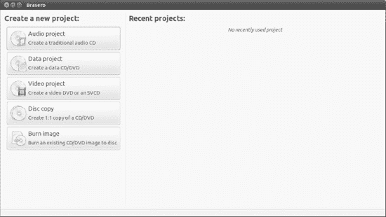

***图 11-9。**鹦鹉螺 CD/DVD 制作商和布拉瑟罗*

#### 照片编辑:F-Spot 和 GIMP

Ubuntu 提供了与 Adobe Photoshop 等专业产品不相上下的照片编辑工具。对于调整数码相机快照来说，它的功能肯定是绰绰有余的。

f 点在第 18 章[中有详细介绍。](18.html#ch18)在这一节中，我们将向您简要介绍 GIMP，它必须与 Ubuntu 软件中心一起安装，因为它不再是默认应用程序。

要启动 GIMP，选择应用程序 GIMP 图像编辑器。程序运行后，您会注意到它的主要程序组件是屏幕左侧的一个大工具栏。右边是一些浮动调色板，而中间是主图像编辑程序窗口。这可以最大化填充桌面，如果你想认真使用 GIMP，这是一个好主意。

要打开图片，选择文件打开并从硬盘中选择您的图像。打开图像文件后，您可以使用工具栏上的工具(类似于其他图像编辑器中的工具)对其进行操作。在主程序窗口的下半部分是每个工具的设置，通常可以通过点击和拖动滑块来改变。

要应用过滤器或其他纠正性更改，请右键单击图像上的任意位置，以显示带有各种选项的上下文菜单。例如，提高亮度和对比度的简单工具可以在颜色子菜单中找到，如图[图 11-10 所示。](#fig_11_10)

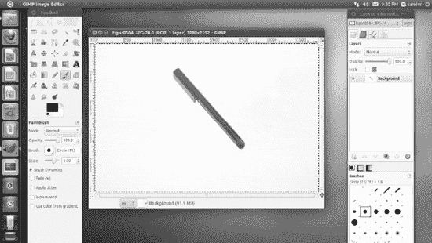

***图 11-10。**瘸子*

### 其他便捷的应用

许多额外的应用程序在日常生活中可能会很有用。这里我们回顾一些比较常见的。

#### 计算器

GNOME 计算器(也称为 Gcalctool)可以在应用程序菜单中找到。在默认模式下，如图[11-11](#fig_11_11)所示，它不会对任何使用过真实计算器的人构成任何挑战。

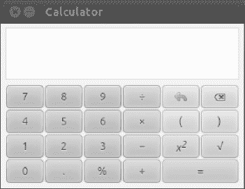

***图 11-11。**侏儒计算器*

Calculator 还有其他模式，您可以使用视图菜单切换到这些模式。也许最有用的三种通用模式是高级模式、金融模式和科学模式。所有都提供与其设置相关的计算器功能。高级模式只是基本计算器的一个更复杂的版本。例如，它可以在几个存储位置存储数字，也可以进行不太常见的计算，如平方根和倒数。

#### 档案管理员

如图[图 11-12](#fig_11_12) 所示的归档管理器(也称文件滚轴)，是 Ubuntu 的归档工具。它是默认程序，每当你双击`.zip`文件(或`.tar`、`.gz`或`.bzip2`文件，这是 Linux 下的原生存档文件格式)时就会打开。

要从归档中提取文件，请选择它们(按住 Ctrl 键选择多个文件)，然后单击工具栏上的提取按钮。

要动态创建归档文件，请在 Nautilus 文件浏览器窗口中选择文件或文件夹，右键单击选择，然后选择压缩。给归档命名，归档将被创建。要向现有归档添加新文件，请双击归档文件，然后将文件拖放到归档管理器窗口中。完成后，只需关闭存档管理器窗口。

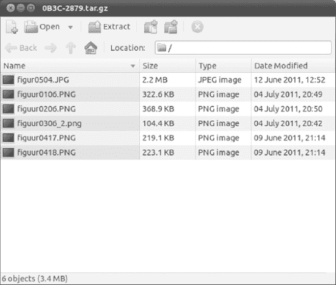

***图 11-12。**档案管理员*

#### 字典

你可以使用字典工具在*协作式国际英语字典[1](#CHP-11-FN-1)T5】中查找单词的定义。这本词典基于 1913 年版的韦氏修订版未删节词典，但增加了一些现代定义。字典工具对于快速查找很有用，但是如果你想要一个精确和现代的单词定义，你可以考虑使用一个更现代的来源。*

使用 Ubuntu 软件中心安装 gnome-dictionary 包后，你可以很容易地从 Unity 启动器的应用程序菜单中启动它。在窗口顶部的查找文本框中输入单词，其定义将出现在下面的区域，如图[11-13 所示。一旦你开始输入，程序将开始在字典中查找单词，这可能会导致字母出现在屏幕上之前的短暂延迟。](#fig_11_13)

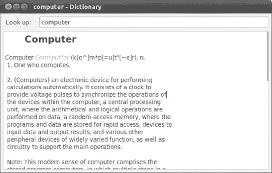

***图 11-13。**字典*

#### 同理心即时通讯客户端

同理心是 Ubuntu 提供的即时通讯软件。与大多数其他消息程序不同，同理心并不是一种聊天协议的专属。你可以用它来连接 GTalk，Jabber，MSN，AOL/ICQ，Yahoo！、脸书聊天和许多其他服务。

建立共情的细节在第 14 章。程序启动运行后，你可以双击任何一个好友的图标与其聊天，如图[图 11-14 所示。](#fig_11_14)

程序的其余部分可以通过右键单击程序启动时出现的通知区域图标来管理。例如，您可以在那里更改您的状态或注销。你也可以使用我菜单，在第 15 章中有更详细的解释，来一次改变你所有聊天账户的状态。

_____________

要使用字典，你首先需要使用 Ubuntu 软件中心安装 GNOME 桌面工具应用程序。

***图 11-14。**感同身受*

#### 真的

Ekiga 通过 SIP 和 H.323 协议 [2](#CHP-11-FN-2) 提供互联网电话(也称为 IP 语音，或 VoIP)。它还提供视频会议，并与 SIP 和 H.323 中规定的所有主要功能兼容，例如保持、转发和转移呼叫。Ekiga 可以在应用程序的互联网菜单上找到。

要激活视频会议的摄像头模式，请单击窗口左侧的网络摄像头图标。若要进行文字聊天，请点按窗口左侧顶部的图标。当程序启动时，它会通过向导引导您完成安装。简单地用你的细节回答问题。程序启动并运行后，如[图 11-15](#fig_11_15) 所示，在地址栏中输入您想呼叫的人的 URL，然后点击呼叫。

请注意，Ekiga 与 Skype 等专有 VoIP 软件不兼容。要了解如何在 Ubuntu 下安装 Skype，请参见第 14 章。

___________

2 要使用 Ekiga，首先需要用 Ubuntu 软件中心安装。

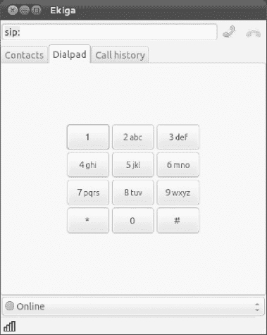

***图 11-15。** Ekiga*

#### 游戏

Ubuntu 提供了很多简单的游戏，包括地雷，如图 11-16 所示。相当于 Windows 扫雷游戏，地雷可以在应用程序菜单中找到。规则也是一样的:每个格子上都有几个隐藏的地雷，你的工作就是找到它们。在你随机点击一个方块后，你会看到一系列的空方块和几个有数字的方块。那些带数字的表示炸弹就在附近。你的工作是推断出炸弹的位置，然后右击它们并做上标记。你必须尽可能快地做这件事，因为你被计时了。

要更改网格大小，请单击设置首选项。你可以选择小号、中号、大号和定制。

Ubuntu 中当然有很多游戏可以玩。我们将在第 19 章更深入地讨论这个话题。

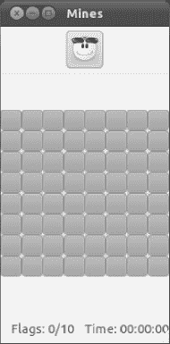

***图 11-16。**地雷*

#### Windows 应用程序

虽然 Ubuntu 没有正式支持 Windows 应用程序，但 Wine 项目正试图增加一定程度的兼容性，目前足以运行许多最常见的 Windows 应用程序。可以使用 Ubuntu 软件中心安装 Wine，然后使用标准的 Windows installer 安装应用程序。

虽然不是每个应用都能工作，但 Wine 支持相当多的软件，包括微软 Office XP、Spotify(如图[图 11-17](#fig_11_17) 所示)、Photoshop 7，甚至一些游戏。更多信息见`[www.winehq.org](http://www.winehq.org)`。

我们将在第 20 章讨论如何用 Wine 安装 Windows 应用程序。

***图 11-17。**酒*

### 总结

在这一章中，你已经看了一些 Ubuntu 程序，它们提供了你可能在 Windows 下日常使用的重要功能。目的是通过指出关键特性，让您尽快开始使用该软件。您已经看到了一些程序是如何不折不扣地模仿其 Windows 对应物的外观和感觉的，而另一些程序则坚决地走自己的路。熟悉 Ubuntu 软件只需要一点时间，然后使用这些程序就会成为你的第二天性。

在下一章，我们继续更基本的 Ubuntu 任务:操作文件。然而，同样，这与 Windows 体验没有太大的不同，这使得习惯该系统非常容易。