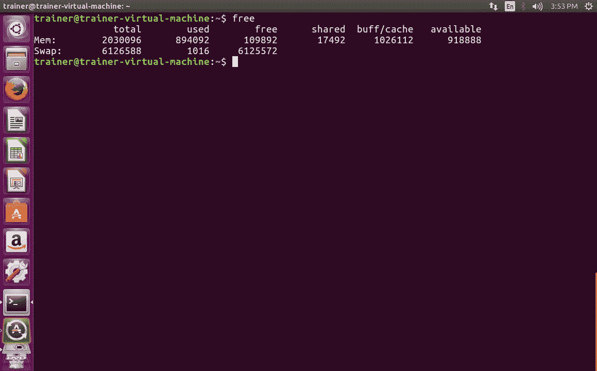
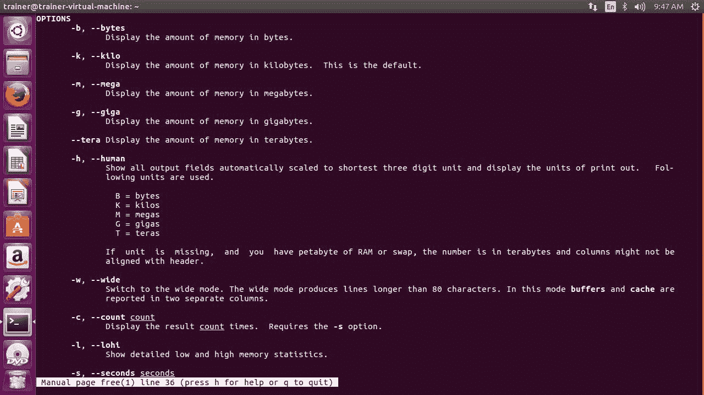
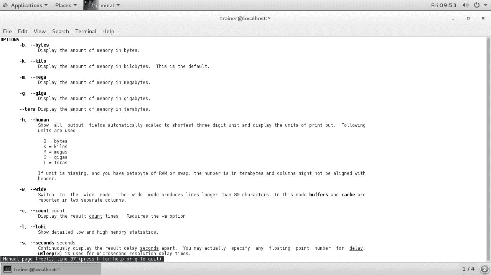
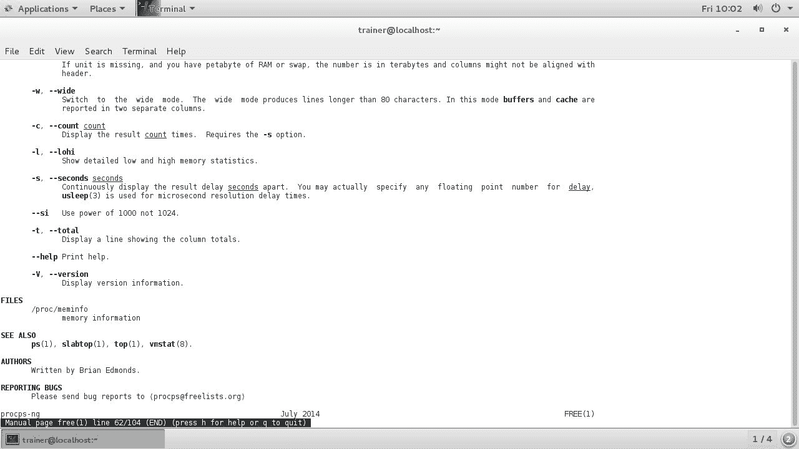
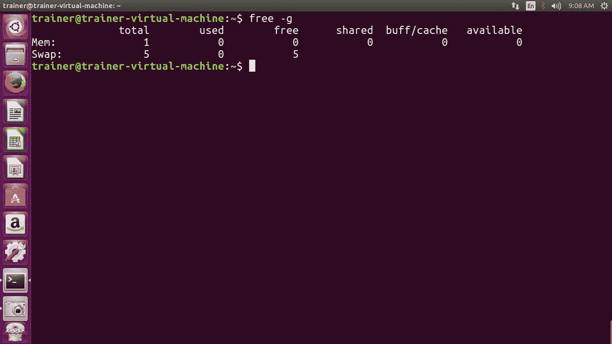
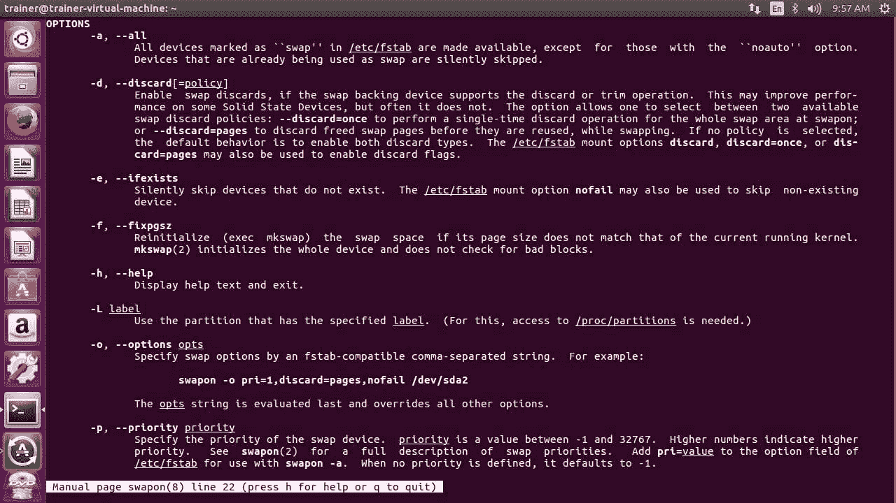
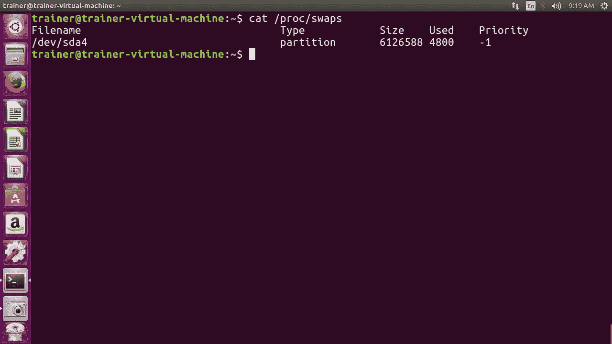
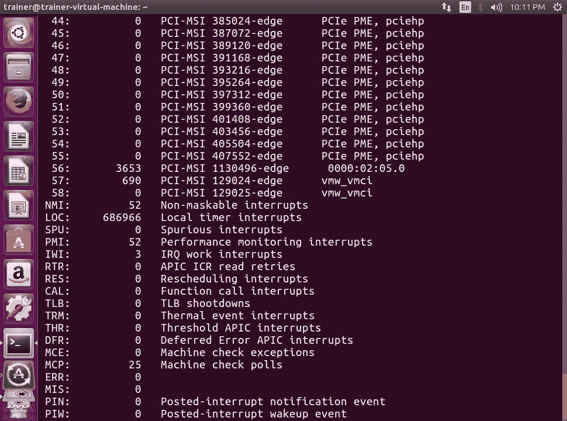
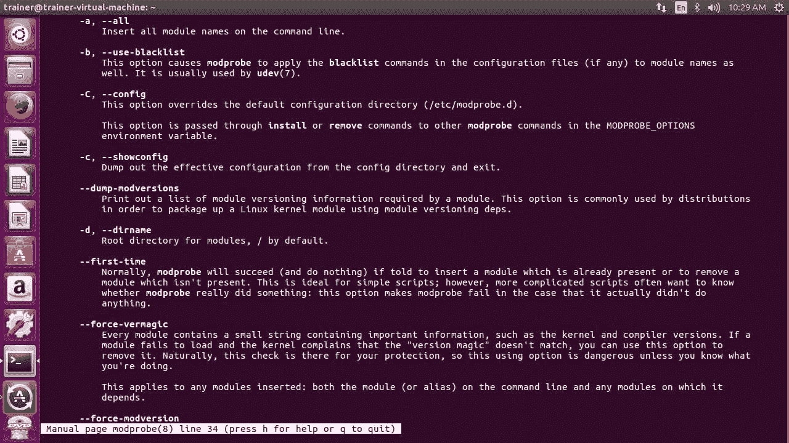

# 一、配置硬件

本章介绍查看中断。重点是`/proc/interrupts`、CPU 信息查看(`/proc/cpuinfo`)，查看安装的物理内存。它还会查看`/proc/meminfo`、`free`命令，查看交换内存，并使用`dd`、`mkswap`、`swapon`和`swapoff`命令添加和删除额外的交换内存。概述了 raid 状态(`viewing/proc/mdstat`)以及设备目录`/dev`、`/proc`虚拟目录、`lsmod`命令和用法、`modprobe`命令及其用法以及`lspci`命令和用法。`/proc`目录是在启动时创建的虚拟文件系统，它存储关于系统的各种硬件信息。

首先，让我们把所有的烟幕都去掉。浏览各种目录并使用这些命令非常有用，并且允许您在 Linux 环境中检索硬件信息。

我们将在本章中讨论以下主题:

*   查看中央处理器、内存和交换信息
*   中断和设备
*   模块

# 查看中央处理器、内存和交换信息

让我们看看如何在 Linux 系统上查看中央处理器、内存和交换信息。

首先，我们将注意力集中在获取中央处理器的信息上，所以我们将查看`/proc/cpuinfo`文件。我们可以获得关于中央处理器的详细信息，包括供应商标识、中央处理器系列、型号名称、以兆赫为单位的中央处理器速率、高速缓存大小和内核数量等。以下是在`/proc/cpuinfo`旁边运行`cat`命令的摘录:


这里给出了一些关于中央处理器的更多信息:


从前面的输出中，我们可以看到与运行`cat /proc/cpuinfo`命令的中央处理器相关的详细信息。

接下来，让我们看看如何收集物理内存量的信息，安装在系统中的**随机存取内存** ( **内存**)。我们将关注两个命令，`cat /proc/meminfo`和`free`命令。

再次使用 Linux 系统进行演示，我们将查看`/cat /proc/meminfo`命令的输出:


下面的截图显示了更多的内存使用信息:


从前面的输出中，我们可以看到一些重要的字段，即前三个字段(`MemTotal`、`MemFree`、`MemAvailable`)，它们反映了我们物理内存(RAM)的当前状态。

现在我们来看另一个命令，`free`命令。这个命令会以更容易被人理解的格式给我们提供内存信息。使用我们的测试 Linux 系统，我们将运行`free`命令:



单独运行`free`命令会产生以千字节为单位的上述结果。我们可以在`free`命令上标记一些选项，使其更加明确。这里有一个选项列表，我们可以使用`free`命令，使用 Ubuntu 发行版:



这些是我们可以通过 Ubuntu 发行版上的`free`命令传递的更多选项:


同样，如果我们看一下 CentOS 7 发行版上`free`命令的主页面，我们可以看到类似的选项:



在 CentOS 7 发行版中，我们可以通过`free`命令传递更多选项，如下图所示:



让我们使用`free`命令尝试几个选项:


前面的输出是使用`free`命令时最常用的选项之一(`-h`)。我们甚至可以更进一步，通过标记(`-g`)选项来显示以千兆字节为单位的物理内存总量:



我们甚至可以通过使用另一个神奇的选项(`-l`)来查看低内存和高内存的统计数据:


在前面的截图中，我们不仅看到了内存信息，还看到了我们的交换内存。它显示在最后一行。如果我们希望只看到交换内存，可以使用另一个命令。我们可以使用`swapon`命令:


在 Ubuntu 发行版的主页面`swapon`中，有一些选项可以和`swapon`命令一起使用:



在 Ubuntu 发行版上，可以通过`swapon`命令传递的更多选项如下图所示:


以下是在 CentOS 7 发行版的`swapon`主页面上可以与`swapon`命令一起使用的一些选项:


在 CentOS 7 发行版上，可以通过`swapon`命令传递的更多选项如下图所示:


我们还可以在`/proc`目录中看到交换信息，具体在`/proc/swaps`中:



从前面的输出中，我们可以看到交换空间正在使用`/dev/sda4`分区。现在，如果由于某种原因，我们耗尽了物理内存，并且我们已经用完了交换空间，那么我们可以添加更多的物理内存，或者添加更多的交换空间。因此，让我们专注于添加更多交换空间的步骤。

我们需要使用`dd`命令创建一个空白文件。请注意，您需要 root 访问权限才能在 shell 中运行此命令:

```sh
trainer@trainer-virtual-machine:~$ dd if=/dev/zero of=/root/myswapfile bs=1M count=1024
dd: failed to open '/root/myswapfile': Permission denied
trainer@trainer-virtual-machine:~$
```

从前面的输出中，我们可以看到我们得到了一条`Permission denied`消息，所以让我们切换到根并尝试重新运行该命令:

```sh
root@trainer-virtual-machine:/home/trainer# dd if=/dev/zero of=/root/myswapfile bs=1M count=1024
1024+0 records in
1024+0 records out
1073741824 bytes (1.1 GB, 1.0 GiB) copied, 17.0137 s, 63.1 MB/s
root@trainer-virtual-machine:/home/trainer#
```

开始了。我们刚刚使用名称`myswapfile.`创建了一个`swap`文件，现在我们需要运行`mkswap`命令并调用我们刚刚在 shell 中创建的`swap`文件:

```sh
root@trainer-virtual-machine:~# mkswap myswapfile
Setting up swapspace version 1, size = 1024 MiB (1073737728 bytes)
no label, UUID=e3b8cc8f-ad94-4df9-8608-c9679e6946bb
root@trainer-virtual-machine:~#
```

现在，最后一步是打开`swap`文件，以便系统根据需要使用它:

```sh
root@trainer-virtual-machine:~# swapon myswapfile
swapon: /root/myswapfile: insecure permissions 0644, 0600 suggested.
root@trainer-virtual-machine:~#
```

我们收到了关于不安全权限的警告消息。我们将在后面的章节中讨论权限。目前，我们将继续使用现有权限。最后一步是验证`swap`文件是否确实可用于我们的系统:

```sh
root@trainer-virtual-machine:~# swapon
NAME                TYPE       SIZE   USED    PRIO
/dev/sda4           partition  5.9G   960K    -1
/root/myswapfile    file       1024M   0B     -2
root@trainer-virtual-machine:~#
```

瞧，我们现在有了新创建的`swap`文件供我们的系统使用。我们也可以运行`free`命令，现在我们会发现交换内存增加了 1gb:

```sh
root@trainer-virtual-machine:~# free -h
 total   used   free  shared  buff/cache   available
Mem:  1.9G    848M    72M   13M    1.0G        924M
Swap: 6.8G    960K    6.8G
root@trainer-virtual-machine:~#
```

In order for the changes to be safe upon reboot, you will need to add an entry in `/etc/fstab`.

如果我们不想再使用`swap`文件，我们可以使用`swapoff`命令从交换内存中删除`myswapfile`。下面是我们如何在 shell 中实现这一点:

```sh
root@trainer-virtual-machine:~# swapoff myswapfile
root@trainer-virtual-machine:~#
```

现在，让我们重新运行`swapon`命令，然后运行`free`命令，以验证`myswapfile`确实已从交换使用中删除:

```sh
root@trainer-virtual-machine:~# swapon
NAME       TYPE      SIZE   USED   PRIO
/dev/sda4 partition  5.9G   1.6M   -1 root@trainer-virtual-machine:~# free -h
 total   used    free   shared  buff/cache available
Mem:   1.9G    931M    133M   17M     917M        845M
Swap:  5.8G    1.6M    5.8G
root@trainer-virtual-machine:~#
```

如我们所见，`myswapfile`不再可用作交换内存。以下是我们可以在 Ubuntu 发行版上使用`swapoff`命令的选项:


下面的截图显示了更多可以通过`swapoff`命令传递的选项:


以下是我们可以在 CentOS 7 发行版上使用`swapoff`命令的选项:


下面的截图显示了更多可以通过`swapoff`命令传递的选项:


# 中断和设备

现在让我们切换一下话题，看看**中断请求** ( **IRQs** )以及我们的 Linux 系统中可用的设备。你可以把中断想象成一条服务热线，当我们需要某个特定项目时，我们会使用它。我们会拨打服务热线。这个理论对于 Linux 系统中的设备来说是一样的；每当它需要 CPU 的注意时，它就会通过中断发出信号。传统的 32 位架构最多支持 16 个中断:0–15 个。较新的架构支持远不止 16 个中断。

让我们再看一下`/proc`目录，回到`/proc/interrupts`:


更多中断显示在下面的截图中:



下面的截图显示了更多的中断:


从前面的输出中，我们可以看到有更多的中断可用。输出从左向右读取，其中左代表中断号，向右移动表示使用中断的设备或服务。我们可以看到定时器正在使用中断`0`。

现在，让我们把注意力转向设备。当我们在 Linux 系统中使用设备时，设备由文件表示。这使我们能够与系统中的实际硬件进行通信。有一些常用的设备，如硬盘、DVD 和 u 盘，仅举几例。硬盘表示为`sd(n)`；例如:`/dev/sda`、`/dev/sdb`、`/dev/sdc`等等。硬盘分区以`sd(n)`的形式表示；例如:`/dev/sda1`、`/dev/sda2`、`/dev/sdb1`等等。同样，软盘表示为`fd.`还有一些特殊的用例文件，如`/dev/null`、`/dev/zero`、`/dev/tty*`。当您想要从另一个命令发送输出并且不需要输出时，您可以使用`/dev/null`。这就是所谓的重定向。`/dev/zero`与我们前面介绍的`dd`命令结合使用，用于创建空白文件。`/dev/tty*`用于远程登录。让我们看看设备在 Linux 环境中是如何显示的。

我们将使用我们的测试 Linux 系统来看看`/proc/devices`:


从前面的输出中，硬盘和分区以`/dev/sdXY`的格式表示，其中`X`代表硬盘，`Y`代表分区。我们可以告诉`ls`命令将输出过滤到只有硬盘和分区信息:

```sh
root@trainer-virtual-machine:~# ls /dev/sd*
/dev/sda  /dev/sda1  /dev/sda2  /dev/sda3  /dev/sda4
root@trainer-virtual-machine:~#
```

# 模块

你有没有想过术语*驱动*在 Linux 环境中发生了什么？好吧，难怪了。大多数来自微软视窗背景的人习惯于通过使用驱动程序与硬件交互。在 Linux 中，我们称驱动程序为模块。没有听起来那么可怕。每当我们在处理一件硬件时，我们都会加载和卸载模块。例如，当我们插入一个 u 盘时，一个模块被加载到后端，当我们移除 u 盘时，它会自动卸载。它是如此灵活。

让我们看看如何使用`lsmod`命令查看安装在 Linux 系统中的模块:


下面的截图显示了更多可用的模块:


从前面的输出中，我们可以看到许多模块可用于这个 Linux 系统。我们从左到右读取输出，在`Used by`列下看到一个`0`值。这意味着该模块当前未被使用。

现在让我们看看使用`rmmod`命令移除模块的过程。我们将移除`usbhid`模块，因为它当前未被使用。我们可以使用`lsmod | grep usbhid`快速验证这个没有被使用:

```sh
root@trainer-virtual-machine:~# lsmod | grep usbhid
usbhid                 49152  0
```

太好了。让我们继续使用`rmmod`命令移除该模块:

```sh
root@trainer-virtual-machine:~# rmmod usbhid
root@trainer-virtual-machine:~#
root@trainer-virtual-machine:~# lsmod | grep usbhid
root@trainer-virtual-machine:~#
```

开始了。`usbhid`模块不再加载到 Linux 系统中。但是，它仍然驻留在那里，因为它是在内核中编译的。只有几个选项可以通过`rmmod`。这里，他们在一个 Ubuntu 发行版上:


同样，以下是在 CentOS 7 发行版上通过`rmmod`传递的选项:


为了让我们重新安装这个`usbhid`模块，我们将使用另一个流行的命令，`insmod`。让我们看看`insmod`是如何在 shell 中工作的:

```sh
root@trainer-virtual-machine:~# insmod usbhid
insmod: ERROR: could not load module usbhid: No such file or directory
root@trainer-virtual-machine:~#
```

现在，基于前面的输出，`insmod`命令找不到`usbhid`模块似乎是矛盾的。别担心，这个模块是在内核中编译的。也就是说，我们可以使用另一个有用的命令，`modprobe`。到目前为止，这比`insmod`更受欢迎，因为每当我们使用`modprobe`添加模块时，`modprobe`实际上会在后端调用`insmod`。有趣的是，`modprobe`也可以用来移除模块。它通过在后端调用`rmmod`来做到这一点。

We can use `insmod` itself to install the `usbhid` module. The only catch is that you have to specify the absolute path to the module. `mobprobe`, on the other hand, uses the modules directory, namely `/lib/modules/$(KERNEL_RELEASE)/`, for modules, and loads modules based on the rules defined in the `/etc/modprobe.d/` directory.

所以，我们用`modprobe`在Shell处安装`usbhid`模块。

```sh
root@trainer-virtual-machine:~# modprobe -v usbhid
insmod /lib/modules/4.4.0-24-generic/kernel/drivers/hid/usbhid/usbhid.ko
root@trainer-virtual-machine:~#
```

我们将(`-v`)选项与`modprobe`一起使用，因为默认情况下，它不会显示后台发生的事情。可以看到，`modprobe`确实在后端调用`insmod`。现在我们可以使用`modprobe`移除这个`usbhid`模块，我们会看到它确实在后端调用`rmmod`:

```sh
root@trainer-virtual-machine:~# modprobe -r -v usbhid
rmmod usbhid
root@trainer-virtual-machine:~#
```

从前面的输出中，很明显`modprobe`确实在调用`rmmod`来移除一个模块。

这里有一些选项可以和 Ubuntu 发行版上的`modprobe`命令一起使用:



更多可以通过`modprobe`命令传递的选项如下截图所示:


可以通过`modprobe`命令传递的更多选项如下截图所示:


这里有一些选项可以和 CentOS 7 发行版上的`modprobe`命令一起使用:


下面的截图显示了更多可以通过`modprobe`命令传递的选项:


更多可以通过`modprobe`命令传递的选项如下截图所示:


# 摘要

在本章中，我们将重点放在硬件设置上，查看各种目录中的 CPU、RAM 和交换信息。我们使用了各种命令。此外，我们还谈到了 IRQs 和 Linux 系统中可用的各种中断。然后，我们在文件的背景下观察设备。最后，我们使用模块。我们看到了 Linux 系统中当前可用的各种模块，并了解了安装和删除模块的步骤。

在下一章中，我们将重点介绍引导系统的过程。此外，还将介绍各种引导管理器。这是每个 Linux 工程师需要掌握的另一个重要方面。简而言之，如果没有引导管理器，系统将无法引导，除非我们从某种形式的介质引导。作为一名 Linux 工程师，获得这些知识会让你领先于其他所谓的工程师。完成下一章后，您将在认证方面拥有更大的优势。我希望不久能见到你。

# 问题

1.  哪个目录被创建为虚拟文件系统？

A.`/dev`
b .`/lib`
c .`/proc`T5】d .以上都不是

2.  查看中央处理器信息的命令是什么？

A.`less /proc`T4【b .】`more /proc`T5【c .】`cat /proc`T6【d .`cat /proc/cpuinfo`

3.  查看`/proc`目录内 RAM 的命令是什么？

A.`tail /proc/free`T4【b .】`less /proc/free`T5【c .】`cat /proc/meminfo`T6【d .`cat /proc/RAM`

4.  `free`命令的哪个选项以友好的格式显示内存信息？

A.`free -F`T4【b .】`free -L`T5【c .】`free -h`T6【d .`free –free`

5.  用什么命令告诉系统一个文件是`swap`文件？

A.`doswap`T4【b .】`format swap`T5【c .】`mkswap`T6【d .`swap`

6.  用什么命令激活一个`swap`文件？

A.`Swap`T4【b .】`onSwap`T5【c .】`swap`T6【d .`swapon`

7.  使用什么命令显示交换分区信息？

A.`mkswap`T4【b .】`swapon`T5【c .】`swap`T6【d .`swapoff`

8.  哪些设备文件可以重定向要丢弃的消息？

A.`/dev/discard`T4【b .】`/dev/null`T5【c .】`/dev/redirect`T6【d .`None of the above`

9.  什么命令用于显示 Linux 系统中当前可用的模块？

A.`insmod`T4【b .】`depmod`T5【c .】`rmmod`T6【d .`lsmod`

10.  什么命令用于安装模块而不必指定绝对路径？

A.`rmmod`T4【b .】`modules`T5【c .】`modrm`T6【d .`modprobe`

# 进一步阅读

*   本网站将为您提供当前 CompTIA Linux+认证的所有必要信息:[https://www.comptia.org/](https://www.comptia.org/)
*   该网站将为您提供与 LPI 考试相关的详细信息，特别是您通过 CompTIA Linux+考试获得的 LPIC 1 级考试:[http://www.lpi.org/](http://www.lpi.org/)
*   最后一个网站为您提供了各种 Linux 内核的详细信息:[https://www.kernel.org/](https://www.kernel.org/)