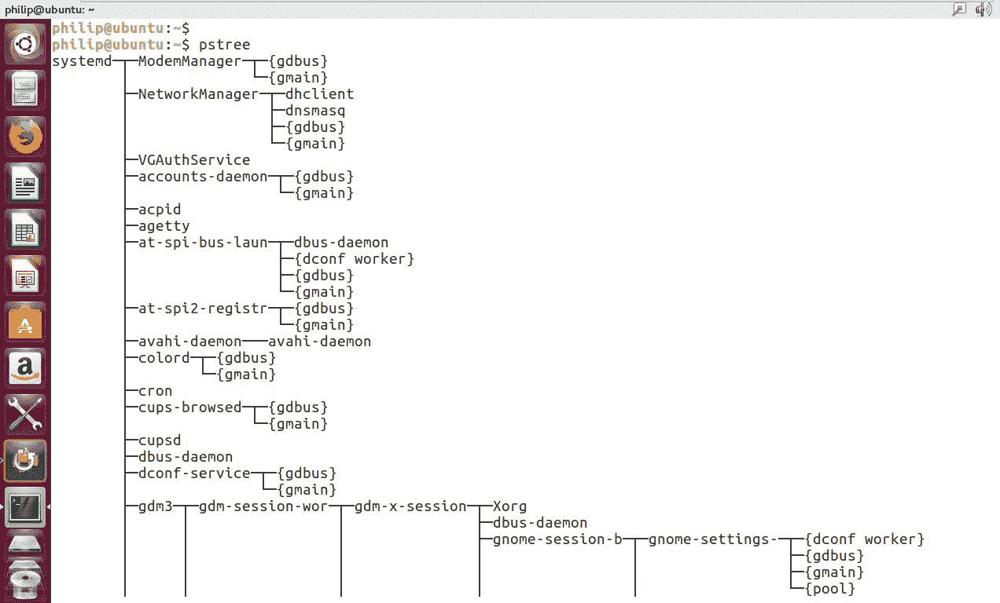
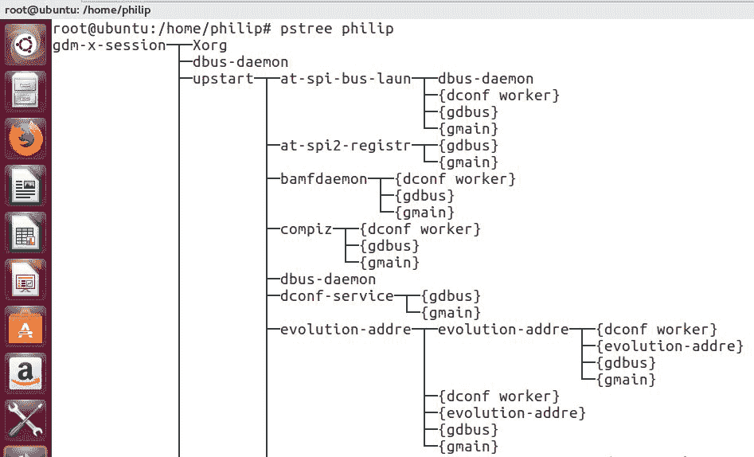
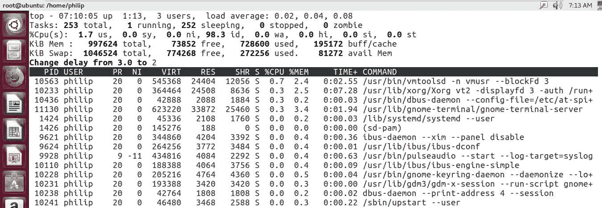
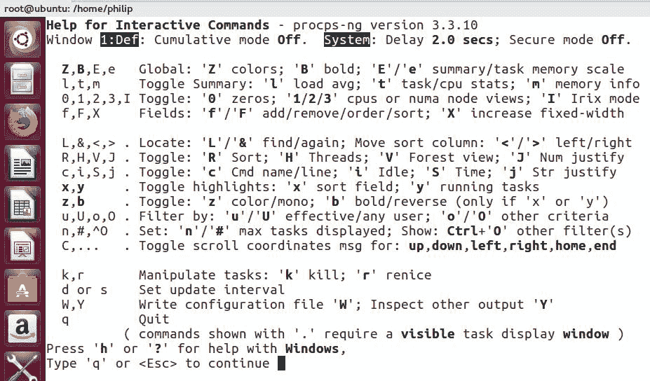
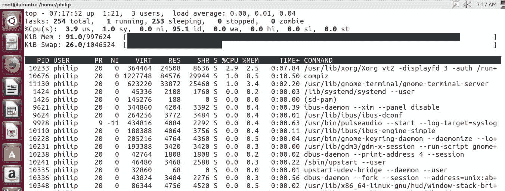
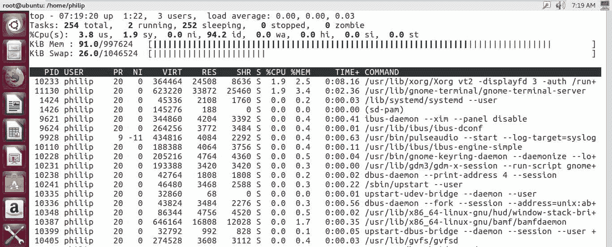
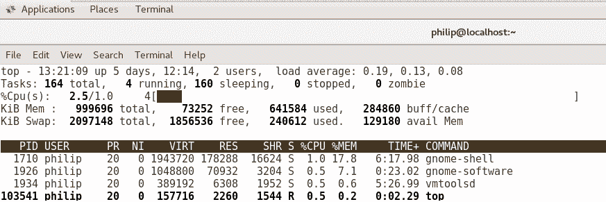

# 九、创建、监控、终止和重新启动进程

在前一章中，我们详细讨论了文件管理。然后，我们介绍了如何在 shell 中创建文件。此外，我们看到了文件的各种权限，并了解了如何更改它们。接下来，我们进入 Linux 环境中的目录。最后，我们在 shell 环境中使用管道和重定向。此外，我们还看了另一个强大的命令——T0 命令。

在本章中，我们将探讨可用于管理各种进程的各种技术。首先，我们将使用一个非常流行的命令来实时调查进程——即`ps`命令。这个`ps`命令在[第 2 章](02.html#OPEK0-43f6e611c18f4c7abc8a9e3790317ae8)、*引导系统*的*引导过程–解释*部分中有简要介绍。在本章中，我们更加强调`ps`命令，探索更多可以传递的选项，从而暴露重要信息。在这之后，我们冒险进入管理守护进程的方法；首先，我们从非常流行的`top`命令开始。这种处理进程的方法在整个 Linux 社区中被广泛使用。这主要是因为`top`命令给出了各种守护进程的实时统计数据。除此之外，我们还可以控制守护进程的行为。接下来，我们进入另一种管理进程的通用方法:`service`命令。最后，我们介绍守护进程管理的最新方法；即`systemctl`命令。这在[第 2 章](02.html#OPEK0-43f6e611c18f4c7abc8a9e3790317ae8)、*引导系统*的*引导过程:解释*一节中有所介绍。在本章中，我们将使用`systemctl`命令更深入地探讨守护进程管理的常见实践。

我们将在本章中讨论以下主题:

*   `ps`命令
*   使用`top`命令查看和管理进程
*   使用`service`命令管理进程
*   使用`systemctl`命令管理进程

# ps 命令

代表**过程状态**的`ps`命令是当今环境中最流行的命令之一。它显示系统内运行的当前进程；当我们在 Linux 环境中工作时，我们经常会忽略使这一切成为可能的底层过程。`ps`命令显示的所有信息都来自一个非常流行的目录；即`/proc`文件系统。据说`/proc`文件系统实际上不是一个真正的文件系统；它实际上是一个虚拟文件系统。它是在启动时加载的，你会发现现在几乎每个 Linux 发行版中都有`/proc`文件系统。让我们进入`ps`命令。

首先，我们可以显示当前 shell 中启动的任何进程:

```sh
[philip@localhost ~]$ ps
 PID         TTY        TIME        CMD
 2220        pts/0      00:00:00    bash
 95677       pts/0      00:00:00    ps
[philip@localhost ~]$
```

根据前面的输出，除了`ps`命令本身和 Bash shell 之外，我们没有在当前 shell 中启动任何其他进程。我们还可以使用`ps`命令列出系统中当前存在的所有进程；我们将传递`-A`参数:

```sh
[philip@localhost ~]$ ps -A
 PID    TTY      TIME       CMD
 1   ?        00:00:31   systemd
 2   ?        00:00:00   kthreadd
 3   ?        00:00:02   ksoftirqd/0
 5   ?        00:00:00   kworker/0:0H
 7   ?        00:00:00   migration/0
 8   ?        00:00:00   rcu_bh
 9   ?        00:00:12   rcu_sched
 10  ?        00:00:11   watchdog/0
 12  ?        00:00:00   kdevtmpfs
 13  ?        00:00:00   netns
 14  ?        00:00:00   khungtaskd
 15  ?        00:00:00   writeback
 95730  ?        00:00:00   kworker/0:3
 95747  ?        00:00:00   sleep
 95748  pts/0    00:00:00   ps
[philip@localhost ~]$
```

当我们使用`-A`或`-e`参数运行`ps`命令时，它只会打印出进程标识和每个进程的名称。但是等等，我们可以进一步扩大这个产量。我们可以和`-u`一起通过`-a`。这将打印出打开终端的当前用户的进程:

```sh
[philip@localhost ~]$ ps -au
```


要查看系统中当前用户拥有的所有进程，我们通过`-x`选项:

```sh
[philip@localhost ~]$ ps -x
PID  TTY  STAT  TIME COMMAND
1487  ?    Sl   0:00 /usr/bin/gnome-keyring-daemon --daemonize --login
1491  ?    Ssl  0:01 /usr/libexec/gnome-session-binary --session gnome-classic
1498  ?    S    0:00 dbus-launch --sh-syntax --exit-with-session
1499  ?    Ssl  0:00 /bin/dbus-daemon --fork --print-pid 4 --print-address 6 --session
1567  ?    Sl   0:00 /usr/libexec/gvfsd
1572  ?    Sl   0:00 /usr/libexec/gvfsd-fuse /run/user/1000/gvfs -f -o big_writes
1664  ?    Ss   0:00 /usr/bin/ssh-agent /bin/sh -c exec -l /bin/bash -c "env
```

```sh
GNOME_SHELL_SESSION_MODE=classic gnome-session --session gnome-cla
1683  ?    Sl   0:00 /usr/libexec/at-spi-bus-launcher
1688  ?    Sl   0:00 /bin/dbus-daemon --config-file=/usr/share/defaults/at-spi2/accessibility.conf --nofork --print-address 3
```

我们也可以通过`-u`指定一个用户作为参数的一部分:

```sh
[philip@localhost ~]$ ps -au root
 PID  TTY   TIME      CMD
 1   ?     00:00:31  systemd
 2   ?     00:00:00  kthreadd
 3   ?     00:00:02  ksoftirqd/0
 5   ?     00:00:00  kworker/0:0H
```

除了每个守护程序的可执行文件路径，我们还可以看到所有用户；我们通过`-aux`或`aux-`；这是**柏克莱软件发行版** ( **BSD** )语法。BSD 是 Unix 的另一种味道。以下是一个 Linux 语法示例:

```sh
[philip@localhost ~]$ ps -aux
USER    PID %CPU %MEM  VSZ     RSS   TTY  STAT  START   TIME 
COMMAND
root      1    0.0  0.4  193700  4216  ?    Ss    Aug08  0:31 /usr/lib/systemd/systemd --switched-root --system --deserialize 21
root      2    0.0  0.0   0      0     ?    S     Aug08  0:00 
[kthreadd]
root      3    0.0  0.0   0      0     ?    S     Aug08  0:02 [ksoftirqd/0]
root      5    0.0  0.0   0      0     ?    S     Aug08  0:00 [kworker/0:0H]
dbus      570  0.0  0.2  36524  2236   ?    Ssl   Aug08  0:14 /bin/dbus-daemon --system --address=systemd: --nofork --nopidfile --systemd-activati
chrony    571  0.0  0.0  115640 672    ?     S    Aug08  0:00 /usr/sbin/chronyd
avahi     585  0.0  0.0  30072  28     ?     S    Aug08  0:00 avahi-daemon: chroot helper
philip    2209 0.0  0.0 313472  644    ?     Sl   Aug08  0:00 /usr/libexec/gvfsd-metadata
philip    2213 0.0  1.0 720692 10608   ?     Sl   Aug08   0:05 /usr/libexec/gnome-terminal-server
```

太棒了。基于前面的输出，我们可以看到各种用户帐户。有些账户是实际的系统账户，比如`dbus`账户。我们还可以指定用户帐户标识:

```sh
[philip@localhost ~]$ ps -ux 1000
USER PID  %CPU  %MEM    VSZ    RSS  TTY  STAT START   TIME 
COMMAND
philip   1487  0.0   0.0    462496 996   ?    Sl   Aug08   0:00 /usr/bin/gnome-keyring-daemon --daemonize --login
philip  1491   0.0   0.1    761348 1512  ?    Ssl  Aug08   0:01 /usr/libexec/gnome-session-binary --session gnome-classic
philip  1498   0.0   0.0    13976   0    ?    S    Aug08   0:00 
dbus-launch --sh-syntax --exit-with-session
philip  1499   0.0   0.1    36284   1276 ?    Ssl  Aug08   0:00 /bin/dbus-daemon --fork --print-pid 4 --print-address 6 --session
philip  1567   0.0  0.0     386352   0   ?    Sl   Aug08   0:00 /usr/libexec/gvfsd
philip  1572   0.0  0.0     415548   52  ?    Sl   Aug08   0:00 /usr/libexec/gvfsd-fuse /run/user/1000/gvfs -f -o big_writes
```

除此之外，还可以显示特定组拥有的进程。没错。可以通过传递组名或标识来实现。如果我们传递组名，那么我们使用`-g`:

```sh
[philip@localhost ~]$ ps -fg postfix
UID        PID    PPID  C  STIME  TTY      TIME      CMD
postfix    1110   1108  0  Aug08   ?    00:00:00  qmgr -l -t unix -u
postfix    95714  1108  0  06:12   ?    00:00:00  pickup -l -t unix -u
[philip@localhost ~]$
```

要传递组标识，我们传递`-G`选项:

```sh
[philip@localhost ~]$ ps -fg 89
UID         PID    PPID   C  STIME  TTY         TIME   CMD
[philip@localhost ~]$
[philip@localhost ~]$ ps -fG 89
UID         PID    PPID  C   STIME  TTY   TIME       CMD
postfix     1110   1108  0   Aug08  ?     00:00:00   qmgr -l -t unix -u
postfix     95714  1108  0   06:12  ?     00:00:00   pickup -l -t unix -u
[philip@localhost ~]$
```

干得好！我们也可以通过指定**进程标识** ( **进程标识**)来搜索进程。我们传递`-f`，它将打印一个长列表以及`-p`选项，该选项需要一个数值:

```sh
[philip@localhost ~]$ ps -fp 1982
UID       PID   PPID  C  STIME   TTY  TIME      CMD
philip    1982  1     0  Aug08   ?    00:00:00  /usr/libexec/tracker-store
[philip@localhost ~]$
```

有趣的是，我们甚至可以在同一行指定多个进程；我们用逗号分隔这些过程:

```sh
[philip@localhost ~]$ ps -fp 1982,2001,2219
UID         PID   PPID  C  STIME   TTY  TIME     CMD
philip     1982   1     0  Aug08   ?    00:00:00 /usr/libexec/tracker-store
```

```sh
philip     2001   1730  0  Aug08   ?    00:00:00 /usr/libexec/ibus-engine-simple
philip     2219   2213  0  Aug08    ?   00:00:00 gnome-pty-helper
[philip@localhost ~]$
```

干得好！也可以通过传递`-o`选项指定进程标识来查找命令:

```sh
[philip@localhost ~]$ ps -fp 955 -o comm=sshd
[philip@localhost ~]$
```

根据前面的输出，只显示相应 PID 的实际可执行文件。

也可以使用`ps`命令获取内存和 CPU 信息；我们通过了`-e`选项和`-o`选项。然后我们需要传递我们感兴趣的列名。以下是我们实现这一目标的方法:

```sh
[philip@localhost ~]$ ps -eo pid,ppid,cmd,%mem,%cpu --sort=-%mem | head     -14
PID    PPID    CMD                           %MEM   %CPU
1710   1491    /usr/bin/gnome-shell           17.9   0.0
1926   1491    /usr/bin/gnome-software --g    7.1    0.0
1042   989     /usr/bin/X :0 -background n    2.5    0.0
95581  633     /sbin/dhclient -d -q -sf /u    1.3    0.0
2213   1       /usr/libexec/gnome-terminal    1.1    0.0
605    1       /usr/lib/polkit-1/polkitd -    1.1    0.0
1872   1491    /usr/libexec/gnome-settings    0.8    0.0
633    1       /usr/sbin/NetworkManager --    0.8    0.0
1890   1491    nautilus-desktop --force       0.7    0.0
2050   1915    /usr/libexec/evolution-cale    0.6    0.0
1291   1       /usr/libexec/packagekitd       0.6    0.0
632    1       /usr/bin/python -Es /usr/sb    0.4    0.0
1990   1915    /usr/libexec/evolution-cale    0.4    0.0
[philip@localhost ~]$
```

太棒了。基于前面的输出，我们指定了`pid,ppid,cmd,%mem,%cpu`。除此之外，还增加了`--sort`选项。这将查找已耗尽大部分系统内存的进程，并显示从最高到最低的进程。另外，我们增加了`head`命令；这将只显示内容的顶部。

我们明确表示只希望看到前 14 行。但是等等，`ps`命令的输出并没有实时刷新；我们可以使用另一个流行的命令来实时查看输出刷新，而不必重新运行该命令。我们使用`watch`命令来完成这个任务:

```sh
[philip@localhost ~]$ watch -n 1 'ps -eo pid,ppid,cmd,%mem,%cpu --sort=-%cpu | head'
```

运行上述命令的输出如下:


根据前面的截图，我们对输出进行了排序，以查看占用系统大部分 CPU 的进程。我们可以在分层视图中查看`ps`命令的输出；我们将添加`-f`和`--forest`选项:

```sh
[philip@localhost ~]$ ps -af --forest
UID         PID   PPID  C  STIME  TTY     TIME      CMD
philip      99053 2220  0  07:29  pts/0   00:00:00  ps -af --forest
[philip@localhost ~]$ ps -axf --forest
PID TTY      STAT   TIME COMMAND
 2 ?        S      0:00 [kthreadd]
 3 ?        S      0:02  \_ [ksoftirqd/0]
 517?        S<sl   0:00 /sbin/auditd
519 ?        S<sl   0:01  \_ /sbin/audispd
521 ?        S<     0:00   \_ /usr/sbin/sedispatch
543 ?        SNsl   0:04     /usr/libexec/rtkit-daemon
1664 ?        Ss    0:00    \_ /usr/bin/ssh-agent /bin/sh -c exec -l /bin/bash -c "env GNOME_SHELL_SESSION_MODE=classic gnome-session --sessi
1710 ?        Sl     5:01    \_ /usr/bin/gnome-shell
1730 ?        Sl     0:00    |  \_ ibus-daemon --xim --panel disable
1743 ?        Sl     0:00    |     \_ /usr/libexec/ibus-dconf
2001 ?        Sl     0:00    |       \_ /usr/libexec/ibus-engine-simple
1872 ?        Sl     0:18     \_ /usr/libexec/gnome-settings-daemon
```

# 杀戮命令

`kill`命令用于终止进程。我们可以利用刚才提到的`ps`命令来识别一个进程，然后调用`kill`命令来结束该进程。下面是我们如何使用`kill`命令停止一个进程:

```sh
[philip@localhost ~]$ ps -p 1788
PID   TTY       TIME     CMD
1788   ?        00:00:00 goa-daemon
[philip@localhost ~]$
[philip@localhost ~]$ kill -9 1788
[philip@localhost ~]$ ps -fp 1788
UID         PID   PPID  C STIME TTY        TIME CMD
[philip@localhost ~]$
```

干得好！我们用了`9`号，意思是发一个`SIGKILL`。要查看我们可以传递的各种信号，我们可以使用`-l`选项和`kill`命令:

```sh
[philip@localhost ~]$ kill -l
1) SIGHUP      2) SIGINT       3) SIGQUIT    4) SIGILL    5) SIGTRAP         6) SIGABRT     7) SIGBUS       8) SIGFPE     9) SIGKILL  10) SIGUSR111) SIGSEGV       12) SIGUSR2      13) SIGPIPE   14) SIGALRM 15) SIGTERM 
16) SIGSTKFLT 17) SIGCHLD      18) SIGCONT   19) SIGSTOP 20) SIGTSTP
21) SIGTTIN   22) SIGTTOU      23) SIGURG    24) SIGXCPU 25) SIGXFSZ
26) SIGVTALRM 27) SIGPROF      28) SIGWINCH  29) SIGIO   30) SIGPWR 
31) SIGSYS     34) SIGRTMIN    35) SIGRTMIN+1 36) SIGRTMIN+2 
37) SIGRTMIN+3 38) SIGRTMIN+4  39) SIGRTMIN+5 40) SIGRTMIN+6 
41) SIGRTMIN+7 42) SIGRTMIN+8  43) SIGRTMIN+9 44) SIGRTMIN+10            45) SIGRTMIN+11 46) SIGRTMIN+12 47) SIGRTMIN+13 48) SIGRTMIN+14            49) SIGRTMIN+15 50) SIGRTMAX-14 51) SIGRTMAX-13 52) SIGRTMAX-12            53) SIGRTMAX-11 54) SIGRTMAX-10 55) SIGRTMAX-9 56) SIGRTMAX-8             57) SIGRTMAX-7  58) SIGRTMAX-6 59) SIGRTMAX-5 60) SIGRTMAX-4               61) SIGRTMAX-3  62) SIGRTMAX-2 63) SIGRTMAX-1 64) SIGRTMAX 
[philip@localhost ~]$
```

要使用信号名称停止进程，我们通过`-s`选项:

```sh
[philip@localhost ~]$ ps -fp 1990
UID     PID   PPID  C STIME  TTY   TIME      CMD
philip  1990  1915  0 Aug08  ?     00:00:00  /usr/libexec/evolution-calendar-factory-subprocess --factory contacts --bus-name org.gnome.evolution
[philip@localhost ~]$ kill -s SIGKILL 1915
[philip@localhost ~]$ ps -fp 1915
UID       PID   PPID  C STIME TTY          TIME CMD
[philip@localhost ~]$
```

Caution should be taken whenever stopping a process with the `SIGTERM` while calling the `kill` command.

# pstree 命令

还有另一种风格的`ps`命令，可以用来查看系统内的进程——即`pstree`命令。这将以分层布局呈现所有进程。这就是它的样子:



根据前面的截图，有些进程是父进程:它们有子进程。我们也可以通过传递`-h`选项来突出显示特定的过程:

```sh
[root@localhost Desktop]# pstree -h 1735
rsyslogd───3*[{rsyslogd}]
[root@localhost Desktop]#The Process Grep commonly known as pgrep is another popular method
```

我们也可以只显示特定于用户的进程；我们通过`username`:



基于前面的截图，我们可以看到用户父进程是`gdm-x-session`；然后有子进程，从`Xorg`开始，向下移动到树。

# pgrep 命令

**进程 Grep** ，俗称`pgrep`，是另一种在 shell 中查找进程标识的流行方法。如果我们知道进程名，那么我们可以用`pgrep`命令指定它:

```sh
[root@localhost Desktop]# pgrep rsyslogd
545
[root@localhost Desktop]#
```

基于前面的命令，我们可以看到`rsyslogd`的 PID。我们还可以找到特定用户的进程。为此，我们通过`-u`选项:

```sh
[root@localhost Desktop]# pgrep -u root rsyslogd
545
[root@localhost Desktop]#
```

干得好！

# pkill 命令

`pkill`命令是用于终止进程的另一种已知方法。它使我们能够在终止给定的进程时使用进程名。最简单的形式如下:

```sh
[philip@localhost ~]$ pgrep rsyslogd
545
[philip@localhost ~]$ pkill rsyslogd
pkill: killing pid 545 failed: Operation not permitted
[philip@localhost ~]$ su
Password:
[root@localhost philip]# pkill rsyslogd
[root@localhost philip]# pgrep rsyslogd
[root@localhost philip]#
```

干得好！基于前面的代码输出，我们可以看到`pkill`命令的有效性。

# 使用 top 命令查看和管理进程

`top`命令，意思是*进程表*，本质上类似于 Windows 任务管理器。您会发现支持`top`命令的各种各样的 Linux 发行版。`top`命令本质上是用来获取系统的中央处理器和内存利用率。通过创建由用户指定的标准选择的正在运行的进程的列表来构造输出；输出是实时的。每个过程的 PID 列在第一列。让我们点燃它:

```sh
[philip@localhost ~]$ top
top - 12:50:44 up 5 days, 11:44,  2 users,  load average: 0.01, 0.02, 0.05
Tasks: 165 total,   1 running, 164 sleeping,   0 stopped,   0 zombie
%Cpu(s): 12.1 us,  1.4 sy,  0.0 ni, 86.1 id,  0.0 wa,  0.0 hi,  0.4 si,  0.0 st
KiB Mem :   999696 total,    95804 free,   633636 used,   270256 buff/cache
KiB Swap:  2097148 total,  1852900 free,   244248 used.   137728 avail Mem
PID   USER    PR    NI VIRT    RES  SHR S %CPU %MEM   TIME+  COMMAND                                                                          1710 philip   20    0  1943720 175920  15680 S  9.3 17.6 5:32.99 gnome-shell 
1042 root     20    0  306324  26188  1864 S  5.6 2.6 1:13.99 X                                                                                 2213 philip   20    0  721204  11976  5992 S  2.7 1.2 0:15.04 gnome-terminal-                                                                  1934 philip   20   0  389192  6308  1952 S  0.3  0.6   5:25.10 vmtoolsd
```

```sh
103282 philip 20   0  157716   2260   1540 R  0.3  0.2   0:00.28 top                                                                              1  root       20   0  193700   4248   2484 S  0.0  0.4   0:33.67 systemd                                                                          2 root        20   0       0      0      0 S  0.0  0.0   0:00.21 kthreadd                                                                          
```

最右边是`COMMAND`列；这显示了可执行文件。我们可以过滤我们希望显示哪个用户及其相应的进程；我们通过`top`传递`-u`选项:

```sh
[philip@localhost ~]$ top -u philip
top - 12:55:24 up 5 days, 11:49,  2 users,  load average: 0.25, 0.08, 0.06
Tasks: 164 total,   2 running, 162 sleeping,   0 stopped,   0 zombie
%Cpu(s): 55.4 us,  6.8 sy,  0.0 ni, 36.5 id,  1.4 wa,  0.0 hi,  0.0 si,  0.0 st
KiB Mem :   999696 total,    73184 free,   641804 used,   284708 buff/cache
KiB Swap:  2097148 total,  1856364 free,   240784 used.   128952 avail Mem
PID   USER  PR NI VIRT    RES    SHR   S %CPU %MEM  TIME+  COMMAND 
1710 philip 20 0 1943720 177568  16612 S 42.7 17.8 5:39.32 gnome-shell 
2213 philip 20 0 721204  12256   6228  S  2.6  1.2  0:15.61 gnome-terminal-                                                                  1934 philip 20 0 389192  6308   1952  S  0.3  0.6   5:25.37 vmtoolsd 
103360 philip  20   0  157716   2260   1544 R  0.3  0.2   0:00.06 top                                                                               1487 philip  20  0 462496   1504  1004 S  0.0  0.2 0:00.08 gnome-keyring-d                                                                  1491 philip  20 0 761348 2140 1220 S 0.0 0.2  0:01.77 gnome-session-b                                                                  1498 philip  20 0 13976   0     0  S  0.0  0.0 0:00.00 dbus-launch                                                                      1499 philip  20   0  36284 160 600 S  0.0  0.2   0:00.72 dbus-daemon                                                                      1567 philip  20   0  386352    864    592 S0.0 0.1 0:00.02 gvfsd                                                                             
```

基于前面的输出，只有用户`philip`被显示过程。我们可以通过按下`top`命令中的 *C* 来查看所有进程的绝对路径。以下是按下 *C* 时的截图:


干得好！现在我们可以看到每个进程的位置。我们还可以更改输出刷新的频率；默认为每三秒。我们从`top`命令内按下 *D* 键:


根据前面的截图，当按下 *D* 键时，会出现一条新的线:`Change delay from 3.0 to`。这提示我们指定一个数字。我将在这里输入`2`，这样更新将每两秒钟刷新一次。现在，当我再次按下 *D* 时，我们会注意到提示的不同:



干得好！要查看`top`的帮助，我们可以按 *H* :



我们可以在`top`实用程序中更改内存在内部的显示方式；根据当前的内存输出，当我们按下 *M* 时，显示屏将切换:

```sh
top - 13:09:50 up 5 days, 12:03,  2 users, load average: 0.00, 0.04, 0.05
Tasks: 164 total,   1 running, 163 sleeping,   0 stopped,   0 zombie
%Cpu(s):  4.1 us,  0.7 sy,  0.0 ni, 95.2 id,  0.0 wa,  0.0 hi,  0.0 si,  0.0 st
```

根据前面的截图，内存部分是隐藏的。当我们再次按下 *M* 键时，这将改变:



太棒了。如果我们再次按下 *M* 键，我们会看到一种图形设计:



干得好！现在我们有了漂亮的条来指示内存和交换的内存使用情况。同样，我们可以通过 CPU 改变输出的显示；为此，我们按下 *T* :

```sh
top - 13:19:23 up 5 days, 12:13,  2 users,  load average: 0.30, 0.11, 0.07
Tasks: 163 total,   3 running, 160 sleeping,   0 stopped,   0 zombie
2 sleeping,   0 stopped,   0 zombie
%Cpu(s):   9.6/1.4    11[|||||||||||                                                                                         ]
KiB Mem :   999696 total,    73524 free,   641328 used,   284844 buff/cache
KiB Swap:  2097148 total,  1856532 free,   240616 used.   129444 avail Mem
```

太棒了。当我们按下 *T，*时，它会将条形变成阴影输出:



除此之外，进程也可以显示在分层输出中；我们按 *Shift* + *V* :


要关闭森林视图，我们只需再次切换 *Shift* + *V* :


我们也可以使用`top`命令停止一个进程；我们按下 *K* ，这是为了杀死`top`命令里面的进程:


基于前面的命令，出现一个新的行:`PID to signal/kill [default pid = 1710]`，我们需要指定一个进程 ID:

```sh
KiB Swap:2097148 total, 1856800 free, 240348 used. 129084 avail Mem
Send pid 1718 signal [15/sigterm]
PID  USER   PR NI VIRT   RES    SHR   S %CPU %MEM  TIME+   COMMAND                                                                          1710 philip 20 0 1944552 176788 16840 S  1.5 17.7  6:36.40 gnome-shell                                                                       2213 philip 20 0 721724  16020   8740 S  0.5 1.6   0:22.60 gnome-terminal-
```

现在我们需要指定发送给进程的信号；默认为`15/sigterm`。我们将接受默认值；这将终止该过程，而无需我们退出`top`实用程序。

# 使用服务命令管理进程

`service`命令最初用于在`systemd`之前的早期 Linux 发行版上运行 SysVinit 脚本。根据您试图完成的任务，您用来启动、停止或重新启动服务的方法将取决于您的发行版使用的是`systemd`还是`init`。大多数 Linux 工程师更喜欢使用`service`命令，而不是在系统环境中处理进程的新方法。因此，在大多数较新的发行版中，支持`service`命令。`service`命令的语法是:

```sh
service <process> <status>
```

要查看运行 SysV 脚本的系统上的所有服务，我们将使用 CentOS 6.5 系统:

```sh
[philip@localhost Desktop]$ service --status-all
abrt-ccpp hook is installed
abrtd (pid  2254) is running...
abrt-dump-oops is stopped
acpid (pid  1964) is running...
atd (pid  2273) is running...
auditd (pid  1710) is running...
Usage: /etc/init.d/bluetooth {start|stop}
cpuspeed is stopped
crond (pid  2262) is running...
cupsd (pid  1874) is running...
dnsmasq (pid  2087) is running...
firstboot is not scheduled to run
hald (pid  1975) is running...
htcacheclean is stopped
httpd is stopped
winbindd is stopped
wpa_supplicant (pid  1875) is running...
[philip@localhost Desktop]$
```

`service`命令读取的脚本从`rc`开始。我们可以快速查看所有相关脚本:

```sh
[philip@localhost Desktop]$ ls -l /etc | grep rc.
lrwxrwxrwx.  1 root root     11 Jun 20 01:37 init.d -> rc.d/init.d
lrwxrwxrwx.  1 root root      7 Jun 20 01:40 rc -> rc.d/rc
lrwxrwxrwx.  1 root root     10 Jun 20 01:40 rc0.d -> rc.d/rc0.d
lrwxrwxrwx.  1 root root     10 Jun 20 01:40 rc1.d -> rc.d/rc1.d
lrwxrwxrwx.  1 root root     10 Jun 20 01:40 rc2.d -> rc.d/rc2.d
lrwxrwxrwx.  1 root root     10 Jun 20 01:40 rc3.d -> rc.d/rc3.d
lrwxrwxrwx.  1 root root     10 Jun 20 01:40 rc4.d -> rc.d/rc4.d
lrwxrwxrwx.  1 root root     10 Jun 20 01:40 rc5.d -> rc.d/rc5.d
lrwxrwxrwx.  1 root root     10 Jun 20 01:40 rc6.d -> rc.d/rc6.d
drwxr-xr-x. 10 root root   4096 Jun 20 05:50 rc.d
lrwxrwxrwx.  1 root root     13 Jun 20 01:40 rc.local -> rc.d/rc.local
lrwxrwxrwx.  1 root root     15 Jun 20 01:40 rc.sysinit -> rc.d/rc.sysinit
[philip@localhost Desktop]$
```

要控制进程的状态，我们可以这样做:

```sh
[philip@localhost Desktop]$ service crond status
crond (pid  4457) is running...
[philip@localhost Desktop]$
```

根据前面的命令，这个特定的进程当前正在运行。我们可以改变这一点；假设我们要停止`crond`过程。我们简单地将`status`替换为`stop`:

```sh
[philip@localhost Desktop]$ service crond stop
User has insufficient privilege.
[philip@localhost Desktop]$
```

基于前面的输出，我们遇到了路障；这可以通过成为根用户来轻松解决:

```sh
[root@localhost Desktop]# service crond stop
Stopping crond:                                            [  OK  ]
[root@localhost Desktop]#
```

干得好！现在我们可以重新运行`service`命令；这次使用`status`选项:

```sh
[root@localhost Desktop]# service crond status
crond is stopped
[root@localhost Desktop]#
```

我们找到了。服务已停止。要开始备份这个过程，我们只需将`stop`替换为`start`:

```sh
[root@localhost Desktop]# service crond start
Starting crond:                                            [  OK  ]
[root@localhost Desktop]#
```

现在，让我们再次尝试开始这个过程:

```sh
[root@localhost Desktop]# service crond status
crond (pid  6606) is running...
[root@localhost Desktop]#
```

干得好！如果出于某种原因，我们对进程进行了更改，需要重新启动进程，那么我们可以通过多种方式来实现。我们可以停止这个过程，然后重新开始:

```sh
[root@localhost Desktop]# service crond stop
Stopping crond:                                            [  OK  ]
[root@localhost Desktop]# service crond start
Starting crond:                                            [  OK  ]
[root@localhost Desktop]#
```

另外，我们可以使用`restart`选项:

```sh
[root@localhost Desktop]# service crond restart
Stopping crond:                                            [  OK  ]
Starting crond:                                            [  OK  ]
[root@localhost Desktop]#
```

最后，我们可以使用`reload`选项；最后一个选项将重新读取配置文件，查看是否有任何更改:

```sh
[root@localhost Desktop]# service crond reload
Reloading crond:                                           [  OK  ]
[root@localhost Desktop]# service crond status
crond (pid  6703) is running...
[root@localhost Desktop]#
```

干得好！

# 使用 systemctl 命令管理进程

在大多数使用系统的新发行版上，我们将使用`systemctl`命令来管理进程。Linux 开发人员也对`service`命令留下了支持；如果我们试图使用`service`命令终止一个进程，那么我们将会看到它实际上将我们的请求重定向到`systemctl`命令。让我们试试这个:

```sh
[root@localhost philip]# service crond status
Redirecting to /bin/systemctl status crond.service
crond.service - Command Scheduler
Loaded: loaded (/usr/lib/systemd/system/crond.service; enabled; vendor preset: enabled)
Active: active (running) since Thu 2018-08-02 07:13:38 PDT; 1 weeks 5 days ago
 Main PID: 991 (crond)
CGroup: /system.slice/crond.service
 └─991 /usr/sbin/crond -n
Aug 02 07:13:38 localhost.localdomain systemd[1]: Started Command Scheduler.
Aug 02 07:13:38 localhost.localdomain systemd[1]: Starting Command Scheduler...
Aug 02 07:13:38 localhost.localdomain crond[991]: (CRON) INFO (RANDOM_DELAY will be scaled with factor 15% if used.)
Aug 02 07:13:43 localhost.localdomain crond[991]: (CRON) INFO (running with inotify support)
[root@localhost philip]#
```

太棒了。根据输出，我们可以看到`service`命令实际上被重定向:

```sh
[root@localhost philip]# service crond status
Redirecting to /bin/systemctl status crond.service
crond.service - Command Scheduler
```

现在让我们尝试使用更新的方法来管理进程；我们将使用`systemctl`命令。格式如下:

```sh
systemctl <action><process>
```

我们可以在Shell上使用这个:

```sh
[root@localhost philip]# systemctl status atd
atd.service - Job spooling tools
Loaded: loaded (/usr/lib/systemd/system/atd.service; enabled; vendor preset: enabled)
Active: active (running) since Thu 2018-08-02 07:13:38 PDT; 1 weeks 5 days ago
Main PID: 993 (atd)
CGroup: /system.slice/atd.service
 └─993 /usr/sbin/atd -f
Aug 02 07:13:38 localhost.localdomain systemd[1]: Started Job spooling tools.
Aug 02 07:13:38 localhost.localdomain systemd[1]: Starting Job spooling tools...
[root@localhost philip]#
```

要使用`systemctl`开始一个过程，我们通过`start`选项:

```sh
[root@localhost philip]# systemctl start rsyslog.service
[root@localhost philip]#
```

我们可以通过传递`status`选项来检查进程的状态:

```sh
[root@localhost philip]# systemctl status rsyslog.service
rsyslog.service - System Logging Service
Loaded: loaded (/usr/lib/systemd/system/rsyslog.service; enabled; vendor preset: enabled)
 Active: active (running) since Tue 2018-08-14 08:29:22 PDT; 5s ago
 Docs:
man:rsyslogd(8)
 http://www.rsyslog.com/doc/
Main PID: 117499 (rsyslogd)
 CGroup: /system.slice/rsyslog.service
 └─117499 /usr/sbin/rsyslogd -n
Aug 14 08:29:22 localhost.localdomain systemd[1]: Starting System Logging Service...
Aug 14 08:29:22 localhost.localdomain rsyslogd[117499]:  [origin software="rsyslogd" swVersion="8.24.0" x-pid="117499" x-info="http://www.rs...] start
Aug 14 08:29:22 localhost.localdomain systemd[1]: Started System Logging Service.
Hint: Some lines were ellipsized, use -l to show in full.
[root@localhost philip]#
```

您会注意到`systemctl`命令的输出比早期 Linux 发行版中的旧服务命令更直观。我们也可以使用`systemctl`命令停止一个进程；我们通过`stop`选项:

```sh
[root@localhost philip]# systemctl stop rsyslog.service
[root@localhost philip]# systemctl status rsyslog.service
rsyslog.service - System Logging Service
Loaded: loaded (/usr/lib/systemd/system/rsyslog.service; enabled; vendor preset: enabled)
Active: inactive (dead) since Tue 2018-08-14 08:38:38 PDT; 8s ago
Docs: man:rsyslogd(8)
http://www.rsyslog.com/doc/
Process: 117499 ExecStart=/usr/sbin/rsyslogd -n $SYSLOGD_OPTIONS (code=exited, status=0/SUCCESS)
Main PID: 117499 (code=exited, status=0/SUCCESS)
Aug 14 08:29:22 localhost.localdomain systemd[1]: Starting System Logging Service...
Aug 14 08:29:22 localhost.localdomain rsyslogd[117499]:  [origin software="rsyslogd" swVersion="8.24.0" x-pid="117499" x-info="http://www.rs...] start
Aug 14 08:29:22 localhost.localdomain systemd[1]: Started System Logging Service.
Aug 14 08:38:38 localhost.localdomain rsyslogd[117499]:  [origin software="rsyslogd" swVersion="8.24.0" x-pid="117499" x-info="http://www.rs...nal 15.
Aug 14 08:38:38 localhost.localdomain systemd[1]: Stopping System Logging Service...
Aug 14 08:38:38 localhost.localdomain systemd[1]: Stopped System Logging Service.
Hint: Some lines were ellipsized, use -l to show in full.
[root@localhost philip]#
```

此外，我们可以重新启动或重新加载进程:

```sh
[root@localhost philip]# systemctl restart rsyslog.service
[root@localhost philip]# systemctl status rsyslog.service
rsyslog.service -
System Logging Service
Loaded: loaded (/usr/lib/systemd/system/rsyslog.service; enabled; vendor preset: enabled)
 Active: active (running) since Tue 2018-08-14 08:39:37 PDT; 2s ago
 Docs: man:rsyslogd(8)
 http://www.rsyslog.com/doc/
Main PID: 117730 (rsyslogd)
CGroup: /system.slice/rsyslog.service
 └─117730 /usr/sbin/rsyslogd -n
Aug 14 08:39:37 localhost.localdomain systemd[1]: Starting System Logging Service...
Aug 14 08:39:37 localhost.localdomain rsyslogd[117730]:  [origin software="rsyslogd" swVersion="8.24.0" x-pid="117730" x-info="http://www.rs...] start
Aug 14 08:39:37 localhost.localdomain systemd[1]: Started System Logging Service.
Hint: Some lines were ellipsized, use -l to show in full.
[root@localhost philip]#
```

基于前面的输出，当我们通过`restart`选项时，它只是开始了这个过程。使用`systemctl`命令时，`systemctl`处理的过程被视为一个单元。我们可以通过传递`list-units`文件来查看单位:

```sh
[root@localhost philip]# systemctl list-units --all --state=active
UNIT    LOAD   ACTIVE SUB       DESCRIPTION
proc-sys-fs-binfmt_misc.automount                              loaded active waiting   Arbitrary Executable File Formats File System Automount Point
dev-cdrom.device                                               loaded active plugged   VMware_Virtual_IDE_CDROM_Drive
dev-disk-by\x2did-ata\x2dVMware_Virtual_IDE_CDROM_Drive_10000000000000000001.device loaded active plugged   VMware_Virtual_IDE_CDROM_Drive
dev-disk-by\x2dpath-pci\x2d0000:00:07.1\x2data\x2d2.0.device   loaded active plugged   VMware_Virtual_IDE_CDROM_Drive
dev-disk-by\x2dpath-pci\x2d0000:00:10.0\x2dscsi\x2d0:0:0:0.device loaded active plugged   VMware_Virtual_S
dev-disk-by\x2dpath-pci\x2d0000:00:10.0\x2dscsi\x2d0:0:0:0\x2dpart1.device loaded active plugged   VMware_Virtual_S 1
dev-disk-by\x2dpath-pci\x2d0000:00:10.0\x2dscsi\x2d0:0:0:0\x2dpart2.device loaded active plugged   VMware_Virtual_S 2
dev-disk-by\x2dpath-pci\x2d0000:00:10.0\x2dscsi\x2d0:0:0:0\x2dpart3.device loaded active plugged   VMware_Virtual_S 3
dev-disk-by\x2duuid-16e2de7b\x2db679\x2d4a12\x2d888e\x2d55081af4dad8.device loaded active plugged   VMware_Virtual_S 3
sys-devices-virtual-net-virbr0\x2dnic.device                   loaded active plugged   /sys/devices/virtual/net/virbr0-nic
[root@localhost philip]#
```

各种过程存储在`/usr/lib/systemd/system`中:

```sh
[root@localhost philip]# ls /usr/lib/systemd/system
abrt-ccpp.service       iscsiuio.socket          shutdown.target
abrtd.service           kdump.service            shutdown.target.wants
abrt-oops.service       kexec.target             sigpwr.target
abrt-pstoreoops.service kexec.target.wants       sleep.target
abrt-vmcore.service     kmod-static-nodes.service  -.slice
abrt-xorg.service       kpatch.service            slices.target
accounts-daemon.service ksm.service               smartcard.target
alsa-restore.service    ksmtuned.service          smartd.service
alsa-state.service      libstoragemgmt.service    sockets.target
alsa-store.service      libvirtd.service          sockets.target.wants
[root@localhost philip]#
```

如您所见，使用`systemctl`命令可以管理各种各样的进程。

# 摘要

在本章中，我们讨论了与从Shell内部处理进程相关的各个方面。我们从`ps`命令开始。显示了公开当前在 shell 中运行的进程的方法。接下来，我们看到了如何打印系统上运行的所有进程。随后公开了每个进程使用的命令。然后，我们专注于过滤特定用户的输出，也是通过用户标识。之后，我们谈到了进程的过滤，也是通过进程标识进行过滤。除此之外，我们还解决了分组过滤问题。随后，将显示更改为林布局。

再者，我们看到了如何拉内存和 CPU 信息；我们调用`watch`命令实时更新结果。最后，我们看到了如何使用`ps`命令和`kill`命令来终止一个进程。接下来，我们触及`pstree`命令；这以分层的形式呈现了进程。我们甚至操纵它的输出来缩小特定过程的范围；此外，我们还检查了特定用户的进程。

接下来，我们触及`pgrep`命令，也称为进程 grep。这是另一种查找进程 ID 的方法；可以提供进程名，也可以指定我们希望显示其进程的用户。接下来，我们触及`pkill`命令；顾名思义，它用于终止进程。我们在演示中看到过这个。之后，我们使用`top`命令，使用各种技术来操作结果的输出，并探索如何在`top`命令中终止进程。

接下来，我们使用`service`命令；我们讨论了我们通常在哪里找到它，并查看了它在较新的 Linux 发行版中的支持。使用`service`命令进行了各种演示。最后，我们与`systemctl`司令部合作；这是目前为止在使用系统的较新的 Linux 发行版中管理进程的最佳方法，与使用 SysVinit 脚本的较旧的 Linux 发行版相反。

在下一章中，我们将深入探讨管理进程。有时我们想优先考虑一个过程而不是另一个过程。这是下一章的重点。这不仅使您能够管理系统上的进程，还能让您比其他人更有优势，从而让您离认证更近一步。我希望在那里见到你。

# 问题

1.  哪个命令打印新终端中已启动的进程？

A.`pkill`T4【b .】`chmod`T5【c .】`ps`T6【d .`chage`

2.  使用`ps`命令的哪个选项打印系统中运行的所有进程？

A.`-B`T4【b .】`-b`T5【c .】`-e`T6【d .`-x`

3.  哪个带有`ps`命令的选项可以用来打印分层布局的输出？

A.`-forest`T4【b .】`--forest`T5【c .】`--tree`T6【d .`-tree`

4.  使用`ps`命令的哪个选项来指定用户进程？

A.`-x`T4【b .】`-a`T5【c .】`-u`T6【d .`-d`

5.  使用`kill`命令的哪个选项来显示各种 SIG 术语？

A.`-`T4【b .】`-l`T5【c .】`-i`T6【d .`-d`

6.  使用`kill`命令时哪个数字相当于`SIGKILL`？

A.`8`T4【b .】`10`T5【c .】`7`T6【d .`9`

7.  用`top`命令哪个选项可以指定用户？

A.`-u`T4【b .】`-p`T5【c .】`-v`T6【d .`-a`

8.  哪个字母用于设置`top`工具内结果刷新的频率？

A.`-a`T4【b .】`b`T5【c .】`d`T6【d .`e`

9.  使用`service`命令可以使用哪个选项重新读取工艺配置？

A.`reboot`T4【b .】`stop`T5【c .】`status`T6【d .`reload`

10.  由`systemctl`命令管理的系统中的单位`/processes`位于哪个目录中？

A.`/var/lib/systemd`T4【b .】`/usr/lib/systemd/system`T5【c .】`/usr/systemd/system`T6【d .`/usr/system/systemd`

# 进一步阅读

*   有关进程的更多信息，请参见:https://www.tutorialspoint.com。
*   这个网站给你很多有用的进程提示:[https://www.linux.com。](https://www.linux.com)
*   最后一个链接为您提供了与各种命令相关的一般信息。你可以在那里发表你的问题，其他社区成员会回应:[https://www.linuxquestions.org。](https://www.linuxquestions.org)