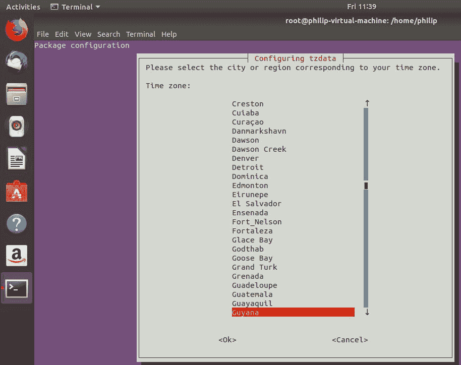
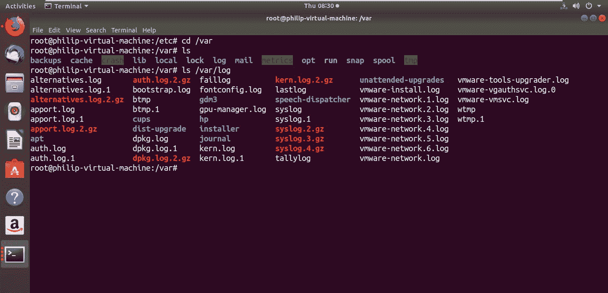
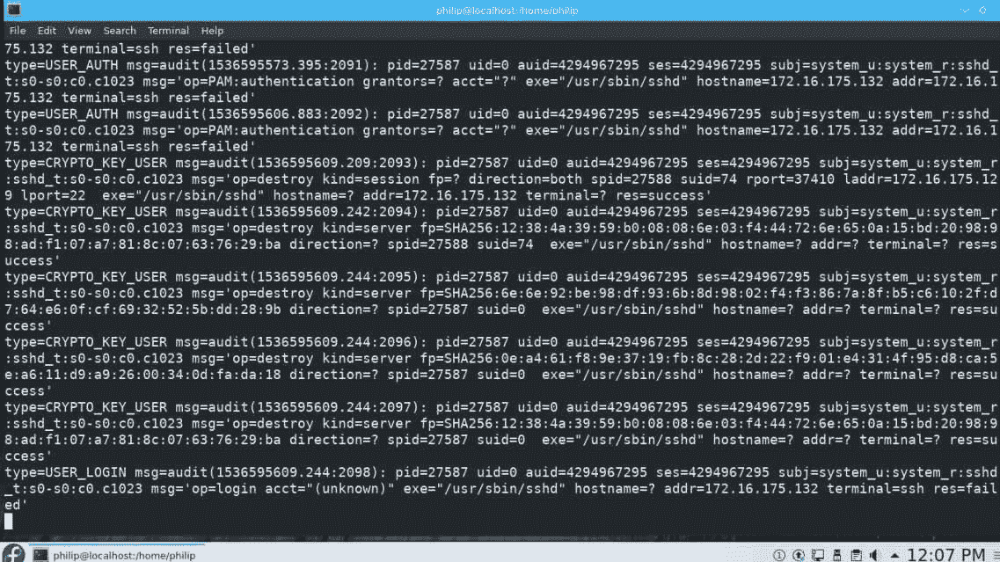
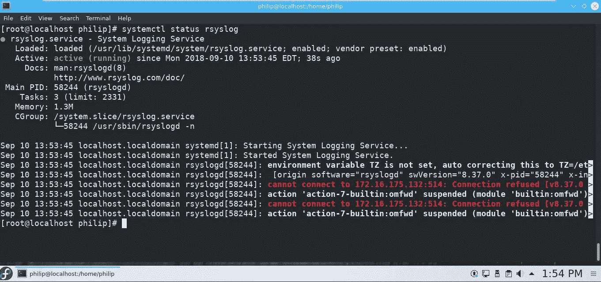
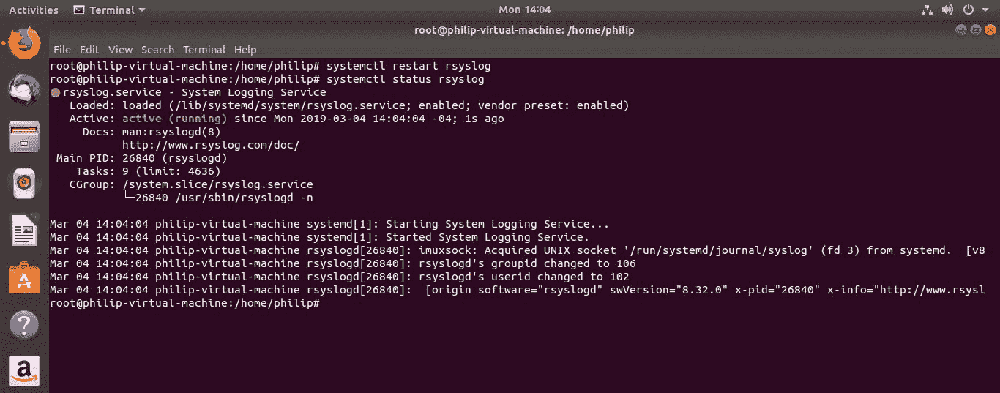

# 维护系统时间和日志记录

在前一章中，我们讨论了命令行自动化。我们触及了`at`、`atq`和`atrm`命令。接下来，我们使用了各种 `cron`目录，然后我们介绍了`crontab`实用程序。此外，我们还介绍了`anacron`。最后，我们研究了自动化方面的限制。

在本章中，我们的重点是维护系统时间和执行日志记录。首先，我们将介绍系统时间的配置，通过网络同步时间。然后，我们的注意力集中在各种日志文件上。最后，我们将在不同的 Linux 系统之间执行远程日志记录。

我们将在本章中讨论以下主题:

*   日期配置
*   设置本地系统日志记录
*   配置远程日志记录

# 日期配置

在大多数 Linux 环境中，让系统与正确的时间同步至关重要。我们可以使用`date`命令显示当前日期。我们可以通过运行以下命令来查看系统日期和时间:

```sh
root@philip-virtual-machine:/home/philip# date
Thu Sep  6 16:25:56 EDT 2018
root@philip-virtual-machine:/home/philip#
```

基于前面的输出，我们可以看到当前日期。也可以使用`date`命令设置日期和时间。为了能够以字符串格式指定日期，我们通过`-s`选项:

```sh
philip@philip-virtual-machine:~$ date -s "19 Dec 2020 12:00:00"
date: cannot set date: Operation not permitted
Sat Dec 19 12:00:00 EST 2020
philip@philip-virtual-machine:~$
```

基于前面的输出，我们遇到了障碍；这是因为我们需要 root 权限来更改日期。让我们再试一次，这次以 root 用户身份:

```sh
root@philip-virtual-machine:/home/philip# date -s "19 Dec 2020 12:00:00"
Sat Dec 19 12:00:00 EST 2020
root@philip-virtual-machine:/home/philip# date
Fri Sep  7 09:51:24 EDT 2018
root@philip-virtual-machine:/home/philip#
```

哇哦！发生了什么事？好吧，事情是这样的:系统被配置成自动同步时间。这可以通过使用另一个强大的命令来验证:`timedatectl`命令。我们可以运行`timedatectl`命令来查看当前的同步设置:

```sh
root@philip-virtual-machine:/home/philip# timedatectl
 Local time: Fri 2018-09-07 09:57:49 EDT
 Universal time: Fri 2018-09-07 13:57:49 UTC
 RTC time: Fri 2018-09-07 13:57:49
 Time zone: America/New_York (EDT, -0400)
 System clock synchronized: yes
systemd-timesyncd.service active: yes
 RTC in local TZ: no
root@philip-virtual-machine:/home/philip#
```

太棒了。根据前面的输出，`systemd-timesyncd.service active: yes`部分表示系统当前确实设置为同步。另外，我们可以通过`status`选项，这将返回类似的结果:

```sh
root@philip-virtual-machine:/home/philip# timedatectl status
 Local time: Fri 2018-09-07 10:02:38 EDT
 Universal time: Fri 2018-09-07 14:02:38 UTC
 RTC time: Fri 2018-09-07 14:02:38
 Time zone: America/New_York (EDT, -0400)
 System clock synchronized: yes
systemd-timesyncd.service active: yes
 RTC in local TZ: no
root@philip-virtual-machine:/home/philip#
```

太棒了。我们可以手动设置时间，但首先我们需要通过传递`timedatectl`命令的`set-ntp`选项来禁用自动同步:

```sh
root@philip-virtual-machine:/home/philip# timedatectl set-ntp false
root@philip-virtual-machine:/home/philip#
root@philip-virtual-machine:/home/philip# timedatectl status
 Local time: Fri 2018-09-07 10:04:27 EDT
 Universal time: Fri 2018-09-07 14:04:27 UTC
 RTC time: Fri 2018-09-07 14:04:27
 Time zone: America/New_York (EDT, -0400)
 System clock synchronized: yes
systemd-timesyncd.service active: no
 RTC in local TZ: no
root@philip-virtual-machine:/home/philip#
```

干得好！基于前面的命令，我们现在可以看到`systemd-timesyncd.service active: no`部分被更改为`no`。我们现在可以使用`date`命令再次尝试更改日期:

```sh
root@philip-virtual-machine:/home/philip# date
Fri Sep  7 10:06:28 EDT 2018
root@philip-virtual-machine:/home/philip# date -s "19 Dec 2020 12:00:00"
Sat Dec 19 12:00:00 EST 2020
root@philip-virtual-machine:/home/philip# date
Sat Dec 19 12:00:01 EST 2020
root@philip-virtual-machine:/home/philip#
```

太棒了！该命令已成功执行，并更改了当前日期。我们也可以用数值来表示月份，如下所示:

```sh
root@philip-virtual-machine:/home/philip# date -s "20240101 13:00:00"
Mon Jan  1 13:00:00 EST 2024
root@philip-virtual-machine:/home/philip# date
Mon Jan  1 13:00:08 EST 2024
root@philip-virtual-machine:/home/philip#
```

根据前面的输出，我们可以看到日期和时间发生了变化，以反映新的设置。除此之外，还可以使用连字符分隔日期，如下所示:

```sh
root@philip-virtual-machine:/home/philip# date -s "2000-10-05 07:00:00"
Thu Oct  5 07:00:00 EDT 2000
root@philip-virtual-machine:/home/philip# date
Thu Oct  5 07:00:02 EDT 2000
root@philip-virtual-machine:/home/philip#
```

太棒了。我们也可以使用正则表达式来设置时间。我们可以使用`+%T`设置时间:

```sh
root@philip-virtual-machine:/home/philip# date
Thu Oct  5 03:06:43 EDT 2000
root@philip-virtual-machine:/home/philip#
root@philip-virtual-machine:/home/philip# date +%T -s "20:00:00"
20:00:00
root@philip-virtual-machine:/home/philip# date
Thu Oct  5 20:00:03 EDT 2000
root@philip-virtual-machine:/home/philip#
```

太棒了。也可以使用`date`命令只改变小时；我们通过`+%H`选项:

```sh
root@philip-virtual-machine:/home/philip# date +%H -s "4"
04
root@philip-virtual-machine:/home/philip# date
Thu Oct  5 04:00:03 EDT 2000
root@philip-virtual-machine:/home/philip#
```

太棒了！也可以使用`timedatectl`命令更改日期和时间。我们可以通过`set-time`选项来更改日期:

```sh
root@philip-virtual-machine:/home/philip# timedatectl set-time 10:00:00
root@philip-virtual-machine:/home/philip# date
Thu Oct  5 10:00:02 EDT 2000
root@philip-virtual-machine:/home/philip# timedatectl
 Local time: Thu 2000-10-05 10:00:06 EDT
 Universal time: Thu 2000-10-05 14:00:06 UTC
 RTC time: Thu 2000-10-05 14:00:06
 Time zone: America/New_York (EDT, -0400)
 System clock synchronized: no systemd-timesyncd.service active: no
 RTC in local TZ: no
root@philip-virtual-machine:/home/philip#
```

太棒了。也可以通过传递`set-time`选项单独设置日期:

```sh
root@philip-virtual-machine:/home/philip# timedatectl set-time 2019-03-01
root@philip-virtual-machine:/home/philip# date
Fri Mar  1 00:00:02 EST 2019
root@philip-virtual-machine:/home/philip#
```

根据前面的输出，日期发生了变化，但是请注意时间也发生了变化。我们可以通过结合日期和时间来解决这个问题:

```sh
root@philip-virtual-machine:/home/philip# timedatectl set-time '2019-03-01 10:00:00'
root@philip-virtual-machine:/home/philip# date
Fri Mar  1 10:00:01 EST 2019
root@philip-virtual-machine:/home/philip#
```

太棒了！我们也可以使用`timedatectl`命令更改时区；我们可以通过传递`list-timezones`选项来查看可用时区:

```sh
root@philip-virtual-machine:/home/philip# timedatectl list-timezones
Africa/Abidjan
Africa/Accra
Africa/Addis_Ababa
Africa/Algiers
Africa/Asmara
Africa/Bamako
Africa/Bangui
America/Guayaquil
America/Guyana
root@philip-virtual-machine:/home/philip#
```

为了简洁起见，省略了一些输出。我们通过传递`set-timezone`选项来更改时区:

```sh
root@philip-virtual-machine:/home/philip# timedatectl
 Local time: Fri 2019-03-01 10:15:43 EST
 Universal time: Fri 2019-03-01 15:15:43 UTC
 RTC time: Fri 2019-03-01 15:15:43
 Time zone: America/New_York (EST, -0500)
 System clock synchronized: no
systemd-timesyncd.service active: no
 RTC in local TZ: no
root@philip-virtual-machine:/home/philip# timedatectl set-timezone America/Guyana
root@philip-virtual-machine:/home/philip# timedatectl
 Local time: Fri 2019-03-01 11:15:59 -04
 Universal time: Fri 2019-03-01 15:15:59 UTC
 RTC time: Fri 2019-03-01 15:16:00
 Time zone: America/Guyana (-04, -0400)
 System clock synchronized: no
systemd-timesyncd.service active: no
 RTC in local TZ: no
root@philip-virtual-machine:/home/philip#
```

太棒了。我们已经成功更改了时区。时区信息存储在`/etc/timezone`和`/etc/localtime`文件中。这是与`/usr/share/zoneinfo/<timezone>`的象征性联系；`<timezone>`是我们指定的任何东西:

```sh
root@philip-virtual-machine:/home/philip# ls -l /etc/localtime
lrwxrwxrwx 1 root root 36 Mar  1 11:15 /etc/localtime -> ../usr/share/zoneinfo/America/Guyana
root@philip-virtual-machine:/home/philip#
root@philip-virtual-machine:/home/philip# cat /etc/timezone
America/Guyana
root@philip-virtual-machine:/home/philip#
```

太棒了！基于前面的输出，我们可以看到`/etc/timezone`和`/etc/localtime`被更新到指定的时区。

# tzselect 命令

`tzselect`命令可用于更改系统的时区。当我们启动`tzselect`命令时，它会以交互方式问一系列问题。这可以通过以下情况来说明:

```sh
root@philip-virtual-machine:/home/philip# tzselect
Please identify a location so that time zone rules can be set correctly.
Please select a continent, ocean, "coord", or "TZ".
 1) Africa
 2) Americas
 3) Antarctica
 4) Asia
 5) Atlantic Ocean
 6) Australia
 7) Europe]
 8) Indian Ocean
 9) Pacific Ocean
10) coord - I want to use geographical coordinates.
11) TZ - I want to specify the time zone using the Posix TZ format.
#?
```

根据前面的输出，我们需要键入一个代表该大陆的数字:

```sh
#? 2
Please select a country whose clocks agree with yours.
 1) Anguilla          19) Dominican Republic   37) Peru
 2) Antigua & Barbuda 20) Ecuador              38) Puerto Rico
 3) Argentina         21) El Salvador          39) St Barthelemy
 4) Aruba             22) French Guiana        40) St Kitts & Nevis
 5) Bahamas           23) Greenland            41) St Lucia
 6) Barbados          24) Grenada              42) St Maarten (Dutch)
 7) Belize            25) Guadeloupe           43) St Martin (French)
 8) Bolivia           26) Guatemala            44) St Pierre & Miquelon
 9) Brazil            27) Guyana               45) St Vincent
#?
```

为了简洁起见，省略了一些输出。然后我们必须指定国家:

```sh
The following information has been given:
 Guyana
Therefore TZ='America/Guyana' will be used.
Selected time is now:     Fri Mar  1 11:27:49 -04 2019.
Universal Time is now:   Fri Mar  1 15:27:49 UTC 2019.
Is the above information OK?
1) Yes
2) No
#?
```

根据前面的输出，我们需要确认以下信息:

```sh
#? 1
You can make this change permanent for yourself by appending the line
 TZ='America/Guyana'; export TZ
to the file '.profile' in your home directory; then log out and log in again.
Here is that TZ value again, this time on standard output so that you
can use the /usr/bin/tzselect command in shell scripts:
America/Guyana
root@philip-virtual-machine:/home/philip#
```

我们需要在当前用户的主目录`.profile`里面追加`TZ='America/Guyana'; export TZ`行；然后，用户需要注销并再次登录，以使更改永久生效。当然，我们已经通过使用前面的命令`timedatectl`命令使我们的更改永久化了。

# tzconfig 命令

`tzconfig`命令是在系统中更改时区的较旧方法。它实际上不可用；相反，它会将您指向 Ubuntu 中的`tzdata`命令。

这可以通过运行`tzconfig`命令来说明:

```sh
root@philip-virtual-machine:/home/philip# tzconfig
WARNING: the tzconfig command is deprecated, please use:
 dpkg-reconfigure tzdata
root@philip-virtual-machine:/home/philip#
```

基于前面的命令，我们需要运行`dpkg-reconfigure tzdata`命令；这将启动一个交互式对话框:


现在我们需要使用键盘滚动；然后按*进入*选择想要的大陆。然后，您将看到以下内容:



根据前面的输出，您滚动到您想要的国家并按下*进入*键；这将使用您强调的国家时区:

```sh
root@philip-virtual-machine:/home/philip# dpkg-reconfigure tzdata
Current default time zone: 'America/Guyana'
Local time is now: Fri Mar 1 11:40:31 -04 2019.
Universal Time is now: Fri Mar 1 15:40:31 UTC 2019.
root@philip-virtual-machine:/home/philip#
```

太棒了！另一种更改时区的方法是手动移除`/etc/localtime`，并在`/usr/share/zoneinfo`内创建一个指向所需时区的符号链接。以下是它的外观:

```sh
root@philip-virtual-machine:/etc# unlink localtime
root@philip-virtual-machine:/etc# ln -s /usr/share/zoneinfo/America/Paramaribo localtime
root@philip-virtual-machine:/etc# ll /etc/localtime
lrwxrwxrwx 1 root root 38 Mar  1 13:01 /etc/localtime -> /usr/share/zoneinfo/America/Paramaribo
root@philip-virtual-machine:/etc#
root@philip-virtual-machine:/etc# timedatectl
 Local time: Fri 2019-03-01 13:03:57 -03
Universal time: Fri 2019-03-01 16:03:57 UTC
 RTC time: Fri 2019-03-01 16:03:57
 Time zone: America/Paramaribo (-03, -0300)
 System clock synchronized: no
systemd-timesyncd.service active: no
 RTC in local TZ: no
root@philip-virtual-machine:/etc#
root@philip-virtual-machine:/etc# cat /etc/timezone
America/Guyana
root@philip-virtual-machine:/etc#
```

从前面的输出中我们可以看到时区信息在`timedatectl`命令中被更新了。但是在`/etc/timezone`中没有更新。为了更新`/etc/timezone`，我们需要运行`dpkg-reconfigure tzdata`命令:

```sh
root@philip-virtual-machine:/etc# dpkg-reconfigure tzdata
Current default time zone: 'America/Paramaribo'
Local time is now:      Fri Mar  1 13:07:43 -03 2019.
Universal Time is now:  Fri Mar  1 16:07:43 UTC 2019.
root@philip-virtual-machine:/etc# cat /etc/timezone
America/Paramaribo
root@philip-virtual-machine:/etc#         
```

太棒了。

# hwclock 命令

还有一个钟；即，即使在系统断电时也运行的时钟；这是硬件时钟。我们可以按如下方式查看硬件时钟的时间:

```sh
root@philip-virtual-machine:/etc# date
Fri Mar  1 13:11:49 -03 2019
root@philip-virtual-machine:/etc# hwclock
2019-03-01 13:11:51.634343-0300
root@philip-virtual-machine:/etc#
```

从前面的输出中，我们可以看到日期和时间相对接近。我们可以将硬件时钟设置为与系统时间同步，如下所示:

```sh
root@philip-virtual-machine:/etc# hwclock --systohc
root@philip-virtual-machine:/etc# date
Fri Mar  1 12:17:04 -04 2019
root@philip-virtual-machine:/etc# hwclock
2019-03-01 12:17:06.556082-0400
root@philip-virtual-machine:/etc#
```

也可以将系统时间配置为与硬件时钟同步。我们按如下方式进行:

```sh
root@philip-virtual-machine:/etc# hwclock --hctosys
root@philip-virtual-machine:/etc# date
Fri Mar  1 12:18:52 -04 2019
root@philip-virtual-machine:/etc# hwclock
2019-03-01 12:18:54.571552-0400
root@philip-virtual-machine:/etc#
```

硬件时钟从`/etc/adjtime`开始设置，如下图所示:

```sh
root@philip-virtual-machine:/etc# cat /etc/adjtime
0.000000 1551457021 0.000000
1551457021
UTC
root@philip-virtual-machine:/etc#
```

还有硬件时钟；我们可以使用`hwclock`命令查看硬件时钟。如果我们使用的是世界协调时时间，我们可以通过`hwclock`命令传递`--utc`选项:

```sh
root@philip-virtual-machine:/home/philip# hwclock -r --utc
2018-09-06 16:30:27.493714-0400
root@philip-virtual-machine:/home/philip#
```

如前面的命令所示，硬件时钟的日期显示在 UTU。除此之外，我们还可以使用`--show`选项显示类似的结果:

```sh
root@philip-virtual-machine:/home/philip# hwclock --show --utc
2018-09-06 16:31:43.025628-0400
root@philip-virtual-machine:/home/philip#
```

太棒了。

# 设置本地系统日志记录

在 Linux 环境中，拥有可用于识别系统中潜在瓶颈的日志至关重要。幸运的是，我们已经默认打开了日志记录。有不同类型的日志文件可供检查；首先，`/var/log`目录包含各种日志文件，每一个都适合系统的不同方面。我们可以看一下`/var/log`目录:

```sh
root@philip-virtual-machine:/etc# cd /var
```



从前面的输出中，马上就有了`/var/log/syslog`文件。这包含有关系统功能的相关信息。我们可以查看`/var/log/syslog`文件:

```sh
root@philip-virtual-machine:/var# ll /var/log/syslog
-rw-r----- 1 syslog adm 48664 Mar 1 15:38 /var/log/syslog
root@philip-virtual-machine:/var# tail -f /var/log/syslog
Mar  1 14:31:52 philip-virtual-machine snapd[725]: 2019/03/01 14:31:52.052401 autorefresh.go:327: Cannot prepare auto-refresh change: cannot refresh snap-declaration for "core": Get https://api.snapcraft.io/api/v1/snaps/assertions/snap-declaration/16/99T7MUlRhtI3U0QFgl5mXXESAiSwt776?max-format=2: net/http: request canceled while waiting for connection (Client.Timeout exceeded while awaiting headers)
Mar  1 14:31:52 philip-virtual-machine snapd[725]: 2019/03/01 14:31:52.053013 stateengine.go:101: state ensure error: cannot refresh snap-declaration for "core": Get https://api.snapcraft.io/api/v1/snaps/assertions/snap-declaration/16/99T7MUlRhtI3U0QFgl5mXXESAiSwt776?max-format=2: net/http: request canceled while waiting for connection (Client.Timeout exceeded while awaiting headers)
Mar  1 14:38:03 philip-virtual-machine gnome-shell[1576]: Object Gdm.UserVerifierProxy (0x560080fc4cd0), has been already deallocated - impossible to access to it. This might be caused by the fact that the object has been destroyed from C code using something such as destroy(), dispose(), or remove() vfuncs
^C
root@philip-virtual-machine:/var#
```

为了简洁起见，省略了一些输出。我们已经将`tail`命令与`-f`选项一起使用；这将打印出最新的日志，因为它们是在`/var/log/syslog`文件中生成的。另一个有用的日志文件是`/var/log/auth.log`。这将显示各种身份验证消息。我们可以查看`/var/log/auth.log`文件:

```sh
root@philip-virtual-machine:/var# tail -f /var/log/auth.log
Mar  1 13:17:01 philip-virtual-machine CRON[7162]: pam_unix(cron:session): session closed for user root
Mar  1 13:30:01 philip-virtual-machine CRON[7167]: pam_unix(cron:session): session opened for user root by (uid=0)
Mar  1 13:30:01 philip-virtual-machine CRON[7167]: pam_unix(cron:session): session closed for user rootMar  1 14:00:01 philip-virtual-machine CRON[7178]: pam_unix(cron:session): session opened for user root by (uid=0)
Mar  1 14:00:01 philip-virtual-machine CRON[7178]: pam_unix(cron:session): session closed for user root
Mar  1 14:17:01 philip-virtual-machine CRON[7184]: pam_unix(cron:session): session opened for user
 ^C
root@philip-virtual-machine:/var#
```

太棒了。在前面的输出中，我们可以看到与根用户相关的各种日志。此外，如果有人试图闯入系统，这些登录尝试也会出现在这里:

```sh
root@philip-virtual-machine:/var/log# tail -f /var/log/auth.log
Mar  4 10:39:04 philip-virtual-machine sshd[26259]: Failed password for invalid user tom from 172.16.175.129 port 39010 ssh2
Mar  4 10:39:04 philip-virtual-machine sshd[26259]: Connection closed by invalid user tom 172.16.175.129 port 39010 [preauth]
Mar  4 10:39:04 philip-virtual-machine sshd[26259]: PAM 2 more authentication failures; logname= uid=0 euid=0 tty=ssh ruser= rhost=172.16.175.129
Mar  4 10:39:09 philip-virtual-machine sshd[26261]: Invalid user harry from 172.16.175.129 port 39012
Mar  4 10:39:10 philip-virtual-machine sshd[26261]: pam_unix(sshd:auth): check pass; user unknown
Mar  4 10:39:10 philip-virtual-machine sshd[26261]: pam_unix(sshd:auth): authentication failure; logname= uid=0 euid=0 tty=ssh ruser= rhost=172.16.175.129
Mar  4 10:39:12 philip-virtual-machine sshd[26261]: Failed password for invalid user harry from 172.16.175.129 port 39012 ssh2
Mar  4 10:39:13 philip-virtual-machine sshd[26261]: pam_unix(sshd:auth): check pass; user unknown
Mar  4 10:39:15 philip-virtual-machine sshd[26261]: Failed password for invalid user harry from 172.16.175.129 port 39012 ssh2
Mar  4 10:39:16 philip-virtual-machine sshd[26261]: pam_unix(sshd:auth): check pass; user unknown
Mar  4 10:39:18 philip-virtual-machine sshd[26261]: Failed password for invalid user harry from 172.16.175.129 port 39012 ssh2
Mar  4 10:39:18 philip-virtual-machine sshd[26261]: Connection closed by invalid user harry 172.16.175.129 port 39012 [preauth]
Mar  4 10:39:18 philip-virtual-machine sshd[26261]: PAM 2 more authentication failures; logname= uid=0 euid=0 tty=ssh ruser= rhost=172.16.175.129
```

太棒了！我们可以看到关于试图登录系统的用户的身份验证消息。另一个有用的日志文件是`/var/log/kern.log`。该文件包含启动期间与内核相关的各种消息。我们可以看看这个文件:

```sh
root@philip-virtual-machine:/var/log# tail -f /var/log/kern.log
Mar 1 15:40:32 philip-virtual-machine kernel: [106182.510455] hrtimer: interrupt took 7528791 ns
Mar 2 04:58:37 philip-virtual-machine kernel: [154065.757609] sched: RT throttling activated
Mar 4 10:07:45 philip-virtual-machine kernel: [345414.648164] IPv6: ADDRCONF(NETDEV_UP): ens33: link is not ready
Mar 4 10:07:45 philip-virtual-machine kernel: [345414.653620] IPv6: ADDRCONF(NETDEV_UP): ens33: link is not ready
Mar 4 10:07:45 philip-virtual-machine kernel: [345414.655942] e1000: ens33 NIC Link is Up 1000 Mbps Full Duplex, Flow Control: None
Mar 4 10:07:45 philip-virtual-machine kernel: [345414.656712] IPv6: ADDRCONF(NETDEV_CHANGE): ens33: link becomes ready
^C
root@philip-virtual-machine:/var/log#
```

在前面的文件中，我们可以看到与中断和网络相关的日志。在 Fedora 28 系统上，当我们检查`/var/log`文件时，我们会注意到没有`/var/log/syslog`文件:

```sh
[root@localhost philip]# ls /var/log
anaconda         dnf.log               hawkey.log           pluto            vmware-network.7.log
audit            dnf.log-20180805      hawkey.log-20180805  ppp    vmware-network.8.log
blivet-gui       dnf.log-20180812      hawkey.log-20180812  README vmware-network.9.log
boot.log         dnf.log-20180827      hawkey.log-20180827  samba  vmware-network.log
btmp             dnf.log-20180904      hawkey.log-20180904  speech-dispatcher     vmware-vgauthsvc.log.0
btmp-20180904     dnf.rpm.log           httpd                sssd             vmware-vmsvc.log
chrony           dnf.rpm.log-20180805  journal              tallylog         wtmp
cups             dnf.rpm.log-20180812  kdm.log              vmware-network.1.log  Xorg.0.log
dnf.librepo.log  dnf.rpm.log-20180827  kdm.log-20180904     vmware-network.2.log  Xorg.0.log.old
dnf.librepo.log-20180805  dnf.rpm.log-20180904  lastlog              vmware-network.3.log
dnf.librepo.log-20180812  firewalld             libvirt              vmware-network.4.log
dnf.librepo.log-20180827  gdm                   lightdm              vmware-network.5.log
dnf.librepo.log-20180904  glusterfs             mariadb              vmware-network.6.log
[root@localhost philip]#
```

基于前面的输出，Fedora 28 正在使用`systemd`。这已经用`journal`取代了`/var/log/messages`和`/var/log/syslog`。这又在`journald`守护进程中实现。我们可以使用`journalctl`命令查看日志。要查看所有日志文件，我们可以简单地键入`journalctl`而无需任何选项:

```sh
root@localhost philip]# journalctl
-- Logs begin at Tue 2018-07-31 10:57:23 EDT, end at Fri 2018-09-07 15:51:56 EDT. --
Jul 31 10:57:23 localhost.localdomain kernel: Linux version 4.16.3-301.fc28.x86_64 (mockbuild@bkernel02.phx2.fedoraprojec>
Jul 31 10:57:23 localhost.localdomain kernel: Command line: BOOT_IMAGE=/vmlinuz-4.16.3-301.fc28.x86_64 root=/dev/mapper/f>
Jul 31 10:57:23 localhost.localdomain kernel: Disabled fast string operations
Jul 31 10:57:23 localhost.localdomain kernel: x86/fpu: Supporting XSAVE feature 0x001: 'x87 floating point registers'
Jul 31 10:57:23 localhost.localdomain kernel: x86/fpu: Supporting XSAVE feature 0x002: 'SSE registers'
Jul 31 10:57:23 localhost.localdomain kernel: x86/fpu: Enabled xstate features 0x3, context size is 576 bytes, using 'sta>
Jul 31 10:57:23 localhost.localdomain kernel: e820: BIOS-provided physical RAM map:
Jul 31 10:57:23 localhost.localdomain kernel: BIOS-e820: [mem 0x0000000000000000-0x000000000009ebff] usable
Jul 31 10:57:23 localhost.localdomain kernel: BIOS-e820: [mem 0x000000000009ec00-0x000000000009ffff] reserved
Jul 31 10:57:23 localhost.localdomain kernel: BIOS-e820: [mem 0x00000000000dc000-0x00000000000fffff] reserved
 [root@localhost philip]#
```

为了简洁起见，省略了一些输出。有许多日志消息。我们可以过滤我们想要显示的内容。例如，要查看自最近一次系统启动以来的日志，我们可以通过`-b`选项:

```sh
[root@localhost philip]# journalctl -b
-- Logs begin at Tue 2018-07-31 10:57:23 EDT, end at Fri 2018-09-07 15:52:26 EDT. --
Sep 04 08:55:38 localhost.localdomain kernel: Linux version 4.16.3-301.fc28.x86_64 (mockbuild@bkernel02.phx2.fedoraprojec>
Sep 04 08:55:38 localhost.localdomain kernel: Command line: BOOT_IMAGE=/vmlinuz-4.16.3-301.fc28.x86_64 root=/dev/mapper/f>
Sep 04 08:55:38 localhost.localdomain kernel: Disabled fast string operations
Sep 04 08:55:38 localhost.localdomain kernel: x86/fpu: Supporting XSAVE feature 0x001: 'x87 floating point registers'
Sep 04 08:55:38 localhost.localdomain kernel: x86/fpu: Supporting XSAVE feature 0x002: 'SSE registers'
Sep 04 08:55:38 localhost.localdomain kernel: x86/fpu: Enabled xstate features 0x3, context size is 576 bytes, using 'sta>
Sep 04 08:55:38 localhost.localdomain kernel: e820: BIOS-provided physical RAM map:
Sep 04 08:55:38 localhost.localdomain kernel: BIOS-e820: [mem 0x0000000000000000-0x000000000009ebff] usable
[root@localhost philip]#
```

在前面的输出中，我们看到了相当多的消息。我们甚至可以通过传递`--utc`选项来显示带有 UTC 时间戳的日志:

```sh
[root@localhost philip]# journalctl -b --utc
-- Logs begin at Tue 2018-07-31 14:57:23 UTC, end at Fri 2018-09-07 19:52:26 UTC. --
Sep 04 12:55:38 localhost.localdomain kernel: Linux version 4.16.3-301.fc28.x86_64 (mockbuild@bkernel02.phx2.fedoraprojec>
Sep 04 12:55:38 localhost.localdomain kernel: Command line: BOOT_IMAGE=/vmlinuz-4.16.3-301.fc28.x86_64 root=/dev/mapper/f>
Sep 04 12:55:38 localhost.localdomain kernel: Disabled fast string operations
Sep 04 12:55:38 localhost.localdomain kernel: x86/fpu: Supporting XSAVE feature 0x001: 'x87 floating point registers'
[root@localhost philip]#
```

太棒了！根据前面的输出，第一行`-- Logs begin at Tue 2018-07-31 14:57:23 UTC, end at Fri 2018-09-07 19:52:26 UTC. --`表示时间戳以世界协调时为单位。`journalctl`文件还存储了`/var/log/journal`内部的信息，如下图所示:

```sh
[root@localhost philip]# ls /var/log/journal/
30012ff3b6d648a09e33e4927d140504
[root@localhost philip]#
```

我们甚至可以深入`/var/journal/30012ff3b6d648a09e33e4927d140504`下查看更多日志文件，如下所示:

```sh
[root@localhost philip]# ls /var/log/journal/30012ff3b6d648a09e33e4927d140504/
system@000572748a062ca4-7a3da8346cf70fb7.journal~
system@0005746b23e241ef-7ed07e858f3a6f48.journal~
system@0005746c7d7bed2f-80a58e1cfa65a3dd.journal~
system@0005750b2d37139f-3ddba79811cf1357.journal~
system@123e7dba3db2484697ae1cc5bfff550d-0000000000000001-0005750b2cb5f7d4.journal
system.journal
user-1000@000572749f063152-ae4ff154ee396e12.journal~
user-1000@4e535b252cc04ea69811c152632aafcd-0000000000000907-000572749f062b74.journal
user-1000.journal
[root@localhost philip]#
```

太棒了！我们可以使用`journalctl`来公开这些信息。例如，我们可以查看以前引导的日志；这可以通过传递`--list-boots`选项来查看:

```sh
[root@localhost philip]# journalctl --utc --list-boots
-6 6d6ff5ab30284bbe8da4c97e54298944 Tue 2018-07-31 14:57:23 UTC—Tue 2018-07-31 20:17:06 UTC
-5 a7a23120abff44c8bca6807f1711c1c2 Thu 2018-08-02 14:22:09 UTC—Sun 2018-08-12 14:18:21 UTC
-4 905ba9f3c37d46b69920466e9a93a67d Mon 2018-08-27 13:59:47 UTC—Mon 2018-08-27 15:06:04 UTC
-3 e4d2ad4c25df41a2b905fdcb8cfae312 Mon 2018-08-27 15:06:18 UTC—Mon 2018-08-27 15:37:50 UTC
-2 ae1c87d6ea6842da91eb4a1cba331ead Mon 2018-08-27 15:38:18 UTC—Mon 2018-08-27 20:22:15 UTC
-1 7cfc215cb74149748fe717b688630bd3 Mon 2018-08-27 20:22:33 UTC—Wed 2018-08-29 12:50:59 UTC
 0 d3cb4fafa63a41f99bd3cc4da0b74d1d Tue 2018-09-04 12:55:38 UTC—Fri 2018-09-07 19:59:02 UTC
[root@localhost philip]#
```

基于前面的输出，我们可以看到七个包含引导信息的文件；我们可以通过传递文件的偏移量来查看这些文件中的任何一个。每个文件的偏移量是第一列中的值。我们来看看`-6`偏移量:

```sh
[root@localhost philip]# journalctl -b -6 --utc
-- Logs begin at Tue 2018-07-31 14:57:23 UTC, end at Fri 2018-09-07 20:01:02 UTC. --
Jul 31 14:57:23 localhost.localdomain kernel: Linux version 4.16.3-301.fc28.x86_64 (mockbuild@bkernel02.phx2.fedoraprojec>
Jul 31 14:57:23 localhost.localdomain kernel: Command line: BOOT_IMAGE=/vmlinuz-4.16.3-301.fc28.x86_64 root=/dev/mapper/f>
Jul 31 14:57:23 localhost.localdomain kernel: Disabled fast string operations
Jul 31 14:57:23 localhost.localdomain kernel: x86/fpu: Supporting XSAVE feature 0x001: 'x87 floating point registers'
Jul 31 14:57:23 localhost.localdomain kernel: x86/fpu: Supporting XSAVE feature 0x002: 'SSE registers'
Jul 31 14:57:23 localhost.localdomain kernel: x86/fpu: Enabled xstate features 0x3, context size is 576 bytes, using 'sta>
Jul 31 14:57:23 localhost.localdomain kernel: e820: BIOS-provided physical RAM map:
 [root@localhost philip]#
```

为了简洁起见，省略了一些输出。我们可以看看`/etc/systemd/journald.conf`:

```sh
[root@localhost philip]# cat /etc/systemd/journald.conf
[Journal]
#Storage=auto
#Compress=yes
#Seal=yes
#SplitMode=uid
#SyncIntervalSec=5m
#RateLimitIntervalSec=30s
#RateLimitBurst=1000
#SystemMaxUse=
#SystemKeepFree=
#SystemMaxFileSize=
#SystemMaxFiles=100
#RuntimeMaxUse=
#RuntimeKeepFree=
#RuntimeMaxFileSize=
#RuntimeMaxFiles=100
#MaxRetentionSec=
#MaxFileSec=1month
#ForwardToSyslog=no
#ForwardToKMsg=no
#ForwardToConsole=no
#ForwardToWall=yes
#TTYPath=/dev/console
#MaxLevelStore=debug
#MaxLevelSyslog=debug
#MaxLevelKMsg=notice
#MaxLevelConsole=info
#MaxLevelWall=emerg
#LineMax=48K
[root@localhost philip]#
```

为了简洁起见，省略了一些输出。根据前面的输出，所有设置都是默认值；`#`表示注释。我们可以通过传递`--since`选项来指定查看日志信息的日期:

```sh
root@localhost philip]# journalctl --since today --utc
-- Logs begin at Tue 2018-07-31 14:57:23 UTC, end at Fri 2018-09-07 20:01:02 UTC. --
Sep 07 04:00:58 localhost.localdomain systemd[1]: Started Update a database for mlocate.
Sep 07 04:00:58 localhost.localdomain audit[1]: SERVICE_START pid=1 uid=0 auid=4294967295 ses=4294967295 subj=system_u:sy>
Sep 07 04:00:58 localhost.localdomain systemd[1]: Starting update of the root trust anchor for DNSSEC validation in unbou>
Sep 07 04:00:59 localhost.localdomain systemd[1]: Started update of the root trust anchor for DNSSEC validation in unboun>
Sep 07 04:00:59 localhost.localdomain audit[1]: SERVICE_START pid=1 uid=0 auid=4294967295 ses=4294967295 subj=system_u:sy>
Sep 07 04:00:59 localhost.localdomain audit[1]: SERVICE_STOP pid=1 uid=0 auid=4294967295 ses=4294967295 subj=system_u:sys>
Sep 07 04:01:01 localhost.localdomain CROND[13532]: (root) CMD (run-parts /etc/cron.hourly)
Sep 07 04:01:01 localhost.localdomain run-parts[13535]: (/etc/cron.hourly) starting 0anacron
Sep 07 04:01:01 localhost.localdomain run-parts[13543]: (/etc/cron.hourly) finished 0anacron
Sep 07 04:01:01 localhost.localdomain anacron[13541]: Anacron started on 2018-09-07
Sep 07 04:01:01 localhost.localdomain anacron[13541]: Normal exit (0 jobs run)
Sep 07 04:01:19 localhost.localdomain audit[1]: SERVICE_STOP pid=1 uid=0 auid=4294967295 ses=4294967295 subj=system_u:sys>
Sep 07 04:05:16 localhost.localdomain dhclient[1011]: DHCPREQUEST on ens33 to 172.16.175.254 port 67 (xid=0x1269bc29)
[root@localhost philip]#
```

太棒了。为了简洁起见，省略了一些输出。此外，我们可以用数字指定日期:

```sh
[root@localhost philip]# journalctl --since "2018-09-07 15:00:00"
-- Logs begin at Tue 2018-07-31 10:57:23 EDT, end at Fri 2018-09-07 16:11:54 EDT. --
Sep 07 15:01:01 localhost.localdomain CROND[16031]: (root) CMD (run-parts /etc/cron.hourly)
Sep 07 15:01:01 localhost.localdomain run-parts[16034]: (/etc/cron.hourly) starting 0anacron
Sep 07 15:01:01 localhost.localdomain run-parts[16040]: (/etc/cron.hourly) finished 0anacron
Sep 07 15:09:56 localhost.localdomain dhclient[1011]: DHCPREQUEST on ens33 to 172.16.175.254 port 67 (xid=0x1269bc29)
Sep 07 15:09:56 localhost.localdomain dhclient[1011]: DHCPACK from 172.16.175.254 (xid=0x1269bc29)
Sep 07 15:09:56 localhost.localdomain NetworkManager[833]: <info>  [1536347396.3834] dhcp4 (ens33):   address 172.16.175.>
Sep 07 15:09:56 localhost.localdomain NetworkManager[833]: <info>  [1536347396.3842] dhcp4 (ens33):   plen 24 (255.255.25>
Sep 07 15:09:56 localhost.localdomain NetworkManager[833]: <info>  [1536347396.3845] dhcp4 (ens33):   gateway 172.16.175.2
[root@localhost philip]#
```

为了简洁起见，省略了一些输出。然而，我们可以看到与网络相关的信息。同样，我们可以在`/var/log/audit/audit.log`里面查看认证信息。以下是该文件的摘录:



干得好！从摘录中，我们可以看到进入 Fedora 系统的登录尝试。此外，我们可以利用`journalctl`命令来显示认证信息。我们可以通过`-u`选项并指定我们正在寻找的服务:

```sh
[root@localhost philip]# journalctl -u sshd.service
-- Logs begin at Tue 2018-07-31 10:57:23 EDT, end at Mon 2018-09-10 12:06:49 EDT. --
Sep 10 12:05:28 localhost.localdomain sshd[27585]: Invalid user ted from 172.16.175.132 port 37406
Sep 10 12:05:29 localhost.localdomain sshd[27585]: pam_unix(sshd:auth): check pass; user unknown
Sep 10 12:05:29 localhost.localdomain sshd[27585]: pam_unix(sshd:auth): authentication failure; logname= uid=0 euid=0 tty>
Sep 10 12:05:31 localhost.localdomain sshd[27585]: Failed password for invalid user ted from 172.16.175.132 port 37406 ss>
Sep 10 12:05:32 localhost.localdomain sshd[27585]: pam_unix(sshd:auth): check pass; user unknown
Sep 10 12:05:34 localhost.localdomain sshd[27585]: Failed password for invalid user ted from 172.16.175.132 port 37406 ss>
Sep 10 12:05:54 localhost.localdomain sshd[27585]: pam_unix(sshd:auth): check pass; user unknown
Sep 10 12:05:56 localhost.localdomain sshd[27585]: Failed password for invalid user ted from 172.16.175.132 port 37406 ss>
Sep 10 12:05:56 localhost.localdomain sshd[27585]: Connection closed by invalid user ted 172.16.175.132 port 37406 [preau>
Sep 10 12:05:56 localhost.localdomain sshd[27585]: PAM 2 more authentication failures; logname= uid=0 euid=0 tty=ssh ruse>
[root@localhost philip]#
```

由此，我们可以看到`journalctl`效用的有效性。

# 配置远程日志记录

查看本地系统的日志文件总是好的，但是管理远程日志呢？嗯，可以配置一个 Linux 系统来执行远程日志记录。我们必须安装(如果还没有安装)日志软件。在这个演示中，我们将使用 Fedora 28 作为日志客户端，使用 Ubuntu 18 系统作为日志服务器。另外，我们将使用`rsyslog`作为记录软件。默认情况下，它已经安装在 Ubuntu 18 系统中。然而，在 Fedora 28 上，我们将不得不安装`rsyslog`软件。首先，让我们在 Fedora 28 中安装`rsyslog`软件。我们使用`dnf`命令，图示如下:

```sh
[root@localhost philip]# dnf search rsyslog
Last metadata expiration check: 1:38:20 ago on Mon 10 Sep 2018 10:41:18 AM EDT.
============================================= Name Exactly Matched: rsyslog ==============================================
rsyslog.x86_64 : Enhanced system logging and kernel message trapping daemon
============================================ Summary & Name Matched: rsyslog =============================================
rsyslog-mysql.x86_64 : MySQL support for rsyslog
rsyslog-hiredis.x86_64 : Redis support for rsyslog
rsyslog-doc.noarch : HTML documentation for rsyslog
[root@localhost philip]#
```

为了简洁起见，省略了一些输出。我们找到了`rsyslog`包。接下来，我们将通过`install`选项来安装`rsyslog`软件包:

```sh
[root@localhost philip]# dnf install rsyslog.x86_64
Last metadata expiration check: 2:42:37 ago on Mon 10 Sep 2018 10:41:18 AM EDT.
Dependencies resolved.
==========================================================================================================================
 Package                       Arch                     Version                           Repository                 Size
==========================================================================================================================
Installing:
 rsyslog                       x86_64                   8.37.0-1.fc28                     updates                   697 k
Installing dependencies:
 libestr                       x86_64                   0.1.9-10.fc28                     fedora                     26 k
 libfastjson                   x86_64                   0.99.8-2.fc28                     fedora                     36 k
Transaction Summary
==========================================================================================================================
Install  3 Packages
Total download size: 759 k
Installed size: 2.2 M
Is this ok [y/N]: y
Installed:
 rsyslog.x86_64 8.37.0-1.fc28           libestr.x86_64 0.1.9-10.fc28           libfastjson.x86_64 0.99.8-2.fc28 
Complete!
[root@localhost philip]#
```

同样，为了简洁起见，省略了一些输出。我们已经成功安装了`rsyslog`包。现在需要在文本编辑器中编辑`/etc/rsyslog.conf`，比如 vi 或者 nano 我们需要指定远程日志服务器的 IP 地址。我们是这样做的:

```sh
[root@localhost philip]# cat /etc/rsyslog.conf
# rsyslog configuration file
# For more information see /usr/share/doc/rsyslog-*/rsyslog_conf.html
# or latest version online at http://www.rsyslog.com/doc/rsyslog_conf.html
# If you experience problems, see http://www.rsyslog.com/doc/troubleshoot.html
#queue.maxdiskspace="1g"         # 1gb space limit (use as much as possible)
#queue.saveonshutdown="on"       # save messages to disk on shutdown
#queue.type="LinkedList"         # run asynchronously
#action.resumeRetryCount="-1"    # infinite retries if host is down
# # Remote Logging (we use TCP for reliable delivery)
# # remote_host is: name/ip, e.g. 192.168.0.1, port optional e.g. 10514
#Target="remote_host" Port="XXX" Protocol="tcp")
*.*         @172.16.175.132:514
[root@localhost philip]#
```

太好了！为了简洁起见，省略了一些输出。在前面的输出中，我们添加了最后一个条目`*.* @172.16.175.132:514`。这是通知本地系统使用`UDP`协议和`514`端口号将所有`.*`严重性的`*.`消息发送到`172.16.175.132`远程系统。我们也可以更具体一些；例如，我们只能通过指定`emerg`关键字从每个设施发送紧急消息:

```sh
[root@localhost philip]# cat /etc/rsyslog.conf
# rsyslog configuration file
#queue.maxdiskspace="1g"         # 1gb space limit (use as much as possible)
#queue.saveonshutdown="on"       # save messages to disk on shutdown
#queue.type="LinkedList"         # run asynchronously
#action.resumeRetryCount="-1"    # infinite retries if host is down
# # Remote Logging (we use TCP for reliable delivery)
# # remote_host is: name/ip, e.g. 192.168.0.1, port optional e.g. 10514
#Target="remote_host" Port="XXX" Protocol="tcp")
*.emerg               @172.16.175.132:514
[root@localhost philip]#
```

每个带有紧急消息的设施都将通过 UDP 发送到远程服务器。到目前为止，我们一直使用 UDP 发送日志，但是也可以使用 TCP 发送日志。为了使用 TCP 作为传输，我们需要在第一个`@`前面添加另一个`@`。我们将消息类型从`emerg`更改为`info`，并使用 TCP 作为传输协议，如下所示:

```sh
[root@localhost philip]# cat /etc/rsyslog.conf
# rsyslog configuration file
 #queue.saveonshutdown="on"       # save messages to disk on shutdown
#queue.type="LinkedList"         # run asynchronously
#action.resumeRetryCount="-1"    # infinite retries if host is down
# # Remote Logging (we use TCP for reliable delivery)
# # remote_host is: name/ip, e.g. 192.168.0.1, port optional e.g. 10514
#Target="remote_host" Port="XXX" Protocol="tcp")
*.info    @@172.16.175.132:514
[root@localhost philip]#
```

太棒了。为了简洁起见，省略了一些输出。现在，最后一步是重新启动`rsyslog`守护程序，以便新的更改能够生效。我们使用`systemctl`命令，如下所示，重新启动`rsyslog`守护程序:



现在我们可以看到`rsyslog`守护进程正在运行。注意`systemctl`状态的下方，有一些关于连接`172/16.175.132`的日志。这是因为我们没有将远程服务器配置为接受来自 Fedora 系统的日志。现在我们将前往 Ubuntu 系统，编辑`/etc/rsyslog.conf`并添加以下内容:

```sh
root@philip-virtual-machine:/var/log# cat /etc/rsyslog.conf
# provides UDP syslog reception
#module(load="imudp")
#input(type="imudp" port="514")
# provides TCP syslog reception
module(load="imtcp")
input(type="imtcp" port="514")
root@philip-virtual-machine:/var/log#
```

太棒了！为了简洁起见，省略了一些输出。我们已经删除了`TCP`部分的评论。最后一步是重启`rsyslog`守护进程；这可以使用`systemctl`命令完成，如下图所示:



我们可以看到`rsyslog`守护进程运行无误。现在进行测试，我们将检查`/var/log/syslog`是否有来自 Fedora 日志客户端的日志。我们可以使用另一个强大的命令来生成测试日志:`logger`命令。下面是我们如何使用`logger`命令。

在 Fedora 28 `rsyslog`客户端上，我们发布以下内容:

```sh
[root@localhost philip]# logger This is the Fedora Logging client 172.16.175.129
[root@localhost philip]# logger This is another Logging test from the Fedora client 172.16.175.129
[root@localhost philip]#
```

在 Ubuntu 18 `rsyslog`服务器上，我们将看到以下内容:

```sh
root@philip-virtual-machine:/home/philip# tail -f /var/log/syslog
Sep 10 14:20:46 localhost dbus-daemon[720]: [system] Successfully activated service 'net.reactivated.Fprint'
Sep 10 14:20:46 localhost systemd[1]: Started Fingerprint Authentication Daemon.
Sep 10 14:20:50 localhost kscreenlocker_greet[58309]: QObject::disconnect: No such signal QObject::screenChanged(QScreen*)
Sep 10 14:22:25 localhost philip[58396]: This is the Fedora Logging client 172.16.175.129
Sep 10 14:23:04 localhost philip[58403]: This is another Logging test from the Fedora client 172.16.175.129
^C
root@philip-virtual-machine:/home/philip#
```

太棒了。我们可以看到`rsyslog`客户端确实正在通过网络将日志发送到 Ubuntu 18 `rsyslog`服务器。

# 摘要

在本章中，主要的焦点是系统时间和日志的维护。特别是，我们研究了操纵系统时间的方法；我们广泛使用`date`和`timedatectl`命令。此外，我们还讨论了更改日期的正则表达式。此外，我们使用硬件时钟；我们看到了使系统时钟与硬件时钟同步的方法，反之亦然。继续前进，我们从事伐木工作；我们研究了常见的日志文件。`/var/log/syslog`文件是在 Ubuntu 环境中探索的，而`journalctl`命令在 Fedora 28 中被广泛用于查看日志。最后，我们使用远程日志记录；我们在 Fedora 28 中安装了`rsyslog`软件包，并将其配置为`rsyslog`客户端。然后我们转到 Ubuntu 18，配置它的`/etc/rsyslog.conf`文件来接受远程日志，并使用 TCP 作为它的传输协议。然后，我们在 Fedora 系统上生成测试日志，并验证我们在 Ubuntu `rsyslog`服务器上收到了这些日志。

在下一章中，我们将深入互联网协议的世界。我们将讨论各种 IPv4 地址和 IPv6 地址。此外，我们还将介绍如何划分 IPv4 地址的子网，以及如何减少冗长的 IPv6 地址。最后，我们将了解一些众所周知的协议。

# 问题

1.  哪个选项用于使用`date`命令设置日期？

A.`-s`T4【b .】`-S`T5【c .】`-t`T6【d .`-u`

2.  在`timedatectl`命令中，哪个选项用于关闭同步？

A.`--set-ntp`T4【b .】`--set-sync`T5【c .】`set-ntp`T6【d .`set-sync`

3.  哪个正则表达式是用`date`命令只设置时间的？

A.-$ % T
b .+$ T
c .-$ T
d .+% T

4.  哪个选项用于使用`timedatectl`命令设置时间？

A.设定时间
B .设定时钟
C .设定同步
D .设定区域

5.  哪个文件是从`/usr/share/zoneinfo/<zone>`生成的？

A.`/etc/synczone`T4【b .】`/etc/timedate`T5【c .】`/etc/clock`T6【d .`/etc/localtime`

6.  在更新的 Ubuntu 发行版中，哪个命令取代了`tzconfig`命令？

A.`tztime`T4【b .】`tzdata`T5【c .】`tzzone`T6【d .`tzclock`

7.  哪个命令用于设置时区？？

A.tzsync
b . tzselect
c . tzdate
d .集合时间

8.  `journalctl`命令的哪个选项列出了特定守护程序的日志？
    1.  `-a`
    2.  `-e`
    3.  `-b`
    4.  `-u`

9.  当`/etc/rsyslog.conf`中有`*.* @@1.2.3.4`时，使用的是哪种协议？
    1.  网间控制报文协议(Internet Control Messages Protocol)
    2.  用户数据报协议(User Datagram Protocol)
    3.  回声
    4.  传输控制协议（Transmission Control Protocol）

10.  哪个命令可用于发送测试消息，作为验证`rsyslog`客户端正在与`rsyslog`服务器通信的一部分？
    1.  `send-message`
    2.  `nc`
    3.  `logger`
    4.  `logrotate`

# 进一步阅读

*   本网站提供了关于日志的有用信息:https://www . digitalocean . com/community/tutories/如何查看和配置 Linux-log-on-Ubuntu-and-centos
*   这个网站提供了关于时钟的有用信息:[https://www.systutorials.com/docs/linux/man/n-clock/](https://www.systutorials.com/docs/linux/man/n-clock/)
*   本网站提供了有关日志记录的有用信息:[http://freelinuxtutorials . com/tutorials/configure-集中式-syslog-Linux 中的服务器-setup-syslog-不同平台上的客户端/](http://freelinuxtutorials.com/tutorials/configure-centralized-syslog-server-in-linux-setup-syslog-clients-on-different-platforms/)