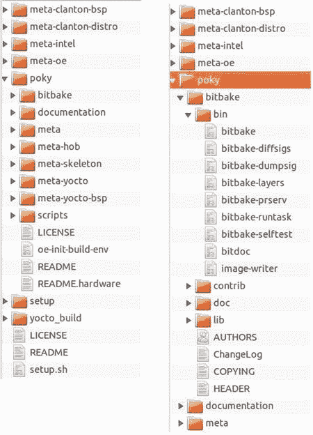
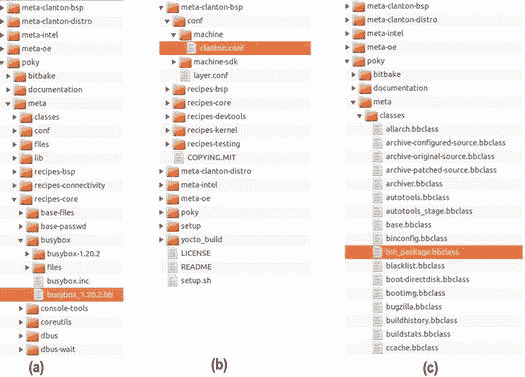
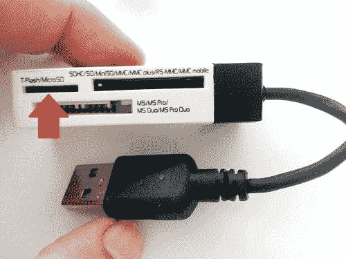
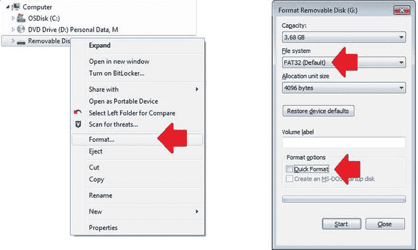
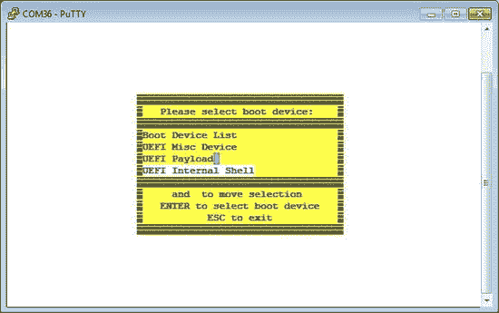
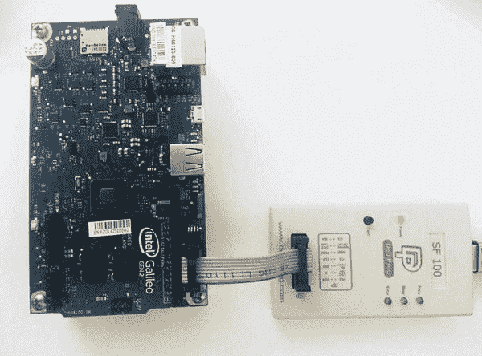
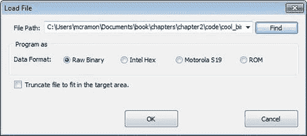
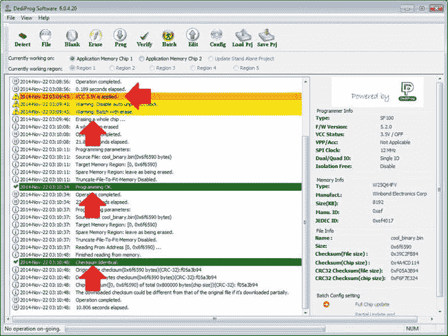
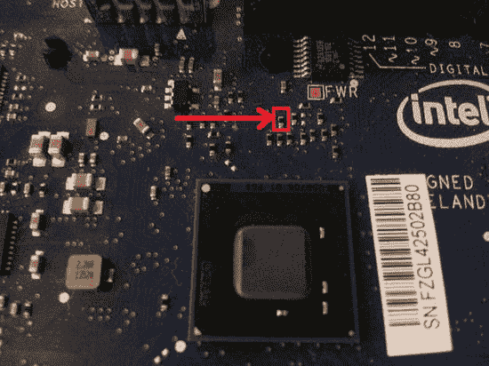

# 二、原生开发

本书中有些项目需要的不仅仅是 Arduino 参考 API 的简单使用。尤其是[第七章](07.html)，这里解释了 OpenCV 和 V4L2，有些例子不会像简单的草图(Arduino 程序)那样运行。在这些情况下，您需要知道如何进行新的构建，如何专门为您的计算机创建工具链，以及如何使用交叉编译器来编译本机应用程序。

用于创建英特尔 Galileo 映像(Yocto 项目)的构建系统非常强大，但它不像简单的`make`命令那么简单。必须做一些计算机准备工作。了解一点构建系统的工作原理，以及如何为英特尔 Galileo 和英特尔 Quark 工具链编译 SPI 和 SD 卡映像，以便能够使用交叉编译器，这也很有好处。

本章还向您展示了如何在安装工具链之后构建一个非常简单的本地 Hello World 应用程序。

考虑到您将能够创建自己的版本，尤其是 SPI 映像，这里有一些关于如何恢复您的电路板的说明，以防您出错并损坏您的电路板。

最后，这一章会给你带来一些在接下来的章节中需要的知识。它的目的不是让您完全理解本机开发中涉及的所有技术，尤其是调试。

Yocto 构建系统简介

假设您正在创建一个伟大的产品，它使用 Linux 作为嵌入式操作系统，因为它是开源和免费的——降低了产品成本，并为您的用户带来了一个伟大的操作系统。这听起来对吗？答案是视情况而定，因为 Linux 是一个令人惊叹的操作系统，但是如果您不能很好地控制产品所需的特性，例如哪个 Linux 发行版能够以最小的努力将所有部分结合在一起，那么在嵌入式开发中“降低成本”可能是一个真正巨大的噩梦。

为了创建一个定制的 Linux 映像并带来您所需要的特性，Yocto 项目被创建为一个灵活的、可定制的平台，用于不同的硬件架构和代码。

Yocto 项目带来了一系列工具、方法和代码——允许您选择产品所针对的 CPU、软件和硬件组件以及占用空间大小——来构建基于 Linux 操作系统的软件版本。支持的 CPU 包括英特尔架构(IA)、ARM、PowerPC 和 MIPS。

除了产品发布之外，Yocto 还允许您构建像系统开发工具包(SDK)和应用程序这样的工具，以便与您的产品一起使用。例如，对于英特尔 Galileo 主板，我们将介绍如何构建您自己的工具链，其中包含针对不同操作系统的交叉编译器。

一旦用配置和组件建立了 Yocto 项目，当必须添加或删除新的组件时，或者即使必须在 Yocto 支持的遗留产品的基础上创建新产品，一切都会变得更容易，因为您的产品是可重用的。

Yocto 项目由 Linux 基金会维护，这意味着您的产品将独立于任何供应商或公司。Intel、Dell、Mindspeed、Wind River、Mentor Graphics、松下和德州仪器等公司都参与了 Yocto 项目。

Yocto 和这本书

要了解 Yocto 项目的所有细节，有必要再写一本专门介绍 Yocto 的书，因为与 Yocto 一样，yo CTO 是强大的，它是广泛的——涉及很多细节。

特别是在这一章中，解释了一些关于 Yocto 的基本概念，以便您理解在英特尔 Galileo 和英特尔 Quark 环境中的构建过程。

与执行一堆命令来完成构建而不知道发生了什么不同，本节简要概述了构建过程是如何工作的，以及构建过程中出现在计算机监视器上的消息的含义。

如果您有兴趣更深入地了解 Yocto，建议您访问位于`https://www.yoctoproject.org/documentation`的 Yocto 文档和位于`http://www.yoctoproject.org/docs/current/ref-manual/ref-manual.html`的手册。

poky〔t0〕英特尔 Galileo 图像

Poky 是 Yocto 项目中构建系统的名字。Poky 依赖于一个叫做 ***bitbake*** 工具的任务执行程序和调度程序。

**Bitbake** 基于一组配置文件和元数据执行构建过程的所有步骤。基本上，bitbake 解析并运行几个 shell 脚本，Python 代码运行所有的编译。如果您是一名普通的 C/C++开发人员，您通常会依赖于 makefiless，这些 makefile 是在您运行传统的`make`命令时调用编译器处理的。假设您有一个复杂的项目，包含不同的软件组件，您需要为每个组件运行`make`。在 Yocto 项目环境中，Bitbake 可能被认为是“全局`make`命令”，但是您肯定不会使用任何`make`命令，因为 bitbake 会为您调用所有这些命令。

元数据定义了要构建哪些组件、组件版本以及如何构建每个组件。元数据可以分为三个独立的部分:

*   **配置文件:**基于配置文件(`.conf`)的位烘焙，它保存变量的全局定义、编译标志、库和应用程序必须放置的位置、要使用的机器架构等等。
*   **Bitbake 类:**bit bake 类，也称为 *bbclasses* ，在扩展名为`.bbclass`的文件中定义。大多数情况下，构建期间的重要工作都是通过这些文件中的定义来完成的，比如如何生成 RPM 包、如何创建根文件系统等等。
*   **Recipes:**Recipes 是带有`.bb`扩展名的文件，它定义了要构建的软件的各个部分、必须包含的包、在哪里以及如何获得源代码和补丁、依赖项、您想要在源代码中启用的特性和定义等等。

也许这些定义对于构建系统来说听起来有点复杂，但是它们是使系统变得灵活的神奇钥匙，即使它听起来过于工程化。然而，为了更好地理解 Poky 的工作方式，以及构建系统的一般情况，让我们构建一个英特尔 Galileo 映像，并一步一步地讨论该过程中发生的事情。

图 2-1 由 Yocto 项目团队创建，代表了 Yocto 构建系统流程。


[图 2-1](#_Fig1) 。Yocto 构建系统流程

图 2-1 显示了 Yocto 构建过程是如何工作的。它需要几个段落来解释每一步。

随着输入文件和数据，用户**(用户配置)**策略**(策略配置)**和机器配置**(机器 BSP 配置**)被加载，并且元数据文件被解析**(元数据。bb +补丁)。**

构建过程开始从远程存储库下载组件，获取本地包、HTTPS、网站、FTP 站点等等，如**源镜像(s** )所示。

一旦所有必要的代码都被提取到工作区**(源提取)**，必要的补丁被应用**(路径应用)**，配置被应用**(配置/编译/自动配置)**基于从输入文件和数据中检索的信息。

然后成千上万的软件代码开始编译，输出文件进入暂存区**(输出分析)**，直到预期的包被创建 **(** `.rpm` **、** `.deb` **，或者** `.ipk` **)** 。你将在本书中使用 **IPK** 文件。

在生成输出文件 **(QA 测试)**的过程中会进行一些完整性测试，直到所有必需的包都被创建并被提供**(包提供)**以生成最终的输出映像**(映像和应用程序开发 SDK)。**

请注意，您将需要一个互联网连接，因为将下载大量代码来完成构建过程。

构建系统树一览

在下一节中，您将了解如何下载元文件和 Poky 来构建英特尔 Galileo 映像和工具链。在构建和执行一系列指令之前，了解一下 Poky tree 和 Intel Galileo 元文件中的文件组织方式会很有意思。

[图 2-2](#Fig2) (左)显示了代码结构，当您下载构建英特尔 Galileo 和工具链所需的代码时，您将会看到该代码结构。



[图 2-2](#_Fig2) 。口袋和层(左)和位烘焙工具(右)

如您所见，有一个名为`poky`的文件夹，其中包含了 Yocto 构建系统的基本结构。比如在`poky`目录下有一个`bitbake`目录，里面包含了 ***bitbake 二进制工具*** 等实用工具，如图[图 2-2](#Fig2) (右图)，还有一些以`meta*`前缀开头的目录。每个`meta*`目录实际上是一个包含元数据的 ***层***——换句话说，就是配方、类和配置文件。

在`poky`目录之上是其他层，像`meta-clanton-bsp`、`meta-clanton-distro`、`meta-intel`和`meta-oe`，当然，它们有各自的配方、类和配置文件，以及任何其他元数据。

定义哪些层实际上是编译的一部分的是在[清单 2-1](#list1) 所示的`yocto_build/conf`目录中一个名为`bblayers.conf`的文件。

[***清单 2-1***](#_list1) 。bblayers.conf

```sh
# LAYER_CONF_VERSION is increased each time build/conf/bblayers.conf
# changes incompatibly
LCONF_VERSION = "6"

BBPATH = "${TOPDIR}"
BBFILES ?= ""
BBLAYERS ?= " \
  /home/mcramon/BSP_1.0.4_T/meta-clanton_v1.0.1/poky/meta \
  /home/mcramon/BSP_1.0.4_T/meta-clanton_v1.0.1/poky/meta-yocto \
  /home/mcramon/BSP_1.0.4_T/meta-clanton_v1.0.1/poky/meta-yocto-bsp \
  /home/mcramon/BSP_1.0.4_T/meta-clanton_v1.0.1/meta-intel \
  /home/mcramon/BSP_1.0.4_T/meta-clanton_v1.0.1/meta-oe/meta-oe \
  /home/mcramon/BSP_1.0.4_T/meta-clanton_v1.0.1/meta-clanton-distro \
  /home/mcramon/BSP_1.0.4_T/meta-clanton_v1.0.1/meta-clanton-bsp \
  "
```

现在是时候更深入地研究这个树并检查配方、配置和类文件了。

一个食谱的例子。bb)

让我们看一个配方文件，选择有效的层，并搜索一个。比如，我们假设你选择了`meta`层；如果稍微探究这一层，你会发现非常有趣的食谱，就像[图 2-3(a)](#Fig3) 中所示的`busybox_1.20.2.bb`食谱。



[图 2-3](#_Fig3) 。配方(a)、配置(b)和类文件(c)的示例

打开 busybox 菜谱，您将看到类似于清单 2-2 中所示的代码结构。

[***清单 2-2***](#_list2) 。busybox_1.20.2.bb

```sh
require busybox.inc
PR = "r7"

SRC_URI = "http://www.busybox.net/downloads/busybox-${PV}.tar.bz2;name=tarball \
           file://B921600.patch \
           file://get_header_tar.patch \
           file://busybox-appletlib-dependency.patch \
           file://run-parts.in.usr-bin.patch \
           file://watch.in.usr-bin.patch \
...
...
...

           file://inetd"

SRC_URI[tarball.md5sum] = "e025414bc6cd79579cc7a32a45d3ae1c"
SRC_URI[tarball.sha256sum] = "eb13ff01dae5618ead2ef6f92ba879e9e0390f9583bd545d8789d27cf39b6882"

EXTRA_OEMAKE += "V=1 ARCH=${TARGET_ARCH} CROSS_COMPILE=${TARGET_PREFIX} SKIP_STRIP=y"
```

注意，菜谱包含一个定义下载 busybox 的 URL 的`SRC_URI`变量，以及相应的`md5`和`sha256`校验和，以确保下载的包是预期的包。**`EXTRA_OEMAKE`只在编译时添加编译标志。**

 **每个配方都被解析，Yocto 构建过程在构建过程中承担一些功能。下面列出了一些功能；可以根据配置对它们进行定制或简单排除:

*   `do_fetch`
*   `do_unpack`
*   `do_patch`
*   `do_configure`
*   `do_compile`
*   `do_install`
*   `do_package`

正如前面所解释的，每个函数都与 Yocto 构建流程相关，当您运行构建时，您会看到这些函数显示在您的计算机上，因此您会对每个包的构建过程阶段有一个概念。

编译过程中可能执行的功能的完整列表在*****Yocto 项目参考手册*** 的`http://www.yoctoproject.org/docs/1.7/ref-manual/ref-manual.html#ref-tasks` *第 8 章中有详细说明。***

 **配置文件的示例(。会议)

至此，您已经很好地了解了什么是配方，所以让我们来看一个配置文件的例子。

配置文件通常位于层中一个名为`conf`的文件夹下。一个很好的例子是属于`/conf/machine`文件夹下的`meta-clanton-bsp`层的配置文件名`clanton.conf`。该文件的内容如[清单 2-3](#list3) 和[图 2-3(b)](#Fig3) 所示。

[***清单 2-3***](#_list3) 。clanton.conf

```sh
#@TYPE: Machine
#@NAME: clanton

#@DESCRIPTION: Machine configuration for clanton systems

PREFERRED_PROVIDER_virtual/kernel ?= "linux-yocto-clanton"
PREFERRED_VERSION_linux-yocto-clanton ?= "3.8%"

require conf/machine/include/ia32-base.inc
include conf/machine/include/tune-i586.inc

#Avoid pulling in GRUB
MACHINE_ESSENTIAL_EXTRA_RDEPENDS = ""

MACHINE_FEATURES = "efi usb pci"

SERIAL_CONSOLE = "115200 ttyS1"
#SERIAL_CONSOLES = "115200;ttyS0 115200;ttyS1"

EXTRA_IMAGEDEPENDS = "grub"
PREFERRED_VERSION_grub = "0.97+git%"
```

在这个配置文件中，您可以看到 clanton 机器的定义，比如串口速度和用作串行控制台的 TTY 设备、内核名称和版本以及支持的驱动程序，比如 EFI、USB 和 PCI。

一个类文件的例子。bbclass)

元数据组件的第三个例子是类文件。它们保存在名为`classes`的文件夹下，扩展名为`.bbclass`。例如，使用`meta`层，搜索[清单 2-4](#list4) 和[图 2-3(c)](#Fig3) 中所示的类文件`bin_package.bbclass` **、**。

[***清单 2-4***](#_list4) 。bin_package.bbclass

```sh
#
# ex:ts=4:sw=4:sts=4:et
# -*- tab-width: 4; c-basic-offset: 4; indent-tabs-mode: nil -*-
#
# Common variable and task for the binary package recipe.
# Basic principle:
# * The files have been unpacked to ${S} by base.bbclass
# * Skip do_configure and do_compile
# * Use do_install to install the files to ${D}
#
# Note:
# The "subdir" parameter in the SRC_URI is useful when the input package
# is rpm, ipk, deb and so on, for example:
#
# SRC_URI = "http://foo.com/foo-1.0-r1.i586.rpm;subdir=foo-1.0"
#
# Then the files would be unpacked to ${WORKDIR}/foo-1.0, otherwise
# they would be in ${WORKDIR}.
#

# Skip the unwanted steps
do_configure[noexec] = "1"
do_compile[noexec] = "1"

# Install the files to ${D}
bin_package_do_install () {
    # Do it carefully
    [ -d "${S}" ] || exit 1
    cd ${S} || exit 1
    tar --no-same-owner --exclude='./patches' --exclude='./.pc' -cpf - . \
        | tar --no-same-owner -xpf - -C ${D}
}

FILES_${PN} = "/"

EXPORT_FUNCTIONS do_install
```

这个`bbclass`文件提供了关于使用二进制包配方的所有元层必须做什么的信息，在这种情况下 ***跳过*** 配置 **(** `do_configure` **)** 和编译 **(** `do_compile` **)** 过程索引`noexec`到`1` **，**但是在包安装 **(** `do_install` **)期间采取行动。**

创建您自己的英特尔 Galileo 映像

在简单介绍了 Yocto 构建系统的工作原理之后，是时候使用 Poky 创建自己的版本了。准备您的计算机来运行构建系统是非常重要的，因为要使构建系统正常运行，一系列的要求是必需的。

准备您的电脑

要做的第一件事是准备您的计算机能够建立。有了 Yocto，系统基本上运行在 Linux 上，但如果你有 Windows 或 Mac OSX，我真的建议你安装一个虚拟机，比如 VMWare ( `http://www.vmware.com`)或 Oracle Virtual Box ( `https://www.virtualbox.org`)，并安装以下 Linux 发行版之一:

*   Ubuntu 12.04(lt)
*   Ubuntu 13.10
*   Ubuntu 14.04(lt)
*   Fedora release 19(薛定谔的猫)
*   Fedora release 20 (Heisenbug)
*   CentOS 版本 6.4
*   CentOS 版本 6.5
*   Debian GNU/Linux 7.0 (Wheezy)
*   Debian GNU/Linux 7.1 (Wheezy)
*   Debian GNU/Linux 7.2 (Wheezy)
*   Debian GNU/Linux 7.3 (Wheezy)
*   Debian GNU/Linux 7.4 (Wheezy)
*   Debian GNU/Linux 7.5 (Wheezy)
*   Debian GNU/Linux 7.6 (Wheezy)
*   openSUSE 12.2
*   openSUSE 12.3
*   openSUSE 13.1

如果您有一个最新版本的 Linux 操作系统，但是它没有列在以前的发行版列表中，建议您检查一下这个列表是否过期。要查看 Yocto 支持的最新发行版，请阅读位于`http://www.yoctoproject.org/docs/1.7/ref-manual/ref-manual.html#detailed-supported-distros`的 Yocto 参考项目手册中的“支持的 Linux 发行版”一节。

有些人能够在 Mac OSX 上成功编译，但要实现这一点需要很多步骤，因此拥有虚拟机是最快的解决方案。

这本书展示了使用 Linux **Ubuntu 12.04.04** 的完整构建过程。如果您有一台安装了 Ubuntu 的计算机或虚拟机，并且您想要检查版本，您可以在终端 shell 中运行以下命令:

```sh
mcramon@ubuntu: ~/ $ lsb_release -a
No LSB modules  are available.
Distributor ID: Ubuntu
Description:    Ubuntu 12.04.4 LTS
Release:        12.04
Codename:       precise
```

下一步需要安装 bitbake 在构建过程中使用的一些包。安装所有依赖项的最简单方法是运行以下命令:

```sh
mcramon@ubuntu:~/$  sudo apt-get install subversion libcurl4-openssl-dev uuid-dev autoconf texinfo libssl-dev libtool iasl bitbake diffstat gawk chrpath openjdk-7-jdk connect-proxy autopoint p7zip-full build-essential gcc-multilib vim-common gawk wget git-core
```

有一个关于 IASL 的重要注意事项，它是一个用于支持 ACPI(高级配置和电源接口)的编译器。当英特尔支持在英特尔 Galileo 主板上运行 Windows 时，创建了一个新的电源管理配置，因此，IASL 编译器必须更新以符合 ACPI 5.0 规范。因此，当您在前面的命令中安装 **IASL** (组件之一)时，您需要确保它支持 **ACPI 版本 5.0** 或更高版本。

如果你使用的是 Ubuntu 14，这些库已经指向了支持 ACPI 5.0 的 IASL 版本；然而，如果你有 Ubuntu 12，你可能会有问题，因为库指向只支持 ACPI 修订版 4.0 的 IASL 版本，并且在编译 UEFI 包时会有问题。因此，如果你有 Ubuntu 12，安装正确的 IASL 而不升级你的操作系统或指向版本 14 的库的最简单的方法是用下面的命令从一个源安装:

```sh
mcramon@ubuntu:~/tools$ sudo apt-get remove iasl
mcramon@ubuntu:~/tools$ sudo apt-get install libbison-dev  flex
mcramon@ubuntu:~/tools$ mkdir iasl
mcramon@ubuntu:~/tools$ cd iasl/
mcramon@ubuntu:~/tools/iasl$ git clone git://github.com/acpica/acpica.git
mcramon@ubuntu:~/tools$ cd acpica
mcramon@ubuntu:~/tools/acpica$ make
```

在`make`命令编译并链接所有东西之后，输出文件将会在`.../generate/unix/bin`文件夹中。

```sh
mcramon@ubuntu:~/tools/acpica$ cd ./generate/unix/bin
mcramon@ubuntu:~/tools/iasl/acpica/generate/unix/bin$ ./iasl
Intel ACPI Component Architecture
ASL+ Optimizing Compiler version 20141107-64 [Dec 12 2014]
Copyright (c) 2000 - 2014 Intel Corporation

Supports ACPI Specification Revision 5.1
```

前面的命令为您提供了支持 ACPI 5.1 的 IASL 安装，当然，它足以满足 ACPI 5.0 的要求，因为它指向了`https://github.com/acpica/acpica`中最新发布的 IASL 库。

接下来，只需在/ `usr/bin/iasl`中创建一个指向您的 IASL 的链接，手动编译:

```sh
mcramon@ubuntu:~/sudo ln -s <YOUR IASL PATH> /usr/bin/iasl
```

例如:

```sh
mcramon@ubuntu:~/sudo ln -s /home/mcramon/tools/iasl/acpica/generate/unix/bin/iasl /usr/bin/iasl
```

安装完所有的包之后，您的机器就可以运行 Yocto 构建了，您需要按照一些步骤来创建您的映像，如下一节所述。

SPI 与 SD 卡图像

英特尔 Galileo 映像基于 Linux 3.8，有两种可能的映像(目标):SPI 映像或 SD 卡映像。

SPI 映像是一个适合英特尔 Galileo SPI 闪存的映像。它包含非常基本的软件，但允许运行草图(Arduino 程序)并包含一些基本的实用程序，如 busybox。

SD 卡映像必须存储在最大容量为 32GB 的微型 SD 卡中，并允许从其中启动英特尔 Galileo。该映像包含各种功能强大的软件，如 Python、node.js 以及支持英特尔 WiFi 和蓝牙卡的驱动程序等。

两个映像都有相同的构建过程，只是在 bitbake 命令中更改了目标名称。然而，使用 SD 映像，您只需要在 micro SD 卡中复制一些构建输出文件；另一方面，SPI 图像需要额外的步骤，可以创建为封装文件或二进制文件，这将在后面讨论。

接下来的章节将解释如何构建英特尔 Galileo 和工具链映像。

构建英特尔 Galileo 映像

为了准备构建这些图像所需的所有元文件,必须遵循一些步骤。本章中显示的说明与 1.0.4 版相关。(我可以保证 1.0.5 的过程会更简单，因为您不需要担心手动下载和应用补丁。因此，如果您正在阅读这本书，并且有比 1.0.4 更新的版本可用，您将无需遵循所有这些步骤，尤其是手动应用补丁。)步骤概述如下:

1.  **创建一个放置您的构建的目录。**

    ```sh
    mcramon@ubuntu:~/$  mkdir BSP_1.0.4_build
    ```

2.  **下载 BSP 补丁。**在`https://downloadcenter.intel.com/Detail_Desc.aspx?DwnldID=24355`访问下载中心，阅读如何编译 BSP 的说明。在 1.0.4 中，有在`https://github.com/01org/Galileo-Runtime`访问 GitHub 链接和下载文件`https://github.com/01org/Galileo-Runtime/archive/1.0.4.tar.gz`的指令。接下来，解压下载的文件:

    ```sh
    mcramon@ubuntu:~/$  wget https://github.com/01org/Galileo-Runtime/archive/1.0.4.tar.gz
    mcramon@ubuntu:~/$  tar -xf Galileo-Runtime-1.0.4.tar.gz
    mcramon@ubuntu:~/$  cd Galileo-Runtime-1.0.4
    ```

3.  **Decompress the patches.**

    ```sh
    mcramon@ubuntu:~/$  tar -xvf patches_v1.0.4.tar.gz
    patches_v1.0.4/
    patches_v1.0.4/.DS_Store
    patches_v1.0.4/meta-clanton.patches/
    patches_v1.0.4/._patch.meta-clanton.sh
    patches_v1.0.4/patch.meta-clanton.sh
    patches_v1.0.4/._patch.Quark_EDKII.sh
    patches_v1.0.4/patch.Quark_EDKII.sh
    patches_v1.0.4/._patch.sysimage.sh
    patches_v1.0.4/patch.sysimage.sh
    patches_v1.0.4/Quark_EDKII.patches/
    patches_v1.0.4/sysimage.patches/
    patches_v1.0.4/sysimage.patches/.DS_Store
    patches_v1.0.4/sysimage.patches/sysimage_v1.0.1+1.0.4.patch
    patches_v1.0.4/Quark_EDKII.patches/.DS_Store
    patches_v1.0.4/Quark_EDKII.patches/Quark_EDKII_v1.0.2+ACPI_for_Windows.patch
    patches_v1.0.4/meta-clanton.patches/.DS_Store
    patches_v1.0.4/meta-clanton.patches/meta-clanton.post-patch.init.patch
    patches_v1.0.4/meta-clanton.patches/meta-clanton_v1.0.1+quark-init.patch
    patches_v1.0.4/meta-clanton.patches/post-setup.patches/
    patches_v1.0.4/meta-clanton.patches/post-setup.patches/.DS_Store
    patches_v1.0.4/meta-clanton.patches/post-setup.patches/1.usb_improv_patch-1.patch
    patches_v1.0.4/meta-clanton.patches/post-setup.patches/2.GAL-193-clloader-1.patch
    patches_v1.0.4/meta-clanton.patches/post-setup.patches/3.GAL-199-start_spi_upgrade-1.patch
    patches_v1.0.4/meta-clanton.patches/post-setup.patches/4.MAKER-222-Sketch_download_unstable-5.patch
    patches_v1.0.4/meta-clanton.patches/post-setup.patches/GAL-118-USBDeviceResetOnSUSRES-2.patch
    patches_v1.0.4/meta-clanton.patches/post-setup.patches/patch.sh
    patches_v1.0.4/meta-clanton.patches/post-setup.patches/uart-1.0.patch
    patches_v1.0.4/meta-clanton.patches/post-setup.patches/uart-reverse-8.patch
    ```

    如果你注意提取的文件，你会意识到有几个不同的库的补丁，比如 meta-clanton，UEFI 固件，原生 BSP 代码。我们将根据构建 BSP 或生成英特尔 Galileo 映像的步骤来讨论这些补丁的使用。

4.  **Extract the meta-clanton.**

    此时，您的目录中已经提取了一些`tar.gz`文件，例如 SPI 闪存工具的目录、基于英特尔 EDKII 的固件和`sysimage`模板；但是此时真正重要的是必须解压缩的`meta-clanton`目录。

    ```sh

    mcramon@ubuntu:~/$  tar -zxvf meta-clanton_v1.0.1.tar.gz
    Galileo-Runtime-1.0.4/
    Galileo-Runtime-1.0.4/Quark_EDKII_v1.0.2.tar.gz
    Galileo-Runtime-1.0.4/README.txt
    Galileo-Runtime-1.0.4/grub-legacy_5775f32a+v1.0.1.tar.gz
    Galileo-Runtime-1.0.4/meta-clanton_v1.0.1.tar.gz
    Galileo-Runtime-1.0.4/patches_v1.0.4.tar.gz
    Galileo-Runtime-1.0.4/quark_linux_v3.8.7+v1.0.1.tar.gz
    Galileo-Runtime-1.0.4/spi-flash-tools_v1.0.1.tar.gz
    ```

    或者，如果需要，可以通过运行以下命令来解压缩所有文件:

    ```sh
    mcramon@ubuntu:~/$  for file in $(ls *.tar.gz); do tar -zxvf $file;done
    ```

    进入解压后的`meta-clanton`目录，然后观察你拥有的文件和目录。

    ```sh
    mcramon@ubuntu:~/$ cd meta-clanton_v1.0.1/
    mcramon@ubuntu:~/$ ls
    LICENSE  meta-clanton-bsp  meta-clanton-distro  README  setup  setup.sh
    ```

    注意，您有`meta-clanton`层，但是主构建处理器 Poky 不存在，您需要获取它。

5.  **Apply the** `meta-clanton` **patches.** Return to the previous directory and run the `meta-clanton` patches with following command:

    ```sh
    mcramon@ubuntu:~/$ cd ..
    mcramon@ubuntu:~/$ ./patches_v1.0.4/patch.meta-clanton.sh
    ```

    这个补丁获取新的图元文件和 Poky，然后应用代码补丁。

    在内部，`patch.meta-clanton.sh`脚本调用第二个名为`setup.sh`的脚本，该脚本下载一些包含在`meta-clanton`目录中的新元文件。新的元文件是`meta-intel`和`meta-oe`。另外，还准备了两个新目录:`poky`和`yocto_build`。这可能需要一些时间，取决于您的互联网连接速度。

    您可以按如下方式检查新文件:

    ```sh
    mcramon@ubuntu:~/$ cd meta-clanton_v1.0.1/
    mcramon@ubuntu:~/$ ls
    LICENSE  meta-clanton-bsp  meta-clanton-distro  meta-intel  meta-oe  poky  README  setup  setup.sh  yocto_build
    ```

    在英特尔 Galileo 开发过程中，有时会出现新的错误并引入新的修复方法。英特尔 Galileo BSP 映像建立在英特尔 Clanton BSP 基准之上，但两条线的开发与英特尔 Galileo 补丁的合并是并行进行的。当在任何正式的英特尔 Clanton 基线发布之前出现新的修补程序时，将提供补丁程序，英特尔 Galileo BSP 将独立运行。

    例如，本章基于版本 1.0.4，但是当您下载 BSP 源代码时，您会看到诸如`meta-clanton_v1.0.1.tar.gz`这样的通知，这意味着基线 **1.0.1** 。在这种情况下，英特尔提供了必须在 1.0.1 之上应用的补丁，一旦应用，您就拥有了合法的 1.0.4 版本。如果没有要应用的补丁，那就太好了，因为基准与以前的英特尔 Galileo 修复程序是同步的。

    所以，`patch.meta-clanton.sh`做的第二个动作是不仅应用代码修复，还应用必须正确的可能配方文件；例如，修补新的 OpenSSL 代码或应用安全修复。

    英特尔正在尽最大努力将补丁脚本替换为作为源代码提供的高效`.bbappend`文件，这样您就不需要手动应用任何补丁。

6.  **Set the environment variables.** After applying all the patches, it is necessary to set the environment variables and Poky directly where the build should start. To do this, run the following commands:

    ```sh
    mcramon@ubuntu:~/$ cd ./meta-clanton_v1.0.1
    mcramon@ubuntu:~/$ source poky/oe-init-build-env yocto_build
    ```

    在该命令结束时，您在终端 shell 中的提示符将自动移动到`yocto_build`目录。

7.  **Enable the cache and set the number of threads.** This step is just a recommendation. It is not necessary to follow because you could start your build; however, these changes will enable the cache and might make your build a little bit faster.

    用您喜欢的文本编辑器打开`file .../meta-clanton/yocto_build/conf/local.conf`。

    变化是变量`BB_NUMBER_THREADS`,它表示 bitbake 命令能够处理的最大线程数。我的建议是将计算机处理器上的线程数乘以 2；例如，如果您的计算机支持 8 个线程，您可以将该数字更改为 16。如果您使用的是虚拟机的免费版本，请检查它允许您设置的核心处理器数量。例如，VMware 的免费版本只允许设置最多四个核心，如果您的处理器的每个核心都拥有一个线程，那么`BB_NUMBER_THREADS`可能是 8。

    ```sh
    BB_NUMBER_THREADS = "12"
    ```

    不过，在`yocto.conf`中，您可以进行以下更改:

    ```sh
    SSTATE_DIR ?= "/tmp/yocto_cache-sstate"
    SOURCE_MIRROR_URL ?= "file:///tmp/yocto_cache/"
    INHERIT += "own-mirrors"
    BB_GENERATE_MIRROR_TARBALLS = "1"
    ```

    通过启用缓存，如果您的构建由于某种原因而中断，例如互联网断开连接的延迟，如果您重新执行 bitbake 命令，构建将不会从头开始，因为缓存被重用，以前下载的代码不需要再次下载。

    下一步是编译本身。

8.  **Compile the images.** It is time to execute the build process using the bitbake tool. At this point, you have two possible images related to Intel Galileo: the **SPI image** and the **SD card image**. To check the name of each target release, type the command `bitbake -s`**,** which brings all the targets supported by the current configurations:

    ```sh
    mcramon@ubuntu:$ bitbake -s |grep galileo
    galileo-target                                        :0.1-r0
    image-full-galileo                                    :1.0-r0
    image-spi-galileo                                     :1.0-r0
    ```

    目标`image-full-galileo`创建 SD 卡镜像；`image-spi-galileo`创建 SPI 图像；而`galileo-target`必须被忽略，因为它不再被使用。

    然后，再次使用 bitbake，您可以为您想要工作的目标运行构建过程。例如，对于 SPI，您只需运行以下命令:

    ```sh
    mcramon@ubuntu:$ bitbake image-spi-galileo
    ```

    检查所有配置；开始下载构成软件的源代码、软件包和补丁；正确设置每个组件，启用和禁用功能和软件定义；最后，所有的东西都被编译并生成图像。

    在编译过程中，您将能够看到不同配方中的`do_`动作、已完成和待完成的任务数量，以及镜像未能下载预期代码时的警告。您不需要担心警告，因为它们表明代码无法获取，将使用不同的镜像。您只需要担心是否有错误报告，在这种情况下，您需要识别配方文件并检查 URL 镜像是否更改，这将修复文件，或者您是否有一般性错误，如互联网连接丢失或设备空间不足。

    [图 2-4](#Fig4) 显示了命令`bitbake image-full-galileo`用于创建 SD 卡版本后给出的完整图像过程的快照。注意，有 2，924 个任务要完成，但是只执行了 190 个，这意味着这是编译的开始。还可以针对不同的菜谱，观察一些到位的动作，比如`do_configure`、`do_compile`、`do_patch`、`do_unpack`。

    

    [图 2-4](#_Fig4) 。完整图像编译的位烘焙输出

    如果编译正常，下一步就是检查输出文件。

9.  最后，如果下载、配置、编译和链接了所有东西，并且应用了补丁，那么您应该在`...meta-clanton/yocto_build/tmp/deploy/images`目录**中有可用的映像。**

如果您创建了 SD 卡映像，您只需将文件复制到您的 SD 卡上；否则，SPI 镜像需要一些额外的步骤。

下一节将解释如何构建工具链，但是如果您对测试您的版本感兴趣，请阅读本章中的*“使用您自己的映像启动英特尔 Galileo”*一节。

构建和使用交叉编译器工具链

理解如何创建 ***交叉编译器*** 和 **IPK** 包是很重要的，因为本书的一些章节会用到它们，尤其是在第 7 章的[中，当然，如果你想创建原生应用的话。](07.html)

接下来的部分将解释如何构建工具链，以及如何为不同的操作系统生成工具链。

请注意，如果您的目的只是创建英特尔 Galileo 主板的映像，则本部分不是强制性的。

为不同架构编译工具链

如果您是 Windows 或 Mac OSX 用户，您可能正在使用虚拟机运行 Yocto 构建。在这一点上，您可能会问是否可以为您的本机操作系统创建一个工具链，而不是将虚拟机用于所有事情，包括工具链。

答案是肯定的，而且为其他架构创建工具链非常简单，即使你有一台 Linux 机器，因为这是 Yocto build 系统的提案之一。

要进行这样的更改，有必要打开文件`.../meta-clanton/yocto_build/conf/local.conf`并添加变量`SDKMACHINE`，后面跟着一个描述为 SDK 构建设计的机器架构的字符串。

```sh
SDKMACHINE = "i386-darwin"

BB_NUMBER_THREADS = "12"

PARALLEL_MAKE = "-j 14"

MACHINE = "clanton"
DISTRO ?= "clanton-tiny"
EXTRA_IMAGE_FEATURES = "debug-tweaks"
USER_CLASSES ?= "buildstats image-mklibs image-prelink"
PATCHRESOLVE = "noop"
CONF_VERSION = "1"
```

基本上，不同操作系统的字符串如[表 2-1](#Tab1) 所示。

[表 2-1](#_Tab1) 。机器架构定义

<colgroup><col width="40%"> <col width="60%"></colgroup> 
| 

线

 | 

目标结构

 |
| --- | --- |
| i586 | Linux，32 位 |
| x86_64 | 64 位 Linux |
| i386-达尔文 | 系统 |
| 页:1 | Windows，32 位和 64 位 |

如果没有显式声明`SDKMACHINE`，那么工具链将采用运行 Yocto 构建的计算机架构。

您需要使用您喜欢的文本编辑器，或者使用命令行简单地改变机器。例如，如果要将目标指定为 32 位 Linux，可以运行以下命令:

```sh
mcramon@ubuntu:~/$ cd meta-clanton_v1.0.1/yocto_build
mcramon@ubuntu:~/$ echo 'SDKMACHINE = "i586"' >> conf/local.conf
```

接下来的部分将讨论如何为不同的操作系统构建和安装工具链。

构建工具链

各代工具链需要的步骤与“*构建英特尔 Galileo 映像”*一节中提到的步骤相同；然而，`bitbake`命令不同，必须下载额外的层。

注意，总是建议检查过程中任何可能的变化——万一这本书过时了，工具链是如何生成的。在这种情况下，查阅 ***夸克 BSP 建造指南*** ，你可以在`http://www.intel.com/content/dam/www/public/us/en/documents/guides/galileo-quark-x1000-bsp-guide.pdf`访问。

本节中的指令基于`uclibc`库生成工具链，因为它是元文件中设置的默认库。如果你有兴趣创建基于`eglibc`的工具链，你需要阅读[第 7 章](07.html)，特别是“准备 BSP 软件映像和工具链”部分。

工具链的生成对于 Linux、Windows 和 OSX 是不同的，您将在下面的说明中读到。

Linux 操作系统

以下是为 32 位 Linux 生成工具链的命令:

```sh
mcramon@ubuntu:~/$ cd ./meta-clanton_v1.0.1
mcramon@ubuntu:~/$ source poky/oe-init-build-env yocto_build
mcramon@ubuntu:~/$ echo 'SDKMACHINE = "i586"' >> conf/local.conf
mcramon@ubuntu:~/$ bitbake meta-toolchain
```

如果要为 64 位 Linux 生成，需要将`SDKMACHINE`改为`x86_64`。或者，你可以用`bitbake image_full –c populate_sdk`代替命令`bitbake meta-toolchain`，结果也是一样的。

系统

OSX 要求你有一台安装了 **OSX 10.8** 或更高版本以及 **Xcode 5.1.0** 或更高版本的合法 Mac 电脑。最初，使用您的 Mac 电脑，执行以下步骤:

1.  去 App Store 安装 **Xcode 5.1.0** 或更高版本。
2.  使用**首选项**  **下载**安装命令行开发工具，并选择命令行工具。
3.  使用终端 shell，使用以下命令创建文件【T0:】T1
4.  将`OSX-sdk.zip`复制到 Linux 虚拟机的一个目录中。以下是创建 OSX 工具链的命令:

    ```sh
    mcramon@ubuntu:~/$ cd ./meta-clanton_v1.0.1
    mcramon@ubuntu:~/$ sed -i 's|setup/gitsetup.py -c setup/$1.cfg -w mcramon@ubuntu:~/$ sed -i 's|setup/gitsetup.py -c setup/$1.cfg -w$1|setup/gitsetup.py -c setup/$1.cfg -w $1 --depth=1|' setup/gitsetup.py mcramon@ubuntu:~/$ ./setup.sh
    mcramon@ubuntu:~/$ git clone git://git.yoctoproject.org/meta-darwin
    mcramon@ubuntu:~/$ cd meta-darwin ; git checkout 03b7dd85732838d78e4879332b1cc005dae25754 ; cd ..
    mcramon@ubuntu:~/$ (cd poky && patch -p1) < meta-darwin/oecore.patch
    mcramon@ubuntu:~/$ mv <YOUR DIRECTORY HERE>/OSX-sdk.zip meta-darwin/recipes-devtools/osx-runtime/files darwinpath="$(pwd)/meta-darwin"
    mcramon@ubuntu:~/$ echo 'SDKMACHINE = "i386-darwin"' >> yocto_build/conf/local.conf
    mcramon@ubuntu:~/$ echo "BBLAYERS += \"$darwinpath\"" >> yocto_build/conf/bblayers.conf
    mcramon@ubuntu:~/$ source poky/oe-init-build-env yocto_build
    mcramon@ubuntu:~/$ bitbake meta-toolchain
    ```

Windows 操作系统

对于 Windows ，命令与 Windows 相同，64 位或 32 位；然而，除了额外的图元文件之外，还需要两个位烘焙序列。

```sh
mcramon@ubuntu:~/$ sed -i 's|setup/gitsetup.py -c setup/$1.cfg -w $1|setup/gitsetup.py -c setup/$1.cfg -w $1 --depth=1|' setup/gitsetup.py
mcramon@ubuntu:~/$./setup.sh

mcramon@ubuntu:~/$ git clone -b dylan git://git.yoctoproject.org/meta-mingw
mcramon@ubuntu:~/$ (cd poky && patch -p1) < meta-mingw/oecore.patch

mcramon@ubuntu:~/$ mingwpath="$(pwd)/meta-mingw"
mcramon@ubuntu:~/$ echo 'SDKMACHINE = "i686-mingw32"' >> yocto_build/conf/local.conf
mcramon@ubuntu:~/$ echo "BBLAYERS += \"$mingwpath\"" >> yocto_build/conf/bblayers.conf

mcramon@ubuntu:~/$ cd $WORKSPACE/meta-clanton_v1.0.1poky
mcramon@ubuntu:~/$ wget http://git.yoctoproject.org/cgit.cgi/poky/patch/meta/classes/sstate.bbclass?id=4273aa4287ecd36529f2d752c76ab8d09afc33c3 -O sstate.bbclass.patch
git am sstate.bbclass.patch

mcramon@ubuntu:~/$ cd $WORKSPACE/meta-clanton_v1.0.1
mcramon@ubuntu:~/$ source poky/oe-init-build-env yocto_build
mcramon@ubuntu:~/$ bitbake gcc-crosssdk-initial -c cleansstate
mcramon@ubuntu:~/$ bitbake meta-toolchain
```

输出文件

输出文件会在`.../meta-clanton_v1.0.1/yocto_build/tmp/deploy/sdk`目录下**，**，而 ipk 包会在`.../meta-clanton_v1.0.1/yocto_build/tmp/deploy/ipk`目录下。

输出文件名取决于您的计算机是 32 位还是 64 位、工具链的架构(我们将在后面讨论)以及图像所基于的`uclibc`或`eglic`库。最后，您将只有一个脚本文件；然而，这是一个大约 260MB 的大文件。

例如，如果在采用 Intel 处理器的 64 位 Linux 机器上进行编译，输出文件名就是`clanton-tiny-uclibc-x86_64-i586-toolchain-1.4.2.sh` **。**

下一节讨论如何安装和测试工具链。

安装交叉编译器

工具链的安装只需要您执行创建的脚本并选择一个目标文件夹，如图所示:

```sh
mcramon@ubuntu:~/toolchain$ ./clanton-tiny-uclibc-x86_64-i586-toolchain-1.4.2.sh
Enter target directory for SDK (default: /opt/clanton-tiny/1.4.2):
You are about to install the SDK to "/opt/clanton-tiny/1.4.2". Proceed[Y/n]?Y
[sudo] password for mcramon:
Extracting SDK...done
Setting it up...done
SDK has been successfully set up and is ready to be used.
```

shell 脚本在所选的目录中展开工具链，构成工具链一部分的所有程序都被迅速容纳。

"**创造一个你好的世界！"本章的**部分介绍了工具链的实际用法。

创造一个你好的世界！

本节要求您已经在计算机中构建并正确安装了工具链。

如果你进入安装时选择的工具链目录，你会注意到许多二进制文件，包括编译器和目录，但最初重要的是一个以`environment-setup-*` **开头的文件；**例如，在我的设置中，我将文件命名为`environment-setup-i586-poky-linux-uclibc`。

这个文件包含很多变量——比如`CC`、`CXX`、`CPP`、`AR`和`NM`——必须导出到你的计算机外壳中。它们用于编译、链接和归档带有工具链的本机程序，因此首先您需要使这个变量成为开发环境的一部分，其来源如下:

```sh
mcramon@ubuntu:/opt/clanton-tiny/1.4.2$ source environment-setup-i586-poky-linux-uclibc
```

例如，你将能够用`$(CC) -c $(CFLAGS) $(CPPFLAGS)`编译一个问题，因为`CC`指向 C 编译器，`CFLAGS`指向 C 编译器标志，`CPPFLAGS`指向 C++编译器标志。如果您在找到这些变量后检查它们，您会看到类似这样的内容:

```sh
mcramon@ubuntu:/opt/clanton-tiny/1.4.2$ echo $CC
i586-poky-linux-uclibc-gcc -m32 -march=i586 --sysroot=/opt/clanton-tiny/1.4.2/sysroots/i586-poky-linux-uclibc
mcramon@ubuntu:/opt/clanton-tiny/1.4.2$ echo $CFLAGS
-O2 -pipe -g -feliminate-unused-debug-types
mcramon@ubuntu:/opt/clanton-tiny/1.4.2$ echo $CXXFLAGS
-O2 -pipe -g -feliminate-unused-debug-types -fpermissive
```

清单 2-5 带来了一个用 C 写的简单的 Hello World 程序，它存在于本章的`code`文件夹中。

[***清单 2-5***](#_list5) 。HelloWorld.c

```sh
#include <stdio.h>
int main(int argc, char const* argv[])
{
    printf("Hello, World! This is Intel Galileo!\n");
    return 0;
}
```

将该程序复制到您的计算机上，并使用您导出的变量进行编译。

```sh
mcramon@ubuntu:/ ${CC} ${CFLAGS} HelloWorld.c -o HelloWorld
```

您应该已经使用交叉编译器创建了可执行文件`HelloWorld`。只需将该文件复制到使用 FAT 或 FAT32 格式化的**微型 SD 卡**中。如果您不知道如何格式化 micro SD 卡，请阅读本章的“*从 SD 卡映像引导”*一节以获取说明。

将 micro SD 卡插入英特尔 Galileo，并连接电源启动主板。按照第 1 章中的说明连接串行电缆，并打开 Linux 终端外壳。

然后定位挂载到`/media/mmcblk0p1`分区的 micro SD 卡，执行`HelloWorld`，如图所示:

```sh
root@clanton:/# cd /media/mmcblk0p1/
root@clanton:/media/mmcblk0p1# ls
HelloWorld
root@clanton:/media/mmcblk0p1# ./HelloWorld
Hello, World! This is Intel Galileo!
```

如果您看到输出消息，这意味着您的工具链功能正常，并且正在正确地生成二进制文件。有多种方法可以将您的可执行文件传输到主板，使用 WiFi、以太网、笔驱动或微型 SD 卡。有关更多信息，请阅读[第 5 章](05.html)中的“*在英特尔 Galileo 和计算机之间传输文件”*部分。

您还可以通过简单地使用由`environment-setup-i586-poky-linux-uclibc`导出的变量作为基础，为这个 HelloWorld 创建一个简单的 makefile。例如，[清单 2-6](#list6) 显示了 HelloWorld 程序的 makefile。

[***清单 2-6***](#_list6) 。文件

```sh
SHELL = /bin/bash
TARGET_NAME = i586-poky-linux-uclibc
DIST = clanton-tiny
CC = $(TARGET_NAME)-gcc  -m32 -march=i586 --sysroot=/opt/$(DIST)/1.4.2/sysroots/$(TARGET_NAME)
CFLAGS = -O2 -pipe -g -feliminate-unused-debug-types
OUTPUT_FILE = HelloWorld

all: target

target: $(patsubst %.c,%.o,$(wildcard *.c))
        $(CC) $(CFLAGS) $^ -o $(OUTPUT_FILE)

clean:
        rm -f $(TARGET_BIN) *.o $(OUTPUT_FILE)
```

创建的 makefile 被指定为目标`i586-poky-linux-uClibc`，存储在变量`TARGET_NAME`中，并根据 CC 变量考虑安装在`/opt/clanton-tiny`目录中的工具链。所以，如果你为一个不同的目标创建工具链，或者使用一个不同的目录安装，就有必要修改这个 makefile。

makefile 还带来了三个命令:`clean`清理所有的目标文件和命名为`HelloWorld`的输出文件，因为它是`OUTPUT_FILE`变量中的值；`all`和`target`做同样的事情——换句话说，编译 C 程序，调用`CC`和`CFLAGS`指向的编译器。

要创建一个 HelloWorld，你只需要输入`make`。

```sh
mcramon@ubuntu:~/native$ make
i586-poky-linux-uclibc-gcc  -m32 -march=i586 --sysroot=/opt/clanton-tiny/1.4.2/sysroots/i586-poky-linux-uclibc -O2 -pipe -g -feliminate-unused-debug-types   -c -o HelloWorld.o HelloWorld.c
i586-poky-linux-uclibc-gcc  -m32 -march=i586 --sysroot=/opt/clanton-tiny/1.4.2/sysroots/i586-poky-linux-uclibc -O2 -pipe -g -feliminate-unused-debug-types HelloWorld.o -o HelloWorld
```

下一节将讨论如何调试本机应用程序。

调试本机应用程序

可以使用 GDB、Eclipse 和 JTAG 工具调试本机应用程序和内核模块。本书关注 Arduino 项目，因此所有调试方法都集中在英特尔 Arduino IDE 中，而不是在本地应用或内核环境中。在本书的范围内，了解构建系统如何工作，如何构建和编译本机应用程序，以及如何生成交叉编译器是很重要的，因为这些功能将在后面的章节中使用，尤其是当你在第 7 章中使用 OpenCV 和 V4L2 时。

然而，如果您有兴趣了解如何调试本机应用，英特尔提供了一个非常好的教程，介绍如何在开发人员专区将 Eclipse 与英特尔 Galileo 和英特尔 Edison 配合使用。本教程可在`https://software.intel.com/en-us/getting-started-for-c-c-plus-plus-eclipse-galileo-and-edison`访问。

对于使用 openOCD 的内核调试、GDB 和 JTAG 启用，建议您阅读本章`manuals`文件夹中的*英特尔 Quark SoC X1000* 手册*、*上使用 OpenOCD/GDB/Eclipse 进行源代码级调试，或者您可以在`https://communities.intel.com/docs/DOC-22203` *访问。*

下一节将解释如何使用您用 poky 创建的映像启动英特尔 Galileo。

使用您自己的映像启动英特尔 Galileo 系统

如前所述，您有两个与英特尔 Galileo 相关的映像目标 SPI 卡映像和 SD 卡映像。使用这些映像启动英特尔 Galileo 的步骤各不相同，必须按照以下部分的指导进行操作。

从 SD 卡镜像启动

SD 卡版本只要求您将一些输出文件复制到微型 SD 卡，将其插入英特尔 Galileo，然后打开主板电源。

准备微型 SD 卡

在复制文件之前，有一些关于 micro SD 卡格式的重要细节需要了解，它必须是 FAT 或 FAT32，并且只有一个分区。

首先你需要把电脑里的 SD 卡格式化。现在的电脑都提供 SD 卡槽；如果您将 micro SD 卡插入连接到插槽的 SD 卡适配器，您可以读取、写入或格式化您的 micro SD 卡，如[图 2-5](#Fig5) 所示。但是，如果您的计算机不提供任何访问 micro SD 卡的方式，那么您将需要一个连接到 USB 端口的 micro SD 卡读卡器。[图 2-6](#Fig6) 显示了笔记本电脑中的 SD 读卡器和微型 SD 读卡器设备的示例。


[图 2-5](#_Fig5) 。一种用于计算机的 SD 卡适配器



[图 2-6](#_Fig6) 。一个微型 SD 卡 USB 适配器

micro SD 卡和计算机之间的物理连接建立后，您只需根据您的操作系统格式化 micro SD 卡。

Windows 操作系统

如果你是一个 Windows 用户，并且你正在用 Linux 运行一个虚拟机来运行 Yocto 构建，你可能会对使用 Windows 提供的常规格式化过程感到兴奋；换句话说，打开浏览器，右键单击 SD 卡驱动器，并选择格式化选项。在这种情况下，取消选择快速格式化，选择正确的分区格式，如图[图 2-7](#Fig7) 所示。



[图 2-7](#_Fig7) 。在 Windows 上格式化 micro SD 卡

Mac OSX

在 Mac OSX 上格式化微型 SD 卡非常简单。在 Spotlight 中，键入**磁盘工具**并运行**磁盘工具**软件。单击左侧面板中的 micro SD 卡，然后单击擦除选项卡。在格式组合框中选择格式类型，然后单击擦除按钮。[图 2-8](#Fig8) 显示了磁盘工具选项。


[图 2-8](#_Fig8) 。Mac OSX 上的磁盘工具格式化 micro SD 卡

人的本质

在 Ubuntu 上有几个具有非常漂亮的图形界面的实用程序可以格式化 micro SD 卡，包括用于 Ubuntu ( `https://apps.ubuntu.com/cat/applications/precise/gnome-disk-utility/`)的 **GParted** ( `http://gparted.sourceforge.net`)和**磁盘实用程序**。但是，为了避免安装任何新的软件，可以使用简单的命令行命令进行格式化。步骤如下:

1.  同时按下 **Ctrl+Alt+T** 打开终端。
2.  键入命令`df`来检查计算机中的分区，包括安装的 micro SD 卡。然后识别定义 micro SD 卡的设备名称；比如`/dev/sdb1`。
3.  使用后跟设备名称的`umount`命令卸载 SD 卡。比如:

    ```sh
    umount /dev/sdb1
    ```

4.  使用 MKDOSFS 实用程序格式化卡。例如:

    ```sh
    mkdosfs -F 32 -v /dev/sdb1
    ```

准备好微型 SD 卡后，就可以把你的图像复制到里面了。

将文件复制到微型 SD 卡

如果您成功创建了 SD 卡映像，请在目录中输入`../yocto_build/tmp/deploy/images`并键入`ls -l`命令:

```sh
mcramon@ubuntu $ cd ./tmp/deploy/img/
mcramon@ubuntu $ ls -l
total 150576
drwxr-xr-x 3 mcramon mcramon      4096 Nov 18 23:01 boot
-rw-r--r-- 2 mcramon mcramon    373760 Nov 19 00:04 bootia32.efi
lrwxrwxrwx 2 mcramon mcramon        42 Nov 18 23:58 bzImage -> bzImage--3.8-r0-clanton-20141119062948.bin
-rw-r--r-- 2 mcramon mcramon   1984512 Nov 18 23:58 bzImage--3.8-r0-clanton-20141119062948.bin
lrwxrwxrwx 2 mcramon mcramon        42 Nov 18 23:58 bzImage-clanton.bin -> bzImage--3.8-r0-clanton-20141119062948.bin
-rw-r--r-- 1 mcramon mcramon   1689687 Nov 19 00:08 core-image-minimal-initramfs-clanton-20141119062948.rootfs.cpio.gz
lrwxrwxrwx 1 mcramon mcramon        66 Nov 19 00:08 core-image-minimal-initramfs-clanton.cpio.gz -> core-image-minimal-initramfs-clanton-20141119062948.rootfs.cpio.gz
-rw-r--r-- 2 mcramon mcramon    279670 Nov 18 23:59 grub.efi
-rw-r--r-- 1 mcramon mcramon 314572800 Nov 19 00:26 image-full-galileo-clanton-20141119062948.rootfs.ext3
lrwxrwxrwx 1 mcramon mcramon        53 Nov 19 00:26 image-full-galileo-clanton.ext3 -> image-full-galileo-clanton-20141119062948.rootfs.ext3
-rw-rw-r-- 2 mcramon mcramon   1556960 Nov 18 23:58 modules--3.8-r0-clanton-20141119062948.tgz
-rw-rw-r-- 2 mcramon mcramon       294 Nov 19 00:25 README_-_DO_NOT_DELETE_FILES_IN_THIS_DIRECTORY.txt
```

有一个名为`boot`的文件夹，里面有文件和链接。这些链接的唯一功能是使那些名字中带有时间戳的文件“易于阅读”。比如`bzImage--3.8-r0-clanton-20141119062948.bin`，这里`20141119062948`只是时间戳；因此，如果您再次运行 bitbake 而不做任何修改，您将拥有另一个带有不同时间戳的`bzImage`文件和一个指向最新文件的链接。

因此，您需要复制到您的 micro SD 卡，如下所示:

1.  `boot`(整个目录，包括子目录)
2.  `bzImage`
3.  `core-image-minimal-initramfs-clanton.cpio.gz`
4.  `grub.efi`
5.  `image-full-galileo-clanton.ext3`

将这些文件和目录复制到您的微型 SD 卡中，将其插入微型 SD 卡插槽中(参见[第 1 章](01.html))，然后打开英特尔 Galileo 系统的电源。

如果您使用 SD 卡图像，这是您需要的一切。下一节解释使用 SPI 镜像时的程序。

从 SPI 卡映像启动

构建 SPI 映像时，该过程会生成一个文件，用于将映像存储在 SPI 闪存中。在这种情况下，可以构建两种不同类型的文件:

*   **Capsule 文件:**该文件包含系统映像、内核、文件系统分区和引导加载器包(grub)，但不包含平台数据。平台数据告知您的以太网控制器的 MAC 地址和主板型号，例如英特尔 Galileo 或英特尔 Galileo Gen2。这个文件在大多数情况下非常有用；如果您的主板没有启动问题，并且以太网控制器使用正确的 MAC 地址工作，该文件非常方便。通常，capsule 文件(或 cap 文件)包含`.cap`扩展名，您可以使用英特尔 Arduino IDE 或 UEFI shell 来刷新英特尔 Galileo 主板，这将在后面讨论。
*   **二进制文件:**这个二进制文件包含了一切；换句话说，胶囊文件中的所有内容，加上平台数据。通常，这些文件的扩展名为`.bin`，必须用 SPI 编程器刷新。

[图 2-9](#Fig9) 显示了解释这两个文件生成过程的流程图。


[图 2-9](#_Fig9) 。SPI 文件生成流程图

最初，需要生成英特尔 Galileo SPI 映像，该映像将生成 SPI 文件作为输出。

并行地，可以编译固件并生成与固件相关的文件作为输出。然后，使用名为`layout.conf`的文件安装一个模板，该文件包含构建文件所需的所有要素，一个用于刷新 SPI 闪存的文件。

准备好`layout.conf`后，调用 SPI flash 工具生成没有平台数据的封装和二进制文件。如果想要的是没有平台数据的文件，此时可以使用封装文件；否则，必须使用 Python 脚本修补平台数据，这将在后面讨论。创建了包含所有信息的最终二进制文件。

创建胶囊文件闪存文件

当您在本章“创建您自己的英特尔 Galileo 映像”一节的步骤 2 中下载 BSP 板支持包时，您应该已经注意到，除了元数据之外，还下载了一些文件，其中包括名为`spi-flash-tools_v1.0.1.tar.gz`和`Quark_EDKII_v1.0.1.tar.gz`的文件。

编译 UEFI 固件

为了在主板启动前解压缩 Linux 内核，有固件负责初始化主板组件，包括英特尔 Quark SoC。它还承担启动后的其他活动。

英特尔 Galileo 提供符合 UEFI(统一可扩展固件接口)标准的固件，包括启动程序、运行时服务调用和用于 ACPI(高级配置和电源接口)等电源管理方法的数据表。

EDKII 的意思是固件开发的跨平台环境。

当然，要理解 UEFI 规范和 EDKII 开发过程，需要一本专门关于这个主题的书。在本书的上下文中，概念仅限于如何构建 EDKII，这是拥有功能性 SPI 映像的核心元素之一。

接下来的部分将讨论如何准备您的环境以及如何编译固件。

准备环境

以下是编译 UEFI 固件的依赖关系:

*   Python 2.6 或更新版本
*   任何版本在 4.3 和 4.7 之间的 GCC 和 G++
*   破坏
*   uuid-dev
*   雅思克

如果您运行“*准备您的计算机”*一节中建议的命令行，您应该可以处理这些依赖项，除了 Python。通过运行以下命令，检查您的 Linux 上是否安装了 Python:

```sh
mcramon@ubuntu:~$ dpkg --get-selections | grep -v deinstall|grep -i python
```

或者，您可以运行以下命令:

```sh
mcramon@ubuntu:~$ python --version
Python 2.7.3
```

如果您没有安装 Python，可以按照`https://www.python.org/downloads/`中的说明进行安装。如果您想快速尝试使用 2.7.6 版，可以运行以下命令:

```sh
mcramon@ubuntu:~/$ wget https://www.python.org/ftp/python/2.7.6/Python-2.7.6.tgz
mcramon@ubuntu:~/$ tar -zxvf Python-2.7.6.tgz
mcramon@ubuntu:~/$ cd Python-2.7.6/
mcramon@ubuntu:~/$ ./configure
mcramon@ubuntu:~/$ make
mcramon@ubuntu:~/$ make install
```

此后，您可以按照下一节中介绍的步骤来编译固件。

编译固件

一旦您下载了正确的软件包，您需要一步一步地遵循这些说明:

1.  **Extract the package.** The first thing to do is go back to the base directory and decompress the file:

    ```sh
    mcramon@ubuntu $ tar -xvf Quark_EDKII_v1.0.2.tar.gz
    ```

    不幸的是，必须手动应用补丁，但幸运的是，这可以通过一个命令行来完成:

    ```sh
    mcramon@ubuntu $ ./patches_v1.0.4/patch.Quark_EDKII.sh
    ```

    这个补丁只修复了一些 ACPI 表来支持 Windows，这不在本书的讨论范围之内，但是还是建议运行这个补丁来保持你的固件更新。

2.  **Prepare the SVN project.** The EDKII is maintained using the SVN configuration control release tool.

    ```sh
    mcramon@ubuntu:~/$ cd Quark_EDKII_v1.0.2/
    mcramon@ubuntu:~/$ ./svn_setup.py
    mcramon@ubuntu:~/$ svn update
    mcramon@ubuntu:~/$ export WORKSPACE=$(pwd)
    ```

    第一个命令，`./svn_setup.py`，**，**是一个 Python 脚本，它将一系列与 EDKII 相关的代码带到您的计算机中。命令`svn update`确保您在获取的文件中有最新的更改。这一步可能需要几分钟，取决于您的互联网连接速度。

3.  **Identify the GCC that you have installed.** There is a ***compilation flag*** used during the firmware compilation that depends of the GCC compiler installed on your computer. To check which version you have, you can type the following command:

    ```sh
    mcramon@ubuntu:~/$ gcc --version
    gcc (Ubuntu/Linaro 4.6.3-1ubuntu5) 4.6.3
    Copyright (C) 2011 Free Software Foundation, Inc.
    This is free software; see the source for copying conditions.  There is NO
    warranty; not even for MERCHANTABILITY or FITNESS FOR A PARTICULAR PURPOSE.
    ```

    在示例中，GCC 通知我们版本是 **4.6.3** ，这意味着在 EDKII 的编译行中使用的标志将是字符串`GCC46`。

    撰写本书时测试的 GCC 和 G++编译器介于 4.3 和 4.7 版本之间，这意味着支持的标志是 **GCC43、GCC44、GCC45、GCC46 和 GCC47** 。

    在编译过程中保持正确标志的最简单方法是在 bash 中导出一个带有最新版本字符的变量:

    ```sh
    mcramon@ubuntu:~/$ export GCCVERSION=$(gcc -dumpversion | cut -c 3)
    mcramon@ubuntu:~/$ echo $GCCVERSION
    4
    ```

    所以，对于 GCC 版本 4.6.3，最后一个字符， **6，**存储在变量`GCCVERSION`中；如果版本是 4.7.x，字符 **7** 将被存储。

4.  **Compile the firmware.** In the folder that you extracted the EDKII, you will notice a file called `quarkbuild.sh`**.** This file is a shell script that compiles the firmware for you with the following options:

    ```sh
    quarkbuild.sh [-r32 | -d32 | -clean] [GCC43 | GCC44 | GCC45 | GCC46 | GCC47]
    [PlatformName] [-DSECURE_LD (optional)] [-DTPM_SUPPORT (optional)]

    These can be defined as follows:
    ```

    *   **-**-`clean`-**:**删除构建文件/文件夹。
    *   `-d32` **:** 创建一个`DEBUG`构建。
    *   `-r32` **:** 创建一个`RELEASE`构建。
    *   `GCC4x` **:** 用于此构建的 GCC 标志。
    *   `[PlatformName]` **:** 您要构建的平台包的名称。
    *   `[-DSECURE_LD]` **:** 创建一个安全的锁定构建(可选)。
    *   `[-DTPM_SUPPORT]` **:** 创建支持 TPM 的 EDKII 版本(可选)。

     **注意**该选项有一个一次性的先决条件，如`CryptoPkg\Library\OpensslLib\Patch-HOWTO.txt`中所述，位于您下载并解压缩的 EDKII 目录中。

    所以你可以输入:

    ```sh
    mcramon@ubuntu:~/$./quarkbuild.sh -r32 GCC46 QuarkPlatform
    ```

    或者，如果您导出了`GCCVERSION`变量，您可以运行:

    ```sh
    mcramon@ubuntu:~/$./quarkbuild.sh -r32 GCC4$GCCVERSION QuarkPlatform
    ```

    将编译几个文件，需要几分钟才能完成。

    真正重要的文件会在`Quark_EDKII_v1.0.2/Build/QuarkPlatform/RELEASE_GCC46/FV/FlashModules` **的输出目录中。**

    ```sh
    mcramon@ubuntu:~/BSP_1.0.4_T/Quark_EDKII_v1.0.2/Build/QuarkPlatform/RELEASE_GCC46/FV/FlashModules$ l -1
    EDKII_BOOTROM_OVERRIDE.Fv
    EDKII_BOOT_STAGE1_IMAGE1.Fv
    EDKII_BOOT_STAGE1_IMAGE2.Fv
    EDKII_BOOT_STAGE2_COMPACT.Fv
    EDKII_BOOT_STAGE2.Fv
    EDKII_BOOT_STAGE2_RECOVERY.Fv
    EDKII_NVRAM.bin
    EDKII_RECOVERY_IMAGE1.Fv
    Flash-EDKII-missingPDAT.bin
    RMU2.bin
    RMU.bin
    ```

    如果您希望看到一些额外的调试消息，尤其是在引导期间，您可以使用`-d32`标志生成调试版本，如下所示:

    ```sh
    mcramon@ubuntu:~/$./quarkbuild.sh -d32 GCC4$(GCCVERSION) QuarkPlatform
    ```

    在这种情况下，输出目录位于`DEBUG_GCC4X`目录中，而不是具有相同文件的`RELEASE_GCC4X`目录中。

5.  创建符号链接。如果您成功编译了固件，您可能会得到以下输出:

```sh
mcramon@ubuntu:~/Quark_EDKII_v1.0.2$ cd Build/QuarkPlatform/
mcramon@ubuntu:~/BSP_1.0.4_T/Quark_EDKII_v1.0.2/Build/QuarkPlatform$ ls
DEBUG_GCC46  RELEASE_GCC46
```

目录`DEBUG_GCC46`和`RELEASE_GCC46`是使用 GCC 编译器 4.6 版进行调试和发布编译的结果。有必要使用软链接来简化这些目录，将它们命名为`DEBUG_GCC`和`RELEASE_GCC`，因为这些是系统映像工具将搜索的名称。

```sh
mcramon@ubuntu:~/$ ln -s DEBUG_GCC46 DEBUG_GCC
mcramon@ubuntu:~/$ ln -s RELEASE_GCC46 RELEASE_GCC
mcramon@ubuntu:~/$ ls -l
total 8
lrwxrwxrwx 1 mcramon mcramon   11 Nov 21 20:21 DEBUG_GCC -> ../DEBUG_GCC46
lrwxrwxrwx 1 mcramon mcramon   13 Nov 21 20:21 RELEASE_GCC -> ../RELEASE_GCC46
```

如果您完成了这一步，**恭喜您**，您就可以开始下一步了——创建胶囊文件。

故障排除编译固件

固件编译过程中可能会出现一些问题，但所有这些问题都与您的环境设置有关。下面列出了最常见的错误，并解释了如何解决它们。

*   ***Python does not fetch the code*****.** In this case, the first thing to do is check whether your Internet connection is working. You can try to test by opening a web browser or via a command line using a `wget` command like this:

    ```sh
    mcramon@ubuntu:~/tmp$ wget --spider http://example.com
    Spider mode enabled. Check if remote file exists.
    --2014-11-21 19:53:29--  http://example.com/
    Resolving example.com (example.com)... 93.184.216.119, 2606:2800:220:6d:26bf:1447:1097:aa7
    Connecting to example.com (example.com)|93.184.216.119|:80... connected.
    HTTP request sent, awaiting response... 200 OK
    Length: 1270 (1.2K) [text/html]
    Remote file exists and could contain further links,
    but recursion is disabled -- not retrieving.
    ```

    如果您使用代理，那么您还需要配置 subversion 代理设置，编辑位于`~/.subversion/servers`中的文件。然后搜索部分`[global]`并设置您的代理配置，如下所示:

    ```sh
    [global]
    http-proxy-host = <YOUR HOST IP>
    http-proxy-port = <YOUR PORT NUMBER>
    http-proxy-username = <YOUR USER NAME>
    http-proxy-password = <YOUR PASSWORD>
    ```

*   ***一个 GCC 编译器不支持*** **。**如果您的 GCC 编译器不受支持，您可以下载并安装一个受支持的版本，并更改`/usr/bin`目录中名为`gcc`的链接以指向旧版本。比如:

    ```sh
    mcramon@ubuntu:~/cd /usr/bin
    mcramon@ubuntu:~/sudo ln -s /usr/bin/gcc-4.6 gcc
    ```

该文件包含一个工具，用于根据您的 SPI 映像创建 cap 和二进制文件。

创建过程非常简单，如下所述。

正在准备 layout.conf

在这一点上，你需要制作其他的压缩文件，这些文件你已经下载了，但是现在还没有使用。因此，转到基本目录，键入以下命令行来解压缩所有文件(如果您还没有这样做的话):

```sh
mcramon@ubuntu:~/BSP_1.0.4_T$ tar -zxvf spi-flash-tools_v1.0.1.tar.gz
mcramon@ubuntu:~/BSP_1.0.4_T$ tar -zxvf sysimage_v1.0.1.tar.gz
mcramon@ubuntu:~/BSP_1.0.4_T$ tar -zxvf grub-legacy_5775f32a+v1.0.1.tar.gz
mcramon@ubuntu:~/BSP_1.0.4_T$ tar -zxvf quark_linux_v3.8.7+v1.0.1.tar.gz
```

然后运行一个脚本来创建符号链接，使文件夹名称更加简单:

```sh
mcramon@ubuntu:~/BSP_1.0.4_T$ ./sysimage_v1.0.1/create_symlinks.sh
See if we can: ln -s  ./spi-flash-tools_*  spi-flash-tools
Found spi-flash-tools_v1.0.1
+ ln -s spi-flash-tools_v1.0.1 spi-flash-tools
See if we can: ln -s  ./Quark_EDKII_*  Quark_EDKII
Found Quark_EDKII_v1.0.2
+ ln -s Quark_EDKII_v1.0.2 Quark_EDKII
See if we can: ln -s  ./sysimage_*  sysimage
Found sysimage_v1.0.1
+ ln -s sysimage_v1.0.1 sysimage
See if we can: ln -s  ./meta-clanton_*  meta-clanton
Found meta-clanton_v1.0.1
+ ln -s meta-clanton_v1.0.1 meta-clanton
See if we can: ln -s  ./quark_linux_*  quark_linux
Found quark_linux_v3.8.7+v1.0.1
+ ln -s quark_linux_v3.8.7+v1.0.1 quark_linux
See if we can: ln -s  ./grub-legacy_*  grub-legacy
Found grub-legacy_5775f32a+v1.0.1
+ ln -s grub-legacy_5775f32a+v1.0.1 grub-legacy
```

如果这个脚本不起作用，那是因为您从错误的目录执行。确保您位于下载所有`tar.gz`文件的基本文件夹中。

如您所见，该脚本试图找到 BSP 源包的每个组件，并使用通用名称创建指向它们的符号链接。例如，`grub-legacy_5775f32a+v1.0.1`转向`grub-legacy`，对其他目录进行相同的处理，您可以看到，如果您在脚本执行后键入`ls -l`。

```sh
mcramon@ubuntu:~/BSP_1.0.4_T$ ls -l
total 5292
-rw-r--r--  1 mcramon mcramon 2657072 Nov 17 23:11 board_support_package_sources_for_intel_quark_v1.0.1.7z
-rw-r--r--  1 mcramon mcramon   30720 Nov 17 22:54 BSP-Patches-and-Build_Instructions.1.0.4.tar
lrwxrwxrwx  1 mcramon mcramon      27 Nov 21 20:32 grub-legacy -> grub-legacy_5775f32a+v1.0.1
drwxr-xr-x  2 mcramon mcramon    4096 May 22  2014 grub-legacy_5775f32a+v1.0.1
-rw-rw-r--  1 mcramon mcramon  192465 May 22  2014 grub-legacy_5775f32a+v1.0.1.tar.gz
lrwxrwxrwx  1 mcramon mcramon      19 Nov 21 20:32 meta-clanton -> meta-clanton_v1.0.1
drwxr-xr-x  9 mcramon mcramon    4096 Nov 18 21:58 meta-clanton_v1.0.1
-rw-rw-r--  1 mcramon mcramon  517412 May 22  2014 meta-clanton_v1.0.1.tar.gz
drwxr-xr-x  2 mcramon mcramon    4096 Oct 20 13:31 patches
lrwxrwxrwx  1 mcramon mcramon      18 Nov 21 20:32 Quark_EDKII -> Quark_EDKII_v1.0.2
drwxr-x--- 21 mcramon mcramon    4096 Nov 21 18:48 Quark_EDKII_v1.0.2
drwxrwxr-x  6 mcramon mcramon    4096 Nov 21 18:40 Quark_EDKII_v1.0.2-svn_externals.repo
-rwxr-xr-x  1 mcramon mcramon 1502762 Nov 21 15:20 quark_edkii_v1.0.2.tar.gz
lrwxrwxrwx  1 mcramon mcramon      25 Nov 21 20:32 quark_linux -> quark_linux_v3.8.7+v1.0.1
drwxr-xr-x  2 mcramon mcramon    4096 May 22  2014 quark_linux_v3.8.7+v1.0.1
-rw-rw-r--  1 mcramon mcramon  236544 May 22  2014 quark_linux_v3.8.7+v1.0.1.tar.gz
-rw-rw-r--  1 mcramon mcramon     480 May 22  2014 sha1sum.txt
lrwxrwxrwx  1 mcramon mcramon      22 Nov 21 20:32 spi-flash-tools -> spi-flash-tools_v1.0.1
drwxr-xr-x  6 mcramon mcramon    4096 May 22  2014 spi-flash-tools_v1.0.1
-rw-rw-r--  1 mcramon mcramon  219559 May 22  2014 spi-flash-tools_v1.0.1.tar.gz
lrwxrwxrwx  1 mcramon mcramon      15 Nov 21 20:32 sysimage -> sysimage_v1.0.1
drwxr-xr-x  9 mcramon mcramon    4096 May 22  2014 sysimage_v1.0.1
-rw-rw-r--  1 mcramon mcramon    9876 May 22  2014 sysimage_v1.0.1.tar.gz
-rw-r--r--  1 mcramon mcramon    2938 Nov 18 22:14 uart-reverse-8.patch
```

这种“简化”的原因与`sysimage`目录带来一个配置文件有关，该文件告诉“**成分**”——换句话说，就是将用于组成 flash 映像和映像版本的文件。

例如，检查您在`sysimage`文件中的目录:

```sh
mcramon@ubuntu:~/BSP_1.0.4_T$ cd sysimage
mcramon@ubuntu:~/BSP_1.0.4_T/sysimage$ ls -l
total 36
drwxr-xr-x 2 mcramon mcramon 4096 May 22  2014 config
-rwxr-xr-x 1 mcramon mcramon 2496 May 22  2014 create_symlinks.sh
drwxr-xr-x 2 mcramon mcramon 4096 May 22  2014 grub
drwxr-xr-x 2 mcramon mcramon 4096 May 22  2014 inf
-rw-r--r-- 1 mcramon mcramon 1488 May 22  2014 LICENSE
drwxr-xr-x 2 mcramon mcramon 4096 May 22  2014 sysimage.CP-8M-debug
drwxr-xr-x 2 mcramon mcramon 4096 May 22  2014 sysimage.CP-8M-debug-secure
drwxr-xr-x 2 mcramon mcramon 4096 May 22  2014 sysimage.CP-8M-release
drwxr-xr-x 2 mcramon mcramon 4096 May 22  2014 sysimage.CP-8M-release-secure
```

请注意，有四个目录可以生成 8MB 的闪存映像，用于调试和发布编译，以及不安全和安全引导。

在每个目录中，都有一个名为`layout.conf`的文件。必须修改这个文件，以指向您的构建的正确“成分”和正确的版本号。

为了让您的生活更轻松，有一个脚本可以自动为您更改所有目录，即使您不需要更改所有目录。运行该脚本会在基目录中执行以下命令:

```sh
mcramon@ubuntu:~/BSP_1.0.4_T$ ./patches_v1.0.4/patch.sysimage.sh
```

您可能会问这个脚本真正做出了哪些改变。让我们假设其中一个目录——例如`sysimage.CP-8M-debug`——在 **运行**`patch_sysimage.sh`脚本之前，用您偏好的 ***文本编辑器打开`layout.conf`文件。`layout.conf`如[清单 2-7](#list7) 所示。***

[***清单 2-7***](#_list7) 。布局. conf

```sh
# WARNING: this file is indirectly included in a Makefile where it
# defines Make targets and pre-requisites. As a consequence you MUST
# run "make clean" BEFORE making changes to it. Failure to do so may
# result in the make process being unable to clean files it no longer
# has references to.

[main]
size=8388608
type=global

[MFH]
version=0x1
flags=0x0
address=0xfff08000
type=mfh

[Flash Image Version]
type=mfh.version
meta=version
value=0x01000105

[ROM_OVERLAY]
address=0xfffe0000
item_file=../../Quark_EDKII/Build/QuarkPlatform/PLAIN/DEBUG_GCC/FV/FlashModules/EDKII_BOOTROM_OVERRIDE.Fv
type=some_type

[signed-key-module]
address=0xfffd8000
item_file=config/SvpSignedKeyModule.bin
svn_index=0
type=some_type
in_capsule=no

# On a deployed system, the SVN area holds the last known secure
# version of each signed asset.
# TODO: generate this area by collecting the SVN from the assets
# themselves.
[svn-area]
address=0xfffd0000
item_file=config/SVNArea.bin
type=some_type
# A capsule upgrade must implement some smart logic to make sure the
# highest Security Version Number always wins (rollback protection)
in_capsule=no

[fixed_recovery_image]
address=0xfff90000
item_file=../../Quark_EDKII/Build/QuarkPlatform/PLAIN/DEBUG_GCC/FV/FlashModules/EDKII_RECOVERY_IMAGE1.Fv
sign=yes
type=mfh.host_fw_stage1_signed
svn_index=2
# in_capsule=no

[NV_Storage]
address=0xfff30000
item_file=../../Quark_EDKII/Build/QuarkPlatform/PLAIN/DEBUG_GCC/FV/FlashModules/EDKII_NVRAM.bin
type=some_type

[RMU]
address=0xfff00000
item_file=../../Quark_EDKII/Build/QuarkPlatform/PLAIN/DEBUG_GCC/FV/FlashModules/RMU.bin
type=none_registered

[boot_stage1_image1]
address=0xffec0000
item_file=../../Quark_EDKII/Build/QuarkPlatform/PLAIN/DEBUG_GCC/FV/FlashModules/EDKII_BOOT_STAGE1_IMAGE1.Fv
sign=yes
boot_index=0
type=mfh.host_fw_stage1_signed
svn_index=1

[boot_stage1_image2]
address=0xffe80000
item_file=../../Quark_EDKII/Build/QuarkPlatform/PLAIN/DEBUG_GCC/FV/FlashModules/EDKII_BOOT_STAGE1_IMAGE2.Fv
sign=yes
boot_index=1
type=mfh.host_fw_stage1_signed
svn_index=1

[boot_stage_2_compact]
address=0xffd00000
item_file=../../Quark_EDKII/Build/QuarkPlatform/PLAIN/DEBUG_GCC/FV/FlashModules/EDKII_BOOT_STAGE2_COMPACT.Fv
sign=yes
type=mfh.host_fw_stage2_signed
svn_index=3

[Ramdisk]
address=0xffa60000
item_file=../../meta-clanton/yocto_build/tmp/deploy/img/image-spi-clanton.cpio.lzma
sign=yes
type=mfh.ramdisk_signed
svn_index=7

[LAYOUT.CONF_DUMP]
address=0xffcff000
type=mfh.build_information
meta=layout

[Kernel]
address=0xff852000
item_file=../../meta-clanton/yocto_build/tmp/deploy/img/bzImage
sign=yes
type=mfh.kernel_signed
svn_index=6

[grub.conf]
address=0xff851000
item_file=grub/grub-spi.conf
sign=yes
type=mfh.bootloader_conf_signed
svn_index=5

[grub]
address=0xff800000
item_file=../../meta-clanton/yocto_build/tmp/deploy/img/grub.efi
sign=yes
fvwrap=yes
guid=B43BD3E1-64D1-4744-9394-D0E1C4DE8C87
type=mfh.bootloader_signed
svn_index=4
```

如您所见，该文件包含[main]、[MFH]、[Flash Image Version]、[ROM OVERLAY]等部分。每个部分都包含具有各自值的数据字段，但是脚本更改了两个部分:

*   **【Flash 镜像版本】**:建议您对**【Flash 镜像版本】**做一个简单的修改，因为它在 value 字段中带来了版本 0x01000105。这意味着当你引导你的板时，读取的版本将是 01.00.01.05，或者简单地说是 1.0.1，因为 05 被省略了；并且考虑到这个例子的发布是基于 1.0.4 的，建议改成 **0x01000400** ，意思是 1.0.4。如果你想看到正确的版本号，这种改变是必要的。
*   **【RamDisk】:**这一段需要用`image-spi-galileo-clanton.cpio.lzma`代替字符串`image-spi-clanton.cpio.lzma`，因为如果查看`/meta-clanton/yocto_build/tmp/deploy/img/`中生成的图像，生成的图像被命名为`image-spi-galileo.cpio.lzma`。因此，这一节应如下:

    ```sh
    [Ramdisk]
    address=0xffa60000
    item_file=../../meta-clanton/yocto_build/tmp/deploy/img/image-spi-galileo-clanton.cpio.lzma
    sign=yes
    type=mfh.ramdisk_signed
    svn_index=7
    ```

通常，脚本还会调整路径文件名，删除所有的`PLAIN`目录并指向有效的路径。

`sysimage`带来了旧版本的模板，因为该工具从 1.0.1 开始就不需要任何更改，并且模板带有相同的版本号。

其他部分，如[NVM 存储]、[RMU]、[boot_stage1_image1]、[boot_stage1_image2]和[boot_stage_2_compact]，搜索您在上一部分中创建的 EDKII 组件；但是注意**调试**。这就解释了为什么你在本章“编译固件的**步骤的第 5 步中创建了软链接。**

各部分[内存磁盘]，[布局。CONF _ 转储]，[内核]，[grub.conf]和[grub]试图找到您在运行 Yocto 构建之后生成的元素，并且您解压缩和创建的目录是这个部分中带有`create_symlinks.sh`脚本的简单符号链接。

因此，当您运行`patch_sysimage.sh`脚本时，提到的更改会自动在每个目录的`layout.conf`文件中完成。

使用 SPI 工具

SPI 工具在您解压缩的`spi-flash-tool`目录中。它用于创建包含或不包含平台数据的封装文件和二进制文件。

在与您的 `layout.conf` **文件相同的**目录中，**运行以下命令:**

```sh
mcramon@ubuntu:~/$ ../../spi-flash-tools/Makefile
```

如果一切运行正常，您应该在同一个目录中生成三个新文件:

*   **Flash-missingPDAT.cap:** 这是预期的 capsule 文件，缺少平台数据，您可以将其闪存到您的英特尔 Galileo 中。
*   **Flash-missingPDAT.bin:** 这是一个二进制文件，缺少生成 SPI 镜像所需的平台数据，在*章节*的“用平台文件创建 SPI 镜像”中有所论述。**
**   **FVMAIN.fv:** 该文件用于恢复您的主板，如果它不再启动。这将在本章的*“如果英特尔 Galileo 砖化了该怎么办”一节*中讨论。*

 *闪烁的胶囊文件

经过漫长的过程和数小时创建您的 capsule 文件后，是时候通过刷新 SPI 闪存来测试它了。事实上，有三种不同的闪存方式，这将在下一节中讨论。

使用英特尔 Arduino IDE 刷新 Capsule 文件

这是用本书出版时提供的最新软件刷新 capsule 文件的最简单的方法。你只需要将`Flash-missingPDAT.cap`文件复制到 IDE 的一个特定文件夹中，如第三章的[中的*用不同的固件更新固件*一节所述。此程序仅要求使用常规 USB 数据线，这可防止使用微型 SD 卡或 USB 笔驱动程序复制胶囊文件。](03.html)

用 Linux 终端外壳刷新 Capsule 文件

此处描述的过程与英特尔 Arduino IDE 自动为您执行的操作完全相同，即向英特尔 Galileo 主板发送远程命令。因此，如果您不想使用 IDE，刷新 capsule 文件的过程如下:

1.  将串行电缆连接到英特尔 Galileo 并打开一个 Linux 终端，如[第 1 章](01.html)的*“准备电缆”部分*所述。
2.  检查您的主板当前使用的版本，检查文件`/sys/firmware/board_data/flash_version`的内容。可以使用 Linux 终端外壳并键入以下命令进行检查:

    ```sh
    root@clanton:~# cat /sys/firmware/board_data/flash_version
    0x01000105
    ```

3.  按照本章的“*从 SD 卡引导”*一节所述，将您在前面几节中创建的`Flash-missingPDAT.cap`复制到用 FAT 或 FAT32 正确格式化的 micro SD 卡或笔驱动程序中。
4.  如果您的版本是 0.7.5 或 0.8.0，请运行以下命令:

    ```sh
    # insmod /tmp/0.7.5/efi_capsule_update.ko
    Or
    # insmod /tmp/0.8.0/efi_capsule_update.ko
    ```

5.  如果您的版本是 0.9.0 或 1.0.0，请运行以下命令:

    ```sh
    # modprobe efi_capsule_update
    ```

6.  对于较新的版本，运行以下命令:

    ```sh
    # modprobe sdhci-pci
    # modprobe mmc-block
    # mkdir /lib/firmware
    # cd /media/mmcblk0p1/
    # cp Flash-missingPDAT.cap /lib/firmware/Flash-missingPDAT.cap
    # echo -n Flash-missingPDAT.cap > /sys/firmware/efi_capsule/capsule_path
    # echo 1 > /sys/firmware/efi_capsule/capsule_update
    # reboot
    ```

确保您确实运行了命令`reboot`**；**否则，更新胶囊文件的过程将不起作用。

用 UEFI 外壳刷新胶囊文件

这个过程的想法是在主板启动后立即打开一个 UEFI 外壳，然后刷新你的 capsule 文件，但这只在你的主板启动不安全的情况下才有效；否则，UEFI shell 将被锁定，此过程将不起作用。

此过程要求您具备以下条件:

*   必须存在于你的 `layout.conf`的**同一个目录下的`Flash-missingPDAT.cap`文件。**
*   编译 EDKII 固件时生成的`CapsuleApp.efi`文件。它必须存在于`./Quark_EDKII/Build/QuarkPlatform/PLAIN/DEBUG_GCC/FV/Applications/`目录或`./Quark_EDKII/Build/QuarkPlatform/PLAIN/RELEASE_GCC/FV/ Applications/`目录中，这取决于您是使用发布还是调试标志进行编译，如本章的“*编译 EDKII 固件”*一节中所述。
*   如[第 1 章](01.html)中的“*准备线缆”*一节所述，您需要串行线缆来打开终端外壳。这将允许您使用用于英特尔 Galileo 的串行音频插孔电缆或用于英特尔 Galileo Gen 2 的 FTDI 电缆来调试主板。
*   你需要知道如何使用一些串行终端软件。阅读[第 1 章](01.html)中的*测试你的电缆*部分，了解如何在 Windows 上使用 ***putty*** 或在 Linux 或 Mac OSX 上使用 ***minicom*** 。但是，您还需要配置串行软件来识别键盘上的特殊字符。对于 putty，点击左侧面板**端子**  **键盘**，从**功能键和小键盘**选项卡中选择 **SCO 框**。
*   最后，你需要一个 micro SD 卡或者 USB 笔驱动。

以下是必须遵循的程序:

1.  在单个分区中用 FAT 或 FAT32 格式化 micro SD 卡或 USB 笔驱动器，如本章的“*从 SD 卡映像引导”*一节所述。
2.  将文件`CapsuleApp.efi`和`Flash-missingPDAT.cap`复制到 micro SD 卡。
3.  在电路板关闭的情况下，保持串行电缆连接，并打开串行终端软件，如 putty 或 minicom。
4.  电源-在连接电源的板上。
5.  As soon you see the image shown in [Figure 2-10](#Fig10), press the **F7 function key**.

    

    [图 2-10](#_Fig10) 。使用 F7 选项启动后的初始屏幕

6.  In the menu, choose the **UEFI Internal Shell** option by using the arrow keys, as shown in [Figure 2-11](#Fig11). Press Enter and then press the ESC key to receive the shell prompt.

    

    [图 2-11](#_Fig11) 。选择 UEFI 内部 shell

7.  You will see the partition mounted on the board. Usually, a micro SD card and a pen drive are **fs0**. Just type **fs0:** and press Enter. Check the content of the micro SD card or the USB pen driver with the command `ls`, as shown in [Figure 2-12](#Fig12).

    

    [图 2-12](#_Fig12) 。选择 fs0 分区并检查文件

8.  您应该可以看到复制到 micro SD 卡上的文件。这种情况下。只需键入以下命令来启动刷新程序。

    ```sh
    fs0:\> CapsuleApp.efi Flash-missingPDAT.cap
    CapsuleApp: SecurityAuthenticateImage 0xD504410found.
    CapsuleApp: creating capsule descriptors at 0xF0DE510
    CapsuleApp: capsule data starts          at 0xD504410 with size 0x6F6190
    CapsuleApp: capsule block/size              0xD504410/0x6F6190
    ```

用固件更新工具刷新 Capsule 文件

在 2014 年底，英特尔提供了一款名为英特尔固件更新工具的新工具，允许您选择应用内部的 capsule 文件，或者浏览您的桌面文件系统来选择一个自定义文件。这是一个独立的应用程序，使用非常简单，并且不需要您安装 Arduino IDE。

[图 2-13](#Fig13) 显示了该应用程序的用户界面。


[图 2-13](#_Fig13) 。英特尔 Galileo 固件更新工具原型

在`https://communities.intel.com/community/makers`订阅英特尔创客社区论坛，了解关于该工具的更多信息，因为还会有许多其他更新。

创建 SPI 图像 Flash 文件

想象一下这个假设的情况:由于一些错误，你意识到你把你的 Intel Galileo 砖化了，它不再启动了。在订购新版本之前，您可以考虑使用 SPI 闪存编程器进行闪存，但您需要用平台数据文件修补二进制版本。

在前面的小节中，我提到了如何使用 Yocto 进行编译，以及如何生成不包含平台数据的封装和二进制文件。

要遵循本节中的过程，您应该

1.  已成功编译 UEFI 固件(EDKII 软件包)。
2.  已识别您主板的以太网 MAC 地址。
3.  有一个 flash 程序员，比如 DediProg。

如前所述，平台数据包含主板的以太网 MAC 地址和主板型号等信息。因此，每块板都应该包含一个唯一的平台文件，因为每块板都包含一个唯一的 MAC 地址。

要找到您主板的以太网 MAC 地址，您只需看一下您主板上的白色标签，如图 2-14 中的[所示。](#Fig14)


[图 2-14](#_Fig14) 。带有专用以太网 MAC 地址的白色标签

负责生成带有平台数据的二进制文件的工具实际上是一个名为`platform-data-patch.py` **的 Python 脚本，位于**`.../spi-flash-tools/platform-data`目录中。这个脚本唯一做的事情是用平台数据配置文件修补二进制文件。

在同一个目录中有一个平台数据模板，名为 sample-platform-data.ini ，如[清单 2-8](#list8) 所示。

[***清单 2-8***](#_list8) 。示例-平台-数据. ini

```sh
# Every module contains:
# [unique name]
# id=decimal integer, data type identifier
# desc=string, short description of a data; max 10 characters
# data.value=[ABC | CAFEBEBA | xyz abc | /path/to/file ]
# data.type=[hex.uint[8/16/32/64] | hex.string | utf8.string | file]
# ver=decimal integer, version number; if not specified defaults to 0

# WARNING: the platform type data.value MUST match the MRC data.value below
[Platform Type]
id=1
desc=PlatformID
data.type=hex.uint16
# ClantonPeak 2, KipsBay 3, CrossHill 4, ClantonHill 5, KipsBay-fabD 6, GalileoGen2 8
data.value=2

# WARNING: the MRC data.value MUST match the platform type data.value above
[Mrc Params]
id=6
ver=1
desc=MrcParams
data.type=file
data.value=MRC/clantonpeak.v1.bin
#data.value=MRC/kipsbay.v1.bin
#data.value=MRC/crosshill.v1.bin
#data.value=MRC/clantonhill.v1.bin
#data.value=MRC/kipsbay-fabD.v1.bin
#data.value=MRC/GalileoGen2.bin

# If you are developing MRC for a new system you can alternatively
# inline the value like this:

# data.type=hex.string
# data.value=00000000000000010101000300000100010101017C9200001027000010270000409C000006

# The unique MAC address(es) owned by each device are typically found
# on a sticker.  You must find it(them) and change the bogus values
# below.
[MAC address 0]
id=3
desc=1st MAC
data.type=hex.string
data.value=FFFFFFFFFF00

[MAC address 1]
id=4
desc=2nd MAC
data.type=hex.string
data.value=02FFFFFFFF01
```

制作该文件的副本，使用另一个名称保存，例如`galileo-platform-data.ini`，并在您偏好的文本编辑器中打开该文件。

正如您所观察到的，这个文件被分成几个部分，如[平台类型]、[Mrc 参数]、[MAC 地址 0]和[MAC 地址 1]；但是英特尔 Galileo 主板真正重要的是[平台类型]和[MAC 地址 0]部分。在每一部分都有一个名为 data.value=的字段，表示您需要修改平台数据的位置。

在[平台类型]一节中，有以下注释:

```sh
# ClantonPeak 2, KipsBay 3, CrossHill 4, ClantonHill 5, KipsBay-fabD 6, GalileoGen2 8
```

如果您的主板是英特尔 Galileo Gen 2， **data.value** 必须接收值 **8** ，虽然没有提到英特尔 Galileo，但该值必须是 **6** 并且必须被视为`KipsBay-fabD` **。**

例如，如果您的主板是英特尔 Galileo Gen 2，则[平台类型]必须按以下方式更改:

```sh
[Platform Type]
id=1
desc=PlatformID
data.type=hex.uint16
# ClantonPeak 2, KipsBay 3, CrossHill 4, ClantonHill 5, KipsBay-fabD 6, GalileoGen2 8
data.value=8
```

您需要修改的另一部分是[MAC address 0]，再次更改 data.value 字段。比如，假设你的以太网 MAC 地址白色标签写着 MAC:984 fee 014 c 6b；则该部分必须更改为以下内容:

```sh
[MAC address 0]
id=3
desc=1st MAC
data.type=hex.string
data.value=984FEE014C6B
```

现在您需要生成修补平台数据的二进制文件。首先，快速浏览一下 platform-data-patch.py 脚本提供的选项:

```sh
mcramon@ubuntu:~/$ ./platform-data-patch.py  --help
Usage: platform-data-patch.py

Options:
  --version             show program's version number and exit
  -h, --help            show this help message and exit
  -i ORIGINAL_IMAGE, --original-image=ORIGINAL_IMAGE
                        input flash image [default: Flash-missingPDAT.bin]
  -p INPUT_FILE, --platform-config=INPUT_FILE
                        configuration (INI) file [default: platform-data.ini]
  -n MODIFIED_IMAGE, --name=MODIFIED_IMAGE
                        output flash image [default: Flash+PlatformData.bin]
  -u, --undefined-order
                        By default, items are put in the same order as they
                        come in the config file. However ordering requires
                        python 2.7 or above.
```

脚本很简单:选项`-i`表示输入的胶囊文件`-p`是`platform-data`文件**文件**；`-n`是你的**输出文件**的名字；并且如果你的 **Python 版本低于 2.7** 的话`-u`只能用*。因此，在使用这个脚本之前，通过在控制台上键入`python --version`来检查您的计算机上安装了哪个 Python 版本，以确定是否必须使用-u 选项。如果您有 Python 的最新版本，您只需要运行脚本。*

在下一个例子中，输出文件被命名为`cool_binary.bin`，输入文件是本章中作为例子创建的。

```sh
./platform-data-patch.py -i ../../sysimage/sysimage.CP-8M-debug/Flash-missingPDAT.bin -p galileo-platform-data.ini -n cool_binary.bin
```

如果脚本运行顺利，那么输出文件 cool_binary.bin 应该在同一个目录中。接下来是使用下一节描述的 SPI flash 编程器刷新图像的时候了。

如果您在**【平台类型】、**(例如，假设您指定 data.value 等于 6，这意味着英特尔 Galileo，但闪存是英特尔 Galileo Gen 2 板)中出错，在引导期间，固件将识别不兼容性，并要求您选择板类型，手动显示一个菜单，该菜单可能会在您的板中使用 Linux 终端外壳看到。

```sh
Type '0' for 'ClantonPeakSVP' [PID 2]
Type '1' for 'KipsBay' [PID 3]
Type '2' for 'CrossHill' [PID 4]
Type '3' for 'ClantonHill' [PID 5]
Type '4' for 'Galileo' [PID 6]
Type '5' for 'GalileoGen2' [PID 8]
```

因此，如果您看到这个菜单，您主板上的平台文件没有打补丁，或者是用错误的数据打了补丁。

使用 SPI 闪存编程器闪烁

推荐使用名为 DediProg SF100 的 flash 编程器，可以从`http://www.dediprog.com/pd/spi-flash-solution/sf100`订购。

根据官方说法，DediProg SF100 只在 Windows 上运行，但开源社区有一个名为 ***flashrom*** 的程序，它也支持 Linux 和 Mac OSX 上的 DediProg SF 100。

本节将重点介绍用于 Windows 的 DediProg，但如果您是 Linux 或 Mac OSX 开发者，您可以通过从`http://www.flashrom.org/Flashrom`下载并使用以下命令行将 **flashrom** 与 DediProg 一起使用:

```sh
flashrom -p dediprog -r biosimage.rom
```

通过 GUI 界面使用 DediProg SF100 的步骤如下:

1.  Connect the DediProg SF100 to Intel Galileo by using the SPI programmer terminal, as shown in [Figure 2-15](#Fig15), but make sure that Intel Galileo is not connected to any power supply and that the DediProg SF100 is connected to your computer via a USB cable. There is no power supply involved in this process, and the DediProg SF100 uses energy from your USB port. Both the board, Intel Galileo, and Intel Galileo Gen 2 offer the SPI flash port, basically in the same position.

    

    [图 2-15](#_Fig15) 。DediProg SF100 连接到英特尔 Galileo Gen 2

2.  After running the installer that comes with DediProg SF100, run the program **DediProg Engineering.** The first thing that this program will ask about is the SPI flash memory present in the board. If you take a quick look in the Intel Galileo schematics (`https://communities.intel.com/docs/DOC-21822`), you will notice that Intel Galileo and Intel Galileo Gen 2 uses the same type of memory, **W25Q64FV**, as shown in [Figure 2-16](#Fig16). Just select the write memory and click the OK button.

    

    [图 2-16](#_Fig16) 。选择正确的 SPI 闪存和英特尔 Galileo 原理图

3.  Click **Configuration** and change the **Vcc** option to **Manual. Select Vcc** and **3.5V**; this will save a lot of problems due to flash error. Click the OK button, as shown in [Figure 2-17](#Fig17).

    

    [图 2-17](#_Fig17) 。将 DediProg SF100 配置为 Vcc 3.5V

4.  Click the File option and select the binary with the platform you have created, as shown in [Figure 2-18](#Fig18). Make sure that the **Raw Binary** option is selected and then click the OK button.

    

    [图 2-18](#_Fig18) 。选择要编程的二进制文件

5.  现在是编程的时候了。单击擦除选项，擦除 SPI 闪存。然后点击 **Prog** 对 SPI 闪存进行编程。最后，点击**验证**以确保你的二进制文件被正确写入内存。[图 2-19](#Fig19) 显示了每一步的过程。如果验证失败，重复此步骤，直到 SPI 闪存编程正确。如果您没有选择步骤 3 中提到的 3.5V，这很容易发生。



[图 2-19](#_Fig19) 。DediProg SF100 中的擦除、编程和验证步骤

如果英特尔 Galileo 砖坏了怎么办

在某些情况下，您的英特尔 Galileo 可能会被阻塞:

*   你在闪光中失去了能量。
*   SPI 程序员错误地刷新了部分存储器，破坏了 SPI，并且您无法检测到错误，因为您没有进行验证。
*   您在`layout.conf`文件中犯了一个错误。
*   您修补了二进制文件，在平台数据中声明了错误的主板型号。例如，您有一台英特尔 Galileo，但您错误地将平台数据修改为英特尔 Galileo Gen 2。

如果您在使用自己创建的软件时没有犯任何错误，那么在您修复和验证之后，有两个步骤可以帮助解决这种情况:

1.  使用 SPI flash 编程器对 SPI flash 存储器进行重新编程。本章的“*使用 SPI 闪存编程器进行闪存编程”*部分提到了该程序。
2.  使用`FVMAIN.fv`，用 SPI flash 工具创建，来自本章的*使用 SPI 工具*一节。

第二种情况下使用的过程如下:

1.  关闭英特尔 Galileo，卸下电源。
2.  将`FVMAIN.fv`复制到 u 盘。
3.  保持串行调试电缆(FTDI 或串行音频)插孔连接，并在您喜欢的串行软件终端上打开。如果您不知道如何做，请阅读[第 1 章](01.html)中的“*准备您自己的电缆”*部分。
4.  Connect the USB pen drive in the USB OTG port on your Intel Galileo Gen 2\. If you are using Intel Galileo, you will need an adaptor like the one shown in [Figure 5-20](05.html#Fig20) of [Chapter 5](05.html).

    

    [图 2-20](#_Fig20) 。电阻接地以进入恢复模式

5.  将 R2B16 电阻接地，如[图 2-20](#Fig20) 所示。
6.  将电源连接到英特尔 Galileo。
7.  在串行 shell 中，会显示一个平台列表；选择 Galileo 模型。
8.  将电阻器从地面上拆下。
9.  在串行 shell 中，选择系统恢复选项。系统恢复大约需要 6 分钟才能完成。

这是你可以尝试的两种方法。我真诚地祝你好运。

摘要

在本章中，您了解了 Yocto 构建系统如何工作，如何为英特尔 Galileo 主板生成 SD 卡和 SPI 版本，以及如何生成工具链和 IPK 包。您还可以测试工具链中的交叉编译器，创建一个简单的本地程序，然后在 Intel Galileo 上运行它进行测试。

本章还解释了 capsule 和二进制文件与平台数据之间的差异，如何在 EDKII 存储库上构建固件，以及如何在刷新坏固件时恢复您的主板。*****