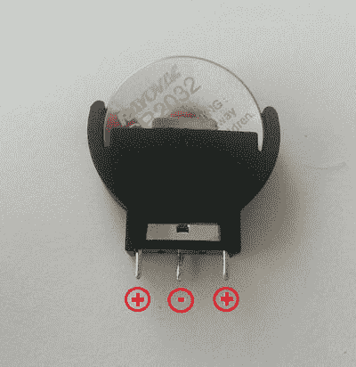
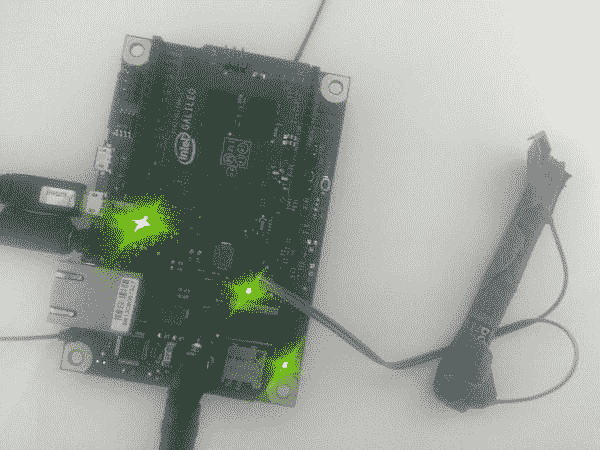
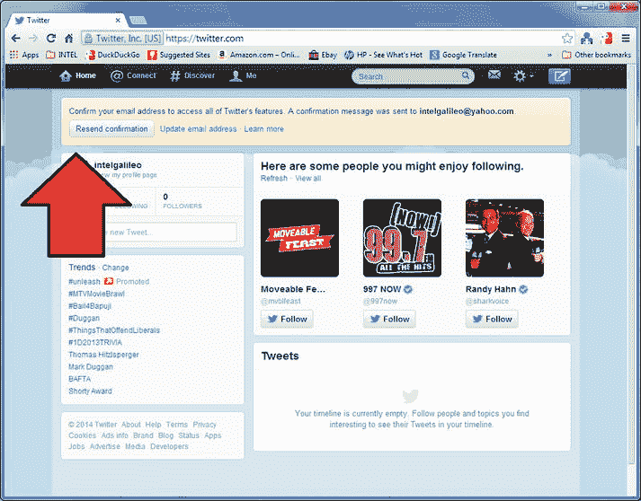
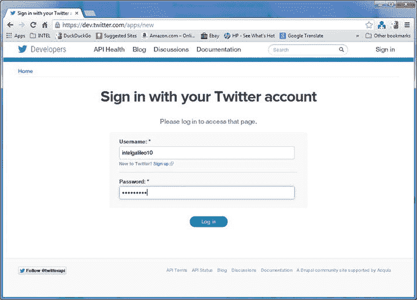
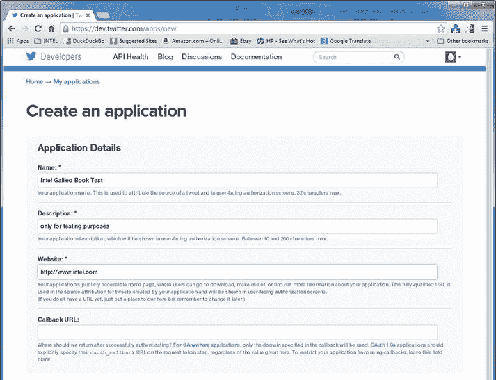
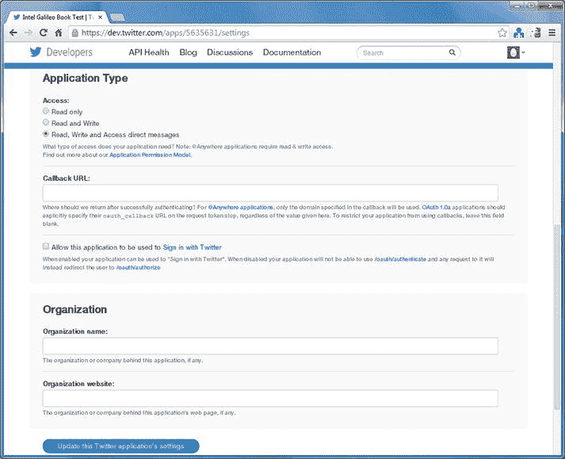
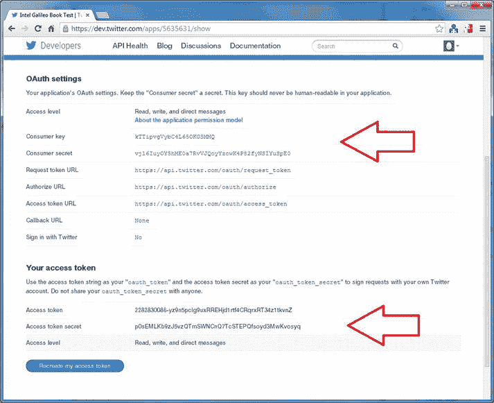
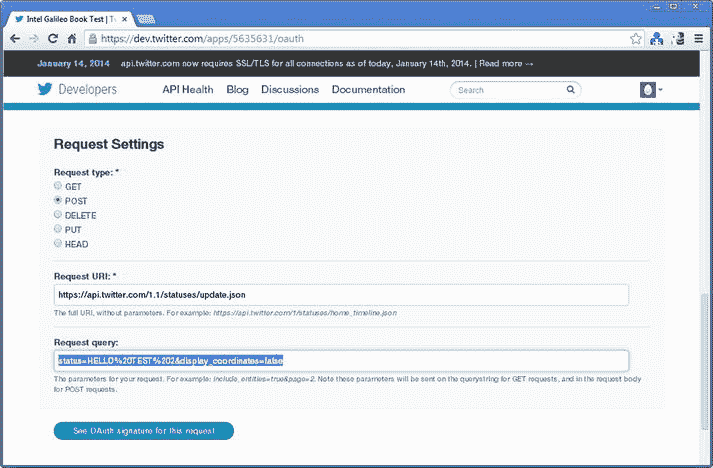
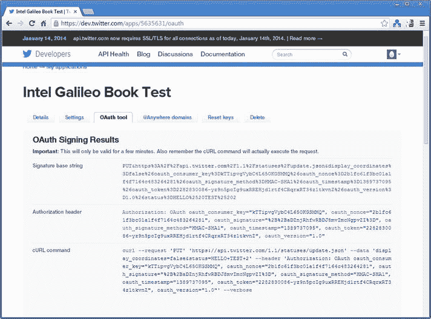

# 六、使用 REST API 1.1 发布推文

本章解释了直接从英特尔 Galileo 主板使用带有 REST API 1.1 和`OAuth`认证的 Twitter 发布消息的过程，从而使您能够避免中间网络服务。本章还解释了如何将 Linux 脚本与 sketch 集成，使用 Linux 在 Twitter 上发布的优势，包括涉及的命令和需要的硬件。它还解释了为什么英特尔 Galileo IDE 1.5.3 提供的示例不适用于 Arduino 主板。

项目详细信息

如果你试图使用 IDE 1.5.3 提供的`Examples->Ethernet->TwitterClient`中的代码在 Twitter 上发帖，你可能会感到沮丧。这些例子不适用于英特尔 Galileo 或任何兼容 Arduino APIs 的主板。

失败的主要原因与新的 REST API 1.1 有关。Twitter 现在需要一种新的认证方法，消息也有了新的格式。基于 API 1.0 的旧函数不再工作，这意味着世界上成千上万的应用程序，包括 Arduino IDE 中的例子，也不再工作。

认证是基于`OAuth`的，所以这个过程涉及到处理`sha1`算法。有密码和令牌码，以 base64 编码，这是强制字符串操作的 API 所需的特殊格式。该委员会必须能够提供时间戳根据当前的现实世界的时间，这是独立的时区或夏令时。

一些开发人员创建了连接 Arduino 板和 Twitter 服务器的 web 服务。这些 web 服务计算`sha1`、编码和所有的字符串操作，但是要求开发人员将服务托管在某个服务器上，并且有一个可用的公共 IP。这种复杂性增加了项目的成本，并可能影响其性能和稳定性。

这里的想法是探索 Linux 操作系统提供的能力，并与 sketches 集成，从而避免大量的代码。这将使项目高效而简单。

Linux shell 脚本:

*   计算`sha1`(基于 160 位哈希值的安全哈希算法)并使用`openssl`编码到不同的基数。
*   使用`sed`和其他工具操纵琴弦。
*   使用适当的授权、标题发布消息，并使用`curl`发布消息。

在草图中，代码将与脚本进行交互。它将显示，在几行，它能够张贴到一个 Twitter 帐户。

使用英特尔 Galileo 提供的 Linux 功能，通过几行代码和脚本，您将能够与 Twitter 服务器进行通信。因此，您可以避免大量的代码，并且没有许可问题、大量的代码开发和调试。

然而，你必须能够创建一个 Twitter 帐户，获得秘密代码和令牌，了解软件如何工作，并了解硬件要求，使这个项目的功能。

这一章描述了如何制作帖子，但是如果你理解了这个软件是如何创建的以及 Twitter APIs 的概念，你可以修改这个软件来适应你的项目的最佳 API。

材料表

虽然您可以使用板上已有的以太网接口完成本项目中的所有工作，但建议您将硬币电池插入板中，以保持硬件时钟(这将在本章稍后详细解释)。

您可以使用以太网、WiFi、调制解调器或任何其他类型的接口来连接互联网。所涉及的代码和脚本不需要任何特殊类型的客户机。本项目使用[表 6-1](#Tab1) 中列出的 WiFi。

[表 6-1](#_Tab1) 。可选材料

| 

量

 | 

成分

 |
| --- | --- |
| one | 英特尔迅驰无线-N 135 |
| Two | 双频带天线 350 毫米电缆 2118060-1 TE 连接 |
| oneoneTwo | 3V 硬币电池硬币电池盒电线跳线 10 厘米长 1/4w 母-公 |

系统和硬件时钟

也许你想知道为什么我要讨论系统和硬件时钟，如果你所要做的只是简单地在 Twitter 上发布消息？计算字符串基数并获得在 Twitter 上发布的授权的关键要素之一是时间戳。

这个时间戳必须与世界上其他地方同步，换句话说，你的板上必须有一个有效的和实际的时间和日期。如果您一登录就在终端 shell 中键入`date`,您将看到如下内容:

```sh
clanton login: root
root@clanton:~# date
Mon Jan  1 00:19:31 UTC 2001
```

该日期代表由内核软件维护的 UTC 系统时间。要检查硬件时钟，使用`hwclock`命令:

```sh
root@clanton:~# hwclock
Mon Jan  1 00:19:56 2001  0.000000 seconds
```

如果您试图获取基于这些日期之一的时间戳，Twitter 将不会授权，因为它们与实际时间不同步。

根据 busybox 帮助手册，有几种方法可以确定日期和时间:

```sh
*date*
*date [OPTIONS] [+FMT] [TIME]*
*Display time (using +FMT), or set time*
*Options:*
        *[-s] TIME       Set time to TIME*
        *-u              Work in UTC (don't convert to local time)*
        *-R              Output RFC-822 compliant date string*
        *-I[SPEC]        Output ISO-8601 compliant date string*
                        *SPEC='date' (default) for date only,*
                        *'hours', 'minutes', or 'seconds' for date and*
                        *time to the indicated precision*
        *-r FILE         Display last modification time of FILE*
        *-d TIME         Display TIME, not 'now'*
        *-D FMT          Use FMT for -d TIME conversion*
*Recognized TIME formats:*
        *hh:mm[:ss]*
        *[YYYY.]MM.DD-hh:mm[:ss]*
        *YYYY-MM-DD hh:mm[:ss]*
        *[[[[[YY]YY]MM]DD]hh]mm[.ss]*
```

这里没有记录的一种格式是`MMDDhhmmYYYY`。使用您喜欢的格式更改日期和时钟。以下命令使用`YYYY-MM-DD hh:mm[:ss]`:

```sh

root@clanton:~# date 2014.01.08-11:14:20
Wed Jan  8 11:14:20 UTC 2014
```

要同步硬件时钟，可以使用以下命令:

```sh
root@clanton:~# hwclock -w
```

再次检查硬件和系统时钟:

```sh
root@clanton:~# hwclock
Wed Jan  8 11:19:38 2014  0.000000 seconds
root@clanton:~# date
Wed Jan  8 11:19:42 UTC 2014
```

更新时钟可能无关紧要，因为如果您决定不使用连接到英特尔 Galileo 上的`BATT`引脚的硬币电池，并且如果您的系统重新启动，时钟将被重置，您将再次获得错误的日期和时钟(世界协调时 2001 年 1 月 1 日)。这将导致一个错误，如果你的草图再次尝试发布消息时，他们重新启动。

有几个因素可能会迫使您重新启动系统，例如，如果您的主板没有正常冷却，温度会很高，固件不稳定，安装了一些新的驱动程序或本机应用程序，等等。因此，如果您想运行几个小时，建议您在项目中包含硬币电池。

如果您有兴趣在您的系统中添加硬币电池，请阅读下一节。否则，请跳到本章后面的“使用 1.5V 电池的解决方法”一节。

组装硬币电池

将跳线的两个母接头连接到 Intel Galileo 板上的`BATT`端子，如图[图 6-1](#Fig1) 所示。


[图 6-1](#_Fig1) 。电池端子位置

然后根据您的机箱提供的极性将跨接电缆的另一端焊接到电池座端子上，如[图 6-2](#Fig2) 所示。剥去电线末端，然后直接焊接到电池外壳的端子上。



[图 6-2](#_Fig2) 。硬币电池 2032 外壳和极性

请注意，有不同的纽扣电池外壳，端子的极性因型号而异。将硬币电池插入外壳，并在焊接电线之前使用电压表检查极性是否正确。

将电池放入机箱中，并将机箱正确连接到`BATT`端子，即使系统重新启动，英特尔 Galileo 也能够保留日期和时间。

使用 1.5V 电池的解决方法

如果您想测试您的项目并在启动后保留硬件时钟，但您没有硬币电池，可以使用两个串联的 AA 或 AAA 电池作为简单的解决方法。这些电池与您在电视遥控器中找到的电池相同。请记住，这是一个临时且肮脏的解决方法。[表 6-2](#Tab2) 列出了你需要的材料。

[表 6-2](#_Tab2) 。临时电池工作区的材料

<colgroup><col width="25%"> <col width="75%"></colgroup> 
| 

量

 | 

成分

 |
| --- | --- |
| Two | AA 或 AAA 1.5 电池 |
| one | 磁带 |
| oneoneTwo | 钢丝钳或等同物，用于剥除电线伏特计电线跳线 10 厘米长 1/4w 母-公 |

将两节 1.5 号电池串联起来，用胶带粘住，用力将一节电池压在另一节电池上。使用电压表，确保电池端子电压为 3V。

然后将两根跳线(母接头)连接到`BATT`端子，如图 [*6-1*](#Fig1) 所示。

你应该有一个很丑但是暂时可以用的东西，如图 [*6-3*](#Fig3) 。



[图 6-3](#_Fig3) 。保持硬件时钟的临时解决方法

创建 Twitter 应用程序帐户

新的 Twitter API 需要一些元素，比如密码和令牌。当您创建应用程序帐户时，会自动生成这些元素。在接下来的两节中，您将看到如何做到这一点。

接下来的步骤描述了如何创建你的账户，以及如何避免在撰写本章时 Twitter 服务器中存在的潜在错误。

第一步:创建你的 Twitter 账户

你首先需要的是一封电子邮件。您可以使用您偏好的提供商创建电子邮件帐户，包括 Gmail、Yahoo 或任何其他提供商。

如果你已经有了一个 Twitter 账户，并且你想在你的测试中使用它，你可以跳到第二步。

否则，访问`https://twitter.com/signup`链接(参见[图 6-4](#Fig4) )。


[图 6-4](#_Fig4) 。创建 Twitter 账户

 **提示**这一步看起来很简单，但是你需要知道一个非常重要的提示。创建 Twitter 帐户后，您将能够登录并正常使用 Twitter。但是，同时您会收到一封确认电子邮件。如果您不确认，在下一步中，Twitter 应用程序将会失败。

你可能会感到失落，因为事实上你有一个 Twitter 账户，但你收到了一个警告，说它无效。一旦你创建了你的 Twitter 账户，检查你的邮箱并确认它。如果您没有收到确认邮件，您可以在登录后立即点击屏幕顶部的重新发送确认按钮，如图 6-5 中的箭头所示。



[图 6-5](#_Fig5) 。登录后的重新发送确认按钮

下一步是创建您的 Twitter 应用程序。

步骤 2:创建 Twitter 应用程序

从这个应用程序中，您将收到合并 C++代码所需的密码和认证令牌。

访问`https://dev.twitter.com/apps/new`链接并使用您确认的 Twitter 账户登录(参见[图 6-6](#Fig6) )。



[图 6-6](#_Fig6) 。登录创建 Twitter 应用

下一个屏幕将要求一些与您的应用程序相关的数据。必填项之一是网站，如图[图 6-7](#Fig7) 所示。因为你不会用，随便加什么网站，像`http://www.intel.com` *。*



[图 6-7](#_Fig7) 。在 Twitter 上创建应用程序

填写完所有必需的数据后，您将能够看到一个屏幕，显示您输入的数据。该屏幕还包括`OAuth`设置数据，如消费者密码字符串和 URL 令牌访问。参见[图 6-8](#Fig8) 。


[图 6-8](#_Fig8) 。Twitter 应用程序详细信息页面

在这个页面的底部有一个名为 Create My Access Token 的按钮。您将需要访问令牌以使软件工作；但是，*不要*点击这个按钮！您仍然需要更改访问级别。

在同一页面上检查`the` OAuth 设置中的访问级别。最初，它是`Read-Only`,但是考虑到您将在 Twitter 上发布消息，您需要更改这个访问级别以支持写操作。

截至 2014 年 1 月，Twitter 有一个 bug，当您通过单击“创建我的访问令牌”按钮创建令牌时，该 bug 就会启动。如果您创建具有只读访问权限的令牌，即使您将访问权限更改为读/写访问权限并重置令牌，您的令牌仍将具有只读访问权限。

我花了几个小时才弄明白为什么`GET`操作可以工作，而`POST`操作却不行，即使有了适当的访问级别和新的访问令牌。

一旦进入图 6-9 所示的 Twitter 应用程序详细信息页面，点击设置选项卡并选择读取、写入和访问直接消息或读取和写入选项。



[图 6-9](#_Fig9) 。改变推特访问级别

您可以选择“读写”或“读写和访问直接消息”。然后点击页面底部的更新这个 Twitter 应用程序的设置按钮。

再次单击详细信息选项卡，等待几秒钟。然后按 F5 重新加载页面。您将看到访问级别已正确更改，您可以单击“创建我的访问令牌”按钮。

等待几秒钟，然后再次按 F5 键。您将能够看到您的访问令牌、秘密令牌、消费者密钥和秘密消费者密钥，如[图 6-10](#Fig10) 所示。



[图 6-10](#_Fig10) 。令牌和消费者密钥已经创建

创建一个在 Twitter 上发布消息的脚本

一旦您创建了 Twitter 帐户和应用程序的令牌，您就可以开始创建您的软件了。本章中的方法被用来在 Twitter 上`POST`消息，但是如果你理解这个过程，你可以创建一个不同的消息。这意味着您可以创建一个方法来获取数据，创建其他类型的`POST`方法，以及 Twitter API 提供的任何其他函数。

步骤 1:识别 API

首先，你必须确定`POST` API 的结构。为此，请按照下列步骤操作:

1.  打开开发人员控制台并访问`https://dev.twitter.com/console`。
2.  对于服务**，**选择`https://api.twitter.com/1.1` `.`
3.  对于认证**，**选择`OAuth1`。当您选择此选项时，Twitter 控制台会询问您是否授权控制台访问您的应用程序。只需点击使用 Twitter 登录选项即可接受。您的帐户将在认证字段中弹出。
4.  对于选择 API 方法选项，选择 API `Tweet -> POST -> /statuses/update.json`。这是本章中使用的方法。它允许你向你的 Twitter 账户发布消息。
5.  In the Status field, you can write a message if you want.

    如果一切设置正确，[图 6-11](#Fig11) 显示了您应该在浏览器中看到的内容。

    

    [图 6-11](#_Fig11) 。使用开发者控制台来`POST`消息

6.  Click the Send button and you should have your status posted in your Twitter page. You should see the server response `HTTP/1.1 200 OK`. See [Figure 6-12](#Fig12).

    

    [图 6-12](#_Fig12) 。`POST`成功响应

7.  After you send your post, copy the string generated in your `POST` to the clipboard. For example:

    `https://api.twitter.com/1.1/statuses/update.json?status=HELLO%20THERE%20MY%20FIRST%20POST&display_coordinates=false`

步骤 2:用 OAuth 工具生成 OAuth 签名

再次访问您的 Twitter 应用程序，如[图 6-8](#Fig8) 所示。您将看到一个名为 OAuth Tool 的选项卡。

该选项卡上有一个名为“请求设置”的部分。基于前面捕获的字符串，您应该能够正确地填充这些字段。

假设您捕获的字符串如下:

`https://api.twitter.com/1.1/statuses/update.json?status=HELLO%20THERE%20MY%20FIRST%20POST&display_coordinates=false`

您需要设置以下设置:

1.  对于请求类型，选择`POST`。
2.  For the request URL, you need to split the string you captured and include it only until the name API. For example, based on the string captured in this chapter, the Request URL field is:

    `https://api.twitter.com/1.1/statuses/update.json`

3.  For the API, copy the rest of string after `&` and post it in this field. For example, in this example the request query is:

    ```sh
    status=HELLO%20THERE%20MY%20FIRST%20POST&display_coordinates=false
    ```

    [图 6-13](#Fig13) 图示了上述步骤。

    

    [图 6-13](#_Fig13) 。输入数据会话

4.  单击查看此请求的 OAuth 签名按钮。

如果一切正常，您将能够在同一个选项卡中看到 OAuth 签名结果。签名基本字符串和授权头等数据有助于您编写脚本，并通知`curl`命令使用终端进行测试。[图 6-14](#Fig14) 显示 OAuth 签名供参考。



[图 6-14](#_Fig14) 。OAuth 签约结果

确保生成了一个`curl`命令。如果您使用的是 Linux 或 Mac，或者您的 Windows 带有 Cygwin 终端，请尝试将这个`curl`命令复制并粘贴到终端 shell 中。如果你得到了`HTTP 200OK`的回复，你就可以用这个命令发微博了。

```sh
mcramon@ubuntu:~$ curl --request 'POST' 'https://api.twitter.com/1.1/statuses/update.json' --data 'display_coordinates=false&status=%22HELLO+TEST+2%22' --header 'Authorization: OAuth oauth_consumer_key="kTTipvgVybC4L65OKGSMMQ", oauth_nonce="690331247b06d8c8de6b39be9b415580", oauth_signature="XBBsrxFJq%2Bzx67RyOZn9NibKHdU%3D", oauth_signature_method="HMAC-SHA1", oauth_timestamp="1390173936", oauth_token="2282830086-yz9n5pcIg9uxRREHjd1rtf4CRqrxRT34z1tkvnZ", oauth_version="1.0"' --verbose
* About to connect() to api.twitter.com port 443 (#0)
*   Trying 199.59.148.20... connected
* Connected to api.twitter.com (199.59.148.20) port 443 (#0)
* successfully set certificate verify locations:
*   CAfile: none
  CApath: /etc/ssl/certs
* SSLv3, TLS handshake, Client hello (1):
* SSLv3, TLS handshake, Server hello (2):
* SSLv3, TLS handshake, CERT (11):
* SSLv3, TLS handshake, Server finished (14):
* SSLv3, TLS handshake, Client key exchange (16):
* SSLv3, TLS change cipher, Client hello (1):
* SSLv3, TLS handshake, Finished (20):
* SSLv3, TLS change cipher, Client hello (1):
* SSLv3, TLS handshake, Finished (20):
* SSL connection using RC4-SHA
* Server certificate:
*        subject: C=US; ST=California; L=San Francisco; O=Twitter, Inc.; OU=Twitter Security; CN=api.twitter.com
*        start date: 2013-10-10 00:00:00 GMT
*        expire date: 2014-10-10 23:59:59 GMT
*        subjectAltName: api.twitter.com matched
*        issuer: C=US; O=VeriSign, Inc.; OU=VeriSign Trust Network; OU=Terms of use at https://www.verisign.com/rpa (c)10; CN=VeriSign Class 3 Secure Server CA - G3
*        SSL certificate verify ok.
> POST /1.1/statuses/update.json HTTP/1.1
> User-Agent: curl/7.19.7 (i486-pc-Linux-gnu) libcurl/7.19.7 OpenSSL/0.9.8k zlib/1.2.3.3 libidn/1.15
> Host: api.twitter.com
> Accept: */*
> Authorization: OAuth oauth_consumer_key="kTTipvgVybC4L65OKGSMMQ", oauth_nonce="690331247b06d8c8de6b39be9b415580", oauth_signature="XBBsrxFJq%2Bzx67RyOZn9NibKHdU%3D", oauth_signature_method="HMAC-SHA1", oauth_timestamp="1390173936", oauth_token="2282830086-yz9n5pcIg9uxRREHjd1rtf4CRqrxRT34z1tkvnZ", oauth_version="1.0"
> Content-Length: 51
> Content-Type: application/x-www-form-urlencoded
>
< HTTP/1.1 200 OK
< cache-control: no-cache, no-store, must-revalidate, pre-check=0, post-check=0
< content-length: 1866
< content-type: application/json;charset=utf-8
< date: Sun, 19 Jan 2014 23:26:57 GMT
< expires: Tue, 31 Mar 1981 05:00:00 GMT
< last-modified: Sun, 19 Jan 2014 23:26:57 GMT
< pragma: no-cache
< server: tfe
< set-cookie: lang=en
< set-cookie: guest_id=v1%3A139017401726629941; Domain=.twitter.com; Path=/; Expires=Tue, 19-Jan-2016 23:26:57 UTC
< status: 200 OK
< strict-transport-security: max-age=631138519
< x-access-level: read-write-directmessages
< x-frame-options: SAMEORIGIN
< x-transaction: 093eea24eede2302
< x-xss-protection: 1; mode=block
<
{"created_at":"Sun Jan 19 23:26:57 +0000 2014","id":425046751838355456,"id_str":"425046751838355456","text":"\"HELLO TEST 2\"","source":"\u003ca href=\"http:\/\/www.intel.com\" rel=\"nofollow\"\u003eIntel Galileo Book Test\u003c\/a\u003e","truncated":false,"in_reply_to_status_id":null,"in_reply_to_status_id_str":null,"in_reply_to_user_id":null,"in_reply_to_user_id_str":null,"in_reply_to_screen_name":null,"user":{"id":2282830086,"id_str":"2282830086","name":"intelgalileo","screen_name":"intelgalileo10","location":"","description":"","url":null,"entities":{"description":{"urls":[]}},"protected":false,"followers_count":0,"friends_count":0,"listed_count":0,"created_at":"Thu Jan 09 01:05:45 +0000 2014","favourites_count":0,"utc_offset":null,"time_zone":null,"geo_enabled":false,"verified":false,"statuses_count":2,"lang":"en","contributors_enabled":false,"is_translator":false,"profile_background_color":"C0DEED","profile_background_image_url":"http:\/\/abs.twimg.com\/images\/themes\/theme1\/bg.png","profile_backgroun* Connection #0 to host api.twitter.com left intact
* Closing connection #0
* SSLv3, TLS alert, Client hello (1):
d_image_url_https":"https:\/\/abs.twimg.com\/images\/themes\/theme1\/bg.png","profile_background_tile":false,"profile_image_url":"http:\/\/abs.twimg.com\/sticky\/default_profile_images\/default_profile_5_normal.png","profile_image_url_https":"https:\/\/abs.twimg.com\/sticky\/default_profile_images\/default_profile_5_normal.png","profile_link_color":"0084B4","profile_sidebar_border_color":"C0DEED","profile_sidebar_fill_color":"DDEEF6","profile_text_color":"333333","profile_use_background_image":true,"default_profile":true,"default_profile_image":true,"following":false,"follow_request_sent":false,"notifications":false},"geo":null,"coordinates":null,"place":null,"contributors":null,"retweet_count":0,"favorite_count":0,"entities":{"hashtags":[],"symbols":[],"urls":[],"user_mentions":[]},"favorited":false,"retweeted":false,"lang":"en"}mcramon@ubuntu:~$
```

您可能会想，您应该使用您的 Intel Galileo 终端外壳来做同样的事情。如果您使用桌面终端发布了`curl`命令，请务必更改文本消息。否则，Twitter 可能会以`"duplicate status"`回应。

您将看到以下错误:

```sh
* About to connect() to api.twitter.com port 443 (#0)
*   Trying 199.59.149.199...
* Connected to api.twitter.com (199.59.149.199) port 443 (#0)
* error reading ca cert file /etc/ssl/certs/ca-certificates.crt (Error while reading file.)
* Closing connection 0
curl: (77) Problem with the SSL CA cert (path? access rights?)
```

您的英特尔 Galileo 上没有安装 CA 认证。Twitter 要求您的代码信任 VeriSign 提供的 G2 和 G3 根证书。更多信息，请查看`https://dev.twitter.com/docs/security/using-ssl`。

要遵循所有程序将证书放入您的英特尔 Galileo 主板，您必须在由`OAuth`工具生成的`curl`命令中包含`-k`选项。这使得`curl`命令处理不安全的 SSL 连接，从而允许您执行`curl`并避免任何证书。

在您安装证书或在`curl`命令中使用`-k`之后，您将能够直接从您的英特尔 Galileo 终端外壳发出 tweet。

步骤 3:使用英特尔 Galileo 创建一个在 Twitter 上发布的脚本

如果您阅读[图 6-14](#Fig14) 所示的`OAuth`签名结果计算后提供的“重要”信息，您会看到下面的短语:`"This is only valid for few minutes..."`。

这意味着该工具生成的`curl`命令不会无限期地工作，因为它们是基于所提供的时间戳的。几分钟后，Twitter 服务器将考虑用`"time out of bounds"`生成的命令。这与英特尔 Galileo 使用错误的时间和日期时显示的错误信息相同。

因此，在运行脚本之前，请确保您已经正确设置了英特尔 Galileo 主板的日期和时间，如“系统和硬件时钟”一节中所述。

一旦你有了一个 Twitter 账户和应用程序的令牌，你就可以开始创建你的软件了。本章中使用的方法在 Twitter 上发布消息，但是如果您理解这个过程，您可以创建不同的方法。

序列中出现的每一步看起来都有点“黑客”，但它们是有效的，是在阅读了`https://dev.twitter.com/docs`上的文档并参与了一些 Twitter 讨论后开发的。

为了理解细节，看一下清单 6-1 中的[。](#list1)

[***清单 6-1***](#_list1) 。twitter.sh

```sh
#!/bin/bash
#
# POST MESSAGES ON TWITTER
#
# part of this code was based in the discussion:
# https://dev.twitter.com/discussions/14460, info provided by
# https://dev.twitter.com/docs and small hacking observing
# the OAuth Signing Results provied by OAuth tool.
#

debug=1 # set 1 to debug messages

internet_ok=0
# checking for all internet connection except the loopback (lo)
for interface in $(ls /sys/class/net/ | grep -vi lo);
do
  #if there is any, the carrier must be "1"
  if [[ $(cat /sys/class/net/$interface/carrier 2>/dev/null) = 1 ]]; then
      internet_ok=1;
      break;
  fi
done

if [ $internet_ok = 0 ]; then
      echo "ERROR: No internet connection"
      exit 1
fi

consumer_key=$1
consumer_secret=$2
oauth_token=$3
oauth_secret=$4

message=$(echo -n $5|sed -e "s: :+:g"| sed -e s':!:%21:g')
message_special_space_cases=$(echo -n $5|sed -e "s: :%2520:g"|sed -e "s:!:%2521:g")

#nonce evaluation
timestamp=`date +%s`
nonce=`date +%s%T555555555 | openssl base64 | sed -e s'/[+=/]//g'`

#POST regular format
signature_base_string="POST&https%3A%2F%2Fapi.twitter.com%2F1.1%2Fstatuses%2Fupdate.json&display_coordinates%3Dfalse%26oauth_consumer_key%3D${consumer_key}%26oauth_nonce%3D${nonce}%26oauth_signature_method%3DHMAC-SHA1%26oauth_timestamp%3D${timestamp}%26oauth_token%3D${oauth_token}%26oauth_version%3D1.0%26status%3D${message_special_space_cases}"

#only add both
signature_key="${consumer_secret}&${oauth_secret}"

#oauth_signature
oauth_signature=`echo -n ${signature_base_string} | openssl dgst -sha1 -binary -hmac ${signature_key} | openssl base64 | sed -e s':+:%2B:' -e s':\/:%2F:' -e s':=:%3D:'`

#the message header
header="Authorization: OAuth oauth_consumer_key=\"${consumer_key}\", oauth_nonce=\"${nonce}\", oauth_signature=\"${oauth_signature}\", oauth_signature_method=\"HMAC-SHA1\", oauth_timestamp=\"${timestamp}\", oauth_token=\"${oauth_token}\", oauth_version=\"1.0\""

if [ $debug = 1 ] ; then

  echo -e "\nmessage:"$message
  echo -e "\nmessage spaces:"$message_special_space_cases
  echo -e "\nonce:"$nonce
  echo -e "\nsignature_base_string:"$signature_base_string
  echo -e "\noauth_signature:"$oauth_signature

fi

curl --request "POST" "https://api.twitter.com/1.1/statuses/update.json" --data "display_coordinates=false&status=${message}" --header "${header}" -k
```

脚本的第一部分检查是否有可用的互联网连接。本章使用的是 WiFi `mPCIe`模块，但系统可以使用任何其他接口，如以太网。

因此，无论使用何种接口，都有必要检查是否存在互联网连接。下面的`bash`代码片段负责这项任务:

```sh
internet_ok=0
# checking for all internet connection except the loopback (lo)
for interface in $(ls /sys/class/net/ | grep -vi lo);
do
  #if there is any, the carrier must be "1"
  if [[ $(cat /sys/class/net/$interface/carrier 2>/dev/null) = 1 ]]; then
      internet_ok=1;
      break;
  fi
done

if [ $internet_ok = 0 ]; then
      echo "ERROR: No internet connection"
      exit 1
fi
```

所以基本上，这段代码搜索所有的接口驱动程序，看是否至少有一个接口有可用的连接(它检查载体文件中的数字`1`)。注意不考虑环回接口`lo`。因为它是 127.0.0.1 地址的唯一环回接口，所以被`grep -vi lo`从搜索中排除。

根据使用的内核版本，当使用`cat`命令检查载体文件时，如果接口关闭，可能会返回类似`cat: read error: Invalid argument`的错误。为了使代码在不同的 Linux 内核版本和补丁中可重用，如果接口关闭并且`cat`在读取期间返回错误，`stdout`将该错误重定向到空设备(`/dev/null`)。

下一部分根据 Twitter 服务器格式化时间戳，评估`nonce`，更改文本消息中的一些特定字符，组装签名库和签名密钥，组装头，最后将请求发送到 Twitter 服务器。

消费者密钥、消费者秘密、`OAuth`令牌和`OAuth`秘密代码作为参数传递给脚本:

```sh
consumer_key=$1
consumer_secret=$2
oauth_token=$3
oauth_secret=$4
```

文本消息中使用的某些字符必须转换。签名基本字符串和在`curl`命令中使用的消息接收不同的转换。创建了两个变量来保存它们— `message`和`message_special_space_cases`。

```sh
message=$(echo -n $5|sed -e "s: :+:g"| sed -e s':!:%21:g')
message_special_space_cases=$(echo -n $5|sed -e "s: :%2520:g"|sed -e "s:!:%2521:g")
```

如果你用空格字符发短信，这些字符必须在`curl`命令中被替换为`+`字符，在签名基本字符串中被替换为`%2520`。还必须考虑其他字符。例如，字符`!`必须在`curl`命令中替换为`%21`，在签名基本字符串中替换为`%2521`。字符`:`必须替换为`%3A`和`%253A`。

你可能想知道你从哪里得到这些转换。简单的答案是使用`OAuth`工具！你可以在[图 6-14](#Fig14) 中看到短信中使用的每个字符是如何在签名基本字符串和`curl`命令中被替换的。这个脚本支持字母字符，空格，！、和:，涵盖了用于发送简单文本消息的最常见字符。但是，如果您需要特殊字符，您需要按照说明更改脚本。

要确定字符是如何转换的，使用`OAuth`工具，通过将新字符串与原始文本消息进行比较，观察每个字符是如何被替换的。

时间戳必须是自 00:00:00 1970-01-01 UTC 以来的秒数，为此，使用带有`%s`参数的命令 date。`OAuth nonce`是带有小时、分钟、秒和纳秒的时间戳。然而，在 base64 中，`+`、`=`和`/`字符被从字符串中删除。

```sh
timestamp=`date +%s`
nonce=`date +%s%T555555555 | openssl base64 | sed -e s'/[+=/]//g'`
```

签名基本字符串只是由`OAuth`工具生成的字符串的副本。

接下来就是`signature_key` 的生成。这只是消费者密码与`OAuth`密码的一个结合点。然而，该变量用于使用`sha1`算法生成`OAuth`签名，转换为 base64，并将一些字符如`+`替换为`%2B`、`\`替换为`%2F`、=替换为`%3D`。

```sh
signature_key="${consumer_secret}&${oauth_secret}"

#oauth_signature
oauth_signature=`echo -n ${signature_base_string} | openssl dgst -sha1 -binary -hmac ${signature_key} | openssl base64 | sed -e s':+:%2B:' -e s':\/:%2F:' -e s':=:%3D:'`
```

至此，您已经拥有了组装消息头和组装`curl`命令所需的所有元素。请注意，脚本中使用的`curl`命令删除了名为`--verbose`的选项，并添加了`-k`，因此英特尔 Galileo 不需要安装 CA 证书。

```sh
#the message header
header="Authorization: OAuth oauth_consumer_key=\"${consumer_key}\", oauth_nonce=\"${nonce}\", oauth_signature=\"${oauth_signature}\", oauth_signature_method=\"HMAC-SHA1\", oauth_timestamp=\"${timestamp}\", oauth_token=\"${oauth_token}\", oauth_version=\"1.0\""

curl --request "POST" "https://api.twitter.com/1.1/statuses/update.json" --data "display_coordinates=false&status=${message}" --header "${header}" -k
```

如果您已经在您的板上安装了证书，并且您想要安全地连接到 Twitter，请从脚本中删除`curl`命令的`-k`选项。

第四步:创建一个发微博的草图

最后，您需要创建一个与脚本交互的草图。看一看[清单 6-2](#list2) 。

[***清单 6-2***](#_list2) 。twitter_sketch.ino

```sh
#include <unistd.h>
#include <stdio.h>
#include <stdlib.h>
#include <sys/wait.h>

char cmd_rsp[256];

/* Add your consumer and OAuth string codes here */
String consumer_key="";
String consumer_secret="";
String oauth_token="";
String oauth_secret="";

/* this is the name of the script in the target
   you need to push this script to the target before you run this software */
String script_name = ". /home/root/twitter.sh ";

/* prototype */
boolean post(String message);

void setup() {

  Serial.begin(115200);

  delay(3000);  // just a delay to allow you to see the serial monitor messages
               // you can remove this delay

  String message="TWEETING!!!";
  post(message);

}

void loop() {
  delay(100);
}

boolean post(String message)
{

  boolean result = true;

  String command = script_name;

  command += consumer_key;
  command += " ";

  command += consumer_secret;
  command += " ";

  command += oauth_token;
  command += " ";

  command += oauth_secret;
  command += " ";

  command += "'";
  command += message;
  command += "'";

   // buffer to be used with popen
   char cmd_char[1024];

   // clear message buffer
   memset((void *)cmd_char, sizeof(cmd_char), 0);

   // convert the message to char array
   command.toCharArray(cmd_char, sizeof(cmd_char), 0);

   Serial.println(cmd_char);

   FILE *fpipe;

   if ( !(fpipe = (FILE*)popen((char *)cmd_char,"r")) )
      {  // If fpipe is NULL
      Serial.println("Problems with pipe");
      result = false;

   }
   else
   {

     while ( fgets( cmd_rsp, sizeof(cmd_rsp), fpipe)) {}

     pclose(fpipe);

     // checking for errors
     if ((strstr(cmd_rsp, "{\"errors\":[{\"message\"") != NULL) ||
         (strstr(cmd_rsp, "ERROR: No internet connection") != NULL))
     {
        Serial.println("OPS!!! ERROR!!");
        Serial.println(cmd_rsp);
        result = false;
     }
     else
     {
        Serial.println("POSTED WITH SUCCESS!");
        Serial.println(cmd_rsp);
     }
   }

   return result;
}
```

代码非常简单。您只需要定义您的消费者密钥、消费者秘密、`OAuth`令牌和`OAuth`秘密，如图[图 6-10](#Fig10) 所示，并将它们包含在代码的开头:

```sh
/* Add your consumer and OAuth string codes here */ 
String consumer_key="";
String consumer_secret="";
String oauth_token="";
String oauth_secret="";
```

定义您的短信并调用`post()` 功能。注意，`post()`函数使用`popen()` 调用脚本，T6 负责调用传递消费者、OAuth 字符串代码和文本消息的脚本。它在草图和脚本之间打开了一个*管道*，因此允许您使用`fgets()`来读取`curl`命令字符串响应。

`fact curl`命令返回一个字符串，或者解释为什么当`system()` 函数只返回整数时，不调用`system()`函数。

如果你想看到命令响应是草图执行的命令，你可以打开串行控制台(Ctrl+Shift+M ),因为你在草图中有一些`debug`消息，如图[图 6-15](#Fig15) 所示。


[图 6-15](#_Fig15) 。tweet 后从串行控制台调试消息

改进项目的想法

本章描述了如何在 Twitter 上发布消息，还解释了如何创建您的 Twitter 应用程序并成功地与 Twitter 服务器通信。

接下来的部分解释了如何改进给出的代码，并包含了一些如何将这些代码集成到其他项目中的想法。

花和植物在社交网络上与你交流

一个例子是将本章的代码与第 8 章中使用的代码整合在一起。这个想法是，如果每个传感器对应一种植物，并且传感器检测到植物何时需要水，那么每种植物都可以在推特上发布请求水的信息。

你可以通过搜索`soil_moisture_with_twitter.ino`找到例子。

集成非常简单。有一个名为`should_post_today()`的函数，它使用常规的 C 函数来确定日期是否已经改变。如果日子变了，这意味着如果植物需要水，系统必须为每个传感器发微博。

```sh
boolean should_post_today(int * day) 
{

  boolean mustTweet = false;
  time_t rawtime;
  struct tm *timeinfo;

  time ( &rawtime );
  timeinfo = localtime ( &rawtime );

  if (old_day[current_sensor] == 0) old_day[current_sensor] = timeinfo->tm_mday;

  if (old_day[current_sensor] != timeinfo->tm_mday)
  {
     old_day[current_sensor] = timeinfo->tm_mday;
     mustTweet = true;
  }

  if (day != NULL) *day = timeinfo->tm_mday;

  return mustTweet;
}
```

在`loop()`函数中所需的代码修改也非常简单，正如你在[清单 6-3](#list3) 中看到的。

[***清单 6-3***](#_list3) 。soil _ moisture _ with _ Twitter . ino

```sh
void loop() {

  int day;

  // reading the button state
  checkButtonState();

  if( button_state != lastButtonState)
   {
      // button pressed
      current_sensor++;
      if (current_sensor > 1) current_sensor = 0;
  }

  // reading the sensor
  switch (current_sensor)
  {
      case 0:
          sensor_value = analogRead(ANALOG_MOISTURE_SENSOR_1);

          // first sensor - one LED ON
          digitalWrite(PIN_RIGHT_EYE, HIGH);
          digitalWrite(PIN_LEFT_EYE, LOW);

      break;

      case 1:
          sensor_value = analogRead(ANALOG_MOISTURE_SENSOR_2);

          // second sensor - two LEDs ON
          digitalWrite(PIN_RIGHT_EYE, HIGH);
          digitalWrite(PIN_LEFT_EYE, HIGH);

      break;
  }

  switch (current_sensor)
  {
    case 0: plant_name = "orquidea";
    break;

    case 1: plant_name = "sunflower";
    break;

    default:
        Serial.println("There is an error in your logic!");
    break;

  }

  if (DEBUG)
  {
      Serial.print("current_sensor:");
      Serial.println(current_sensor);

      Serial.print("   sensor_value:");
      Serial.println(sensor_value);
  }

  if (sensor_value >=SOIL_IS_GOOD)
  {
     drawMatrix(array_happy_face);
     if (should_post_today(&day))
     {
        char strDay[2];
        sprintf(strDay, "%d", day);

        message = "This is ";
        message += plant_name;
        message += " I am ok thanks! Day:";
        message += strDay;
        post(message);
     }
  }
  else
  {
     drawMatrix(array_sad_face);
     if (should_post_today(&day))
     {
        char strDay[2];
        sprintf(strDay, "%d", day);

        message = "This is ";
        message += plant_name;
        message += " HEY! I NEED WATER! Day:";
        message += strDay;
        post(message);
     }

  }

}
```

摘要

本章逐步介绍了如何创建 Twitter 应用，以及如何与英特尔 Galileo 集成，以便使用简单的草图发布消息。

它还讨论了 bash 脚本的集成，以及如何使用`popen`指令解析来自 web 的字符串响应，以及如何避免使用简单而糟糕的系统调用指令。您还了解了 RTC(实时时钟)的工作原理，如何设置时间，以及如何将电池硬币连接到您的英特尔 Galileo 主板。